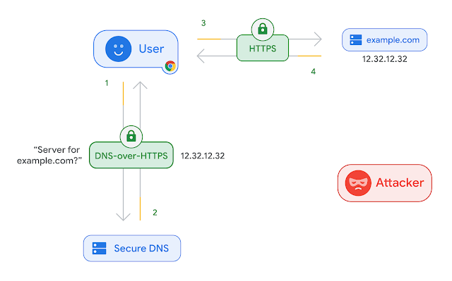
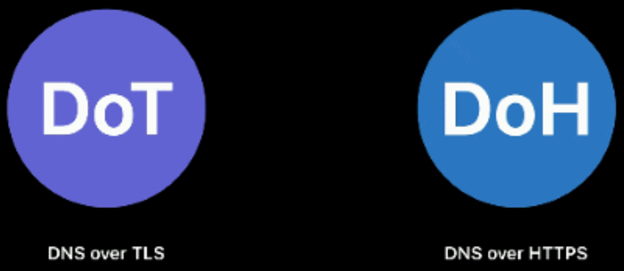
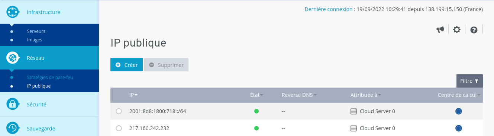
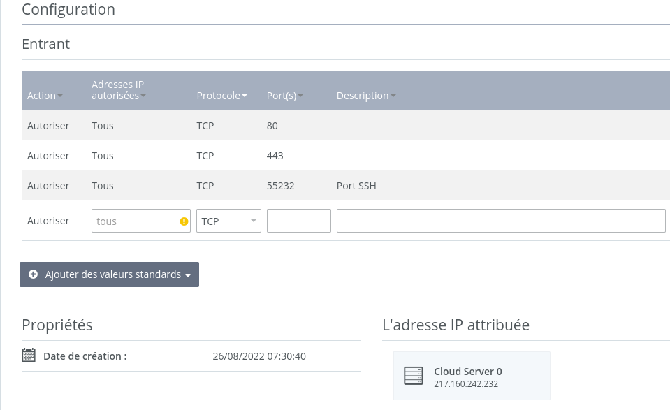
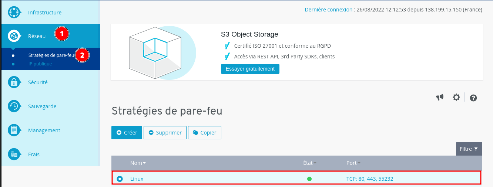
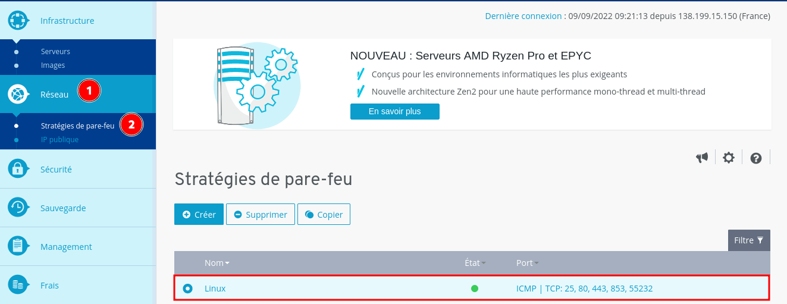
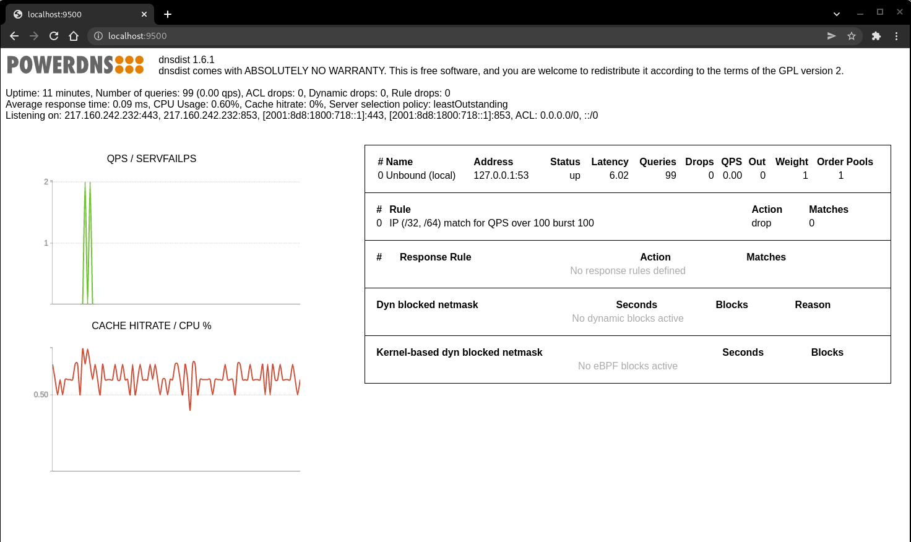
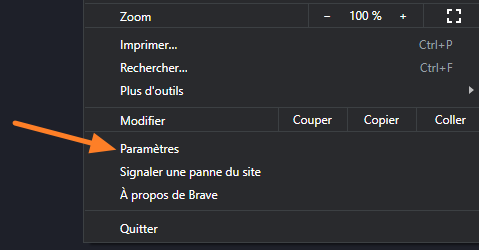
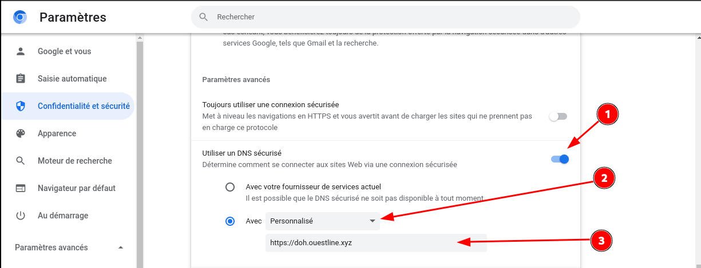
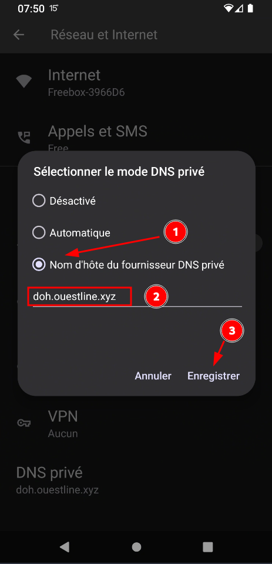

+++
title = 'IONOS VPS S debian 11 - résolveur DNS public sur TLS (DoT) et HTTPS (DoH)'
date = 2022-11-25 00:00:00 +0100
categories = dns
+++
<div class="item">
  <div class="item__image">
    
  </div>
  <div class="item__content">
    <div class="item__header">
      <h4>Le DNS</h4>
    </div>
    <div class="item__description">
      <p>Les requêtes DNS sont envoyées en texte brut, ce qui signifie que tout le monde peut les lire. Le DNS sur HTTPS et le DNS sur TLS chiffrent les requêtes et les réponses du DNS pour que la navigation des utilisateurs reste sécurisée et privée. Cependant, les deux approches ont leurs avantages et leurs inconvénients.</p>
    </div>
  </div>
</div>
<br />
<div class="item">
  <div class="item__image">
    
  </div>
  <div class="item__content">
    <div class="item__header">
      <h4>Le DNS sur HTTPS et le DNS sur TLS</h4>
    </div>
    <div class="item__description">
      <p><u>Le DNS sur TLS et le DNS sur HTTPS</u> sont deux normes développées pour le chiffrement du trafic DNS en texte brut afin d'empêcher les parties malveillantes, les annonceurs, les FAI et autres de pouvoir interpréter les données. Pour poursuivre l'analogie, ces normes visent à enfermer les cartes postales envoyées par courrier dans une enveloppe, pour que quiconque puisse envoyer une carte postale sans craindre les indiscrétions d'un tiers.</p>
    </div>
  </div>
</div>
<br />
<div class="item">
  <div class="item__image">
    
  </div>
  <div class="item__content">
    <div class="item__header">
      <h4>DoH vs DoT</h4>
    </div>
    <div class="item__description">
      <p><Outre DNS sur HTTPS, il existe un autre protocole qui vise également à chiffrer les requêtes DNS. C'est ce qu'on appelle DNS sur TLS (DoT).
        Pour les personnes vivant dans des pays où la censure d'Internet est sévère, il est plus avantageux d'utiliser DoH.
        <ul>
            <li>Le DoT fonctionne sur le port TCP 853 , qui peut être facilement bloqué par un pare-feu national.</li>
            <li>DoH fonctionne sur le port TCP 443 , qui est le port standard pour les sites Web HTTPS, ce qui rend DoH très difficile à bloquer, car si le port TCP 443 est bloqué, alors presque tous les sites Web HTTPS seront également bloqués.</li>
            <li>DoH permet aux applications Web d'accéder aux informations DNS via les API de navigateur existants, de sorte qu'aucun résolveur de stub n'est nécessaire.</li>
        </ul>
        </p>
    </div>
  </div>
</div>


- [IONOS VPS Serveur](#ionos-vps-serveur)
    - [Debian 11](#debian-11)
    - [Hostname](#hostname)
    - [Créer utilisateur](#créer-utilisateur)
    - [OpenSSH, clé et script](#openssh-clé-et-script)
    - [Outils, scripts motd et ssh_rc_bash](#outils-scripts-motd-et-ssh_rc_bash)
    - [Parefeu](#parefeu)
    - [OVH DNS ouestline.xyz](#ovh-dns-ouestlinexyz)
- [Dns DoT DoH](#dns-dot-doh)
    - [Résolveur (Unbound)](#résolveur-unbound)
    - [Frontal DNS (dnsdist)](#frontal-dns-dnsdist)
        - [Prérequis](#prérequis)
        - [Installer la dernière version dnsdist](#installer-la-dernière-version-dnsdist)
        - [Configurer dnsdist](#configurer-dnsdist)
    - [Gestion des certificats SSL (Acme)](#gestion-des-certificats-ssl-acme)
    - [Serveur web intégré (dnsdist)](#serveur-web-intégré-dnsdist)
    - [API de dnsdist](#api-de-dnsdist)
    - [Test résolveur DNS (homer)](#test-résolveur-dns-homer)
    - [Ajout liste de blocage (unbound)](#ajout-liste-de-blocage-unbound)
    - [Utilisation résolveur DoT/DoH](#utilisation-résolveur-dotdoh)
        - [Firefox](#firefox)
        - [Chromium/Brave/Iridium](#chromiumbraveiridium)
        - [Android](#android)
- [Annexe](#annexe)
    - [Correction DNS privé Android](#correction-dns-privé-android)
    - [Vérification du blocage DNS](#vérification-du-blocage-dns)
    - [Notifications par messagerie](#notifications-par-messagerie)
    - [Sauvegarde](#sauvegarde)
        - [Boîte de stockage (OBSOLETE)](#boîte-de-stockage-obsolete)
        - [BorgBackup](#borgbackup)

## IONOS VPS Serveur


<div class="item">
   <div class="item__image">
     <br>
   </div>
  <div class="item__content">
    <div class="item__header">
      <h4>VPS type S</h4>
    </div>
    <div class="item__description">
		<ul>
		  <li>Hostname : nsdyanone</li>
		  <li>512 MB RAM</li>
		  <li>10 GB Storage</li>
		  <li>400 Mbit/s Bandwidth</li>
		  <li>1 x vCPU Core</li>
		  <li>1 x IPv4 Address 217.160.242.232</li>
		  <li>No IPv6 Address</li>
		</ul>
    </div>
  </div>
</div>

Ajouter une adresse IPV6 publique : `2001:8d8:1800:718::1`  


### Debian 11

{:height="80"}

Connexion ssh

    ssh doth@217.160.242.232

**Réseau**

    ip a

```
1: lo: <LOOPBACK,UP,LOWER_UP> mtu 65536 qdisc noqueue state UNKNOWN group default qlen 1000
    link/loopback 00:00:00:00:00:00 brd 00:00:00:00:00:00
    inet 127.0.0.1/8 scope host lo
       valid_lft forever preferred_lft forever
    inet6 ::1/128 scope host 
       valid_lft forever preferred_lft forever
2: ens192: <BROADCAST,MULTICAST,UP,LOWER_UP> mtu 1500 qdisc pfifo_fast state UP group default qlen 1000
    link/ether 00:50:56:01:c9:e6 brd ff:ff:ff:ff:ff:ff
    altname enp11s0
    inet 217.160.242.232/32 brd 217.160.242.232 scope global dynamic ens192
       valid_lft 26679sec preferred_lft 26679sec
    inet6 2001:8d8:1800:718::1/128 scope global 
       valid_lft forever preferred_lft forever
    inet6 fe80::250:56ff:fe01:c9e6/64 scope link 
       valid_lft forever preferred_lft forever
```

**Disques**

    df -h

```
Filesystem             Size  Used Avail Use% Mounted on
udev                   203M     0  203M   0% /dev
tmpfs                   44M  644K   44M   2% /run
/dev/mapper/vg00-lv01  7.4G  1.4G  5.7G  20% /
tmpfs                  220M     0  220M   0% /dev/shm
tmpfs                  5.0M     0  5.0M   0% /run/lock
/dev/sda1              462M   85M  349M  20% /boot
tmpfs                   44M     0   44M   0% /run/user/0
```

**Versions noyau et debian**  

    uname -a && cat /etc/debian_version

Linux localhost 5.10.0-17-amd64 #1 SMP Debian 5.10.136-1 (2022-08-13) x86_64 GNU/Linux  
11.4

Modifier mot de passe sur utilisateur existant "debian"

    passwd debian

Locales : `locales-all installed`

Zone et date Europe/Paris

    dpkg-reconfigure tzdata

```
Current default time zone: 'Europe/Paris'
Local time is now:      Fri Aug 26 08:16:40 CEST 2022.
Universal Time is now:  Fri Aug 26 06:16:40 UTC 2022.
```

Locales

    dpkg-reconfigure locales

```
Generating locales (this might take a while)...
  fr_FR.UTF-8... done
Generation complete.

```

### Hostname

On met le nom du domaine

    hostnamectl set-hostname ouestline.xyz
    hostnamectl status

```
   Static hostname: ouestline.xyz
         Icon name: computer-vm
           Chassis: vm
        Machine ID: 24fcbea78a5643359430d9f0b6721da1
           Boot ID: 2c3791b9ed1945aeaabf5138441327c7
    Virtualization: vmware
  Operating System: Debian GNU/Linux 11 (bullseye)
            Kernel: Linux 5.10.0-17-amd64
      Architecture: x86-64
```


### Créer utilisateur

Création utilisateur "doth" 

    adduser doth # saisir un mot de passe

Autoriser sudo pour utilisateur

    echo "doth     ALL=(ALL) NOPASSWD: ALL" >> /etc/sudoers

Fermer la connexion ssh

### OpenSSH, clé et script

{:height="80"}  
**connexion avec clé**  
<u>sur l'ordinateur de bureau</u>
Générer une paire de clé curve25519-sha256 (ECDH avec Curve25519 et SHA2) nommé **ionos-vps-s** pour une liaison SSH avec le serveur KVM.  

    ssh-keygen -t ed25519 -o -a 100 -f ~/.ssh/ionos-vps-s

Envoyer la clé publique sur le serveur KVM   

    ssh-copy-id -i ~/.ssh/ionos-vps-s.pub doth@217.160.242.232

<u>sur le serveur KVM</u>
On se connecte  

    ssh doth@217.160.242.232

Vérifier le contenu de la clé publique dans `/home/$USER/.ssh/authorized_keys`  

    cat .ssh/authorized_keys

Modifier la configuration serveur SSH pour la prise en charge de la clé  

    sudo nano /etc/ssh/sshd_config  

Modifier

```conf
Port 55232
PermitRootLogin no 
PasswordAuthentication no 
```

Relancer openSSH  

    sudo systemctl restart sshd

Créer une règle parefeu dans le cloudpanel IONOS **Réseau &rarr; Stratégies de pare feu**





Accès depuis le poste distant avec la clé privée  

    ssh -p 55232 -i ~/.ssh/ionos-vps-s doth@217.160.242.232
    ssh -p 55232 -i ~/.ssh/ionos-vps-s doth@2001:8d8:1800:718::1


### Outils, scripts motd et ssh_rc_bash

Installer utilitaires  

    sudo apt install rsync curl tmux jq figlet git dnsutils tree -y


Motd

    sudo rm /etc/motd && sudo nano /etc/motd

```
      ___  ___   _  _   ___   ___  __   __ ___  ___              
     |_ _|/ _ \ | \| | / _ \ / __| \ \ / /| _ \/ __|             
      | || (_) || .` || (_) |\__ \  \ V / |  _/\__ \             
     |___|\___/ |_|\_| \___/ |___/   \_/  |_|  |___/             
                      _    _  _                                  
  ___  _  _  ___  ___| |_ | |(_) _ _   ___    __ __ _  _  ___    
 / _ \| || |/ -_)(_-<|  _|| || || ' \ / -_) _ \ \ /| || ||_ /    
 \___/ \_,_|\___|/__/ \__||_||_||_||_|\___|(_)/_\_\ \_, |/__|    
                                                    |__/         
  ___  _  ____   _   __   __     ___  _ _  ___     ___  ____ ___ 
 |_  )/ ||__  | / | / /  /  \   |_  )| | ||_  )   |_  )|__ /|_  )
  / / | |  / /_ | |/ _ \| () |_  / / |_  _|/ /  _  / /  |_ \ / / 
 /___||_| /_/(_)|_|\___/ \__/(_)/___|  |_|/___|(_)/___||___//___|
                                                                                                                                  
```


### Parefeu

Gestion parefeu dans le cloudpanel IONOS **Réseau &rarr; Stratégies de pare feu**  
Ajouter le port 853 et ICMP (ping) dans la règle existante   


Assurez vous que les ports 853 (DoT), 443 (DoH) et 80 (génération certificats) sont bien ouverts sur votre machine.

Dans le cadre de la mise en place d'un résolveur public, vous possédez un nom
de domaine auquel sont associés les enregistrement `A` et `AAAA` éventuels
correspondant à l'adresse IP sur laquelle sera installé le résolveur DoT/DoH.


La solution technique retenue ici pour le résolveur DoT/DoH est composée d'un
frontal dnsdist qui assure la terminaison des sessions TLS et HTTPS et transmet
les requêtes vers un résolveur DNS unbound installé en local sur la machine.

### OVH DNS ouestline.xyz

Ajouter les adresses IP au gestionnaire du domaine ouestline.xyz

```
$TTL 3600
@	IN SOA dns111.ovh.net. tech.ovh.net. (2022091906 86400 3600 3600000 300)
           IN NS     ns111.ovh.net.
           IN NS     dns111.ovh.net.
           IN MX     10 ouestline.xyz.
           IN A      217.160.242.232
           IN AAAA   2001:8d8:1800:718::1
doh        IN A      217.160.242.232
doh        IN AAAA   2001:8d8:1800:718::1
dot        IN A      217.160.242.232
dot        IN AAAA   2001:8d8:1800:718::1
```

## Dns DoT DoH

DNS over TLS (DoT) et DNS over HTTPS (DoH) sont deux protocoles standardisés
par l'IETF dans les [RFC 7858](https://www.rfc-editor.org/rfc/rfc7858) et
[RFC 8484](https://www.rfc-editor.org/rfc/rfc8484) respectivement. Ces deux
protocoles ont pour but de sécuriser les requêtes DNS entre un client et le
résolveur (encapsulation du protocole DNS
dans une session TLS pour DoT ou HTTPS pour DoH.)

### Résolveur (Unbound)

{:height="80"}  
Commençons par installer et configurer le résolveur DNS. Il existe plusieurs
logiciels pour faire de la résolution comme [BIND 9](https://www.isc.org/bind),
[Knot Resolver](https://www.knot-resolver.cz) ou encore
[Unbound](https://nlnetlabs.nl/projects/unbound/about/). Nous avons choisi
d'utiliser Unbound et cette partie documente comment installer et configuer ce
résolveur.

En règle général Unbound est disponible dans les dépôts des distributions, l'installer depuis le gestionnaire de paquet de votre machine.

```bash
sudo apt install unbound
```

Maintenant que Unbound est installé, il ne reste plus qu'à le **configurer** avant
de démarrer le service.

Il s'agit du résolveur DNS, celui ci n'est accessible que depuis la machine
locale via le port 53.  
Modifier le fichier de configuration par défaut
`/etc/unbound/unbound.conf`  

Sauvegarder la
configuration par défaut :

```bash
sudo cp /etc/unbound/unbound.conf /etc/unbound/unbound.conf.orig
```

Puis modifier le fichier `/etc/unbound/unbound.conf` avec le contenu suivant :

```
server:
    # ne rien enregistrer dans les journaux hormis les erreurs
    verbosity: 0

    # n'écouter que sur l'interface locale en IPv4
    # unbound nécessite d'être relancé si modifié
    interface: 127.0.0.1

    port: 53

    # refuser tout le monde sauf les connexions locales (pas forcément
    # nécessaire vu que le serveur n'écoute que sur la boucle locale en IPv4)
    access-control: 0.0.0.0/0 refuse
    access-control: 127.0.0.1/32 allow

    # par défaut, unbound ne log pas les requêtes ni les réponses
    # on peut le rappeler au cas où
    log-queries: no
    log-replies: no

    # imposer la QNAME minimisation (RFC 7816)
    # Pour mieux protéger la vie privée
    qname-minimisation: yes
    # même si le serveur faisant autorité ne le veut pas
    #   après discussion, il est possible que cette option ne soit
    #   pas recommandée dans le cadre d'un résolveur ouvert
    qname-minimisation-strict: yes
```

Enregistrer le contenu de ce fichier dans `/etc/unbound/unbound.conf` ,
 vérifier la validité du fichier de configuration avec la commande
suivante :

```bash
sudo unbound-checkconf /etc/unbound/unbound.conf
#    unbound-checkconf: no errors in /etc/unbound/unbound.conf
```

Toutes les règles disponibles sont détaillées dans le manuel `man 5
unbound.conf` ou [dans le manuel en
ligne](https://nlnetlabs.nl/documentation/unbound/unbound.conf/).

Démarrer le résolveur.

```bash
sudo systemctl start unbound.service
```

S'assurer que tout fonctionne bien à l'aide de la commande
`dig` disponible dans le paquet `bind9-dnsutils` ou `dnsutils`. Pour cela il
suffit de spécifier l'adresse de notre résolveur, ici `127.0.0.1` ou `::1` et
d'effectuer une requête DNS. Ici on demande à Unbound de récupérer
l'enregistrement `AAAA` associé au nom de domaine `afnic.fr`.

```bash
sudo apt install dnsutils # les outils si non installés
dig @127.0.0.1 AAAA afnic.fr
```

Résultat commande 

```
; <<>> DiG 9.16.27-Debian <<>> @127.0.0.1 AAAA afnic.fr
; (1 server found)
;; global options: +cmd
;; Got answer:
;; ->>HEADER<<- opcode: QUERY, status: NOERROR, id: 63302
;; flags: qr rd ra ad; QUERY: 1, ANSWER: 1, AUTHORITY: 0, ADDITIONAL: 1

;; OPT PSEUDOSECTION:
; EDNS: version: 0, flags:; udp: 1232
;; QUESTION SECTION:
;afnic.fr.			IN	AAAA

;; ANSWER SECTION:
afnic.fr.		600	IN	AAAA	2001:67c:2218:302::51:231

;; Query time: 64 msec
;; SERVER: 127.0.0.1#53(127.0.0.1)
;; WHEN: Fri Aug 26 13:59:21 CEST 2022
;; MSG SIZE  rcvd: 65
```

Une réponse est bien renvoyée. Le résolveur fonctionne.Vérifier que tout est opérationnel en IPv4, et en utilisant UDP et TCP.

```
$ dig +notcp @127.0.0.1 AAAA afnic.fr  # connexion UDP en IPv4 au résolveur
$ dig +tcp @127.0.0.1 AAAA afnic.fr    # connexion TCP en IPv4 au résolveur
```

À ce stade, un résolveur Unbound est configuré en local et écoute sur le port
`53`. Il peut donc être utilisé pour résoudre toutes les requêtes en provenance
de la machine.
{: .prompt-info }


### Frontal DNS (dnsdist)

* [POWERDNS - dnsdist documentation](https://dnsdist.org/index_TOC/)
* [Documentation technique de mon résolveur DoH (bortzmeyer)](https://www.bortzmeyer.org/doh-mon-resolveur/)

#### Prérequis

    sudo apt install gnupg git

Cette section s'attarde sur l'installation et la configuration d'un frontal
DoT/DoH qui transmettra les requêtes DNS à un résolveur local écoutant sur le
port 53 de l'interface local `127.0.0.1` (IPv4).

Ici `dnsdist` se trouve être une très bonne solution pour remplir ce rôle.

#### Installer la dernière version dnsdist

Si vous désiriez utiliser la dernière version de dnsdist,
[PowerDNS](https://www.powerdns.com) qui développpe le logiciel propose et
maintient [ses propres dépôts pour Debian, Raspbian, Ubuntu et
CentOS](https://repo.powerdns.com/).

Ainsi, voici comment installer la dernière version de dnsdist, actuellement
`1.6.0`, tel que défini sur [le site de PowerDNS](https://repo.powerdns.com/)  
Exécuter ce qui suit en mode su

```
# récupération du nom de la distribution et de son ID
# ATTENTION: le fichier /etc/os-release peut être différent selon la distribution
export D_NAME=$(. /etc/os-release; echo ${VERSION_CODENAME})
export D_ID=$(. /etc/os-release; echo ${ID})

# ajout du dépôt aux sources
# Debian / Ubuntu
echo "deb [arch=amd64] http://repo.powerdns.com/${D_ID} ${D_NAME}-dnsdist-16 main" | sudo tee /etc/apt/sources.list.d/pdns.list

# gestion de l'étiquette et de la priorité du nouveau dépôt
sudo tee /etc/apt/preferences.d/dnsdist << EOF
Package: dnsdist*
Pin: origin repo.powerdns.com
Pin-Priority: 600
EOF

# ajout de la clé publique de PowerDNS
curl https://repo.powerdns.com/FD380FBB-pub.asc | sudo apt-key add -

# mise à jour des dépôts
apt update

# installation de dnsdist
apt install dnsdist
```

#### Configurer dnsdist

Deux options de configuration :  IPV4 ou IPV4/IPV6

**Configuration fichier IPV4** `/etc/dnsdist/dnsdist.conf` pour une utilisation avec les certificats qui seront générés par **acme** dans le dossier `/etc/dnsdist` 

```
-- le résolveur DoT/DoH est public, on accepte tout le monde en IPv4
setACL({'0.0.0.0/0'})

-- serveur DNS où transférer les requêtes entrantes
newServer({address='127.0.0.1:53', name='Unbound (local)'})

-- configuration de DoT
-- modifier l'IPv4 en conséquence
addTLSLocal('217.160.242.232:853', '/etc/dnsdist/dns-server.crt', '/etc/dnsdist/dns-server.key', {minTLSVersion='tls1.2'})

-- configuration de DoH
-- modifier l'IPv4 en conséquence
addDOHLocal('217.160.242.232:443', '/etc/dnsdist/dns-server.crt', '/etc/dnsdist/dns-server.key', '/', {minTLSVersion='tls1.2'})

-- limitation du trafic à 100 requêtes par seconde
-- plus d'info en <https://dnsdist.org/advanced/qpslimits/>
addAction(MaxQPSIPRule(100), DropAction())
```

**Configuration fichier IPV4/IPV6** `/etc/dnsdist/dnsdist.conf` pour une utilisation avec les certificats qui seront générés par **acme** dans le dossier `/etc/dnsdist` 

```
-- le résolveur DoT/DoH est public, on accepte tout le monde en IPv4 et IPv6
setACL({'0.0.0.0/0', '[::]/0'})

-- serveur DNS où transférer les requêtes entrantes
newServer({address='127.0.0.1:53', name='Unbound (local)'})

-- configuration de DoT
-- modifier l'IPv4 et l'IPv6 en conséquence
addTLSLocal('217.160.242.232:853', '/etc/dnsdist/dns-server.crt', '/etc/dnsdist/dns-server.key', {minTLSVersion='tls1.2'})
addTLSLocal('[2001:8d8:1800:718::1]:853', '/etc/dnsdist/dns-server.crt', '/etc/dnsdist/dns-server.key', {minTLSVersion='tls1.2'})

-- configuration de DoH
-- modifier l'IPv4 et l'IPv6 en conséquence
addDOHLocal('217.160.242.232:443', '/etc/dnsdist/dns-server.crt', '/etc/dnsdist/dns-server.key', '/', {minTLSVersion='tls1.2'})
addDOHLocal('[2001:8d8:1800:718::1]:443', '/etc/dnsdist/dns-server.crt', '/etc/dnsdist/dns-server.key', '/', {minTLSVersion='tls1.2'})

-- limitation du trafic à 100 requêtes par seconde
-- plus d'info en <https://dnsdist.org/advanced/qpslimits/>
addAction(MaxQPSIPRule(100), DropAction())
```

L'ensemble des options de configuration est détaillé [sur le site de dnsdist](https://dnsdist.org/index/).

Vérifier que le fichier de configuration est valide avec la
commande :

```
dnsdist --check-config
# Configuration '/etc/dnsdist/dnsdist.conf' OK!
```

dnsdist est donc configuré pour écouter sur l'interface publique de la machine
sur les ports 443 (DoH) et 853 (DoT). Toutes les requêtes sont ensuite relayées
à un serveur écoutant le port 53 sur l'interface locale.

Pour l'instant les fichiers `dot-server.crt`, `dot-server.key`,
`doh-server.crt` et `doh-server.key` n'existent pas. Il est nécessaire de les
générer. Cela peut se faire avec `openssl` dans le cas de certificats
auto-signés. Il est aussi possible de passer par une autorité de certification,
ceci est le but de la prochaine partie.

>Remarque: attention aux droits des fichiers du certificat et de la clé, l'utilisateur ou le groupe `dnsdist` (parfois `_dnsdist`, vérifier le contenu du fichier `/etc/group` avec la commande

        grep dnsdist /etc/group

`_dnsdist:x:113:`


Suivant le protocole de création des certificats

**Certboot** : doit avoir les droits en lecture dessus

    sudo chown -R root:_dnsdist /etc/dnsdist 

**Acme** : Les droits en écriture à l'utilisateur sur le dossier `/etc/dnsdist`

    sudo chown $USER -R /etc/dnsdist

### Gestion des certificats SSL (Acme)

{:height="50"}

Afin de pouvoir proposer une connexion sécurisée au résolveur, il est
nécessaire de posséder au moins un certificat par service. On peut générer ses propres certificats auto-signés. Cependant pour
augmenter la confiance dans le service proposé, il est intéressant de s'appuyer
sur un tiers de confiance, l'[autorité de
certification](https://fr.wikipedia.org/wiki/Autorit%C3%A9_de_certification).
Nous allons utiliser [Let's Encrypt](https://letsencrypt.org/) comme autorité
de certification. Let's Encrypt propose par ailleurs un petit utilitaire en
ligne de commande [certbot](https://certbot.eff.org) pour générer et gérer ses
certificats.
La génération d'un certificat via cet utilitaire repose sur un challenge que
doit résoudre la machine.

Installation client acme.sh

```
cd ~
sudo apt install socat -y # prérequis
git clone https://github.com/acmesh-official/acme.sh.git
cd acme.sh
./acme.sh --install 
```

Fermer le terminal, puis le réouvrir et vérifier

    acme.sh -h

Création des certificats

    export OVH_AK="xxxxxxxxxxxxxx"
    export OVH_AS="yyyyyyyyyyyyyyyyyyyyyyyy"

Génération des certificats dans le dossier `/etc/dndist` avec une chaîne préférentielle pour android

    acme.sh --dns dns_ovh --server letsencrypt --issue --keylength ec-384 -d 'doh.ouestline.xyz' -d 'dot.ouestline.xyz' --preferred-chain 'ISRG Root X1' --key-file /etc/dnsdist/dns-server.key --fullchain-file /etc/dnsdist/dns-server.crt

```
[ven. 26 août 2022 14:24:41 CEST] Your cert is in: /home/doth/.acme.sh/doh.ouestline.xyz_ecc/doh.ouestline.xyz.cer
[ven. 26 août 2022 14:24:41 CEST] Your cert key is in: /home/doth/.acme.sh/doh.ouestline.xyz_ecc/doh.ouestline.xyz.key
[ven. 26 août 2022 14:24:41 CEST] The intermediate CA cert is in: /home/doth/.acme.sh/doh.ouestline.xyz_ecc/ca.cer
[ven. 26 août 2022 14:24:41 CEST] And the full chain certs is there: /home/doth/.acme.sh/doh.ouestline.xyz_ecc/fullchain.cer
[ven. 26 août 2022 14:24:41 CEST] Installing key to: /etc/dnsdist/dns-server.key
[ven. 26 août 2022 14:24:41 CEST] Installing full chain to: /etc/dnsdist/dns-server.crt

```

A la première création des certificats

    sudo chmod 644 /etc/dnsdist/dns-*

Relancer manuellement le service dnsdist

    sudo systemctl restart dnsdist

Status

    systemctl status dnsdist

```
● dnsdist.service - DNS Loadbalancer
     Loaded: loaded (/lib/systemd/system/dnsdist.service; enabled; vendor preset: enabled)
     Active: active (running) since Mon 2022-09-19 10:47:13 CEST; 9s ago
       Docs: man:dnsdist(1)
             https://dnsdist.org
    Process: 12419 ExecStartPre=/usr/bin/dnsdist --check-config (code=exited, status=0/SUCCESS)
   Main PID: 12421 (dnsdist)
      Tasks: 24 (limit: 8192)
     Memory: 28.6M
        CPU: 293ms
     CGroup: /system.slice/dnsdist.service
             └─12421 /usr/bin/dnsdist --supervised --disable-syslog

sept. 19 13:11:34 ouestline.xyz dnsdist[12589]: Listening on 217.160.242.232:853 for TLS
sept. 19 13:11:34 ouestline.xyz dnsdist[12589]: Listening on [2001:8d8:1800:718::1]:853 for TLS
sept. 19 13:11:34 ouestline.xyz dnsdist[12589]: Listening on 217.160.242.232:443 for DoH
sept. 19 13:11:34 ouestline.xyz dnsdist[12589]: Listening on [2001:8d8:1800:718::1]:443 for DoH
sept. 19 13:11:34 ouestline.xyz dnsdist[12589]: dnsdist 1.6.1 comes with ABSOLUTELY NO WARRANTY. This is free software, and you are welcome to redistribute it according to the terms of the GPL version 2
sept. 19 13:11:34 ouestline.xyz dnsdist[12589]: ACL allowing queries from: 0.0.0.0/0, ::/0
sept. 19 13:11:34 ouestline.xyz dnsdist[12589]: Console ACL allowing connections from: 127.0.0.0/8, ::1/128
sept. 19 13:11:34 ouestline.xyz dnsdist[12589]: Marking downstream Unbound (local) (127.0.0.1:53) as 'up'
sept. 19 13:11:34 ouestline.xyz systemd[1]: Started DNS Loadbalancer.
sept. 19 13:11:34 ouestline.xyz dnsdist[12589]: Polled security status of version 1.6.1 at startup, no known issues reported: OK
```

**Vérification expiration certificat et mise à jour automatique** dans le dossier `/etc/dndist` + relance service `dnsdist`

Remplacer la tâche utilisateur (prompt `$`) 

    crontab -e # edite tous les jobs de l’utilisateur en cours  

```
18 0 * * * "$HOME/.acme.sh"/acme.sh --cron --home "$HOME/.acme.sh" --renew-hook "$HOME/.acme.sh/acme.sh --ecc --install-cert -d 'doh.ouestline.xyz' -d 'dot.ouestline.xyz' --preferred-chain 'ISRG Root X1' --key-file /etc/dnsdist/dns-server.key --fullchain-file /etc/dnsdist/dns-server.crt --reloadcmd 'sudo systemctl restart dnsdist'" > /dev/null
```

Renouvellement des certificats avec envoi message si erreur (NE FONCTIONNE PAS)

```
18 0 * * * OUTPUT=`"$HOME/.acme.sh"/acme.sh --cron --home "$HOME/.acme.sh" --renew-hook "$HOME/.acme.sh/acme.sh --ecc --install-cert -d 'doh.ouestline.xyz' -d 'dot.ouestline.xyz' --preferred-chain 'ISRG Root X1' --key-file /etc/dnsdist/dns-server.key --fullchain-file /etc/dnsdist/dns-server.crt --reloadcmd 'sudo systemctl restart dnsdist'" 2>&1` || echo "$OUTPUT" | mail -s "Renouvellement Certificat" root
```

### Serveur web intégré (dnsdist)

* <https://dnsdist.org/guides/webserver/>

Pour interagir visuellement avec dnsdist, ajouter les directives webserver() et setWebserverConfig() à la configuration :

```
webserver("127.0.0.1:8083")
setWebserverConfig({password="xxxxxxxxxxxxxxxx", apiKey="xxxxxxxxxxxxxxxxxxxx"})
```

Relancer manuellement le service dnsdist

    sudo systemctl restart dnsdist

Tester l'accès web, exécuter la commande sur un poste local ayant accès via ssh au serveur distant

    ssh -L 9500:localhost:8083 doth@217.160.242.232 -p 55232 -i /home/yann/.ssh/ionos-vps-s

Ouvrir le lien localhost:9500 dans un navigateur et se connecter avec n'importe quel nom d'utilisateur, et le mot de passe  
{:width="500"}

### API de dnsdist

* <https://dnsdist.org/guides/webserver/#dnsdist-api>

Pour accéder à l'API, l'apikey doit être définie dans la fonction webserver(). Pour utiliser l'API, cette clé devra être envoyée à dnsdist dans l'en-tête de requête X-API-Key. Une réponse HTTP 401 est renvoyée lorsqu'une clé API erronée ou inexistante est reçue. Une réponse 404 est générée si le point de terminaison demandé n'existe pas. Et une réponse 405 est renvoyée lorsque la méthode HTTP n'est pas autorisée.

    curl -s --header "X-API-Key: XXXX" 127.0.0.1:8083/api/v1/servers/localhost/statistics | jq

Si on remplace **127.0.0.1** par **https://doh.ouestline.xyz** (accès externe), il faut ouvrir le port 8083
{: .prompt-warning }

Points de terminaison de l'URL  
GET /jsonstat

Récupère les statistiques de dnsdist au format JSON. L'en-tête de requête Accept est ignoré. Ce point de terminaison accepte une requête de commande pour différentes statistiques :

*        stats : Obtenir toutes les statistiques sous forme de dictée JSON
*        dynblocklist : Obtenir tous les blocs dynamiques actuels, classés par masque de réseau.
*        ebpfblocklist : Idem, mais pour les blocs eBPF

Exemple de requêtes avec localhost:9500  
/jsonstat?command=stats  
/jsonstat?command=dynblocklist

### Test résolveur DNS (homer)

Pour s'assurer que le résolveur fonctionne de manière nominal, on va utiliser Homer.

Homer est un outil développé par l'Afnic, qui permet de tester et débugger un
résolveur DoT/DoH en ligne de commande.

Homer est un logiciel libre et le code est disponible [sur la forge logicielle
Framagit](https://framagit.org/bortzmeyer/homer).

L'outil nécessite python3, et certains modules associés :

```
sudo apt-get install python3 python3-pycurl python3-dnspython python3-openssl python3-netaddr  # debian
yay -S python-pycurl python-dnspython python-pyopenssl python-netaddr # archlinux
```

Il ne reste plus qu'à récupérer Homer

    git clone https://framagit.org/bortzmeyer/homer
    cd homer

et à le lancer 

    ./remoh.py https://doh.ouestline.xyz afnic.fr


```
id 0
opcode QUERY
rcode NOERROR
flags QR RD RA AD
edns 0
payload 1232
option ECS 0.0.0.0/0 scope/0
;QUESTION
afnic.fr. IN AAAA
;ANSWER
afnic.fr. 600 IN AAAA 2001:67c:2218:302::51:231
;AUTHORITY
;ADDITIONAL

Total elapsed time: 0.40 seconds
```

    ./remoh.py --dot dot.ouestline.xyz framagit.org

```
id 15287
opcode QUERY
rcode NOERROR
flags QR RD RA AD
edns 0
payload 1232
option ECS 0.0.0.0/0 scope/0
;QUESTION
framagit.org. IN AAAA
;ANSWER
framagit.org. 3600 IN AAAA 2a01:4f8:231:4c99::75
;AUTHORITY
;ADDITIONAL

Total elapsed time: 1.50 seconds
```

Homer peut aussi être utilisé pour tester la bonne configuration du résolveur :

```
$ ./remoh.py --check --dot dot.ouestline.xyz framasoft.org
OK

$ ./remoh.py --check https://doh.ouestline.xyz chatons.org
OK
```

Dans le cas où votre résolveur est mal configuré, Homer s'arrête est affiche
l'erreur rencontrée. Par exemple pour un certificat non configuré :

```
$ ./remoh.py --dot 198.51.100.19 framasoft.org
198.51.100.19: Certificate error: "198.51.100.19 is not in the certificate
Could not connect to "198.51.100.19"
```

On peut demander à Homer de ne pas vérifier le certificat
avec l'option `-k | --insecure` :

```
$ ./remoh.py --insecure --dot 198.51.100.19 framasoft.org
id 35430
opcode QUERY
rcode NOERROR
flags QR RD RA
edns 0
payload 4096
option ECS ::/0 scope/0
;QUESTION
framasoft.org. IN AAAA
;ANSWER
framasoft.org. 3600 IN AAAA 2a01:4f8:141:3421::212
;AUTHORITY
;ADDITIONAL

Total elapsed time: 0.04 seconds (41.83 ms/request)
```

### Ajout liste de blocage (unbound)

* [Listes de blocage DNS](https://sebsauvage.net/wiki/doku.php?id=dns-blocklist)
* [Bloquer la publicité grâce au DNS](https://www.shaftinc.fr/blocage-pubs-unbound/)

Modification pour avoir la liste <https://sebsauvage.net/hosts/hosts> au format suivant (exemple)

    local-zone: "publicite.example" static
    local-zone: "mouchard.domaine.example" static

Bash pour récupérer la liste puis la transformer au format unbound

```bash
sudo -s
cd /etc/unbound/unbound.conf.d
wget -O- https://sebsauvage.net/hosts/hosts | grep '^0\.0\.0\.0' | grep -v '^0\.0\.0\.0 0\.0\.0\.0' | awk '{print "local-zone: \""$2"\" static"}' > adslist

```

On ajoute la prise en charge de cette liste de domaines à bloquer dans notre fichier de configuration d’Unbound

    sudo nano /etc/unbound/unbound.conf

```bash
#Ads blocking
include: "/etc/unbound/unbound.conf.d/adslist"
```

On redémarre le service:

    sudo systemctl restart unbound

Test sous homer

    ./remoh.py https://doh.ouestline.xyz doubleclick.net

```
id 0
opcode QUERY
rcode NXDOMAIN
flags QR AA RD RA
edns 0
payload 1232
;QUESTION
doubleclick.net. IN AAAA
;ANSWER
;AUTHORITY
;ADDITIONAL

Total elapsed time: 0.31 seconds
```

Créer un bash pour la mise à jour de liste

    sudo nano /home/$USER/adslist.sh

```
#!/bin/sh

# Mise à jour liste  blocage pub et tracker

/usr/bin/wget -O- https://sebsauvage.net/hosts/hosts | grep '^0\.0\.0\.0' | grep -v '^0\.0\.0\.0 0\.0\.0\.0' | awk '{print "local-zone: \""$2"\" static"}' > /tmp/adslist

# création liste avec doublons supprimés
/usr/bin/sort /tmp/adslist | /usr/bin/uniq -ui > /etc/unbound/unbound.conf.d/adslist

# relance unbound
systemctl restart unbound
```

Les droits

    sudo chmod +x /home/$USER/adslist.sh

Exécution manuelle en mode su

    sudo -s
    /usr/bin/sh /home/doth/adslist.sh

Vérifier si pas de doublon dans le journal unbound

    journalctl -u unbound

```
août 27 18:09:36 ouestline.xyz systemd[1]: Started Unbound DNS server.
août 27 18:09:36 ouestline.xyz unbound[16982]: [16982:0] info: start of service (unbound 1.13.1).
août 27 19:01:19 ouestline.xyz systemd[1]: Stopping Unbound DNS server...
août 27 19:01:19 ouestline.xyz unbound[16982]: [16982:0] info: service stopped (unbound 1.13.1).
août 27 19:01:21 ouestline.xyz systemd[1]: unbound.service: Succeeded.
août 27 19:01:21 ouestline.xyz systemd[1]: Stopped Unbound DNS server.
août 27 19:01:21 ouestline.xyz systemd[1]: unbound.service: Consumed 2.972s CPU time.
août 27 19:01:21 ouestline.xyz systemd[1]: Starting Unbound DNS server...
août 27 19:01:23 ouestline.xyz systemd[1]: Started Unbound DNS server.
août 27 19:01:23 ouestline.xyz unbound[17116]: [17116:0] info: start of service (unbound 1.13.1).
```

Pour info des doublons dans un journal avant élimination par le bash

```
août 27 18:09:35 ouestline.xyz unbound[16982]: [16982:0] warning: duplicate local-zone ASKBOT.com.
août 27 18:09:35 ouestline.xyz unbound[16982]: [16982:0] warning: duplicate local-zone tour.SweetDiscreet.com.
```

Mise à jour tous les lundi à 3h00 du matin de la liste 

    sudo crontab -e

```
# Mise à jour tous les lundi à 3h00 du matin de la liste 
0 3 * * 1 /usr/bin/sh /home/doth/adslist.sh
```

### Utilisation résolveur DoT/DoH

Vous voilà désormais en possession d'un résolveur DoT/DoH public.

DoT/DoH est supporté par plusieurs navigateurs :  
[Firefox](https://support.mozilla.org/fr/kb/dns-via-https-firefox),
[Chrome](https://blog.chromium.org/2020/05/a-safer-and-more-private-browsing-DoH/),
Edge et [Opera](https://blogs.opera.com/desktop/2019/10/opera-65-beta/)  
mais également par plusieurs systèmes d'exploitation :  
[Android](https://android-developers.googleblog.com/2018/04/dns-over-tls-support-in-android-p/)
et prochainement iOS / MacOS et Windows 10.

Les indications pour configurer son navigateur peuvent varier. Nous vous
laissons le soin de vous renseigner selon les outils que vous utilisez.

#### Firefox

1. Activation et désactivation manuelles du DNS via HTTPS
2. Vous pouvez activer et désactiver le DoH dans les paramètres de connexion de Firefox :
    * Cliquez sur le bouton de menu (en haut à droite, symbole 3 traits superposés)  "Ouvrir le menu de l'application" et sélectionnez **Préférences**  
{:width="200"}
    * Dans le panneau Général, descendez jusqu’à la section **Paramètres réseau** et cliquez sur le bouton **Paramètres...**
3. Dans la boîte de dialogue qui s’ouvre, descendez jusqu’à **Activer le DNS via HTTPS**.
    * **Activer** : cocher la case à côté d’**Activer le DNS via HTTPS** pour l’activer. Choisissez un fournisseur ou ajoutez un fournisseur personnalisé.  
{:width="500"}  
Si personnalisé, saisir l'adresse du serveur doh ,ici <https://doh.mullvad.net/dns-query> car le navigateur est connecté via wireguard mullvad ou <https://doh.ouestline.xyz>  
    * **Désactiver** : décocher la case à côté d’**Activer le DNS via HTTPS** pour le désactiver.  
4. Cliquez sur OK pour enregistrer vos modifications et fermer la fenêtre. 

#### Chromium/Brave/Iridium

Si vous utilisez le navigateur Brave, voici comment activer le DNS over HTTPS. Ouvrez le navigateur et suivez les étapes suivantes :

1 - Ouvrez le menu en haut à droite et cliquez sur "Paramètres".  
{:width="300"}  
2 - 2 - Sur la gauche, cliquez sur "Confidentialité et sécurité" et enfin sur "Sécurité".  
  
3 - Au sein des paramètres de sécurité, il y a un paramètre nommé "Utiliser un DNS sécurisé" : cochez la case "Avec" et choisissez un fournisseur dans la liste ou alors prenez "Personnalisé" pour en utiliser un autre.  
  

#### Android

Ouvrir **Paramètres &rarr; Réseau et Internet** : **DNS privé**   
{:height="350"}  
saisir **doh.ouestline.xyz** et enregistrer

## Annexe

### Correction DNS privé Android

[Let's Encrypt and DNS over TLS Hell on Android](https://ikarus.sg/lets-encrypt-dot-android/)

***Problèmes** avec le DNS privé d'Android sur TLS via Adguard ou PiHole utilisant des certificats TLS Let's Encrypt après la récente expiration du certificat racine.*

Outils à installer sur un poste debian

    sudo apt install knot-dnsutils

Test

    kdig -d @dot.ouestline.xyz +tls-ca google.com

Rechercher `i:O = Digital Signature Trust Co., CN = DST Root CA X3`

Il semble que la `DST Root CA X3` soit toujours dans la chaîne de confiance mais elle n'apparaît pas dans la requête DNS sur TLS pour une raison quelconque et ce certificat a déjà expiré.

**La solution**

Après une recherche rapide, il s'avère que ce problème est courant chez les utilisateurs d'Adguard Home qui utilisent DNS over TLS, avec des certificats Let's Encrypt demandés avec les paramètres par défaut.  
[[ALL DEVICES] Private DNS broken with Let's Encrypt even on new devices](https://forum.xda-developers.com/t/all-devices-private-dns-broken-with-lets-encrypt-even-on-new-devices.4341355/)

La solution consistait à demander des certificats utilisant la chaîne de confiance "ISRG Root X1" qui ne contient pas le certificat "DST Root CA X3" expiré.

Solution , utiliser **acme** pour générer les certificats  
<https://github.com/acmesh-official/acme.sh/issues/3723#issuecomment-932143360>  
<https://github.com/acmesh-official/acme.sh/wiki/Preferred-Chain>


### Vérification du blocage DNS 

**Vérifier la chaîne de confiance** utilisée par les certificats de type ISRG pour le serveur **dot.ouestline.xyz**

    openssl s_client -showcerts -servername dot.ouestline.xyz -connect dot.ouestline.xyz:853 |grep "ISRG"

```
depth=2 C = US, O = Internet Security Research Group, CN = ISRG Root X1
verify return:1
depth=1 C = US, O = Let's Encrypt, CN = R3
verify return:1
depth=0 CN = doh.ouestline.xyz
verify return:1
   i:C = US, O = Internet Security Research Group, CN = ISRG Root X1
```

Outils à installer sur un poste debian : `sudo apt install knot-dnsutils`  
Test dns over tls 

    kdig -d @dot.ouestline.xyz +tls-ca google.com

```
;; DEBUG: Querying for owner(google.com.), class(1), type(1), server(dot.ouestline.xyz), port(853), protocol(TCP)
;; DEBUG: TLS, imported 137 system certificates
;; DEBUG: TLS, received certificate hierarchy:
;; DEBUG:  #1, CN=doh.ouestline.xyz
;; DEBUG:      SHA-256 PIN: 9bYkZwIjSa8ReHiELef0yDKGfJgpax84hdtCG7enaNI=
;; DEBUG:  #2, C=US,O=Let's Encrypt,CN=R3
;; DEBUG:      SHA-256 PIN: jQJTbIh0grw0/1TkHSumWb+Fs0Ggogr621gT3PvPKG0=
;; DEBUG: TLS, skipping certificate PIN check
;; DEBUG: TLS, The certificate is trusted. 
;; TLS session (TLS1.3)-(ECDHE-SECP256R1)-(ECDSA-SECP384R1-SHA384)-(AES-256-GCM)
;; ->>HEADER<<- opcode: QUERY; status: NOERROR; id: 35538
;; Flags: qr rd ra; QUERY: 1; ANSWER: 1; AUTHORITY: 0; ADDITIONAL: 1

;; EDNS PSEUDOSECTION:
;; Version: 0; flags: ; UDP size: 4096 B; ext-rcode: NOERROR

;; QUESTION SECTION:
;; google.com.         		IN	A

;; ANSWER SECTION:
google.com.         	212	IN	A	142.250.179.206

;; Received 55 B
;; Time 2021-11-22 18:19:41 CET
;; From 2001:41d0:305:2100::8d0b@853(TCP) in 61.5 ms
```

**Vérifier le blocage DNS**

Sans blocage

    dig doubleclick.net

```
; <<>> DiG 9.11.5-P4-5.1+deb10u6-Debian <<>> doubleclick.net
;; global options: +cmd
;; Got answer:
;; ->>HEADER<<- opcode: QUERY, status: NOERROR, id: 59492
;; flags: qr rd ra; QUERY: 1, ANSWER: 1, AUTHORITY: 0, ADDITIONAL: 1

;; OPT PSEUDOSECTION:
; EDNS: version: 0, flags:; udp: 1472
;; QUESTION SECTION:
;doubleclick.net.		IN	A

;; ANSWER SECTION:
doubleclick.net.	69	IN	A	216.58.206.238

;; Query time: 23 msec
;; SERVER: 192.168.0.254#53(192.168.0.254)
;; WHEN: ven. déc. 03 17:48:16 CET 2021
;; MSG SIZE  rcvd: 60
```

Avec blocage par le serveur DNS over TLS **dot.ouestline.xyz**

    kdig -d @dot.ouestline.xyz +tls-ca doubleclick.net

```
;; DEBUG: Querying for owner(doubleclick.net.), class(1), type(1), server(dot.ouestline.xyz), port(853), protocol(TCP)
;; DEBUG: TLS, imported 137 system certificates
;; DEBUG: TLS, received certificate hierarchy:
;; DEBUG:  #1, CN=doh.ouestline.xyz
;; DEBUG:      SHA-256 PIN: MvnSnm8+1clmMEe9OSKwEnrsJ1eIKGsfopWVYcuBEzY=
;; DEBUG:  #2, C=US,O=Let's Encrypt,CN=R3
;; DEBUG:      SHA-256 PIN: jQJTbIh0grw0/1TkHSumWb+Fs0Ggogr621gT3PvPKG0=
;; DEBUG: TLS, skipping certificate PIN check
;; DEBUG: TLS, The certificate is trusted. 
;; TLS session (TLS1.3)-(ECDHE-SECP256R1)-(ECDSA-SECP384R1-SHA384)-(AES-256-GCM)
;; ->>HEADER<<- opcode: QUERY; status: NXDOMAIN; id: 42346
;; Flags: qr aa rd ra; QUERY: 1; ANSWER: 0; AUTHORITY: 0; ADDITIONAL: 1

;; EDNS PSEUDOSECTION:
;; Version: 0; flags: ; UDP size: 4096 B; ext-rcode: NOERROR

;; QUESTION SECTION:
;; doubleclick.net.    		IN	A

;; Received 44 B
;; Time 2021-12-03 17:47:28 CET
;; From 2001:41d0:305:2100::8d0b@853(TCP) in 168.3 ms
```

### Notifications par messagerie

Le serveur doit pouvoir expédier des messages de notification par messagerie   

1. IONOS VPS
    * il faut demander l'ouverture du port 25 à l'assistance.  
    * Il faut également ajouter le port TCP 25 dans la rubrique **Réseau &rarr; Stratégies de pare-feu**  
  
2. Configurer DNS de votre fournisseur de domaine, ici OVH  
Ajouter enregistrement MX : **IN MX     10 ouestline.xyz.** (le point est obligatoire après xyz)
2. Procédures d'installation et paramétrage &rarr; 
[Debian - Installer et configurer Postfix comme serveur SMTP d'envoi uniquement](/posts/Debian_Postfix_serveur_SMTP_envoi_uniquement)

Test envoi message

    echo "Test envoi via postfix smtp" | mail -s "serveur debian" root

### Sauvegarde  

#### BorgBackup

[BorgBackup de serveur à serveur](/posts/BorgBackup_entre_serveurs/)

En mode su

    sudo -s

Installer borgbackup

    apt install borgbackup

Créer un utilisateur borg (sans home) dédié aux sauvegardes par BorgBackup 

    useradd -M borg

Autoriser utilisateur **borg** à exécuter */usr/bin/borg* uniquement

    echo "borg ALL=NOPASSWD: /usr/bin/borg" >> /etc/sudoers

En root,créer une **clé SSH pour l’authentification borg**  

    sudo -s
    ssh-keygen -t ed25519 -f /root/.ssh/id_borg_ed25519

La clé publique  `/root/.ssh/id_borg_ed25519.pub` :  
`ssh-ed25519 AAAAC3NzaC1lZDI1NTE5AAAAIMs2JATwIa9fPOk0gfOgm4YNIT9ZKfWwpXDamzZ5dVsh root@ouestline.xyz`

Cette clé publique doit être ajoutée au fichier `/root/.ssh/authorized_keys` du serveur borg 

Première connexion SSH avec le serveur borg  
**AU PREMIER passage une question est posée , saisir oui ou yes (suivant language)**

    ssh -p 55178 -i /root/.ssh/id_borg_ed25519 borg@45.145.166.178

```
The authenticity of host '[45.145.166.178]:55178 ([45.145.166.178]:55178)' can't be established.
ECDSA key fingerprint is SHA256:WdJQvWq72wgHST7vBNNifJvkDR6/p2uEdxsvBsVUttE.
Are you sure you want to continue connecting (yes/no/[fingerprint])? yes
Warning: Permanently added '[45.145.166.178]:55178' (ECDSA) to the list of known hosts.
Linux server32771 5.10.0-16-cloud-amd64 #1 SMP Debian 5.10.127-2 (2022-07-23) x86_64

The programs included with the Debian GNU/Linux system are free software;
the exact distribution terms for each program are described in the
individual files in /usr/share/doc/*/copyright.

Debian GNU/Linux comes with ABSOLUTELY NO WARRANTY, to the extent
permitted by applicable law.
$ 
```

saisir `exit` pour sortir

Créer une phrase de passe forte pour crypter les sauvegardes Borg (sans espace vide)  
Vous pouvez utiliser [Diceware Password Generator](https://diceware.dmuth.org/) pour générer une phrase de passe forte  
**Ajout de la phrase forte dans un fichier** au dossier `/root/.passphrase`

```bash
mkdir -p /root/.passphrase
# ajout phrase
echo "<La phrase de passe forte>" > /root/.passphrase/ouestline_xyz.passphrase
```

Conserver cette phrase, elle sera demandé pour la création du dépôt borg
{: .prompt-info }

Initialisation dépôt 

```bash
export BORG_PASSPHRASE="`cat /root/.passphrase/ouestline_xyz.passphrase`"
export BORG_RSH='ssh -i /root/.ssh/id_borg_ed25519'
BORG_REPOSITORY=ssh://borg@45.145.166.178:55178/srv/data/borg-backups/ouestline_xyz
borg init --encryption=repokey-blake2 $BORG_REPOSITORY
```

Automatiser la sauvegarde borgbackup

Création d'un fichier **exclusions** qui contient toutes les exclusions de dossiers et fichiers , une exclusion par ligne (**/root/.exclusions**)

    nano /root/.exclusions

```
/dev/*
/proc/*
/sys/*
/tmp/*
/run/*
/mnt/*
/media/*
lost+found
```

**Automatiser la procédure de sauvegarde pour srvclient**  
script de sauvegarde (notez l'usage de borg prune pour supprimer les archives trop anciennes)  

    nano /root/borg-backup.sh 


```bash
#!/bin/sh
#
# Script de sauvegarde.
#
# Envoie les sauvegardes sur un serveur distant, via le programme Borg.
# Les sauvegardes sont chiffrées
#
 
set -e
 
BACKUP_DATE=`date +%Y-%m-%d-%Hh%M`
LOG_PATH=/var/log/borg-backup.log
 
export BORG_PASSPHRASE="`cat /root/.passphrase/ouestline_xyz.passphrase`"
export BORG_RSH='ssh -i /root/.ssh/id_borg_ed25519'
BORG_REPOSITORY=ssh://borg@45.145.166.178:55178/srv/data/borg-backups/ouestline_xyz
BORG_ARCHIVE=${BORG_REPOSITORY}::${BACKUP_DATE}
 
borg create \
-v --progress --stats --compression lzma,9 \
--exclude-caches --exclude-from /root/.exclusions \
$BORG_ARCHIVE \
/ \
>> ${LOG_PATH} 2>&1
 
# Nettoyage des anciens backups
# On conserve
# - une archive par jour les 7 derniers jours,
# - une archive par semaine pour les 4 dernières semaines,
# - une archive par mois pour les 6 derniers mois.
 
borg prune \
-v --list --stats --keep-daily=7 --keep-weekly=4 --keep-monthly=6 \
$BORG_REPOSITORY \
>> ${LOG_PATH} 2>&1
```

Le rendre exécutable

    chmode +x /root/borg-backup.sh 

Exécution manuelle

    /root/borg-backup.sh

Exécution sauvegarde borgbackup tous les jours à 1h45 du matin

    crontab -e

```
# Exécution sauvegarde borgbackup tous les jours à 1h45 du matin
45 1 * * * /usr/bin/sh /root/borg-backup.sh
```

#### Borg Backup vers Boîte de stockage

Tester la connexion et créer le dossier de sauvegarde **ouestline_xyz**

    sftp -P 23 -i /root/.ssh/id_borg_ed25519 u326239@u326239.your-storagebox.de

```text
The authenticity of host '[u277865.your-storagebox.de]:23 ([162.55.136.158]:23)' can't be established.
ECDSA key fingerprint is SHA256:oDHZqKXnoMtgvPBjjC57pcuFez28roaEuFcfwyg8O5c.
Are you sure you want to continue connecting (yes/no/[fingerprint])? yes
Warning: Permanently added '[u277865.your-storagebox.de]:23,[162.55.136.158]:23' (ECDSA) to the list of known hosts.
Connected to u277865.your-storagebox.de.
sftp> mkdir backup/borg/ouestline_xyz
sftp> exit
```

Initialisation dépôt en mode su 

```bash
export BORG_PASSPHRASE="`cat /root/.passphrase/ouestline_xyz.passphrase`"
export BORG_RSH='ssh -i /root/.ssh/id_borg_ed25519'
BORG_REPOSITORY=ssh://u326239@u326239.your-storagebox.de:23/./backup/borg/ouestline_xyz
borg init --encryption=repokey-blake2 $BORG_REPOSITORY
```

Script d'exécution de la sauvegarde borg vers boîte de stockage

    /root/borg-backup-vers-contabo.sh

```shell
#!/bin/sh
#
# Script de sauvegarde.
#
# Envoie les sauvegardes sur un serveur distant, via le programme Borg.
# Les sauvegardes sont chiffrées
#
 
set -e
 
BACKUP_DATE=`date +%Y-%m-%d-%Hh%M`
LOG_PATH=/var/log/borg-backup.log
 
export BORG_PASSPHRASE="`cat /root/.passphrase/ouestline_xyz.passphrase`"
export BORG_RSH='ssh -i /root/.ssh/id_borg_ed25519'
#BORG_REPOSITORY=ssh://borg@45.145.166.178:55178/srv/data/borg-backups/ouestline_xyz
BORG_REPOSITORY=ssh://u326239@u326239.your-storagebox.de:23/./backup/borg/ouestline_xyz
BORG_ARCHIVE=${BORG_REPOSITORY}::${BACKUP_DATE}
 
borg create \
-v --progress --stats --compression lzma,9 \
--exclude-caches --exclude-from /root/.exclusions \
$BORG_ARCHIVE \
/ \
>> ${LOG_PATH} 2>&1
 
# Nettoyage des anciens backups
# On conserve
# - une archive par jour les 7 derniers jours,
# - une archive par semaine pour les 4 dernières semaines,
# - une archive par mois pour les 6 derniers mois.
 
borg prune \
-v --list --stats --keep-daily=7 --keep-weekly=4 --keep-monthly=6 \
$BORG_REPOSITORY \
>> ${LOG_PATH} 2>&1
```

Automatisation par cron à 2h15 tous les jours

    sudo crontab -e

```
15 2 * * * /usr/bin/sh /root/borg-backup-vers-contabo.sh
```

## Maintenance

### Erreur serveur DNS doh.ouestline.xyz

*Les mobiles android ne peuvent pas se connecter au serveur DNS doh.ouestline.xyz*

**Les certificats**  
On vérifie les certificats depuis un poste externe

```shell
[yann@archyan ~]$ ssl doh.ouestline.xyz
---------------------------------------------------------
# Vérifier le domaine/hôte:
	doh.ouestline.xyz
# Leaf Certificate Issued For:
Domain: CN = doh.ouestline.xyz
----
# Leaf Certificate Expires In:
0 days
----
# Leaf Certificate Dates:
Issued  On: Aug 26 11:24:38 2022 GMT
Expires On: Nov 24 11:24:37 2022 GMT
----
# Leaf Certificate Issued by:
Issuer: C = US, O = Let's Encrypt, CN = R3
----
# Leaf Certificate SANs:
	DNS:doh.ouestline.xyz
	DNS:dot.ouestline.xyz
----
# Certificate Chains:
depth=2 C = US, O = Internet Security Research Group, CN = ISRG Root X1
verify return:1
depth=1 C = US, O = Let's Encrypt, CN = R3
verify return:1
depth=0 CN = doh.ouestline.xyz
verify error:num=10:certificate has expired
notAfter=Nov 24 11:24:37 2022 GMT
verify return:1
depth=0 CN = doh.ouestline.xyz
notAfter=Nov 24 11:24:37 2022 GMT
verify return:1
----
# Certificates Details:
subject=cn = doh.ouestline.xyz
serial=0459e051f1b3e51123715530a9de3808db5b
sha1 fingerprint=cb6f7607461bdf94103ed68382f4235fb05ab86c

subject=c = us, o = let's encrypt, cn = r3
serial=912b084acf0c18a753f6d62e25a75f5a
sha1 fingerprint=a053375bfe84e8b748782c7cee15827a6af5a405

----
```

Les certificats ne sont plus valides

Par contre les certificat sont valides sur le serveur doh.ouestline.xyz

```shell
doth@ouestline:~$ "$HOME/.acme.sh"/acme.sh --cron --home "$HOME/.acme.sh" --renew-hook "$HOME/.acme.sh/acme.sh --ecc --install-cert -d 'doh.ouestline.xyz' -d 'dot.ouestline.xyz' --preferred-chain 'ISRG Root X1' --key-file /etc/dnsdist/dns-server.key --fullchain-file /etc/dnsdist/dns-server.crt --reloadcmd 'sudo systemctl restart dnsdist'"
[ven. 25 nov. 2022 15:39:41 CET] ===Starting cron===
[ven. 25 nov. 2022 15:39:41 CET] Renew: 'doh.ouestline.xyz'
[ven. 25 nov. 2022 15:39:41 CET] Renew to Le_API=https://acme-v02.api.letsencrypt.org/directory
[ven. 25 nov. 2022 15:39:41 CET] Skip, Next renewal time is: 2022-12-22T22:19:06Z
[ven. 25 nov. 2022 15:39:41 CET] Add '--force' to force to renew.
[ven. 25 nov. 2022 15:39:41 CET] Skipped doh.ouestline.xyz_ecc
[ven. 25 nov. 2022 15:39:41 CET] ===End cron===
```

La date de renouvellement est le 22/12/2022


**dnsdist**  

Au démarrage, **dnsdist** interroge `security-status.secpoll.powerdns.com` pour vérifier l'état de sécurité d'une version donnée de dnsdist. Cela se fait par DNS et ressemble à ceci

```
dig dnsdist-1.5.0.security-status.secpoll.powerdns.com TXT +short
"1 OK"
```

Parce que nous avons installé la dernière version dnsdist qui n'est pas dans bullseye buster, nous obtenons l'erreur suivante dans le journal systemd de dnsdist :

```
oct. 29 03:50:07 ouestline.xyz dnsdist[26898]: Error while retrieving the security update for version dnsdist-1.6.1: Unable to get a valid Security Status update
oct. 29 03:50:07 ouestline.xyz dnsdist[26898]: Failed to retrieve security status update for '1.6.1' on dnsdist-1.6.1.security-status.secpoll.powerdns.com.
```

Erreur lors de la récupération de la mise à jour de sécurité pour la version dnsdist 1.6.1 Debian : **Impossible d'obtenir une mise à jour de sécurité valide**

Pour contourner ce problème, le paquet Debian pour dnsdist désactive l'interrogation de sécurité en lui attribuant une chaîne vide dans le fichier de configuration par défaut. Nous allons faire de même pour notre dnsdist.conf afin que l'interrogation de sécurité soit désactivée et que le journal systemd de dnsdist reste propre.

Ajouter ce qui suit à la fin du fichier `/etc/dnsdist/dnsdist.conf`

```
-- disable security status polling via DNS
setSecurityPollSuffix("")
```

Redémarrer le service dnsdist

    sudo systemctl restart dnsdist

Vérifier le journal

    journalctl -u dnsdist

```
nov. 25 15:58:42 ouestline.xyz dnsdist[119076]: Configuration '/etc/dnsdist/dnsdist.conf' OK!
nov. 25 15:58:42 ouestline.xyz dnsdist[119076]: Configuration '/etc/dnsdist/dnsdist.conf' OK!
nov. 25 15:58:43 ouestline.xyz dnsdist[119078]: Added downstream server 127.0.0.1:53
nov. 25 15:58:43 ouestline.xyz dnsdist[119078]: Listening on 217.160.242.232:853 for TLS
nov. 25 15:58:43 ouestline.xyz dnsdist[119078]: Listening on [2001:8d8:1800:718::1]:853 for TLS
nov. 25 15:58:43 ouestline.xyz dnsdist[119078]: Listening on 217.160.242.232:443 for DoH
nov. 25 15:58:43 ouestline.xyz dnsdist[119078]: Listening on [2001:8d8:1800:718::1]:443 for DoH
nov. 25 15:58:43 ouestline.xyz dnsdist[119078]: dnsdist 1.6.1 comes with ABSOLUTELY NO WARRANTY. This is f>
nov. 25 15:58:43 ouestline.xyz dnsdist[119078]: ACL allowing queries from: 0.0.0.0/0, ::/0
nov. 25 15:58:43 ouestline.xyz dnsdist[119078]: Console ACL allowing connections from: 127.0.0.0/8, ::1/128
nov. 25 15:58:43 ouestline.xyz dnsdist[119078]: Webserver launched on 127.0.0.1:8083
nov. 25 15:58:43 ouestline.xyz dnsdist[119078]: Marking downstream Unbound (local) (127.0.0.1:53) as 'up'
nov. 25 15:58:43 ouestline.xyz systemd[1]: Started DNS Loadbalancer.
```


