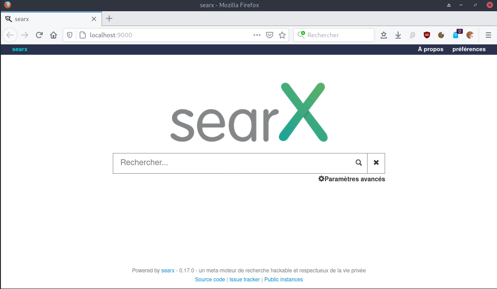
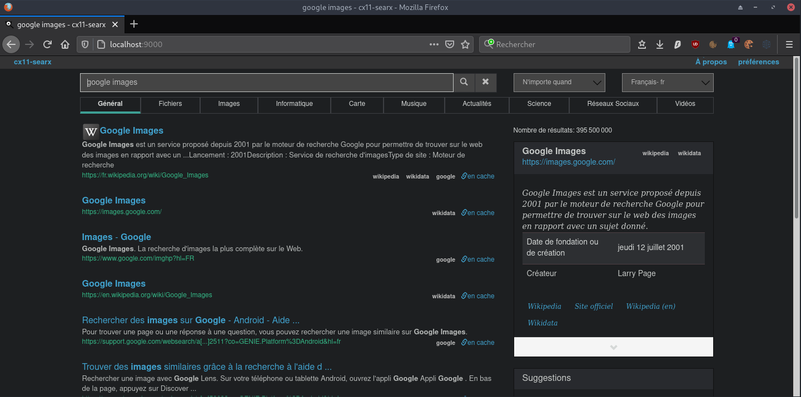

+++
title = 'Searx (métamoteur de recherche libre)'
date = 2022-11-30 00:00:00 +0100
categories = ['serveur']
+++
*Searx est un métamoteur de recherche libre, disponible sous licence publique*


## Searx

*[Searx](https://searx.github.io/searx/) est un métamoteur de recherche libre, disponible sous licence publique générale Affero version 3, ayant pour but de protéger la vie privée de ses utilisateurs3. Searx s'est inspiré du projet Seeks4. Contrairement à ce dernier cependant, il ne dispose pas5 de possibilité de retransmettre les meilleurs résultats en pair-à-pair. Searx peut être utilisé au travers d'une instance publique mais il peut aussi être installé pour disposer de sa propre instance.*[Info wikipédia](https://fr.wikipedia.org/wiki/Searx)


### Searx Installation

Debian ([Step by step installation](https://searx.github.io/searx/admin/installation-searx/))

```bash
sudo -H apt-get install -y \
    virtualenv python3-dev python3-babel python3-venv \
    uwsgi uwsgi-plugin-python3 \
    git build-essential libxslt1-dev zlib1g-dev libffi-dev libssl-dev \
    shellcheck
```

Créer un utilisateur

```bash
sudo -H useradd --shell /bin/bash --system \
    --home-dir /usr/local/searx \
    --comment 'Privacy-respecting metasearch engine' searx

sudo -H mkdir /usr/local/searx
sudo -H chown -R searx:searx /usr/local/searx
```

Installer searx et les dépendances

```bash
sudo -s
sudo -H -u searx -i  # prompt searx@debian-cx11:~$
git clone https://github.com/searx/searx.git /usr/local/searx/searx-src
```

Dans le même "shell" (searx@debian-cx11:~$), créez virtualenv

```bash
python3 -m venv /usr/local/searx/searx-pyenv
echo . /usr/local/searx/searx-pyenv/bin/activate >>  /usr/local/searx/.profile
```

Pour installer les dépendances de searx, quittez la session searx que vous avez ouverte ci-dessus (`exit`) et redémarrez une nouvelle session.  
Avant l'installation, vérifiez d'abord si votre virtualenv provient de la connexion (~/.profile) 

```bash
sudo -H -u searx -i  # (searx-pyenv) searx@debian-cx11:~$
command -v python && python --version
# /usr/local/searx/searx-pyenv/bin/python
# Python 3.7.3

# update pip's boilerplate ..
pip install -U pip
pip install -U setuptools
pip install -U wheel
pip install -U pyyaml

# passer à l'arbre de travail de searx et installer searx dans virtualenv
cd /usr/local/searx/searx-src
pip install -e .
```

Conseil : Ouvrez un deuxième terminal pour les tâches de configuration et laissez le terminal (searx)$ ouvert pour les tâches ci-dessous.
{: .prompt-info }

### Searx configuration

Créez une copie du fichier de configuration git://searx/settings.yml dans le dossier /etc du système. Configurez comme indiqué ci-dessous - remplacez searx@\$(uname -n) par un nom de votre choix - et/ou modifiez /etc/searx/settings.yml si nécessaire.

```bash
sudo -H mkdir /etc/searx
sudo -H cp /usr/local/searx/searx-src/searx/settings.yml /etc/searx/settings.yml
sudo -H sed -i -e "s/ultrasecretkey/`openssl rand -hex 16`/g" /etc/searx/settings.yml
sudo -H sed -i -e s/{instance_name}/searx@\cx11-vm/g /etc/searx/settings.yml
```

Pour vérifier la configuration de searx, vous pouvez activer le débogage et démarrer l'application web. Searx examine l'environnement exporté `$SEARX_SETTINGS_PATH` pour un fichier de configuration.

```bash
# enable debug ..
sudo -H sed -i -e 's/debug : False/debug : True/g' /etc/searx/settings.yml

# start webapp
sudo -H -u searx -i
# Prompt (searx-pyenv) searx@debian-cx11:~$
cd /usr/local/searx/searx-src
export SEARX_SETTINGS_PATH=/etc/searx/settings.yml
```
Sur le prompt `(searx-pyenv) searx@debian-cx11:~$` , on lance le serveur

    python searx/webapp.py

```
[...]
 * Serving Flask app "webapp" (lazy loading)
 * Environment: production
   WARNING: This is a development server. Do not use it in a production deployment.
   Use a production WSGI server instead.
 * Debug mode: on
INFO:werkzeug: * Running on http://127.0.0.1:8888/ (Press CTRL+C to quit)
[...]
DEBUG:searx.engines:wikidata engine: Initialized
DEBUG:urllib3.connectionpool:https://www.wolframalpha.com:443 "GET /input/api/v1/code?ts=9999999999999999999 HTTP/1.1" 200 None
DEBUG:searx.engines:wolframalpha engine: Initialized
```

Si vous êtes à l'intérieur d'un conteneur ou dans un script, testez avec le curl :

    curl --location --verbose --head --insecure 127.0.0.1:8888

```
* Expire in 0 ms for 6 (transfer 0x55ed2ed40f50)
*   Trying 127.0.0.1...
* TCP_NODELAY set
* Expire in 200 ms for 4 (transfer 0x55ed2ed40f50)
* Connected to 127.0.0.1 (127.0.0.1) port 8888 (#0)
> HEAD / HTTP/1.1
> Host: 127.0.0.1:8888
> User-Agent: curl/7.64.0
> Accept: */*
> 
* HTTP 1.0, assume close after body
< HTTP/1.0 200 OK
HTTP/1.0 200 OK
< Content-Type: text/; charset=utf-8
Content-Type: text/; charset=utf-8
< Content-Length: 10512
Content-Length: 10512
< Server-Timing: total;dur=99.454
Server-Timing: total;dur=99.454
< Server: Werkzeug/1.0.1 Python/3.7.3
Server: Werkzeug/1.0.1 Python/3.7.3
< Date: Fri, 30 Oct 2020 06:11:09 GMT
Date: Fri, 30 Oct 2020 06:11:09 GMT

< 
* Closing connection 0
```

Accès web dans le cas d'un site distant , il faut rediriger l'accès http par un tunnel SSH vers l'ordinateur appelant

    ssh -L 9000:localhost:8888 cxuser@135.181.27.140 -p 55140 -i /home/yannick/.ssh/cx11_ed25519

L'interface web peut alors être consultée via http://localhost:9000 (CTRL+C annule la connexion)

{:width="400"}

Si tout fonctionne bien, appuyez sur [CTRL-C] pour arrêter l'application web et désactiver l'option de débogage dans settings.yml. 

```
# disable debug
sudo -H sed -i -e 's/debug : True/debug : False/g' /etc/searx/settings.yml
```

Vous pouvez maintenant quitter searx user bash (entrez deux fois la commande de sortie). À ce stade, searx n'est pas diabolisé ; uwsgi le permet.


A ce stade, **searx** n'est pas diabolisé (daemonized), **uwsgi** le permet.  
Vous pouvez quitter le virtualenv et le searx user bash (entrez deux fois la commande de sortie **exit**).
{: .prompt-warning }

### uwsgi

Installation des paquets:

    sudo apt-get install uwsgi uwsgi-plugin-python3

Création le fichier de configuration **/etc/uwsgi/apps-available/searx.ini** avec le contenu suivant (en mode su)

    sudo nano /etc/uwsgi/apps-available/searx.ini

```ini
[uwsgi]

# uWSGI core
# ----------
#
# https://uwsgi-docs.readthedocs.io/en/latest/Options/#uwsgi-core

# Who will run the code
uid = searx
gid = searx

# set (python) default encoding UTF-8
env = LANG=C.UTF-8
env = LANGUAGE=C.UTF-8
env = LC_ALL=C.UTF-8

# chdir to specified directory before apps loading
chdir = /usr/local/searx/searx-src/searx

# searx configuration (settings.yml)
env = SEARX_SETTINGS_PATH=/etc/searx/settings.yml

# disable logging for privacy
disable-logging = true

# The right granted on the created socket
chmod-socket = 666

# Plugin to use and interpretor config
single-interpreter = true

# enable master process
master = true

# load apps in each worker instead of the master
lazy-apps = true

# load uWSGI plugins
plugin = python3,http

# By default the Python plugin does not initialize the GIL.  This means your
# app-generated threads will not run.  If you need threads, remember to enable
# them with enable-threads.  Running uWSGI in multithreading mode (with the
# threads options) will automatically enable threading support. This *strange*
# default behaviour is for performance reasons.
enable-threads = true


# plugin: python
# --------------
#
# https://uwsgi-docs.readthedocs.io/en/latest/Options/#plugin-python

# load a WSGI module
module = searx.webapp

# set PYTHONHOME/virtualenv
virtualenv = /usr/local/searx/searx-pyenv

# add directory (or glob) to pythonpath
pythonpath = /usr/local/searx/searx-src


# speak to upstream
# -----------------
#
# Activate the 'http' configuration for filtron or activate the 'socket'
# configuration if you setup your HTTP server to use uWSGI protocol via sockets.

# using IP:
#
# https://uwsgi-docs.readthedocs.io/en/latest/Options/#plugin-http
# Native HTTP support: https://uwsgi-docs.readthedocs.io/en/latest/HTTP/

http = 127.0.0.1:8888

# using unix-sockets:
#
# On some distributions you need to create the app folder for the sockets::
#
#   mkdir -p /run/uwsgi/app/searx
#   chown -R searx:searx  /run/uwsgi/app/searx
#
# socket = /run/uwsgi/app/searx/socket
```

Activer l'application **uwsgi** et redémarrer:

```
sudo -H ln -s /etc/uwsgi/apps-available/searx.ini /etc/uwsgi/apps-enabled/
sudo systemctl restart uwsgi.service
```

Pour éviter les messages du type  

`xoyaz.xyz : Nov 30 06:58:55 : admin : a password is required ; TTY=pts/0 ; PWD=/usr/local/searx ; USER=searx ; COMMAND=/bin/bash`{: .prompt-warning }

Exécuter la commande suivante : `sudo usermod searx -s /usr/sbin/nologin`{: .prompt-info }
### Searx serveur web

Le sous-domaine **searx.cinay.pw** (il n'est plus nécessaire de créer un certificat SSL si la wildcard est utilisée lors de la premiète création)  
Il faut ajouter le sous-domaine aux DNS du "registar" OVH par un CNAME

    searx                     3600 IN CNAME  cinay.pw.

Configuration nginx

Créer le fichier **/etc/nginx/conf.d/searx.cinay.pw.conf**

```
server {
    listen 80;
    listen [::]:80;
    server_name searx.cinay.pw;
    # enforce https
    return 301 https://$server_name$request_uri;
}

server {
    listen 443 ssl http2;
    listen [::]:443 ssl http2;
    server_name searx.cinay.pw;
    root /usr/local/searx;

    location / {
            include uwsgi_params;
            uwsgi_pass unix:/run/uwsgi/app/searx/socket;
            access_log /dev/null;
            error_log /dev/null;
    }
}
```

Activer *base_url* dans **/etc/searx/settings.yml**

    base_url : "https://searx.cinay.pw/"

Vérifier et redémarrer les services

    nginx -t
    systemctl restart nginx
    systemctl restart uwsgi

Désactiver les journaux  
Pour une meilleure confidentialité, vous pouvez désactiver les logs nginx sur searx.  
Ajouter le contenu qui suit après la ligne  `uwsgi_pass` dans **/etc/nginx/conf.d/searx.cinay.pw.conf**

```
            access_log /dev/null;
            error_log /dev/null;
```

Redémarrer le service nginx

    systemctl restart nginx

### Paramétrage et personnalisation

#### Paramétrage

Le fichier de paramétrage **/etc/searx/settings.yml**  
*Ci dessous , les lignes modifiées*  

```
general:
    debug : False # Debug mode, only for development
    instance_name : "Cin Yan Searx" # displayed name

server:
    secret_key : "e554gd5er6rsdRgzjkll44556" # change this!
    base_url : "https://searx.cinay.pw/"

engines:

# Désactiver google (provoque des erreurs ,ne donne aucun résultat)
  - name : google
    engine : google
    shortcut : go
    disabled : True

# Activer StartPage (il utilise google dans son métamoteur)
  - name : startpage
    engine : startpage
    shortcut : sp
    timeout : 6.0
    disabled : False

# Désactiver ixquick (qui est redirigé sur StartPage depuis avril 2018)
  - name : ixquick
    engine : startpage
    base_url : 'https://www.ixquick.eu/'
    search_url : 'https://www.ixquick.eu/do/search'
    shortcut : iq
    timeout : 6.0
    disabled : True

```

---

Ouverture résultat (lien) sur un nouvel onglet du navigateur, modifier le plugin  
Modifier le fichier **/usr/local/searx/searx/plugins/open_results_on_new_tab.py** ,default_on = False -> default_on = True

```
from flask_babel import gettext
name = gettext('Open result links on new browser tabs')
description = gettext('Results are opened in the same window by default. '
                      'This plugin overwrites the default behaviour to open links on new tabs/windows. '
                      '(JavaScript required)')
default_on = True

js_dependencies = ('plugins/js/open_results_on_new_tab.js',)
```

---

Relancer le service *uwsgi* pour une prise en charge des modifications

    sudo systemctl restart uwsgi

## Searx Docker

### Installer Docker

["Docker" + "Docker Compose" sur Debian Buster, installation et utilisation](/posts/Docker-Debian-Buster/)  

```bash
sudo apt update
sudo apt install apt-transport-https ca-certificates curl gnupg2 software-properties-common
curl -fsSL https://download.docker.com/linux/debian/gpg | sudo apt-key add -
sudo add-apt-repository "deb [arch=amd64] https://download.docker.com/linux/debian $(lsb_release -cs) stable"
sudo apt update
apt-cache policy docker-ce
sudo apt install docker-ce
```

La sortie doit être similaire à la suivante, montrant que le service est actif et en cours d’exécution :

    sudo systemctl status docker

```
● docker.service - Docker Application Container Engine
   Loaded: loaded (/lib/systemd/system/docker.service; enabled; vendor preset: enabled)
   Active: active (running) since Fri 2020-10-30 14:40:59 CET; 33s ago
     Docs: https://docs.docker.com
 Main PID: 20237 (dockerd)
    Tasks: 9
   Memory: 41.5M
   CGroup: /system.slice/docker.service
           └─20237 /usr/bin/dockerd -H fd:// --containerd=/run/containerd/containerd.sock
```

Exécution de la commande Docker sans Sudo

    sudo usermod -aG docker ${USER}

Pour appliquer la nouvelle appartenance au groupe, déconnectez-vous du serveur et se reconnecter 

### Container searx

[Searx Docker installation](https://searx.github.io/searx/admin/installation-docker/)   
[Tutoriel : Reverse-Proxy avec Docker](https://linux.lyes-touati.com/tutoriel-reverse-proxy-avec-docker)  
[Créer ses propres images Docker avec le Dockerfile](https://devopssec.fr/article/creer-ses-propres-images-docker-dockerfile)  

Assurez-vous que vous avez [installé Docker](https://docs.docker.com/get-docker/).   
Recherche image dans <https://hub.docker.com/search>   
L'image du docker est [searx/searx](https://hub.docker.com/r/searx/searx) (basée sur [github.com/searx/searx](https://github.com/searx/searx)).  

```
export PORT=8089
docker pull searx/searx
docker run --rm -d -v ${PWD}/searx:/etc/searx -p $PORT:8080 -e BASE_URL=http://localhost:$PORT/ searx/searx
```

Le dossier ${PWD}/searx est créé au premier lancement et contient les fichiers **settings.yml** et **uwsgi.ini**

Vérification locale

    curl --location --verbose --head --insecure localhost:8089

```
[...]
*   Trying 127.0.0.1...
* TCP_NODELAY set
* Expire in 200 ms for 4 (transfer 0x555ec9e93f50)
* Connected to localhost (127.0.0.1) port 8089 (#0)
> HEAD / HTTP/1.1
> Host: localhost:8089
> User-Agent: curl/7.64.0
> Accept: */*
> 
< HTTP/1.1 200 OK
HTTP/1.1 200 OK
[...]
```

Relever le nom du container

    docker ps # NAMES

```
CONTAINER ID        IMAGE               COMMAND                  CREATED             STATUS              PORTS                    NAMES
8ca01abfa2ea        searx/searx         "/sbin/tini -- /usr/…"   16 minutes ago      Up 2 minutes        0.0.0.0:8089->8080/tcp   great_gagarin
```

### Paramètres - settings.yml

Modifier le fichier de configuration

    sudo nano ${PWD}/searx/settings.yml

```
general:

    instance_name : "cx11-searx" # displayed name

server:
    secret_key : "546c29de2eaeb051edf87ab74d22c8f608b6e6a2ba55d3e10f818154e8c3b179" # change this!
    base_url : False # Set custom base_url. Possible values: False or "https://your.custom.host/lo
cation/"

ui:

    default_theme : oscar # ui theme

    theme_args :
        oscar_style : logicodev-dark # default style of oscar
    results_on_new_tab: True  # Open result links in a new tab by default

# supprimer la ligne 'disabled : True' des éléments ci dessous

  - name : ddg definitions
    engine : duckduckgo_definitions
    shortcut : ddd
    weight : 2

  - name : duckduckgo
    engine : duckduckgo
    shortcut : ddg

  - name : duckduckgo images
    engine : duckduckgo_images
    shortcut : ddi
    timeout: 3.0

```


Après les modifications, redémarrer le container

    docker restart great_gagarin

### Vérifier localement (curl)

    curl --location --verbose --head --insecure localhost:8089

```
[...]
*   Trying 127.0.0.1...
* TCP_NODELAY set
* Expire in 200 ms for 4 (transfer 0x555ec9e93f50)
* Connected to localhost (127.0.0.1) port 8089 (#0)
> HEAD / HTTP/1.1
> Host: localhost:8089
> User-Agent: curl/7.64.0
> Accept: */*
> 
< HTTP/1.1 200 OK
HTTP/1.1 200 OK
[...]
```


### Vérification distante (SSH)

Exécuter sur un poste distant

    ssh -L 9000:localhost:8089 cxuser@135.181.27.140 -p 55140 -i /home/yannick/.ssh/cx11_ed25519  

Sur le même poste , ouvrir le navigateur avec un lien <http://localhost:9000>

{:width="600"}


