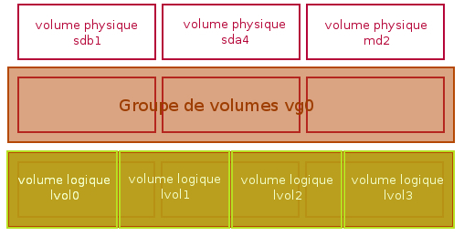

+++
title = 'LVM (Logical Volume Manager)'
date = 2022-12-03 00:00:00 +0100
categories = ['commande']
+++
*LVM (Logical Volume Manager) permet de gérer des partitions logiques, et non pas physiques, ce qui a notamment comme avantage de pouvoir plus facilement modifier leur taille.*

- [LVM](#lvm)
    - [Pré-requis](#pré-requis)
    - [Installation du package LVM](#installation-du-package-lvm)
    - [Création du volume physique PV](#création-du-volume-physique-pv)
    - [Création d'un volume logique LV](#création-dun-volume-logique-lv)
    - [Quelques commandes utiles](#quelques-commandes-utiles)
    - [Supprimer un volume logique LV](#supprimer-un-volume-logique-lv)
    - [Formatage du volume logique LV](#formatage-du-volume-logique-lv)
    - [Augmenter la taille d'une partition LVM](#augmenter-la-taille-dune-partition-lvm)
    - [Réduire la taille d'une partition LVM](#réduire-la-taille-dune-partition-lvm)
- [LVM, une autre manière de partitionner](#lvm-une-autre-manière-de-partitionner)
    - [Introduction](#introduction)
        - [Avantages de LVM](#avantages-de-lvm)
        - [Inconvénients de LVM](#inconvénients-de-lvm)
    - [Pré-requis](#pré-requis)
    - [Installation](#installation)
    - [Notions et vocabulaire](#notions-et-vocabulaire)
        - [Volume physique](#volume-physique)
        - [Groupe de volumes](#groupe-de-volumes)
        - [Volume logique](#volume-logique)
        - [Synthèse graphique](#synthèse-graphique)
    - [Création](#création)
        - [Groupe de volumes](#groupe-de-volumes)
        - [Volume logique](#volume-logique)
        - [Système de fichiers](#système-de-fichiers)
    - [Suppression](#suppression)
    - [Redimensionnement](#redimensionnement)
        - [Volume physique](#volume-physique)
            - [Agrandissement](#agrandissement)
            - [Rétrécissement](#rétrécissement)
        - [Volume logique](#volume-logique)
            - [Agrandissement](#agrandissement)
            - [Rétrécissement](#rétrécissement)
    - [Snapshot](#snapshot)
        - [Création d'un snapshot LVM](#création-dun-snapshot-lvm)
        - [Redimensionnement du snapshot](#redimensionnement-du-snapshot)
        - [Fusionner un snapshot](#fusionner-un-snapshot)
    - [Changement d'un disque défectueux](#changement-dun-disque-défectueux)
        - [Principe](#principe)
        - [Avec GParted](#avec-gparted)
        - [En ligne de commande](#en-ligne-de-commande)
        - [Finalisation](#finalisation)
    - [Mieux comprendre ou aller plus loin](#mieux-comprendre-ou-aller-plus-loin)
        - [Notion "extent"](#notion-extent)
        - [Glossaire](#glossaire)
        - [LVM et RAID](#lvm-et-raid)
        - [LVM miroir](#lvm-miroir)
        - [Monter une partition](#monter-une-partition)
            - [Obtenir la liste des groupes logiques](#obtenir-la-liste-des-groupes-logiques)
            - [Obtenir la liste des partitions](#obtenir-la-liste-des-partitions)
            - [Rendre la partition disponible](#rendre-la-partition-disponible)
            - [Monter la partition](#monter-la-partition)
            - [ Exemple](#-exemple)
        - [Vérifier une partition](#vérifier-une-partition)
            - [Rendre la partition disponible](#rendre-la-partition-disponible)
            - [Lancer fsck](#lancer-fsck)
- [Synthèse](#synthèse)
- [Sauvegarder son système à chaud avec LVM](#sauvegarder-son-système-à-chaud-avec-lvm)
    - [Pré-requis](#pré-requis)
    - [Vérifications préalables](#vérifications-préalables)
    - [Création du volume de sauvegarde](#création-du-volume-de-sauvegarde)
    - [Snapshot et copie](#snapshot-et-copie)
    - [Finitions](#finitions)

## LVM

### Pré-requis

Partition non formatée

Il faut disposer d'une partition non formatée. Dans notre cas, il s'agit de /dev/sda9, qui dispose d'un peu plus de 300 Go de libres. Cette partition sera utilisée principalement pour gérer des images de machines virtuelles créées avec KVM.

```
# fdisk -l /dev/sda

Disk /dev/sda: 750.2 GB, 750156374016 bytes
255 têtes, 63 secteurs/piste, 91201 cylindres, total 1465149168 secteurs
Unités = secteurs de 1 * 512 = 512 octets
Taille de secteur (logique / physique) : 512 octets / 4096 octets
taille d'E/S (minimale / optimale) : 4096 octets / 4096 octets
Identifiant de disque : 0x73a05bd4

Périphérique Amorce  Début        Fin      Blocs     Id  Système
/dev/sda1   *        2048   102402047    51200000    7  HPFS/NTFS/exFAT
/dev/sda2       102402048   204802047    51200000    7  HPFS/NTFS/exFAT
/dev/sda3       204804094  1465147391   630171649    5  Étendue
La partition 3 ne débute pas sur une frontière de cylindre physique.
/dev/sda5       204804096   284803071    39999488   83  Linux
/dev/sda6       284805120   294567935     4881408   82  partition d'échange Linux / Solaris
/dev/sda7       294569984   392224767    48827392   83  Linux
/dev/sda8       392226816   802082815   204928000   83  Linux
/dev/sda9       802084864  1465147391   331531264   83  Linux
```

### Installation du package LVM

Sur une distribution de type Debian/Ubuntu 

	sudo apt install lvm2

### Création du volume physique PV

La mise en place de volumes logiques est un modèle à trois couches :

* Volume physique
* Volume groupe
* Volume logique

```
# pvcreate /dev/sda9
  Writing physical volume data to disk "/dev/sda9"
  Physical volume "/dev/sda9" successfully created
```

On peut lister les volumes physiques avec la commande pvdisplay. Exemple :

```
# pvdisplay
  "/dev/sda9" is a new physical volume of "316,17 GiB"
  --- NEW Physical volume ---
  PV Name               /dev/sda9
  VG Name               
  PV Size               316,17 GiB
  Allocatable           NO
  PE Size               0   
  Total PE              0
  Free PE               0
  Allocated PE          0
  PV UUID               ReKoL9-gneB-DXfg-5MpV-pKyP-n5Rl-TRdnXh
```

Création du Volume Groupe VG

Avant de pouvoir créer des volumes logiques, il faut avoir créé un Volume Group. Ceci s'effectue via la commande vgcreate. La syntaxe est la suivante :

    vgcreate NOM-du-VG NOM-Du-PV

Exemple :

```
# vgcreate vmvg /dev/sda9
  Volume group "vmvg" successfully created
```

On peut vérifier que cela est répercuté au niveau du volume physique. Le paramètre VG Name est maintenant renseigné :

Informations via la commande vgdisplay. Par exemple :

```
# vgdisplay vmvg
  --- Volume group ---
  VG Name               vmvg
  System ID             
  Format                lvm2
  Metadata Areas        1
  Metadata Sequence No  1
  VG Access             read/write
  VG Status             resizable
  MAX LV                0
  Cur LV                0
  Open LV               0
  Max PV                0
  Cur PV                1
  Act PV                1
  VG Size               316,17 GiB
  PE Size               4,00 MiB
  Total PE              80940
  Alloc PE / Size       0 / 0   
  Free  PE / Size       80940 / 316,17 GiB
  VG UUID               kd3LKL-tMjA-eIq4-EhMs-LdWV-LFVl-2rBhk1
```

### Création d'un volume logique LV

A ce niveau, il est possible de créer des volumes logiques sur notre VG, via la commande lvcreate, avec la syntaxe :

	lvcreate -L[taille] -n[nom-du-lv] [nom-du-vg]

Dans notre exemple, ce serait :

```
lvcreate -L8000 -n vm_debian6 vmvg
 Logical volume "vm_wheezy" created
```

Cette commande créera un volume logique de 8 Go sur le volume groupe vmvg, et nommé vm_debian6.

On peut avoir la liste des LV créés avec la commande lvscan :

```
# lvscan
  ACTIVE            '/dev/vmvg/vm_wheezy' [7,81 GiB] inherit
```

La commande lvdisplay pour les détails d'un volume logique :

```
# lvdisplay
  --- Logical volume ---
  LV Path                /dev/vmvg/vm_wheezy
  LV Name                vm_wheezy
  VG Name                vmvg
  LV UUID                bOAd1B-Xg0e-Unj3-onj2-IZUY-k654-tqdvtd
  LV Write Access        read/write
  LV Creation host, time portable-vli, 2012-11-22 16:53:41 +0100
  LV Status              available
  # open                 0
  LV Size                7,81 GiB
  Current LE             2000
  Segments               1
  Allocation             inherit
  Read ahead sectors     auto
  - currently set to     256
  Block device           252:0
```

Les volumes logiques sont prêts à être utilisés par virt-manager...

### Quelques commandes utiles

pvscan : liste les différents volumes physiques disponibles

```
# pvscan
  PV /dev/sda9   VG vmvg   lvm2 [316,17 GiB / 300,55 GiB free]
  Total: 1 [316,17 GiB] / in use: 1 [316,17 GiB] / in no VG: 0 [0   ]
```

vgscan : liste les différents volume groups

```
# vgscan
  Reading all physical volumes.  This may take a while...
  Found volume group "vmvg" using metadata type lvm2
```

lvscan : liste les différents volumes logiques

```
# lvscan 
  ACTIVE            '/dev/vmvg/vm_wheezy' [7,81 GiB] inherit
  ACTIVE            '/dev/vmvg/vm_debian6' [7,81 GiB] inherit
```

### Supprimer un volume logique LV

Pour supprimer un volume logique, il suffit d'utiliser la commande lvremove, une fois que le volume logique est démonté. Exemple :

```
# lvscan
  ACTIVE            '/dev/vmvg/vm_wheezy' [7,81 GiB] inherit
  ACTIVE            '/dev/vmvg/vm_debian6' [7,81 GiB] inherit
  ACTIVE            '/dev/vmvg/vm_seven' [15,62 GiB] inherit
# lvremove /dev/vmvg/vm_wheezy 
Do you really want to remove active logical volume vm_wheezy? [y/n]:
  Logical volume "vm_wheezy" successfully removed
# lvscan
  ACTIVE            '/dev/vmvg/vm_debian6' [7,81 GiB] inherit
  ACTIVE            '/dev/vmvg/vm_seven' [15,62 GiB] inherit
```

### Formatage du volume logique LV

Afin de pouvoir monter le volume logique, il est nécessaire de le formater auparavant, via les commandes mkfs. Par exemple, pour formater en ext4, on utilisera la commande :

	mkfs -t ext4 /dev/vmvg/Vol1

On peut ensuite monter le volume comme une partition "normale" :

```
mkdir /Essai1
mount /dev/mvg/Vol1 /Essai1
df -h
```

### Augmenter la taille d'une partition LVM

L'un des avantages principaux des volumes logiques est de permettre de redimensionner la partition "à la volée" ou presque, beaucoup plus facilement et sans perte de données par rapport à une partition physique.

Pour ce faire, il est possible d'utiliser la commande lvextend. Par exemple :

	lvextend -L 12G /dev/vmvg/Vol1

va étendre la taille du volume logique à 12 GB.

	lvextend -L +1G /dev/vmvg/Vol1

va ajouter 1 GB au volume logique. Il faut ensuite retailler le file system qui repose sur ce volume logique :

	lvextend -l +1125 /dev/vmvg/Vol1

va ajouter le reste disponible du "volume groupe" (Free PE/Size) au volume logique. 

    lvextend -l 100%FREE /dev/vmvg/Vol1

va ajouter l'espace restant disponible du "volume groupe"

Il faut ensuite retailler le file system qui repose sur ce volume logique :

```
umount /dev/vmvg/Vol1
e2fsck -f /dev/vmvg/Vol1
resize2fs /dev/vmvg/Vol1
mount /dev/vmvg/Vol1
```


### Réduire la taille d'une partition LVM

Nous vous montrons ici comment réduire un volume ou une partition LVM sous Linux en redimensionnant d'abord le système de fichiers, puis le volume logique.  
Dans cet exemple, nous allons travailler sur la réduction du volume logique /var/centos/var de 10 Go à 5 Go.

Vue d'ensemble de Logical Volume Manager (LVM)

Avant de travailler à travers le processus de redimensionnement, il est important que vous compreniez d'abord quelques concepts de base autour des volumes physiques, des groupes de volumes, des volumes logiques et du système de fichiers.

* Volume physique (PV) : Ceci peut être créé sur un disque physique entier (pensez à /dev/sda) ou sur une partition Linux.
* Groupe de volume (VG) : Il est composé d'au moins un ou plusieurs volumes physiques.
* Volume logique (LV) : C'est ce qu'on appelle parfois la partition, elle se trouve à l'intérieur d'un groupe de volume et a un système de fichiers écrit sur elle.
* Système de fichiers : Un système de fichiers tel que ext4 sera sur le volume logique.

Comment diminuer ou rétrécir le volume logique

Pour diminuer la taille d'une partition LVM, vous devez d'abord diminuer le système de fichiers afin d'éviter une éventuelle corruption des données. Comme il est possible que cela se produise si vous entrez la commande incorrectement, il est fortement recommandé que vous ayez une sauvegarde complète de vos données avant de continuer. Réduire un volume logique vous donnera plus d'espace dans le groupe de volume, ce qui signifie que vous pourriez plutôt étendre un autre volume logique avec ce nouvel espace trouvé.

La première étape dépendra si vous cherchez à réduire le volume d'une racine LVM ou d'un volume non racine.  
**Réduire le volume d'une racine**  
Le volume de la racine serait typiquement le volume logique qui est monté sur /. Vous ne pouvez pas le démonter pour le rétrécir car il est utilisé par le système d'exploitation en cours d'exécution, ce qui signifie que vous devrez d'abord démarrer à partir d'un Live CD pour le faire. 

**Réduire un volume non racinaire**  
Alternativement, si le volume que vous réduisez est un volume non racine, c'est-à-dire tout autre volume non monté à la racine du système de fichiers, vous pouvez démonter le volume comme indiqué ci-dessous pour continuer. Veuillez noter que lorsque vous démontez le volume, les données ne seront pas disponibles, vous devrez peut-être planifier un temps d'arrêt et arrêter d'exécuter les applications qui utilisent les données avant de les démonter. Démonter en spécifiant soit le volume logique, soit l'emplacement où il est actuellement monté, dans l'exemple ci-dessous nous spécifions le volume logique qui peut être trouvé dans /dev/(vg-name)/(lv-name).

	umount /dev/centos/var

Toutes les étapes suivantes s'appliquent maintenant à un volume racinaire ou non racinaire.  
Avant de pouvoir tenter de réduire la taille d'un volume LVM, vous devez d'abord exécuter une vérification du système de fichiers. Si vous ne le faites pas, vous obtiendrez un message d'erreur et vous ne pourrez pas continuer. C'est une étape nécessaire car le redimensionnement d'un système de fichiers en mauvais état peut entraîner une corruption des données. L'option -f permet d'exécuter la vérification même si le système de fichiers semble propre, tandis que l'option -y suppose que toutes les questions sont répondues par l'affirmative et répondra si on lui demande de résoudre un problème.

	e2fsck -fy /dev/centos/var

Ensuite, vous devez rétrécir le système de fichiers, pour être sûr, nous allons rétrécir le système de fichiers plus bas que ce à quoi le volume logique va rétrécir. C'est parce que nous ne voulons pas réduire accidentellement le volume logique à une taille inférieure à celle du système de fichiers à l'étape suivante, car cela peut entraîner la corruption et la perte de données. Ne t'inquiète pas, on récupérera l'espace à la fin.   
La commande ci-dessous réduira la taille totale du système de fichiers de sorte qu'il ne soit que de 4G, notez que quelle que soit la taille que vous spécifiez de réduire à vous doit avoir en espace libre dans le système de fichiers sinon vous devez d'abord supprimer les données.

	resize2fs /dev/centos/var 4G

Une fois le système de fichiers réduit, on peut réduire la taille du volume logique avec la commande lvreduce. Réduisez-le à la taille que vous voulez que le volume soit, comme spécifié par l'indicateur -L. Au lieu de cela, si vous voulez réduire d'une taille spécifiée, mettez simplement un - devant la taille. Les deux sont indiqués ci-dessous pour être complets, mais vous n'avez besoin d'en exécuter qu'un seul.

Pour réduire à 5G

	lvreduce -L 5G /dev/vg/nom-disque

Réduire de 5G

	lvreduce -L -5G /dev/vg/nom-disque

Une fois que vous exécutez la commande lvreduce, vous recevrez un avertissement vous indiquant la taille que vous avez choisi de réduire pour ainsi utiliser ceci comme une chance de confirmer que vous réduisez le volume logique à une taille qui n'est PAS plus petite que la taille à laquelle vous avez précédemment réduit le système de fichiers. Une fois que vous avez confirmé, il vous suffit d'entrer'y' et d'appuyer sur'enter'.

Une fois que le volume logique a été réduit à la taille requise, exécutez resize2fs sur le volume car cela permettra d'étendre le système de fichiers pour utiliser tout l'espace disponible dans le volume logique. Cela permet d'utiliser tout l'espace libre restant afin qu'aucun espace ne soit gaspillé à partir du moment où nous avons précédemment réduit le système de fichiers à une taille inférieure à celle du volume logique.

	resize2fs /dev/centos/var

Il ne reste plus qu'à monter le volume. S'il s'agit d'un volume racine et que vous travaillez dans un Live CD, redémarrez simplement dans votre système d'exploitation Linux principal.  
S'il s'agissait d'un volume non racine et que vous l'avez démonté pour compléter la réduction, il suffit de le remonter. Vous pouvez le faire avec'mount -a' en supposant que vous avez la configuration déjà définie dans /etc/fstab, sinon spécifiez le volume logique et où il doit être monté. Ici, nous montons manuellement sur /mnt juste pour tester.

	mount /dev/centos/centos/var /mnt

Après avoir redémarré le système d'exploitation principal ou terminé le montage, vérifiez l'espace affiché avec la commande'df' pour confirmer qu'il a été réduit comme prévu.

```
[root@CentOS7 /]# df -h
Filesystem               Size  Used Avail Use% Mounted on
/dev/mapper/centos-root  9.8G  1.4G  8.5G  14% /
devtmpfs                 908M     0  908M   0% /dev
tmpfs                    914M     0  914M   0% /dev/shm
tmpfs                    914M  8.6M  905M   1% /run
tmpfs                    914M     0  914M   0% /sys/fs/cgroup
/dev/sda1                497M   96M  402M  20% /boot
/dev/mapper/centos-var  4.8G   20M  4.6G   1% /mnt
```

## LVM, une autre manière de partitionner 

### Introduction 

**LVM** (Logical Volume Manager, ou gestionnaire de volumes logiques en français) permet la création et la gestion de volumes logiques sous Linux. L'utilisation de volumes logiques remplace en quelque sorte le partitionnement des disques. C'est un système beaucoup plus souple, qui permet par exemple de diminuer la taille d'un système de fichier pour pouvoir en agrandir un autre, sans se préoccuper de leur emplacement sur le disque.

Il permet notamment de redimensionner les partitions de disques sans reformatage.
Il permet également de rajouter des disques à la volée.

#### Avantages de LVM 

  * Il n'y a pas de limitations « étranges » comme avec les partitions (primaire, étendue, etc.).
  * On ne se préoccupe plus de l'emplacement exact des données.
  * On peut conserver quelques giga-octets de libres pour pouvoir les ajouter n'importe où et n'importe quand.
  * Les opérations de redimensionnement deviennent quasiment sans risques, contrairement au redimensionnement des partitions.
  * On peut créer des snapshots de volume sans perturber le fonctionnement de la machine et sans interruption de services.

#### Inconvénients de LVM 

  * Si un des volumes physiques devient HS, alors c'est l'ensemble des volumes logiques qui utilisent ce volume physique qui sont perdus. Pour éviter ce désastre, il faudra utiliser LVM sur des disques raid par exemple.

### Pré-requis 

  * Un disque ou une partition libre.
  * Ne pas avoir peur de la ligne de commande.

### Installation 

Installez le paquet lvm2  

### Notions et vocabulaire 

#### Volume physique 

Un volume physique ou « PV » pour « physical volume » est tout simplement un disque ou une partition. Bref, c'est un espace de stockage bien réel (autrement dit un périphérique de la forme `/dev/sda2` par exemple), que l'on va confier à LVM. Bien évidemment, tout ce qui était présent sur la partition sera effacé.

Avant de pouvoir définir le volume physique, il est nécessaire qu'une partition existe. Pour cela vous pouvez avoir recours à gparted sur un PC desktop et à  parted sur serveur
{: .prompt-warning }

#### Groupe de volumes 

Un groupe de volumes ou « VG » pour « volume group » est, comme son nom l'indique, un ensemble de volumes physiques. On a donc un ou plusieurs volumes physiques dans un groupe de volumes, et pour utiliser LVM, il faut obligatoirement au moins un groupe de volumes. Habituellement, sur les gros serveurs, on essaye de regrouper les disques en fonction de leur caractéristiques (capacités, performances, etc.). Pour un particulier, le fait de mettre plusieurs disques dans un même groupe de volume peut permettre « d'étaler » un système de fichiers sur plusieurs disques, et d'avoir donc `/home` par exemple qui utiliserait 2 disques. Une telle configuration est tout de même assez dangereuse en cas de perte d'un disque… De plus, cela n'apporterait aucun gain de performance contrairement à du RAID-0 par exemple.
 
#### Volume logique 

Un volume logique ou « LV » pour « logical volume » est ce que nous allons utiliser au final. Un volume logique est un espace « quelque part dans un groupe de volume » où l'on peut mettre un système de fichiers. C'est donc ce qui remplace les partitions. On peut donc utiliser un volume logique pour mettre la mémoire virtuelle, un pour `/home`, "/", etc.

Évitez de mettre "/boot/grub" dans un volume logique car cela peut poser des problèmes pour le démarrage du système. En effet, grub ne sait pas encore (novembre 2015) écrire dans un fichier localisé dans un tel volume. Or grub mémorise le résultat du démarrage courant dans le fichier /boot/grub/grubenv de manière à modifier le démarrage qui suit un démarrage défaillant.  
On peut y mettre à peu près tout … mais il vaut mieux éviter d'y mettre "/boot". Techniquement, ça doit fonctionner à peu près correctement depuis Grub 2, mais cela est encore sensible suivant la configuration, pour le moment il est vivement conseillé d'avoir au moins une partition de l'ancien temps avec "/boot" (ou "/" si le dossier "/boot" n'est pas séparé) pour éviter les ennuis.
{: .prompt-warning }

#### Synthèse graphique 

On peut voir les choses ainsi :



### Création 

Puisque nous allons entrer toutes les commandes à venir en tant que root 

    sudo -s

Voilà : le prompt est maintenant en mode root « # », cela nous évitera d'avoir à préfixer chaque commande par sudo.

Bonne nouvelle, les commandes LVM sont extrêmement simples à utiliser, et elles intègrent toutes une aide en ligne très bien conçue, claire, courte, mais suffisante. De plus, leurs noms se « devinent » assez facilement :

  * toutes les commandes agissant sur les volumes physiques commencent par pv (pour physical volume);
  * toutes les commandes agissant sur les groupes de volumes commencent par vg (pour volumes group);
  * toutes les commandes agissant sur les volumes logiques commencent par lv (pour logical volume).

La première chose à faire est de créer **un volume physique**, en attribuant une partition à LVM.

Essayez la commande suivante pour connaître la liste des commandes disponibles pour les volumes physiques :

    man -k pv
  
Parmi toutes les commandes renvoyées, on remarque une « pvcreate », ça doit être celle-là… ;-) Cette astuce fonctionne avec toutes les commandes LVM et permet de les retrouver facilement.

```
pvchange (8)         - change attributes of a physical volume
pvck (8)             - check physical volume metadata
pvcreate (8)         - initialize a disk or partition for use by LVM
pvdisplay (8)        - display attributes of a physical volume
pvmove (8)           - move physical extents
pvremove (8)         - remove a physical volume
pvresize (8)         - resize a disk or partition in use by LVM2
pvs (8)              - report information about physical volumes
pvscan (8)           - scan all disks for physical volumes
```

Il faudra donc créer (plutôt initier) notre volume physique par la commande :

```
pvcreate /dev/sdc1
```

Cela nous permettra de l'utiliser dans notre groupe de volume

Noter que la création d'un volume physique avec un disque complet comme `/dev/sdc` n'est pas recommandé : <https:tldp.org/HOWTO/LVM-HOWTO/initdisks.html>

#### Groupe de volumes 

Il existe de nombreuses options lors de la création d'un groupe de volumes… Mais continuons de faire au plus simple. Le seul paramètre indispensable sera de lui donner un nom, nous utiliserons les valeurs par défaut pour tout le reste. Pour une raison que j'expliquerai par la suite, donnons-lui un nom très court (2 ou 3 caractères). Par exemple : « mvg » pour « mon vg ».

Pour connaitre la syntaxe de la commande vgcreate (comme pour toutes les autres commandes LVM), tapez simplement son nom :

    vgcreate

La syntaxe est donc :

    vgcreate VolumeGroupName PhysicalVolume [optionnellement d'autres PhysicalVolume]

Allons-y :

    vgcreate mvg /dev/sdc1

Si tout se passe bien, vous avez maintenant un groupe de volumes, contenant un disque physique. Vous pouvez obtenir d'autres informations sur ce groupe de volumes en tapant vgdisplay:

```
  vgdisplay
  --- Volume group ---
  VG Name               mvg
  System ID             
  Format                lvm2
  Metadata Areas        1
  Metadata Sequence No  3
  VG Access             read/write
  VG Status             resizable
  MAX LV                0
  Cur LV                2
  Open LV               0
  Max PV                0
  Cur PV                1
  Act PV                1
  VG Size               186,31 GiB
  PE Size               4,00 MiB
  Total PE              47695
  Alloc PE / Size       15360 / 60,00 GiB
  Free  PE / Size       32335 / 126,31 GiB
  VG UUID               BaTuai-1I8o-3rkY-Ut1r-ybta-mJnl-9X0oNZ
```

#### Volume logique 

Nous y voilà… Cette fois-ci, nous allons vraiment créer deux espaces que l'on pourra ensuite « formater » en ext4 par exemple.

Comme précédemment, le plus simple est de commencer par jeter un œil sur la syntaxe de la commande :

    lvcreate

Les deux options vraiment importantes sont « -n » pour son nom, et « -L » pour sa taille. Le paramètre principal est « OriginalLogicalVolume ». Il s'agit peut-être d'une erreur dans le manuel (man). En fait, ce qu'il faut indiquer, c'est bien le groupe de volumes dans lequel nous allons créer le volume logique. Pour l'exemple présent, je fais ici deux volumes, 10 Gio et 50 Gio :

    lvcreate -n Vol1 -L 10g mvg
    lvcreate -n Vol2 -L 50g mvg

Idem, on peut vérifier avec la commande lvdisplay:

```
  ~# lvdisplay
  --- Logical volume ---
  LV Name                /dev/mvg/Vol1
  VG Name                mvg
  LV UUID                q0D6cQ-mcMP-q8sf-XTlI-DdxX-QHd1-qkaB5J
  LV Write Access        read/write
  LV Status              available
  # open                 0
  LV Size                10,00 GiB
  Current LE             2560
  Segments               1
  Allocation             inherit
  Read ahead sectors     auto
  - currently set to     256
  Block device           252:0
   
  --- Logical volume ---
  LV Name                /dev/mvg/Vol2
  VG Name                mvg
  LV UUID                JZjMxI-cTAw-cbs6-02BM-4Mev-P2E7-b8JX0x
  LV Write Access        read/write
  LV Status              available
  # open                 0
  LV Size                50,00 GiB
  Current LE             12800
  Segments               1
  Allocation             inherit
  Read ahead sectors     auto
  - currently set to     256
  Block device           252:1
```

#### Système de fichiers 

Avec les partitions, on avait des noms ressemblant à `/dev/sda3`, etc. Avec LVM, on utilise aussi des périphériques dans `/dev`, mais le chemin est de la forme `/dev/nom_du_vg/nom_du_lv`.
Autrement dit, puisqu'on a décidé d'appeler nos volumes logiques "Vol1" et "Vol2", les noms de ces périphériques de ce volume logique sont "/dev/mvg/Vol1" et "/dev/mvg/Vol2".
À partir de maintenant, `/dev/mvg/Volx` peut être utilisé dans toutes les situations et avec toutes les commandes qui attendent quelque chose de la forme `/dev/…` Par exemple :

```shell
  mkfs -t ext4 /dev/mvg/Vol1
  mkfs -t ext4 /dev/mvg/Vol2
  mkdir /Essai1
  mount /dev/mvg/Vol1 /Essai1
  df -h
```

Et normalement, `/dev/mvg/Vol1` devrait être monté sur `/Essai`. Regardez bien la ligne correspondante. Si on avait choisi un nom de VG ou de LV plus long, la sortie de df aurait été modifiée, car le nom aurait « touché » les valeurs… On aurait été obligé de passer des lignes et l'affichage aurait été plus difficile à lire. Techniquement, choisir des noms « longs » pour les VG et les LV ne pose aucun problème, mais c'est l'affichage qui sera parfois délicat. Pour cette raison uniquement, je préconise de se limiter à 7 caractères au total (donc par exemple 3 pour le VG et 4 pour le LV, ou 2 et 5, comme vous voulez).

> Pourquoi est-il écrit `/dev/mapper/mvg-Vol1` et non `/dev/mvg/Vol1` ?

Avec LVM en version 1, c'est bien `/dev/mvg/Vol1` qui aurait été affiché. Depuis la version 2, LVM utilise le périphérique mapper, ce qui permet pas mal de choses (comme chiffrer les volumes logiques, etc.). Pour simplifier, disons que ces deux notations « /dev/mvg/Vol1 » et « /dev/mapper/mvg-Vol1 » sont synonymes. Dans la pratique, il est conseillé quand même d'utiliser plutôt la forme « /dev/mvg/Vol1 », certaines commandes ne passeront pas autrement.
{: .prompt-info }


### Suppression 

Rien de plus simple :

    umount /Essai1  # si le volume Vol1 est monté en /Essai1
    lvremove /dev/mvg/Vol1

`Attention, une fois un volume logique effacé, il est totalement impossible de récupérer les données qu'il contenait.`{: .prompt-warning }

### Redimensionnement 

#### Volume physique 

##### Agrandissement 

Imaginons maintenant que notre groupe de volume (mvg) n'ait plus suffisamment d'espace libre. On souhaite donc lui rajouter un volume physique afin de rajouter de l'espace libre. Ça tombe bien, on dispose d'un volume physique sdc2 que l'on va pouvoir ajouter à mvg :

On initialise le volume en vue de son utilisation dans LVM :

    pvcreate /dev/sdc2

On rajoute le volume sdc2 au groupe de volume mvg :

    vgextend mvg /dev/sdc2
  
##### Rétrécissement 

Imaginons maintenant que la partition Boot soit devenue trop petite et que tout le reste du disque qui contient cette partition soit défini comme une partition  utilisée en LVM (/dev/sda2 dans l'exemple). Il sera alors nécessaire de diminuer l'espace  physique de ce groupe de volume (mvg).


En premier, il est nécessaire de rétrécir le ou les LV qui sont définis dans ce volume-groupe. Voir ci-après.

Puis il faut rétrécir l'enveloppe physique. Normalement c'est sans risque: Les commandes sont refusées si la demande est trop agressive.

Commençons par vérifier l'implantation physique des données dans la partition. Le but est de vérifier que la fin de la partition n'est pas utilisée. <code bash>sudo pvs -v --segments /dev/sda2``` La dernière ligne de la réponse indique si la fin de la partition est libre  ou non.
Si la fin de la partition n'a pas suffisamment d'espace libre, il est possible de procéder a une réorganisation physique.`sudo pvmove --alloc anywhere /dev/sda2:88888888-9999999999 /dev/sda2:0-88888887` (les valeurs 88888887 et 88888888 sont à adapter en fonction de la réponse précédente notamment la quantité d'espace libre en début de partition.  
Lancer alors l'éditeur de partitions. Indiquer alors la nouvelle taille de la partition. Le minima possible est exprimé en MiO et obtenu par la formule 88888888*4

#### Volume logique 

Il est très facile d'augmenter ou de diminuer la taille d'un volume logique. Mais attention, la taille d'un LV n'a pas de lien direct avec la taille de ce qu'il contient (swap ou système de fichier). Le LV est une boîte, le système de fichier est le contenu de la boîte. Augmenter la taille de la boîte sans augmenter la taille du contenu ne pose pas de problème, mais l'inverse…

##### Agrandissement 

Bien qu'il soit évidemment moins risqué d'agrandir ou de diminuer la taille d'un système de fichiers après l'avoir démonté, la plupart des formats (ext3, reisersfs, ext4...) supportent désormais cette modification "à chaud" (avec des données qui restent donc accessibles en lecture/écriture durant toute l'opération).

Pour agrandir un volume il est nécessaire de démonter le système de fichier, ici, prenons celui du volume logique Vol2 :

    umount /Essai2

Maintenant nous allons ajouter 5Gio au volume et agrandir son système de fichier :
  lvresize --resizefs --size +5G /dev/mvg/Vol2
  
Le paramètre `​%%--%%resizefs` ne fonctionne pas avec tous les systèmes de fichiers (voir <https:linux.die.net/man/8/fsadm>).
{: .prompt-warning }

Une fois l'opération terminée, le volume une fois monté a gagné 5Gio.

Il est également possible d'augmenter la taille du volume logique à l'ensemble de l'espace libre disponible sur le support en utilisant **lvextend -l +100%FREE**.

```shell
lvextend -l +100%FREE /dev/mvg/Vol2
```

##### Rétrécissement 

Diminuer la taille d'un système de fichier est un peu plus délicat. En effet, il faut dans un premier temps s'assurer de pouvoir réduire d'autant qu'on le souhaite.

Tous les systèmes de fichiers ne supportent pas d'être redimensionnés (voir <https:linux.die.net/man/8/fsadm>)
{: .prompt-warning }

Voyons d'abord l'espace du système de fichier :
  
    df -h -BM | grep ca
    
`/dev/mapper/svg-ca    512M  230M  283M  45% /home/ca`

Les valeurs qui nous intéressent sont la deuxième et la quatrième, à savoir :

  * 512Mio d'espace total
  * 283Mio d'espace libre

L'espace disque étant de 283Mio, nous pouvons réduire l'espace de 256Mio et c'est ce que nous allons faire.

Commençons par démonter le volume :

    umount /dev/mapper/svg-ca

Maintenant, nous allons retirer 256Mio :

    lvresize --resizefs --size -256M /dev/mapper/svg-ca

Si la partition n'est pas démontée, la commande propose de la démonter et s'occupera de la remonter une fois le redimensionnement terminé.

Le volume peut maintenant être monté :

    mount /dev/mapper/svg-ca /home/ca

Et on peut alors afficher sa nouvelle taille :

    df -h -BM| grep ca
    
`/dev/mapper/svg-ca    256M  230M   27M  90% /home/ca`
  
`Attention, il est possible que le rétrécissement soit refusé suite à une désorganisation qui se fait  pendant la vie du LVM car la demande est trop importante`{: .prompt-warning }  
Dans cas, voici la démarche à effectuer:

  -    Démonter le volume `sudo umount /dev/mapper/svg-ca`
  -    Contrôler la qualité du volume `sudo e2fsck -f /dev/mapper/svg-ca`
  -    Demander l'espace réel minima nécessaire `sudo resize2fs -PM /dev/mapper/svg-ca`
  -    Rétrécir à la taille minima indiquée. Mettre la valeur retournée par la commande précédente (ou une valeur plus importante) à la place de la valeur 123456789 de cette commande `sudo lvresize --resizefs --size $((123456789/256+1))M  /dev/mapper/svg-ca`
  - Remonter le volume  `mount /dev/mapper/svg-ca /home/ca`

### Snapshot 

__Comprendre la magie du Snapshot LVM :__

Pourquoi donner une taille au snapshot ? Tout simplement parce que celui-ci est intelligent, donc il ne va pas copier l'intégralité du LV original. Au contraire, il ne va stocker que les différences. C'est pourquoi il est instantané et commence avec une occupation taille nulle. La commande `lvdisplay` permet de voir l'évolution de la taille.  
**Avec LVM 2**, les instantanés sont par défaut en lecture/écriture. Le fonctionnement est similaire aux instantanés en lecture seule avec la possibilité supplémentaire d'écrire sur l'instantané : le bloc est alors marqué comme utilisé dans la table d'exceptions et ne sera plus récupéré du volume source. Par exemple, on peut faire l'instantané d'un volume, le monter et tester un programme expérimental qui modifie les fichiers dessus. Si le résultat n'est pas satisfaisant, on peut le démonter, le supprimer et remonter le système de fichiers originel à la place. C'est aussi utile pour créer des volumes utilisés avec Xen. Vous pouvez créer une image disque et en faire un instantané que vous pourrez modifier avec une instance spécifique de domU. Vous pourrez ensuite créer un autre instantané de l'image originale et le modifier avec une autre instance de domU. Les instantanés ne stockent que les blocs modifiés. Pour [sauvegarder son système à chaud avec LVM](#sauvegarder-son-système-à-chaud-avec-lvm)

#### Création d'un snapshot LVM 

```
lvcreate -L 10g -s -n lv_test_20110617 /dev/vg_data/lv_test
```

Va créer un snapshot du LV "**lv_test**" à la taille de **10Go** qui va avoir comme nom "**lv_test_20110617**".

Attention, la taille d'utilisation du snapshot évolue avec l'utilisation. Si ce snapshot se retrouve rempli à 100%, il devient alors inutilisable (état "INACTIVE") mais pas d’inquiétude car il n'y a pas d’impact pour le LV d'origine.
{: .prompt-warning }


#### Redimensionnement du snapshot 

La taille du snapshot est trop petite et elle arrive bientôt à 100%, pourtant vous avez encore besoin d'utiliser ce snap ? Il faut donc redimensionner !
Vérifier avec vgdisplay que le VG dispose encore d'assez d'espace libre (Free PE / Size) puis effectuer :

```
lvresize -L +3GB /dev/vg_data/lv_test_20110617
```

Va ajouter **3Go** au snap **lv_test_20110617** qui est présent dans le VG **vg_data**.

#### Fusionner un snapshot 

Le but ici est de fusionner un snapshot modifié vers le LV d'origine. Pour ainsi dire, "faire que les modifications apportées sur le snapshot se retrouvent sur le LV d'origine".

```
lvconvert --merge /path/to/dev/snap
```

Attention : vous avez besoin d'un kernel (>=2.6.33)
{: .prompt-warning }

### Changement d'un disque défectueux 

Votre disque /dev/sda présente des signes de faiblesse (signalés par SMART, par la présence de nombreux fichiers dans les dossiers "lost + found" de vos partitions). Vous désirez le remplacer par un disque neuf, de taille plus importante (surtout pas plus petite !), que vous avez installé dans la machine (ou sur un port USB) et qui est reconnu par le système comme étant /dev/sdb.

#### Principe 

Supposons que votre disque initial (/dev/sda) ait été formaté ainsi :  
/dev/sda1 est une partition primaire, de type bootable, montée sur /boot.  
/dev/sda2 est une partition étendue, contenant la partition logique /dev/sda5 de type lvm2.

Vous avez besoin de copier /dev/sda1 sur une partition /dev/sdb1, et /dev/sda5 sur une partition /dev/sdb5.

Vous allez utiliser l'outil GParted pour préparer le disque /dev/sdb et copier la partition de boot. Gparted ne gérant pas lvm2, nous utiliserons la ligne de commande pour la copie de /dev/sda5.

#### Avec GParted 

Lancez Gparted (Système -> Administration -> Editeur de partitions GParted).
Les partitions de votre disque /dev/sda s'affichent. Notez la taille de /dev/sda1, ainsi que son filesystem (ext2/ext3/ext4).

Passez au disque /dev/sdb. Créez-y une nouvelle partition primaire /dev/sdb1, de taille légèrement supérieure à celle de /dev/sda1. "Appliquez" pour que la création soit effective, puis modifiez (par clic droit) les drapeaux de /dev/sdb1 pour rendre cette partition bootable. Créez une partition étendue /dev/sdb2, occupant le reste du disque. Sur cette partition, créez une partition logique /dev/sdb5 non formatée. "Appliquez" pour que vos créations soient effectives.

Repassez au disque /dev/sda. Cliquez-droit sur /dev/sda1 et choisissez "Démonter" puis "Copier". Repassez au disque /dev/sdb. Cliquez-droit sur /dev/sdb1 et choisissez "Coller" (ou "Paste"). "Appliquez" à nouveau. Fermez GParted.

#### En ligne de commande 

Remontez votre partition de boot :

    sudo mount /boot

Faites un scan des volumes physiques de LVM :

    sudo pvscan
 
```     
PV /dev/sda5   VG delphy   lvm2 [148,81 GiB / 4,87 GiB free]
Total: 1 [148,81 GiB] / in use: 1 [148,81 GiB] / in no VG: 0 [0   ]
```

Cela signifie que le volume physique (PV) /dev/sda5 est inclus dans le groupe de volumes (VG) nommé ici delphy (bien sûr le vôtre porte un autre nom).

Déclarez /dev/sdb5 comme volume physique :

    sudo pvcreate /dev/sdb5

```
Physical volume "/dev/sdb5" successfully created
```

Vérifiez qu'il existe bien, mais n'est pas encore attribué à un groupe de volumes :

    sudo pvscan 

    PV /dev/sda5   VG delphy          lvm2 [148,81 GiB / 4,87 GiB free]
    PV /dev/sdb5                      lvm2 [465,47 GiB]
    Total: 2 [614,28 GiB] / in use: 1 [148,81 GiB] / in no VG: 1 [465,47 GiB]

Attribuez /dev/sdb5 à votre groupe de volumes (ici delphy). Ce groupe de volumes est "étendu" à /dev/sdb5 :

    sudo vgextend delphy /dev/sdb5

    Volume group "delphy" successfully extended

Vérification :

    sudo pvscan 

    PV /dev/sda5   VG delphy   lvm2 [148,81 GiB / 4,87 GiB free]
    PV /dev/sdb5   VG delphy   lvm2 [465,46 GiB / 465,46 GiB free]
    Total: 2 [614,27 GiB] / in use: 2 [614,27 GiB] / in no VG: 0 [0   ]

Lancez enfin le déplacement des données, du volume physique /dev/sda5 vers le volume physique /dev/sdb5 :

    sudo pvmove /dev/sda5 /dev/sdb5

    /dev/sda5: Moved: 0,3%
    /dev/sda5: Moved: 0,7%
    /dev/sda5: Moved: 1,0%
    /dev/sda5: Moved: 1,3%
    ...  
    /dev/sda5: Moved: 99,8%
    /dev/sda5: Moved: 100,0%

Attention, l'opération peut prendre du temps (plusieurs heures pour les grosses partitions), suivant la taille des données à transférer, la rapidité des disques, etc.
{: .prompt-warning }

Vérifiez que le contenu de /dev/sda5 a bien été transféré sur /dev/sdb5 :

    sudo pvscan 

    PV /dev/sda5   VG delphy   lvm2 [148,81 GiB / 148,81 GiB free]
    PV /dev/sdb5   VG delphy   lvm2 [465,46 GiB / 321,53 GiB free]

En effet, la totalité de /dev/sda5 est libre, et /dev/sdb5 est occupée par les données transférées.

Supprimez /dev/sda5 du groupe de volumes delphy :

    sudo vgreduce delphy /dev/sda5

    Removed "/dev/sda5" from volume group "delphy"

Vérifiez :

    sudo pvscan 

    PV /dev/sdb5   VG delphy          lvm2 [465,46 GiB / 321,53 GiB free]
    PV /dev/sda5                      lvm2 [148,81 GiB]
    Total: 2 [614,28 GiB] / in use: 1 [465,46 GiB] / in no VG: 1 [148,81 GiB]

Enlevez le disque des volumes physiques :

    sudo pvremove /dev/sda5

    Labels on physical volume "/dev/sda5" successfully wiped

**Vous pouvez désormais enlever le disque.**

#### Finalisation 

Réinstallez GRUB sur le MBR de votre disque dur :

    sudo grub-install /dev/sdb

Éteignez votre ordinateur, enlevez l'ancien disque et remplacez-le par le nouveau, au niveau des branchements.


### Mieux comprendre ou aller plus loin 

#### Notion "extent" 

Un extent, ou « physical extent » aussi appelé « PE », est un tout petit morceau d'un groupe de volumes. En fait, au moment de la création d'un groupe de volumes, le ou les disques sont découpés en morceaux de quelques Mio (4 Mio par défaut). Lorsqu'on crée un volume logique, LVM va utiliser autant de PE que nécessaires. La taille d'un volume logique sera donc toujours un multiple de la taille d'un PE.

#### Glossaire 

|abrégé|anglais|français|description|
|----|----|---|---|
|VG|**V**olume **G**roup |**G**roupe de **V**olumes | |
|LV|**L**ogical **V**olume|**V**olume **L**ogique| une "partition" dans un groupe de volumes |
|PV|**P**hysical **V**olume|**V**olume **P**hysique| |
|PE|**P**hysical **E**xtent| **E**tendue **P**hysique|un tout petit morceau d'un groupe de volumes |

#### LVM et RAID 

Il est tout à fait possible d'utiliser LVM sur un volume en RAID logiciel. Une fois que le RAID a été créé (`/dev/md0` par exemple), il suffit de le donner à LVM, avec la commande habituelle :

    pvcreate /dev/md0

Bien qu'il soit possible de partitionner le raid `/dev/md0` comme n'importe quel disque ordinaire (ce qui permet d'obtenir des devices de la forme /dev/md0p1, /dev/md0p2 etc), je vous le déconseille vivement. En effet le but est bien d'utiliser LVM pour découper l'espace, et plus l'ancienne notion de partition physique. De plus, l'utilisation de ces partitions nécessiterait des changements dans la configuration de LVM (filter dans /etc/lvm/lvm.conf). Bref, C'est se donner du mal pour pas grand chose.

Donc comme le montre la commande plus haut, le mieux est de donner l'intégralité du RAID.


#### LVM miroir 

Convertir un LVM en miroir

    lvconvert -m 1 Volume_Group/Logical_Volume /dev/sdx1 /dev/sdy1

ou /dev/sdx1 est la partition LVM miroir à ajouter et /dev/sdy1 est la partition LVM de journalisation du miroir

Voir l'état du miroir

    lvs -a -o +devices

```
  LV                          VG                   Attr  LSize    Origin Snap%  Move Log                   Copy%    Convert Devices                          
  Logical_Volume              Volume_Group mwi-a-        465.00g                     Logical_Volume_mlog   1.56             Home_mimage_0(0),Home_mimage_1(0)
  [Logical_Volume_mimage_0]   Volume_Group Iwi-ao        465.00g                                                            /dev/sdw1(0)                     
  [Logical_Volume_mimage_1]   Volume_Group Iwi-ao        465.00g                                                            /dev/sdx1(0)                     
  [Logical_Volume_mlog]       Volume_Group lwi-ao        4.00m                                                              /dev/sdy1(0)
```

#### Monter une partition 

##### Obtenir la liste des groupes logiques 

```
lvm vgscan
```

##### Obtenir la liste des partitions 

```
lvm lvs
```

##### Rendre la partition disponible 

```
lvm lvchange -ay /dev/VolGroup01/LogVol00
```

##### Monter la partition 

```
mount /dev/VolGroup01/LogVol00 /media/user/point_de_montage
```

#####  Exemple 

```
user@ubuntu:~$ sudo lvm vgscan
  Reading all physical volumes. This may take a while...
  Found volume group "Groupe_lvm" using metadata type lvm2
user@ubuntu:~$ sudo lvm lvs
  LV      VG                 Attr          LSize          Pool Origin Data% Move Log Copy% Convert
  home Groupe_lvm   -wi-ao---  500.00g
  root   Groupe_lvm   -wi-a----    20.00g
  swap Groupe_lvm   -wi-a----     4.00g

user@ubuntu:~$ sudo lvm lvchange -ay /dev/Groupe_lvm/home
user@ubuntu:~$ sudo mkdir /media/user/montage
user@ubuntu:~$ sudo mount /dev/Groupe_lvm /home /media/user/montage
```
#### Vérifier une partition 

##### Rendre la partition disponible 

```
lvm lvchange -ay /dev/VolGroup01/LogVol00
```

##### Lancer fsck 

```
sudo fsck -f -y /dev/VolGroup01/LogVol00
```

## Synthèse

{:width="600"}

Les commandes (exécution en mode su)

Pour lister tous les périphériques visibles :

lvmdiskscan

Pour afficher les PVs créés :

    pvdisplay
	pvs

Pour créer un disque physique :

	pvcreate /dev/sdb

Pour agrandir le PV à la totalité du disque physique (/dev/sdb

	pvresize /dev/sdb

Pour savoir quels PVs sont utilisés et par qui :

	pvs -o+pv_used

Pour déplacer les données d’un PV vers un autre du même VG :

	pvmove /dev/sdb /dev/sdc

Pour supprimer un PV non utilisé d’un VG :

	vgreduce vg01 /dev/sdb

Pour supprimer un PV de LVM :

	pvremove /dev/sdb

Pour créer un VG (vg01) dans le PV /dev/sdb :

	vgcreate vg01 /dev/sdb

Pour afficher les VGs créés :

	vgdisplay
	vgs

Pour renommer un VG :

	vgrename vg01 Newvg01

Pour ajouter un PV à un VG :

	vgextend vg01 /dev/sdc

Pour créer un LV de 5GB (lv01) dans le VG vg01 :

	lvcreate -L 5G -n lv01 vg01

Pour créer un LV en prenant la totalité de l’espace disponible :

	lvcreate -l 100%FREE -n lv01 vg01

Pour créer un LV en prenant seulement 5% du VG :

	lvcreate -l 5%VG -n lv01 vg01

Pour afficher les LV créés :

	lvdisplay
	lvs

Pour étendre un LV de 50GB :

	lvresize -L +50G /dev/vg01/lv01

Pour réduire un LV de 5% de sa taille :

	lvresize -l -5%LV /dev/vg01/lv01

>Attention : Lorsque vous souhaitez agrandir un LV, un VG ou un PV, il faut bien évidement vérifier la couche au dessus de l’élément. Par exemple si vous voulez agrandir de 10GB le LV, il faut vérifier que le VG possède un espace non attribué de 10GB.

Pour renommer un LV :

	lvrename lv01 Newlv01

Pour créer un FS dans le LV :

	mkfs.ext4 /dev/vg01/lv01

Pour redimensionner le FS dû au redimensionnement du LV :

	resize2fs /dev/vg01/lv01

Pour monter un répertoire dans le LV :

	mkdir /data01
	mount /dev/vg01/lv01 /data01

## Sauvegarder son système à chaud avec LVM 


### Pré-requis 

  * Disposer des droits d'administration  
  * Avoir son fichier racine / à sauvegarder dans un volume logique (lvm)
  * Avoir un peu d'espace disque disponible

### Vérifications préalables 

Vérifier que nous disposons d'espace libre pour la sauvegarde et le snapshot dans notre volume group.

    sudo vgs

    VG        #PV #LV #SN Attr   VSize   VFree  
    corsair     1   4   0 wz--n-  29,81g  18,32g
  
Ici notre groupe de volumes appelé "corsair" possède 18Go d'espace disponible

### Création du volume de sauvegarde 

On cherche a savoir quelle taille de données on va sauvegarder

    df -h /

    Sys. de fichiers            Taille  Uti. Disp. Uti% Monté sur
    /dev/mapper/corsair-maracine 4,0G  1,8G  2,0G  47% /

Nous devons sauvegarder un peu moins de 2Go

Création d'un volume de sauvegarde

    sudo lvcreate -n monbackup -L 2G corsair

    Logical volume "monbackup" created

Un nouveau volume appelé monbackup d'une taille de 2Go est créé dans le groupe de volume "corsair"

Création d'un systeme de fichiers

    sudo mkfs.ext4 /dev/corsair/monbackup

Nous avons choisi ext4, mais il pourrait en être autrement.

Montage du FileSystem de backup

    sudo mkdir /ma_sauvegarde
    sudo mount /dev/corsair/monbackup /ma_sauvegarde

Voila, nous avons notre File System /ma_sauvegarde qui pourra accueillir la sauvegarde.

### Snapshot et copie 

Faire un snapshot du système de fichiers racine /  afin de pouvoir copier les données tranquillement.

    sudo sync && sudo lvcreate -s -n monsnapshot -L 2G corsair/maracine

Le volume de snapshot (temporaire) s'appelle "monsnapshot". En général, 2Go suffisent pour un snapshot de quelques heures de vie. Si le filesystem racine est beaucoup accédé/modifié, il faudra ajuster cette taille à la hausse.

Montage du snapshot

    sudo mkdir /mon_snapshot
    sudo mount /dev/corsair/monsnapshot /mon_snapshot

Ici nous avons donc une image fixe de / qui se trouve dans /mon_snapshot, nous pouvons la copier.

  * Copie des données

  sudo cp -ax /mon_snapshot/* /ma_sauvegarde/

Nous avons donc copié notre snapshot dans notre volume de sauvegarde !

Suppression du snapshot

    sudo umount /mon_snapshot
    sudo lvremove corsair/monsnapshot

    Do you really want to remove active logical volume monsnapshot? [y/n]: y
    Logical volume "monsnapshot" successfully removed


### Finitions 

Les étapes précédentes nous permettent d'avoir un volume "monbackup" qui est une copie de la racine / 

Pour pouvoir rendre cette copie bootable, il faut rendre la  fstab cohérente :

Modifier la fstab et changer le nom du volume de / par celui de la sauvegarde.  
Dans notre exemple, il faudra remplacer "maracine" par "monbackup"

Editer le fichier /ma_sauvegarde/etc/fstab :

    /dev/mapper/corsair-monbackup /               ext4    errors=remount-ro 0       1
  
Enfin, ajouter notre sauvegarde au menu boot de grub.

    sudo update-grub
