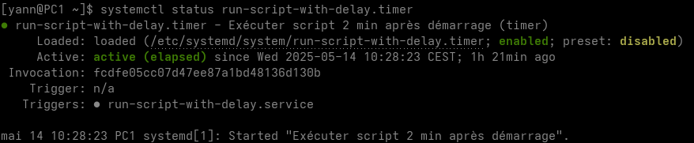

+++
title = 'Démarrer ou éteindre une machine distante sur le réseau via ssh et "wake on lan"'
date = 2022-12-09 00:00:00 +0100
categories = application
+++
## Démarrer-Eteindre une machine sur le réseau

*On veut démarrer ou éteindre une machine distante sur le réseau via ssh et "wake on lan"*

### Wake on Lan

[How To Wake Up Computers Using Linux Command [ Wake-on-LAN ( WOL ) ] By Sending Magic Packets](https://www.cyberciti.biz/tips/linux-send-wake-on-lan-wol-magic-packets.html)  
wake-on-LAN (WOL) est une norme de réseau Ethernet qui permet d'allumer un serveur par un message réseau. Vous devez envoyer des "paquets magiques" aux adaptateurs Ethernet et aux cartes mères compatibles avec le WOL pour allumer les systèmes concernés. Assurez-vous de connecter la carte réseau (eth0 ou eth1) à la carte mère et d'activer la fonction WOL du BIOS. Voici un guide rapide pour activer la fonction WOL sous RHEL / Fedora / CentOS / Debian / Ubuntu Linux.

Dans le bios du lenovo M700, le paramètre "wake on lan" est sur automatique.  
Lorsque le Lenovo M700 eest éteint, on peut le rallumer avec un outil logiciel et l'adresse mac de la machine

Il faut utiliser un logiciel client pour envoyer les "paquets magiques" WoL (Wake-on-LAN) au système cible. Vous trouverez divers outils pour tous les systèmes d'exploitation modernes, notamment MS-Windows 8/10, Apple macOS & OS X, toutes les distros Linux modernes, FreeBSD, OpenBSD, NetBSD et de nombreux smartphones.Il existe également un script Perl pour réveiller les ordinateurs. Nous pouvons l'installer comme suit

    sudo apt install wakeonlan # Debian/Ubuntu 
    yay -S wakeonlan # archlinux

Vous pouvez obtenir l'adresse MAC en combinant la commande ping et la commande arp.

    ping -c 1 192.168.0.205 && arp -n

```
PING 192.168.0.205 (192.168.0.205) 56(84) octets de données.
64 octets de 192.168.0.205 : icmp_seq=1 ttl=64 temps=0.332 ms

--- statistiques ping 192.168.0.205 ---
1 paquets transmis, 1 reçus, 0% packet loss, time 0ms
rtt min/avg/max/mdev = 0.332/0.332/0.332/0.000 ms
192.168.0.205            ether   00:23:24:c9:06:86   C                     enp2s0
```

Arrêter la machine ayant l"adresse IP 192.168.0.205  
Utilisation d'une adresse de diffusion de sous-réseau :

    wakeonlan -i 192.168.0.255 00:23:24:c9:06:86

```
Sending magic packet to 192.168.0.255:9 with payload 00:23:24:c9:06:86
Hardware addresses: <total=1, valid=1, invalid=0>
Magic packets: <sent=1>
```

Patienter 2 à 3 minutes avant d'accéder à la machine...

### PC1 - Script au démarrage

*On veut démarrer la machine distante Lenovo 192.168.0.205 via le réseau*

#### Option A - Exécution commande au démarrage après un délai défini (ACTIF)

**Fichier service systemd pour exécuter un script N minutes après le démarrage**  
Nous devons créer un fichier de **service systemd unit** et un **fichier timer systemd** unit correspondant pour exécuter le script N minutes après le démarrage.   
Nous pouvons utiliser `OnBootSec=` ou `OnStartupSec=` pour exécuter le script avec un délai après le démarrage sous Linux.

*    `OnBootSec=` Définit un délai relatif au moment où la machine a été démarrée. Dans les conteneurs, pour l'instance du gestionnaire de système, cela correspond à OnStartupSec=, ce qui rend les deux équivalents.
*    `OnStartupSec=` Définit une minuterie relative au moment où le gestionnaire de services a été démarré pour la première fois. Pour les unités de temporisation du système, cela est très similaire à OnBootSec= car le gestionnaire de services du système est généralement démarré très tôt au démarrage. Il est principalement utile lorsqu'il est configuré dans des unités fonctionnant dans le gestionnaire de services par utilisateur, car le gestionnaire de services utilisateur est généralement démarré à la première connexion seulement, et pas déjà au démarrage.

    /etc/systemd/system/run-script-with-delay.service

```
[Unit]
Description=Exécuter script au démarrage

[Service]
Type=oneshot
ExecStart=/usr/bin/wakeonlan -i 192.168.0.255 00:23:24:c9:06:86
TimeoutStartSec=0
```

**fichier de temporisation de l'unité systemd pour exécuter un script N minutes après le démarrage**  
`timer` est un fichier de configuration d'unité dont le nom se termine par **".timer"** encode des informations sur un timer contrôlé et supervisé par systemd, pour une activation basée sur un timer.

    /etc/systemd/system/run-script-with-delay.timer

```
[Unit]
Description="Exécuter script 2 min après démarrage"

[Timer]
OnBootSec=2min

[Install]
WantedBy=default.target
```

L'unité à activer lorsque cette minuterie s'écoule est fournie en utilisant `Unit=` sous `[Timer]`. Ici, puisque notre service systemd et notre fichier de temporisation portent le même nom, c'est-à-dire `run-script-with-delay`, nous n'avons pas défini d'`Unit=` dans le fichier d'unité de la temporisation. Si les noms de votre service unitaire et de votre fichier timer sont différents, fournissez le nom du fichier de service mappé avec `Unit=` dans le fichier .timer sous `[Timer]`  
Ici pour **OnBootSec** ou **OnStartupSec** 

*    Les arguments des directives sont des intervalles de temps configurés en secondes. Exemple : `OnBootSec=50` signifie 50s après le démarrage.
*    L'argument peut également inclure des unités de temps. Exemple : `OnBootSec=5h 30min` signifie 5 heures et 30 minutes après le démarrage.
*    Pour plus de détails sur la syntaxe des intervalles de temps pris en charge par `OnBootSec=` ou `OnStartupSec=`, consultez la [page de manuel de systemd.timer](https://www.freedesktop.org/software/systemd/man/systemd.time.html#).

Rafraîchir les fichiers de configuration de systemd

    sudo systemctl daemon-reload

Activez ensuite le fichier de temporisation de l'unité systemd afin qu'il soit exécuté après le démarrage et déclenche ensuite le fichier de service de l'unité systemd mappé en fonction de la valeur de la temporisation.

    sudo systemctl enable run-script-with-delay.timer --now

Status timers: `systemctl list-timers`

```
NEXT                           LEFT LAST                               PASSED UNIT                             ACTIVATES                         
[...]
-                                 - Wed 2025-05-14 10:19:55 CEST       2s ago run-script-with-delay.timer      run-script-with-delay.service
```

**Vérifier la configuration du fichier d'unité systemd**  
Après le redémarrage, lorsque nous vérifions l'état de `run-script-with-delay.timer`, observez ici la section en surbrillance où il montre le prochain déclenchement qui est prévu après 2 minutes que nous avons configuré avec `OnBootSec` dans le fichier unité timer.  
  

#### Option B - Exécution commande au démarrage quand réseau accessible

Exécuter la commande au démarrage avec systemd après que le réseau soit devenu accessible.

    sudo nano /etc/systemd/system/run-at-startup.service

```
[Unit]
Description=Exécuter script au boot quand réseau accessible
After=network.target

[Service]
Type=simple
RemainAfterExit=yes
ExecStart=/usr/bin/wakeonlan -i 192.168.0.255 00:23:24:c9:06:86
TimeoutStartSec=0

[Install]
WantedBy=default.target
```

Rafraîchir les fichiers de configuration de systemd et activer le service

    sudo systemctl daemon-reload
    sudo systemctl enable run-at-startup.service

Vérifier la bonne exécution

    journalctl -u run-at-startup.service

```
févr. 23 19:57:12 archyan systemd[1]: Started Run script at startup after network becomes reachable.
févr. 23 19:57:12 archyan startup_script.sh[462]: Sending magic packet to 192.168.0.255:9 with payload 00:23:24:c9:06:86
févr. 23 19:57:12 archyan startup_script.sh[462]: Hardware addresses: <total=1, valid=1, invalid=0>
févr. 23 19:57:12 archyan startup_script.sh[462]: Magic packets: <sent=1>
```

### PC1 - Script à l'arrêt

*On veut arrêter la machine distante Lenovo 192.168.0.205 via ssh lors de l'extinction de PC1*

#### Option A - Exécuter une commande systemd juste avant l'arrêt

    sudo nano /etc/systemd/system/stop_prox.service

```
[Unit]
Description=Run my custom task at shutdown
DefaultDependencies=no
Before=shutdown.target

[Service]
Type=oneshot
ExecStart=/usr/bin/ssh leno@192.168.0.205 -p 55145 -i /usr/local/bin/lenovo-ed25519 'sudo systemctl poweroff'
TimeoutStartSec=0

[Install]
WantedBy=shutdown.target
```

Rafraîchir les fichiers de configuration de systemd et activer le service

    sudo systemctl daemon-reload
    sudo systemctl enable stop_prox.service

Vérifier la bonne exécution

    journalctl -u stop_prox.service

```
févr. 23 19:49:09 archyan systemd[1]: Starting Run my custom task at shutdown...
févr. 23 19:49:09 archyan systemd[1]: stop_prox.service: Deactivated successfully.
févr. 23 19:49:09 archyan systemd[1]: Finished Run my custom task at shutdown.
```

#### Option B - Comment lancer un script systemd à l'arrêt seulement et pas au redémarrage 

1 - Créer un script type

Pour exécuter un script à l'arrêt uniquement avec systemd, nous avons besoin d'un script. Voici un script fictif qui nous aidera à reconnaître si notre script est appelé à `reboot.target` ou `shutdown.target`. Avec `systemctl list-jobs` nous connaissons la cible actuellement active et en cours d'exécution. Le script ne devrait donc fonctionner que sur `shutdown.target` ou `reboot.target`.

    /home/admuser/script.sh

```shell
#!/bin/bash
# Run script with systemd at shutdown only 

case $1 in
        start)
        systemctl list-jobs | egrep -q 'reboot.target.*start' && echo "starting reboot" >> /home/admuser/file
        systemctl list-jobs | egrep -q 'shutdown.target.*start' && echo "starting shutdown" >> /home/admuser/file
        ;;

        stop)
        systemctl list-jobs | egrep -q 'reboot.target.*start' || echo "stopping"  >> /home/admuser/file
        ;;

esac
```

La fonction `stop` qui ne sera pas appelée est juste pour prouver ce fait, cette fonction est nécessaire. Dans ce cas, seul `start` sera appelé pour exécuter le script avec systemd à l'arrêt seulement et non au redémarrage.

2 - Créer un fichier service pour exécuter le script avec systemd à l'arrêt seulement.

Nous allons créer notre fichier unitaire systemd sous `/etc/systemd/system` avec le nom `shutdown-only.service`.

Voici notre fichier d'unité systemd que nous utiliserons pour exécuter un script avec systemd à l'arrêt uniquement (pas au redémarrage).

    /etc/systemd/system/shutdown-only.service

```shell
[Unit]
Description=Run my custom task at shutdown only
DefaultDependencies=no
Conflicts=reboot.target
Before=poweroff.target halt.target shutdown.target
Requires=poweroff.target

[Service]
Type=oneshot
ExecStart=/home/admuser/script.sh start
RemainAfterExit=yes

[Install]
WantedBy=shutdown.target
```


Voici la page de manuel de systemd.unit et systemd.service.

*    **Conflicts** Si une unité a un paramètre `Conflits=` sur une autre unité, le démarrage de la première arrêtera la seconde et vice versa.
*    **Before=** Ils configurent les dépendances d'ordre entre les unités.
*    **Requires** Configure les dépendances d'exigence sur d'autres unités. Si cette unité est activée, les unités listées ici seront également activées.
*    **Type** Configure le type de démarrage du processus pour cette unité de service. Un des types suivants : simple, forking, oneshot, dbus, notify ou idle.
*    **ExecStart** Commandes avec leurs arguments qui sont exécutées lorsque ce service est démarré.
*    **RemainAfterExit** Prend une valeur booléenne qui spécifie si le service doit être considéré comme actif même lorsque tous ses processus ont quitté. La valeur par défaut est no.

Rafraîchir les fichiers de configuration de systemd

    systemctl daemon-reload

Activer le script pour qu'il démarre automatiquement au prochain démarrage

    systemctl enable shutdown-only

```shell
Created symlink /etc/systemd/system/shutdown.target.wants/shutdown-only.service → /etc/systemd/system/shutdown-only.service.
```

3 - Vérifier la configuration du fichier unité systemd

Vérifions notre fichier unitaire systemd. Nous allons effectuer un arrêt de mon Linux pour vérifier s'il exécute le script avec systemd à l'arrêt seulement et non au redémarrage.

    systemctl poweroff

Après le réveil du nœud, nous vérifions le contenu de notre fichier /home/admuser/file où nous avons écrit le contenu de notre script factice.

```shell
login as: root
root@127.0.0.1's password:
Last login: Tue Jan 14 22:41:22 2020 from 10.0.2.2

[root@centos-8 ~]# cat /home/admuser/file
starting shutdown
```

Comme prévu, le script a été appelé à l'arrêt. 

Maintenant, nous allons faire un reboot et vérifier la même chose.  
Avant de redémarrer, je vais nettoyer le contenu de /home/admuser/file.

Comme prévu, le contenu de /home/admuser/file est vide et le script n'a pas été appelé au redémarrage.

```shell
[root@centos-8 ~]# cat /home/admuser/file
[root@centos-8 ~]#
```

Les différents cas

```
/usr/bin/systemctl list-jobs | egrep -q 'shutdown.target.*start' && echo "shutting down" >> /home/admuser/test.txt || echo "not shutting down" >> /home/admuser/test.txt
/usr/bin/systemctl list-jobs | egrep -q 'reboot.target.*start' && echo "-> rebooting" >> /home/admuser/test.txt || echo "-> not rebooting" >> /home/admuser/test.txt
/usr/bin/systemctl list-jobs | egrep -q 'halt.target.*start' && echo "-> halting" >> /home/admuser/test.txt || echo "-> not halting" >> /home/admuser/test.txt
/usr/bin/systemctl list-jobs | egrep -q 'poweroff.target.*start' && echo "-> powering down" >> /home/admuser/test.txt || echo "-> not powering down" >> /home/admuser/test.txt
```

**Mise en oeuvre sur PC1**

Copier la clé privée SSH dans /usr/local/bin

    sudo cp /home/yann/.ssh/lenovo-ed25519 /usr/local/bin/lenovo-ed25519

Se connecter une fois pour valider la clé

    sudo ssh leno@192.168.0.215 -p 55215 -i /usr/local/bin/lenovo-ed25519

Service systemd

    sudo nano /etc/systemd/system/stop_prox.service

```shell
[Unit]
Description=Exécuter commande seulement si arrêt
DefaultDependencies=no
Conflicts=reboot.target
Before=poweroff.target halt.target shutdown.target
Requires=poweroff.target

[Service]
Type=oneshot
ExecStart=/usr/bin//usr/bin/ssh leno@192.168.0.215 -p 55215 -i /usr/local/bin/lenovo-ed25519 'sudo systemctl poweroff' 'sudo systemctl poweroff'
RemainAfterExit=yes

[Install]
WantedBy=shutdown.target
```

Rafraîchir les fichiers de configuration de systemd et activer le service

    sudo systemctl daemon-reload
    sudo systemctl enable stop_prox.service 


