+++
title = 'Yunohost Contabo debian 11 ouestyan.fr'
date = 2022-12-17 00:00:00 +0100
categories = vps yunohost
+++
  
<https://contabo.com/en/>

Fournisseur : **Contabo**  
Accès client : <https://my.contabo.com/>  
Nom du plan : **VPS S SSD**  
Location Nuremberg (EU)  
RAM garantie : **8192 Mb**  
Bande passante mensuelle illimitée  
**Espace disque SSD 200 Go**  
Système d'exploitation : **Debian 11**  
Technologie de virtualisation **KVM**  
Emplacement du serveur Allemagne   
Frais d'installation 0.00 EUR  
Coût mensuel 5,74 USD, 4,99 EUR soit 5.99€/Mois TTC  
Méthodes de paiement  PayPal  

IP address **62.171.147.4**  
Accès client : <https://my.contabo.com/>

Sous-réseau IPv6   
*Chaque serveur dédié et chaque VPS est livré avec un sous-réseau IPv6 /64 en plus de son adresse IPv4. Vous pouvez utiliser les adresses de ce sous-réseau librement sur le serveur/VPS associé. IPv6 est déjà préconfiguré sur nos serveurs mais doit être activé explicitement dans certains cas. Vous trouverez comment activer IPv6 et d'autres informations sur le sujet dans notre tutoriel.*

| type d'abonnement |adresse IPv4 | sous-réseau IPv6  |
| :------------- |:-------------| :-----|
| VPS S SSD (no setup) | 62.171.147.4 | 2a02:c207:2098:7283:0000:0000:0000:0001 / 64 |


On se connecte en root sur le VPS

    ssh root@62.171.147.4

```
Linux vmi987283.contaboserver.net 5.10.0-12-amd64 #1 SMP Debian 5.10.103-1 (2022-03-07) x86_64
  _____
 / ___/___  _  _ _____ _   ___  ___
| |   / _ \| \| |_   _/ \ | _ )/ _ \
| |__| (_) | .` | | |/ _ \| _ \ (_) |
 \____\___/|_|\_| |_/_/ \_|___/\___/

Welcome!

This server is hosted by Contabo. If you have any questions or need help,
please don't hesitate to contact us at support@contabo.com.

root@vmi987283:~# 
```

**Quelques outils**, exécuter `apt install tree tmux`  
**Activation ipv6**, exécuter `enable_ipv6` puis redémarrer `reboot` et se reconnecter ssh  

Vérifier l'adressage : `ip a`

```
1: lo: <LOOPBACK,UP,LOWER_UP> mtu 65536 qdisc noqueue state UNKNOWN group default qlen 1000
    link/loopback 00:00:00:00:00:00 brd 00:00:00:00:00:00
    inet 127.0.0.1/8 scope host lo
       valid_lft forever preferred_lft forever
    inet6 ::1/128 scope host 
       valid_lft forever preferred_lft forever
2: eth0: <BROADCAST,MULTICAST,UP,LOWER_UP> mtu 1500 qdisc pfifo_fast state UP group default qlen 1000
    link/ether 00:50:56:47:96:e2 brd ff:ff:ff:ff:ff:ff
    altname enp0s18
    altname ens18
    inet 62.171.147.4/19 brd 62.171.159.255 scope global eth0
       valid_lft forever preferred_lft forever
    inet6 2a02:c207:2098:7283::1/64 scope global 
       valid_lft forever preferred_lft forever
    inet6 fe80::250:56ff:fe47:96e2/64 scope link 
       valid_lft forever preferred_lft forever
```

Se connecter sur contabo <https://my.contabo.com/>

Activer le reverse DNS IPV4 et IPV6 avec ouestyan.fr : Control panel &rarr; **Reverse DNS management**  
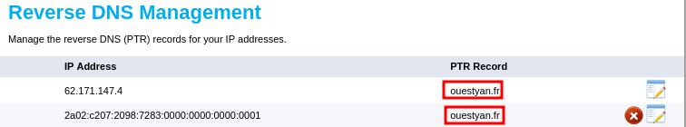

VNC : Control panel &rarr; **VPS control**  
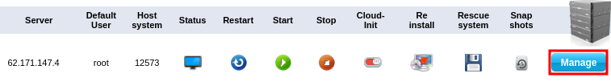  
Changement mot de passe VNC, cliquer sur **Manage** &rarr; **VNC Password**  
Désactiver VNC, cliquer sur **Manage** &rarr; **Disable VNC** et valider par un clic sur **Disable**  
`SUR CE VPS, VNC EST DESACTIVE`{: .prompt-warning }

Modifier le DNS du domaine ouestyan.fr chez le fournisseur OVH  

```
$TTL 3600
@	IN SOA dns17.ovh.net. tech.ovh.net. (2022082202 86400 3600 3600000 60)
                       IN NS     ns17.ovh.net.
                       IN NS     dns17.ovh.net.
                       IN MX     10 ouestyan.fr.
                       IN A      62.171.147.4
                       IN AAAA   2a02:c207:2098:7283::1
*                      IN A      62.171.147.4
*                      IN AAAA   2a02:c207:2098:7283::1
```

## Yunohost ouestyan.fr


### Installer yunohost

Installation d'un nouveau YunoHost sur un Debian 11/Bullseye

    curl https://install.yunohost.org | bash

Patienter ...

```

 ┌───────────────────────────┤ SSH Configuration ├────────────────────────────┐
 │                                                                            │
 │ To improve the security of your server, it is recommended to let YunoHost  │
 │ manage the SSH configuration.                                              │
 │ Your current SSH configuration differs from the recommended configuration. │
 │ If you let YunoHost reconfigure it, the way you connect to your server     │
 │ through SSH will change in the following way:                              │
 │ - you will not be able to connect as root through SSH. Instead you should  │
 │ use the admin user ;                                                       │
 │                                                                            │
 │ Do you agree to let YunoHost apply those changes to your configuration and │
 │ therefore affect the way you connect through SSH ?                         │
 │                                                                            │
 │                     <Yes>                        <No>                      │
 │                                                                            │
 └────────────────────────────────────────────────────────────────────────────┘
Choix Yes

[ OK ] YunoHost installation completed !
===============================================================================
You should now proceed with Yunohost post-installation. This is where you will
be asked for :
  - the main domain of your server ;
  - the administration password.

You can perform this step :
  - from the command line, by running 'yunohost tools postinstall' as root
  - or from your web browser, by accessing : 
    - https://62.171.147.4/ (global IP, if you're on a VPS)

If this is your first time with YunoHost, it is strongly recommended to take
time to read the administator documentation and in particular the sections
'Finalizing your setup' and 'Getting to know YunoHost'. It is available at
the following URL : https://yunohost.org/admindoc
===============================================================================
```

### Post-installation

Vous devez faire la post-installation
{: .prompt-info }

    yunohost tools postinstall

```
Main domain: ouestyan.fr
New administration password: ****************
Confirm new administration password: ****************
Info: Installing YunoHost...
[...]
Success! YunoHost is now configured
Warning: The post-install completed! To finalize your setup, please consider:
    - adding a first user through the 'Users' section of the webadmin (or 'yunohost user create <username>' in command-line);
    - diagnose potential issues through the 'Diagnosis' section of the webadmin (or 'yunohost diagnosis run' in command-line);
    - reading the 'Finalizing your setup' and 'Getting to know YunoHost' parts in the admin documentation: https://yunohost.org/admindoc.
```

>Le mot de passe root remplacé par celui de l'admin yunohost

Motd

    rm /etc/motd && nano /etc/motd

```bash
 __   __                 _              _                
 \ \ / /_  _  _ _   ___ | |_   ___  ___| |_              
  \ V /| || || ' \ / _ \| ' \ / _ \(_-<|  _|             
   |_|  \_,_||_||_|\___/|_||_|\___//__/ \__|             
    __  ___     _  ____  _     _  _ _  ____  _ _         
   / / |_  )   / ||__  |/ |   / || | ||__  || | |        
  / _ \ / /  _ | |  / / | | _ | ||_  _| / /_|_  _|       
  \___//___|(_)|_| /_/_ |_|(_)|_|  |_| /_/(_) |_|__      
  ___  _  _  ___  ___| |_  _  _  __ _  _ _      / _| _ _ 
 / _ \| || |/ -_)(_-<|  _|| || |/ _` || ' \  _ |  _|| '_|
 \___/ \_,_|\___|/__/ \__| \_, |\__,_||_||_|(_)|_|  |_|  
                           |__/                          
```

### Créer utilisateur yack 

Création utilisateur yack

    yunohost user create yack

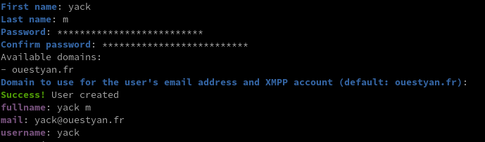

Ajouter le droit de connexion ssh à un utilisateur (FACULTATIF)

    yunohost user permission add ssh yack

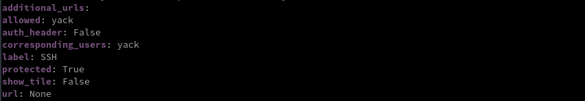

### Domaines et DNS OVH

{:width="50"} 

Configuration DNS domaine par défaut **ouestyan.fr** , exécuter la commande `yunohost domain dns-conf ouestyan.fr` pour afficher la configuration

```
; Basic ipv4/ipv6 records
@ 3600 IN A 62.171.147.4
@ 3600 IN AAAA 2a02:c207:2098:7283::1

; Mail
@ 3600 IN MX 10 ouestyan.fr.
@ 3600 IN TXT "v=spf1 a mx -all"
mail._domainkey 3600 IN TXT "v=DKIM1; h=sha256; k=rsa; p=MIGfMA0GCSqGSIb3DQEBAQUAA4GNADCBiQKBgQD3/lxkCrD5jmxFJTeXvqT1BlOHTPnuynI/5k+GlpOwt3bMDK6EHx1/ZS4Bx5lB9P1f/SjkyAm83ZTh0piu5Q3Wmb+ZzDGGsSeiOYVUUT0q4p3iMDnGyx6G27N7pWpUQjX3E6xoDZLJftoKO/6td0TcJjhBLkkujs9yeAtixxzNmQIDAQAB"
_dmarc 3600 IN TXT "v=DMARC1; p=none"


; XMPP
_xmpp-client._tcp 3600 IN SRV 0 5 5222 ouestyan.fr.
_xmpp-server._tcp 3600 IN SRV 0 5 5269 ouestyan.fr.
muc 3600 IN CNAME @
pubsub 3600 IN CNAME @
vjud 3600 IN CNAME @
xmpp-upload 3600 IN CNAME @

; Extra
* 3600 IN A 62.171.147.4
* 3600 IN AAAA 2a02:c207:2098:7283::1
@ 3600 IN CAA 128 issue "letsencrypt.org"
```

  
Se connecter à l'espace client du site OVH : **Web cloud &rarr; Domaines &rarr; ouestyan.fr &rarr; Zone DNS**  
Cliquer sur **"Modifier en mode textuel"**, garder les 4 premières lignes :  
{:width="600"}  
puis effacer tout ce qu'il y a en-dessous, et le remplacer par la configuration donnée par votre serveur ( `yunohost domain dns-conf`)  
`EN CAS DE PROBLEME, les enregistrements DNS doivent être ajoutés avec l'outil OVH`{: .prompt-warning }

### Activer Certificats SSL Let's Encrypt

  
On active les certificats SSL pour le domaine ouestyan.fr

Se connecter avec le lien <http://62.171.147.4/yunohost/admin/#/login?redirect=%2F>  
**Domaines** &rarr; **ouestyan.fr** et cliquer sur la création de certificat** Let's Encrypt**  
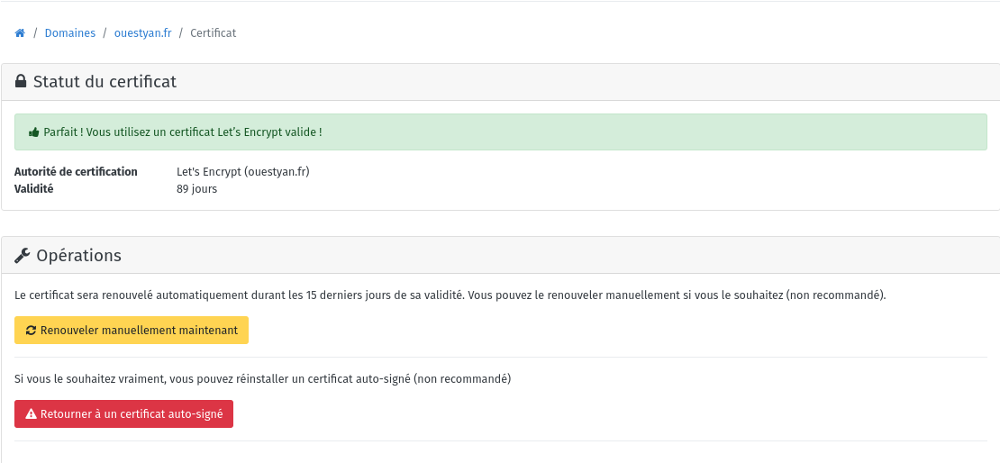

Ouvrir le lien <https://ouestyan.fr>

### OpenSSH, clé et script

{:height="70"}  
<u>sur l'ordinateur de bureau</u>
Générer une paire de clé curve25519-sha256 (ECDH avec Curve25519 et SHA2) nommé **contabovps** pour une liaison SSH avec le serveur KVM.  

    ssh-keygen -t ed25519 -o -a 100 -f ~/.ssh/contabovps

Envoyer les clés publiques sur le serveur KVM aux utilisateurs admin et yack  

    ssh-copy-id -i ~/.ssh/contabovps.pub admin@ouestyan.fr
    ssh-copy-id -i ~/.ssh/contabovps.pub yack@ouestyan.fr

<u>sur le serveur Yunohost</u>
On se connecte  

    ssh admin@ouestyan.fr

Sur votre serveur, la modification du fichier de configuration SSH pour désactiver l'authentification par mot de passe est gérée par un paramètre système 

    sudo yunohost settings set security.ssh.password_authentication -v no

Modifier le port SSH

*Pour empêcher les tentatives de connexion SSH par des robots qui analysent Internet à la recherche de tout serveur sur lequel SSH est activé, vous pouvez modifier le port SSH. Ceci est géré par un paramètre système, qui prend en charge la mise à jour de la configuration SSH et Fail2Ban.*

    sudo yunohost settings set security.ssh.port -v 55147

Accès depuis le poste distant avec la clé privée  

    ssh -p 55147 -i ~/.ssh/contabovps admin@ouestyan.fr
    ssh -p 55147 -i ~/.ssh/contabovps yack@ouestyan.fr

### Diagnostic

Après avoir attendu la validation des  DNS (quelques minutes à 24h)

    yunohost diagnosis run

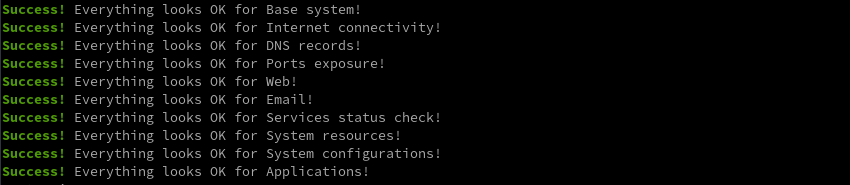

### Mises à jour automatique

*Unattended_upgrades est un outil qui permet de télécharger et installer les mises à jour de sécurité automatiquement et sans surveillance, en prenant soin de n'installer que les paquets provenant de la source APT configurée, et en vérifiant les invites dpkg concernant les modifications du fichier de configuration. Apticron est un simple script qui envoie des courriels sur les mises à jour de paquets en attente comme les mises à jour de sécurité, en gérant correctement les paquets en attente.*

Installation

  

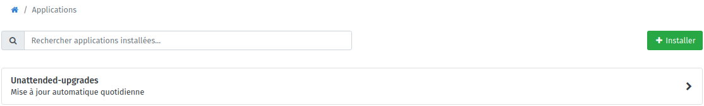

## Maintenance

### Problème certificat sur serveur SMTP

*je ne peux pas envoyer de message via Thunderbird  (problème de certificat)*

Le paramétrage IMAP port 993 et SMTP port 587  est effectué sans message d'erreur sur Linux Thunderbird version 102.
Lors de l'envoi d'un message j'ai un message d'erreur thunderbird

```
the certificate is not secure because it is impossible to verify 
that it was issued by a trusted authority...
```

**J'ai localisé le problème** en me connectant en SSH sur le VPS , en exécutant une commande pour vérifier la validité du certificat sur le serveur SMTP:

```bash
openssl s_client -starttls smtp -showcerts -connect ouestyan.fr:587 -servername ouestyan.fr
```

Le serveur SMTP n'a pas le certificat **Let's encrypt** mais le certificat **auto signé**  

```text
CONNECTED(00000003)
depth=1 CN = yunohost.org, O = yunohost
verify error:num=19:self signed certificate in certificate chain
verify return:1
depth=1 CN = yunohost.org, O = yunohost
verify return:1
depth=0 CN = ouestyan.fr
verify return:1
---
Certificate chain
 0 s:CN = ouestyan.fr
   i:CN = yunohost.org, O = yunohost
```

**Solution problème smtp**

Exécuter la commande suivante

    postmap -F hash:/etc/postfix/sni

Tester de nouveau la validité du certificat sur le serveur SMTP:

```bash
openssl s_client -starttls smtp -showcerts -connect ouestyan.fr:587 -servername ouestyan.fr
```

Le serveur SMTP utilise maintenant le certificat **Let's encrypt**  

```text
CONNECTED(00000003)
depth=2 C = US, O = Internet Security Research Group, CN = ISRG Root X1
verify return:1
depth=1 C = US, O = Let's Encrypt, CN = R3
verify return:1
depth=0 CN = ouestyan.fr
verify return:1
---
Certificate chain
 0 s:CN = ouestyan.fr
   i:C = US, O = Let's Encrypt, CN = R3
```

## Sauvegardes

### Borg


* [BorgBackup Yunohost --> Boîte de stockage](/posts/BorgBackup_Yunohost-Boite_de_stockage/)  
Dépôt borg : `ssh://u277865@u277865.your-storagebox.de:23/./backup/borg/ouestyan_fr`
* BorgBackup Yunohost -->  yanfi.space (serveur debian bullseye)  
Dépôt borg : `ssh://borg@yanfi.space:55178/srv/data/borg-backups/ouestyan_fr`

#### Installation borg

Le dépôt final : 'ssh://u277865@u277865.your-storagebox.de:23/./backup/borg/ouestyan_fr'  
La passphrase : CuscuteFroueAtaxieFilleSexismeRikiki  

Connexion en admin sur yunohost  
Installer une application, rechercher borg    
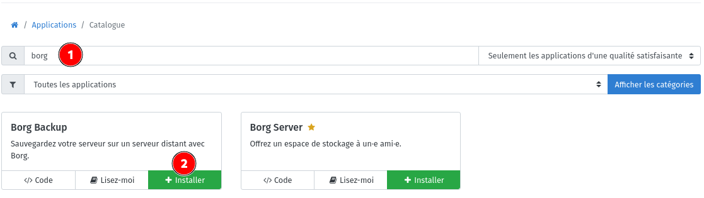  

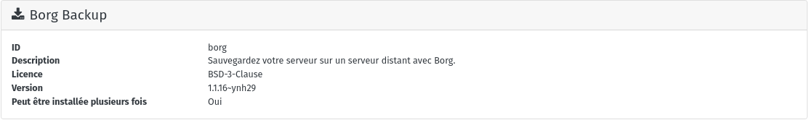  
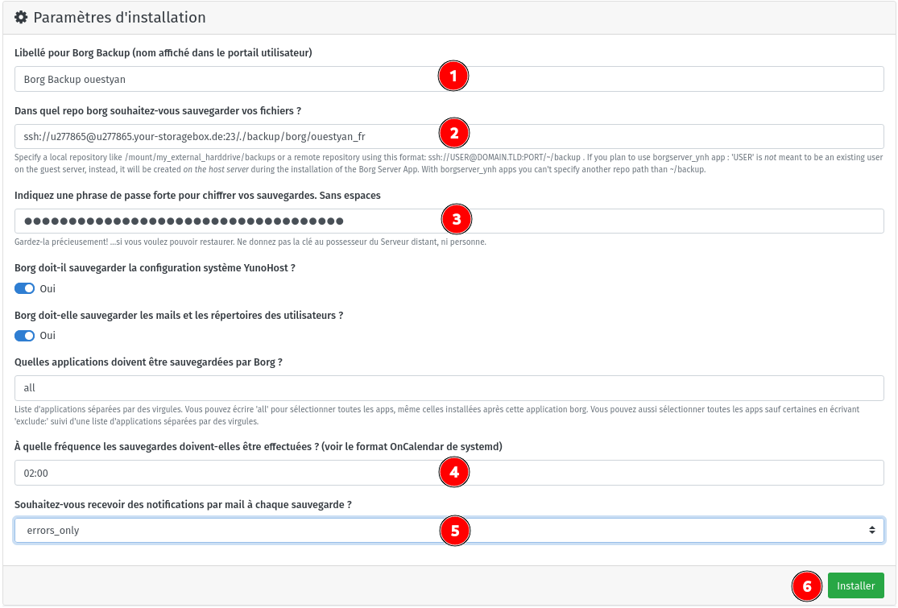  
(2) Remplacer par `ssh://borg@yanfi.space:55178/srv/data/borg-backups/ouestyan_fr` pour serveur debian
(4) Si l'on veut une sauvegarde à 2h00 du mation tous les jours, il faut remplacer `Daily` par `02:00`

Patienter ...  
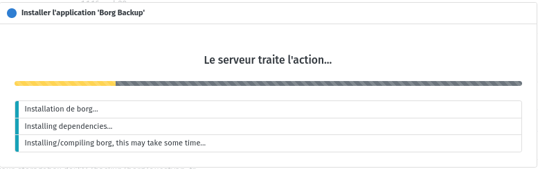{:width="400"}  
A la fin de l'installation  
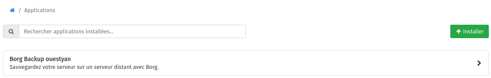  

#### boîte de stockage

Il faut récupérer la clé publique destinée à la boîte de stockage <u277865@u277865.your-storagebox.de>
En ligne de commande et en mode su : `cat /root/.ssh/id_borg_ed25519.pub`

Clé publique à ajouter au fichier `/home/.ssh/authorized_keys` de la boîte de stockage **u277865@u277865.your-storagebox.de**

    ssh-ed25519 AAAAC3NzaC1lZDI1NTE5AAAAIA7M8tQJ9glaKInMLjTzYAeUh44Ftv9gKCMwtg6F8Yy9 root@ouestyan.fr

Tester la liaison boîte de stockage

    sftp -P 23 -i /root/.ssh/id_borg_ed25519 u277865@u277865.your-storagebox.de

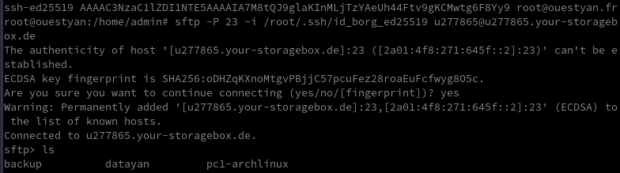  

#### Tester la configuration borg

À cette étape, votre sauvegarde devrait se dérouler à l'heure prévue (tous les jours à 2h00). Notez que la première sauvegarde peut être très longue, car de nombreuses données doivent être copiées via ssh. Les sauvegardes suivantes sont incrémentielles : seules les données nouvellement générées depuis la dernière sauvegarde seront copiées.
{: .prompt-info }

Si vous voulez tester la configuration correcte de Borg Apps avant l'heure prévue, vous pouvez lancer une sauvegarde manuellement sur le serveur Yunohost ouestyan.fr :

On passe en tmux

```bash
sudo -s
tmux
systemctl start borg
# Ctrl b d pour sortir de la session tmux
```

Patienter quelques minutes...

#### Lister les sauvegardes

Commande à exécuter en mode su

    sudo -s
    app=borg; BORG_PASSPHRASE="$(yunohost app setting $app passphrase)" BORG_RSH="ssh -i /root/.ssh/id_${app}_ed25519 -oStrictHostKeyChecking=yes " borg list "$(yunohost app setting $app repository)"

Exemple  

```
_auto_conf-2022-08-22_21:08          Mon, 2022-08-22 21:08:24 [ab8501c566921e9c2cd70baacb2f2fc886da204a95cdb5b3e6c87e19d1377b32]
_auto_data-2022-08-22_21:08          Mon, 2022-08-22 21:08:50 [2a263b08aa75c81e932e6cac9eea263c8f340b39e7ff9851a22cbadd7b931158]
_auto_borg-2022-08-22_21:09          Mon, 2022-08-22 21:09:07 [0e0fdeead7502c08acb7d3d875337ef4db0ec77667628309aab17b52aecbe15a]
```

## Données 

### /srv/datayan ouestyan.fr

Le dossier datayan va contenir tous les dossiers de données :  
**BiblioCalibre  CalibreTechnique  media  musique  static  www**
{: .prompt-info }

Créer un utilisateur Linux avec un répertoire Home personnalisé `/srv/datayan`, un Shell, un commentaire, un UID et un GID personnalisés

    sudo useradd -m -d /srv/datayan -s /bin/bash -c "Dossiers yannick" -u 1000 userdata

Ajouter cet utilisateur au groupe users

    sudo usermod -a -G users userdata

Vérifier

    sudo id userdata

`uid=1000(userdata) gid=1002(userdata) groups=1002(userdata),100(users)`

Droits sur le dossier

    sudo chown userdata:users -R /srv/datayan/

Passer en mode su

    sudo -s

Passer en utilisateur userdata

    su -- userdata

Création dossier `.ssh` , utilisateur "userdata"

    mkdir /srv/datayan/.ssh

On va créer un jeu de clés SSH **contabo_ouestyan** avec l'utilisateur userdata pour un accès à la boîte de stockage

    ssh-keygen -t ed25519 -o -a 100 -f /srv/datayan/.ssh/contabo_ouestyan

Ajout contenu de la clé publique **/srv/datayan/.ssh/contabo_ouestyan.pub** au fichier **/home/.ssh/authorized_keys** de la boîte de stockage **u277865@u277865.your-storagebox.de**  

    ssh-ed25519 AAAAC3NzaC1lZDI1NTE5AAAAIBp5SbDA0UkQSE2UizFG/ZZNmsD6LsVzYfvR3xgAetAu userdata@ouestyan.fr

Test de la connexion

    sftp -P 23 -i /srv/datayan/.ssh/contabo_ouestyan u277865@u277865.your-storagebox.de

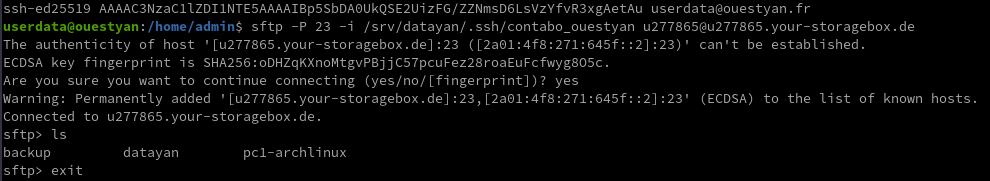

Création des dossiers

    mkdir -p /srv/datayan/{www,BiblioCalibre,CalibreTechnique,musique,static}

Télécharger les contenus du dossier **/srv/datayan/** de la boîte de stockage  
On passe en tmux pour exécuter le script en arrière plan

    tmux

Exécuter le script suivant

```bash
# les dossiers sous /srv/datayan/ : BiblioCalibre  CalibreTechnique musique  static  www
rsync -avz --progress --exclude '.ssh/*' -e "ssh -p 23 -i /srv/datayan/.ssh/contabo_ouestyan -o StrictHostKeyChecking=no -o UserKnownHostsFile=/dev/null" --recursive u277865@u277865.your-storagebox.de:datayan/www/ /srv/datayan/www/ 
rsync -avz --progress --exclude '.ssh/*' -e "ssh -p 23 -i /srv/datayan/.ssh/contabo_ouestyan -o StrictHostKeyChecking=no -o UserKnownHostsFile=/dev/null" --recursive u277865@u277865.your-storagebox.de:datayan/static/ /srv/datayan/static/ 
rsync -avz --progress --exclude '.ssh/*' -e "ssh -p 23 -i /srv/datayan/.ssh/contabo_ouestyan -o StrictHostKeyChecking=no -o UserKnownHostsFile=/dev/null" --recursive u277865@u277865.your-storagebox.de:datayan/BiblioCalibre/ /srv/datayan/BiblioCalibre/ 
rsync -avz --progress --exclude '.ssh/*' -e "ssh -p 23 -i /srv/datayan/.ssh/contabo_ouestyan -o StrictHostKeyChecking=no -o UserKnownHostsFile=/dev/null" --recursive u277865@u277865.your-storagebox.de:datayan/CalibreTechnique/ /srv/datayan/CalibreTechnique/ 
rsync -avz --progress --exclude '.ssh/*' -e "ssh -p 23 -i /srv/datayan/.ssh/contabo_ouestyan -o StrictHostKeyChecking=no -o UserKnownHostsFile=/dev/null" --recursive u277865@u277865.your-storagebox.de:datayan/musique/ /srv/datayan/musique/ 
```

Sortie utilisateur "userdata" 

    exit

## Applications

### Nextcloud

Clone de la branche 24.0.0

    git clone --single-branch --branch 24.0.0 https://github.com/YunoHost-Apps/nextcloud_ynh 

Remplacer *php8.0-fpm* par *php7.4-fpm* dans le fichier `nextcloud_ynh/manifest.json`  

Installer Nextcloud version 24 avec PHP7.4  

    yunohost app install nextcloud_ynh 

```
DANGER! This app is not part of YunoHost's app catalog. Installing third-party apps may compromise the inte
grity and security of your system. You should probably NOT install it unless you know what you are doing. N
O SUPPORT will be provided if this app doesn't work or breaks your system... If you are willing to take tha
t risk anyway, type 'Yes, I understand': Yes, I understand
Choose the domain where this app should be installed [ouestyan.fr]: ouestyan.fr
Choose the URL path (after the domain) where this app should be installed: /nextcloud
Choose an administrator user for this app [yack]: yack
Should this app be exposed to anonymous visitors? [yes | no]: yes
Access the users home folder from Nextcloud? [yes | no]: yes
Info: Installing nextcloud...
Info: [....................] > Validating installation parameters...
Info: [....................] > Storing installation settings...
Info: [+...................] > Installing dependencies...
Warning: Load smb config files from /etc/samba/smb.conf
Warning: Loaded services file OK.
Warning: Weak crypto is allowed
Warning: Server role: ROLE_STANDALONE
Info: [#+..................] > Creating a MySQL database...
Info: [##..................] > Setting up source files...
Info: [##..................] > Configuring system user...
Info: [##++++++++..........] > Configuring PHP-FPM...
Info: [##########+.........] > Configuring NGINX web server...
Info: [###########.........] > Creating a data directory...
Info: [###########++++.....] > Installing Nextcloud...
Info: [###############++...] > Configuring Nextcloud...
Info: [#################+..] > Adding multimedia directories...
Info: [##################..] > Configuring log rotation...
Info: [##################+.] > Configuring Fail2Ban...
Info: The service fail2ban has correctly executed the action reload-or-restart.
Info: [###################.] > Configuring permissions...
Info: [###################.] > Reloading NGINX web server...
Info: [####################] > Installation of nextcloud completed
Success! Installation completed
```

###  Audio Yann (zic.ouestyan.fr)

*Navidrome est un serveur et un streamer de collection de musique en ligne open source. Il vous donne la liberté d'écouter votre playlist à partir de n'importe quel navigateur ou appareil mobile.*

Votre musique est a stockée par default dans le dossier multimédia partagé /home/yunohost.multimedia/share/Music. Ce dossier, facilement accessible depuis Nextcloud avec Stockages externes activée, vous permettra d'uploader facilement vos fichiers de musique sur votre server.

Vous pouvez personnaliser le dossier de stockage de vos fichiers de musique en éditant le fichier de configuration **/var/lib/navidrome/navidrome.toml** et rediriger la variable `MusicFolder = "/home/yunohost.multimedia/share/Music"`. Vous pouvez également changer d'autre réglage en vous aidant de la [documentation](https://www.navidrome.org/docs/usage/configuration-options/).

En mode su

Ajout domaine zic.ouestyan.fr en mode administration web  
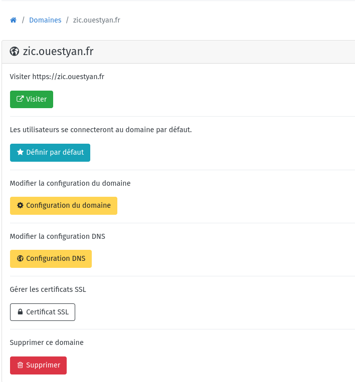{width="400"}

Modifier la configuration du domaine  
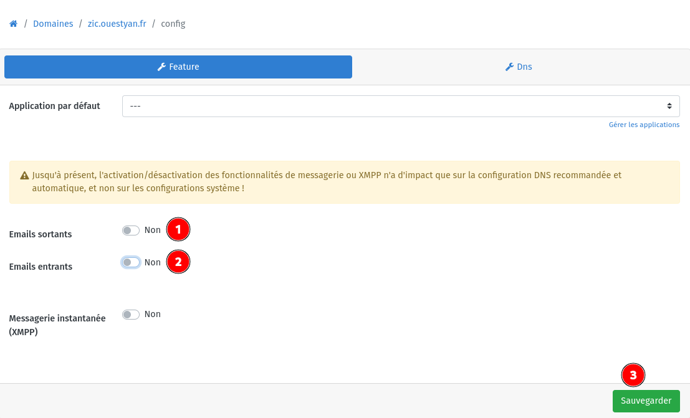 

Certificats

    yunohost domain cert-install zic.ouestyan.fr --no-checks

Installer navidrome  
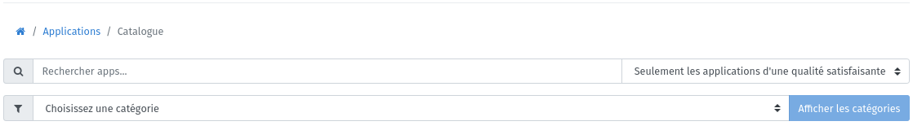 
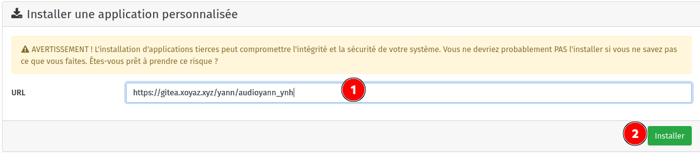 
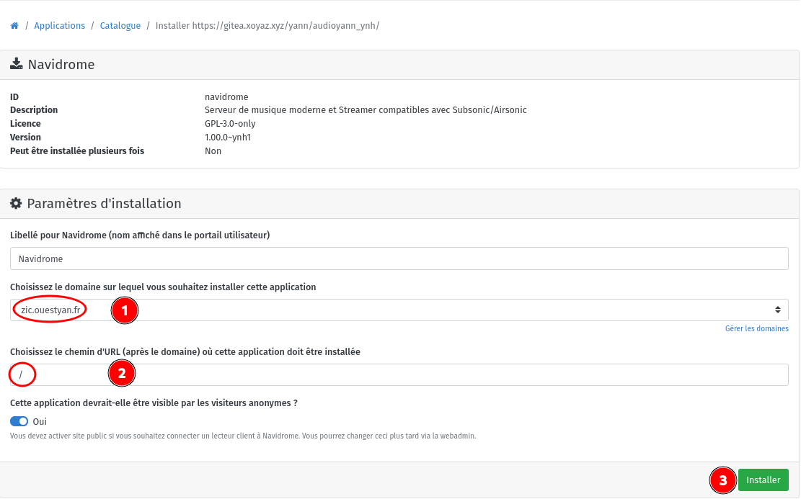 

Application navidrome  
Vérifier le paramétrage **/var/lib/navidrome/navidrome.toml**  

```
# Base URL (only the path part) to configure Navidrome behind a proxy (ex: /music)
BaseURL = "/"

# Folder where your music library is stored. Can be read-only
MusicFolder = "/srv/datayan/musique"
```

Créer un compte adminitrateur