+++
title = 'Portable Dell Latitude E6230 - EndeavourOS XFCE sur partition LVM'
date = 2022-12-25 00:00:00 +0100
categories = ['archlinux']
+++
*EndeavourOS est une distribution GNU/Linux basée sur Arch Linux* 

{:width="90"}  

- [Créer EndeavourOS USB Live](#créer-endeavouros-usb-live)
- [EndeavourOS XFCE sur partition LVM](#endeavouros-xfce-sur-partition-lvm)
    - [1 - Installation via USB LIVE](#1---installation-via-usb-live)
    - [2 - Partionner un disque](#2---partionner-un-disque)
    - [3 -Installer EndeavourOS sur une partition temporaire](#3--installer-endeavouros-sur-une-partition-temporaire)
    - [4 - Première connexion utilisateur sur EndeavourOS XFCE](#4---première-connexion-utilisateur-sur-endeavouros-xfce)
        - [Ajout lvm2 au HOOKS](#ajout-lvm2-au-hooks)
        - [Créer un volume physique et groupe LVM](#créer-un-volume-physique-et-groupe-lvm)
        - [Dupliquer la distribution temporaire dans des partitions LVM](#dupliquer-la-distribution-temporaire-dans-des-partitions-lvm)
    - [5 - Chroot sur le root LVM](#5---chroot-sur-le-root-lvm)
        - [Créer le fstab](#créer-le-fstab)
        - [grub EFI](#grub-efi)
        - [Sortie du chroot](#sortie-du-chroot)
    - [6 - Redémarrer la machine](#6---redémarrer-la-machine)
- [EndeavourOS XFCE](#endeavouros-xfce)
    - [Activation SSH](#activation-ssh)
    - [Mide à jour système](#mide-à-jour-système)
    - [Activation SSH](#activation-ssh)
    - [Ecran de veille](#ecran-de-veille)
    - [Modification clavier portable](#modification-clavier-portable)
    - [SSH + clé](#ssh--clé)
    - [Parefeu firewalld](#parefeu-firewalld)
    - [Motd](#motd)
    - [Pont réseau (NetworkManager)](#pont-réseau-networkmanager)
        - [Activation du pont (bridge) br0](#activation-du-pont-bridge-br0)
        - [Paramétrage graphique NetworkManager](#paramétrage-graphique-networkmanager)
        - [IP LAN bridge statique](#ip-lan-bridge-statique)
    - [VNC](#vnc)
        - [Portable DELL Latitude e6230](#portable-dell-latitude-e6230)
        - [Poste Appelant](#poste-appelant)
    - [Lecteur carte à puce + NFC](#lecteur-carte-à-puce--nfc)
        - [Configuration](#configuration)
    - [Applications](#applications)
        - [Logiciels supplémentaires](#logiciels-supplémentaires)
        - [Minicom](#minicom)
        - [Son](#son)
        - [Flameshot (copie écran)](#flameshot-copie-écran)
        - [scrpy émulation android](#scrpy-émulation-android)
        - [Client Nextcloud](#client-nextcloud)
        - [Gestion mot de passe (keepassxc)](#gestion-mot-de-passe-keepassxc)
        - [SSHFS](#sshfs)
        - [Thunderbird](#thunderbird)
        - [Radio via internet](#radio-via-internet)

## Créer EndeavourOS USB Live

Télécharger le dernier fichier iSO <https://endeavouros.com/latest-release/>  
**EndeavourOS_Artemis_neo_22_8.iso** et **EndeavourOS_Artemis_neo_22_8.iso.sha512sum**  août 2022  

Vérifier checksum

    sha512sum -c EndeavourOS_Artemis_neo_22_8.iso.sha512sum

**EndeavourOS_Artemis_neo_22_8.iso: Réussi**

Créer la clé bootable   
Pour savoir sur quel périphérique, connecter la clé sur un port USB d'un ordinateur et lancer la commande `sudo dmesg`  
Dans le cas présent , le périphérique est **/dev/sdc**

    sudo dd if=EndeavourOS_Artemis_neo_22_8.iso of=/dev/sdc bs=4M

`Installer une distribution EndeavourOS sur une partition LVM est impossible avec l'outil "Calamarès"`{: .prompt-warning }

## EndeavourOS XFCE sur partition LVM

[Portable Dell Latitude E6230 - matériel , documentation et bios](/posts/Dell_Latitude_E6230_Caracteristiques_generales_Documentation_et_Bios/)

### 1 - Installation via USB LIVE

Démarrage avec la clé USB insérée dans le portable DELL Latitude e6230 et appui sur F12 pour un accès au menu    
Choisir UEFI specific storage 

Vous arrivez sur la page de sélection  
{:width="400"}  
Valider le choix par défaut  

Changer le clavier en FR  
{:width="600"}  
{:width="400"}  
{:width="200"}  
Supprimer **English(US)** pour ne garder que **French** et **Close**   

Ouvrir un **Terminal Emulator** dans le live endeavour  
{:width="600"}  

### 2 - Partionner un disque

en mode su

Le disque : `lsblk`

```
sda         8:0    0 447.1G  0 disk 
```

On partitionne un disque en 3 avec `gdisk`

* Partition 1 : 512M EFI (code ef00) système de fichier FAT32
* Partition 2 : 200G LVM (code 8e00) système de fichier EXT4
* Partition 3 : 12G Linux (code 8300) système de fichier EXT4 (Installation temporaire)

Créer une table de partition GPT sur le disque /dev/sda

    gdisk /dev/sda

```
GPT fdisk (gdisk) version 1.0.9

Partition table scan:
  MBR: not present
  BSD: not present
  APM: not present
  GPT: not present

Creating new GPT entries in memory.

# créer une table de partition GPT
Command (? for help): o
This option deletes all partitions and creates a new protective MBR.
Proceed? (Y/N): Y

# créer partition EFI (ef00) de 512 Mo, formater fat32 et définir le drapeau de démarrage et esp
Command (? for help): n
Partition number (1-128, default 1): 
First sector (34-937703054, default = 2048) or {+-}size{KMGTP}: 
Last sector (2048-937703054, default = 937701375) or {+-}size{KMGTP}: +512M
Current type is 8300 (Linux filesystem)
Hex code or GUID (L to show codes, Enter = 8300): ef00
Changed type of partition to 'EFI system partition'

# créer une partition LVM (8e00) pour le futur de 200G
Command (? for help): n
Partition number (2-128, default 2): 
First sector (34-937703054, default = 1050624) or {+-}size{KMGTP}: 
Last sector (1050624-937703054, default = 937701375) or {+-}size{KMGTP}: +200G
Current type is 8300 (Linux filesystem)
Hex code or GUID (L to show codes, Enter = 8300): 8e00
Changed type of partition to 'Linux LVM'

# Créer une partition restante de 12G pour installer endeavouros temporairement
Command (? for help): n
Partition number (3-128, default 3): 
First sector (34-937703054, default = 420481024) or {+-}size{KMGTP}: 
Last sector (420481024-937703054, default = 937701375) or {+-}size{KMGTP}: +12G
Current type is 8300 (Linux filesystem)
Hex code or GUID (L to show codes, Enter = 8300): 
Changed type of partition to 'Linux filesystem'

# Ecriture et sortie
Command (? for help): w

Final checks complete. About to write GPT data. THIS WILL OVERWRITE EXISTING
PARTITIONS!!

Do you want to proceed? (Y/N): Y
OK; writing new GUID partition table (GPT) to /dev/sda.
The operation has completed successfully.

```

Pour vérifier la liste des partitions mappées par nbd, utilisez fdisk :

    fdisk /dev/sda -l

```
Disk /dev/sda: 447.13 GiB, 480103981056 bytes, 937703088 sectors
Disk model: GIGABYTE GP-GSTF
Units: sectors of 1 * 512 = 512 bytes
Sector size (logical/physical): 512 bytes / 512 bytes
I/O size (minimum/optimal): 512 bytes / 512 bytes
Disklabel type: gpt
Disk identifier: AF70F9F8-5910-4F43-87D5-D7D71A05B9FC

Device         Start       End   Sectors  Size Type
/dev/sda1       2048   1050623   1048576  512M EFI System
/dev/sda2    1050624 420481023 419430400  200G Linux LVM
/dev/sda3  420481024 445646847  25165824   12G Linux filesystem
```

Fermer la console

### 3 -Installer EndeavourOS sur une partition temporaire

Lancer l'installation  
{:width="600"}  


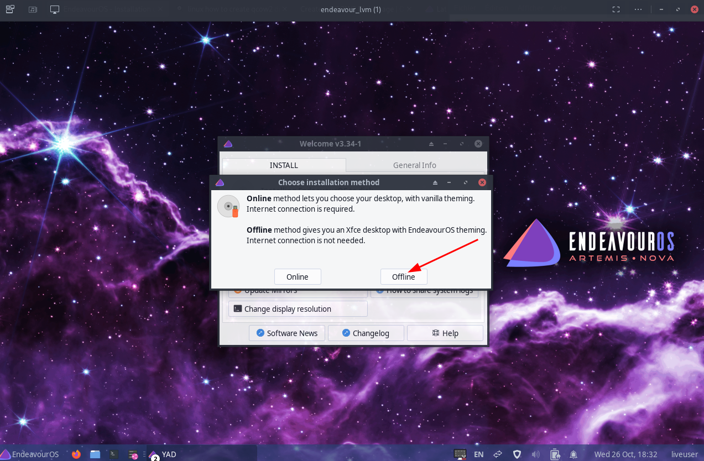{:width="600"}  
Choix du "pas en ligne"

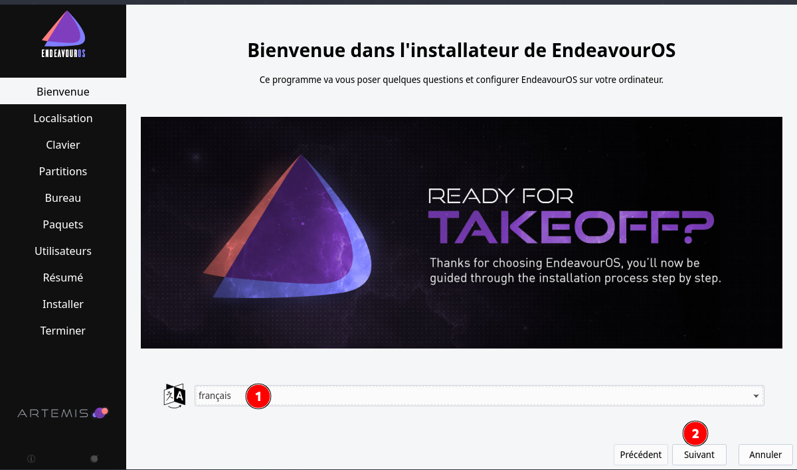{:width="600"}  
Français  

{:width="600"}  

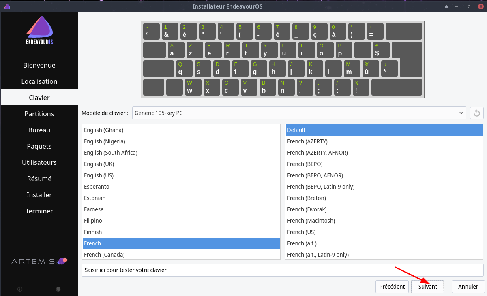{:width="600"}  


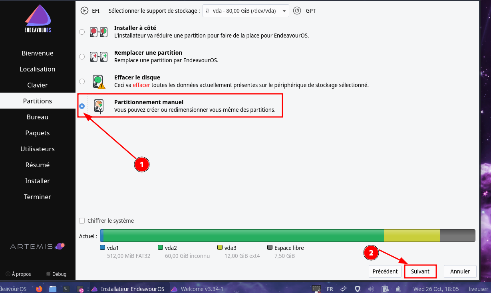{:width="600"}  
Pour une partition chiffrée, cocher "Chiffrer le système" et saisir la phrase secrète que vous voulez  
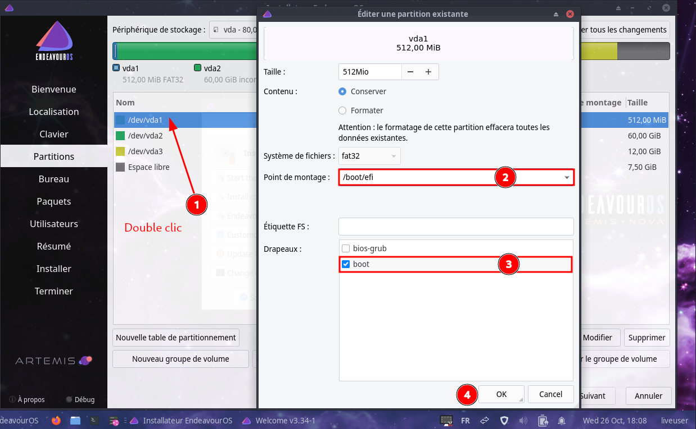{:width="600"}  
Vous pouvez choisir l'option **Formater**

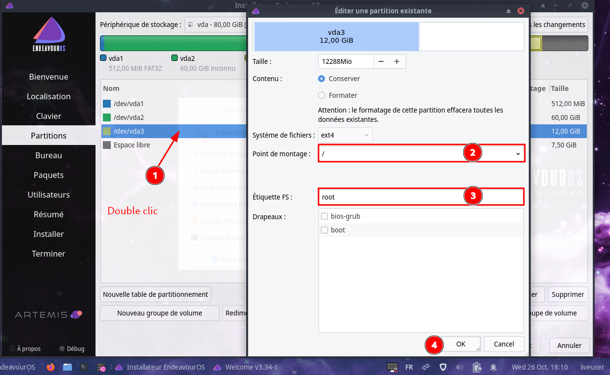{:width="600"}  
Vous pouvez choisir l'option **Formater**

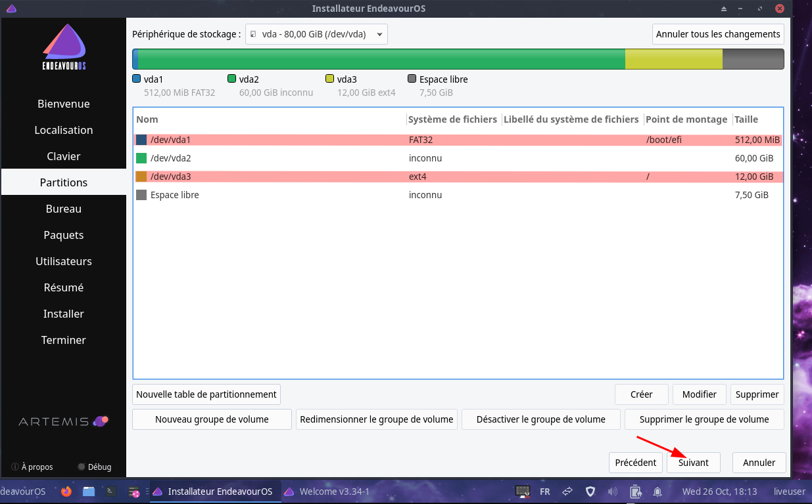{:width="600"}  

`En mode "offline" , uniquement xfce4`{: .prompt-info }

Choix du gestionnaire uniquement en mode "online"  
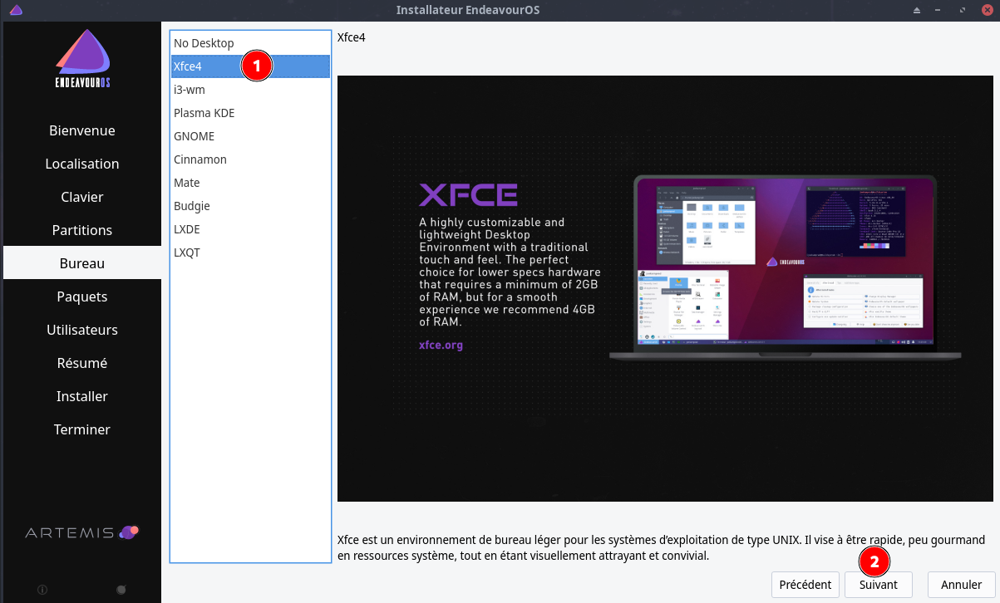{:width="600"}  
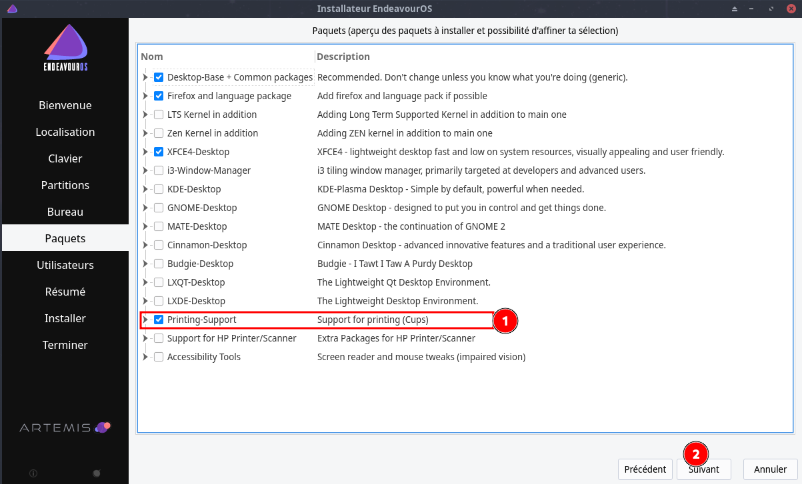{:width="600"}  
Validation facultative de "Printing Support"

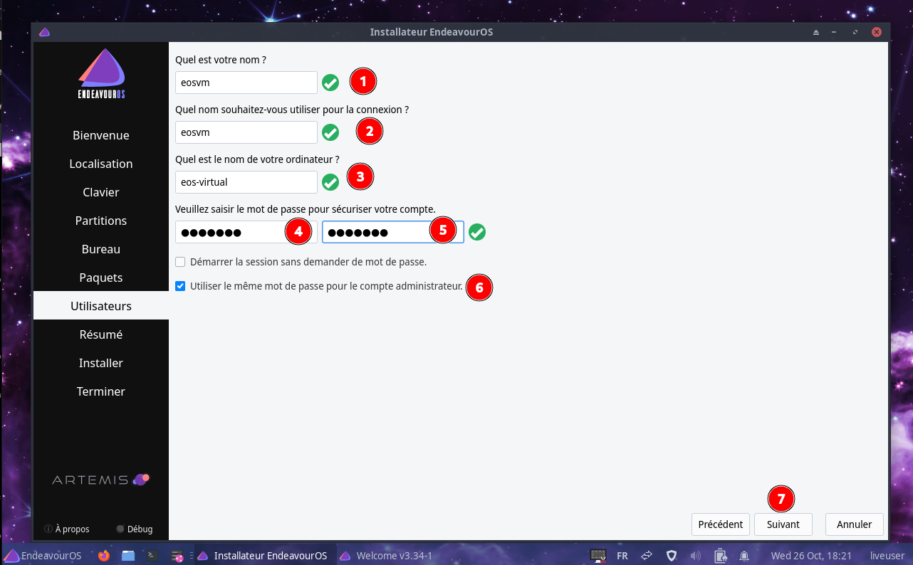{:width="600"}  
eosvm eosvm49

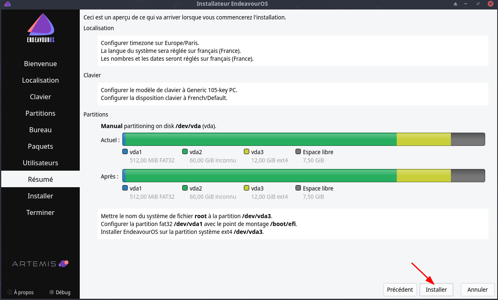{:width="600"}  
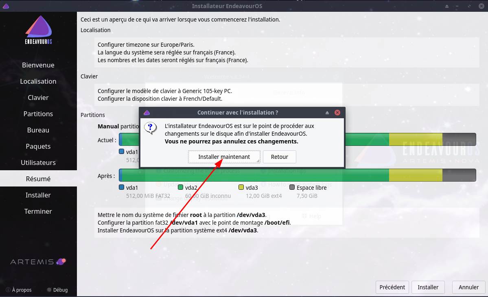{:width="600"}  


L'installation démarre  
{:width="600"}  
Installation en cours, patienter ...

  
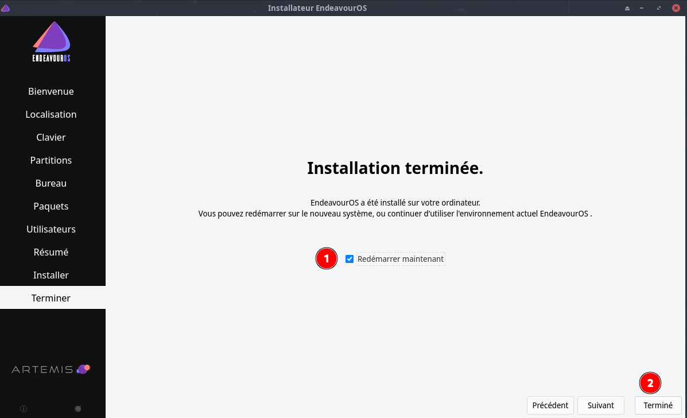{:width="600"}  
L'installation est terminée, cliquer sur **Terminé** et redémarrer sur endeavour

### 4 - Première connexion utilisateur sur EndeavourOS XFCE

*Toutes les commandes se font en mode su : `sudo -s`*

#### Ajout lvm2 au HOOKS

Ajouter **lvm2** dans le HOOKs `/etc/mkinitcpio.conf`

    HOOKS="base udev autodetect modconf block lvm2 keyboard keymap consolefont filesystems fsck"

Puis exécuter **mkinitcpio** qui est un script shell utilisé pour créer un environnement qui se charge en premier en mémoire 

	mkinitcpio -P

#### Créer un volume physique et groupe LVM

Exécuter les commandes suivantes

```shell
pvcreate /dev/sda2
vgcreate vgeos /dev/sda2
```

Créer les volumes logiques root et home avec un système de fichier ext4

```shell
lvcreate -L 40G -n lvroot vgeos
lvcreate -L 100G -n lvhome vgeos
mkfs.ext4 /dev/vgeos/lvroot
mkfs.ext4 /dev/vgeos/lvhome
```

#### Dupliquer la distribution temporaire dans des partitions LVM

Montages sur /mnt/lvm

Partition actuelle montée sur /mnt/eos

```shell
mkdir -p /mnt/eos
mount /dev/sda3 /mnt/eos
```

Partitions LVM  home et root montées sur /mnt/lvm/{root,lvm}

```shell
mkdir -p /mnt/lvm/{root,home}
mount /dev/vgeos/lvroot /mnt/lvm/root
mount /dev/vgeos/lvhome /mnt/lvm/home
```

Copier le root et le home de la machine non LVM vers les volumes loqiques LVM

```shell
# copie root sans le home
rsync -avA --exclude 'home' /mnt/eos/ /mnt/lvm/root/
mkdir -p /mnt/lvm/root/home  # pour le montage au boot
# copie du home
rsync -avA /mnt/eos/home/ /mnt/lvm/home/
```

### 5 - Chroot sur le root LVM

**On va monter un chroot sur les partitions LVM**

```shell
# root
# /mnt/lvm/root
# montage du home
mkdir /mnt/lvm/root/home
mount /dev/vgeos/lvhome /mnt/lvm/root/home
# montage du boot EFI
mount /dev/sda1 /mnt/lvm/root/boot/efi
```

Installer les outils

    pacman -Syy
    pacman -S arch-install-scripts

#### Créer le fstab

Sur le portable DELL pas de touche `<>` , exécuter en mode utilisateur

    xmodmap -e "keycode  49 = less greater less greater bar brokenbar bar"

Générer le nouveau fstab

    genfstab -U -p /mnt/lvm/root > /mnt/lvm/root/etc/fstab

Passage en chroot

    arch-chroot /mnt/lvm/root

Vérifier le fstab

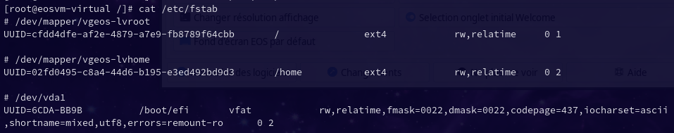

#### grub EFI

Réinstaller grub EFI

    grub-install --target=x86_64-efi --efi-directory=/boot/efi --bootloader-id=endeavouros

Dupliquer

    cp /boot/efi/EFI/endeavouros/grubx64.efi /boot/efi/EFI/boot/bootx64.efi

Regénérer grub

    grub-mkconfig -o /boot/grub/grub.cfg

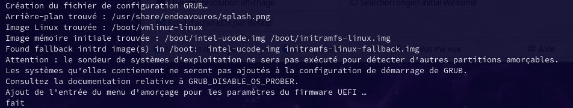

#### Sortie du chroot

On sort du chroot

    exit

Arrêter la machine

    poweroff

### 6 - Redémarrer la machine  

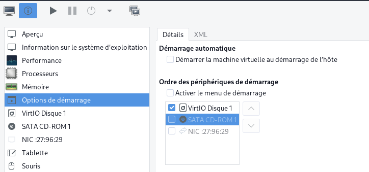{:width="400"}


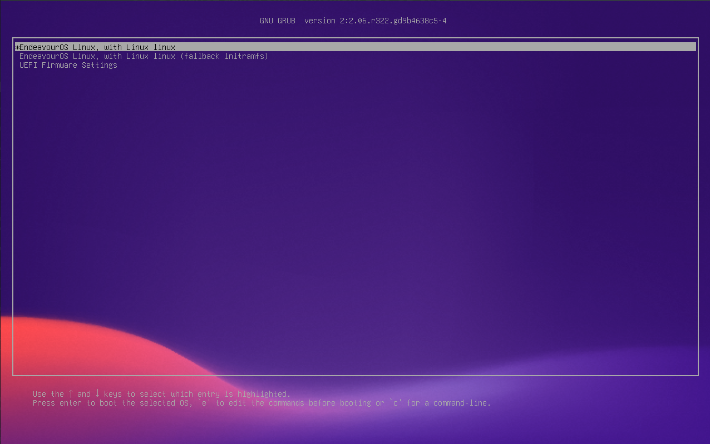  
Page de démarrage  

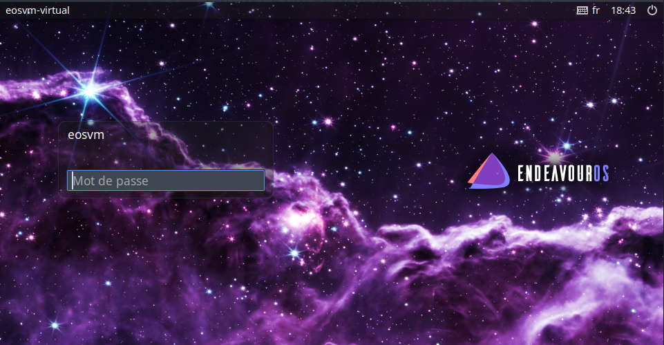  
Page connexion utilisateur  

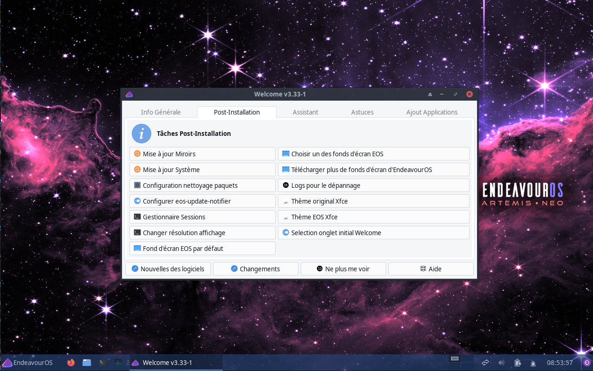  
A ce stade , EndeavourOS est entièrement fonctionnel sur une partition LVM.  

```
NAME             MAJ:MIN RM   SIZE RO TYPE MOUNTPOINTS
sda                8:0    0 447,1G  0 disk 
├─sda1             8:1    0   512M  0 part /boot/efi
├─sda2             8:2    0   200G  0 part 
│ ├─vgeos-lvroot 254:0    0    40G  0 lvm  /
│ └─vgeos-lvhome 254:1    0   100G  0 lvm  /home
└─sda3             8:3    0    12G  0 part 

```

La partition /dev/sda3 peut être récupérée  


## EndeavourOS XFCE

### Activation SSH

Relever adresse par `ip a`  
192.168.8.209

Lancer et activer SSH

```bash
sudo systemctl start sshd
sudo systemctl enable sshd
```

Se connecter via ssh depuis un autre poste sur le réseau

```shell
ssh yano@192.168.8.209
```

### Mide à jour système

Ouvrir un terminal


```shell
sudo pacman -Sy archlinux-keyring  # mise à jour des clés
sudo pacman -Su                    # mise à jour 
```

Modifier sudoers pour accès sudo sans mot de passe à l'utilisateur **yano**  

```shell
su               # mot de passe root identique utilisateur
echo "yano     ALL=(ALL) NOPASSWD: ALL" >> /etc/sudoers.d/20-yano
```

Redémarrer la machine

    sudo systemctl reboot

### Activation SSH

Relever adresse par `ip a`  
192.168.8.210

Lancer et activer SSH

```bash
sudo systemctl start sshd
sudo systemctl enable sshd
```

Se connecter via ssh depuis un autre poste sur le réseau

```shell
ssh yano@192.168.8.210
```

**Firefox en français** : `yay -S firefox-i18n-fr`

**XFCE - Paramètres**  
On déplace le **tableau de bord** du bas vers le haut de l'écran  

Modification du **tableau de bord** , clic-droit &rarr; Tableau de bord &rarr; Préférences de tableau de bord &rarr; Eléments  

Affichage date et heure, **format personnalisé** dans **Horloge** : `%e %b %Y %R`  

Gestionnaire d'alimentation &rarr; Ecran : Désactiver la **gestion d'alimentation de l'écran**

Les fonds d'écran &rarr;  `/usr/share/endeavouros/backgrounds/`

### Ecran de veille

On remplace l'application **xfce4-screensaver** (goodies) par **xscreensaver**

    sudo pacman -R xfce4-screensaver
    sudo pacman -S xscreensaver

Préférences économiseur écran **XScreenSaver Settings**  

- Considérer l'ordinateur inactif après: 20 min
- Verrouillage écran INACTIF

### Modification clavier portable

*Manipulations à effectuer sur un terminal de la machine*  
Pas de touches ">" "<" sur clavier ex Qwerty du portable e6230  
La commande suivante permet d'afficher la disposition actuelle de votre clavier

	xmodmap -pke

Sur un clavier normal Azerty

	keycode  94 = less greater less greater bar brokenbar bar

Sur le clavier du portable on va utiliser la touches `²` et shift `²`  keycode 49  
Pour modifier la fonction d'une touche on invoque simplement xmodmap avec en argument la chaîne de caractères que l'on souhaite modifier : 

	xmodmap -e "keycode  49 = less greater less greater bar brokenbar bar"

Pour rendre les modifications permanentes ,créer ou modifier **~/.xmodmap.conf** et ajouter

	echo "keycode 49 = less greater less greater bar brokenbar bar" >> ~/.xmodmap.conf

<u>Exécuter au lancement de la session</u>  
Menu &rarr; Paramètres &rarr; Session et démarrage ,onglet **Démarrage automatique d'application**  
Clique sur **+** :  
Nom : **Modif clavier**  
Description : **attribution touche**  
Commande : **/usr/bin/xmodmap /home/yano/.xmodmap.conf**  
Déclencher : on login  
Puis cliquer sur **OK**  

Déconnexion/Reconnexion utilisateur pour prise en charge

### SSH + clé

{:width="100"}

**<u>Connexion SSH par clé</u>**  

<u>Opérations à réaliser sur l'ordinateur de bureau</u>  
Générer une paire de clé curve25519-sha256 (ECDH avec Curve25519 et SHA2) nommé **e6230** pour une liaison SSH avec le portable E6230.  

    ssh-keygen -t ed25519 -o -a 100 -f ~/.ssh/e6230

Envoyer la clé publique sur le portable 

    ssh-copy-id -i ~/.ssh/e6230.pub yano@192.168.8.210

Modification fichier configuration ssh sur le dell e6230

    sudo nano /etc/ssh/sshd_config

```
Port 56230
PasswordAuthentication	no
```

Relancer

    sudo systemctl restart sshd

`IL FAUT AJOUTER LE PORT 56230 EN ZONE "PUBLIC" DU PAREFEU !`{: .prompt-warning }

### Parefeu firewalld

{:width="100"}  
*FirewallD est un service qui permet d'apporter une fonction de pare-feu avec une gestion dynamique. C'est à dire que les règles gérées par le service FirewallD sont appliquées sans le redémarrage complet du pare-feu. Les règles existantes, toujours utiles, restent donc en place et les modules noyaux complémentaires utilisés ne sont pas déchargés.*

* [firewalld : Le pare-feu facile sous Linux](https://www.linuxtricks.fr/wiki/firewalld-le-pare-feu-facile-sous-linux)
* [Parefeu - firewall - FirewallD](https://doc.fedora-fr.org/wiki/Parefeu_-_firewall_-_FirewallD)

Ajouter le nouveau port à la zone configurée de firewalld ("public" par défaut).

```shell
sudo firewall-cmd --zone=public --add-port=56230/tcp --permanent
sudo systemctl restart firewalld
```

Tester connexion SSH depuis l'hôte

    ssh -p 56230 -i ~/.ssh/e6230 yano@192.168.8.209

### Motd

    sudo nano /etc/motd

```
  ___              _             _      _     _                       
 | __| ___  ___   /_\   _ _  __ | |_   | |   (_) _ _  _  _ __ __      
 | _| / _ \(_-<  / _ \ | '_|/ _|| ' \  | |__ | || ' \| || |\ \ /      
 |___|\___//__/ /_/ \_\|_|  \__||_||_| |____||_||_||_|\_,_|/_\_\      
  _           _    _  _             _              __  ___  ____  __  
 | |    __ _ | |_ (_)| |_  _  _  __| | ___   ___  / / |_  )|__ / /  \ 
 | |__ / _` ||  _|| ||  _|| || |/ _` |/ -_) / -_)/ _ \ / /  |_ \| () |
 |____|\__,_| \__||_| \__| \_,_|\__,_|\___| \___|\___//___||___/ \__/ 
                                                                      
```

### Pont réseau (NetworkManager) 

*créer un ‘bridged network’ ou réseau bridgé sur l'interface réelle pour une utilisation avec virt-manager (Qemu/KVM).  
On utilise un réseau bridgé pour les machines virtualisées pour qu’elles aient une vrai adresse IP sur le réseau local et qu’elles soient accessibles comme un ordinateur réel.*

>Les commandes se font en mode su

[KVM/QEMU Network Bridge (Pont réseau)](/posts/KVM-QEMU-Network-Bridge-(Pont-reseau)/)  
[Ubuntu 20.04 et KVM : Un bridge "Public"](https://www.grottedubarbu.fr/mode-bridge-kvm-ubuntu20-04/)  
[How to add network bridge with nmcli (NetworkManager) on Linux](https://www.cyberciti.biz/faq/how-to-add-network-bridge-with-nmcli-networkmanager-on-linux/)

On utilise NetworkManager en ligne de commande avec l'outils `nmcli`  

L'état du réseau

    nmcli connection show --active

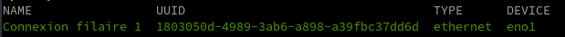

Création d'un pont avec [STP](https://en.wikipedia.org/wiki/Spanning_Tree_Protocol) désactivé (pour éviter que le pont ne soit annoncé sur le réseau) :

    sudo nmcli connection add type bridge con-name bridge-br0 ifname br0 stp no

*Connexion « bridge-br0 » (95168faf-9905-4ad1-8dd0-796226d14d37) ajoutée avec succès.*

Faire de l'interface **eno1** un élément appartenant au pont :

    sudo nmcli connection add type bridge-slave con-name Ethernet-eno1 ifname eno1 master br0

*Connexion « Ethernet-eno1 » (425b15d3-3316-4dd6-856f-dbf332320cc0) ajoutée avec succès.*

Visualisation des paramètres du pont br0

    nmcli -f bridge con show bridge-br0

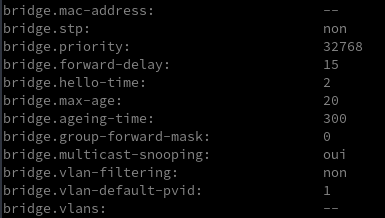

#### Activation du pont (bridge) br0

Désactiver les connexions actives

    nmcli con show --active

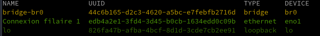

Dans note cas , **Connexion filaire 1** est actif, il faut la désactiver 

    sudo nmcli connection down 1803050d-4989-3ab6-a898-a39fbc37dd6d

*Connexion « Connexion filaire 1 » désactivée (chemin D-Bus actif : /org/freedesktop/NetworkManager/ActiveConnection/3)*

Mise en place du nouveau pont :

    sudo nmcli connection up bridge-br0

*Connexion activée (master waiting for slaves) (Chemin D-Bus actif : /org/freedesktop/NetworkManager/ActiveConnection/57)*

Vérifications

    nmcli connection show

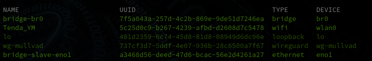

Adresses IP

    ip a s br0

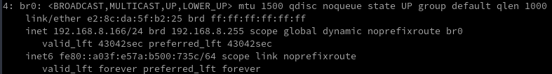

Nouvelle adresse IP : 192.168.8.166

#### Paramétrage graphique NetworkManager 

Paramétrage réseau pour un démarrage auto sur le pont br0 si le réseau filaire est branché  

Modifier les paramètres réseau, clic droit sur icône réseau  
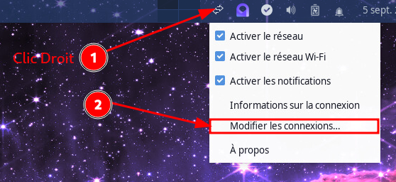{:width="300"}

Créer un pont réseau nommé br0 en cliquant sur le **+**  
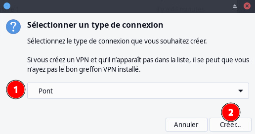{:width="300"}  
Saisir un nom après avoir cliquer sur **Créer**  
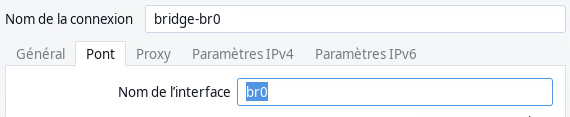{:width="300"}  

**Pont entre connexions** &rarr; **Ajouter**  
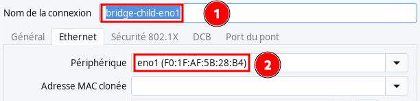{:width="300"}  
Enregistrer  

Le pont réseau  
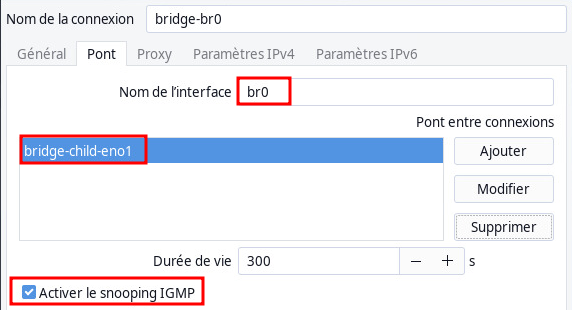{:width="300"}  
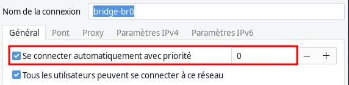{:width="300"}  
Enregistrer  

Il faut désactiver la connexion automatique du réseau filaire  
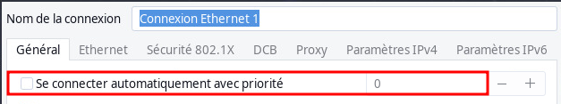{:width="300"}  

#### IP LAN bridge statique 

**dans le réseau 192.168.8.0**

Avoir une adresse ip statique dans le réseau 192.168.8.0  
On va modifier le routeur pour ajouter l'adresse mac du bridge br0  

    ip link show br0

```
4: br0: <BROADCAST,MULTICAST,UP,LOWER_UP> mtu 1500 qdisc noqueue state UP mode DEFAULT group default qlen 1000
    link/ether 26:1d:bb:8c:9f:21 brd ff:ff:ff:ff:ff:ff
```

Se connecter en admin sur le routeur **GL inet**  
Dans la rubrique **PLUS DE REGLAGES &rarr; LAN IP** , sélectionner l'adresse mac `26:1d:bb:8c:9f:215`  et cliquer sur Ajouter

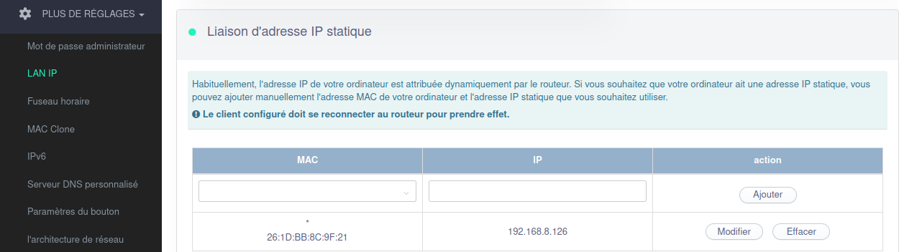{:width="600"}

### VNC

*Se connecter VNC via SSH*

#### Portable DELL Latitude e6230

installer x11vnc

    yay -S x11vnc

Générer un mot de passe dans le dossier root

```shell
sudo -s
x11vnc -storepasswd "mot_de_passe" /root/.vnc_passwd
exit
```

*stored passwd in file: /root/.vnc_passwd*

Ajouter le nouveau port 9500 à la zone configurée de firewalld ("public" par défaut).

```shell
sudo firewall-cmd --zone=public --add-port=5900/tcp --permanent
sudo systemctl restart firewalld
```

Lancement manuel en console et en session utilisateur pour valider et enregistrer le mot de passe VNC

```shell
sudo x11vnc -xkb -noxrecord -noxfixes -noxdamage -display :0 -auth /var/run/lightdm/root/:0 -usepw
```

Saisir le mot de passe VNC 2 fois ( la seconde pour vérification) et répondre `y` pour écriture

```
Enter VNC password: 
Verify password:    
Write password to /root/.vnc/passwd?  [y]/n y
```

Arrêt par Ctrl+C

#### Poste Appelant

<u>Première fenêtre de terminal</u>   

Tunnel SSH  
Utilisez le drapeau `-localhost` avec **x11vnc** pour qu’il se lie à l’interface locale.  
Une fois que c’est fait, vous pouvez utiliser SSH pour tunneliser le port ; puis, connectez-vous à VNC via SSH.

```shell
# SSH avec clés
ssh -f -L 5900:localhost:5900 -p 56230 -i ~/.ssh/e6230 yano@192.168.8.126 'sudo x11vnc -xkb -noxrecord -noxfixes -noxdamage -display :0 -auth /var/run/lightdm/root/:0 -usepw'
```

<u>Seconde fenêtre de terminal</u>   
Exécuter la commande suivante

```bash
vncviewer -PreferredEncoding=ZRLE localhost:0
```

{:width="200"}  
Saisir le mot de passe pour la connexion VNC

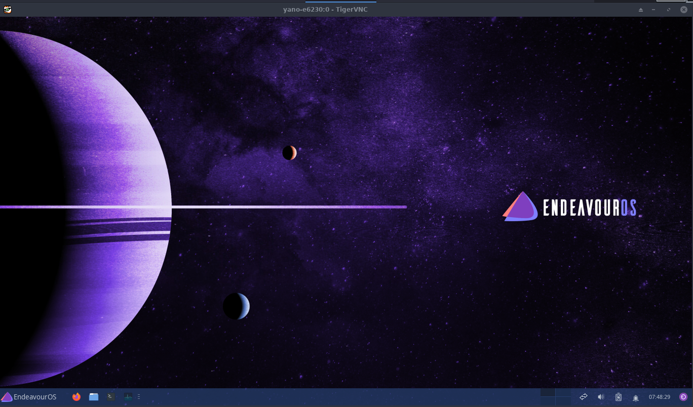{:width="600"}

Si le curseur est mal affiché, c’est possible de mettre l’option -cursor à la ligne de commande x11vnc
`Le programme écoute sur le port 9500. Il faut penser à ouvrir le parefeu du Latitude e6230 sur ce port en TCP`{: .prompt-info }

<u>Script - VNC via Tunnel SSH</u>

* Ouverture distant et redirection du port 5900 via tunnel ssh, reprise de la main (nohup)
* On mémorise le processus ssh (pidof)
* Lancement de vncviewer
* En sortie du viewer, on tue le processus ssh ... avec kill

    nano ~/scripts/vncdell.sh 

```bash
#!/bin/bash

nohup ssh -f -L 5900:localhost:5900 -p 56230 -i ~/.ssh/e6230 yano@192.168.8.126 'sudo x11vnc -xkb -noxrecord -noxfixes -noxdamage -display :0 -auth /var/run/lightdm/root/:0 -usepw'
p=$(pidof -s ssh)
# tempo
echo "Patienter 5 secondes..."
sleep 5
vncviewer -PreferredEncoding=ZRLE localhost:0
kill $p
echo "FIN VNC"
 
exit 0
```

Droits en exécution

    chmod +x ~/scripts/vncdell.sh

Au lancement du script

    sh ~/scripts/vncdell.sh

{:width="200"}  
Saisir le mot de passe VNC

### Lecteur carte à puce + NFC

*comment configurer votre système pour utiliser un lecteur de carte à puce*

#### Configuration

Installez ccid et opensc à partir des référentiels officiels

    sudo pacman -S ccid opensc

Si le lecteur de carte ne dispose pas d'un clavier NIP, définissez `enable_pinpad = false` dans le fichier de configuration opensc **/etc/opensc.conf**

Démarrer le service pcscd.service

    sudo systemctl start pcscd.service # démarrer

>**Conseil**: Si vous obtenez le `Failed to start pcscd.service: Unit pcscd.socket not found`. erreur `Failed to start pcscd.service: Unit pcscd.socket not found`. , rechargez simplement les unités systemd avec cette commande `systemctl daemon-reload`

Status 

    sudo systemctl status pcscd.service 

lecteur de carte `pcsc-tools` 

    sudo pacman -S pcsc-tools

et lancez l’utilitaire `pcsc_scan` , puis (connectez le lecteur de carte à puce si non interne) insérez une carte. Si vous voyez une sortie comme celle-ci, le lecteur de carte à puce ainsi que la carte ont été reconnus avec succès.

```
Mon Jul 29 14:43:50 2019
 Reader 0: Broadcom Corp 5880 [Contacted SmartCard] (0123456789ABCD) 00 00
  Event number: 2
  Card state: Card inserted, 
  ATR: 3B DA 18 FF 81 B1 FE 75 1F 03 00 31 C5 73 C0 01 40 00 90 00 0C

[...]
Possibly identified card (using /usr/share/pcsc/smartcard_list.txt):
3B DA 18 FF 81 B1 FE 75 1F 03 00 31 C5 73 C0 01 40 00 90 00 0C
	OpenPGP Card V2
```

Activer le service pcscd.service

    sudo systemctl enable pcscd.service # activer

Vérifier également la lecture NFC

### Applications

#### Logiciels supplémentaires

On commence par tout ce qui est graphique : gimp, cups (gestion de l’imprimante) et hplip (si vous avez une imprimante scanner Hewlett Packard). Le paquet python-pyqt5 est indispensable pour l’interface graphique de HPLIP+scan. Webkigtk2 étant indispensable pour la lecture de l’aide en ligne de Gimp. outil rsync, Retext éditeur markdown, firefox fr, thunderbird, libreoffice, gdisk, bluefish, **Double Commander** , **Menulibre** pour la gestion des menus , outils android    

```bash
yay -S cups system-config-printer gimp hplip libreoffice-fresh-fr thunderbird-i18n-fr jq figlet p7zip xsane tmux  calibre retext bluefish gedit doublecmd-gtk2 terminator filezilla minicom zenity android-tools menulibre yt-dlp

# Scripts to aid in installing Arch Linux (ex: arch-chroot)
yay -S arch-install-scripts
```

#### Minicom

Paramétrage de l'application terminale **minicom**

     sudo minicom -s

>Seul les paramètres à modifier sont cités

Configuration du port série  
  
A -                             Port série : **/dev/ttyUSB0**   
F -              Contrôle de flux matériel : **Non**  
  
Echap  
Enregistrer config. sous dfl  
  
Sortir de Minicom  

#### Son

**<u>PulseAudio</u>**  
La gestion **coupure**, **vol+** et **vol-** du son se fait à l'aide des touches spécifique du clavier  


#### Flameshot (copie écran)

**Copie écran (flameshot)**  
**[Flameshot](https://github.com/lupoDharkael/flameshot)** c’est un peu THE TOOL pour faire des captures d’écrans

    sudo pacman -S flameshot

Lancer l'application XFCE Flameshot et l'icône est visible dans la barre des tâches  
{:width="300"}  

Paramétrage de flameshot, clic droit sur icône , Configuration   
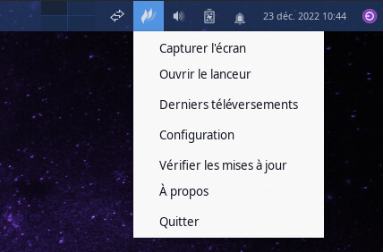{:width="300"}  
Paramétrage de flameshot  
{:width="300"}

#### scrpy émulation android

Utilise adb et le port USB

    yay -S scrcpy

Créer le dossier 

    mkdir -p $HOME/.local/share/applications

Créer le fichier `$HOME/.local/share/applications/scrcpy-android.desktop` avec le contenu suivant

```
[Desktop Entry]
Version=1.1
Type=Application
Name=ScrCpy (Android)
Comment=Votre smartphone sur le bureau
Icon=phone
Exec=/usr/bin/scrcpy
Path=/home/yann
Actions=
Categories=Utility;X-XFCE;X-Xfce-Toplevel;
Terminal=false
StartupNotify=false
```

#### Client Nextcloud

Créer les dossiers `.keepassx` , `Notes` , `scripts` `statique/images` et `statique/_posts` qui sont synchronisés avec netxcloud

```bash
mkdir -p ~/{.ssh,.keepassx,scripts,media}
mkdir -p ~/media/statique/{images,_posts}
mkdir -p ~/Documents/Dossiers-Locaux-Thunderbird
mkdir -p ~/media/Notes
# Lien pour affichage des images avec éditeur Retext
sudo ln -s /home/yano/media/statique/images /images
```

Installation client nextcloud

    yay -S nextcloud-client libgnome-keyring gnome-keyring  

Démarrer le client nextcloud , après avoir renseigné l'url ,login et mot de passe pour la connexion  

Trousseau de clé avec mot de passe idem connexion utilisateur

Paramétrage

* Menu &rarr; Lancer **Client de synchronisation nextcloud**
* Adresse du serveur : <https://cloud.xoyaz.xyz>
* Nom d’utilisateur : yann
* Mot de passe : xxxxx
* Sauter les dossiers à synchroniser
* Trousseau de clés = mot de passe connexion utilisateur
* Paramètres nextcloud  
{:width="400"}

Saisir les différents dossiers à synhroniser  
{:width="400"}

Au prochain redémarrage, il faudra confirmer le mot de passe du trousseau

#### Gestion mot de passe (keepassxc)

{:width="50"}  
Ajouter une synchronisation de dossier nextcloud : /home/yano/.keepassx (local) &rarr; Home/.keepasx (serveur)  
Télécharger la clé **yannick_keepassxc.key** dans **~/.ssh** 

```shell
scp -P 56230 -i ~/.ssh/e6230  ~/.ssh/yannick_keepassxc.key yano@192.168.8.126:/home/yano/.ssh/
```

Installer keepassxc 

    sudo pacman -S keepassxc

Ajouter aux favoris "KeepassXC" et lancer l'application &rarr; **Ouvrir une base de données existante**  
Base de données --> Ouvrir une base de données (afficher les fichiers cachés) : **~/.keepassx/yannick_xc.kdbx** --> Ouvrir  
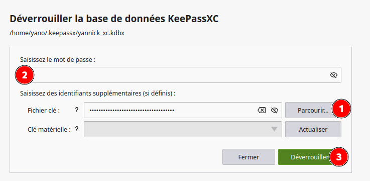{:width="400"}

**Affichage &rarr; Thème** : Sombre  
**Affichage &rarr; Mode compact**  , un redémarrage de l'application est nécessaire  

#### SSHFS

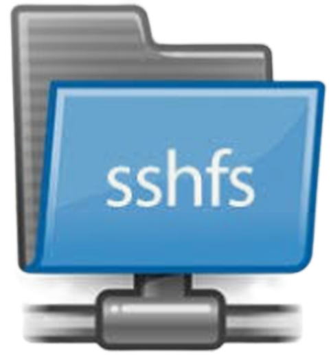{:width="50"}  
*SSHFS sert à monter sur son système de fichier, un autre système de fichier distant, à travers une connexion SSH, le tout avec des droits utilisateur.*

Installer paquet SSHFS

	sudo pacman -S sshfs 

sshfs est installé par défaut sur la distribution EndeavourOS
{: .prompt-warning }


Création des partages utilisés par sshfs (facultatif)

    mkdir -p $HOME/vps/{cx21,lxc,vdb,xoyaz.xyz,xoyize.xyz}

Exemple de montage manuel  
`sshfs -oIdentityFile=<clé privée> utilisateur@domaine.tld:<dossier distant> <dossier local> -C -p <port si dfférent de 22>`  

#### Thunderbird

Ajouter thunderbird aux favoris et lancer

**Comptes de messagerie**

* Paramètrer les différents compte de messagerie  
* Compte ProtonMail 
    1. Comment paramétrer Mozilla Thunderbird pour ProtonMail Bridge, ouvrir le lien suivant [Proton Mail](/posts/Proton_Mail/)
    * Paramétrer le compte de messagerie ProtonMail

*Si vous souhaitez que Thunderbird soit minimisé dans la zone de notification, vous devez installer une application indépendante pour déplacer Thunderbird dans la zone de notification chaque fois qu'il est minimisé. Sous Linux, je recommande KDocker (disponible dans de nombreuses distributions Linux).*

*KDocker est pratique lorsque vous souhaitez intégrer une application graphique dans la barre d'état système, étant donné que l'application en question ne dispose pas de sa propre fonctionnalité pour la placer dans la barre d'état système. Bien qu'elle n'ait pas été mise à jour depuis 2005, la dernière version publiée le 5 avril 2005 est suffisamment bonne et, selon le site officiel, elle fonctionne avec tous les gestionnaires de fenêtres conformes à la norme NET WM. Pour n'en citer que quelques-uns : KDE, GNOME, Xfce, Blackbox ou Fluxbox. Je ne l'ai utilisé que dans KDE 3.5.9, mais je suis sûr qu'il fonctionne bien dans les autres environnements de bureau aussi, si vous ne voulez pas utiliser une application d'ancrage native, comme ALLTray pour GNOME.*

* Paramètres &rarr; Modules complémentaires et thèmes
    * **Thèmes** : Activer **sombre**
    * **Extensions** : Installer **Minimize on Close** 

**Calendriers et contacts**

`Alt+m` pour afficher la bare de menu  
{:width="400"}

* **Calendrier**  
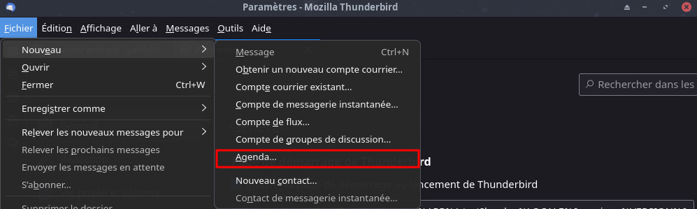{:width="400"}  
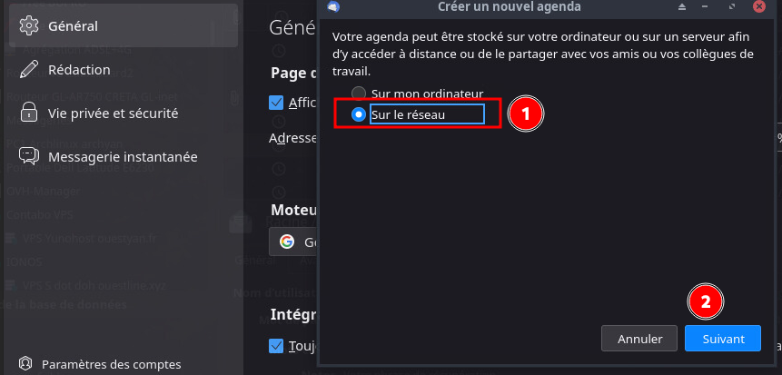{:width="400"}  
{:width="400"}  
Saisir le mot de passe  
{:width="400"}  
{:width="400"}  
* **Contacts**  
Outils &rarr; Carnet d'adresses  
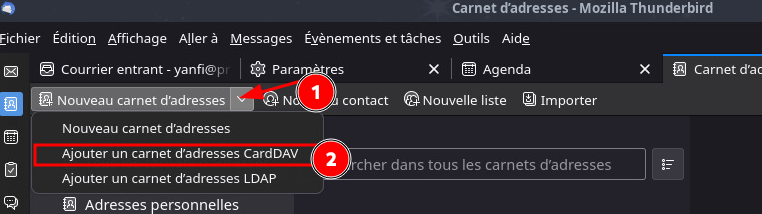{:width="400"}  
{:width="250"}  
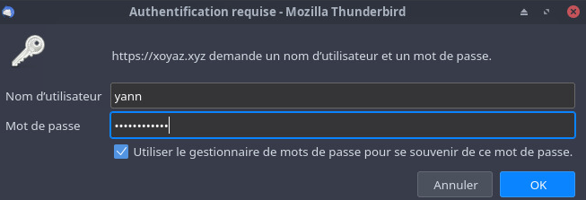{:width="250"}  
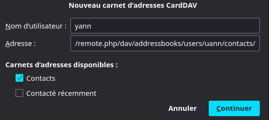{:width="250"}  

#### Radio via internet

Installation au choix

    yay -S radiotray
    yay -S geocode-glib tuner-git

