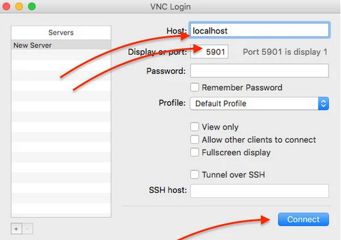
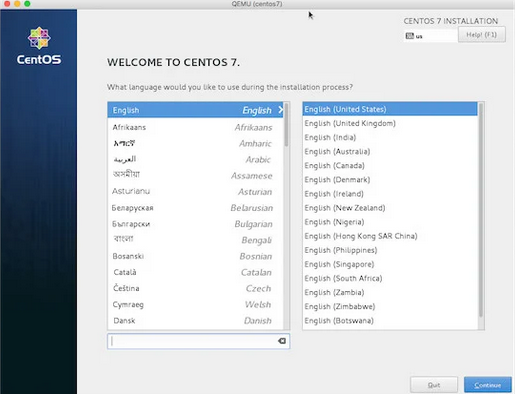
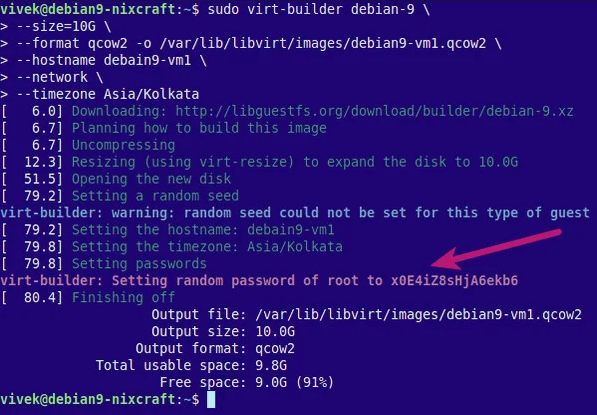
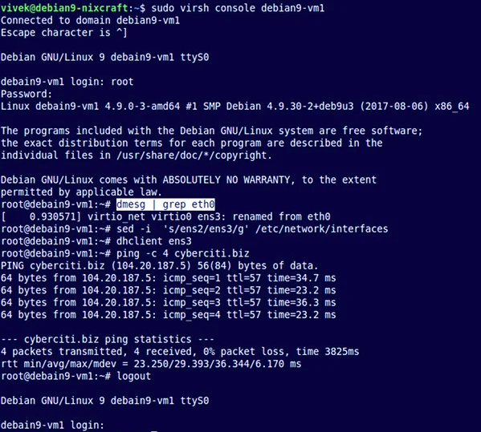
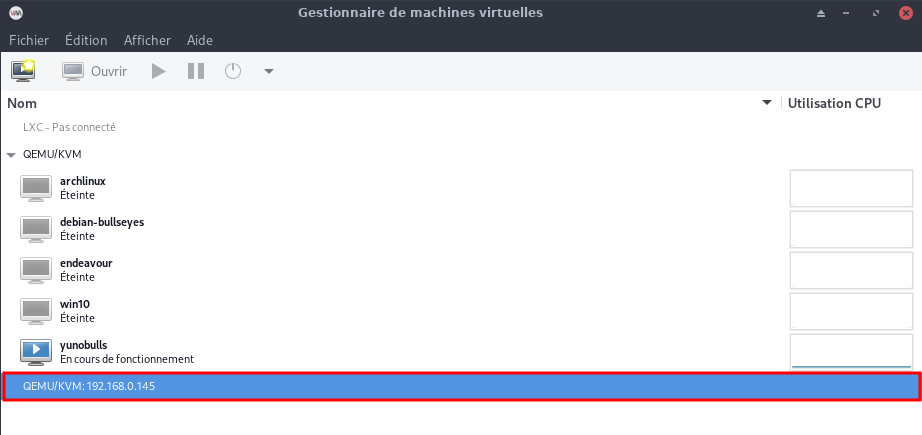

+++
title = 'Installer QEMU/KVM via SSH sur un serveur Debian sans affichage'
date = 2022-12-29 00:00:00 +0100
categories = ['virtuel']
+++
*{:height="40"} est un logiciel libre de machine virtuelle, pouvant émuler un processeur et, plus généralement, une architecture différente si besoin dont x86 (Hyperviseur de type 2). Combiné au pilote KVM, il permet de réaliser de l’accélération Hardware (HVM). Il permet d'exécuter un ou plusieurs systèmes d'exploitation via les hyperviseurs KVM et Xen, ou seulement des binaires, dans l'environnement d'un système d'exploitation déjà installé sur la machine.L’outil de base qemu-img permet de créer et de gérer des images disque de format raw ou qcow2.   
{:height="40"} (Kernel-based Virtual Machine) est le module qui transforme le noyau Linux en Hyperviseur type 1 (HVM et PV avec virtio). Ce module traduit rapidement les instructions des vCPU via les intructions VT AMD et Intel. Il prend aussi en charge des aspects de bas niveau de l’architecture x86.  
KVM est aussi un émulateur de matériel qui utilise qemu et les pilotes virtio.*

* Vous pouvez utiliser KVM pour exécuter plusieurs systèmes d'exploitation tels que Windows, *BSD, distribution Linux en utilisant des machines virtuelles.   
* Chaque machine virtuelle a son disque privé, sa carte graphique, une carte réseau et plus encore.  

Tutoriel issu de la traduction de l'article [How to install KVM server on Debian 9/10 Headless Server](https://www.cyberciti.biz/faq/install-kvm-server-debian-linux-9-headless-server/)

Autres liens :  
[Install QEMU/KVM Server on Debian 10 Headless Server](https://omicx.cc/posts/2021-06-22-install-qemu-kvm-server-on-debian-10-headless-server/)  
[How to Install and Configure KVM on Debian 11 Bullseye Linux](https://www.how2shout.com/linux/how-to-install-and-configure-kvm-on-debian-11-bullseye-linux/)

## KVM sur un serveur Debian Linux 

*    Le serveur hôte est situé dans le centre de données distant et c'est un serveur "headless".
*    Toutes les commandes dans ce tutoriel sont tapées sur la session basée sur ssh.
*    Vous avez besoin d'un client **vnc** pour installer le système d'exploitation invité.
*    Dans ce tutoriel, vous apprendrez à installer le logiciel KVM sur un serveur Debian Linux et à utiliser KVM pour configurer votre première VM invitée.

Connexion sur le serveur distant via ssh

    ssh admin@192.168.0.135 -p 55135 -i /home/yann/.ssh/yunobulls

Exécutez la commande *egrep* suivante pour vérifier que **Intel VMX** ou **AMD SVM** est supporté sur votre CPU 

    egrep --color 'vmx|svm' /proc/cpuinfo

**vmx (Intel)** ou **svm (Amd)** doit apparaître d'une autre couleur dans le résultat 

Suivez les étapes d'installation de KVM sur un serveur "headless" Debian Linux  

### Installer kvm 

Lors de l'installation sur un serveur, vous pouvez ajouter l'option **apt** `--no-install-recommends`, pour empêcher l'installation de paquets graphiques superflus 

```shell
sudo apt install --no-install-recommends qemu-kvm libvirt-clients libvirt-daemon-system bridge-utils libguestfs-tools genisoimage virtinst libosinfo-bin
```

Si vous voulez qu'un utilisateur normal/régulier puisse gérer les machines virtuelles. Ajoutez l'utilisateur $USER à libvirt et libvirt-qemu en utilisant la commande  `adduser`

```shell
sudo adduser $USER libvirt
sudo adduser $USER libvirt-qemu
```

Rechargez l'adhésion au groupe à l'aide de la commande `newgrp` (OU fermer la session puis la réouvrir)

```shell
sudo newgrp libvirt
sudo newgrp libvirt-qemu
```

Vérifiez votre appartenance au groupe avec la commande id

    id

```
uid=1007(admin) gid=1007 groups=1007,128(libvirt),4001(admins),64055(libvirt-qemu)
```

Veuillez noter que vous devez utiliser les commandes suivantes pour vous connecter au serveur KVM

```
$ virsh --connect qemu:///system
$ virsh --connect qemu:///system command
$ virsh --connect qemu:///system list --all
```

Exemple

    sudo virsh --connect qemu:///system

```
Bienvenue dans virsh, le terminal de virtualisation interactif.

Taper :  « help » pour l’aide ou « help » avec la commande
         « quit » pour quitter

virsh # 
```


### KVM - Lister les variantes du système d'exploitation

Quand vous créez un invité avec virt-install, vous devez spécifier le -os-variant.  
Pour obtenir une liste des valeurs acceptables, installez d'abord si besoin le paquet libosinfo-bin :  
`sudo apt install libosinfo-bin`

Exécuter la commande ci-dessous :

    osinfo-query os

```
 Short ID             | Name                                               | Version  | ID                 
                     
----------------------+----------------------------------------------------+----------+--------------------
---------------------
 alpinelinux3.10      | Alpine Linux 3.10                                  | 3.10     | http://alpinelinux.
org/alpinelinux/3.10 
 alpinelinux3.11      | Alpine Linux 3.11                                  | 3.11     | http://alpinelinux.
org/alpinelinux/3.11 
 alpinelinux3.12      | Alpine Linux 3.12                                  | 3.12     | http://alpinelinux.
org/alpinelinux/3.12 
 alpinelinux3.13      | Alpine Linux 3.13                                  | 3.13     | http://alpinelinux.
org/alpinelinux/3.13 
```

### Modifier emplacement pool stockage par défaut

`Toutes les commandes suivantes sont exécutées en mode su`{: .prompt-info }

Avant la modification, il faut créer un nouveau lieu de stockage  (en mode su) sur le volume LVM nommé **vg-hdd**    

```shell
# Création volume logique
lvcreate -L 200G -n virtuel vg-hdd
# type de fichier ext4
mkfs.ext4 /dev/vg-hdd/virtuel
# Relever UUID 
blkid |grep "virtuel"
# --> /dev/mapper/vg--hdd-virtuel: UUID="67d3785f-fa7a-4764-8ccb-06ac04d370d0" BLOCK_SIZE="4096" TYPE="ext4"
```

Créer un dossier nommé virtuel sur la racine et effectuer le montage par fstab

```shell
# Création point de montage
mkdir -p /virtuel
```

Ajouter les lignes suivantes au fichier `/etc/fstab`

```
# /dev/mapper/vg--hdd-virtuel
UUID=67d3785f-fa7a-4764-8ccb-06ac04d370d0 /virtuel   ext4    defaults        0       2
```

Faire le montage

    mount -a

[How To Change KVM Libvirt Default Storage Pool Location](https://ostechnix.com/how-to-change-kvm-libvirt-default-storage-pool-location/)

Création d'un pool nommé "virtuel" avec le répertoire "/virtuel"

```shell
virsh pool-define-as virtuel dir - - - - "/virtuel"   # --> Pool virtuel defined
```

Vérification

    virsh pool-list --all

```shell
 Name      State      Autostart
---------------------------------
 virtuel   inactive   no
```

Utilisez la commande `virsh pool-build` pour construire le pool de stockage basé sur le répertoire pour le répertoire virtuel

```shell
virsh pool-build virtuel    # --> Pool virtuel built
```

Utilisez la commande `virsh pool-start` pour activer un pool de stockage de répertoires, permettant ainsi d'utiliser les volumes du pool comme images de disques invités. 

```shell
virsh pool-start virtuel    # --> Pool virtuel started
```

Activez le démarrage automatique pour le pool de stockage. Le démarrage automatique configure le service libvirtd pour qu'il démarre le pool de stockage au démarrage du service. 

```shell
virsh pool-autostart virtuel    # --> Pool virtuel marked as autostarted

virsh pool-list --all

 Name      State    Autostart
-------------------------------
 virtuel   active   yes

```

Vérifier si le chemin du pool de stockage libvirt 

```shell
virsh pool-dumpxml virtuel | grep -i path  # -->  <path>/virtuel</path>
```

`Désormais, les images virtuelles seront enregistrées dans le nouveau pool de stockage "virtuel".`{: .prompt-info }

### Configurer un pont réseau 

[How to setup and configure network bridge on Debian Linux](https://www.cyberciti.biz/faq/how-to-configuring-bridging-in-debian-linux/)


Si vous souhaitez attribuer des adresses IP à vos machines virtuelles et les rendre accessibles depuis votre réseau local, vous devez configurer un pont réseau. Par défaut, un pont réseau privé est créé lors de l'utilisation de KVM. Vous devez configurer les interfaces manuellement, en évitant les conflits avec le gestionnaire de réseau.

Installer brctl

    sudo apt install bridge-utils

Interface physique réseau

    ip -f inet a s

```
1: lo: <LOOPBACK,UP,LOWER_UP> mtu 65536 qdisc noqueue state UNKNOWN group default qlen 1000
    inet 127.0.0.1/8 scope host lo
       valid_lft forever preferred_lft forever
2: eno1: <BROADCAST,MULTICAST,UP,LOWER_UP> mtu 1500 qdisc pfifo_fast state UP group default qlen 1000
    altname enp0s31f6
    inet 192.168.0.135/24 brd 192.168.0.255 scope global eno1
       valid_lft forever preferred_lft forever
```

**eno1** est l'interface physique et **br0** celle du pont. 

Mise à jour du fichier `/etc/network/interface`

    /etc/network/interfaces 

```
auto lo
iface lo inet loopback

# The primary network interface
auto eno1

#make sure we don't get addresses on our raw device
iface eno1 inet manual
iface eno1 inet6 manual

#set up bridge and give it a static ip
auto br0
iface br0 inet static
        address 192.168.0.135
        netmask 255.255.255.0
        network 192.168.0.0
        broadcast 192.168.0.255
        gateway 192.168.0.254
        bridge_ports eno1
        bridge_stp off
        bridge_fd 0
        bridge_maxwait 0

#allow autoconf for ipv6
iface br0 inet6 static
        address 2a01:e34:eebf:5663::1
        netmask 64
        post-up ip -6 route add default via fe80::8e97:eaff:fe39:66d6 dev br0
```

Redémarrer la machine

    sudo systemctl reboot

Vérification réseau après redémarrage

    ip a

```
1: lo: <LOOPBACK,UP,LOWER_UP> mtu 65536 qdisc noqueue state UNKNOWN group default qlen 1000
    link/loopback 00:00:00:00:00:00 brd 00:00:00:00:00:00
    inet 127.0.0.1/8 scope host lo
       valid_lft forever preferred_lft forever
    inet6 ::1/128 scope host 
       valid_lft forever preferred_lft forever
2: eno1: <BROADCAST,MULTICAST,UP,LOWER_UP> mtu 1500 qdisc pfifo_fast master br0 state UP group default qlen 1000
    link/ether 00:23:24:c9:06:86 brd ff:ff:ff:ff:ff:ff
    altname enp0s31f6
3: br0: <BROADCAST,MULTICAST,UP,LOWER_UP> mtu 1500 qdisc noqueue state UP group default qlen 1000
    link/ether 86:c7:22:07:f7:4c brd ff:ff:ff:ff:ff:ff
    inet 192.168.0.135/24 brd 192.168.0.255 scope global br0
       valid_lft forever preferred_lft forever
    inet6 2a01:e34:eebf:5663::1/64 scope global 
       valid_lft forever preferred_lft forever
    inet6 fe80::84c7:22ff:fe07:f74c/64 scope link 
       valid_lft forever preferred_lft forever
```

Pour voir les paramètres de réseau actuels de KVM, exécutez 

    sudo virsh net-list --all

```
 Nom       État      Démarrage automatique   Persistent
---------------------------------------------------------
 default   inactif   no                      Oui
```

Vous devez configurer un domaine invité KVM sur un réseau ponté. Donc créer un fichier nommé **bridge.xml** comme suit 

    nano bridged.xml

Ajoutez la configuration suivante 

```xml
<network>
  <name>host-bridge</name>
  <forward mode="bridge"/>
  <bridge name="br0"/>
</network>
```

Définir et lancer le pont réseau

```shell
sudo virsh net-define --file bridged.xml
sudo virsh net-autostart host-bridge      # --> Network host-bridge started
```

Vérifier

    sudo virsh net-list --all

```
 Name          State      Autostart   Persistent
--------------------------------------------------
 default       inactive   no          yes
 host-bridge   active     no          yes
```

###  machine virtuelle avec image ISO

Créer votre première machine virtuelle à l'aide d'un installateur d'image ISO  
Je vais créer une VM CentOS 7.x. Tout d'abord, récupérez la dernière image ISO de CentOS 7.x 

```shell
cd /var/lib/libvirt/boot/
sudo wget https://mirrors.kernel.org/centos/7/isos/x86_64/CentOS-7-x86_64-DVD-1708.iso
```

Créer une VM CentOS 7

Dans cet exemple, je crée une VM CentOS 7.x avec 2 Go de RAM, 2 cœurs de processeur, 1 nœud et 40 Go d'espace disque.

```shell
sudo virt-install \
--virt-type=kvm \
--name centos7 \
--ram 2048 \
--vcpus=2 \
--os-variant=rhel7 \
--virt-type=kvm \
--hvm \
--cdrom=/var/lib/libvirt/boot/CentOS-7-x86_64-DVD-1708.iso \
--network=bridge=br0,model=virtio \
--graphics vnc \
--disk path=/var/lib/libvirt/images/centos7.qcow2,size=40,bus=virtio,format=qcow2
```

Pour configurer vnc, connectez-vous depuis un autre terminal via ssh 

    sudo virsh dumpxml centos7 | grep vnc

```
<graphics type='vnc' port='5901' autoport='yes' listen='127.0.0.1'>
```

Vous pouvez également utiliser la commande suivante 

    sudo virsh vncdisplay centos7

Veuillez noter la valeur du port (c'est-à-dire 5901). Vous devez utiliser un client SSH pour configurer le tunnel et un client VNC pour accéder au serveur vnc distant.   
Tapez la commande suivante de transfert de port SSH depuis votre client/bureau 

    ssh vivek@server1.cyberciti.biz -L 5901:127.0.0.1:5901

Une fois le tunnel ssh établi, vous pouvez diriger votre client VNC vers votre propre adresse 127.0.0.1 (localhost) et le port 5901 comme suit  
  
Vous devriez voir l'écran d'installation de l'invité CentOS Linux 7 comme suit  
  

Maintenant, suivez les instructions à l'écran et installez CentOS 7. Une fois installé, allez-y et cliquez sur le bouton reboot. Le serveur distant a fermé la connexion à notre client VNC. Vous pouvez vous reconnecter via le client KVM pour configurer le reste du serveur, y compris la session basée sur SSH ou le pare-feu.

### Utiliser virt-builder pour créer une VM

La méthode ci-dessus (virt-install) fonctionne bien mais si vous avez besoin de créer rapidement de nouvelles machines virtuelles, essayez `virt-builder`.  
Comment lister les machines virtuelles disponibles

    virt-builder --list | more

Vous pouvez utiliser la commande grep pour filtrer uniquement les machines virtuelles basées sur l'architecture x86_64 

    virt-builder --list | grep x86_64

Echantillon

```
centos-8.0               x86_64     CentOS 8.0
centos-8.2               x86_64     CentOS 8.2
cirros-0.3.1             x86_64     CirrOS 0.3.1
cirros-0.3.5             x86_64     CirrOS 0.3.5
debian-6                 x86_64     Debian 6 (Squeeze)
debian-7                 x86_64     Debian 7 (wheezy)
debian-8                 x86_64     Debian 8 (jessie)
debian-9                 x86_64     Debian 9 (stretch)
debian-10                x86_64     Debian 10 (buster)
debian-11                x86_64     Debian 11 (bullseye)
fedora-33                x86_64     Fedora® 33 Server
fedora-34                x86_64     Fedora® 34 Server
fedora-35                x86_64     Fedora® 35 Server
freebsd-11.1             x86_64     FreeBSD 11.1
scientificlinux-6        x86_64     Scientific Linux 6.5
ubuntu-10.04             x86_64     Ubuntu 10.04 (Lucid)
ubuntu-12.04             x86_64     Ubuntu 12.04 (Precise)
ubuntu-14.04             x86_64     Ubuntu 14.04 (Trusty)
ubuntu-16.04             x86_64     Ubuntu 16.04 (Xenial)
ubuntu-18.04             x86_64     Ubuntu 18.04 (bionic)
ubuntu-20.04             x86_64     Ubuntu 20.04 (focal)
```

Pour voir les notes supplémentaires pour n'importe quel système d'exploitation, exécutez :

    virt-builder --notes debian-11

Exemples de résultats 

```
Debian 11 (bullseye)

This is a minimal Debian install.

This image is so very minimal that it only includes an ssh server
This image does not contain SSH host keys.  To regenerate them use:

    --firstboot-command "dpkg-reconfigure openssh-server"

This template was generated by a script in the libguestfs source tree:
    builder/templates/make-template.ml
Associated files used to prepare this template can be found in the
same directory.
```

Créer une VM Debian 9.x

Créez une VM Debian 11 avec 10 Go d'espace disque, 2 Go de RAM, 2 vCPU et un mot de passe aléatoire pour le compte root, exécutez 

```shell
sudo virt-builder debian-9 \
--size=10G \
--format qcow2 -o /var/lib/libvirt/images/debian9-vm1.qcow2 \
--hostname debian9-vm1 \
--network \
--timezone Asia/Kolkata
```

  

Enfin, importez l'image avec la commande `virt-install` 

```shell
sudo virt-install --import --name debian9-vm1 \
--ram 2048 \
--vcpu 2 \
--disk path=/var/lib/libvirt/images/debian9-vm1.qcow2,format=qcow2 \
--os-variant debian9 \
--network=bridge=br0,model=virtio \
--noautoconsole
```

Exemples de résultats 

```
Starting install...
Creating domain...  
Domain creation completed.
```

Vous pouvez vous connecter à votre VM en utilisant le mot de passe x0E4iZ8sHjA6ekb6 pour le compte root

```shell
sudo virsh list --all
virsh console debian9-vm1 
```

  

Vous devez désactiver le compte root pour la session ssh et créer des clés ssh pour votre VM. Connectez-vous comme ci-dessus

```shell
dpkg-reconfigure openssh-server
useradd -r -m -d /home/vivek -s /bin/bash vivek
passwd vivek
systemctl enable ssh
### [ Disable root user login when using ssh ] ###
echo 'PermitRootLogin no' >> /etc/ssh/sshd_config
systemctl restart ssh
ip a s
```

Vérifiez que vous pouvez vous connecter en utilisant une adresse IP pour l'utilisateur vivek et utilisez `su -` pour devenir un utilisateur root 

```shell
ssh vivek@192.168.2.132
su - 
```

## virsh - Commandes utiles

Trouver la liste des variantes acceptées de l'OS

```shell
osinfo-query os | less
osinfo-query os | grep debian
osinfo-query os | grep freebsd
```

Lister les vms/domaines en cours d'exécution

```shell
sudo virsh list
```

Fermez un vm/domaine appelé debian9-vm1

sudo virsh shutdown debian9-vm1
Démarrer un vm/domaine appelé debian9-vm1

```shell
sudo virsh start debian9-vm1
```

Suspendre un vm/domaine appelé debian9-vm1

```shell
sudo virsh suspend debian9-vm1
```

Redémarrer (soft & safe reboot) un vm/domaine appelé debian9-vm1

```shell
sudo virsh reboot debian9-vm1
```

Réinitialiser (hard reset/not safe) un vm/domaine appelé debian9-vm1

```shell
sudo virsh reset debian9-vm1
```

Supprimer/supprimer un vm/domaine appelé debian9-vm1

```shell
sudo virsh undefine debian9-vm1
sudo virsh destroy debian9-vm1
```

Pour voir la liste complète des commandes virsh, tapez

```shell
virsh help | less
virsh help | grep reboot
```

## virt-manager qemu+ssh


[KVM: virt-manager to connect to a remote console using qemu+ssh ](https://fabianlee.org/2019/02/16/kvm-virt-manager-to-connect-to-a-remote-console-using-qemussh/)

Si vous exécutez KVM sur un serveur de console uniquement, vous avez toujours la possibilité d'utiliser le virt-manager graphique. Il vous suffit de spécifier la méthode de communication (ssh, tls, tcp, etc.).

Comment utiliser virt-manager à partir d'un bureau client Archlinux vers un serveur debian exécutant KVM et libvirtd, la connexion étant tunnellisée sur ssh et authentifiée avec PKI.

L'affichage VNC distant de ces machines virtuelles est envoyé via ce même tunnel ssh.

En utilisant la solution de tunneling ssh décrite dans cet article, le service libvirtd côté serveur n'a *pas* besoin d'activer l'écoute sur TCP dans « /etc/libvirt/libvirtd.conf ».

Avoir une connexion SSH avec des clés 

    ssh -i <privateKeyFile> -p <N°-Port> <user>@<KVMServer>

#### Essai client

La boîte de dialogue de l'interface graphique de virt-manager ne permet pas de spécifier un port ssh autre que celui par défaut ou la clé privée à utiliser lors de la connexion au serveur distant, mais cela se fait facilement en démarrant virt-manager avec le paramètre '-c'.

    virt-manager -c 'qemu+ssh://myuser@192.168.1.139:2222/system?keyfile=id_rsa'

Dans l'exemple ci-dessus, nous nous connectons en tant que 'myuser' au port d'écoute ssh non par défaut de 2222, et en utilisant la clé privée trouvée dans le répertoire courant dans le fichier 'id_rsa'.

virt-manager devrait immédiatement vous demander la phrase de passe, si existante, protégeant la clé privée (ce n'est pas le mot de passe de l'utilisateur !), et une fois que vous l'aurez saisie, vous aurez virt-manager  sur l'hôte KVM distant localement.

