+++
title = 'Lecteur USB RFID/NFC SCL3711 + RFID/Raspberry PI + RFID/Arduino'
date = 2023-01-14 00:00:00 +0100
categories = ['outils', 'arduino', 'raspberry']
+++
## RFID NFC

La Radio Identification, ou RFID (en anglais Radio Frequency Identification) est une technologie permettant d’identifier et caractériser un objet grâce à une étiquette émettant des ondes radio.

La RFID fait partie des technologies de localisation en temps réel (RTLS : Real Time Localisation System) et est utilisée principalement dans le cadre du traçage de marchandises dans de nombreux secteurs : retail, santé, transport et logistique, militaire et automobile.

Ainsi, le NFC est un dérivé de la technologie RFID mais présente quelques spécificités. La différence principale entre la RFID et le NFC réside dans le fait que la technologie NFC permet un transfert de données limité. Enfin, la technologie NFC fonctionne à très faible distance, quelques centimètres seulement contre plusieurs mètres pour la RFID.

Qu'est-ce que la technologie RFID et comment fonctionne-t-elle?

Le système d' identification par radiofréquence comprend deux composants principaux: un transpondeur/étiquette attaché à un objet à identifier et un émetteur-récepteur également appelé interrogateur/lecteur.  

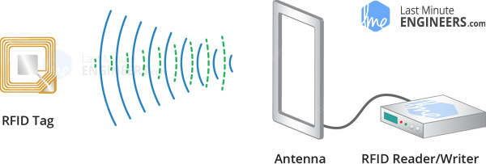{:width="600"}

Un lecteur se compose d’un module radiofréquence et d’une antenne générant un champ électromagnétique haute fréquence. D'autre part, l'étiquette est généralement un périphérique passif, ce qui signifie qu'elle ne contient pas de batterie. Au lieu de cela, il contient une puce qui stocke et traite les informations, ainsi qu'une antenne pour recevoir et transmettre un signal.

Pour lire les informations encodées sur une étiquette, celle-ci est placée à proximité du lecteur (il n'est pas nécessaire que celle-ci se trouve dans la ligne de vue directe du lecteur). Un lecteur génère un champ électromagnétique qui fait que les électrons se déplacent à travers l'antenne de l'étiquette et alimentent ensuite la puce. 

`<iframe src="/files/Passive-RFID-System-Working.mp4" width="640" height="360" frameborder="0" ></iframe>`  
<video width="640" height="480" controls>
  <source src="/files/Passive-RFID-System-Working.mp4" type="video/mp4">
</video>


La puce alimentée à l'intérieur de l'étiquette répond ensuite en renvoyant ses informations stockées au lecteur sous la forme d'un autre signal radio. Ceci s'appelle la rétrodiffusion. La rétrodiffusion, ou la modification de l'onde électromagnétique / RF, est détectée et interprétée par le lecteur qui envoie ensuite les données à un ordinateur ou à un microcontrôleur.

## Liens

* [Présentation des générations de tags Mifare (NFC 13,56 MHz)](http://blogmotion.fr/internet/securite/gen1-gen2-gen3-nfc-mifare-1k-18004)
* [mfoc – L'Atelier du Geek](https://www.latelierdugeek.fr/tag/mfoc/)
* [Cloner un tag Mifare avec un PN532](https://blandais.github.io/mifare/fr)
* [Clone parfait d’une puce RFID](https://www.unicoda.com/?p=3350)
* [A 2018 practical guide to hacking NFC/RFID ... - Smart lockpicking (pdf)](https://smartlockpicking.com/slides/Confidence_A_2018_Practical_Guide_To_Hacking_RFID_NFC.pdf)
* [Copier un badge NFC avec Kali Linux & Android](https://net-security.fr/security/copier-un-badge-nfc-avec-kali-linux-android/)


## Lecteur USB/RFID SCL3711

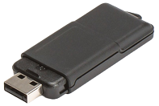  
Specifications  

Operates in the following modes:

* ISO/IEC 14443A/MIFARE® Reader/Writer
* FeliCa Reader/Writer
* ISO/IEC 14443B Reader/Writer
* ISO/IEC 14443A/MIFARE Classic® 1K or MIFARE Classic® 4K emulation
* FeliCa Card emulation
* ISO/IEC 18092, ECMA 340 Peer-to-Peer

### Installer outils et librairies PC/SC  

sur debian :  
`sudo apt-get update && sudo apt-get install pcscd libpcsclite1 pcsc-tools`  

sur archlinux:  
`sudo pacman -S ccid opensc pcsc-tools nfcutils mfoc`


Brancher votre lecteur RFID (si ça n’est pas déjà fait). 

    sudo dmesg

```
[ 5115.395318] usb 2-1: new full-speed USB device number 3 using xhci_hcd
[ 5115.576126] usb 2-1: New USB device found, idVendor=04e6, idProduct=5591, bcdDevice= 2.07
[ 5115.576132] usb 2-1: New USB device strings: Mfr=1, Product=2, SerialNumber=0
[ 5115.576135] usb 2-1: Product: SCL3711-NFC&RW
[ 5115.576137] usb 2-1: Manufacturer: SCM Micro
[ 5115.635559] nfc: nfc_init: NFC Core ver 0.1
[ 5115.635587] NET: Registered protocol family 39
[ 5115.644154] usb 2-1: NFC: NXP PN533 firmware ver 2.7 now attached
[ 5115.646729] usbcore: registered new interface driver pn533_usb
[ 7314.588412] usb 2-1: USB disconnect, device number 3
[ 7314.588667] pn533_usb 2-1:1.0: NFC: NXP PN533 NFC device disconnected
[ 7318.093305] usb 2-1: new full-speed USB device number 4 using xhci_hcd
[ 7318.268850] usb 2-1: New USB device found, idVendor=04e6, idProduct=5591, bcdDevice= 2.07
[ 7318.268856] usb 2-1: New USB device strings: Mfr=1, Product=2, SerialNumber=0
[ 7318.268860] usb 2-1: Product: SCL3711-NFC&RW
[ 7318.268862] usb 2-1: Manufacturer: SCM Micro
[ 7318.273599] usb 2-1: NFC: NXP PN533 firmware ver 2.7 now attached
```

    lsusb

```
Bus 002 Device 004: ID 04e6:5591 SCM Microsystems, Inc. SCL3711-NFC&RW
```

Après insertion, archlinux va alors charger automatiquement en arrière plan des modules qui vont perturber les NFC Tools. 

    lsmod |grep pn533

```
pn533_usb              20480  0
pn533                  45056  1 pn533_usb
nfc                   135168  1 pn533
```

Pour décharger ces modules, toujours dans votre fenêtre du terminal, entrez les commandes suivantes.

    sudo modprobe -r pn533_usb
    sudo modprobe -r pn533

### Vérifier le fonctionnement du lecteur

Pour être sûr que le lecteur fonctionne correctement avec les **NFC Tools**,  poser un tag RFID sur le lecteur et lancer la commande suivante 

    nfc-list

```
nfc-list uses libnfc 1.7.1
NFC device: SCM Micro / SCL3711-NFC&RW opened
1 ISO14443A passive target(s) found:
ISO/IEC 14443A (106 kbps) target:
    ATQA (SENS_RES): 00  04  
       UID (NFCID1): 3d  51  1f  70  
      SAK (SEL_RES): 08  
```

### Extraire les clés de chiffrement de la puce RFID vierge dans un fichier

Pour pouvoir écrire sur une puce RFID, il faut en posséder les clés de chiffrement. Une sorte de mot de passe qui permet d’encoder et de décoder les informations de la puce. Ces clés de chiffrements vont être stockées avec le contenu de la clé, dans un fichier. Ce fichier nous servira lors de l’étape finale pour copier les données de la puce originale sur la puce chinoise.

Pour lancer l’extraction des clés de chiffrement, placez votre puce sur le lecteur et saisissez dans un terminal la commande suivante.

    sudo mfoc -P 500 -O carte-vierge.dmp

Les clés de chiffrement seront stockées dans le fichier « carte-vierge.dmp ».

### Copiez le contenu de la puce RFID d’origine dans un fichier

Maintenant que les clés de chiffrement de la puce chinoise sont extraites, il va falloir faire de même avec la puce originale. Cette opération va copier les clés de chiffrement et le contenu de la puce d’origine dans un fichier. Ce fichier contiendra toutes les données de la puce, ainsi que son UID. C’est en quelques sorte une « sauvegarde » de votre puce RFID. N’hésitez pas à la conserver en lieu sûr, ainsi si vous perdez votre puce RFID vous pourrez en créer de nouvelles à l’identique à partir de ce fichier de sauvegarde.

Pour ce faire, placez la puce originale sur votre lecteur, et entrez la commande suivante :

    sudo mfoc -P 500 -O carte-originale.dmp

Vous l’aurez surement compris, cette commande va créer un fichier « carte-originale.dmp » c’est le fameux fichier de sauvegarde de votre puce originale.

### Ecrire le contenu de la puce originale sur la puce vierge

On arrive au bout ! Vous n’êtes plus qu’à une dernière commande de la victoire ! Maintenant que l’on possède une copie du contenu de la puce originale, ainsi que les clés de chiffrement de la puce chinoise, nous allons pouvoir transférer le contenu et l’UID de la puce originale sur la puce chinoise.

Pour se faire, et toujours dans le terminal, saisissez la commande suivante.

    sudo nfc-mfclassic W a carte-originale.dmp carte-vierge.dmp

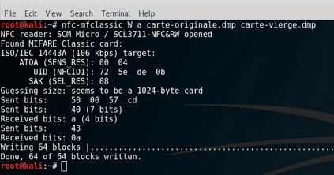  
L’opération devrait prendre 1 grosse seconde avant d’aboutir sur un message de succès. Si vous êtes attentifs, vous remarquerez que la seule différence par rapport au précédent article est le fait que le « W » est écrit en capital. ça n’est pas une erreur, cela demande au lecteur de transférer le contenu de la puce ainsi que le bloc 0 qui contient l’UID. En cas de succès, un message devrait vous confirmer l’écriture de 64 secteurs sur 64 

### NFC Tools  GUI

[NFC Tools GUI](https://www.wakdev.com/apps/nfc-tools-pc-mac.html) est un logiciel multiplate-forme: il fonctionne sur Mac, Windows et Linux.
Vous pouvez lire et écrire vos puces NFC grâce à une interface utilisateur simple et lisible.

**Prérequis**

* Un lecteur NFC compatible, avec pilotes associés et bibliothèque PC/SC.
    * Lecteurs NFC testés : 
        * ACR122U, ACR122T, ACR1255, ACR1256, ACR1252U, ACR1222L, ACR1255U-J1, SCM SCL3711, uTrust 3700F, Sony RC-S380 (Windows only) ...
* Des puces NFC compatibles.
    * Puces NFC testées : 
        * Mifare Ultralight, Mifare Ultralight C, NTAG203, NTAG210, NTAG212, NTAG213, NTAG215, NTAG216 , Mifare Classic 1k/4k, ...


**Installation sur Linux**

* Télécharger l'[image (.AppImage)](https://apps.wakdev.com/ntgui/releases/linux/nfctools-latest.AppImage)  
`sudo -s`  
`wget -O /usr/local/bin/nfctoolsgui.AppImage https://apps.wakdev.com/ntgui/releases/linux/nfctools-latest.AppImage`  
`chmod +x /usr/local/bin/nfctoolsgui.AppImage`  
* Définir les droits d'exécution: chmod +x nfctools-lastest.AppImage
* Connectez votre lecteur NFC à votre ordinateur
* Ouvrez l'application  **nfctoolsgui.AppImage** 

## Lecteur  RFID RC522/Raspberry Pi

[How to setup a Raspberry Pi RFID RC522 Chip](https://pimylifeup.com/raspberry-pi-rfid-rc522/)

Les puces RFID sont de plus en plus utilisées pour des systèmes d’identification, de gestion d’inventaire, de paiement, ou pour de la domotique, 

Comment lire des cartes RFID avec la Raspberry Pi et un lecteur RFID RC522 ?

À la fin du tutoriel, vous serez capable de lire un badge RFID, vérifier si c’est bien celui attendu, et allumer une LED verte ou rouge, selon le résultat. Il ne vous restera plus qu’à adapter cet exemple de base pour le projet de votre choix !

### matériel nécessaire

*    Une raspberry pi
*    Son alimentation
*    Une carte MicroSD
*    Un lecteur RFID RC522
*    Un ensemble de câbles, LEDs, résistances et plaques de test

### lecteur RFID RC522

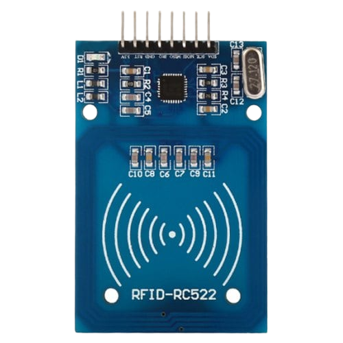{:width="200"}

RFC522 | Spécifications  
--- | ---
Frequency Range|13.56 MHz ISM Band
Host Interface|	SPI / I2C / UART
Operating Supply Voltage|	2.5 V to 3.3 V
Max. Operating Current|	13-26mA
Min. Current(Power down)|	10µA
Logic Inputs	|5V Tolerant
Read Range|	5 cm

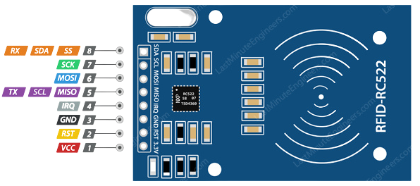{:width="400"}

* ***VCC*** alimente le module. Cela peut être n'importe où de 2,5 à 3,3 volts. Vous pouvez le connecter à la sortie 3.3V de votre Arduino. N'oubliez pas que le connecter à une broche 5V détruira probablement votre module!
* ***RST*** est une entrée pour la réinitialisation et la mise hors tension. Lorsque cette broche devient faible, la mise hors tension matérielle est activée. Cela désactive tous les récepteurs de courant internes, y compris l’oscillateur et les broches d’entrée, sont déconnectés du monde extérieur. Sur le front montant, le module est réinitialisé.
* ***GND*** est la broche de terre et doit être connecté à la broche GND de l’Arduino.
* ***IRQ*** est une broche d'interruption pouvant alerter le microcontrôleur lorsque l'étiquette RFID se trouve à proximité.
* La broche ***MISO/SCL/Tx*** fait office de sortie maître-esclave lorsque l'interface SPI est activée, agit comme horloge série lorsque l'interface I2C est activée et agit comme sortie de données série lorsque l'interface UART est activée.
* ***MOSI (Master Out Slave In)*** est l'entrée SPI du module RC522.
* ***SCK (Serial Clock)*** accepte les impulsions d’horloge fournies par le bus maître SPI, c’est-à-dire Arduino.
* La broche ***SS/SDA/Rx*** agit comme entrée de signal lorsque l'interface SPI est activée, agit comme données série lorsque l'interface I2C est activée et agit comme entrée de données série lorsque l'interface UART est activée. Cette broche est généralement marquée en la recouvrant d'un carré afin de pouvoir être utilisée comme référence pour identifier les autres broches. 

### Les ports GPIO du Rasberry Pi

Un port GPIO transmet un signal relativement binaire (pas de courant ou du courant). Dans le cas de la Raspberry Pi, les ports GPIO travaillent en 3.3 V et environ 20 mA.  
Les ports GPIO sont donc un moyen simple de communiquer ou de contrôler des éléments physiques.

Les modèles les plus récents de la Raspberry Pi disposent de 40 connectiques GPIO, qui se divisent en différentes catégories avec des usages spécifiques.

*    Power + : Alimentation électrique continue
*    GND : Ground = Retour à la terre
*    I2C : Protocole série synchrone
*    SPI : Autre protocole série synchrone
*    UART : Protocole asynchrone + conversion communication série vers parallèle.
*    GPIO : Port général qui peut éventuellement être transformé en I2C ou SPI.  
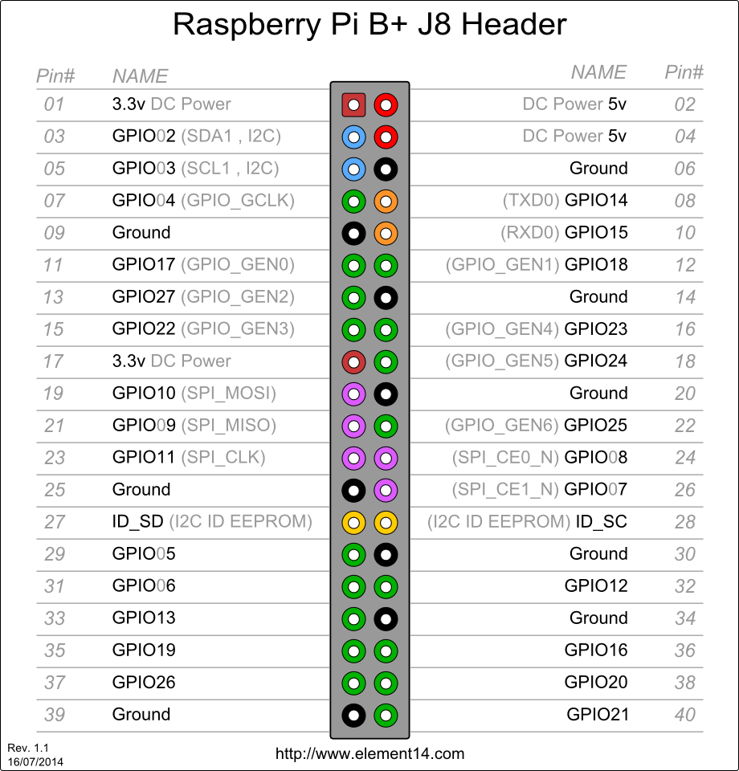{:width="400"}

### Connexion du lecteur RFID RC522 au Raspberry Pi

les ports du lecteur et le port GPIO de la raspberry pi  
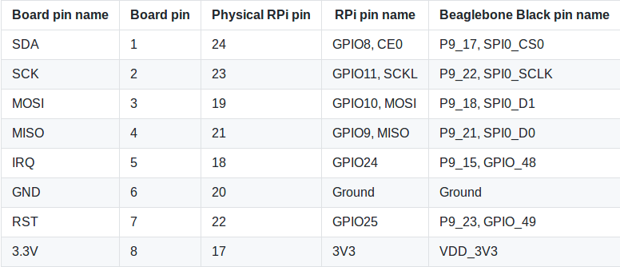{:width="400"}

### Branchement des leds

Connecter la résistance de 1.2k entre la masse (GND) et les 2 cathodes des leds.  
L'anode de la led rouge sur GPIO02 Pin 3 du raspberry pi
L'anode de la led verte sur GPIO03 Pin 5 du raspberry pi

### Activer le protocole SPI de la Raspberry Pi

Avant d’écrire le programme, activons le protocole SPI sur notre Raspberry Pi afin de pouvoir utiliser le module RFID. Lancer la commande `sudo raspi-config`, sur votre raspberry, puis de choisir **Interfacing Options, SPI, Yes** et enfin **Finish**.

### Installer la librairie pi-rc522

La librairie Python3 pi-rc522 permet de contrôler le lecteur RC522.  

    sudo pip3 install pi-rc522

### Programme de lecture identifiant badge RFID

Chaque badge RFID possède un identifiant unique. C’est en lisant cet identifiant et en le comparant à une liste d’identifiants autorisés que l’on peut savoir si un badge est autorisé.  
Ecrire un programme dans le dossier **/home/pi/electronic** pour lire l’identifiant unique d’un badge RFID.    
Création fichier **read_rfid_uid.py** 

```python
#!/usr/bin/env python3.5
#-- coding: utf-8 --

import RPi.GPIO as GPIO #Importe la bibliothèque pour contrôler les GPIOs
from pirc522 import RFID
import time


GPIO.setmode(GPIO.BOARD) #Définit le mode de numérotation (Board)
GPIO.setwarnings(False) #On désactive les messages d'alerte

rc522 = RFID() #On instancie la lib

print('En attente d\'un badge (pour quitter, Ctrl + c): ') #On affiche un message demandant à l'utilisateur de passer son badge

#On va faire une boucle infinie pour lire en boucle
while True :
    rc522.wait_for_tag() #On attnd qu'une puce RFID passe à portée
    (error, tag_type) = rc522.request() #Quand une puce a été lue, on récupère ses infos

    if not error : #Si on a pas d'erreur
        (error, uid) = rc522.anticoll() #On nettoie les possibles collisions, ça arrive si plusieurs cartes passent en même temps

        if not error : #Si on a réussi à nettoyer
            print('Vous avez passé le badge avec l\'id : {}'.format(uid)) #On affiche l'identifiant unique du badge RFID
            time.sleep(1) #On attend 1 seconde pour ne pas lire le tag des centaines de fois en quelques milli-secondes
```

Une fois le fichier enregistré, on en autorise l’exécution avec la commande :

    sudo chmod +x /home/pi/electronic/read_rfid_uid.py

Nous pouvons maintenant démarrer le programme en l’appelant avec la commande :

    /home/pi/electronic/read_rfid_uid.py

À chaque fois que vous passerez un badge RFID devant le lecteur, son identifiant unique sera affiché !

### afficher si un badge est valide ou non

Maintenant que nous pouvons lire l’identifiant unique d’un badge, il ne nous reste plus qu’à adapter le code précédent pour comparer l’identifiant lu à un identifiant écrit dans le programme.  
Nous allons donc modifier un peu le programme précédent pour qu’il compare l’uid lu à celui écris dans le programme, et allumer la led rouge ou verte selon le résultat.  
Copiez donc le fichier précédent, dans un nouveau fichier **verify_rfid.py** et modifier le pour le code ci-dessous  

```python
#!/usr/bin/env python3.5
#-- coding: utf-8 --

import RPi.GPIO as GPIO #Importe la bibliothèque pour contrôler les GPIOs
from pirc522 import RFID
import time


GPIO.setmode(GPIO.BOARD) #Définit le mode de numérotation (Board)
GPIO.setwarnings(False) #On désactive les messages d'alerte

LED_RED = 3 #Définit le numéro du port GPIO qui alimente la led rouge
LED_GREEN = 5 #Définit le numéro du port GPIO qui alimente la led verte
RFID_UID = [21, 35, 5, 43, 57] #Définit l'UID du badge RFID

#Définit la fonction permettant d'allumer une led
def turn_led_on (led) :
    GPIO.setup(led, GPIO.OUT) #Active le contrôle du GPIO
    GPIO.output(led, GPIO.HIGH) #Allume la led

#Définit la fonction permettant d'éteindre une led
def turn_led_off (led) :
    GPIO.setup(led, GPIO.OUT) #Active le contrôle du GPIO
    GPIO.output(led, GPIO.LOW) #Eteind la led

#Définit la fonction permettant d'allumer la rouge et éteindre la verte
def turn_red_on () :
    turn_led_off(LED_GREEN) #Eteind la led verte
    turn_led_on(LED_RED) #Allume la led rouge

#Définit la fonction permettant d'allumer la verte et éteindre la rouge
def turn_green_on () :
    turn_led_off(LED_RED) #Eteind la led rouge
    turn_led_on(LED_GREEN) #Allume la led verte


rc522 = RFID() #On instancie la lib

print('En attente d\'un badge (pour quitter, Ctrl + c): ') #On affiche un message demandant à l'utilisateur de passer son badge

#On va faire une boucle infinie pour lire en boucle
while True :
    rc522.wait_for_tag() #On attnd qu'une puce RFID passe à portée
    (error, tag_type) = rc522.request() #Quand une puce a été lue, on récupère ses infos

    if not error : #Si on a pas d'erreur
        (error, uid) = rc522.anticoll() #On nettoie les possibles collisions, ça arrive si plusieurs cartes passent en même temps

        if not error : #Si on a réussi à nettoyer
            if RFID_UID == uid :
                print('Badge {} autorisé !'.format(uid))
                turn_green_on()
            else :
                print('Badge {} interdit !'.format(uid))
                turn_red_on()

            time.sleep(1) #On attend 1 seconde pour ne pas lire le tag des centaines de fois en quelques milli-secondes
```

Il ne vous reste plus qu’à lancer le programme et tester !  
Vous pouvez ensuite adapter le code pour vos propres projets, comme créer un serrure connectée, ou encore un jukebox utilisant des tags RFID !  
Pour info, vous pouvez récupérer l’ensemble du code de ce tutoriel sur le [Github de Raspberry Pi FR](https://github.com/RaspbianFrance/rfid).

## Lecteur RFID RC522/Arduino

* [Arduino RFID RC522](https://ouiaremakers.com/posts/tutoriel-diy-arduino-rfid-rc522)
* [What is RFID? How It Works? Interface RC522 RFID Module with Arduino](https://lastminuteengineers.com/how-rfid-works-rc522-arduino-tutorial/)

### Interfacer le module RFID RC522 avec Arduino

Pour commencer, connectez la broche VCC du module à 3,3 V sur l’Arduino et la broche GND à la terre. La broche RST peut être connectée à n’importe quelle broche numérique sur l’Arduino. Dans notre cas, il est connecté à la broche numérique n ° 5. La broche IRQ n'est pas connectée car la bibliothèque Arduino que nous allons utiliser ne la prend pas en charge.  
Nous en sommes maintenant aux broches utilisées pour la communication SPI. Comme le module RC522 nécessite beaucoup de transfert de données, il donnera les meilleures performances lorsqu'il est connecté aux broches SPI matérielles d'un microcontrôleur. Les broches SPI matérielles sont beaucoup plus rapides que le "bit-bang" du code d'interface à l'aide d'un autre ensemble de broches.

>Notez que chaque carte Arduino a différentes broches SPI qui doivent être connectées en conséquence. Pour les cartes Arduino telles que UNO / Nano V3.0, ces broches sont numériques 13 (SCK), 12 (MISO), 11 (MOSI) et 10 (SS).

Si vous avez un Mega, les pins sont différents! Vous voudrez utiliser les technologies numériques 50 (MISO), 51 (MOSI), 52 (SCK) et 53 (SS). Reportez-vous au tableau ci-dessous pour une compréhension rapide. 

_ |	MOSI |	MISO |	SCK |	CS
--- | --- | --- | --- | ---
Arduino Uno |	11 |12 |13 |10
Arduino Nano |	11 |	12 |	13 |	10
Arduino Mega |	51 |	50 |	52 |	53

Si vous utilisez une carte Arduino différente de celle mentionnée ci-dessus, il est conseillé de vérifier la [documentation officielle](https://www.arduino.cc/en/Reference/SPI) d'Arduino avant de poursuivre.

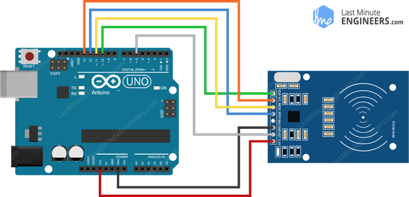{:width="600"}  
Une fois que tout est connecté, vous êtes prêt

Les différents branchements  

```
+-----------+----------+---------------------------------------------------------------+--------------------------+---------------+
|           | PCD      | Arduino                                                       | Teensy                   | ESP8266       |
|           +----------+-------------+---------+---------+-----------------+-----------+--------+--------+--------+---------------+
|           | MFRC522  | Uno / 101   | Mega    | Nano v3 |Leonardo / Micro | Pro Micro | 2.0    | ++ 2.0 | 3.1    | Wemos D1 mini |
+-----------+----------+-------------+---------+---------+-----------------+-----------+--------+--------+--------+---------------+
| Signal    | Pin      | Pin         | Pin     | Pin     | Pin             | Pin       | Pin    | Pin    | Pin    | Pin           |
+===========+==========+=============+=========+=========+=================+===========+========+========+========+===============+
| RST/Reset | RST      | 9 [1]_      | 5 [1]_  | D9      | RESET / ICSP-5  | RST       | 7      | 4      | 9      | D3            |
+-----------+----------+-------------+---------+---------+-----------------+-----------+--------+--------+--------+---------------+
| SPI SS    | SDA [3]_ | 10 [2]_     | 53 [2]_ | D10     | 10              | 10        | 0      | 20     | 10     | D8            |
+-----------+----------+-------------+---------+---------+-----------------+-----------+--------+--------+--------+---------------+
| SPI MOSI  | MOSI     | 11 / ICSP-4 | 51      | D11     | ICSP-4          | 16        | 2      | 22     | 11     | D7            |
+-----------+----------+-------------+---------+---------+-----------------+-----------+--------+--------+--------+---------------+
| SPI MISO  | MISO     | 12 / ICSP-1 | 50      | D12     | ICSP-1          | 14        | 3      | 23     | 12     | D6            |
+-----------+----------+-------------+---------+---------+-----------------+-----------+--------+--------+--------+---------------+
| SPI SCK   | SCK      | 13 / ICSP-3 | 52      | D13     | ICSP-3          | 15        | 1      | 21     | 13     | D5            |
+-----------+----------+-------------+---------+---------+-----------------+-----------+--------+--------+--------+---------------+
```


### Code Arduino - Lecture d'une étiquette RFID

Communiquer avec le module RFID RC522 est un travail fastidieux, mais heureusement pour nous, il existe une bibliothèque appelée bibliothèque MFRC522 qui simplifie la lecture et l’écriture sur les étiquettes RFID. Merci à Miguel Balboa. Commencez par télécharger la bibliothèque en visitant le [dépôt GitHub](https://github.com/miguelbalboa/rfid) ou [télécharger le zip](https://lastminuteengineers.com/libraries/rfid-master.zip): 

Pour l'installer, ouvrez l'EDI Arduino, accédez à Esquisse> Inclure la bibliothèque> Ajouter une bibliothèque .ZIP, puis sélectionnez le fichier rfid-master.zip que vous venez de télécharger. Si vous avez besoin de plus de détails sur l’installation d’une bibliothèque, consultez ce tutoriel sur l’installation d’une bibliothèque Arduino .

Une fois la bibliothèque installée, ouvrez le sous-menu Exemples et sélectionnez MFRC522> DumpInfo, exemple d’esquisse.  
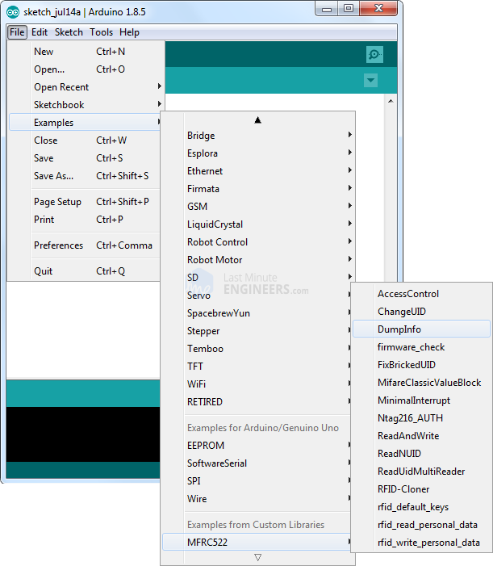{:width="400"}  
Cette esquisse n'écrira aucune donnée sur la balise. Il vous indique simplement s'il a réussi à lire la balise et affiche des informations à ce sujet. Cela peut être très utile avant d'essayer un nouveau tag!

Allez au début de l'esquisse et assurez-vous que le RST_PIN est correctement initialisé. Dans notre cas, nous utilisons la broche numérique 5 alors changez-le en 5!  
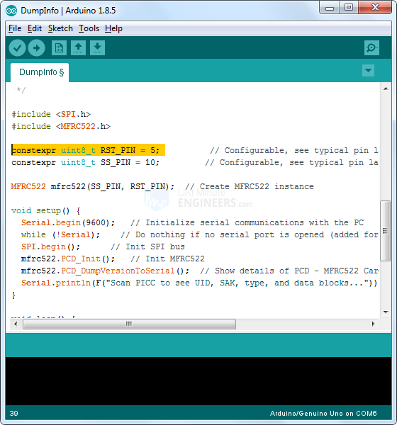{:width="400"}   
OK, chargez maintenant le croquis et ouvrez le moniteur de série. Dès que vous rapprochez le tag du module, vous obtiendrez probablement le résultat suivant. Ne déplacez pas le tag tant que toutes les informations ne sont pas affichées.  
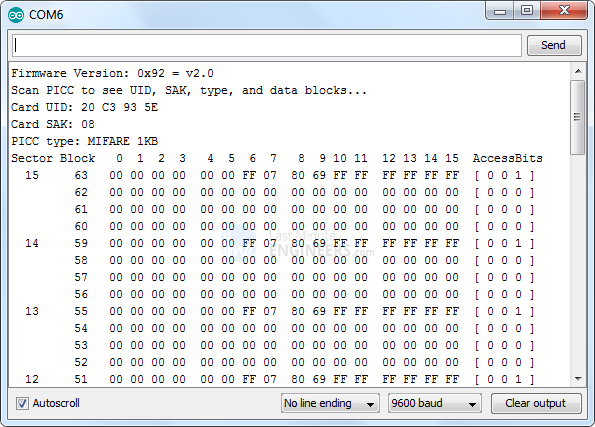{:width="400"}   
Il affiche toutes les informations utiles sur la balise, y compris son identifiant unique (UID), sa taille et 1K de mémoire.

### Disposition de la mémoire MIFARE Classic 1K

La mémoire 1K de la balise est organisée en **16 secteurs** (de 0 à 15) Chaque secteur est divisé en **4 blocs** (blocs 0 à 3). Chaque bloc peut stocker 16 octets de données (de 0 à 15).  

Cela nous dit sûrement que nous avons  
16 secteurs x 4 blocs x 16 octets de données = 1024 octets = 1K de mémoire

L'ensemble de la mémoire 1K avec les secteurs, les blocs et les données est mis en évidence ci-dessous.  
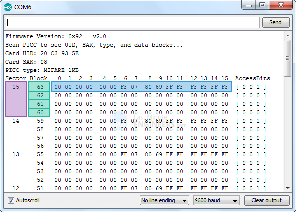{:width="400"}   
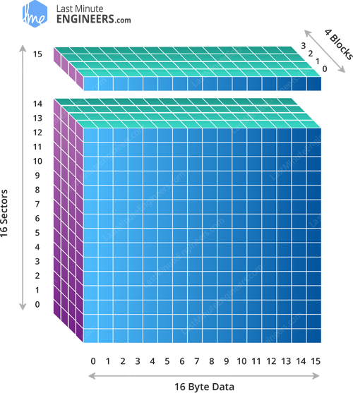{:width="400"}   
*Représentation 3D de la disposition de la carte mémoire MIFARE Classic 1K*

Le bloc 3 de chaque secteur est appelé **secteur** et contient des informations appelées **bits d'accès** permettant d'accorder un **accès** en lecture et en écriture aux blocs restants d'un secteur. Cela signifie que seuls les 3 derniers blocs (blocs 0, 1 et 2) de chaque secteur sont réellement disponibles pour le stockage de données, ce qui signifie que nous avons 48 octets par secteur de 64 octets disponibles pour notre propre usage.

De plus, le bloc 0 du secteur 0 est connu sous le nom de fabricant. Le fabricant contient les données du fabricant du circuit intégré, ainsi que l' **identificateur unique (UID)**. Le bloc fabricant est surligné en rouge ci-dessous.  
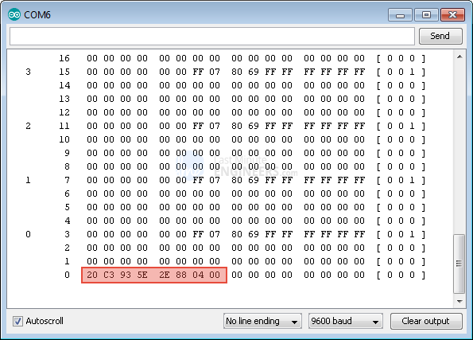{:width="400"}   

>**ATTENTION Il est très risqué d’écraser le bloc du fabricant (Manufacturer Block), cela pourrait  verrouiller définitivement la carte.** 

### Code Arduino - Écrire une étiquette RFID

Considérant que vous avez lu avec succès l'étiquette RFID, nous allons passer à notre prochain test. L'esquisse suivante fera une démonstration de base de l'écriture de données personnalisées sur une étiquette RFID. Essayez le croquis avant de commencer sa ventilation détaillée. 

```c
#include <SPI.h>      //include the SPI bus library
#include <MFRC522.h>  //include the RFID reader library

#define SS_PIN 10  //slave select pin
#define RST_PIN 5  //reset pin

MFRC522 mfrc522(SS_PIN, RST_PIN);  // instatiate a MFRC522 reader object.
MFRC522::MIFARE_Key key;          //create a MIFARE_Key struct named 'key', which will hold the card information

//this is the block number we will write into and then read.
int block=2;  

byte blockcontent[16] = {"Last-Minute-Engg"};  //an array with 16 bytes to be written into one of the 64 card blocks is defined
//byte blockcontent[16] = {0,0,0,0,0,0,0,0,0,0,0,0,0,0,0,0};  //all zeros. This can be used to delete a block.

//This array is used for reading out a block.
byte readbackblock[18];

void setup() 
{
    Serial.begin(9600);        // Initialize serial communications with the PC
    SPI.begin();               // Init SPI bus
    mfrc522.PCD_Init();        // Init MFRC522 card (in case you wonder what PCD means: proximity coupling device)
    Serial.println("Scan a MIFARE Classic card");
  
  // Prepare the security key for the read and write functions.
  for (byte i = 0; i < 6; i++) {
    key.keyByte[i] = 0xFF;  //keyByte is defined in the "MIFARE_Key" 'struct' definition in the .h file of the library
  }
}

void loop()
{  
  // Look for new cards
  if ( ! mfrc522.PICC_IsNewCardPresent()) {
    return;
  }
  
  // Select one of the cards
  if ( ! mfrc522.PICC_ReadCardSerial()) 
  {
    return;
  }
    Serial.println("card selected");
         
   //the blockcontent array is written into the card block
   writeBlock(block, blockcontent);
   
   //read the block back
   readBlock(block, readbackblock);
   //uncomment below line if you want to see the entire 1k memory with the block written into it.
   //mfrc522.PICC_DumpToSerial(&(mfrc522.uid));
   
   //print the block contents
   Serial.print("read block: ");
   for (int j=0 ; j<16 ; j++)
   {
     Serial.write (readbackblock[j]);
   }
   Serial.println("");
}


//Write specific block    
int writeBlock(int blockNumber, byte arrayAddress[]) 
{
  //this makes sure that we only write into data blocks. Every 4th block is a trailer block for the access/security info.
  int largestModulo4Number=blockNumber/4*4;
  int trailerBlock=largestModulo4Number+3;//determine trailer block for the sector
  if (blockNumber > 2 && (blockNumber+1)%4 == 0){Serial.print(blockNumber);Serial.println(" is a trailer block:");return 2;}
  Serial.print(blockNumber);
  Serial.println(" is a data block:");
  
  //authentication of the desired block for access
  byte status = mfrc522.PCD_Authenticate(MFRC522::PICC_CMD_MF_AUTH_KEY_A, trailerBlock, &key, &(mfrc522.uid));
  if (status != MFRC522::STATUS_OK) {
         Serial.print("PCD_Authenticate() failed: ");
         Serial.println(mfrc522.GetStatusCodeName(status));
         return 3;//return "3" as error message
  }
  
  //writing the block 
  status = mfrc522.MIFARE_Write(blockNumber, arrayAddress, 16);
  //status = mfrc522.MIFARE_Write(9, value1Block, 16);
  if (status != MFRC522::STATUS_OK) {
           Serial.print("MIFARE_Write() failed: ");
           Serial.println(mfrc522.GetStatusCodeName(status));
           return 4;//return "4" as error message
  }
  Serial.println("block was written");
}


//Read specific block
int readBlock(int blockNumber, byte arrayAddress[]) 
{
  int largestModulo4Number=blockNumber/4*4;
  int trailerBlock=largestModulo4Number+3;//determine trailer block for the sector

  //authentication of the desired block for access
  byte status = mfrc522.PCD_Authenticate(MFRC522::PICC_CMD_MF_AUTH_KEY_A, trailerBlock, &key, &(mfrc522.uid));

  if (status != MFRC522::STATUS_OK) {
         Serial.print("PCD_Authenticate() failed (read): ");
         Serial.println(mfrc522.GetStatusCodeName(status));
         return 3;//return "3" as error message
  }

//reading a block
byte buffersize = 18;//we need to define a variable with the read buffer size, since the MIFARE_Read method below needs a pointer to the variable that contains the size... 
status = mfrc522.MIFARE_Read(blockNumber, arrayAddress, &buffersize);//&buffersize is a pointer to the buffersize variable; MIFARE_Read requires a pointer instead of just a number
  if (status != MFRC522::STATUS_OK) {
          Serial.print("MIFARE_read() failed: ");
          Serial.println(mfrc522.GetStatusCodeName(status));
          return 4;//return "4" as error message
  }
  Serial.println("block was read");
}
```

L'esquisse commence par inclure les bibliothèques MFRC522 et SPI, définissant les broches Arduino auxquelles le RC522 est connecté et instanciant un objet lecteur MFRC522.

```
#include <SPI.h>//include the SPI bus library
#include <MFRC522.h>//include the RFID reader library

#define SS_PIN 10  //slave select pin
#define RST_PIN 5  //reset pin
MFRC522 mfrc522(SS_PIN, RST_PIN);        // instatiate a MFRC522 reader object.
MFRC522::MIFARE_Key key;//create a MIFARE_Key struct named 'key', which will hold the card information
```

Ensuite, nous devons définir un bloc dans lequel nous allons stocker nos données. Ici le secteur 0 bloc 2 est sélectionné. N'oubliez pas de ne jamais sélectionner le bloc 3 d'un secteur. L'écriture dans un bloc 'segment de secteur' peut rendre le bloc inutilisable.

```
//this is the block number we will write into and then read.
int block=2;
```

Ensuite, nous définissons un tableau de 16 octets nommé blockcontent[16] qui contient le message que nous voulons écrire dans le bloc. Vous pouvez supprimer n'importe quel bloc en écrivant des zéros.

```
byte blockcontent[16] = {"Last-Minute-Engg"};  //an array with 16 bytes to be written into one of the 64 card blocks is defined
//byte blockcontent[16] = {0,0,0,0,0,0,0,0,0,0,0,0,0,0,0,0};  //all zeros. This can be used to delete a block.
```

Ensuite, nous devons définir un tableau de 18 octets nommé readbackblock [18] . Ceci peut être utilisé pour lire le contenu écrit. Attendez… 18 octets? Cela ne devrait-il pas être 16 octets? La réponse est non. La méthode MIFARE_Read de la bibliothèque MFRC522 nécessite un tampon d'au moins 18 octets pour contenir les 16 octets d'un bloc.

```
//This array is used for reading out a block.
byte readbackblock[18];
```

Dans la fonction Setup: nous initialisons les communications série avec le PC, la bibliothèque SPI et l’objet MFRC522. Nous devons également préparer la clé de sécurité pour les fonctions de lecture et d’écriture. Ici, les six octets de clé sont définis sur 0xFF. Comme les cartes du kit sont neuves et que les clés n’ont jamais été définies, elles sont 0xFF. Si nous avions une carte programmée par quelqu'un d'autre, nous aurions besoin de connaître la clé pour pouvoir y accéder. Cette clé devrait alors être stockée dans «clé» à la place.

```
Serial.begin(9600);        // Initialize serial communications with the PC
SPI.begin();               // Init SPI bus
mfrc522.PCD_Init();        // Init MFRC522 card (in case you wonder what PCD means: proximity coupling device)
Serial.println("Scan a MIFARE Classic card");
  
// Prepare the security key for the read and write functions.
for (byte i = 0; i < 6; i++) {
   key.keyByte[i] = 0xFF;  //keyByte is defined in the "MIFARE_Key" 'struct' definition in the .h file of the library
}
```

En boucle: nous recherchons d’abord si une carte est en vue. Si oui, cette carte est sélectionnée pour les besoins de l’écriture et de la lecture.

```
// Look for new cards
  if ( ! mfrc522.PICC_IsNewCardPresent()) {
    return;
  }
  
  // Select one of the cards
  if ( ! mfrc522.PICC_ReadCardSerial()) 
  {
    return;
  }
  Serial.println("card selected");
```

Il est maintenant très facile d’écrire le bloc, il suffit d’appeler une fonction personnalisée appelée writeBlock() qui prend deux paramètres - l’un est le numéro de bloc sur lequel nous souhaitons écrire les données et les données elles-mêmes.

```
//the blockcontent array is written into the card block
writeBlock(block, blockcontent);
```

Pour vérifier si l'opération d'écriture a réussi, nous devons relire le contenu du bloc. Cela peut être fait en utilisant la fonction personnalisée appelée readBlock() qui prend à nouveau deux paramètres: l’un est le numéro de bloc et l’autre est array pour stocker le contenu du bloc. Vous pouvez utiliser la fonction PICC_DumpToSerial() si vous souhaitez voir la totalité de la mémoire 1k avec le bloc écrit dans celle-ci.

```
//read the block back
readBlock(block, readbackblock);
//uncomment below line if you want to see the entire 1k memory with the block written into it.
//mfrc522.PICC_DumpToSerial(&(mfrc522.uid));
```

Enfin, nous imprimons le contenu du tableau readbackblock en utilisant une boucle for et affichons le contenu sur le moniteur série.

```
//print the block contents
 Serial.print("read block: ");
 for (int j=0 ; j<16 ; j++)
 {
   Serial.write (readbackblock[j]);
 }
 Serial.println("");
```

La sortie sur le moniteur série ressemblera à ceci.  
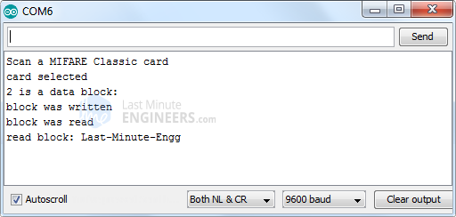{:width="400"}

### Autre exemple lecture/écriture

On prend l'exemple nommé **ReadAndWrite.ino** joint avec la bibliothèque MFR522  

>ATTENTION : Les données seront inscrites dans le tag, dans le secteur #1 (blocs #4 à #7).

Résultat sur la console  

```
Scan a MIFARE Classic PICC to demonstrate read and write.
Using key (for A and B): FF FF FF FF FF FF
BEWARE: Data will be written to the PICC, in sector #1
Card UID: 17 F9 B3 BF
PICC type: MIFARE 1KB
Authenticating using key A...
Current data in sector:
   1      7   00 00 00 00  00 00 FF 07  80 69 FF FF  FF FF FF FF  [ 0 0 1 ] 
          6   00 00 00 00  00 00 00 00  00 00 00 00  00 00 00 00  [ 0 0 0 ] 
          5   00 00 00 00  00 00 00 00  00 00 00 00  00 00 00 00  [ 0 0 0 ] 
          4   01 02 03 04  05 06 07 08  09 0A FF 0B  0C 0D 0E 0F  [ 0 0 0 ] 

Reading data from block 4 ...
Data in block 4:
 01 02 03 04 05 06 07 08 09 0A FF 0B 0C 0D 0E 0F

Authenticating again using key B...
Writing data into block 4 ...
 0F 0E 0D 0C 0B 0A 09 08 07 06 05 04 03 02 01 25

Reading data from block 4 ...
Data in block 4:
 0F 0E 0D 0C 0B 0A 09 08 07 06 05 04 03 02 01 25
Checking result...
Number of bytes that match = 16
Success :-)

Current data in sector:
   1      7   00 00 00 00  00 00 FF 07  80 69 FF FF  FF FF FF FF  [ 0 0 1 ] 
          6   00 00 00 00  00 00 00 00  00 00 00 00  00 00 00 00  [ 0 0 0 ] 
          5   00 00 00 00  00 00 00 00  00 00 00 00  00 00 00 00  [ 0 0 0 ] 
          4   0F 0E 0D 0C  0B 0A 09 08  07 06 05 04  03 02 01 25  [ 0 0 0 ] 

```


### Système de contrôle d'accès serrure porte avec RFID

Créons un projet Arduino rapide pour montrer comment un simple module de lecteur RFID RC522 peut être utilisé pour créer un système de contrôle d’accès par serrure de porte RFID . Notre programme analysera l'identifiant unique de chaque étiquette RFID lorsqu'il sera suffisamment proche pour être alimenté par le lecteur RC522. Si l'UID de la balise correspond à une valeur prédéfinie (balise principale) stockée dans la mémoire Arduino, l'accès sera accordé. Et si nous analysons toute balise inconnue, l'accès sera refusé.  
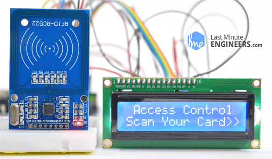  
*Sortie du projet Arduino de contrôle d'accès de serrure de porte*

Bien entendu, ce projet pourrait être interfacé pour ouvrir des portes, allumer un relais, allumer une LED ou toute autre chose à laquelle vous pouvez penser.

Si vous n'êtes pas familier avec les écrans LCD 16 × 2 caractères, envisagez de lire le didacticiel [Interfacing 16×2 Character LCD Module with Arduino](https://lastminuteengineers.com/arduino-1602-character-lcd-tutorial/).   

Avant de télécharger du code et de balayer des balises, examinons le schéma de circuit du projet.

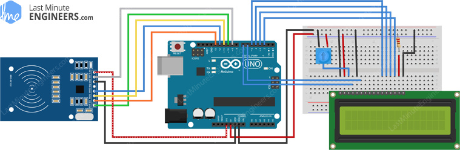{:width="600"}   
*Câblage du module graveur de lecteur RC522 RFID avec Arduino UNO et écran LCD 16 × 2 caractères*

C'est tout! Maintenant, essayez le schéma ci-dessous.

```c
#include <SPI.h>
#include <MFRC522.h>
#include <LiquidCrystal.h>

#define RST_PIN 9
#define SS_PIN 10

byte readCard[4];
String MasterTag = "20C3935E";	// REPLACE this Tag ID with your Tag ID!!!
String tagID = "";

// Create instances
MFRC522 mfrc522(SS_PIN, RST_PIN);
LiquidCrystal lcd(7, 6, 5, 4, 3, 2); //Parameters: (rs, enable, d4, d5, d6, d7) 

void setup() 
{
  // Initiating
  SPI.begin(); // SPI bus
  mfrc522.PCD_Init(); // MFRC522
  lcd.begin(16, 2); // LCD screen

  lcd.clear();
  lcd.print(" Access Control ");
  lcd.setCursor(0, 1);
  lcd.print("Scan Your Card>>");
}

void loop() 
{
  
  //Wait until new tag is available
  while (getID()) 
  {
    lcd.clear();
    lcd.setCursor(0, 0);
    
    if (tagID == MasterTag) 
    {
      
      lcd.print(" Access Granted!");
      // You can write any code here like opening doors, switching on a relay, lighting up an LED, or anything else you can think of.
    }
    else
    {
      lcd.print(" Access Denied!");
    }
    
      lcd.setCursor(0, 1);
      lcd.print(" ID : ");
      lcd.print(tagID);
      
    delay(2000);

    lcd.clear();
    lcd.print(" Access Control ");
    lcd.setCursor(0, 1);
    lcd.print("Scan Your Card>>");
  }
}

//Read new tag if available
boolean getID() 
{
  // Getting ready for Reading PICCs
  if ( ! mfrc522.PICC_IsNewCardPresent()) { //If a new PICC placed to RFID reader continue
  return false;
  }
  if ( ! mfrc522.PICC_ReadCardSerial()) { //Since a PICC placed get Serial and continue
  return false;
  }
  tagID = "";
  for ( uint8_t i = 0; i < 4; i++) { // The MIFARE PICCs that we use have 4 byte UID
  //readCard[i] = mfrc522.uid.uidByte[i];
  tagID.concat(String(mfrc522.uid.uidByte[i], HEX)); // Adds the 4 bytes in a single String variable
  }
  tagID.toUpperCase();
  mfrc522.PICC_HaltA(); // Stop reading
  return true;
}
```

Le programme est assez simple. Au début, nous incluons les bibliothèques nécessaires, définissons des broches Arduino, créons des instances d'objets LCD et MFRC522 et définissons une balise principale.

```
#include <SPI.h>
#include <MFRC522.h>
#include <LiquidCrystal.h>

#define RST_PIN 9
#define SS_PIN 10

byte readCard[4];
String MasterTag = "20C3935E";	// REPLACE this Tag ID with your Tag ID!!!
String tagID = "";

// Create instances
MFRC522 mfrc522(SS_PIN, RST_PIN);
LiquidCrystal lcd(7, 6, 5, 4, 3, 2); //Parameters: (rs, enable, d4, d5, d6, d7)
```

Dans la fonction de configuration, nous initialisons l’interface SPI, l’objet MFRC522 et le LCD. Ensuite, nous imprimons le message de bienvenue sur l’écran LCD.

```
void setup() 
{
  // Initiating
  SPI.begin(); // SPI bus
  mfrc522.PCD_Init(); // MFRC522
  lcd.begin(16, 2); // LCD screen

  lcd.clear();
  lcd.print(" Access Control ");
  lcd.setCursor(0, 1);
  lcd.print("Scan Your Card>>");
}
```

En boucle, nous attendons que la nouvelle balise soit scannée. Une fois que cela est fait, nous comparons la balise inconnue avec la balise principale définie avant la fonction de configuration. C'est tout! Si son identifiant correspond à l'identifiant principal, l'accès est accordé sinon refusé.

```
void loop() 
{
  
  //Wait until new tag is available
  while (getID()) 
  {
    lcd.clear();
    lcd.setCursor(0, 0);
    
    if (tagID == MasterTag) 
    {
      
      lcd.print(" Access Granted!");
      // You can write any code here like opening doors, switching on a relay, lighting up an LED, or anything else you can think of.
    }
    else
    {
      lcd.print(" Access Denied!");
    }
    
      lcd.setCursor(0, 1);
      lcd.print(" ID : ");
      lcd.print(tagID);
      
    delay(2000);

    lcd.clear();
    lcd.print(" Access Control ");
    lcd.setCursor(0, 1);
    lcd.print("Scan Your Card>>");
  }
}
```

L'essentiel dans le projet est une fonction personnalisée appelée `getID()` . Une fois la nouvelle carte recherchée, à l'intérieur d'une boucle for (`for loop`), il convertit 4 octets d'UID en chaîne et se concatène pour créer une seule chaîne.

```
boolean getID() 
{
  // Getting ready for Reading PICCs
  if ( ! mfrc522.PICC_IsNewCardPresent()) { //If a new PICC placed to RFID reader continue
  return false;
  }
  if ( ! mfrc522.PICC_ReadCardSerial()) { //Since a PICC placed get Serial and continue
  return false;
  }
  tagID = "";
  for ( uint8_t i = 0; i < 4; i++) { // The MIFARE PICCs that we use have 4 byte UID
  //readCard[i] = mfrc522.uid.uidByte[i];
  tagID.concat(String(mfrc522.uid.uidByte[i], HEX)); // Adds the 4 bytes in a single String variable
  }
  tagID.toUpperCase();
  mfrc522.PICC_HaltA(); // Stop reading
  return true;
}```


