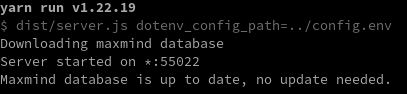
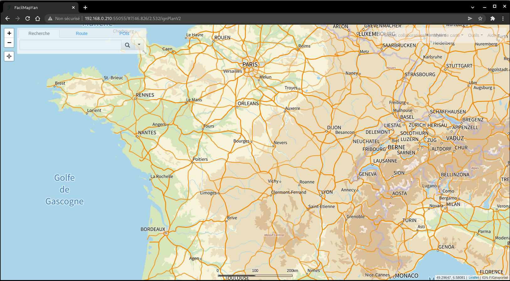

+++
title = 'FacilMapYan carte en ligne à code source ouvert'
date = 2023-01-24 00:00:00 +0100
categories = ['cartographie']
+++
## FacilMapYan

[FacilMap](https://facilmap.org/) est une carte en ligne polyvalente, respectueuse de la vie privée, à code source ouvert, qui combine différents services basés sur OpenStreetMap et permet de trouver facilement des lieux, de planifier des itinéraires et de créer des cartes personnalisées remplies de marqueurs, de lignes et d'itinéraires.

*FacilMapYan est un "fork" de FacilMap pour la traduction française*

### Prérequis

Installer et utiliser la version **node lts**

    nvm install --lts
    nvm use --lts 
    npm install yarn -g # Debian
    sudo pacman -S yarn # Archlinux

Les versions : `nvm --version && npm --version && node --version && yarn --version`

```
0.39.1
8.16.0
v16.16.0
1.22.19
```

### Base MySql

Création base de données 

    sudo mysql -uroot

```
CREATE DATABASE facilmap;
CREATE USER "facilmapuser"@"localhost";
SET password FOR "facilmapuser"@"localhost" = password('6K3wU4tGE5si');
GRANT ALL PRIVILEGES ON facilmap.* TO "facilmapuser"@"localhost" IDENTIFIED BY "6K3wU4tGE5si";
FLUSH PRIVILEGES;
EXIT
```

### Cloner facilmapyan

Dépôt gitea facilmapyan.git

    cd ~/media/www
    git clone https://gitea.xoyaz.xyz/yann/facilmapyan 

Se rendre dans le dossier `media/www/facilmapyan/`


### Chronologie des commandes yarn 

1. Lancez `yarn install` pour installer les dépendances.
2. Lancez `yarn build` pour construire les paquets JS.
3. Copiez `config.env.example` dans `config.env` et ajustez les paramètres.
4. Lancez `yarn server` dans le répertoire `server`.

Vous trouverez plus de détails dans le [Guide de l'administrateur](https://docs.facilmap.org/administrators/server.html#standalone) et le [Guide du développeur](https://docs.facilmap.org/developers/development/dev-setup.html).

#### yarn install

En cas d'erreur  d'installation

```
[yann@archyan facilmapyan]$ yarn install
yarn install v1.22.19
[1/4] Resolving packages...
success Already up-to-date.
Done in 0.47s.
[yann@archyan facilmapyan]$ yarn build
yarn run v1.22.19
$ yarn workspaces run build

> facilmap-types
$ tsc
node:internal/modules/cjs/loader:936
  throw err;
  ^

Error: Cannot find module '../lib/tsc.js'
```

Effacer le dossier `rm -rf node_modules/`  


#### yarn build 

Après exécution `yarn build `, modifier le fichier de configuration **config.env**

```
# HTTP requests made by the backend will send this User-Agent header. Please adapt to your URL and e-mail address.
USER_AGENT=FacilMap (https://map.exemple.fr/, map@exemple.fr)

# On which IP the HTTP server will listen. Leave empty to listen to all IPs.
HOST=
# On which port the HTTP server will listen.
PORT=8082

# Database configuration. DB_TYPE can be mysql, postgres, sqlite or mssql.
# See https://sequelize.org/master/class/lib/sequelize.js~Sequelize.html#instance-constructor-constructor for details.
DB_TYPE=mysql
DB_HOST=localhost
DB_PORT=3306
DB_NAME=facilmap
DB_USER=facilmapuser
DB_PASSWORD=6K3wU4tGE5si

# OpenRouteService is used for calculating routes with advanced settings
# Get a token on https://go.openrouteservice.org/
ORS_TOKEN=8rd6uz44j6cfd4zcutf562ze3a599m3388x84ss797s

# MapBox is used for calculating routes with simple settings
# Get an API key on https://www.mapbox.com/signup/
MAPBOX_TOKEN=pk.KQ8L5J8s62cdtf3qzcFZYJ2w8bb3ggrX98DNGA4426Y.cpE825h58tn9KvLpT85TjJrV8P8RSZaivE2An7Nt835

# MapZen is used for getting elevation information
# Get an API key on https://mapzen.com/developers/sign_up
#MAPZEN_TOKEN=

# Maxmind configuration. If specified, the maxmind GeoLite2 database will be downloaded
# for Geo IP lookup (to show the initial map state) and kept in memory.
# Sign up here: https://www.maxmind.com/en/geolite2/signup
MAXMIND_USER_ID=589647
MAXMIND_LICENSE_KEY=rdPb7AX2b92d8Z4CPY6mgcj54H
```

#### yarn server

est exécuté dans une fenêtre terminal depuis le dossier `facilmapyan/server/` après avoir modifié le fichier de configuration `config.env`  

    yarn server



### Node server et systemd

Créer un service systemd pour lancer le serveur node

    /etc/systemd/system/facilmap.service

<u>Cas archlinux</u>

```
[Unit]
Description=facilmap server
After=network.target

[Service]
Type=simple
User=yann
WorkingDirectory=/home/yann/media/www/facilmapyan/server
ExecStart=/usr/bin/yarn server
Restart=on-failure

[Install]
WantedBy=multi-user.target
```

<u>Cas Debian</u>

```
[Unit]
Description=facilmap server
After=network.target

[Service]
Type=simple
User=lxcyan
WorkingDirectory=/home/lxcyan/media/www/facilmapyan/server
ExecStart=/usr/local/bin/yarn server
Restart=on-failure

[Install]
WantedBy=multi-user.target
```

Sur Debian pour éviter le message suivant : `/usr/bin/env: node: No such file or directory`  
Il faut créer un lien symbolique entre l'exécutable nodejs et node : `sudo ln -s "$(which nodejs)" /usr/local/bin/node`  
La raison en est que lorsque vous faites "apt-get install node", il installe un paquet non lié, ils ont donc dû choisir un nom différent pour qu'il ne soit pas en conflit

On va créer un lien sur les binaires node et yarn

```bash
sudo ln -s /home/lxcyan//.nvm/versions/node/v16.16.0/bin/node /usr/local/bin/node
sudo ln -s /home/lxcyan//.nvm/versions/node/v16.16.0/bin/yarn /usr/local/bin/yarn
```

Lancer le service er vérifier

    sudo systemctl daemon-reload
    sudo systemctl start facilmap
    sudo systemctl status facilmap

```
● facilmap.service - facilmap server
     Loaded: loaded (/etc/systemd/system/facilmap.service; enabled; vendor preset: enabled)
    Drop-In: /run/systemd/system/service.d
             └─zzz-lxc-service.conf
     Active: active (running) since Tue 2023-01-24 12:10:46 CET; 3s ago
   Main PID: 1471 (node)
      Tasks: 23 (limit: 38334)
     Memory: 243.3M
        CPU: 1.351s
     CGroup: /system.slice/facilmap.service
             ├─1471 node /usr/local/bin/yarn server
             ├─1482 /bin/sh -c dist/server.js dotenv_config_path=../config.env
             └─1483 /home/lxcyan/.nvm/versions/node/v16.16.0/bin/node dist/server.js dotenv_config_path=../config.env

janv. 24 12:10:46 lxcbullseye systemd[1]: Started facilmap server.
janv. 24 12:10:46 lxcbullseye yarn[1471]: yarn run v1.22.19
janv. 24 12:10:46 lxcbullseye yarn[1471]: $ dist/server.js dotenv_config_path=../config.env
janv. 24 12:10:46 lxcbullseye yarn[1483]: Downloading maxmind database
janv. 24 12:10:47 lxcbullseye yarn[1483]: Server started on *:55022
janv. 24 12:10:47 lxcbullseye yarn[1483]: Maxmind database is up to date, no update needed.
```

Ouvrir le lien localhost:55022  



### Exécuter la version de développement

<https://docs.facilmap.org/developers>  
Pour exécuter le dernier état du [dépôt FacilMap](https://github.com/FacilMap/facilmap)

Exécutez les étapes suivantes :

1.    Assurez-vous que vous disposez d'une version récente de [Node.js](https://nodejs.org/), [yarn](https://yarnpkg.com/) et une base de données (MariaDB, MySQL, PostgreSQL, SQLite, Microsoft SQL Server) configurée. (Notez que seul MySQL/MariaDB a été testé jusqu'à présent).
2. Cloner le référentiel [FacilMap](https://github.com/FacilMap/facilmap)
3.    Exécutez yarn install dans le dossier racine de ce dépôt pour installer les dépendances.
4.    Exécutez yarn build pour créer les bundles JS.
5.    Copiez `config.env.example` dans `config.env` et ajustez la configuration.
6.    Dans le répertoire du serveur `server/`, exécutez : `yarn server`  
Cela va automatiquement configurer la structure de la base de données et démarrer le serveur.

Vous pouvez également exécuter `yarn dev-server`, qui reconstruira automatiquement le bundle du frontend lorsque le code est modifié. Voir dev setup pour plus d'informations.

Pendant le développement du serveur, exécutez `yarn ts-server`, qui démarrera le serveur directement à partir des fichiers TypeScript (ce qui rend obsolète l'exécution de `yarn build` à chaque fois avant de redémarrer le serveur).

Pour activer la sortie de débogage de divers composants, faites précéder la commande de `DEBUG=*`  
Voir la [documentation de debug](https://github.com/visionmedia/debug)  
Pour activer uniquement la journalisation de débogage des requêtes SQL, utilisez `DEBUG=sql` 

