+++
title = 'Yunohost ouestyan.xyz Lenovo - ThinkCentre M700 Tiny - Virtualisation QEMU/KVM + Virt manager (graphique) sur PC1 Archlinux'
date = 2023-02-03 00:00:00 +0100
categories = ['virtuel']
+++
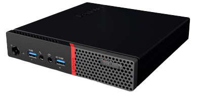{:height="80"} {:width="80"}  {:width="80"} 

- [Prérequis](#prérequis)
- [KVM - Lenovo ThinkCentre M700 Tiny](#kvm---lenovo-thinkcentre-m700-tiny)
    - [KVM supporté par le CPU ?](#kvm-supporté-par-le-cpu-)
    - [Installer QEMU/KVM sur serveur Lenovo](#installer-qemukvm-sur-serveur-lenovo)
- [Création machine virtuelle debianbulls](#création-machine-virtuelle-debianbulls)
    - [Connexion SSH (avec clés) entre la machine ThinkCentre M700 Tiny et la vm  debianbulls](#connexion-ssh-avec-clés-entre-la-machine-thinkcentre-m700-tiny-et-la-vm-debianbulls)
    - [Zone DNS OVH - domaine rnmkcy.eu](#zone-dns-ovh---domaine-rnmkcyeu)
    - [Certificats Let's Encrypt](#certificats-lets-encrypt)
    - [Nginx compilation](#nginx-compilation)
    - [Diffie-Hellmann FACULTATIF](#diffie-hellmann-facultatif)
    - [Parefeu UFW](#parefeu-ufw)
    - [Partage de dossiers/fichiers entre le l'hôte et la vm](#partage-de-dossiersfichiers-entre-le-lhôte-et-la-vm)
    - [Nvm Node Yarn](#nvm-node-yarn)
- [PC1 Archlinux](#pc1-archlinux)
    - [Connexion ssh entre "PC1 Archlinux" et vm "debianbulls"  via bastion Lenovo ThinkCentre](#connexion-ssh-entre-pc1-archlinux-et-vm-debianbulls-via-bastion-lenovo-thinkcentre)
    - [Virtual Manager - Gestion graphique des vm](#virtual-manager---gestion-graphique-des-vm)

## Prérequis

* <u>Poste linux</u> avec tous les utilitaires graphiques QEMU/KVM
    * Voir [Archlinux Installer KVM QEMU + VMM + Pont réseau](/posts/.*/)
* <u>Serveur Lenovo Yunohost ouestyan.xyz</u> sur lequel les vm vont être lancées
* <font color="red"><b>A MODIFIER SUIVANT VOTRE CONFIGURATION</b></font>
    * Adresses IP publiques et domaines 
        * IP Publique Box IPV4 : <font color="red"><b>78.235.245.102</b></font>  
        * IP Publique Box IPV6 : <font color="red"><b>2a01:e34:eebf:5663::</b></font>  
        * Serveur hôte : <font color="red"><b>ouestyan.xyz</b></font>   
        * Virtual Machine : <font color="red"><b>rnmkcy.eu</b></font>  

## KVM - Lenovo ThinkCentre M700 Tiny

### KVM supporté par le CPU ?

Exécutez la commande *egrep* suivante pour vérifier que **Intel VMX** ou **AMD SVM** est supporté sur votre CPU 

    egrep --color 'vmx|svm' /proc/cpuinfo

vmx (Intel) ou svm (Amd) doit apparaître d'une autre couleur dans le résultat 

### Installer QEMU/KVM sur serveur Lenovo

* [Serveur Lenovo Yunohost ouestyan.xyz - Installer QEMU KVM ](/posts/Yunohost-Serveur_debian_Lenovo_Thinkcentre_M700_Tiny_M2280-SSD500Go/#qemu-kvm) 
* [Installer QEMU/KVM via SSH sur un serveur Debian sans affichage](/posts/.*/)

Si vous exécutez KVM sur un serveur de console uniquement, vous avez toujours la possibilité d’utiliser le virt-manager graphique. Il vous suffit de spécifier la méthode de communication (ssh, tls, tcp, etc.).

Comment utiliser virt-manager à partir d’un bureau client Archlinux vers un serveur debian exécutant KVM et libvirtd, la connexion étant tunnellisée sur ssh et authentifiée avec PKI.

L’affichage VNC distant de ces machines virtuelles est envoyé via ce même tunnel ssh.

En utilisant la solution de tunneling ssh décrite dans cet article, le service libvirtd côté serveur n’a pas besoin d’activer l’écoute sur TCP dans « /etc/libvirt/libvirtd.conf ».

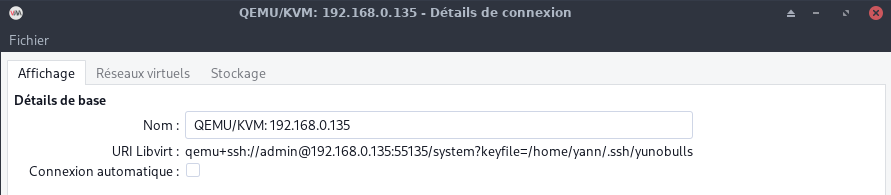

## Création machine virtuelle debianbulls

* [KVM debian bullseyes virtuel](/posts/Yunohost_Debian_Bullseye_image_de_nuage_Qcow2/#kvm-debian-bullseyes-virtuel)
* [Run Debian 11 (Bullseye) on KVM using Qcow2 Cloud Image](https://techviewleo.com/run-debian-11-bullseye-on-kvm-using-qcow2-cloud-image/)

Donner les droits admin au dossier /virtuel

    sudo chown admin:admin -R /virtuel

Résumé des commandes pour l'installation d'ume image debian bullseye cloud

```shell
# Télécharger l’image nocloud qcow2 
mkdir -p /virtuel/KVM/ && cd /virtuel/KVM/
wget https://cloud.debian.org/images/cloud/bullseye/latest/debian-11-nocloud-amd64.qcow2

# Création machine virtuelle Debian 11 (bullseyes) 
export VM_NAME="debianbulls"
qemu-img convert \
  -f qcow2 \
  -O qcow2 \
  /virtuel/KVM/debian-11-nocloud-amd64.qcow2 \
  /virtuel/KVM/$VM_NAME.qcow2

# Redimensionnons à la taille souhaitée pour le disque racine.
# 20 GB de disque
export VM_ROOT_DISK_SIZE=20G

# Resize Debian 11 VM disk
qemu-img resize \
  /virtuel/KVM/$VM_NAME.qcow2 \
  $VM_ROOT_DISK_SIZE

# 
sudo virt-install \
    --memory 2048 \
    --vcpus 1 \
    --name $VM_NAME \
    --disk /virtuel/KVM/$VM_NAME.qcow2,device=disk,bus=virtio,format=qcow2 \
    --os-type Linux \
    --os-variant debian10 \
    --network bridge=br0,model=virtio \
    --virt-type kvm \
    --graphics none \
    --import

```

A la fin de l’installation, on arrive sur le login (en mode console) : “root” sans mot de passe  
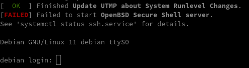

Par défaut openssh ne fonctionne pas (`[FAILED] Failed to start OpenBSD Secure Shell server.`)  
Il faut regénérer les clés

    dpkg-reconfigure openssh-server

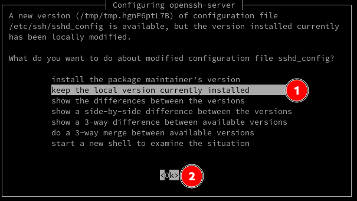{:width="400"}

Réseau  
On utilise le même "NextHop" que la machine hôte lenovo  
L'adresse IPV4 sera fixée à `192.168.0.136`  
L'adresse IPV6 sera fixée à `2a01:e34:eebf:5663::2`

    nano /etc/network/interfaces.d/staticv4v6

```
# The primary network interface
allow-hotplug enp1s0
#iface enp1s0 inet dhcp
iface enp1s0 inet static
 address 192.168.0.136
 netmask 255.255.255.0
 gateway 192.168.0.254
# This is an autoconfigured IPv6 interface
#iface enp1s0 inet6 auto
iface enp1s0 inet6 static
 address 2a01:e34:eebf:5663::2
 netmask 64
 post-up ip -6 route add default via fe80::8e97:eaff:fe39:66d6 dev enp1s0
```

Pour éviter l’erreur `ICMPv6: RA: ndisc_router_discovery failed to add default route`  
Activer le port forwarding ipv6  `net.ipv6.conf.all.forwarding=1` et désactiver l’annonce des routes (accept_ra) en ajoutant `net.ipv6.conf.all.accept_ra=0` dans le fichier `/etc/sysctl.conf`

Mise à jour  

    apt update && apt upgrade

Redémarrer la machine virtuelle

    systemctl reboot

Vérifier le réseau

    ip a

```
1: lo: <LOOPBACK,UP,LOWER_UP> mtu 65536 qdisc noqueue state UNKNOWN group default qlen 1000
    link/loopback 00:00:00:00:00:00 brd 00:00:00:00:00:00
    inet 127.0.0.1/8 scope host lo
       valid_lft forever preferred_lft forever
    inet6 ::1/128 scope host 
       valid_lft forever preferred_lft forever
2: enp1s0: <BROADCAST,MULTICAST,UP,LOWER_UP> mtu 1500 qdisc pfifo_fast state UP group default qlen 1000
    link/ether 52:54:00:bb:92:b5 brd ff:ff:ff:ff:ff:ff
    inet 192.168.0.136/24 brd 192.168.0.255 scope global enp1s0
       valid_lft forever preferred_lft forever
    inet6 2a01:e34:eebf:5663::2/64 scope global 
       valid_lft forever preferred_lft forever
    inet6 fe80::5054:ff:febb:92b5/64 scope link 
       valid_lft forever preferred_lft forever
```

Créer un utilisateur

    adduser yannbulls

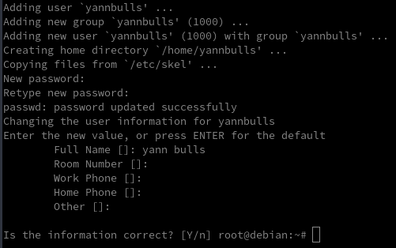

Vérifiez l'identité de l'utilisateur et le groupe. L'utilisateur n'est pas dans le groupe privilégié sudo.

    id yannbulls

uid=1000(yannbulls) gid=1000(yannbulls) groups=1000(yannbulls)

Ajoutez l'utilisateur créé au groupe sudo pour les privilèges.

    usermod -aG sudo yannbulls
    id yannbulls

uid=1000(yannbulls) gid=1000(yannbulls) groups=1000(yannbulls),27(sudo)

Définissez le nom d'hôte de votre machine virtuelle

    hostnamectl set-hostname rnmkcy.eu

Vérifier  
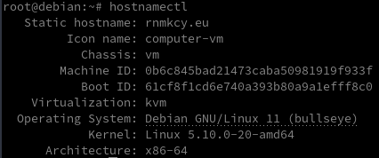

Définir un mot de passe root  
Donner les droits à yannbulls

    echo "yannbulls     ALL=(ALL) NOPASSWD: ALL" >> /etc/sudoers

Installer les utilitaires *curl jq figlet tmux, etc...*  

    sudo apt install curl jq figlet tmux tree neofetch net-tools dnsutils   # outils supplémentaires

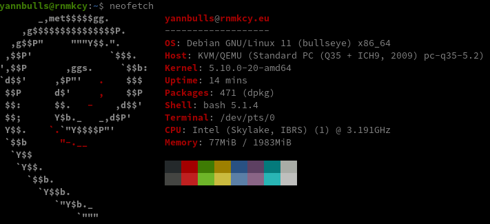

Une bannière de connexion `/etc/motd`

```
 __   __ __  __      _       _     _              _           _  _                               
 \ \ / /|  \/  |  __| | ___ | |__ (_) __ _  _ _  | |__  _  _ | || | ___                          
  \ V / | |\/| | / _` |/ -_)| '_ \| |/ _` || ' \ | '_ \| || || || |(_-<                          
   \_/  |_|  |_| \__,_|\___||_.__/|_|\__,_||_||_||_.__/ \_,_||_||_|/__/                          
  _  ___  ___     _   __  ___     __     _  ____  __                                             
 / |/ _ \|_  )   / | / / ( _ )   /  \   / ||__ / / /                                             
 | |\_, / / /  _ | |/ _ \/ _ \ _| () |_ | | |_ \/ _ \                                            
 |_| /_/ /___|(_)|_|\___/\___/(_)\__/(_)|_||___/\___/                                            
  ___         __   _  _       ____ _ _  _            _      __  _  ___   __   __  ____ _  _  ___ 
 |_  ) __ _  /  \ / |(_) ___ |__ /| | |(_) ___  ___ | |__  / _|(_)| __| / /  / / |__ /(_)(_)|_  )
  / / / _` || () || | _ / -_) |_ \|_  _|_ / -_)/ -_)| '_ \|  _| _ |__ \/ _ \/ _ \ |_ \ _  _  / / 
 /___|\__,_| \__/ |_|(_)\___||___/  |_|(_)\___|\___||_.__/|_|  (_)|___/\___/\___/|___/(_)(_)/___|
```

**Synthèse**

Le réseau bridge démarre automatiquement au boot de la machine ThinkCentre M700 Tiny  
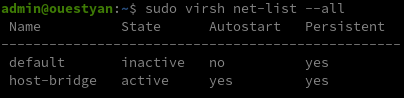

La machine virtuelle debianbulls est en démarrage auto ,puis lancée 
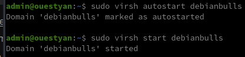

### Connexion SSH (avec clés) entre la machine ThinkCentre M700 Tiny et la vm  debianbulls  

{:height="50px"} 

<u>**Lenovo ThinkCentre M700 Tiny**</u>  
Générer une paire de clé curve25519-sha256 (ECDH avec Curve25519 et SHA2) nommé **vm-debianbulls** pour une liaison SSH avec le serveur KVM.  

    ssh-keygen -t ed25519 -o -a 100 -f ~/.ssh/vm-debianbulls   

Envoyer la clé publique sur la VM   

    ssh-copy-id -i ~/.ssh/vm-debianbulls.pub yannbulls@192.168.0.136

<u>**VM debianbulls**</u>  
On se connecte  

	ssh yannbulls@192.168.0.136

Modifier la configuration serveur SSH  

	sudo nano /etc/ssh/sshd_config

Modifier les champs suivants

```
Port = 55136  
PasswordAuthentication no
```

Relancer openSSH  

    sudo systemctl restart sshd

<u>**Lenovo ThinkCentre M700 Tiny**</u>  
Accès depuis Lenovo ThinkCentre M700 Tiny (192.168.0.135) avec la clé privée  

    ssh -p 55136 -i ~/.ssh/vm-debianbulls yannbulls@192.168.0.136

### Zone DNS OVH - domaine rnmkcy.eu 

{:height="50"}  
*Zone DNS accessible UNIQUEMENT en IPV6*  


```dns
$TTL 3600
@	IN SOA dns110.ovh.net. tech.ovh.net. (2022010102 86400 3600 3600000 300)
         IN NS     dns110.ovh.net.
         IN NS     ns110.ovh.net.
         IN AAAA   2a01:e34:eebf:5663::2
         IN CAA    128 issue "letsencrypt.org"
*        IN AAAA   2a01:e34:eebf:5663::2
```

### Certificats Let's Encrypt

{:width="80"}

Installation gestionnaire des certificats Let's Encrypt

```bash
cd ~
sudo apt install socat git
git clone https://github.com/acmesh-official/acme.sh.git
cd acme.sh
./acme.sh --install 
```

Se déconnecter puis se reconnecter utilisateur  

Les clés OVH API   

    export OVH_AK="xxxxxxxxxxxxxxxxxx"
    export OVH_AS="yyyyyyyyyyyyyyyyyyyyyyyyyyyy"

Génération des certificats  

    acme.sh --dns dns_ovh --server letsencrypt --issue --keylength ec-384 -d 'rnmkcy.eu' -d '*.rnmkcy.eu'

Résultat de l'installation

```
[Tue Jan 10 09:04:53 UTC 2023] Your cert is in: /home/yannbulls/.acme.sh/rnmkcy.eu_ecc/rnmkcy.eu.cer
[Tue Jan 10 09:04:53 UTC 2023] Your cert key is in: /home/yannbulls/.acme.sh/rnmkcy.eu_ecc/rnmkcy.eu.key
[Tue Jan 10 09:04:53 UTC 2023] The intermediate CA cert is in: /home/yannbulls/.acme.sh/rnmkcy.eu_ecc/ca.cer
[Tue Jan 10 09:04:53 UTC 2023] And the full chain certs is there: /home/yannbulls/.acme.sh/rnmkcy.eu_ecc/fullchain.cer
```

Installation des certificats

```
sudo mkdir -p /etc/ssl/private/
sudo chown $USER -R /etc/ssl/private/
acme.sh --ecc --install-cert -d 'rnmkcy.eu' -d '*.rnmkcy.eu' --key-file /etc/ssl/private/rnmkcy.eu-key.pem --fullchain-file /etc/ssl/private/rnmkcy.eu-fullchain.pem  --reloadcmd 'sudo systemctl reload nginx.service'
```

Résultat

```
[Tue Jan 10 09:06:02 UTC 2023] Installing key to: /etc/ssl/private/rnmkcy.eu-key.pem
[Tue Jan 10 09:06:02 UTC 2023] Installing full chain to: /etc/ssl/private/rnmkcy.eu-fullchain.pem
```

Supprimer ` --reloadcmd 'sudo systemctl reload nginx.service'` à la ligne précédente si Nginx n'est pas installé
{: .prompt-warning }

**Renouvellement automatique des certificats**

La machine virtuelle debianbulls est hébergée par yunohost lenovo qui n'est pas en service 24h/24h.  
On ne va pas utiliser le gestionnaire de tâches cron mais un service systemd utilisateur
{: .prompt-warning }

**systemd utilisateur**  

En cours ...

**cron**  
Editer le crontab, supprimer la ligne existante et ajouter ce qui suit

    crontab -e

```bash
10 0 * * * "/home/yannbulls/.acme.sh"/acme.sh --cron --home "/home/yannbulls/.acme.sh" --renew-hook "/home/yannbulls/.acme.sh/acme.sh --ecc --install-cert -d 'rnmkcy.eu' -d '*.rnmkcy.eu' --key-file /etc/ssl/private/rnmkcy.eu-key.pem --fullchain-file /etc/ssl/private/rnmkcy.eu-fullchain.pem  --reloadcmd 'sudo systemctl reload nginx.service'" > /dev/null
```

### Nginx compilation

{:height="50"}  

Utilisateur avec droits sudo  

Télécharger le bash

```
wget https://static.xoyaz.xyz/files/compilation-nginx-tls1.3.sh
chmod +x compilation-nginx-tls1.3.sh # rendre le bash exécutable
./compilation-nginx-tls1.3.sh        # exécution
```

A la fin de la compilation

```
Versions Nginx OpenSSL
nginx version: nginx/1.22.1
OpenSSL 1.1.1n  15 Mar 2022
```

Page accueil/ https  
[SSL Configuration Generator](https://ssl-config.mozilla.org/#server=nginx&version=1.22.1&config=modern&openssl=1.1.1n&guideline=5.6)  
nginx 1.22.1, modern config, OpenSSL 1.1.1n  

On supprime le fichier par défaut

    rm /etc/nginx/conf.d/default.conf

Création du dossier et fichier de configuration nginx

    mkdir -p /etc/nginx/conf.d/rnmkcy.eu.d
    nano /etc/nginx/conf.d/rnmkcy.eu.conf

```
# generated 2023-01-10, Mozilla Guideline v5.6, nginx 1.22.1, OpenSSL 1.1.1n, modern configuration
# https://ssl-config.mozilla.org/#server=nginx&version=1.22.1&config=modern&openssl=1.1.1n&guideline=5.6
server {
    listen 80;
    listen [::]:80;
    server_name rnmkcy.eu;
    location / {
        return 301 https://$host$request_uri;
    }
}

server {
    listen 443 ssl http2;
    listen [::]:443 ssl http2;
    server_name rnmkcy.eu;
    root /var/www/default-www/ ;
	location / {
	    index index.htm index/;
	}

    ssl_certificate /etc/ssl/private/rnmkcy.eu-fullchain.pem;
    ssl_certificate_key /etc/ssl/private/rnmkcy.eu-key.pem;
    ssl_session_timeout 1d;
    ssl_session_cache shared:MozSSL:10m;  # about 40000 sessions
    ssl_session_tickets off;

    # modern configuration
    ssl_protocols TLSv1.3;
    ssl_prefer_server_ciphers off;

    # HSTS (ngx_http_headers_module is required) (63072000 seconds)
    add_header Strict-Transport-Security "max-age=63072000" always;

    # OCSP stapling
    ssl_stapling on;
    ssl_stapling_verify on;

    # verify chain of trust of OCSP response using Root CA and Intermediate certs
    ssl_trusted_certificate /etc/ssl/private/rnmkcy.eu-fullchain.pem;

    # replace with the IP address of your resolver
    resolver 1.1.1.1;

    include /etc/nginx/conf.d/rnmkcy.eu.d/*.conf;
}
```

Vérification et rechargement nginx

    nginx -t
    systemctl reload nginx

Lien https://rnmkcy.eu

### Diffie-Hellmann FACULTATIF 

{:width="60"}  
Générer Diffie-Hellman 

    sudo openssl dhparam -out /etc/ssl/private/dh2048.pem -outform PEM -2 2048

Modifier le fichier de configuration **/etc/nginx/conf.d/rnmkcy.eu.conf**  
Ajouter la ligne :  
`ssl_dhparam /etc/ssl/private/dh2048.pem;` 

### Parefeu UFW

{:width="50"} 

*UFW, ou pare - feu simple , est une interface pour gérer les règles de pare-feu dans Arch Linux, Debian ou Ubuntu. UFW est utilisé via la ligne de commande (bien qu'il dispose d'interfaces graphiques disponibles), et vise à rendre la configuration du pare-feu facile.*

Installation **Debian / Ubuntu**

    sudo apt install ufw

*Par défaut, les jeux de règles d'UFW sont vides, de sorte qu'il n'applique aucune règle de pare-feu, même lorsque le démon est en cours d'exécution.*   

Les règles 

```bash
sudo ufw allow 55136/tcp  # port SSH
sudo ufw allow https      # port 443
```

Activer le parefeu

    sudo ufw enable

```
Command may disrupt existing ssh connections. Proceed with operation (y|n)? y
Firewall is active and enabled on system startup
```

Status

     sudo ufw status verbose

```
Status: active
Logging: on (low)
Default: deny (incoming), allow (outgoing), deny (routed)
New profiles: skip

To                         Action      From
--                         ------      ----
55136/tcp                  ALLOW IN    Anywhere                  
443                        ALLOW IN    Anywhere                  
55136/tcp (v6)             ALLOW IN    Anywhere (v6)             
443 (v6)                   ALLOW IN    Anywhere (v6)             
```

### Partage de dossiers/fichiers entre le l'hôte et la vm

[QEMU/KVM + virtio-fs - Partager un répertoire hôte avec une machine virtuelle](/posts/.*/)

### Nvm Node Yarn

[Archlinux Debian , installation des paquets node npm nvm yarn](/posts/Archlinux-Debian-Node.js-Nvm-Npm-Yarn/)

**Nvm**

    curl -o- https://raw.githubusercontent.com/nvm-sh/nvm/v0.39.3/install.sh | bash

**Node LTS**

```shell
nvm ls-remote --lts  # liste des versions LTS
nvm install --lts # Installe la dernière version node LTS
```

**Yarn**  
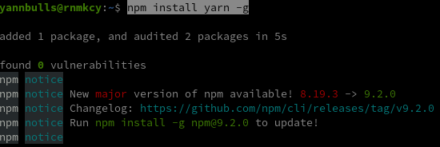

Mise à jour npm

    npm install -g npm@9.2.0

Les versions  
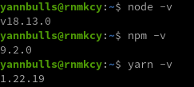

## PC1 Archlinux 

### Connexion ssh entre "PC1 Archlinux" et vm "debianbulls"  via bastion Lenovo ThinkCentre 

[Effectuer plusieurs sauts SSH avec la configuration SSH et un hôte de saut-Lien HS](/files//Perform multiple SSH hops with SSH config and a jump host/)

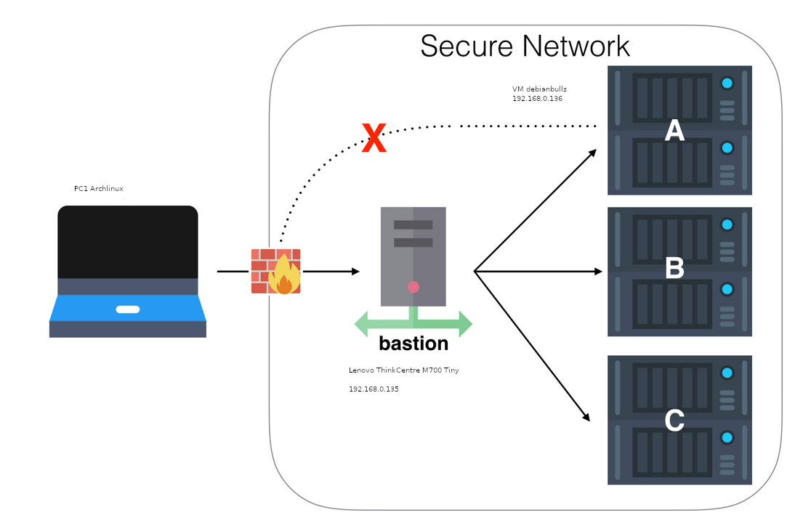   
**Poste PC1 Archlinux --> Bastion Lenovo ThinkCentre 192.168.0.135 --> VM debianbulls 192.168.0.136**

**Poste client PC1 Archlinux**  
Il faut copier la clé privée d'accès au VM de la machine Lenovo ThinkCentre (~/.ssh/vm-debianbulls) dans le dossier **~/.ssh/** du poste PC1 Archlinux avec un autre nom ( vm-proxy-lenovo)

    cat >> ~/.ssh/vm-proxy-lenovo

Copier/coller le contenu du fichier du fichier de clé privée (fichier ~/.ssh/vm-debianbulls de la machine ouestyan.xyz ) dans ce terminal, et presser [Ctrl]+[D] pour valider.

La connexion du poste client **PC1 Archlinux** vers la ** VM debianbulls** se fera via le **proxy bastion Lenovo ThinkCentre ouestyan.xyz**  

```
----------------          ------------------           -------------------
| Poste client |          | Proxy SSH      |           | Destinataire    |
| PC1 Archlinux|<-------->| ouestyan.xyz   |<--------->| vm debianbulls  |
|              |          |                |           | 192.168.0.136   |
----------------          ------------------           -------------------
```

Syntaxe

    ssh -o ProxyCommand="ssh -W %h:%p userprox@proxy.tld"  userdest@destinataire.tld

La commande complète avec les clés

    ssh -o ProxyCommand=ssh -W %h:%p -p 55135 -i /home/yann/.ssh/yunobulls admin@ouestyan.xyz -p 55136 -i /home/yann/.ssh/vm-proxy-lenovo yannbulls@192.168.0.136

### Virtual Manager - Gestion graphique des vm 

On peut utiliser la version graphique virt-manager de PC1 Archlinux pour se connecter via SSH sur la machine Lenovo et visualiser les machines virtuelles.

Gestionnaire de machines virtuelles &rarr; Fichier &rarr; Ajouter une connexion

    virt-manager -c 'qemu+ssh://admin@192.168.0.135:55135/system?keyfile=/home/yann/.ssh/yunobulls'

Détails de la connexion
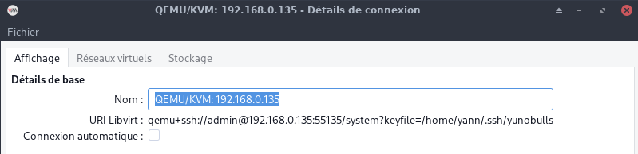  
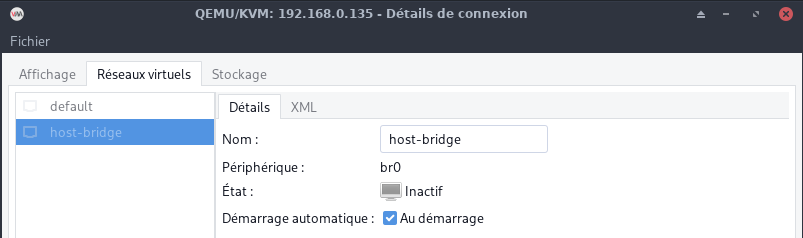  
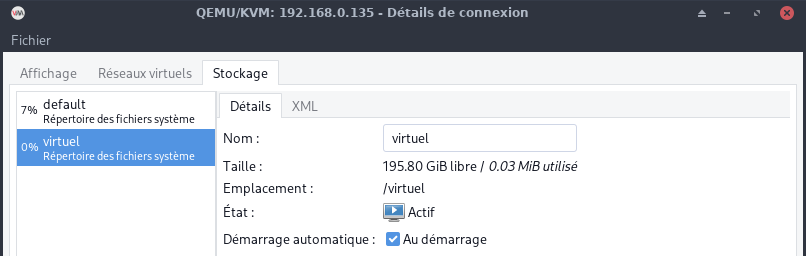  

Les machines virtuelles  
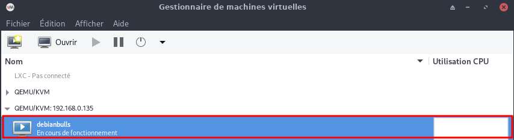  
