+++
title = 'Yunohost ouestyan.xyz - Lenovo Thinkcentre M700 Tiny SSD M.2 500Go + HDD Mobile 1.7To'
date = 2023-02-06 00:00:00 +0100
categories = yunohost
+++
[Description matériel Lenovo ThinkCentre M700 Tiny et mise à jour BIOS](/posts/Description_materiel_Lenovo_ThinkCentre_M700_Tiny_et_mise_a_jour_BIOS/)


## Debian 11 bullseye

{:height="100"} 

### Installation via clé USB

Installer avec clé USB contenant image ISO **firmware-11.2.0-amd64-netinst.iso** (pour les pilotes carte wifi/bluetooth), appui sur F12 et choisir "Expert graphical install"  
Choix : USB KEY &rarr; UEFI et "Graphical install" 

Language : French, France, Français  

Machine : think  
root : root49600  
leno : leno49600  

Assisté - utiliser tout un disque avec LVM  
Choix : Disque SSD 500Go M.2 sdb WDC  
Partition / 50G  
Partition /home séparée 150G  
Forcer UEFI : non  
Miroir France deb.debian.org  

Sélection des logiciels

* Serveur SSH
* Utilitaires usuels du système

La machine reboot à la fin de l'installation  
Se connecter avec l'utilisateur "leno"  
Relever l'adresse ip : `ip a` , exemple 192.168.0.11

On peut ensuite se connecter via ssh : `ssh leno@192.168.0.11` et passer en root par `su`

Il faut modifier ssh pour se connecter en root

```shell
echo "PermitRootLogin yes" >> /etc/ssh/sshd_config
```

### Box IPV6 et DMZ

Pour le nexthop IPV6 FreeBox

    ip a |grep "inet6 fe80"

*inet6 fe80::223:24ff:fec9:686/64 scope link*

Paramètres de la Freebox, Configuration IPV6 &rarr; Délégation de préfixe  
Préfixe : 2a01:e34:eebf:5663::/64  
Next Hop : fe80::223:24ff:fec9:686  

L'accès local sur ip 192.168.0.135  
Modifier l'accès DMZ de la box (FreeBox)  
Freebox : Paramètres avancés &rarr; Gestion des ports &rarr; DMZ  IP DMZ : 192.168.0.135  
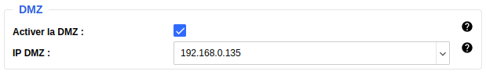  

Reverse DNS freebox ([Freebox Espace Abonné](https://subscribe.free.fr/login/)) : **ouestyan.xyz**  

### Debian Ip V4 V6 statiques

Passage en ip statique 192.168.0.135 et 2a01:e34:eebf:5663::1 (nexthop `fe80::5054:ff:fe37:2d1b`) 

    nano /etc/network/interfaces

```
# The primary network interface
allow-hotplug eno1
#iface eno1 inet dhcp
iface eno1 inet static
 address 192.168.0.135
 netmask 255.255.255.0
 gateway 192.168.0.254
# This is an autoconfigured IPv6 interface
#iface eno1 inet6 auto
iface eno1 inet6 static
 address 2a01:e34:eebf:5663::1
 netmask 64
 post-up ip -6 route add default via fe80::8e97:eaff:fe39:66d6 dev eno1

```

Pour éviter l'erreur `ICMPv6: RA: ndisc_router_discovery failed to add default route`  
Correction, désactiver l’annonce des routes ([accept_ra](https://sysctl-explorer.net/net/ipv6/accept_ra/)) :

    nano /etc/sysctl.conf

```
# Uncomment the next line to enable packet forwarding for IPv6
#  Enabling this option disables Stateless Address Autoconfiguration
#  based on Router Advertisements for this host
net.ipv6.conf.all.forwarding=1

# Accept Router Advertisements
net.ipv6.conf.all.accept_ra=0

```

Activer `net.ipv6.conf.all.forwarding=1` et ajouter `net.ipv6.conf.all.accept_ra=0`   
Puis `sysctl -p` pour une validation immédiate  

reboot : `systemctl reboot`  

Se reconnecter SSH avec la nouvelle IP en root  

    ssh root@192.168.0.135

Vérifier Adressage IP statique

    ip a

```
1: lo: <LOOPBACK,UP,LOWER_UP> mtu 65536 qdisc noqueue state UNKNOWN group default qlen 1000
    link/loopback 00:00:00:00:00:00 brd 00:00:00:00:00:00
    inet 127.0.0.1/8 scope host lo
       valid_lft forever preferred_lft forever
    inet6 ::1/128 scope host 
       valid_lft forever preferred_lft forever
2: eno1: <BROADCAST,MULTICAST,UP,LOWER_UP> mtu 1500 qdisc pfifo_fast state UP group default qlen 1000
    link/ether 00:23:24:c9:06:86 brd ff:ff:ff:ff:ff:ff
    altname enp0s31f6
    inet 192.168.0.135/24 brd 192.168.0.255 scope global eno1
       valid_lft forever preferred_lft forever
    inet6 2a01:e34:eebf:5663::1/64 scope global 
       valid_lft forever preferred_lft forever
    inet6 fe80::223:24ff:fec9:686/64 scope link 
       valid_lft forever preferred_lft forever
```


## Yunohost


Prérequis, sudo et curl

```shell
apt install sudo curl
```

### Script d'installation

Ouvrez la ligne de commande sur votre serveur (soit directement, soit avec SSH)  
Assurez-vous d'être connecté en tant que root   
Lancez la commande suivante :

    curl https://install.yunohost.org | bash

Patienter ...

```
              ┌─────────────────────────┤ Yunohost Installation ├──────────────────────────┐
              │                                                                            │
              │                                                                            │
              │ Caution !                                                                  │
              │                                                                            │
              │ Your configuration files for :                                             │
              │   - postfix                                                                │
              │   - dovecot                                                                │
              │   - mysql                                                                  │
              │   - nginx                                                                  │
              │   - metronome                                                              │
              │ will be overwritten !                                                      │
              │                                                                            │
              │ Are you sure you want  to proceed with the installation of Yunohost?       │
              │                                                                            │
              │                                                                            │
              │                                                                            │
              │                     <Oui>                        <Non>                     │
              │                                                                            │
              └────────────────────────────────────────────────────────────────────────────┘
Choix Oui

              ┌───────────────────────────┤ SSH Configuration ├────────────────────────────┐
              │                                                                            │
              │ To improve the security of your server, it is recommended to let YunoHost  │
              │ manage the SSH configuration.                                              │
              │ Your current SSH configuration differs from the recommended configuration. │
              │ If you let YunoHost reconfigure it, the way you connect to your server     │
              │ through SSH will change in the following way:                              │
              │ - you will not be able to connect as root through SSH. Instead you should  │
              │ use the admin user ;                                                       │
              │                                                                            │
              │ Do you agree to let YunoHost apply those changes to your configuration and │
              │ therefore affect the way you connect through SSH ?                         │
              │                                                                            │
              │                                                                            │
              │                                                                            │
              │                                                                            │
              │                                                                            │
              │                     <Oui>                        <Non>                     │
              │                                                                            │
              └────────────────────────────────────────────────────────────────────────────┘
Choix Oui

===============================================================================
You should now proceed with Yunohost post-installation. This is where you will
be asked for :
  - the main domain of your server ;
  - the administration password.

You can perform this step :
  - from the command line, by running 'yunohost tools postinstall' as root
  - or from your web browser, by accessing : 
    - https://192.168.0.135/ (local IP, if self-hosting at home)
    - https://78.235.245.102/ (global IP, if you're on a VPS)

If this is your first time with YunoHost, it is strongly recommended to take
time to read the administator documentation and in particular the sections
'Finalizing your setup' and 'Getting to know YunoHost'. It is available at
the following URL : https://yunohost.org/admindoc
===============================================================================
```

### Post-installation

domaine principal :  ouestyan.xyz  
admin mot de passe  

    yunohost tools postinstall

A la fin de l'installation  

```
Attention : La post-installation est terminée ! Pour finaliser votre configuration, il est recommandé de :
- ajouter un premier utilisateur depuis la section "Utilisateurs" de l'interface web (ou 'yunohost user create <nom d'utilisateur>' en ligne de commande) ;
- diagnostiquer les potentiels problèmes dans la section "Diagnostic" de l'interface web (ou 'yunohost diagnosis run' en ligne de commande) ;
- lire les parties 'Finalisation de votre configuration' et 'Découverte de YunoHost' dans le guide de l'administrateur : https://yunohost.org/admindoc.
```

### Utilisateur

Création utilisateur

    yunohost user create yunoyan

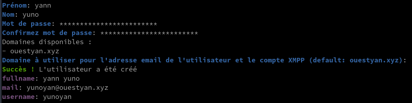

### DNS ouestyan.xyz

{:width="50"} 

Domaine ouestyan.xyz **IPV6 ONLY**

    yunohost domain dns-conf ouestyan.xyz

```
Attention : 'yunohost domain dns-conf' est déprécié et sera bientôt supprimé
Attention : 'yunohost domain dns-conf' est déprécié et sera bientôt supprimé
Info : Cette commande vous montre la configuration *recommandée*. Elle ne configure pas le DNS pour vous. Il est de votre ressort de configurer votre zone DNS chez votre registrar/fournisseur conformément à cette recommandation.
; Basic ipv4/ipv6 records
@ 3600 IN A 78.235.245.102
@ 3600 IN AAAA 2a01:e34:eebf:5663::1

; Mail
@ 3600 IN MX 10 ouestyan.xyz.
@ 3600 IN TXT "v=spf1 a mx -all"
mail._domainkey 3600 IN TXT "v=DKIM1; h=sha256; k=rsa; p=MIGfMA0GCSqGSIb3DQEBAQUAA4GNADCBiQKBgQDAWlnp+DpYbYZFGezQVAkEVh/ouP08v+9t4UFtGN/Le/3vPkiwIJYBcz4uuXrbM0qDWilNd7FMYQeRnWfIm0VQghYaIGdDC4dqFvHM1SfbRlTkmRUc18ywBW6nQoILzIfxLyihha5xcmlAlxHIsU/FuJi/BO3FT+mm0xACP9YVSQIDAQAB"
_dmarc 3600 IN TXT "v=DMARC1; p=none"


; XMPP
_xmpp-client._tcp 3600 IN SRV 0 5 5222 ouestyan.xyz.
_xmpp-server._tcp 3600 IN SRV 0 5 5269 ouestyan.xyz.
muc 3600 IN CNAME ouestyan.xyz.
pubsub 3600 IN CNAME ouestyan.xyz.
vjud 3600 IN CNAME ouestyan.xyz.
xmpp-upload 3600 IN CNAME ouestyan.xyz.

; Extra
* 3600 IN A 78.235.245.102
* 3600 IN AAAA 2a01:e34:eebf:5663::1
@ 3600 IN CAA 128 issue "letsencrypt.org"
```

Copier le texte ci dessus

Se connecter sur OVH dans le domaine ouestyan.xyz  


Coller le texte après la 4 ième ligne

```
$TTL 3600
@	IN SOA dns106.ovh.net. tech.ovh.net. (2022060600 86400 3600 3600000 60)
                         IN NS     dns106.ovh.net.
                         IN NS     ns106.ovh.net.
< Coller le texte ICI>
```

Cliquer sur suivant  


La configuration DNS OVH

```
$TTL 3600
@	IN SOA dns106.ovh.net. tech.ovh.net. (2022120900 86400 3600 3600000 60)
                         IN NS     dns106.ovh.net.
                         IN NS     ns106.ovh.net.
                         IN MX     10 ouestyan.xyz.
                         IN A      78.235.245.102
                         IN AAAA   2a01:e34:eebf:5663::1
                         IN CAA    128 issue "letsencrypt.org"
                         IN TXT    "v=spf1 a mx -all"
*                        IN A      78.235.245.102
*                        IN AAAA   2a01:e34:eebf:5663::1
_dmarc                   IN TXT    "v=DMARC1; p=none"
_xmpp-client._tcp        IN SRV    0 5 5222 ouestyan.xyz.
_xmpp-server._tcp        IN SRV    0 5 5269 ouestyan.xyz.
mail._domainkey          IN TXT    ( "v=DKIM1;h=sha256;k=rsa;p=MIGfMA0GCSqGSIb3DQEBAQUAA4GNADCBiQKBgQDAWlnp+DpYbYZFGezQVAkEVh/ouP08v+9t4UFtGN/Le/3vPkiwIJYBcz4uuXrbM0qDWilNd7FMYQeRnWfIm0VQghYaIGdDC4dqFvHM1SfbRlTkmRUc18ywBW6nQoILzIfxLyihha5xcmlAlxHIsU/FuJi/BO3FT+mm0xACP9YVSQIDAQAB;" )
muc                      IN CNAME  ouestyan.xyz.
pubsub                   IN CNAME  ouestyan.xyz.
vjud                     IN CNAME  ouestyan.xyz.
xmpp-upload              IN CNAME  ouestyan.xyz.
```

### Certificats SSL Let's Encrypt

  
On active les certificats SSL pour le domaine

    yunohost domain cert-install ouestyan.xyz --no-checks

Vérifier validité

    yunohost domain cert status

```
certificates: 
  ouestyan.xyz: 
    CA_type: Let's Encrypt
    summary: Great!
    validity: 89
```

Renouvellement manuel

    yunohost domain cert renew

### Diagnostic et corrections

Lancer un diagnostic en mode su

    yunohost diagnosis run

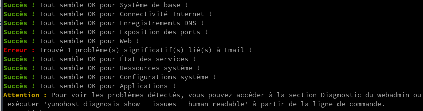

    yunohost diagnosis show --issues --human-readable

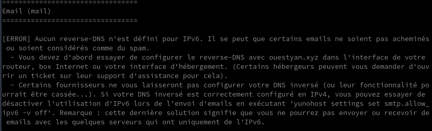

Free n'autorise pas le DNS inversé IPV6.  avec la commande suivante  
On désactive avec la commande suivante

    yunohost settings set smtp.allow_ipv6 -v off


`Redémarrer la machine`{: .prompt-info }

Il subsiste des erreurs liées à la désactivation smtp ipv6  

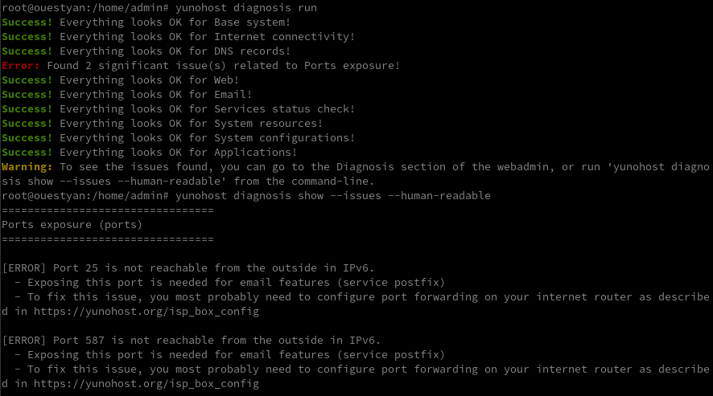

Pour ignorer les erreurs, ouvrir yunohost web en admin &rarr; Diagnostic

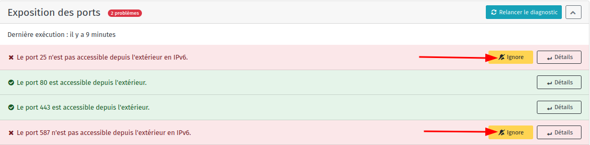  
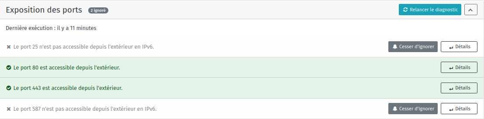

### OpenSSH avec clé

{height="70"}  
<u>sur l'ordinateur de bureau</u>
Générer une paire de clé curve25519-sha256 (ECDH avec Curve25519 et SHA2) nommé **yunokvm** pour une liaison SSH avec le serveur KVM.  

    ssh-keygen -t ed25519 -o -a 100 -f ~/.ssh/yunobulls

Envoyer les clés publiques sur le serveur KVM   

    ssh-copy-id -i ~/.ssh/yunobulls.pub yunoyan@192.168.0.135

<u>sur le serveur Yunohost</u>
On se connecte  

    ssh yunoyan@192.168.0.135

Sur votre serveur, la modification du fichier de configuration SSH pour désactiver l'authentification par mot de passe est gérée par un paramètre système 

    sudo yunohost settings set security.ssh.password_authentication -v no

Modifier le port SSH

*Pour empêcher les tentatives de connexion SSH par des robots qui analysent Internet à la recherche de tout serveur sur lequel SSH est activé, vous pouvez modifier le port SSH. Ceci est géré par un paramètre système, qui prend en charge la mise à jour de la configuration SSH et Fail2Ban.*

    sudo yunohost settings set security.ssh.port -v 55135

Accès depuis le poste distant avec la clé privée  

    ssh -p 55135 -i ~/.ssh/yunobulls yunoyan@192.168.0.135

Modifier motd

    sudo nano /etc/motd

```
                              _              _                
       _  _  _  _  _ _   ___ | |_   ___  ___| |_              
      | || || || || ' \ / _ \| ' \ / _ \(_-<|  _|             
       \_, | \_,_||_||_|\___/|_||_|\___//__/ \__|             
  ___  |__/  ___  ___| |_  _  _  __ _  _ _     __ __ _  _  ___
 / _ \| || |/ -_)(_-<|  _|| || |/ _` || ' \  _ \ \ /| || ||_ /
 \___/ \_,_|\___|/__/ \__| \_, |\__,_||_||_|(_)/_\_\ \_, |/__|
      _  ___  ___     _   _|__/__     __     _  ____ |__/     
     / |/ _ \|_  )   / | / / ( _ )   /  \   / ||__ /| __|     
     | |\_, / / /  _ | |/ _ \/ _ \ _| () |_ | | |_ \|__ \     
     |_| /_/ /___|(_)|_|\___/\___/(_)\__/(_)|_||___/|___/     
```

Installer des applications supplémentaires

    sudo apt install tmux figlet nmap net-tools

**Script ssh_rc_bash**

```shell
wget https://static.xoyaz.xyz/files/ssh_rc_bash
chmod +x ssh_rc_bash # rendre le bash exécutable
./ssh_rc_bash        # exécution
```
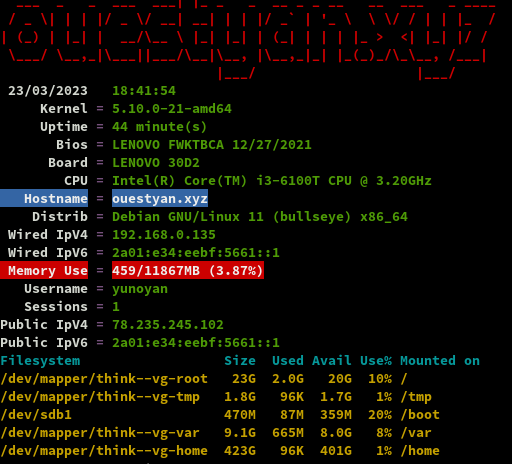

### Mises à jour automatique

*Unattended_upgrades est un outil qui permet de télécharger et installer les mises à jour de sécurité automatiquement et sans surveillance, en prenant soin de n'installer que les paquets provenant de la source APT configurée, et en vérifiant les invites dpkg concernant les modifications du fichier de configuration. Apticron est un simple script qui envoie des courriels sur les mises à jour de paquets en attente comme les mises à jour de sécurité, en gérant correctement les paquets en attente.*

Installation

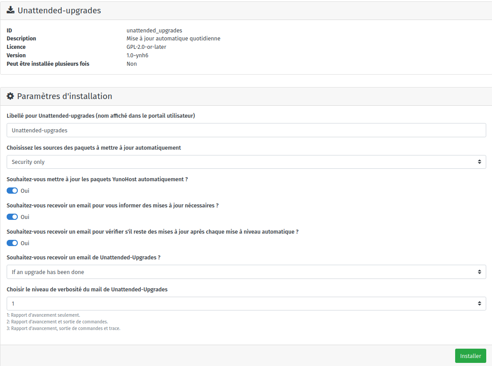  

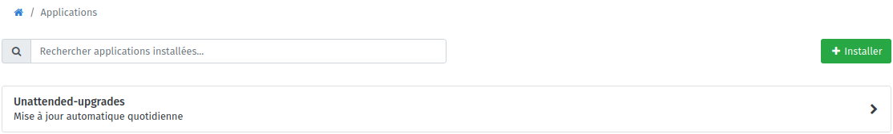

### Yunohost multimédia

[Dossiers multimédia pour Yunohost](/posts/Dossiers_multimedia_pour_Yunohost/)

Pour toutes les applications, mise en place des dossiers multimédias 

```shell
wget -nv https://github.com/maniackcrudelis/yunohost.multimedia/archive/master.zip
unzip master.zip
sudo ./yunohost.multimedia-master/script/ynh_media_build.sh
```

Application multimédia ayant besoin d'un droit d'écriture sur l'ensemble des médias  
Usage du dossier multimedia en ssh

```shell
sudo groupadd -f multimedia
sudo usermod -a -G multimedia admin
```

Depuis PC1, on peut synchroniser les dossiers BiblioCalibre et CalibreTechnique avec le dossier multimédia

```shell
rsync -avz --progress --stats --human-readable --delete --rsync-path="sudo rsync" -e "ssh -p 55135 -i /home/yann/.ssh/yunobulls -o StrictHostKeyChecking=no -o UserKnownHostsFile=/dev/null"  /home/yann/media/BiblioCalibre/* yunoyan@192.168.0.135:/home/yunohost.multimedia/share/eBook/BiblioCalibre/

rsync -avz --progress --stats --human-readable --delete --rsync-path="sudo rsync" -e "ssh -p 55135 -i /home/yann/.ssh/yunobulls -o StrictHostKeyChecking=no -o UserKnownHostsFile=/dev/null"  /home/yann/media/CalibreTechnique/* yunoyan@192.168.0.135:/home/yunohost.multimedia/share/eBook/CalibreTechnique/
```

Structure

```shell
admin@ouestyan:~$ tree -L 2 /home/yunohost.multimedia/share/
/home/yunohost.multimedia/share/
├── eBook
│   ├── BiblioCalibre
│   └── CalibreTechnique
├── Music
├── Picture
└── Video

6 directories, 0 files
```

## Applications Yunohost

### Calibre web

{:width="80"} 

1. Ajout domaine et certificats **calibre.ouestyan.xyz** par le web admin  
2. Modifier la configuration du domaine pour positionner la gestion des messages entrants et sortants à **Non**  
3. Gérer les certificats SSL, en ligne de commande

    yunohost domain cert-install calibre.ouestyan.xyz --no-checks

Installer l'application **Calibre-web** par l'administration web

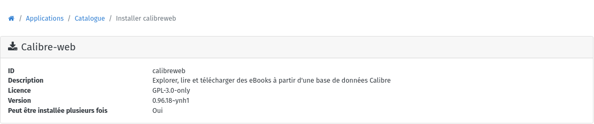  
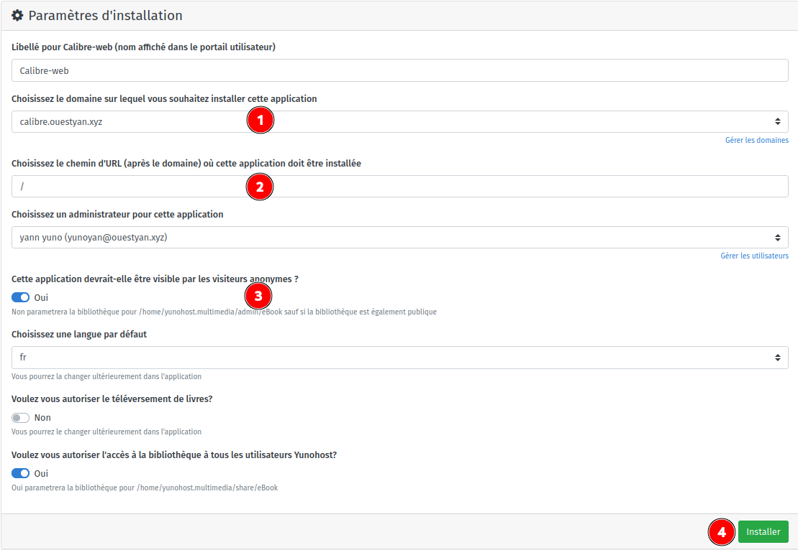  

Par défaut, le processus de sauvegarde de Yunohost sauvegarde la bibliothèque Calibreweb. Vous pouvez désactiver la sauvegarde de la bibliothèque avec

    yunohost app setting calibreweb do_not_backup_data -v 1

>Par défaut, la suppression de l'application ne supprimera jamais la bibliothèque.

Ouvrir le lien https://calibre.ouestyan.xyz  
Se connecter avec l'utilisateur yunoyan qui est l'administrateur de calibre-web  
Modifier le chemin de la base et des données Calibre : /home/yunohost.multimedia/share/eBook/BiblioCalibre  
Thème sombre  

Editer la configuration de l'interface utilisateur &rarr; Configuration du mode d'affichage  
    

**Modifications pour un accès en lecture écriture du dossier** 

Ajouter l'utilisateur admin au groupe calibreweb pour les droits lecture/écriture

    sudo gpasswd -a admin calibreweb

Droits **calibreweb.calibreweb** sur le dossier `/home/yunohost.multimedia/share/eBook`

### Audio Navidrome

Ajout domaine zic.ouestyan.xyz par interface web admin  
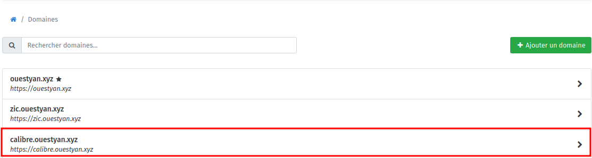  

Certificats zic.ouestyan.xyz en ligne de commande  

    sudo yunohost domain cert install zic.ouestyan.xyz --no-checks

```
Success! Configuration updated for 'nginx'
Success! Let's Encrypt certificate now installed for the domain 'zic.ouestyan.xyz'
```

Installer application Navidrome  
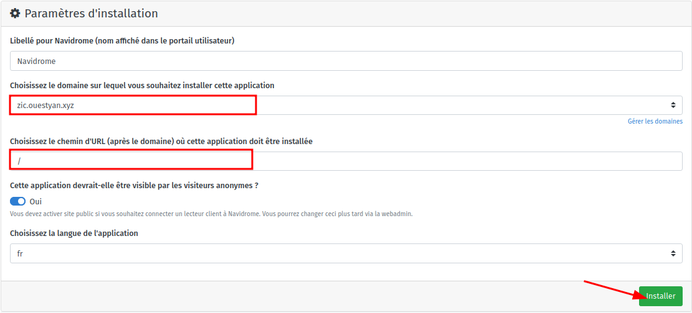  

<u>En ligne de commande</u>  
Faire une sauvegarde avant modification

    sudo cp /var/lib/navidrome/navidrome.toml /var/lib/navidrome/navidrome.toml.sav

Modifier le répertoire de la musique et ajouter le dossier des "playlists" dans le fichier `/var/lib/navidrome/navidrome.toml`  

```
# Folder to store application data (DB, cache…)
DataFolder = "/var/lib/navidrome"

# Folder where your music library is stored. Can be read-only
MusicFolder = "/home/yunohost.multimedia/share/Music/musicyan"

# Playlist
ND_PLAYLISTSPATH = "/home/yunohost.multimedia/share/Music/musicyan/Playlists"
```

Redémarrer navidrome

    sudo systemctl restart navidrome

Ouvrir le lien <https://zic.ouestyan.xyz/> et saisir un identifiant + mot de passe pour le compte administrateur  
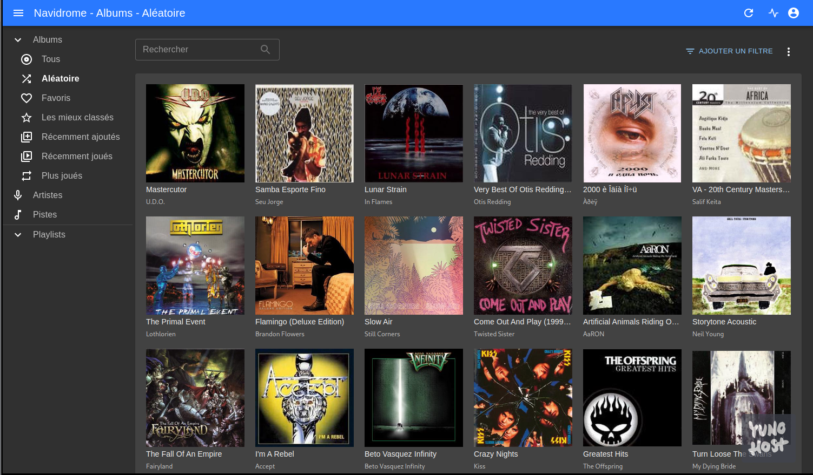  

## Hors Yunohost

### Partage disque freebox

[Partage disque externe USB sur Freebox](/posts/Partage_disque_externe_USB_sur_Freebox/)

Installation paquet cifs-utils

    sudo apt install cifs-utils  # Debian

Création répertoire de montage

    sudo mkdir /mnt/freebox/

Edition fichier caché nommé .smbcredentials

    nano /home/$USER/.smbcredentials

Dans le fichier, ajoutez les lignes suivantes (remplacez les XXXX par votre login et mot de passe)

```
username=yannfreebox
password=xxxxxxxxxxxxxxx
```

Donnez les droits adéquats au fichier

```bash
sudo chown -R $USER:root /home/$USER/.smbcredentials
sudo chmod -R 775 /home/$USER/.smbcredentials
```

partage au démarrage, ajouter les lignes suivantes au fichier `/etc/fstab`

```
#mount freebox
//192.168.0.254/hdd500g/ /mnt/freebox cifs x-systemd.automount,x-systemd.device-timeout=3,credentials=/home/yunoyan/.smbcredentials,_netdev,iocharset=utf8,uid=1000,sec=ntlmv2,file_mode=0770,dir_mode=0775,vers=2.0
```

//adresseIP/Partage     /media/Partage     cifs    x-systemd.automount,x-systemd.device-timeout=3,_netdev,sec=ntlmv2,credentials=/root/.credentials     0     0

Montage immédiat : `sudo mount -a`  
Si aucune erreur, tester l'accès : `touch /mnt/freebox/test` et `ls /mnt/freebox/`

### Connexion SSH Lenovo --> PC1

Le serveur Lenovo Yunohost (192.168.0.135) est sur le même réseau que le l'ordinateur de bureau archlinux PC1 (192.168.0.42) 
On va établir une liaison SSH entre les 2  

Générer une paire de clé curve25519-sha256 (ECDH avec Curve25519 et SHA2) pour une liaison SSH entre Lenovo Yunohost et PC1  

    ssh-keygen -t ed25519 -o -a 100 -f ~/.ssh/PC1-ed25519

Envoyer les clés publiques sur PC1 

    ssh-copy-id ~/.ssh/PC1-ed25519.pub yann@192.168.0.42

On se connecte sur PC1

    ssh yann@192.168.0.42

Modifier la configuration SSH PC1

    sudo nano /etc/ssh/sshd_config

Modifier

```conf
Port = 55042
PasswordAuthentication no
```

Relancer le service

    sudo systemctl restart sshd

Test connexion depuis Lenovo M700

    ssh -p 55042 -i ~/.ssh/PC1-ed25519 yann@192.168.0.42

### Notifications

#### notify-send via ssh

```shell
# exemples
ssh -p 55042 -i ~/.ssh/PC1-ed25519 yann@192.168.0.42 'DISPLAY=:0 notify-send "Lenovo M700" "Test notification à distance" -i /home/yann/media/statique/images/information.png -t 10000'
```

`-i /home/yann/media/statique/images/information.png` : Image présente sur le distant  
`-t 10000` : durée affichage en ms soit 10 s dans l'exemple  

#### Notification par messagerie

```shell
# exemples
echo "This is the body" | mail -s "Subject" -aFrom:Harry\<harry@gmail.com\> vp@cinay.eu
echo "Test notification par messagerie" | mail -s "Yunohost ouestyan.xyz"  vpn@cinay.eu
```

#### Notification au boot

La machine Lenovo M700 Debian 11 peut être mise hors tension depuis PC1   

    ssh yunoyan@192.168.0.135 -p 55135 -i /home/yann/.ssh/lenovo-ed25519 'sudo systemctl poweroff'

Le réveil de la machine se fait avec la fonction "wakeonlan" depuis PC1

    wakeonlan -i 192.168.0.255 00:23:24:c9:06:86

On veut envoyer une notification à PC1 lorsque la machine est totalement opérationnelle

    sudo nano /usr/local/bin/startup_script.sh

En plus du message, on lance l'exécution du script de sauvegarde  

```shell
#!/bin/bash
SCRIPT_NAME=$(basename -- "$0")
ssh -p 55042 -i /home/yunoyan/.ssh/PC1-ed25519 yann@192.168.0.42 'DISPLAY=:0 notify-send "Lenovo M700" "`(date +"Fin démarrage machine Lenovo \nExécution script sauvegarde\n/home/yann/scripts/sav-yann-media.sh\nle %d/%m/%Y %R")`" -i /home/yann/media/statique/images/information.png -t 10000'
# echo $(date +"Fin démarrage machine Lenovo à %d/%m/%Y %R") | mail -a "Content-Type: text/plain; charset=UTF-8" -s "Yunohost ouestyan.xyz"  vpn@cinay.eu
# exécution du script 
ssh -p 55042 -i /home/yunoyan/.ssh/PC1-ed25519 yann@192.168.0.42 '/bin/bash /home/yann/scripts/sav-yann-media.sh'
# pas d'erreur en sortie
exit 0
```

Si on opte pour le bash avec exécution de la sauvegarde, il faut désactiver le timer local sur la machine PC1  
`systemctl disable --user savyann`
{: .prompt-warning }
 

Fournir la permission d'exécuter le script

    sudo chmod +x /usr/local/bin/startup_script.sh

Exécuter le script au démarrage après que tous les services systemd soient chargés.

    sudo nano /etc/systemd/system/run-at-startup.service

```
[Unit]
Description=Run script at startup after all systemd services are loaded
After=default.target

[Service]
Type=simple
RemainAfterExit=yes
ExecStart=/usr/local/bin/startup_script.sh
TimeoutStartSec=0

[Install]
WantedBy=default.target
```

Rafraîchir les fichiers de configuration de systemd et activer le service

    sudo systemctl daemon-reload
    sudo systemctl enable run-at-startup.service

### Qemu Kvm

[Installer QEMU/KVM via SSH sur un serveur Debian sans affichage](/posts/Installer_QEMU-KVM_sur_un_serveur_Debian/)

