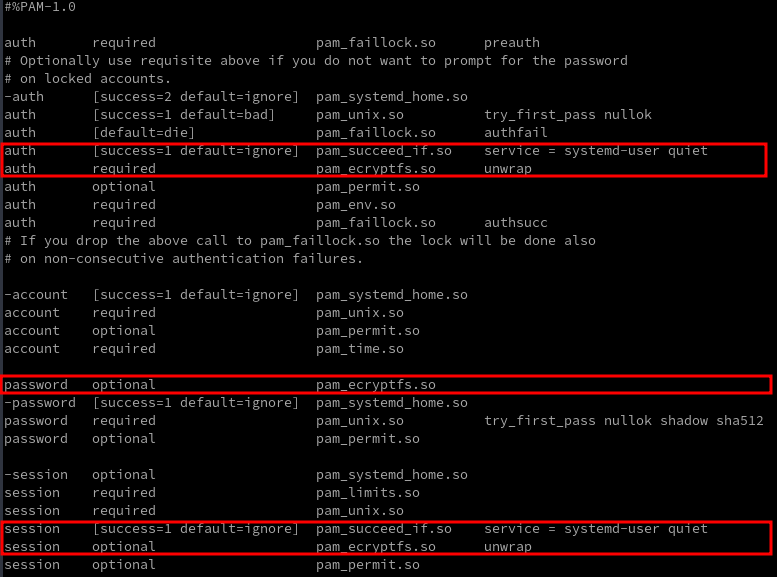
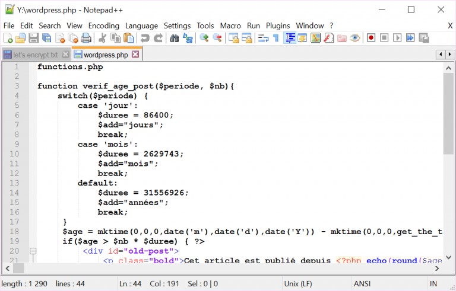
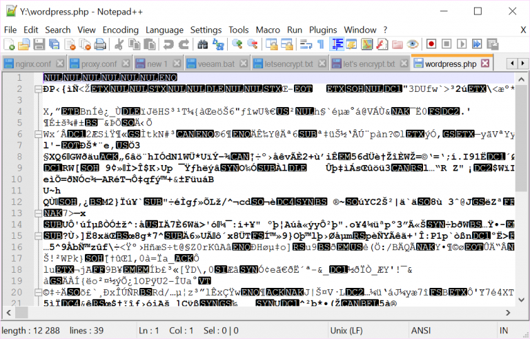

+++
title = 'Chiffrement (eCryptfs)'
date = 2023-02-16 00:00:00 +0100
categories = ['chiffrement']
+++
{:width=100"}

## Chiffrement (eCryptfs)

**Ecryptfs** est un outil pour créer un dossier privé (**~/Private**), *chiffré et inaccessible aux autres utilisateurs* , il est destiné à contenir tous les fichiers "sensibles" que vous pourriez avoir : vos fichiers contenant des mots de passe, les données confidentielles relatives à vos comptes bancaires, vos emails...  

### Installer ecryptfs

Installer le paquet **ecryptfs-utils**.  

	sudo pacman -S ecryptfs-utils

Une fois ces paquets installés, vous devez charger le module **ecryptfs** (archlinux/manjaro)  

	sudo modprobe ecryptfs

### Configuration

Générer les fichiers   

	ecryptfs-setup-private

```
Enter your login passphrase [eeepc]:    (mot de passe connexion utilisateur)  
Enter your mount passphrase [leave blank to generate one]:

************************************************************************
YOU SHOULD RECORD YOUR MOUNT PASSPHRASE AND STORE IT IN A SAFE LOCATION.
  ecryptfs-unwrap-passphrase ~/.ecryptfs/wrapped-passphrase
THIS WILL BE REQUIRED IF YOU NEED TO RECOVER YOUR DATA AT A LATER TIME.
************************************************************************


Done configuring.

Testing mount/write/umount/read...
Inserted auth tok with sig [953bd344c4022573] into the user session keyring
Inserted auth tok with sig [cb7afbfca195342e] into the user session keyring
Inserted auth tok with sig [953bd344c4022573] into the user session keyring
Inserted auth tok with sig [cb7afbfca195342e] into the user session keyring
Testing succeeded.

Logout, and log back in to begin using your encrypted directory.

```

Dans le cas d'une génération automatique de la passphrase de montage , il faut la déchiffrer pour pouvoir la sauvegarder  
`ecryptfs-unwrap-passphrase ~/.ecryptfs/wrapped-passphrase`  
Passphrase: `Mot de passe de connexion utilisateur`  
XXXXXXXXXXXXXXXXXXXXXXXXXXXXXXXXXXXXXXXX  
Enregistrez votre phrase secrète dans un lieu sûr, elle sera requise pour récupérer vos données ultérieurement.  

Les dossiers et fichiers après installation  

```
ls -la .ecryptfs/
total 20
drwx------  2 eeepc wheel 4096 10 août  17:50 .
drwx------ 22 eeepc wheel 4096 10 août  17:50 ..
-rw-------  1 eeepc wheel   20 10 août  17:50 Private.mnt
-rw-------  1 eeepc wheel   34 10 août  17:50 Private.sig
-rw-r--r--  1 eeepc wheel    0 10 août  17:50 auto-mount
-rw-r--r--  1 eeepc wheel    0 10 août  17:50 auto-umount
-rw-------  1 eeepc wheel   58 10 août  17:50 wrapped-passphrase

ls -la .Private/
total 8
drwx------  2 eeepc wheel 4096 01.04.2016 14:16 ./
drwx------ 99 eeepc wheel 4096 01.04.2016 14:16 ../

ls -la Private/
total 8
dr-x------  2 eeepc wheel 4096 01.04.2016 14:16 ./
drwx------ 99 eeepc wheel 4096 01.04.2016 14:16 ../
lrwxrwxrwx  1 eeepc wheel   56 01.04.2016 14:16 Access-Your-Private-Data.desktop -> /usr/share/ecryptfs-utils/ecryptfs-mount-private.desktop
lrwxrwxrwx  1 eeepc wheel   52 01.04.2016 14:16 README.txt -> /usr/share/ecryptfs-utils/ecryptfs-mount-private.txt
```

### Montage Manuelle  

Monter le répertoire avec le mot de passe de login :  
`ecryptfs-mount-private`  
Démonter le répertoire :  
`ecryptfs-umount-private`  

### Montage Auto (PAM) 

Le montage d'une partition chiffrée à l'ouverture de session est fait à l'aide de **PAM** voir **/usr/share/doc/ecryptfs-utils/README** et le module doit être chargé (sudo modprobe ecryptfs)  

#### Configuration PAM

1- Vérifier ou créer (touch) les fichiers **~/.ecryptfs/auto-mount**, **~/.ecryptfs/auto-umount** et **~/.ecryptfs/wrapped-passphrase** (créer avec utilitaire **ecryptfs-setup-private**).  

2- Ajouter **ecryptfs** au pam exactement comme ce qui suit pour que la **login passphrase** ne soit plus demandée :  
Ouvrir **/etc/pam.d/system-auth**  

**APRES** la ligne contenant `auth required pam_unix.so` (ou `auth [default=die] pam_faillock.so authfail` si présent) ajouter:   

```
auth       [success=1 default=ignore]  pam_succeed_if.so    service = systemd-user quiet
auth       required                    pam_ecryptfs.so      unwrap
```

Ensuite, **AU-DESSUS** de la ligne contenant `password required pam_unix.so` (or `-password [success=1 default=ignore] pam_systemd_home.so` si présent) insérer:   

```
password   optional                    pam_ecryptfs.so
```

Et finalement **APRES** la ligne `session required pam_unix.so` ajouter:  

```
session    [success=1 default=ignore]  pam_succeed_if.so    service = systemd-user quiet
session    optional                    pam_ecryptfs.so      unwrap
```



**Note** : Les instructions `pam_succeed_if.so` indiquent au processus de sauter la ligne suivante si le service demandant l'authentification est `systemd-user`, qui fonctionne parallèlement à votre session utilisateur et s'authentifie également via PAM. Si le répertoire personnel est monté une deuxième fois, PAM sera incapable de le démonter. Ceci est référencé comme une rupture avec systemd. La méthode exposée ici est une solution de contournement.
{: .prompt-info }

3- Sauvegarde , déconnexion ,reconnexion et vérifier la sortie du mount  

    mount

qui devrait maintenant contenir un point de montage, par exemple:  

```
/home/$USER/.Private on /home/$USER/Private type ecryptfs (...)
```

pour le répertoire crypté de l'utilisateur. Il doit être parfaitement lisible sur **~$HOME/Private/**  


## Modification mot de passe

Si vous avez modifié votre mot de passe depuis la ligne de commande à l'aide "passwd", le système ecryptfs ne vous autorisera plus à accéder aux données chiffrées.  
Votre dossier chiffré est devenu illisible et non-déchiffrable parce que le montage du dossier ecryptfs est basé sur votre ancien mot de passe.  
Vous pouvez vous en tirer si vous connaissez la passphrase mais vous n'avez aucune solution dans le cas contraire.  

### accés temporaire

Pour accéder aux données, il faut monter le dossier chiffré manuellement

    sudo mount -t ecryptfs ~/.Private ~/Private -o key=passphrase,ecryptfs_cipher=aes,ecryptfs_key_bytes=16,ecryptfs_passthrough=n

La passphrase vous sera demandée et le dossier Private sera monté correctement.

### rétablir un fonctionnement normal

Si vous avez modifié votre mot de passe depuis la ligne de commande, vous remarquerez que la passphrase utilisée pour monter votre dossier personnel chiffré n'est PAS mise à jour. Ceci évite qu'un super utilisateur (ex. : root) puisse accéder à vos données simplement en modifiant votre mot de passe d'utilisateur et en se connectant avec votre identifiant.

Afin de modifier votre passphrase Ecryptfs (pour qu'elle coïncide avec votre nouveau mot de passe), utilisez cette commande :

    ecryptfs-rewrap-passphrase ~/.ecryptfs/wrapped-passphrase

Vous devrez saisir votre ancienne passphrase, puis la nouvelle.

Vous pourrez alors utiliser votre répertoire crypté normalement.\\

>Solution proposée sur ce tutoriel [Ecryptfs](http://bodhizazen.net/Tutorials/Ecryptfs/), dans le chapitre *Change your passphrase to mount your encrypted private directory or home*


## Créer un dossier partagé chiffré avec Ecryptfs

**ecryptfs** est installé , sinon 

    sudo apt install ecryptfs-utils

On se sert du dossier Crypted  (bien sûr le dossier est et doit rester vide pour le moment) 

    /media/chiffre/

lancer le chiffrement du dossier  

    mount -t ecryptfs /media/chiffre/ /media/chiffre/

Ici on va chiffrer les fichiers avec de l’AES-256, suivez ce cheminement :


```bash
root@openmediavault:~# mount -t ecryptfs /media/chiffre/ /media/chiffre/
Select key type to use for newly created files:
 1) passphrase
 2) tspi
Selection: 1
Passphrase:
Select cipher:
 1) aes: blocksize = 16; min keysize = 16; max keysize = 32
 2) blowfish: blocksize = 8; min keysize = 16; max keysize = 56
 3) des3_ede: blocksize = 8; min keysize = 24; max keysize = 24
 4) twofish: blocksize = 16; min keysize = 16; max keysize = 32
 5) cast6: blocksize = 16; min keysize = 16; max keysize = 32
 6) cast5: blocksize = 8; min keysize = 5; max keysize = 16
Selection [aes]: 1
Select key bytes:
 1) 16
 2) 32
 3) 24
Selection [16]: 32
Enable plaintext passthrough (y/n) [n]: n
Enable filename encryption (y/n) [n]: n
Attempting to mount with the following options:
 ecryptfs_unlink_sigs
 ecryptfs_key_bytes=32
 ecryptfs_cipher=aes
 ecryptfs_sig=bc69feaf7de58b90
Mounted eCryptfs
```

Le dossier chiffré est monté. Pour tester son bon fonctionnement, mettez un fichier de test dedans avec du contenu, exemple :

{:width="500"}

Maintenant, fermer le fichier ,démonter le partage chiffré avec la commande suivante 

    umount /media/chiffre/

Réouvrir le fichier et vous verrez quelque chose dans ce style :

{:width="500"}

Mémo de la commande qui contient toutes les options avec lesquelles on a créer notre partage 

    mount -t ecryptfs /media/chiffre/ /media/chiffre/ -o ecryptfs_cipher=aes,ecryptfs_key_bytes=32,key=passphrase

Saisir la passphrase et tous les fichiers deviendront lisibles


## Modification mot de passe

Si vous avez modifié votre mot de passe depuis la ligne de commande à l'aide "passwd", le système ecryptfs ne vous autorisera plus à accéder aux données chiffrées.  
Votre dossier chiffré est devenu illisible et non-déchiffrable parce que le montage du dossier ecryptfs est basé sur votre ancien mot de passe.  
Vous pouvez vous en tirer si vous connaissez la passphrase mais vous n'avez aucune solution dans le cas contraire.  

### accés temporaire

Pour accéder aux données, il faut monter le dossier chiffré manuellement

    sudo mount -t ecryptfs ~/.Private ~/Private -o key=passphrase,ecryptfs_cipher=aes,ecryptfs_key_bytes=16,ecryptfs_passthrough=n

La passphrase vous sera demandée et le dossier Private sera monté correctement.

### rétablir un fonctionnement normal

Si vous avez modifié votre mot de passe depuis la ligne de commande, vous remarquerez que la passphrase utilisée pour monter votre dossier personnel chiffré n'est PAS mise à jour. Ceci évite qu'un super utilisateur (ex. : root) puisse accéder à vos données simplement en modifiant votre mot de passe d'utilisateur et en se connectant avec votre identifiant.

Afin de modifier votre passphrase Ecryptfs (pour qu'elle coïncide avec votre nouveau mot de passe), utilisez cette commande :

    ecryptfs-rewrap-passphrase ~/.ecryptfs/wrapped-passphrase

Vous devrez saisir votre ancienne passphrase, puis la nouvelle.

Vous pourrez alors utiliser votre répertoire crypté normalement.\\

>Solution proposée sur ce tutoriel [Ecryptfs](http://bodhizazen.net/Tutorials/Ecryptfs/), dans le chapitre Change your passphrase to mount your encrypted private directory or home


