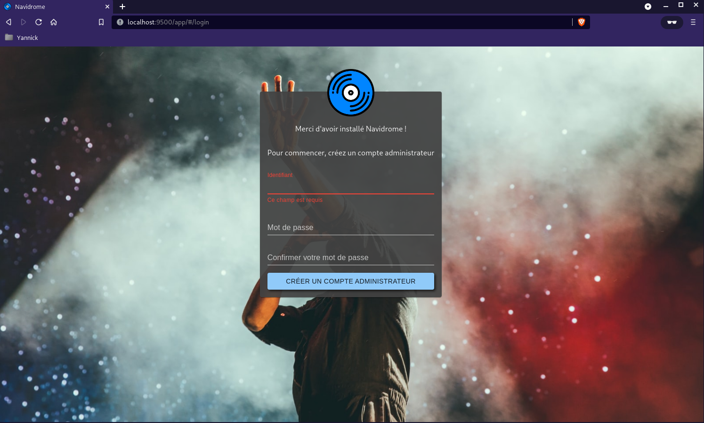
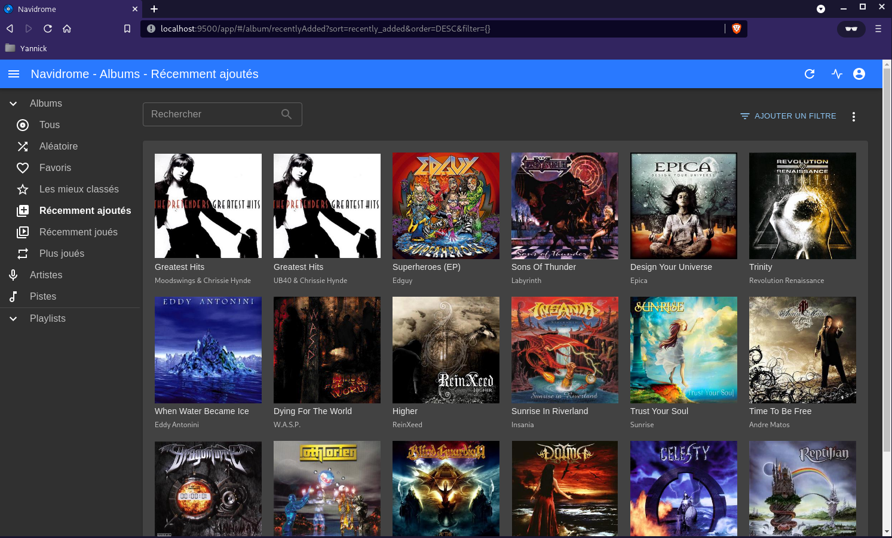

+++
title = 'Audio Navidrome, installation sur debian'
date = 2023-02-22 00:00:00 +0100
categories = ['go']
+++
- [Navidrome](#navidrome)
    - [Prérequis](#prérequis)
    - [Utilisateur "navidrome"](#utilisateur-navidrome)
    - [Créer une structure de répertoire](#créer-une-structure-de-répertoire)
    - [Obtenir Navidrome](#obtenir-navidrome)
    - [Créer le fichier de configuration](#créer-le-fichier-de-configuration)
    - [Créer une unité Systemd navidrome.service](#créer-une-unité-systemd-navidromeservice)
    - [Proxy nginx (navidrome)](#proxy-nginx-navidrome)

## Navidrome

{:height="100"}  

*Les étapes suivantes ont été testées sur Ubuntu 18.04 et devraient fonctionner sur toutes les versions 16.04 et supérieures ainsi que sur les autres distros basées sur Debian. Tout au long de ces instructions, les commandes auront des espaces réservés pour l'utilisateur (`<user>`) et le groupe (`<group>`) sous lesquels vous souhaitez exécuter Navidrome et le chemin du dossier de musique (`<library_path>`). Si vous utilisez une médiathèque existante, assurez-vous que l'utilisateur a les droits sur la médiathèque.*

### Prérequis

**Conditions préalables à la mise à jour et à l'installation**  
Assurez-vous que votre système est à jour et installez ffmpeg.

    sudo apt update && sudo apt upgrade
    sudo apt install libtag1-dev ffmpeg

### Utilisateur "navidrome"

Par défaut, la commande useradd ne crée pas de répertoires de base, mais pour un démon, je vous recommande d'utiliser l'option système et de remplacer le shell par un shell inexistant afin que personne ne puisse se connecter à ce compte (sous ssh par exemple):

    sudo useradd -r -s /bin/false navidrome

### Créer une structure de répertoire

Créez un répertoire pour stocker l'exécutable Navidrome et un répertoire de travail avec les permissions appropriées.

    sudo install -d -o navidrome -g navidrome /opt/navidrome
    sudo install -d -o navidrome -g navidrome /var/lib/navidrome

### Obtenir Navidrome

**Sur le git officiel**

Téléchargez la dernière version depuis la [page des versions](https://github.com/navidrome/navidrome/releases), extrayez le contenu dans le répertoire exécutable et définissez les autorisations pour les fichiers. (Remplacez l'URL ci-dessous par celle de la page des versions) :

    wget https://github.com/navidrome/navidrome/releases/download/v0.45.1/navidrome_0.45.1_Linux_arm64.tar.gz -O Navidrome.tar.gz
    sudo tar -xvzf Navidrome.tar.gz -C /opt/navidrome/
    sudo chown -R navidrome:navidrome /opt/navidrome

**Version compilée**

[Archlinux Debian - Compilation go Audio Navidrome](/posts/Archlinux_Debian-Compilation_go_Audio_Navidrome/)

Copier le fichier **navidrome** dans le répertoire `/opt/navidrome/` et modifier les droits

```bash
sudo mkdir -p /opt/navidrome
sudo cp navidrome /opt/navidrome/
sudo chown -R navidrome:navidrome /opt/navidrome
sudo chmod +x /opt/navidrome/navidrome
```
    
### Créer le fichier de configuration

Dans le répertoire de travail, créer un nouveau fichier nommé `navidrome.toml` ( `sudo nano /var/lib/navidrome/navidrome.toml` ) avec les paramètres suivants.

```
MusicFolder = "/home/lxcyan/media/musicyan"
```

Pour d'autres options de configuration, voir la page des [options de configuration](https://www.navidrome.org/docs/usage/configuration-options/).

<details>
<summary><b>Etendre Réduire "/var/lib/navidrome/navidrome.toml"</b></summary>

  
# Chargement des configurations à partir d'un fichier de configuration externe
ConfigFile = "/var/lib/navidrome/navidrome.toml"
 
# Niveau de journalisation. Utile pour le dépannage. Valeurs possibles : error, info, debug, trace
LogLevel = "INFO"

# Adresse IP à laquelle le serveur se liera
Address = "127.0.0.1"

# Port HTTP que Navidrome utilisera
Port = "4533"

# URL de base (seulement la partie chemin) pour configurer Navidrome derrière un proxy (ex : /music)
BaseURL = "/"

# Configurer les scans périodiques en utilisant la syntaxe "cron". Pour le désactiver complètement, mettez-le à "" (chaîne vide)
ScanSchedule = "@every 1m30s"

# Active la configuration du transcodage dans l'interface utilisateur
EnableTranscodingConfig = "false"

# Taille du cache de transcodage. Définissez à 0 pour désactiver le cache
TranscodingCacheSize = "150MB"

# Taille du cache des images (œuvres d'art). Mettez la valeur 0 pour désactiver le cache
ImageCacheSize = "100MB"

# Dossier pour stocker les données de l'application (BD, cache...)
DataFolder = "/var/lib/navidrome"

# Dossier où est stockée votre bibliothèque musicale. Peut être en lecture seule
MusicFolder = "/home/lxcyan/media/musicyan"

# Liste de lecture
# Où rechercher et importer les listes de lecture. Peut être une liste de dossiers/globes (séparés par : (ou ; sous Windows). 
# Les chemins sont relatifs au MusicFolder
PlaylistsPath = "Playlists"

# Activez l'option dans l'interface utilisateur pour télécharger les musiques/albums/artistes/playlists depuis le serveur.
EnableDownloads = "true"

# Changer l'image de fond utilisée dans la page de connexion
UILoginBackgroundUrl = "https://source.unsplash.com/random/1920x1080/?music"

# Ajouter un message de bienvenue à l'écran de connexion
UIWelcomeMessage = ""

# Enable image pre-caching of new added music
EnableArtworkPrecache = "true"

# Contrôle si le lecteur dans l'interface utilisateur anime la couverture de l'album (rotation)
EnableCoverAnimation = "true"

# Combien de temps Navidrome attendra avant de fermer les sessions inactives de l'interface utilisateur Web.
SessionTimeout = "24h"

# Définir le pourcentage de qualité JPEG pour les images de pochette redimensionnées
CoverJpegQuality = "75"

# Configurer l'ordre de recherche des images de couverture. Utilisez la valeur spéciale "embedded" pour obtenir les images intégrées dans les fichiers audio.
CoverArtPriority = "embedded, cover.*, folder.*, front.*"

# Faire correspondre les chaînes de requête n'importe où dans les champs de recherche, pas seulement dans les limites des mots. Utile pour les langues où les mots ne sont pas séparés par des espaces
SearchFullString = "false"

# Liste des articles ignorés lors du tri/indexation des artistes
IgnoredArticles = "The El La Los Las Le Les Os As O A"

# Activer/désactiver l'importation automatique de listes de lecture .m3u
AutoImportPlaylists = "true"

# L'extracteur de métadonnées par défaut est toujours ffmpeg mais vous pouvez utiliser le nouvel extracteur taglib.
Scanner.Extractor = "taglib"

# Last.FM ApiKey
LastFM.ApiKey = ""

# Last.FM Shared Secret
LastFM.Secret = ""

# Code à deux lettres pour la langue à utiliser pour récupérer les biographies de Last.FM
LastFM.Language = "en"

# ID du client Spotify
Spotify.ID = ""

# Secret du client Spotify
Spotify.Secret = ""

# Utiliser les images Gravatar comme image de profil utilisateur. L'email de l'utilisateur doit être renseigné. 
EnableGravatar = "false"

# Permettre de basculer entre "Heart"/"Loved" pour les chansons/albums/artistes dans l'interface utilisateur (correspond à "Star"/"Starred" dans les clients Subsonic)
EnableFavourites = "true"

# Active les évaluations 5 étoiles dans l'interface utilisateur
EnableStarRating = "true"

# Permettre aux utilisateurs réguliers de modifier leurs coordonnées et de changer leur mot de passe
EnableUserEditing = "true"

# Permettre à Navidrome de se connecter à tout service externe
EnableExternalServices = "true"

# Définir la langue par défaut
DefaultLanguage="fr"

# Désactiver le panneau d'activité qui peut bloquer certains navigateurs avec une utilisation du CPU supérieure à 100 %.
# Voir https://github.com/navidrome/navidrome/issues/1511
DevActivityPanel=false

# Activer la fonction de partage
EnableSharing="false"

# Activez l'authentification SSOWat pour toutes les adresses IP.
# Si SSOWat n'a pas authentifié un utilisateur, la connexion manuelle fonctionnera toujours (par exemple, pour l'API).
ReverseProxyUserHeader = "remote-user"
ReverseProxyWhitelist = "0.0.0.0/0"

# Chemin d'accès à l'exécutable ffmpeg. Utilisez-le lorsque Navidrome ne le trouve pas, ou si vous voulez utiliser une version spécifique.
FFmpegPath = ""


</details>

Les fichiers "playlists" sont de type m3u et chaque titre doit comporter le chemin complet  
Exemple de fichier **playlist.m3u** pour un dossier musique `/home/lxcyan/media/musicyan`)

```
/home/yunohost.multimedia/share/Music/musicyan/Cactus/'Ot 'N'Sweaty/Swim.mp3
/home/yunohost.multimedia/share/Music/musicyan/_LoveSongs/062 - Elvis Presley - Heartbreak Hotel.mp3
/home/yunohost.multimedia/share/Music/musicyan/Johnny Rivers - John Lee Hooker/John Lee Hooker.mp3
/home/yunohost.multimedia/share/Music/musicyan/Jazz Manouche/13 - Tchavolo Schmitt - It Had To Be You.mp3
```

### Créer une unité Systemd navidrome.service  

Créez un nouveau fichier sous `/etc/systemd/system/` nommé `navidrome.service` avec les données suivantes.

    /etc/systemd/system/navidrome.service

```systemd
[Unit]
Description=Navidrome Music Server and Streamer compatible with Subsonic/Airsonic
After=remote-fs.target network.target
AssertPathExists=/var/lib/navidrome

[Install]
WantedBy=multi-user.target

[Service]
User=navidrome
Group=navidrome
Type=simple
ExecStart=/opt/navidrome/navidrome --configfile "/var/lib/navidrome/navidrome.toml"
WorkingDirectory=/var/lib/navidrome
TimeoutStopSec=20
KillMode=process
Restart=on-failure

# See https://www.freedesktop.org/software/systemd/man/systemd.exec/
DevicePolicy=closed
NoNewPrivileges=yes
PrivateTmp=yes
PrivateUsers=yes
ProtectControlGroups=yes
ProtectKernelModules=yes
ProtectKernelTunables=yes
RestrictAddressFamilies=AF_UNIX AF_INET AF_INET6
RestrictNamespaces=yes
RestrictRealtime=yes
SystemCallFilter=~@clock @debug @module @mount @obsolete @reboot @setuid @swap
ReadWritePaths=/var/lib/navidrome

# You can uncomment the following line if you're not using the jukebox This
# will prevent navidrome from accessing any real (physical) devices
#PrivateDevices=yes

# You can change the following line to `strict` instead of `full` if you don't
# want navidrome to be able to write anything on your filesystem outside of
# /var/lib/navidrome.
ProtectSystem=full

# You can uncomment the following line if you don't have any media in /home/*.
# This will prevent navidrome from ever reading/writing anything there.
#ProtectHome=true

# You can customize some Navidrome config options by setting environment variables here. Ex:
#Environment=ND_BASEURL="/navidrome"
```

**Démarrez le service Navidrome**  
Rechargez le démon de service, démarrez le service nouvellement créé, et vérifiez qu'il a démarré correctement.

```bash
sudo systemctl daemon-reload
sudo systemctl start navidrome.service
sudo systemctl status navidrome.service
```

Si le service a démarré correctement, vérifiez que vous pouvez accéder à http://localhost:4533.  
Ouvrir un terminal sur le client linux qui dispose des clés ssh et lancer la commande

    ssh -L 9500:localhost:4533  leno@192.168.0.145 -p 55145 -i /home/yann/.ssh/lenovo-ed25519

Ouvrir un navigateur sur le client et saisir [localhost:9500](URL) pour afficher le serveur audio  
{:width="400"}  
{:width="400"}

Démarrez Navidrome au démarrage

    sudo systemctl enable navidrome.service

### Proxy nginx (navidrome)

`Remplacer “zic.rnmkcy.eu” par votre nom de domaine`{: .prompt-info }

Le domaine “zic.rnmkcy.eu” est activé avec les certificats let’s encrypt

Le fichier de configuration nginx `/etc/nginx/conf.d/zic.rnmkcy.eu.conf`

```nginx
server {
    listen 80;
    listen [::]:80;
    server_name zic.rnmkcy.eu;
    return 301 https://$host$request_uri;
}
server {
    listen 443 ssl http2;
    listen [::]:443 ssl http2;
    server_name zic.rnmkcy.eu;

    # Certificats Let's Encrypt 
    ssl_certificate /etc/ssl/private/rnmkcy.eu-fullchain.pem;
    ssl_certificate_key /etc/ssl/private/rnmkcy.eu-key.pem;

    location / { 
        proxy_pass              http://127.0.0.1:4533;
    } 

}
```

Valider et recharger ginx

    sudo nginx -t
    sudo systemctl reload nginx


