+++
title = 'Archlinux Installer KVM QEMU + VMM + Pont réseau'
date = 2023-03-01 00:00:00 +0100
categories = ['kvm']
+++
## Archlinux - KVM/QEMU + VMM 

{:height=50}   {:height=50}  {:height=50}  

### Description

**KVM** est une bifurcation de **QEMU**. Le code KVM est modifié pour prendre en charge l'accélération matérielle lorsqu'elle est disponible (même architecture pour la VM hôte et la VM invitée).

La plupart du temps, la **QEMU** est utilisée pour émuler une autre architecture (par exemple, émuler ARM/Power arch. en utilisant un processeur x86. Exemple : faire tourner une image RaspberryPI qui fonctionne sur ARM dans un ordinateur équipé d'un processeur Intel)

Une différence entre les deux est que la **QEMU** fonctionne sur un processeur sans avoir besoin d'une extension de virtualisation matérielle (Intel VT/VT-d, AMD-V) alors que la **KVM** l'utilise. Les extensions de virtualisation matérielle vous permettent d'accéder directement au matériel sur la machine physique. L'inconvénient est que la base de code **KVM** ne peut pas émuler une autre architecture.


<u>Simuler une machine complète pour avoir son propre environnement d’exécution.</u>  
*Les avantages sont nombreux, isolations des processus, plusieurs environnements différents, etc...*  

La virtualisation matérielle est possible au moyen de ce que l’on appelle des hyperviseurs.  
**Il existe plusieurs types d’hyperviseurs, classés en 2 niveaux.**  

* Le niveau 1 est dit “natif”. 
    * **Natif** car les instructions processeurs du système virtuelle sont directement transmis aux hardware. Il faut donc vérifier la compatibilité entre les systèmes virtualisés et les composants matérielles.
* Le niveau 2 est dit “hosted”.
    * **Hosted** car la virtualisation s’effectue grâce à un logiciel installé sur un système d’exploitation. Donc la machine virtualisée n’interagit pas directement avec le Hardware.

**<u>KVM est un hyperviseur de type 1</u>**, il est intégré de manière native à beaucoup de distribution basées sur le noyau Linux. KVM pour Kernel-based Virtual Machine car il transforme le noyau linux sur lequel il est exécuté en hyperviseur, proxmox est basé dessus.
Il en existe d’autres.

On utilise **QEMU** (QuickEmulator) pour interagir avec **KVM**.

* <u>QEMU est de type 1 et 2</u>. 
    * Il peut simuler un environnement pour une machine totalement différente de la votre, par exemple une py sur un PC. Dans ce cas la il transforme les exécutions de processeurs pour les rendre compatibles avec le hardware, donc la il est de **type 2**. 
    * Mais quand il est utilise avec **KVM** dans ce cas la il fonctionne en **type 1** avec des performances bien meilleures.

> En clair **Qemu sert à manager les machines virtuels, c’est un client**.  
Et la liaison entre Qemu et KVM est faite via l’API libvirt ( management du réseau, stockages, clavier, souris, etc )

[libvirt](http://libvirt.org/) est une bibliothèque permettant d'interagir avec différentes solutions de virtualisation (cet article s'intéressera uniquement à KVM/QEMU, mais Xen, VirtualBox et d'autres sont aussi possibles)  
[Virtual Machine Manager](http://virt-manager.org/) est un ensemble d'applications permettant de gérer les machines virtuelles

En mode graphique :

*    **virt-viewer** est une interface graphique permettant de se connecter sur une machine virtuelle
*    **virt-manager** est une interface graphique permettant de gérer les machines virtuelles

En ligne de commande :

*    **virt-clone** permet de dupliquer une machine existante
*    **virt-convert** permet de convertir l'image d'une machine
*    **virt-image** permet de créer un nouvelle machine à partir d'une image
*    **virt-install** permet de créer une nouvelle machine ou d'importer une machine déjà créé ultérieurement avec qemu ou qemu-kvm

[QEMU](http://www.nongnu.org/qemu/) est une <u>solution d'émulation et de virtualisation</u> (avec kqemu un pilote permettant d'optimiser l'émulation lorsque qu'elle concerne la même architecture).QEMU peut utiliser KVM lors de l'exécution d'une architecture cible identique à l'architecture hôte. Par exemple, lorsque vous exécutez qemu-system-x86 sur un processeur compatible x86, vous pouvez profiter de l'accélération KVM - ce qui vous donne un avantage pour votre hôte et votre système invité.  

[KVM](http://www.linux-kvm.org/page/Main_Page) (*Kernel-based Virtual Machine*) est une <u>solution de virtualisation</u>, pour les processeurs disposant des capacités nécessaires, et intégré au noyau linux.Il supporte les processeurs Intel et AMD récents (x86 et x86_64), PPC 440, PPC 970, S/390, ARM (Cortex A15, AArch64), et les processeurs MIPS32.

<font color="red"><b>Vous ne pouvez pas utiliser KVM en même temps que VirtualBox. Il faudra en effet fermer KVM pour utiliser VirtualBox et vice versa. Ou désactiver le support de la virtualisation processeur dans VirtualBox</b></font>

Contrairement à d'autres programmes de virtualisation tels que VirtualBox et VMware, QEMU ne fournit pas d'interface graphique pour gérer les machines virtuelles (autre que la fenêtre qui apparaît lors de l'exécution d'une machine virtuelle), ni un moyen de créer des machines virtuelles persistantes avec des paramètres sauvegardés. Tous les paramètres pour exécuter une machine virtuelle doivent être spécifiés sur la ligne de commande à chaque lancement, sauf si vous avez créé un script personnalisé pour démarrer votre (vos) machine(s) virtuelle(s).
{: .prompt-warning }

### Prérequis

**Support matériel**

KVM exige que le processeur de l'hôte de la machine virtuelle soit compatible avec la virtualisation (nommé VT-x pour les processeurs Intel et AMD-V pour les processeurs AMD). Vous pouvez vérifier si votre processeur prend en charge la virtualisation matérielle à l'aide de la commande suivante :

    LC_ALL=C lscpu | grep Virtualization

```
Virtualization:      VT-x
```

Si rien n'est affiché après l'exécution de la commande, alors votre processeur ne prend pas en charge la virtualisation matérielle et vous ne pourrez pas utiliser KVM.

>**Remarque** : Vérifier l'activation de la prise en charge de la virtualisation dans le BIOS.

**Support du noyau**

Les noyaux Arch Linux fournissent les modules de noyau appropriés pour supporter KVM et VIRTIO.

**Modules KVM**

Vous pouvez vérifier si les modules nécessaires (kvm et l'un de kvm_amd, kvm_intel) sont disponibles dans votre noyau avec la commande suivante (en supposant que votre noyau est compilé avec CONFIG_IKCONFIG_PROC) :

    zgrep CONFIG_KVM /proc/config.gz

```
CONFIG_KVM_GUEST=y
CONFIG_KVM_MMIO=y
CONFIG_KVM_ASYNC_PF=y
CONFIG_KVM_VFIO=y
CONFIG_KVM_GENERIC_DIRTYLOG_READ_PROTECT=y
CONFIG_KVM_COMPAT=y
CONFIG_KVM_XFER_TO_GUEST_WORK=y
CONFIG_KVM=m
CONFIG_KVM_WERROR=y
CONFIG_KVM_INTEL=m
CONFIG_KVM_AMD=m
CONFIG_KVM_AMD_SEV=y
CONFIG_KVM_MMU_AUDIT=y
```

>Le module n'est disponible que s'il est réglé sur y ou m.

**Dispositifs para-virtualisés**

*La para-virtualisation fournit un moyen de communication rapide et efficace permettant aux invités d'utiliser des appareils sur la machine hôte. KVM fournit des périphériques para-virtualisés aux machines virtuelles en utilisant l'API Virtio comme couche entre l'hyperviseur et l'invité.*

Tous les périphériques virtio ont deux parties : le périphérique hôte et le pilote invité.

Utilisez la commande suivante pour vérifier si les modules nécessaires sont disponibles :

    zgrep VIRTIO /proc/config.gz

```
CONFIG_BLK_MQ_VIRTIO=y
CONFIG_VIRTIO_VSOCKETS=m
CONFIG_VIRTIO_VSOCKETS_COMMON=m
CONFIG_NET_9P_VIRTIO=m
CONFIG_VIRTIO_BLK=m
CONFIG_SCSI_VIRTIO=m
CONFIG_VIRTIO_NET=m
CONFIG_CAIF_VIRTIO=m
CONFIG_VIRTIO_CONSOLE=m
CONFIG_HW_RANDOM_VIRTIO=m
CONFIG_DRM_VIRTIO_GPU=m
CONFIG_VIRTIO=y
CONFIG_VIRTIO_MENU=y
CONFIG_VIRTIO_PCI=m
CONFIG_VIRTIO_PCI_LEGACY=y
CONFIG_VIRTIO_VDPA=m
CONFIG_VIRTIO_PMEM=m
CONFIG_VIRTIO_BALLOON=m
CONFIG_VIRTIO_MEM=m
CONFIG_VIRTIO_INPUT=m
CONFIG_VIRTIO_MMIO=m
CONFIG_VIRTIO_MMIO_CMDLINE_DEVICES=y
CONFIG_RPMSG_VIRTIO=m
CONFIG_VIRTIO_FS=m
CONFIG_CRYPTO_DEV_VIRTIO=m
```

**Chargement des modules du noyau**

Les modules kvm et kvm-intel/kvm-amd doivent être chargés automatiquement, sinon, voir la page traitant des [modules du noyau](https://wiki.archlinux.fr/Kernel_modules). 

    lsmod | grep kvm

```
kvm_intel             323584  0
kvm                   851968  1 kvm_intel
irqbypass              16384  1 kvm
```

>**Astuce** : Si modprobing kvm_intel ou kvm_amd échoue mais que modprobing kvm réussit, (et lscpu prétend que l'accélération matérielle est supportée), vérifiez vos paramètres BIOS.  

### Installer Virt-Manager, KVM et QEMU

* [Install KVM, QEMU and Virt Manager on Arch Linux / Manjaro](https://computingforgeeks.com/install-kvm-qemu-virt-manager-arch-manjar/)
* [How to install Virt-Manager Complete Edition](https://discovery.endeavouros.com/applications/how-to-install-virt-manager-complete-edition/2021/09/)
* [EndeavourOS - How to install Virt-Manager Complete Edition](https://discovery.endeavouros.com/applications/how-to-install-virt-manager-complete-edition/2021/09/)

**Virt-Manager** est une interface utilisateur graphique pour la bibliothèque qui fournit des services de gestion de machines virtuelles. L'interface Virt-manager permet à l'utilisateur de créer, supprimer et manipuler facilement les machines virtuelles sans passer par le terminal.  
Virt-manager supporte principalement KVM mais il peut également fonctionner avec d'autres hyperviseurs tels que Xen et LXC.Il est livré avec les outils énumérés ci-dessous.

*    **virt-install** : Utilitaire en ligne de commande pour provisionner le système d'exploitation
*    **virt-viewer** : L'interface utilisateur avec des fonctionnalités graphiques
*    **virt-clone** : Outil en ligne de commande pour cloner des hôtes inactifs existants
*    **virt-xml** : Outil en ligne de commande pour éditer facilement le XML du domaine libvirt en utilisant les options de ligne de commande de virt-install.
*    **virt-bootstrap** : Outil de commande fournissant un moyen facile de configurer le système de fichiers racine pour les conteneurs basés sur libvirt.

**KVM**  
Les lettres KVM signifient Kernel-based Virtual Machines. KVM est une solution de virtualisation complète de Linux pour les processeurs d'architecture x86 qui possèdent l'extension de virtualisation (Intel VT et AMD-V).  
KVM est un logiciel libre et open-source. Le support de KVM est inclus dans tous les nouveaux noyaux Linux par conception.

**QEMU** est la version abrégée de Quick EMUlator. Il s'agit d'un émulateur gratuit à code source ouvert qui peut effectuer une virtualisation matérielle. Il émule le processeur de la machine hôte par le biais d'une traduction binaire dynamique. Cela fournit différents ensembles de modèles de matériel et de périphériques pour la machine hôte, ce qui lui permet d'exécuter une variété de systèmes invités.

**KVM** peut être utilisé avec **QEMU**, ce qui permet d'exécuter les machines virtuelles à des vitesses proches des vitesses natives. Outre l'émulation matérielle, QEMU est capable d'émuler des processeurs de niveau utilisateur, ce qui permet aux applications compilées pour une architecture de fonctionner sur une autre.

**Installer KVM/QEMU**

Installation de base 

    sudo pacman -S virt-manager libvirt qemu

Installation complète 

**edk2-ovmf** : ovmf est un projet basé sur EDK II pour activer le support UEFI pour les machines virtuelles.  
**iptables-nft** : Outil de contrôle des paquets du noyau Linux (utilisant l'interface nft).   
**bridge-utils** :  Utilitaires de pont Ethernet.  
**dmidecode** pour éviter l'erreur  
*nov. 25 13:36:48 archyan libvirtd[3754]: Cannot find 'dmidecode' in path: Aucun fichier ou dossier de ce type*

    sudo pacman -S --needed virt-manager qemu libvirt edk2-ovmf dnsmasq vde2 bridge-utils openbsd-netcat iptables-nft dmidecode

Répondre aux propositions 

```
:: Il y a 3 fournisseurs disponibles pour qemu :
:: Dépôt extra
   1) qemu-base  2) qemu-desktop  3) qemu-full

Entrer un nombre (par défaut, 1 est sélectionné): 
avertissement : dnsmasq-2.87-1 est à jour -- réinstallation
résolution des dépendances…
recherche des conflits entre paquets…
:: openbsd-netcat et gnu-netcat sont en conflit. Supprimer gnu-netcat ? [o/N] o
[...]
résolution des dépendances…
recherche des conflits entre paquets…
:: iptables-nft et iptables sont en conflit. Supprimer iptables ? [o/N] o
:: iptables-nft et ebtables sont en conflit. Supprimer ebtables ? [o/N] o
[...]

:: Procéder à l’installation ? [O/n] 
```

OPTION - Pour utiliser la commande `virt-builder` , il faut installer **libguestfs** sur Arch Linux / Manjaro

    sudo pacman -S libguestfs

libguestfs est un ensemble d'outils utilisés pour accéder aux images disques des machines virtuelles (VM) et les modifier. Vous pouvez l'utiliser pour :

*    visualiser et modifier des fichiers à l'intérieur des invités
*    effectuer des changements de script sur les VMs
*    surveiller les statistiques sur les disques utilisés/libres
*    créer des invités
*    P2V
*    V2V
*    effectuer des sauvegardes, etc.


Nous voulons utiliser notre compte utilisateur Linux standard pour gérer KVM, configurons KVM pour l'autoriser.  
Ouvrir le fichier `/etc/libvirt/libvirtd.conf` pour le modifier.

    sudo nano /etc/libvirt/libvirtd.conf

Vérifier ou définir la propriété du groupe de socket du domaine UNIX à libvirt, (autour de la ligne 85)

    unix_sock_group = "libvirt"

Vérifier ou définir les permissions de la socket UNIX à R/W (autour de la ligne 102)

    unix_sock_rw_perms = "0770"

**Ajout utilisateur au groupe libvirt**

```shell
sudo gpasswd -a $USER libvirt 
# alternatives
sudo usermod -a -G libvirt $(whoami) 
sudo usermod -a -G libvirt $USER
```

Réponse

```
Ajout de l'utilisateur yano au groupe libvirt
```

Recharger l'adhésion au groupe

    newgrp libvirt

**Pour utiliser qemu**

    sudo gpasswd -a $USER kvm

Recharger l'adhésion au groupe

    newgrp kvm

Ajouter l'utilisateur à `qemu.conf`. Sinon, QEMU donnera une erreur `permission refusée` en essayant d'accéder aux lecteurs locaux. 

    sudo nano /etc/libvirt/qemu.conf

Faites défiler vers le bas ou cherchez `#user =` ou `#group =`.  
Ensuite, décommenter les deux entrées et changer par votre nom d'utilisateur ou votre ID, puis enregistrer et quitter.  
Une fois édité, il devrait ressembler à quelque chose comme ci-dessous.

```
# Some examples of valid values are:
#
#       user = "qemu"   # A user named "qemu"
#       user = "+0"     # Super user (uid=0)
#       user = "100"    # A user named "100" or a user with uid=100
#
user = "yano"

# The group for QEMU processes run by the system instance. It can be
# specified in a similar way to user.
group = "yano"
```

Les modules **kvm kvm-intel/kvm-amd** sont chargés automatiquement...


Lancer, vérifier et activer libvirt (virt-manager)

    sudo systemctl start libvirtd
    sudo systemctl status libvirtd

```
● libvirtd.service - Virtualization daemon
     Loaded: loaded (/usr/lib/systemd/system/libvirtd.service; disabled; preset: disabled)
     Active: active (running) since Wed 2023-03-01 09:44:03 CET; 24ms ago
TriggeredBy: ● libvirtd-admin.socket
             ● libvirtd.socket
             ● libvirtd-ro.socket
       Docs: man:libvirtd(8)
             https://libvirt.org
   Main PID: 5196 (libvirtd)
      Tasks: 19 (limit: 32768)
     Memory: 12.7M
        CPU: 40ms
     CGroup: /system.slice/libvirtd.service
             └─5196 /usr/bin/libvirtd --timeout 120

mars 01 09:44:03 yano-e6230 systemd[1]: Starting Virtualization daemon...
mars 01 09:44:03 yano-e6230 systemd[1]: Started Virtualization daemon.
```

Activation

    sudo systemctl enable libvirtd

Vous pouvez utiliser virsh pour initier une session hyperviseur : 

    virsh --connect qemu:///system list --all  # avec la commande list par exemple

```
 ID   Nom        État
------------------------
 -    debian10   fermé
 -    winten     fermé
```

### Pool - Emplacement images

*libvirt et son interface graphique virt-manager peuvent créer et gérer des VMs utilisant différents hyperviseurs tels que KVM et Xen. Par défaut, toutes les images de VM créées via libvirt vont dans le répertoire /var/lib/libvirt/images. Cependant, cela peut ne pas être souhaitable dans certains cas. Par exemple, la partition de disque où réside /var/lib/libvirt/images peut avoir un espace libre limité. Ou vous pouvez vouloir stocker toutes les images VM dans un répertoire spécifique à des fins de gestion.*

Les commandes virsh sont effectuées après passage en mode su

#### Création d'un pool de stockage basé sur un répertoire avec virsh

**Créer la définition du pool de stockage**  
Utilisez la commande `virsh pool-define-as` pour définir un nouveau pool de stockage. Deux options sont requises pour créer des pools de stockage basés sur des répertoires :

*        Le nom du pool de stockage.  
Cet exemple utilise le nom KVM. Toutes les autres commandes virsh utilisées dans cet exemple utilisent ce nom.
*        Le chemin d'accès à un répertoire de système de fichiers pour le stockage des fichiers d'images d'invités. Si ce répertoire n'existe pas, virsh le créera.  
Cet exemple utilise le répertoire `/home/yano/virtuel/KVM`  

```bash
virsh pool-define-as KVM dir - - - - "/home/yano/virtuel/KVM"
   pool KVM défini
```

**Vérifiez que le pool de stockage est répertorié**  
Vérifiez que l'objet pool de stockage est correctement créé et que l'état le signale comme inactif.

    virsh pool-list --all

```
 Nom       État      Démarrage automatique
--------------------------------------------
 default   actif     Oui
 KVM       inactif   no
```

**Créer le répertoire local**  
    Utilisez la commande virsh pool-build pour créer le pool de stockage basé sur le répertoire pour le répertoire KVM (par exemple), comme indiqué :

    virsh pool-build KVM
    Pool KVM built

    ls -la /home/yano/virtuel/KVM

```
total 8
drwx------.  2 root root 4096 May 30 02:44 .
dr-xr-xr-x. 26 root root 4096 Mai 30 02:44 ...
```

    virsh pool-list --all

```
 Nom       État      Démarrage automatique
--------------------------------------------
 default   actif     Oui
 KVM       inactif   no
```

**Démarrer le pool de stockage**  
Utilisez la commande `virsh pool-start` pour activer un pool de stockage de répertoires, permettant ainsi aux volumes du pool d'être utilisés comme images de disques invités.

```bash
virsh pool-start KVM  #    Pool KVM démarré
```

Liste des "pool"

    virsh pool-list --all

```
 Nom       État    Démarrage automatique
------------------------------------------
 default   actif   Oui
 KVM       actif   no
```

**Activer le démarrage automatique**  
Activez le démarrage automatique pour le pool de stockage. Le démarrage automatique configure le service libvirtd pour qu'il démarre le pool de stockage au démarrage du service.

```bash
virsh pool-autostart KVM   #    Le pool KVM démarrera automatiquement
```

Liste des "pool"

    virsh pool-list --all

```
 Nom       État    Démarrage automatique
------------------------------------------
 default   actif   Oui
 KVM       actif   Oui
```

**Vérifiez la configuration du pool de stockage**  
Vérifiez que le pool de stockage a été créé correctement, que la taille est indiquée correctement et que l'état est indiqué comme étant en cours d'exécution. Si vous voulez que le pool soit accessible même si la machine virtuelle invitée n'est pas en cours d'exécution, assurez-vous que le paramètre Persistant est indiqué comme étant oui. Si vous voulez que le pool démarre automatiquement lorsque le service démarre, assurez-vous que Autostart est signalé comme étant oui.

    virsh pool-info KVM

```
Nom :          KVM
UUID :         9c3a83da-8366-4eb1-9488-6c719f201e33
État :        en cours d’exécution
Persistent:     Oui
Démarrage automatique : Oui
Capacité :    97,87 GiB
Allocation :   2,94 GiB
Disponible :   94,93 GiB
```

Un pool de stockage basé sur un répertoire est maintenant disponible. 

**Désactiver le démarrage automatique d'un pool**  
On ne veut pas que le pool "default" démarre automatiquement

```bash
virsh pool-autostart --pool default --disable # Le pool default ne démarrera plus automatiquement
```

### Port forwadding + Parefeu

#### Port forwarding

Les VM auront donc des adresses IP privées et l'on utilisera la translation d'adresse (NAT) pour permettre au VM de sortir sur Internet  

```bash
# activation temporaire
sudo sysctl -w net.ipv4.ip_forward=1  # net.ipv4.ip_forward = 1
# OU
sudo -s
echo 1 > /proc/sys/net/ipv4/ip_forward  

# Vérifier le port forwadding 
cat /proc/sys/net/ipv4/ip_forward  # 1

```

>Note : si systemd est installé le fichier /etc/sysctl.conf n'existe plus et est remplacé par un dossier sysctl.d où mettre les *.conf nécessaires. On doit y créer un fichier (ex: /etc/sysctl.d/99-sysctl.conf). Dans ce cas, pour que la commande "sysctl -p" fonctionne il faut indiquer le fichier, par ex sysctl -p /etc/sysctl.d/fichier.conf. Ou avoir créé un lien symbolique /etc/sysctl.conf vers /etc/sysctl.d/99-sysctl.conf

```bash
# activation au démarrage
echo "net.ipv4.ip_forward = 1" | sudo tee /etc/sysctl.d/99-sysctl.conf  
```

#### Configurer le pare-feu

en remplaçant avec le nom de l’interface physique, par exemple *eth0* ou **enp3s0**

```
iptables -A FORWARD -i interfacephysique -j ACCEPT
iptables -A FORWARD -o interfacephysique -j ACCEPT
```

## Gestion Machines Virtuelles (virsh)

*Sur l'ordinateur où kvm/qemu est installé*

### Commandes virsh 

EN mode su

Toutes les commandes suivantes se font à la suite du *prompt* **virsh** ou en direct **virsh list**  

Liste des machines actives

    list

```
 ID    Nom                            État
----------------------------------------------------
 8     debian9                        en cours d'exécution
```

Liste des machines inactives

    list --inactive

Liste de toutes les machines active ou non

    list --all

Démarrer la machine virtuelle **debian9**

    start debian9

Redémarrer la machine virtuelle **debian9**

    reboot debian9

Arrêter la machine virtuelle **debian9**

    shutdown debian9

Arrêter brutalement la machine virtuelle **debian9**

    destroy debian9

Afficher les informations d’une machine virtuelle

    dominfo debian9

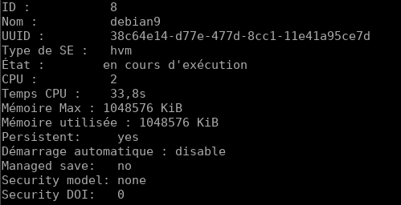

Afficher les informations de la machine (hôte) qui supporte la virtualisation, machine nœud

    nodeinfo

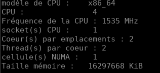

Sortie du mode interactif

    quit

Autres options : `man virsh`  

Liste : `sudo virsh list --all`  
Liste une VM en cours d'exécution : `sudo virsh list`  
Démarrer une VM : `sudo virsh start manjaro-xfce-18`  
Arrêter une VM : `sudo virsh shutdown manjaro-xfce-18`  
Mettre en pause : `sudo virsh suspend manjaro-xfce-18`  
Resume : `sudo virsh resume manjaro-xfce-18`  
Redémarrez (redémarrage sécurisé et en douceur) : `sudo virsh reboot manjaro-xfce-18`  
Réinitialiser (réinitialisation matérielle / non sûre) : `sudo virsh reset manjaro-xfce-18`  
Supprimer entièrement une VM : `sudo virsh undefine manjaro-xfce-18 && sudo virsh destroy manjaro-xfce-18`   

Pour voir une liste complète du type de commande virsh

    virsh help | less
    virsh help | grep reboot

### Pont réseau 

[Network bridge](https://wiki.archlinux.org/title/network_bridge)

#### bridge-utils

Cette section décrit la gestion d'un pont réseau en utilisant l'outil hérité `brctl` du paquetage **bridge-utils**. 

L'utilisation de brctl est dépréciée et est considérée comme obsolète.
{: .prompt-warning }

Créez un nouveau pont :

    brctl addbr nom_du_pont

Ajoutez un périphérique à un pont, par exemple eth0 :

L'ajout d'une interface à un pont fera perdre à l'interface son adresse IP existante. Si vous êtes connecté à distance via l'interface que vous avez l'intention d'ajouter au pont, vous perdrez votre connexion. Ce problème peut être contourné en programmant la création du pont au démarrage du système.
{: .prompt-info }

    brctl addif nom_pont eth0

Affichez les ponts actuels et les interfaces auxquelles ils sont connectés :

    brctl show

Configurer le périphérique du pont :

    ip link set dev nom_pont up

Pour supprimer un pont, vous devez d'abord le mettre hors service :

    ip link set dev nom_du_pont down
    brctl delbr nom_pont

Pour activer la fonctionnalité bridge-netfilter, vous devez charger manuellement le module **br_netfilter** : `modprobe br_netfilter`  
Vous pouvez également charger le module au démarrage.
{: .prompt-warning }

#### Netctl

Assurez-vous que **netctl** est installé.  
Copier :  `cp /etc/netctl/examples/bridge /etc/netctl/bridge-yann`.

Dans cet exemple, nous créons un pont appelé br0 auquel sont connectés un adaptateur Ethernet réel eth0 et (en option) un périphérique tap0. Bien sûr, modifiez br0, eth0 et tap0 selon vos besoins.

    /etc/netctl/bridge

```
Description="Example Bridge connection"
Interface=br0
Connection=bridge
BindsToInterfaces=(eth0 tap0)
IP=dhcp
```

Cet exemple crée un pont statiquement assigné appelé br0 auquel est connecté l'adaptateur Ethernet réel eth0. Modifiez Interface, BindsToInterfaces, Address, et Gateway selon vos besoins.

     /etc/netctl/bridge-yann

```
Description="Static Bridge connection"
Interface=br0
Connection=bridge
BindsToInterfaces=(enp0s31f6)
IP=static
Address=('192.168.0.42/24')
Gateway='192.168.0.254'
DNS=('192.168.0.254')
## Ignore (R)STP and immediately activate the bridge
SkipForwardingDelay=yes
```

>Astuce : Si vous utilisez une IP statique, consultez les pages de manuel de netctl, et modifiez également `/etc/resolv.conf` si nécessaire.

Vous pouvez ponter n'importe quelle combinaison de périphériques réseau en éditant l'option `BindsToInterfaces`.  
Si l'un des périphériques pontés (par exemple eth0, tap0) a activé dhcpcd, arrêtez et désactivez le démon dhcpcd@eth0.service. Ou définissez IP=no dans les profils netctl.

Enfin, démarrez et activez votre `/etc/netctl/bridge`. 

    netctl start bridge-yann
    netctl enable bridge-yann

Vérifier

    ip a

```
1: lo: <LOOPBACK,UP,LOWER_UP> mtu 65536 qdisc noqueue state UNKNOWN group default qlen 1000
    link/loopback 00:00:00:00:00:00 brd 00:00:00:00:00:00
    inet 127.0.0.1/8 scope host lo
       valid_lft forever preferred_lft forever
    inet6 ::1/128 scope host 
       valid_lft forever preferred_lft forever
2: enp0s31f6: <BROADCAST,MULTICAST,PROMISC,UP,LOWER_UP> mtu 1500 qdisc fq_codel master br0 state UP group default qlen 1000
    link/ether 38:d5:47:7c:a0:6c brd ff:ff:ff:ff:ff:ff
    inet6 fe80::3ad5:47ff:fe7c:a06c/64 scope link 
       valid_lft forever preferred_lft forever
3: wlp0s20f0u9: <BROADCAST,MULTICAST> mtu 1500 qdisc noop state DOWN group default qlen 1000
    link/ether 7c:dd:90:5f:68:7b brd ff:ff:ff:ff:ff:ff
4: wg0: <POINTOPOINT,NOARP,UP,LOWER_UP> mtu 1420 qdisc noqueue state UNKNOWN group default qlen 1000
    link/none 
    inet 10.70.39.53/32 scope global wg0
       valid_lft forever preferred_lft forever
    inet6 fc00:bbbb:bbbb:bb01::7:2734/128 scope global 
       valid_lft forever preferred_lft forever
5: br0: <BROADCAST,MULTICAST,UP,LOWER_UP> mtu 1500 qdisc noqueue state UP group default qlen 1000
    link/ether 9a:87:46:a3:88:b9 brd ff:ff:ff:ff:ff:ff
    inet 192.168.0.42/24 brd 192.168.0.255 scope global br0
       valid_lft forever preferred_lft forever
    inet6 2a01:e0a:2de:2c70:9887:46ff:fea3:88b9/64 scope global dynamic mngtmpaddr 
       valid_lft 86363sec preferred_lft 86363sec
    inet6 fe80::9887:46ff:fea3:88b9/64 scope link 
       valid_lft forever preferred_lft forever
```

#### NetworkManager

Les connexions actives

    nmcli con show

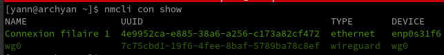

J'ai une «Connexion filaire 1» qui utilise l'interface Ethernet **enp0s31f6**. Mon système dispose également d'une interface XWireguard. Je vais configurer une interface de pont nommée br0 et ajouter (ou asservir) une interface à enp0s31f6.

**Créer un pont nommé br0 ou bridge-br0**

    sudo nmcli con add ifname br0 type bridge con-name br0
    sudo nmcli con add ifname br0 type bridge con-name bridge-br0

```
Connexion « br0 » (06d83330-144a-4c53-a56a-cafeff52a9a0) ajoutée avec succès.
```

    sudo nmcli con add type bridge-slave ifname enp0s31f6 master br0

```
Connexion « bridge-slave-enp0s31f6 » (7a5b8ba6-3a28-47d8-8894-5f164f3cd371) ajoutée avec succès.
```

br0

    nmcli connection show

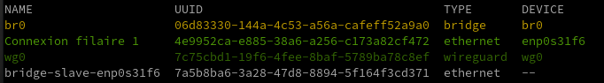

bridge-br0

    nmcli connection show

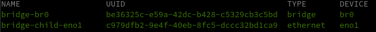

**Désactiver STP**

    sudo nmcli con modify br0 bridge.stp no
    nmcli -f bridge con show br0

```
bridge.mac-address:                     --
bridge.stp:                             non
bridge.priority:                        32768
bridge.forward-delay:                   15
bridge.hello-time:                      2
bridge.max-age:                         20
bridge.ageing-time:                     300
bridge.group-forward-mask:              0
bridge.multicast-snooping:              oui
bridge.vlan-filtering:                  non
bridge.vlan-default-pvid:               1
bridge.vlans:                           --
```

**Activer l'interface pont**

Vous devez désactiver "Connexion filaire 1" et activer br0: 

    sudo nmcli con down "Connexion filaire 1"
    sudo nmcli con up br0

PATIENTER de 20 à 30 secondes

    nmcli con show

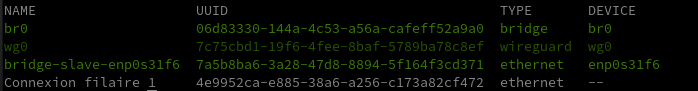

Vérifier

    ip a

```
1: lo: <LOOPBACK,UP,LOWER_UP> mtu 65536 qdisc noqueue state UNKNOWN group default qlen 1000
    link/loopback 00:00:00:00:00:00 brd 00:00:00:00:00:00
    inet 127.0.0.1/8 scope host lo
       valid_lft forever preferred_lft forever
    inet6 ::1/128 scope host 
       valid_lft forever preferred_lft forever
2: enp0s31f6: <BROADCAST,MULTICAST,UP,LOWER_UP> mtu 1500 qdisc fq_codel master br0 state UP group default qlen 1000
    link/ether 38:d5:47:7c:a0:6c brd ff:ff:ff:ff:ff:ff
3: wg0: <POINTOPOINT,NOARP,UP,LOWER_UP> mtu 1420 qdisc noqueue state UNKNOWN group default qlen 1000
    link/none 
    inet 10.14.94.3/32 scope global wg0
       valid_lft forever preferred_lft forever
    inet6 fd18:2941:ae9:7d96::3/128 scope global 
       valid_lft forever preferred_lft forever
4: br0: <BROADCAST,MULTICAST,UP,LOWER_UP> mtu 1500 qdisc noqueue state UP group default qlen 1000
    link/ether 02:59:72:85:78:97 brd ff:ff:ff:ff:ff:ff
    inet 192.168.0.43/24 brd 192.168.0.255 scope global dynamic noprefixroute br0
       valid_lft 42963sec preferred_lft 42963sec
    inet6 2a01:e34:eebf:df0:b50d:862:e7a:25dc/64 scope global dynamic noprefixroute 
       valid_lft 86165sec preferred_lft 86165sec
    inet6 fe80::bcd4:8ecb:cdd6:5d63/64 scope link noprefixroute 
       valid_lft forever preferred_lft forever
```

#### iproute2

Cette section décrit la gestion d'un pont réseau à l'aide de l'outil ip du paquetage **iproute2**, qui est requis par le paquetage meta de base.

Créez un nouveau pont et changez son état à up :

    ip link add name bridge_name type bridge
    ip link set dev bridge_name up

Pour ajouter une interface (par exemple eth0) dans le pont, son état doit être up :

    ip link set eth0 up

L'ajout de l'interface dans le pont se fait en définissant son maître à bridge_name :

    ip link set eth0 master bridge_name

Pour afficher les ponts existants et les interfaces associées, utilisez l'utilitaire bridge (qui fait également partie d'iproute2).

    bridge link

Voici comment supprimer une interface d'un pont :

    ip link set eth0 nomaster

L'interface sera toujours active, donc vous pouvez aussi vouloir la mettre hors service :

    ip link set eth0 down

Pour supprimer un pont, utilisez la commande suivante :

    ip link delete bridge_name type bridge

Cela supprimera automatiquement toutes les interfaces du pont. Les interfaces esclaves resteront cependant actives, vous pouvez donc les mettre hors service par la suite. 

Création d'un second pont réseau avec la connexion liée à la 4G via enp3s0f0  
En mode su

```shell
ip link add name br1 type bridge
ip link set dev br1 up
ip link set eth0 up  # si interface non active
ip link set enp3s0f0 master br1
```

Afficher les ponts existants

    bridge link

```
2: enp3s0f0: <BROADCAST,MULTICAST,UP,LOWER_UP> mtu 1500 master br1 state forwarding priority 32 cost 5 
3: enp0s31f6: <BROADCAST,MULTICAST,UP,LOWER_UP> mtu 1500 master br0 state forwarding priority 32 cost 100 
```

### Pont réseau virtuel (virsh net)

**Les commandes `virsh` en mode su**

Déclarer le pont (bridge) à KVM.  
Créer un fichier de définition de réseau au format XML :

    nano host-bridge.xml

```xml
<network>
  <name>host-bridge</name>
  <forward mode="bridge"/>
  <bridge name="br0"/>
</network>
```

Appliquer la configuration :

```shell
virsh net-define host-bridge.xml # -> Réseau host-bridge défini depuis host-bridge.xml
virsh net-start host-bridge # -> Réseau host-bridge démarré
virsh net-autostart host-bridge # -> Réseau host-bridge marqué en démarrage automatique
```

Vérification

    virsh net-list --all

```
 Nom           État      Démarrage automatique   Persistent
-------------------------------------------------------------
 host-bridge   actif     Oui                     Oui
```

Personnaliser sa configuration réseau

    sudo virsh net-edit host-bridge

### Connexion hyperviseur qemu

    sudo virsh -c qemu:///system

```
Bienvenue dans virsh, le terminal de virtualisation interactif.

Taper :  « help » pour l'aide ou « help » avec la commande
         « quit » pour quitter

virsh # 
```

### Liste VM

Liste des machines (actives ou non)

    sudo virsh list --all

```
 ID    Nom                            État
----------------------------------------------------
 -     debian9                        fermé
```


###  Créer, démarrer et arrêter une VM 

Créer une machine virtuelle **manjaro-xfce** avec 2000 Mo de RAM (2Go), 1 CPU core, 10 Go Hdd.

```
sudo virt-install --name manjaro-xfce-18 \
--ram=2000 \
--vcpus=1 \
--cpu host \
--network network=default \
--disk path=/srv/data/virtuel/images/manjaro-xfce-18-vm1,size=10 \
--cdrom /srv/data/virtuel/boot/manjaro-xfce-18.0.4-stable-x86_64.iso \
--graphics vnc

```

Veuillez vous assurer d'avoir manjaro-xfce-18 ISO image dans le chemin **/var/lib/libvirt/boot/** ou tout autre chemin que vous avez donné dans la commande ci-dessus.

Décomposons la commande ci-dessus et voyons ce que chaque option fait.

*    **-name** : Cette option définit le nom du nom virtuel. Dans notre cas, le nom de VM est Ubuntu-16.04.
*    **-ram=512** : Affecte 512 Mo de RAM à la VM.
*    **-vcpus=1** : Indique le nombre de cœurs CPU dans la VM.
*    **-cpu host** : Optimise les propriétés du CPU pour la VM en exposant la configuration du CPU de l'hôte à l'invité.
*    **-hvm** : Demande la virtualisation complète du matériel.(Non Utilisé)
*    **--network** : Réseau par défaut
*    **-disk path** : L'emplacement pour sauvegarder le hdd et la taille de la machine virtuelle. Dans notre exemple, j'ai alloué une taille de hdd de 8 Go.
*    **-cdrom** : L'emplacement de l'image ISO de l'installateur. Veuillez noter que vous devez avoir l'image ISO actuelle à cet endroit.
*    **-graphics vnc** : Permet à la VNC d'accéder à la VM depuis un client distant.

Le déroulement

```
WARNING  No operating system detected, VM performance may suffer. Specify an OS with --os-variant for optimal results.
WARNING  Unable to connect to graphical console: virt-viewer not installed. Please install the 'virt-viewer' package.
WARNING  No console to launch for the guest, defaulting to --wait -1

Starting install...
Allocating 'manjaro-xfce-18-vm1'                                            |  10 GB  00:00:00     
Domain installation still in progress. Waiting for installation to complete.
```

>**ATTENTION!!!**  
*Rien n'est apparu parce que vous avez lancé virt-install sur un terminal qui n'avait pas d'information d'affichage X disponible, donc il ne pouvait pas démarrer virt-viewer pour afficher la console de la machine virtuelle.  
Éventuellement, l'installation de la VM sera terminée et la VM s'éteindra. A ce stade, virt-install redémarrera la VM et quittera elle-même. Vous pouvez également appuyer sur Ctrl+C pour arrêter l'attente de l'installation virt-install. Comme la VM est toujours en cours d'exécution, l'installation se poursuivra, mais la VM restera éteinte à la fin, plutôt que de redémarrer dans le système nouvellement installé.  
Vous pouvez également utiliser virt-manager sur votre système local pour visualiser la console de la VM pendant l'installation, si virt-manager a la permission de gérer l'hyperviseur distant.*

**Démarrer une VM**

    sudo virsh start debian9
        Domaine debian9 démarré

**Arrêter une VM**

    sudo virsh shutdown debian9
         Le domaine debian9 est en cours d'arrêt


**Démarrage automatique des machines virtuelles**

Préalable, le service libvirtd doit être actif

    sudo systemctl enable libvirtd

Si une <u>machine virtuelle est configurée avec libvirt</u>, elle peut être configurée avec **virsh autostart** ou via l'interface graphique du gestionnaire de virt (vmm, virt-manager) pour démarrer au démarrage de l'hôte en allant dans les **Options de démarrage** de la machine virtuelle et en sélectionnant *"Démarrer la machine virtuelle au démarrage de l'hôte"*.

### Sauvegarde config VM (xml)

Sauvegarder la configuration de la machine virtuelle **debian9**, vous devez sortir du mode interactif avant de saisir

    sudo virsh -c qemu:///system dumpxml debian9 > /tmp/Newdebian9.xml

### Création Modification VM (xml)

Vous pouvez ainsi facilement modifier le fichier XML et créer une nouvelle machine à partir de ces modifications  
Plus d’info sur le format XML sur <http://libvirt.org/format/>

pour <u>définir</u> une machine virtuelle à partir d’un fichier XML

    sudo virsh define winten.xml

Doit renvoyer le message  

    Domain 'win10' defined from winten.xml

pour <u>créer et lancer</u> une machine virtuelle à partir d’un fichier XML

    sudo virsh create winten.xml

Doit renvoyer le message  

    Domain 'win10' created from winten.xml

### Gestion distante via VMM + SSH 

Client test

La boîte de dialogue de l'interface graphique du gestionnaire de virt n'a pas la possibilité de spécifier un port ssh autre que par défaut ou la clé privée à utiliser lors de la connexion au serveur distant, mais cela se fait facilement en démarrant virt-manager avec le paramètre '-c'.

    virt-manager -c 'qemu+ssh://myuser@192.168.1.139:2222/system?keyfile=id_rsa'

Dans l'exemple ci-dessus, nous nous connectons en tant que'myuser' au port d'écoute ssh non par défaut de 2222, et utilisons la clé privée trouvée dans le répertoire courant du fichier'id_rsa'.

virt-manager devrait vous demander immédiatement la phrase de chiffrement protégeant la clé privée (ce n'est pas le mot de passe de l'utilisateur !), et une fois que vous l'aurez entré, vous verrez virt-manager comme si vous étiez assis sur l'hôte KVM localement.

Notre configuration

    virt-manager -c 'qemu+ssh://admbust@xoyize.xyz:55035/system?keyfile=/home/yannick/.ssh/vbox-srvbust-ed25519'

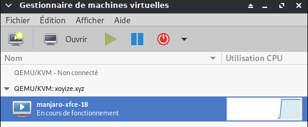

### Gestion distante via client VNC

Se connecter via SSH au  serveur de virtualisation 

    ssh admbust@xoyize.xyz -p 55035 -i /home/yannick/.ssh/vbox-srvbust-ed25519

*admbust est le nom d'utilisateur du serveur debian buster*

Exécutez la commande suivante pour connaître le numéro de port VNC. Nous en avons besoin pour accéder au Vm à partir d'un système distant.

    sudo virsh dumpxml manjaro-xfce-18 |grep vnc

Sortie de l'échantillon :

`<graphics type='vnc' port='5900' autoport='yes' listen='127.0.0.1'>`

>Notez le numéro de port 5900. Installez n'importe quelle application client VNC. 

Pour ce guide, j'utiliserai TigerVnc. TigerVNC est disponible dans les dépôts par défaut d'Arch Linux. Pour l'installer sur des systèmes basés sur Arch, exécutez :

    sudo pacman -S tigervncnc

Tapez la commande de transfert de port SSH suivante à partir de votre système client distant sur lequel l'application client VNC est installée.

    ssh -L 5900:127.0.0.0.1:5900 sk@192.168.225.22 

Encore une fois, 192.168.225.22 est l'adresse IP de mon serveur Ubuntu (serveur de virtualisation).  

Avec le serveur xoyize.yz

    ssh -L 5900:127.0.0.1:5900 admbust@xoyize.xyz -p 55035 -i /home/yannick/.ssh/vbox-srvbust-ed25519


Ensuite, ouvrez le client VNC à partir de votre client Arch Linux.

Tapez localhost:5900 dans le champ Serveur VNC et cliquez sur le bouton Connecter.  
En ligne de commande

    vncviewer -x11cursor localhost::5900

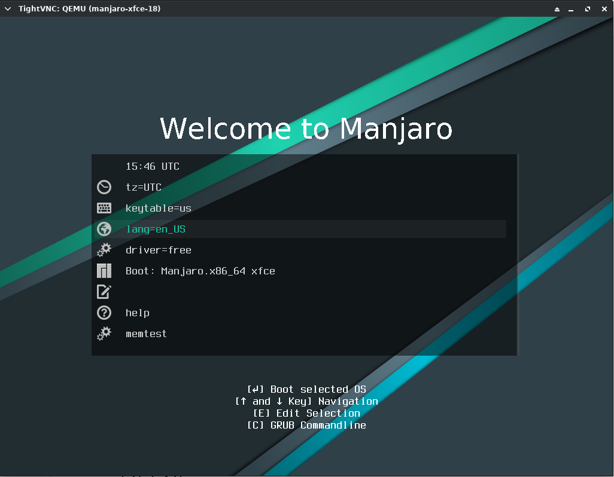{:width="600"}

Commencez ensuite à installer la VM Manjaro comme vous le faites dans le système physique.

De même, vous pouvez configurer autant de machines virtuelles en fonction des spécifications matérielles du serveur.

Vous pouvez également utiliser l'utilitaire **virt-viewer** pour installer le système d'exploitation dans les machines invitées. virt-viewer est disponible dans la plupart des dépôts par défaut de la distribution Linux. Après avoir installé virt-viewer, exécutez la commande suivante pour établir l'accès VNC à la VM.

    sudo virt-viewer --connect=qemu+ssh://admbust@xoyize.xyz:55035/system?keyfile=/home/yannick/.ssh/vbox-srvbust-ed25519 --name manjaro-xfce-18

### Instantané - Snapshot

#### Instantanés LVM

Les instantanés LVM ont pour but de faciliter le rétablissement d'une version antérieure de l'état des fichiers sur un volume logique. Les volumes LVM sont créés à partir d'un groupe de volumes qui représente la quantité totale d'espace disponible.  
Avant de créer un instantané LVM, vous devez vous assurer qu'un espace disque suffisant est disponible dans le groupe de volumes.  
Pour créer un instantané, la procédure est simple ; il suffit d'exécuter la commande   

    lvcreate -s -n monvolume_snap -L 10G monvolumeoriginal  

Pour créer un instantané fiable, veillez à arrêter préalablement la machine virtuelle (VM, Virtual Machine).

#### Instantanés via libvirt - Avantage

KVM propose une méthode de substitution pour créer des instantanés via libvirt. Libvirt est l'interface d'administration de KVM. Créer des instantanés avec libvirt constitue une meilleure approche car il s'agit d'une solution native.  
Libvirt prend un instantané de l'intégralité de la VM, contrairement aux instantanés LVM qui ne sauvegardent qu'un seul disque.

Pour créer un instantané libvirt, utilisez la commande `virsh snapshot-create`  
Cette commande repose sur un fichier XML qui contient la définition de la VM originale. La commande virsh lit le contenu de ce fichier pour identifier la VM d'origine (telle que spécifiée dans la section `<name>` du fichier XML) et les disques à utiliser.

Le fichier XML peut être soit celui qui définit la VM originale, soit un fichier XML personnalisé ne contenant qu'une partie de la configuration de la VM. Vous pouvez ainsi créer un fichier XML qui ne contient que certains des disques utilisés par la VM. Utilisez par exemple la commande 

    virsh snapshot-create mondomaine-snap mondomaine.xml 

pour créer un instantané appelé **mondomaine-snap** qui repose sur le fichier de configuration **mondomaine.xml**.

En termes de création d'instantanés KVM, le véritable avantage de la commande virsh tient au modificateur `--live`  
Cette option vous permet de prendre un instantané d'une VM en fonctionnement (« en ligne »).  
Lorsque vous l'utilisez, testez systématiquement votre instantané ; en effet, certaines charges de travail n'acceptent pas à chaud les instantanés.  
De même, ne perdez pas de vue qu'un instantané KVM sera plus volumineux car il intègre également l'image de la mémoire.

Une fois l'instantané KVM créé à l'aide de la commande virsh, vous pouvez revenir à celui-ci au moyen de la commande `snapshot-revert nom_vm`

Par exemple, la commande `snapshot-revert mavm --current` rétablit le dernier instantané enregistré de la VM. Vous pouvez également spécifier le nom d'un instantané particulier à rétablir au moyen d'une commande telle que `virsh snapshot-revert mavm mavm-snapshot` 

Si la vieille méthode qui consiste à utiliser des volumes de stockage LVM fonctionne toujours, elle n'en nécessite pas moins l'arrêt de la VM au moment de créer l'instantané et ne tient pas non plus compte des métadonnées de cette VM. C'est pourquoi, même si LVM fonctionne encore dans les environnements KVM modernes, il est sans doute préférable de réaliser un instantané KVM avec la commande virsh de libvirt.

## Gestion Machines Virtuelles (graphique)

### Vérifier installation QEMU/KVM 

Ouvrez maintenant l'application "virt-manager" à partir de votre menu d'application.

Cliquez sur le menu **"Edition -> Détails de la connexion"** sur l'application virt-manager.  
Sur l'onglet **"Affichage"** vous verrez que le virt-manager se connectera automatiquement à `"qemu:///system"`  
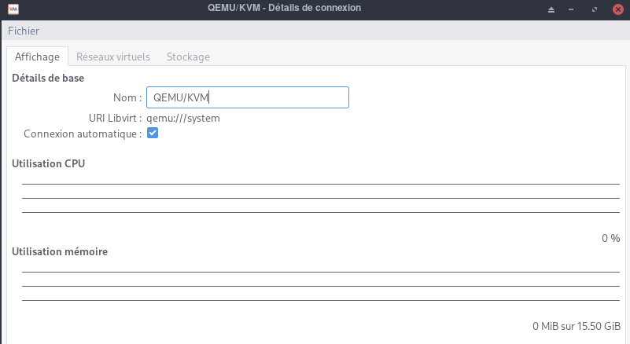  
virt-manager se connectera automatiquement à QEMU/KVM dans le système.

Allez dans l'onglet **"Réseaux virtuels"** et vous verrez la configuration réseau "par défaut"  
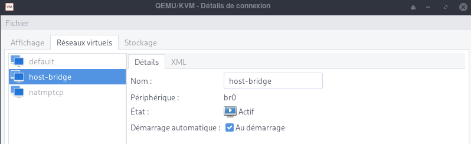  

Préférences , aller dans **"Edition -> Preferences"**  et activer **Enable xml editing**  
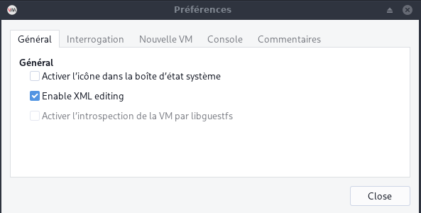  

### Gestion réseau 

**Créer et configurer une passerelle réseau pour KVM**  
Le pont Linux, lorsqu'il est utilisé dans KVM, permet à une machine virtuelle d'accéder à un réseau et à des services externes en dehors de l'environnement virtuel.

Il existe différentes façons de configurer le Bridge Networking sous Linux pour une utilisation en KVM. Le réseau par défaut utilisé par une machine virtuelle lancée dans KVM est le réseau NAT. Avec le réseau NAT, un réseau virtuel est créé pour les machines invitées qui est ensuite mis en correspondance avec le réseau hôte pour fournir une connectivité internet.

Lorsque vous configurez et utilisez la mise en réseau pontée, les systèmes d'exploitation invités accèdent à un réseau externe connecté directement à la machine hôte. Un pont peut être créé soit à l'aide du **gestionnaire de machines virtuelles**, soit à l'aide de l'outil de ligne de commande **virsh**, soit en éditant directement des scripts réseau, soit en utilisant les outils de gestion de réseau Linux.

### Création passerelle réseau

Ouvrez le **Gestionnaire de machines virtuelles**, puis allez dans   
Édition &rarr; Détails de la connexion &rarr; Réseaux virtuels 

Configurez une nouvelle interface réseau en cliquant sur le + en bas de la fenêtre. Donnez un nom au réseau virtuel.  
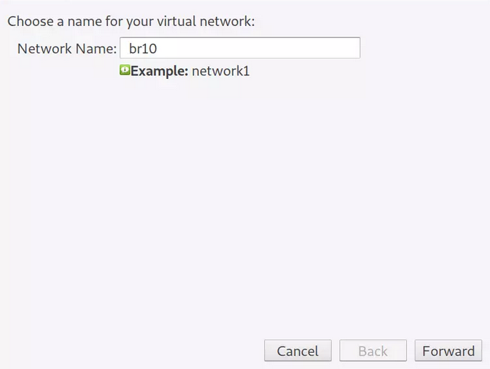{:width="300"}

Cliquez sur le bouton "Forward", dans la fenêtre suivante, fournissez des informations sur le réseau virtuel.  
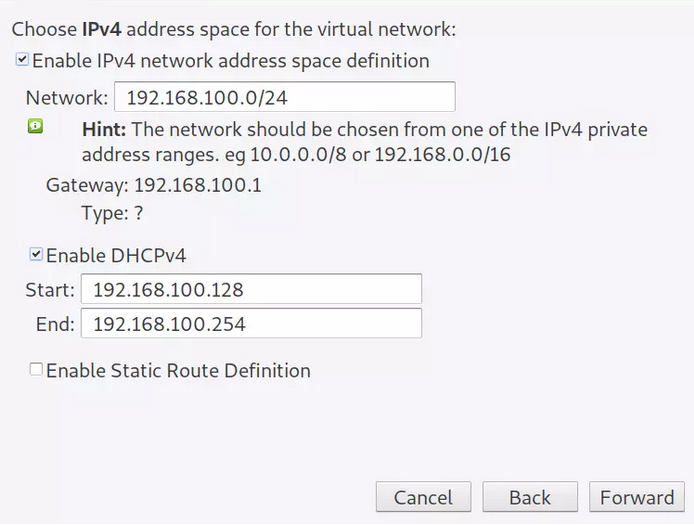{:width="300"}

Cliquez sur "Forward" et choisissez si vous souhaitez activer l'IPv6.  
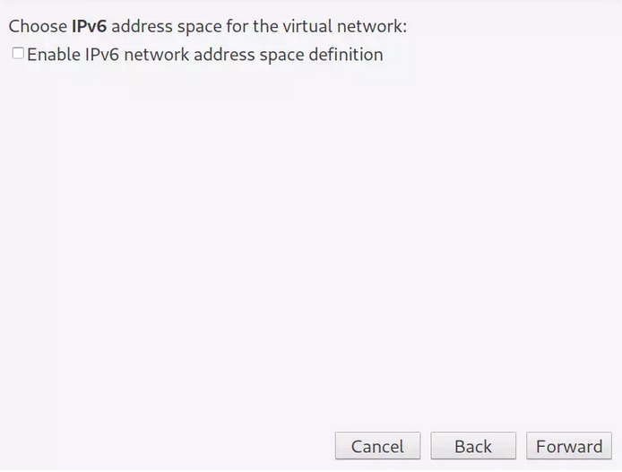{:width="300"}

Sélectionnez le type de réseau et la politique de transfert.  
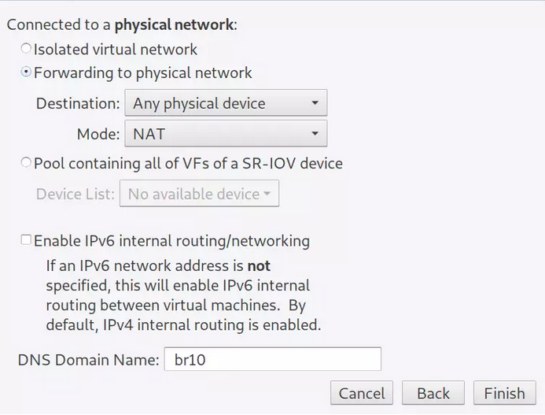{:width="300"}

Terminez le paramétrage et enregistrez vos configurations. Le nouveau réseau virtuel devrait s'afficher sur la page d'aperçu.  
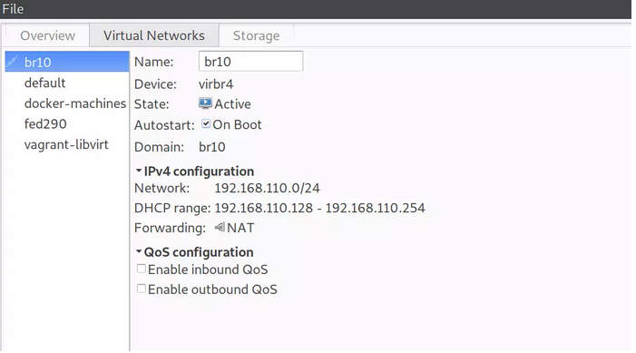{:width="300"}


Un pont sur le système hôte est automatiquement créé pour le réseau.

    brctl show virbr4      

```
bridge name	bridge id		STP enabled	interfaces
virbr4		8000.525400c2410a	yes		virbr4-nic
```

### Créer et démarrer une VM

Démarrer l'application graphique **Gestionnaire de machines virtuelles**   
Il faut au préalable vérifier si le réseau est actif  
Edition &rarr; Détails de la connexion : Réseaux Virtuels   
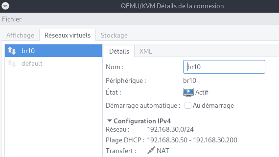{:width="300"}

Si la fenêtre est vide  
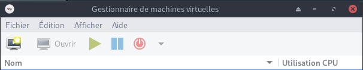   
Fichier &rarr; +Ajouter une connexion  
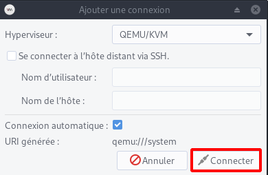   
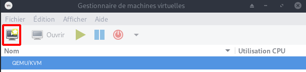   

Le bouton *Nouveau* permet de lancer l'assistant de création  
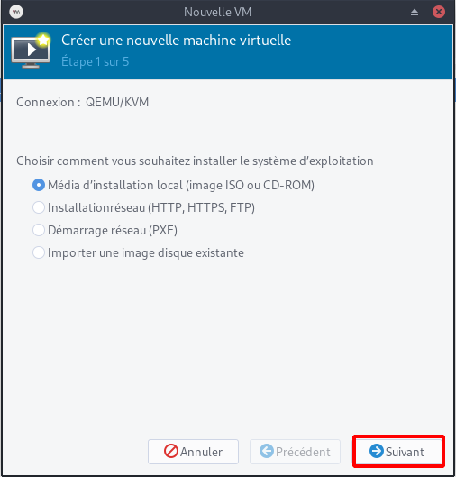

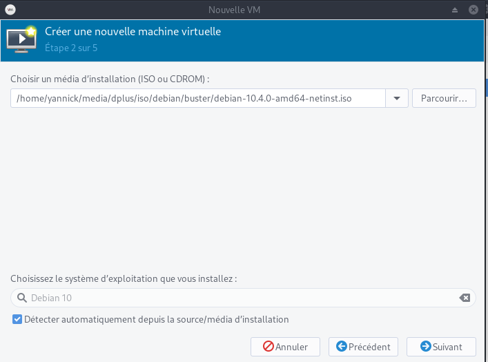

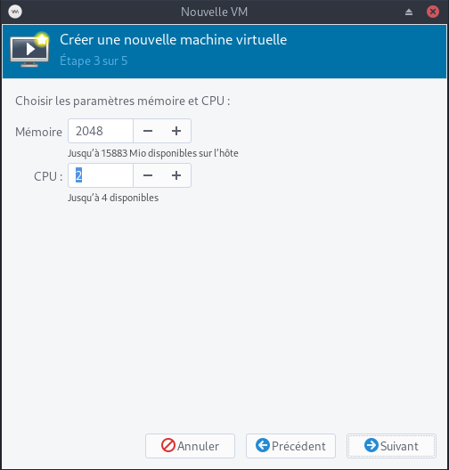

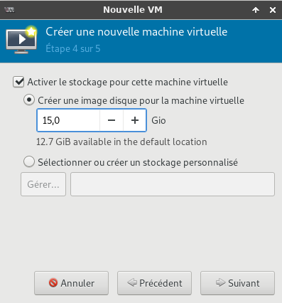

Machine virtuelle **/home/yannick/virtuel/KVM/debian10.qcow2**

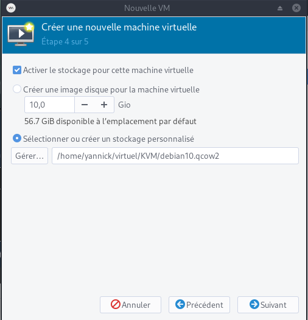

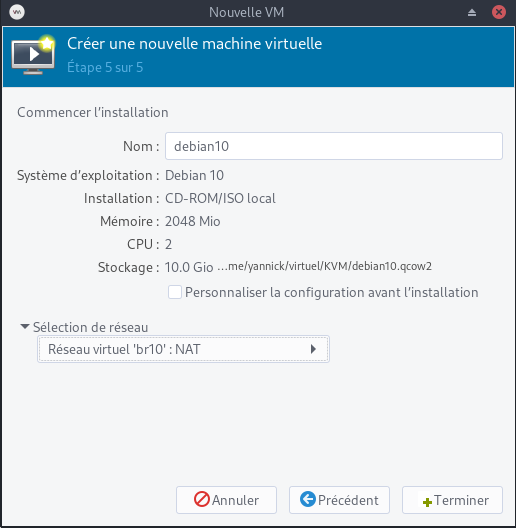

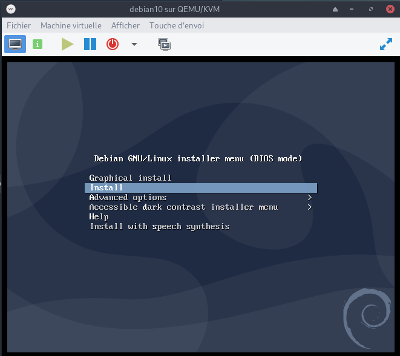


Dans les utilisations suivantes, si rien n'est activé automatiquement, il faut exécuter les commandes suivantes  

```shell
sudo -s
# translation d'adresse (NAT) pour permettre au VM de sortir sur Internet
echo 1 > /proc/sys/net/ipv4/ip_forward  
# lancer le service libvirtd pour l'application graphique
systemctl start libvirtd
```

Démarrer l'application graphique **Gestionnaire de machines virtuelles**   

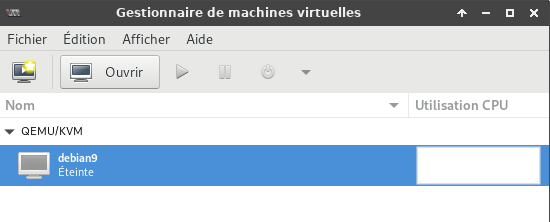

Le démarrage de la machine virtuelle provoque une erreur (réseau non actif)

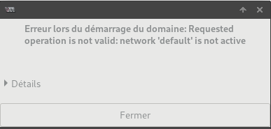

Cliquer sur *Edition* puis *Détails de la connexion*

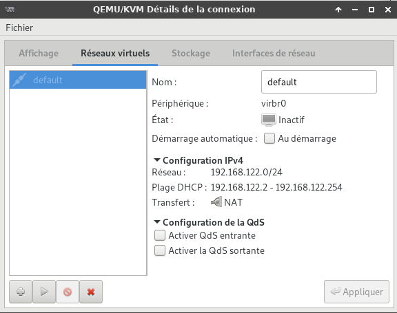

Cliquer sur l'icône *Démarrer le réseau* pour l'activer

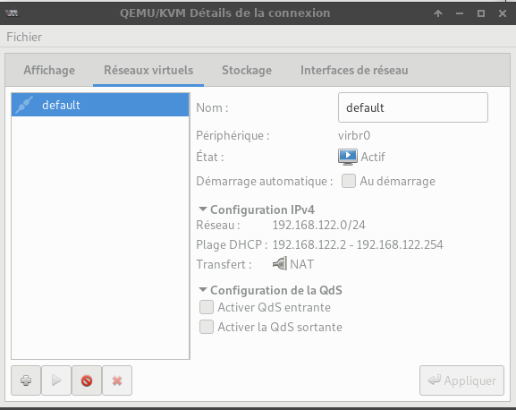

Pour modifier les paramètres de la machine virtuelle, cliquer sur *Edition* puis *Détails de la machine virtuelle*

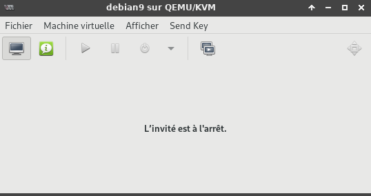

Cliquer sur l'icône *Démarrer la machine virtuelle* de la fenêtre **"Gestionnaire de machines virtuelles"**

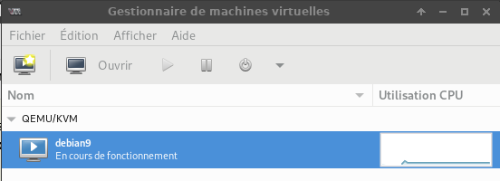

Puis cliquer sur *Afficher* et sélectionner *Détails*  
Après une installation utilisant le CD et un fichier ISO, il faut le déconnecter  
Sélectionner **IDE CD-ROM** puis clique sur **Déconnecter** 

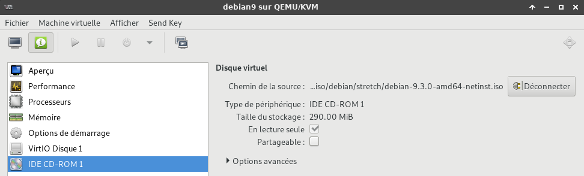

Cliquer sur l'icône *Démarrer la machine virtuelle* puis sur l'icône *Afficher la console graphique*

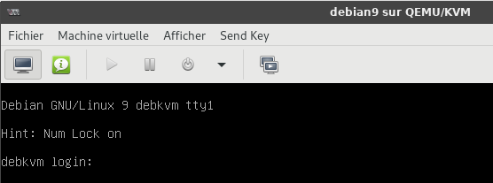

## Partage de fichiers 

*entre l'hôte et les invités dans qemu/kvm*

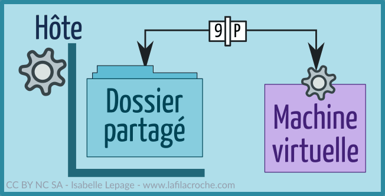{:width="200px"}  
[9p, l'autre pays du partage](https://www.lafilacroche.com/post/partage-9p-entre-hote-et-invite-avec-virt-manager-et-debian)

### Hôte

Créer un dossier de partage sur l'hôte. 

    mkdir $HOME/qemu-share

Les droits en lecture/écriture pour le propriétaire et le groupe du dossier

    chmod 775 -R $HOME/qemu-share

Dans le fichier **/etc/libvirt/qemu.conf**, chercher les lignes suivantes :

```
#user = "root"
#group = "root"
```

Et remplacer par :

```
user = "utilisateur"
group = "groupe"
```

**utilisateur** et **groupe** sont remplacés par ceux du dossier que l'on veut partager sur la machine hôte et supprimer le # en début de ligne.

Redémarrer le service libvirtd pour que ces modifications soient prises en compte:

    systemctl restart libvirtd

*Cela va permettre à la machine virtuelle d'écrire dans le dossier partagé avec l'identité de notre utilisateur plutôt qu'avec l'identité Libvirt Qemu paramétrée par défaut. Ainsi notre utilisateur aura accès aux fichiers créés par le serveur situé sur la VM et pourra les modifier sans souci.*

Dans **virt-manager**,  **"Edition" -> "Détails de la machine virtuelle"**  et dans les informations de la machine (icône "Afficher les détails du matériel virtuel") ,cliquer sur "Ajouter un matériel", puis sur "Système de fichiers".Modifier suivant le modèle ci-dessous.

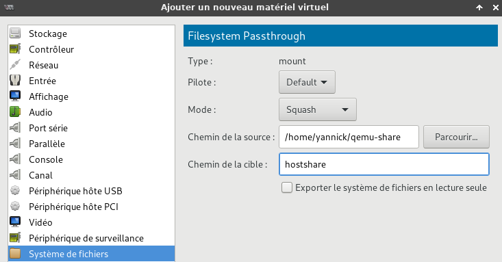

Pilote = **default**  
Mode = **Squash**  
Chemin source : il s'agit du dossier crée précédemment sur l'hôte **/home/yannick/qemu-share**  
Chemin cible : un nom au choix, par exemple : **hotshare**  

### Invité (VM)

Démarrer la VM et ouvrir un terminal.  
Créer le répertoire de montage du système de fichiers

    mkdir $HOME/share

Montage manuel du système de fichiers. 

    sudo mount -t 9p -o trans=virtio,version=9p2000.L,rw hostshare $HOME/share

Montage automatique au démarrage ajout de la ligne suivante au fichier **/etc/fstab**

```
hostshare /home/utilisateur/share 9p rw,relatime,sync,dirsync,trans=virtio,version=9p2000.L	 0   2
```

Montage

    sudo mount -a

>*Le partage ne peut pas être monté et édité sur plusieurs hôtes en même temps. Assurez-vous donc de le démonter avant de le monter sur un autre hôte invité.*


## Annexe

### Arrêt VM avant extinction hôte

*paramètres du service libvirt-guests pour permettre l'arrêt gracieux des invités*

* [Arrêt en douceur des machines virtuelles lorsque la machine hôte est bloquée, mise hors tension ou redémarrée](/posts/Qemu_KVM-libvirt-guests-arret-VM-en-douceur/)

### VMM - Plein écran ou pas 

Pour quitter le mode fullscreen de virt-manager, il suffit de déplacer la souris en haut de l'écran et au centre. Une barre blanche permet de faire apparaître deux icônes.

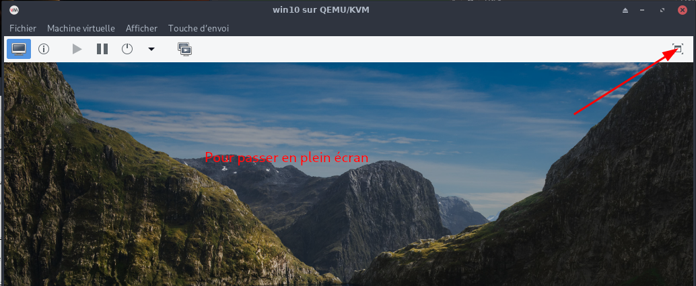  


### Cas des images créées via qemu

#### Créer image via qemu

    qemu-img create -f qcow2 /var/lib/libvirt/images/DOMAIN.img 20G

* **-f** &rarr; format de KVM pour le fichier image, qcow2 est le format kvm par défaut, raw est compatible avec Virtualbox et VMware
* **20G** &rarr; Remplacer par la valeur souhaitée, ce sera la taille du disque dur virtuel

#### Booter sur une ISO et installer l’OS via KVM dans l'image précédemment créée

    kvm -m 1024 -cdrom /CHEMIN_VERS_VOTRE_ISO -boot d /var/lib/libvirt/images/DOMAINE.img

* **-m 1024** &rarr; La quantité de ram allouée
* **-cdrom** &rarr; spécifie le chemin vers votre ISO
* **-boot d** &rarr; spécifie sur quelle domaine booter, un système émulé s’appelle domaine, remplacer DOMAINE par un titre parlant par exemple DebianVM

#### Booter simplement sur l’OS fraîchement installé directement via KVM 

    kvm -boot -d /var/lib/libvirt/images/DOMAINE.img

>**Attention** en utilisant KVM directement et non avec **libvirt**, <u>les machines virtuelles ne seront pas listés avec virtmanager ou la commande</u> : `virsh list`

#### Import machine créée via "qemu" pour gestion avec "virt-manager"  libvirt 

Si vous avez déjà créé précédemment une machine virtuelle avec **qemu** vous pouvez importer cette machine virtuelle pour qu'elle soit gérée via **virt-manager** et par conséquent qu'elle utilise **libvirt**.  

Par exemple, si vous avez une image qui se trouve dans **/srv/vms/Fedora12.img**, effectuez ces opérations:

    sudo virt-install --import --disk path=/srv/vms/Fedora12.img --os-type linux --os-variant fedora11 --ram 512 --name Fedora12

Si vous désirez utiliser la gestion de l'accélération (c'est à dire, de passer par kvm et non pas qemu seulement):

    sudo virt-install --import --accelerate --disk path=/srv/vms/Fedora12.img --os-type linux --os-variant fedora11 --ram 512 --name Fedora12

* Les options *--name*, *--ram* sont obligatoires. 
* Les options *--os-type* et *--os-variant* ne sont pas obligatoires mais permettent tout de même une meilleure gestion pour le démarrage et mémoire au boot.

Pour les machines virtuelles Windows, c'est toujours aussi simple:

    sudo virt-install --import --accelerate --disk path=/srv/vms/WinXP.img --os-type windows --os-variant winxp --ram 512 --name WindowXP

Aussitôt la génération de la configuration effectuée, la machine va démarrer. Elle apparait alors dans **virt-manager**. 

## LXC

### Conteneurs privilégiés ou non privilégiés

*Les LXC peuvent être configurés pour fonctionner dans des configurations privilégiées ou non privilégiées.*

En général, l'<u>exécution d'un conteneur non privilégié est considérée comme plus sûre</u> que l'exécution d'un conteneur privilégié, car les conteneurs non privilégiés ont un degré d'isolation accru en vertu de leur conception. L'élément clé est le mappage de l'UID racine dans le conteneur à un UID non racine sur l'hôte, ce qui rend plus difficile pour un piratage à l'intérieur du conteneur d'entraîner des conséquences sur le système hôte. En d'autres termes, si un attaquant parvient à s'échapper du conteneur, il devrait se retrouver avec des droits limités ou nuls sur l'hôte.

Les paquets du noyau Arch linux, **linux-lts** et **linux-zen** fournissent actuellement un support prêt à l'emploi pour les conteneurs non privilégiés. De même, avec le paquetage **linux-hardened**, les conteneurs non privilégiés ne sont disponibles que pour l'administrateur système ; avec des modifications supplémentaires de la configuration du noyau nécessaires, car les espaces de noms d'utilisateurs y sont désactivés par défaut pour les utilisateurs normaux.

Cet article contient des informations permettant aux utilisateurs d'exécuter l'un ou l'autre type de conteneur, mais des étapes supplémentaires peuvent être nécessaires pour utiliser les conteneurs non privilégiés.

Un exemple pour illustrer les conteneurs non privilégiés

Pour illustrer la puissance du mappage d'UID, considérez la sortie ci-dessous d'un conteneur non privilégié en cours d'exécution. Nous y voyons les processus conteneurisés appartenant à l'utilisateur root du conteneur dans la sortie de ps :

```
[root@unprivileged_container /]# ps -ef | head -n 5
UID        PID  PPID  C STIME TTY          TIME CMD
root         1     0  0 17:49 ?        00:00:00 /sbin/init
root        14     1  0 17:49 ?        00:00:00 /usr/lib/systemd/systemd-journald
dbus        25     1  0 17:49 ?        00:00:00 /usr/bin/dbus-daemon --system --address=systemd: --nofork --nopidfile --systemd-activation
systemd+    26     1  0 17:49 ?        00:00:00 /usr/lib/systemd/systemd-networkd```

Sur l'hôte, cependant, ces processus racine conteneurisés sont en fait exécutés sous l'utilisateur mappé (ID>100000), plutôt que sous l'utilisateur **root** réel de l'hôte : 

```
[root@host /]# lxc-info -Ssip --name sandbox
State:          RUNNING
PID:            26204
CPU use:        10.51 seconds
BlkIO use:      244.00 KiB
Memory use:     13.09 MiB
KMem use:       7.21 MiB

[root@host /]# ps -ef | grep 26204 | head -n 5
UID        PID  PPID  C STIME TTY          TIME CMD
100000   26204 26200  0 12:49 ?        00:00:00 /sbin/init
100000   26256 26204  0 12:49 ?        00:00:00 /usr/lib/systemd/systemd-journald
100081   26282 26204  0 12:49 ?        00:00:00 /usr/bin/dbus-daemon --system --address=systemd: --nofork --nopidfile --systemd-activation
100000   26284 26204  0 12:49 ?        00:00:00 /usr/lib/systemd/systemd-logind
```

### Activer le support pour exécuter des conteneurs non privilégiés (facultatif)

Modifiez `/etc/lxc/default.conf` pour qu'il contienne les lignes suivantes :

```
lxc.idmap = u 0 100000 65536
lxc.idmap = g 0 100000 65536
```

En d'autres termes, mappez une plage de 65536 uids consécutifs, en partant de l'uid 0 côté conteneur, qui sera l'uid 100000 du point de vue de l'hôte, jusqu'à l'uid 65535 côté conteneur inclus, que l'hôte connaîtra comme l'uid 165535. Appliquez ce même mappage aux gids.

Créez `/etc/subuid` et `/etc/subgid` pour contenir le mappage des paires uid/gid conteneurisées pour chaque utilisateur qui pourra exécuter les conteneurs.  
L'exemple ci-dessous est simplement pour les utilisateurs yann root (et l'unité système systemd) :

/etc/subuid

```
yann:100000:65536
root:100000:65536
```

/etc/subgid

```
yann:100000:65536
root:100000:65536
```

En outre, l'exécution de conteneurs non privilégiés en tant qu'utilisateur non privilégié ne fonctionne que si vous déléguez un cgroup à l'avance (le modèle de délégation cgroup2 applique cette restriction, pas liblxc). Utilisez la commande systemd suivante pour déléguer le cgroup (selon [LXC - Getting started : Creating unprivileged containers as a user](https://linuxcontainers.org/lxc/getting-started/#creating-unprivileged-containers-as-a-user)) :

    systemd-run --unit=myshell --user --scope -p "Delegate=yes" lxc-start nom_du_conteneur

Cela fonctionne de la même manière pour les autres commandes lxc.

Alternativement, déléguer les cgroups non privilégiés en créant une unité systemd (par Rootless Containers : Enabling CPU, CPUSET, and I/O delegation) :

/etc/systemd/system/user\@1000.service.d/delegate.conf

```
[Service]
Delegate=cpu cpuset io memory pids
```

[Lxc on Arch linux - error main: 260 No container config specified](https://discuss.linuxcontainers.org/t/lxc-on-arch-linux-error-main-260-no-container-config-specified/13252)

---

Toujours dans ce même fichier de configuration, vous devrez remplacer votre fichier existant (ou similaire) :

lxc.id_map = u 0 100000 65536
lxc.id_map = g 0 100000 65536

Par quelque chose comme (ceci suppose que l'uid/gid de votre utilisateur est 1000/1000) :

lxc.id_map = u 0 100000 1000
lxc.id_map = g 0 100000 1000
lxc.id_map = u 1000 1000 1
lxc.id_map = g 1000 1000 1
lxc.id_map = u 1001 101001 64535
lxc.id_map = g 1001 101001 64535

Ces mappages signifient donc que votre conteneur a 65536 uids et gids mappés, de 0 à 65535 dans le conteneur. Ceux-ci sont mappés aux identifiants d'hôtes 100000 à 165535 avec une exception, l'uid et le gid 1000 ne sont pas traduits. Cette astuce est nécessaire pour que votre utilisateur dans le conteneur puisse accéder à la socket X, à la socket pulseaudio et aux périphériques DRI/snd comme votre propre utilisateur le peut (cela nous évite beaucoup de configuration sur l'hôte).

LXC containers started by non-root

Assume that [preparation of unprivileged containers](https://wiki.debian.org/LXC#Unprivileged_container) has been done. LXC needs a CGroup directory that can be manipulated by LXC, which was traditionally prepared by libpam-cgfs. libpam-cgfs no longer works and becomes unnecessary in the unified hierarchy as 946170.

When lxc-start or lxc-execute is run for lxc (1:4.0.6-1), we can use them, for example, as

systemd-run --user --scope -p "Delegate=yes" lxc-start -n container-name

Previous versions of LXC required as

systemd-run --user --scope -p "Delegate=yes" lxc-start -F -n container-name

otherwise we get error message reported at <https://github.com/lxc/lxc/issues/3221>. The above call does not work reliably if you want to start the container in the background. You cannot simply omit the -F parameter. Start the container in the background with

systemd-run --user -r -p "Delegate=yes" lxc-start -F -n container-name

See: https://www.mail-archive.com/debian-bugs-dist@lists.debian.org/msg1716279/


## Liens

* Red Hat
    * [Virtualization Administration Guide Red Hat](https://access.redhat.com/documentation/en-us/red_hat_enterprise_linux/6/-single/virtualization_administration_guide/index#masthead)
    * [Getting Started with Containers](https://access.redhat.com/documentation/en-us/red_hat_enterprise_linux_atomic_host/7/-single/getting_started_with_containers/index)
* [HowTo KVM](https://wiki.evolix.org/HowtoKVM)
* [libvirt doc ubuntu](https://guide.ubuntu-fr.org/server/libvirt/)
* [Installations automatisées de machines virtuelles avec libvirt](https://zestedesavoir.com/billets/2403/installations-automatisees-de-machines-virtuelles-avec-libvirt/) 
* [How to add network bridge with nmcli (NetworkManager) on Linux](https://www.cyberciti.biz/faq/how-to-add-network-bridge-with-nmcli-networkmanager-on-linux/)
* [La virtualisation avec KVM, libvirt et virt-manager](https://www.zenzla.com/linux/1462-la-virtualisation-avec-kvm-libvirt-et-virt-manager/)
