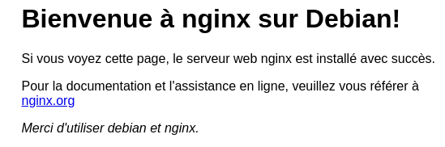
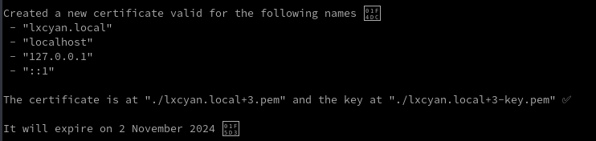
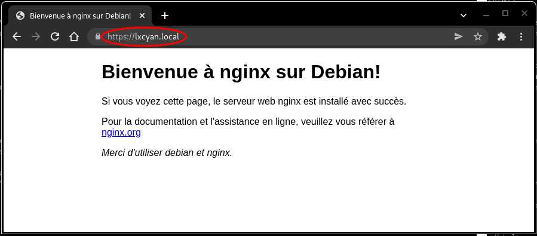
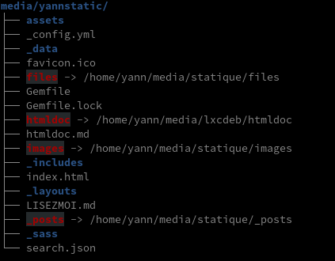
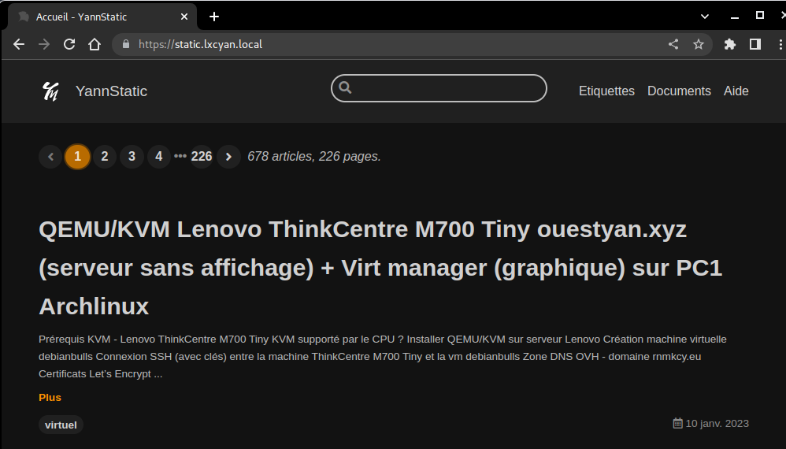
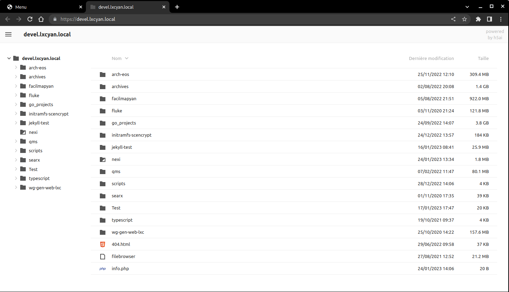
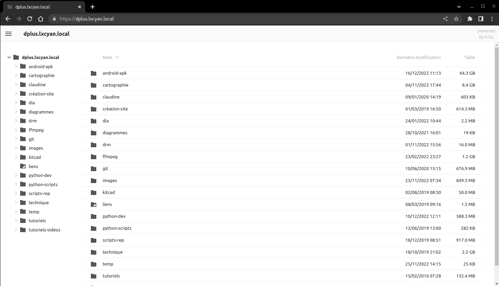
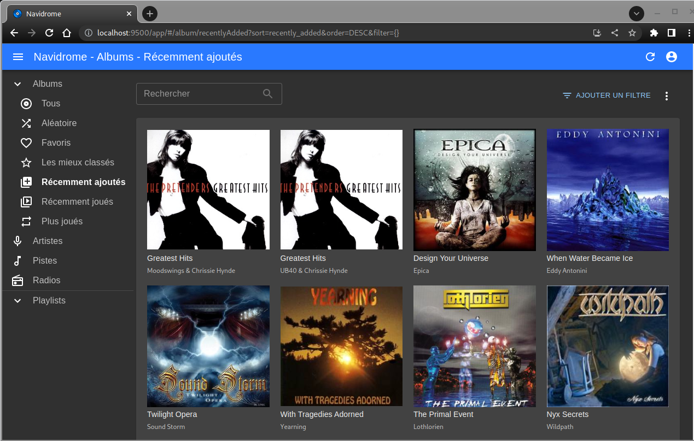
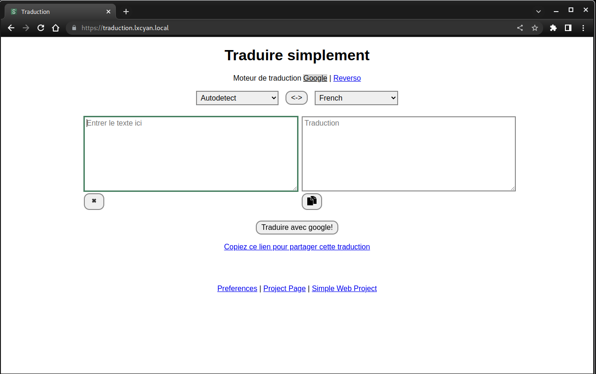

+++
title = 'Archlinux --> conteneur LXC debian bullseye lxcyan'
date = 2023-03-06 00:00:00 +0100
categories = ['virtuel']
+++
{:height="100"}


## Création Conteneur lxcbullseye

Pour un réseau en pont (bridge - adresse IP conteneur dans le même réseau que l'hôte) : [Archlinux KVM/QEMU - Virtual Machine Manager - Réseau (network)](/posts/Archlinux-KVM_QEMU-VMM/)

L'installation de **lxc** et de **arch-install-scripts** permettra au système hôte d'exécuter des lxcs privilégiés. 

    yay -S lxc arch-install-scripts

Passage en mode su : `sudo -s`

Création conteneur lxc avec la distribution debian bullseye nommé **lxcbullseye**

	lxc-create -n lxcbullseye -t download -- --dist debian --release bullseye --arch amd64

```
Downloading the image index
Downloading the rootfs
[...]
The image cache is now ready
Unpacking the rootfs

---
You just created a Debian bullseye amd64 (20220731_05:25) conteneur.

To enable SSH, run: apt install openssh-server
No default root or user password are set by LXC.
```

conteneur visible dans le dossier **/var/lib/lxc/lxcbullseye/**  
Configuration `/var/lib/lxc/lxcbullseye/config` 

```
# Template used to create this conteneur: /usr/share/lxc/templates/lxc-download
# Parameters passed to the template: --dist debian --release bullseye --arch amd64
# Template script checksum (SHA-1): 65b33ef65cd5762c980a1aaa3bcada08acc6f5d4
# For additional config options, please look at lxc.conteneur.conf(5)

# Uncomment the following line to support nesting conteneurs:
#lxc.include = /usr/share/lxc/config/nesting.conf
# (Be aware this has security implications)


# Distribution configuration
lxc.include = /usr/share/lxc/config/common.conf
lxc.arch = linux64

# conteneur specific configuration
lxc.rootfs.path = dir:/var/lib/lxc/lxcbullseye/rootfs
lxc.uts.name = lxcbullseye

# Network configuration
lxc.net.0.type = veth
lxc.net.0.link = lxcbr0
lxc.net.0.flags = up
lxc.net.0.hwaddr = 00:16:3e:20:10:f5
```

Modifier la configuration du réseau à la ligne `lxc.net.0.link` du fichier `/var/lib/lxc/lxcbullseye/config` ( [Voir topic](https://forum.ubuntu-fr.org/viewtopic.php?id=1508291))

```
lxc.net.0.link = br0
```

- `lxc.network.type = veth` spécifie que nous créons une interface virtuelle rattachée à un bridge.
- `lxc.network.flags = up` spécifie que nous voulons activer l'interface au démarrage du conteneur.
- `lxc.network.link = br0` spécifie le bridge auquel est rattachée l'interface virtuelle ; la création du bridge n'est pas du ressort de LXC et est à votre charge.
- `lxc.network.hwaddr = 00:16:3e:20:10:f5` spécifie l'adresse MAC attribuée à l'interface virtuelle.

Si vous avez un conteneur en activité avec le même réseau, passer au paragraphe suivant "Démarrer le conteneur"
{: .prompt-warning }


Démarrer lxc-net.service pour l'interface réseau.

    systemctl start lxc-net.service
    systemctl status lxc-net.service


```
● lxc-net.service - LXC network bridge setup
     Loaded: loaded (/usr/lib/systemd/system/lxc-net.service; disabled; vendor >
     Active: active (exited) since Thu 2020-12-17 20:26:30 CET; 14s ago
       Docs: man:lxc
    Process: 32027 ExecStart=/usr/lib/lxc/lxc-net start (code=exited, status=0/>
   Main PID: 32027 (code=exited, status=0/SUCCESS)

déc. 17 20:26:30 archyan systemd[1]: Starting LXC network bridge setup...
déc. 17 20:26:30 archyan systemd[1]: Finished LXC network bridge setup.
```

Activer le service réseau 

    systemctl enable lxc-net.service # réseau au redémarrage

Démarrer le conteneur (systemd)

	systemctl start lxc@lxcbullseye.service   

Vérifier

    systemctl status lxc@lxcbullseye.service

```
● lxc@lxcbullseye.service - lxcbullseye LXC
     Loaded: loaded (/usr/lib/systemd/system/lxc@.service; disabled; preset: disabled)
     Active: active (running) since Wed 2022-08-03 15:35:16 CEST; 8s ago
    Process: 13481 ExecStart=/usr/bin/lxc-start -d -n lxcbullseye -p /run/lxc-lxcbullseye.pid (code=exited, status=0/SUCCESS)
   Main PID: 13483 (lxc-start)
      Tasks: 0 (limit: 32768)
     Memory: 1.6M
        CPU: 5ms
     CGroup: /system.slice/system-lxc.slice/lxc@lxcbullseye.service
             ‣ 13483 "[lxc monitor] /var/lib/lxc lxcbullseye"

août 03 15:35:16 archyan systemd[1]: Starting lxcbullseye LXC...
août 03 15:35:16 archyan systemd[1]: Started lxcbullseye LXC.
```

Se lier au conteneur (chroot)

	lxc-attach -n lxcbullseye --clear-env	# On obtient le prompt root@lxcbullseye:/#

Sans le drapeau `--clear-env`, l'hôte passera ses propres variables d'environnement dans le conteneur (y compris $PATH, donc certaines commandes ne fonctionneront pas lorsque les conteneurs sont basés sur une autre distribution).
{: .prompt-warning }

Les services actifs

    systemctl list-units --type=service

```
  UNIT                               LOAD   ACTIVE SUB     DESCRIPTION
  console-getty.service              loaded active running Console Getty
  dbus.service                       loaded active running D-Bus System Message Bus
  systemd-journal-flush.service      loaded active exited  Flush Journal to Persistent Storage
  systemd-journald.service           loaded active running Journal Service
  systemd-logind.service             loaded active running User Login Management
  systemd-networkd.service           loaded active running Network Service
  systemd-remount-fs.service         loaded active exited  Remount Root and Kernel File Systems
  systemd-resolved.service           loaded active running Network Name Resolution
  systemd-sysctl.service             loaded active exited  Apply Kernel Variables
  systemd-sysusers.service           loaded active exited  Create System Users
  systemd-tmpfiles-setup-dev.service loaded active exited  Create Static Device Nodes in /dev
  systemd-tmpfiles-setup.service     loaded active exited  Create Volatile Files and Directories
  systemd-update-utmp.service        loaded active exited  Update UTMP about System Boot/Shutdown
  systemd-user-sessions.service      loaded active exited  Permit User Sessions

LOAD   = Reflects whether the unit definition was properly loaded.
ACTIVE = The high-level unit activation state, i.e. generalization of SUB.
SUB    = The low-level unit activation state, values depend on unit type.
14 loaded units listed. Pass --all to see loaded but inactive units, too.
To show all installed unit files use 'systemctl list-unit-files'.
```

### Conteneur lxcbullseye Debian 11 

{:height="40"}  
Modifier le mot de passe  root : `passwd`  
Installer les outils

	apt install ssh nano sudo

Pour un accès au terminal

	export TERM="xterm-256color"

Le réseau `ip a`

```
1: lo: <LOOPBACK,UP,LOWER_UP> mtu 65536 qdisc noqueue state UNKNOWN group default qlen 1000
    link/loopback 00:00:00:00:00:00 brd 00:00:00:00:00:00
    inet 127.0.0.1/8 scope host lo
       valid_lft forever preferred_lft forever
    inet6 ::1/128 scope host 
       valid_lft forever preferred_lft forever
2: eth0@if9: <BROADCAST,MULTICAST,UP,LOWER_UP> mtu 1500 qdisc noqueue state UP group default qlen 1000
    link/ether 00:16:3e:20:10:f5 brd ff:ff:ff:ff:ff:ff link-netnsid 0
    inet 192.168.0.20/24 brd 192.168.0.255 scope global dynamic eth0
       valid_lft 43044sec preferred_lft 43044sec
    inet6 2a01:e34:eebf:5660:216:3eff:fe20:10f5/64 scope global dynamic mngtmpaddr noprefixroute 
       valid_lft 86299sec preferred_lft 86299sec
    inet6 fe80::216:3eff:fe20:10f5/64 scope link 
       valid_lft forever preferred_lft forever
```

Hostname

    hostnamectl

```
   Static hostname: lxcbullseye
         Icon name: computer-container
           Chassis: container
        Machine ID: d6b8629dbef54cc98e171c4b6bf8c3d5
           Boot ID: a1401aa661994079933a16ef5e971e76
    Virtualization: lxc
  Operating System: Debian GNU/Linux 11 (bullseye)
            Kernel: Linux 5.18.15-arch1-1
      Architecture: x86-64
```

Création  Utilisateur lxcyan

    useradd -m -d /home/lxcyan/ -s /bin/bash lxcyan
    passwd lxcyan

Accès sudo

    echo "lxcyan     ALL=(ALL) NOPASSWD: ALL" >> /etc/sudoers

Locales fr UTF8 : `dpkg-reconfigure locales`  
Fuseau Europe/Paris : `dpkg-reconfigure tzdata`

Le réseau est configuré avec le service `systemd-networkd` ([Debian SystemdNetworkd](https://wiki.debian.org/SystemdNetworkd))
{: .prompt-warning }

Les configurations du réseau sont stockées dans le répértoire `/etc/systemd/network` sous la forme de fichier du type `<interface>.network`   
Dans notre cas, `eth0.network` en DHCP

```
[Match]
Name=eth0
[Network]
DHCP=true
[DHCPv4]
UseDomains=true
```

Modification réseau pour ip statique

    nano /etc/systemd/network/eth0.network

```
[Match]
Name=eth0
[Network]
  Address=192.168.0.210/24
  Gateway=192.168.0.254
  DNS=192.168.0.254
```

1. Sortir du chroot : `exit` 
2. relancer le conteneur `systemctl restart lxc@lxcbullseye.service`
3. se connecter de nouveau au conteneur `lxc-attach -n lxcbullseye --clear-env`
4. vérifier `ip a`

```
1: lo: <LOOPBACK,UP,LOWER_UP> mtu 65536 qdisc noqueue state UNKNOWN group default qlen 1000
    link/loopback 00:00:00:00:00:00 brd 00:00:00:00:00:00
    inet 127.0.0.1/8 scope host lo
       valid_lft forever preferred_lft forever
    inet6 ::1/128 scope host 
       valid_lft forever preferred_lft forever
2: eth0@if11: <BROADCAST,MULTICAST,UP,LOWER_UP> mtu 1500 qdisc noqueue state UP group default qlen 1000
    link/ether 00:16:3e:20:10:f5 brd ff:ff:ff:ff:ff:ff link-netnsid 0
    inet 192.168.0.210/24 brd 192.168.0.255 scope global eth0
       valid_lft forever preferred_lft forever
    inet6 2a01:e34:eebf:5660:216:3eff:fe20:10f5/64 scope global dynamic mngtmpaddr noprefixroute 
       valid_lft 86397sec preferred_lft 86397sec
    inet6 fe80::216:3eff:fe20:10f5/64 scope link 
       valid_lft forever preferred_lft forever
```

La résolution DNS est gérée par **systemd-resolved** et le fichier de configuration `/etc/systemd/resolved.conf`

```
#  This file is part of systemd.
#
#  systemd is free software; you can redistribute it and/or modify it
#  under the terms of the GNU Lesser General Public License as published by
#  the Free Software Foundation; either version 2.1 of the License, or
#  (at your option) any later version.
#
# Entries in this file show the compile time defaults.
# You can change settings by editing this file.
# Defaults can be restored by simply deleting this file.
#
# See resolved.conf(5) for details

[Resolve]
# Some examples of DNS servers which may be used for DNS= and FallbackDNS=:
# Cloudflare: 1.1.1.1 1.0.0.1 2606:4700:4700::1111 2606:4700:4700::1001
# Google:     8.8.8.8 8.8.4.4 2001:4860:4860::8888 2001:4860:4860::8844
# Quad9:      9.9.9.9 2620:fe::fe
#DNS=
#FallbackDNS=
#Domains=
#DNSSEC=no
#DNSOverTLS=no
#MulticastDNS=yes
#LLMNR=yes
#Cache=yes
#DNSStubListener=yes
#DNSStubListenerExtra=
#ReadEtcHosts=yes
#ResolveUnicastSingleLabel=no
```

### SSH clé et script

{:height="50"}  
**connexion avec clé**  
<u>sur l'ordinateur de bureau</u>
Générer une paire de clé curve25519-sha256 (ECDH avec Curve25519 et SHA2) nommé **kvm-cinay** pour une liaison SSH avec le serveur KVM.  

    ssh-keygen -t ed25519 -o -a 100 -f ~/.ssh/lxcbullseye

Envoyer la clé publique dans le conteneur lxcbulls

    ssh-copy-id -i ~/.ssh/lxcbullseye.pub lxcyan@192.168.0.210 

<u>sur le conteneur lxcbulls</u>
On se connecte au conteneur lxcbulls 

    ssh lxcyan@192.168.0.210

Modifier la configuration serveur SSH  

    sudo nano /etc/ssh/sshd_config 

les paramètres à modifier

```conf
Port 55210
PasswordAuthentication no 
```

Relancer openSSH  

    sudo systemctl restart sshd

Accès depuis le poste distant avec la clé privée  

    ssh -p 55210 -i ~/.ssh/lxcbullseye lxcyan@192.168.0.210

En cas d'erreur du type  `ssh: connect to host 192.168.0.210 port 55210: Connection refused`  
Ou impossibilité d'ouvrir un terminal sous LXC `Error opening terminal: unknown`  
**Exécuter la commande suivante**  
`echo "export TERM=xterm" | tee /etc/profile.d/set_term.sh && source /etc/profile`
{: .prompt-warning }


Ajout utilisateur au journal

    sudo usermod -a -G systemd-journal $USER

Installer utilitaires

    sudo apt install netcat-openbsd rsync curl tmux jq figlet git dnsutils wget tree iptables lsof rsync -y

Motd

    sudo rm /etc/motd &&  sudo nano /etc/motd

```
     _       _     _               _  _            
  __| | ___ | |__ (_) __ _  _ _   / |/ |           
 / _` |/ -_)| '_ \| |/ _` || ' \  | || |           
 \__,_|\___||_.__/|_|\__,_||_||_| |_||_|           
  _           _           _  _                     
 | |__ __ __ | |__  _  _ | || | ___ ___  _  _  ___ 
 | |\ \ // _|| '_ \| || || || |(_-</ -_)| || |/ -_)
 |_|/_\_\\__||_.__/ \_,_||_||_|/__/\___| \_, |\___|
                                         |__/      
```

Créer les dossiers pour un montage externe

    mkdir -p $HOME/{media,scripts}

Sortie du conteneur

    exit

### Partage dossier hôte avec conteneur

**Hôte**  
Monter le dossier `/srv/media`  de l'hôte  sur le répertoire `$HOME/media` et le dossier `/home/yann/scripts`  de l'hôte  sur le répertoire `$HOME/scripts`

```bash
mount -o bind /srv/media /var/lib/lxc/lxcbullseye/rootfs/home/lxcyan/media
mount -o bind /home/yann/scripts /var/lib/lxc/lxcbullseye/rootfs/home/lxcyan/scripts
```

Ajouter au fichier `/etc/fstab` de l'hôte PC1

```
# LXC lxcbullseye dossiers partagés
/srv/media /var/lib/lxc/lxcbullseye/rootfs/home/lxcyan/media  none bind 0 0
/home/yann/scripts /var/lib/lxc/lxcbullseye/rootfs/home/lxcyan/scripts  none bind 0 0
```

Pour les accès web depuis l'hôte, ajouter `192.168.0.210   lxcyan` à son fichier **/etc/hosts**


### Ajouter groupe "utilisateurs" ID 985

Pour avoir le même ID que sur archlinux 

    sudo groupadd -g 985 utilisateurs

Ajout utilisateur au groupe "utilisateurs"

    sudo usermod -aG utilisateurs $USER

ID utilisateur lxcyan après reconnexion

    uid=1000(lxcyan) gid=1000(lxcyan) groupes=1000(lxcyan),101(systemd-journal),985(utilisateurs)

### Historique des commandes bash

POUR tous les utilisateurs ,y compris root et avec touche SHIFT

```bash
echo "
# appel alphabétique commandes
shopt -s histappend
PROMPT_COMMAND='history -a'" | tee -a $HOME/.bashrc

echo "
# appel alphabétique commandes
shopt -s histappend
PROMPT_COMMAND='history -a'" | sudo tee -a /root/.bashrc

echo '
# AVEC la touche SHIFT
"\e[1;2A": history-search-backward
"\e[1;2B": history-search-forward
' | sudo tee -a /etc/inputrc
```

Redémarrer le terminal la prise en compte


### Hôte - Démarrage auto des conteneurs

[How to auto-start unprivileged lxc conteneurs?](https://serverfault.com/questions/620709/how-to-auto-start-unprivileged-lxc-conteneurs)

Après un redémarrage de l'hôte, les conteneurs LXC ne démarrent pas par défaut.

`On passe en mode sudo`{: .prompt-info }  

Ajouter `lxc.start.auto = 1` au fichier de configuration du conteneur `/var/lib/lxc/lxcbullseye/config` et relancer le conteneur

```
echo "lxc.start.auto = 1" >> /var/lib/lxc/lxcbullseye/config
systemctl restart lxc@lxcbullseye.service
```

Malgré le positionnement en démarrage au boot (AUTOSTART = 1), le conteneur n'est pas lancé.  
Le problème est que le réseau en pont br0 n'est pas encore en service.
{: .prompt-warning }

Créer un service `lxc-autostart.service` qui va lancer le(s) conteneur(s) au démarrage après l'activation du réseau en pont géré par le service **lxc-net**.

    nano /etc/systemd/system/lxc-autostart.service

```
[Unit]
Description=Lxc-autostart service
Requires=lxc-net.service
After=lxc-net.service

[Service]
Type=oneshot
ExecStart=/usr/bin/lxc-autostart
ExecStop=/usr/bin/lxc-autostart -s
RemainAfterExit=1

[Install]
WantedBy=multi-user.target
```

Après les changements

    systemctl daemon-reload

Lancement et activation

    systemctl restart lxc-autostart.service
    systemctl enable lxc-autostart.service

Status

    systemctl status lxc-autostart.service

```
● lxc-autostart.service - Lxc-autostart service
     Loaded: loaded (/etc/systemd/system/lxc-autostart.service; enabled; vendor preset: disabled)
     Active: active (exited) since Fri 2022-06-24 16:24:33 CEST; 1min 47s ago
TriggeredBy: ● lxc-autostart.timer
   Main PID: 28494 (code=exited, status=0/SUCCESS)
        CPU: 8ms

juin 24 16:24:33 archyan systemd[1]: Starting Lxc-autostart service...
juin 24 16:24:33 archyan systemd[1]: Finished Lxc-autostart service.
```

### Structure conteneur lxcyan

Lancer la commande `tree -L 3 /var/lib/lxc/` en mode su

```
/var/lib/lxc/
└── lxcbullseye
    ├── config
    └── rootfs
        ├── bin -> usr/bin
        ├── boot
        ├── dev
        ├── etc
        ├── home
        ├── lib -> usr/lib
        ├── lib32 -> usr/lib32
        ├── lib64 -> usr/lib64
        ├── libx32 -> usr/libx32
        ├── media
        ├── mnt
        ├── opt
        ├── proc
        ├── root
        ├── run
        ├── sbin -> usr/sbin
        ├── srv
        ├── sys
        ├── tmp
        ├── usr
        └── var
```

Le dossier **media** est un montage sur l'hôte du dossier /srv/media

Taille du conteneur lxc bullseye en excluant media

    du -hsx --exclude=/var/lib/lxc/lxcbullseye/{rootfs/home/lxcyan/media} /var/lib/lxc/lxcbullseye/*

```
4,0K	/var/lib/lxc/lxcbullseye/config
11G	/var/lib/lxc/lxcbullseye/rootfs
```

## Nginx

### Compilation nginx 1.22

{:height="50"}

Utilisateur avec droits su : `sudo -s`

Télécharger le bash

```bash
wget https://static.xoyaz.xyz/files/compilation-nginx-tls1.3.sh
chmod +x compilation-nginx-tls1.3.sh # rendre le bash exécutable
./compilation-nginx-tls1.3.sh        # exécution
```

A la fin de la compilation

```
Versions Nginx OpenSSL
nginx version: nginx/1.22.0
OpenSSL 1.1.1n  15 Mar 2022
```

### Modification root du site web

Pour le rendre accessible depuis le poste linux on va créer un lien sur `/var/www`

```bash
mkdir -p $HOME/media/www/lxcyan
cp -a /var/www/default-www $HOME/media/www/lxcyan/
sudo rm -r /var/www/default-www/
sudo ln -s $HOME/media/www/lxcyan/default-www /var/www/default-www
```

Lien <http://lxcyan>    


### Certificats auto-signés (mkcert)

*mkcert est un outil facile d’utilisation qui va se charger de tout. Il génère notre autorité de certification, qui servira à signer le(s) certificat(s). Il suffira de déployer sa clé sur toutes les machines clientes pour que nous n’ayons aucune erreur du type "self signed…"([Générer des certificats SSL auto-signés avec mkcert](/posts/Generer_des_certificats_SSL_auto-signes_avec_mkcert/))*


```bash
# Installer mkcert sur un système Ubuntu ou Debian 
sudo apt -y install wget libnss3-tools
curl -s https://api.github.com/repos/FiloSottile/mkcert/releases/latest| grep browser_download_url  | grep linux-amd64 | cut -d '"' -f 4 | wget -qi -
mv mkcert-v*-linux-amd64 mkcert
chmod a+x mkcert
sudo mv mkcert /usr/local/bin/
# Création autorité de certification CA
mkcert -CAROOT /home/lxcyan/.local/share/mkcert
# générer notre nouvelle autorité de certification, sans saisir une seule information
mkcert -install
```

Vérification

    ls -l /home/lxcyan/.local/share/mkcert


Création de certificats locaux :

    mkcert 'lxcyan.local' localhost 127.0.0.1 ::1



Déplacer et renommer les certificats

```bash
sudo mv lxcyan.local+3.pem /etc/ssl/certs/lxcyan-cert.pem
sudo mv lxcyan.local+3-key.pem /etc/ssl/private/lxcyan-key.pem
```

Créer le fichier `/etc/nginx/conf.d/lxcyan.local.conf`

    sudo nano /etc/nginx/conf.d/lxcyan.local.conf

```nginx
server {
  listen  80;
  server_name lxcyan.local;
  return 301 https://;
}
server {
  listen *:443 ssl http2;
  server_name lxcyan.local;
  ssl_certificate /etc/ssl/certs/lxcyan-cert.pem;
  ssl_certificate_key /etc/ssl/private/lxcyan-key.pem;
  root /var/www/default-www;

  
  location / {
    index index.htm index/;
  }

  include /etc/nginx/conf.d/lxcyan.d/*.conf;
}
```

Renommer le fichier de configuration par défaut, créer le sous-dossier lxcyan.d et recharger nginx

```bash
sudo mv /etc/nginx/conf.d/default.conf /etc/nginx/conf.d/default.conf.sav
sudo mkdir -p /etc/nginx/conf.d/lxcyan.d/
sudo systemctl reload nginx
```

<u>Diffuser l'autorité de certification sur le conteneur debian lxcbullseye</u>

```bash
sudo apt install -y ca-certificates 
sudo cp ~/.local/share/mkcert/rootCA.pem /usr/local/share/ca-certificates/rootCA.crt
sudo update-ca-certificates
```

<u>Opérations à réaliser sur PC1 (archlinux)</u>  

Ajouter une ligne au fichier `/etc/hosts` de PC1 (qui lance le conteneur lxc)

```
192.168.0.210   lxcyan lxcyan.local 
```

Il faut diffuser l'autorité de certification mkcert lxcyan sur PC1   

```bash
# Copie certificat depuis le dossier mkcert du conteneur lxcbullseye
sudo cp /var/lib/lxc/lxcbullseye/rootfs/home/lxcyan/.local/share/mkcert/rootCA.pem /etc/ca-certificates/trust-source/anchors/rootCA-lxcbulls.crt 
# Activation
sudo  trust extract-compat
```

Lien <https://lxcyan.local>    


## PHP

### PHP8 - Composer

{:width="50"}  

Mettre à jour votre Debian système d'exploitation

    sudo apt update && sudo apt upgrade -y

Installer les dépendances requises

    sudo apt-get install ca-certificates apt-transport-https software-properties-common wget curl lsb-release -y

importer et installer le Clé et référentiel GPG et actualiser

    curl -sSL https://packages.sury.org/php/README.txt | sudo bash -x  

Actualiser

    sudo apt update && sudo apt -y upgrade

Installation des paquets php8.1 de base

    sudo apt install php8.1 php8.1-fpm php8.1-sqlite3 php8.1-gd

Version PHP : `php --version`

```
PHP 8.1.8 (cli) (built: Jul 11 2022 08:55:24) (NTS)
Copyright (c) The PHP Group
Zend Engine v4.1.8, Copyright (c) Zend Technologies
    with Zend OPcache v8.1.8, Copyright (c), by Zend Technologies
```

**PHP Composer** est un outil de gestion de paquets. Cela évite d’avoir à gérer manuellement les paquets PHP pour une application. Vous pouvez facilement installer tous les packages requis à l’aide de Composer. Il gère une liste des packages requis dans un fichier JSON appelé composer.json.

```bash
curl -sS https://getcomposer.org/installer | php
sudo mv composer.phar /usr/local/bin/composer
chmod +x /usr/local/bin/composer
```

Vérification : `composer`

```
   ______
  / ____/___  ____ ___  ____  ____  ________  _____
 / /   / __ \/ __ `__ \/ __ \/ __ \/ ___/ _ \/ ___/
/ /___/ /_/ / / / / / / /_/ / /_/ (__  )  __/ /
\____/\____/_/ /_/ /_/ .___/\____/____/\___/_/
                    /_/
Composer version 2.3.10 2022-07-13 15:48:23
```

## Base

### MySql - MariaDB

Installation

    sudo apt install mariadb-server

Sécurisation

    sudo mysql_secure_installation

Mp root : AdjureLobbyConteMolette

## Développement

### nvm - node - yarn

*Il n’est pas rare d’avoir besoin ou envie de travailler dans différentes versions de nodejs. Une méthode privilégiée par les utilisateurs de node est l’utilisation de NVM (Node Version Manager). Le paquet nvm permet des installations alternatives faciles et peu coûteuses.*

Installation

```bash
curl -o- https://raw.githubusercontent.com/nvm-sh/nvm/v0.39.1/install.sh | bash
export NVM_DIR="$HOME/.nvm"
[ -s "$NVM_DIR/nvm.sh" ] && \. "$NVM_DIR/nvm.sh"  # This loads nvm
[ -s "$NVM_DIR/bash_completion" ] && \. "$NVM_DIR/bash_completion"  # This loads nvm bash_completion

source ~/.bashrc
```

Installer la version node lts

    nvm install --lts

Installer yarn et le dernier npm si demandé

    npm install yarn -g

### Golang

{:height="50"}  
La dernière version linux sur le lien <https://go.dev/dl/>

Supprimez toute installation précédente de Go en effaçant le dossier `/usr/local/go` (s'il existe), puis extrayez l'archive que vous venez de télécharger dans /usr/local, créant ainsi une nouvelle arborescence Go dans /usr/local/go

```shell
wget https://go.dev/dl/go1.19.3.linux-amd64.tar.gz
sudo tar -C /usr/local -xzf go1.19.3.linux-amd64.tar.gz
rm go1.19.3.linux-amd64.tar.gz
```

Chemins Go ajoutés au fichier `~/.bashrc`

```shell
echo "export PATH=$PATH:/usr/local/go/bin" >> $HOME/.bashrc
source $HOME/.bashrc
go version # go version go1.19.3 linux/amd64
```

### Jekyll

{:height="50"}  
[Installation Ruby (via rbenv) + Jekyll (générateur de site statique) sur Debian](/posts/Installation-Ruby-via-rbenv+Jekyll-sur-Debian/)

### Docker + Docker Compose

{:height="50"}  
[Docker + Docker Compose sur Debian, installation et utilisation](/posts/Docker-Debian-Buster/)

Version installée au 03/02/2023  
*Docker version 23.0.0, build e92dd87*

Exécution docker sans être sudo

    sudo usermod -aG docker ${USER}

Déconnexion du serveur et reconnexion pour appliquer la nouvelle appartenance au groupe

     id lxcyan

*uid=1000(lxcyan) gid=1000(lxcyan) groupes=1000(lxcyan),101(systemd-journal),985(utilisateurs),998(docker)*

Version docker-compose  
*docker-compose version 1.25.3, build d4d1b42b*


## GpxStudio - Traces GPS

[Visualisation et édition des traces gps](/posts/Visualisation_et_edition_des_traces_gpx/)

Site accessible dans le dossier ~/media/www/gpxstudio

## FacilMapYan

[FacilMapYan carte en ligne à code source ouvert](/posts/FacilMap_carte_en_ligne/)

### fmy.lxcyan.local

*Test local sur un conteneur Debian bullseye*

### Certificats SSL

Ajout du certificat fmy.lxcyan.local

    mkcert 'lxcyan.local' 'gpx.lxcyan.local' 'fmy.lxcyan.local' localhost 127.0.0.1 ::1

Copier les certificats

```bash
sudo cp lxcyan.local+5.pem /etc/ssl/certs/lxcyan-cert.pem
sudo cp lxcyan.local+5-key.pem /etc/ssl/private/lxcyan-key.pem
rm lxcyan.local+5.pem 
rm lxcyan.local+5-key.pem 
```

### Proxy nginx

Créer le fichier `/etc/nginx/conf.d/fmy.lxcyan.local.conf`

    sudo nano /etc/nginx/conf.d/fmy.lxcyan.local.conf

```nginx
server {
  listen  80;
  server_name fmy.lxcyan.local;
  return 301 https://;
}
server {
  listen *:443 ssl http2;
  server_name fmy.lxcyan.local;
  ssl_certificate /etc/ssl/certs/lxcyan-cert.pem;
  ssl_certificate_key /etc/ssl/private/lxcyan-key.pem;
  
  location / {
    proxy_pass http://127.0.0.1:55022;
  }

}
```

Ajouter fmy.lxcyan.local à la ligne du fichier `/etc/hosts` de PC1 (qui lance le conteneur lxc)

```
192.168.0.210   lxcyan lxcyan.local gpx.lxcyan.local fmy.lxcyan.local
```

recharger nginx

    sudo systemctl reload nginx
    
Le lien <https://fmy.lxcyan.local>  


## Diceware, osm-new

Le fichier de configuration

    /etc/nginx/conf.d/lxcyan.d/locations.conf

```
location /diceware/ {

    # Path to source
    alias /home/lxcyan/media/diceware/;
    index index/;
		# First attempt to serve request as file, then
		# as directory, then fall back to displaying a 404.
		try_files $uri $uri/ =404;
}

location /osm-new/ {

    # Path to source
    alias /home/lxcyan/media/osm-new/;
    index index/;
		# First attempt to serve request as file, then
		# as directory, then fall back to displaying a 404.
		try_files $uri $uri/ =404;
}

```

Vérification et relance nginx : `sudo nginx -t` et `sudo systemctl reload nginx`  

## Générateur Site Statique

 {:height="30"}
*Générer un site statique via jekyll*

* Ruby et Jekyll sont installés
* Vérifiez l'emplacement où les gemmes sont installées : `gem env home`  
*/home/lxcyan/.rbenv/versions/3.1.2/lib/ruby/gems/3.1.0*

### yannstatic

Se positionner dans le dossier

    cd ~/media/yannstatic

Le fichier **Gemfile**

```
source "https://rubygems.org"

# gem "github-pages", group: :jekyll_plugins
gem "jekyll-text-theme"
```

Le fichier **_config.yml**

<details>
<summary>(Afficher/Cacher) <b>_config.yml</b></summary>


# Bienvenue à Jekyll !
#
# Ce fichier de configuration est destiné aux paramètres qui affectent l'ensemble de votre blog, des valeurs
# que vous êtes censé configurer une fois et rarement besoin de modifier par la suite.
# Pour des raisons techniques, ce fichier n'est *PAS* rechargé automatiquement lorsque vous utilisez
# 'jekyll serve'. Si vous modifiez ce fichier, veuillez redémarrer le processus de serveur.

## => Paramètres du site
##############################
theme             : jekyll-text-theme
text_skin         : dark                          # "default" (par défaut), "dark", "forest", "ocean", "chocolate", "orange".
highlight_theme   : tomorrow-night-eighties       # "default" (par défaut), "tomorrow", "tomorrow-night", "tomorrow-night-eighties", "tomorrow-night-blue", "tomorrow-night-bright".
url               : https://static.lxcyan.local   # le nom d'hôte et le protocole de base pour votre site, par exemple https://www.someone.com
baseurl           :                               # ne comprend pas le nom d'hôte
title             : YannStatic
description       : >                             # cela signifie qu'il faut ignorer les nouvelles lignes jusqu'à "Language & timezone".
  Expérimentations et tests

## => Language and Timezone
##############################
lang        : fr               # le language du site, par défaut "en"
timezone    : Europe/Paris     # voir https://en.wikipedia.org/wiki/List_of_tz_database_time_zones


## => Auteur et social
##############################
author :
  type      : ## "personne" (par défaut), "organisme".
  name      : Yann Static
  url       :
  avatar    : # chemin ou url de l'image de l'avatar (carré)
  bio       :
  email     :
  facebook  : # "user_name" la dernière partie de l'url de votre profil, par exemple https://www.facebook.com/user_name
  twitter   : # "user_name" la dernière partie de l'url de votre profil, par exemple https://twitter.com/user_name
  weibo     : # "user_id" la dernière partie de l'url de votre profil, ex. https://www.weibo.com/user_id/profile ?...
  googleplus: # "user_id" la dernière partie de l'url de votre profil, par exemple https://plus.google.com/u/0/user_id
  telegram  : # "user_name" la dernière partie de votre url de profil, par exemple https://t.me/user_name
  medium    : # "user_name" la dernière partie de l'url de votre profil, par exemple https://medium.com/user_name
  zhihu     : # "user_name" la dernière partie de l'url de votre profil, par exemple https://www.zhihu.com/people/user_name
  douban    : # "user_name" la dernière partie de l'url de votre profil, par exemple https://www.douban.com/people/user_name
  linkedin  : # "user_name" la dernière partie de l'url de votre profil, par exemple https://www.linkedin.com/in/user_name
  github    : # "user_name" la dernière partie de l'url de votre profil, par exemple https://github.com/user_name
  npm       : # "user_name" la dernière partie de votre url de profil, par exemple https://www.npmjs.com/~user_name

## => Dépôt GitHub (si le site est hébergé par GitHub)
##############################
repository: 
repository_tree: 


## => Chemins
##############################
paths:
  root    : # title link url, "/" (default)
  home    : # home layout url, "/" (default)
  archive : # "/archive/" (default)
  rss     : # "/feed.xml" (default)


## => Post
##############################
## excerpt
excerpt_separator: 

## license
license: # "CC-BY-4.0", "CC-BY-SA-4.0", "CC-BY-NC-4.0", "CC-BY-ND-4.0"

## TOC
toc:
  selectors: h1,h2,h3 # "h1,h2,h3" (default)


## => Markdown Enhancements
##############################
## Mathjax
mathjax: 			  # false (default), true
mathjax_autoNumber: # false (default), true

## Mermaid
mermaid:            # false (default), true

## Chart
chart:              # false (default), true


## => Paginate
##############################
paginate: 3
paginate_path: /page:num # don't change this unless for special need


## => Sources
##############################
sources:            # bootcdn (default), unpkg


## => Sharing
##############################
sharing:
  provider: false   # false (default), "addtoany", "addthis", "custom"

  ## AddThis
  addthis:
    id:             # AddThis pubid, e.g. ra-5xxxxxxxxxxx


## => Comments
##############################
comments:
  provider: false   # false (default), "disqus", "gitalk", "valine", "custom"

  ## Disqus
  disqus:
    shortname   : # the Disqus shortname for the site

  ## Gitalk
  # please refer to https://github.com/gitalk/gitalk for more info.
  gitalk:
    clientID    : # GitHub Application Client ID
    clientSecret: # GitHub Application Client Secret
    repository  : # GitHub repo
    owner       : # GitHub repo owner
    admin       : # GitHub repo owner and collaborators, only these guys can initialize GitHub issues, IT IS A LIST.
      # - your GitHub Id

  ## Valine
  # please refer to https://valine.js.org/en/ for more info.
  valine:
    app_id      : # LeanCloud App id
    app_key     : # LeanCloud App key
    placeholder : # Prompt information
    visitor     : # false (default)
    meta        : # "[nick, mail, link]" (default) nickname, E-mail, Personal-site


## => Pageview
##############################
pageview:
  provider: false # false (default), "leancloud", "custom"

  ## Leancloud
  leancloud:
    app_id    : # LeanCloud App id
    app_key   : # LeanCloud App key
    app_class : # LeanCloud App class


## => Recherche
##############################
search:
  provider: custom # "default" (default), false, "google", "custom"

  ## Google Custom Search Engine
  google:
    custom_search_engine_id: # Google Custom Search Engine ID


## => Analytics
##############################
analytics:
  provider: false # false (default), "google", "custom"

  ## Google Analytics
  google:
    tracking_id : # Google Analytics id for the site
    anonymize_ip: false # Anonymize IP tracking for Analytics


## => Build
##############################
markdown    : kramdown
highlighter : rouge
permalink   : date

exclude:
  - LISEZMOI.md
  - .jekyll-cache/
  - .git/
  - Gemfile
  - Gemfile.lock
  - _posts/.sync_d399357bbfa9.db-wal
  - images/.sync_1e6bea1f017e.db-wal

defaults:
  - scope:
      path: ""
      type: posts
    values:
      layout: article
      sharing: true
      license: true
      aside:
toc: true
      show_edit_on_github: true
      show_subscribe: true
      pageview: true


## => Plugins
##############################
plugins:
  - jekyll-feed
  - jekyll-paginate
  - jekyll-sitemap
  - jemoji



</details>


Bundle lit le fichier **Gemfile**

    bundle install # Patientez ...

```
Bundle complete! 1 Gemfile dependency, 43 gems now installed.
Use `bundle info [gemname]` to see where a bundled gem is installed.
```

Info sur jekyll et créer un lien

    bundle info jekyll

```
  * jekyll (4.3.1)
	Summary: A simple, blog aware, static site generator.
	Homepage: https://jekyllrb.com
	Source Code: https://github.com/jekyll/jekyll
	Changelog: https://github.com/jekyll/jekyll/releases
	Bug Tracker: https://github.com/jekyll/jekyll/issues
	Path: /home/lxcyan/.rbenv/versions/3.1.2/lib/ruby/gems/3.1.0/gems/jekyll-4.3.1
	Reverse Dependencies: 
		jekyll-feed (0.17.0) depends on jekyll (>= 3.7, < 5.0)
		jekyll-sitemap (1.4.0) depends on jekyll (>= 3.7, < 5.0)
		jekyll-text-theme (2.2.6) depends on jekyll (>= 3.6, < 5.0)
		jemoji (0.13.0) depends on jekyll (>= 3.0, < 5.0)
```

Création des liens sur les dossiers **files** , **images** , **_posts** et */doc**

```bash
ln -s $HOME/media/statique/images $HOME/media/yannstatic/images
ln -s $HOME/media/statique/files $HOME/media/yannstatic/files
ln -s $HOME/media/statique/_posts $HOME/media/yannstatic/_posts
ln -s $HOME/media/lxcdeb/doc $HOME/media/yannstatic/doc
```

La structure  
  

### Génération dossier _site

Création du dossier **_site**

    cd ~/media/yannstatic
    jekyll build

```
Configuration file: /home/lxcyan/media/yannstatic/_config.yml
            Source: /home/lxcyan/media/yannstatic
       Destination: /home/lxcyan/media/yannstatic/_site
 Incremental build: disabled. Enable with --incremental
      Generating... 
       Jekyll Feed: Generating feed for posts
                    done in 20.763 seconds.
 Auto-regeneration: disabled. Use --watch to enable.
```

**Service yannstatic**  
PATH Jekyll : `which jekyll` &rarr; `/home/lxcyan//.rbenv/shims/jekyll`  

Pour lancer le serveur **yannstatic** au démarrage, utilisation d'un <u>service systemd utilisateur</u>  

Création d'un service utilisateur "yannstatic" sous systemd

    mkdir -p ~/.config/systemd/user; nano ~/.config/systemd/user/yannstatic.service


Contenu du fichier `yannstatic.service`

```ini
[Unit]
Description=service yannstatic

[Service]
ExecStart=/home/lxcyan//.rbenv/shims/jekyll build --watch --incremental --source "/home/lxcyan/media/yannstatic" --destination "/home/lxcyan/media/yannstatic/_site"
Restart=on-abort

[Install]
WantedBy=default.target
```

Lancer le service  **yannstatic** :

```
systemctl --user daemon-reload
systemctl --user start yannstatic
```

Vérifier

    systemctl --user status yannstatic

```bash
● yannstatic.service - Jekyll
     Loaded: loaded (/home/lxcyan/.config/systemd/user/yannstatic.service; disabled; vendor preset: enabled)
     Active: active (running) since Wed 2023-01-11 14:53:47 CET; 15s ago
   Main PID: 1735 (jekyll)
      Tasks: 9 (limit: 19009)
     Memory: 174.7M
        CPU: 15.731s
     CGroup: /user.slice/user-1000.slice/user@1000.service/app.slice/yannstatic.service
             ├─1735 /home/lxcyan/.rbenv/versions/3.1.2/bin/ruby /home/lxcyan//.rbenv/versions/3.1.2/bin/jekyll build --watch
             └─1750 /home/lxcyan/.rbenv/versions/3.1.2/lib/ruby/gems/3.1.0/gems/sass-embedded-1.57.1/ext/sass/sass_embedded/dart-sass-embedded

janv. 11 14:53:47 lxcbullseye systemd[352]: Started Jekyll.
janv. 11 14:53:48 lxcbullseye jekyll[1735]: Configuration file: /home/lxcyan/media/yannstatic/_config.yml
janv. 11 14:53:48 lxcbullseye jekyll[1735]:             Source: /home/lxcyan/media/yannstatic
janv. 11 14:53:48 lxcbullseye jekyll[1735]:        Destination: /home/lxcyan/media/yannstatic/_site
janv. 11 14:53:48 lxcbullseye jekyll[1735]:  Incremental build: disabled. Enable with --incremental
janv. 11 14:53:48 lxcbullseye jekyll[1735]:       Generating...
janv. 11 14:53:48 lxcbullseye jekyll[1735]:        Jekyll Feed: Generating feed for posts
```

Activation

    systemctl --user enable yannstatic

dire à systemd que l’instance d’un utilisateur soit tout le temps présente, du boot au shutdown, ce qui permet d’avoir des processus (services) utilisateurs qui tournent sans avoir de session ouverte.

    sudo loginctl enable-linger $USER

Pour observer le fonctionnement du service yannstatic 

```shell
 En local
journalctl -f --user-unit yannstatic.service
```

## Site static.lxcyan.local

Ajout du certificat static.lxcyan.local

    mkcert 'lxcyan.local' 'gpx.lxcyan.local' 'fmy.lxcyan.local' 'static.lxcyan.local' localhost 127.0.0.1 ::1

```
Created a new certificate valid for the following names 📜
 - "lxcyan.local"
 - "gpx.lxcyan.local"
 - "fmy.lxcyan.local"
 - "static.lxcyan.local"
 - "localhost"
 - "127.0.0.1"
 - "::1"

The certificate is at "./lxcyan.local+6.pem" and the key at "./lxcyan.local+6-key.pem" ✅

It will expire on 11 April 2025 🗓
```

Copier les certificats

```bash
sudo cp lxcyan.local+6.pem /etc/ssl/certs/lxcyan-cert.pem
sudo cp lxcyan.local+6-key.pem /etc/ssl/private/lxcyan-key.pem
rm lxcyan.local+6.pem 
rm lxcyan.local+6-key.pem 
```

Créer le fichier `/etc/nginx/conf.d/static.lxcyan.local.conf`

```
server {
  listen  80;
  server_name static.lxcyan.local;
  return 301 https://;
}
server {
  listen *:443 ssl http2;
  server_name static.lxcyan.local;
  ssl_certificate /etc/ssl/certs/lxcyan-cert.pem;
  ssl_certificate_key /etc/ssl/private/lxcyan-key.pem;
  root /home/lxcyan/media/yannstatic/_site;
  
  location / {
    index index.htm index/;
  }

}
```

Recharger nginx

    sudo systemctl reload nginx

Modifier la ligne du fichier /etc/hosts de PC1 (qui lance le container lxc) pour y ajouter static.lxcyan.local

```
192.168.0.210   lxcyan lxcyan.local gpx.lxcyan.local fmy.lxcyan.local static.lxcyan.local
```

Le lien <https://static.lxcyan.local>  


## Site devel.lxcyan.local

*[h5ai](https://larsjung.de/h5ai/) est un indexeur de fichiers moderne pour les serveurs web HTTP avec un focus sur vos fichiers. Les répertoires sont affichés de manière attrayante et leur navigation est améliorée par différentes vues, un fil d'Ariane et une vue d'ensemble de l'arbre. Initialement, h5ai était un acronyme pour HTML5 Apache Index mais maintenant il supporte aussi d'autres serveurs web.*

Le dossier _h5ai est situé dans ~/media/devel/

Créer un fichier vhost Nginx avec la gestion php
Le fichier php-fpm /etc/php/8.1/fpm/pool.d/devel.conf

    sudo nano /etc/php/8.1/fpm/pool.d/devel.conf

```
[devel]
listen = /run/php/php8.1-fpm-devel.sock

listen.owner = lxcyan
listen.group = www-data

user = lxcyan
group = www-data

pm = ondemand
pm.max_children = 6
pm.process_idle_timeout = 60s
pm.max_requests = 500
```

Ajout du certificat devel.lxcyan.local

    mkcert 'lxcyan.local' 'gpx.lxcyan.local' 'fmy.lxcyan.local' 'static.lxcyan.local' 'devel.lxcyan.local' localhost 127.0.0.1 ::1

```
Created a new certificate valid for the following names 📜
 - "lxcyan.local"
 - "gpx.lxcyan.local"
 - "fmy.lxcyan.local"
 - "static.lxcyan.local"
 - "devel.lxcyan.local"
 - "localhost"
 - "127.0.0.1"
 - "::1"

The certificate is at "./lxcyan.local+8.pem" and the key at "./lxcyan.local+8-key.pem" ✅

It will expire on 24 April 2025 🗓
```

Copier les certificats

```bash
sudo cp lxcyan.local+8.pem /etc/ssl/certs/lxcyan-cert.pem
sudo cp lxcyan.local+8-key.pem /etc/ssl/private/lxcyan-key.pem
rm lxcyan.local+8.pem 
rm lxcyan.local+8-key.pem 
```

Créer le fichier `/etc/nginx/conf.d/devel.lxcyan.local.conf`

```
server {
  listen  80;
  server_name devel.lxcyan.local;
  return 301 https://;
}
server {
  listen *:443 ssl http2;
  server_name devel.lxcyan.local;
  ssl_certificate /etc/ssl/certs/lxcyan-cert.pem;
  ssl_certificate_key /etc/ssl/private/lxcyan-key.pem;
  root /home/lxcyan/media/devel;
  
    index index.php  /_h5ai/public/index.php;
      location ~ \.php$ {
        include php_fastcgi.conf;
        fastcgi_pass unix:/run/php/php8.1-fpm-devel.sock;
    }

    fancyindex on;              # Enable fancy indexes.
    fancyindex_exact_size off;  # Output human-readable file sizes.
}
```

Recharger nginx

    sudo systemctl reload nginx

Modifier la ligne du fichier /etc/hosts de PC1 (qui lance le container lxc) pour y ajouter devel.lxcyan.local

```
192.168.0.210   lxcyan lxcyan.local gpx.lxcyan.local fmy.lxcyan.local static.lxcyan.local devel.lxcyan.local
```

Le lien <https://devel.lxcyan.local>  


## Site dplus.lxcyan.local

*[h5ai](https://larsjung.de/h5ai/) est un indexeur de fichiers moderne pour les serveurs web HTTP avec un focus sur vos fichiers. Les répertoires sont affichés de manière attrayante et leur navigation est améliorée par différentes vues, un fil d'Ariane et une vue d'ensemble de l'arbre. Initialement, h5ai était un acronyme pour HTML5 Apache Index mais maintenant il supporte aussi d'autres serveurs web.*

Le dossier _h5ai est situé dans ~/media/dplus/

Créer un fichier vhost Nginx avec la gestion php
Le fichier php-fpm /etc/php/8.1/fpm/pool.d/dplus.conf

    sudo nano /etc/php/8.1/fpm/pool.d/dplus.conf

```
[dplus]
listen = /run/php/php8.1-fpm-dplus.sock

listen.owner = lxcyan
listen.group = www-data

user = lxcyan
group = www-data

pm = ondemand
pm.max_children = 6
pm.process_idle_timeout = 60s
pm.max_requests = 500
```

Ajout du certificat dplus.lxcyan.local

    mkcert 'lxcyan.local' 'gpx.lxcyan.local' 'fmy.lxcyan.local' 'static.lxcyan.local' 'devel.lxcyan.local' 'dplus.lxcyan.local' localhost 127.0.0.1 ::1

```
Created a new certificate valid for the following names 📜
 - "lxcyan.local"
 - "gpx.lxcyan.local"
 - "fmy.lxcyan.local"
 - "static.lxcyan.local"
 - "devel.lxcyan.local"
 - "dplus.lxcyan.local"
 - "localhost"
 - "127.0.0.1"
 - "::1"

The certificate is at "./lxcyan.local+8.pem" and the key at "./lxcyan.local+8-key.pem" ✅

It will expire on 25 April 2025 🗓
```

Copier les certificats

```bash
sudo cp lxcyan.local+8.pem /etc/ssl/certs/lxcyan-cert.pem
sudo cp lxcyan.local+8-key.pem /etc/ssl/private/lxcyan-key.pem
rm lxcyan.local+8.pem 
rm lxcyan.local+8-key.pem 
```

Créer le fichier `/etc/nginx/conf.d/dplus.lxcyan.local.conf`

```
server {
  listen  80;
  server_name dplus.lxcyan.local;
  return 301 https://;
}
server {
  listen *:443 ssl http2;
  server_name dplus.lxcyan.local;
  ssl_certificate /etc/ssl/certs/lxcyan-cert.pem;
  ssl_certificate_key /etc/ssl/private/lxcyan-key.pem;
  root /home/lxcyan/media/dplus;
  
    index index.php  /_h5ai/public/index.php;
      location ~ \.php$ {
        include php_fastcgi.conf;
        fastcgi_pass unix:/run/php/php8.1-fpm-dplus.sock;
    }

    fancyindex on;              # Enable fancy indexes.
    fancyindex_exact_size off;  # Output human-readable file sizes.
}
```

Recharger nginx

    sudo systemctl reload nginx

Modifier la ligne du fichier /etc/hosts de PC1 (qui lance le container lxc) pour y ajouter dplus.lxcyan.local

```
192.168.0.210   lxcyan lxcyan.local gpx.lxcyan.local fmy.lxcyan.local static.lxcyan.local dplus.lxcyan.local
```

Le lien <https://dplus.lxcyan.local>  


## Site calibre.lxcyan.local

[Calibre-Web naviguer, lire et télécharger des livres électroniques](/posts/calibre-web-gestion-livres/)

### Installation calibre

Mise à jour et prérequis

```shell
sudo apt update && sudo apt upgrade
sudo apt install git sqlite3 imagemagick python3-setuptools python3-pip
```

Installer application calibre-web dans le répertoire `~/media/www/`

```shell
cd $HOME/media/www/
# Clonez calibre-web
git clone https://github.com/janeczku/calibre-web.git 
# Allez dans le dossier
cd calibre-web 
# Mise à jour dernière version pip
/usr/bin/python3 -m pip install --upgrade pip
# installation des prérequis
/usr/bin/python3 -m pip install -r requirements.txt
cd ~
```

### calibre-web.service

Utilisation service systemd pour le lancement automatique

    sudo nano /etc/systemd/system/calibre-web.service

Contenu du fichier

```
[Unit]
Description=Service calibre-web
After=network.target

[Service]
Type=simple
User=lxcyan
ExecStart=/usr/bin/python3 /home/lxcyan/media/www/calibre-web/cps.py

[Install]
WantedBy=multi-user.target
```

Lancer le service calibre-web :

    sudo systemctl start calibre-web

Vérifier:

    systemctl status calibre-web

```
● calibre-web.service - Service calibre-web
     Loaded: loaded (/etc/systemd/system/calibre-web.service; disabled; vendor preset: enabled)
    Drop-In: /run/systemd/system/service.d
             └─zzz-lxc-service.conf
     Active: active (running) since Mon 2023-02-06 11:46:03 CET; 3s ago
   Main PID: 9433 (python3)
      Tasks: 3 (limit: 38341)
     Memory: 77.0M
        CPU: 1.580s
     CGroup: /system.slice/calibre-web.service
             └─9433 /usr/bin/python3 /home/lxcyan/media/www/calibre-web/cps.py

févr. 06 11:46:03 lxcbullseye systemd[1]: Started Service calibre-web.
```

Activation

    sudo systemctl enable calibre-web

### Proxy nginx

Le fichier de configuration nginx `/etc/nginx/conf.d/calibre-web.conf`

```
server {
  listen  80;
  server_name calibre.lxcyan.local;
  return 301 https://;
}
server {
  listen *:443 ssl http2;
  server_name calibre.lxcyan.local;
  ssl_certificate /etc/ssl/certs/lxcyan-cert.pem;
  ssl_certificate_key /etc/ssl/private/lxcyan-key.pem;
  root /home/lxcyan/media/yanncalibre/_site;
  
  location / { 
      proxy_pass              http://127.0.0.1:8083;
  } 

}
```

Vérifier

    sudo nginx -t

Redémarrer nginx

    sudo systemctl reload nginx

accès à la configuration https://calibre.lxcyan.local/config

Première connexion: admin/admin123  
Location database: /home/lxcyan/media/BiblioCalibre  
Languages: French  


### certificat SSL

Ajout du certificat calibre.lxcyan.local

    mkcert 'lxcyan.local' 'gpx.lxcyan.local' 'fmy.lxcyan.local' 'static.lxcyan.local' 'devel.lxcyan.local' 'dplus.lxcyan.local' 'calibre.lxcyan.local' localhost 127.0.0.1 ::1

```
Created a new certificate valid for the following names 📜
 - "lxcyan.local"
 - "gpx.lxcyan.local"
 - "fmy.lxcyan.local"
 - "static.lxcyan.local"
 - "devel.lxcyan.local"
 - "dplus.lxcyan.local"
 - "calibre.lxcyan.local"
 - "localhost"
 - "127.0.0.1"
 - "::1"

The certificate is at "./lxcyan.local+9.pem" and the key at "./lxcyan.local+9-key.pem" ✅

It will expire on 6 May 2025 🗓
```

Copier les certificats

```bash
sudo cp lxcyan.local+9.pem /etc/ssl/certs/lxcyan-cert.pem
sudo cp lxcyan.local+9-key.pem /etc/ssl/private/lxcyan-key.pem
rm lxcyan.local+9.pem 
rm lxcyan.local+9-key.pem 
```

## Audio zic.lxcyan.local


### navidrome

[Audio Navidrome, installation sur debian](/posts/Audio_Navidrome-installation_sur_debian/)

Mise à jour et prérequis

```shell
sudo apt update && sudo apt upgrade
sudo apt install libtag1-dev ffmpeg
```

Utilisateur “navidrome”

Par défaut, la commande useradd ne crée pas de répertoires de base, mais pour un démon, je vous recommande d’utiliser l’option système et de remplacer le shell par un shell inexistant afin que personne ne puisse se connecter à ce compte (sous ssh par exemple):

```shell
sudo useradd -r -s /bin/false navidrome
```

Créer une structure de répertoire

Créez un répertoire pour stocker l’exécutable Navidrome et un répertoire de travail avec les permissions appropriées.

```shell
sudo install -d -o navidrome -g navidrome /opt/navidrome
sudo install -d -o navidrome -g navidrome /var/lib/navidrome
```

Obtenir Navidrome  
Téléchargez la dernière version depuis la page des versions, extrayez le contenu dans le répertoire exécutable et définissez les autorisations pour les fichiers. (Remplacez l’URL ci-dessous par celle de la page des versions) :

```shell
wget https://github.com/navidrome/navidrome/releases/download/v0.49.3/navidrome_0.49.3_Linux_x86_64.tar.gz -O Navidrome.tar.gz
sudo tar -xvzf Navidrome.tar.gz -C /opt/navidrome/
sudo chown -R navidrome:navidrome /opt/navidrome
```

Le fichier de configuration /var/lib/navidrome/navidrome.toml

/var/lib/navidrome/navidrome.toml

```yaml
# Load configurations from an external config file
ConfigFile = "/var/lib/navidrome/navidrome.toml"
 
# Log level. Useful for troubleshooting. Possible values: error, info, debug, trace
LogLevel = "INFO"

# IP address the server will bind to
Address = "127.0.0.1"

# HTTP port Navidrome will use
Port = "4533"

# Base URL (only the path part) to configure Navidrome behind a proxy (ex: /music)
BaseURL = "/"

# Configure periodic scans using “cron” syntax. To disable it altogether, set it to "" (empty string)
ScanSchedule = "@every 1m30s"

# Enables transcoding configuration in the UI
EnableTranscodingConfig = "false"

# Size of transcoding cache. Set to 0 to disable cache
TranscodingCacheSize = "150MB"

# Size of image (art work) cache. Set to 0 to disable cache
ImageCacheSize = "100MB"

# Folder to store application data (DB, cache…)
DataFolder = "/var/lib/navidrome"

# Folder where your music library is stored. Can be read-only
MusicFolder = "/home/lxcyan/media/musicyan"

# Enable the option in the UI to download music/albums/artists/playlists from the server
EnableDownloads = "true"

#Change background image used in the Login page
UILoginBackgroundUrl = ""

# Add a welcome message to the login screen
UIWelcomeMessage = ""

# Enable image pre-caching of new added music
EnableArtworkPrecache = "true"

# Controls whether the player in the UI will animate the album cover (rotation)
EnableCoverAnimation = "true"

# How long Navidrome will wait before closing web ui idle sessions
SessionTimeout = "24h"

# Set JPEG quality percentage for resized cover art images
CoverJpegQuality = "75"

#Configure the order to look for cover art images. Use special embedded value to get embedded images from the audio files
CoverArtPriority = "embedded, cover.*, folder.*, front.*"

# Match query strings anywhere in searchable fields, not only in word boundaries. Useful for languages where words are not space separated
SearchFullString = "false"

# List of ignored articles when sorting/indexing artists
IgnoredArticles = "The El La Los Las Le Les Os As O A"

# Enable/disable .m3u playlist auto-import
AutoImportPlaylists = "true"

# The default metadata extractor is still ffmpeg but you can use the new taglib extractor
Scanner.Extractor = "taglib"

# Last.FM ApiKey
LastFM.ApiKey = ""

# Last.FM Shared Secret
LastFM.Secret = ""

# Two letter-code for language to be used to retrieve biographies from Last.FM
LastFM.Language = "en"

# Spotify Client ID
Spotify.ID = ""

# Spotify Client Secret
Spotify.Secret = ""

# Use Gravatar images as the user profile image. Needs the user’s email to be filled 
EnableGravatar = "false"

# Enable toggling “Heart”/“Loved” for songs/albums/artists in the UI (maps to “Star”/“Starred” in Subsonic Clients)
EnableFavourites = "true"

# Enable 5-star ratings in the UI
EnableStarRating = "true"

# Enable regular users to edit their details and change their password
EnableUserEditing = "true"

# Enable Navidrome to connect to any external service
EnableExternalServices = "true"

# Set the language by default
DefaultLanguage="fr"

# Disable the activity panel that can hang some browsers with >100% CPU usage
# See https://github.com/navidrome/navidrome/issues/1511
DevActivityPanel=false

# Enable the Sharing feature
EnableSharing="false"

# Enable SSOWat authentication for all IP addresses
# If SSOWat didn't authenticate a user, manual login will still work (eg. for API)
#ReverseProxyUserHeader = "remote-user"
#ReverseProxyWhitelist = "0.0.0.0/0"

# Path to ffmpeg executable. Use it when Navidrome cannot find it, or you want to use a specific version
FFmpegPath = ""
```

### Unité Systemd navidrome.service  

Créez un nouveau fichier sous /etc/systemd/system/ nommé navidrome.service avec les données suivantes.

/etc/systemd/system/navidrome.service

```
[Unit]
Description=Navidrome Music Server and Streamer compatible with Subsonic/Airsonic
After=remote-fs.target network.target
AssertPathExists=/var/lib/navidrome

[Install]
WantedBy=multi-user.target

[Service]
User=navidrome
Group=navidrome
Type=simple
ExecStart=/opt/navidrome/navidrome --configfile "/var/lib/navidrome/navidrome.toml"
WorkingDirectory=/var/lib/navidrome
TimeoutStopSec=20
KillMode=process
Restart=on-failure

# See https://www.freedesktop.org/software/systemd/man/systemd.exec/
DevicePolicy=closed
NoNewPrivileges=yes
PrivateTmp=yes
PrivateUsers=yes
ProtectControlGroups=yes
ProtectKernelModules=yes
ProtectKernelTunables=yes
RestrictAddressFamilies=AF_UNIX AF_INET AF_INET6
RestrictNamespaces=yes
RestrictRealtime=yes
SystemCallFilter=~@clock @debug @module @mount @obsolete @reboot @setuid @swap
ReadWritePaths=/var/lib/navidrome

# You can uncomment the following line if you're not using the jukebox This
# will prevent navidrome from accessing any real (physical) devices
#PrivateDevices=yes

# You can change the following line to `strict` instead of `full` if you don't
# want navidrome to be able to write anything on your filesystem outside of
# /var/lib/navidrome.
ProtectSystem=full

# You can uncomment the following line if you don't have any media in /home/*.
# This will prevent navidrome from ever reading/writing anything there.
#ProtectHome=true

# You can customize some Navidrome config options by setting environment variables here. Ex:
#Environment=ND_BASEURL="/navidrome"
```

Démarrez le service Navidrome
Rechargez le démon de service, démarrez le service nouvellement créé, et vérifiez qu’il a démarré correctement.

```shell
sudo systemctl daemon-reload
sudo systemctl start navidrome.service
sudo systemctl status navidrome.service
```

Si le service a démarré correctement, vérifiez que vous pouvez accéder à http://localhost:4533.  
Ouvrir un terminal sur le client linux qui dispose des clés ssh et lancer la commande

    ssh -L 9500:localhost:4533 lxcyan@192.168.0.210 -p 55210 -i /home/yann/.ssh/lxcbullseye

Ouvrir un navigateur sur le client et saisir localhost:9500 pour afficher le serveur audio  
Créer un compte administrateur: admin:adminxxxx  



Activer Navidrome au démarrage

    sudo systemctl enable navidrome.service

### zic certificat SSL 

Ajout du certificat zic.lxcyan.local

    mkcert 'lxcyan.local' 'gpx.lxcyan.local' 'fmy.lxcyan.local' 'static.lxcyan.local' 'devel.lxcyan.local' 'dplus.lxcyan.local' 'calibre.lxcyan.local' 'zic.lxcyan.local' localhost 127.0.0.1 ::1

```
Created a new certificate valid for the following names 📜
 - "lxcyan.local"
 - "gpx.lxcyan.local"
 - "fmy.lxcyan.local"
 - "static.lxcyan.local"
 - "devel.lxcyan.local"
 - "dplus.lxcyan.local"
 - "calibre.lxcyan.local"
 - "zic.lxcyan.local"
 - "localhost"
 - "127.0.0.1"
 - "::1"

The certificate is at "./lxcyan.local+10.pem" and the key at "./lxcyan.local+10-key.pem" ✅

It will expire on 20 May 2025 🗓
```

Copier les certificats

```bash
sudo cp lxcyan.local+10.pem /etc/ssl/certs/lxcyan-cert.pem
sudo cp lxcyan.local+10-key.pem /etc/ssl/private/lxcyan-key.pem
rm lxcyan.local+10.pem 
rm lxcyan.local+10-key.pem 
```

### Proxy nginx

Le fichier de configuration nginx `/etc/nginx/conf.d/zic.conf`

```
server {
  listen  80;
  server_name zic.lxcyan.local;
  return 301 https://;
}
server {
  listen *:443 ssl http2;
  server_name zic.lxcyan.local;
  ssl_certificate /etc/ssl/certs/lxcyan-cert.pem;
  ssl_certificate_key /etc/ssl/private/lxcyan-key.pem;
  root /home/lxcyan/media/yannzic/_site;
  
  location / { 
      proxy_pass              http://127.0.0.1:4533;
  } 

}
```

Vérifier

    sudo nginx -t

Redémarrer nginx

    sudo systemctl reload nginx

Ajouter zic.lxcyan.local au fichier hosts de PC1

	192.168.0.210   lxcyan lxcyan.local gpx.lxcyan.local fmy.lxcyan.local static.lxcyan.local devel.lxcyan.local dplus.lxcyan.local calibre.lxcyan.local zic.lxcyan.local

accès à la configuration https://zic.lxcyan.local  


## Traduction

### Installer SimplyTranslate-Web 

[SimplyTranslate-Web pour la traduction](/posts/SimplyTranslate_frontend_regroupement_traducteurs_Google_Traduction_et_Libre_Translate/)

### traduction certificat SSL 

Ajout du certificat traduction.lxcyan.local

    mkcert 'lxcyan.local' 'gpx.lxcyan.local' 'fmy.lxcyan.local' 'static.lxcyan.local' 'devel.lxcyan.local' 'dplus.lxcyan.local' 'calibre.lxcyan.local' 'traduction.lxcyan.local' 'traduction.lxcyan.local' localhost 127.0.0.1 ::1

```
Created a new certificate valid for the following names 📜
 - "lxcyan.local"
 - "gpx.lxcyan.local"
 - "fmy.lxcyan.local"
 - "static.lxcyan.local"
 - "devel.lxcyan.local"
 - "dplus.lxcyan.local"
 - "calibre.lxcyan.local"
 - "traduction.lxcyan.local"
 - "traduction.lxcyan.local"
 - "localhost"
 - "127.0.0.1"
 - "::1"

The certificate is at "./lxcyan.local+11.pem" and the key at "./lxcyan.local+11-key.pem" ✅

It will expire on 24 May 2025 🗓
```

Copier les certificats

```bash
sudo cp lxcyan.local+11.pem /etc/ssl/certs/lxcyan-cert.pem
sudo cp lxcyan.local+11-key.pem /etc/ssl/private/lxcyan-key.pem
rm lxcyan.local+11.pem 
rm lxcyan.local+11-key.pem 
```

### Proxy nginx

Le fichier de configuration nginx `/etc/nginx/conf.d/traduction.conf`

```
server {
  listen  80;
  server_name traduction.lxcyan.local;
  return 301 https://;
}
server {
  listen *:443 ssl http2;
  server_name traduction.lxcyan.local;
  ssl_certificate /etc/ssl/certs/lxcyan-cert.pem;
  ssl_certificate_key /etc/ssl/private/lxcyan-key.pem;
  
  location / { 
      proxy_pass              http://127.0.0.1:5000;
  } 

}
```

Vérifier

    sudo nginx -t

Redémarrer nginx

    sudo systemctl reload nginx

Ajouter traduction.lxcyan.local au fichier hosts de PC1

	192.168.0.210   lxcyan lxcyan.local gpx.lxcyan.local fmy.lxcyan.local static.lxcyan.local devel.lxcyan.local dplus.lxcyan.local calibre.lxcyan.local zic.lxcyan.local traduction.lxcyan.local

accès à la configuration https://traduction.lxcyan.local  


## Hôte Synchroniser dossier

Le but est de synchroniser le dossier **~/media/yannstatic/_site** du container debian **lxcbulls** avec le(s) serveur(s) web distant(s)
{: .prompt-info }

* Le conteneur debian **lxcbulls** est lancé depuis l'hôte  
* L'hôte a accès au dossier **yannstatic** et son sous-dossier **_site/**
* A chaque création, modification ou suppression d'un POST mardown le sous-dossier **_site/** est reconstruit (`jekyll build`)

### Script synchro

Créer un script **~/script/lxcyan-synchro-site.sh** sur l'hôte pour la synchronisation avec les serveurs concernés xoyize.xyz, xoyaz.xyz, ouestyan.xyz et storage box   

<details>
<summary>(Afficher/Cacher) <b>lxcyan-synchro-site.sh</b></summary>


#!/bin/bash

# Fonction pour tester si le serveur est présent
# Host=$1 et Port=$2
# Réponse $?=0 -> OK  $?=1 -> NOK
host_ok () {
 nc -4 -d -z -w 1 $1 $2 &> /dev/null
}

synchro () {
# Synchronisation locale distante du dossier _site avec xoyaz.xyz
host_ok $SERVER $PORT 
if [[ $? == 0 ]]
then
  # Commande rsync différente pour la boîte de stockage 
  if [[ $SERVER == "u326239.your-storagebox.de" ]]; then 
	rsync -avz --progress --stats --human-readable --delete -e "ssh -p $PORT -i $PRIVKEY -o StrictHostKeyChecking=no -o UserKnownHostsFile=/dev/null"  \
	$REPLOC/* $USERDIS:$REPDIS/ > /dev/null
  else
	rsync -avz --progress --stats --human-readable --delete --rsync-path="sudo rsync" -e "ssh -p $PORT -i $PRIVKEY -o StrictHostKeyChecking=no -o UserKnownHostsFile=/dev/null"  \
	$REPLOC/* $USERDIS:$REPDIS/ > /dev/null
  fi
	 # Analyse résultat de la commande rsync
	 if [ $? -eq 0 ]; then 
		 echo "Synchro _site lxcbulls et $REPLOC/* $USERDIS:$REPDIS/ -> OK" | systemd-cat -t lxcbulls -p info 
		 echo "Synchro _site lxcbulls et $REPLOC/* $USERDIS:$REPDIS/ -> OK"
	 else 
		 echo "Synchro _site lxcbulls et $REPLOC/* $USERDIS:$REPDIS/ -> ERREUR" | systemd-cat -t lxcbulls -p emerg 
		 echo "Synchro _site lxcbulls et $REPLOC/* $USERDIS:$REPDIS/ -> ERREUR"
	 fi
else
    echo "Site $SERVER port $PORT Inaccessible !" | systemd-cat -t lxcbulls -p emerg
    echo "Site $SERVER port $PORT Inaccessible !"
fi

}

#*******************************************************************
#
# DEPART SCRIPT
#
#*******************************************************************
# Mesure temps exécution
begin=$(date +"%s")
echo "Exécution script $0" | systemd-cat -t lxcbulls -p info
echo "Exécution script $0"

# Dossier local
REPLOC="/home/yann/media/yannstatic/_site" 

#
# TIME4VPS
# Yunohost
# VPS Debian 11 - xoyaz.xyz
#
# Serveur
SERVER="xoyaz.xyz"
# Dossier distant 
REPDIS="/home/yunohost.multimedia/share/Divers/static"
# Utilisateur distant
USERDIS="admin@xoyaz.xyz"
# Port ssh
PORT="55156"
# Clé privée
PRIVKEY="/home/yann/.ssh/time4vps"

synchro

#
# Contabo 
# Yunohost
# VPS Debian 11 - xoyize.xyz
#
# Serveur
SERVER="xoyize.xyz"
# Dossier distant 
REPDIS="/home/yunohost.multimedia/share/Divers/static"
# Utilisateur distant
USERDIS="admin@xoyize.xyz"
# Port ssh
PORT="55249"
# Clé privée
PRIVKEY="/home/yann/.ssh/xoyize-ed25519"

synchro

#
# Lenovo ssh admin@192.168.0.135 -p 55135 -i /home/yann/.ssh/yunobulls
# Yunohost 192.168.0.135
# VPS Debian 11 - ouestyan.xyz
# 
# Serveur
SERVER="ouestyan.xyz"
# Dossier distant 
REPDIS="/home/yunohost.multimedia/share/Divers/static"
# Utilisateur distant
USERDIS="admin@192.168.0.135"
# Port ssh
PORT="55135"
# Clé privée
PRIVKEY="/home/yann/.ssh/yunobulls"

synchro

#
# Boite de stockage
# 
# Serveur
SERVER="u326239.your-storagebox.de"
# Dossier distant 
REPDIS="backup/datayan/static"
# Utilisateur distant
USERDIS="u326239@u326239.your-storagebox.de"
# Port ssh
PORT="23"
# Clé privée
PRIVKEY="/home/yann/.ssh/bx11-yann-ed25519"

synchro

# Calcul et affichage temps exécution
termin=$(date +"%s")
difftimelps=$(($termin-$begin))
echo "$0 exécuté en $(($difftimelps / 60)) mn $(($difftimelps % 60)) s" | systemd-cat -t lxcbulls -p info
echo "$0 exécuté en $(($difftimelps / 60)) mn $(($difftimelps % 60)) s"

exit 0


</details>

### Synchro temps réel

Avec les unités de chemin, vous pouvez surveiller les fichiers et les répertoires pour certains événements. Si un événement spécifique se produit, une unité de service est exécutée, et elle porte généralement le même nom que l'unité de chemin
{: .prompt-info }


Nous allons surveiller le fichier **sitemap.xml** du dossier *~/media/yannstatic/_site/*. Chaque fois que le fichier est fermé après une écriture, un script spécifique démarrera.

Dans le répertoire `/etc/systemd/system/` nous créons une unité de cheminement **media_yannstatic_site.path**

    sudo nano /etc/systemd/system/media_yannstatic_site.path

```ini
[Unit]
Description=Surveiller le fichier pour les changements

[Path]
PathChanged=/home/yann/media/yannstatic/_site/sitemap.xml
Unit=media_yannstatic_site.service

[Install]
WantedBy=multi-user.target
```

Dans la section `[Path]`, `PathChanged=` indique le chemin absolu du fichier à surveiller, tandis que `Unit=` indique l'unité de service à exécuter si le fichier change. Cette unité (**media_yannstatic_site.path**) doit être lancée lorsque le système est en mode multi-utilisateur.

Ensuite, nous créons l'unité de service correspondante, **media_yannstatic_site.service**, dans le répertoire `/etc/systemd/system/`    
Si le fichier **sitemap.xml** change (c'est-à-dire qu'il est à la fois écrit et fermé), l'unité de service suivante sera appelée pour exécuter le script spécifié :

    sudo nano /etc/systemd/system/media_yannstatic_site.service

```ini
[Unit] 
Description="Exécute le script si le fichier a été modifié."

[Service]
ExecStart=/home/yann/scripts/media_yannstatic_site.sh

[Install]
WantedBy=multi-user.target
```

Le script lance une synchronisation locale distante via rsync ssh  

Les deux nouvelles unités doivent être activées

    sudo systemctl enable media_yannstatic_site.path
    sudo systemctl start media_yannstatic_site.path

Voir le fichier journal

    sudo journalctl -f -u media_yannstatic_site.service

```
-- Logs begin at Sun 2020-08-09 13:26:16 UTC, end at Sun 2020-08-09 15:40:10 UTC. --
Aug 09 15:40:10 lxcbuster systemd[1]: Started "Rsync local distant".
```

### Suivi 

On peut créer un accès graphique sur le poste archlinux 

    ~/.local/share/applications/lxcyan-yannstatic.desktop

```
[Desktop Entry]
Version=1.1
Type=Application
Name=Static-synchro (lxcyan-synchro-site.sh)
Comment=tmux-lxc.sh
Icon=xterm-color_48x48
Exec=xterm -rv -geometry 150x40+100+150 -T lxcyan-yannstatic -e '/home/yann/scripts/lxcyan-yannstatic.sh'
Actions=
Categories=Utility;
Path=
Terminal=false
StartupNotify=false
```

Le script 

    ~/scripts/lxcyan-yannstatic.sh

```shell
#!/bin/bash    

# COLUMNSxROWS+X+Y -> xterm -geometry 400x200+100+350
# xterm -geometry 100x30+100+350 -T yannstatic -e '/home/yannick/scripts/tmux-lxc.sh'
# On supprime la session "lxcSess" si existante                         
 
if [[ `tmux list-sessions | grep 'lxcSess' | wc -l` != 0 ]]
   then  
       # On ferme la session active
       tmux kill-session -t lxcSess
fi


# Créer une bannière dans /etc/motd sur chaque serveur
# Nom du domaine en ascii voir lien http://patorjk.com/software/taag/#p=display&h=1&f=Small
echo "fin fi"
# Créer session + terminal 
tmux new  -d -s lxcSess -n lxcTerm
# Séparation horizontale en 2 du terminal
tmux split-window -v -p 50
# | 0         |
# |           |
# |-----------|
# | 1         |
# |           |
# Sélection terminal HAUT
tmux selectp -t 0
# 
tmux send-keys -t lxcSess 'sshm lxcyan exe "journalctl -f --user-unit yannstatic.service"' C-m
# Sélection terminal BAS
tmux selectp -t 1
#  
tmux send-keys -t lxcSess "sudo journalctl -f -t lxcbulls" C-m

# Afficher la session 
tmux a -t lxcSess
#
# Tuer la session
# tmux kill-session -t lxcSess
```

Le rendre exécutable

    chmod +x scripts/lxcyan-yannstatic.sh

