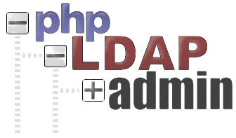
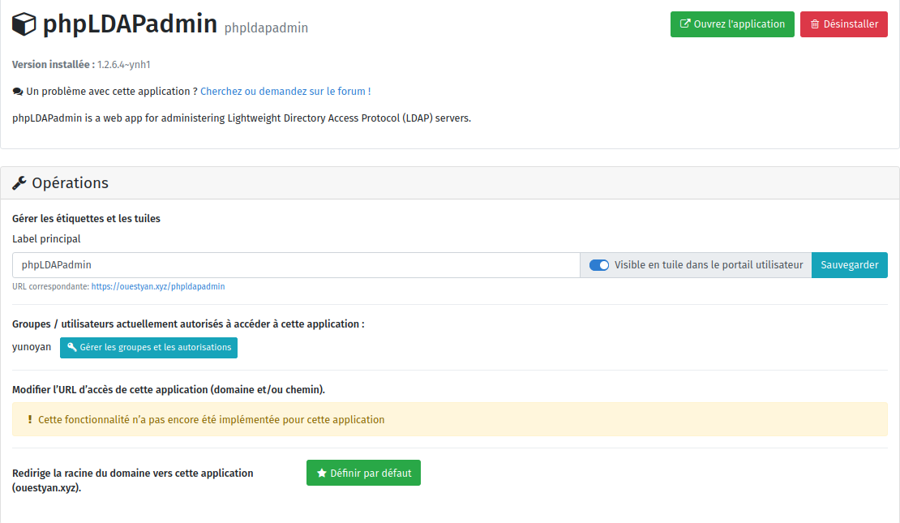
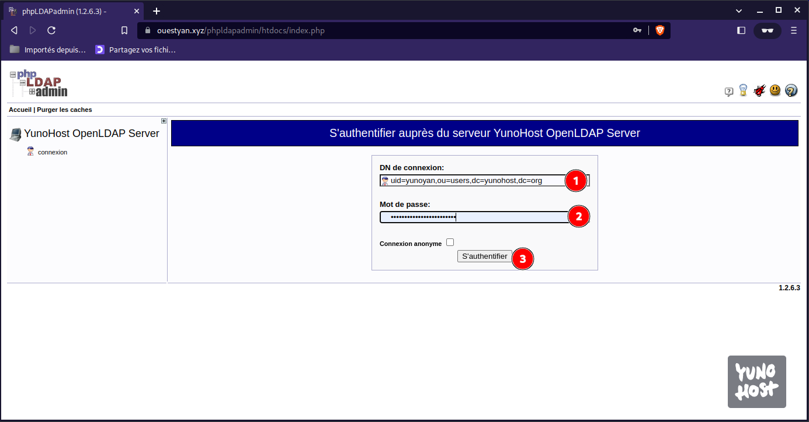
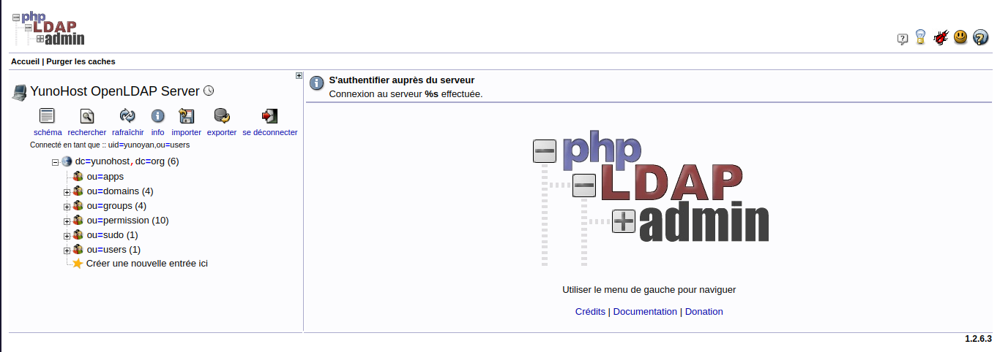
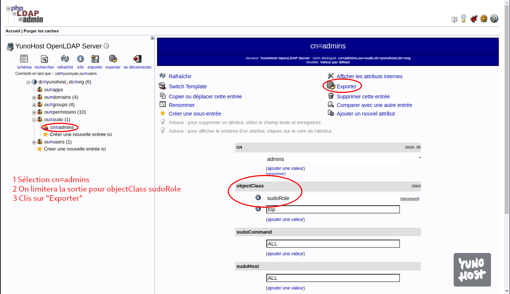
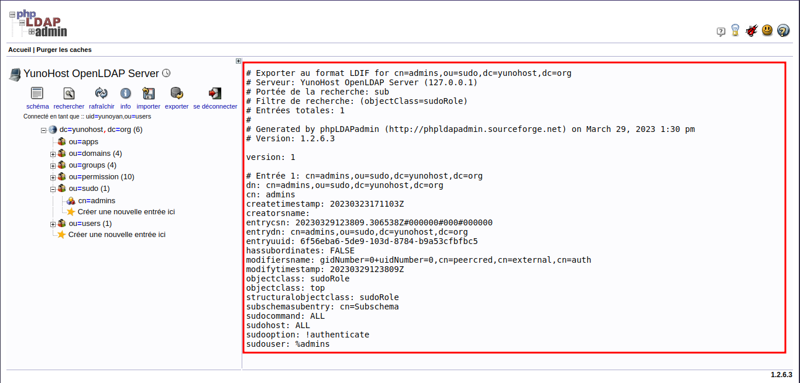
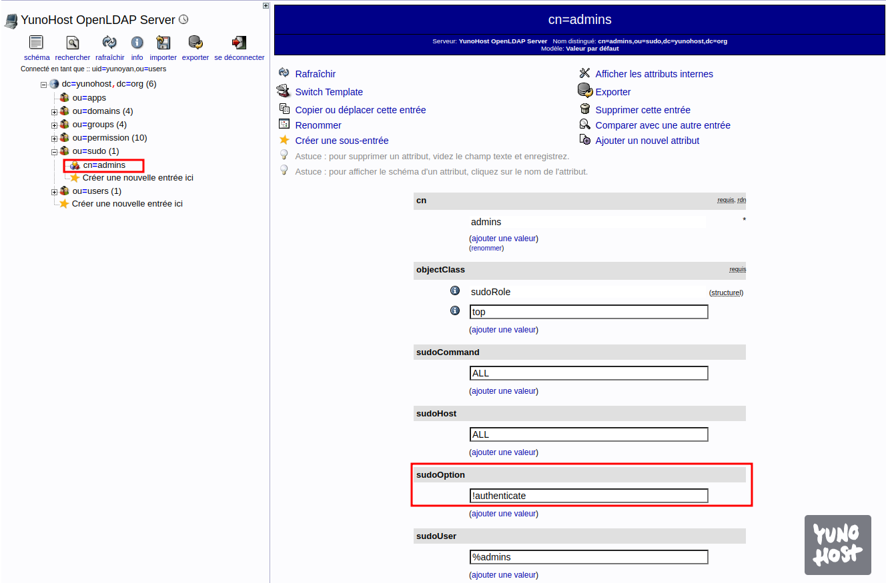

+++
title = 'Yunohost PhpLdapAdmin'
date = 2023-03-29 00:00:00 +0100
categories = ldap
+++


*phpLDAPadmin est une interface écrite en php qui permet de modifier facilement et via une interface conviviale un annuaire LDAP*

## Yunohost PhpLdapAdmin

Installation via l'administration web Yunohost  


### Connexion sur la base ldap

Ouvrir le  llen web domaine/phpldapadmin  


DN de conexion : uid=yunoyan,ou=users,dc=yunohost,dc=org  
Mot de passe : mot de passe administrateur yunohost  

La structure  


### Informations sur la base ldap

Dans un terminal basculer en mode admin : `sudo -s`

<u>Renvoi de toutes les entrées</u>  
Compte tenu des informations précédentes, l'appel suivant renverra toutes les entrées de l'annuaire (sous réserve des limites de taille et de temps configurées) :

    ldapsearch -H ldap://127.0.0.1:389 -x -LLL -b "dc=yunohost,dc=org" -s sub -x "(objectclass=*)"

"objectclass=*" est un filtre de recherche qui correspond à n'importe quelle entrée du répertoire. Étant donné que chaque entrée doit avoir une classe d'objets et que l'attribut objectclass est toujours indexé, il s'agit d'un filtre de recherche utile qui renvoie toutes les entrées.

Extraire la branche **cn=admins** de la base ldap au format de fichier ldif avec PhpLdapAdmin  
  
  
  
Il suffit de copier le résultat dans un fichier .ldif


### Modification de la base ldap

* [How to Configure SUDO via OpenLDAP Server](https://kifarunix.com/how-to-configure-sudo-via-openldap-server/)
* [How To Use LDIF Files to Make Changes to an OpenLDAP System](https://www.digitalocean.com/community/tutorials/how-to-use-ldif-files-to-make-changes-to-an-openldap-system)

#### ldap sudo

Attributs Sudo 

* **sudoOption** : Similaire à l'option Defaults du fichier /etc/sudoers.
    * voici les options du fichier /etc/sudoers et la façon dont vous pouvez les utiliser avec LDAP SUDO :
        * NOPASSWD : !authenticate
        * PASSWD : authentifier
        * NOEXEC : noexec
        * EXEC : !noexec
        * SETENV : setenv
        * NOSETENV : !setenv
        * LOG_INPUT : log_input
        * NOLOG_INPUT : !log_input
        * LOG_OUTPUT : log_output
        * NOLOG_OUTPUT : !log_output
* **sudoUser** : définit un nom d'utilisateur, un ID d'utilisateur (préfixé par '#'), un nom ou un ID de groupe Unix (préfixé par '%' ou '%#' respectivement), un groupe net d'utilisateur (préfixé par '+'), ou un nom ou un ID de groupe non-Unix (préfixé par '%:' ou '%:#' respectivement)
* **sudoHost** : Un nom d'hôte, une adresse IP, un réseau IP, un groupe net d'hôtes (préfixé par un '+') ou une valeur ALL pour correspondre à n'importe quel hôte.
* **sudoRunAsUser** : Un nom d'utilisateur ou un uid (préfixé par '#') sous lequel les commandes peuvent être exécutées ou un groupe Unix (préfixé par '%') ou un groupe net d'utilisateurs (préfixé par '+') qui contient une liste d'utilisateurs sous lesquels les commandes peuvent être exécutées. La valeur ALL correspond à n'importe quel utilisateur.
* **sudoCommand** : Spécifie un nom de commande Unix entièrement qualifié avec des arguments de ligne de commande facultatifs. Utilisez ALL pour correspondre à n'importe quelle commande.

Exemple:  
On veut autoriser l'utilisateur administrateur de Yunohost à exécuter des commandes root sans avoir à saisir le mot de passe

Il faut ajouter l'option **sudoOption** avec pour valeur `!authenticate`  à la branche **cn=admins**  
Créer un fichier `add-to-sudo-role.ldif` 

```bash
cat > add-to-sudo-role.ldif << 'EOL'
dn: cn=admins,ou=sudo,dc=yunohost,dc=org
changetype: modify
add: sudoOption
sudoOption: !authenticate
EOL
```

Puis dans un terminal en mode administrateur, exécuter la commande suivante

    ldapmodify -Y EXTERNAL -H ldapi:/// -f add-to-sudo-role.ldif

Vérification dans PhpLdapAdmin  
  
