+++
title = 'Podman développer, gérer et exécuter des conteneurs'
date = 2023-04-12 00:00:00 +0100
categories = virtuel
+++
  

*Podman (« POD manager ») est un outil Open Source qui sert à développer, gérer et exécuter des conteneurs sur des systèmes Linux®. Développé par des ingénieurs Red Hat® et des membres de la communauté Open Source, Podman gère l'ensemble de l'écosystème de conteneurs à l'aide de la bibliothèque libpod.  
Son architecture inclusive et sans démon le rend plus accessible et sécurisé pour gérer les conteneurs.Ceci permet d’accéder aux différentes applications virtualisées sans droits root.  
Il est également possible d’utiliser les principales commandes de Docker dans Podman, il suffit d’utiliser l’alias `alias docker=podman`*

Podman se distingue également par ses pods qui sont un regroupement de plusieurs conteneurs au sein d’un namespace Linux commun et partageant certaines ressources.  
Podman permet d’exécuter les différents conteneurs sur l’hôte en tant qu’utilisateur habituel, sans droits root. 
Les processus nécessitent uniquement des droits root au sein d’un conteneur. 

Le noyau d’un pod est formé par des **infraconteneurs** responsables exclusivement de la fonctionnalité du groupe et ayant pour fonction de gérer et de garantir les différentes ressources comme les namespaces, les ports réseau, le processeur, la mémoire vive, etc.   
Podman utilise l’outil de monitoring codé en C **Conmon** qui surveille les différents composants virtualisés et sécurise par exemple les journaux et il sert également d’interface avec le terminal du conteneur concerné.Podman utilise en plus le logiciel **runC**.  
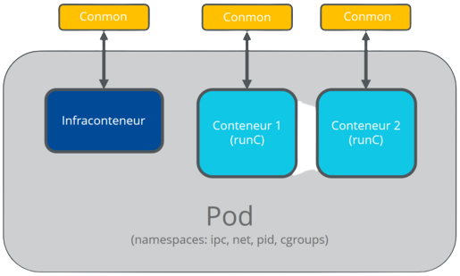{:height="200"}

## Podman sur Arch Linux 

### Installation

Mettez à jour votre système Arch / Manjaro.

```shell
sudo  pacman -Sy archlinux-keyring
sudo pacman-key --populate archlinux
sudo pacman -Syyu
```

Une fois tous les packages mis à jour, procédez à l'installation de Podman sur Arch Linux / Manjaro.

    sudo pacman -S podman

version de Podman installée

```shell
podman --version  
# podman version 4.4.4
```

Vous pouvez également exécuter la commande `podman info` ci-dessous pour obtenir plus d'informations sur votre installation Podman.

<details>
<summary><b>Etendre Réduire "podman info"</b></summary>

  
host:
  arch: amd64
  buildahVersion: 1.29.0
  cgroupControllers:
  - cpu
  - memory
  - pids
  cgroupManager: systemd
  cgroupVersion: v2
  conmon:
    package: /usr/bin/conmon appartient à conmon 1:2.1.7-1
    path: /usr/bin/conmon
    version: 'conmon version 2.1.7, commit: f633919178f6c8ee4fb41b848a056ec33f8d707d'
  cpuUtilization:
    idlePercent: 97.57
    systemPercent: 1.18
    userPercent: 1.25
  cpus: 4
  distribution:
    distribution: endeavouros
    version: unknown
  eventLogger: journald
  hostname: yano-e6230
  idMappings:
    gidmap:
    - container_id: 0
      host_id: 1000
      size: 1
    - container_id: 1
      host_id: 100000
      size: 65536
    uidmap:
    - container_id: 0
      host_id: 1000
      size: 1
    - container_id: 1
      host_id: 100000
      size: 65536
  kernel: 6.2.10-arch1-1
  linkmode: dynamic
  logDriver: journald
  memFree: 14898380800
  memTotal: 16673546240
  networkBackend: netavark
  ociRuntime:
    name: crun
    package: /usr/bin/crun appartient à crun 1.8.3-1
    path: /usr/bin/crun
    version: |-
      crun version 1.8.3
      commit: 59f2beb7efb0d35611d5818fd0311883676f6f7e
      rundir: /run/user/1000/crun
      spec: 1.0.0
      +SYSTEMD +SELINUX +APPARMOR +CAP +SECCOMP +EBPF +CRIU +YAJL
  os: linux
  remoteSocket:
    path: /run/user/1000/podman/podman.sock
  security:
    apparmorEnabled: false
    capabilities: CAP_CHOWN,CAP_DAC_OVERRIDE,CAP_FOWNER,CAP_FSETID,CAP_KILL,CAP_NET_BIND_SERVICE,CAP_SETFCAP,CAP_SETGID,CAP_SETPCAP,CAP_SETUID,CAP_SYS_CHROOT
    rootless: true
    seccompEnabled: true
    seccompProfilePath: /etc/containers/seccomp.json
    selinuxEnabled: false
  serviceIsRemote: false
  slirp4netns:
    executable: /usr/bin/slirp4netns
    package: /usr/bin/slirp4netns appartient à slirp4netns 1.2.0-1
    version: |-
      slirp4netns version 1.2.0
      commit: 656041d45cfca7a4176f6b7eed9e4fe6c11e8383
      libslirp: 4.7.0
      SLIRP_CONFIG_VERSION_MAX: 4
      libseccomp: 2.5.4
  swapFree: 0
  swapTotal: 0
  uptime: 4h 14m 7.00s (Approximately 0.17 days)
plugins:
  authorization: null
  log:
  - k8s-file
  - none
  - passthrough
  - journald
  network:
  - bridge
  - macvlan
  volume:
  - local
registries: {}
store:
  configFile: /home/yano/.config/containers/storage.conf
  containerStore:
    number: 0
    paused: 0
    running: 0
    stopped: 0
  graphDriverName: overlay
  graphOptions: {}
  graphRoot: /home/yano/.local/share/containers/storage
  graphRootAllocated: 105089261568
  graphRootUsed: 7493160960
  graphStatus:
    Backing Filesystem: extfs
    Native Overlay Diff: "true"
    Supports d_type: "true"
    Using metacopy: "false"
  imageCopyTmpDir: /var/tmp
  imageStore:
    number: 0
  runRoot: /run/user/1000/containers
  transientStore: false
  volumePath: /home/yano/.local/share/containers/storage/volumes
version:
  APIVersion: 4.4.4
  Built: 1680009696
  BuiltTime: Tue Mar 28 15:21:36 2023
  GitCommit: c8223435f49a860c8ac4281a85db39232745a7cb-dirty
  GoVersion: go1.20.2
  Os: linux
  OsArch: linux/amd64
  Version: 4.4.4



</details>


Les fichiers de configuration du comportement des conteneurs se trouvent dans `/usr/share/containers/`.  
Vous devez copier les fichiers nécessaires dans `/etc/containers` avant de les modifier.  
Pour configurer l'interface de pont réseau utilisée par Podman, voir `/etc/cni/net.d/87-podman.conflist` 

### Configuration Podman "rootless"

Attention : Podman sans racine repose sur l'utilisation de l'espace de noms de l'utilisateur non privilégié (CONFIG_USER_NS_UNPRIVILEGED) qui a de sérieuses implications en matière de sécurité, voir [Security#Sandboxing applications](https://wiki.archlinux.org/title/Security#Sandboxing_applications) pour plus de détails.
{: .prompt-warning }

Par défaut, seul l'utilisateur root est autorisé à exécuter des conteneurs (ou des espaces de noms en langage kernels). L'exécution de Podman sans root améliore la sécurité car un attaquant n'aura pas les privilèges de root sur votre système, et permet également à plusieurs utilisateurs non privilégiés d'exécuter des conteneurs sur la même machine.

#### Dépendances supplémentaires


Le paquetage [slirp4netns](https://archlinux.org/packages/?name=slirp4netns) est installé en tant que dépendance pour exécuter Podman dans un environnement sans racine.  


Si Podman utilise le backend réseau [netavark](https://archlinux.org/packages/?name=netavark), il est alors nécessaire d'installer [aardvark-dns](https://archlinux.org/packages/?name=aardvark-dns) pour avoir une résolution de nom dans les conteneurs sans racine.

#### Activer les overlays natifs sans racine


Auparavant, il était nécessaire d'utiliser le paquetage [fuse-overlayfs](https://archlinux.org/packages/?name=fuse-overlayfs) pour les montages FUSE dans un environnement sans racine. Cependant, les versions modernes de Podman et du noyau Linux prennent en charge les superpositions sans racine natives, ce qui permet d'obtenir de meilleures performances. Pour migrer de fuse-overlayfs, exécutez


    podman system reset

```
WARNING! This will remove:
        - all containers
        - all pods
        - all images
        - all networks
        - all build cache
        - all machines
        - all volumes
Are you sure you want to continue? [y/N] y
```

Cette commande supprimera malheureusement tous les conteneurs tirés.


Pour vérifier que les superpositions natives sans racine sont activées, exécutez


    podman info

Il devrait y avoir `graphDriverName : overlay` et `Native Overlay Diff : "true"` 

#### Activer kernel unprivileged userns clone

Tout d'abord, vérifiez la valeur de kernel.unprivileged_userns_clone en exécutant :

```shell
sysctl kernel.unprivileged_userns_clone
kernel.unprivileged_userns_clone = 1
```

Si la valeur est actuellement de 0, activez-la en mettant 1 via sysctl ou un paramètre du noyau.

>Remarque : pour linux-hardened, kernel.unprivileged_userns_clone est défini à 0 par défaut.

#### Définir subuid et subgid


Pour que les utilisateurs puissent utiliser Podman sans racine, une entrée de configuration subuid et subgid  doit exister pour chaque utilisateur qui souhaite l'utiliser.  
Les nouveaux utilisateurs créés à l'aide de useradd ont ces entrées par défaut.

Les utilisateurs créés avant la version 4.11 de shadow n'ont pas d'entrées dans `/etc/subuid `et `/etc/subgid` par défaut. Une entrée peut être créée pour eux en utilisant la commande `usermod` ou en modifiant manuellement les fichiers.
{: .prompt-info }


La commande suivante permet à l'utilisateur et au groupe username d'exécuter des conteneurs Podman (ou d'autres types de conteneurs dans ce cas). Elle attribue une plage donnée d'UID et de GID à l'utilisateur et au groupe donnés.

    sudo usermod --add-subuids 100000-165535 --add-subgids 100000-165535 $USER

L'intervalle ci-dessus pour le nom d'utilisateur peut déjà être utilisé par un autre utilisateur, car il définit l'intervalle par défaut pour le premier utilisateur du système. En cas de doute, consultez d'abord les fichiers `/etc/subuid` et `/etc/subgid` pour trouver les plages déjà réservées.

* De nombreuses images nécessitent 65536 uids / gids pour le mappage (notamment les images de base busybox et alpine). Il est recommandé d'allouer au moins ce nombre d'uids / gids pour chaque utilisateur afin de maximiser la compatibilité avec docker.
* Si vous utilisez systemd-homed, l'UID et le GID minimum pour les conteneurs doivent être au moins 524288 (vérifiez la valeur "begin container users" dans la sortie de userdbctl). [1]

#### Propager les changements de subuid et subgid

Podman sans racine utilise un processus de pause pour maintenir en vie les espaces de noms non privilégiés. Cela empêche toute modification des fichiers `/etc/subuid` et `/etc/subgid` d'être propagée aux conteneurs sans racine pendant que le processus de pause est en cours d'exécution.  
Pour que ces changements soient propagés, il est nécessaire d'exécuter 

    podman system migrate

Après cela, l'utilisateur/groupe spécifié dans les fichiers ci-dessus est en mesure de démarrer et d'exécuter les conteneurs Podman.

#### Ajouter les capacités SYS_CHROOT (optionnel)

À partir de la version 4.4, certaines capacités par défaut ont été supprimées, y compris SYS_CHROOT (expliqué dans un billet de blog officiel). Cela affecte les conteneurs qui utilisent chroot (comme archlinux:base) et donc les opérations de pacman échouent à l'intérieur du conteneur (c'est-à-dire l'installation de paquets qui exécutent des scripts de post-installation). Vous pouvez identifier ces problèmes si, lorsque vous construisez avec podman, vous obtenez des erreurs comme celles ci-dessous pendant la construction 

```
...
could not change the root directory (Operation not permitted)
error: command failed to execute correctly
...
```

Pour résoudre ce problème, modifiez le fichier `/etc/containers/containers.conf` et ajoutez le **SYS_CHROOT** à la liste :

/etc/containers/containers.conf

```
default_capabilities = [
  "CHOWN",
  "DAC_OVERRIDE",
  "FOWNER",
  "FSETID",
  "KILL",
  "NET_BIND_SERVICE",
  "SETFCAP",
  "SETGID",
  "SETPCAP",
  "SETUID",
  "SYS_CHROOT",
]
```

Vous pouvez également le faire temporairement depuis la ligne de commande avec `--cap-add sys_chroot` lorsque vous exécutez `podman-build` 

### Stockage

La configuration de la manière et de l'endroit où les images de conteneurs et les instances sont stockées se fait dans le fichier `/etc/containers/storage.conf` 

Lors de l'utilisation de **Rootless Podman**, des dérogations aux paramètres de stockage peuvent être ajoutées à `$XDG_CONFIG_HOME/containers/storage.conf` sur une base individuelle.
Définir le pilote en fonction du système de fichiers utilisé pour l'emplacement de stockage
{: .prompt-info }

### Architectures étrangères

Podman est capable d'exécuter des images construites pour une architecture CPU différente de celle de l'hôte en utilisant le système [Wikipedia:binfmt_misc](https://en.wikipedia.org/wiki/binfmt_misc).

Pour l'activer, installez **qemu-user-static** et **qemu-user-static-binfmt** 

systemd est livré avec le service **systemd-binfmt.service** qui devrait activer les nouvelles règles.

Vérifiez que les règles binfmt ont été ajoutées

    ls /proc/sys/fs/binfmt_misc

```
DOSWin        qemu-cris        qemu-ppc      qemu-sh4eb        status
qemu-aarch64  qemu-m68k        qemu-ppc64    qemu-sparc        
qemu-alpha    qemu-microblaze  qemu-riscv64  qemu-sparc32plus  
qemu-arm      qemu-mips        qemu-s390x    qemu-sparc64      
qemu-armeb    qemu-mipsel      qemu-sh4      register
```

Podman devrait maintenant être capable d'exécuter des images d'architecture étrangère. La plupart des commandes utilisent l'architecture étrangère lorsque l'option --arch est passée.

Exemple :

    podman run --arch arm64 'docker.io/alpine:latest' arch

aarch64

### Docker Compose

Podman 3.0.0 introduit le support de docker-compose. Cela nécessite l'activation d'un socket Podman qui prétend être docker ; démarrez l'unité podman.service.  
Pour les conteneurs sans racine, vous devez démarrer l'unité utilisateur podman.service à la place et définir la variable DOCKER_HOST :

    export DOCKER_HOST="unix://$XDG_RUNTIME_DIR/podman/podman.sock"

Pour obtenir la résolution du nom d'hôte entre les conteneurs en cours d'exécution, installez [podman-dnsname](https://archlinux.org/packages/?name=podman-dnsname) 

Note : Si vous avez activé buildkit dans docker, l'intégration ne fonctionnera pas. Vous devez désactiver buildkit : `$ export DOCKER_BUILDKIT=0`

### GPU NVIDIA

NVIDIA Container Toolkit fournit des conteneurs pour les GPU NVIDIA. Installez le paquet [nvidia-container-toolkit](https://aur.archlinux.org/packages/nvidia-container-toolkit/) 

Testez l'installation :

    podman run --rm nvidia/cuda:12.0.0-runtime-ubuntu20.04 nvidia-smi

Pour pouvoir exécuter des conteneurs sans racine avec podman, le paramètre `no-cgroups` doit être mis à `true` dans `/etc/nvidia-container-runtime/config.toml` 


## Images

Vous pouvez omettre le préfixe de registre dans les images, car Podman cherchera automatiquement l'image dans tous les registres définis dans `/etc/containers/registries.conf` à `unqualified-search-registries` dans l'ordre défini. Les images suivantes contiendront toujours le préfixe, pour permettre des configurations sans docker.io dans la configuration.
{: .prompt-info }

### Arch Linux

La commande suivante extrait l'image Arch Linux x86_64 de Docker Hub.

    podman pull docker.io/archlinux

Voir la page Docker Hub pour une liste complète des balises disponibles, y compris les versions avec et sans outils de construction.


Voir aussi [README.md](https://gitlab.archlinux.org/archlinux/archlinux-docker/blob/master/README.md).

### Alpine Linux

Alpine Linux est un choix populaire pour les petites images de conteneurs, en particulier pour les logiciels compilés sous forme de binaires statiques. La commande suivante extrait la dernière image Alpine Linux de Docker Hub :

    podman pull docker.io/alpine

Alpine Linux utilise l'implémentation [musl](https://musl.libc.org/) libc au lieu de l'implémentation [glibc](https://www.gnu.org/software/libc/) libc utilisée par la plupart des distributions Linux. Parce qu'Arch Linux utilise la glibc, il y a un certain nombre de différences fonctionnelles entre un hôte Arch Linux et un conteneur Alpine Linux qui peuvent avoir un impact sur la performance et la correction des logiciels. Une liste de ces différences est documentée dans <https://wiki.musl-libc.org/functional-differences-from-glibc.html>.

### Debian

La commande suivante extrait la dernière image [Debian](https://hub.docker.com/_/debian) de [Docker Hub](https://hub.docker.com/) :

    podman pull docker.io/debian

Voir la page Docker Hub pour une liste complète des balises disponibles, y compris les versions standard et slim pour chaque version de Debian.


## Résolution des problèmes

### Ajouter une pause au processus

```
WARN[0000] Failed to add pause process to systemd sandbox cgroup: Process org.freedesktop.systemd1 exited with status 1 
```

Peut être résolu en utilisant : <https://github.com/containers/crun/issues/704>

```shell
    # echo +cpu +cpuset +io +memory +pids > /sys/fs/cgroup/cgroup.subtree_control
```

### Le DNS de conteneur ne sera pas activé

```
WARN[0000]  binary not found, container DNS will not be enabled
```

Si vous utilisez [netavark](https://archlinux.org/packages/?name=netavark) comme backend réseau de podman, vous devez installer [aardvark-dns](https://archlinux.org/packages/?name=aardvark-dns).


### Les conteneurs se terminent lors de la déconnexion du shell

Après s'être déconnecté de la machine, les conteneurs Podman sont arrêtés pour certains utilisateurs. Pour éviter cela, [activez l'option lingering](https://wiki.archlinux.org/title/Systemd/User#Automatic_start-up_of_systemd_user_instances) pour les utilisateurs qui utilisent des conteneurs.


Vous pouvez également créer une unité utilisateur systemd comme décrit dans [podman-auto-update(1) § EXEMPLES](https://man.archlinux.org/man/podman-auto-update.1#EXAMPLES).


### Échec du déplacement de netns sans racine

    docker-compose up

```
ERRO[0000] failed to move the rootless netns slirp4netns process to the systemd user.slice: Process org.freedesktop.systemd1 exited with status 1
```

Peut être résolu en démarrant/activant **podman.service** 

### Aucune image trouvée

Par défaut, la liste de registre n'est pas remplie car les fichiers du paquet proviennent de l'amont. Cela signifie que par défaut, essayer d'extraire une image sans spécifier le registre résultera en une erreur similaire à la suivante 

```
Error: short-name "archlinux" did not resolve to an alias and no unqualified-search registries are defined in "/etc/containers/registries.conf"
```

Une configuration de départ pourrait être la suivante :

/etc/containers/registries.conf.d/00-unqualified-search-registries.conf

```
unqualified-search-registries = ["docker.io"]
```

/etc/containers/registries.conf.d/01-registries.conf

```
[[registry]]
location = "docker.io"```
```

Ceci est équivalent à la configuration par défaut de Docker.

Une alternative moins pratique, mais plus compatible avec les systèmes sans noms courts configurés, consiste à utiliser le chemin complet du registre dans le **Containerfile** ou le **Dockerfile**.

Containerfile

```
FROM docker.io/archlinux/archlinux
```

### OCI Permission refusée 

    podman exec openvas_openvas_1 bash

```
Error: crun: writing file `/sys/fs/cgroup/user.slice/user-1000.slice/user@1000.service/user.slice/libpod-b3e8048a9b91e43c214b4d850ac7132155a684d6502e12e22ceb6f73848d117a.scope/container/cgroup.procs`: Permission denied: OCI permission denied
```

Peut être résolu : [BBS#253966](https://bbs.archlinux.org/viewtopic.php?id=253966)

```shell
$ env DBUS_SESSION_BUS_ADDRESS= podman ...
$ env DBUS_SESSION_BUS_ADDRESS= podman-compose ...
```

### Pousser des images vers Docker Hub, accès refusé authentification requise

Lors de l'utilisation de podman push pour pousser des images de conteneurs vers Docker Hub, les erreurs suivantes peuvent se produire :  
`Requested access to the resource is denied` ou `Authentication required`  
Les conseils suivants peuvent aider à résoudre les problèmes potentiels :

Marquez l'image locale :

```shell
podman tag <localImage> docker.io/<dockerHubUsername>/<dockerHubRepository>:<Tag>
```

Pousser l'image étiquetée :

```shell
podman push docker.io/<dockerHubUsername>/<dockerHubRepository>:<Tag> docker://docker.io/<dockerHubUsername>/<dockerHubRepository>:<Tag>
```

Connectez-vous à docker.io, au référentiel Docker Hub et au serveur Docker Hub Registry :

```shell
podman login -u <DockerHubUsername> -p <DockerHubPassword> registry-1.docker.io
podman login -u <DockerHubUsername> -p <DockerHubPassword> docker.io/<dockerHubUsername>/<dockerHubRepository>
podman login -u <DockerHubUsername> -p <DockerHubPassword> docker.io
```

Se déconnecter de tous les registres avant la connexion, par exemple,

```shell
podman logout --all
```

Ajouter `<dockerHubUsername>` comme collaborateur dans l'onglet Docker Hub Collaborators du dépôt.

### "/" is not a shared mount

```shell
WARN[0000] "/" is not a shared mount, this could cause issues or missing mounts with rootless containers
```

Buildah/Podman fonctionnant en tant que rootless s'attend à ce que le montage bind soit partagé, vérifiez s'il est défini sur private :

    findmnt -o PROPAGATION /

```shell
PROPAGATION
private
```

Dans ce cas, voir [mount  § Shared_subtree_operations](https://man.archlinux.org/man/mount.8#Shared_subtree_operations) et définir **temporairement** le montage comme partagé avec :

    mount --make-shared /

Pour le définir de manière permanente, éditez le fichier /etc/fstab et ajoutez l'option shared au montage souhaité, puis redémarrez. Il en résultera une entrée du type

/etc/fstab

```shell
# <device> <dir> <type> <options> <dump> <fsck>
UUID=0a3407de-014b-458b-b5c1-848e92a327a3 / ext4 defaults,shared 0 1
```

## Utiliser Podman

### Activation des registres OCI

Avant d'utiliser Podman pour créer des conteneurs, assurez-vous que Podman peut communiquer avec les registres OCI . Podman prend en charge plusieurs registres OCI simultanément afin que vous puissiez créer des conteneurs à l'aide de différents référentiels.

Ouvrez le fichier `/etc/containers/registries.conf` avec l'éditeur de texte de votre choix. Ce fichier définit tous les registres avec lesquels Podman peut communiquer. Podman consulte ce fichier pour savoir à quels registres il doit se connecter.

    sudo nano /etc/containers/registries.conf

Maintenant, remplissez le fichier registries.conf avec les lignes suivantes, enregistrez les modifications et fermez l'éditeur.

```
[registries.search]
registries = ['registry.access.redhat.com', 'quay.io', 'docker.io']
```

Ces lignes configurent Podman pour utiliser le registre public sur Docker Hub ( docker.io , register.access.redhat.com ) et le registre privé ( quay.io ), ce qui est recommandé.

### Exécuter des conteneurs Podman avec des privilèges Podman

Maintenant que vous avez installé Podman et configuré les registres, vous pouvez commencer à exécuter des conteneurs Podman avec les privilèges Podman. Le noyau Linux prend en charge un large éventail de contrôles d'autorisations sur ses appels système, tels que les [fonctionnalités (capabilities)](https://man7.org/linux/man-pages/man7/capabilities.7.html) .

Dans le cas des conteneurs Podman, les fonctionnalités contrôlent le comportement par défaut de root dans l'espace de noms de l'utilisateur. Vous pouvez utiliser l'indicateur `--privileged` lors de l'exécution d'un conteneur pour ajouter toutes les fonctionnalités qui ne sont pas déjà présentes dans le conteneur.

1. Exécutez la commande `podman run` ci-dessous pour créer un conteneur fedora sans fonctionnalités.

        podman run -d fedora sleep 100

    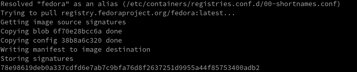  
    *Création d'un conteneur Fedora*

        podman run -d fedora sleep 100

    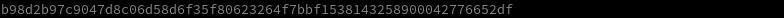  

2. Ensuite, exécutez la commande `podman top` ci-dessous pour répertorier toutes les fonctionnalités.

        podman top -l capeff 

    Comme indiqué ci-dessous, le conteneur sans racine standard a des capacités limitées.  
    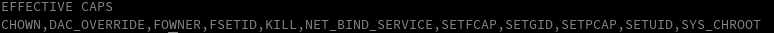  
    *Lister toutes les capacités* 

3. Exécutez la commande `podman run` ci-dessous pour créer un conteneur avec toutes les fonctionnalités ( --privileged).

        podman run --privileged -d fedora sleep 100

      

4. Enfin, réexécutez la commande `podman top` pour vérifier la différence de capacités.

        podman top -l capeff

    Vous remarquerez que toutes les fonctionnalités sont disponibles pour ce conteneur en raison de l'indicateur `--privileged` qui permet au conteneur de s'exécuter avec toutes les fonctionnalités, pas seulement celles déjà présentes dans le conteneur. Cet indicateur est important car il mappe l'espace de noms d'utilisateur du conteneur à l'espace de noms de l'hôte, lui donnant toutes les capacités des processus exécutés sur votre système.
    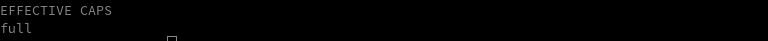  
    *Vérification de la différence d'autorisations* 

Si vous ne définissez pas l'indicateur `--privileged` lors du lancement d'un conteneur, le conteneur aura un ensemble restreint de fonctionnalités. Dans le cas de conteneurs qui utilisent leur propre espace de noms d'utilisateur, vous devrez leur donner explicitement toutes les fonctionnalités.
{: .prompt-info }

### Travailler avec des images et des conteneurs Podman

Maintenant que vous avez appris à ajouter des registres et des fonctionnalités OCI pour un conteneur, vous pouvez travailler avec des images et des conteneurs Podman. 

Pour cette démo, vous utiliserez NGINX pour une image afin de créer un conteneur.

1. Exécutez la commande `podman search` ci-dessous pour répertorier toutes les images Podman disponibles pournginx

        podman search nginx

    Ci-dessous, vous pouvez voir que vous obtenez toutes les images étiquetées disponibles pour NGINX à partir des référentiels docker.io , quay.io et redhat.com que vous avez ajoutés précédemment  
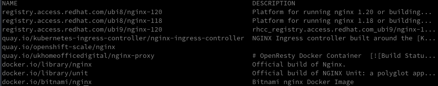  
    *Liste des 3 images par registre Podman disponibles pour NGINX*

2. Après avoir choisi une image NGINX à utiliser, exécutez la podmancommande ci-dessous pour télécharger ( pull) l'image sur votre ordinateur local.

    Cette démo utilise nginx:alpine car il s'agit de la plus petite image et ne peut s'exécuter que sur la mémoire, ce qui permet de gagner du temps sur les étapes de construction ultérieures.

        podman pull nginx:alpine

    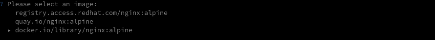  
*Sélectionner une image*  
    À ce stade, vous disposez d'une nouvelle image que vous pouvez utiliser pour créer un conteneur ou l'utiliser comme image de base pour d'autres conteneurs.
Téléchargement de l'image NGINX Téléchargement de l'image NGINX

3. Exécutez la commande `podman images` pour voir les informations de votre nouvelle image

    podman images

    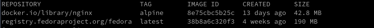  
    *Lister toutes les images*

4. Maintenant, exécutez la commande `podman run` ci-dessous pour créer un conteneur à partir de l'image ( nginx:alpine) et exécutez un nginxserveur sur cette image.

    Cette commande effectue les opérations suivantes :

    * Démarre le conteneur de manière interactive ( `-it`) et vous permet d'attacher un terminal.
    * Supprime (`--rm`) le conteneur après sa sortie/arrêt.
    * Exécute le conteneur en arrière-plan ( `--d`) et publie ( `-p`) le port 80 sur toutes les interfaces à porter 8080 sur le conteneur.
    * Spécifiez le nom du conteneur ( `--name web`).

            podman run -it --rm -d -p 8080:80 --name web nginx:alpine

    Vous obtiendrez un ID de conteneur aléatoire, comme indiqué ci-dessous, que vous pourrez utiliser pour surveiller/démarrer/arrêter/supprimer le conteneur. Notez l'ID du conteneur car il est utile lors de la vérification des journaux ou de l'arrêt d'un conteneur spécifique.  
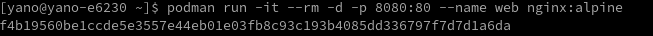  
*Exécution du conteneur (web)*

5. Exécutez la commande `podman ps` ci-dessous (sans arguments) pour vérifier si votre conteneur est en cours d'exécution.

        podman ps

    Vous pouvez voir que le conteneur Web est Up et utilise le port 8080/TCP sur votre machine hôte pour exposer sa ressource.  
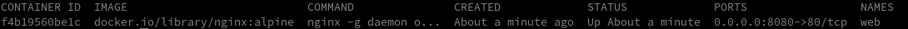  
*Vérifier si le conteneur (web) est en cours d'exécution*

6. Pour une double vérification, ouvrez votre navigateur Web et accédez à **localhost:8080** ou **your-server-ip:8080** , où **your-server-ip** est l'adresse IP de votre serveur.

    Si votre conteneur fonctionne, vous verrez l'écran d'accueil NGINX par défaut, comme illustré ci-dessous.  
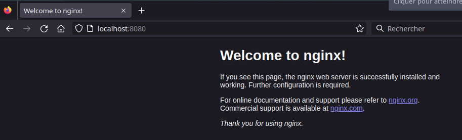  
*Affichage de l'écran d'accueil NGINX par défaut*

    Si vous n'êtes pas sûr de la configuration du conteneur ou s'il contient des erreurs, exécutez la commande podman logs ci-dessous pour obtenir les fichiers journaux du conteneur. Remplacez mycontainer par votre ID de conteneur cible.

        podman logs mycontainer

    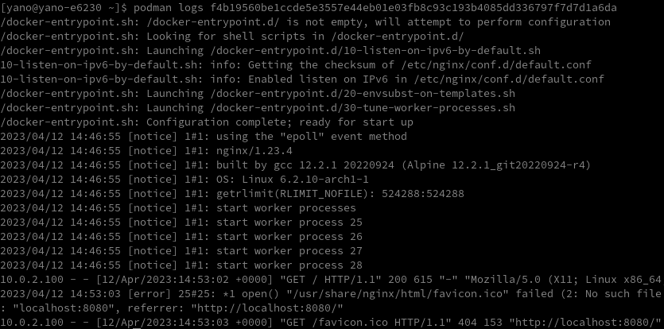  
    *Vérification des fichiers journaux pour le conteneur (Web)*

7. Exécutez l'une des commandes `podman stop` ci-dessous pour arrêter votre conteneur. Remplacez mycontainer  par votre ID de conteneur cible ou remplacez-le web par le nom réel du conteneur.

    Puisque vous avez utilisé l'indicateur –rm à l'étape quatre, Podman supprime votre conteneur dès que vous arrêtez ce conteneur. Cette configuration permet de garder votre espace de travail sans encombrement.

    Stops the container by Container ID
        
        podman stop f4b19560be1ccde5e3557e44eb01e03fb8c93c193b4085dd336797f7d7d1a6da
        
    Stops the container by Container Name
        
        podman stop web

      
    *Arrêt d'un conteneur* 

8. Enfin, exécutez la commande `podman ps` pour répertorier tous les conteneurs, y compris un conteneur arrêté.

        podman ps -a

    Votre conteneur a été supprimé lorsque vous l'avez précédemment arrêté, vous n'obtiendrez donc rien sur la liste, comme indiqué ci-dessous.  
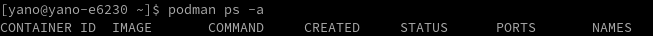  
*Vérification du conteneur arrêté*


## Liens

* [Apprendre docker](https://devopssec.fr/category/apprendre-docker)
* Podman
    * [Podman Tutorial - Basics for Beginners](/htmldoc/Podman Tutorial - Basics for Beginners.html)
    * [How to Install and Use Podman (Docker Alternative)](https://adamtheautomator.com/podman/)
    * [Podman : Gérer ses Pods !](https://www.grottedubarbu.fr/podman-manage-pod/)
* Réseau
    * [Fonctionnement et manipulation du réseau dans Docker](https://devopssec.fr/article/fonctionnement-manipulation-reseau-docker)
    * [Docker : Docker Network](https://www.server-world.info/en/note?os=Debian_11&p=docker&f=8)
* Partage entre host et container
    * [How to share data between a Docker container and host system using volumes](https://linuxconfig.org/how-to-share-data-between-a-docker-container-and-host-system-using-volumes)
    * [How To Share Data Between the Docker Container and the Host](https://www.digitalocean.com/community/tutorials/how-to-share-data-between-the-docker-container-and-the-host)
