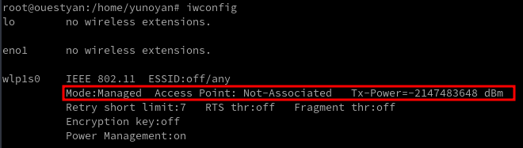
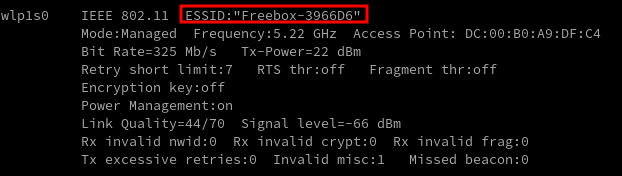
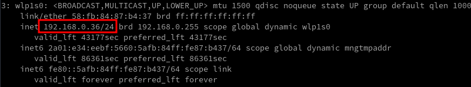
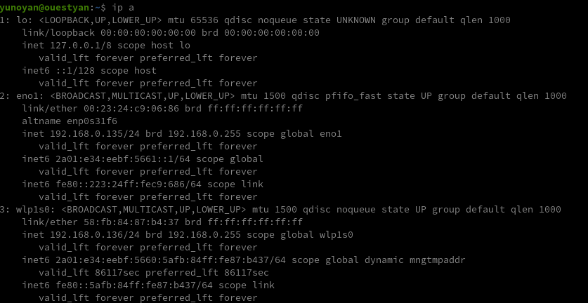
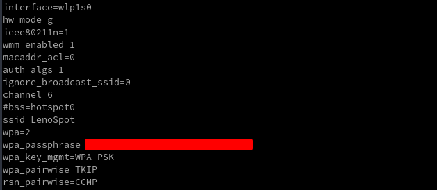
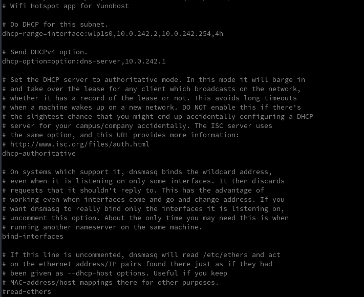
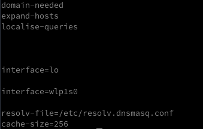

+++
title = 'Yunohost Hotspot - Point d'accès wifi'
date = 2023-04-21 00:00:00 +0100
categories = yunohost
+++
- [Lenovo Module wifi bluetooth](#lenovo-module-wifi-bluetooth)
    - [BIOS - Activation périphérique wifi/bluetooth](#bios---activation-périphérique-wifibluetooth)
    - [Firmware iwlwifi](#firmware-iwlwifi)
    - [Cli - Connexion réseau wifi](#cli---connexion-réseau-wifi)
    - [Connexion automatique au démarrage du système](#connexion-automatique-au-démarrage-du-système)
    - [Comment obtenir une adresse IP statique](#comment-obtenir-une-adresse-ip-statique)
    - [Supprimer prise en charge bluetooth](#supprimer-prise-en-charge-bluetooth)
- [Wifi Hotspot pour YunoHost](#wifi-hotspot-pour-yunohost)
    - [Installation](#installation)

## Lenovo Module wifi bluetooth

### BIOS - Activation périphérique wifi/bluetooth

Une activation du périphérique est à effectuer dans le BIOS  

Le périphérique wireless

    lspci

```
01:00.0 Network controller: Intel Corporation Dual Band Wireless-AC 3165 Plus Bluetooth (rev 99)
```

### Firmware iwlwifi

Installer le firmware correspondant au module Wireless-AC 3165

    sudo apt install firmware-iwlwifi 

<u>Correction erreur</u> ` failed to load iwl-debug-yoyo.bin`

```
Apr 15 13:47:59 ouestyan.xyz kernel: Intel(R) Wireless WiFi driver for Linux
Apr 15 13:47:59 ouestyan.xyz kernel: iwlwifi 0000:01:00.0: firmware: direct-loading firmware iwlwifi-7265D-29.ucode
Apr 15 13:47:59 ouestyan.xyz kernel: iwlwifi 0000:01:00.0: Found debug destination: EXTERNAL_DRAM
Apr 15 13:47:59 ouestyan.xyz kernel: iwlwifi 0000:01:00.0: Found debug configuration: 0
Apr 15 13:47:59 ouestyan.xyz kernel: iwlwifi 0000:01:00.0: loaded firmware version 29.4063824552.0 7265D-29.ucode op_mode iwlmvm
Apr 15 13:47:59 ouestyan.xyz kernel: iwlwifi 0000:01:00.0: firmware: failed to load iwl-debug-yoyo.bin (-2)
Apr 15 13:47:59 ouestyan.xyz kernel: firmware_class: See https://wiki.debian.org/Firmware for information about missing firmware
```

faux message car le binaire èiwl-debug-yoyo.binè n'existe pas.  
La correction implique la création d'un fichier

    sudo nano /etc/modeprobe.d/iwlwifi.conf

Avec le contenu suivant

```
options iwlwifi enable_ini=N
```

Il faut regénérer l'image

    sudo update-initramfs -u

Le matériel , exécuter `lspci`

```
01:00.0 Network controller: Intel Corporation Dual Band Wireless-AC 3165 Plus Bluetooth (rev 99)
```

Les pilotes et interfaces réseau


```
    dmesg | grep iwlwifi

[    2.988898] iwlwifi 0000:01:00.0: firmware: direct-loading firmware iwlwifi-7265D-29.ucode
[    2.988908] iwlwifi 0000:01:00.0: Found debug destination: EXTERNAL_DRAM
[    2.988909] iwlwifi 0000:01:00.0: Found debug configuration: 0
[    2.989153] iwlwifi 0000:01:00.0: loaded firmware version 29.4063824552.0 7265D-29.ucode op_mode iwlmvm
[    3.310353] iwlwifi 0000:01:00.0: Detected Intel(R) Dual Band Wireless AC 3165, REV=0x210
[    3.340907] iwlwifi 0000:01:00.0: Applying debug destination EXTERNAL_DRAM
[    3.341539] iwlwifi 0000:01:00.0: Allocated 0x00400000 bytes for firmware monitor.
[    3.348442] iwlwifi 0000:01:00.0: base HW address: 58:fb:84:87:b4:37
[    3.424213] iwlwifi 0000:01:00.0 wlp1s0: renamed from wlan0
```

### Cli - Connexion réseau wifi

[Connect to Wi-Fi From Terminal on Debian 11/10 with WPA Supplicant](https://www.linuxbabe.com/debian/connect-to-wi-fi-from-terminal-on-debian-wpa-supplicant)  
Se connecter à un réseau Wi-Fi à partir de la ligne de commande sur le serveur et l'ordinateur de bureau Debian 11/10 en utilisant **wpa_supplicant**, qui est une implémentation du composant supplicant pour le protocole WPA. Dans un réseau local sans fil, un supplicant est un logiciel client installé sur l'ordinateur de l'utilisateur final qui doit être authentifié pour rejoindre un réseau.

Installer les outils wireless

    sudo apt install wireless-tools

wlan0 est un nom commun pour une interface réseau sans fil sur les systèmes Linux. Sur les distributions Linux basées sur systemd, il porte un nom différent



Comme vous pouvez le voir, l'interface sans fil n'est associée à aucun point d'accès pour le moment. Exécutez ensuite la commande suivante pour afficher l'interface sans fil.

    sudo ip link set dev wlp1s0 up

Ensuite, trouvez le nom de votre réseau sans fil en analysant les réseaux voisins à l'aide de la commande ci-dessous.

    sudo iwlist wlp1s0 scan | grep ESSID

```
                    ESSID:"SFR_1500"
                    ESSID:"Freebox-3966D6"
                    ESSID:"SFR WiFi Mobile"
                    ESSID:"SFR_DE88"
                    ESSID:"SFR WiFi FON"
                    ESSID:""
                    ESSID:"bh-ssid-398704E204815469"
                    ESSID:"Freebox-3966D6"
```

Installer le logiciel wpa_supplicant 

    sudo apt install wpasupplicant

Créer un fichier nommé wpa_supplicant.conf à l'aide de l'utilitaire wpa_passphrase. wpa_supplicant.conf est le fichier de configuration décrivant tous les réseaux auxquels l'utilisateur souhaite que l'ordinateur se connecte. Exécutez la commande suivante pour créer ce fichier.Remplacez l'ESSID (nom du réseau) et la phrase de passe Wi-Fi par les vôtres.  
*La sortie de la commande wpa_passphrase sera acheminée vers tee, puis écrite dans le fichier /etc/wpa_supplicant/wpa_supplicant.conf.*

    wpa_passphrase your-ESSID your-wifi-passphrase | sudo tee -a /etc/wpa_supplicant/wpa_supplicant.conf

```
network={
	ssid="Freebox-3966D6"
	psk=ecf946dac3d092023f3adbb4708422903dba81b202b7434c5bffe6887dcfc096
}
```

Si votre ESSID contient des espaces tels que (linuxbabe WiFi), vous devez mettre l'ESSID entre guillemets ("linuxbabe WiFi") dans la commande ci-dessus.
{: .prompt-info }

Commande suivante pour se connecter au point d'accès sans fil.

    sudo wpa_supplicant -c /etc/wpa_supplicant/wpa_supplicant.conf -i wlp1s0

La sortie suivante indique que votre carte sans fil est connectée avec succès à un point d'accès.

```
Successfully initialized wpa_supplicant
wlp1s0: SME: Trying to authenticate with dc:00:b0:a9:df:c4 (SSID='Freebox-3966D6' freq=5220 MHz)
wlp1s0: Trying to associate with dc:00:b0:a9:df:c4 (SSID='Freebox-3966D6' freq=5220 MHz)
wlp1s0: Associated with dc:00:b0:a9:df:c4
wlp1s0: CTRL-EVENT-SUBNET-STATUS-UPDATE status=0
wlp1s0: WPA: Key negotiation completed with dc:00:b0:a9:df:c4 [PTK=CCMP GTK=CCMP]
wlp1s0: CTRL-EVENT-CONNECTED - Connection to dc:00:b0:a9:df:c4 completed [id=0 id_str=]
```

Par défaut, wpa_supplicant s'exécute au premier plan. Si la connexion est faite, ouvrez une autre fenêtre de terminal et exécutez

    sudo iwconfig

Vous pouvez voir que l'interface sans fil est maintenant associée à un point d'accès.  


Vous pouvez appuyer sur CTRL+C pour arrêter le processus wpa_supplicant en cours et l'exécuter en arrière-plan en ajoutant le drapeau `-B`.

    sudo wpa_supplicant -B -c /etc/wpa_supplicant/wpa_supplicant.conf -i wlp1s0

*Successfully initialized wpa_supplicant*  
Bien que nous soyons authentifiés et connectés à un réseau sans fil, nous n'avons pas encore d'adresse IP. Pour obtenir une adresse IP privée à partir du serveur DHCP, utilisez la commande suivante :

    sudo dhclient wlp1s0

Votre interface sans fil dispose désormais d'une adresse IP privée, qui peut être affichée à l'aide de la commande suivante : ip addr show wlp4s0

    ip addr show wlp1s0



Vous pouvez maintenant accéder à Internet  
Pour libérer l'adresse IP privée, exécutez

    sudo dhclient wlp1s0 -r

### Connexion automatique au démarrage du système

Pour se connecter automatiquement à un réseau sans fil au démarrage du système, nous devons éditer le fichier wpa_supplicant.service. C'est une bonne idée de copier le fichier du répertoire /lib/systemd/system/ vers le répertoire /etc/systemd/system/, puis d'éditer le contenu du fichier, car nous ne voulons pas qu'une version plus récente de wpa_supplicant annule nos modifications.

    sudo cp /lib/systemd/system/wpa_supplicant.service /etc/systemd/system/wpa_supplicant.service

Editez le fichier avec un éditeur de texte en ligne de commande, tel que Nano.

    sudo nano /etc/systemd/system/wpa_supplicant.service

Trouvez la ligne suivante.

    ExecStart=/sbin/wpa_supplicant -u -s -O /run/wpa_supplicant

Remplacez-la par ce qui suit. Ici, nous avons ajouté le fichier de configuration et le nom de l'interface sans fil à la commande ExecStart.

    ExecStart=/sbin/wpa_supplicant -u -s -c /etc/wpa_supplicant/wpa_supplicant.conf -i wlp1s0

Il est recommandé de toujours essayer de redémarrer wpa_supplicant lorsqu'un échec est détecté. Ajoutez ce qui suit juste en dessous de la ligne `ExecStart`.

    Restart=always

Enregistrez et fermez le fichier. (Pour enregistrer un fichier dans l'éditeur de texte Nano, appuyez sur Ctrl+O, puis sur Entrée pour confirmer. Pour quitter, appuyez sur Ctrl+X). Rechargez ensuite systemd.

    sudo systemctl daemon-reload

Relancer le service wpa_supplicant 

    sudo systemctl restart wpa_supplicant.service

### Comment obtenir une adresse IP statique

Modifier la connexion réseau

    sudo nano /etc/network/interfaces

Y ajouter les lignes suivantes

```
auto wlp1s0
iface wlp1s0 inet static
 address 192.168.0.136
 netmask 255.255.255.0
 gateway 192.168.0.254
```

Redémarrer le serveur debian  

Vérification  


### Supprimer prise en charge bluetooth

Il faut d'abord vérifier les informations concernant le module du noyau chargé bluetooth.ko et l'alias de chargement de module qui lui est assigné 

    sudo modinfo bluetooth

```
filename:       /lib/modules/5.10.0-21-amd64/kernel/net/bluetooth/bluetooth.ko
alias:          net-pf-31
license:        GPL
version:        2.22
description:    Bluetooth Core ver 2.22
author:         Marcel Holtmann <marcel@holtmann.org>
srcversion:     4D9669AF02AA7F1EDD7FE45
depends:        libaes,rfkill,ecdh_generic,crc16
retpoline:      Y
intree:         Y
name:           bluetooth
vermagic:       5.10.0-21-amd64 SMP mod_unload modversions 
```

Désactiver les modules / pilotes Bluetooth du noyau Linux

Tapez la commande suivante pour désactiver le pilote :
Le système de chargement des modules du noyau peut être configuré pour empêcher le chargement du module Bluetooth.

```shell
sudo -s
echo 'alias net-pf-31 off' > /etc/modprobe.d/bluetooth.conf
```


## Wifi Hotspot pour YunoHost

> *Ce package vous permet d'installer Wifi Hotspot rapidement et simplement sur un serveur YunoHost. Diffusez un point d'accès Wi-Fi depuis votre serveur auto-hébergé.*

* Site officiel de l'application : https://internetcu.be/
* Documentation YunoHost pour cette app : https://yunohost.org/app_hotspot
* Signaler un bug : https://github.com/YunoHost-Apps/hotspot_ynh/issues
* [Point d'accès wifi dhcpd sur raspberry (Raspbian Buster)](/posts/Hotspot-wifi-dhcpd-raspberry-(Raspbian-Buster)/)

### Installation 

depuis la branche testing

```shell
sudo yunohost app install https://github.com/YunoHost-Apps/hotspot_ynh/tree/testing --debug
ou
sudo yunohost app upgrade hotspot -u https://github.com/YunoHost-Apps/hotspot_ynh/tree/testing --debug
```

Le déroulement des opérations

```shell
97   DEBUG initializing base actions map parser for cli
97   DEBUG loading actions map
98   DEBUG building parser...
107  DEBUG building parser took 0.009s
108  DEBUG acquiring lock...
117  DEBUG lock has been acquired
137  DEBUG loading python module yunohost.app took 0.020s
137  DEBUG processing action [2601.1]: yunohost.app.install with args={'app': 'https://github.com/YunoHost-Apps/hotspot_ynh/tree/testing', 'label': None, 'args': None, 'no_remove_on_failure': False, 'force': False}
248  DEBUG Using selector: EpollSelector
DANGER! This app is not part of YunoHost's app catalog. Installing third-party apps may compromise the integrity and security of your system. You shou
ld probably NOT install it unless you know what you are doing. NO SUPPORT will be provided if this app doesn't work or breaks your system... If you ar
e willing to take that risk anyway, type 'Yes, I understand':
52821 DEBUG Checking default branch
53316 DEBUG Downloading...
54100 DEBUG Done
54577 DEBUG Checking requirements for hotspot...
54606 DEBUG Checking that required services are up and running...
Info: After installation, you will be able to configure the application from YunoHost's webadmin in Applications > Hotspot > Configuration.
Choose a wifi name (SSID): LenoSpot
Choose a wifi password (at least 8 characters for WPA2): ******************************
[...]
134863 SUCCESS Installation completed
134866 DEBUG To view the log of the operation 'Install the 'hotspot' app', use the command 'yunohost log show 20230421-121813-app_install-hotspot'
134874 DEBUG action [2601.1] executed in 134.737s
134874 DEBUG lock has been released
```

Pour éviter le "no internet access" sur le point d'accès il afut ajouter la ligne suivante  
`interface=wlp1s0`  
au fichier `/etc/dnsmasq.conf` et redémarrer le service `sudo systemctl restart dnsmasq`


La configuration  

`/etc/hostapd/hostapd.conf`  


`/etc/default/hostapd`  


`/etc/dnsmasq.dhcpd/dhcpdv4-ssid0.conf`  


`/etc/dnsmasq.conf`  


`sudo iptables -t nat -S`  

