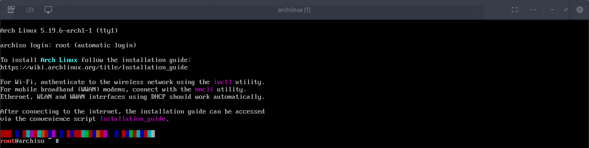
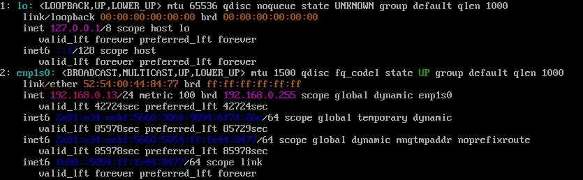
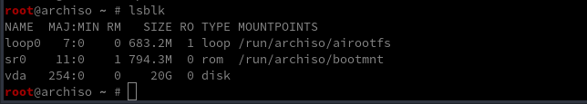
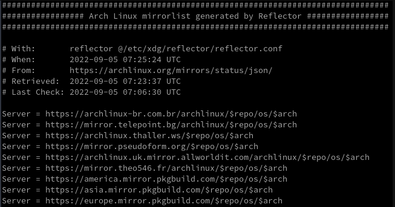
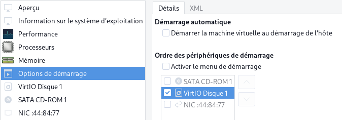

+++
title = 'Qemu/KVM PC1 - installation machine virtuelle Archlinux XFCE'
date = 2023-04-24 00:00:00 +0100
categories = ['virtuel']
+++
*On va créer et installer Archlinux XFCE dans une machine virtuelle montée sur Archlinux en suivant la documentation  [installation archlinux (FR)](https://wiki.archlinux.org/title/Installation_guide_(Fran%C3%A7ais)) car 
EndavourOS XFCE, qui est une distribution très proche d'archlinux, ne peut pas être installé avec "calamarès" sur un système partitionné LVM*


## Prérequis

*Qemu/KVM est installé sur la machine hôte*

### Réseau host-bridge

Vérification

Liste des réseaux déclarés

    virsh net-list --all

```
 Nom           État      Démarrage automatique   Persistent
-------------------------------------------------------------
 default       inactif   no                      Oui
 host-bridge   actif     Oui                     Oui
```

création réseau host-bridge si inexistant

    virsh net-define host-bridge.xml

```
<network>
  <name>host-bridge</name>
  <forward mode='bridge'/>
  <bridge name='br0'/>
</network>
```

Avant la création d'une machine virtuelle, le réseau doit être actif

    sudo virsh net-start host-bridge    # virsh net-autostart host-bridge

Configurer le réseau pour un lancement au démarrage du serveur

    sudo virsh net-autostart host-bridge    # Network host-bridge marked as autostarted


### Création VM archlinux

Créer la machine virtuelle : **archlinux**

Machine Virtuelle : archlinux  
Processeurs : 2  
Mémoire : 4096 Mo
Disque dur SATA : /home/yann/virtuel/KVM/archlinux.qcow2  20Go  
CDROM SATA      : /home/yann/iso/archlinux/archlinux-2022.09.03-x86_64.iso  
NIC Réseau : Réseau virtuel 'host-bridge'  

Installation en mode console (en mode su)

```
virt-install \
  --name archlinux \
  --os-variant=archlinux \
  --ram=4096 \
  --disk /home/yann/virtuel/KVM/archlinux.qcow2,device=disk,bus=virtio,size=20,format=qcow2 \
  --vcpus 2 \
  --network bridge=br0 \
  --cdrom=/home/yann/iso/archlinux/archlinux-2022.09.03-x86_64.iso \
  --console pty,target_type=serial \
  --graphics vnc \
  --boot uefi
```

Le résultat de la commande précédente

```
Début d’installation…
Allocating 'archlinux.qcow2'                                                                          | 3.3 MB  00:00:00 ... 
Création du domaine…                                                                                  |    0 B  00:00:00     
Exécution de la commande de console graphique : virt-viewer --connect qemu:///system --wait archlinux
```

## Archlinux

{:height="50"}

Console graphique  
  
Passage clavier FR : `loadkeys fr` en est en qwerty , il faut saisir 'loqdkeys'  

Se connecter en ssh pour la suite de l'installation:  

 * Modifier le mot de passe root : `passwd` (root49)  
 * Relever l'adresse IP :`ip addr` (192.168.0.13)  
  
 * Lancer sshd : `systemctl start sshd`  
 * Depuis l'hôte : `ssh root@192.168.0.13`  

### Installation de base

#### Mode de démarrage

Pour vérifier le mode de démarrage, lister le répertoire efivars :

    ls /sys/firmware/efi/efivars

Si la commande affiche le répertoire sans erreur, alors le système est démarré en mode UEFI.

#### Connexion Internet

Vérifier avec un ping

    ping -c3 archlinux.org

```
PING archlinux.org(archlinux.org (2a01:4f9:c010:6b1f::1)) 56 data bytes
64 bytes from archlinux.org (2a01:4f9:c010:6b1f::1): icmp_seq=1 ttl=53 time=54.7 ms
64 bytes from archlinux.org (2a01:4f9:c010:6b1f::1): icmp_seq=2 ttl=53 time=55.2 ms
64 bytes from archlinux.org (2a01:4f9:c010:6b1f::1): icmp_seq=3 ttl=53 time=56.0 ms

--- archlinux.org ping statistics ---
3 packets transmitted, 3 received, 0% packet loss, time 2004ms
rtt min/avg/max/mdev = 54.748/55.302/55.984/0.512 ms
```

#### horloge système

Mettre à jour l'horloge système

timedatectl pour vous assurer que l'horloge du système est exacte 

    timedatectl set-ntp true

Pour vérifier l'état du service, utilisez `timedatectl status`

```
               Local time: Mon 2022-09-05 08:20:02 UTC
           Universal time: Mon 2022-09-05 08:20:02 UTC
                 RTC time: Mon 2022-09-05 08:20:02
                Time zone: UTC (UTC, +0000)
System clock synchronized: yes
              NTP service: active
          RTC in local TZ: no
```

#### Partitionnement

Les disques en présence  
  


Partitionnement du disque vda 20Go GPT + LVM

    gdisk /dev/vda

Création table de partitions  

```
Command (? for help): o
This option deletes all partitions and creates a new protective MBR.
Proceed? (Y/N): Y
```

Partition 1 de 512Mo de type efi

```
Command (? for help): n
Partition number (1-128, default 1): 
First sector (34-41943006, default = 2048) or {+-}size{KMGTP}: 
Last sector (2048-41943006, default = 41940991) or {+-}size{KMGTP}: +512M
Current type is 8300 (Linux filesystem)
Hex code or GUID (L to show codes, Enter = 8300): ef00
Changed type of partition to 'EFI system partition'
```

Partition 2 de type LVM

```
Command (? for help): n
Partition number (2-128, default 2): 
First sector (34-41943006, default = 1050624) or {+-}size{KMGTP}: 
Last sector (1050624-41943006, default = 41940991) or {+-}size{KMGTP}: 
Current type is 8300 (Linux filesystem)
Hex code or GUID (L to show codes, Enter = 8300): L
Type search string, or <Enter> to show all codes: lvm
8e00 Linux LVM                           
Hex code or GUID (L to show codes, Enter = 8300): 8e00
Changed type of partition to 'Linux LVM'
```

Validation

```
Command (? for help): p
Disk /dev/vda: 41943040 sectors, 20.0 GiB
Sector size (logical/physical): 512/512 bytes
Disk identifier (GUID): E388A7DC-1649-41BF-BA06-EE53C5F8FE08
Partition table holds up to 128 entries
Main partition table begins at sector 2 and ends at sector 33
First usable sector is 34, last usable sector is 41943006
Partitions will be aligned on 2048-sector boundaries
Total free space is 4029 sectors (2.0 MiB)

Number  Start (sector)    End (sector)  Size       Code  Name
   1            2048         1050623   512.0 MiB   EF00  EFI system partition
   2         1050624        41940991   19.5 GiB    8E00  Linux LVM

Command (? for help): w

Final checks complete. About to write GPT data. THIS WILL OVERWRITE EXISTING
PARTITIONS!!

Do you want to proceed? (Y/N): Y
OK; writing new GUID partition table (GPT) to /dev/vda.
The operation has completed successfully.
```

#### LVM

Création volume physique, groupe et logique

```bash
pvcreate /dev/vda2                  # volume physique
vgcreate vgarch /dev/vda2           # volume groupe
lvcreate -L 9G -n root vgarch       # volume logique
lvcreate -l 100%FREE -n home vgarch # volume logique
```

#### Système de fichiers

Type de fichier **FAT32** pour la partition 1 et  **ext4** pour les autres partitions  

```bash
mkfs.fat -F32 /dev/vda1
mkfs.ext4 /dev/vgarch/root 
mkfs.ext4 /dev/vgarch/home 
```

Points de montage  

```bash
mount /dev/vgarch/root /mnt  
mkdir /mnt/home
mount /dev/vgarch/home /mnt/home
mkdir -p /mnt/boot/efi
mount /dev/vda1 /mnt/boot/efi
```

#### Sélectionner les miroirs

**Par défaut**  
Les paquets à installer doivent être téléchargés depuis des serveurs miroirs, qui sont définis dans `/etc/pacman.d/mirrorlist`. Sur le système live, après s'être connecté à Internet, reflector met à jour la liste des miroirs en choisissant les 20 miroirs HTTPS les plus récemment synchronisés et en les triant par taux de téléchargement.  
  

**Sélection du miroir**  
pour trouver un miroir plus proche de chez vous (et/ou plus rapide) en utilisant reflector:

    reflector --country France --age 12 --protocol https --sort rate --save /etc/pacman.d/mirrorlist

Cette commande devrait sélectionner les miroirs HTTPS synchronisés ces 12 dernières heures en France, les trier par vitesse de téléchargement, et mettre à jour le fichier /etc/pacman.d/mirrorlist.

pacstrap copiera plus tard ce fichier sur le nouveau système, prendre votre temps sur cette étape peut donc vous en faire gagner plus tard. 

#### Installer les paquets 

Utilisez le script `pacstrap` pour installer le paquetage de base et développement, le noyau Linux et les microprogrammes pour le matériel courant 

    pacstrap /mnt base base-devel linux linux-firmware nano git wget

générer le fichier **/etc/fstab** qui liste les partitions présentes (utiliser -U ou -L pour définir par UUID ou étiquettes, respectivement)  

    genfstab -U -p /mnt >> /mnt/etc/fstab

Vérifiez le fichier `/mnt/etc/fstab` résultant, et modifiez-le en cas d'erreurs. 

### Chroot

Basculer la racine dans le nouveau système 

    arch-chroot /mnt

  

#### Fuseau horaire

Définissez le fuseau horaire

    ln -sf /usr/share/zoneinfo/Europe/Paris /etc/localtime

Exécutez hwclock pour générer `/etc/adjtime` 

    hwclock --systohc

Cette commande suppose que l'horloge matérielle est réglée sur UTC.  
Sur l'hôte , exécuter `timedatectl | grep local` et si la réponse est `RTC in local TZ: no` , l'horloge matérielle est réglée sur UTC

#### Localisation

Editez `/etc/locale.gen` et décommentez  `fr_FR.UTF-8 UTF-8`  
Générez les locales en exécutant

    locale-gen

```
Generating locales...
  fr_FR.UTF-8... done
Generation complete.
```

Créez le fichier `locale.conf` , et définissez la variable LANG en conséquence :

    echo "LANG=fr_FR.UTF-8" > /etc/locale.conf

Si vous définissez la disposition du clavier de la console, rendez les changements persistants dans `vconsole.conf` 

    echo "KEYMAP=fr-latin1" > /etc/vconsole.conf

#### Configuration du réseau (NetworkManager)

Créez le fichier de nom d'hôte 

    echo "archvm" > /etc/hostname

**Important** : Pour éviter des problèmes de conflit, pensez à bien désactiver tout autre service réseau en action (dhcpcd.service, netctl.service, wicd.service) avant d'utiliser NetworkManager sur une interface réseau donnée.
{: .prompt-warning }

Installation

    pacman -S networkmanager

Rajouter le service NetworkManager.service 

    systemctl enable NetworkManager

#### Initramfs

LVM, installer le paquet

    pacman -S lvm2

Pour LVM, le chiffrement du système ou RAID, modifiez **mkinitcpio.conf** et recréez l'image initramfs 

	nano /etc/mkinitcpio.conf

ajouter `lvm2` entre `block` et `filesystems` dans les **HOOKS**  
`HOOKS=(base udev autodetect modconf block lvm2 filesystems keyboard fsck)`  
puis exécuter **mkinitcpio** qui est un script shell utilisé pour créer un environnement qui se charge en premier en mémoire 

	mkinitcpio -P

#### Mot de passe root

Définissez le mot de passe root (root49)

    passwd

#### Nouvel utilisateur

Pour ajouter un nouvel utilisateur, utilisez la commande useradd :

    useradd -m -G users,wheel -s /bin/bash yank

* `-m/--create-home` *le répertoire personnel de l'utilisateur est créé sous la forme /home/username. Le répertoire est peuplé par les fichiers du répertoire squelette. Les fichiers créés sont la propriété du nouvel utilisateur.*
* `-G/--groupes` *une liste, séparée par des virgules, de groupes supplémentaires dont l'utilisateur est également membre. Par défaut, l'utilisateur n'est membre que du groupe initial*.
* `-s/--shell` *un chemin vers le shell de connexion de l'utilisateur. Assurez-vous que le shell choisi est installé si vous choisissez autre chose que Bash.*

Son mot de passe

    passwd yank

#### Sudo

Droits sudo

```bash
# sudo est normalement déjà installé
echo "yank     ALL=(ALL) NOPASSWD: ALL" >> /etc/sudoers
```

#### Installer yay

```bash
# git base-devel sont installés
# passer en utilisateur
su yank
cd /home/yank
git clone https://aur.archlinux.org/yay.git
cd yay
makepkg -si
# Après installation on supprime
cd ..
sudo rm -r yay/
# on sort
exit
```

### Environnement Graphique

#### Xorg

*Xorg (communément appelé simplement X) est le serveur d'affichage le plus populaire parmi les utilisateurs de Linux. Son omniprésence a conduit à en faire un élément indispensable pour les applications d'interface graphique, ce qui a entraîné une adoption massive de la plupart des distributions.*

Installer le paquet xorg

    pacman -S xorg

#### LightDM gestionnaire affichage

lightdm-slick-greeter

    pacman -S lightdm lightdm-slick-greeter

#### XFCE

On passe en utilisateur

    su yank
    cd /home/yank/

Créer la liste des paquets à installer pour XFCE4

    nano xfce4

```
arc-gtk-theme
file-roller
galculator
gvfs
gvfs-afc
gvfs-gphoto2
gvfs-mtp
gvfs-nfs
gvfs-smb
network-manager-applet
parole
ristretto
thunar-archive-plugin
thunar-media-tags-plugin
xdg-user-dirs-gtk
xed
xfce4
xfce4-battery-plugin
xfce4-datetime-plugin
xfce4-mount-plugin
xfce4-netload-plugin
xfce4-notifyd
xfce4-pulseaudio-plugin
xscreensaver
xfce4-screenshooter
xfce4-taskmanager
xfce4-wavelan-plugin
xfce4-weather-plugin
xfce4-whiskermenu-plugin
xfce4-xkb-plugin
noto-fonts
```

Passer en mode root et installer

    su 
    pacman -S --needed - < xfce4

```
:: There are 15 members in group xfce4:
:: Repository extra
   1) exo  2) garcon  3) thunar  4) thunar-volman  5) tumbler  6) xfce4-appfinder  7) xfce4-panel  8) xfce4-power-manager
   9) xfce4-session  10) xfce4-settings  11) xfce4-terminal  12) xfconf  13) xfdesktop  14) xfwm4  15) xfwm4-themes

Enter a selection (default=all): 
resolving dependencies...
:: There are 2 providers available for libjack.so=0-64:
:: Repository extra
   1) jack2  2) pipewire-jack

Enter a number (default=1): 2
```

#### Endeavour 

Installation de paquets issus de compilations EndeavourOS PKGBUILDS

En mode utilisateur

    su yank
    cd /home/yank

Installation de paquets supplémentaires

```bash
git clone https://gitea.xoyaz.xyz/yann/arch-eos.git
sudo pacman --noconfirm -U arch-eos/zst/endeavouros-skel-default-1.6-1-any.pkg.tar.zst
sudo pacman --noconfirm -U arch-eos/zst/endeavouros-skel-xfce4-2.14-1-any.pkg.tar.zst
sudo pacman --noconfirm -U arch-eos/zst/endeavouros-theming-10.0-1-any.pkg.tar.zst
sudo pacman --noconfirm -U arch-eos/zst/eos-lightdm-slick-theme-2.0-4-any.pkg.tar.zst
sudo pacman --noconfirm -U arch-eos/zst/eos-qogir-icons-4-2-any.pkg.tar.zst
sudo pacman --noconfirm -U arch-eos/zst/grub2-theme-endeavouros-20220602-1-any.pkg.tar.zst
sudo pacman --noconfirm -U arch-eos/zst/paper-icon-theme-1.5.0.832.aa3e8af-1-any.pkg.tar.zst
```

#### Ajustements


Les paramètres par défaut, utilisateur

    cp arch-eos/.Xresources ~/.Xresources
    cp -R arch-eos/.config/ ~/
    sudo cp arch-eos/archlinux-endeavouros-wallpaper.jpg /usr/share/endeavouros/backgrounds/
    sudo cp arch-eos/archlinux_logo_icon_blanc.png /usr/share/endeavouros/
    exit

Activation et modification configuration lightdm

    systemctl enable lightdm

Dans la rubrique `[Seat:*]`, remplacer `#greeter-session=example-gtk-gnome` par `greeter-session=lightdm-slick-greeter`

    sed -i "s/\#greeter-session\=example-gtk-gnome/greeter-session\=lightdm-slick-greeter/g" /etc/lightdm/lightdm.conf

Agencement clavier FR 

	sudo nano /etc/X11/xorg.conf.d/00-keyboard.conf

```
Section "InputClass"
        Identifier "system-keyboard"
        MatchIsKeyboard "on"
        Option "XkbLayout" "fr"
EndSection
```

#### Chargeur de démarrage (bootloader)

Installez les paquets nécessaires grub et efi

    pacman -S grub efibootmgr 

*    GRUB: acronyme signifiant en anglais Grand Unified Bootloader, c’est un programme d’amorçage de micro-ordinateur qui s’exécute donc à la mise sous tension de l’ordinateur, après les séquences de contrôle du BIOS et avant le système d’exploitation proprement dit car son rôle est justement d’en organiser le chargement. Lorsque l’ordinateur comporte plusieurs systèmes (multi-boot), il permet à l’utilisateur de choisir quel système démarrer.
*    Os-prober (facultatif): détecte les autre OS installés sur la machine et les propose directement au démarrage, sans avoir à les renseigner manuellement
*    Efibootmgr: EFI Boot Manager est un utilitaire utilisable en ligne de commande permettant de gérer le chargeur de démarrage EFI. Il permet aussi de modifier l’ordre de démarrage des OS disponibles, etc.

/boot/efi est monté  
`/dev/vda1 on /boot/efi type vfat (rw,relatime,fmask=0022,dmask=0022,codepage=437,iocharset=ascii,shortname=mixed,utf8,errors=remount-ro)`

Installer grub  

    grub-install --target=x86_64-efi --bootloader-id=archvm --efi-directory=/boot/efi

```
Installing for x86_64-efi platform.
Installation finished. No error reported.
```

Une commande supplémentaire mais facultative qui permet de s’assurer que l’on arrivera bien à redémarrer en UEFI:

```bash
mkdir -p /boot/efi/EFI/boot
cp /boot/efi/EFI/archvm/grubx64.efi /boot/efi/EFI/boot/bootx64.efi
```

Ajout du thème dans le fichier par défaut grub `/etc/default/grub`

    sed -i 's|#GRUB_THEME="/path/to/gfxtheme"|GRUB_THEME=/boot/grub/themes/EndeavourOS/theme.txt|g' /etc/default/grub

Désactiver os-prober

    sed -i 's|#GRUB_DISABLE_OS_PROBER=false|GRUB_DISABLE_OS_PROBER=true|g' /etc/default/grub

Générer le fichier de configuration principal

Après l'installation, le fichier de configuration principal `/boot/grub/grub.cfg` doit être généré (Le processus de génération peut être influencé par une variété d'options dans `/etc/default/grub` et par des scripts dans `/etc/grub.d/`) 

    grub-mkconfig -o /boot/grub/grub.cfg

### Sortie chroot et reboot

Quittez l'environnement chroot en tapant `exit` ou en appuyant sur `Ctrl+d` pour revenir sur le prompt `root@archiso ~ #` 

Optionnellement, démontez manuellement toutes les partitions avec `umount -R /mnt` 

Enfin, redémarrez la machine en tapant `reboot` , toutes les partitions encore montées seront automatiquement démontées par systemd.  
N'oubliez pas de retirer le support d'installation et de vous connecter au nouveau système avec le compte root.

### Première connexion

Si l'installation de la VM a été effectué par le CD-ROM, il faut arrêter et non redémarrer la machine  
Désactiver le CD-ROM avec le gestionnaire VMM, puis cliquer sur Apply  
{:width="300"}   
Enfin démarrer la machine virtuelle
{: .prompt-warning }

#### Connexion utilisateur

Après avoir entré login et mot de passe  
{:width="600"}   
Page de démarrage  

#### OpenSSH

Installer le paquet, activer et lancer

    sudo pacman -S openssh
    sudo systemctl enable sshd
    sudo systemctl start sshd

Relever l'adresse IP , commande `ip addr` : 192.168.0.13  
Connexion via SSH depuis un autre poste sur le réseau : `ssh yano@192.168.0.13`

