+++
title = 'PC1 Ordinateur Bureau ArchLinux xfce - NVME 1To'
date = 2023-05-06 00:00:00 +0100
categories = ['archlinux']
+++
[Description matériel mini tour PC1](/posts/Description_materiel_minitour_PC1/)

## ArchLinux Base

{:height="50"}  {:width="80"}

Boot sur clé USB en UEFI contenant image ISO archlinux (format **aaaa.mm.jj-dual.iso**)  

	loadkeys fr # en est en qwerty , il faut saisir 'loqdkeys'

NOTE : Il est possible de se connecter en ssh pour la suite de l'installation:  

 * Modifier le mot de passe root : `passwd`  
 * Relever l'adresse IP :`ip addr`  
 * Lancer sshd : `systemctl start sshd`  
 * Depuis le poste distant : `ssh root@adresseIP`  

On se connecte

    ssh root@192.168.0.43


### Partitionnement du disque

Partitionnement du disque NVME 1To GPT + LVM

    gdisk /dev/nvme0n1

On passe en mode expert : x  
On efface tout : z  

Après partitionnement

    gdisk -l /dev/nvme0n1

```
GPT fdisk (gdisk) version 1.0.5

Partition table scan:
  MBR: protective
  BSD: not present
  APM: not present
  GPT: present

Found valid GPT with protective MBR; using GPT.
Disk /dev/nvme0n1: 234441648 sectors, 111.8 GiB
Model: nvme1tb300SSD1  
Sector size (logical/physical): 512/4096 bytes
Disk identifier (GUID): 2E7D3E67-A473-499C-9193-414E47C07873
Partition table holds up to 128 entries
Main partition table begins at sector 2 and ends at sector 33
First usable sector is 34, last usable sector is 234441614
Partitions will be aligned on 2048-sector boundaries
Total free space is 2925 sectors (1.4 MiB)

Number  Start (sector)    End (sector)  Size       Code  Name
   1            2048         1050623   512.0 MiB   EF00  efi
   2         1050624         1638399   287.0 MiB   8300  boot
   3         1638400       234440703   111.0 GiB   8300  lvm-partition
```

Les partitions logiques lvm

```
  rootnvme  nvme1tb    -wi-a-----   60.00g                                                    
  homenvme  nvme1tb    -wi-a-----  100.00g                                                    
```

On utilise le volume physique nvme1tb pour le home   


### Système de fichiers

Type de fichier **ext4** pour les autres partitions  

    mkfs.fat -F32 /dev/nvme0n1p1
    mkfs.ext4 /dev/nvme0n1p2
    mkfs.ext4 /dev/nvme1tb/rootnvme
    mkfs.ext4 /dev/nvme1tb/homenvme

### Installer les  bases

Points de montage  

```bash
mount /dev/nvme1tb/rootnvme /mnt  
mkdir /mnt/home
mount /dev/nvme1tb/homenvme /mnt/home
mkdir -p /mnt/boot/efi
mount /dev/nvme0n1p2 /mnt/boot
mount /dev/nvme0n1p1 /mnt/boot/efi
```

modifier le fichier **/etc/pacman.d/mirrorlist** pour ne garder qu’un seul miroir (facultatif)  
passer la commande suivante avant la première ligne pacstrap :  

    export LANG=C

installation  

    pacstrap /mnt base base-devel linux linux-firmware nano dhcpcd lvm2

générer le fichier **/etc/fstab** qui liste les partitions présentes avec les UUID des partitions  

    genfstab -U -p /mnt >> /mnt/etc/fstab

### Passage en chroot  

	arch-chroot /mnt

Fuseau horaire Europe/Paris 

    timedatectl set-timezone Europe/Paris

Activer la synchronisation ntp

    timedatectl set-ntp true
    timedatectl

```
               Local time: jeu. 2020-12-17 11:09:44 CET
           Universal time: jeu. 2020-12-17 10:09:44 UTC
                 RTC time: jeu. 2020-12-17 10:09:44    
                Time zone: Europe/Paris (CET, +0100)   
System clock synchronized: yes                         
              NTP service: active                      
          RTC in local TZ: no                          
```

Clavier en mode texte, créer le fichier /etc/vconsole.conf.  

	echo "KEYMAP=fr" > /etc/vconsole.conf

localisation française, le fichier /etc/locale.conf doit contenir la bonne valeur pour LANG  

	nano /etc/locale.conf

Ajouter  

```
LANG=fr_FR.UTF-8
LC_COLLATE=C
```

Il faut supprimer le **#** au début de la ligne fr_FR.UTF-8 UTF-8 dans le fichier **/etc/locale.gen**  

	nano /etc/locale.gen

puis exécuter:  

	locale-gen

spécifier la locale pour la session courante  

	export LANG=fr_FR.UTF-8

on a une machine en mono-démarrage sur Archlinux, et on peut demander à ce que l’heure appliquée soit UTC  

	hwclock --systohc --utc

modifier le fichier */etc/mkinitcpio.conf*  

	nano /etc/mkinitcpio.conf

ajouter `lvm2` entre `block` et `filesystems` dans les **HOOKS**  
puis exécuter **mkinitcpio** qui est un script shell utilisé pour créer un environnement qui se chargé en premier en mémoire :  

	mkinitcpio -p linux  # linux-lts si vous voulez le noyau lts

nom de la machine /etc/hostname  

	echo "archyan" > /etc/hostname

Créer fichier hosts

    nano /etc/hosts

```
127.0.0.1	localhost
::1		localhost
127.0.1.1	archyan
```

mot de passe root   

	passwd root

Assurez-vous que vous utilisez toujours de la racine arch. Installez les paquets nécessaires :

    pacman -S grub efibootmgr # os-prober


*    GRUB: acronyme signifiant en anglais Grand Unified Bootloader, c’est un programme d’amorçage de micro-ordinateur qui s’exécute donc à la mise sous tension de l’ordinateur, après les séquences de contrôle du BIOS et avant le système d’exploitation proprement dit car son rôle est justement d’en organiser le chargement. Lorsque l’ordinateur comporte plusieurs systèmes (multi-boot), il permet à l’utilisateur de choisir quel système démarrer.
*    Os-prober (facultatif): détecte les autre OS installés sur la machine et les propose directement au démarrage, sans avoir à les renseigner manuellement
*    Efibootmgr: EFI Boot Manager est un utilitaire utilisable en ligne de commande permettant de gérer le chargeur de démarrage EFI. Il permet aussi de modifier l’ordre de démarrage des OS disponibles, etc.


Créez le répertoire si inexistant où la partition EFI sera montée :

    mkdir -p /boot/efi

Maintenant, vérifiez ou montez la partition ESP 

    mount /dev/nvme0n1p1 /boot/efi

Installez grub comme ceci :

    grub-install --target=x86_64-efi --bootloader-id=arch-eos --efi-directory=/boot/efi --recheck

Une commande supplémentaire mais facultative qui permet de s’assurer que l’on arrivera bien à redémarrer en UEFI:

    mkdir -p /boot/efi/EFI/boot
    cp /boot/efi/EFI/arch-eos/grubx64.efi /boot/efi/EFI/boot/bootx64.efi

Modifier l'écran grub (FACULTATIF)

```
# Fond écran grub
#GRUB_BACKGROUND="/path/to/wallpaper"
# Thème EndeavourOS 
GRUB_THEME="/boot/grub/themes/EndeavourOS/theme.txt"
```

Un dernier pas :

    grub-mkconfig -o /boot/grub/grub.cfg

Activer le réseau par dhcpcd

    systemctl enable dhcpcd

#### Réseau netctl ou NetworkManager

##### Netctl

Passer de  dhcpcd  à  [Netctl](https://wiki.archlinux.fr/netctl)   

Arrêter et désactiver dhcpcd

    systemctl stop dhcpcd && systemctl disable dhcpcd

[Mettre un adressage IP fixe et une route avec netctl](https://computerz.solutions/archlinux-ip-fixe/)

    pacman -S netctl

```
résolution des dépendances…
:: Il y a 2 fournisseurs disponibles pour resolvconf :
:: Dépôt core
   1) openresolv  2) systemd-resolvconf

Entrer un nombre (par défaut, 1 est sélectionné): 
```

**Réseau Lan statique**  
Copier le profil ip lan statique

    cp /etc/netctl/examples/ethernet-static /etc/netctl/lan-yann

Configurer le profil

    nano /etc/netctl/lan-yann

```
Description='A basic static ethernet connection'
Interface=enp0s31f6
Connection=ethernet
IP=static
Address=('192.168.0.42/24')
Gateway='192.168.0.254'
DNS=('192.168.0.254')
```

Vous pouvez dès à présent lancer netctl et utiliser votre profil 

    netctl start lan-yann

Activation profil

    netctl enable lan-yann

##### NetworkManager

**Important** : Pour éviter des problèmes de conflit, pensez à bien désactiver tout autre service réseau en action (dhcpcd.service, netctl.service, wicd.service) avant d'utiliser NetworkManager sur une interface réseau donnée.
{: .prompt-warning }

Installation

    pacman -S networkmanager

Rajouter le service NetworkManager.service :

    systemctl enable NetworkManager

### Sortie chroot et redémarrage 

On peut maintenant quitter tout, démonter proprement les partitions et redémarrer.  

```
exit
umount -R /mnt
reboot # Redémarrage 
# oter la clé USB
```

### Première connexion 

Connexion en root

#### Créer un utilisateur

Créer un utilisateur 'yann' avec la commande suivante  

	useradd -m -g users -G power,storage,wheel  -s /bin/bash yann
	passwd yann

Créer le groupe yann

    groupadd -g 1000 yann

Ajouter l'utilisateur au groupe users et yann

    usermod -G users,yann yann

Vérification

    id yann

uid=1000(yann) gid=985(users) groupes=985(users),1000(yann)

Modifier sudoers pour accès sudo sans mot de passe à l'utilisateur 

	echo "yann     ALL=(ALL) NOPASSWD: ALL" >> /etc/sudoers

#### Openssh


Installation et lancement  

	pacman -S openssh 

Paramétrage pour un accès via "root" : `echo "PermitRootLogin yes" >> /etc/ssh/sshd_config`

Validation  

	systemctl enable sshd

Lancement SSH  

	systemctl start sshd 

On peut se connecter en root avec un poste sur le réseau

    ssh root@192.168.0.43

#### Installer yay

```bash
sudo pacman -S --needed git base-devel
git clone https://aur.archlinux.org/yay.git
cd yay
makepkg -si
```

#### Modification fstab , création des liens

Ajout au fichier `/etc/fstab`  

```
# /dev/nvme1tb/medianvme
UUID=c0449742-9e72-42fb-b9b7-231d9cc29953	/srv/media      ext4            rw,relatime     0 2

# /dev/mapper/ssd--512-virtuel
UUID=84bc1aa9-23ac-4530-b861-bc33171b7b42	/virtuel    ext4    	defaults	0 2

# /dev/mapper/vg--nas--one-sav
UUID=c5b9eefc-1daa-4a0d-8a72-6169b3c8c91f       /sauvegardes	ext4            defaults        0 2

# /dev/vg-nas-one/iso - Volume logique 200G du disque 4To
UUID=58f4b6c7-3811-41d5-9964-f47ac32375f6	 /iso	 ext4		defaults	0 2
```

**Liens sur les autres unités**

```
sudo mkdir -p /srv/media  
sudo ln -s /srv/media $HOME/media
sudo ln -s /virtuel $HOME/virtuel 
sudo ln -s /iso $HOME/iso
sudo ln -s /sauvegardes $HOME/sav
```

On monte les unités

    sudo mount -a

#### Images (fond d'écran + logos, connexion et grub)

    sudo cp /srv/media/dplus/images/yannick/plouzane-nb.jpg /usr/share/backgrounds/xfce/  # écran 2
    sudo cp /srv/media/dplus/images/yannick/Linux-Arch-1920x1080.jpg /usr/share/backgrounds/xfce/ # écran 1
    sudo cp /srv/media/dplus/images/yannick/yannick-green.png /usr/share/pixmaps/

les images de fond d'écran **/usr/share/backgrounds/xfce**   

	sudo cp /srv/media/dplus/images/Fonds/Linux-Arch-1920x1080.jpg /usr/share/backgrounds/xfce/ 
	sudo cp /srv/media/dplus/images/yannick/yannick-green.png /usr/share/pixmaps/ 

Ecran et logo pour lightdm de la page de connexion

	sudo cp /srv/media/dplus/images/Fonds/archlinux-lightdm.png /usr/share/backgrounds/
	sudo cp /srv/media/dplus/images/yannick/yannick53x64.png /usr/share/pixmaps/

#### Pacman Hooks

Script qui s'exécute lors d'une mise à jour ou suppression des paquets archlinux installés

Réduire le cache des paquets installés à une version : `/etc/pacman.d/hooks/10-paccache.hook` 

```
[Trigger]
Operation = Upgrade
Operation = Install
Operation = Remove
Type = Package
Target = *
[Action]
Description = Cleaning pacman cache...
When = PostTransaction
Exec = /usr/bin/paccache -rk1
```

Sauvegarder la liste des paquets installés "natif" et "aur" : `/etc/pacman.d/hooks/50-pacman-list.hook` 

```
[Trigger]
Type = Package
Operation = Install
Operation = Upgrade
Operation = Remove
Target = *

[Action]
Description = Create backup list of all installed packages
When = PreTransaction
Exec = /bin/sh -c 'pacman -Qqen  > "/sauvegardes/$(date +%Y-%m-%d@%H:%M)_package_natif.log"; pacman -Qqem > "/sauvegardes/$(date +%Y-%m-%d@%H:%M)_package_aur.txt"; exit'
```


## XFCE

{:width="100"}

### Dépôts EndeavourOS (OPTION)

Bénéficier de la configuration xfce4 EndeavourOS

Ajouter ce qui suit en fin de fichier `/etc/pacman.conf`

```
[endeavouros]
SigLevel = PackageRequired
Include = /etc/pacman.d/endeavouros-mirrorlist
```

Créer la liste des dépôts `/etc/pacman.d/endeavouros-mirrorlist`

```
######################################################
####                                              ####
###        EndeavourOS Repository Mirrorlist       ###
####                                              ####
######################################################
#### Entry in file /etc/pacman.conf:
###     [endeavouros]
###     SigLevel = PackageRequired
###     Include = /etc/pacman.d/endeavouros-mirrorlist
######################################################
### Tip: Use the 'eos-rankmirrors' program to rank
###      these mirrors or re-order them manually.
######################################################

#~~~~~~~~~~~~~~~~~~~~~~~~~~~~~~~~~~~~~~~~~~~~~~~~~~~~~~~~~~~~~~~~~~~~~~~~~~~~~~~~~~~~~~~~
# EndeavourOS mirrorlist:
#~~~~~~~~~~~~~~~~~~~~~~~~~~~~~~~~~~~~~~~~~~~~~~~~~~~~~~~~~~~~~~~~~~~~~~~~~~~~~~~~~~~~~~~~
Server = https://mirror.moson.org/endeavouros/repo/$repo/$arch
Server = https://mirror.alpix.eu/endeavouros/repo/$repo/$arch
Server = https://fastmirror.pp.ua/endeavouros/repo/$repo/$arch
Server = https://ftp.acc.umu.se/mirror/endeavouros/repo/$repo/$arch
Server = https://de.freedif.org/EndeavourOS/repo/$repo/$arch
Server = https://endeavour.remi.lu/repo/$repo/$arch
Server = https://mirror.linux.pizza/endeavouros/repo/$repo/$arch
Server = https://mirror.funami.tech/endeavouros/repo/$repo/$arch
Server = https://mirror.freedif.org/EndeavourOS/repo/$repo/$arch
Server = https://mirrors.42tm.tech/endeavouros/repo/$repo/$arch
Server = https://mirror.jingk.ai/endeavouros/repo/$repo/$arch
Server = https://mirror.archlinux.tw/EndeavourOS/repo/$repo/$arch
Server = https://mirrors.tuna.tsinghua.edu.cn/endeavouros/repo/$repo/$arch
Server = https://ca.gate.endeavouros.com/endeavouros/repo/$repo/$arch
#~~~~~~~~~~~~~~~~~~~~~~~~~~~~~~~~~~~~~~~~~~~~~~~~~~~~~~~~~~~~~~~~~~~~~~~~~~~~~~~~~~~~~~~~
```

Importer les clés

```
sudo pacman-key --keyserver keyserver.ubuntu.com -r 003DB8B0CB23504F
sudo pacman-key --lsign 003DB8B0CB23504F
```

Rafraîchir la base de données des paquets 

    sudo pacman -Syy

### Installer Xorg et Xfce4

Installation de **Xorg**.

    sudo pacman -S xorg

{:width="100"}


Installation **xfce**

```bash
# sudo pacman -S xfce4 xfce4-goodies
# Détail , on remplace xfce4-screensaver  par xscreensaver
sudo pacman -Sfile-roller galculator gvfs gvfs-afc gvfs-gphoto2 gvfs-mtp gvfs-nfs gvfs-smb lightdm lightdm-slick-greeter network-manager-applet parole ristretto thunar-archive-plugin thunar-media-tags-plugin xdg-user-dirs-gtk xed xfce4 xfce4-battery-plugin xfce4-datetime-plugin xfce4-mount-plugin xfce4-netload-plugin xfce4-notifyd xfce4-pulseaudio-plugin xfce4-screenshooter xfce4-taskmanager xfce4-wavelan-plugin xfce4-weather-plugin xfce4-whiskermenu-plugin xfce4-xkb-plugin xscreensaver

# Avec les dépôts EndeavourOS
sudo pacman -S arc-gtk-theme-eos eos-lightdm-slick-theme eos-qogir-icons endeavouros-skel-xfce4 endeavouros-xfce4-terminal-colors 
```

Valider tout par défaut

### XDG Répertoires d'utilisateurs

xdg-user-dirs est un outil pour aider à gérer les répertoires d'utilisateurs "bien connus" comme le dossier de bureau et le dossier de musique. Il gère également la localisation (c'est-à-dire la traduction) des noms de fichiers. 

Installez xdg-user-dirs

    yay -S xdg-user-dirs

Les fichiers de configuration locaux `~/.config/user-dirs.dirs` et globaux /`etc/xdg/user-dirs.defaults` utilisent le format de variable d'environnement suivant pour pointer vers les répertoires des utilisateurs : `XDG_DIRNAME_DIR="$HOME/directory_name"`

    .config/user-dirs.dirs 

```
# This file is written by xdg-user-dirs-update
# If you want to change or add directories, just edit the line you're
# interested in. All local changes will be retained on the next run.
# Format is XDG_xxx_DIR="$HOME/yyy", where yyy is a shell-escaped
# homedir-relative path, or XDG_xxx_DIR="/yyy", where /yyy is an
# absolute path. No other format is supported.
# 
XDG_DESKTOP_DIR="$HOME/Bureau"
XDG_DOWNLOAD_DIR="$HOME/Téléchargements"
XDG_TEMPLATES_DIR="$HOME/Modèles"
XDG_PUBLICSHARE_DIR="$HOME/Public"
XDG_DOCUMENTS_DIR="$HOME/Documents"
XDG_MUSIC_DIR="$HOME/Musique"
XDG_PICTURES_DIR="$HOME/Images"
XDG_VIDEOS_DIR="$HOME/Vidéos"
```

### Gestionnaire connexion - lightdm

Installation  **lightdm** et du gestionnaire graphique  

    sudo pacman -S lightdm-gtk-greeter-settings  # Installation de lightdm lightdm-gtk-greeter lightdm-gtk-greeter-settings

Pour avoir le bon agencement clavier dès la saisie du premier caractère du mot de passe, il faut entrer la commande suivant avant de lancer pour la première fois lightdm :  

	sudo localectl set-x11-keymap fr

Pour lancer Xfce, il faut entrer dans un premier temps :  

	sudo systemctl start lightdm # A saisir sur l'ordinateur ,pas sur la console SSH

Sélectionner l'utilisateur et saisir son mot de passe, et si tout se passe bien, on peut valider :  

	sudo systemctl enable lightdm

Dans le cas d'une configuration multi écran, il faut sélectionnner un écran sur lequel s'affichera la fenêtre de "login"  
Ouvrir le fichier `/etc/lightdm/lightdm-gtk-greeter.conf` et ajouter `active-monitor=0` sous `[greeter]`  

```
[greeter]
active-monitor=0
```

Modifier la page de connexion

    sudo cp /srv/media/dplus/images/yannick/archlinux-endeavouros-wallpaper.jpg /usr/share/endeavouros/backgrounds/

Modifier le fichier `/etc/lightdm/slick-greeter.conf`

```
[Greeter]
#background=/usr/share/endeavouros/backgrounds/endeavouros-wallpaper.png
background=/usr/share/endeavouros/backgrounds/archlinux-endeavouros-wallpaper.jpg
draw-user-backgrounds=false
draw-grid=true
theme-name=Arc-Dark
icon-theme-name=Qogir
show-a11y=false
show-power=false
background-color=#ffffff
```

Modifier la zone de saisie par création d'un fichier `/etc/lightdm/lightdm.conf.d/50-my-custom-config.conf`  
*Il faut saisir le nom de l'utilisateur et son mot de passe*

```
[SeatDefaults]
greeter-hide-users=true
greeter-show-manual-login=true
allow-guest=false
```


### Outils et applications

On commence par tout ce qui est graphique : gimp, cups (gestion de l’imprimante) et hplip (si vous avez une imprimante scanner Hewlett Packard). Le paquet python-pyqt5 est indispensable pour l’interface graphique de HPLIP. Webkigtk2 étant indispensable pour la lecture de l’aide en ligne de Gimp. outil rsync, Retext éditeur markdown, firefox fr, thunderbird, libreoffice, gdisk  

    pacman -S cups system-config-printer gimp hplip rsync firefox-i18n-fr git libreoffice-fresh-fr thunderbird-i18n-fr wget jq figlet bind-tools

**Gérer des périphériques utilisant MTP** (tablettes sous android par exemple), il vous faut rajouter les deux paquets gvfs-mtp et mtpfs (**facultatif**) :  `sudo pacman -S gvfs-{afc,goa,google,gphoto2,mtp,nfs,smb}`

**Installer suite Xfce** avec vlc (vidéo), pulseaudio, etc... 

    sudo pacman -S gvfs mtpfs vlc xarchiver galculator evince ffmpegthumbnailer xscreensaver pavucontrol pulseaudio pulseaudio-alsa
    sudo pacman -S gedit keepassxc terminator filezilla nmap minicom zenity tmux 
    yay -S menulibre-git

>ATTENTION : NE PAS INSTALLER le paquet **xfce4-screensaver** , pour vérifier si présent `pacman -Q xfce4-screensaver` et `sudo pacman -R xfce4-screensaver` pour l'éliminer 

### Configuration xfce

#### Thème

<https://wiki.archlinux.org/title/GTK>

Arc - Un thème plat avec un look moderne et des éléments transparents. Comprend : Arc, Arc-Dark, Arc-Darker.  
https://github.com/jnsh/arc-theme || avec transparence : arc-gtk-theme, sans transparence : arc-solid-gtk-theme

    sudo pacman -S arc-gtk-theme arc-icon-theme 

Paramètres &rarr; Apparence  

* Style : Arc-Darker
* Icônes : Arc
* Polices : Cantarell Regular 10

Paramètres &rarr; Gestionnaire de fenêtres

* Style : Arc-Darker

#### Tableau de bord 

Modification du **tableau de bord** , clic-droit &rarr; Tableau de bord &rarr; Préférences de tableau de bord  
**Tableau de bord 1**  

  * Onglet *Eléments* 
      * Ajouter des éléments (+) --> **Menu whisker** (icône *yannick-green.png*)  ,**Mise à jour météo** ,**Greffon PulseAudio** ,**Afficher le bureau**, **Captures d'écran**  
      * Supprimer Menu des applications 
      * **Horloge** Affichage date et heure, *format personnalisé* : %e %b %Y %R  
      * **Changeur d'espace de travail** ,*Paramètres des espaces de travail* à 2 , décocher *Changer d'espace...*
      * **Boutons d'action** idem dans apparence , actions `Déconnexion`  
  * Onglet *Affichage*
      * Verrouiller tableau de bord
      * Masquer automatiquement le tableau de bord **Jamais**  
      * Taille d'une ligne (pixels) **25**  

Choix *Icônes et thème "numix"*

**Tableau de bord 2**  
Pour le déplacer le *Tableau de bord 2* vers écran Essential **1.___72** , décocher *Verrouiller tableau de bord*  

  * Onglet *Affichage*
      * Verrouiller tableau de bord
      * Masquer automatiquement le tableau de bord **Toujours**  
      * Taille d'une ligne (pixels) **40**  
  * Onglet *Eléments*  tableau de bord 2
      * Emulateur de Terminal : /usr/bin/terminator , icône *terminator*

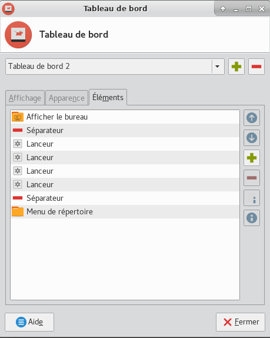{:width="300px"}

#### Alimentation, écran, apparence, fenêtres, applications favorites et bureau

[Xfce4 Desktop Environment Customization](https://github.com/NicoHood/NicoHood.github.io/wiki/Xfce4-Desktop-Environment-Customization)

Menu &rarr; Paramètres &rarr; Gestionnaire d'alimentation

{:width="300px"} {:width="300px"}

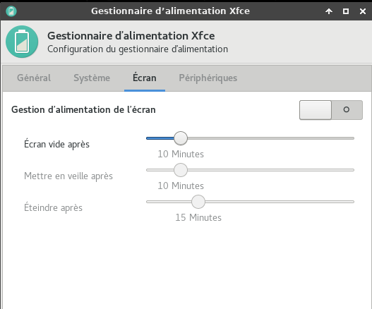{:width="300px"}

Menu &rarr; Paramètres &rarr; Affichage , Double écran , Sharp à droite de Samsung  

 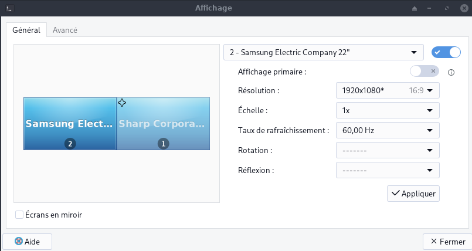

Menu &rarr; Paramètres &rarr; Apparence  

{:width="300px"}  
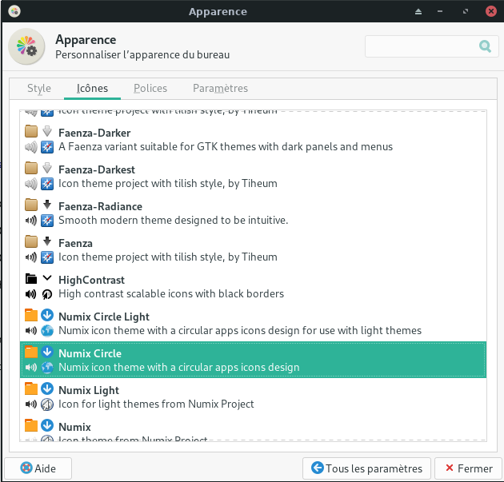{:width="300px"}  
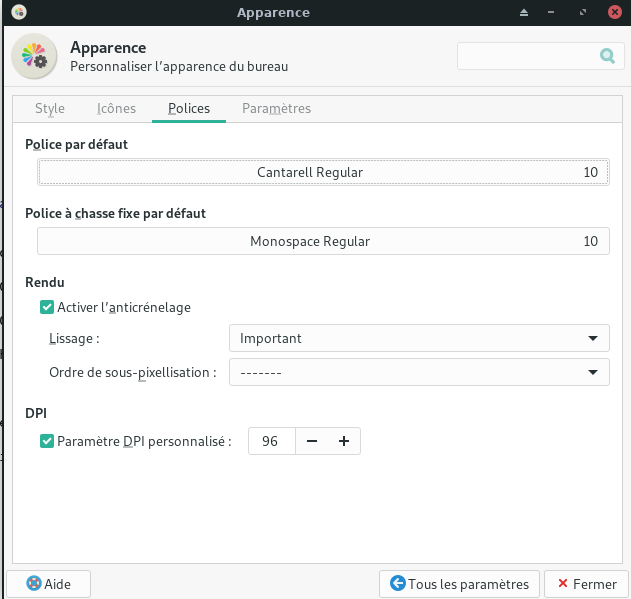{:width="300px"}  

Menu Paramètres &rarr; Gestionnaire de fenêtres 

{:width="300px"}

Après validation tableau de bord, clic droit sur icône capture écran puis  Propriétés -> Zone à capturer : Sélectionner une zone

{:width="300px"}

Menu &rarr; Paramètres &rarr; Applications favorites

  * Utilitaires -> Emulateur de terminal : **/usr/bin/terminator "%s"** 

Menu Paramètres --> Bureau  

  * Fonds d'écran image **/usr/share/backgrounds/xfce**   
  * Onglet *Icônes*
      * Tout décocher dans **Icônes par défaut**  

#### Veille écran - xscreensaver

Installer par défaut sur archlinux (xscreensaver)   
Si l'application **xfce4-screensaver** est installée

    yay -Ss screensaver

```
extra/xscreensaver 6.04-1 (9.6 MiB 35.9 MiB) (Installé)
    Screen saver and locker for the X Window System
extra/xfce4-screensaver 4.16.0-1 (256.4 KiB 1.1 MiB) [xfce4-goodies] (Installé)
    Xfce Screensaver
```

On remplace l'application **xfce4-screensaver** (goodies) par **xscreensaver**

    sudo pacman -R xfce4-screensaver
    sudo pacman -S xscreensaver         


Création d'un script pour **Activer/Désactiver** le programme de mise en veille **xscreensaver**  
Prérequis : **zenity**   
Le script **~/scripts/veille.sh**  

```bash
#!/bin/bash
# veille.sh


# Détecter si xscreensaver est actif
if [ "$(pidof -s xscreensaver)" ]; then
    arret=false
    zenity --question --title "veille" --ok-label="Oui" --cancel-label="Non" --text "Economiseur Ecran ACTIF\n\n DESACTIVER ?"
    if [ $? = 0 ]
    then
            echo "ARRET daemon xscreensaver ..."
            xscreensaver-command -exit
            sleep 3
    fi
else
    arret=true
    zenity --question --title "veille" --ok-label="Oui" --cancel-label="Non" --text "Economiseur Ecran NON ACTIF\n\n ACTIVER ?"
    if [ $? = 0 ]
    then
            echo "DEPART daemon xscreensaver ..."
            xscreensaver -nosplash &
            sleep 3
    fi
fi
```

Création lanceur XFCE en utilisant **Editeur de menus** (si "menulibre" installé ou manuellement :  

```bash
mkdir -p ~/.local/share/applications/  #création dossier **applications** si inexistant
nano ~/.local/share/applications/menulibre-veille-ecran.desktop
```

Contenu :

```ini
[Desktop Entry]
Version=1.0
Type=Application
Name=Activer/Désactiver veille écran
Comment=Veille active ou pas par simple clic
Icon=preferences-desktop-screensaver
Exec=sh /home/yann/scripts/veille.sh
Path=/home/yann/scripts
NoDisplay=false
Categories=Utility;X-XFCE;X-Xfce-Toplevel;
StartupNotify=false
Terminal=false
```

>Les icônes sont situés sous /usr/share/icons , il suffit de mettre le nom de l'icône choisi sans extension ni chemin pour le paramètre **Icon**

#### Ecran connexion (lightDM)

Ecran et logo pour **lightdm**  de la page de connexion    
Accès aux paramètres lightDM en mode graphique (mot de passe root)

* Menu --> Paramètres --> LightDM GTK+ Paramètres d'Apparence

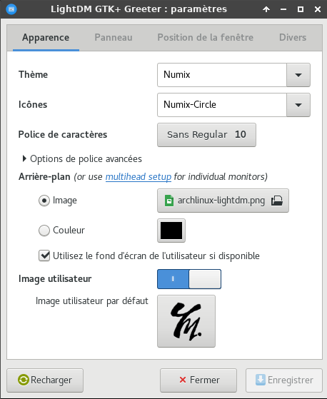{:width="300px"}


#### Ecran de boot (grub)

Ecran de la page de démarrage **grub**  

    sudo cp ~/media/dplus/images/Fonds/wp2618243.jpg /usr/share/backgrounds/xfce/
	sudo nano /etc/default/grub

```
GRUB_BACKGROUND="/usr/share/backgrounds/xfce/wp2618243.jpg"  
```

Reconfigurer grub pour la prise en charge de l'image  

	sudo grub-mkconfig -o /boot/grub/grub.cfg

### Applets Réseau 

#### Netctl

Il existe une applet écrit en rust <https://opensourcelibs.com/lib/netctl-tray>

    yay -S netctl-tray

```
You have to be in groups wheel and network for it to work properly.
To add an user to them, use:

# usermod -a -G wheel,network <user>
```

#### NetworkManager

Pour un environnement GTK, vous pouvez installer l'applet 

    pacman -S network-manager-applet

Afin de sauvegarder les détails d'authentification 

    pacman -S gnome-keyring


#### Son Pulseaudio + gstreamer

Lancement

	pulseaudio --start
	sudo usermod -aG audio $USER

Ouvrir pavucontrol  
Audio interne DigitalStéréo (HDMI)  
Port : HDMI/DisplayPort (plugged in)  

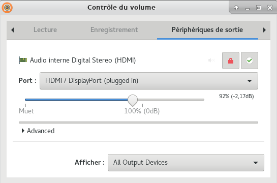{:width="300px"} 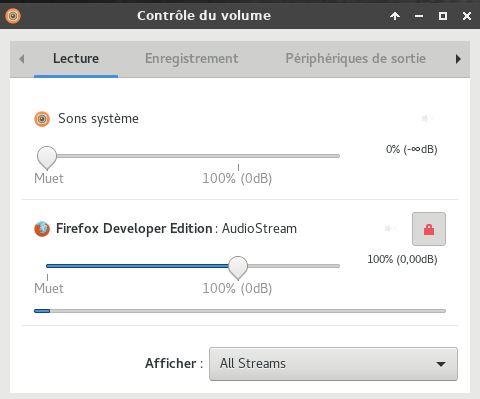{:width="300px"}

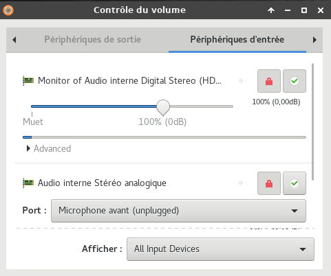{:width="300px"} 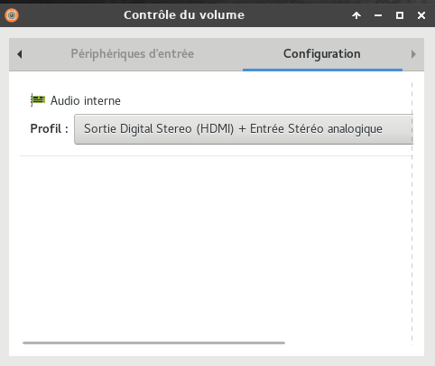{:width="300px"}

Commuter la sortie audio entre HDMI et analogique par un clic, chercher l'expression "sortie audio hdmi" dans le champ recherche du site

**gstreamer**

    sudo pacman -S gstreamer gst-libav gst-plugins-bad gst-plugins-base gst-plugins-good gst-plugins-ugly

**alsa-utils**

    sudo pacman -S alsa-utils

Pour avoir le son casque en face avant de PC1   
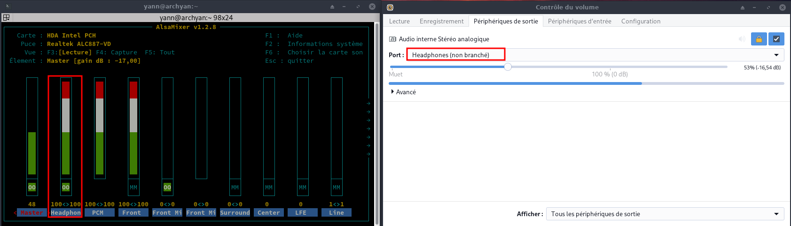

Pour avoir le son casque en face arrière de PC1   
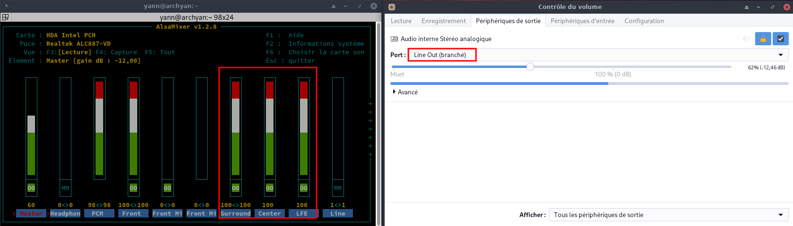

### Applications

#### Client Nextcloud

Installation client nextcloud

    yay -S nextcloud-client libgnome-keyring gnome-keyring  

Démarrer le client nextcloud , après avoir renseigné l'url ,login et mot de passe pour la connexion  

#### Thunderbird

1. [Télécharger Mozilla Thunderbird 102.0](https://telecharger.tomsguide.fr/Thunderbird-Mozilla,0301-2723/)  
2. [Installation manuelle sous linux](https://mzl.la/3Mm3SHQ)  
3. [Comment paramétrer Mozilla Thunderbird pour ProtonMail Bridge](https://proton.me/support/protonmail-bridge-clients-windows-thunderbird)

#### Retext

**[Retext](https://github.com/retext-project/retext) , éditeur markdown**  

    sudo pacman -S retext qt5-webkit

#### keepassxc

Créer le dossier 	`mkdir -p $HOME/{.keepassx}` , Home/.keepassx --> ~/.keepassx  
Ouvrir menu xfce et lancer **KeePassXC**  
Base ~/.keepassx/yannick_xc.kdbx  
Clé ~/.ssh/yannick_keepassxc.key  

#### Calibre

*Calibre facilite la gestion de votre bibliothèque de livres électroniques. Ce programme intuitif et complet vous permet de visionner vos ebooks, de les trier selon différents critères, de les convertir (individuellement ou par lot), d'éditer leurs méta-données et de récupérer des informations à partir d'Internet.*

Installation <https://calibre-ebook.com/download_linux>

    sudo -v && wget -nv -O- https://download.calibre-ebook.com/linux-installer.sh | sudo sh /dev/stdin

Premier lancement ,bibliothèques sous **~/media/BiblioCalibre** et **~/media/CalibreTechnique**

Désinstaller calibre : `sudo calibre-uninstall`

#### Flameshot

**Copie écran (flameshot)**  
**[Flameshot](https://github.com/lupoDharkael/flameshot)** c’est un peu THE TOOL pour faire des captures d’écrans

    sudo pacman -S flameshot

Paramétrage "tableau de bord"  
{:width="600"}  


#### Emulation android - scrcpy

**Applications...**  

    yay -S scrcpy-git 


    sudo pacman -S android-tools

**scrcpy**  <https://github.com/Genymobile/scrcpy/>  
Bureau `/home/yann/.local/share/applications/menulibre-scrcpy-(android).desktop`

```
[Desktop Entry]
Version=1.1
Type=Application
Name=ScrCpy (Android)
Comment=Votre smartphone sur le bureau
Icon=smartphone-connected
Exec=/usr/bin/scrcpy
Path=/home/yann
Actions=
Categories=Utility;X-XFCE;X-Xfce-Toplevel;
```

#### Radio, menulibre et firefox-nightly-fr

Installation

    radiotray menulibre # tutanota-desktop-bin  

**firefox-nightly-fr**   

    wget https://archive.mozilla.org/pub/firefox/nightly/latest-mozilla-central-l10n/firefox-85.0a1.fr.linux-x86_64.tar.bz2
    sudo tar -xvf firefox-85.0a1.fr.linux-x86_64.tar.bz2
    sudo mv firefox /opt/firefox-nightly
    rm firefox-85.0a1.fr.linux-x86_64.tar.bz2

Desktop /home/yann/.local/share/applications/firefox-nightly.desktop

```
[Desktop Entry]
Version=1.0
Name=Firefox Nightly
GenericName=Web Browser
GenericName[fr]=Navigateur web
Comment=Browse the Web
Comment[fr]=Naviguer sur le Web
Exec=/opt/firefox-nightly/firefox %u
Icon=firefox-nightly
Terminal=false
Type=Application
MimeType=text/;text/xml;application//+xml;application/vnd.mozilla.xul+xml;text/mml;x-scheme-handler/http;x-scheme-handler/https;
StartupNotify=true
StartupWMClass=Nightly
Categories=Network;WebBrowser;
Keywords=web;browser;internet;
Actions=new-window;new-private-window;

[Desktop Action new-window]
Name=New Window
Name[fr]=Nouvelle fenêtre
Exec=/opt/firefox-nightly/firefox --new-window %u

[Desktop Action new-private-window]
Name=New Private Window
Name[fr]=Nouvelle fenêtre de navigation privée
Exec=/opt/firefox-nightly/firefox --private-window %u
```

#### Tor


*    Tor est fréquemment utilisé pour accéder au Dark web, qui est une partie d'internet non référencée par les moteurs de recherche classiques. Évitez absolument d'utiliser Tor à cette fin, parce que votre navigation ne sera d'une part pas sécurisée et pourrait d'autre part être considérée comme illégale par les autorités de la région où vous opérez.
*    En utilisant Tor, n'oubliez pas de prendre en considération les points énumérés ci-après.
    *    Tor ne permet pas immédiatement une navigation anonyme après son installation. Seul le trafic de Firefox sera anonymisé et les autres applications devront être configurées avec des proxys avant de pouvoir accéder au réseau Tor.
    *    Le bouton de Tor ajouté à Firefox a pour fonction de bloquer les technologies pouvant présenter des risques de fuites d'identité. Ces technologies à risque incluent Java, ActiveX, RealPlayer, QuickTime et les greffons d'Adobe. Les fichiers de configuration devront être modifiés pour pouvoir utiliser ces applications avec Tor.
    *    Les cookies existant avant l'installation de Tor laisseront toujours filtrer l'identité de l'utilisateur. Il sera nécessaire de tous les effacer avant d'installer Tor pour vous assurer d'une navigation complètement anonyme.
    *    Le réseau Tor crypte toutes les données transmises jusqu'à ce que le routeur permettant d'y accéder sorte du réseau. Les utilisateurs devront utiliser un protocole d'encryptage de confiance, comme HTTPS ou autres.
*    Prenez soin de toujours vérifier l'intégrité des applications téléchargées avec Tor. Celles-ci pourraient poser des problèmes si la sécurité d'un routeur accédant au réseau de Tor était compromise.


Lien pour le téléchargement <https://www.torproject.org/fr/download/>

```shell
wget https://www.torproject.org/dist/torbrowser/11.5.8/tor-browser-linux64-11.5.8_fr.tar.xz
tar xvf tor-browser-linux64-11.5.8_fr.tar.xz
sudo mv tor-browser_fr /opt/
cd /opt/tor-browser_fr/
./start-tor-browser.desktop
```


Le .desktop  `~/.local/share/applications/start-tor-browser.desktop` est créé  

```
#!/usr/bin/env ./Browser/execdesktop
#
# Ce fichier est un fichier .desktop auto-modifiant qui peut être exécuté depuis le shell.
# Il préserve les arguments et l'environnement pour le script start-tor-browser.
#
# Exécutez './start-tor-browser.desktop --help' pour afficher l'ensemble des options.
#
# Lorsqu'il est invoqué depuis le shell, ce fichier doit toujours être dans le répertoire racine du navigateur Tor.
# répertoire racine du navigateur Tor. Lorsqu'il est exécuté depuis le gestionnaire de fichiers ou l'interface graphique du bureau, il est déplaçable.
#
# Après la première invocation, il se mettra à jour avec le chemin absolu vers l'emplacement # actuel de TBB, afin de supporter les déplacements.
# l'emplacement actuel de TBB, afin de supporter la relocalisation de ce fichier .desktop pour l'interface graphique
# l'invocation de l'interface graphique. Vous pouvez également ajouter Tor Browser au menu des applications de votre bureau
# en exécutant './start-tor-browser.desktop --register-app'.
#
# Si vous utilisez --register-app, et que vous déplacez ensuite votre répertoire TBB, le navigateur Tor
# ne se lancera plus depuis le lanceur d'application/dock de votre bureau. Cependant, si vous
# ré-exécutez --register-app à partir de ce nouveau répertoire, le script
# corrigera les chemins absolus et se ré-enregistrera lui-même.
#
# Ce fichier fonctionnera également si le chemin d'accès change lorsque TBB est utilisé en tant que
# application portable, tant qu'il est exécuté directement depuis ce nouveau répertoire, que ce soit
# via le shell ou via le gestionnaire de fichiers.

[Desktop Entry]
Type=Application
Name=Tor Browser
GenericName=Web Browser
Comment=Tor Browser is +1 for privacy and −1 for mass surveillance
Categories=Network;WebBrowser;Security;
Exec=sh -c '"/opt/tor-browser_fr/Browser/start-tor-browser" --detach || ([ !  -x "/opt/tor-browser_fr/Browser/start-tor-browser" ] && "$(dirname "$*")"/Browser/start-tor-browser --detach)' dummy %k
X-TorBrowser-ExecShell=./Browser/start-tor-browser --detach
Icon=/opt/tor-browser_fr/Browser/browser/chrome/icons/default/default128.png
StartupWMClass=Tor Browser
```


#### Wing Personal Python IDE

**[Wing Personal Python IDE](https://wingware.com/downloads/wing-personal)**   
Wing Personal - Version 8.1.3 - Released 2022-02-01  

1- Télécharger la version linux `wget https://wingware.com/get&prod=wing-personal&target=pub/wing-personal/8.1.3.0/wing-personal-8.1.3.0-linux-x64.tar.bz2`  
2- décompresser `tar -zxvf wing-personal-8.1.3.0-linux-x64.tar.bz2`  
3- En mode su , `cd wing-personal-8.1.3.0-linux-x64.tar.bz2` , `./wing-install.py --winghome /opt/wing-personal --bin-dir /usr/local/bin`

#### Xournal

**Xournal** https://github.com/xournalpp/xournalpp : `yay -S xournal`  
*Xournal++ est un logiciel de prise de notes manuscrites, surtout destiné à prendre des notes sur des documents PDF et à les annoter*  


**[QR Code (code-barres) définition, encodage et décodage](/posts/QR-Code-barres-definition-encodage-decodage/) (NON INSTALLE)**  
*La première chose à faire va être d’installer deux petites applications, à savoir QRencode pour la partie création, et ZBar pour la partie scan/lecture*  
Sur Archlinux

    sudo pacman -S qrencode zbar

#### KiCad (NON INSTALLE)

**KiCad (NON INSTALLE)** est une suite logicielle libre de conception pour l'électronique pour le dessin de schémas électroniques et la conception de circuits imprimés. KiCad est publié sous licence GNU GPL: `sudo pacman -S kicad`

#### qbittorent (NON INSTALLE)

**qbittorent (NON INSTALLE)**  `sudo pacman -S qbittorrent`  

### Paramétrage 

#### Alias fichier .bashrc

    nano ~/.bashrc

```bash
#
# ~/.bashrc
#

# If not running interactively, don't do anything
[[ $- != *i* ]] && return

alias ls='ls --color=auto'
PS1='[\u@\h \W]\$ '

alias findh="cat $HOME/scripts/findhelp.txt"
alias youtube='yt-dlp -f "bestvideo[ext=mp4]+bestaudio[ext=m4a]/best[ext=mp4]/best" --output "~/Vidéos/%(title)s.%(ext)s" --ignore-errors'
alias audio='yt-dlp --extract-audio --audio-format m4a --audio-quality 0 --output "~/Musique/%(title)s.%(ext)s"'
alias audiomp3='yt-dlp --extract-audio --audio-format mp3 --audio-quality 0 --output "~/Musique/%(title)s.%(ext)s"'
alias cryfs-autostart="$HOME/scripts/cryfs-autostart"
alias dnsleak="$HOME/scripts/dnsleaktest.sh"
alias toc="$HOME/scripts/toc.sh"
alias nmapl="sudo nmap -T4 -sP 192.168.0.0/24"
alias odt/="$HOME/scripts/_odt/+index"
alias off2htm="$HOME/scripts/office/.sh"
alias otp="$HOME/scripts/generer-code-2fa-vers-presse-papier-toutes-les-30s.sh"
alias posturl="$HOME/scripts/posturl"
alias rename="$HOME/scripts/remplacer-les-espaces-accents-dans-une-expression.sh"
alias sshm="$HOME/scripts/ssh-manager.sh"
alias sshsyn="$HOME/scripts/synchro-ssh-xoyize.xyz.sh"
alias sslxc="$HOME/scripts/sslxc"
alias ssvbox="$HOME/scripts/ssvbox"
alias tmuxssh="$HOME/scripts/tmux-ssd.sh"
alias tmuxlxc="xterm -rv -geometry 100x30+100+350 -T yannstatic -e '/home/yann/scripts/tmux-lxc.sh'"
alias vnc="$HOME/scripts/sshvnc.sh"
alias traduc="/usr/local/bin/trans"
alias wgkey="$HOME/scripts/generer_jeu_cle_wireguard.sh"
alias tmuxvdb="xterm -geometry 100x30+100+350 -T yannstatic -e '/home/yann/scripts/tmux-vdb.sh'"
alias service="systemctl --type=service"
#alias static="sshm vdb exe 'sudo systemctl restart yannstatic.service'"
alias static="sshm lxcdeb exe 'cd ~/yannstatic; /home/lxcdeb/.rbenv/shims/jekyll build'"
alias statich="/usr/bin/brave --incognito https://static.xoyaz.xyz/aide-jekyll-text-theme/"
```

#### Liens scripts usr local bin" 

```bash
# NE PAS CREER LES LIENS !!!!!!!!!!!!!!!!
# ----------------------------------------
#Créer des liens sur /usr/local/bin pour les scripts  

$HOME/scripts/compress /usr/local/bin/pdfdim
$HOME/scripts/all-synchro.sh /usr/local/bin/allsync
$HOME/scripts/borglist /usr/local/bin/borglist
/opt/Postman/Postman /usr/local/bin/postman

sudo ln -s $HOME/scripts/tmux-ssd.sh /usr/local/bin/tmuxssh
sudo ln -s $HOME/scripts/generer-code-2fa-vers-presse-papier-toutes-les-30s.sh /usr/local/bin/otp
#sudo ln -s $HOME/scripts/virtuel /usr/local/bin/virtuel
#droits en exécution
#chmod +x $HOME/scripts/{ssh-manager.sh,savlog.sh,tmux-ssd.sh,virtuel}
```

#### Liens "statique" et "Notes"

les liens pour la rédaction des posts

    sudo ln -s $HOME/media/statique/images /images
    sudo ln -s $HOME/media/statique/files /files

les liens pour les images de Nextcloud Notes

    sudo mkdir /div
    sudo ln -s $HOME/media/img /div/img


#### Partages SSHFS (vps)

sshfs ,FUSE client based on the SSH File Transfer Protocol  

    sudo pacman -S sshfs

Création des partages utilisés par sshfs  

    mkdir -p ~/vps/{cx21,cx11,xoyaz.xyz,autre,lxc,xoyize.xyz}

#### minicom

Paramétrage de l'application terminale

     sudo minicom -s

>Seul les paramètres à modifier sont cités

Configuration du port série  
A -                             Port série : **/dev/ttyUSB0**   
F -              Contrôle de flux matériel : **Non**  
Echap  
Enregistrer config. sous dfl  
Sortir de Minicom  

#### Nano comme éditeur par défaut

Attribution immédiate

    export EDITOR=/usr/bin/nano

Attribution permanente

    echo "export EDITOR=/usr/bin/nano" >> ~/.bashrc

[Pour le paramétrage highlight](https://gitea.xoyaz.xyz/yann/nanorc)

#### Imprimante et scanner

Prérequis , paquets cups, system-config-printer, et hplip installés (Pilotes HP pour DeskJet, OfficeJet, Photosmart, Business Inkjet et quelques modèles de LaserJet aussi bien qu'un certain nombre d'imprimantes Brother)...   

On démarre le service cups

    sudo systemctl start cups.service  # lancement cups
    sudo systemctl enable cups.service  # activation cups

Vérifier le fonctionnement du service : http://localhost:631/  

Installation du scanner  
Coté logiciel il vous faudra **sane** et son interface graphique **xsane**, ainsi qu’éventuellement xsane-gimp le plugin pour gimp.

	yay -S xsane xsane-gimp 

Paramétrage imprimante HP (su)
Lancer "HP Device Manager"  : `hp-setup`  

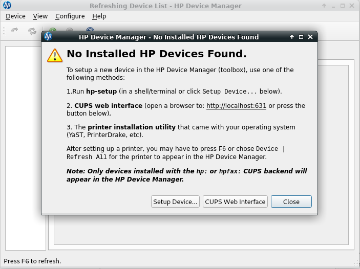{:width="400px"}

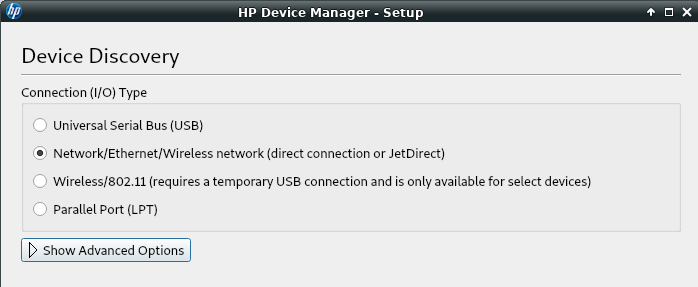{:width="400px"}

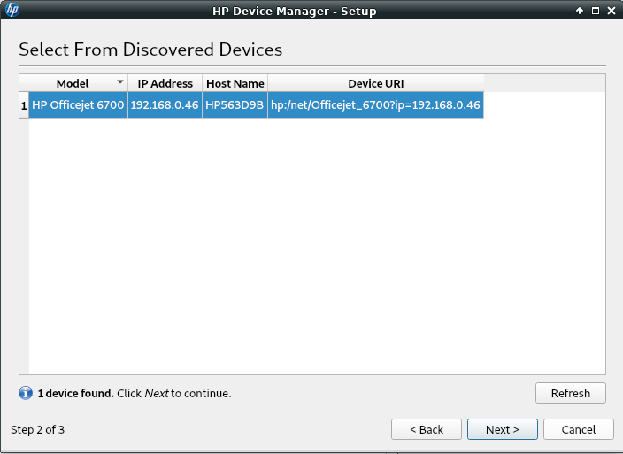{:width="400px"}

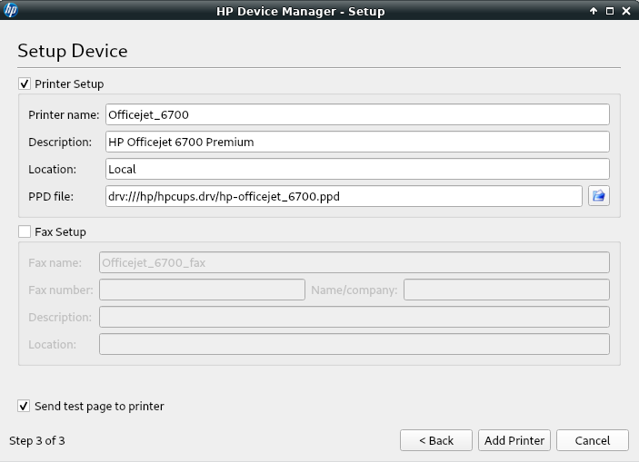{:width="400px"}

Vérifier si le scaner est reconnu : `sudo scanimage -L`

    device `hpaio:/net/OfficeJet_7510_series?ip=192.168.0.39' is a Hewlett-Packard OfficeJet_7510_series all-in-one

Test

    scanimage --device hpaio:/net/OfficeJet_7510_series?ip=192.168.0.39 --format=png > test.png

#### Journalctl

Ajout utilisateur courant au groupe systemd-journal et adm

	sudo gpasswd -a $USER systemd-journal
	sudo gpasswd -a $USER adm

Lignes non tronquées ,ajouter au fichier **~/.bashrc**  

    echo "export SYSTEMD_LESS=FRXMK journalctl" >> /home/$USER/.bashrc

Prise en compte après déconnexion/reconnexion

Modifier le paramétrage 

    sudo nano /etc/systemd/journald.conf

**Rendre persistant journalctl (FACULTATIF)**  
Par défaut `journalctl` affiche les logs du dernier boot. En cas de freeze de votre serveur, il peut être intéressant de comprendre ce qui s’est passé juste avant le plantage…Du coup nous allons rendre journalctl persistant.  

* Oter le commentaire (#) à la ligne Storage=auto et remplacer *auto* par *persistent* 

```
sudo mkdir /var/log/journal
sudo systemd-tmpfiles --create --prefix /var/log/journal
```


**Limiter la taille stockage des logs à 250M**

* SystemMaxUse=250M

Réinitialiser le journal

    sudo systemctl restart systemd-journald

Vous pouvez voir les différents boots

    journalctl --list-boots

```
 -3 1f6ad9d2c1694a7291b734dbf0336ac2 Fri 2022-06-10 16:03:09 CEST Fri 2022-06-10 17:57:08 CEST
 -2 8ff3c75bd4354e94b5dbf4c71b07421a Sat 2022-06-11 07:52:50 CEST Sat 2022-06-11 09:17:32 CEST
 -1 c8005fd3788a4921b26d184624b16e39 Sat 2022-06-11 09:40:04 CEST Sat 2022-06-11 10:35:22 CEST
  0 16f01117e2304439aceb0cb91b88087a Sat 2022-06-11 13:54:02 CEST Sat 2022-06-11 16:58:34 CEST
```

#### Openjdk - jre

Runtime java

    sudo pacman -S jre-openjdk

### Wireguard

Installation

    sudo pacman -S wireguard-tools openresolv

Dossier /etc /wireguard   
Configuration serveur wireguard wg.ouestline.xyz (cx11)  
Lancement configuration  

    sudo -s
    cd /etc/wireguard

Pour démarrer un tunnel avec un fichier de configuration

#### wg-quick

```bash
    # wg-quick up <nom de l'interface>
    wg-quick up wg0 # lancement

[#] ip link add wg0 type wireguard
[#] wg setconf wg0 /dev/fd/63
[#] ip -6 address add fd18:2941:ae9:7d96::3/128 dev wg0
[#] ip -4 address add 10.14.94.3/32 dev wg0
[#] ip link set mtu 1420 up dev wg0
[#] resolvconf -a wg0 -m 0 -x
[#] wg set wg0 fwmark 51820
[#] ip -6 route add ::/0 dev wg0 table 51820
[#] ip -6 rule add not fwmark 51820 table 51820
[#] ip -6 rule add table main suppress_prefixlength 0
[#] ip6tables-restore -n
[#] ip -4 route add 0.0.0.0/0 dev wg0 table 51820
[#] ip -4 rule add not fwmark 51820 table 51820
[#] ip -4 rule add table main suppress_prefixlength 0
[#] sysctl -q net.ipv4.conf.all.src_valid_mark=1
[#] iptables-restore -n

    wg-quick down wg0 # arrêt
```


#### service systemd

```bash
    #wg-quick@interfacename.service  
    systemctl start wg-quick@wg0.service 
    systemctl status wg-quick@wg0.service

● wg-quick@wg0.service - WireGuard via wg-quick(8) for wg0
     Loaded: loaded (/usr/lib/systemd/system/wg-quick@.service; disabled; vendor preset: disabled)
     Active: active (exited) since Tue 2020-11-24 20:54:09 CET; 8s ago
       Docs: man:wg-quick(8)
             man:wg(8)
             https://www.wireguard.com/
             https://www.wireguard.com/quickstart/
             https://git.zx2c4.com/wireguard-tools/about/src/man/wg-quick.8
             https://git.zx2c4.com/wireguard-tools/about/src/man/wg.8
    Process: 36391 ExecStart=/usr/bin/wg-quick up wg0 (code=exited, status=0/SUCCESS)
   Main PID: 36391 (code=exited, status=0/SUCCESS)

nov. 24 20:54:09 archyan wg-quick[36391]: [#] ip -6 route add ::/0 dev wg0 table 51820
nov. 24 20:54:09 archyan wg-quick[36391]: [#] ip -6 rule add not fwmark 51820 table 51820
nov. 24 20:54:09 archyan wg-quick[36391]: [#] ip -6 rule add table main suppress_prefixlength 0
nov. 24 20:54:09 archyan wg-quick[36483]: [#] ip6tables-restore -n
nov. 24 20:54:09 archyan wg-quick[36391]: [#] ip -4 route add 0.0.0.0/0 dev wg0 table 51820
nov. 24 20:54:09 archyan wg-quick[36391]: [#] ip -4 rule add not fwmark 51820 table 51820
nov. 24 20:54:09 archyan wg-quick[36391]: [#] ip -4 rule add table main suppress_prefixlength 0
nov. 24 20:54:09 archyan wg-quick[36391]: [#] sysctl -q net.ipv4.conf.all.src_valid_mark=1
nov. 24 20:54:09 archyan wg-quick[36493]: [#] iptables-restore -n
nov. 24 20:54:09 archyan systemd[1]: Finished WireGuard via wg-quick(8) for wg0.
```

Vérification

    ip a

```
1: lo: <LOOPBACK,UP,LOWER_UP> mtu 65536 qdisc noqueue state UNKNOWN group default qlen 1000
    link/loopback 00:00:00:00:00:00 brd 00:00:00:00:00:00
    inet 127.0.0.1/8 scope host lo
       valid_lft forever preferred_lft forever
    inet6 ::1/128 scope host 
       valid_lft forever preferred_lft forever
2: enp0s31f6: <BROADCAST,MULTICAST,UP,LOWER_UP> mtu 1500 qdisc fq_codel state UP group default qlen 1000
    link/ether 38:d5:47:7c:a0:6c brd ff:ff:ff:ff:ff:ff
    inet 192.168.0.43/24 brd 192.168.0.255 scope global dynamic noprefixroute enp0s31f6
       valid_lft 27798sec preferred_lft 22398sec
    inet6 2a01:e34:eebf:df0:b968:86b6:a0a9:79f7/64 scope global dynamic mngtmpaddr noprefixroute 
       valid_lft 86183sec preferred_lft 86183sec
    inet6 fe80::8ece:7e8c:f571:b48b/64 scope link 
       valid_lft forever preferred_lft forever
4: wg0: <POINTOPOINT,NOARP,UP,LOWER_UP> mtu 1420 qdisc noqueue state UNKNOWN group default qlen 1000
    link/none 
    inet 10.14.94.3/32 scope global wg0
       valid_lft forever preferred_lft forever
    inet6 fd18:2941:ae9:7d96::3/128 scope global 
       valid_lft forever preferred_lft forever
```

**GtkWg**

Dossier : `sudo mkdir -p /usr/local/share/gtkwg`  
Droits `sudo chown $USER.users -R /usr/local/share/gtkwg/`  
Librairie : `yay -S libappindicator-gtk3`  
Les configurations mullvad `/usr/local/share/gtkwg/mullvad_config_linux_all/`   

Ajout configuration wireguard serveur **cx11** (wg.ouestline.xyz)  

    sudo cp wg0-archlinux-pc1.conf /usr/local/share/gtkwg/mullvad_config_linux_all/mullvad-frcx11.conf

Le fichier **desktop** dans `~/.local/share/applications/menulibre-gtkwg.desktop`

```
[Desktop Entry]
Version=1.0
Type=Application
Name=Wireguard
Comment=IconTray/Configuration
Icon=/usr/local/share/gtkwg/wireguard_icon.png
Exec=/usr/bin/sh /usr/local/share/gtkwg/GtkWgTray.sh
Path=/usr/local/share/gtkwg/
NoDisplay=false
Categories=Utility;
StartupNotify=false
Terminal=false
```

xfce: "Menu -> Paramètres -> Session et démarrage", Démarrage automatique d'applications  
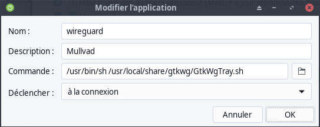{:width="400"}

## Sauvegardes

3 options pour lancer la sauvegarde

### Locales (systemd timer, commande ssh, systemd user)

1. [Sauvegardes locales avec systemd utilisateur service et timer](/posts/Sauvegardes_locales_avec_systemd_utilisateur_service_et_timer/)  
Création d'un timer (~/.config/systemd/user/savyann.timer) et d'un service utilisateur (~/.config/systemd/user/savyann.service)  
Le service, qui lance le script '/home/yann/scripts/sav-yann-media.sh', est exécuté 15 minutes près le démarrage de l'ordinateur  
Ce retard de 15 minutes est justifié pour être certain que l'ordinateur distant lenovo est bien démarré
2. C'est l'ordinateur distant lenovo qui lance, lorsqu'il est prêt, le script de sauvegarde '/home/yann/scripts/sav-yann-media.sh' via une commande SSH
3. systemd user `~/.config/systemd/user/savyann.service` , activation `systemctl enable --user savyann.service`  

        [Unit]
        Description=Sauvegarde jour

        [Service]
        ExecStart=/bin/bash /home/yann/scripts/sav-yann-media.sh

        [Install]
        WantedBy=default.target

L'option 3 , script de sauvegarde '/home/yann/scripts/sav-yann-media.sh' est celle par défaut
{: .prompt-info }

## Borg sauvegarde home PC1


* [Archlinux Borg backup (Français)](https://wiki.archlinux.org/title/Borg_backup_(Fran%C3%A7ais))
* [Archlinux : Sauvegarde des données avec BORG](https://wiki.archlinux.fr/Sauvegarde_des_donn%C3%A9es_avec_BORG)

Installation

    yay -S borgbackup

### borgbackup -> Serveur lenovo  

[Opérations sur le serveur lenovo](/posts/Serveur_debian_Lenovo_Thinkcentre_M700_Tiny_M2280-SSD500Go/#borgbackup-serveur-lenovo) 

**<u>Créer un jeu de clé sur machine à sauvegarder (rnmkcy.eu)</u>**  

Générer un jeu de clé ssh pour borg

    ssh-keygen -t ed25519 -o -a 100 -f ~/.ssh/borg_lenovo

**Ajout clé publique au serveur backup rnmkcy.eu**

>Pour une connexion via ssh vous devez ajouter la clé publique *rnmkcy.eu_ed25519.pub* du **serveur client  rnmkcy.eu** au fichier *~/.ssh/authorized_keys* du  **serveur backup rnmkcy.eu**  

Se connecter au **serveur backup rnmkcy.eu** depuis un terminal autorisé

	ssh leno@192.168.0.145 -p 55145 -i /home/yann/.ssh/lenovo-ed25519 # connexion SSH serveur backup depuis PC1
	sudo -s # passer en super utilisateur
	cat >> /mnt/sauvegardes/borgbackup/.ssh/authorized_keys

Copier/coller le contenu du fichier du fichier de clef publique (fichier **~/.ssh/borg_lenovo.pub** de la machine à sauvegarder **PC1** ) dans ce terminal, et presser **[Ctrl]+[D]** pour valider.

Test depuis le serveur client **PC1**  (c'est lui qui possède la clé privée).  
*Si parefeu avec les sorties bloquées sur **rnmkcy.eu** , il faut ouvrir en sortie le port TCP 55145.*

**AU PREMIER passage une question est posée , saisir oui ou yes**

    sudo -s
    ssh -p 55145 -i ~/.ssh/borg_lenovo borg@rnmkcy.eu

```
ssh-ed25519 AAAAC3NzaC1lZDI1NTE5AAAAIN8bMXcvg9Fdw5Hdu8TOTVN8ElNs39tq3iuH+E2BMHOu yann@archyan
[yann@archyan ~]$ ssh -p 55145 -i ~/.ssh/borg_lenovo borg@rnmkcy.eu
Linux think 5.10.0-13-amd64 #1 SMP Debian 5.10.106-1 (2022-03-17) x86_64
  _                                __  __  ____  __    __  
 | |    ___  _ _   ___ __ __ ___  |  \/  ||__  |/  \  /  \ 
 | |__ / -_)| ' \ / _ \\ V // _ \ | |\/| |  / /| () || () |
 |____|\___||_||_|\___/ \_/ \___/ |_|  |_| /_/  \__/  \__/ 
  _  ___  ___     _   __  ___     __     _  _ _   ___      
 / |/ _ \|_  )   / | / / ( _ )   /  \   / || | | | __|     
 | |\_, / / /  _ | |/ _ \/ _ \ _| () |_ | ||_  _||__ \     
 |_| /_/ /___|(_)|_|\___/\___/(_)\__/(_)|_|  |_| |___/     
$ id
uid=1003(borg) gid=1003(borg) groupes=1003(borg)
$ pwd
/mnt/sauvegardes/borgbackup
```

saisir `exit` pour sortir

>NOTE : **/mnt/sauvegardes/borgbackup** est le home de l'utilisateur *borg* sur le serveur backup *rnmkcy.eu*

Création d'un fichier **exclusions** qui contient toutes les exclusions de dossiers et fichiers , une exclusion par ligne   

    mkdir /home/yann/.borg
    nano /home/yann/.borg/exclusions

```
/home/yann/.cache
/home/yann/Partage
/home/yann/iso
/home/yann/lenovo
/home/yann/media
/home/yann/Téléchargements
/home/yann/Vidéos
/home/yann/temp
/home/yann/vps
/home/yann/sav
/home/yann/virtuel
```

**Création du dépôt distant 'archyan' sur le serveur backup rnmkcy.eu (A FAIRE UNE SEULE FOIS)**

```bash
export BORG_RSH='ssh -i /home/yann/Private/.borg/lenovo.borgssh'
export BORG_PASSPHRASE=$(cat /home/yann/Private/.borg/lenovo.passphrase)
borg init --encryption=repokey ssh://borg@rnmkcy.eu:55145/mnt/sauvegardes/borgbackup/archyan
```

Vous obtenez une réponse de ce type

```
By default repositories initialized with this version will produce security
errors if written to with an older version (up to and including Borg 1.0.8).

If you want to use these older versions, you can disable the check by running:
borg upgrade --disable-tam ssh://borg@rnmkcy.eu:55145/mnt/sauvegardes/borgbackup/archyan

See https://borgbackup.readthedocs.io/en/stable/changes/#pre-1-0-9-manifest-spoofing-vulnerability for details about the security implications.

IMPORTANT: you will need both KEY AND PASSPHRASE to access this repo!
If you used a repokey mode, the key is stored in the repo, but you should back it up separately.
Use "borg key export" to export the key, optionally in printable format.
Write down the passphrase. Store both at safe place(s).
```

**Création du dépôt distant 'media' sur le serveur backup rnmkcy.eu (A FAIRE UNE SEULE FOIS)**

```bash
export BORG_RSH='ssh -i /home/yann/Private/.borg/lenovo.borgssh'
export BORG_PASSPHRASE=$(cat /home/yann/Private/.borg/lenovo.passphrase)
borg init --encryption=repokey ssh://borg@rnmkcy.eu:55145/mnt/sauvegardes/borgbackup/media
```

[script de sauvegarde 'borg-backup-media.sh'](https://static.xoyaz.xyz/files/borg-backup-media.sh)

**Sauvegarde 1 fois par jour**

[Sauvegardes locales avec systemd utilisateur service et timer](/posts/Sauvegardes_locales_avec_systemd_utilisateur_service_et_timer/)

[script de sauvegarde 'sav-yann-media.sh'](https://static.xoyaz.xyz/files/sav-yann-media.sh) 

## Erreurs 

**terminator** *No module named 'validate'*   

```bash
pacman -S devtools git #install devtools used to build in a clean chroot and git needed to obtain source
git clone git://git.archlinux.org/svntogit/community.git --single-branch --branch "packages/python-configobj" #clone package source
chmod 777 -R community/trunk
cd community/trunk
curl -o PKGBUILD.diff http://ix.io/2J4c #download patch
git apply PKGBUILD.diff
extra-x86_64-build #build package in a clean chroot
pacman -U python-configobj-5.0.6-10-any.pkg.tar.zst #install built package
cd ../..
rm -r community/
```

**Firefox - OCSP**  
*HTTPS connection fails with "MOZILLA_PKIX_ERROR_REQUIRED_TLS_FEATURE_MISSING"*

Impossible de charger un site, message d'erreur semble signifier qu'il y a un problème avec la réponse OCSP du serveur : **L'"agrafage" OCSP - inclusion de la vérification de la non-révocation du certificat du serveur - est requis mais non fourni.*  

(1) Dans un nouvel onglet, tapez ou collez `about:config` dans la barre d'adresse et appuyez sur **Entrée/Retour**.   
*Cliquez sur le bouton en promettant d'être prudent.*

(2) Dans la boîte de recherche située au-dessus de la liste, tapez ou collez **ocsp** pour filtrer

(3) Double-cliquez sur la préférence **security.ssl.enable_ocsp_must_staple** pour faire passer la valeur de **true** à **false**

Essayez ensuite à nouveau le site, en contournant le cache (par exemple, Ctrl+Maj+r lorsque vous rechargez)

## ACL - Dossiers locaux multimédia

[Les ACL (Access Control Lists) sous Linux](/posts/Les-ACL-(Access-Control-Lists)-sous-Linux/)

Structure des dossiers multimédia  

Il ya un lien ~/media -> /srv/media  
Les dossiers concernés

```
/srv/media/
├── BiblioCalibre
├── CalibreTechnique
├── music
```

Les applications web pour les livres et la musique ont un propriétaire spécifique :  
**calibreweb** pour l'application  calibre-web  
**navidrome** pour l'application navidrome  

#### Local - music

Le dossier music a pour propriétaire **navidrome**  
Créer un utilisateur **navidrome** sans home

    sudo useradd -M navidrome

Vérification

    id navidrome

*uid=1003(navidrome) gid=10000(navidrome) groupes=10000(navidrome)*  
Changement de propriétaire des dossiers

```shell
sudo chown navidrome:navidrome -R /srv/media/music
```

**Permissions ACL**  
Visualiser les permissions ACLs du dossier existant

    getfacl /srv/media/music

```
getfacl : suppression du premier « / » des noms de chemins absolus
# file: srv/media/music
# owner: navidrome
# group: navidrome
user::rwx
group::rwx
other::r-x
```

Les ACLs par défaut permettent de donner des permissions ACL en héritage pour tout sous-répertoire ou fichier créé dans un répertoire. Toutefois, ces ACLs par défaut ne s’appliquent pas aux objets déjà présents dans le répertoire.

Modifier l’ACL des fichiers existants

        sudo setfacl -R -m u:yann:rwx /srv/media/music
        getfacl /srv/media/music

```
getfacl : suppression du premier « / » des noms de chemins absolus
# file: srv/media/music
# owner: navidrome
# group: navidrome
user::rwx
user:yann:rwx
group::rwx
mask::rwx
other::r-x
```

Appliquer un ACL par défaut

        sudo setfacl -m d:u:yann:rwx /srv/media/music
        getfacl /srv/media/music

```
getfacl : suppression du premier « / » des noms de chemins absolus
# file: srv/media/music
# owner: navidrome
# group: navidrome
user::rwx
user:yann:rwx
group::rwx
mask::rwx
other::r-x
default:user::rwx
default:user:yann:rwx
default:group::rwx
default:mask::rwx
default:other::r-x
```

Par exemple pour empêcher tous les autres (other) en termes de permissions pour tout nouveau fichier ou sous-répertoire créé :

    sudo setfacl -m d:o::- /srv/media/music
    getfacl /srv/media/music

```
getfacl : suppression du premier « / » des noms de chemins absolus
# file: srv/media/music
# owner: navidrome
# group: navidrome
user::rwx
user:yann:rwx
group::rwx
mask::rwx
other::r-x
default:user::rwx
default:user:yann:rwx
default:group::rwx
default:mask::rwx
default:other::---
```

#### Local - BiblioCalibre et CalibreTechnique

Les dossiers BiblioCalibre et CalibreTechnique ont pour propriétaire **calibreweb**  
Créer un utilisateur **calibreweb** sans home

    sudo useradd -M calibreweb

Vérification

    id calibreweb

*uid=1002(calibreweb) gid=1002(calibreweb) groupes=1002(calibreweb)*

Changement de propriétaire des dossiers

```shell
sudo chown calibreweb:calibreweb -R /srv/media/BiblioCalibre
sudo chown calibreweb:calibreweb -R /srv/media/CalibreTechnique
```

**Permissions ACL**  
Appliquer les procédures précédentes pour les dossiers BiblioCalibre et CalibreTechnique

    getfacl /srv/media/BiblioCalibre && getfacl /srv/media/CalibreTechnique

```
getfacl : suppression du premier « / » des noms de chemins absolus
# file: srv/media/BiblioCalibre
# owner: calibreweb
# group: calibreweb
user::rwx
user:yann:rwx
group::rwx
mask::rwx
other::r-x
default:user::rwx
default:user:yann:rwx
default:group::rwx
default:mask::rwx
default:other::---

getfacl : suppression du premier « / » des noms de chemins absolus
# file: srv/media/CalibreTechnique
# owner: calibreweb
# group: calibreweb
user::rwx
user:yann:rwx
group::rwx
mask::rwx
other::r-x
default:user::rwx
default:user:yann:rwx
default:group::rwx
default:mask::rwx
default:other::---
```

#### Distants

Pour pouvoir effectuer une synchronisation locale &rarr; distante via rsync ou unison, il faut une autorisation en lecture/écriture sur les dossiers multimédia distants pour l'utilisateur de connexion "admin"  

**Yunohost avec les applications calibre-web et navidrome installées**  
On ajoute l'utilisateur "admin" aux groupes calibreweb et navidrome  

```shell
sudo gpasswd -a admin calibreweb
sudo gpasswd -a admin navidrome
id admin
# --> uid=1007(admin) gid=1007(admin) groups=1007(admin),128(libvirt),64055(libvirt-qemu),997(calibreweb),996(navidrome),4001(admins)
```

Les dossiers BiblioCalibre et CalibreTechnique

```
admin@ouestyan:~$ ls -la /home/yunohost.multimedia/share/eBook/
total 384
drwxrwxr-x+   4 calibreweb calibreweb   4096 Jan  2 10:51 .
drwxrwxr-x+   7 root       root         4096 Jan  4 17:32 ..
drwxrwxr-x+ 796 calibreweb calibreweb  36864 Jan  3 13:25 BiblioCalibre
drwxrwxr-x+ 106 calibreweb calibreweb   4096 Jan  3 14:02 CalibreTechnique
```

Pour le reste on ajoute l'utilisateur admin au groupe multimedia puis créer un dossier "Divers" 

```shell
sudo gpasswd -a admin multimedia
sudo mkdir /home/yunohost.multimedia/share/Divers
```

Les dossiers

```
admin@xoyaz:~$ ls -la /home/yunohost.multimedia/share/Divers/
total 28
drwxrwxr-x+ 5 root root   4096 Jan  4 18:47 .
drwxrwxr-x+ 7 root root   4096 Jan  4 18:26 ..
drwxrwsr-x+ 5 yann users  4096 Oct  1  2020 diceware
drwxr-xr-x+ 2 yann users 12288 Nov 29 07:55 img
drwxrwsr-x+ 7 yann users  4096 Jan  4 18:52 osm-new
```

Pour une prise en compte ,une reconnection admin est nécessaire


## NFS - NON UTILISE 

### nfs-utils

[Partage de disques en réseau avec NFS](https://doc.fedora-fr.org/wiki/Partage_de_disques_en_r%C3%A9seau_avec_NFS)  

Installer nfs-utils avec la commande

    sudo pacman -S nfs-utils    # archlinux
    sudo apt install nfs-common # debian

**NFS - Serveur sur PC1**

Adresse IP PC1 : 192.168.0.42  
Le fichier `/etc/exports`

```
# Use `exportfs -arv` to reload.
/srv/media/dplus/android-apk/Galaxy-S8_SM-G950F 192.168.0.0/24(rw,no_subtree_check) 
/mnt/partage 192.168.0.0/24(rw,sync,no_subtree_check,no_root_squash)
```

Maintenant que le serveur NFS est configuré avec le point de montage NFS de base `/mnt/partage`, nous devons configurer SetGID dans ce répertoire

    sudo chmod 2770 /mnt/partage

Créer un groupe appelé ‘local’ et associer l’utilisateur 

    sudo groupadd -g 9999 local
    sudo usermod -a -G  local $USER
    sudo chgrp local /mnt/partage

Se déconnecter puis se connecter pour la prise en charge

    id

```
uid=1000(yann) gid=985(users) groupes=985(users),98(power),972(libvirt),988(storage),992(kvm),998(wheel),9999(local)
```

Vous pouvez maintenant démarrer le serveur avec la commande suivante 

    sudo systemctl start nfs-server.service
    sudo systemctl status nfs-server.service

```
● nfs-server.service - NFS server and services
     Loaded: loaded (/usr/lib/systemd/system/nfs-server.service; disabled; vendor preset: disa>
    Drop-In: /run/systemd/generator/nfs-server.service.d
             └─order-with-mounts.conf
     Active: active (exited) since Sat 2022-06-11 16:10:16 CEST; 9s ago
    Process: 6825 ExecStartPre=/usr/sbin/exportfs -r (code=exited, status=0/SUCCESS)
    Process: 6826 ExecStart=/usr/sbin/rpc.nfsd (code=exited, status=0/SUCCESS)
   Main PID: 6826 (code=exited, status=0/SUCCESS)
        CPU: 7ms

juin 11 16:10:16 archyan systemd[1]: Starting NFS server and services...
juin 11 16:10:16 archyan systemd[1]: Finished NFS server and services.
```

Activation nfs

    sudo systemctl enable nfs-server.service

### NFS - Client (debian)

Installation

    sudo apt install nfs-common -y

Vérifier

    sudo rpcinfo

```
   program version netid     address                service    owner
    100000    4    tcp6      ::.0.111               portmapper superuser
    100000    3    tcp6      ::.0.111               portmapper superuser
    100000    4    udp6      ::.0.111               portmapper superuser
    100000    3    udp6      ::.0.111               portmapper superuser
    100000    4    tcp       0.0.0.0.0.111          portmapper superuser
    100000    3    tcp       0.0.0.0.0.111          portmapper superuser
    100000    2    tcp       0.0.0.0.0.111          portmapper superuser
    100000    4    udp       0.0.0.0.0.111          portmapper superuser
    100000    3    udp       0.0.0.0.0.111          portmapper superuser
    100000    2    udp       0.0.0.0.0.111          portmapper superuser
    100000    4    local     /run/rpcbind.sock      portmapper superuser
    100000    3    local     /run/rpcbind.sock      portmapper superuser
```

Créer un point de montage NFS

    sudo mkdir -p /srv/media

Tester manuellement le montage 

	sudo mount -t nfs 192.168.0.42:/srv/media /srv/media 
	sudo umount /srv/media 

Montage automatique à la demande avec timeout via fstab et x-systemd

    sudo nano /etc/fstab

```
# montage nfs 
192.168.0.42:/srv/media /srv/media	nfs	defaults,timeo=900,retrans=5,_netdev	0 0
```

Montage manuel

    sudo mount -a

Désactiver NFS client

    sudo systemctl stop nfs-service
    sudo systemctl disable nfs-service

Démonter le point 

    sudo umount /srv/media

Modifier le fichier /etc/fstab

```
# montage nfs 
# 192.168.0.42:/srv/media /srv/media	nfs	defaults,timeo=900,retrans=5,_netdev	0 0
```

## Container, VM et VPS

### Pont (Bridge)

Pour un réseau en pont (bridge - adresse IP container dans le même réseau que l'hôte) : [Archlinux KVM/QEMU - Virtual Machine Manager - Réseau (network)](/posts/Archlinux-KVM_QEMU-VMM/)

Ordinateur hôte PC1 en mode bridge  
Désactiver le réseau "lan-yann" : `sudo netctl disable lan-yann`  

La configuration "pont statique"   

    /etc/netctl/bridge-yann 

```
Description="Static Bridge connection"
Interface=br0
Connection=bridge
BindsToInterfaces=(enp0s31f6)
IP=static
Address=('192.168.0.42/24')
Gateway='192.168.0.254'
DNS=('192.168.0.254')
## Ignore (R)STP and immediately activate the bridge
SkipForwardingDelay=yes
```

Lancer et activer

    netctl start bridge-yann
    netctl enable bridge-yann

Vérifier 

    ip a

```
1: lo: <LOOPBACK,UP,LOWER_UP> mtu 65536 qdisc noqueue state UNKNOWN group default qlen 1000
    link/loopback 00:00:00:00:00:00 brd 00:00:00:00:00:00
    inet 127.0.0.1/8 scope host lo
       valid_lft forever preferred_lft forever
    inet6 ::1/128 scope host 
       valid_lft forever preferred_lft forever
2: enp0s31f6: <BROADCAST,MULTICAST,PROMISC,UP,LOWER_UP> mtu 1500 qdisc fq_codel master br0 state UP group default qlen 1000
    link/ether 38:d5:47:7c:a0:6c brd ff:ff:ff:ff:ff:ff
    inet6 fe80::3ad5:47ff:fe7c:a06c/64 scope link 
       valid_lft forever preferred_lft forever
3: br0: <BROADCAST,MULTICAST,UP,LOWER_UP> mtu 1500 qdisc noqueue state UP group default qlen 1000
    link/ether 9a:87:46:a3:88:b9 brd ff:ff:ff:ff:ff:ff
    inet 192.168.0.42/24 brd 192.168.0.255 scope global br0
       valid_lft forever preferred_lft forever
    inet6 fdc4:62ff:57c6:0:9887:46ff:fea3:88b9/64 scope global dynamic mngtmpaddr 
       valid_lft forever preferred_lft forever
    inet6 2a01:e0a:2de:2c70:9887:46ff:fea3:88b9/64 scope global dynamic mngtmpaddr 
       valid_lft 86148sec preferred_lft 86148sec
    inet6 fe80::9887:46ff:fea3:88b9/64 scope link 
       valid_lft forever preferred_lft forever
```

### LXC

* [Archlinux container LXC debian 10 (buster) + Jekyll](/posts/Archlinux_conteneur_LXC_debian_10_(buster)/)   
*Container LXC actif au démarrage de PC1, notamment utilisé pour la gestion du serveur statique*

**mount bind** :un montage lié prend une arborescence de répertoires existante et la réplique sous un point différent. Les répertoires et les fichiers du montage lié sont les mêmes que ceux d'origine.   
*Toute modification d'un côté est immédiatement répercutée de l'autre côté, car les deux vues affichent les mêmes données.*  
Par exemple, après avoir lancé la commande Linux

    mount --bind /some/where /else/where

les répertoires /some/whereet /else/where ont le même contenu.

Les dossiers "bind" dans le fichier `/etc/fstab`

```
# LXC dossiers partagés
/srv/media /var/lib/lxc/lxcbuster/rootfs/home/lxcdeb/media  none bind 0 0
```

### tmuxlxc

Visualisation en terminal synchro lxc avec xoyaz 
Le script : `/home/yann/scripts/tmux-lxc.sh`  
Le .desktop : `/home/yann/.local/share/applications/menulibre-tmuxlxc.desktop ` 

```
[Desktop Entry]
Version=1.1
Type=Application
Name=Static-synchro
Comment=multi fenêtres
Icon=final-term
Exec=xterm -rv -geometry 100x30+100+350 -T yannstatic -e '/home/yann/scripts/tmux-lxc.sh'
Actions=
Categories=Utility;
Path=
Terminal=false
StartupNotify=false
```

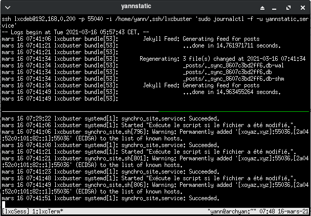{:width=400}

### QEMU/KVM

* [Archlinux Installer KVM QEMU + VMM + Pont réseau](/posts/Archlinux-KVM_QEMU-VMM/)

#### Yunohost virtuel (yunobulls)

Créer une machine virtuelle debian 11 nommée yunobulls &rarr; [Qemu/KVM - Serveur ouestyan.xyz debian 11 virtuel avec image cloud Qcow2 sur archlinux](/posts/Executer_Debian_sur_KVM_en_utilisant_l-image_de_nuage_Qcow2/)  
La machine est gérée par "Virtual Machine Manager"  

### tmuxssd

Configuration par défaut de tmux `$HOME/.tmux.conf`

```bash
#Configuration de tmux
#Origine : http://denisrosenkranz.com
#Yannick juin 2017
# Copier/Coller par la souris se fait avec la touche "Shift" appuyée
 
##################################
#Changements des raccourcis claviers
##################################
#On change Control +b par Control +x
#set -g prefix C-x
#unbind C-b
#bind C-x send-prefix
 
#On utilise control + flèches pour naviguer entre les terminaux
bind-key -n C-right next
bind-key -n C-left prev
 
#on utilise alt + flèches our naviguer entre les panels
bind-key -n M-left select-pane -L
bind-key -n M-right select-pane -R
bind-key -n M-up select-pane -U
bind-key -n M-down select-pane -D
 
#On change les raccourcis pour faire du split vertical et horizontal
#On utilise la touche "|" (pipe) pour faire un split vertical
bind | split-window -h
#Et la touche "-" pour faire un split horizontal
bind - split-window -v
 
##################################
#Changements pratiques
##################################
#On permet l'utilisation de la souris pour changer de terminal et de panel
set -g mouse on

# Sélection zone par clic gauche souris (texte sélectionné sur fond jaune)
# Après relachement du clic , le texte sélectionné est copié dans le presse-papier 
# Le fond jaune disparaît
set-option -s set-clipboard off
# For emacs copy mode bindings
# Il faut installer l'utilitaire 'xclip' (sudo pacman -S xclip)
bind-key -T copy-mode MouseDragEnd1Pane send-keys -X copy-pipe-and-cancel "xclip -selection clipboard -i"

#Les fenêtres commencent par 1 et non par 0
set -g base-index 1
 
##################################
#Changements visuels
##################################
#On met les panneaux non actif en gris
#set -g pane-border-fg colour244
#set -g pane-border-bg default
 
#On met le panneau actif en rouge
#set -g pane-active-border-fg colour124
#set -g pane-active-border-bg default
 
#On met la barre de status en gris
set -g status-fg colour235
set -g status-bg colour250
#set -g status-attr dim
 
# On surligne les fenêtres actives dans la barre de status en gris foncés
#set-window-option -g window-status-current-fg colour15
#set-window-option -g window-status-current-bg colour0
```

Visualisation en terminal des VPS avec terminator et tmux  
Le script : `/home/yann/scripts/tmux-ssd-a.sh`  
Le .desktop : `/home/yann/.local/share/applications/menulibre-tmuxssd-a.desktop` 

```
[Desktop Entry]
Version=1.1
Type=Application
Name=A - Serveurs VPS
Comment=multi fenêtres
Icon=final-term
Exec=terminator --geometry=1900x1000+20+100 -e '/home/yann/scripts/tmux-ssd-a.sh'
Actions=
Categories=Utility;
Path=
Terminal=false
StartupNotify=false
```

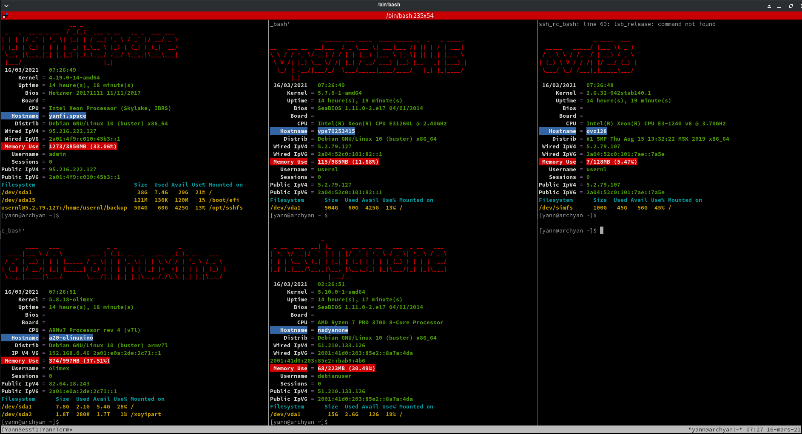{:width=600}

Le script : `/home/yann/scripts/tmux-ssd-b.sh`  
Le .desktop : `/home/yann/.local/share/applications/menulibre-tmuxssd-b.desktop` 

```
[Desktop Entry]
Version=1.1
Type=Application
Name=B - Serveurs VPS
Comment=multi fenêtres
Icon=final-term
Exec=terminator --geometry=1900x900+20+100 -e '/home/yann/scripts/tmux-ssd-b.sh'
Actions=
Categories=Utility;
Path=
Terminal=false
StartupNotify=false
```

### tmuxvdb

Surveillance construction site statique et synchronisation avec le serveur xoyaz sur la machine virtuelle debian

Le bash `/home/yann/scripts/tmux-vdb.sh`

```bash
#!/bin/bash    

# COLUMNSxROWS+X+Y -> xterm -geometry 400x200+100+350
# xterm -geometry 100x30+100+350 -T yannstatic -e '/home/yannick/scripts/tmux-lxc.sh'
# On supprime la session "vdbSess" si existante                         
 
if [[ `tmux list-sessions | grep 'vdbSess' | wc -l` != 0 ]]
   then  
       # On ferme la session active
       tmux kill-session -t vdbSess
fi


# Créer une bannière dans /etc/motd sur chaque serveur
# Nom du domaine en ascii voir lien http://patorjk.com/software/taag/#p=display&h=1&f=Small
echo "fin fi"
# Créer session + terminal 
tmux new  -d -s vdbSess -n vdbTerm
# Séparation horizontale en 2 du terminal
tmux split-window -v -p 50
# | 0         |
# |           |
# |-----------|
# | 1         |
# |           |
# Sélection terminal HAUT
tmux selectp -t 0
# 
tmux send-keys -t vdbSess 'static' C-m
# Sélection terminal BAS
tmux selectp -t 1
#  
tmux send-keys -t vdbSess "synchro" C-m

# Afficher la session 
tmux a -t vdbSess
#
# Tuer la session
# tmux kill-session -t vdbSess
```

Le desktop

```
[Desktop Entry]
Version=1.1
Type=Application
Name=Static-synchro
Comment=multi fenêtres
Icon=final-term
Exec=xterm -geometry 100x30+100+350 -T yannstatic -e '/home/yann/scripts/tmux-vdb.sh'
Actions=
Categories=Utility;
Path=
Terminal=false
StartupNotify=false
```

## Maintenance

### Utilisateur - Id et Groupes

Vérifier id

    id $USER

```
uid=1000(yann) gid=985(users) groupes=985(users),90(network),98(power),998(wheel),995(audio),992(kvm),988(storage),972(libvirt),9999(local),1000(yann)
```

En cas d'absence d'un ou plusieurs groupes 

    sudo usermod -a -G users,yann,wheel,network,audio,local,power,storage,kvm,libvirt $USER

>Dans cette commande je renouvelle toutes les appartenances aux groupes de l'utilisateur

### Erreur lancement "Wing Personal 8"

```
/usr/local/lib/wing-personal8/bin/__os__/linux-x64/runtime-python3.9/bin/python3.9: error while loading shared libraries: libcrypt.so.1: cannot open shared object file: No such file or directory
```

Le fichier libcrypt.so.1 est introuvable

```bash
[yann@archyan ~]$ ls  /usr/lib/libcry*
/usr/lib/libcrypt.so        /usr/lib/libcrypto.so      /usr/lib/libcryptopp.so.8      /usr/lib/libcryptsetup.so.12
/usr/lib/libcrypt.so.2      /usr/lib/libcrypto.so.1.1  /usr/lib/libcryptopp.so.8.6.0  /usr/lib/libcryptsetup.so.12.7.0
/usr/lib/libcrypt.so.2.0.0  /usr/lib/libcryptopp.so    /usr/lib/libcryptsetup.so

[yann@archyan ~]$ ls -la /usr/lib/libcry*
lrwxrwxrwx 1 root root      17  2 févr. 08:12 /usr/lib/libcrypt.so -> libcrypt.so.2.0.0
lrwxrwxrwx 1 root root      17  2 févr. 08:12 /usr/lib/libcrypt.so.2 -> libcrypt.so.2.0.0
-rwxr-xr-x 1 root root  165824  2 févr. 08:12 /usr/lib/libcrypt.so.2.0.0
lrwxrwxrwx 1 root root      16 18 déc.  11:31 /usr/lib/libcrypto.so -> libcrypto.so.1.1
-rwxr-xr-x 1 root root 2999144 18 déc.  11:31 /usr/lib/libcrypto.so.1.1
lrwxrwxrwx 1 root root      20 10 janv. 16:55 /usr/lib/libcryptopp.so -> libcryptopp.so.8.6.0
lrwxrwxrwx 1 root root      20 10 janv. 16:55 /usr/lib/libcryptopp.so.8 -> libcryptopp.so.8.6.0
-rwxr-xr-x 1 root root 5066744 10 janv. 16:55 /usr/lib/libcryptopp.so.8.6.0
lrwxrwxrwx 1 root root      23  3 févr. 12:16 /usr/lib/libcryptsetup.so -> libcryptsetup.so.12.7.0
lrwxrwxrwx 1 root root      23  3 févr. 12:16 /usr/lib/libcryptsetup.so.12 -> libcryptsetup.so.12.7.0
-rwxr-xr-x 1 root root  484192  3 févr. 12:16 /usr/lib/libcryptsetup.so.12.7.0
```

Création lien sur existant

```
sudo ln -s /usr/lib/libcrypt.so /usr/lib/libcrypt.so.1
```


### Réseau netctl -> NetworkManager

#### Basculer de netctl vers NetworkManager

  
[How to create and configure network bridge using nmcli (static & dhcp)](https://www.golinuxcloud.com/configure-network-bridge-nmcli-static-dhcp/)   
[How to add network bridge with nmcli (NetworkManager) on Linux](https://www.cyberciti.biz/faq/how-to-add-network-bridge-with-nmcli-networkmanager-on-linux/)

**Netctl**  
Configuration netctl `/etc/netctl/bridge-yann` 

```
Description="Static Bridge connection"
Interface=br0
Connection=bridge
BindsToInterfaces=(enp0s31f6)
IP=static
Address=('192.168.0.42/24')
Gateway='192.168.0.254'
DNS=('192.168.0.254')
## Ignore (R)STP and immediately activate the bridge
SkipForwardingDelay=yes
```

Les réseaux actifs

    netctl list

```
  wlan-yann
  lan-enp3s0f1
  lan-yann
  bridge-dhcp
* bridge-yann
  lan-enp3s0f0
```

Désactivation

    netctl disable bridge-yann 
    netctl stop bridge-yann

#### NetworkManager(nmcli) - créer un pont

Installer l'applet

    yay -S network-manager-applet 

Activation NetworkManager

    systemctl enable NetworkManager
    systemctl start NetworkManager

Informations

    nmcli con show
    nmcli con show --active

```
NAME                 UUID                                  TYPE      DEVICE    
Connexion filaire 1  9e0f38b9-6434-3fbd-ba7f-39654812362a  ethernet  enp0s31f6 
```

Créer un pont avec STP désactivé (pour éviter que le pont soit annoncé sur le réseau)

    nmcli con add ifname br0 type bridge con-name br0 stp no

Faire de l'interface *enp0s31f6* un interface du pont : 

    nmcli con add type bridge-slave ifname enp0s31f6 master br0

Définir la connexion existante comme étant hors service (vous pouvez l'obtenir avec nmcli connection show --active) : 

    nmcli connection show

```
NAME                    UUID                                  TYPE      DEVICE    
br0                     371da233-615f-4cb6-9c07-6fd4ea23a133  bridge    br0       
Connexion filaire 1     9e0f38b9-6434-3fbd-ba7f-39654812362a  ethernet  enp0s31f6 
bridge-slave-enp0s31f6  a0b2dcb5-4a75-4154-b844-653392cd23f6  ethernet  --        
```


Pour activer l'interface bridge, désactiver "Connexion filaire 1" et activer "br0"  

    nmcli con down "Connexion filaire 1"

Configurer le nouveau pont comme up 

    nmcli con up br0

Il existe diverses options configurables avec l'interface de pont réseau, que vous pouvez modifier à l'aide de nmcli. Par exemple, le protocole Spanning tree (STP) est activé par défaut. Les valeurs utilisées sont issues de la norme IEEE 802.1D-1998. Pour désactiver le STP pour ce pont, émettez une commande comme suit en tant que racine :

    nmcli con modify br0 bridge.stp no
    nmcli -f bridge con show br0

```
bridge.mac-address:                     --
bridge.stp:                             non
bridge.priority:                        32768
bridge.forward-delay:                   15
bridge.hello-time:                      2
bridge.max-age:                         20
bridge.ageing-time:                     300
bridge.group-forward-mask:              0
bridge.multicast-snooping:              oui
bridge.vlan-filtering:                  non
bridge.vlan-default-pvid:               1
bridge.vlans:                           --
```

Ajout adresse ip statique

    nmcli con modify br0 ipv4.method manual ipv4.address "192.168.0.42/24" ipv4.gateway "192.168.0.254"

Appliquer les changements

    nmcli connection up br0

**Vérifier la configuration du pont réseau**

si l'adresse IP br0 a été attribuée.

    ip addr show dev br0

```
8: br0: <BROADCAST,MULTICAST,UP,LOWER_UP> mtu 1500 qdisc noqueue state UP group default qlen 1000
    link/ether 9a:87:46:a3:88:b9 brd ff:ff:ff:ff:ff:ff
    inet 192.168.0.42/24 brd 192.168.0.255 scope global dynamic noprefixroute br0
       valid_lft 42062sec preferred_lft 42062sec
    inet6 2a01:e0a:2de:2c70:5acb:69d6:8e37:5775/64 scope global dynamic noprefixroute 
       valid_lft 85888sec preferred_lft 85888sec
    inet6 fe80::be39:416e:4ed7:d565/64 scope link noprefixroute 
       valid_lft forever preferred_lft forever
```

Ensuite, essayez d'envoyer un ping à la passerelle de l'interface du pont et assurez-vous qu'elle est accessible.

    ping -c3 192.168.0.254

```
PING 192.168.0.254 (192.168.0.254) 56(84) octets de données.
64 octets de 192.168.0.254 : icmp_seq=1 ttl=64 temps=0.368 ms
64 octets de 192.168.0.254 : icmp_seq=2 ttl=64 temps=0.324 ms
64 octets de 192.168.0.254 : icmp_seq=3 ttl=64 temps=0.293 ms

--- statistiques ping 192.168.0.254 ---
3 paquets transmis, 3 reçus, 0% packet loss, time 2037ms
rtt min/avg/max/mdev = 0.293/0.328/0.368/0.030 ms
```

Étant donné que nmcli apporte des modifications persistantes à la configuration du réseau, vous pouvez également vérifier les fichiers de configuration du réseau créés par nmcli. 

    /etc/NetworkManager/system-connections/br0.nmconnection 

```
[connection]
id=br0
uuid=371da233-615f-4cb6-9c07-6fd4ea23a133
type=bridge
interface-name=br0
permissions=
timestamp=1635945825

[bridge]
stp=false

[ipv4]
address1=192.168.0.42/24,192.168.0.254
dns-search=
method=manual

[ipv6]
addr-gen-mode=stable-privacy
dns-search=
method=auto

[proxy]
```


De même, vérifiez le fichier de configuration de l'interface esclave du pont réseau.

    /etc/NetworkManager/system-connections/bridge-slave-enp0s31f6.nmconnection 

```
[connection]
id=bridge-slave-enp0s31f6
uuid=a0b2dcb5-4a75-4154-b844-653392cd23f6
type=ethernet
interface-name=enp0s31f6
master=br0
permissions=
slave-type=bridge

[ethernet]
mac-address-blacklist=

[bridge-port]
```

Vérifiez votre passerelle par défaut

    ip route

```
default via 192.168.0.254 dev br0 proto dhcp metric 425 
192.168.0.0/24 dev br0 proto kernel scope link src 192.168.0.42 metric 425 
```

Il faut les connexions "pont" en connection auto  
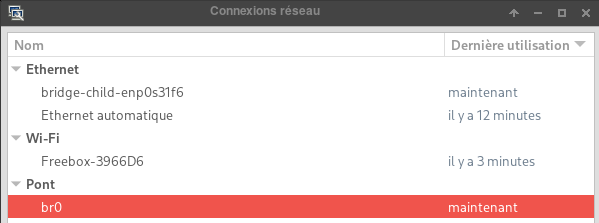  
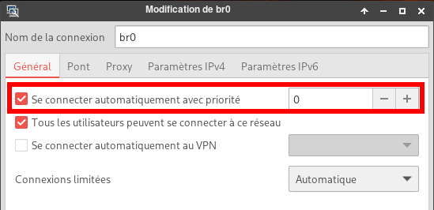  
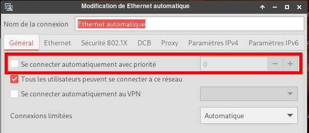  
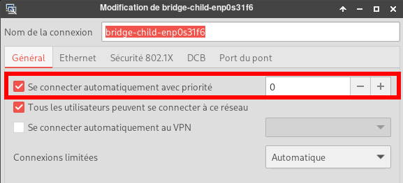  


**En cas d'erreur réseau**

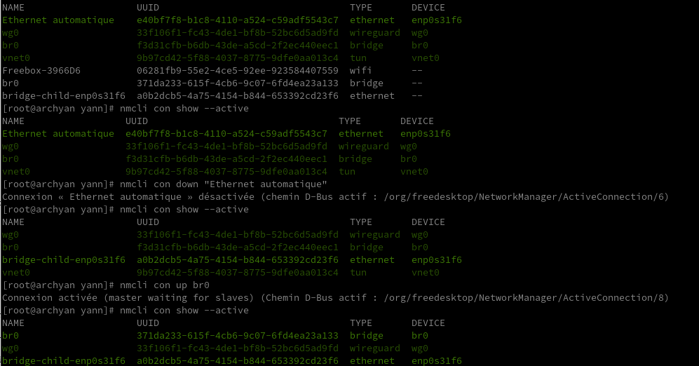

#### NetworkManager ajout connexion routeur 4G

Dans le cas d'une utilisation d'un routeur 4G connecté sur l'interface réseau enp3s0f0  
Le routeur est DHCP sur le réseau 192.168.8.0/24  
DNS sur 192.168.8.1  

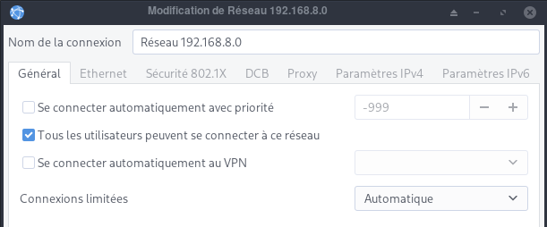  
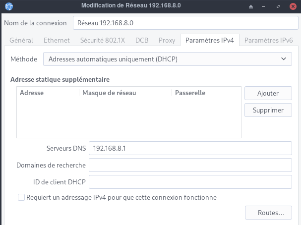  

#### Résumé réseau

On est connecté sur le réseau Box 192.168.0.0/24 et le réseau routeur 4G 192.168.8.0/24  
Wireguard mullvad est actif  
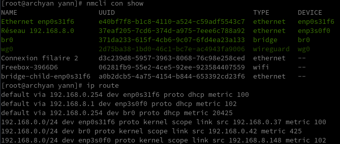  

### SSHD configuration 

Pour un accès sur l'ordinateur PC1 depuis un autre poste qui est sur le même réseau `192.168.0.0/24`  
Modifier la ligne (si existante) `PermitRootLogin yes` par `PermitRootLogin no`   
puis les lignes suivantes :

<u>pour un accès avec mot de passe</u>

```
PasswordAuthentication yes # les mots de passe en clair sont autorisés
AllowUsers *@192.168.0.*    # accès uniquement sur le réseau local
```

<u>pour un accès avec clé</u>

```
PasswordAuthentication no # les mots de passe en clair ne sont pas autorisés
AllowUsers *@192.168.0.*    # accès uniquement sur le réseau local
```

Redémarrer ssh

    sudo systemctl restart sshd

### Neofetch 

pour visualiser les informations du système

    yay -S neofetch

Pour avoir les informations saisir `neofetch`

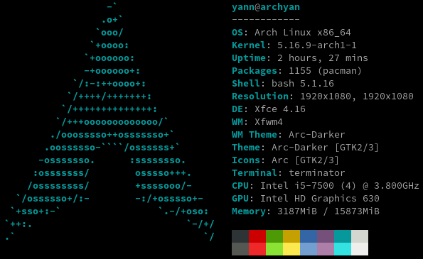

### Les liens dans home

Les liens après montage

```bash
[yann@archyan ~]$ ls -l |grep ^l
lrwxrwxrwx  1 yann users    12 20 oct.   2021 Partage -> /mnt/partage
lrwxrwxrwx  1 root root      8  6 mars   2021 iso -> /srv/iso
lrwxrwxrwx  1 root root     11  2 janv. 07:41 lenovo -> /mnt/lenovo
lrwxrwxrwx  1 root root     10  6 mars   2021 media -> /srv/media
lrwxrwxrwx  1 root root     12  6 mai   07:39 sav -> /sauvegardes
lrwxrwxrwx  1 root root      8  6 mai   07:52 virtuel -> /virtuel

```

### Chiffrer dossier Private

[Chiffrement (eCryptfs)](/posts/chiffrement-ecryptfs/)

### Gérer Presse Papier

*[Gérer le presse-papier en ligne de commande sous Linux avec xclip](https://blog.madrzejewski.com/presse-papier-ligne-commande-cli-linux-xclip/)*

<u>Copier des données dans le presse papier</u>  

```bash
echo "Du texte en presse papier" | xclip
# L'option -i pour "in", pas forcément nécessaire
echo "Du texte en presse papier" | xclip -i
# Fonctionne aussi avec des commandes
uptime | xclip
```

placer le contenu d’un fichier dans le presse papier  

```bash
echo "Du texte" > mon_fichier.txt
xclip < mon_fichiers.txt
```

On peut également manipuler deux presses papiers. Si vous ne le saviez pas, il existe (au moins) deux presses papiers sur Linux :

*    Celui accessible avec la sélection et le clic-molette de la souris. Pour xclip, c’est le presse papier primary
*    Celui accessible avec les raccourcis CTRL + C et CTLR + V (ou clic droit copier/coller). C’est le presse papierclipboard.
*    Dans le manuel de xclip, il est mentionné une troisième optionsecondary mais dans mes tests, cela ne semble pas fonctionner. En faisant quelques recherches, la distinction semble être expliquée sur un article à propos de X et la gestion du presse papier. L’article ne parle pas de secondary donc pour moi, secondary n’existe pas dans X, <u>c’est **clipboard** qu’il faut utiliser</u>. En résumé, on oublie secondary.

Par défaut, **xclip** place les données dans le presse papier principal, c’est-à-dire celui accessible avec le **clic-molette**. Cela peut se changer avec l’option `-selection` :

```bash
# On enregistre la date dans le presse papier 'clipboard', on utilise CTRL + V ou clic droit/coller pour l'utiliser
date | xclip -selection clipboard
# On enregistre la date dans le presse papier 'secondary', on utilise le clic molette pour l'utiliser
date | xclip -selection primary
```

<u>Coller des données</u>

Pour coller des données, on peut utiliser le **clic molette** pour le presse papier primary ou** CTRL + V** et clic droit/coller pour le presse papier clipboard (voire même SHIFT + INSERT, mais c’est moins connu).

On peut également utiliser xclip pour coller des données, ce qui permet de gérer cela en ligne de commande ou dans un script. Pour cela, il suffit de lancer xclip avec l’option -o (pour out). L’option -selection est toujours supportée, elle permet de choisir à partir de quel presse papier il faut récupérer les données

```bash
# On place des données dans le presse papier primaire, les deux commandes sont équivalentes
echo "primary" | xclip
echo "primary" | xclip -selection primary
# On affiche les données du presse papier primaire, les deux commandes sont équivalentes
xclip -o
xclip -o -selection primary
# On place les données dans un fichier
xclip -o -selection primary > mon_fichier.txt
# On place des données dans le presse papier secondaire
echo "clipboard" | xclip -selection clipboard
# On affiche les données du presse papier secondaire
xclip -o -selection clipboard
# On place les données du presse papier secondaire dans un fichier
xclip -o -selection clipboard > mon_fichier.txt
```

### Diagramme réseau

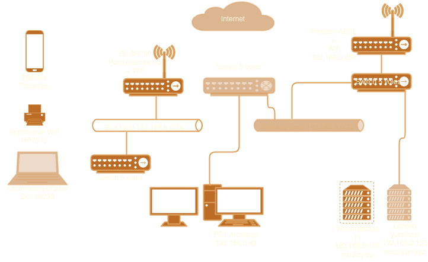

## Démarrer-Eteindre une machine sur le réseau

*On veut démarrer ou éteindre une machine distante sur le réseau via ssh et "wake on lan"*

### Wake on Lan

[How To Wake Up Computers Using Linux Command [ Wake-on-LAN ( WOL ) ] By Sending Magic Packets](https://www.cyberciti.biz/tips/linux-send-wake-on-lan-wol-magic-packets/)  
wake-on-LAN (WOL) est une norme de réseau Ethernet qui permet d'allumer un serveur par un message réseau. Vous devez envoyer des "paquets magiques" aux adaptateurs Ethernet et aux cartes mères compatibles avec le WOL pour allumer les systèmes concernés. Assurez-vous de connecter la carte réseau (eth0 ou eth1) à la carte mère et d'activer la fonction WOL du BIOS. Voici un guide rapide pour activer la fonction WOL sous RHEL / Fedora / CentOS / Debian / Ubuntu Linux.

Dans le bios du lenovo M700, le paramètre "wake on lan" est sur automatique.  
Lorsque le Lenovo M700 eest éteint, on peut le rallumer avec un outil logiciel et l'adresse mac de la machine

Il faut utiliser un logiciel client pour envoyer les "paquets magiques" WoL (Wake-on-LAN) au système cible. Vous trouverez divers outils pour tous les systèmes d'exploitation modernes, notamment MS-Windows 8/10, Apple macOS & OS X, toutes les distros Linux modernes, FreeBSD, OpenBSD, NetBSD et de nombreux smartphones.Il existe également un script Perl pour réveiller les ordinateurs. Nous pouvons l'installer comme suit

    sudo apt install wakeonlan # Debian/Ubuntu 
    yay -S wakeonlan # archlinux

Vous pouvez obtenir l'adresse MAC en combinant la commande ping et la commande arp.

    ping -c 4 rnmkcy.eu && arp -n

```
PING rnmkcy (192.168.0.145) 56(84) octets de données.
64 octets de rnmkcy (192.168.0.145) : icmp_seq=1 ttl=64 temps=0.587 ms
64 octets de rnmkcy (192.168.0.145) : icmp_seq=2 ttl=64 temps=0.520 ms
64 octets de rnmkcy (192.168.0.145) : icmp_seq=3 ttl=64 temps=0.562 ms
64 octets de rnmkcy (192.168.0.145) : icmp_seq=4 ttl=64 temps=0.559 ms

--- statistiques ping rnmkcy ---
4 paquets transmis, 4 reçus, 0% packet loss, time 3031ms
rtt min/avg/max/mdev = 0.520/0.557/0.587/0.023 ms
Address                  HWtype  HWaddress           Flags Mask            Iface
192.168.0.145            ether   00:23:24:c9:06:86   C                     br0
```

Utilisation d'une adresse de diffusion de sous-réseau :

    wakeonlan -i 192.168.0.255 00:23:24:c9:06:86

```
Sending magic packet to 192.168.0.255:9 with payload 00:23:24:c9:06:86
Hardware addresses: <total=1, valid=1, invalid=0>
Magic packets: <sent=1>
```

Patienter 2 à 3 minutes avant d'accéder à la machine...

### PC1 - Script au démarrage

*On veut démarrer la machine distante Lenovo 192.168.0.145 via le réseau*

#### Option A - Exécution commande au démarrage quand réseau accessible

Exécuter la commande au démarrage avec systemd après que le réseau soit devenu accessible.

    sudo nano /etc/systemd/system/run-at-startup.service

```
[Unit]
Description=Run script at startup after network becomes reachable
After=network.target

[Service]
Type=simple
RemainAfterExit=yes
ExecStart=/usr/bin/wakeonlan -i 192.168.0.255 00:23:24:c9:06:86
TimeoutStartSec=0

[Install]
WantedBy=default.target
```

Rafraîchir les fichiers de configuration de systemd et activer le service

    sudo systemctl daemon-reload
    sudo systemctl enable run-at-startup.service

Vérifier la bonne exécution

    journalctl -u run-at-startup.service

```
févr. 23 19:57:12 archyan systemd[1]: Started Run script at startup after network becomes reachable.
févr. 23 19:57:12 archyan startup_script.sh[462]: Sending magic packet to 192.168.0.255:9 with payload 00:23:24:c9:06:86
févr. 23 19:57:12 archyan startup_script.sh[462]: Hardware addresses: <total=1, valid=1, invalid=0>
févr. 23 19:57:12 archyan startup_script.sh[462]: Magic packets: <sent=1>
```

#### Option B - Exécution commande au démarrage après un temps défini ACTIVE 

**Fichier service systemd pour exécuter un script N minutes après le démarrage**  
Nous devons créer un fichier de **service systemd unit** et un **fichier timer systemd** unit correspondant pour exécuter le script N minutes après le démarrage.   
Nous pouvons utiliser `OnBootSec=` ou `OnStartupSec=` pour exécuter le script avec un délai après le démarrage sous Linux.

*    `OnBootSec=` Définit un délai relatif au moment où la machine a été démarrée. Dans les conteneurs, pour l'instance du gestionnaire de système, cela correspond à OnStartupSec=, ce qui rend les deux équivalents.
*    `OnStartupSec=` Définit une minuterie relative au moment où le gestionnaire de services a été démarré pour la première fois. Pour les unités de temporisation du système, cela est très similaire à OnBootSec= car le gestionnaire de services du système est généralement démarré très tôt au démarrage. Il est principalement utile lorsqu'il est configuré dans des unités fonctionnant dans le gestionnaire de services par utilisateur, car le gestionnaire de services utilisateur est généralement démarré à la première connexion seulement, et pas déjà au démarrage.

    /etc/systemd/system/run-script-with-delay.service

```
[Unit]
Description=Run script at startup

[Service]
Type=oneshot
ExecStart=/usr/bin/wakeonlan -i 192.168.0.255 00:23:24:c9:06:86
TimeoutStartSec=0
```

**fichier de temporisation de l'unité systemd pour exécuter un script N minutes après le démarrage**  
`timer` est un fichier de configuration d'unité dont le nom se termine par **".timer"** encode des informations sur un timer contrôlé et supervisé par systemd, pour une activation basée sur un timer.

    /etc/systemd/system/run-script-with-delay.timer

```
[Unit]
Description="Run script after 2 minutes of boot"

[Timer]
OnBootSec=2min

[Install]
WantedBy=default.target
```

L'unité à activer lorsque cette minuterie s'écoule est fournie en utilisant `Unit=` sous `[Timer]`. Ici, puisque notre service systemd et notre fichier de temporisation portent le même nom, c'est-à-dire `run-script-with-delay`, nous n'avons pas défini d'`Unit=` dans le fichier d'unité de la temporisation. Si les noms de votre service unitaire et de votre fichier timer sont différents, fournissez le nom du fichier de service mappé avec `Unit=` dans le fichier .timer sous `[Timer]`  
Ici pour **OnBootSec** ou **OnStartupSec** 

*    Les arguments des directives sont des intervalles de temps configurés en secondes. Exemple : `OnBootSec=50` signifie 50s après le démarrage.
*    L'argument peut également inclure des unités de temps. Exemple : `OnBootSec=5h 30min` signifie 5 heures et 30 minutes après le démarrage.
*    Pour plus de détails sur la syntaxe des intervalles de temps pris en charge par `OnBootSec=` ou `OnStartupSec=`, consultez la [page de manuel de systemd.timer](https://www.freedesktop.org/software/systemd/man/systemd.time/#).

Rafraîchir les fichiers de configuration de systemd

    sudo systemctl daemon-reload

Désactivez le fichier de service systemd unit car il ne devrait pas démarrer automatiquement, ce qui est l'idée derrière cet article. Nous voulons que ce service exécute un script après N minutes de démarrage en fonction de la valeur de la minuterie.

    sudo systemctl disable run-script-with-delay.service

Activez ensuite le fichier de temporisation de l'unité systemd afin qu'il soit exécuté après le démarrage et déclenche ensuite le fichier de service de l'unité systemd mappé en fonction de la valeur de la temporisation.

    sudo systemctl enable run-script-with-delay.timer

**Vérifier la configuration du fichier d'unité systemd**  
Après le redémarrage, lorsque nous vérifions l'état de `run-script-with-delay.timer`, observez ici la section en surbrillance où il montre le prochain déclenchement qui est prévu après 2 minutes que nous avons configuré avec `OnBootSec` dans le fichier unité timer.  
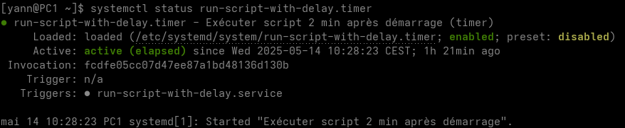  
Une fois que l'heure de déclenchement est atteinte, le service va exécuter sa tâche définie qui, ici, est d'exécuter la commande après 5 minutes de démarrage. Comme vous le voyez maintenant, le déclencheur affiche "non applicable" pour l'unité de temporisation.
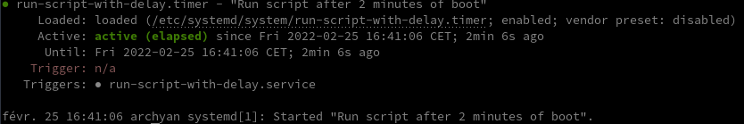  

### PC1 - Script à l'arrêt

*On veut arrêter la machine distante Lenovo 192.168.0.145 via ssh lors de l'extinction de PC1*

#### Option A - Exécuter une commande systemd juste avant l'arrêt

    sudo nano /etc/systemd/system/stop_script.service

```
[Unit]
Description=Run my custom task at shutdown
DefaultDependencies=no
Before=shutdown.target

[Service]
Type=oneshot
ExecStart=/usr/bin/ssh leno@192.168.0.145 -p 55145 -i /usr/local/bin/lenovo-ed25519 'sudo systemctl poweroff'
TimeoutStartSec=0

[Install]
WantedBy=shutdown.target
```

Rafraîchir les fichiers de configuration de systemd et activer le service

    sudo systemctl daemon-reload
    sudo systemctl enable stop_script.service

Vérifier la bonne exécution

    journalctl -u stop_script.service

```
févr. 23 19:49:09 archyan systemd[1]: Starting Run my custom task at shutdown...
févr. 23 19:49:09 archyan systemd[1]: stop_script.service: Deactivated successfully.
févr. 23 19:49:09 archyan systemd[1]: Finished Run my custom task at shutdown.
```

#### Option B - Comment lancer un script systemd à l'arrêt seulement et pas au redémarrage 

1 - Créer un script type

Pour exécuter un script à l'arrêt uniquement avec systemd, nous avons besoin d'un script. Voici un script fictif qui nous aidera à reconnaître si notre script est appelé à `reboot.target` ou `shutdown.target`. Avec `systemctl list-jobs` nous connaissons la cible actuellement active et en cours d'exécution. Le script ne devrait donc fonctionner que sur `shutdown.target` ou `reboot.target`.

    /home/admuser/script.sh

```shell
#!/bin/bash
# Run script with systemd at shutdown only 

case $1 in
        start)
        systemctl list-jobs | egrep -q 'reboot.target.*start' && echo "starting reboot" >> /home/admuser/file
        systemctl list-jobs | egrep -q 'shutdown.target.*start' && echo "starting shutdown" >> /home/admuser/file
        ;;

        stop)
        systemctl list-jobs | egrep -q 'reboot.target.*start' || echo "stopping"  >> /home/admuser/file
        ;;

esac
```

J'ai également écrit une fonction stop qui ne sera de toute façon pas appelée, mais juste pour prouver ce fait, cette fonction est nécessaire. Dans ce cas, seul `ExecStart` sera appelé pour exécuter le script avec systemd à l'arrêt seulement et non au redémarrage.

2 - Créer un fichier d'unité pour exécuter le script avec systemd à l'arrêt seulement.

Nous allons créer notre fichier unitaire systemd sous `/etc/systemd/system` avec le nom `myscript.service`.

Voici notre fichier d'unité systemd que nous utiliserons pour exécuter un script avec systemd à l'arrêt uniquement (pas au redémarrage).

    /etc/systemd/system/myscript.service

```shell
[Unit]
Description=Run my custom task at shutdown only
DefaultDependencies=no
Conflicts=reboot.target
Before=poweroff.target halt.target shutdown.target
Requires=poweroff.target

[Service]
Type=oneshot
ExecStart=/home/admuser/script.sh start
RemainAfterExit=yes

[Install]
WantedBy=shutdown.target
```


Voici la page de manuel de systemd.unit et systemd.service.

*    **Conflicts** Si une unité a un paramètre `Conflits=` sur une autre unité, le démarrage de la première arrêtera la seconde et vice versa.
*    **Before=** Ils configurent les dépendances d'ordre entre les unités.
*    **Requires** Configure les dépendances d'exigence sur d'autres unités. Si cette unité est activée, les unités listées ici seront également activées.
*    **Type** Configure le type de démarrage du processus pour cette unité de service. Un des types suivants : simple, forking, oneshot, dbus, notify ou idle.
*    **ExecStart** Commandes avec leurs arguments qui sont exécutées lorsque ce service est démarré.
*    **RemainAfterExit** Prend une valeur booléenne qui spécifie si le service doit être considéré comme actif même lorsque tous ses processus ont quitté. La valeur par défaut est no.

Rafraîchir les fichiers de configuration de systemd

    systemctl daemon-reload

Activer le script pour qu'il démarre automatiquement au prochain démarrage

    systemctl enable myscript

```shell
Created symlink /etc/systemd/system/shutdown.target.wants/myscript.service → /etc/systemd/system/myscript.service.
```

3 - Vérifier la configuration du fichier unité systemd

Vérifions notre fichier unitaire systemd. Nous allons effectuer un arrêt de mon Linux pour vérifier s'il exécute le script avec systemd à l'arrêt seulement et non au redémarrage.

    systemctl poweroff

Après le réveil du nœud, nous vérifions le contenu de notre fichier /home/admuser/file où nous avons écrit le contenu de notre script factice.

```shell
login as: root
root@127.0.0.1's password:
Last login: Tue Jan 14 22:41:22 2020 from 10.0.2.2

[root@centos-8 ~]# cat /home/admuser/file
starting shutdown
```

Comme prévu, le script a été appelé à l'arrêt. 

Maintenant, nous allons faire un reboot et vérifier la même chose.  
Avant de redémarrer, je vais nettoyer le contenu de /home/admuser/file.

Comme prévu, le contenu de /home/admuser/file est vide et le script n'a pas été appelé au redémarrage.

```shell
[root@centos-8 ~]# cat /home/admuser/file
[root@centos-8 ~]#
```

Les différents cas

```
/usr/bin/systemctl list-jobs | egrep -q 'shutdown.target.*start' && echo "shutting down" >> /home/admuser/test.txt || echo "not shutting down" >> /home/admuser/test.txt
/usr/bin/systemctl list-jobs | egrep -q 'reboot.target.*start' && echo "-> rebooting" >> /home/admuser/test.txt || echo "-> not rebooting" >> /home/admuser/test.txt
/usr/bin/systemctl list-jobs | egrep -q 'halt.target.*start' && echo "-> halting" >> /home/admuser/test.txt || echo "-> not halting" >> /home/admuser/test.txt
/usr/bin/systemctl list-jobs | egrep -q 'poweroff.target.*start' && echo "-> powering down" >> /home/admuser/test.txt || echo "-> not powering down" >> /home/admuser/test.txt
```

**Mise en oeuvre sur PC1**

    sudo nano /etc/systemd/system/stop_script.service

```shell
[Unit]
Description=Run my custom task at shutdown only
DefaultDependencies=no
Conflicts=reboot.target
Before=poweroff.target halt.target shutdown.target
Requires=poweroff.target

[Service]
Type=oneshot
ExecStart=/usr/bin/ssh leno@192.168.0.145 -p 55145 -i /usr/local/bin/lenovo-ed25519 'sudo systemctl poweroff'
RemainAfterExit=yes

[Install]
WantedBy=shutdown.target
```

Rafraîchir les fichiers de configuration de systemd et activer le service

    sudo systemctl daemon-reload
    sudo systemctl enable stop_script.service


## Annexe

### Flatpak (FACULTATIF)

{:width=50}
Par Matthias Clasen — <a rel="nofollow" class="external free" href="https://github.com/flatpak/flatpak/blob/master/flatpak.png">https://github.com/flatpak/flatpak/blob/master/flatpak.png</a>, <a href="https://creativecommons.org/licenses/by-sa/4.0" title="Creative Commons Attribution-Share Alike 4.0">CC BY-SA 4.0</a>, <a href="https://commons.wikimedia.org/w/index.php?curid=49741329">Lien</a>  
*Flatpak (anciennement xdg-app) est un système de virtualisation d’application pour les distributions GNU/Linux de bureau.*

[Flatpak (archlinux)](https://wiki.archlinux.org/index.php/Flatpak)  
Installation

    sudo pacman -S flatpak

Ajout du dépôt officiel, [Flathub repository](https://flathub.org/) 

    flatpak remote-add --if-not-exists flathub https://dl.flathub.org/repo/flathub.flatpakrepo

Liste des dépôts

    flatpak remotes

```
Name    Options
flathub system
```

Pour effacer un dépôt : `flatpak remote-delete name`  

Recherche

    flatpak update # mise à jour dépôt
    flatpak search signal

```
Name                       Description                                                                                   Application ID                                               Version           Branch        Remotes
Signal Desktop             Private messenger                                                                             org.signal.Signal                                            1.38.2            stable        flathub
```

Installer un runtime ou une application : `flatpak install remote name`  
où *remote* est le nom du dépôt distant, et *name* est le nom de l'application ou du runtime à installer. 

Installer signal

    flatpak install flathub signal

Le fichier `~/.local/share/applications/signal-desktop.desktop`

```
[Desktop Entry]
Type=Application
Name=Signal
Comment=Signal Private Messenger for Linux
Icon=signal-desktop
Exec=/usr/bin/flatpak run signal
Terminal=false
Categories=Network;InstantMessaging;
StartupWMClass=Signal
```

### pamac gestionnaire de paquets (FACULTATIF)

Un frontal Gtk3, un gestionnaire de paquets basé sur libalpm avec un support AUR et Appstream.

    yay -S pamac-aur

### Unison

*Unison est un outil de synchronisation de fichiers gratuit, open source, multi-plateforme et bidirectionnel. Il est utilisé pour stocker deux répliques de fichiers et de répertoires sur deux systèmes différents ou des disques différents sur le même système. Les répliques de fichiers et de répertoires sont modifiées séparément, puis mises à jour en propageant les modifications de chaque réplique à l'autre. Pour faire simple, toutes les modifications apportées à un emplacement seront répliquées vers un autre emplacement et vice versa.*

`Il faut utiliser une version unison IDENTIQUE entre client serveur`{: .prompt-info }

serveur debian 11 (bullseye) : `unison -version` &rarr; **unison version 2.51.3 (ocaml 4.11.1)**

archlinux : **unison version 2.53.0 (ocaml 4.14.0)**  
Pour avoir une version identique, on va consulter les [archives des paquets unison](https://archive.archlinux.org/packages/u/unison/) et télécharger puis installer la version identique à debian

```shell
wget https://archive.archlinux.org/packages/u/unison/unison-2.51.3-1-x86_64.pkg.tar.zst
yay -U unison-2.51.3-1-x86_64.pkg.tar.zst
```

Vérifier la version installée : `unison -version` &rarr; **unison version 2.51.3 (ocaml 4.11.1)**

Pour éviter une mise à jour de ce paquet il faut ajouter cette ligne `IgnorePkg   = unison` au fichier `/etc/pacman.conf`
{: .prompt-warning }

