+++
title = 'Yunohost - Lenovo Thinkcentre M700 Tiny SSD M.2 500Go'
date = 2023-05-06 00:00:00 +0100
categories = yunohost
+++
[Description matériel Lenovo ThinkCentre M700 Tiny et mise à jour BIOS](/posts/Description_materiel_Lenovo_ThinkCentre_M700_Tiny_et_mise_a_jour_BIOS/)  

## Debian 11 bullseye

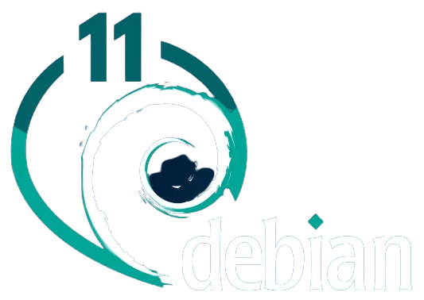{:height="100"}   

### Installation via clé USB

Installer avec clé USB contenant image ISO **firmware-11.2.0-amd64-netinst.iso** (pour les pilotes carte wifi/bluetooth), appui sur F12 et choisir "Expert graphical install"  
Choix : USB KEY &rarr; UEFI et "Graphical install" 

Language : French, France, Français  

Machine : think  
root : root49600  
leno : leno49600  

Assisté - utiliser tout un disque avec LVM  
Choix : Disque SSD 500Go M.2 sdb WDC  
Partitions /home /var /tmp séparées   
Forcer UEFI : non  
Totalité du disque  
Miroir France deb.debian.org  

Sélection des logiciels

* Serveur SSH
* Utilitaires usuels du système

La machine reboot à la fin de l'installation  
Se connecter avec l'utilisateur "leno"  
Relever l'adresse ip : `ip a` , exemple 192.168.0.11

On peut ensuite se connecter via ssh : `ssh leno@192.168.0.11` et passer en root par `su`

### Box IPV6 et DMZ

Pour le nexthop IPV6 FreeBox

    ip a |grep "inet6 fe80"

*inet6 fe80::223:24ff:fec9:686/64 scope link*

Paramètres de la Freebox, Configuration IPV6 &rarr; Délégation de préfixe  
Préfixe : 2a01:e0a:9c8:2081::/64  
Next Hop : fe80::223:24ff:fec9:686  

L'accès local sur ip 192.168.0.135  
Modifier l'accès DMZ de la box (FreeBox)  
Freebox : Paramètres avancés &rarr; Gestion des ports &rarr; DMZ  IP DMZ : 192.168.0.135  
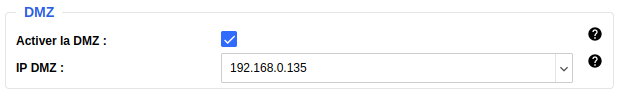  

Reverse DNS freebox ([Freebox Espace Abonné](https://subscribe.free.fr/login/)) : **ouestyan.xyz**  

### Debian Ip V4 V6 statiques

Passage en ip statique 192.168.0.135 et 2a01:e0a:9c8:2081::1 

    nano /etc/network/interfaces

```
# The primary network interface
allow-hotplug eno1
#iface eno1 inet dhcp
iface eno1 inet static
 address 192.168.0.135
 netmask 255.255.255.0
 gateway 192.168.0.254
# This is an autoconfigured IPv6 interface
#iface eno1 inet6 auto
iface eno1 inet6 static
 address 2a01:e0a:9c8:2081::1
 post-up ip -6 route add default via fe80::8e97:eaff:fe39:66d6 dev eno1
 netmask 64

```

Redémarrer : `systemctl reboot`  

Se reconnecter se connecter via ssh : `ssh leno@192.168.0.135` 

Vérifier Adressage IP statique

    ip a

```
1: lo: <LOOPBACK,UP,LOWER_UP> mtu 65536 qdisc noqueue state UNKNOWN group default qlen 1000
    link/loopback 00:00:00:00:00:00 brd 00:00:00:00:00:00
    inet 127.0.0.1/8 scope host lo
       valid_lft forever preferred_lft forever
    inet6 ::1/128 scope host 
       valid_lft forever preferred_lft forever
2: eno1: <BROADCAST,MULTICAST,UP,LOWER_UP> mtu 1500 qdisc pfifo_fast state UP group default qlen 1000
    link/ether 00:23:24:c9:06:86 brd ff:ff:ff:ff:ff:ff
    altname enp0s31f6
    inet 192.168.0.135/24 brd 192.168.0.255 scope global eno1
       valid_lft forever preferred_lft forever
    inet6 2a01:e0a:9c8:2081::1/64 scope global 
       valid_lft forever preferred_lft forever
    inet6 fe80::223:24ff:fec9:686/64 scope link 
       valid_lft forever preferred_lft forever

```


## Yunohost 


passer en root par `su`

### Script installation

Prérequis, sudo et curl

```shell
apt install sudo curl
```

Lancez les commandes suivantes :

```shell
PATH=/sbin:$PATH
curl https://install.yunohost.org | bash
```

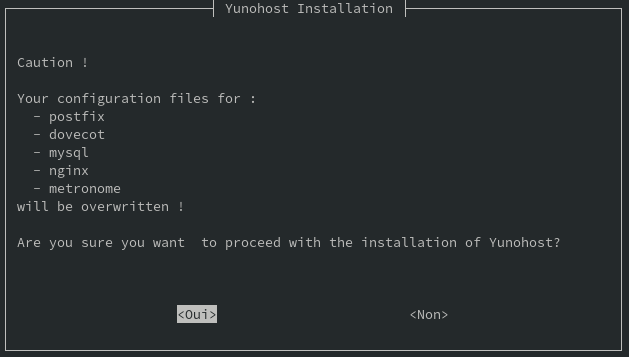  
Patienter quelques minutes...  
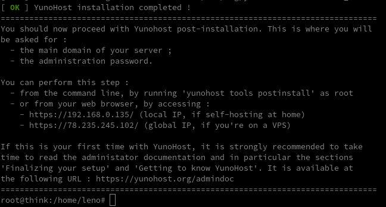  

### Post-installation

Lancement en ligne de commande

    yunohost tools postinstall

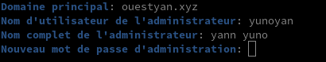  

Le mot de passe root est modifié

```
Attention : La post-installation est terminée ! Pour finaliser votre installation, il est recommandé de :
    - diagnostiquer les potentiels problèmes dans la section 'Diagnostic' de l'interface web (ou 'yunohost diagnosis run' en ligne de commande) ;
    - lire les parties 'Lancer la configuration initiale' et 'Découvrez l'auto-hébergement, comment installer et utiliser YunoHost' dans le guide d'administration : https://yunohost.org/admindoc.
```

Lancer la mise à jour yunohost

```bash
yunohost tools update
yunohost tools upgrade
```

### DNS ouestyan.xyz

{:width="50"} 

Domaine ouestyan.xyz **IPV6 ONLY**

    yunohost domain dns-conf ouestyan.xyz

```
Attention : 'yunohost domain dns-conf' est déprécié et sera bientôt supprimé
Attention : 'yunohost domain dns-conf' est déprécié et sera bientôt supprimé
Attention : 'yunohost domain dns-conf' est déprécié et sera bientôt supprimé
Info : Cette commande vous montre la configuration *recommandée*. Elle ne configure pas le DNS pour vous. Il est de votre ressort de configurer votre zone DNS chez votre registrar/fournisseur conformément à cette recommandation.
; Basic ipv4/ipv6 records
@ 3600 IN A 78.235.245.102
@ 3600 IN AAAA 2a01:e0a:9c8:2081::1

; Mail
@ 3600 IN MX 10 ouestyan.xyz.
@ 3600 IN TXT "v=spf1 a mx -all"
mail._domainkey 3600 IN TXT "v=DKIM1; h=sha256; k=rsa; p=MIGfMA0GCSqGSIb3DQEBAQUAA4GNADCBiQKBgQDDQKF+YsQWKFu0o88HWWMluAZhzGi9ax301KkcxUJFI4dHmJ7xSNXfNG3JJAsSCxzX2+79VtpQkrKq6x+lu27IvydsdbNwN5c1DnVm3hePRWFKQ1LhmxTG6V8rxxP09o+1fYaKiAFvBV1tV3Q/OFnjT1Qhnc5Ycx38joYXKYwa7QIDAQAB"
_dmarc 3600 IN TXT "v=DMARC1; p=none"


; XMPP
_xmpp-client._tcp 3600 IN SRV 0 5 5222 ouestyan.xyz.
_xmpp-server._tcp 3600 IN SRV 0 5 5269 ouestyan.xyz.
muc 3600 IN CNAME ouestyan.xyz.
pubsub 3600 IN CNAME ouestyan.xyz.
vjud 3600 IN CNAME ouestyan.xyz.
xmpp-upload 3600 IN CNAME ouestyan.xyz.

; Extra
* 3600 IN A 78.235.245.102
* 3600 IN AAAA 2a01:e0a:9c8:2081::1
@ 3600 IN CAA 0 issue "letsencrypt.org"
```

Copier le texte ci dessus

Se connecter sur OVH dans le domaine ouestyan.xyz  
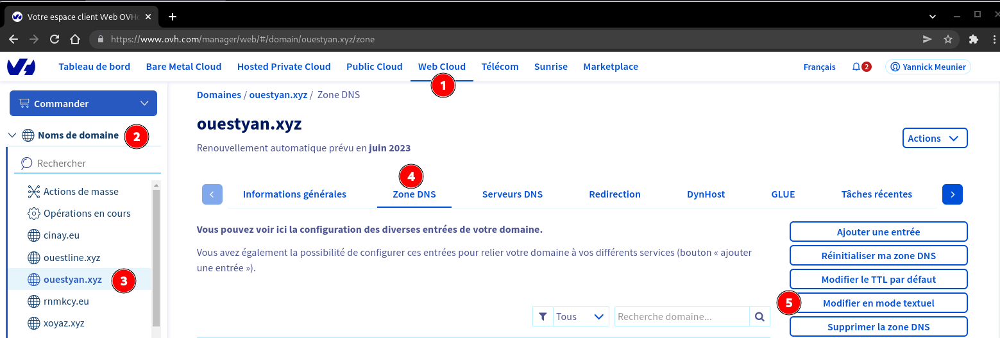

Coller le texte après la 4 ième ligne

```
$TTL 3600
@	IN SOA dns106.ovh.net. tech.ovh.net. (2022060600 86400 3600 3600000 60)
                         IN NS     dns106.ovh.net.
                         IN NS     ns106.ovh.net.
< Coller le texte ICI>
```

Cliquer sur suivant  
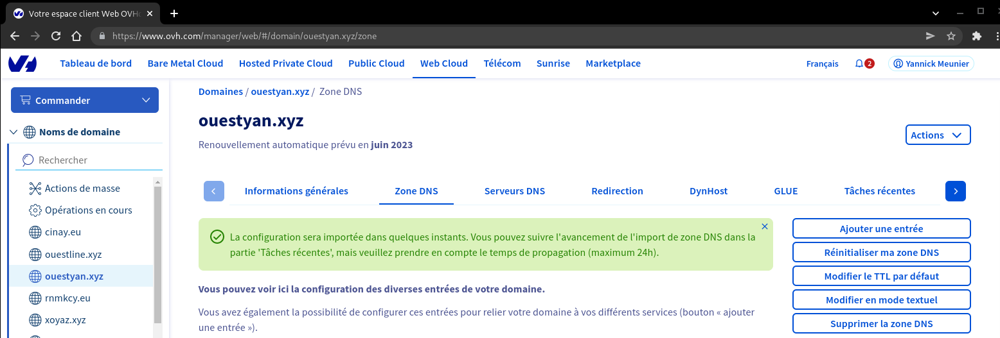

La configuration DNS OVH

```
$TTL 3600
@	IN SOA dns106.ovh.net. tech.ovh.net. (2023032303 86400 3600 3600000 60)
                         IN NS     ns106.ovh.net.
                         IN NS     dns106.ovh.net.
                         IN MX     10 ouestyan.xyz.
                         IN A      78.235.245.102
                         IN AAAA   2a01:e0a:9c8:2081::1
                         IN CAA    128 issue "letsencrypt.org"
                         IN TXT    "v=spf1 a mx -all"
*                        IN A      78.235.245.102
*                        IN AAAA   2a01:e0a:9c8:2081::1
_dmarc                   IN TXT    "v=DMARC1; p=none"
_xmpp-client._tcp        IN SRV    0 5 5222 ouestyan.xyz.
_xmpp-server._tcp        IN SRV    0 5 5269 ouestyan.xyz.
mail._domainkey          IN TXT    ( "v=DKIM1;h=sha256;k=rsa;p=MIGfMA0GCSqGSIb3DQEBAQUAA4GNADCBiQKBgQDDQKF+YsQWKFu0o88HWWMluAZhzGi9ax301KkcxUJFI4dHmJ7xSNXfNG3JJAsSCxzX2+79VtpQkrKq6x+lu27IvydsdbNwN5c1DnVm3hePRWFKQ1LhmxTG6V8rxxP09o+1fYaKiAFvBV1tV3Q/OFnjT1Qhnc5Ycx38joYXKYwa7QIDAQAB;" )
muc                      IN CNAME  ouestyan.xyz.
pubsub                   IN CNAME  ouestyan.xyz.
vjud                     IN CNAME  ouestyan.xyz.
xmpp-upload              IN CNAME  ouestyan.xyz.
```

### Certificats SSL Let's Encrypt

  
On active les certificats SSL pour le domaine par l'administration web  
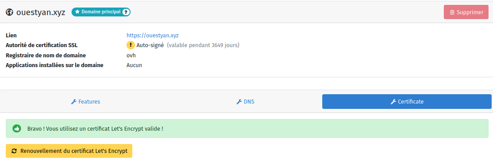  


Vérifier validité

    yunohost domain cert status

```
certificates: 
  ouestyan.xyz: 
    CA_type: letsencrypt
    style: success
    summary: letsencrypt
    validity: 89
```

Renouvellement manuel

    yunohost domain cert renew

### Diagnostic et corrections

administration web &rarr; Diagnosis 

Lancer un diagnostic en mode su

    yunohost diagnosis run

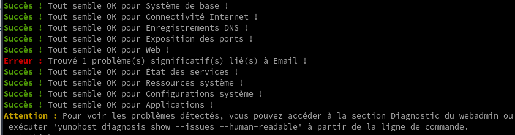

    yunohost diagnosis show --issues --human-readable

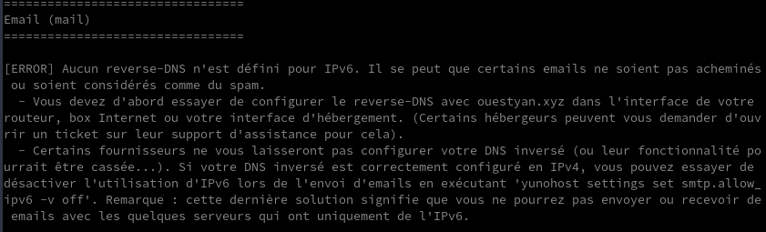

Free n'autorise pas le DNS inversé IPV6.  avec la commande suivante  
On désactive avec la commande suivante

    yunohost settings set smtp.allow_ipv6 -v off

Pour ignorer les erreurs, ouvrir yunohost web en admin &rarr; Diagnostic

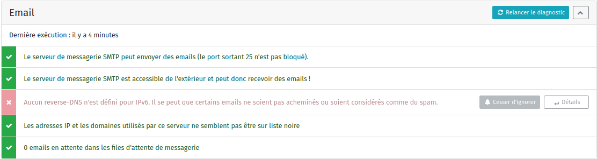  

### OpenSSH avec clé

{height="70"}  
<u>sur l'ordinateur de bureau</u>
Générer une paire de clé curve25519-sha256 (ECDH avec Curve25519 et SHA2) nommé **yunokvm** pour une liaison SSH avec le serveur KVM.  

    ssh-keygen -t ed25519 -o -a 100 -f ~/.ssh/yunobulls

Envoyer les clés publiques sur le serveur KVM   

    ssh-copy-id -i ~/.ssh/yunobulls.pub yunoyan@192.168.0.135

<u>sur le serveur Yunohost</u>
On se connecte  

    ssh yunoyan@192.168.0.135

Sur votre serveur, la modification du fichier de configuration SSH pour désactiver l'authentification par mot de passe est gérée par un paramètre système 

    sudo yunohost settings set security.ssh.password_authentication -v no

Modifier le port SSH

*Pour empêcher les tentatives de connexion SSH par des robots qui analysent Internet à la recherche de tout serveur sur lequel SSH est activé, vous pouvez modifier le port SSH. Ceci est géré par un paramètre système, qui prend en charge la mise à jour de la configuration SSH et Fail2Ban.*

    sudo yunohost settings set security.ssh.port -v 55135

Accès depuis le poste distant avec la clé privée  

    ssh -p 55135 -i ~/.ssh/yunobulls yunoyan@192.168.0.135

Modifier motd

    sudo nano /etc/motd

```
                              _              _                
       _  _  _  _  _ _   ___ | |_   ___  ___| |_              
      | || || || || ' \ / _ \| ' \ / _ \(_-<|  _|             
       \_, | \_,_||_||_|\___/|_||_|\___//__/ \__|             
  ___  |__/  ___  ___| |_  _  _  __ _  _ _     __ __ _  _  ___
 / _ \| || |/ -_)(_-<|  _|| || |/ _` || ' \  _ \ \ /| || ||_ /
 \___/ \_,_|\___|/__/ \__| \_, |\__,_||_||_|(_)/_\_\ \_, |/__|
      _  ___  ___     _   _|__/__     __     _  ____ |__/     
     / |/ _ \|_  )   / | / / ( _ )   /  \   / ||__ /| __|     
     | |\_, / / /  _ | |/ _ \/ _ \ _| () |_ | | |_ \|__ \     
     |_| /_/ /___|(_)|_|\___/\___/(_)\__/(_)|_||___/|___/     
```

Installer des applications supplémentaires

    sudo apt install tmux figlet nmap net-tools tree

**Script ssh_rc_bash**

```shell
wget https://static.xoyaz.xyz/files/ssh_rc_bash
chmod +x ssh_rc_bash # rendre le bash exécutable
./ssh_rc_bash        # exécution
```
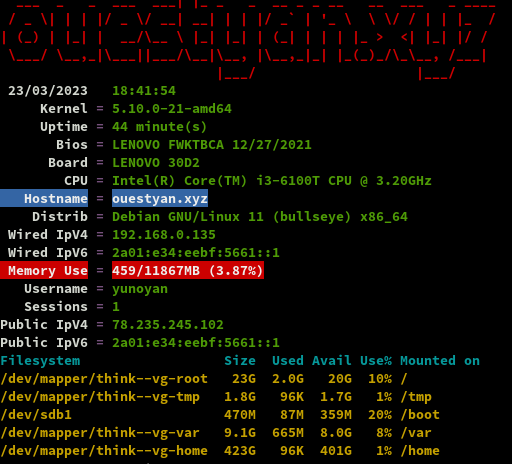

Droits root à yunoyan

    echo "leno     ALL=(ALL) NOPASSWD: ALL" >> /etc/sudoers

### Yunohost Multimédia

[Dossiers multimédia pour Yunohost](/posts/Dossiers_multimedia_pour_Yunohost/)

#### Création des dossiers

Pour toutes les applications, mise en place des dossiers multimédias 

```shell
wget -nv https://github.com/maniackcrudelis/yunohost.multimedia/archive/master.zip
unzip master.zip
sudo ./yunohost.multimedia-master/script/ynh_media_build.sh
```

#### Droits en lecture écriture

Application multimédia ayant besoin d'un droit d'écriture sur l'ensemble des médias  
Usage du dossier multimedia en ssh

```shell
sudo usermod -a -G multimedia yunoyan
```

#### Ajout de dossiers

Créer les dossiers nommés **virtuel** dans le home yunoyan

    mkdir /home/yunoyan/virtuel

Utiliser le script `ynh_media_addfolder.sh` pour ajouter son dossier de médias au dossier yunohost.multimedia et il deviendra ainsi accessible à l’ensemble des utilisateurs en lecture et en écriture.

Ajout **virtuel** au dossier multimédia

```bash
sudo ./yunohost.multimedia-master/script/ynh_media_addfolder.sh --source="/home/yunoyan/virtuel" --dest="virtuel"
```

Ajout du dossier **Divers** qui n'existe pas dans la structure par défaut

    mkdir /home/yunohost.multimedia/share/Divers

#### Structure multimedia

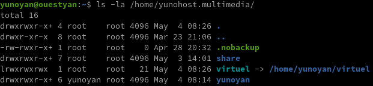

La structure  
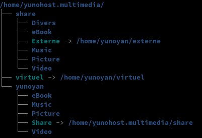

#### Première synchronisation

Exécution depuis PC1 del syncronisation rsync des différents dossiers multimédia

```
# BiblioCalibre
rsync -avz --progress --stats --human-readable --delete --rsync-path="rsync" -e "ssh -p 55135 -i /home/yann/.ssh/yunobulls"  /home/yann/media/BiblioCalibre yunoyan@192.168.0.135:/home/yunohost.multimedia/share/eBook/

# CalibreTechnique
rsync -avz --progress --stats --human-readable --delete --rsync-path="rsync" -e "ssh -p 55135 -i /home/yann/.ssh/yunobulls"  /home/yann/media/CalibreTechnique yunoyan@192.168.0.135:/home/yunohost.multimedia/share/eBook/ 

# diceware
rsync -avz --progress --stats --human-readable --delete --rsync-path="rsync" -e "ssh -p 55135 -i /home/yann/.ssh/yunobulls"  /home/yann/media/diceware yunoyan@192.168.0.135:/home/yunohost.multimedia/share/Divers/ 

# osm-new
rsync -avz --progress --stats --human-readable --delete --rsync-path="rsync" -e "ssh -p 55135 -i /home/yann/.ssh/yunobulls"  /home/yann/media/osm-new yunoyan@192.168.0.135:/home/yunohost.multimedia/share/Divers/ 

# img
rsync -avz --progress --stats --human-readable --delete --rsync-path="rsync" -e "ssh -p 55135 -i /home/yann/.ssh/yunobulls"  /home/yann/media/img yunoyan@192.168.0.135:/home/yunohost.multimedia/share/Divers/ 

# static
rsync -avz --progress --stats --human-readable --delete --rsync-path="rsync" -e "ssh -p 55135 -i /home/yann/.ssh/yunobulls"  /home/yann/media/yannstatic/_site/* yunoyan@192.168.0.135:/home/yunohost.multimedia/share/Divers/static

# musicyan
rsync -avz --progress --stats --human-readable --delete --rsync-path="rsync" -e "ssh -p 55135 -i /home/yann/.ssh/yunobulls"  /home/yann/media/musicyan yunoyan@192.168.0.135:/home/yunohost.multimedia/share/Music/ 

# sauvegardes
rsync -avz --progress --stats --human-readable --delete --rsync-path="rsync" -e "ssh -p 55135 -i /home/yann/.ssh/yunobulls"  /mnt/freebox/sauvegardes/borgbackup yunoyan@192.168.0.135:/home/yunohost.multimedia/sauvegardes/borgbackup 

```

## Applications Yunohost

### Calibre web

{:width="80"} 

Ajout domaine et certificats **calibre.ouestyan.xyz** par le web admin  
Modifier la configuration du domaine pour positionner la gestion des messages entrants et sortants à **Non**  
Gérer les certificats SSL par le web admin   


ou en ligne de commande

    yunohost domain cert-install calibre.ouestyan.xyz --no-checks

Installer l'application **Calibre-web** par l'administration web

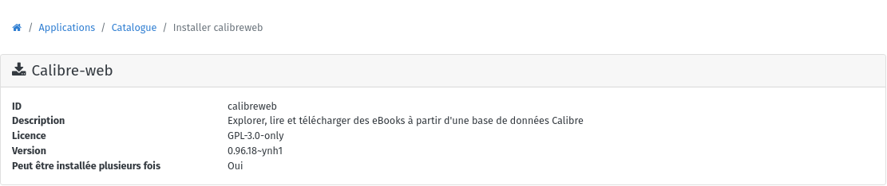  
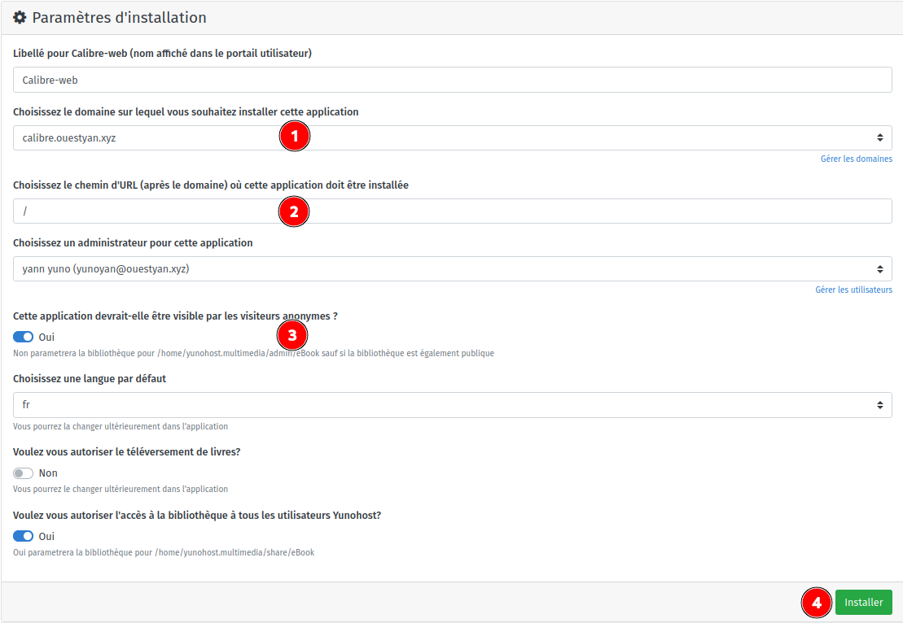  

Par défaut, le processus de sauvegarde de Yunohost sauvegarde la bibliothèque Calibreweb. Vous pouvez désactiver la sauvegarde de la bibliothèque avec

    yunohost app setting calibreweb do_not_backup_data -v 1

>Par défaut, la suppression de l'application ne supprimera jamais la bibliothèque.

Ouvrir le lien <https://calibre.ouestyan.xyz>  

* Se connecter avec l'utilisateur yunoyan qui est l'administrateur de calibre-web  
* Cliquer sur l'onglet **Administration** &rarr;  **Edit Calibre Database Configuration**
    * Modifier le chemin de la base et des données Calibre : `/home/yunohost.multimedia/share/eBook/BiblioCalibre` puis bouton **Sauvegarder** 
* Cliquer sur l'onglet **Administration** &rarr; **Editer la configuration de l'interface utilisateur**
    * **Configuration du mode d’affichage** 
        * **Thème** : Thème sombre caliBur! 
        * **Lier le statut lu/non lu à la colonne équivalente dans Calibre** : Lu
    * 
    * *Sauvegarder*

### Audio Navidrome

Ajout domaine zic.ouestyan.xyz par interface web admin  

Modifier la configuration du domaine pour positionner la gestion des messages entrants et sortants à **Non**  
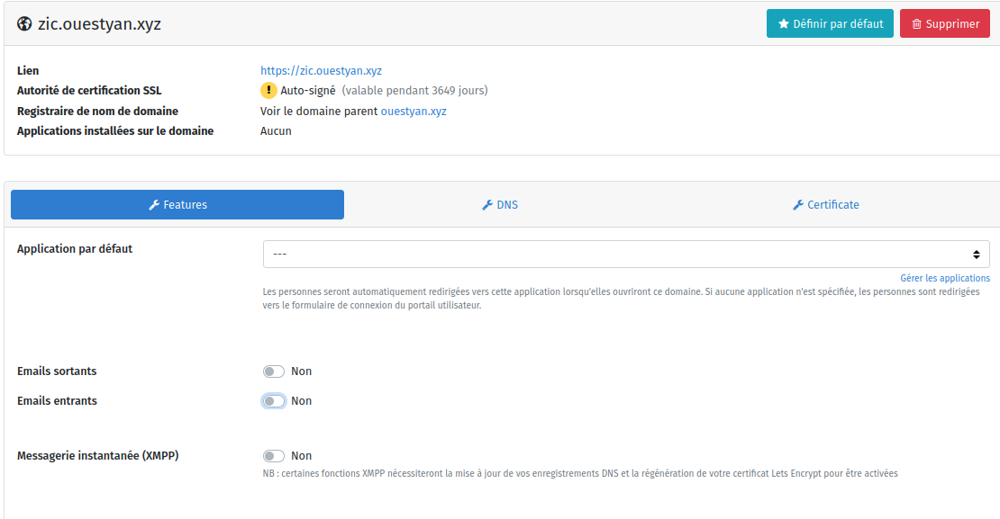  

Certificats zic.ouestyan.xyz par administration web  
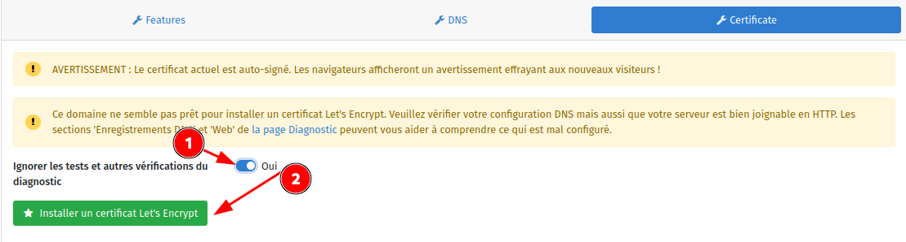  
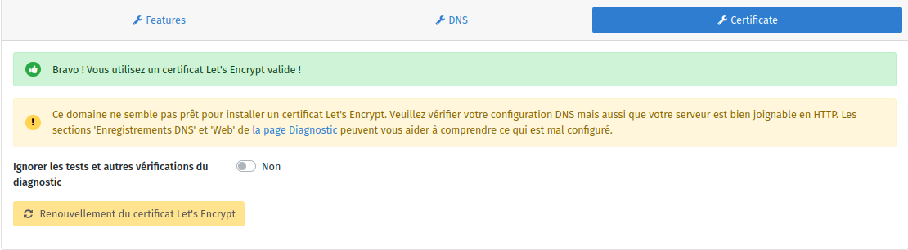  

ou en ligne de commande  

    sudo yunohost domain cert install zic.ouestyan.xyz --no-checks

```
Success! Configuration updated for 'nginx'
Success! Let's Encrypt certificate now installed for the domain 'zic.ouestyan.xyz'
```

Installer application Navidrome  
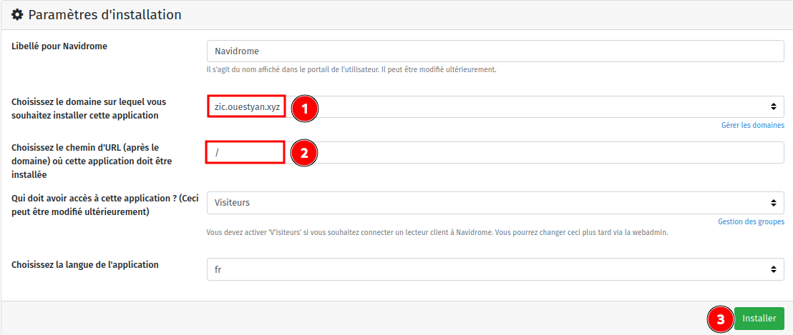  
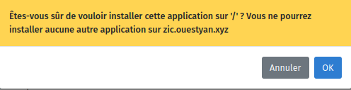{:width="400"}


<u>En ligne de commande</u>  
Faire une sauvegarde de la configuration par défaut avant modification

    sudo cp /var/lib/navidrome/navidrome.toml /var/lib/navidrome/navidrome.toml.sav

Modifier le répertoire de la musique et ajouter le dossier des "playlists" dans le fichier `/var/lib/navidrome/navidrome.toml`  

```
# Folder where your music library is stored. Can be read-only
MusicFolder = "/home/yunohost.multimedia/share/Music/musicyan"

#Change background image used in the Login page
UILoginBackgroundUrl = "https://source.unsplash.com/random/1920x1080/?music"

# Les chemins sont relatifs au MusicFolder
PlaylistsPath = "Playlists"

```

Redémarrer navidrome

    sudo systemctl restart navidrome

Ouvrir le lien <https://zic.ouestyan.xyz/> et saisir un identifiant + mot de passe pour le compte utilisateur  
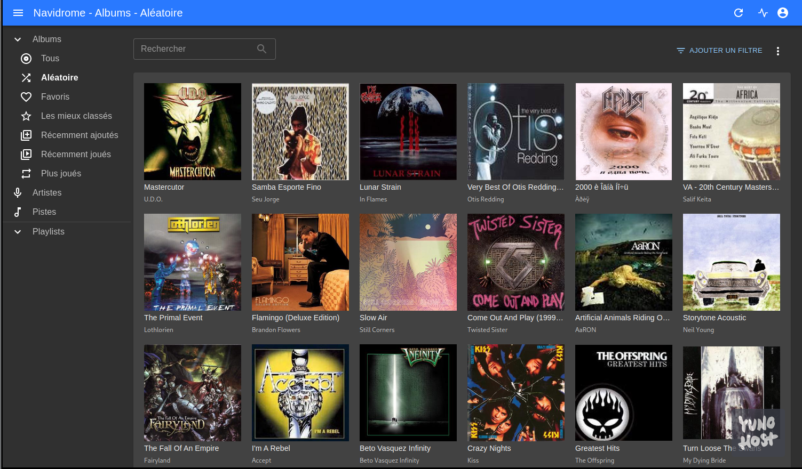  

Modifier le paramétrage pour basculer en français
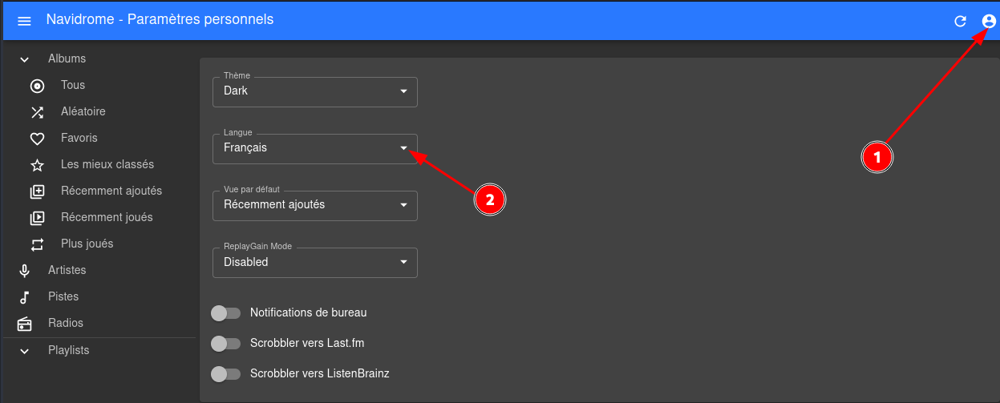  

### Sites static, cartes, diceware

#### Création domaine static.xoyize.xyz

1. Ouvrir yunohost en mode administrateur
2. Créer le domaine static.ouestyan.xyz
3. Emails Entrants/Sortants à Non
4. Certificat Let's Encrypt  

#### My Webapp

Interface web administrateur: Applications &rarr; Catalogue :My Webapp  
  

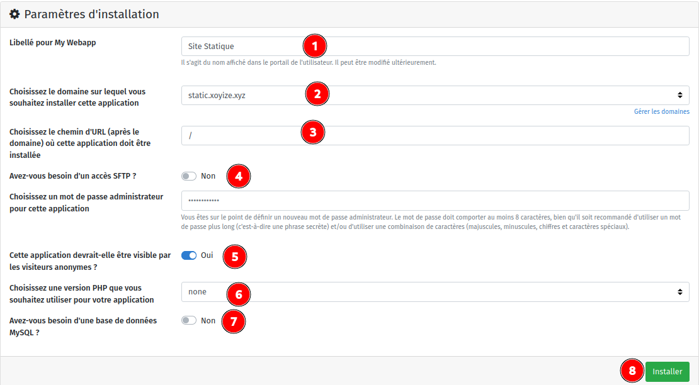  
`Domaine static.ouestyan.xyz`{: .prompt-warning }

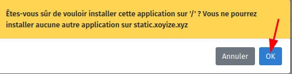{:width="400"}  

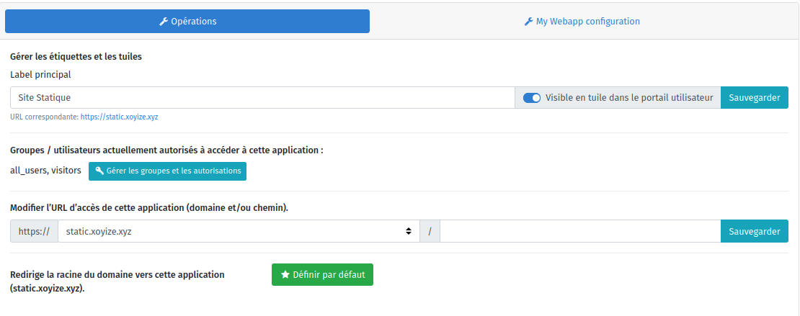  

Le dossier **/home/yunohost.multimedia/share/Divers/static/** contient le site statique qui est issu d'une synchronisation d'un conteneur debian sur un ordinateur archlinux avec jekyll comme générateur

En admin su 

```bash
rm -rf /var/www/my_webapp/www/  # supprimer dossier www web par défaut 
ln -s /home/yunohost.multimedia/share/Divers/static /var/www/my_webapp/www  # lien my_webapp

ln -s /home/yunohost.multimedia/share/Divers/diceware /var/www/my_webapp/www/diceware
ln -s /home/yunohost.multimedia/share/Divers/osm-new /var/www/my_webapp/www/cartes
```

Visiter les liens:   
<https://static.xoyize.xyz>  
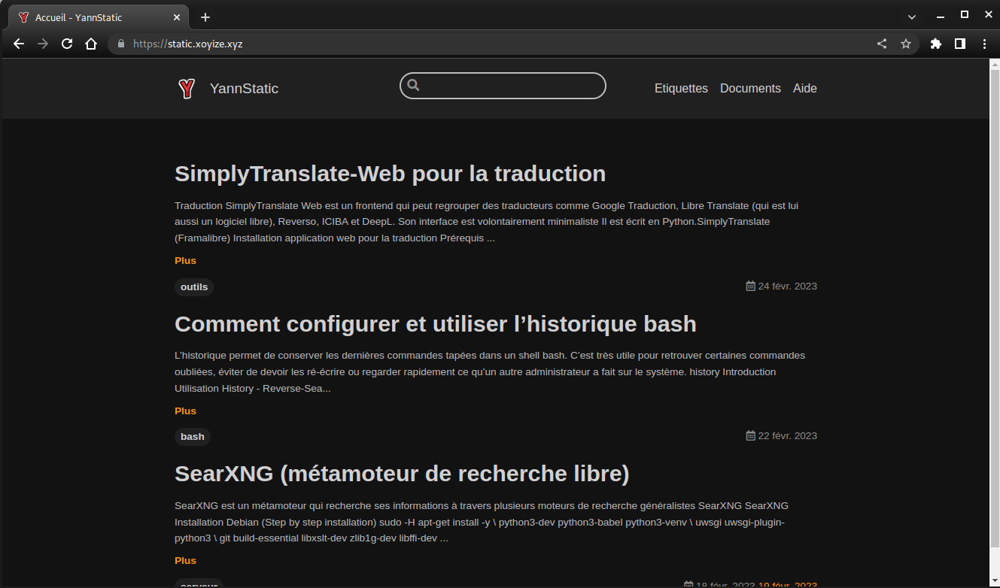  

<https://static.xoyize.xyz/cartes>  
<https://static.xoyize.xyz/diceware>  


### Sauvegardes Borg

{:height="50"}  

On installe en ligne de commande l'application **Borg Backup** sur yunohost avec le dépôt `ssh://yann@192.168.0.42:55042/mnt/freebox/sauvegardes/borgbackup/ouestyan.xyz`  

    sudo yunohost app install https://github.com/YunoHost-Apps/borg_ynh/tree/testing --debug

Suivre le processus d'installation

```
root@ouestyan:/home/yunoyan# yunohost app install https://github.com/YunoHost-Apps/borg_ynh
Warning: This app may work, but is not well-integrated into YunoHost. Some features such as single sign-on a
nd backup/restore might not be available. Install anyway? [Y/N] : Y
In which borg repository location do you want to backup your files ?: ssh://u326239@u326239.your-storagebox.de:23/./backup/borg/ouestyan.xyz
Provide a strong passphrase to encrypt your backups. No blank space:**************************
Should Borg backup your YunoHost configuration? [yes | no]: yes
Should Borg backup emails and user home directory? [yes | no]: yes
Which apps should Borg backup ?: all
With which regular time schedule should the backups be performed? (see systemd OnCalendar format): 01:45
Do you want admin to receive mail notifications on backups ? [always | errors_only | never]: errors_only
[...]
Success! Installation completed
```

Clé publique borg `/root/.ssh/id_borg_ed25519.pub` :  
`ssh-ed25519 AAAAC3NzaC1lZDI1NTE5AAAAIA1XiKlrXnpYLVyEOVQzL8bU++obK4AQJ4lNiQht85L0 root@ouestyan.xyz`

Depuis un poste ayant accès à la boîte de stockage, on récupère le fichier `authorized_keys` de la boîte de stockage **bx11-yann** dans un fichier nommé `storagebox_authorized_keys`

    echo -e "get .ssh/authorized_keys storagebox_authorized_keys" | sftp -P 23 -i ~/.ssh/bx11-yann-ed25519 u326239@u326239.your-storagebox.de

	cat >> storagebox_authorized_keys

Copier/coller le contenu du fichier du fichier de clef publique (fichier `cat /root/.ssh/id_borg_ed25519.pub`* de la machine à sauvegarder **Yunohost ouestyan.xyz** ) dans ce terminal, et presser **[Ctrl]+[D]** pour valider.

On renvoie le fichier modifié `storagebox_authorized_keys` dans le fichier `authorized_keys` de la boîte de stockage **bx11-yann**

    echo -e "put storagebox_authorized_keys .ssh/authorized_keys" | sftp -P 23 -i ~/.ssh/bx11-yann-ed25519 u326239@u326239.your-storagebox.de

#### Tester la configuration borg

Tester la connexion en mode su 

    sftp -P 23 -i /root/.ssh/id_borg_ed25519 u326239@u326239.your-storagebox.de

```
The authenticity of host '[u326239.your-storagebox.de]:23 ([2a01:4f8:b12:1000::28]:23)' can't be established.
ECDSA key fingerprint is SHA256:oDHZqKXnoMtgvPBjjC57pcuFez28roaEuFcfwyg8O5c.
Are you sure you want to continue connecting (yes/no/[fingerprint])? yes 
Warning: Permanently added '[u326239.your-storagebox.de]:23,[2a01:4f8:b12:1000::28]:23' (ECDSA) to the list of known hosts.
Connected to u326239.your-storagebox.de.
sftp> 
```

Saisir *quit* pour sortir

À cette étape, votre sauvegarde devrait se dérouler à l'heure prévue (tous les jours à 2h10). Notez que la première sauvegarde peut être très longue, car de nombreuses données doivent être copiées via ssh. Les sauvegardes suivantes sont incrémentielles : seules les données nouvellement générées depuis la dernière sauvegarde seront copiées.
{: .prompt-info }

Pour modifier le choix des sauvegardes "data", ouvrir borg dans l'administration web  
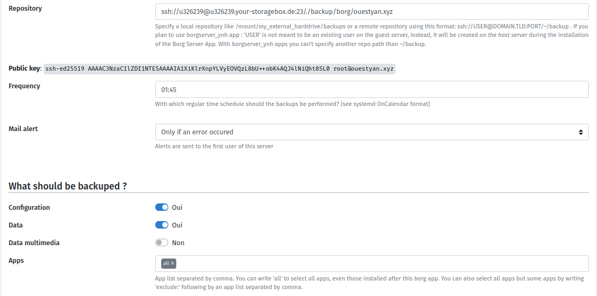  

#### Tester la sauvegarde borg

Si vous voulez tester la configuration correcte de Borg Apps avant l'heure prévue, vous pouvez lancer une sauvegarde manuellement sur le serveur Yunohost ouestyan.xyz :

On passe en tmux

```bash
sudo -s
tmux
systemctl start borg
# Ctrl b d pour sortir de la session tmux
```

Vous recevez un message au premier lancement  
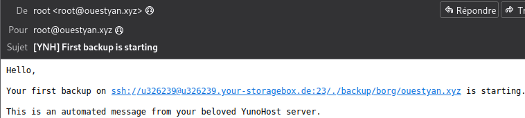  

Visualiser les logs en cours dans un autre terminal

    journalctl -f -u borg

A la fin de la sauvegarde borg  
  

#### Lister les sauvegardes

Commande à exécuter en mode su

```shell
sudo -s
app=borg; BORG_PASSPHRASE="$(yunohost app setting $app passphrase)" BORG_RSH="ssh -i /root/.ssh/id_${app}_ed25519 -oStrictHostKeyChecking=yes " borg list --short "$(yunohost app setting $app repository)"
```

Exemple 

```
_auto_conf-2023-05-01_17:32
_auto_data-2023-05-01_17:33
_auto_borg-2023-05-01_17:36
_auto_calibreweb-2023-05-01_17:36
_auto_my_webapp-2023-05-01_17:37
_auto_navidrome-2023-05-01_17:37
_auto_nextcloud-2023-05-01_17:37
_auto_phpldapadmin-2023-05-01_17:38
```

### Nextcloud

Créer le domaine **cloud.ouestyan.xyz** par l'administration web  
Modifier la configuration du domaine pour positionner la gestion des messages entrants et sortants à Non  
Gérer les certificats SSL par le web admin en ignorant les tests  

Installer la version 26 hub 4 

    sudo yunohost app install https://github.com/YunoHost-Apps/nextcloud_ynh/tree/testing --debug

Paramètres administration &rarr; Paramètres de base  
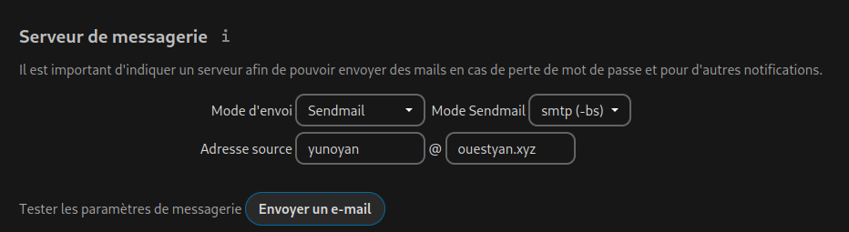  
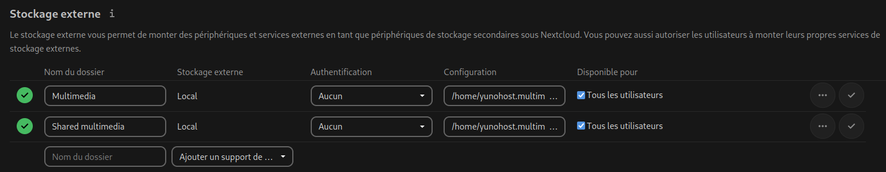  


### Hotspot - Point d'accès wifi (INACTIF)

[Yunohost Hotspot - Point d'accès wifi](/posts/Wifi_Hotspot_YunoHost/)

### Màj automatique (INACTIF)

*Unattended_upgrades est un outil qui permet de télécharger et installer les mises à jour de sécurité automatiquement et sans surveillance, en prenant soin de n'installer que les paquets provenant de la source APT configurée, et en vérifiant les invites dpkg concernant les modifications du fichier de configuration. Apticron est un simple script qui envoie des courriels sur les mises à jour de paquets en attente comme les mises à jour de sécurité, en gérant correctement les paquets en attente.*

Installation

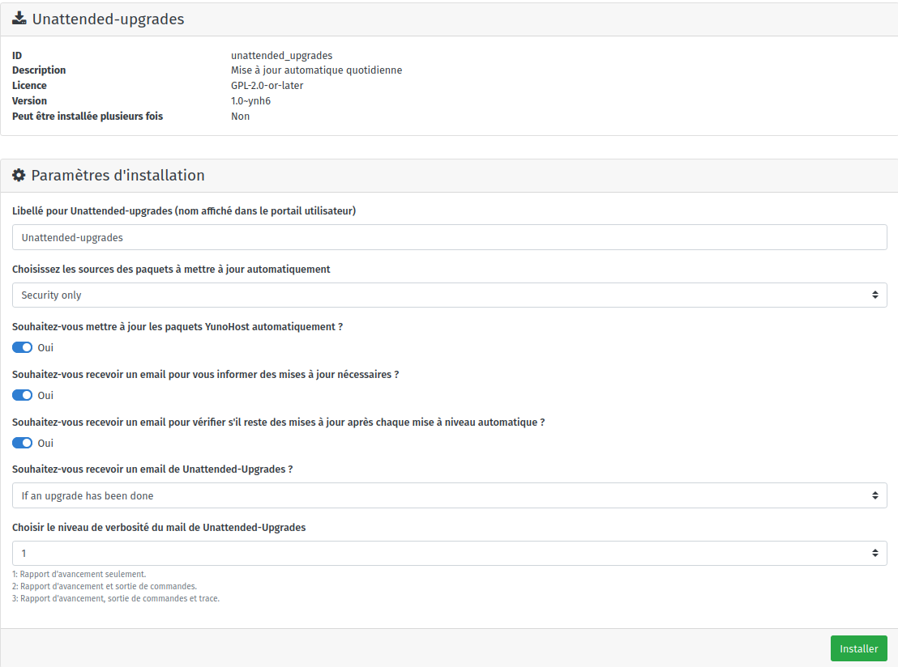  


## Ajouts

### Partage disque freebox (INACTIF)

[Partage disque externe USB sur Freebox](/posts/Partage_disque_externe_USB_sur_Freebox/)

Installation paquet cifs-utils

    sudo apt install cifs-utils  # Debian

Création répertoire de montage

    sudo mkdir /mnt/freebox/

Edition fichier caché nommé .smbcredentials

    nano /home/$USER/.smbcredentials

Dans le fichier, ajoutez les lignes suivantes (remplacez les XXXX par votre login et mot de passe)

```
username=yannfreebox
password=xxxxxxxxxxxxxxx
```

Donnez les droits adéquats au fichier

```bash
sudo chown -R $USER:root /home/$USER/.smbcredentials
sudo chmod -R 775 /home/$USER/.smbcredentials
```

partage au démarrage, ajouter les lignes suivantes au fichier `/etc/fstab`

```
#mount freebox
//192.168.0.254/hdd500g/ /mnt/freebox cifs x-systemd.automount,x-systemd.device-timeout=3,credentials=/home/yunoyan/.smbcredentials,_netdev,iocharset=utf8,uid=1000,sec=ntlmv2,file_mode=0770,dir_mode=0775,vers=2.0
```

//adresseIP/Partage     /media/Partage     cifs    x-systemd.automount,x-systemd.device-timeout=3,_netdev,sec=ntlmv2,credentials=/root/.credentials     0     0

Montage immédiat : `sudo mount -a`  
Si aucune erreur, tester l'accès : `touch /mnt/freebox/test` et `ls /mnt/freebox/`

### SSH Lenovo --> PC1

Le serveur Lenovo Yunohost (192.168.0.135) est sur le même réseau que le l'ordinateur de bureau archlinux PC1 (192.168.0.42) 
Connexion possible SSH sur PC1 avec clés via le port 55042

Se connecter sur Yunohost avec l'utilisateur admin **yunoyan**

Générer une paire de clé curve25519-sha256 (ECDH avec Curve25519 et SHA2) pour une liaison SSH entre Lenovo Yunohost et PC1  

    ssh-keygen -t ed25519 -o -a 100 -f ~/.ssh/PC1-ed25519

<u>CAS 1 - PC1 SSH port 22 et n'utilise pas les clés</u>  
Envoyer les clés publiques sur PC1 (non possible si PC1 utilise les clés et un port différent pour SSH) 

    ssh-copy-id ~/.ssh/PC1-ed25519.pub yann@192.168.0.42

On se connecte sur PC1

    ssh yann@192.168.0.42

PC1 - Modifier la configuration SSH 

    sudo nano /etc/ssh/sshd_config

Modifier

```conf
Port = 55042
PasswordAuthentication no
```

Relancer le service

    sudo systemctl restart sshd

<u>CAS 2 - PC1 SSH port 55042 avec utilisation de clés</u>  

Il faut ajouter le contenu de la clé publique PC1-ed25519.pub au fichier authorized_keys de l'utilisateur yann du PC1  
PC1 - Ajout clé publique

    echo "ssh-ed25519 AAAAC3NzaC1lZDI1NTE5AAAAIFluIpqLqsozqbrl9KhHPWhDLEj+3Wb6vi4qGV/qiP9B yunoyan@ouestyan.xyz" >> /home/yann/.ssh/authorized_keys

<u>Test connexion SSH depuis Lenovo M700</u>

    ssh -p 55042 -i ~/.ssh/PC1-ed25519 yann@192.168.0.42

### Notifications

#### notify-send via ssh

Lancer le script suivant pour tester

```shell
# exemples
ssh -p 55042 -i ~/.ssh/PC1-ed25519 yann@192.168.0.42 'DISPLAY=:0 notify-send "Lenovo M700" "Test notification à distance" -i /home/yann/media/statique/images/information.png -t 10000'
```

`-i /home/yann/media/statique/images/information.png` : Image présente sur le distant  
`-t 10000` : durée affichage en ms soit 10 s dans l'exemple  


#### Notification par messagerie

```shell
# exemples
echo "This is the body" | mail -s "Subject" -aFrom:Harry\<harry@gmail.com\> vp@cinay.eu
echo "Test notification par messagerie" | mail -s "Yunohost ouestyan.xyz"  vpn@cinay.eu
```


#### Notification au boot

La machine Lenovo M700 Debian 11 peut être mise hors tension depuis PC1   

    ssh yunoyan@192.168.0.135 -p 55135 -i /home/yann/.ssh/yunobulls 'sudo systemctl poweroff'

Impossible d'exécuter une commande à distance avec sudo car le mot de passe est exigé
{: .prompt-warning }


Le réveil de la machine se fait avec la fonction "wakeonlan" depuis PC1

    wakeonlan -i 192.168.0.255 00:23:24:c9:06:86

On veut envoyer une notification à PC1 depuis Lenovo lorsque la machine est totalement opérationnelle

    sudo nano /usr/local/bin/startup_script.sh

En plus du message, on lance l'exécution du script de sauvegarde  

```shell
#!/bin/bash
SCRIPT_NAME=$(basename -- "$0")
ssh -p 55042 -i /home/yunoyan/.ssh/PC1-ed25519 yann@192.168.0.42 'DISPLAY=:0 notify-send "Lenovo M700" "`(date +"Fin démarrage machine Lenovo \nExécution script sauvegarde\n/home/yann/scripts/sav-yann-media.sh\nle %d/%m/%Y %R")`" -i /home/yann/media/statique/images/information.png -t 10000'
# echo $(date +"Fin démarrage machine Lenovo à %d/%m/%Y %R") | mail -a "Content-Type: text/plain; charset=UTF-8" -s "Yunohost ouestyan.xyz"  vpn@cinay.eu
# exécution du script 
ssh -p 55042 -i /home/yunoyan/.ssh/PC1-ed25519 yann@192.168.0.42 '/bin/bash /home/yann/scripts/sav-yann-media.sh'
# pas d'erreur en sortie
exit 0
```

Si on opte pour le bash avec exécution de la sauvegarde, il faut désactiver le timer local sur la machine PC1  
`systemctl disable --user savyann`
{: .prompt-warning }
 

Fournir la permission d'exécuter le script

    sudo chmod +x /usr/local/bin/startup_script.sh

Exécuter le script au démarrage après que tous les services systemd soient chargés.

    sudo nano /etc/systemd/system/run-at-startup.service

```
[Unit]
Description=Run script at startup after all systemd services are loaded
After=default.target

[Service]
Type=simple
RemainAfterExit=yes
ExecStart=/usr/local/bin/startup_script.sh
TimeoutStartSec=0

[Install]
WantedBy=default.target
```

Rafraîchir les fichiers de configuration de systemd et activer le service

    sudo systemctl daemon-reload
    sudo systemctl enable run-at-startup.service

### Règles de messagerie

Règle de messagerie ouestyan.xyz thunderbird pour supprimer les message qui contiennent  `*** SECURITY information` dans le sujet   

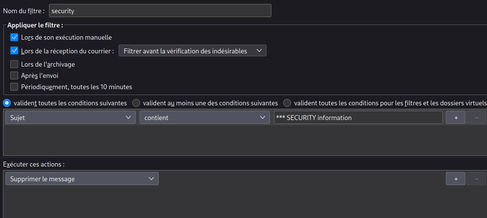

### Qemu Kvm (NON INSTALLE)

[Installer QEMU/KVM via SSH sur un serveur Debian sans affichage](/posts/Installer_QEMU-KVM_sur_un_serveur_Debian/)

## Restaurer à partir de borg

[Yunohost BorgBackup restauration - Migration serveur](/posts/Yunohost_BorgBackup_restauration_Migration_serveur/)

On passe en mode su

Commande pour lister les sauvegardes borg

```shell
app=borg; BORG_PASSPHRASE="$(yunohost app setting $app passphrase)" BORG_RSH="ssh -i /root/.ssh/id_${app}_ed25519 -oStrictHostKeyChecking=yes " borg list --short "$(yunohost app setting $app repository)"
````

Liste des  sauvegardes borg

```
_auto_conf-2023-05-01_17:32
_auto_data-2023-05-01_17:33
_auto_borg-2023-05-01_17:36
_auto_calibreweb-2023-05-01_17:36
_auto_my_webapp-2023-05-01_17:37
_auto_navidrome-2023-05-01_17:37
_auto_nextcloud-2023-05-01_17:37
_auto_phpldapadmin-2023-05-01_17:38
```

Recréer les archives tar.gz en local dans le dossier `/home/yunohost.backup/archives/`

```shell
app=borg; BORG_PASSPHRASE="$(yunohost app setting $app passphrase)" BORG_RSH="ssh -i /root/.ssh/id_${app}_ed25519 " borg export-tar "$(yunohost app setting $app repository)::_auto_nextcloud-2023-05-01_17:37" /home/yunohost.backup/archives/_auto_nextcloud-2023-05-01_17:37.tar.gz
```

Restaurer 

```shell
yunohost backup restore _auto_nextcloud-2023-05-01_17:37.tar.gz --apps
```