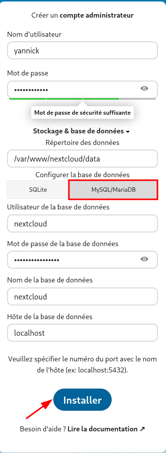
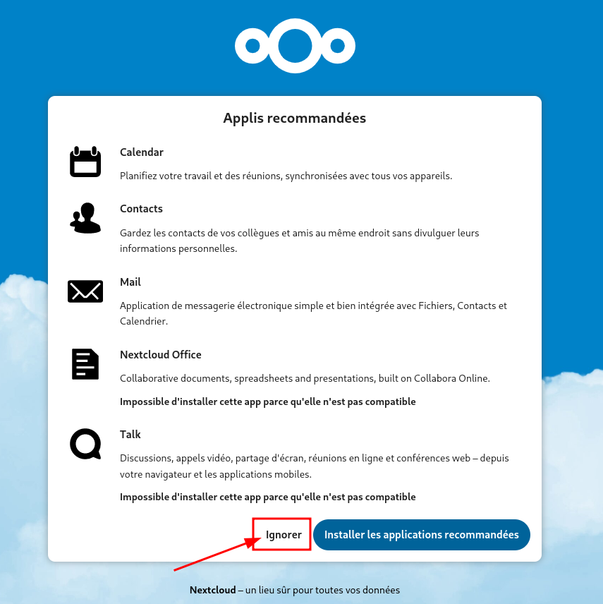
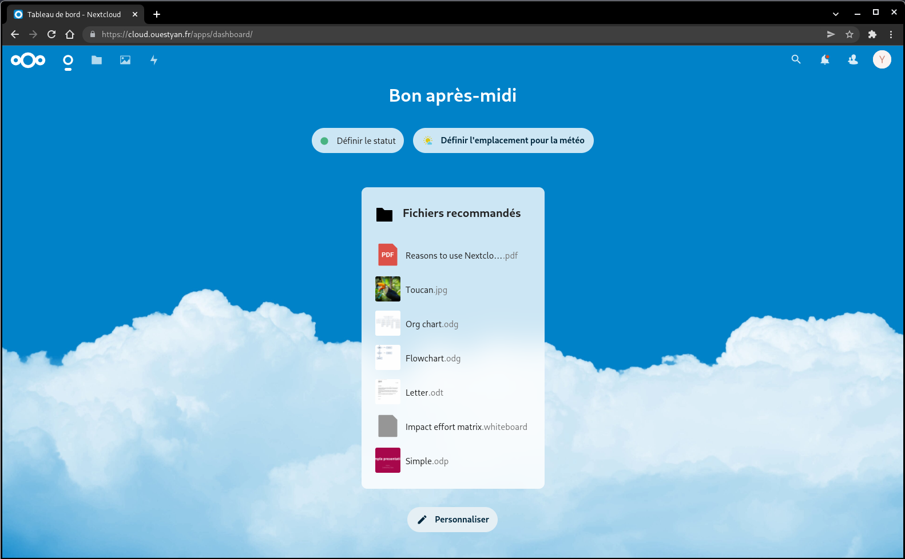
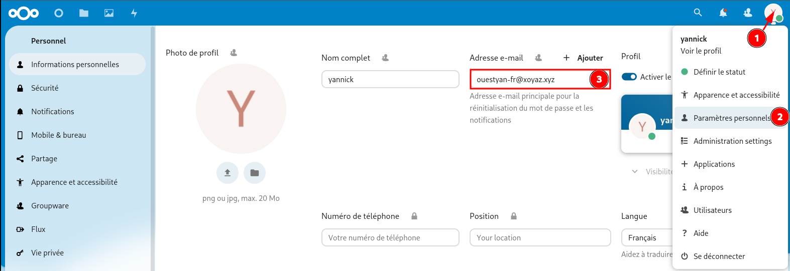
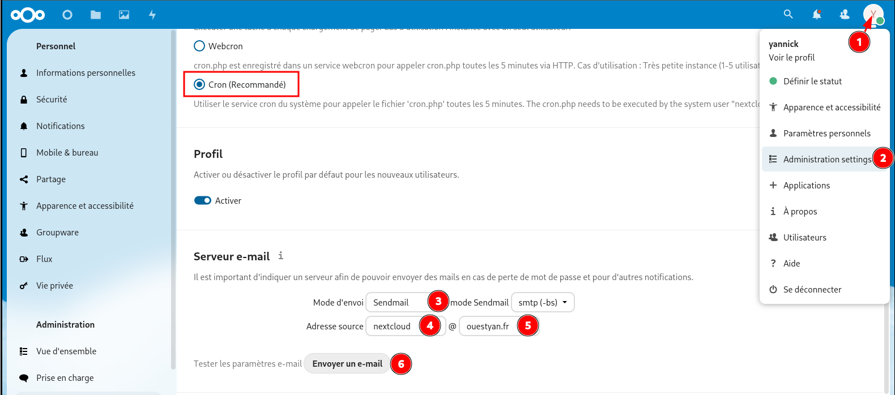
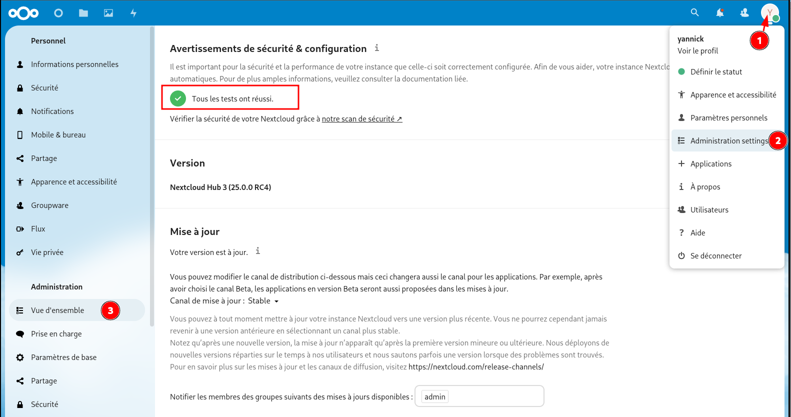
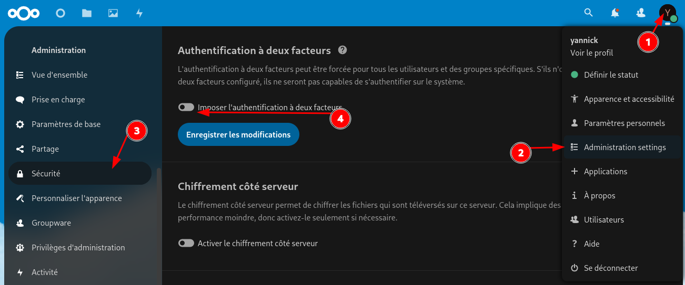
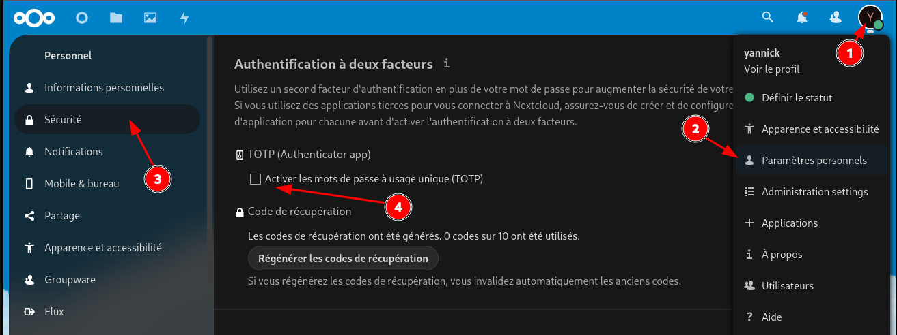
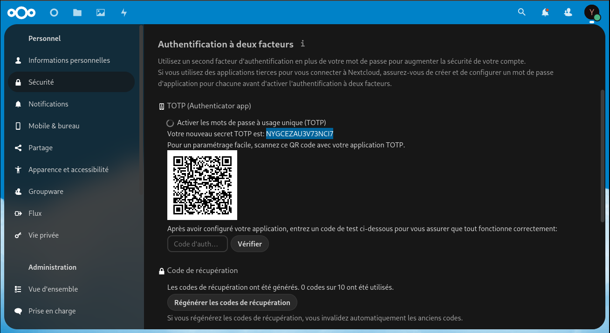
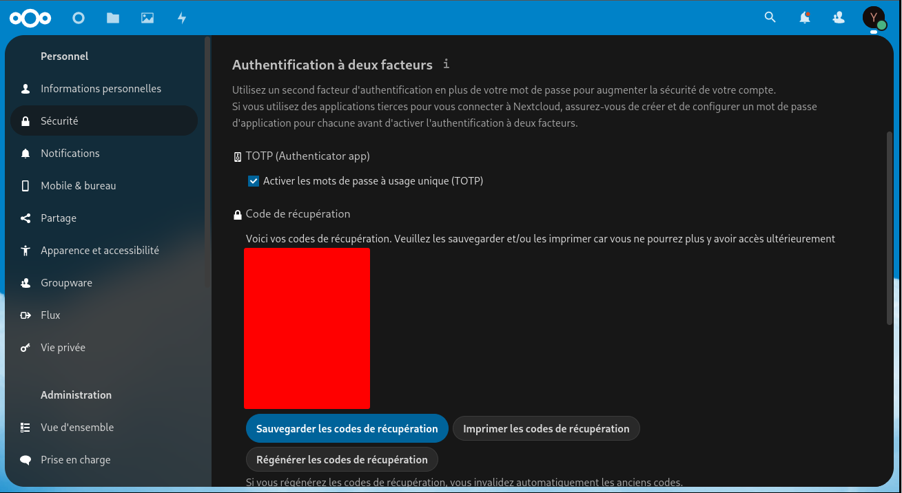

+++
title = 'Nextcloud Hub 3 4 (v25 v26+)'
date = 2023-05-09 00:00:00 +0100
categories = ['nextcloud']
+++
*Nuage collaboratif, le tutoriel est basé sur le domaine cloud.ouestyan.fr"*  

Le nouveau design introduit avec la version 25 de Nextcloud repose sur 4 principes : 

1. l’accent sur le contenu
2. la facilité d’utilisation
3. une plus grande accessibilité 
4. possibilité de s’approprier le design.


  

## Nginx + PHP + MariaDB

* [Nginx compilé, PHP8.1, MariaDB, Nextcloud Hub et certificats Let's Encrypt](/posts/Nextcloud-Hub_Nginx_PHP8_MariaDB_SSL-TLS/)

### Installer nginx

Nginx est installé en version de base ou compilée

```shell
# base
apt install nginx # debian
sudo pacman -S nginx # Archlinux

# compilée
wget https://static.xoyaz.xyz/files/compilation-nginx-tls1.3.sh
chmod +x compilation-nginx-tls1.3.sh # rendre le bash exécutable
./compilation-nginx-tls1.3.sh        # exécution
``` 

### Installer php8.x 

Pour installer la version de 8 de php, ajouter le dépôt sury.

```shell
sudo apt install -y lsb-release apt-transport-https ca-certificates wget
wget -O /etc/apt/trusted.gpg.d/php.gpg https://packages.sury.org/php/apt.gpg
echo "deb https://packages.sury.org/php/ $(lsb_release -sc) main" |sudo tee /etc/apt/sources.list.d/php.list
```

Mise à jour des dépôts :

```shell
apt update && apt upgrade -y
```

PHP8.1 :

```shell
sudo apt -y install php8.1 php8.1-fpm php8.1-sqlite3 php8.1-cli php8.1-gd php8.1-imap php8.1-mysql php8.1-soap php8.1-apcu php8.1-common php8.1-gmp  php8.1-intl php8.1-opcache php8.1-xml php8.1-curl php8.1-igbinary php8.1-readline  php8.1-zip php8.1-bcmath php8.1-imagick php8.1-mbstring php8.1-redis imagemagick libmagickcore-6.q16-6-extra
```

**PHP Paramétrage pour une utilisation de nextcloud**  
[PHP Paramétrage](/posts/Nextcloud-Hub_Nginx_PHP8_MariaDB_SSL-TLS/#param%C3%A9trage)  
mémoire pour PHP : ajouter `memory_limit = 512M` dans le fichier `/etc/php/8.1/fpm/php.ini`

```shell
sudo sed -i -e "s/memory_limit = 128M/memory_limit = 512M/g" "/etc/php/8.1/fpm/php.ini"
```

Cache PHP (OPcache) :`/etc/php/8.1/fpm/php.ini`, paramétrage sera réalisé par le pool nextcloud  
PHP Cache de données (APCu & Redis)  

```shell
sudo apt install php8.1-apcu redis-server php8.1-redis 
```

Il faut ajouter `apc.enable_cli=1` au fichier `/etc/php/8.1/mods-available/apcu.ini`

```shell
extension=apcu.so
apc.enable_cli=1
```

La nouvelle configuration sera prise en compte après redémarrage du service PHP-FPM :

```shell
sudo systemctl restart php8.1-fpm.service
```

### Installer MariaDB

MariaDB :

```shell
sudo apt install mariadb-server
sudo mysql_secure_installation # Y à tout et nouveau mot de passe
```
Base 'nextcloud' :

```shell
sudo -s
# mot_passe_base_nextcloud="uXbPk3b2wG8llQl"
mysql -uroot -e 'CREATE DATABASE nextcloud; CREATE USER "nextcloud"@"localhost"; SET password FOR "nextcloud"@"localhost" = password("uXbPk3b2wG8llQl"); GRANT ALL PRIVILEGES ON nextcloud.* TO "nextcloud"@"localhost" IDENTIFIED BY "uXbPk3b2wG8llQl"; FLUSH PRIVILEGES;'
```

Effacer une base

```shell
mysql -uroot -e 'DROP DATABASE nextcloud'
```

Effacer un utilisateur

```shell
mysql -uroot -e 'DROP USER "nextcloud"@"localhost";'
```

## Domaine et certificats

[Serveur , installer et renouveler les certificats SSL Let's encrypt via Acme](/posts/Acme-Certficats-Serveurs/)  
Disposer d'un domaine (ici cloud.ouestyan.fr) avec des certficats SSL valides (Let's Encrypt)  
 
## Nexcloud serveur V25+

* [Nextcloud Install](https://nextcloud.com/install/)  

### Téléchargement et installation

Lien des versions Nextcloud server <https://download.nextcloud.com/server/releases/>  
On choisit "latest" dans la version ( v25 novembre 2022)  

Installer nextcloud : 

```shell
NCVER="latest-25"
# mode su
wget https://download.nextcloud.com/server/releases/$NCVER.tar.bz2
# checksum et vérification
wget https://download.nextcloud.com/server/releases/$NCVER.tar.bz2.sha256
sha256sum -c $NCVER.tar.bz2.sha256 < $NCVER.tar.bz2 
# Décompression, déplacement et effacement
tar -xvf $NCVER.tar.bz2
mv nextcloud /var/www/
rm $NCVER.tar.bz2
# Utilisateur nextcloud et droits
useradd -r nextcloud
chown -R nextcloud:www-data /var/www/nextcloud
chmod -R o-rwx /var/www/nextcloud
```

### Pool PHP-FPM Nextcloud

Pool PHP-FPM Nextcloud : `/etc/php/8.1/fpm/pool.d/nextcloud.conf`  
en mode su

```shell
cat > /etc/php/8.1/fpm/pool.d/nextcloud.conf << EOF
[nextcloud]

user = nextcloud
group = nextcloud

chdir = /var/www/nextcloud

listen = /var/run/php/php8.1-fpm-nextcloud.sock
listen.owner = www-data
listen.group = www-data

pm = dynamic
pm.max_children = 8
pm.max_requests = 500
request_terminate_timeout = 1d


pm.start_servers = 3
pm.min_spare_servers = 2
pm.max_spare_servers = 4


; Additional php.ini defines, specific to this pool of workers.
env[PATH] = $PATH
php_admin_value[memory_limit] = 512M
php_value[upload_max_filesize] = 10G
php_value[post_max_size] = 10G
php_value[default_charset] = UTF-8
; OPcache is already activated by default
; php_value[opcache.enable]=1
; The following parameters are nevertheless recommended for Nextcloud
; see here: https://docs.nextcloud.com/server/15/admin_manual/installation/server_tuning/#enable-php-opcache
php_value[opcache.enable_cli]=1
php_value[opcache.interned_strings_buffer]=8
php_value[opcache.max_accelerated_files]=10000
php_value[opcache.memory_consumption]=128
php_value[opcache.save_comments]=1
php_value[opcache.revalidate_freq]=1
; https://docs.nextcloud.com/server/latest/admin_manual/configuration_server/caching_configuration/#id1
php_value[apc.enabled]=1
php_value[apc.enable_cli]=1
EOF
```

Relancer le service : `systemctl restart php8.1-fpm`  

Il est inutile de paramétrer **opcache** dans le `php.ini` car les paramètres sont définis dans le pool nextcloud

PHP8.1 `/etc/php/8.1/fpm/php.ini`  
mémoire pour PHP : ajouter `memory_limit = 512M`  
Cache PHP (OPcache) :  

```
[opcache]
opcache.enable=1
opcache.enable_cli=1
opcache.interned_strings_buffer=32
opcache.save_comments=1
opcache.max_wasted_percentage = 15
opcache.validate_timestamps = 1
opcache.revalidate_freq=1
```

Bash 


```shell
sudo sed -i -e "s/;opcache.enable=1/opcache.enable=1/g" "/etc/php/8.1/fpm/php.ini"
sudo sed -i -e "s/;opcache.enable_cli=0/opcache.enable_cli=0/g" "/etc/php/8.1/fpm/php.ini"
sudo sed -i -e "s/;opcache.interned_strings_buffer=8/opcache.interned_strings_buffer=12/g" "/etc/php/8.1/fpm/php.ini"
sudo sed -i -e "s/;opcache.save_comments=1/opcache.save_comments=1/g" "/etc/php/8.1/fpm/php.ini"
sudo sed -i -e "s/;opcache.max_wasted_percentage=5/opcache.max_wasted_percentage=15/g" "/etc/php/8.1/fpm/php.ini"
sudo sed -i -e "s/;opcache.validate_timestamps=1/opcache.validate_timestamps=1/g" "/etc/php/8.1/fpm/php.ini"
sudo sed -i -e "s/;opcache.revalidate_freq=2/opcache.revalidate_freq=1/g" "/etc/php/8.1/fpm/php.ini"
```

### Nginx headers,SSL,HSTS,OCSP

[Nginx headers,SSL,HSTS,OCSP](/posts/Nginx_headers_SSL_HSTS_OCSP/)

### Vhost nextcloud nginx

Nexcloud sur le domaine cloud.domain.tld avec certificats Let’s Encrypt

`ATTENTION !!! Remplacer domain.tld par le nom de votre domaine`{: .prompt-warning }

Le fichier de configuration web cloud.domain.tld.conf `/etc/nginx/conf.d/cloud.domain.tld.conf`

```
server {
    listen 80;
    listen [::]:80;
    server_name cloud.domain.tld;
    # enforce https
    return 301 https://$server_name:443$request_uri;
}

server {
    listen 443 ssl http2;
    listen [::]:443 ssl http2;
    server_name cloud.domain.tld;

    include /etc/nginx/conf.d/security.conf.inc;

location ^~ /.well-known {
  # The following 6 rules are borrowed from `.htaccess`

  # The following 2 rules are only needed for the user_webfinger app.
  # Uncomment it if you're planning to use this app.
  #rewrite ^/\.well-known/host-meta\.json  /public.php?service=host-meta-json  last;
  #rewrite ^/\.well-known/host-meta        /public.php?service=host-meta       last;

  location = /.well-known/carddav     { return 301 /remote.php/dav/; }
  location = /.well-known/caldav      { return 301 /remote.php/dav/; }

  location = /.well-known/webfinger     { return 301 /index.php$uri; }
  location = /.well-known/nodeinfo      { return 301 /index.php$uri; }

  try_files $uri $uri/ =404;
}

#sub_path_only rewrite ^/$ / permanent;
location ^~ / {

  # Path to source
  alias /var/www/nextcloud/;

  # Add headers to serve security related headers
  more_set_headers "Strict-Transport-Security: max-age=15768000; includeSubDomains; preload;";
  more_set_headers "Referrer-Policy: no-referrer";
  more_set_headers "X-Content-Type-Options: nosniff";
  more_set_headers "X-Download-Options: noopen";
  more_set_headers "X-Frame-Options: SAMEORIGIN";
  more_set_headers "X-Permitted-Cross-Domain-Policies: none";
  more_set_headers "X-Robots-Tag: none";
  more_set_headers "X-XSS-Protection: 1; mode=block";

  # Set max upload size
  client_max_body_size 10G;
  fastcgi_buffers 64 4K;

  # Enable gzip but do not remove ETag headers
  gzip on;
  gzip_vary on;
  gzip_comp_level 4;
  gzip_min_length 256;
  gzip_proxied expired no-cache no-store private no_last_modified no_etag auth;
  gzip_types application/atom+xml application/javascript application/json application/ld+json application/manifest+json application/rss+xml application/vnd.geo+json application/vnd.ms-fontobject application/x-font-ttf application/x-web-app-manifest+json application//+xml application/xml font/opentype image/bmp image/svg+xml image/x-icon text/cache-manifest text/css text/plain text/vcard text/vnd.rim.location.xloc text/vtt text/x-component text/x-cross-domain-policy;

  # Pagespeed is not supported by Nextcloud, so if your server is built
  # with the `ngx_pagespeed` module, uncomment this line to disable it.
  #pagespeed off;

  # Remove X-Powered-By, which is an information leak
  fastcgi_hide_header X-Powered-By;

  # Specify how to handle directories -- specifying `/nextcloud/index.php$request_uri`
  # here as the fallback means that Nginx always exhibits the desired behaviour
  # when a client requests a path that corresponds to a directory that exists
  # on the server. In particular, if that directory contains an index.php file,
  # that file is correctly served; if it doesn't, then the request is passed to
  # the front-end controller. This consistent behaviour means that we don't need
  # to specify custom rules for certain paths (e.g. images and other assets,
  # `/updater`, `/ocm-provider`, `/ocs-provider`), and thus
  # `try_files $uri $uri/ /nextcloud/index.php$request_uri`
  # always provides the desired behaviour.
  index index.php index/ /index.php$request_uri;

  # Rule borrowed from `.htaccess` to handle Microsoft DAV clients
  location = / {
      if ( $http_user_agent ~ ^DavClnt ) {
          return 302 /remote.php/webdav/$is_args$args;
      }
  }

  location = /robots.txt {
    allow all;
    log_not_found off;
    access_log off;
  }

  # Rules borrowed from `.htaccess` to hide certain paths from clients
  location ~ ^/(?:build|tests|config|lib|3rdparty|templates|data)(?:$|/)    { return 404; }
  location ~ ^/(?:\.|autotest|occ|issue|indie|db_|console)                { return 404; }

  # Ensure this block, which passes PHP files to the PHP process, is above the blocks
  # which handle static assets (as seen below). If this block is not declared first,
  # then Nginx will encounter an infinite rewriting loop when it prepends
  # `/nextcloud/index.php` to the URI, resulting in a HTTP 500 error response.
  location ~ \.php(?:$|/) {
    # Required for legacy support
    # https://github.com/nextcloud/documentation/pull/2197#issuecomment-721432337
    # This line fix the ldap admin page
    rewrite ^/(?!index|remote|public|cron|core\/ajax\/update|status|ocs\/v[12]|updater\/.+|oc[ms]-provider\/.+|.+\/richdocumentscode\/proxy) /index.php$request_uri;
    fastcgi_split_path_info ^(.+?\.php)(/.*)$;
    set $path_info $fastcgi_path_info;
    try_files $fastcgi_script_name =404;
    include fastcgi_params;

    fastcgi_param SCRIPT_FILENAME $request_filename;
    fastcgi_param PATH_INFO $path_info;
    fastcgi_param HTTPS on;
    fastcgi_param modHeadersAvailable true;         # Avoid sending the security headers twice
    fastcgi_param front_controller_active true;     # Enable pretty urls
    fastcgi_param HTTP_ACCEPT_ENCODING "";          # Disable encoding of nextcloud response to inject ynh scripts
    fastcgi_pass unix:/var/run/php/php8.1-fpm-nextcloud.sock;
    fastcgi_intercept_errors on;
    fastcgi_request_buffering off;
  }

  location ~ \.(?:css|js|svg|gif)$ {
    try_files $uri / /index.php$request_uri;
    expires 6M;         # Cache-Control policy borrowed from `.htaccess`
    access_log off;     # Optional: Don't log access to assets
  }

  location ~ \.woff2?$ {
    try_files $uri / /index.php$request_uri;
    expires 7d;         # Cache-Control policy borrowed from `.htaccess`
    access_log off;     # Optional: Don't log access to assets
  }

  location ~ / {
    if ($request_method ~ ^PUT$) {
        rewrite ^ /index.php$request_uri last;
    }
    if ($request_method ~ ^DELETE$) {
        rewrite ^ /index.php$request_uri last;
    }
    try_files $uri / /index.php$request_uri;
  }

}

    access_log /var/log/nginx/cloud.domain.tld-access.log;
    error_log /var/log/nginx/cloud.domain.tld-error.log;
}
```

Vérifier et recharger nginx : `nginx -t && systemctl reload nginx`

## Paramétrage nextcloud

`Tout est paramétré avec le domaine ouestyan.fr qu'il faut remplacer par votre domaine`{: .prompt-warning }  

### Première connexion

Ouvrir le lien <https://cloud.ouestyan.fr>  
Créer un compte administrateur et son mot de passe  
Renseigner les éléments de la base mysql  
{:width="200"}  {:width="400"}  
  

Renseigner adresse de messagerie de destination pour l'utilisateur  
  
Serveur e-mail et cron  
  
Dans "Administration" &rarr; "Paramètres de base"

Apparence thème sombre dans la rubrique "Apparence et accessibilité"

### En ligne de commande

Ajouter `'default_phone_region' => 'FR',` et  les lignes suivantes dans le fichier `/var/www/nextcloud/config/config.php` avant le tag de fin de fichier  `);`  

```
  'default_phone_region' => 'FR',
  'filelocking.enabled' => true,
  'memcache.locking' => '\OC\Memcache\Redis',
  'memcache.local' => '\\OC\\Memcache\\APCu',
  'redis' => array(
    'host' => 'localhost',
    'port' => 6379,
    'timeout' => 0.0,
    'password' => '',
  ),
```

La nouvelle configuration PHP sera prise en compte après redémarrage du service PHP-FPM :

    sudo systemctl restart php8.1-fpm.service

Ouvrir le lien <https://cloud.ouestyan.fr> et vérifier le paramétrage  
  

### Thème

Paramètres &rarr; Apparence et accessibilité  
Choix du "Thème sombre" et d'un arrière-plan  

### Authentification double facteur

Paramètres &rarr; Applications &rarr; Sécurité   
  
Activer "Two-Factor TOTP Provider"

Paramètres &rarr; Administration settings &rarr; Sécurité dans la rubrique Administration   
   
Puis cliquer sur **Enregistrer les modifications**  

Aller ensuite sur Paramètres personnels &rarr; Sécurité dans la rubrique Personnel
   

Après avoir activé authentification TOTP (saisie du mot de passe)  
   
Enter le **secret TOTP** dans le ou les applications  TOPT   
Saisir le code de vérification générer par votre application et cliquer sur "Vérifier"   
Ensuite cliquer sur "Générer des codes de récupération"  
   

## nextcloudcmd

*Synchronisation ponctuelle en ligne de commande*

La syntaxe

```
nextcloudcmd --user "Utilisateur" --password "Mot de passe" \
--path /DossierDistant \                                         # DossierDistant existant sur le serveur nextcloud
/DossierLocal \                                                  # DossierLocal
https://cloud.domain.tld                                         # URL serveur nextcloud
```

`Avec cette syntaxe, le contenu du dossier local sera synchronisé avec le contenu du dossier distant`{: .prompt-info }

