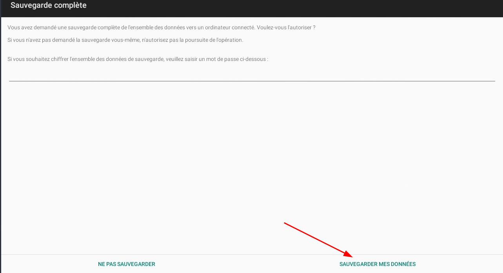

+++
title = 'Android adb - Application de sauvegarde, données incluses'
date = 2023-06-16 00:00:00 +0100
categories = ['android']
+++
*adb est l'outil Android CLI avec lequel vous pouvez interagir avec votre appareil Android, depuis votre PC*

- [Récupérer l'APK de l'application](#récupérer-lapk-de-lapplication)
- [Sauvegarder les données des applications](#sauvegarder-les-données-des-applications)
- [Restaurer les applications](#restaurer-les-applications)
- [Extraire le contenu du fichier de sauvegarde adb](#extraire-le-contenu-du-fichier-de-sauvegarde-adb)
- [Si la sauvegarde adb ne fonctionne pas](#si-la-sauvegarde-adb-ne-fonctionne-pas)
- [Supprimer les applications indésirables](#supprimer-les-applications-indésirables)
- [Ressources](#ressources)

Vous devez activer le mode développeur (appuyez 7 fois sur la version de build dans les paramètres) et installer adb sur votre PC (linux android-tools).
{: .prompt-warning }

## Récupérer l'APK de l'application

Pour obtenir la liste de vos applications installées :

    adb shell pm list packages -f -3

Si vous souhaitez récupérer tous les apk de vos applications installées :

```shell
for APP in $(adb shell pm list packages -3 -f)
do
  adb pull $( echo ${APP} | sed "s/^package://" | sed "s/base.apk=/base.apk /").apk
done
```

Pour récupérer une seule application, en fonction des résultats des packages répertoriés :

    adb pull /data/app/org.fedorahosted.freeotp-Rbf2NWw6F-SqSKD7fZ_voQ==/base.apk freeotp.apk

## Sauvegarder les données des applications

Pour sauvegarder une application, avec son apk :

    adb backup -apk org.fedorahosted.freeotp -f freeotp.adb

Il faut valider la sauvegarde  
{:width="400"}

Pour sauvegarder toutes les données à la fois :

    adb backup -f all -all -apk -nosystem

Pour sauvegarder toutes les données dans des fichiers séparés :

```shell
for APP in $(adb shell pm list packages -3)
do
  APP=$( echo ${APP} | sed "s/^package://")
  adb backup -f ${APP}.backup ${APP}
done
```

## Restaurer les applications

Tout d'abord, vous devez installer l'apk enregistré avec adb :

    adb install application.apk

Puis restaurez les données :

    adb restore application.backup

## Extraire le contenu du fichier de sauvegarde adb

Vous aurez besoin du binaire **zlib-flate**. Vous pourrez l'utiliser en installant le paquet qpdf 

```shell
apt install qpdf    # debian
```

Ensuite, pour extraire la sauvegarde de votre application :

    dd if=freeotp.adb bs=24 skip=1 | zlib-flate -uncompress | tar xf -

## Si la sauvegarde adb ne fonctionne pas

Si vous rencontrez des problèmes lors de l'utilisation `adb backup` (fichiers vides, aucune invite, autre bizarrerie), vous pouvez essayer `bu backup` via `adb shell`.  

    adb shell ' bu backup -apk -all -nosystem '  > backup.adb

Restaurer

    adb shell ' bu restore '  < backup.adb

## Supprimer les applications indésirables

Parfois, vous avez déjà installé (mais non voulu) des applications lorsque vous achetez un smartphone Android. Et vous ne pouvez pas désinstaller ces applications.

Vous pouvez les supprimer avec cette commande, et root n'est pas nécessaire :

    adb shell pm uninstall --user 0 non.wanted.app

Vous pouvez d'abord les désactiver, puis lorsque vous en êtes sûr, vous pouvez les supprimer.

Pour répertorier les applications désactivées :

    adb shell pm list packages -d

Exemple:

```shell
# Google Chrome
adb shell pm uninstall --user 0 com.android.chrome
# Gmail
adb shell pm uninstall --user 0 com.google.android.gm
# Google Play Films et Séries
adb shell pm uninstall --user 0 com.google.android.videos
# Youtube
adb shell pm uninstall --user 0 com.google.android.youtube
# Google Play Music
adb shell pm uninstall --user 0 com.google.android.music
# Google Hangouts
adb shell pm uninstall --user 0 com.google.android.talk
# Google Keep
adb shell pm uninstall --user 0 com.google.android.keep
# Google Drive
adb shell pm uninstall --user 0 com.google.android.apps.docs
# Google Photos
adb shell pm uninstall --user 0 com.google.android.apps.photos
# Google Cloud Print
adb shell pm uninstall --user 0 com.google.android.apps.cloudprint
# Google Actualités et météos
adb shell pm uninstall --user 0 com.google.android.apps.genie.geniewidget
# Application Google
adb shell pm uninstall --user 0 com.google.android.googlequicksearchbox
```

## Ressources

* https://stackoverflow.com/questions/4032960/how-do-i-get-an-apk-file-from-an-android-device
* https://androidquest.wordpress.com/2014/09/18/backup-applications-on-android-phone-with-adb/
* https://stackoverflow.com/questions/34482042/adb-backup-does-not-work
* https://stackoverflow.com/questions/53634246/android-get-all-installed-packages-using-adb
* https://www.dadall.info/article657/nettoyer-android
* https://etienne.depar.is/a-ecrit/Desinstaller-des-applications-systemes-d-android/index.html

