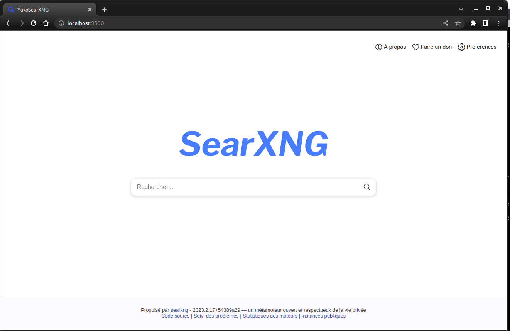
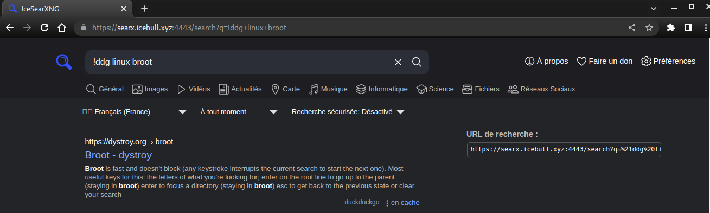

+++
title = 'SearXNG (métamoteur de recherche libre)'
date = 2023-06-20 00:00:00 +0100
categories = ['serveur']
+++
*[SearXNG](https://docs.searxng.org/) est un métamoteur qui recherche ses informations à travers plusieurs moteurs de recherche généralistes*


## SearXNG

[{:width="100" .normal} {:width="100" .normal}](https://github.com/searxng/searxng)


### Installation

Debian ([Step by step installation](https://docs.searxng.org/admin/installation-searxng.html#installation-basic))

```bash
sudo -H apt-get install -y \
    python3-dev python3-babel python3-venv \
    uwsgi uwsgi-plugin-python3 \
    git build-essential libxslt-dev zlib1g-dev libffi-dev libssl-dev
```

Créer un utilisateur

```bash
sudo -H useradd --shell /bin/bash --system \
    --home-dir "/usr/local/searxng" \
    --comment 'Métamoteur respectueux de la vie privée' \
    searxng
sudo -H mkdir "/usr/local/searxng"
sudo -H chown -R "searxng:searxng" "/usr/local/searxng"
```

Installer SearXNG et les dépendances

```bash
sudo -s

sudo -H -u searxng -i # prompt (searxng@xoyize:~$)
git clone "https://github.com/searxng/searxng" \
                   "/usr/local/searxng/searxng-src"
```

Dans le même "shell" (searxng@xoyize:~$), créez virtualenv

```bash
python3 -m venv "/usr/local/searxng/searx-pyenv"
echo ". /usr/local/searxng/searx-pyenv/bin/activate" \
                   >>  "/usr/local/searxng/.profile"
```

Pour installer les dépendances de SearXNG, quittez la session searx que vous avez ouverte ci-dessus (`exit`) et redémarrez une nouvelle session.  

```bash
sudo -H -u searxng -i
# prompt (searx-pyenv) searxng@xoyize:~$
command -v python && python --version
```

/usr/local/searxng/searx-pyenv/bin/python  
Python 3.9.2

```bash
# update pip's boilerplate ..
pip install -U pip
pip install -U setuptools
pip install -U wheel
pip install -U pyyaml

# jump to SearXNG's working tree and install SearXNG into virtualenv
# prompt (searx-pyenv) searxng@xoyize:~$ 
cd "/usr/local/searxng/searxng-src"
# prompt (searx-pyenv) searxng@xoyize:~/searxng-src$ 
pip install -e .
```

Conseil : Ouvrez un deuxième terminal pour les tâches de configuration et laissez le terminal (searx)$ ouvert pour les tâches ci-dessous.
{: .prompt-info }

### Configuration

Pour créer un `/etc/searxng/settings.yml` initial, nous recommandons de commencer par une copie du fichier `git://utils/templates/etc/searxng/settings.yml`.  
Cette configuration utilise les paramètres par défaut de git://searx/settings.yml et est montrée dans l'onglet "Use default settings" ci-dessous. Cette configuration :

*    active le limiteur pour se protéger des bots
*    active le proxy d'image pour une meilleure confidentialité
*    active la suppression du cache pour économiser de la bande passante

```bash
# Ouvrir un second terminal
sudo -s

sudo -H mkdir /etc/searxng
sudo -H wget -O /etc/searxng/settings.yml https://github.com/searxng/searxng/raw/master/searx/settings.yml
sudo -H sed -i -e "s/ultrasecretkey/`openssl rand -hex 16`/g" /etc/searxng/settings.yml
sudo -H sed -i -e "s/instance_name\: \"SearXNG\"/instance_name\: \"YakoSearXNG\"/g" /etc/searxng/settings.yml
# theme_args:
sudo -H sed -i -e "s/simple_style\: auto/simple_style: dark/g" /etc/searxng/settings.yml
# résultat sur un nouvel onglet
sudo -H sed -i -e "s/\# results_on_new_tab: false/results_on_new_tab\: true/g" /etc/searxng/settings.yml
```

Pour vérifier la configuration de SearXNG, vous pouvez activer le débogage et démarrer l'application web. Searx examine l'environnement exporté `$SEARX_SETTINGS_PATH` pour un fichier de configuration.

```bash
# enable debug ..
sudo -H sed -i -e "s/debug: false/debug: true/g" "/etc/searxng/settings.yml"

# start webapp
sudo -H -u searxng -i
# Prompt (searx-pyenv) searxng@xoyize:~$
cd /usr/local/searxng/searxng-src
export SEARXNG_SETTINGS_PATH="/etc/searxng/settings.yml"
```
Sur le prompt `(searx-pyenv) searxng@xoyize:~/searxng-src$` du premier terminal , on lance le serveur

    python searx/webapp.py

```
INFO    searx                         : load the user settings from /etc/searxng/settings.yml
INFO    searx                         : max_request_timeout=None
INFO    searx                         : version: 2023.2.17+54389a29
DEBUG   searx.webapp                  : static directory is /usr/local/searxng/searxng-src/searx/static
DEBUG   searx.webapp                  : templates directory is /usr/local/searxng/searxng-src/searx/templates
DEBUG   searx.webapp                  : starting webserver on 127.0.0.1:8888
 * Serving Flask app 'webapp'
 * Debug mode: on
INFO    werkzeug                      : WARNING: This is a development server. Do not use it in a production deployment. Use a production WSGI server instead.
 * Running on http://127.0.0.1:8888
INFO    werkzeug                      : Press CTRL+C to quit
INFO    werkzeug                      :  * Restarting with stat
INFO    searx                         : load the user settings from /etc/searxng/settings.yml
INFO    searx                         : max_request_timeout=None
INFO    searx                         : version: 2023.2.17+54389a29
[...]
DEBUG   searx.engines.wolframalpha    : Initialized
```

Si vous êtes à l'intérieur d'un conteneur ou dans un script, testez avec le curl :

    curl --location --verbose --head --insecure 127.0.0.1:8888

```
*   Trying 127.0.0.1:8888...
* Connected to 127.0.0.1 (127.0.0.1) port 8888 (#0)
> HEAD / HTTP/1.1
> Host: 127.0.0.1:8888
> User-Agent: curl/7.74.0
> Accept: */*
> 
* Mark bundle as not supporting multiuse
* HTTP 1.0, assume close after body
< HTTP/1.0 200 OK
HTTP/1.0 200 OK
< Server: Werkzeug/2.2.3 Python/3.9.2
Server: Werkzeug/2.2.3 Python/3.9.2
< Date: Sat, 18 Feb 2023 11:01:00 GMT
Date: Sat, 18 Feb 2023 11:01:00 GMT
< Content-Type: text/html; charset=utf-8
Content-Type: text/html; charset=utf-8
< Content-Length: 6397
Content-Length: 6397
< Server-Timing: total;dur=4.695, render;dur=1.434
Server-Timing: total;dur=4.695, render;dur=1.434
< X-Content-Type-Options: nosniff
X-Content-Type-Options: nosniff
< X-XSS-Protection: 1; mode=block
X-XSS-Protection: 1; mode=block
< X-Download-Options: noopen
X-Download-Options: noopen
< X-Robots-Tag: noindex, nofollow
X-Robots-Tag: noindex, nofollow
< Referrer-Policy: no-referrer
Referrer-Policy: no-referrer
< Connection: close
Connection: close

< 
* Closing connection 0
```

Accès web dans le cas d'un site distant , il faut rediriger l'accès http par un tunnel SSH vers l'ordinateur appelant

    ssh -L 9500:localhost:8888 yako@109.123.254.249 -p 55249 -i /home/yann/.ssh/xoyize-ed25519
    ssh -L 9500:localhost:8888 icevps@185.112.146.46 -p 55046 -i /home/yann/.ssh/iceland-vps

L'interface web peut alors être consultée via http://localhost:9500 (CTRL+C annule la connexion)

{:width="400"}

Si tout fonctionne bien, appuyez sur [CTRL-C] pour arrêter l'application web et désactiver l'option de débogage dans settings.yml. 

```
# disable debug
sudo -H sed -i -e "s/debug: true/debug: false/g" "/etc/searxng/settings.yml"
```

Vous pouvez maintenant quitter searxng user bash (entrez deux fois la commande de sortie). À ce stade, searxng n'est pas "daemonized" ; uwsgi le permet.


A ce stade, **searxng** n'est pas "daemonized", **uwsgi** le permet.  
Vous pouvez quitter le virtualenv et le searxng user bash (entrez deux fois la commande de sortie **exit**).
{: .prompt-warning }

### uwsgi

Installation des paquets:

    sudo apt-get install uwsgi uwsgi-plugin-python3

Création le fichier de configuration **/etc/uwsgi/apps-available/searxng.ini** avec le contenu suivant (en mode su)

<details>
<summary><b>Voir Cacher fichier /etc/uwsgi/apps-available/searxng.ini</b></summary>

  
# -*- mode: conf; coding: utf-8  -*-
[uwsgi]

# uWSGI core
# ----------
#
# https://uwsgi-docs.readthedocs.io/en/latest/Options.html#uwsgi-core

# Who will run the code / Hint: in emperor-tyrant mode uid & gid setting will be
# ignored [1].  Mode emperor-tyrant is the default on fedora (/etc/uwsgi.ini).
#
# [1] https://uwsgi-docs.readthedocs.io/en/latest/Emperor.html#tyrant-mode-secure-multi-user-hosting
#
uid = searxng
gid = searxng

# set (python) default encoding UTF-8
env = LANG=C.UTF-8
env = LANGUAGE=C.UTF-8
env = LC_ALL=C.UTF-8

# chdir to specified directory before apps loading
chdir = /usr/local/searxng/searxng-src/searx

# SearXNG configuration (settings.yml)
env = SEARXNG_SETTINGS_PATH=/etc/searxng/settings.yml

# disable logging for privacy
disable-logging = true

# The right granted on the created socket
chmod-socket = 666

# Plugin to use and interpreter config
single-interpreter = true

# enable master process
master = true

# load apps in each worker instead of the master
lazy-apps = true

# load uWSGI plugins
plugin = python3,http

# By default the Python plugin does not initialize the GIL.  This means your
# app-generated threads will not run.  If you need threads, remember to enable
# them with enable-threads.  Running uWSGI in multithreading mode (with the
# threads options) will automatically enable threading support. This *strange*
# default behaviour is for performance reasons.
enable-threads = true


# plugin: python
# --------------
#
# https://uwsgi-docs.readthedocs.io/en/latest/Options.html#plugin-python

# load a WSGI module
module = searx.webapp

# set PYTHONHOME/virtualenv
virtualenv = /usr/local/searxng/searx-pyenv

# add directory (or glob) to pythonpath
pythonpath = /usr/local/searxng/searxng-src


# speak to upstream
# -----------------

socket = /usr/local/searxng/run/socket
buffer-size = 8192

# uWSGI serves the static files and in settings.yml we use::
#
#   ui:
#     static_use_hash: true
#
static-map = /static=/usr/local/searxng/searxng-src/searx/static
# expires set to one year since there are hashes
static-expires = /* 31557600
static-gzip-all = True
offload-threads = %k

# Cache
cache2 = name=searxngcache,items=2000,blocks=2000,blocksize=4096,bitmap=1


</details>


Créer le chemin pour socket

```bash
sudo -s
sudo -H mkdir -p /usr/local/searxng/run
```

Activer l'application **uwsgi** et redémarrer:

```bash
sudo -s
sudo -H ln -s /etc/uwsgi/apps-available/searxng.ini /etc/uwsgi/apps-enabled/
sudo systemctl restart uwsgi.service
```

### proxy nginx

Exemmple sur un serveur vps avec parefeu UFW dont le port 443 n'est pas disponible (le port 4443 est attribué)  
Le domaine searx.icebull.xyz est utilisé avec des certificats Let's Encrypt auto renouvelable
{: .prompt-info }

Installer nginx light

    sudo apt install nginx-light

Le proxy pour le métamoteur searxng

    sudo nano /etc/nginx/sites-enabled/searxng


```nginx
server {
    listen 4443 ssl http2;
    server_name searx.icebull.xyz;
    # Certificats Let's Enrypt
    ssl_certificate /etc/dnsdist/dns-server.crt;
    ssl_certificate_key /etc/dnsdist/dns-server.key;


    location / {
        include uwsgi_params;
        uwsgi_pass unix:////usr/local/searxng/run/socket;
    }
}
```

Ouvrir le port 4443 dans le parefeu

    sudo ufw allow 4443/tcp    # searx.icebull.xyz

Accès au moteur de recherche : <https://searx.icebull.xyz:4443/>  
  

Paramètre métamoteur dans un navigateur : https://searx.icebull.xyz:4443/search?q=%s

### Erreurs

Erreur avec le moteur de recherche **duckduckgo**  


`Il faut mettre le 'User-Agent' littéral de CURL dans la fonction de requête du moteur DDG`{: .prompt-info }

Modifier le fichier `/usr/local/searxng/searxng-src/searx/engines/duckduckgo.py`  
2 lignes à commenter et 3 lignes à ajouter.


```python
    #params['headers']['Content-Type'] = 'application/x-www-form-urlencoded'
    #params['headers']['Referer'] = 'https://google.com/'

    params['headers']['Content-Type'] = 'application/x-www-form-urlencoded'
    params['headers']['Referer'] = 'https://google.com/'
    params['headers']['User-Agent'] = 'curl/7.81.0'
```

Redémarrer le service

    sudo systemctl restart uwsgi

Vérifier le bon fonctionnement du moteur de recherche duckduckgo  


### Mise à jour

Basculer sur le dossier de l'application

```shell
sudo -s
cd /usr/local/searxng/searxng-src
```

La méthode de mise à jour dépend de la méthode d'installation. Si vous avez utilisé le script d'installation, utilisez la commande update du script utils/searxng.sh

    sudo -H ./utils/searxng.sh instance update

```
INFO:  install (eval=0): /etc/searxng/settings.yml
INFO:  different file /etc/searxng/settings.yml already exists on this host
Menu::
  1.) replace file
  2.) leave file unchanged [default]
  3.) interactive shell
  4.) diff files
choose next step with file /etc/searxng/settings.yml [2] 

INFO:  restart uWSGI service
```

Redémarrer

    sudo systemctl restart uwsgi.service
