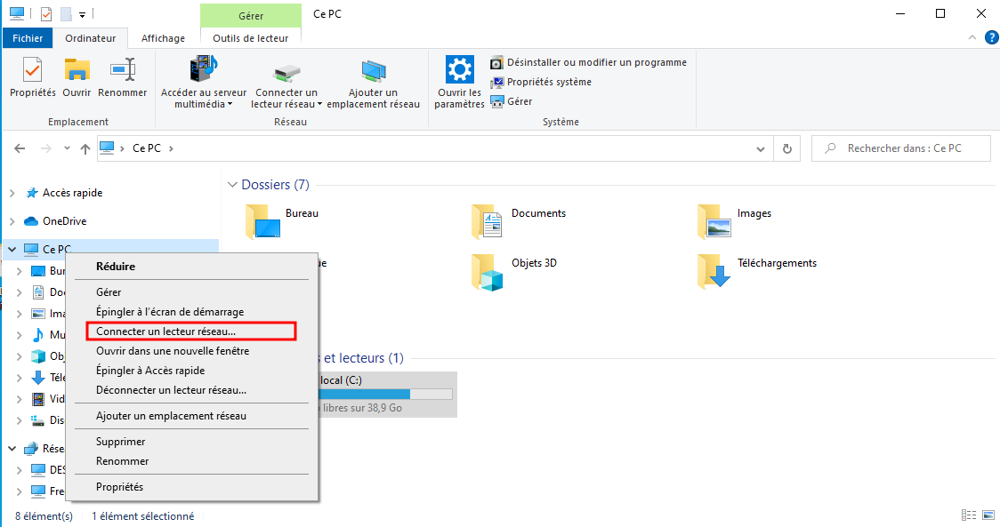
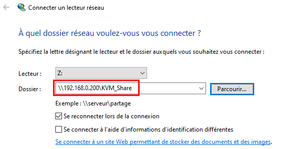
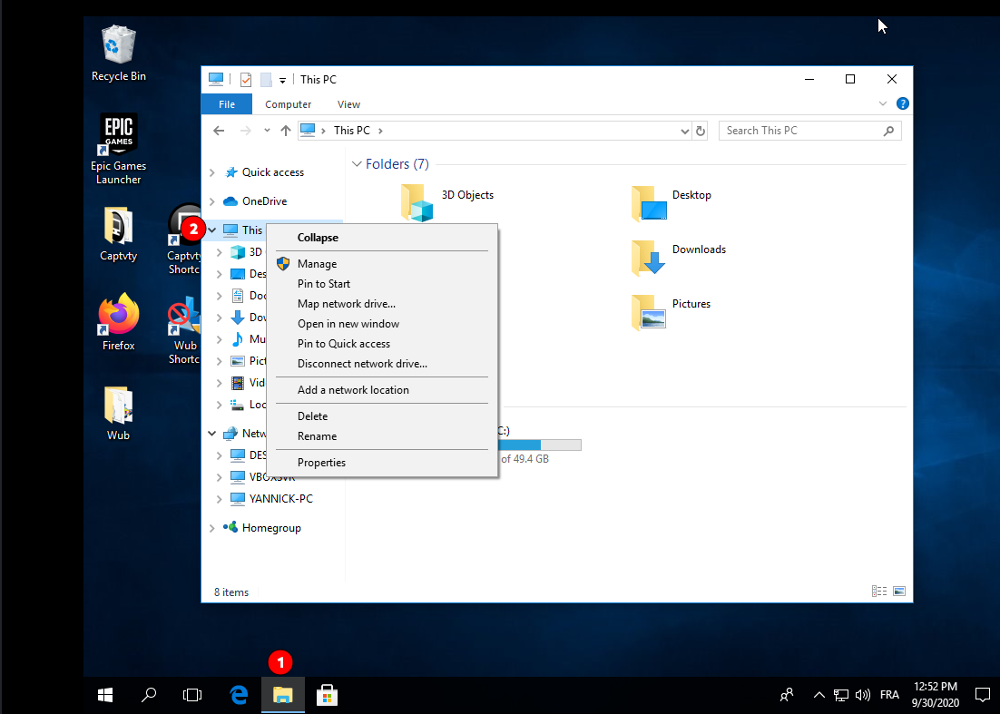
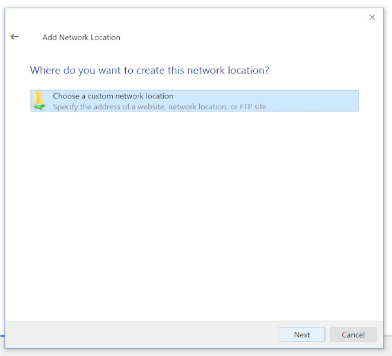
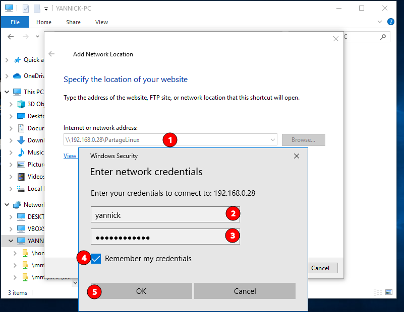
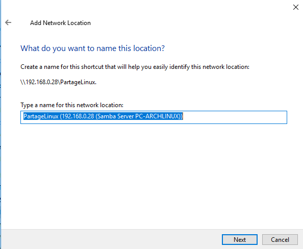
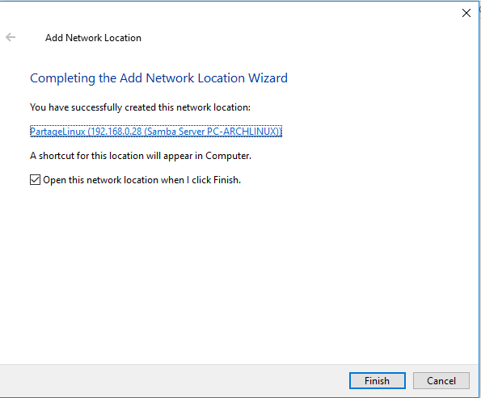
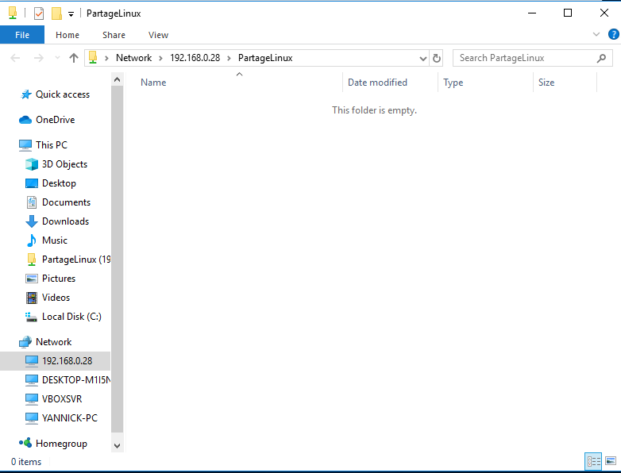

+++
title = 'Partage de fichiers hôte linux et invité windows avec Samba'
date = 2023-07-15 00:00:00 +0100
categories = ['samba']
+++


*Partager des fichiers sur votre hôte Linux avec un invité Windows en utilisant Samba*

*Voici un moyen simple et rapide de partager des fichiers sur votre hôte linux avec un invité Windows en utilisant la samba. Cela peut être utile pour de nombreuses raisons, car vous aurez probablement besoin d'accéder à des fichiers sur votre hôte à partir de votre invité à un moment donné.  
La seule condition est que samba soit installé sur votre hôte. Cette procédure est également spécifique à l'exécution de guest en utilisant le mode de mise en réseau par défaut qui est la mise en réseau en mode utilisateur.*

- [Méthode simplifiée](#méthode-simplifiée)
    - [Machine hôte](#machine-hôte)
        - [Installer samba](#installer-samba)
        - [Configuration](#configuration)
        - [Utilisateur samba](#utilisateur-samba)
        - [Droits dossier partagé](#droits-dossier-partagé)
        - [Pare feu](#pare-feu)
        - [Démarrer et activer samba](#démarrer-et-activer-samba)
    - [Machine virtuelle Windows](#machine-virtuelle-windows)
- [Méthode détaillée](#méthode-détaillée)
    - [Configurer le partage samba sur votre hôte](#configurer-le-partage-samba-sur-votre-hôte)
    - [Créer le répertoire partagé](#créer-le-répertoire-partagé)
    - [Accès partage hôte depuis windows](#accès-partage-hôte-depuis-windows)
    - [Accès partage hôte depuis linux](#accès-partage-hôte-depuis-linux)
    - [Monter un partage du voisinage réseau](#monter-un-partage-du-voisinage-réseau)
    - [Limiter l'accès (utilisateurs,sous-réseau)](#limiter-laccès-utilisateurssous-réseau)
    - [Configurations de Samba](#configurations-de-samba)


## Méthode simplifiée

### Machine hôte

Créer un dossier sur la machine hôte qui servira de dossier partagé avec les VMs.

    sudo mkdir /srv/media/KVM_Share

La solution est d’installer Samba sur la machine hôte, et accéder au dossier partagé depuis la VM Windows

#### Installer samba

Installer le service :

```
# debian
sudo apt update &&sudo apt install samba
# archlinux
sudo pacman -S samba
```

#### Configuration

On définit le dossier partagé que l’on souhaite dans `/etc/samba/smb.conf` 

```
[global]
	workgroup = KVMWIN
	idmap config * : backend = tdb
	hosts allow = 192.168.0. 127.


[KVM_Share]
	comment = Partage win
	create mask = 0765
	path = /srv/media/KVM_Share
	read only = No
	valid users = usersamba
```


*    **[Nom du partage]** – est le nom du partage qui sera utilisé par le client pour accéder au dossier partage
*    **path** – correspond à l’emplacement du dossier partage
*    **guest ok = yes** – indique que le partage est accessible au public.
*    **browseable = yes** fera apparaître le partage comme disponible pour tous les utilisateurs. Définissez **browseable = no** pour obliger les utilisateurs à taper manuellement le nom du partage pour y accéder
*    **read only = yes** – pour empêcher les utilisateurs d’apporter des modifications au répertoire à distance via la lecture seule
*    **writable = yes** – pour autoriser l’écriture sur le partage

#### Utilisateur samba

Ensuite il faut créer un utilisateur Linux que l’on utilise pour se connecter au partage.  
Il faut donc que l’utilisateur Linux ait accès au répertoire partage.  
Pour cela, vous pouvez utiliser le groupe **sambashare** créé par défaut  

Ajouter un utilisateur sans répertoire personnel, sans shell, sans groupe et avec un commentaire personnalisé 

    sudo useradd -M -N -r -s /bin/false -c "Utilisateur Samba" usersamba

On y ajoute les utilisateurs Linux qui seront utilisés pour se connecter au partage

    sudo adduser usersamba sambashare

Puis créez le mot de passe Samba (usersamba49600)

    smbpasswd -a usersamba

Puis on ajoute l’utilisateur dans le groupe yann :

    sudo usermod -a -G yann usersamba

#### Droits dossier partagé

On donne accès au répertoire partagé au groupe samba avec la commande chmod :

    sudo chown root:yann -R /srv/media/KVM_Share
    sudo chmod g+rw -R /srv/media/KVM_Share

#### Pare feu

Configurer le pare feu, nous devons nous assurer que le trafic Samba est autorisé

UFW

    sudo ufw add samba

firewalld.

```
sudo firewall-cmd --permanent --zone=public --add-service=samba
sudo firewall-cmd --reload
```

#### Démarrer et activer samba

on redémarre le service

	sudo systemctl restart smb.service
	sudo systemctl enable smb.service

### Machine virtuelle Windows

Démarrer la machine virtuelle windows  

on choisit « Connecter un lecteur réseau »  
  

  
`\\192.168.0.200\KVM_Share`  
*On coche « se reconnecter lors de la connexion » si on le souhaite*

Et voilà, même pas besoin de s’identifier grâce au paramètre « guest ok » définit avec Samba. Désormais, à chaque démarrage, on aura notre dossier partagé de connecté

## Méthode détaillée

**Archlinux**  
Installation du paquet samba.  
Le fichier de configuration de Samba est à l'emplacement /etc/samba/smb.conf et est abondamment documenté dans le `man 5 smb.conf`  
Comme le paquet samba ne fournit pas ce fichier, il vous faut le créer avant de lancer le service smb.  
Un exemple documenté, qui se trouve en tant que `smb.conf.default` dans le [dépôt git Samba](https://git.samba.org/samba.git/?p=samba.git;a=blob_plain;f=examples/smb.conf.default;hb=HEAD) peut servir à la configuration dans /etc/samba/smb.conf. 

Vérifier si samba est installé

    pacman -Qqe |grep samba

Si non, installer samba

    sudo pacman -S samba

**Debian**  
Installation

    sudo apt install smbclient  cifs-utils

### Configurer le partage samba sur votre hôte

Tout samba peut être configurée dans un fichier appelé **smb.conf**.  
Créer le fichier `/etc/samba/smb.conf`

    sudo nano /etc/samba/smb.conf

Copiez le contenu de la [Sample Configuration from Samba Git Repo](https://git.samba.org/samba.git/?p=samba.git;a=blob_plain;f=examples/smb.conf.default;hb=HEAD) et collez-le dans le fichier ci-dessus.

Pour une meilleure sécurité, fournir les versions min et max du protocole, ajouter des protocoles dans la section globale. (FACULTATIF)

```
[global]
server min protocol = NT1
server max protocol = SMB3
```

Définir un groupe de travail, vous pouvez définir votre propre nom de groupe de travail, je l'ai défini WINTEN

```
workgroup = WINTEN
```

Définir la description du serveur, cela est visible lorsque l'on interroge le serveur depuis le client Samba, le nom d'hôte de mon PC est PC-ARCHLINUX

```
server string = Samba Server PC-ARCHLINUX
```

Changez le chemin d'accès par défaut du fichier journal, car il n'est pas inscriptible, mettez-le à

```
# chemin R/W
#log file = /var/log/samba/%m.log
# journalisation systemd
logging = systemd
```

Restreindre le partage des répertoires d'origine, ajouter avant chaque ligne de la section [homes].

```
;[homes]
;comment = Home Directories
;browseable = no
;writable = yes
```

A la fin du fichier, décommentez la section `[myshare]` et changez-la si nécessaire, c'est le nom de partage qui apparaît sur le client, j'ai changé `[myshare]` en `[PartageLinux]`

```
[PartageLinux]
   comment = PC-ARCHLINUX Shared Files
   path = /mnt/partage
   valid users = yannick
   public = no
   writable = yes
   printable = no
   create mask = 0765

[Publique]
   hosts allow = 192.168.1. 127.0.0.1
   comment = Partage publique
   path = /home/yannick/Public
   available = yes
   browsable = yes
   public = yes
   writable = yes

```

Si plusieurs utilisateurs, séparés par un espace ex: `yannick anyotheruser1 anyotheruser2`  

Fichier final **/etc/samba/smb.conf**

```
[global]
   server min protocol = NT1
   server max protocol = SMB3
   dns proxy = No
   logging = systemd
   server role = standalone server
   server string = Samba Server PC-ARCHLINUX
   workgroup = WINTEN
   idmap config * : backend = tdb
   hosts allow = 192.168.0. 127.

[PartageLinux]
   comment = PC-ARCHLINUX Shared Files
   path = /mnt/partage
   valid users = yannick eeepc
   available = yes
   read only = no
   browseable = yes
   public = yes
   writable = yes
```

Le serveur Samba exige que l'utilisateur accède aux répertoires partagés par les utilisateurs si ceux-ci ne sont pas publics.  
**Samba partage le nom d'utilisateur du système linux mais conserve son propre mot de passe.**  
Nous n'avons donc pas besoin d'ajouter l'utilisateur mais nous allons ajouter un mot de passe dans la liste Samba.

    sudo smbpasswd -a yannick

Tapez votre mot de passe et entrez

Vous pouvez changer de mot de passe ultérieurement en utilisant

	sudo smbpasswd yannick

### Créer le répertoire partagé

Vous vous souvenez que nous avons créé une section [partagée] dans le fichier smb.conf ? Nous y avons configuré le chemin d'accès pour le répertoire partageable

```
[PartageLinux]
   comment = PC-ARCHLINUX Shared Files
   path = /mnt/partage
```

Créer un répertoire partagé dans /mnt/partage

	sudo mkdir -p /mnt/partage

Changer la propriété du fichier à l'utilisateur qui a été ajouté dans samba, dans mon cas c'était yannick, attribuer la propriété à yannick pour le répertoire /mnt/partage

	sudo chown -R yannick:users /mnt/partage
    sudo chmod 770 /mnt/partage

Démarrer maintenant le serveur Samba

	sudo systemctl start smb.service
    sudo systemctl start nmb.service

Vous pouvez les paramétrer pour un démarrage automatique au démarrage du système

	sudo systemctl enable smb.service
    sudo systemctl enable nmb.service

Félicitations, votre serveur samba est opérationnel, vous pouvez maintenant accéder aux dossiers partagés de votre serveur linux depuis n'importe quel autre PC, y compris Windows. Pour y accéder sous linux, vous devez avoir le client samba et monter le répertoire réseau.

Après toutes modifications

    sudo systemctl restart nmb.service smb.service 

Tester la configuration

    sudo testparm

```
Load smb config files from /etc/samba/smb.conf
Loaded services file OK.
Weak crypto is allowed
Server role: ROLE_STANDALONE

Press enter to see a dump of your service definitions

# Global parameters
[global]
	dns proxy = No
	logging = systemd
	server min protocol = NT1
	server role = standalone server
	server string = Samba Server PC-ARCHLINUX
	workgroup = WINTEN
	idmap config * : backend = tdb
	hosts allow = 192.168.0. 127.
    create mask = 0770

[PartageLinux]
	comment = PC-ARCHLINUX Shared Files
	guest ok = Yes
	path = /mnt/partage
	read only = No
	valid users = yannick eeepc
```

### Accès partage hôte depuis windows

Ouvrez l'Explorateur de fichiers (1) et cliquez avec le bouton droit de la souris sur Ce PC (2) (dans le volet de gauche). Dans le menu contextuel résultant, sélectionnez **Add a network location**

{:width="600""}

Un nouvel assistant s'ouvrira, qui vous guidera dans le processus de création d'un raccourci pour un nouvel emplacement réseau dans l'explorateur de fichiers. Cliquez sur **Next** dans la fenêtre de bienvenue. Dans l'écran résultant, cliquez sur **Choose a custom network location** (la seule option), puis cliquez sur **Next**.

{:width="400""}

Ensuite, vous devez entrer l'adresse IP de votre serveur Samba sous la forme \\SERVER_IP\SHARE (où SERVER_IP est l'adresse IP de votre serveur Samba et SHARE est le nom du partage que vous voulez ajouter).

{:width="400""}  
{:width="400""}  

Cliquez sur **Next** pour continuer. Dans la fenêtre suivante, saisissez un nom pour l'emplacement du réseau. Un nom par défaut sera récupéré par le serveur Samba, vous pouvez soit l'utiliser, soit saisir un nom personnalisé qui vous permettra de vous souvenir plus facilement de l'emplacement du partage ou de ce qui y est hébergé.

{:width="400""}  
Cliquer sur **Finish**  

{:width="400""}  

### Accès partage hôte depuis linux

Une version minimale de smb.conf est nécessaire pour faire fonctionner les outils clients

    sudo apt install smbclient

Pour avoir la liste des machines du voisinage réseau :

    smbclient -L nom_DNS_ou_NetBIOS_du_contrôleur_de_domaine -U login_Windows

Pour voir les partages de l'ordinateur ordi1 :

    smbclient -L ordi1 -U login_Windows

Pour télécharger le fichier fichier1.txt disponible dans le partage partage1 de l'ordinateur ordi1 :

```
    $ smbclient //ordi1/partage1 -U login_Windows
    smb: \> ls
    smb: \> cd répertoire_distant
    smb: \> lcd répertoire_local
    smb: \> get fichier1.txt
    smb: \> quit
```

Pour imprimer le fichier PostScript fichier2.ps sur l'imprimante printer2 partagée par l'ordinateur ordi2 :

```
    $ smbclient //ordi2/printer2 -U login_Windows
    smb: \> print fichier2.ps
    smb: \> quit
```

Pour déposer le fichier fichier3.txt sur le partage incoming partagée en écriture par l'ordinateur ordi3 :

```
    $ smbclient //ordi3/incoming -U login_Windows
    smb: \> put fichier3.txt
    smb: \> quit
```

Pour changer son mot de passe du voisinage réseau Windows :

    $ smbpasswd -r nom_DNS_ou_NetBIOS_du_contrôleur_de_domaine -U login_Windows

### Monter un partage du voisinage réseau

Installer le paquet **cifs-utils** 

    sudo apt install cifs-utils

**Montage manuel** dans le répertoire /Point/de/montage/ déjà existant :

    sudo mount -t cifs //IP_Serveur/Nom_de_partage /Point/de/montage -o user=utilisateur,password=mot_de_passe

Quand vous n'en n'avez plus besoin, vous pouvez démonter le système de fichiers :

    sudo umount /mnt/test

**Montage automatique**  
Avec les droits administrateur créez un fichier contenant les paramètres d'authentification du partage.

    /Chemin/Vers/share_auth

```
username=utilisateur
password=mot_de_passe
```

Vous pouvez également ajouter un domaine `domain=`
Pour sécuriser ces informations, il faut que le contenu du fichier soit visible et modifiable uniquement par l'administrateur.

    sudo chmod 600 /Chemin/Vers/share_auth

Dans /etc/fstab:

    //IP_Serveur/Nom_de_partage /Point/de/montage cifs credentials=/Chemin/Vers/share_auth 0 0


### Limiter l'accès (utilisateurs,sous-réseau) 

**Comment puis-je limiter l'accès à des utilisateurs particuliers ou à un sous-réseau tel que le 192.168.2.1/24 ?**

Vous pouvez utiliser des **wrappers tcp** pour limiter l'accès au sous-réseau via :

1. `/etc/hosts.allow` - Ce fichier décrit les noms des hôtes qui sont autorisés à utiliser les services INET locaux, comme décidé par le serveur /usr/sbin/tcpd.
2. `/etc/hosts.deny` - Ce fichier décrit les noms des hôtes qui ne sont PAS autorisés à utiliser les services INET locaux, selon la décision du serveur /usr/sbin/tcpd.

Par exemple, autoriser l'accès au service smbd à l'intérieur du réseau local uniquement via `/etc/hosts.allow` :

    smbd : 192.168.2.

Cependant, samba [peut ou non être construit pour](https://www.cyberciti.biz/faq/tcp-wrappers-hosts-allow-deny-tutorial/) supporter les **wrappers tcp**.{: .prompt-warning }

### Configurations de Samba

**hosts allow** 

Ouvrez votre fichier `smb.conf` et ajoutez la ligne suivante à `[share]`

```
[share]
  hosts allow = 192.168.2. 127.0.0.1
```

**utilisateurs valides**

Ouvrez votre fichier `smb.conf` et ajoutez la ligne suivante à `[share]`

```
[share]
  valid users = user1 user2 @group1 @group2
```

**lecture et écriture seulement** 

Vous pouvez également définir l'accès en lecture et en écriture à un ensemble d'utilisateurs avec les directives de liste de lecture et de liste d'écriture.

```
[share]
     read only = yes
     write list = user1 user2 @group1 @group2
```

Exemples

Faites en sorte que le partage des ventes (`[sales]`)  soit en lecture seule mais permettre l'écriture aux utilisateurs Tom et Jerry 

```
[sales]
     comment = All Printers
     path = /nas/fs/sales
     read only = yes
     write list = tom jerry
```

