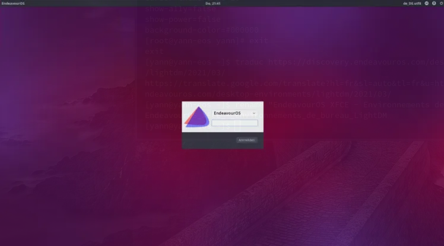
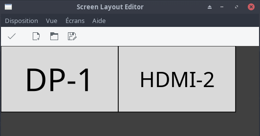
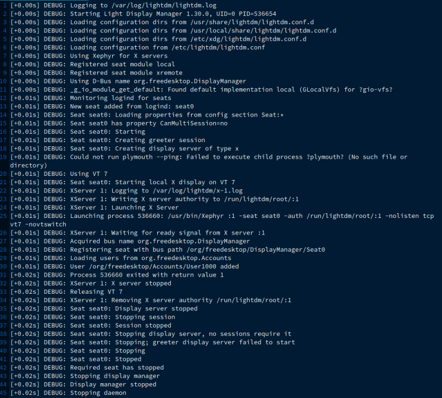
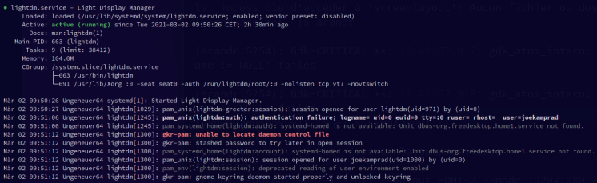

+++
title = 'EndeavourOS XFCE - LightDM sur les systèmes multi-affichages'
date = 2023-08-02 00:00:00 +0100
categories = ['archlinux', 'xfce']
+++
## Environnement de bureau

Article original : [Desktop Environments LightDM](https://discovery.endeavouros.com/desktop-environments/lightdm/2021/03/)


### LightDM



LightDM est un gestionnaire d'affichage multi-bureau. Un gestionnaire d'affichage est un démon qui :

*    Exécute des serveurs d'affichage (par exemple X) si nécessaire.
*    Exécute des bannières d'accueil pour permettre aux utilisateurs de choisir le compte d'utilisateur et le type de session à utiliser.
*    Permet aux greeters d'effectuer une authentification à l'aide de PAM.
*    Exécute les processus de session une fois l'authentification terminée.
*    Fournit des options de connexion graphique à distance.

Les principales fonctionnalités de LightDM sont :

*    Cross-desktop – prend en charge différentes technologies de bureau.
*    Prend en charge différentes technologies d'affichage (X, Mir, Wayland …).
*    Léger - faible utilisation de la mémoire et performances rapides.
*    Séances invitées.
*    Prend en charge la connexion à distance (entrante - XDMCP, VNC, sortante - XDMCP, enfichable).
*    Suite de tests complète.

Source : <https://github.com/canonical/lightdm>

#### Configurer LightDM pour qu'il fonctionne correctement sur les systèmes multi-affichages

Utilisez Arandr pour corriger la configuration de l'affichage sur les systèmes multi-affichages pour LightDM

Pour EndeavourOS (et autres distributions basées sur Archlinux):


Installez arandr (ARandR interface visuelle simple pour XRandR) à partir des référentiels 

    sudo pacman -S arandr

la configuration s'affiche en exécutant `arandr`   
  
Configurer HDMI-2 comme écran principal  
Enregistrer la configuration en tant que `monitor.sh` dans le répertoire donné.  

Contenu `~/.screenlayout/monitor.sh`

```shell
xrandr --output HDMI-1 --off --output HDMI-2 --primary --mode 1920x1080 --pos 1920x0 --rotate normal --output DP-1 --mode 1920x1080 --pos 0x0 --rotate normal
```

Copier le script enregistré dans le répertoire lightdm et le rendre-le exécutable

    sudo cp ~/.screenlayout/monitor.sh /etc/lightdm/
    sudo chmod +x /etc/lightdm/monitor.sh

Editer lightdm.conf

    sudo nano /etc/lightdm/lightdm.conf

Décommenter l'option de configuration de l'affichage et ajoutez le chemin vers le script

    display-setup-script=/etc/lightdm/monitor.sh

(vous pouvez également ajouter cette ligne à la fin du fichier) et enregistrer le fichier [Ctrl+X]  
Redémarrer lightdm pour voir s'il fonctionne :

    sudo systemctl restart lightdm

#### Dépannage:

>Lightdm ne démarre pas du tout (écran noir sans interface graphique de connexion qui s'affiche)

lightdm a un problème où il arrive parfois qu'il démarre trop vite - avant que X ne soit prêt, ou même avant que le pilote GPU ne soit complètement chargé.  
Une solution consiste à définir `logind-check-graphical=true` à l'intérieur de `/etc/lightdm/lightdm.conf`

    logind-check-graphical=true

Il existe plusieurs cas différents où Lightdm peut ne pas démarrer, le plus souvent c'est le cas où le pilote GPU ne se charge pas du tout ou trop tard. cela rend le système X indisponible pour lightdm.

Il peut également s'agir d'une faute de frappe ou d'un mauvais paramètre dans le ou les fichiers de configuration, car EndeavourOS utilise `lightdm-gtk-greeter` - par défaut, il peut manquer l'un des packages nécessaires ( lightdm lightdm-gtk-settings lightdm-gtk- greeter) l'empêchant de démarrer.

Lightdm dispose également d'un mode de débogage intégré que vous pouvez démarrer à partir de la CLI en cas d'échec

    lightdm --test-mode --debug

Vous pouvez également l'exécuter depuis le terminal si X est en cours d'exécution.  

Installer Xephyr 

    sudo pacman -S xorg-server-xephyr

qui donnera un journal de débogage comme celui-ci  
  

En parcourant la sortie de débogage, vous pouvez généralement trouver le coupable qui peut être à l'origine du problème pour vous.

Car le statut ne donne généralement pas de sortie utile 

    systemctl status lightdm

  
