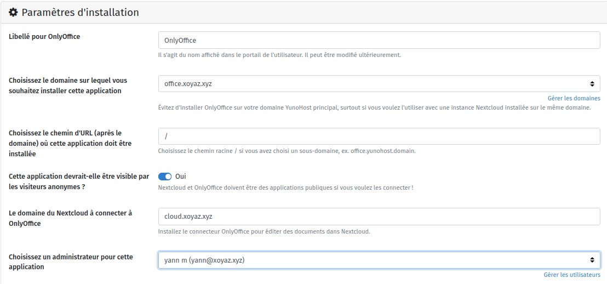
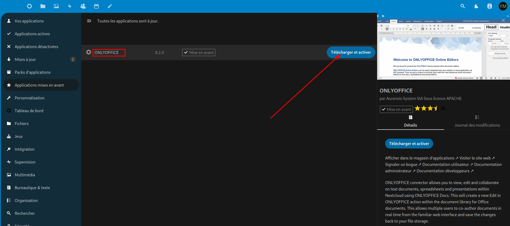
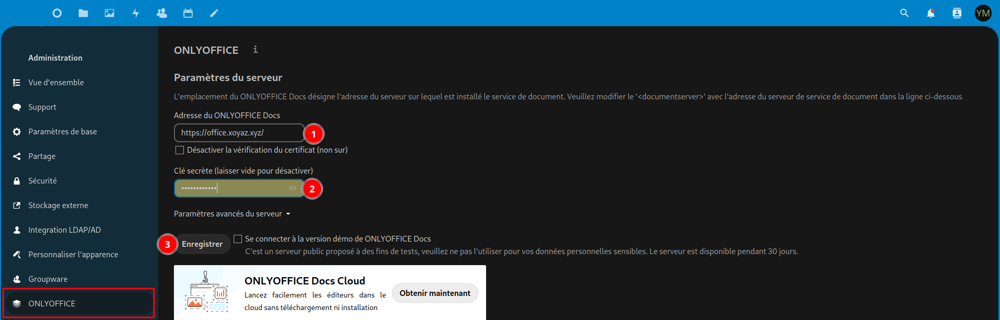
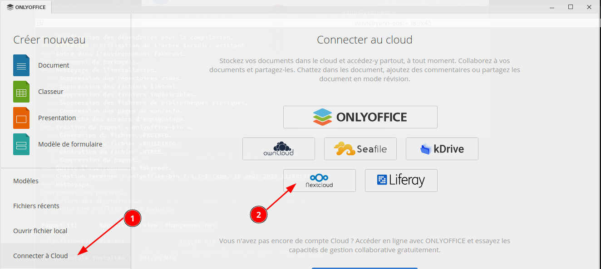
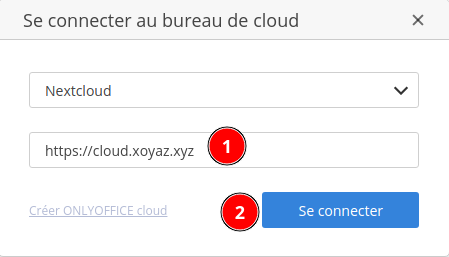
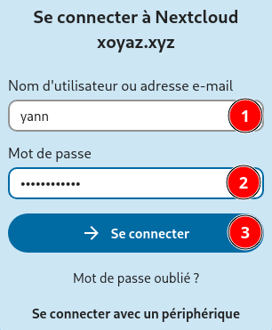
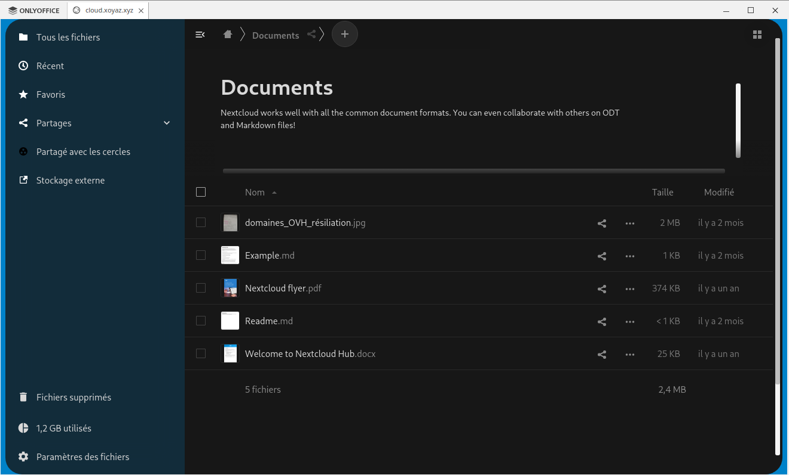
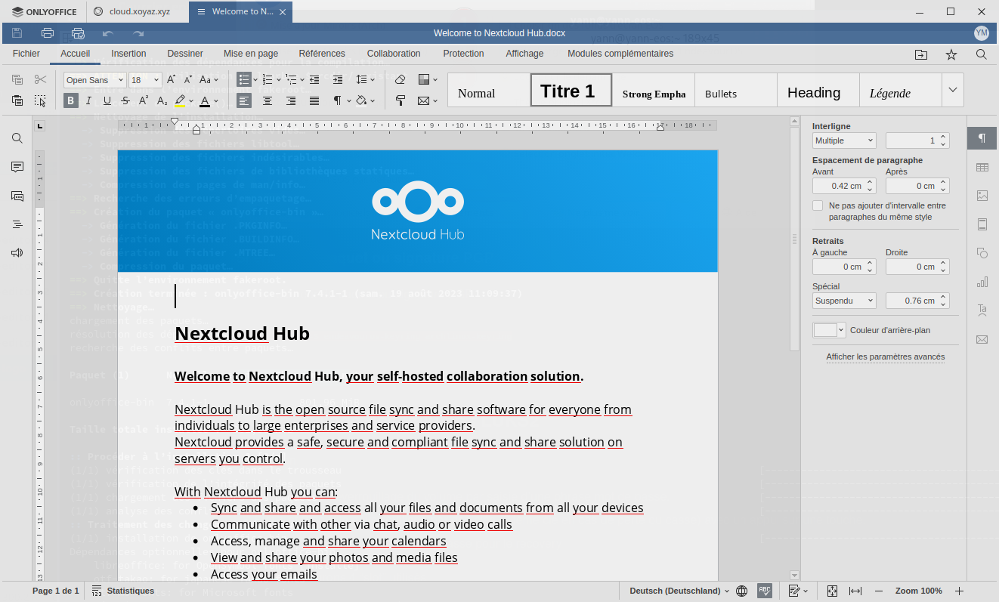

+++
title = 'OnlyOffice YunoHost, Nextcloud et Archlinux'
date = 2023-08-19 00:00:00 +0100
categories = application yunohost nextcloud
+++
{:height="100"}  
*installer OnlyOffice rapidement et simplement sur un serveur YunoHost*

- [Vue d’ensemble](#vue-d’ensemble)
- [Prérequis](#prérequis)
- [Installation](#installation)
- [Comment éditer des documents ONLYOFFICE ?](#comment-éditer-des-documents-onlyoffice-)
    - [Web Édition dans Nextcloud](#web-édition-dans-nextcloud)
    - [Desktop Édition sur PC](#desktop-édition-sur-pc)
        - [Edition documents sur Nextcloud](#edition-documents-sur-nextcloud)
- [Liens](#liens)

## Vue d’ensemble

ONLYOFFICE Document Server est une suite bureautique en ligne comprenant des visualiseurs et des éditeurs de textes, feuilles de calcul et présentations, entièrement compatible avec les formats Office Open XML: .docx, .xlsx, .pptx et permettant l'édition collaborative en temps réel.

L'édition collaborative en ligne des documents ONLYOFFICE nécessite :
1. une partie serveur, avec deux options d'installation :
    1. ONLYOFFICE Document Server packagé pour YunoHost.
    2. Le [Community Document Server pour Nextcloud](https://apps.nextcloud.com/apps/documentserver_community).

2. une partie client, telle que :
    1. [ONLYOFFICE connector pour Nextcloud](https://apps.nextcloud.com/apps/onlyoffice)
    2. [ONLYOFFICE Desktop Editors](https://www.onlyoffice.com/fr/download-desktop.aspx)

Une solution rendue facile par YunoHost est d'installer (1.1) et (2.1), voir [ci-dessous](https://github.com/YunoHost-Apps/onlyoffice_ynh/blob/master/README_fr.md#configuration-de-onlyoffice-server). Les utilisateurs qui aiment le tout Nextcloud peuvent suivre [ce tutoriel](https://github.com/YunoHost-Apps/nextcloud_ynh/blob/master/README_fr.md#configurer-lint%C3%A9gration-donlyoffice) pour installer le Community Document Server (1.2) et ONLYOFFICE connector (2.1) sur une instance Nextcloud. Cependant, les performances et l'architecture sont limitées.

## Prérequis

Ne pas installer ONLYOFFICE sur le domaine YunoHost principal, surtout si vous souhaitez l'utiliser avec une instance Nextcloud installée sur le même domaine.
{: .prompt-warning }

Création domaine **office.xoyaz.xyz** pour ONLYOFFICE dans YunoHost avec cerificats Let's Encrypt à l'aide de l'administrateur web  

## Installation

Installer l'application [Yunohost ONLYOFFICE](https://github.com/YunoHost-Apps/onlyoffice_ynh) à l'aide de la CLI :  
`sudo yunohost app install https://github.com/YunoHost-Apps/onlyoffice_ynh/tree/testing --debug`  
ou de l'administrateur Web  
  

## Comment éditer des documents ONLYOFFICE ?

### Web Édition dans Nextcloud

`ONLYOFFICE doit être public`{: .prompt-info }

* dans le magasin d'applications Nextcloud, installez `ONLYOFFICE`, c'est-à-dire le [connecteur ONLYOFFICE pour Nextcloud](https://apps.nextcloud.com/apps/onlyoffice)   

* Allez dans Nextcloud `Paramètres d'administration` --> `Administration` --> `ONLYOFFICE` > `Paramètres du serveur` > `Adresse du service d'édition de document`.
    1. Spécifiez le domaine d'installation de votre serveur `ONLYOFFICE`, `https://office.xoyaz.xyz/`
    2. Récupérer le token `JWT secret` en cli : `sudo documentserver-jwt-status.sh` ([Upgrade soft-fails due to 7.2 enabling JWT](https://github.com/YunoHost-Apps/onlyoffice_ynh/issues/84))
    *  Saisir URL du serveur docs, clé secrète (token) et cliquer sur `Enregistrer`.  

* Créer un nouveau document !

### Desktop Édition sur PC

* Téléchargez et installez [ONLYOFFICE Desktop Editors](https://www.onlyoffice.com/fr/download-desktop.aspx)  
[Comment installer ONLYOFFICE Desktop Editors sur Arch Linux](https://www.onlyoffice.com/blog/fr/2022/06/comment-installer-onlyoffice-desktop-editors-sur-arch-linux) : `yay -S onlyoffice-bin`

#### Edition documents sur Nextcloud

* Démarrez l'éditeur {:height="50"}  
  

* Sélectionnez `Nextcloud`, saisir le domaine d'installation Nextcloud  
{:width="200"}  
Saisir utilisateur et mot de passe puis se connecter  
{:width="200"}  
Connextion établie avec le serveur nextcloud  
  
* Editer un document !  

## Liens

* Site officiel application : <https://www.onlyoffice.com>
* Dépôt du code officiel : <https://github.com/ONLYOFFICE/DocumentServer>
* Documentation YunoHost : <https://yunohost.org/app_onlyoffice>
* Signaler un bug : <https://github.com/YunoHost-Apps/onlyoffice_ynh/issues>

