+++
title = 'Partage disque externe USB sur Freebox'
date = 2023-08-29 00:00:00 +0100
categories = ['box']
+++
- [Configurer le partage sur Freebox OS](#configurer-le-partage-sur-freebox-os)
- [Accés partage samba depuis linux](#accés-partage-samba-depuis-linux)
    - [Montage linux du disque USB Freebox](#montage-linux-du-disque-usb-freebox)
    - [Accéder au disque Freebox sur Windows 10](#accéder-au-disque-freebox-sur-windows-10)

**Formats compatibles freebox**  
Le **disque dur/clé USB** doit être formaté(e) à l'aide de l'un des systèmes de fichiers suivants :

*    FAT32 (ou FAT16), limitation de 4 Go maximum par fichier
*    HFS et HFS+
*    NTFS 
*    Ext4 (RW) 
*    XFS 

**Les types de média compatibles** 

*    Formats de lecture de photos : 
    * GIF, JPEG, PNG
*    Formats de lecture de musique : 
    * MP1, MP3, MPEG4 AAC
*    Formats de lecture de vidéos avec prise en charge des codecs suivants : 
    * H.264/MPEG-4 AVC, MPEG-1, MPEG-2, MPEG-4, VC1, DivX

## Configurer le partage sur Freebox OS

Ouvrir Freebox OS depuis un navigateur en saisissant  le lien <http://192.168.0.254/login.php>
Après authentification vous êtes sur la page d’accueil et double-clic sur **Paramètres de la Freebox**  
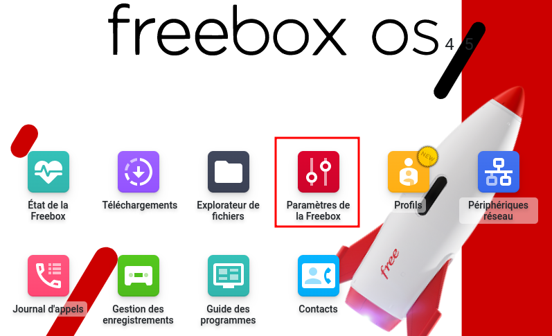  

Le disque SSD 480Go est connecté sur le port USB de la Freebox POP  
En **Mode avancé** dans la rubrique **Partage de fichiers** double-clic sur **Disques**  
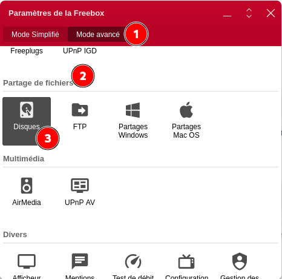{:width="400"}  

Formater le disque en ext4  
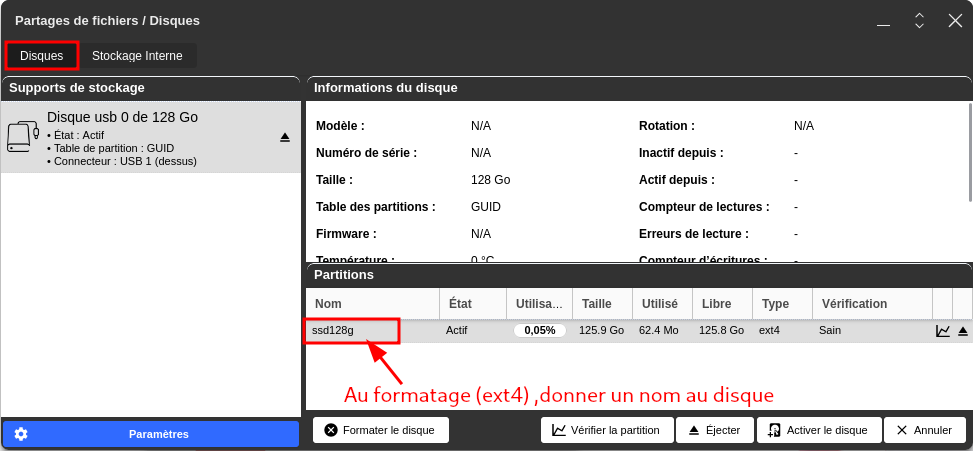  

En **Mode avancé** dans la rubrique **Partage de fichiers** double-clic sur **Partages Windows**  
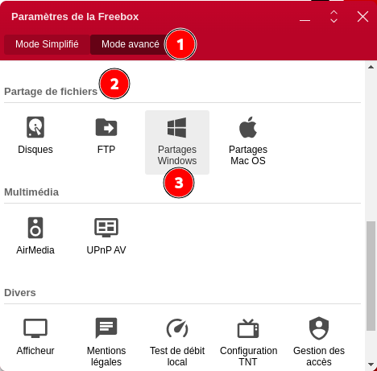{:width="400"}  

Renseigner les différents champs  
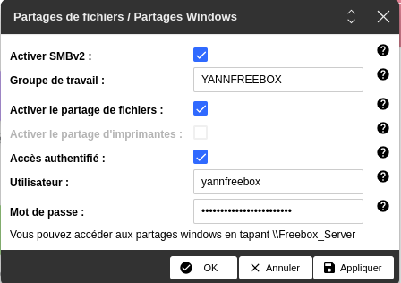{:width="400"}  
Clic sur **OK**

Vérifier le disque après formatage  
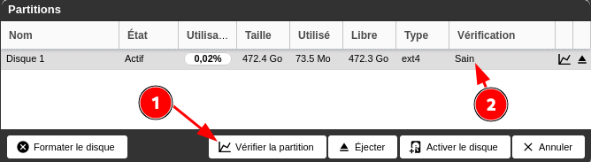{:width="400"}  


## Accés partage samba depuis linux

Installation paquet cifs-utils 

    sudo apt install cifs-utils  # Debian
    sudo pacman -S cifs-utils    # Archlinux 

Création répertoire de montage et lien  

    sudo mkdir /mnt/FreeUSB2To   
    sudo ln -s /mnt/FreeUSB2To $HOME/FreeUSB2To

Création fichier caché pour login et mot de passe

    sudo nano /root/.smbcredentials

Dans le fichier, ajoutez les lignes suivantes (remplacez les XXXX par votre login et mot de passe) 

```
username=XXXXXX
password=XXXXXX
```

Donnez les droits adéquats au fichier

```bash
sudo chown -R root:root /root/.smbcredentials
sudo chmod -R 600 /root/.smbcredentials
```

### Montage linux du disque USB Freebox

Le disque est nommé **FreeUSB2To**  

Partage : //192.168.0.254/FreeUSB2To  
Point de montage local : /mnt/FreeUSB2To  

Créer un nouveau fichier mnt-mp.mount dans le répertoire /etc/systemd/system. Le nom du fichier doit contenir le nom du point de montage, les barres obliques étant remplacées par des "moins". Nom de fichier pour /mnt/mp => mnt-mp.mount  
Le dossier pour les fichiers unitaires personnalisés de systemd est /etc/systemd/system.

    sudo nano /etc/systemd/system/mnt-FreeUSB2To.mount

```
[Unit]
  Description=cifs mount script
  Requires=network-online.target
  After=network-online.service

[Mount]
  What=//192.168.0.254/FreeUSB2To
  Where=/mnt/FreeUSB2To
  Options=credentials=/root/.smbcredentials,rw,uid=1000,gid=1000,vers=3.0
  Type=cifs

[Install]
  WantedBy=multi-user.target
```

- Pour fournir les identifiants automatiquement vous utiliserez l’option credentials qui indique d’aller les chercher dans le fichier `/root/.smbcredentials`
- Préciser les UID et GID à donner aux répertoires et fichiers qui sont montés puisqu’il n’y a pas de lien entre les utilisateurs du serveur et ceux du client. Vous pouvez utiliser des noms ou des valeurs numériques. Par défaut, les fichiers montés appartiennent à  `root:root` soit uid et gid = 0

Pour des raisons de sécurité, les versions récentes du noyau ne permettent pas de se connecter à un partage CIFS qui ne prend en charge que SMB1.  
La valeur par défaut a changé, SMB2.1 ou plus récent SMB3, au lieu de CIFS (SMB1).  
Pour monter de tels partages, vous devez explicitement définir la version du protocole SMB à 3 en ajoutant l'option vers=3.0 à la ligne Options de l'unité de montage.
{: .prompt-info }


Activer la configuration définie précédemment 

    sudo systemctl enable mnt-FreeUSB2To.mount

Pour monter votre partage, démarrez l'unité.

    sudo systemctl start mnt-FreeUSB2To.mount

Vérifier

    mount|grep 192

```
//192.168.0.254/FreeUSB2To on /mnt/FreeUSB2To type cifs (rw,relatime,vers=3.0,cache=strict,username=yannfreebox,uid=0,noforceuid,gid=0,noforcegid,addr=192.168.0.254,file_mode=0755,dir_mode=0755,soft,nounix,serverino,mapposix,rsize=65536,wsize=65536,bsize=1048576,echo_interval=60,actimeo=1,closetimeo=1)
```

Pour démonter votre partage, arrêtez l'unité.

    sudo systemctl stop mnt-FreeUSB2To.mount

Si vous apportez des modifications à votre fichier d'unité pendant qu'il est encore actif

    sudo systemctl daemon-reload

pour le recharger.

Il est également possible de monter votre partage à la demande.  

Définissez votre unité de montage **mnt-FreeUSB2To.mount** comme ci-dessus mais <u>ne l'activez pas via systemctl</u>.

Créez une unité de montage automatique `/etc/systemd/system/mnt-FreeUSB2To.automount`  
L'unité automount démarre l'unité de montage (mnt-FreeUSB2To.mount) à la demande.

    sudo nano /etc/systemd/system/mnt-FreeUSB2To.automount

```
[Unit]
  Description=cifs mount script
  Requires=network-online.target
  After=network-online.service

[Automount]
  Where=/mnt/FreeUSB2To
  TimeoutIdleSec=10

[Install]
  WantedBy=multi-user.target
```

Activer et lancer l'unité de montage automatique

    sudo systemctl enable mnt-FreeUSB2To.automount --now

Cela créera une entrée autofs dans l'onglet mount

    mount |grep systemd

```
systemd-1 on /proc/sys/fs/binfmt_misc type autofs (rw,relatime,fd=36,pgrp=1,timeout=0,minproto=5,maxproto=5,direct,pipe_ino=14002)
systemd-1 on /mnt/FreeUSB2To type autofs (rw,relatime,fd=53,pgrp=1,timeout=10,minproto=5,maxproto=5,direct,pipe_ino=164695)
```

Status

    systemctl status mnt-FreeUSB2To.automount

```
● mnt-FreeUSB2To.automount - cifs mount script
     Loaded: loaded (/etc/systemd/system/mnt-FreeUSB2To.automount; enabled; preset: disabled)
     Active: active (waiting) since Mon 2023-08-28 12:03:25 CEST; 1min 9s ago
   Triggers: ● mnt-FreeUSB2To.mount
      Where: /mnt/FreeUSB2To

août 28 12:03:25 yann-eos systemd[1]: Set up automount cifs mount script.
```

et naviguez jusqu'au point de montage pour voir ce qui se passe

    ls -l /mnt/FreeUSB2To/

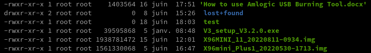  

### Accéder au disque Freebox sur Windows 10

**Comment accéder a votre partage Freebox Server ?**

Vous pouvez tester l’accès en effectuant la suite de touches Windows + R puis le chemin d’accès de la Freebox \\192.168.0.254  
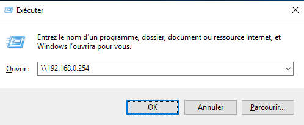{:width="400"}  

Un nom d’utilisateur et mot de passe est demandé, celui que vous avez défini dans Freebox OS:  
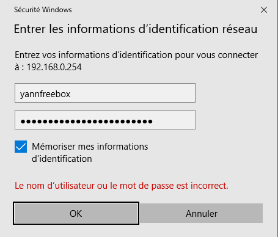{:width="400"}  

Si les informations que vous avez renseignées sont bonnes, vous devriez avoir accès a votre disque réseau:  
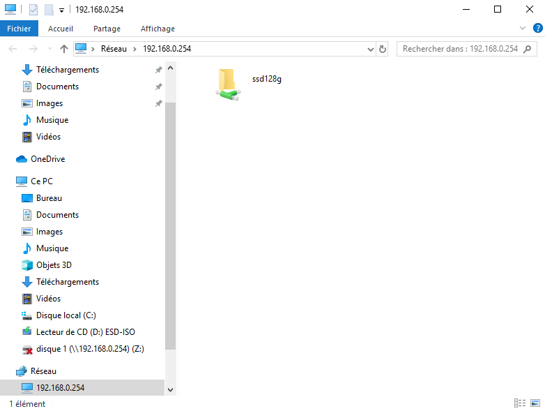{:width="600"}  

**Ajouter le partage à l’explorateur de fichiers  **

Afin de faire apparaître le disque dur de la Freebox comme un disque dur classique sur votre ordinateur. Rendez-vous dans l’explorateur de fichiers puis faites un clic droit sur **Ce PC** puis **Connecter un lecteur réseau…**:  
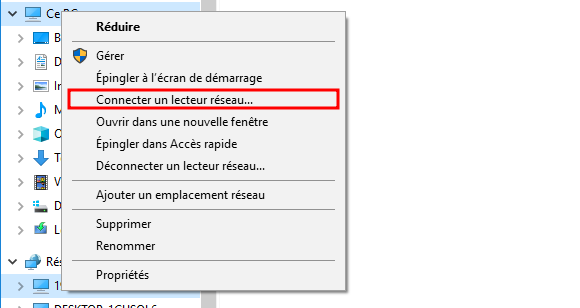{:width="400"}  
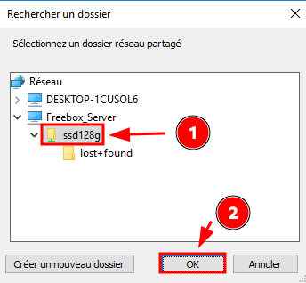{:width="300"}  
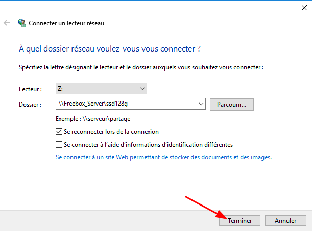{:width="500"}  

le disque de la Freebox apparaît sur l’explorateur de fichiers:  
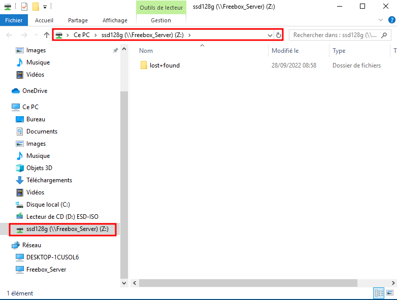{:width="600"}  


