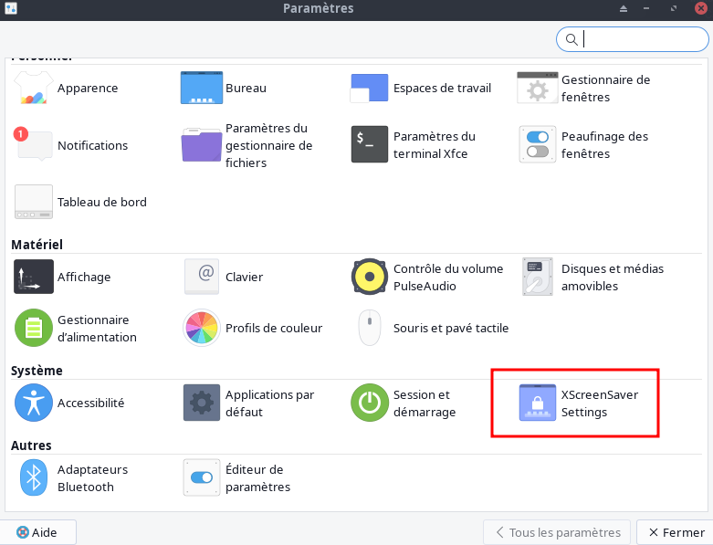
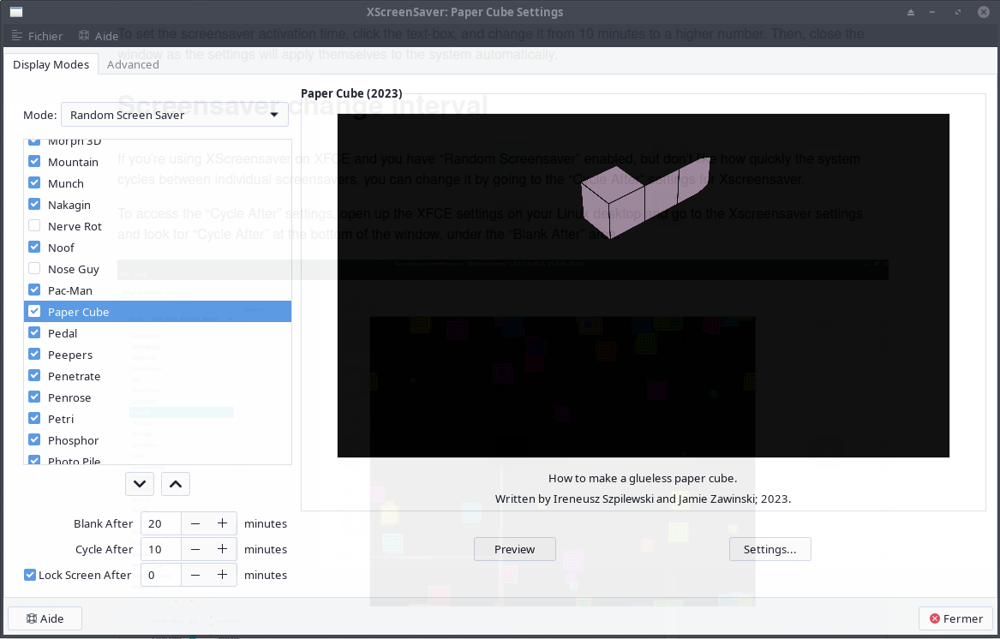
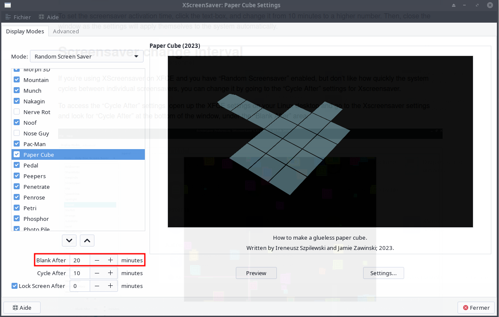
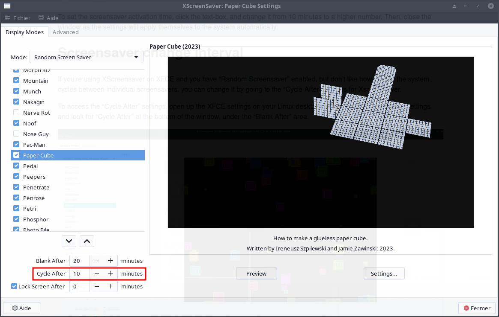
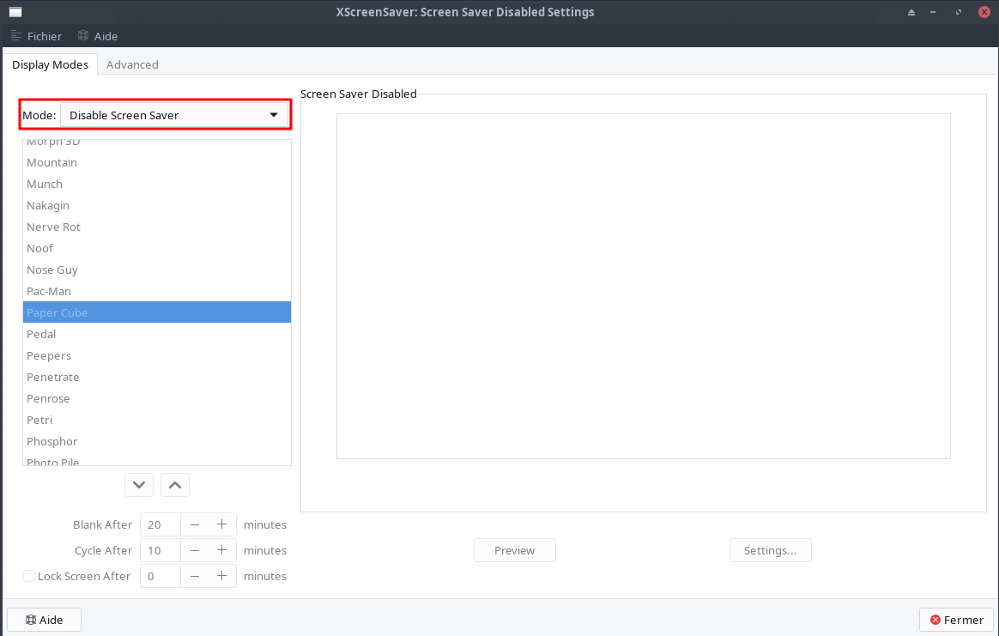
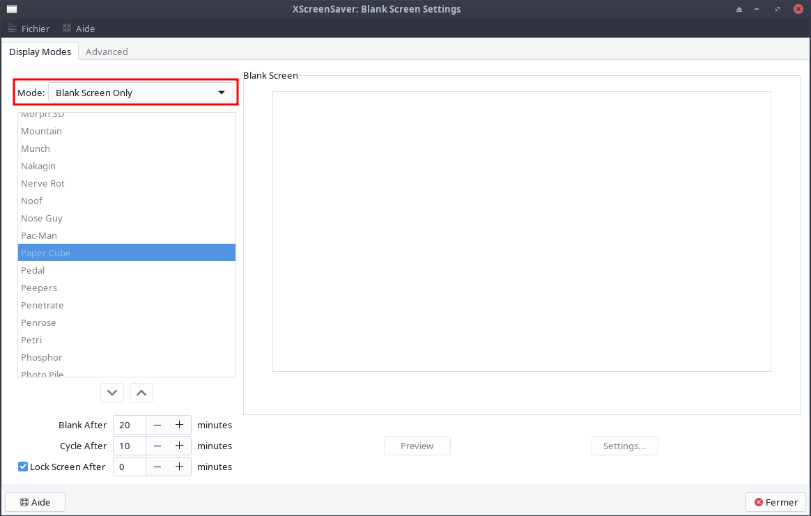
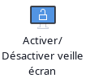

+++
title = 'Economiseur et veille écran XFCE XScreensaver'
date = 2023-09-12 00:00:00 +0100
categories = xfce
+++
*XScreensaver, un outil d'économiseur d'écran facilement configurable et personnalisable.*

- [Veille écran](#veille-écran)
    - [Modifier logiciel veille écran](#modifier-logiciel-veille-écran)
    - [Modifier les déclencheurs d'écran de veille](#modifier-les-déclencheurs-décran-de-veille)
    - [Intervalle changement écran de veille](#intervalle-changement-écran-de-veille)
    - [Désactiver l'économiseur d'écran](#désactiver-léconomiseur-décran)
        - [Méthode 1 - Désactiver complètement Xscreensaver](#méthode-1---désactiver-complètement-xscreensaver)
        - [Méthode 2 - Désactiver les animations mais conserver Xscreensaver](#méthode-2---désactiver-les-animations-mais-conserver-xscreensaver)
    - [Activer désactiver xscreensaver  par un bouton](#activer-désactiver-xscreensaver-par-un-bouton)

## Veille écran

L'environnement de bureau XFCE, aussi bon soit-il, reste fondamentalement construit sur une technologie plus ancienne que des environnements comme Gnome Shell ou KDE Plasma 5. Ce fait est particulièrement visible dans son choix d'utiliser des économiseurs d'écran, plutôt qu'un écran de verrouillage moderne. Cependant, bien que l'utilisation d'un économiseur d'écran puisse être considérée comme dépassée, XFCE4 le fait bien en offrant aux utilisateurs Xscreensaver, un outil d'économiseur d'écran facilement configurable et personnalisable.

### Modifier logiciel veille écran

Désinstaller la version existante

    yay -R xfce4-screensaver

Installer xscreensaver

    yay -S xscreensaver

Pour modifier les options de l'économiseur d'écran sur le bureau XFCE, vous devez accéder à la fenêtre principale des paramètres. Pour y accéder, ouvrez le menu des applications et cliquez sur l'icône des paramètres. Vous pouvez également appuyer sur les touches `Alt + F2` du clavier pour faire apparaître le menu de lancement rapide. Ensuite, écrivez "xfce4-settings-manager" et appuyez sur Entrée pour ouvrir instantanément les paramètres.  


Lorsque la fenêtre principale des paramètres est ouverte sur le bureau XFCE, faites défiler la liste des options à l'écran jusqu'à ce que vous trouviez "XScreensaver Settings" (économiseur d'écran). Double-cliquez sur l'icône pour accéder à la zone de configuration de XFCE et de Xscreensaver.  

Dans les paramètres de l'économiseur d'écran pour XFCE, vous verrez un grand nombre d'options différentes à choisir. Ignorez toutes les options et regardez la liste de droite. Dans cette liste, vous avez le choix entre plusieurs économiseurs d'écran. N'hésitez pas à décocher les cases des économiseurs d'écran dont vous ne voulez pas.

Pour configurer Xscreensaver de manière à n'utiliser qu'un seul économiseur d'écran, trouvez le menu "Mode" et cliquez sur la flèche déroulante. À partir de là, parcourez le menu et passez de "Random Screen Saver" à "Only One Screensaver" .  
  
Une fois que le système Xscreensaver est réglé sur "Un seul écran de veille", parcourez la liste des différents écrans de veille sur la gauche et sélectionnez l'écran de veille que vous souhaitez utiliser sur XFCE avec le système Xscreensaver.

### Modifier les déclencheurs d'écran de veille

Par défaut, l'économiseur d'écran de XFCE est configuré pour s'activer après environ 10 minutes d'inactivité. Pour beaucoup d'utilisateurs, 10 minutes est un délai trop court, car ils sont souvent assis devant leur ordinateur, lisant quelque chose avant d'être interrompus par un économiseur d'écran.  

Si la limite de temps par défaut vous ennuie, vous serez heureux d'apprendre qu'il est possible de modifier le temps d'activation de Xscreensaver. Pour ce faire, ouvrez les paramètres de l'économiseur d'écran dans XFCE, et rendez-vous dans la zone "Blank After" en bas à gauche de la fenêtre.  
  
Pour définir la durée d'activation de l'économiseur d'écran, cliquez sur la zone de texte et modifiez-la de 10 minutes à un nombre plus élevé. Fermez ensuite la fenêtre, car les paramètres s'appliqueront automatiquement au système.

### Intervalle changement écran de veille

Si vous utilisez XScreensaver sur XFCE et que vous avez activé "Random Screensaver", mais que vous n'aimez pas la vitesse à laquelle le système passe d'un écran de veille à l'autre, vous pouvez la modifier en allant dans les paramètres "Cycle After" de Xscreensaver.

Pour accéder aux paramètres "Cycle après", ouvrez les paramètres XFCE sur votre bureau Linux et allez dans les paramètres de Xscreensaver et cherchez "Cycle After" en bas de la fenêtre, sous la zone "Blank After".  
  
Les paramètres par défaut de l'économiseur d'écran Xscreensaver pour passer d'un économiseur d'écran à un autre sont d'environ 10 minutes. Si vous souhaitez que le système effectue ce changement plus rapidement, modifiez la valeur en dessous de 10 minutes. Ou, pour que le changement soit plus lent, choisissez un chiffre supérieur à 10 minutes.

Une fois le nouveau nombre ajouté au "Cycle After" dans les paramètres de Xscreensaver, le système devrait automatiquement adopter les derniers changements.

### Désactiver l'économiseur d'écran

Si vous détestez les économiseurs d'écran et que vous ne voulez pas voir des formes et des vidéos bizarres lorsque votre ordinateur passe en mode veille, vous pouvez désactiver complètement le système Xscreensaver de votre environnement de bureau XFCE. C'est compréhensible ; les économiseurs d'écran ne conviennent pas à tout le monde.

Il existe deux façons de désactiver le système Xscreensaver sur XFCE. Dans cette section, nous allons vous montrer les deux méthodes.

#### Méthode 1 - Désactiver complètement Xscreensaver

Pour désactiver Xscreensaver afin que le système n'entre jamais en vigueur, ouvrez les paramètres de l'économiseur d'écran dans XFCE. Ensuite, localisez le bouton du menu déroulant "Mode" et cliquez dessus avec la souris pour faire apparaître les options.

Dans le menu des options, trouvez "Disable Screen Saver" et sélectionnez-le pour désactiver définitivement l'économiseur d'écran de votre environnement de bureau XFCE.  
  

Une fois l'option "Disable Screen Saver" sélectionnée, fermez la fenêtre pour terminer l'application des paramètres.

#### Méthode 2 - Désactiver les animations mais conserver Xscreensaver

Vous souhaitez désactiver les animations bizarres que Xscreensaver joue lorsque votre PC est inactif, tout en conservant la fonction de verrouillage ? Voici comment procéder. Tout d'abord, ouvrez les paramètres de l'économiseur d'écran pour XFCE et cliquez sur le menu déroulant "Mode" à l'aide de la souris.

Recherchez dans le menu déroulant "Mode" l'option "Blank Screen Only" et réglez Xscreensaver sur cette option, de sorte que le système verrouille votre écran mais ne joue pas d'animations.  
  
Une fois que Xscreensaver est réglé sur "Écran vierge uniquement", fermez la fenêtre.

### Activer désactiver xscreensaver  par un bouton

Création d'un script pour **Activer/Désactiver** le programme de mise en veille **xscreensaver**  
  
Prérequis : **zenity**   
Le script **~/scripts/veille.sh**  

```bash
#!/bin/bash
# veille.sh


# Détecter si xscreensaver est actif
if [ "$(pidof -s xscreensaver)" ]; then
    arret=false
    zenity --question --title "veille" --ok-label="Oui" --cancel-label="Non" --text "Economiseur Ecran ACTIF\n\n DESACTIVER ?"
    if [ $? = 0 ]
    then
            echo "ARRET daemon xscreensaver ..."
            xscreensaver-command -exit
            sleep 3
    fi
else
    arret=true
    zenity --question --title "veille" --ok-label="Oui" --cancel-label="Non" --text "Economiseur Ecran NON ACTIF\n\n ACTIVER ?"
    if [ $? = 0 ]
    then
            echo "DEPART daemon xscreensaver ..."
            xscreensaver -nosplash &
            sleep 3
    fi
fi
```

Création lanceur XFCE en utilisant **Editeur de menus** (si "menulibre" installé ou manuellement)  

```bash
mkdir -p ~/.local/share/applications/  #création dossier "applications"  si inexistant
nano ~/.local/share/applications/menulibre-veille-ecran.desktop
```

Contenu :

```ini
[Desktop Entry]
Version=1.0
Type=Application
Name=Activer/Désactiver veille écran
Comment=Veille active ou pas par simple clic
Icon=preferences-desktop-screensaver
Exec=sh /home/yann/scripts/veille.sh
Path=/home/yann/scripts
NoDisplay=false
Categories=Utility;X-XFCE;X-Xfce-Toplevel;
StartupNotify=false
Terminal=false
```

>Les icônes sont situés sous /usr/share/icons , il suffit de mettre le nom de l'icône choisi sans extension ni chemin pour le paramètre **Icon**