+++
title = 'Yunohost TIME4VPS debian 11 xoyaz.xyz'
date = 2023-09-12 00:00:00 +0100
categories = vps yunohost
+++
*Installation yunohost beta stage (juin 2022) testing sur un serveur Debian 11 [TIME4VPS](https://www.time4vps.com/)*


 *fournisseur d'hébergement Web en Lituanie *

Connexion sur l'hébergeur TIME4VPS (zone client) : <https://billing.time4vps.com/clientarea/>  
**Modifier hostname**   
Cliquer sur **Change Hostname** et saisir **xoyaz.xyz** pour valider le **reverse DNS**  

* **Product/Service** 	Linux VPS - Linux 8
* **Label** 	yann-time4vps 
* **Hostname** 	xoyaz.xyz
* **Node** 	k24-b18-lt1
* **Specs** 	
    * **OS**: Debian 11 (64-bit)
    * **Processor**: 3 x 2.6 GHz
    * **Memory**: 8192 MB
    * **Storage**: 80 GB
    * **Bandwidth**: 100 Mbps (Monthly limit: 16 TB)
    * Upgrade / Downgrade 
* Components 	Upgrade
* Backups 	Order now
* **IP(s)** 	
    * **IPv4** 	195.181.242.156 	Main IP
    * **IPv4** 	10.181.242.156 	Local IP
    * **IPv6** 	2a02:7b40:c3b5:f29c::1 (xoyaz.xyz) 	

On se connecte en root sur le VPS

    ssh root@195.181.242.156

## Yunohost xoyaz.xyz


### Installation et configuration

#### Installer yunohost

* [Beta-stage testing for Yunohost 11.0/Bullseye and Buster->Bullseye migration ](https://forum.yunohost.org/t/beta-stage-testing-for-yunohost-11-0-bullseye-and-buster-bullseye-migration/18531)


Installation d'un nouveau YunoHost sur un Debian 11/Bullseye

    wget https://install.yunohost.org/bullseye -O install_script
    bash install_script -d testing

Patienter ...

```

 ┌───────────────────────────┤ SSH Configuration ├────────────────────────────┐
 │                                                                            │
 │ To improve the security of your server, it is recommended to let YunoHost  │
 │ manage the SSH configuration.                                              │
 │ Your current SSH configuration differs from the recommended configuration. │
 │ If you let YunoHost reconfigure it, the way you connect to your server     │
 │ through SSH will change in the following way:                              │
 │ - you will not be able to connect as root through SSH. Instead you should  │
 │ use the admin user ;                                                       │
 │                                                                            │
 │ Do you agree to let YunoHost apply those changes to your configuration and │
 │ therefore affect the way you connect through SSH ?                         │
 │                                                                            │
 │                     <Yes>                        <No>                      │
 │                                                                            │
 └────────────────────────────────────────────────────────────────────────────┘
Choix Yes

===============================================================================
You should now proceed with Yunohost post-installation. This is where you will
be asked for :
  - the main domain of your server ;
  - the administration password.

You can perform this step :
  - from the command line, by running 'yunohost tools postinstall' as root
  - or from your web browser, by accessing : 
    - https://195.181.242.156/ (global IP, if you're on a VPS)

If this is your first time with YunoHost, it is strongly recommended to take
time to read the administator documentation and in particular the sections
'Finalizing your setup' and 'Getting to know YunoHost'. It is available at
the following URL : https://yunohost.org/admindoc
===============================================================================
```

#### Post-installation

Vous devez faire la post-installation pour configurer l'application Borg.
{: .prompt-info }

    yunohost tools postinstall

```
Main domain: xoyaz.xyz
New administration password: ****************
Confirm new administration password: ****************
Info: Installing YunoHost...
Success! Self-signed certificate now installed for the domain 'xoyaz.xyz'
Success! Domain created
Success! The main domain has been changed
Info: Your root password have been replaced by your admin password.
Success! The administration password was changed
Success! Firewall reloaded
Success! App catalog system initialized!
Info: Updating application catalog...
Success! The application catalog has been updated!
Success! The service 'yunohost-firewall' will now be automatically started during system boots.
Success! Service 'yunohost-firewall' started
Success! Configuration updated for 'ssh'
[...]
Warning: /usr/sbin/run-parts: line 5: fe80::200:c3ff:feb5:f29c%ens3 2a02:7b40:c3b5:f29c::1 10181242156 195181242156: syntax error in expression (error token is "::200:c3ff:feb5:f29c%ens3 2a02:7b40:c3b5:f29c::1 10181242156 195181242156")
Success! YunoHost is now configured
Warning: The post-install completed! To finalize your setup, please consider:
    - adding a first user through the 'Users' section of the webadmin (or 'yunohost user create <username>' in command-line);
    - diagnose potential issues through the 'Diagnosis' section of the webadmin (or 'yunohost diagnosis run' in command-line);
    - reading the 'Finalizing your setup' and 'Getting to know YunoHost' parts in the admin documentation: https://yunohost.org/admindoc.
```

>Le mot de passe root remplacé par celui de l'admin yunohost

Motd

    rm /etc/motd && nano /etc/motd

```bash
     __   __                 _              _                 
     \ \ / /_  _  _ _   ___ | |_   ___  ___| |_               
      \ V /| || || ' \ / _ \| ' \ / _ \(_-<|  _|              
       |_|  \_,_||_||_|\___/|_||_|\___//__/ \__|              
  _  ___  ___     _  ___  _     ___  _ _  ___     _  ___   __ 
 / |/ _ \| __|   / |( _ )/ |   |_  )| | ||_  )   / || __| / / 
 | |\_, /|__ \ _ | |/ _ \| | _  / / |_  _|/ /  _ | ||__ \/ _ \
 |_| /_/ |___/(_)|_|\___/|_|(_)/___|  |_|/___|(_)|_||___/\___/
    __ __ ___  _  _  __ _  ___   __ __ _  _  ___              
    \ \ // _ \| || |/ _` ||_ / _ \ \ /| || ||_ /              
    /_\_\\___/ \_, |\__,_|/__|(_)/_\_\ \_, |/__|              
               |__/                    |__/                   
```

#### Créer utilisateur yann 

Création utilisateur yann

    yunohost user create yann

```
First name: yann
Last name: m
Password: ************
Confirm password: ************
Available domains:
- xoyaz.xyz
Domain to use for the user's email address and XMPP account (default: xoyaz.xyz):
Success! User created
fullname: yann m
mail: yann@xoyaz.xyz
username: yann
```

Ajouter le droit de connexion ssh à un utilisateur (FACULTATIF)

    yunohost user permission add ssh yann

```
additional_urls: 
allowed: yann
auth_header: False
corresponding_users: yann
label: SSH
protected: True
show_tile: False
url: None
```

#### Domaines et DNS OVH

{:width="50"} 

Configuration DNS domaine par défaut **xoyaz.xyz**

    yunohost domain dns-conf xoyaz.xyz

```
; Basic ipv4/ipv6 records
@ 3600 IN A 195.181.242.156
@ 3600 IN AAAA 2a02:7b40:c3b5:f29c::1

; Mail
@ 3600 IN MX 10 xoyaz.xyz.
@ 3600 IN TXT "v=spf1 a mx -all"
mail._domainkey 3600 IN TXT "v=DKIM1; h=sha256; k=rsa; p=MIGfMA0GCSqGSIb3DQEBAQUAA4GNADCBiQKBgQCZglyGftXQzOMoUKTeG3eWIvzkBwML2GDjDLJLZwHwncvS1/AnPSjqkB8htjUb9tvladfwDs+Rz2hb5HGzHhRDUWRyo6QE1yonzcQux6VDHYRBaF1jBFT18nTOK40mjTOb7pHhUJ/71XXMl9eOpVhzzLuWmEGs/6dURkJxOhLY0wIDAQAB"
_dmarc 3600 IN TXT "v=DMARC1; p=none"


; XMPP
_xmpp-client._tcp 3600 IN SRV 0 5 5222 xoyaz.xyz.
_xmpp-server._tcp 3600 IN SRV 0 5 5269 xoyaz.xyz.
muc 3600 IN CNAME @
pubsub 3600 IN CNAME @
vjud 3600 IN CNAME @
xmpp-upload 3600 IN CNAME @

; Extra
* 3600 IN A 195.181.242.156
* 3600 IN AAAA 2a02:7b40:c3b5:f29c::1
@ 3600 IN CAA 128 issue "letsencrypt.org"
```

  
Se connecter à l'espace client du site OVH : **Web cloud &rarr; Domaines &rarr; xoyaz.xyz &rarr; Zone DNS**  
Cliquer sur **"Modifier en mode textuel"**, garder les 4 premières lignes :  
{:width="600"}  
puis effacer tout ce qu'il y a en-dessous, et le remplacer par la configuration donnée par votre serveur ( `yunohost domain dns-conf`)

#### Activer Certificats SSL Let's Encrypt

  
On active les certificats SSL pour le domaine xoyaz.xyz

    yunohost domain cert-install xoyaz.xyz --no-checks

Résultat

```
[...]
Success! Configuration updated for 'nginx'
Success! Let's Encrypt certificate now installed for the domain 'xoyaz.xyz'
```

#### proxy headers nginx

Pour éviter l'avertissement `[warn] could not build optimal proxy_headers_hash error`, on ajoute 2 lignes au nouveau fichier de configuration  `/etc/nginx/conf.d/proxy.conf` 

```
proxy_headers_hash_max_size 512;
proxy_headers_hash_bucket_size 128; 
```

Recharger nginx : `sudo systemctl reload nginx`

#### Thème "yann"

A partir d'un thème existant : `cp -r /usr/share/ssowat/portal/assets/themes/{unsplash,yako}`   
Les images : `/usr/share/ssowat/portal/assets/img/`  

* Image de fond : `code_coding_binary1920x1080.jpg`  
* Image logo : lettre-y-70x85.png  

Changer le "branding" du portail utilisateur "YunoHost" par  "yann" (yann.png)  
Copier yann.png dans le dossier `/usr/share/ssowat/portal/assets/themes/yako/`

Modifier le fichier css : `/usr/share/ssowat/portal/assets/themes/yako/custom_portal.css`  


```css
/*Image de fond*/
.ynh-user-portal {
  background-image: url('../../img/code_coding_binary1920x1080.jpg') !important;
  background-repeat: no-repeat;
  background-size: cover;
  width: 100%;
  height: 100%;
}

/*Personnaliser le logo */
#ynh-logo {
  z-index: 10;
  background-image: url("yann.png");
}

```

Puis ajouter en fin du fichier 

```css
.user-container:before {
  content: url("../../img/lettre-y-70x85.png");
  background: #0000;
}

/*
===============================================================================
 extra CSS rules to customize the YunoHost user portal and
 can be used to customize app tiles, buttons, etc...
===============================================================================
*/

.bluebg {
    background: #3498DB!important;
}
.bluebg:hover:after,
.bluebg:focus:after,
.bluebg:hover:before,
.bluebg:focus:before {
    background: #16527A!important;
}

.purplebg {
    background: #9B59B6!important;
}
.purplebg:hover:after,
.purplebg:focus:after,
.purplebg:hover:before,
.purplebg:focus:before {
    background: #532C64!important;
}

.redbg {
    background: #E74C3C!important;
}
.redbg:hover:after,
.redbg:focus:after,
.redbg:hover:before,
.redbg:focus:before {
    background: #921E12!important;
}

.orangebg {
    background: #F39C12!important;
}
.orangebg:hover:after,
.orangebg:focus:after,
.orangebg:hover:before,
.orangebg:focus:before {
    background: #7F5006!important;
}

.greenbg {
    background: #2ECC71!important;
}
.greenbg:hover:after,
.greenbg:focus:after,
.greenbg:hover:before,
.greenbg:focus:before {
    background: #176437!important;
}

.darkbluebg {
    background: #34495E!important;
}
.darkbluebg:hover:after,
.darkbluebg:focus:after,
.darkbluebg:hover:before,
.darkbluebg:focus:before {
    background: #07090C!important;
}

.lightbluebg {
    background: #6A93D4!important;
}
.lightbluebg:hover:after,
.lightbluebg:focus:after,
.lightbluebg:hover:before,
.lightbluebg:focus:before {
    background: #2B5394!important;
}

.yellowbg {
    background: #F1C40F!important;
}
.yellowbg:hover:after,
.yellowbg:focus:after,
.yellowbg:hover:before,
.yellowbg:focus:before {
    background: #796307!important;
}


.lightpinkbg {
    background: #F76F87!important;
}
.lightpinkbg:hover:after,
.lightpinkbg:focus:after,
.lightpinkbg:hover:before,
.lightpinkbg:focus:before {
    background: #DA0C31!important;
}

/* Following colors are not used yet */
.pinkbg {
    background: #D66D92!important;
}
.pinkbg:hover:after,
.pinkbg:focus:after,
.pinkbg:hover:before,
.pinkbg:focus:before {
    background: #992B52!important;
}

.turquoisebg {
    background: #1ABC9C!important;
}
.turquoisebg:hover:after,
.turquoisebg:focus:after,
.turquoisebg:hover:before,
.turquoisebg:focus:before {
    background: #0B4C3F!important;
}
.lightyellow {
    background: #FFC973!important;
}
.lightyellow:hover:after,
.lightyellow:focus:after,
.lightyellow:hover:before,
.lightyellow:focus:before {
    background: #F39500!important;
}
.lightgreen {
    background: #B5F36D!important;
}
.lightgreen:hover:after,
.lightgreen:focus:after,
.lightgreen:hover:before,
.lightgreen:focus:before {
    background: #77CF11!important;
}
.purpledarkbg {
    background: #8E44AD!important;
}
.purpledarkbg:hover:after,
.purpledarkbg:focus:after,
.purpledarkbg:hover:before,
.purpledarkbg:focus:before {
    background: #432051!important;
}

```

Personnaliser le logo en modifiant également le fichier `/usr/share/ssowat/portal/assets/themes/yako/custom_overlay.css`

```css
#ynh-overlay-switch {
  background-image: url("../../img/yann-logo.png");
}
```

Activer le thème dans le fichier `/etc/ssowat/conf.json.persistent` 

```json
{
    "theme" : "yako",
}
```

Créer le fichier `/usr/share/ssowat/portal/assets/themes/yako/custom_portal.js`

```js
/*
===============================================================================
 This JS file may be used to customize the YunoHost user portal *and* also
 will be loaded in all app pages if the app nginx's conf does include the
 appropriate snippet.

 You can monkeypatch init_portal (loading of the user portal) and
 init_portal_button_and_overlay (loading of the button and overlay...) to do
 custom stuff
===============================================================================
*/

var app_tile_colors = ['redbg','purpledarkbg','darkbluebg','orangebg','greenbg', 'yellowbg','lightpinkbg','pinkbg','turquoisebg','lightbluebg', 'bluebg'];

function set_app_tile_style(el)
{
    // Select a color value from the App label
    randomColorNumber = parseInt(el.textContent, 36) % app_tile_colors.length;
    // Add color class.
    el.classList.add(app_tile_colors[randomColorNumber]);
}

// Monkeypatch init_portal to customize the app tile style
init_portal_original = init_portal;
init_portal = function()
{
    init_portal_original();
    Array.each(document.getElementsByClassName("app-tile"), set_app_tile_style);
}

/*
 * Monkey patching example to do custom stuff when loading inside an app
 *
init_portal_button_and_overlay_original = init_portal_button_and_overlay;
init_portal_button_and_overlay = function()
{
    init_portal_button_and_overlay_original();
    // Custom stuff to do when loading inside an app
}
*/
```

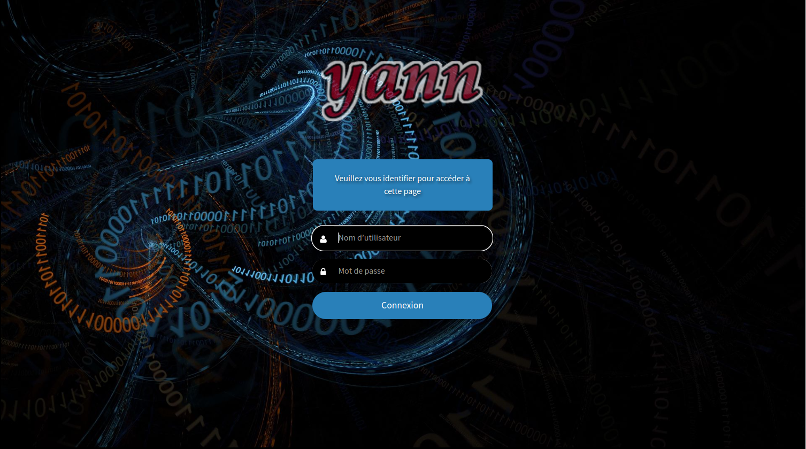{:width="600"}  
{:width="600"}  


#### OpenSSH, clé et script

{:height="70"}  
<u>sur l'ordinateur de bureau</u>
Générer une paire de clé curve25519-sha256 (ECDH avec Curve25519 et SHA2) nommé **time4vps** pour une liaison SSH avec le serveur KVM.  

    ssh-keygen -t ed25519 -o -a 100 -f ~/.ssh/time4vps

Envoyer les clés publiques sur le serveur KVM   

    ssh-copy-id -i ~/.ssh/time4vps.pub admin@195.181.242.156

<u>sur le serveur Yunohost</u>
On se connecte  

    ssh admin@195.181.242.156

Sur votre serveur, la modification du fichier de configuration SSH pour désactiver l'authentification par mot de passe est gérée par un paramètre système 

    sudo yunohost settings set security.ssh.password_authentication -v no

Modifier le port SSH

*Pour empêcher les tentatives de connexion SSH par des robots qui analysent Internet à la recherche de tout serveur sur lequel SSH est activé, vous pouvez modifier le port SSH. Ceci est géré par un paramètre système, qui prend en charge la mise à jour de la configuration SSH et Fail2Ban.*

    sudo yunohost settings set security.ssh.port -v 55156

Accès depuis le poste distant avec la clé privée  

    ssh -p 55156 -i ~/.ssh/time4vps admin@195.181.242.156

Vérification niveau de sécurité (intermediate ou modern)

    sudo yunohost settings get security.ssh.compatibility

La réponse est "modern" qui correspond au niveau le plus élevé

#### Journal

La façon de s'assurer que vous pouvez visualiser tous les messages de journal est d'ajouter l'utilisateur à un groupe existant tel que adm ou systemd-journal.

    sudo usermod -a -G systemd-journal $USER

### Diagnostics et erreurs

#### resolv.conf n'est pas un lien

Se connecter en administrateur sur le site web yunohost xoyaz.xyz  
Lancer le diagnostic  

<u>Problème résolution DNS</u>  
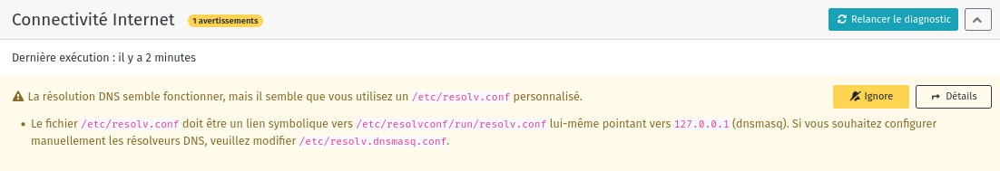  
<u>Résolution du problème DNS</u>  
Sur yunohost debian 11 le fichier de résolution DNS `/etc/resolv.conf` pointe sur le fichier `/run/resolvconf/resolv.conf` , ce dernier fichier contient `127.0.0.1`

Sur la machine debian 11 TIME4VPS le fichier `/etc/resolv.conf` NE POINTE PAS sur le fichier `/run/resolvconf/resolv.conf`  
Pour régler le problème (en mode su) :

```bash
rm -f /etc/resolv.conf
ln -s /run/resolvconf/resolv.conf /etc/resolv.conf
```

Un redémarrage du serveur est nécessaire pour vérifier si le problème est corrigé  
Relancer le diagnostic  
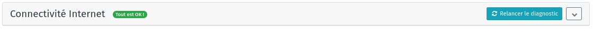  

La prise en compte du lien `/etc/resolv.conf` sur `/run/resolvconf/resolv.conf` n'a été effective que depuis le 23/07/2022.  
Aucune explication dons à surveiller !!! 
{: .prompt-info }


#### Cron error debian 11

[Cron error on Debian11 cd / && run-parts --report /etc/cron.hourly](https://superuser.com/questions/1687511/cron-error-on-debian11-cd-run-parts-report-etc-cron-hourly)

1951681242156 remplace RANDOM qui provoque une erreur de syntaxe (fichier `/sbin/run-parts`)

    /sbin/run-parts

```bash
#!/bin/bash

parameters="$@"
ip=$(hostname -i)
#RANDOM=${ip//./}
test -z "${parameters##*/etc/cron.*}" &&
        sleep $((1951681242156 % 3600))

exec /bin/run-parts "$@"
```

### Ajouter des domaines

#### yanfi.net

Ajout domaine yanfi.net en utilisant l'administration web

    yunohost domain add yanfi.net

Lecture configuration dns pour modifier DNS OVH

    yunohost domain dns-conf yanfi.net

Ajout certificats 

    yunohost domain cert-install yanfi.net --no-checks

#### cinay.eu

Ajout domaine cinay.eu en utilisant l'administration web

Lecture configuration dns pour modifier DNS OVH

    yunohost domain dns-conf cinay.eu

Ajout certificats 

    yunohost domain cert-install cinay.eu --no-checks

Tous les messages du type <*@cinay.eu> sont redirigés vers l'adresse <yann@xoyaz.xyz>
{: .prompt-info }

### Historique de la ligne de commande

Ajoutez la recherche d’historique de la ligne de commande au terminal  
Se connecter en utilisateur debian  
Tapez un début de commande précédent, puis utilisez shift + up (flèche haut) pour rechercher l’historique filtré avec le début de la commande.

```bash
# Global, tout utilisateur
echo '"\e[1;2A": history-search-backward' | sudo tee -a /etc/inputrc
echo '"\e[1;2B": history-search-forward' | sudo tee -a /etc/inputrc
```

### nginx "modern"

Par défaut , on est au niveau "intermédiaire" et on va passer en "moderne"

```shell
# par défaut
sudo yunohost settings get security.nginx.compatibility

intermediate
# basculer en moderne
sudo yunohost settings set security.nginx.compatibility -v modern

Success! Configuration updated for 'nginx'
```

## Sauvegardes 


Au choix, boîte de stockage ou vps debian server

1. [BorgBackup Yunohost --> Boîte de stockage](/posts/BorgBackup_Yunohost-Boite_de_stockage/)  
Dépôt borg : `ssh://u277865@u277865.your-storagebox.de:23/./backup/borg/xoyaz_xyz`
2. BorgBackup Yunohost -->  ouestyan.fr (HMS serveur 32771 debian bullseye)  
Dépôt borg : `ssh://borg@ouestyan.fr:55178/srv/data/borg-backups/xoyaz_xyz`

### Borg Backup sur boîte stockage

Installer l'application **Borg Backup**  avec l'administration web  
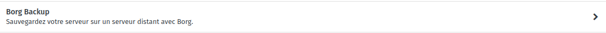{:width="600"}  

borg est installé paramétrage pour la boîte de stockage  
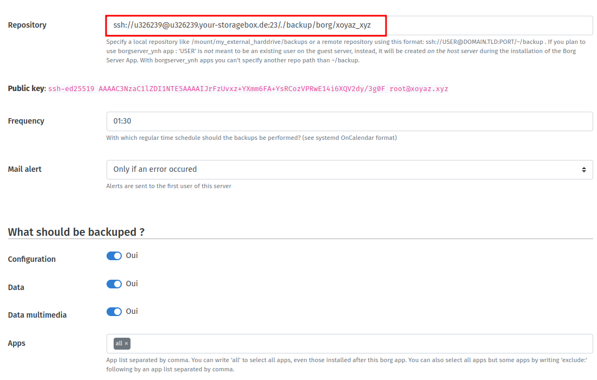{:width="600"}  
Dépôt : `ssh://u326239@u326239.your-storagebox.de:23/./backup/borg/xoyaz.xyz`

*Ajouter la clé publique `ssh-ed25519 AAAAC3NzaC1lZDI1NTE5AAAAIPuVXP+pUjvedC/htJmKXamAotLESDCRqU0MOoD7vqCA root@422x.l.time4vps.cloud` au fichier **authorized_keys** de la boîte de stockage depuis un poste ayant accès à la boîte de stockage*


Gestion par administration web  
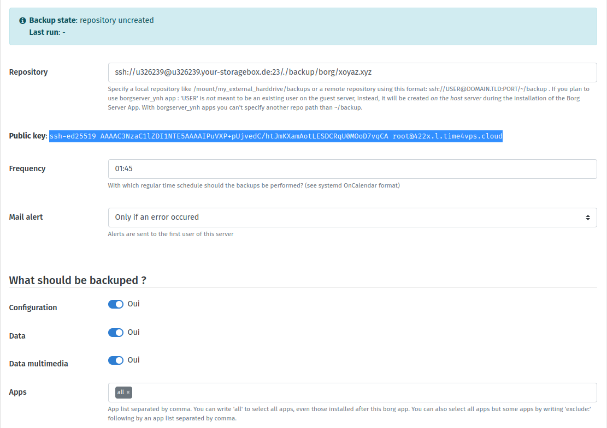

**Si on utilise un serveur VPS**  
Clé publique à ajouter au fichier `/srv/data/borg-backups/.ssh/authorized_keys` du serveur ouestyan.fr (VPS HostMyServer)

    ssh-ed25519 AAAAC3NzaC1lZDI1NTE5AAAAIPuVXP+pUjvedC/htJmKXamAotLESDCRqU0MOoD7vqCA root@422x.l.time4vps.cloud

#### Tester la configuration borg

À cette étape, votre sauvegarde devrait se dérouler à l'heure prévue (tous les jours à 2h20). Notez que la première sauvegarde peut être très longue, car de nombreuses données doivent être copiées via ssh. Les sauvegardes suivantes sont incrémentielles : seules les données nouvellement générées depuis la dernière sauvegarde seront copiées.
{: .prompt-info }


Si vous voulez tester la configuration correcte de Borg Apps avant l'heure prévue, vous pouvez lancer une sauvegarde manuellement sur le serveur Yunohost xoyaz.xyz :

On passe en tmux

```bash
# Instance 1
sudo -s
tmux
systemctl start borg
# Ctrl b d pour sortir de la session tmux
```

Visualiser les logs en cours

    journalctl -f -u borg

A la fin de la sauvegarde borg  
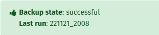

#### Lister les sauvegardes

Commande à exécuter en mode su

    sudo -s
    app=borg; BORG_PASSPHRASE="$(yunohost app setting $app passphrase)" BORG_RSH="ssh -i /root/.ssh/id_${app}_ed25519 -oStrictHostKeyChecking=yes " borg list "$(yunohost app setting $app repository)"

Exemple pour le 23 juillet 2022

```
_auto_conf-2022-07-23_02:20          Sat, 2022-07-23 02:20:17 [eed9d4c60a9b79e32938bad01a91ae539a3f38727b542721e8ef18d4b86b26c9]
_auto_data-2022-07-23_02:20          Sat, 2022-07-23 02:20:50 [9ef65e1274d17244cb623f9f887ccf2f5950c02e3b7a434c4ed167cb7aa300e7]
_auto_borg-2022-07-23_02:21          Sat, 2022-07-23 02:21:06 [6975d92fd0c0a96935781d52a7dbf2be438ca99b6e27cbca31763eb5a065eaaa]
_auto_calibreweb-2022-07-23_02:21    Sat, 2022-07-23 02:21:38 [0a9eecb5f0d19e2b7abe1877a169222839cca945c3b31a5f56a474bf3b791f7d]
_auto_gitea-2022-07-23_02:21         Sat, 2022-07-23 02:22:01 [92b35c0bc96ab7b963aedb20c730df6ff8566c1293058839024564a79ce84805]
_auto_my_webapp-2022-07-23_02:22     Sat, 2022-07-23 02:22:16 [bd233f946d2f683554b538a175e9d44733ce71d8420d6631283ae982e270194d]
_auto_my_webapp__2-2022-07-23_02:22  Sat, 2022-07-23 02:22:37 [ca54294f79460c4bcdc974741e7c7f574949fc0301ad651635f4bd6224aa1d7f]
_auto_navidrome-2022-07-23_02:22     Sat, 2022-07-23 02:22:51 [e8340fc57c707325defc0fd44ca69a9cb39244ef48a99b92972010aaf30390b3]
_auto_nextcloud-2022-07-23_02:24     Sat, 2022-07-23 02:24:04 [6ad06028790a07e3e5de950ae1e9b6d89664a9c0705e9d4ff1f52160595bd936]
_auto_searx-2022-07-23_02:24         Sat, 2022-07-23 02:24:46 [fd1d833487bcc8c38b1b343381184dad36f3ee19cf860dc1df97a8fbd92fc135]
_auto_shaarli-2022-07-23_02:25       Sat, 2022-07-23 02:25:42 [03b93cfb4610f4f5f958f2e31d499ae19475046c569b41a37d184a899569c9a3]
_auto_snappymail-2022-07-23_02:25    Sat, 2022-07-23 02:25:59 [216eef7cf9587d449728fffd726c8d88ba4c5337c36c53eb83b4d6bd733395c9]
_auto_transmission-2022-07-23_02:26  Sat, 2022-07-23 02:26:32 [a8506771e63a1172e3997b1e0ca2636628fed421804289f931d0dc3653ebb696]
_auto_ttrss-2022-07-23_02:26         Sat, 2022-07-23 02:26:51 [0f7357cd55b11cf141eb136596acca471cc9703b153b98e32b616f5c2ac69f4e]
```

### Restaurer une application sauvegardée par borg

*Exemple de restauration d'une application yunohost "shaarli"*

Si l'application est installée, il faut obligatoirement la désinstaller

    sudo yunohost app remove shaarli

Lister les sauvegardes sur la boîte de stockage

```shell
# Toutes les sauvegardes
app=borg; BORG_PASSPHRASE="$(yunohost app setting $app passphrase)" BORG_RSH="ssh -i /root/.ssh/id_${app}_ed25519 -oStrictHostKeyChecking=yes " \
borg list --short "$(yunohost app setting $app repository)"

# les sauvegardes du jour
app=borg; BORG_PASSPHRASE="$(yunohost app setting $app passphrase)" BORG_RSH="ssh -i /root/.ssh/id_${app}_ed25519 -oStrictHostKeyChecking=yes " \
borg list --short "$(yunohost app setting $app repository)" | grep $(date +"%Y-%m-%d")
```

Après avoir relevé le nom de la sauvegarde `_auto_shaarli-2022-12-19_01:50`, il faut télécharger le fichier `.tar.gz` correspondant dans le dossier local `/home/yunohost.backup/archives/`

```shell
app=borg; BORG_PASSPHRASE="$(yunohost app setting $app passphrase)" BORG_RSH="ssh -i /root/.ssh/id_${app}_ed25519 -oStrictHostKeyChecking=yes " \
borg export-tar "$(yunohost app setting $app repository)::_auto_shaarli-2022-12-19_01:50" /home/yunohost.backup/archives/_auto_shaarli-2022-12-19_01:50.tar.gz
```

Puis lancer la commande de restauration et patienter  

    yunohost backup restore _auto_shaarli-2022-12-19_01:50.tar.gz

## Applications 

### Mises à jour automatique

*Unattended_upgrades est un outil qui permet de télécharger et installer les mises à jour de sécurité automatiquement et sans surveillance, en prenant soin de n'installer que les paquets provenant de la source APT configurée, et en vérifiant les invites dpkg concernant les modifications du fichier de configuration. Apticron est un simple script qui envoie des courriels sur les mises à jour de paquets en attente comme les mises à jour de sécurité, en gérant correctement les paquets en attente.*

Installation

  


### Nextcloud

{:width="70"}

**cloud.xoyaz.xyz**

Ajout domaine cloud.xoyaz.xyz en utilisant l'administration web

    sudo yunohost domain add cloud.xoyaz.xyz

Ajout certificats 

    sudo yunohost domain cert-install cloud.xoyaz.xyz --no-checks

Mise à niveau nextcloud hub 3 (version 25) le 21 Octobre 2022 

    sudo yunohost app upgrade nextcloud -u https://github.com/YunoHost-Apps/nextcloud_ynh/tree/testing --debug

#### Paramétrage Nextcloud v25+

*Nextcloud de base v25+ est installé*

On se connecte en administrateur sur nextcloud   
Cliquer sur l'icône utilisateur en haut à droite de l'écran et sur **Paramètres d'administration**  
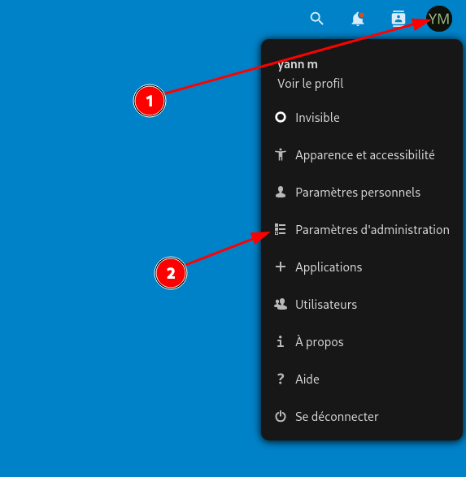{:width="300"}  
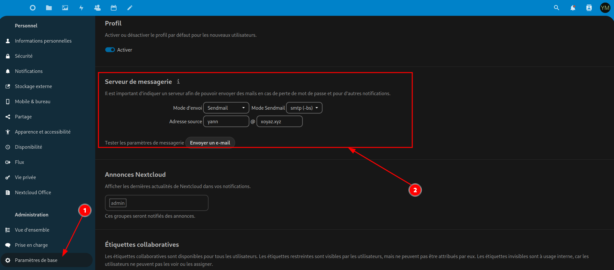  

Une vérification est faite sur **Vue d'ensemble**  dans la rubrique **Administration**  
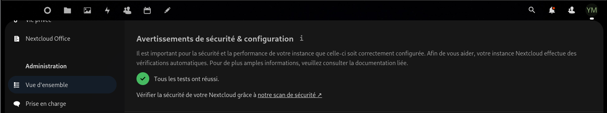  

clic sur **Apparence et accessibilité**  dans la rubrique **Personnel**  
Sélectionner **Thème sombre**   
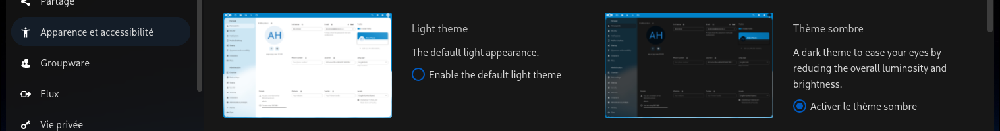  

Arrière-plan  
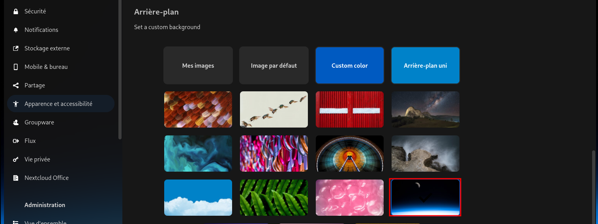  

#### Nextcloud calendrier et contacts

Cliquer sur l'icône utilisateur en haut à droite de l'écran et sur **+ Applications**  
On active les applications **Calendar** et **Contacts**


#### Collabora Online (INACTIF)

{:width="70"}

*Collabora est une suite bureautique en ligne basée sur LibreOffice et utilisable avec Nextcloud ou ownCloud. Elle permet d'éditer des documents textes, des tableaux, des diaporamas. L'édition en ligne peut se faire en simultanée et permet d'exporter et d'imprimer des documents grâce au format PDF généré.*

- Affichez et modifiez des documents texte, des feuilles de calcul, des présentations, etc.
- Fonctionnalités d'édition collaborative
- Fonctionne dans n'importe quel navigateur moderne - aucun plugin nécessaire
- Conservation de la mise en page et de la mise en forme des documents
- documents texte (odt, docx, doc…)
- des tableurs (ods, xlsx, xls…)
- présentations (odp, pptx, ppt…)


Ajout domaine **bora.xoyaz.xyz** en utilisant l'administration web  
Ajout certificats  

    sudo yunohost domain cert-install bora.xoyaz.xyz --no-checks

Installation application "Collabora Online" via l'administration web
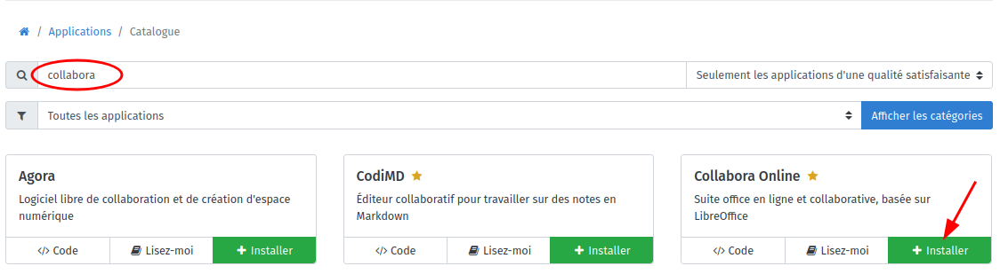  
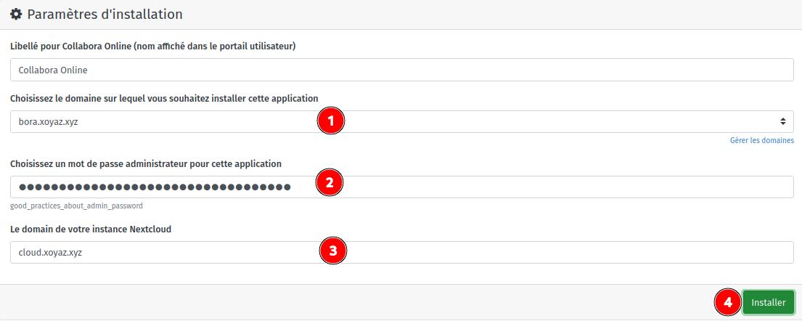  

Domaine : bora.xoyaz.xyz  
Mot de passe admin :xxxxxx  
Domaine nextcloud: cloud.xoyaz.xyz  

Pour une connexion à Nextcloud, activer l'application **Nextcloud Office** dans Nextcloud et configurer avec le domaine de votre installation Collabora.  
Activer **Nextcloud Office** ,clic sur l'icône utilisateur en haut à droite de l'écran , **+ Applications** et **Pack d'applications**   
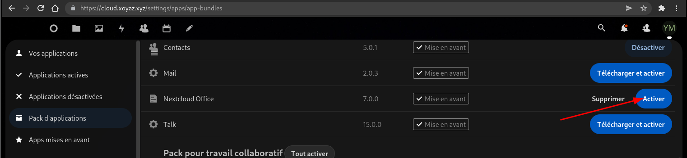  

Cliquer sur l'icône utilisateur en haut à droite de l'écran et sur **Administration settings**  
puis sur **Nextcloud Office** dans la rubrique **Administration**  
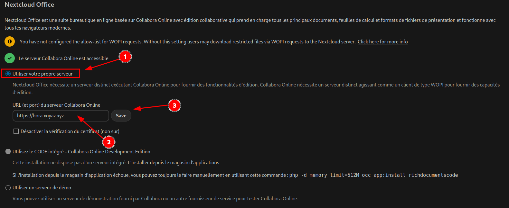  
Le serveur **Collabora Online** est accessible à l'adresse <https://bora.xoyaz.xyz>

La liste d'autorisation pour les demandes WOPI n'est pas configurée  
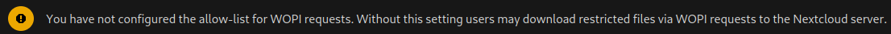  

Relever les adresses ipv4 et ipv6 du serveur bora.xoyaz.xyz   
`195.181.242.156/32, 195.181.242.156/32, 2a02:7b40:c3b5:f29c::1/128`

les ajouter à **Allow list for WOPI requests**  de **Paramètres avancés**  
  

Il existe plusieurs applications **Collabora Online**. Assurez-vous de `ne pas installer les applications "Collabora Online - Built-in CODE server"`{: .prompt-warning }, qui sont une version allégée de ce package Collabora.

Exemple ouverture d'un fichier  docx avec collabora sur nextcloud  
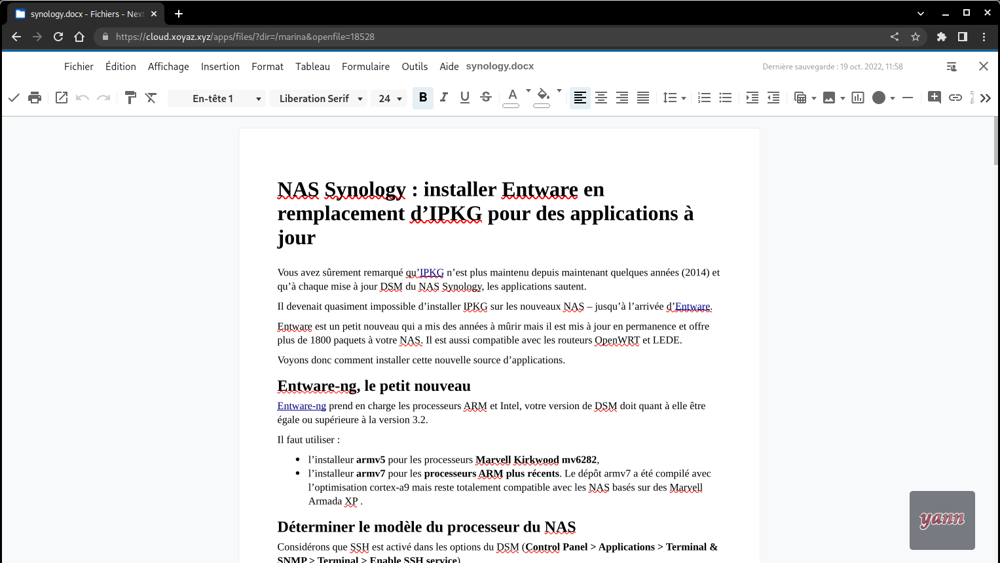

### OnlyOffice

{:height="100"}  
*installer OnlyOffice rapidement et simplement sur un serveur YunoHost*  
[OnlyOffice YunoHost, Nextcloud et Archlinux](/posts/OnlyOffice_pour_YunoHost/)

### FreshRSS (INACTIF)

#### Créer domaine rss.xoyaz.xyz

par l'administration web

{:height="50px"}  

#### Installation par administration web  

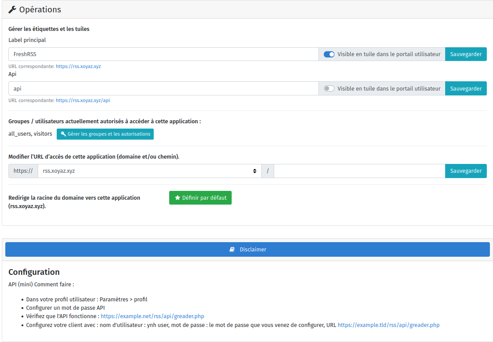

#### Paramétrage API

Il faut mettre un mot depasse API qui peut être identique à un utilisateur  
Tester par le lien <https://rss.xoyaz.xyz/api/>  
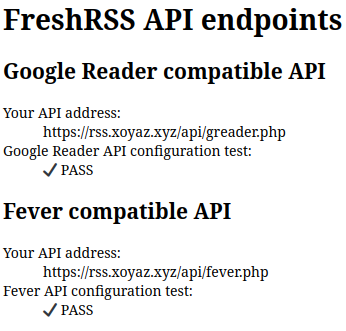

#### Application android EasyRSS

Dans l'application, 3 paramétres

1. URL : https://rss.xoyaz.xyz/api/greader.php  
2. Utilisateur
3. Mot de passe API

### Tiny Tiny RSS 

{:width="50px"}  

#### Domaine rss.xoyaz.xyz

Ajout domaine et certificats rss.xoyaz.xyz

    yunohost domain add rss.xoyaz.xyz
    yunohost domain cert install rss.xoyaz.xyz --no-checks

```
[...]
Success! Configuration updated for 'nginx'
Success! Let's Encrypt certificate now installed for the domain 'rss.xoyaz.xyz'
```

Paramétrage en mode administration web, emails sortants et entrants à Non   
  


#### Installer Tiny Tiny RSS

A-Installation en ligne de commande

    sudo yunohost app install https://github.com/YunoHost-Apps/ttrss_ynh/tree/testing

```
Choose the domain where this app should be installed [xoyaz.xyz | rss.xoyaz.xyz]: rss.xoyaz.xyz
Choose the URL path (after the domain) where this app should be installed: /
Should this app be exposed to anonymous visitors? [yes | no]: yes
[...]
Success! Installation completed
```

B-Installation via admin web  
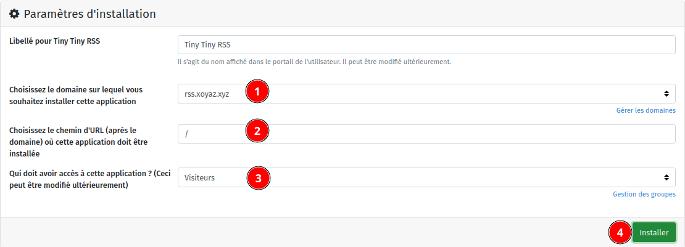  
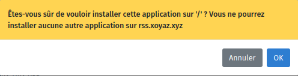  
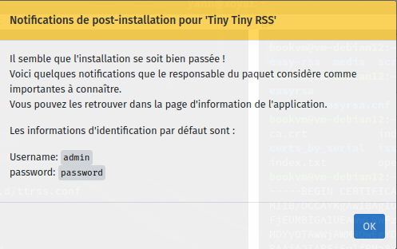  

#### Authentification par certificat client

{:width="80px"}  

[Comment mettre en place et configurer une autorité de certification (AC) avec Easy-RSA](/posts/Mettre_en_place_et_configurer_une_autorite_de_certification_AC_avec_Easy-RSA/)  

Autorité de certification yako /usr/local/share/ca-certificates/ac-yako.crt  , mise à jour par `update-ca-certificates`

Les certificats sous `/etc/ssl/certs/`

```
lrwxrwxrwx 1 root root     44 Jul 12 12:03  ac-yako.pem -> /usr/local/share/ca-certificates/ac-yako.crt
lrwxrwxrwx 1 root root     11 Jul 12 12:03  b93a0109.0 -> ac-yako.pem
```

Le certificat client  suffixe **pfx** sera importé dans firefox et chrome  

Exemple avec yannick.pfx (Le mot de passe pour l'importation est exigé)  
   
   

[Tiny Tiny RSS (ttrss) authentification par certificat client](/posts/Tiny-Tiny-RSS_ttrss/#authentification-par-certificat-client)

### Sites static, cartes, diceware

#### Création domaine static.xoyaz.xyz

1. Ouvrir yunohost en mode administrateur
2. Créer le domaine static.xoyaz.xyz
3. Emails Entrants/Sortants à Non
4. Certificat Let's Encrypt  
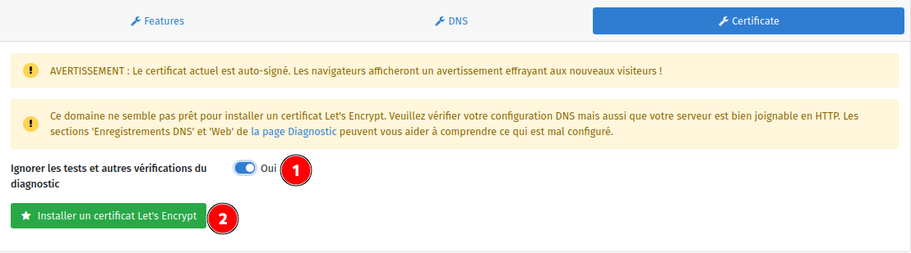  
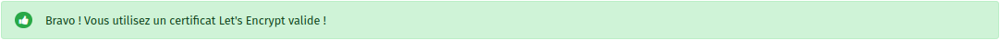  


#### My WebApp

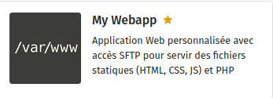  

Interface administrateur: Applications &rarr; Catalogue :My Webapp  
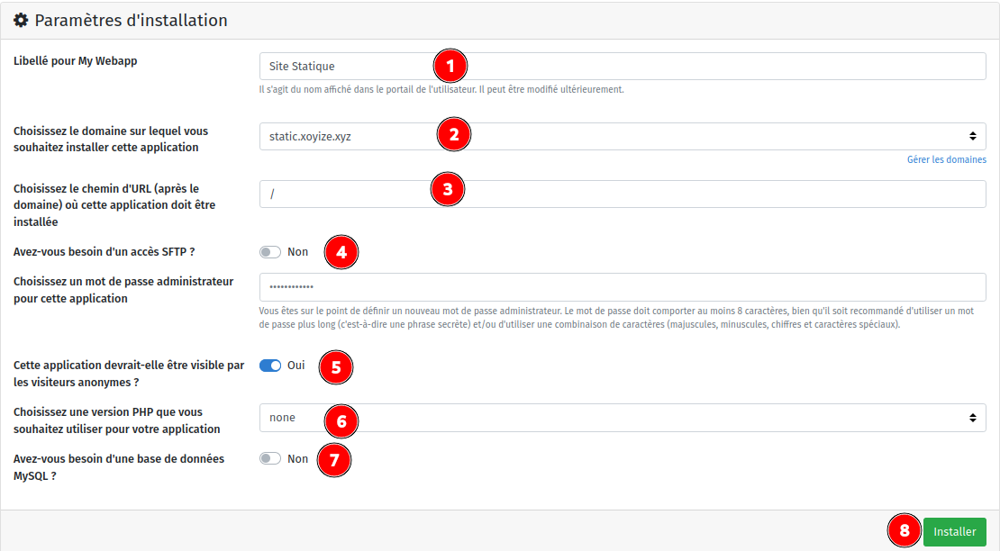  
REMPLACER static.xoyize.xyz PAR static.xoyaz.xyz

{:width="400"}  

Vérifications  
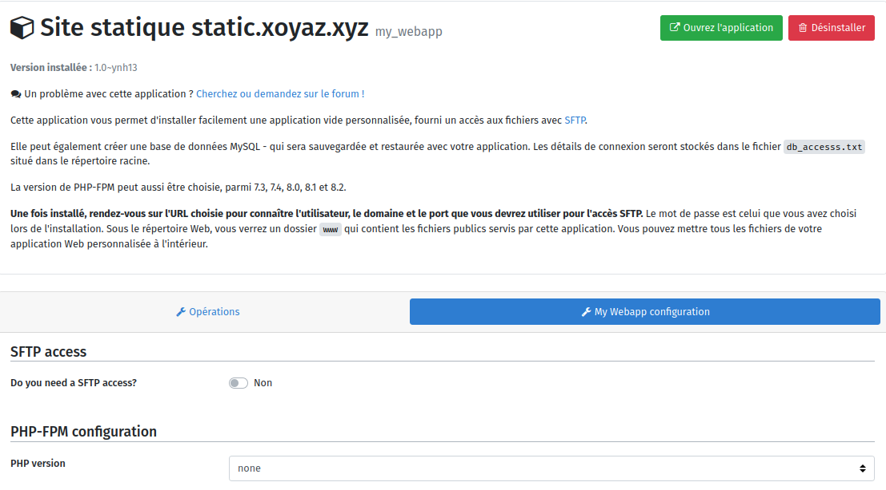  
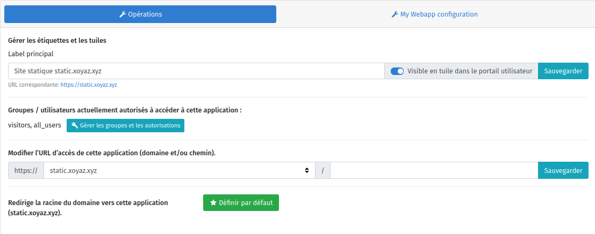  

Le dossier **/home/yunohost.multimedia/share/Divers/static/** contient le site statique qui est issu d'une synchronisation d'un conteneur debian sur un ordinateur archlinux avec jekyll comme générateur

En admin su 

```bash
rm -rf /var/www/my_webapp/www/  # supprimer dossier www web par défaut 
ln -s /home/yunohost.multimedia/share/Divers/static /var/www/my_webapp/www  # lien my_webapp

ln -s /home/yunohost.multimedia/share/Divers/diceware /var/www/my_webapp/www/diceware
ln -s /home/yunohost.multimedia/share/Divers/osm-new /var/www/my_webapp/www/cartes
ln -s /home/yunohost.multimedia/share/Divers/vps /var/www/my_webapp/www/extra

```

Visiter les liens:   
<https://static.xoyaz.xyz>  
<https://static.xoyaz.xyz/cartes>  
<https://static.xoyaz.xyz/diceware>  
<https://static.xoyaz.xyz/extra>  

### Gitea gitea.xoyaz.xyz

[{:width="70"}](https://github.com/YunoHost-Apps/gitea_ynh)

Ajout domaine et certificats gitea.xoyaz.xyz

    sudo yunohost domain add gitea.xoyaz.xyz
    sudo yunohost domain cert-install gitea.xoyaz.xyz --no-checks

Paramétrage en mode administration web, emails sortants et entrants à Non   
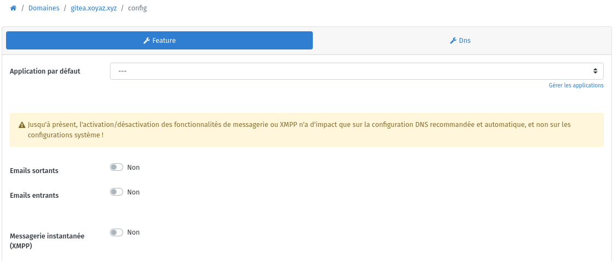  

Installation à partir de github

    sudo yunohost app install -l gitea https://github.com/YunoHost-Apps/gitea_ynh

```
Choose the domain where this app should be installed [xoyaz.xyz | gitea.xoyaz.xyz | rss.xoyaz.xyz | searx.x
oyaz.xyz | static.xoyaz.xyz]: gitea.xoyaz.xyz
Choose the URL path (after the domain) where this app should be installed: /
Choose an administrator user for this app [yann]: yann
Should this app be exposed to anonymous visitors? [yes | no]: yes
```

Paramétrage gitea  
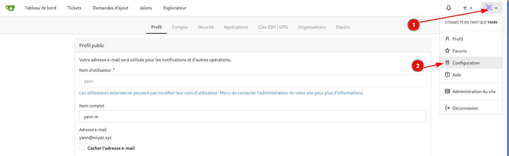  

Modifier le paramétrage  
**Compte**  
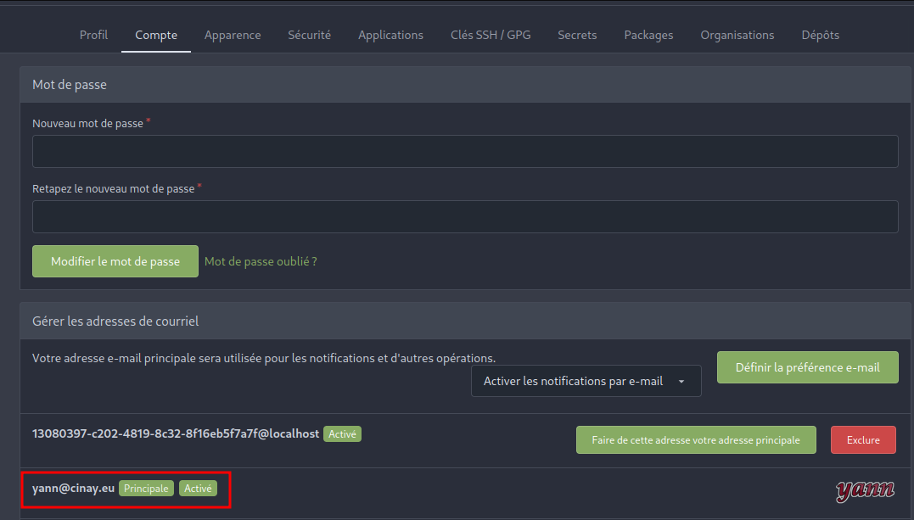  
**Profil public**, mise à jour avatar  
  

### SnappyMail webmail.xoyaz.xyz

{:height="80"}  
*Client de messagerie Web simple, moderne, léger et rapide. La version radicalement améliorée et sécurisée de RainLoop Webmail Community edition.*

Création domaine webmail.xoyaz.xyz

    sudo yunohost domain add webmail.xoyaz.xyz
    sudo yunohost domain cert-install webmail.xoyaz.xyz --no-checks

Configurer le domaine pour supprimer la gestion des messages entrants et sortants

    yunohost domain config set webmail.xoyaz.xyz -a "mail_in=0&mail_out=0"

```
========================================
>>>> Feature
========================================
Default app [_none | gitea | my_webapp | nextcloud | searx | snappymail | transmission | ttrss]: _none
Warning: So far, enabling/disabling mail or XMPP features only impact the recommended and automatic DNS configuration, not system configurations!
Instant messaging (XMPP) [yes | no]: no

========================================
>>>> Dns
========================================
Info: This domain is a subdomain of xoyaz.xyz. DNS registrar configuration should be managed in webmail.xoyaz.xyz's configuration panel.
Info: Saving the new configuration...
Success! Config updated as expected
```

Vérification

    yunohost domain config get webmail.xoyaz.xyz

```
dns.registrar.registrar: 
  ask: This domain is a subdomain of xoyaz.xyz. DNS registrar configuration should be managed in webmail.xoyaz.xyz's configuration panel.
  value: parent_domain
feature.app.default_app: 
  ask: Default app
  value: _none
feature.mail.features_disclaimer: 
  ask: So far, enabling/disabling mail or XMPP features only impact the recommended and automatic DNS configuration, not system configurations!
feature.mail.mail_in: 
  ask: Incoming emails
  value: no
feature.mail.mail_out: 
  ask: Outgoing emails
  value: no
feature.xmpp.xmpp: 
  ask: Instant messaging (XMPP)
  value: no
```

Installer application snappymail

    sudo yunohost app install https://github.com/YunoHost-Apps/snappymail_ynh

```
Choose the domain where this app should be installed [xoyaz.xyz | gitea.xoyaz.xyz | rss.xoyaz.xyz | searx.xoyaz.xyz | stat
ic.xoyaz.xyz | webmail.xoyaz.xyz]: webmail.xoyaz.xyz
Choose the URL path (after the domain) where this app should be installed: /
Should this app be exposed to anonymous visitors? [yes | no]: yes
```

Le wiki <https://github.com/the-djmaze/snappymail/wiki>

#### Administration

Ouvrez l'interface utilisateur admin <https://webmail.xoyaz.xyz/?admin> pour configurer les paramètres de votre serveur de messagerie. Connectez-vous avec l'utilisateur "admin" et le mot de passe du fichier `/var/www/snappymail/data/_data_/_default_/admin_password.txt`. Si vous avez des problèmes pour appeler l'interface d'administration, essayez en mode privé de votre navigateur. De cette façon, les cookies et autres données en cache des installations précédentes sont ignorés.

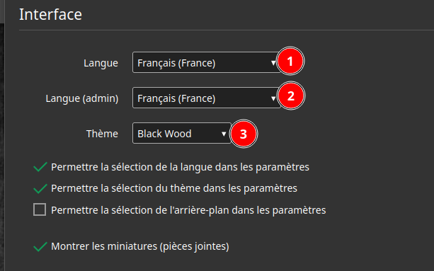

Modifier le mot de passe admin et ajouter une clé dans "TOTP code" si authentification à 2 facteurs   
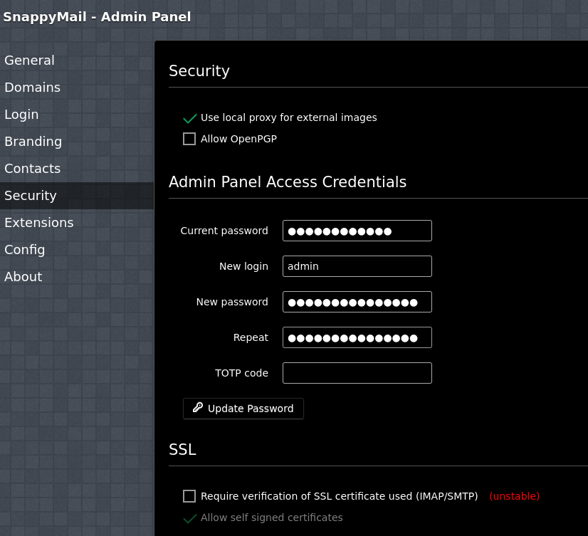  

Ajouter les nouveaux domaines de messagerie si nécessaire

TOTP  
Il faut télécharger l'extension "Two Factor Authentication" qui est dans "Available for installation" et la valider
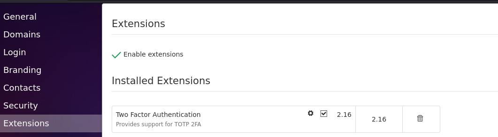  
Puis cliquer sur la roue dentelée  
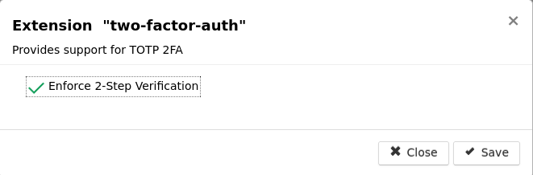{width="400"}  


Se déconnecter du mode admin  

Ouvrir en mode utilisateur <https://webmail.xoyaz.xyz>  
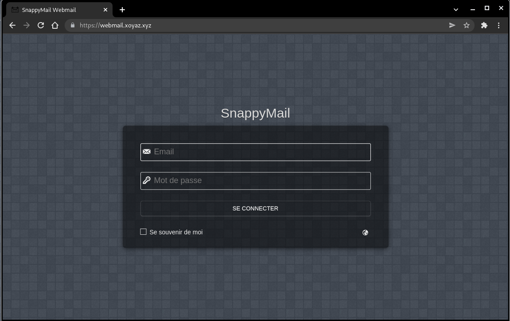  
Saisir adresse messagerie et mot de passe  

#### Ajout comptes de messagerie

Ajouter un compte de messagerie  
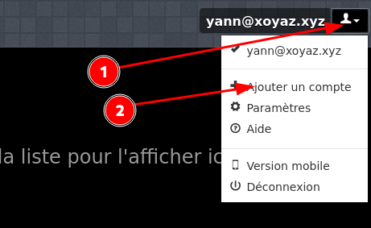{width="400"}  
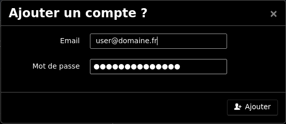{width="400"}  

Tous les comptes de messagerie sont accessibles par une adresse et mot de passe plus un second facteur d'authentification de type TOTP.
{: .prompt-info }

### Shaarli (INACTIF)

{:width="70"}

Installation

    yunohost app install https://github.com/YunoHost-Apps/shaarli_ynh/tree/testing

```
e the integrity and security of your system. You should probably NOT install it unless you know w
hat you are doing. NO SUPPORT will be provided if this app doesn't work or breaks your system... 
If you are willing to take that risk anyway, type 'Yes, I understand': Yes, I understand
Choose the domain where this app should be installed [xoyaz.xyz | gitea.xoyaz.xyz | rss.xoyaz.xyz
 | searx.xoyaz.xyz | static.xoyaz.xyz | webmail.xoyaz.xyz]: xoyaz.xyz
Choose the URL path (after the domain) where this app should be installed: /shaarli
Choose an administrator user for this app [yann]: yann
Choose an administration password for this app: **************************
Choose a title for your Shaarli instance: Shaarli
Should this app be exposed to anonymous visitors? [yes | no]: yes
Info: Installing shaarli...

Success! Installation completed
```

Accès <https://xoyaz.xyz/shaarli>

### Calibre web (INACTIF) 

 

En mode su

Source : https://github.com/janeczku/calibre-web  
Caractéristiques

* Interface HTML5 Bootstrap 3
* configuration graphique complète
* Gestion des utilisateurs avec des permissions par utilisateur à grain fin
* Interface administrateur
* Interface utilisateur en brésilien, tchèque, néerlandais, anglais, finnois, français, allemand, grec, hongrois, italien, japonais, khmer, polonais, russe, chinois simplifié, espagnol, suédois, turc, ukrainien.
* Flux OPDS pour les applications de lecture de livres électroniques
* Filtrez et recherchez par titres, auteurs, tags, séries et langues.
* Créer une collection de livres personnalisée (étagères)
* Prise en charge de l'édition des métadonnées des livres électroniques et de la suppression des livres électroniques de la bibliothèque Calibre.
* Prise en charge de la conversion des eBooks par les binaires Calibre
* Restriction du téléchargement des livres électroniques aux utilisateurs connectés
* Support pour l'enregistrement public des utilisateurs
* Envoi d'eBooks vers des appareils Kindle d'un simple clic de souris
* Synchronisation de vos appareils Kobo avec votre bibliothèque Calibre via Calibre-Web
* Prise en charge de la lecture des eBooks directement dans le navigateur (.txt, .epub, .pdf, .cbr, .cbt, .cbz, .djvu)
* Téléchargement de nouveaux livres dans de nombreux formats, y compris les formats audio (.mp3, .m4a, .m4b)
* Prise en charge des colonnes personnalisées de Calibre
* Possibilité de masquer le contenu en fonction des catégories et du contenu des colonnes personnalisées par utilisateur.
* Possibilité de mise à jour automatique
* Connexion "Magic Link" pour faciliter la connexion aux eReaders
* Connexion via LDAP, google/github oauth et via l'authentification proxy.


Ajout domaine et certificats ebook.xoyaz.xyz

    yunohost domain add ebook.xoyaz.xyz
    yunohost domain cert-install ebook.xoyaz.xyz --no-checks

Configurer le domaine pour supprimer la gestion des messages entrants et sortants

    yunohost domain config set ebook.xoyaz.xyz -a "mail_in=0&mail_out=0"


Installer l'application **Calibre-web** par l'administration web

  
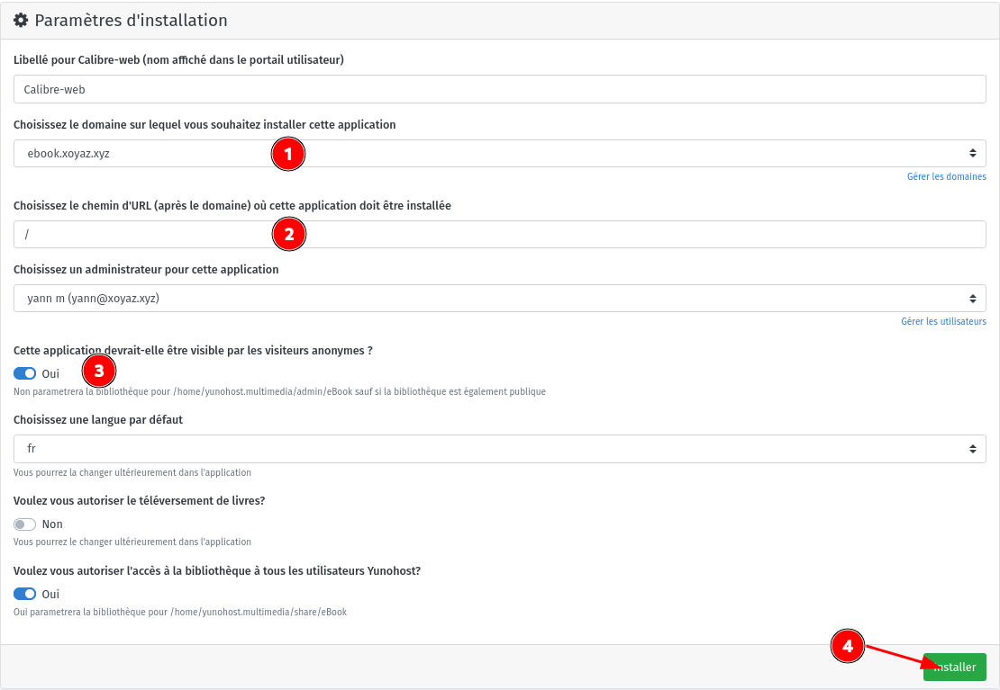  

Par défaut, le processus de sauvegarde de Yunohost sauvegarde la bibliothèque Calibreweb. Vous pouvez désactiver la sauvegarde de la bibliothèque avec

    yunohost app setting calibreweb do_not_backup_data -v 1

>Par défaut, la suppression de l'application ne supprimera jamais la bibliothèque.

La bibliothèque existait avant l'installation de Calibreweb,  
**Le dossier des livres** : `/home/yunohost.multimedia/share/eBook/BiblioCalibre/`

Ouverture du lien https://ebook.xoyaz.xyz  
  

  
Rafraîchir poour afficher la liste importée des utilisateurs LDAP  

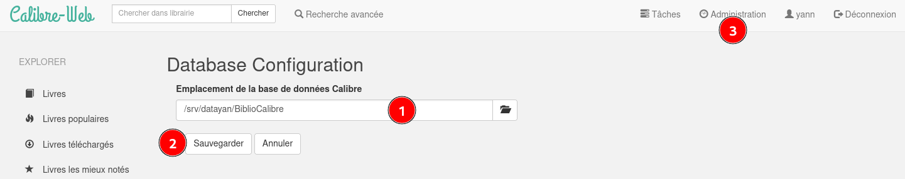 
Le dossier des livres `/home/yunohost.multimedia/share/eBook/BiblioCalibre`  

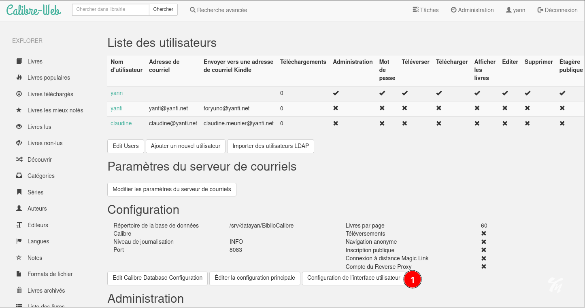  

  
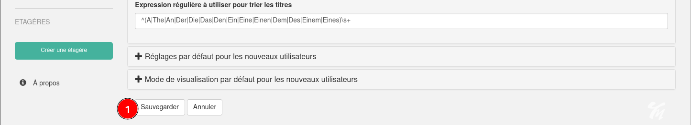  

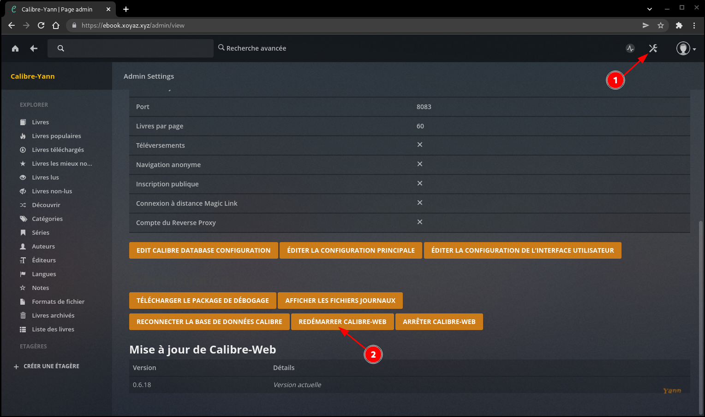  

**Lier le champ "lu" avec calibre-web**

Se connecter en administrateur sur calibre-web  
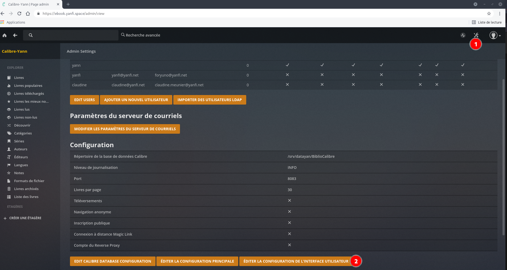  

Configuration de l'interface utilisateur &rarr; Configuration du mode d'affichage  
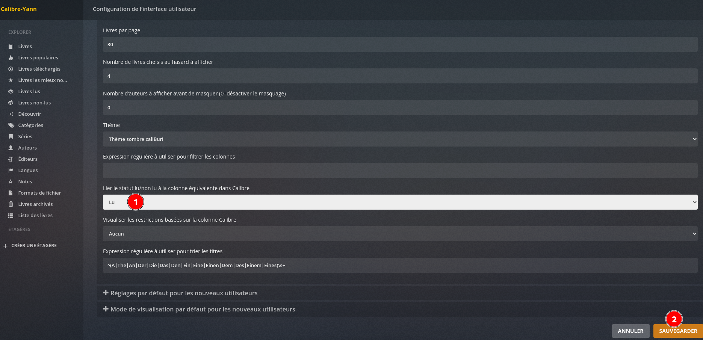    

Les livres lus sont cochés 

**Modifications pour un accès en lecture écriture du dossier** 

Ajouter l'utilisateur admin au groupe calibreweb pour les droits lecture/écriture

    sudo gpasswd -a admin calibreweb

Modifier le chemin de la base et des données Calibre :   

* /home/yunohost.multimedia/share/eBook/BiblioCalibre
* /home/yunohost.multimedia/share/eBook/CalibreTechnique

Droits **calibreweb.calibreweb** sur le dossier `/home/yunohost.multimedia/share/eBook`

### Audio Navidrome (INACTIF)

#### Domaine zic.xoyaz.xyz

Se connecter an administrateur web

Ajout domaine zic.xoyaz.xyz et certificats 

Avant installation Navidrome désactiver le montage SSHFS du dossier musique

    sudo systemctl stop home-yunohost.multimedia-share-Music-musicyan.mount
    
Installer application Navidrome   
Domaine : zic.xoyaz.xyz
Chemin : /  
Langue : fr  

Après installation, aller dans Applications Navidrome  

Modifier le répertoire de la musique et ajouter le dossier des "playlists" dans le fichier `/var/lib/navidrome/navidrome.toml`  

```
# Folder to store application data (DB, cache…)
DataFolder = "/var/lib/navidrome"

# Folder where your music library is stored. Can be read-only
MusicFolder = "/home/yunohost.multimedia/share/Music/musicyan"

# Playlist
ND_PLAYLISTSPATH = "/home/yunohost.multimedia/share/Music/musicyan/Playlists"
```

Faire une sauvegarde après modification

    sudo cp /var/lib/navidrome/navidrome.toml /var/lib/navidrome/navidrome.toml.sav

Lancer le montage SSHFS du dossier musique

    sudo systemctl start home-yunohost.multimedia-share-Music-musicyan.mount
    
Redémarrer navidrome

    sudo systemctl restart navidrome

Ouvrir le lien <https://zic.xoyaz.xyz/> et saisir un identifiant + mot de passe pour le compte administrateur  

## Maintenance

### PHP cli alternative

Pour changer la version PHP cli par défaut

    sudo update-alternatives --config php

```
There are 2 choices for the alternative php (providing /usr/bin/php).

  Selection    Path             Priority   Status
------------------------------------------------------------
  0            /usr/bin/php8.0   80        auto mode
  1            /usr/bin/php7.4   74        manual mode
* 2            /usr/bin/php8.0   80        manual mode

Press <enter> to keep the current choice[*], or type selection number: 
```

### SSHFS

*Le système SSHFS est un système de fichiers client, basé sur l’utilitaire FUSE, permettant de monter des répertoires distants, au travers d’une connexion SSH. Ce mécanisme utilise le protocole SFTP qui est un sous-système de SSH et est activé, par défaut, sur la plupart des serveurs ssh.*

On se connecte avec l'utilisateur administrateur **yann**

Installation

    sudo apt install sshfs

Générer une paire de clé curve25519-sha256 (ECDH avec Curve25519 et SHA2) pour une liaison SSH avec le serveur CONTABO yunohost xoyize.xyz

    ssh-keygen -t ed25519 -o -a 100 -f ~/.ssh/contabo-xoyize

Ajouter le contenu de la clé publique au fichier `~/.ssh/authorized_keys` de l'utilisateur administrateur **yako** du serveur CONTABO yunohost xoyize.xyz

    echo "ssh-ed25519 AAAAC3NzaC1lZDI1NTE5AAAAIEN5pnqRgNghF5rq8o94FgImL8af2+EkwF7d7M72Hwdu yann@xoyaz.xyz" >> .ssh/authorized_keys

#### Partage musique

*Monter des systèmes de fichiers distants à l'aide de sshfs et systemd*

Partager le dossier `musicyan` du vps distant CONTABO xoyize.xyz avec le dossier `/home/yunohost.multimedia/share/Music/musicyan` du vps xoyaz.xyz

* Le dossier qui va être partagé sur le vps xoyize.xyz : `/home/yunohost.multimedia/share/Music/musicyan/`
* Le point de montage du partage sur le vps xoyaz.xyz : `/home/yunohost.multimedia/share/Music/musicyan`

Création et droits du dossier sur xoyaz.xyz

```bash
sudo mkdir /home/yunohost.multimedia/share/Music/musicyan
sudo chown 1000:users /home/yunohost.multimedia/share/Music/musicyan
```

Le fichier systemd `.mount` doit contenir le nom du point de montage, les barres obliques étant remplacées par des “moins”.

    /home/yunohost.multimedia/share/Music/musicyan --> home-yunohost.multimedia-share-Music-musicyan

Le dossier pour les fichiers unitaires personnalisés de systemd est `/etc/systemd/system`.

    sudo nano /etc/systemd/system/home-yunohost.multimedia-share-Music-musicyan.mount

```
[Unit]
 Description=Mount remote fs with sshfs

[Install]
 WantedBy=multi-user.target

[Mount]
 What=yako@109.123.254.249:/home/yunohost.multimedia/share/Music/musicyan/
 Where=/home/yunohost.multimedia/share/Music/musicyan
 Type=fuse.sshfs
 Options=_netdev,allow_other,IdentityFile=/home/yann/.ssh/contabo-xoyize,port=55249

[Install]
  WantedBy=multi-user.target
```

Exécution service

    sudo systemctl daemon-reload
    sudo systemctl start home-yunohost.multimedia-share-Music-musicyan.mount
    sudo systemctl enable home-yunohost.multimedia-share-Music-musicyan.mount

### Redirect - INACTIF

Cette application permet d'intégrée une tuile personalisée dans le portail utilisateur de YunoHost. Les cas d'usage typiques sont:
- **redirection 301/302 visible** : avoir une tuile d'app "virtuelle" qui se contente de rediriger vers une autre url ou un site externe
- **redirection invisible / reverse-proxy** : créer une tuile pour une application locale écoutant sur un port précis, ou bien un conteneur Docker, ou encore une app hébergée sur une autre machine

En terme technique: cette app se contente de rajouter le morceau de configuration NGINX approprié avec soit `redirect` ou `proxy_pass`, et la tuile YunoHost + configuration SSOwat correspondante.


**Version incluse :** 1.0.0~ynh5

#### Redirection url

Le client sera redirigé vers une autre URL ou site externe

- `votre-domaine.com -> un-autre-domaine.net`
- `votre-domaine.com/foo -> un-autre-domaine.net/bar`

#### Reverse Proxy 

L'adresse du client restera inchangé dans le navigateur. Typiquement utilisé pour intéger dans YunoHost une application installée manuellement.
    
- `you-domain.com/foo -> http://172.0.0.1:8080/app`

**IMPORTANT:** il vous faudra peut-être bricoler manuellement `redirect.conf` dans la configuration nginx, en fonction de vos besoins.

**IMPORTANT:** Certaines apps ne supportent pas d'être redirigées depuis un chemin différent à cause du fonctionnement des liens relatifs ... Cela signifie que par exemple une app hébergée sur `http://127.0.0.1:5050/app/` DOIT être routé sur `http://domaine.tld/app/` et PAS http://domaine.tld/unautrechemin/. Par exemple: un conteneur Docker Odoo tourne sur `http://127.0.0.1:8069/`. Il ne sera pas capable de fonctionné correctement si il est routé sur `http://domaine.tld/odoo/` ! Il faut forcément l'installer à la racine d'un domaine, par exemple `http://odoo.domaine.tld/`

### NetData - INACTIF 

*NetData est un système de surveillance distribuée des performances et de l'état de santé en temps réel. Il fournit un aperçu inégalé, en temps réel, de tout ce qui se passe sur le système qu'il exécute (y compris les applications telles que les serveurs web et de base de données), à l'aide de tableaux de bord web interactifs modernes.*

Installation par administration web  
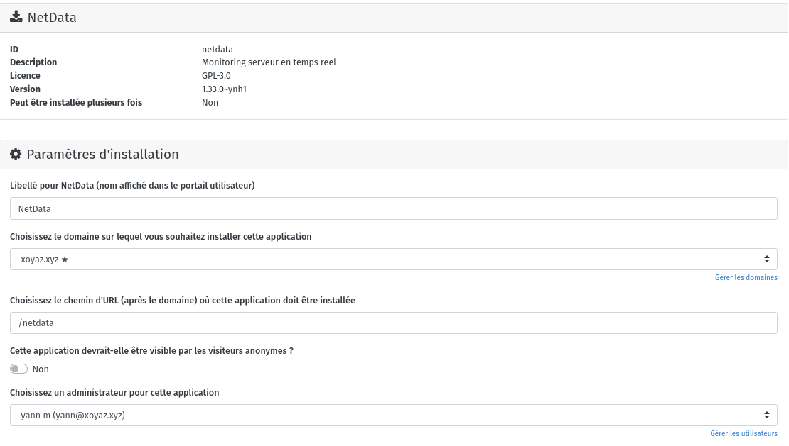 
Cliquer sur **Installer**  

### Le portail des applications externes - INACTIF

Application : "My Webapp"  
Dossier web : `/var/www/my_webapp__2/www/`  
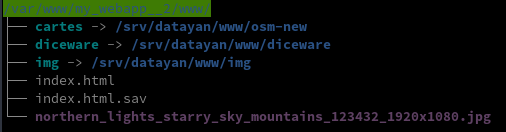{width="400"} 

Fichier index/

``/
<!DOCTYPE/>
/>
<head>
 <meta charset="UTF-8"> 
 <title>Divers</title>
 <meta name="viewport" content="width=device-width, initial-scale=1.0">
<style>
* {
  box-sizing: border-box;
}

.row::after {
  content: "";
  clear: both;
  display: block;
}

[class*="col-"] {
  float: left;
  padding: 15px;
}

html {
  /* une seule image, centrée */
  background: url(northern_lights_starry_sky_mountains_123432_1920x1080.jpg) no-repeat center fixed; 
  -webkit-background-size: cover; /* pour anciens Chrome et Safari */
  background-size: cover; /* version standardisée */
  font-family: "Lucida Sans", sans-serif;
  color: yellow;
}

.header {
  background-color: #9933cc;
  color: #ffffff;
  padding: 15px;
}

.menu ul {
  list-style-type: none;
  margin: 0;
  padding: 0;
}

.menu li {
  padding: 8px;
  margin-bottom: 7px;
  background-color: #33b5e5;
  color: #ffffff;
  box-shadow: 0 1px 3px rgba(0,0,0,0.12), 0 1px 2px rgba(0,0,0,0.24);
}

.menu li:hover {
  background-color: #0099cc;
}

.aside {
  /*background-color: #33b5e5;*/
  padding: 15px;
  color: #ffffff;
  text-align: center;
  font-size: 14px;
  box-shadow: 0 1px 3px rgba(0,0,0,0.12), 0 1px 2px rgba(0,0,0,0.24);
}

.footer {
  background-color: #0099cc;
  color: #ffffff;
  text-align: center;
  font-size: 12px;
  padding: 15px;
}

/* For desktop: */
.col-1 {width: 8.33%;}
.col-2 {width: 16.66%;}
.col-3 {width: 25%;}
.col-4 {width: 33.33%;}
.col-5 {width: 41.66%;}
.col-6 {width: 50%;}
.col-7 {width: 58.33%;}
.col-8 {width: 66.66%;}
.col-9 {width: 75%;}
.col-10 {width: 83.33%;}
.col-11 {width: 91.66%;}
.col-12 {width: 100%;}

@media only screen and (max-width: 768px) {
  /* For mobile phones: */
  [class*="col-"] {
    width: 100%;
  }
}

a:link, a:visited {
  color: white;
  font-weight: bold;
  background-color: transparent;
  text-decoration: none;
}

a:hover, a:focus, a:active {
  text-decoration: none;
  color: #75ff33;
}

img {
  width: 100%;
  height: auto;
}

</style>
</head>
<body>

<div class="header">
  <h1>Applications</h1>
</div>

<div class="row">
  <div class="col-3 menu">
    <ul>
    	   <li><a href="diceware">Diceware - Mots de passe à haute entropie</a></li>
	   <li><a href="cartes">Cartes (Leaflet cartographie).</a></li>
	   <li><a href="https://static.xoyaz.xyz">Site statique (jekyll)</a></li>
	   <li><a href="https://ebook.xoyaz.xyz">Calibre Web - Livres</a></li>
	   <li><a href="https://searx.xoyaz.xyz">Searx - Moteur de recherche</a></li>
	   <li><a href="https://webmail.xoyaz.xyz">Webmail - messagerie web </a></li>
    </ul>
  </div>

  <div class="col-6">
    <h1>Yunohost</h1>
    <p>Dans cette page on affiche les liens des applications qui ne sont pas visibles dans le <a href="https://xoyaz.xyz">portail</a> </p>
  </div>

  <div class="col-3 right">
    <div class="aside">
      
    </div>
  </div>
</div>
<!--
<div class="footer">
  <p>Resize the browser window to see how the content respond to the resizing.</p>
</div>
-->
</body>
</>
```

Lien <https://xoyaz.xyz/div>  
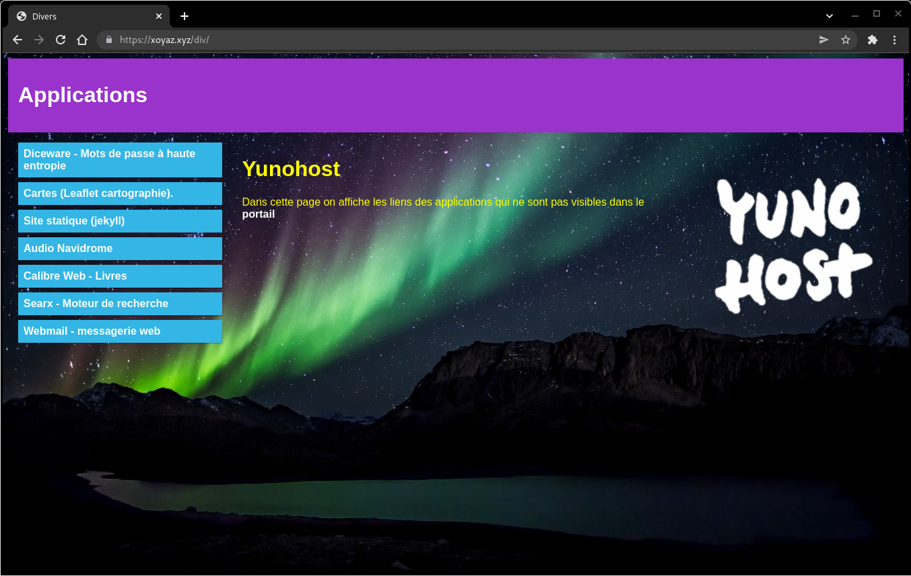 

### Antivirus ClamAV - INACTIF

{:width="150"}  
*L'antivirus clamav a été installé suite à une suspicion d'infection du vps avec risque de blocage par l'autorité de gestion TIME4VPS*

Installation et procédures, voir le lien suivant : [ClamAV antivirus linux](/posts/Linux-Antivirus-ClamAV/)

Les bases antivirales sont mises à jour tous les 6 heures  

    sudo -s

Création du tâche à exécuter en root

    crontab -e

On va scanner à 1h du matin tous les jours le dossier `/home/yunohost.multimedia/share/Divers/static` avec une réserve à 15% sur l'utilisation du CPU  

```bash
# ClamAV antivirus scan avec utilisation CPU de 15% max 
00 01 * * * nice -n 15 clamscan && clamscan -ir -l /var/log/clamav/scan.log /home/yunohost.multimedia/share/Divers/static
```

## ANNEXE 

### Test de sécurité

[Analyse SSL](https://www.ssllabs.com/ssltest/index/) contre le site Web pour trouver le score et la vulnérabilité essentielle.  
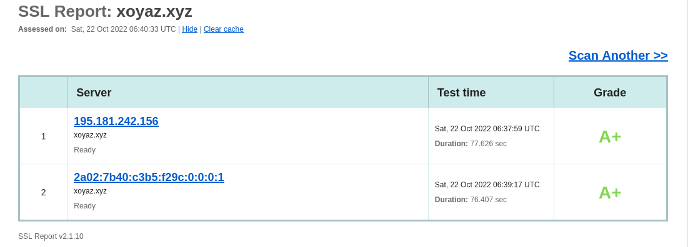

ATTENTION! En mode "modern" , seul **TLS1.3** est autorisé et le "grade" va passer à **A**
{: .prompt-warning }

### Erreurs

#### Erreur Certificat invalide (port 587)

Lors de l'envoi d'un message en utilisant le smtp xoyaz.xyz, j'ai une erreur  
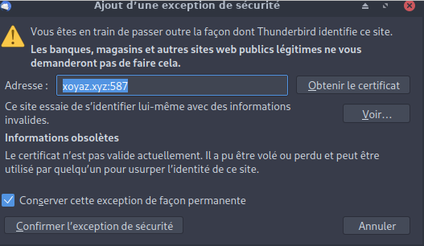

Le certificat SSL est valide  
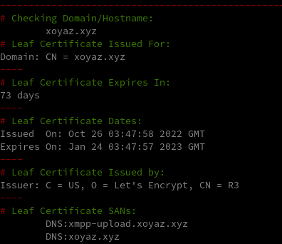

Par contre il n'est pas valide sur le port 587

    openssl s_client -starttls smtp -showcerts -connect xoyaz.xyz:587 -servername xoyaz.xyz

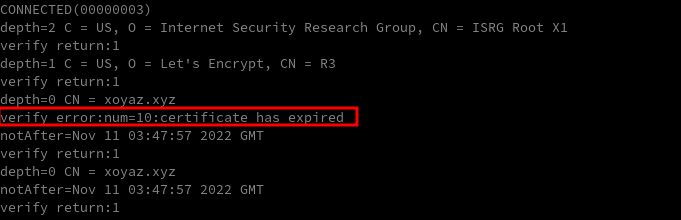

Pour la solution, il faut exécuter le commande suivante sur le serveur

    sudo postmap -F hash:/etc/postfix/sni

Vérification

    openssl s_client -starttls smtp -showcerts -connect xoyaz.xyz:587 -servername xoyaz.xyz


Il faut exécuter la commande `postmap -F hash:/etc/postfix/sni` après chaque renouvellement de certificat... 

YunoHost a été développé dans l’optique de fournir une sécurité maximale tout en restant accessible et facilement installable.

Tous les protocoles que YunoHost utilise sont **chiffrés**, les mots de passe ne sont pas stockés en clair, et par défaut chaque utilisateur n’accède qu’à son répertoire personnel.

Deux points sont néanmoins importants à noter :

* L’installation d’applications supplémentaires **augmente le nombre de failles** potentielles. Il est donc conseillé de se renseigner sur chacune d’elle **avant l’installation**, d’en comprendre le fonctionnement et juger ainsi l’impact que provoquerait une potentielle attaque. N’installez **que** les applications qui semblent importantes pour votre usage.

* Le fait que YunoHost soit un logiciel répandu augmente les chances de subir une attaque. Si une faille est découverte, elle peut potentiellement **toucher toutes les instances YunoHost** à un temps donné. Nous nous efforçons de corriger ces failles le plus rapidement possible, pensez donc à **mettre à jour régulièrement** votre système.

!!!! Si vous avez besoin de conseil, n’hésitez pas à [nous demander](/help).

!! [fa=shield /] Pour discuter d'une faille de sécurité, contactez l'[équipe sécurité de YunoHost](/security_team).


### Améliorer la sécurité - SUGGESTIONS

Si votre serveur YunoHost est dans un environnement de production critique ou que vous souhaitez améliorer sa sécurité, il est bon de suivre quelques bonnes pratiques.

! **Attention :** l’application des conseils suivants nécessite une connaissance avancée du fonctionnement et de l’administration d’un serveur. Pensez à vous renseigner avant de procéder à cette mise en place.

!!!! **Astuce :** Ne fermez jamais votre connexion SSH initiale sans avoir vérifié que vos modifications fonctionnent. Testez vos modifications dans une nouvelle fenêtre ou terminal. Ainsi, vous pourrez défaire vos modifications sans vous retrouver bloqués.

#### Authentification SSH par clé

Voici un [tutoriel plus détaillé](http://doc.ubuntu-fr.org/ssh#authentification_par_un_systeme_de_cles_publiqueprivee).

Par défaut, l’authentification SSH se fait avec le mot de passe d’administration. Il est conseillé de désactiver ce type d’authentification et de le remplacer par un mécanisme de clé de chiffrement.

**Sur votre ordinateur de bureau :**

```bash
ssh-keygen
ssh-copy-id -i ~/.ssh/id_rsa.pub <nom_utilisateur@votre.domaine.tld>
```

!!! Si vous avez des problèmes de permissions, donnez à `nom_utilisateur` la possession du dossier `~/.ssh` avec `chown`. Attention, pour des raisons de sécurité, ce dossier doit être en mode 700 !

!!! Si vous êtes sur Ubuntu 16.04 vous devez faire  `ssh-add` pour initialiser l'agent SSH.

Entrez le mot de passe d’administration et votre clé publique devrait être copiée sur votre serveur.

**Sur votre serveur**, l'édition du fichier de configuration SSH pour désactiver l’authentification par mot de passe est gérée par un paramètre système :

```bash
sudo yunohost settings set security.ssh.password_authentication -v no
```

#### Modifier le port SSH

Pour éviter des tentatives de connexion SSH par des robots qui scannent tout Internet pour tenter des connexions SSH avec tout serveur accessible, on peut modifier le port SSH.
C'est géré par un paramètre système, qui se charge de configurer les services SSH et Fail2Ban.

```bash
sudo yunohost settings set security.ssh.port -v <votre_numero_de_port_ssh>
```

**Lors de la prochaine connexion SSH**, vous devrez ajouter le paramètre `-p` suivi du port SSH.

**Exemple**:

```bash
ssh -p <votre_numero_de_port_ssh> admin@<votre_serveur_yunohost>
```

#### Durcir la sécurité de la configuration des services

La configuration TLS par défaut des services tend à offrir une bonne compatibilité avec les vieux appareils. Vous pouvez régler cette politique pour les services SSH et NGINX. Par défaut, la configuration du NGINX suit la [recommandation de compatibilité intermédiaire](https://wiki.mozilla.org/Security/Server_Side_TLS#Intermediate_compatibility_.28default.29) de Mozilla. Vous pouvez choisir de passer à la configuration « moderne » qui utilise des recommandations de sécurité plus récentes, mais qui diminue la compatibilité, ce qui peut poser un problème pour vos utilisateurs et visiteurs qui utilisent de vieux appareils. Plus de détails peuvent être trouvés sur [cette page](https://wiki.mozilla.org/Security/Server_Side_TLS#Modern_compatibility).

Changer le niveau de compatibilité n'est pas définitif et il est possible de rechanger le paramètre si vous concluez qu'il faut revenir en arrière.

**Sur votre serveur**, modifiez la politique pour NGINX :
```bash
sudo yunohost settings set security.nginx.compatibility -v modern
```

**Sur votre serveur**, modifiez la politique pour SSH :
```bash
sudo yunohost settings set security.ssh.compatibility -v modern
```

#### Désactivation de l’API YunoHost

YunoHost est administrable via une **API HTTP**, servie sur le port 6787 par défaut (seulement sur `localhost`). Elle permet d’administrer une grande partie de votre serveur, et peut donc être utilisée à des **fins malveillantes**. La meilleure chose à faire si vous êtes habitués à la ligne de commande est de désactiver le service `yunohost-api`, et **utiliser la [ligne de commande](/commandline)** en SSH.

```bash
sudo systemctl disable yunohost-api
sudo systemctl stop yunohost-api
```

