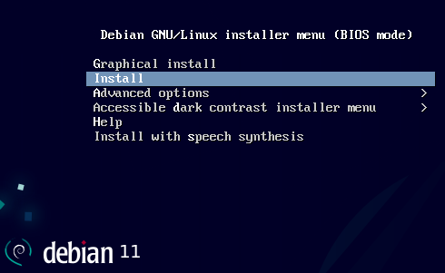

+++
title = 'Restauration des sauvegardes Borg sur un nouveau serveur Yunohost'
date = 2023-09-26 00:00:00 +0100
categories = ['borgbackup', 'yunohost']
+++
- [Prérequis](#prérequis)
- [Machine cible debian 11](#machine-cible-debian-11)
    - [Création disque virtuel qcow2](#création-disque-virtuel-qcow2)
    - [Installer debian 11](#installer-debian-11)
        - [Installer Yunohost](#installer-yunohost)
        - [Post-installation](#post-installation)
    - [Installer borg](#installer-borg)
        - [Clé SSH borg](#clé-ssh-borg)
        - [Ajout clé publique au serveur contenant les sauvegardes borg](#ajout-clé-publique-au-serveur-contenant-les-sauvegardes-borg)
- [Restauration sauvegardes borg](#restauration-sauvegardes-borg)
    - [Lister les sauvegardes borg](#lister-les-sauvegardes-borg)
    - [Recréer les archives tar localement](#recréer-les-archives-tar-localement)
    - [Restaurer depuis les archives locales](#restaurer-depuis-les-archives-locales)

## Prérequis

- Sauvegardes : Boîte de stockage BX11 Hetzner Online Storage Box  
- Serveur cible : Machine debian 11  

## Machine cible debian 11

### Création disque virtuel qcow2

Créer un disque virtuel vm-yuno de 80Go via qemu

    qemu-img create -f qcow2 /home/yann/virtuel/KVM/vm-yuno.qcow2 80G

Liste des os debian

    sudo virt-install --osinfo list |grep debian

```
debian12, debianbookworm
debian11, debianbullseye
debian10, debianbuster
debian9, debianstretch
debian8, debianjessie
debian7, debianwheezy
debian6, debian6.0, debiansqueeze
debian5, debian5.0, debianlenny
debian4, debian4.0, debianetch
debian3, debian3.0, debianwoody
debian3.1, debiansarge
debian2.2, debianpotato
debian2.1, debianslink
debian2.0, debianhamm
debian1.3, debianbo
debian1.2, debianrex
debian1.1, debianbuzz
debiantesting
```

Créer une machine debian 11

```bash
sudo virt-install \
    --memory 4096 \
    --vcpus 2 \
    --name vm-yuno \
    --disk ~/virtuel/KVM/vm-yuno.qcow2,device=disk,bus=virtio,format=qcow2 \
    --cdrom /home/yann/iso/debian/bullseye/debian-11.7.0-amd64-netinst.iso \
    --os-variant debian11
```

### Installer debian 11

la page graphique sur VMM  


<u>Paramètres installation</u>  
France  
Machine : vmyuno  
root root49600  
yuno yuno49600  
Serveur SSH  
Utilitaires usuels du système  

Ouvrir une session utilisateur  

Relever ip : `ip -a`  
Se connecter en ssh

    ssh yuno@192.168.0.15


#### Installer Yunohost

{:width="50"}  
*Installer yunohost sur le nouveau serveur*  

Pré-requis

* Un serveur dédié ou virtuel avec Debian 11 (bullseye) pré-installé , avec au moins 512Mo de RAM et 16Go de capacité de stockage ;
* Ouvrez la ligne de commande sur votre serveur (soit directement, soit avec SSH)
* Assurez-vous d'être connecté en tant que root

Installer sudo et curl `apt install sudo curl` 

```bash
su
echo "yuno     ALL=(ALL) NOPASSWD: ALL" >> /etc/sudoers
exit
sudo -s
```

Lancez la commande suivante :

    curl https://install.yunohost.org | bash

```
[INFO] Installation logs are available in /var/log/yunohost-installation_20230926_113323.log
[ OK ] YunoHost installation completed !
===============================================================================
You should now proceed with Yunohost post-installation. This is where you will
be asked for :
  - the main domain of your server ;
  - the administration password.

You can perform this step :
  - from the command line, by running 'yunohost tools postinstall' as root
  - or from your web browser, by accessing : 
    - https://192.168.0.17/ (local IP, if self-hosting at home)
    - https://82.64.18.243/ (global IP, if you're on a VPS)

If this is your first time with YunoHost, it is strongly recommended to take
time to read the administator documentation and in particular the sections
'Finalizing your setup' and 'Getting to know YunoHost'. It is available at
the following URL : https://yunohost.org/admindoc
===============================================================================
```

#### Post-installation

Oui, vous devez configurer un nom de domaine. Si vous n'avez pas de nom de domaine et que vous n'en voulez pas en .nohost.me, .noho.st ou .ynh.fr, vous pouvez utilisez un « faux » domaine comme par exemple yolo.test et modifier votre fichier /etc/hosts sur votre ordinateur local pour que ce domaine pointe vers l'IP de votre serveur.
{: .prompt-info }

`Peu importe les paramètres , ils seront effacés lors de la restauration`{: .prompt-warning }

Exécuter la commande suivante

    yunohost tools postinstall

```
Domaine principal: yunovm.loc
Nom d'utilisateur de l'administrateur: yun
Nom complet de l'administrateur: yun vm
Nouveau mot de passe d'administration:   # admin49600

[...]

Succès ! YunoHost est maintenant configuré
Attention : La post-installation est terminée ! Pour finaliser votre installation, il est recommandé de :
    - diagnostiquer les potentiels problèmes dans la section 'Diagnostic' de l'interface web (ou 'yunohost diagnosis run' en ligne de commande) ;
    - lire les parties 'Lancer la configuration initiale' et 'Découvrez l'auto-hébergement, comment installer et utiliser YunoHost' dans le guide d'administration : https://yunohost.org/admindoc.

```

### Installer borg

Installer application borg

    sudo apt install borgbackup

#### Clé SSH borg 

`Actions à effectuer sur la machine yunohost`{: .prompt-info }  

En root,créer une **clé SSH pour l’authentification borg** sur la boîte de stockage 

    sudo -s
    ssh-keygen -t ed25519 -f /root/.ssh/id_borg_ed25519

Validez en appuyant sur la touche « Entrée » à toutes les questions

Vous devriez maintenant avoir une clé privée contenue dans le fichier `/root/.ssh/id_borg_ed25519`, et une clé publique contenue dans le fichier `/root/.ssh/id_borg_ed25519.pub`  
La clé privée ne doit jamais être partagée.

#### Ajout clé publique au serveur contenant les sauvegardes borg

*Ajouter clé publique borg au fichier authorized_keys de la boîte de stockage*

<u>Depuis un poste ayant accès à la boîte de stockage</u>  
On télécharge le fichier existant `authorized_keys` de la boîte de stockage bx11-yann dans un fichier local nommé `storagebox_authorized_keys`

    echo -e "get .ssh/authorized_keys storagebox_authorized_keys" | sftp -P 23 -i ~/.ssh/bx11-yann-ed25519 u326239@u326239.your-storagebox.de

Ajout clé publique   borg de la vmm yunohost

    cat >> storagebox_authorized_keys

Copier/coller la clé publique dans ce terminal (commande : `cat /root/.ssh/id_borg_ed25519.pub`) de la machine, et presser [Ctrl]+[D] pour valider.

On renvoie le fichier modifié storagebox_authorized_keys dans le fichier authorized_keys de la boîte de stockage bx11-yann

    echo -e "put storagebox_authorized_keys .ssh/authorized_keys" | sftp -P 23 -i ~/.ssh/bx11-yann-ed25519 u326239@u326239.your-storagebox.de

## Restauration sauvegardes borg

<https://github.com/YunoHost-Apps/borg_ynh/blob/master/README.md>

### Lister les sauvegardes borg

 * Dépôt distant borg : `ssh://u326239@u326239.your-storagebox.de:23/./backup/borg/xoyize.xyz`
 * Clé SSH : `/root/.ssh/id_borg_ed25519`
 * PassPhrase du dépôt borg : `/root/.borg/xoyize.xyz.passphrase`

On passe en mode su : `sudo -s`

Identifier les sauvegardes du serveur xoyize.xyz à restaurer

```bash
export BORG_RSH="ssh -i /root/.ssh/id_borg_ed25519"
export BORG_PASSPHRASE=$(cat /root/.borg/xoyize.xyz.passphrase)
export REPOSITORY="ssh://u326239@u326239.your-storagebox.de:23/./backup/borg/xoyize.xyz"
export DATESAV="2023-09-26"
borg list --short  $REPOSITORY |grep $DATESAV
```

Les sauvegardes du 26 septembre 2023

```
_auto_conf-2023-09-26_02:10
_auto_data-2023-09-26_02:10
_auto_borg-2023-09-26_02:10
_auto_calibreweb-2023-09-26_02:11
_auto_gitea-2023-09-26_02:11
_auto_jirafeau-2023-09-26_02:11
_auto_my_webapp-2023-09-26_02:11
_auto_navidrome-2023-09-26_02:12
_auto_nextcloud-2023-09-26_02:12
_auto_onlyoffice-2023-09-26_02:12
_auto_shaarli-2023-09-26_02:13
_auto_snappymail-2023-09-26_02:13
_auto_transmission-2023-09-26_02:13
_auto_ttrss-2023-09-26_02:15
```

Installer tmux pour pouvoir exécuter les tâches après déconnexion SSH 

    apt install tmux 
    tmux

### Recréer les archives tar localement

dans le dossier `/home/yunohost.backup/archives/` avec un script bash pour recréer automatiquement  

```bash
sudo -s
export BORG_RSH="ssh -i /root/.ssh/id_borg_ed25519"
export BORG_PASSPHRASE=$(cat /root/.borg/xoyize.xyz.passphrase)
export REPOSITORY="ssh://u326239@u326239.your-storagebox.de:23/./backup/borg/xoyize.xyz"
export DATESAV="2023-09-26"
for mavariable in `borg list --short  $REPOSITORY |grep $DATESAV`
do
    echo "borg export-tar $REPOSITORY::$mavariable /home/yunohost.backup/archives/$mavariable.tar"
    borg export-tar $REPOSITORY::$mavariable /home/yunohost.backup/archives/$mavariable.tar
done
```

Procédure manuelle

```bash
export BORG_RSH="ssh -i /root/.ssh/id_borg_ed25519"
export BORG_PASSPHRASE=$(cat /root/.borg/xoyize.xyz.passphrase)
export REPOSITORY="ssh://u326239@u326239.your-storagebox.de:23/./backup/borg/xoyize.xyz"
export DATESAV="2023-09-26"
borg export-tar ssh://u326239@u326239.your-storagebox.de:23/./backup/borg/xoyize.xyz::_auto_conf-2023-09-26_02:10 /home/yunohost.backup/archives/_auto_conf-2023-09-26_02:10.tar
borg export-tar ssh://u326239@u326239.your-storagebox.de:23/./backup/borg/xoyize.xyz::_auto_borg-2023-09-26_02:10 /home/yunohost.backup/archives/_auto_borg-2023-09-26_02:10.tar
borg export-tar ssh://u326239@u326239.your-storagebox.de:23/./backup/borg/xoyize.xyz::_auto_calibreweb-2023-09-26_02:11 /home/yunohost.backup/archives/_auto_calibreweb-2023-09-26_02:11.tar
borg export-tar ssh://u326239@u326239.your-storagebox.de:23/./backup/borg/xoyize.xyz::_auto_gitea-2023-09-26_02:11 /home/yunohost.backup/archives/_auto_gitea-2023-09-26_02:11.tar
borg export-tar ssh://u326239@u326239.your-storagebox.de:23/./backup/borg/xoyize.xyz::_auto_jirafeau-2023-09-26_02:11 /home/yunohost.backup/archives/_auto_jirafeau-2023-09-26_02:11.tar
borg export-tar ssh://u326239@u326239.your-storagebox.de:23/./backup/borg/xoyize.xyz::_auto_my_webapp-2023-09-26_02:11 /home/yunohost.backup/archives/_auto_my_webapp-2023-09-26_02:11.tar
borg export-tar ssh://u326239@u326239.your-storagebox.de:23/./backup/borg/xoyize.xyz::_auto_navidrome-2023-09-26_02:12 /home/yunohost.backup/archives/_auto_navidrome-2023-09-26_02:12.tar
borg export-tar ssh://u326239@u326239.your-storagebox.de:23/./backup/borg/xoyize.xyz::_auto_nextcloud-2023-09-26_02:12 /home/yunohost.backup/archives/_auto_nextcloud-2023-09-26_02:12.tar
borg export-tar ssh://u326239@u326239.your-storagebox.de:23/./backup/borg/xoyize.xyz::_auto_onlyoffice-2023-09-26_02:12 /home/yunohost.backup/archives/_auto_onlyoffice-2023-09-26_02:12.tar
borg export-tar ssh://u326239@u326239.your-storagebox.de:23/./backup/borg/xoyize.xyz::_auto_shaarli-2023-09-26_02:13 /home/yunohost.backup/archives/_auto_shaarli-2023-09-26_02:13.tar
borg export-tar ssh://u326239@u326239.your-storagebox.de:23/./backup/borg/xoyize.xyz::_auto_snappymail-2023-09-26_02:13 /home/yunohost.backup/archives/_auto_snappymail-2023-09-26_02:13.tar
borg export-tar ssh://u326239@u326239.your-storagebox.de:23/./backup/borg/xoyize.xyz::_auto_ttrss-2023-09-26_02:15 /home/yunohost.backup/archives/_auto_ttrss-2023-09-26_02:15.tar
```

### Restaurer depuis les archives locales

Gérer les sauvegardes :  
**yunohost backup** `create, restore, list, info, download, delete ... [-h]`  

* **create** : Créer une archive locale de sauvegarde. Si ni --apps ni --system ne sont donnés, ceci  
sauvegardera toutes les applications et toutes les parties du système. Si seulement --apps est donné, cela  
uniquement des applications de sauvegarde et aucune partie du système. De même, si seul --system est donné, cela  
ne sauvegardera que les parties du système et aucune application.  
* **restore** : Restauration à partir d'une archive de sauvegarde locale. Si ni --apps ni --system ne sont donnés,  
cela restaurera toutes les applications et toutes les parties du système dans l'archive. Si seulement --apps  
si cela est indiqué, cela restaurera uniquement les applications et aucune partie du système. De même, si seulement  
--system est donné, cela ne restaurera que les parties du système et aucune application.  
* **list** : Liste les archives de sauvegarde locales disponibles
* **info** : Afficher des informations sur une archive de sauvegarde locale
* **delete** : Supprimer une archive de sauvegarde


Liste des archives

    yunohost backup list

```
archives: 
  - _auto_conf-2023-09-26_02:10
  - _auto_borg-2023-09-26_02:10
  - _auto_navidrome-2023-09-26_02:12
  - _auto_calibreweb-2023-09-26_02:11
  - _auto_nextcloud-2023-09-26_02:12
  - _auto_onlyoffice-2023-09-26_02:12
  - _auto_data-2023-09-26_02:10
  - _auto_shaarli-2023-09-26_02:13
  - _auto_gitea-2023-09-26_02:11
  - _auto_snappymail-2023-09-26_02:13
  - _auto_jirafeau-2023-09-26_02:11
  - _auto_transmission-2023-09-26_02:13
  - _auto_my_webapp-2023-09-26_02:11
  - _auto_ttrss-2023-09-26_02:15
```

Vous pouvez restaurer manuellement dans l'ordre que vous donnez (conf, données et enfin apps par apps)

Ce qui est restauré depuis `/home/yunohost.backup/archives/`

    yunohost backup restore _auto_conf-2021-10-01_03:20.tar.gz --system
    yunohost backup restore _auto_data-2021-10-01_03:20.tar.gz --system

Ce qui n'est pas restauré depuis `/home/yunohost.backup/archives/`

    yunohost backup restore _auto_navidrome-2021-10-01_03:25.tar.gz --apps
    yunohost backup restore _auto_borg-2021-10-01_03:21.tar.gz --apps
    yunohost backup restore _auto_calibreweb-2021-10-01_03:21.tar.gz --apps

Exécutable bash pour lister et restaurer toutes les sauvegardes 

```bash
# Lister
find /home/yunohost.backup/archives/ -name "*.tar" | while read a; do echo "${a##*/}"; done
# Restaurer
find /home/yunohost.backup/archives/ -name "*.tar" | while read a; do  echo "${a##*/}"; yunohost backup restore ${a##*/} --force; done
```


