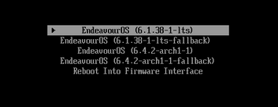
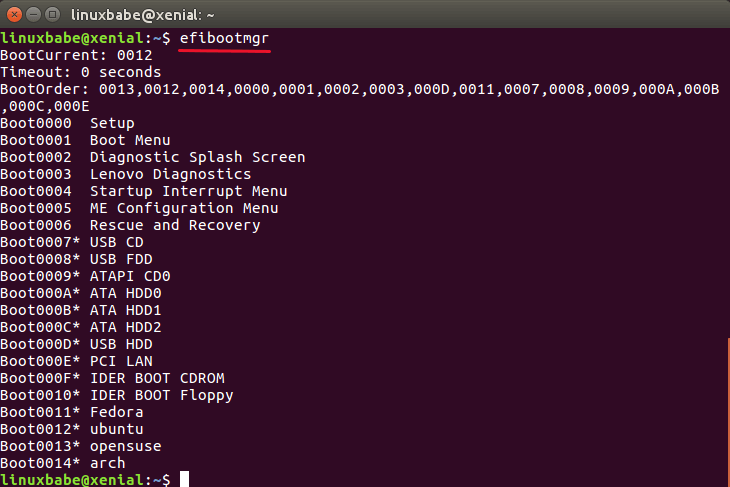
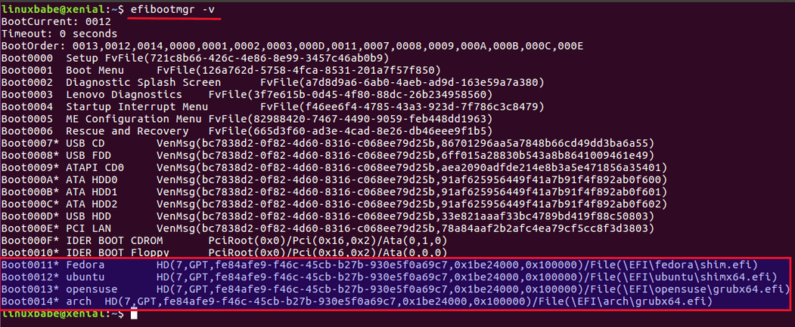

+++
title = 'systemd-boot + Commande Linux efibootmgr pour gérer le menu de démarrage UEFI'
date = 2023-10-18 00:00:00 +0100
categories = ['systemd', 'boot']
+++
*Utilitaire en ligne de commande Linux efibootmgr pour gérer le menu de démarrage UEFI .*

Liens

* [systemd-boot](https://discovery.endeavouros.com/installation/systemd-boot/2022/12/)
* [Use Linux efibootmgr Command to Manage UEFI Boot Menu](https://www.linuxbabe.com/command-line/how-to-use-linux-efibootmgr-examples)

## systemd-boot

### Démarrage système

*Systemd-boot est un simple gestionnaire de démarrage UEFI qui fait partie de systemd.* 

Il présente plusieurs avantages par rapport aux autres gestionnaires de démarrage :

*    Il est simple et utilise un simple fichier texte qui ne contient que quelques lignes.
*    Il est moins sujet aux pannes, facile à dépanner et ne nécessite aucun processus pour reconstruire les fichiers de configuration.
*    Il permet à chaque installation Linux de gérer ses propres fichiers de configuration et ne nécessite pas de détection entre les différentes installations

EndeavourOS utilise l'installation du noyau avec `systemd-boot` pour gérer le processus.  
Cela présente quelques avantages :

*    Une approche plus moderne
*    Automatise complètement le processus de création et de suppression d'entrées
*    Sans danger pour le multi-démarrage car il déplace vos noyaux et vos images vers un sous-répertoire spécifique à l'installation

### Usage

En général, vous ne devriez pas avoir besoin de faire quoi que ce soit de spécial pour gérer systemd-boot dans notre configuration par défaut car tout doit être géré automatiquement. 

### réinstallation des noyaux 

Le script `reinstall-kernels` régénère les **initrds** et crée/met à jour les entrées de démarrage. Il fonctionne à la fois avec **dracut** et **mkinitcpio** tant que vous avez installé soit `kernel-install-for-dracut` (La valeur par défaut) soit `kernel-install-mkinitcpio`(AUR).

### Modifier les options du noyau

Dans `systemd-boot` , c'est en fait assez simple. Vous éditez le fichier d'entrée approprié qui se trouve sur votre partition EFI dans le répertoire `loader/entries`  
Chaque entrée est une option de démarrage dans le menu et chacune possède une ligne appelée options.  
Vous pouvez modifier ces entrées directement, cependant, ces modifications peuvent être écrasées lors de l'installation ou de la mise à jour des packages.

Pour apporter les modifications, au lieu de modifier les entrées, modifiez le fichier

    /etc/kernel/cmdline

qui est un fichier d'une ligne contenant une liste d'options du noyau.  
Ensuite, exécutez 

    sudo reinstall-kernels

ce qui remplira les entrées et régénérera les initrds.

### Changer l'entrée par défaut du démarrage

Il y a une entrée  **default** à l'intérieur du fichier `/efi/loader/loader.conf` qui détermine l'entrée de démarrage par défaut.

Sur une nouvelle installation, cela ressemblera à ceci :

    default 665eca4ae83246df8ec17d1cbc6a1763*

Cette première chaîne de caractères est votre jeton d'entrée qui identifie l'installation. Ceci est important si vous effectuez un double démarrage avec un autre Linux, sinon il peut être remplacé par `*`   Cette ligne prend en charge les caractères génériques et donc si vous souhaitez démarrer le noyau LTS par défaut, vous pouvez utiliser quelque chose comme ceci :

    default 665eca4ae83246df8ec17d1cbc6a1763*lts.conf

Alternativement, si vous souhaitez démarrer le noyau principal par défaut, quelque chose comme ceci devrait fonctionner :

    default 665eca4ae83246df8ec17d1cbc6a1763-*-arch?-?.conf

<u>Ces modifications prendront effet au prochain redémarrage</u> et rien d'autre n'est requis sauf la modification du fichier.

### Plus d'information

Il existe quelques autres sources d'informations sur **systemd-boot** 

* [Arch-Wiki](https://wiki.archlinux.org/title/systemd-boot)
* [Freedesktop](https://www.freedesktop.org/software/systemd/man/systemd-boot.html) avec toutes les informations de base sur la manipulation et les options
* Des informations générales et des liens peuvent également être trouvés sur [Wikipedia](https://en.wikipedia.org/wiki/Systemd-boot)
* Le [code Source git](https://github.com/systemd/systemd/tree/main/src/boot) 
* [man systemd-boot](https://man.archlinux.org/man/systemd-boot.7.en) et [man loader.conf](https://man.archlinux.org/man/loader.conf.5) pour toutes les options possibles

### Trucs et astuces:

Enregistrez la dernière entrée de démarrage choisie :

Si elle est définie sur `@saved`, l'entrée choisie sera enregistrée en tant que variable EFI à chaque démarrage et automatiquement sélectionnée au prochain démarrage du chargeur de démarrage (voir ici [loader.conf ](https://man.archlinux.org/man/loader.conf.5)).

Cela doit être ajouté comme ceci au fichier  `/efi/loader/loader.conf` 

```
default @saved
timeout 1
console-mode auto
reboot-for-bitlocker 1
```

Avertissement général : définir la valeur par défaut sur enregistré peut entraîner des problèmes dans certains cas, par exemple si vous supprimez un noyau ou une option de démarrage ou lors de modifications apportées à la version du noyau. Où il peut arriver que la première entrée soit chargée au lieu de la dernière utilisée.
{: .prompt-warning }

Dans ce cas, vous devrez à nouveau choisir manuellement votre entrée.  
Définir l'entrée de démarrage par défaut à partir de la commande :

<https://man.archlinux.org/man/bootctl.1.en>

    sudo bootctl set-default ID

où l'ID est le nom de la configuration que vous pouvez voir avec : `ls /efi/loader/entries`  
exemple:

    sudo bootctl set-default f3a772fua46a7181a5d46a5n18899796-6.1.38-1-lts.conf

avec cela, vous pouvez modifier l'entrée de démarrage utilisée par défaut au cas où vous souhaiteriez passer au noyau LTS  
  
la configuration par défaut avec la commande sera indiquée au démarrage avec la petite flèche sur l'entrée choisie.

## efibootmgr

Linux doit être installé en mode UEFI.  
Installation utilitaire de ligne de commande **efibootmgr** avec les commandes suivantes.

```bash
sudo apt installer efibootmgr              # Debian/Ubuntu/Linux Menthe
sudo dnf efibootmgr                        # Fedora, CentOS, RedHat
sudo zypper installe efibootmgr            # SUSE
sudo pacman -S efibootmgr                  # Arch Linux/Manjaro
```

### Affichage paramètres actuels

Exécutez simplement la commande suivante. Dans certaines distributions Linux comme Debian, vous devez l'exécuter avec les  privilèges sudo

    efibootmgr

Cette commande vous permet d'afficher l'entrée de démarrage par défaut (BootCurrent), l'ordre de démarrage et toutes les entrées de démarrage. Chaque entrée de démarrage est identifiée par un numéro de démarrage en hexadécimal. L'astérisque (*) signifie que l'entrée de démarrage est active.



Vous pouvez également ajouter  une option `-v` pour afficher des informations détaillées.

    efibootmgr -v

Vous pouvez voir le numéro de partition système EFI, le type de table de partition (GPT), l'UUID de la partition système EFI et le fichier du chargeur de démarrage.



La capture d'écran ci-dessus montre que ma partition système EFI (ESP) se trouve sur la 7ème partition de mon disque dur (/dev/sda7). C'est une table de partition GPT.

### Modifier l'ordre de démarrage

Tout d’abord, copiez l’ordre de démarrage actuel. Par exemple, ici l'ordre de démarrage est :


Tapez ensuite la commande suivante

    sudo efibootmgr -o

Et ajoutez l'ordre de démarrage à la commande ci-dessus.


Disons que vous voulez 0012 doit la première entrée de démarrage. Tout ce que vous avez à faire est de le déplacer vers la gauche de 0013 et d'appuyer sur Entrée.


### Ajout d'une entrée de démarrage

Si vous avez installé plusieurs distributions Linux sur votre ordinateur, mais que l'une des distributions Linux ne dispose pas d'entrée de démarrage UEFI, vous pouvez l'ajouter manuellement.

Démarrez dans la distribution Linux qui n'a pas d'entrée de démarrage UFEI. Assurez-vous ensuite que la version EFI du chargeur de démarrage GRUB est installée.

```
sudo apt installer grub-efi         # Debian/Ubuntu/Linux Menthe
sudo dnf grub2-efi-modules          # Fedora
```

Montez ensuite la partition système EFI (ESP) sous le répertoire `/boot/efi/`  
Dans cet exemple, `/dev/sda7` est l'ESP.

    sudo mount /dev/sda7 /boot/efi/

Ensuite, installez le chargeur de démarrage Grub sur ESP.

    sudo grub-install /dev/sda --target=x86_64-efi --efi-directory=/boot/efi/

`x86_64-efi` signifie que nous allons installer Grub pour le firmware UEFI. La cible par défaut est i386-pc, qui correspond au micrologiciel du BIOS traditionnel.

Maintenant, vous devriez voir une nouvelle entrée dans le menu de démarrage UEFI avec la commande `bootmgr`. Sous le capot, le programme d'installation de Grub installe d'abord un fichier booloader `.efi` dans le répertoire `/boot/efi/EFI/<label>/`. Il s'appelle généralement `grubx64.efi`. Ensuite, il exécute la commande suivante pour ajouter une nouvelle entrée dans le menu de démarrage UEFI.

    efibootmgr -c -d /dev/sda -p 7 -L <label> -l \EFI\<label>\grubx64.efi

L'entrée nouvellement ajoutée sera la première dans l'ordre de démarrage.

### Supprimer une entrée de démarrage

Disons que vous avez installé plusieurs distributions Linux sur un disque dur et que vous disposez donc de plusieurs entrées de démarrage, comme dans la capture d'écran ci-dessus. Et maintenant, vous avez supprimé une distribution Linux mais l'entrée de démarrage est toujours là. Pour supprimer l'entrée de démarrage correspondante, exécutez :

    sudo efibootmgr -b <numéro de démarrage> -B

Par exemple,

    sudo efibootmgr -b 0014 -B

option `-b` pour spécifier le numéro de démarrage. option `-B`  pour supprimer ce numéro de démarrage.

### Définir une entrée de démarrage active ou inactive

Une entrée de démarrage suivie d'un astérisque indique qu'elle est active. Sinon c'est inactif. Pour activer une entrée de démarrage, exécutez :

    sudo efibootmgr -b <numéro de démarrage> -a

Pour rendre une entrée de démarrage inactive, exécutez :

    sudo efibootmgr -b <numéro de démarrage> -A

