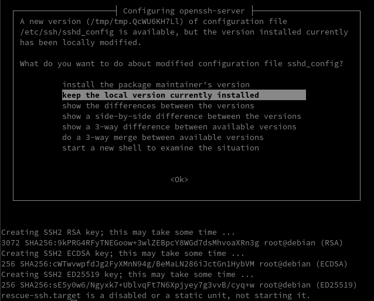
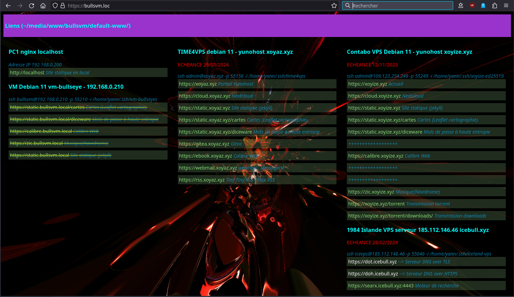
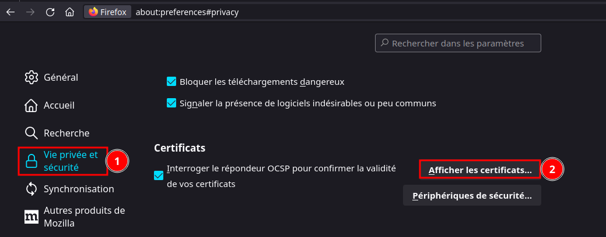
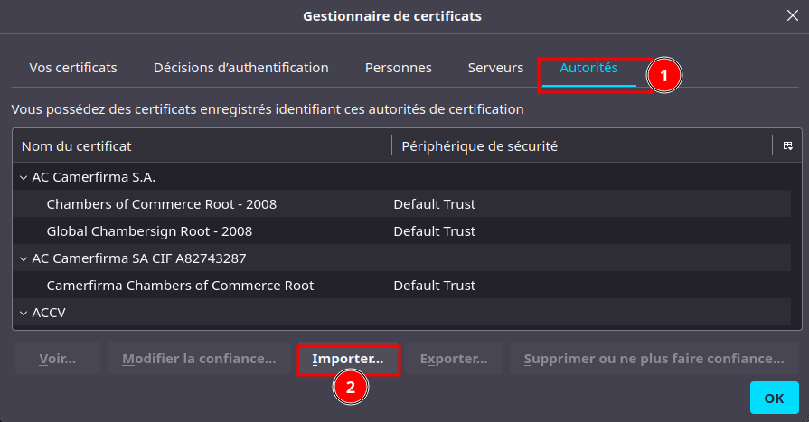
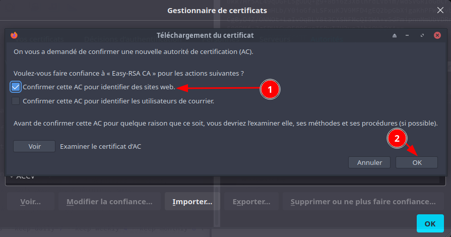
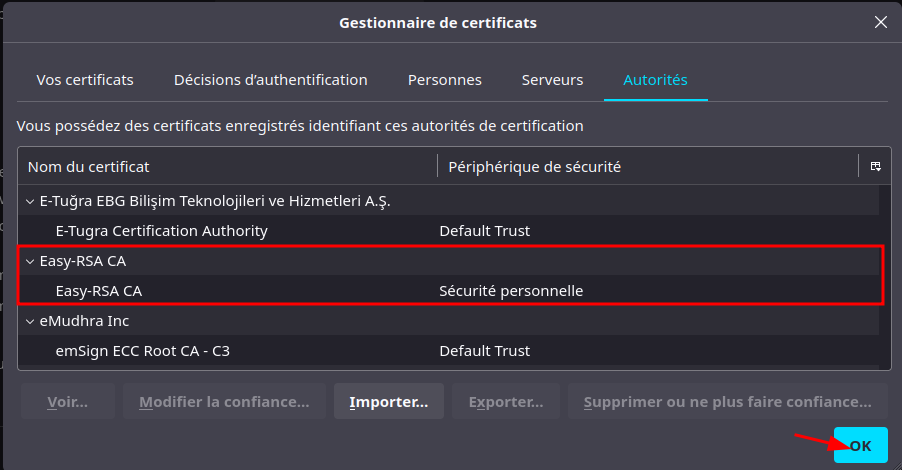
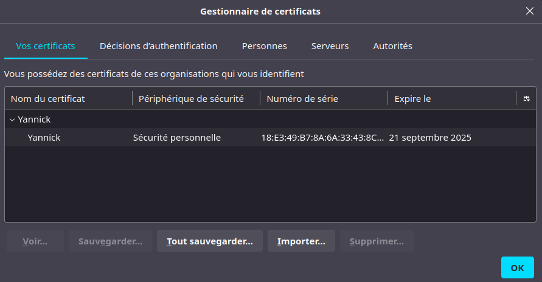
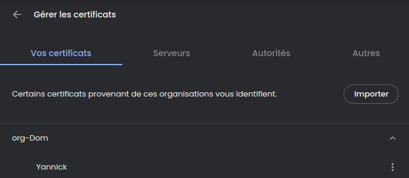
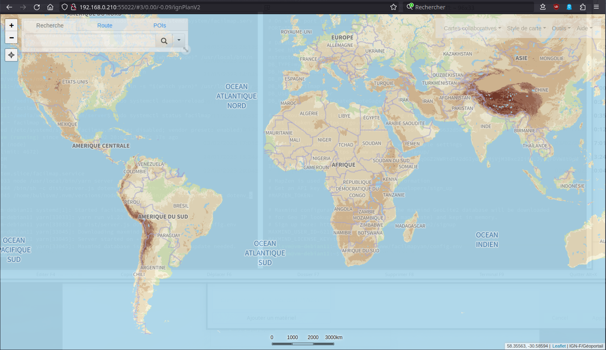
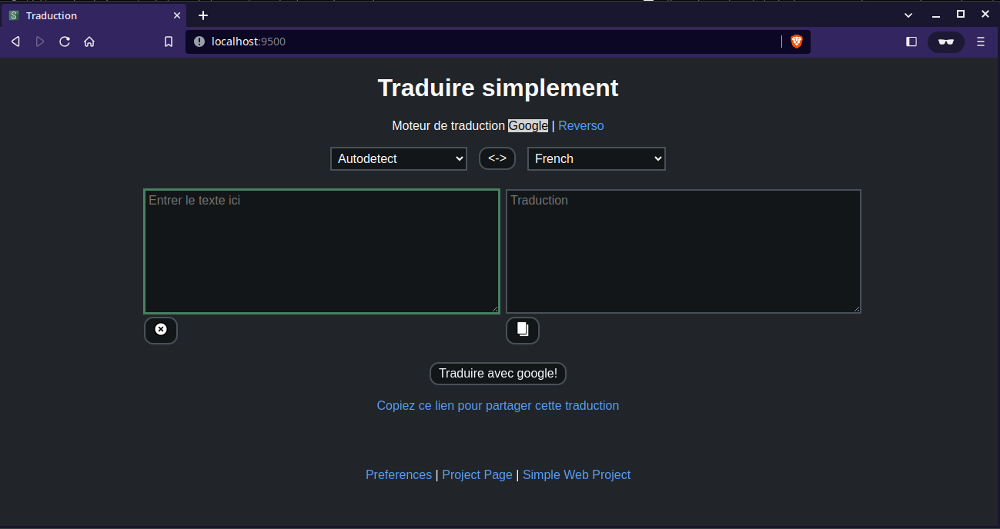

+++
title = 'PC1 Qemu/KVM - Machine virtuelle vm-bullseyes debian 11 (image cloud Qcow2)'
date = 2023-10-30 00:00:00 +0100
categories = virtuel debian
+++
{:height=30}  {:height=30}  {:height=30}  
*installer une image virtuelle cloud debian 11*  


## KVM debian vm-bullseyes virtuel

{:height="50"}  
*Si vous exploitez un nuage privé ou une plateforme de virtualisation fonctionnant avec KVM, comme OpenStack et oVirt. La manière la plus idéale de faire tourner une machine virtuelle Debian 11 est d'utiliser une image de nuage. Dans ce blog, nous vous montrons comment télécharger l'image officielle du nuage Debian 11 et créer une instance de machine virtuelle à partir de celle-ci sur l'hyperviseur KVM.* 

* Article original [Create Debian 11 (vm-bullseye) KVM Guest From Cloud Image](https://blog.programster.org/create-debian-11-kvm-guest-from-cloud-image)
* [Qemu/KVM - Serveur ouestyan.xyz debian 11 virtuel avec image cloud Qcow2 sur archlinux](/posts/Executer_Debian_sur_KVM_en_utilisant_l-image_de_nuage_Qcow2/)
* [How to import Cloud Image to Virtual Machines on Debian 10](https://wiki.debian.org/ThomasChung/CloudImage)

### Image Cloud Debian 11

* **generic** : Doit fonctionner dans n'importe quel environnement
* **genericcloud** : devrait fonctionner dans n'importe quel environnement virtualisé. Il est plus petit que generic car il exclut les pilotes pour le matériel physique.
* **nocloud** : Principalement utile pour tester le processus de construction lui-même. N'a pas installé cloud-init, mais permet à l'utilisateur de se connecter en tant que root sans mot de passe.

Toutes les images de Debian 11 Cloud sont disponibles sur la [page officielle de téléchargement des images d'OS](https://cloud.debian.org/images/cloud/). Dans ce guide, nous allons télécharger l'image nocloud qcow2 :

    mkdir -p ~/virtuel/KVM/ 
    cd ~/virtuel/KVM/
    wget https://cloud.debian.org/images/cloud/bullseye/latest/debian-11-genericcloud-amd64.qcow2

Vous pouvez vérifier plus de détails sur le fichier en utilisant la commande file :

    file debian-11-genericcloud-amd64.qcow2

*debian-11-genericcloud-amd64.qcow2: QEMU QCOW Image (v3), 2147483648 bytes (v3), 2147483648 bytes*

### Créer machine virtuelle Debian 11

Ensuite, nous créons une machine virtuelle Debian 11 (vm-bullseyes) à partir de notre image du nuage.

Définir la variable 

    export VM_NAME="vm-bullseye"

Une fois la variable exportée, créer l'image du disque racine de l'OS à partir de l'image du cloud téléchargée précédemment :

```bash
qemu-img convert \
  -f qcow2 \
  -O qcow2 \
  ~/virtuel/KVM/debian-11-genericcloud-amd64.qcow2 \
  ~/virtuel/KVM/$VM_NAME.qcow2
```

Vérifiez la création du fichier si elle est réussie

    file  ~/virtuel/KVM/$VM_NAME.qcow2

*/home/yann/virtuel/KVM/vm-bullseye.qcow2: QEMU QCOW Image (v3), 2147483648 bytes (v3), 2147483648 bytes*

Supprimer l'image cloud (FACULTATIF)

    rm ~/virtuel/KVM/debian-11-genericcloud-amd64.qcow2

### Redimensionner le disque 

*Redimensionner le disque à la taille souhaitée.*

>Notez que le disque racine que nous avons créé a une petite capacité de disque comme défini dans l'image de nuage par défaut.

Redimensionnons à la taille souhaitée pour le disque racine.


```bash
# 20 GB de disque
export VM_ROOT_DISK_SIZE=20G

# Resize Debian 11 VM disk
qemu-img resize \
  ~/virtuel/KVM/$VM_NAME.qcow2 \
  $VM_ROOT_DISK_SIZE
```

*Image resized.*

Confirmez la taille actuelle avec la commande qemu-img info :

    qemu-img  info ~/virtuel/KVM/$VM_NAME.qcow2

```
image: /home/yann/virtuel/KVM/vm-bullseye.qcow2
file format: qcow2
virtual size: 20 GiB (21474836480 bytes)
disk size: 698 MiB
cluster_size: 65536
Format specific information:
    compat: 1.1
    compression type: zlib
    lazy refcounts: false
    refcount bits: 16
    corrupt: false
    extended l2: false
Child node '/file':
    filename: /home/yann/virtuel/KVM/vm-bullseye.qcow2
    protocol type: file
    file length: 697 MiB (731251200 bytes)
    disk size: 698 MiB
```

Init mot de passe root

    virt-customize -a ~/virtuel/KVM/$VM_NAME.qcow2 --root-password password:debian

```
[   0.0] Examining the guest ...
[  30.1] Setting a random seed
[  30.1] Setting passwords
[  31.1] Finishing off
```

### Créer VM avec virt-install

Créez une nouvelle machine virtuelle Debian 11 à l'aide de la commande `virt-install`.  
Nous utilisons le réseau en pont , remplacer `network=default` par `bridge=br0`


```bash
sudo virt-install \
    --memory 4096 \
    --vcpus 2 \
    --name $VM_NAME \
    --disk ~/virtuel/KVM/$VM_NAME.qcow2,device=disk,bus=virtio,format=qcow2 \
    --os-variant debian11 \
    --network bridge=br0,model=virtio \
    --virt-type kvm \
    --graphics none \
    --boot uefi \
    --import
```

La sortie du mode console: `Ctrl+Altgr ]`  
A la fin de l'installation, on arrive sur le login (en mode console) :  
Saisir "root" et mot de passe "debian"  

```
[...]
[  OK  ] Finished Update UTMP about System Runlevel Changes.

Debian GNU/Linux 11 debian ttyS0

debian login: 
```

Mise à jour

```shell
apt update && apt upgrade
reboot # si des mises à jour ont été effectuées
```

### Ip V4 statique

Passage en ip statique 192.168.0.210 

    nano /etc/network/interfaces.d/staticv4

```
allow-hotplug enp1s0
iface enp1s0 inet static
 address 192.168.0.210
 netmask 255.255.255.0
 gateway 192.168.0.254
dns-nameservers 192.168.0.254
```

**resolvconf** est installé, vous n'aurez pas à modifier à la main le fichier de configuration resolv.conf car il sera changé de façon dynamique par les programmes. Si vous avez besoin de définir vous-même les serveurs de noms de domaine (comme avec une interface statique), ajoutez au fichier de configuration interfaces `dns-nameservers 192.168.0.254`
{:info}


Redémarrer la machine : `reboot`

Vérifier Adressage IP statique

    ip a show enp1s0

```
2: enp1s0: <BROADCAST,MULTICAST,UP,LOWER_UP> mtu 1500 qdisc pfifo_fast state UP group default qlen 1000
    link/ether 52:54:00:41:1a:63 brd ff:ff:ff:ff:ff:ff
    inet 192.168.0.210/24 brd 192.168.0.255 scope global enp1s0
       valid_lft forever preferred_lft forever
    inet6 2a01:e0a:9c8:2080:5054:ff:fe41:1a63/64 scope global dynamic mngtmpaddr 
       valid_lft 86388sec preferred_lft 86388sec
    inet6 fe80::5054:ff:fe41:1a63/64 scope link 
       valid_lft forever preferred_lft forever
```

### Reconfigurer les clés SSH

Par défaut openssh ne fonctionne pas

```
    [FAILED] Failed to start OpenBSD Secure Shell server.
    sshd: no hostkeys available -- exiting.
```

Il faut regénérer les clés

    dpkg-reconfigure openssh-server

{:width=500}


### Créer un utilisateur

Après s'être connecté en tant qu'utilisateur root, créer le premier utilisateur 

    adduser bullsvm

```
Adding user `bullsvm' ...
Adding new group `bullsvm' (1000) ...
Adding new user `bullsvm' (1000) with group `bullsvm' ...
Creating home directory `/home/bullsvm' ...
Copying files from `/etc/skel' ...
New password: 
Retype new password: 
passwd: password updated successfully
Changing the user information for bullsvm
Enter the new value, or press ENTER for the default
	Full Name []: 
	Room Number []: 
	Work Phone []: 
	Home Phone []: 
	Other []: 
Is the information correct? [Y/n] 
```

Ajout à sudoers

    echo "bullsvm     ALL=(ALL) NOPASSWD: ALL" >> /etc/sudoers

### Modifier hostname

    hostnamectl set-hostname vm-debian11
    hostnamectl

```
   Static hostname: vm-debian11
         Icon name: computer-vm
           Chassis: vm
        Machine ID: da82581019dc4d03ab600502635bade3
           Boot ID: 7d69a74407674c8ab4e37468cc5b2421
    Virtualization: kvm
  Operating System: Debian GNU/Linux 11 (bullseye)
            Kernel: Linux 5.10.0-23-cloud-amd64
      Architecture: x86-64
```

Ajout ip au fichier hosts

    nano /etc/hosts

```
127.0.0.1       localhost vm-debian11
```

### OpenSSH, clé et script

Il faut activer authentification mot de passe

    nano /etc/ssh/sshd_config

```
# To disable tunneled clear text passwords, change to no here!
PasswordAuthentication yes
#PermitEmptyPasswords no
```

Relancer

    systemctl restart sshd


{:width="70"}  
**connexion avec clé**  
<u>sur l'ordinateur de bureau</u>
Générer une paire de clé curve25519-sha256 (ECDH avec Curve25519 et SHA2) pour une liaison SSH avec le serveur.  

    ssh-keygen -t ed25519 -o -a 100 -f ~/.ssh/vm-bullseyes

Envoyer les clés publiques sur le serveur KVM   

    ssh-copy-id -i ~/.ssh/vm-bullseyes.pub bullsvm@192.168.0.210

<u>sur le serveur KVM</u>
On se connecte  

    ssh bullsvm@192.168.0.210

Modifier la configuration serveur SSH  

    sudo nano /etc/ssh/sshd_config

Modifier

```conf
Port = 55210
PasswordAuthentication no
```

Relancer le serveur

    sudo systemctl restart sshd

Test connexion

    ssh -p 55210 -i ~/.ssh/vm-bullseyes bullsvm@192.168.0.210

### Utilitaires

Installer utilitaires  

    sudo apt install rsync curl tmux jq figlet git

Effacer et créer motd

    sudo rm /etc/motd && sudo nano /etc/motd

```
                     _       _     _              _  _ 
 __ __ _ __  ___  __| | ___ | |__ (_) __ _  _ _  / |/ |
 \ V /| '  \|___|/ _` |/ -_)| '_ \| |/ _` || ' \ | || |
  \_/ |_|_|_|    \__,_|\___||_.__/|_|\__,_||_||_||_||_|
  _  ___  ___     _   __  ___     __     ___  _   __   
 / |/ _ \|_  )   / | / / ( _ )   /  \   |_  )/ | /  \  
 | |\_, / / /  _ | |/ _ \/ _ \ _| () |_  / / | || () | 
 |_| /_/ /___|(_)|_|\___/\___/(_)\__/(_)/___||_| \__/  
```

### Historique de la ligne de commande  

Ajoutez la recherche d’historique de la ligne de commande au terminal  
Se connecter en utilisateur  
Tapez un début de commande précédent, puis utilisez shift + up (flèche haut) pour rechercher l’historique filtré avec le début de la commande.

```shell
# Global, tout utilisateur
echo '"\e[1;2A": history-search-backward' | sudo tee -a /etc/inputrc
echo '"\e[1;2B": history-search-forward' | sudo tee -a /etc/inputrc
```

### Sortie console

Sortir du mode console par `poweroff` en mode su  

```
Création de domaine terminée.
Vous pouvez redémarrer votre domaine en exécutant :
  virsh --connect qemu:///system start vm-bullseye
```

### Démarrer la VM au boot

Si on active le flag "Démarrer la machine virtuelle au démarrage de l'hôte"

On obtient une erreur du service libvirtd  
 `erreur interne : Impossible de démarrer automatiquement la VM ’vm-bullseye’ : Impossible d'obtenir le MTU de l'interface sur 'br0': Aucun périphérique de ce type`

`31 mai 2023, aucune solution proposée à ce jour`{: .prompt-warning }

Créer un service qui lancera la machine virtuelle vm-bullseye au démarrage après 45 secondes de délai

    sudo nano /etc/systemd/system/vm-bullseye.service

```
[Unit]
Description=Autostart vm-bullseye

After=network.target libvirtd.service
Wants=libvirtd.service

[Service]
Type=simple
ExecStartPre=/usr/bin/sleep 45
ExecStart=/usr/bin/virsh start vm-bullseye

[Install]
WantedBy=multi-user.target
```

Activation

    sudo systemctl enable vm-bullseye

Exécution pour test

    sudo systemctl daemon-reload
    sudo systemctl start vm-bullseye

### Partage dossier hôte avec invité

* [Partage répertoire hôte avec un invité](/posts/QEMU_KVM+virtio-fs-Partager_un_repertoire_hote_avec_une_machine_virtuelle.md/#partage-répertoire-hôte-avec-un-invité)

Les dossiers partagés :

* /srv/media &rarr; media_tag
* /home/yann/scripts &rarr; scripts_tag

Créer les dossiers

    mkdir -p $HOME/{scripts,media}

Ajout au fichier `/etc/fstab`

```
media_tag   /home/bullsvm/media   virtiofs rw,_netdev 0 0
scripts_tag /home/bullsvm/scripts virtiofs rw,_netdev 0 0
```


### nginx

{:height="50"}

Utilisateur avec droits su : `sudo -s`

Désinstaller apache si existant

```bash
sudo systemctl stop apache2
sudo apt -y purge apache*
sudo apt -y autoremove
```

Télécharger le bash pour la compilation

```bash
wget https://static.xoyaz.xyz/files/compilation-nginx-tls1.3.sh
chmod +x compilation-nginx-tls1.3.sh # rendre le bash exécutable
./compilation-nginx-tls1.3.sh        # exécution
```

A la fin de la compilation

```
Versions Nginx OpenSSL
nginx version: nginx/1.24.0
OpenSSL 1.1.1n  15 Mar 2022
```

On va modifier le root par défaut

```bash
mkdir -p $HOME/media/www/bullsvm
cp -a /var/www/default-www $HOME/media/www/bullsvm/
```

## Certificats

### Certificats auto-signés (mkcert)

*mkcert est un outil facile d’utilisation qui va se charger de tout. Il génère notre autorité de certification, qui servira à signer le(s) certificat(s). Il suffira de déployer sa clé sur toutes les machines clientes pour que nous n’ayons aucune erreur du type "self signed…"([Générer des certificats SSL auto-signés avec mkcert](/posts/Generer_des_certificats_SSL_auto-signes_avec_mkcert/))*


```bash
# Installer mkcert sur un système Ubuntu ou Debian 
sudo apt -y install wget libnss3-tools
curl -s https://api.github.com/repos/FiloSottile/mkcert/releases/latest| grep browser_download_url  | grep linux-amd64 | cut -d '"' -f 4 | wget -qi -
mv mkcert-v*-linux-amd64 mkcert
chmod a+x mkcert
sudo mv mkcert /usr/local/bin/
# Création autorité de certification CA
mkcert -CAROOT /home/bullsvm/.local/share/mkcert
# générer notre nouvelle autorité de certification, sans saisir une seule information
mkcert -install
```

Vérification

    ls -l /home/bullsvm/.local/share/mkcert

Création de certificats locaux :

    mkcert bullsvm.loc '*.bullsvm.loc' localhost 127.0.0.1 ::1

```
Created a new certificate valid for the following names 📜
 - "bullsvm.loc"
 - "*.bullsvm.loc"
 - "localhost"
 - "127.0.0.1"
 - "::1"

Reminder: X.509 wildcards only go one level deep, so this won't match a.b.bullsvm.loc ℹ️

The certificate is at "./bullsvm.loc+4.pem" and the key at "./bullsvm.loc+4-key.pem" ✅

It will expire on 6 September 2025 🗓
```

Déplacer et renommer les certificats

```bash
sudo mv bullsvm.loc+4.pem /etc/ssl/certs/bullsvm-cert.pem
sudo mv bullsvm.loc+4-key.pem /etc/ssl/private/bullsvm-key.pem
```

#### VM - Diffuser autorité rootCA

<u>Diffuser l'autorité de certification de la vm-bullseye</u>

```bash
sudo apt install -y ca-certificates 
sudo cp ~/.local/share/mkcert/rootCA.pem /usr/local/share/ca-certificates/rootCA.crt
sudo update-ca-certificates
```

<u>Opérations à réaliser sur PC1 (archlinux)</u>  

Ajouter une ligne au fichier `/etc/hosts` de PC1 (qui lance le conteneur lxc) avec tous les sous-domaines (joker non autorisé dans hosts)

```
192.168.0.210   bullsvm.loc static.loc bullsvm.loc gpx.bullsvm.loc static.bullsvm.loc calibre.bullsvm.loc zic.bullsvm.loc fmy.bullsvm.loc
```

#### Hôte - Diffuser autorité rootCA

Il faut diffuser l'autorité de certification mkcert bullsvm sur PC1   

```bash
# Copie certificat depuis le dossier mkcert de la vm vers hôte 
cat /home/bullsvm/.local/share/mkcert/rootCA.pem 
# Copier le contenu dans le presse papier

# hôte
sudo nano /etc/ca-certificates/trust-source/anchors/rootCA-bullsvm.crt 
# copier le contenu du presse papier

# Activation  sur l'hôte
sudo  trust extract-compat
```

Lien <http://bullsvm.loc>    


### Certificats clients

[Comment mettre en place et configurer une autorité de certification (AC) avec Easy-RSA et créer un certificat client](/posts/Mettre_en_place_et_configurer_une_autorite_de_certification_AC_avec_Easy-RSA/)

Importer le certificat de l'autorité de certification (AC) dans firefox  
  
  
  
  

Importer le fichier de l'autorité de certification (AC)

    sudo cp /tmp/ca.crt /etc/ca-certificates/trust-source/anchors/
    sudo update-ca-trust

Générer un certificat client yannick.pfx pour importation firefox et chromium

Firefox  
  

Brave (chromium) : Confidentialité et sécurité &rarr; Sécurité &rarr; Gérer les certificats   
  


## PHP

### PHP8 - Composer

{:width="50"}  

Mettre à jour votre Debian système d'exploitation

    sudo apt update && sudo apt upgrade -y

Installer les dépendances requises

    sudo apt install -y lsb-release ca-certificates apt-transport-https software-properties-common gnupg2

importer et installer le Clé et référentiel GPG et actualiser

    echo "deb https://packages.sury.org/php/ $(lsb_release -sc) main" | sudo tee /etc/apt/sources.list.d/sury-php.list
    sudo wget -O /etc/apt/trusted.gpg.d/php.gpg https://packages.sury.org/php/apt.gpg

Actualiser

    sudo apt update && sudo apt -y upgrade

Installation des paquets php8.2 de base

    sudo apt install php8.2 php8.2-fpm php8.2-sqlite3 php8.2-gd

Version PHP : `php --version`

```
PHP 8.2.18 (cli) (built: May 17 2023 15:59:20) (NTS)
Copyright (c) The PHP Group
Zend Engine v4.1.18, Copyright (c) Zend Technologies
    with Zend OPcache v8.2.18, Copyright (c), by Zend Technologies
```

**PHP Composer** est un outil de gestion de paquets. Cela évite d’avoir à gérer manuellement les paquets PHP pour une application. Vous pouvez facilement installer tous les packages requis à l’aide de Composer. Il gère une liste des packages requis dans un fichier JSON appelé composer.json.

```bash
curl -sS https://getcomposer.org/installer | php
sudo mv composer.phar /usr/local/bin/composer
chmod +x /usr/local/bin/composer
```

Vérification : `composer`

```
   ______
  / ____/___  ____ ___  ____  ____  ________  _____
 / /   / __ \/ __ `__ \/ __ \/ __ \/ ___/ _ \/ ___/
/ /___/ /_/ / / / / / / /_/ / /_/ (__  )  __/ /
\____/\____/_/ /_/ /_/ .___/\____/____/\___/_/
                    /_/
Composer version 2.5.7 2023-05-24 15:00:39
```

## Base

### MySql - MariaDB

Installation

    sudo apt install mariadb-server

Sécurisation

    sudo mysql_secure_installation

## Développement

### nvm - node - yarn

*Il n’est pas rare d’avoir besoin ou envie de travailler dans différentes versions de nodejs. Une méthode privilégiée par les utilisateurs de node est l’utilisation de NVM (Node Version Manager). Le paquet nvm permet des installations alternatives faciles et peu coûteuses.*

Installation

```bash
curl https://raw.githubusercontent.com/creationix/nvm/master/install.sh | bash
source ~/.bashrc
```

Installer la version node lts

    nvm install --lts

Installer yarn et le dernier npm si demandé

    npm install yarn -g

### Golang

{:height="50"}  
La dernière version linux sur le lien <https://go.dev/dl/>

Supprimez toute installation précédente de Go en effaçant le dossier `/usr/local/go` (s'il existe), puis extrayez l'archive que vous venez de télécharger dans /usr/local, créant ainsi une nouvelle arborescence Go dans /usr/local/go

```shell
wget https://go.dev/dl/go1.20.4.linux-amd64.tar.gz
sudo tar -C /usr/local -xzf go1.20.4.linux-amd64.tar.gz
rm go1.20.4.linux-amd64.tar.gz
```

Chemins Go ajoutés au fichier `~/.bashrc`

```shell
echo "export PATH=$PATH:/usr/local/go/bin" >> $HOME/.bashrc
source $HOME/.bashrc
go version  
# go version go1.20.4 linux/amd64
```

### Docker + Docker Compose

[Docker + Docker Compose sur Debian, installation et utilisation](/posts/Docker-Debian-Buster/)

## Sites URL

Créer le lien 

### bullsvm.loc + cartes + diceware

Créer le fichier `/etc/nginx/conf.d/bullsvm.loc.conf`

    sudo nano /etc/nginx/conf.d/bullsvm.loc.conf

```nginx
server {
  listen  80;
  server_name bullsvm.loc;
  return 301 https://;
}
server {
  listen *:443 ssl http2;
  server_name bullsvm.loc;
  ssl_certificate /etc/ssl/certs/bullsvm-cert.pem;
  ssl_certificate_key /etc/ssl/private/bullsvm-key.pem;
  root /home/bullsvm/media/www/bullsvm/default-www/;

  
  location / {
    index index.htm index/;
  }

  location /diceware {
    alias /home/bullsvm/media/diceware/;
  }

  location /cartes {
    alias /home/bullsvm/media/osm-new/;
  }

}
```

Renommer le fichier de configuration par défaut et recharger nginx

```bash
sudo mv /etc/nginx/conf.d/default.conf /etc/nginx/conf.d/default.conf.sav
sudo systemctl reload nginx
```

### static.bullsvm.loc

Site statique  
Créer le fichier `/etc/nginx/conf.d/bullsvm.loc.conf`

    sudo nano /etc/nginx/conf.d/static.bullsvm.loc.conf

```nginx
server {
  listen  80;
  server_name static.bullsvm.loc;
  return 301 https://;
}
server {
  listen *:443 ssl http2;
  server_name static.bullsvm.loc;
  ssl_certificate /etc/ssl/certs/bullsvm-cert.pem;
  ssl_certificate_key /etc/ssl/private/bullsvm-key.pem;
  root /home/bullsvm/media/yannstatic/static;
  
  location / {
    index index.htm index/;
  }

}
```

recharger nginx

    sudo systemctl reload nginx


### FacilMapYan

[FacilMapYan carte en ligne à code source ouvert](/posts/FacilMap_carte_en_ligne/)

Node version 16

Créer un service systemd pour lancer le serveur node

    /etc/systemd/system/facilmap.service

```
[Unit]
Description=facilmap server
After=network.target

[Service]
Type=simple
User=bullsvm
WorkingDirectory=/home/bullsvm/media/www/facilmapyan/server
ExecStart=/usr/local/bin/yarn server
Restart=on-failure

[Install]
WantedBy=multi-user.target
```

Sur Debian pour éviter le message suivant : /usr/bin/env: node: No such file or directory
On va créer un lien sur les binaires node et yarn

    sudo ln -s "$(which node)" /usr/local/bin/node
    sudo ln -s "$(which yarn)" /usr/local/bin/yarn

Lancer le service et vérifier

```
sudo systemctl daemon-reload
sudo systemctl start facilmap
sudo systemctl status facilmap
```

Status

```
Jun 02 20:06:19 vm-debian11 systemd[1]: Started facilmap server.
Jun 02 20:06:19 vm-debian11 yarn[33033]: yarn run v1.22.19
Jun 02 20:06:19 vm-debian11 yarn[33033]: $ dist/server.js dotenv_config_path=../config.env
Jun 02 20:06:20 vm-debian11 yarn[33045]: Downloading maxmind database
Jun 02 20:06:21 vm-debian11 yarn[33045]: Server started on *:55022
Jun 02 20:06:21 vm-debian11 yarn[33045]: Maxmind database is up to date, no update needed.
```

Si ok, activer

    sudo systemctl enable facilmap

Créer un proxy nginx `/etc/nginx/conf.d/fmy.bullsvm.loc.conf`

    sudo nano /etc/nginx/conf.d/fmy.bullsvm.loc.conf

```nginx
server {
  listen  80;
  server_name fmy.bullsvm.loc;
  return 301 https://;
}
server {
  listen *:443 ssl http2;
  server_name fmy.bullsvm.loc;
  ssl_certificate /etc/ssl/certs/bullsvm-cert.pem;
  ssl_certificate_key /etc/ssl/private/bullsvm-key.pem;
  
  location / {
    proxy_pass http://127.0.0.1:55022;
  }

}
```

recharger nginx

    sudo systemctl reload nginx
    
Le lien <https://fmy.bullsvm.loc>  


### GpxStudio - Traces GPS

[Visualisation et édition des traces gps](/posts/Visualisation_et_edition_des_traces_gpx/)

Site accessible dans le dossier ~/media/www/gpxstudio

Créer le fichier `/etc/nginx/conf.d/fmy.gpx.bullsvm.loc.conf`

    sudo nano /etc/nginx/conf.d/fmy.gpx.bullsvm.loc.conf

Créer le fichier `/etc/nginx/conf.d/gpx.bullsvm.loc.conf`

    sudo nano /etc/nginx/conf.d/gpx.bullsvm.loc.conf

```nginx
server {
  listen  80;
  server_name gpx.bullsvm.loc;
  return 301 https://;
}
server {
  listen *:443 ssl http2;
  server_name gpx.bullsvm.loc;
  ssl_certificate /etc/ssl/certs/bullsvm-cert.pem;
  ssl_certificate_key /etc/ssl/private/bullsvm-key.pem;
  root /var/www/gpxstudio;

  
  location / {
    index index.htm index/;
  }

  include /etc/nginx/conf.d/bullsvm.d/*.conf;
}
```

recharger nginx

    sudo systemctl reload nginx
    
Le lien <https://gpx.bullsvm.loc>  


### Traduction

#### SimplyTranslate-Web

[SimplyTranslate-Web pour la traduction](/posts/SimplyTranslate_frontend_regroupement_traducteurs_Google_Traduction_et_Libre_Translate/)

Test via SSH

    /home/bullsvm/SimplyTranslate-Web/SimplyTranslateDev/bin/hypercorn main:app --bind 127.0.0.1:5000

Test local sur un ordinateur qui a l’accès SSH

    ssh -L 9500:localhost:5000 lxcyan@192.168.0.210 -p 55210 -i /home/yann/.ssh/lxcbullseye
    ssh -L 9500:localhost:5000 bullsvm@192.168.0.210 -p 55210 -i /home/yann/.ssh/vm-bullseyes

Sur ce même ordinateur lancer le navigateur avec le lien http://localhost:9500  


Une fois que vous avez terminé de tester l’application, appuyez sur ctrl + c pour arrêter le processus et désactiver l’environnement virtuel.

    deactivate

#### Service simplytranslate

Créer un service systemd pour s’assurer que notre application fonctionne juste après le démarrage du système.

    sudo nano /etc/systemd/system/simplytranslate.service

```
[Unit]
Description=hypercorn instance to serve SimplyTranslate
After=network.target

[Service]
WorkingDirectory=/home/bullsvm/SimplyTranslate-Web
ExecStart=/home/bullsvm/SimplyTranslate-Web/SimplyTranslateDev/bin/hypercorn \
          --bind 127.0.0.1:5000 \
          main:app

[Install]
WantedBy=multi-user.target
```

Le fichier d’unité, le fichier de configuration source ou les drop-ins de simplytranslate.service ont changé sur le disque. Exécutez ‘sudo systemctl daemon-reload’ pour recharger les unités.

    sudo systemctl start simplytranslate

#### Configuration SimplyTranslate-Web

Le fichier `~/SimplyTranslate-Web/config.conf`

```
[libre]
# LibreTranslate is disabled by default. If it is enabled, `Instance` is required.
Enabled = False
Instance = https://libretranslate.com
# Not all instances need an API key; if the one you use don't, remove this
# line.
# ApiKey = [REDACTED]

[google]
# Google translate is enabled by default.
Enabled = True

[deepl]
# Deepl Translate does not support async as of right now, it will block all other requests
# while it's processing a Deepl Requests, please enable this with caution!
Enabled = True 

[iciba]
# ICIBA Translate (a.k.a. PowerWord) is disabled by default.
Enabled = True 

[reverso]
Enabled = True

[network]
port = 5000
host = 127.0.0.1
```

Redémarrer le service après les modifications

    sudo systemctl restart simplytranslate

#### Proxy nginx traduction

Le fichier de configuration nginx `/etc/nginx/conf.d/traduction.bullsvm.loc.conf`

```
server {
  listen  80;
  server_name traduction.bullsvm.loc;
  return 301 https://;
}
server {
  listen *:443 ssl http2;
  server_name traduction.bullsvm.loc;
  ssl_certificate /etc/ssl/certs/bullsvm-cert.pem;
  ssl_certificate_key /etc/ssl/private/bullsvm-key.pem;

  location / { 
      proxy_pass              http://127.0.0.1:5000;
  } 

}
```

Vérifier nginx

    sudo nginx -t

Redémarrer nginx

    sudo systemctl reload nginx

Ajouter traduction.bullsvm.loc au fichier hosts de PC1  
Lien https://traduction.bullsvm.loc

### Flux RSS

[Tiny Tiny RSS avec Nginx, PHP-FPM et MariaDB (ttrss)](/posts/Tiny-Tiny-RSS_ttrss/)

Créer utilisateur admin :  
rss/rss49600

Authentification par certificat client  

### Nextcloud

<https://cloud.bullsvm.loc>

Initialisation  
Utilisateur: yannick  
Mot de passe : ******  
Base mysql , utilisateur et nom de base : nextcloud  
Mot de passe base nextcloud: ******  
Hôte base : localhost


