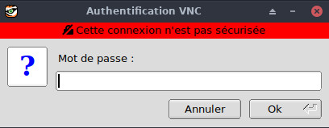
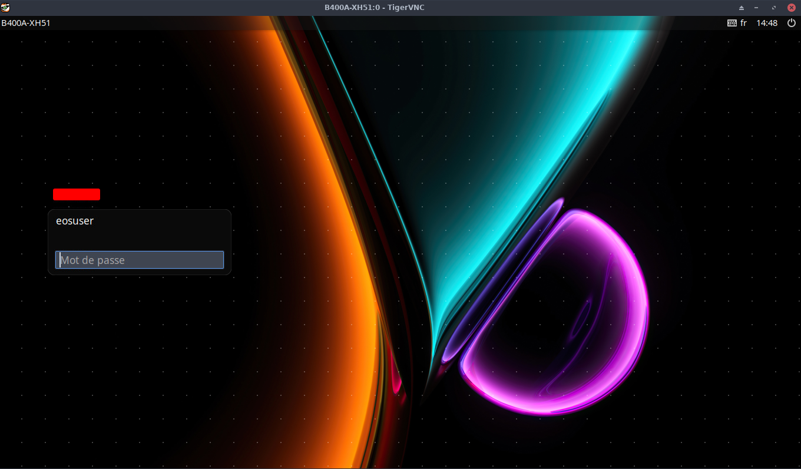

+++
title = 'EndeavourOS Archlinux - Portable ASUS Laptop Intel Core i5 3317U B400A-XH51'
date = 2023-11-03 00:00:00 +0100
categories = ['archlinux', 'laptop']
+++
  
ASUS Laptop Intel Core i5 3317U (1.70GHz) 8GB Memory 120GB SSD + 24 GB SSD  Intel HD Graphics 4000 14.1"

* ModelBrand : ASUS  
* Model : B400A-XH51  
* Quick InfoColor : Black  
* Operating System : EndeavourOS 64-Bit  
* CPU : Intel Core i5-3317U 1.7GHz  
* Core Name : Ivy Bridge  
* CPU Support : 3MB L3 Cache  
* Max Turbo Frequency 2.6GHz  
* DisplayScreen Size : 358.14 mm  
* Wide Screen Support : Yes  
* Resolution : 1366 x 768  
* Graphics Card : Intel HD Graphics 4000  
* Video Memory : Shared system memory  
* Graphic Type : Integrated Card  
* Storage : SanDisk SDSSDX12 120Go    
* Memory : 8 GB  
* Memory Type : 204-Pin DDR3 SO-DIMM  
* CommunicationsWLAN : 802.11a/g/n Wireless LAN  
* Bluetooth : Bluetooth 4.0  
* PortsHDMI : 1 x HDMI  
* PowerBattery : 4-cell Lithium Ion  


## EndeavourOS XFCE

{:width="90"} 

* [Forum](https://forum.endeavouros.com/)
* [Wiki](https://discovery.endeavouros.com/)

Télécharger le dernier fichier iSO <https://endeavouros.com/latest-release/>  
**EndeavourOS_Artemis_neo_22_8.iso** et **EndeavourOS_Artemis_neo_22_8.iso.sha512sum**  août 2022  

Vérifier checksum

    sha512sum -c EndeavourOS_Artemis_neo_22_8.iso.sha512sum

**EndeavourOS_Artemis_neo_22_8.iso: Réussi**

Créer la clé bootable   
Pour savoir sur quel périphérique, connecter la clé sur un port USB d'un ordinateur et lancer la commande `sudo dmesg`  
Dans le cas présent , le périphérique est **/dev/sdc**

    sudo dd if=EndeavourOS_Artemis_neo_22_8.iso of=/dev/sdc bs=4M

### Installation

*Installation à partir d'une clé USB/Bootable et d'un environnement graphique (calamares)*

ON Line  
Xfce4  
**Paquets à installer**  
Desktop Base + Common packages  
Firefox an language package  
XFCE4-Desktop  
Printing Support  
Support for HP Printer/scanner  

systemd-boot  
Effacer le disque,  Swap avec hibernation  

* Europe/Paris
* Clavier : French , Frenc (alt.,no dead keys)
* EFI /dev/sda, Effacer le disque, aucun swap
* Environnement bureau
    * Base devel + Common packages
    * XFCE4-Desktop
* Nom complet identifiant : claudine
* Ordinateur : B400A-XH51  
* Mot de passe identique pour administrateur

Lancer l'installation et patienter ...  
*A la fin de l'installation , oter la clé USB et redémarrer la machine*

Ouvrir une fenêtre terminal

### Ecran de veille 

Si l'application **xfce4-screensaver** est installée

    yay -Ss screensaver

```
extra/xscreensaver 6.04-1 (9.6 MiB 35.9 MiB) (Installé)
    Screen saver and locker for the X Window System
extra/xfce4-screensaver 4.16.0-1 (256.4 KiB 1.1 MiB) [xfce4-goodies] (Installé)
    Xfce Screensaver
```

On remplace l'application **xfce4-screensaver** (goodies) par **xscreensaver**

    sudo pacman -R xfce4-screensaver
    sudo pacman -S xscreensaver

Redémarrer la machine

### Activation SSH

Relever adresse par `ip a`  
192.168.0.30

Lancer et activer SSH

```bash
sudo systemctl enable sshd --now
```

Se connecter via ssh depuis un autre poste sur le réseau

```bash
ssh claudine@192.168.0.30
```

### Pavé numérique

#### Au boot

*Choix A avec mkinitcpio ou B si dracut*

**A-Démarrage anticipé (mkinitcpio)**

[Activating numlock on bootup](https://wiki.archlinux.org/title/Activating_numlock_on_bootup)  
Vous pouvez activer numlock juste après le démarrage du noyau dans le fichier initramfs. C'est la seule façon de s'assurer que numlock est activé même pendant la saisie du mot de passe de cryptage du disque complet.
Installez `mkinitcpio-numlock` AUR et ajoutez le hook mkinitcpio **numlock** avant encrypt, si utilisé, dans le tableau HOOKS `/etc/mkinitcpio.conf`  : 

    yay -S mkinitcpio-numlock

Modifier le hooks

    sudo nano /etc/mkinitcpio.conf

```
# avec encrypt
HOOKS=(base udev autodetect keyboard keymap consolefont numlock modconf block encrypt lvm2 filesystems fsck)
# cas actuel
HOOKS="base udev autodetect modconf block lvm2 keyboard keymap consolefont numlock filesystems fsck"
```

Puis régénérez l'initramfs pour que le changement prenne effet.

    mkinitcpio -P

L'avantage d'utiliser cette méthode est que le paramètre numlock sera répliqué dans le processus de démarrage ultérieur, et les nouvelles consoles virtuelles auront par défaut le numlock activé. 

**B-Avec un service systemd**

installer le paquetage AUR et en activer le service numLockOnTty

    yay -S systemd-numlockontty 
    sudo systemctl enable numLockOnTty --now

#### Connexion lightdm

Installer numlockx

    yay -S numlockx

modifier `/etc/lightdm/lightdm.conf`

```
[Seat:*]
greeter-setup-script=/usr/bin/numlockx on
```

### Images connexion et bureau

Les nouvelles images sont à copier dans le dossier `/usr/share/endeavouros/backgrounds/`  

**Image connexion**  
Modifier nom image dans le fichier `/etc/lightdm/slick-greeter.conf`  
Exemple nouvelle image `burmese_cat_muzzle_blue_106995_1920x1080.jpg`  

    background=/usr/share/endeavouros/backgrounds/burmese_cat_muzzle_blue_106995_1920x1080.jpg

### Nouvel utilisateur

Créer un nouvel utilisateur et son mot de passe

    sudo useradd -m -G sys,rfkill,wheel claudine
    sudo passwd claudine

### Compléments

#### base-devel

Installation de base-devel archlinux

    sudo pacman -S base-devel

#### Mise à jour

    yay -Syu

#### Accès sudo

Modifier sudoers pour accès sudo sans mot de passe à l'utilisateur **claudine**  

	su               # mot de passe root identique utilisateur
	echo "claudine     ALL=(ALL) NOPASSWD: ALL" >> /etc/sudoers.d/20-claudine

#### Thunderbird fr

    yay -S thunderbird-i18n-fr 

#### Jeux

Kpatience

    yay -S kpat

#### Client nextcloud

    yay -S nextcloud-client libgnome-keyring gnome-keyring  

### SSH + clé

{:width="100"}

**<u>Connexion SSH par clé</u>**  

<u>Opérations à réaliser sur l'ordinateur de bureau</u>  
Générer une paire de clé curve25519-sha256 (ECDH avec Curve25519 et SHA2)

    ssh-keygen -t ed25519 -o -a 100 -f ~/.ssh/asusXH51

Envoyer la clé publique sur le portable 

    ssh-copy-id -i ~/.ssh/asusXH51.pub claudine@192.168.0.30

Se connecter via SSH et modifier le fichier configuration ssh 

    sudo nano /etc/ssh/sshd_config

```
Port 55030
PasswordAuthentication	no
```

Relancer

    sudo systemctl restart sshd

`IL FAUT AJOUTER LE PORT 55030 EN ZONE "PUBLIC" DU PAREFEU !`{: .prompt-warning }

Ajouter le nouveau port SSH à la zone configurée de firewalld ("public" par défaut).

    sudo firewall-cmd --zone=public --add-port=55030/tcp --permanent
    sudo systemctl restart firewalld

Tester depuis l'hôte

    ssh -p 55030 -i ~/.ssh/asusXH51 claudine@192.168.0.30

### Motd

    sudo nano /etc/motd

```
      _                  __  __ _  _  ___  _       
     /_\   ___ _  _  ___ \ \/ /| || || __|/ |      
    / _ \ (_-<| || |(_-<  >  < | __ ||__ \| |      
   /_/ \_\/__/ \_,_|/__/ /_/\_\|_||_||___/|_|      
  _  ___  ___     _   __  ___     __     ____  __  
 / |/ _ \|_  )   / | / / ( _ )   /  \   |__ / /  \ 
 | |\_, / / /  _ | |/ _ \/ _ \ _| () |_  |_ \| () |
 |_| /_/ /___|(_)|_|\___/\___/(_)\__/(_)|___/ \__/ 
                                                   
```

### Imprimante HP

Installer l'imprimante HP OfficeJet 7510 

**En cas d'erreur serveur cups**  
Ajouter **`mdns_minimal [NOTFOUND=return]`** au fichier `/etc/nsswitch.conf`  

```
[...]
hosts: mymachines mdns_minimal [NOTFOUND=return] resolve [!UNAVAIL=return] files myhostname dns
```


**EN CAS DE PROBLEME**  
Pour faire fonctionner votre imprimante, vous devrez principalement installer et configurer Cups.

Si vous choisissez l'option de support de l'imprimante dans le programme d'installation, vous aurez déjà une configuration de cups fonctionnelle et vous n'aurez plus qu'à ajouter votre imprimante.

    sudo pacman -S cups cups-filters cups-pdf system-config-printer --needed

Pour une imprimante HP

    sudo pacman -S hplip

Pour obtenir cups complet avec le support de nombreuses imprimantes différentes par défaut.  
Installez ces paquets par dessus :

    sudo pacman -S ghostscript gsfonts foomatic-db-engine foomatic-db-foomatic-db-ppds foomatic-db-nonfree foomatic-db-nonfree-ppds gutenprint foomatic-db-gutenprint-ppds --needed

Pour les environnements QT (comme KDE/plasma LXQT) :

    sudo pacman -S print-manager --needed

Activez le socket, qui écoutera si print-job appelle et activera ensuite le service :

    sudo systemctl enable --now cups.socket

ou utiliser le service, qui tournera constamment.

    sudo systemctl enable --now cups.service

Pour la prise en charge des imprimantes réseau, vérifiez si avahi est installé et si son démon est en cours d'exécution :

    systemctl status avahi-daemon

si vous obtenez une erreur ou s'il affiche disabled not running :

    sudo pacman -S avahi --nécessaire
    sudo systemctl start avahi-daemon
    sudo systemctl enable avahi-daemon


### VNC

*prendre la main à distance sur un PC équipé de GNU/Linux*

**Poste Appelé**  
Installer x11vnc

    yay -S x11vnc

Générer un mot de passe dans le dossier root

    sudo -s
    x11vnc -storepasswd "*******" /root/.vnc_passwd

Ajouter le port 5900 à la zone configurée de firewalld ("public" par défaut).

    sudo firewall-cmd --zone=public --add-port=5900/tcp --permanent
    sudo systemctl restart firewalld

Exécuter la commande suivante

    [claudine@asus-xh51 ~]$ sudo x11vnc -xkb -noxrecord -noxfixes -noxdamage -display :0 -auth /var/run/lightdm/root/:0 -usepw

```
Enter VNC password: 
Verify password:    
Write password to /root/.vnc/passwd?  [y]/n y
Password written to: /root/.vnc/passwd
03/11/2023 15:29:11 x11vnc version: 0.9.16 lastmod: 2019-01-05  pid: 6518
03/11/2023 15:29:11 Using X display :0
03/11/2023 15:29:11 rootwin: 0x416 reswin: 0x3e00001 dpy: 0x94463b80
03/11/2023 15:29:11 
03/11/2023 15:29:11 ------------------ USEFUL INFORMATION ------------------
03/11/2023 15:29:11 X COMPOSITE available on display, using it for window polling.
03/11/2023 15:29:11   To disable this behavior use: '-noxcomposite'
03/11/2023 15:29:11 
[...]
The VNC desktop is:      asus-xh51:0
PORT=5900

******************************************************************************
Have you tried the x11vnc '-ncache' VNC client-side pixel caching feature yet?

The scheme stores pixel data offscreen on the VNC viewer side for faster
retrieval.  It should work with any VNC viewer.  Try it by running:

    x11vnc -ncache 10 ...

One can also add -ncache_cr for smooth 'copyrect' window motion.
More info: http://www.karlrunge.com/x11vnc/faq/#faq-client-caching
```

L'initialisation est terminée , Ctrl+C pour stopper

**Poste Appelant**  

<u>Première fenêtre de terminal</u>   
Exécuter la commande suivante

```shell
# SSH sans clés
ssh -f -L 5900:localhost:5900 claudine@192.168.0.30 'sudo x11vnc -xkb -noxrecord -noxfixes -noxdamage -display :0 -auth /var/run/lightdm/root/:0 -usepw'

# SSH avec clés
ssh -f -L 5900:localhost:5900 -p 55030 -i ~/.ssh/asusXH51 claudine@192.168.0.30 'sudo x11vnc -xkb -noxrecord -noxfixes -noxdamage -display :0 -auth /var/run/lightdm/root/:0 -usepw'

```

Saisir le mot de passe de l'utilisateur pour la connexion SSH sans clés  

    claudine@192.168.0.30's password: 

```
The VNC desktop is:      B400A-XH51:0

******************************************************************************
Have you tried the x11vnc '-ncache' VNC client-side pixel caching feature yet?

The scheme stores pixel data offscreen on the VNC viewer side for faster
retrieval.  It should work with any VNC viewer.  Try it by running:

    x11vnc -ncache 10 ...

One can also add -ncache_cr for smooth 'copyrect' window motion.
More info: http://www.karlrunge.com/x11vnc/faq/#faq-client-caching
```

<u>Seconde fenêtre de terminal</u>   
Exécuter la commande suivante

    vncviewer -PreferredEncoding=ZRLE localhost:0

{:width="200"}  
Saisir le mot de passe pour la connexion VNC

{:width="600"}  


programme bash sur poste appelant

```shell
#!/bin/bash

nohup ssh -f -L 5900:localhost:5900 -p 55030 -i ~/.ssh/asusXH51 claudine@192.168.0.30 'sudo x11vnc -xkb -noxrecord -noxfixes -noxdamage -display :0 -auth /var/run/lightdm/root/:0 -usepw'
p=$(pidof -s ssh)
# tempo
echo "Patienter 5 secondes..."
sleep 5
vncviewer -PreferredEncoding=ZRLE localhost:0
kill $p
echo "FIN VNC"
 
exit 0

```

### Partage freebox

en mode su

[Accés partage samba depuis linux](/posts/Partage_disque_externe_USB_sur_Freebox/#accés-partage-samba-depuis-linux)


### BorgBackup

Installation

    pacman -S borg python-llfuse

Le dossier

    mkdir -p /root/.borg

**Dépôt (repository)**.Les dépôts de la boîte de stockage sont sous ./backup/borg/

Ajout dépôt dans un fichier au dossier `/root/.borg`

```bash
echo "ssh://u326239@u326239.your-storagebox.de:23/./backup/borg/asus-xh51" > /root/.borg/asus-xh51.repository
```

phrase forte (passphrase)

Ajout de la phrase forte dans un fichier au dossier `/root/.borg`

```
echo "<La phrase de passe forte>" > /root/.borg/rnmkcy_eu.passphrase
```

**Initialisation dépôt distant** 

```bash
export BORG_PASSPHRASE="$(cat /root/.borg/asus-xh51.passphrase)"
export BORG_RSH='ssh -i /root/.ssh/id_borg_ed25519'
BORG_REPOSITORY="$(cat /root/.borg/asus-xh51.repository)"
borg init --encryption=repokey $BORG_REPOSITORY
```

Créer un fichier d'exclusion `/root/.borg/exclusions`

```
/proc
/sys
/dev
/media
/mnt
/cdrom
/tmp
/run
/var/tmp
/var/run
/var/cache
/swapfile
lost+found
/home/claudine/FreeUSB2To
/home/claudine/Photos
```

Script à exécuter en mode su : `/root/.borg/borg-backup.sh`

```bash
#!/bin/sh
#
# Script de sauvegarde.
#
# Envoie les sauvegardes sur un serveur distant, via le programme Borg.
# Les sauvegardes sont chiffrées
#

flag="/var/tmp/$(basename -- $0).flag"
if [ -e "$flag" ] ;then
echo "flag : $flag"
  if [ "$(date +%F)" == "$(date +%F -r $flag)" ]; then
   # script déjà exécuté 1 fois aujourd'hui, on sort
   echo "script $0 déjà exécuté ce jour($(date +%F))"
   echo "script $0 déjà exécuté ce jour($(date +%F))" | systemd-cat -t sauvegardes -p info
	# Envoi notification
	# DISPLAY=:0 notify-send "$0" "déjà exécuté ce jour\n($flag)" -i /root/.borg/information.png -t 10000
   exit 0
  fi
else
  touch "$flag"
fi
 
set -e
 
LOG_PATH=/var/log/borg-backup.log
 
export BORG_PASSPHRASE=$(cat /root/.borg/asus-xh51.passphrase)
export BORG_RSH='ssh -i /root/.ssh/id_borg_ed25519'
export BORG_RELOCATED_REPO_ACCESS_IS_OK=yes
BACKUP_DATE=`date +%Y-%m-%d-%Hh%M`
BORG_REPOSITORY=$(cat /root/.borg/asus-xh51.repository)

nice -n 19 ionice -c 3 borg create \
-v --progress --stats \
--exclude-from /root/.borg/exclusions \
${BORG_REPOSITORY}::${BACKUP_DATE} \
/ \
>> ${LOG_PATH} 2>&1
 
# Nettoyage des anciens backups
# On conserve
# - une archive par jour les 7 derniers jours,
# - une archive par semaine pour les 4 dernières semaines,
# - une archive par mois pour les 6 derniers mois.
 
borg prune \
-v --list --stats --keep-daily=7 --keep-weekly=4 --keep-monthly=6 \
$BORG_REPOSITORY \
>> ${LOG_PATH} 2>&1
```

Le rendre exécutable  `chmod +x /root/.borg/borg-backup.sh`

**Exécution script au boot après 3 min**

On va utiliser la fonction timer de systemd en créant 2 fichier de même nom et suffixes différents

Le service

    /etc/systemd/system/run-script-with-delay.service

```
[Unit]
Description=Lancer script au démarrage

[Service]
Type=oneshot
ExecStart=/root/.borg/borg-backup.sh
TimeoutStartSec=0
```

Le timer

```
/etc/systemd/system/run-script-with-delay.timer

[Unit]
Description="Lancer script au démarrage après 3min"

[Timer]
OnBootSec=3min

[Install]
WantedBy=default.target
```

Rafraîchir la configuration systemd

    sudo systemctl daemon-reload

Activer le timer

    sudo systemctl enable run-script-with-delay.timer

### Lister les sauvegrades borg

En mode su  
Lister les sauvegardes

```bash
export BORG_PASSPHRASE=$(cat /root/.borg/asus-xh51.passphrase)
export BORG_RSH='ssh -i /root/.ssh/id_borg_ed25519'
export BORG_RELOCATED_REPO_ACCESS_IS_OK=yes
BORG_REPOSITORY=$(cat /root/.borg/asus-xh51.repository)
```

Toutes le sauvegardes borg

    borg list --short ssh://u326239@u326239.your-storagebox.de:23/./backup/borg/asus-xh51

```
2023-11-03-12h18
2023-11-03-13h17
```

Pour obtenir la liste des fichiers contenus dans une archive, exécutez la commande suivante. Ici, je liste les fichiers de l'archive "2023-11-03-13h17".

    borg list ssh://u326239@u326239.your-storagebox.de:23/./backup/borg/asus-xh51::2023-11-03-13h17

Exécutez la commande suivante pour extraire une archive dans le répertoire de travail actuel. Si vous ajoutez les drapeaux -v et --list, vous obtiendrez la liste des fichiers extraits.

    borg extract -v --list ssh://u326239@u326239.your-storagebox.de:23/./backup/borg/asus-xh51::2023-11-03-13h17

Vous pouvez également utiliser le drapeau --dry-run qui affichera simplement ce qui va être extrait au lieu de l'extraire.

    borg extract --dry-run -v --list ssh://u326239@u326239.your-storagebox.de:23/./backup/borg/asus-xh51::2023-11-03-13h17

Vous pouvez extraire un répertoire particulier de l'archive en passant le nom du répertoire.

    borg extract -v --list ssh://u326239@u326239.your-storagebox.de:23/./backup/borg/asus-xh51::2023-11-03-13h17 home/claudine/

Restaurer un répertoire de la sauvegarde dans le répertoire en cours

    borg list --short ssh://u326239@u326239.your-storagebox.de:23/./backup/borg/asus-xh51::2023-11-03-13h17

