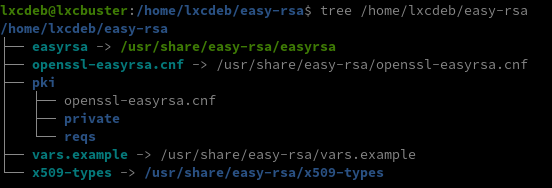
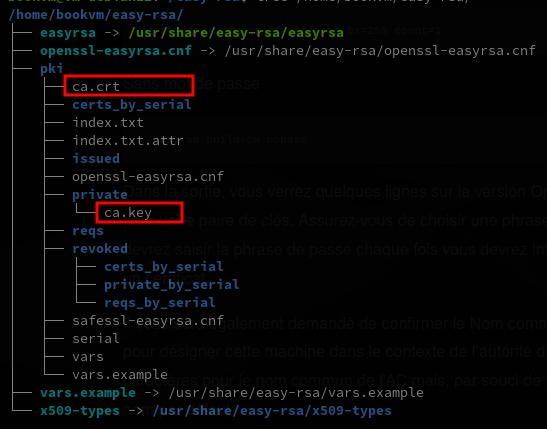

+++
title = 'Comment mettre en place et configurer une autorité de certification (AC) avec Easy-RSA et créer un certificat client'
date = 2023-11-18 00:00:00 +0100
categories = ssl authentification
+++
*Une autorité de certification (AC) est une entité chargée d’émettre des certificats numériques pour vérifier les identités sur l’internet. Bien que les AC publiques soient un choix populaire pour vérifier l’identité des sites web et autres services qui sont fournis au grand public, les AC privées sont généralement utilisées pour les groupes fermés et les services privés.*

  - [Autorité de certification (AC)](#autorité-de-certification-ac)
    - [Introduction](#introduction)
    - [Installation d’Easy-RSA](#installation-d’easy-rsa)
    - [Préparation d’un répertoire d’infrastructures à clés publiques](#préparation-d’un-répertoire-d’infrastructures-à-clés-publiques)
    - [Création d’une autorité de certification](#création-d’une-autorité-de-certification)
    - [Distribuer le certificat public de votre autorité de certification](#distribuer-le-certificat-public-de-votre-autorité-de-certification)
  - [Créer un certificat client avec ca.crt et ca.key](#créer-un-certificat-client-avec-cacrt-et-cakey)
    - [Certificat client "yannick"](#certificat-client-yannick)
    - [firefox et chrome](#firefox-et-chrome)

## Autorité de certification (AC)

### Introduction

La création d’une autorité de certification privée vous permettra de configurer, de tester et d’exécuter des programmes qui nécessitent des connexions cryptées entre un client et un serveur. Avec une AC privée, vous pouvez émettre des certificats pour les utilisateurs, les serveurs ou les programmes et services individuels au sein de votre infrastructure.

Quelques exemples de programmes sur Linux qui utilisent leur propre AC privée sont OpenVPN et Puppet.  Vous pouvez également configurer votre serveur web pour utiliser des certificats émis par une AC privée afin de faire correspondre les environnements de développement et de simulation aux serveurs de production qui utilisent TLS pour crypter les connexions.

Ce serveur sera appelé **serveur AC** dans ce tutoriel.

Assurez-vous que le **serveur AC** est un système autonome. Il ne sera utilisé que pour importer, signer et révoquer les demandes de certificats. Il ne doit pas gérer d’autres services et, dans l’idéal, il sera hors ligne ou complètement fermé lorsque vous ne travaillerez pas activement avec votre AC.

### Installation d’Easy-RSA

La première tâche de ce tutoriel consiste à installer l’ensemble de scripts easy-rsa sur votre serveur d’AC. easy-rsa est un outil de gestion d’autorité de certification que vous utiliserez pour générer une clé privée et un certificat racine public, que vous utiliserez ensuite pour signer les demandes des clients et des serveurs qui s’appuieront sur votre AC.

Connectez-vous à votre **serveur AC** en tant qu’utilisateur sudo non root que vous avez créé lors des étapes de configuration initiales et exécutez ce qui suit :

    sudo apt update
    sudo apt install easy-rsa


Vous serez invité à télécharger le package et à l’installer. Appuyez sur **y** pour confirmer que vous souhaitez installer le package.

À ce stade, vous disposez de tout ce dont vous avez besoin, installé et prêt pour utiliser **Easy-RSA**. 

### Préparation d’un répertoire d’infrastructures à clés publiques

Maintenant que vous avez installé easy-rsa​​​, il est temps de créer un squelette de l’[infrastructure de clés publiques (ICP)](https://en.wikipedia.org/wiki/Public_key_infrastructure) sur le **serveur AC**. Assurez-vous que vous êtes encore connecté en tant qu’utilisateur non root et créez un répertoire easy-rsa Assurez-vous que vous n’utilisez pas sudo pour exécuter l’une des commandes suivantes, puisque votre utilisateur normal doit gérer et interagir avec l’AC sans privilèges élevés.

    mkdir ~/easy-rsa

Cela créera un nouveau répertoire appelé easy-rsa dans votre dossier de base. Nous utiliserons ce répertoire pour créer des liens symboliques pointant vers les fichiers de packages easy-rsa que nous avons installés à l’étape précédente. Ces fichiers sont situés dans le dossier /usr/share/easy-rsa sur le **serveur AC**.

Créez les liens symboliques (symlinks) avec la commande ln :

    ln -s /usr/share/easy-rsa/* ~/easy-rsa/

Remarque : alors que d’autres guides peuvent vous demander de copier les fichiers du package easy-rsa dans votre répertoire ICP, ce tutoriel adopte une approche par lien symbolique. Par conséquent, toute mise à jour du paquet easy-rsa sera automatiquement répercutée dans les scripts de votre ICP.
{: .prompt-info }

Pour restreindre l’accès à votre nouveau répertoire ICP, assurez-vous que seul le propriétaire peut y accéder en utilisant la commande chmod :

    chmod 700 ~/easy-rsa

Enfin, initialisez l’ICP dans le répertoire easy-rsa :

    cd ~/easy-rsa
    ./easyrsa init-pki

Sortie

```
init-pki complete; you may now create a CA or requests.
Your newly created PKI dir is: /home/lbookvm/easy-rsa/pki
```

Après avoir terminé cette section, vous disposez d’un répertoire qui contient tous les fichiers nécessaires pour créer une autorité de certification.   
  
Dans la section suivante, vous allez créer la clé privée et le certificat public pour votre AC.

### Création d’une autorité de certification

Avant de pouvoir créer la clé et le certificat privés de votre AC, vous devez créer et alimenter un fichier appelé vars avec quelques valeurs par défaut. 

Définition des paramètres utilisables

```
EASYRSA - doit pointer vers le répertoire de premier niveau Easy-RSA, où se trouve le script easyrsa.
    EASYRSA_OPENSSL - commande pour invoquer openssl
    EASYRSA_SSL_CONF - le fichier de configuration openssl à utiliser
    EASYRSA_PKI (CLI : --pki-dir) - répertoire à utiliser pour contenir tous les fichiers spécifiques à l'ICP, par défaut $PWD/pki.
    EASYRSA_DN (CLI : --dn-mode) - prend la valeur cn_only ou org pour modifier les champs à inclure dans le DN de la demande.
    EASYRSA_REQ_COUNTRY (CLI : --req-c) - définit le pays du DN en mode org
    EASYRSA_REQ_PROVINCE (CLI : --req-st) - définit le DN état/province en mode org
    EASYRSA_REQ_CITY (CLI : --req-city) - définit le DN ville/localité en mode org
    EASYRSA_REQ_ORG (CLI : --req-org) - définit le DN organisation avec le mode org
    EASYRSA_REQ_EMAIL (CLI : --req-email) - définit le DN email en mode org
    EASYRSA_REQ_OU (CLI : --req-ou) - définit l'unité organisationnelle du DN en mode org
    EASYRSA_KEY_SIZE (CLI : --key-size) - définit la taille de la clé en bits à générer
    EASYRSA_ALGO (CLI : --use-algo) - Définit l'algorithme cryptographique à utiliser : rsa ou ec
    EASYRSA_CURVE (CLI : --curve) - définit la courbe EC nommée à utiliser
    EASYRSA_EC_DIR : répertoire de stockage des paramètres EC générés
    EASYRSA_CA_EXPIRE (CLI : --days) - Définit le délai d'expiration de l'autorité de certification en jours.
    EASYRSA_CERT_EXPIRE (CLI : --days) - définit le délai d'expiration du certificat émis en jours
    EASYRSA_CRL_DAYS (CLI : --days) - Définit le délai de publication de la CRL en jours.
```

Tout d’abord, vous allez cd dans le répertoire easy-rsa, puis vous allez créer et modifier le fichier vars avec nano ou votre éditeur de texte préféré :

    cd ~/easy-rsa
    nano pki/vars

Une fois le fichier ouvert, collez les lignes suivantes et modifiez chaque valeur mise en évidence pour refléter les informations de votre propre organisation. L’important ici est de veiller à ne laisser aucune des valeurs en blanc :

```bash
set_var EASYRSA_REQ_COUNTRY    "FR"
set_var EASYRSA_REQ_PROVINCE   "Pays de Loire"
set_var EASYRSA_REQ_CITY       "Bopro"
set_var EASYRSA_REQ_ORG        "yako"
set_var EASYRSA_REQ_EMAIL      "vps@cinay.eu"
set_var EASYRSA_REQ_OU         "Dom"
set_var EASYRSA_ALGO           "ec"
set_var EASYRSA_DIGEST         "sha512"
```

Lorsque vous avez terminé, enregistrez et fermez le fichier. Si vous utilisez nano, vous pouvez le faire en appuyant sur CTRL+X, puis Y et ENTER (ENTRÉE) pour confirmer. Vous êtes maintenant prêt à construire votre AC.

Pour créer la paire de clés root public et privé pour votre autorité de certification, exécutez à nouveau la commande `./easy-rsa`, cette fois-ci avec l’option `build-ca`  

Remarque : Si vous ne voulez pas qu’un mot de passe vous soit demandé à chaque fois que vous interagissez avec votre AC, vous pouvez exécuter la commande build-ca avec l’option nopass, comme ceci : `./easyrsa build-ca nopass`
{: .prompt-info }

Il faut créer in fichier aléatoire avant d'exécuter la commande `./easy-rsa`

    dd if=/dev/urandom of=pki/.rnd bs=256 count=1

Sans mot de passe

    ./easyrsa build-ca nopass

Dans la sortie, vous verrez quelques lignes sur la version OpenSSL et vous serez invité à entrer une phrase de passe pour votre paire de clés. Assurez-vous de choisir une phrase de passe solide, et notez-le dans un endroit sûr. Vous devrez saisir la phrase de passe chaque fois vous devrez interagir avec votre AC, par exemple pour signer ou révoquer un certificat.

Il vous sera également demandé de confirmer le Nom commun (CN) de votre AC. Le nom commun est le nom utilisé pour désigner cette machine dans le contexte de l’autorité de certification. Vous pouvez saisir n’importe quelle chaîne de caractères pour le nom commun de l’AC mais, par souci de simplicité, appuyez sur ENTER (ENTRÉE) pour accepter le nom par défaut.

Sortie

```
* Notice:
Using Easy-RSA configuration from: /home/bookvm/easy-rsa/pki/vars

* Notice:
Using SSL: openssl OpenSSL 3.0.9 30 May 2023 (Library: OpenSSL 3.0.9 30 May 2023)

Using configuration from /home/bookvm/easy-rsa/pki/6b31fd64/temp.00f49897
-----
You are about to be asked to enter information that will be incorporated
into your certificate request.
What you are about to enter is what is called a Distinguished Name or a DN.
There are quite a few fields but you can leave some blank
For some fields there will be a default value,
If you enter '.', the field will be left blank.
-----
Common Name (eg: your user, host, or server name) [Easy-RSA CA]:

* Notice:

CA creation complete and you may now import and sign cert requests.
Your new CA certificate file for publishing is at:
/home/bookvm/easy-rsa/pki/ca.crt
```

Vous disposez maintenant de deux fichiers importants - `~/easy-rsa/pki/ca.crt` et `~/easy-rsa/pki/private/ca.key` - qui constituent les composants publics et privés d’une autorité de certification.

* `ca.crt` est le fichier de certificats public de l’AC. Les utilisateurs, les serveurs et les clients utiliseront ce certificat pour vérifier qu’ils font partie du même réseau de confiance. Chaque utilisateur et serveur qui utilise votre AC devront avoir une copie de ce fichier. Toutes les parties s’appuieront sur le certificat public pour s’assurer qu’une personne ne se fait pas passer pour un système et n’effectue pas une attaque de type [Man-in-the-middle](https://en.wikipedia.org/wiki/Man-in-the-middle_attack). 
* `ca.key` est la clé privée que l’AC utilise pour signer les clés et les certificats des serveurs et des clients. Si un intrus accède à votre AC et, à son tour, à votre fichier ca.key, vous devrez détruire votre AC. C’est pourquoi votre fichier ca.key ne doit se trouver que sur votre machine AC et votre machine AC doit idéalement être maintenue hors ligne lorsqu’elle ne signe pas de demandes de certificat, par mesure de sécurité supplémentaire. 



Avec cela, votre AC est en place et elle est prête à être utilisée pour signer des demandes de certificats et pour révoquer des certificats.

### Distribuer le certificat public de votre autorité de certification

Votre AC est maintenant configurée et prête à agir comme une racine de confiance pour tous les systèmes que vous voulez configurer pour l’utiliser. Vous pouvez ajouter le certificat de l’AC à vos serveurs OpenVPN, serveurs web, serveurs de messagerie, etc. Tout utilisateur ou serveur qui doit vérifier l’identité d’un autre utilisateur ou serveur de votre réseau devrait avoir une copie du fichier ca.crt importé dans le magasin de certificats de son système d’exploitation.

Pour importer le certificat public de l’AC dans un deuxième système Linux comme un autre serveur ou un ordinateur local, obtenez d’abord une copie du fichier `ca.crt` de votre **serveur AC**. Vous pouvez utiliser la commande `cat` pour le sortir dans un terminal, puis le copier et le coller dans un fichier sur le deuxième ordinateur qui importe le certificat. Vous pouvez également utiliser des outils comme scp, rsync pour transférer le fichier entre les systèmes. Cependant, nous utiliserons un copier-coller avec nano dans cette étape car cela fonctionne sur tous les systèmes.

En tant qu’utilisateur non root sur le **serveur AC**, exécutez la commande suivante :

    cat ~/easy-rsa/pki/ca.crt

Il y aura une sortie dans votre terminal qui ressemblera à ce qui suit :

```
-----BEGIN CERTIFICATE-----
MIIDSzCCAjOgAwIBAgIUcR9Crsv3FBEujrPZnZnU4nSb5TMwDQYJKoZIhvcNAQEL
BQAwFjEUMBIGA1UEAwwLRWFzeS1SU0EgQ0EwHhcNMjAwMzE4MDMxNjI2WhcNMzAw
. . .

. . .
-----END CERTIFICATE-----
```

Copiez tout, y compris les lignes `-----BEGIN CERTIFICATE-----`​​​ et `------END CERTIFICATE-----` et les tirets.

Sur votre <u>deuxième système Linux</u>, utilisez nano ou votre éditeur de texte préféré pour ouvrir un fichier appelé /tmp/ca.crt :

    nano /tmp/ca.crt

Collez le contenu que vous venez de copier du **serveur AC** dans l’éditeur. Lorsque vous avez terminé, enregistrez et fermez le fichier. Si vous utilisez nano, vous pouvez le faire en appuyant sur CTRL+X, puis Y et ENTER (ENTRÉE) pour confirmer.

Maintenant que vous disposez d’une copie du fichier `ca.crt` sur votre <u>deuxième système Linux</u>,il est temps d’importer le certificat dans le magasin de certificats de son système d’exploitation.

Sur les systèmes basés sur Debian et Ubuntu, exécutez les commandes suivantes pour importer le certificat :

```bash
# Debian and Ubuntu derived distributions
sudo cp /tmp/ca.crt /usr/local/share/ca-certificates/
sudo update-ca-certificates
```

Pour importer le certificat du **serveur AC** sur un système basé sur CentOS, Fedora ou RedHat, copiez et collez le contenu du fichier sur le système tout comme dans l’exemple précédent dans un fichier appelé `/tmp/ca.crt`. Ensuite, vous copierez le certificat dans `/etc/pki/ca-trust/source/anchors/`, puis vous exécuterez la commande `update-ca-trust`.

```bash
# Archlinux
sudo cp /tmp/ca.crt /etc/ca-certificates/trust-source/anchors/
sudo update-ca-trust
```

Votre <u>deuxième système Linux</u> fera maintenant confiance à tout certificat qui a été signé par le **serveur AC**.

Remarque : si vous utilisez votre AC avec des serveurs web et si vous utilisez le navigateur Firefox, vous devrez importer directement le certificat ca.crt public dans Firefox. Firefox n’utilise pas le magasin de certificats du système d’exploitation local. Pour plus de détails sur la façon d’ajouter le certificat de votre AC à Firefox, veuillez consulter cet article de Mozilla sur la [configuration des autorités de certification (AC) dans Firefox](https://support.mozilla.org/en-US/kb/setting-certificate-authorities-firefox).
{: .prompt-info }

Si vous utilisez votre AC pour intégrer un environnement Windows ou des ordinateurs de bureau, veuillez consulter la documentation sur la façon d’utiliser `certutil.exe` pour [installer un certificat AC](https://docs.microsoft.com/en-us/windows-server/administration/windows-commands/certutil#-installcert).

## Créer un certificat client avec ca.crt et ca.key

On utilise les fichiers ca.crt et ca.key de l'autorité de certification  

Exemple, créer un certificat client "yannick"  

### Certificat client "yannick"

Clé RSA avec pass phrase

    openssl genrsa -des3 -out yannick.key 4096 

```
Enter PEM pass phrase:
Verifying - Enter PEM pass phrase:
```

Demande signature certificat (CSR)

    openssl req -new -key yannick.key -out yannick.csr 

```
Enter pass phrase for yannick.key:
You are about to be asked to enter information that will be incorporated
into your certificate request.
What you are about to enter is what is called a Distinguished Name or a DN.
There are quite a few fields but you can leave some blank
For some fields there will be a default value,
If you enter '.', the field will be left blank.
-----
Country Name (2 letter code) [AU]:FR
State or Province Name (full name) [Some-State]:
Locality Name (eg, city) []:
Organization Name (eg, company) [Internet Widgits Pty Ltd]:
Organizational Unit Name (eg, section) []:
Common Name (e.g. server FQDN or YOUR name) []:yannick
Email Address []:

Please enter the following 'extra' attributes
to be sent with your certificate request
A challenge password []:
An optional company name []:
```

Le CSR doit maintenant être signé par le CA

    openssl x509 -req -days 3650 -in yannick.csr -CA ~/easy-rsa/pki/ca.crt -CAkey ~/easy-rsa/pki/private/ca.key -set_serial 01 -out yannick.crt

```
Certificate request self-signature ok
subject=C = FR, ST = Some-State, O = Internet Widgits Pty Ltd, CN = yannick
```

Créer un fichier pfx pour l'importation dans les navigateurs firefox et chrome , un "Export Password" est exigé

    openssl pkcs12 -export -out yannick.pfx -inkey yannick.key -in yannick.crt -certfile ~/easy-rsa/pki/ca.crt

```
Enter pass phrase for yannick.key:
Enter Export Password:
Verifying - Enter Export Password:
```


### firefox et chrome

Le fichier pfx sera utilisé pour l'importation dans firefox et chrome  
   
   


