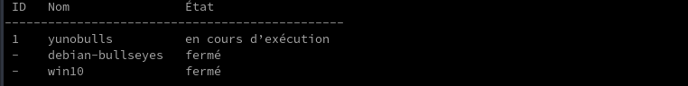
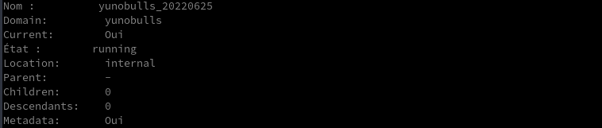

+++
title = 'Aide-mémoire virsh (virtualisation linux KVM)'
date = 2023-11-21 00:00:00 +0100
categories = ['virtuel']
+++
## Aide-mémoire virsh

Répertorier les machines virtuelles en cours d'exécution

    virsh list

Répertorier toutes les machines virtuelles

    virsh list --all

### Gestion état invité

Arrêt invité

    virsh shutdown $VM_ID_OR_NAME

Démarrer invité

    virsh start $VM_ID_OR_NAME

Redémarrer invité

    virsh reboot $VM_ID_OR_NAME

Détruire invité

Cette commande est un arrêt intempestif, un peu comme si vous deviez couper l'alimentation d'un ordinateur. Vous devez l'utiliser si un invité ne répond plus. Il ne supprime pas l'invité. L'image disque restera et l'invité pourra être redémarré.

    virsh destroy $VM_ID_OR_NAME

Suspension

La suspension est un moyen de "mettre en pause" immédiatement un invité afin qu'il n'utilise plus le processeur, le disque ou le réseau. Cependant, il continuera à résider dans la mémoire. Vous voudrez peut-être enregistrer/charger une session à la place, ce qui signifierait qu'elle ne prend plus de mémoire, mais n'est pas instantanée. afin qu'il ne consomme plus de mémoire et puisse être restauré dans son état exact (même après un redémarrage), il est nécessaire de sauvegarder et de restaurer l'invité.

>Une session suspendue sera perdue si le système hôte est redémarré. Cependant, un invité enregistré persiste.

Suspendre l'invité

    virsh suspend $VM_ID_OR_NAME


Reprendre l'invité

    virsh resume $VM_ID_OR_NAME

Supprimer

    virsh shutdown VM
    virsh undefine VM

### Définir

Définir un invité

Définir un invité permet de le démarrer à partir de son nom, plutôt que d'avoir à trouver son fichier XML et d'exécuter `virsh create $name.xml`. Cela signifie que les invités s'afficheront également dans `virsh list --all` lorsqu'ils seront arrêtés.

    sudo virsh define filename.xml

Annuler la définition d'un invité

Afin d'utiliser à nouveau un nom pour un nouvel invité, vous devez dédéfinir l'ancien. Vous devez également supprimer son système de stockage.

    sudo virsh undefine $VM_ID

### Configuration de l'invité

Vous pouvez modifier manuellement le fichier de configuration xml de l'invité avec :

    sudo virsh edit $VM_ID

Les modifications ne prendront effet qu'une fois l'invité redémarré

### Variantes de système d'exploitation

Lors de la création d'un invité avec `virt-install`, vous devez spécifier la --os-variant. Pour obtenir une liste des valeurs acceptables (sur Ubuntu 16.04), installez le package libosinfo-bin avant d'exécuter la commande ci-dessous :

    osinfo-query os

Renommer l'invité

    virsh domrename $OLD_NAME $NEW_NAME

>Vous ne pouvez le faire que lorsque l'invité n'est pas en cours d'exécution.

Démarrage invité au démarrage (démarrage automatique)

    sudo virsh autostart $VM_ID


Pour désactiver le démarrage automatique de l'invité

    sudo virsh autostart --disable $VM_ID

### Redimensionner la mémoire

Exécutez la commande suivante pour afficher la configuration de l'invité.

    sudo virsh edit $VM_ID

Modifiez les champs memory et currentMemory pour qu'ils correspondent à la taille souhaitée en KiB.

    programster - kvm cheatsheet_004.png

Utilisez maintenant virsh pour arrêter et démarrer le conteneur afin que les modifications prennent effet.

Redimensionner la mémoire avec un script

```
VM_ID="my_vm_id"
NEW_AMOUNT="4000"

EDITOR='sed -i "s;[0-9]*</currentMemory>;$NEW_AMOUNT</currentMemory>;"' virsh edit $VM_ID
EDITOR='sed -i "s;[0-9]*</memory>;$NEW_AMOUNT</memory>;"' virsh edit $VM_ID

sudo virsh shutdown $VM_ID
sudo virsh start $VM_ID
```

N'utilisez pas virsh memtune. Voir ici pour plus de détails.
Gestion du CPU
Découvrir les paramètres d'ordonnancement du CPU

    sudo virsh schedinfo $VM_ID

Définir de façon permanente les parts de CPU pour une instance en cours d'exécution en temps réel

```
sudo virsh schedinfo $VM_ID \
--set cpu_shares=[0-262144] \
--live \
--current \
--config
```

Obtenir les paramètres d'épinglage du CPU pour un invité

    virsh vcpupin blog.programster.org

Exemple de sortie :

```
VCPU: CPU Affinity
----------------------------------
   0: 0-3
   1: 0-3
```

J'ai obtenu le résultat ci-dessus parce que j'ai donné à l'invité l'accès à 2 vCPUs mais je n'ai rien épinglé.
Attacher un CPU

Si je voulais définir les cœurs qu'un invité peut utiliser, je pourrais faire ce qui suit :

    virsh vcpupin blog.programster.org 0 2

Cela configurera le premier vCPU (celui avec l'ID 0) pour qu'il ne fonctionne que sur l'ID 2. Ainsi, la sortie de virsh vcpupin blog.programster.org devient.. :

```
VCPU: CPU Affinity
----------------------------------
   0: 2
   1: 0-3
```

>L'épinglage pourrait être un excellent moyen de limiter l'effet d'un certain invité sur les autres, ou de donner à un invité un noyau dédié, etc.

### Console de l'invité

Entrez dans la console de l'invité

    sudo virsh console $VM_ID

Quitter la console de l'invité

Utilisez le raccourci clavier suivant (ce n'est pas une commande) :

	Cntrl-]

### Sauvegarder

Sauvegarder l'invité

    virsh save $VM_ID $FILENAME

Charger l'invité

    virsh restore $FILENAME

>Le nom de fichier ici est le même fichier que celui dans lequel vous avez sauvegardé dans la commande précédente, et non pas un des autres fichiers invités !

Clone simple d'invité

```
virt-clone \
--original $VM_TO_CLONE \
--auto-clone \
--name $NEW_VM_NAME
```

### Réseau

Liste des configurations réseau en cours d'exécution

    virsh net-list

Liste de toutes les configurations réseau

    virsh net-list --all


>Vous pouvez trouver les configurations réseau stockées dans `/home/stuart/network-configs/`.

Modifier une configuration réseau

    sudo virsh net-list $NETWORK_NAME

Créer une configuration réseau temporaire

    sudo virsh net-create --file $ABSOLUTE_FILE_PATH

Création d'une configuration réseau permanente

    sudo virsh net-define --file $ABSOLUTE_FILE_PATH

Exemple de fichier de configuration réseau de la passerelle


```
<network>
  <name>examplebridge</name>
  <forward mode='route'/>
  <bridge name='kvmbr0' stp='on' delay='0'/>
  <ip address='192.168.1.1' netmask='255.255.255.0' />
</network>
```

Démarrer la configuration du réseau

    sudo virsh net-start $NETWORK_ID

Activez le démarrage automatique du réseau

    net-autostart --network $NETWORK_ID

Désactiver le démarrage automatique du réseau

```
net-autostart \
--network $NETWORK_ID \
--disable
```

Exemple de configuration manuelle du réseau avec un pont

Voici un exemple de fichier `/etc/network/interfaces` pour les utilisateurs d'Ubuntu.

```
# The loopback network interface
auto lo
iface lo inet loopback

# The primary network interface
auto p17p1
iface p17p1 inet manual

auto kvmbr0
iface kvmbr0 inet static
    address 192.168.1.19
    netmask 255.255.255.0
    network 192.168.1.0
    broadcast 192.168.1.255
    gateway 192.168.1.254
    bridge_ports p17p1
    bridge_stp off
    bridge_fd 0
    bridge_maxwait 0
```

Ici une version netplan :

```
# This file describes the network interfaces available on your system
# For more information, see netplan(5).
network:
  version: 2
  renderer: networkd
  ethernets:
    enp39s0:
      dhcp4: no
  bridges:
    kvmbr0:
      addresses: [ 192.168.1.186/24 ]
      gateway4: 192.168.1.1
      nameservers:
        addresses:
          - 8.8.8.8
          - 8.8.4.4
      interfaces:
        - enp39s0
```

Configurer la VM pour utiliser le pont manuel

Si vous avez configuré manuellement le pont avec la section ci-dessus plutôt qu'en utilisant les commandes virsh net, voici comment configurer les invités déployés pour l'utiliser :

    sudo virsh edit $VM_ID

Trouvez la section suivante

```
    <interface type='network'>
      <mac address='52:54:00:4d:3a:bd'/>
      <source network=''/>
      <model type='virtio'/>
      <address type='pci' domain='0x0000' bus='0x00' slot='0x02' function='0x0'/>
    </interface>
```

Changez-le pour que ce soit comme ça :

```
    <interface type='bridge'>
        <mac address='52:54:00:4d:3a:bd'/>
        <source bridge='[bridge name here]'/>
        <model type='virtio'/>
        <address type='pci' domain='0x0000' bus='0x00' slot='0x02' function='0x0'/>
    </interface>
```

Maintenant, exécutez les deux commandes suivantes car les redémarrages ne fonctionnent pas.

    sudo virsh shutdown $VM_ID
    sudo virsh start $VM_ID

Ajouter une interface réseau à la VM

J'ai utilisé la commande ci-dessous pour ajouter une interface réseau à mon invité qui utilise l'interface pont de mon hôte appelée kvmbr1.

```
virsh attach-interface \
--domain guest1 \
--type bridge \
--source kvmbr1 \
--model virtio \
--config
```

> Si votre invité est en cours d'exécution à ce moment-là, vous devez ajouter le paramètre --live.  
Vous pouvez spécifier une adresse mac avec --mac mais sans cela, elle sera générée aléatoirement.

### Snapshotting

[How to Create KVM Virtual Machine Snapshot with Virsh Command](https://www.linuxtechi.com/create-revert-delete-kvm-virtual-machine-snapshot-virsh-command/)

Créer un instantané interne

    virsh snapshot-create $VM_ID


>Vous pouvez prendre des instantanés des invités pendant qu'ils sont en cours d'exécution. Pendant que l'instantané est pris, l'invité est "mis en pause". L'"état" de l'invité est également sauvegardé.

Créer un snapshot interne avec un nom

    sudo virsh snapshot-create-as $VM_ID $SNAPSHOT_NAME

Créer un instantané interne avec un nom et une description

    sudo virsh snapshot-create-as $VM_ID $SNAPSHOT_NAME $DESCRIPTION

Créer un instantané interne avec un nom et une description en utilisant un fichier

Si vous aimez écrire du xml, vous pouvez créer un fichier comme celui-ci :

```
<domainsnapshot>
    <name>Name for the snapshot</name>
    <description>Description for the snapshot</description>
</domainsnapshot>
```

... puis le passer à virsh snapshot-create pour créer le snapshot

    virsh snapshot-create $VM_ID $FILEPATH

Créer un snapshot externe

[Voir ici](https://blog.programster.org/kvm-external-snapshots)

Lister les snapshots

    sudo virsh snapshot-list $VM_ID


>Par défaut, la liste des instantanés est classée par ordre alphabétique plutôt que chronologique. Si vous voulez savoir quels sont vos derniers snapshots, vous pouvez ajouter les paramètres optionnels `--tree` ou `--leaves`.

Restaurer un instantané

    virsh snapshot-revert $VM_ID $SNAPSHOT_NAME

Supprimer un instantané

    virsh snapshot-delete $VM_ID $SNAPSHOT_NAME


>D'autres fonctionnalités de snapshot sont disponibles dans [Qcow2 Conversion and Snapshotting](https://blog.programster.org/qcow2-conversion-and-snapshotting/)

Modifier un instantané

Si vous utilisez virsh avec des snapshots internes qcow2 et que vous décidez de déplacer le fichier vers un autre emplacement, vous ne pourrez pas restaurer ces snapshots. Ceci est facilement résolu en éditant les snapshots et en mettant à jour le chemin du fichier.

    sudo virsh snapshot-edt $VM_ID_OR_NAME $NAME_OF_SNAPSHOT

## Instantané (snapshot) 

### Créer un instantané (snapshot)

*Sur des hyperviseurs basés sur KVM, nous pouvons prendre des machines virtuelles ou un instantané de domaine à l'aide de la commande virsh.*

Toutes les commandes seront exécutées en mode su : `sudo -s`

Nous ne pouvons prendre l'instantané que des machines virtuelles dont le format de disque est Qcow2 et le format de disque brut n'est pas pris en charge par la commande kvm virsh, utilisez la commande ci-dessous pour convertir le format de disque brut en qcow2  
`qemu-img convert -f raw -O qcow2 image-name.img image-name.qcow2`
{: .prompt-info }

On se rend dans le répertoire

    cd ~/virtuel/KVM/

Répertorier toutes les machines virtuelles sur l'hyperviseur  

    virsh list --all



Créer un instantané de la machine virtuelle KVM (yunobulls)

    virsh snapshot-create-as --domain yunobulls --name yunobulls_20220625 --description "snap yunohost 25-06-2022"

Une fois l'instantané créé, répertorier les instantanés liés à la machine virtuelle

    virsh snapshot-list yunobulls


Pour répertorier les informations détaillées de l'instantané de la VM

    virsh snapshot-info --domain yunobulls --snapshotname yunobulls_20220625



### Rétablir/Restaurer la machine virtuelle KVM

Supposons que nous voulions rétablir ou restaurer la machine virtuelle yunohost sur l'instantané yunobulls_20220625

    virsh snapshot-revert yunobulls yunobulls_20220625

### Supprimer les instantanés

Pour supprimer des instantanés de machine virtuelle KVM, obtenez d'abord les détails de l'instantané de la machine virtuelle à l'aide de la commande `virsh snapshot-list`, puis utilisez la commande `virsh snapshot-delete` pour supprimer l'instantané.

    virsh snapshot-list yunobulls


    virsh snapshot-delete --domain yunobulls --snapshotname yunobulls_20220625

## Liens

* [Managing KVM on RHEL 6 using the virsh Command-line Tool](http://www.techotopia.com/index.php/Managing_KVM_on_RHEL_6_using_the_virsh_Command-line_Tool)
* [Red Hat Docs - Chapter 20. Managing guests with virsh](http://www.centos.org/docs/5/html/5.2/Virtualization/chap-Virtualization-Managing_guests_with_virsh.html)
* [Libvirt Docs - net-create](ftp://libvirt.org/libvirt/virshcmdref/html/sect-net-create.html)
* [Libvirt Docs - net-define](ftp://libvirt.org/libvirt/virshcmdref/html/sect-net-define.html)
* [Ubuntu Docs - KVM/Managing](https://help.ubuntu.com/community/KVM/Managing)
* [virt-clone(1) - Linux man page](http://linux.die.net/man/1/virt-clone)
* [IBM - Working with libvirt cgroups](http://pic.dhe.ibm.com/infocenter/lnxinfo/v3r0m0/index.jsp?topic=%2Fliaat%2Fliaatseccglibvirt.htm)
* [Libvirt - memtune](ftp://libvirt.org/libvirt/virshcmdref/html/sect-memtune.html)
* [Using CGroups with libvirt and LXC/KVM guests in Fedora 12](https://www.berrange.com/posts/2009/12/03/using-cgroups-with-libvirt-and-lxckvm-guests-in-fedora-12/)
* [KVM - Changing Memory of Guests Live](http://serverfault.com/questions/623814/kvm-changing-memory-of-guests-live/623819#623819)
* [Stack Overflow - Changing the dhcp IP range in Virbr0's XML file using virsh in bash script](https://stackoverflow.com/questions/14365391/changing-the-dhcp-ip-range-in-virbr0s-xml-file-using-virsh-in-bash-script)
* [Nixcraft - KVM: Start a Virtual Machine / Guest At Boot Time](http://www.cyberciti.biz/faq/rhel-centos-linux-kvm-virtualization-start-virtual-machine-guest/)
* [Nixcraft - How to rename KVM virtual machine (VM) domain with virsh command](https://www.cyberciti.biz/faq/how-to-rename-kvm-virtual-machine-vm-domain-with-virsh-command/)
* [Redhat Docs - 8.3 LIBVIRT NUMA TUNING](https://access.redhat.com/documentation/en-US/Red_Hat_Enterprise_Linux/7/html/Virtualization_Tuning_and_Optimization_Guide/sect-Virtualization_Tuning_Optimization_Guide-NUMA-NUMA_and_libvirt.html)
* [How to Create and Manage KVM Virtual Machines via Command Line](https://www.linuxtechi.com/create-manage-kvm-virtual-machine-cli/)

