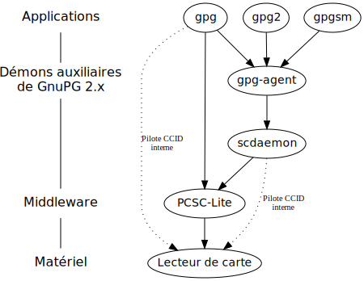

+++
title = 'OpenPGP card, une application de chiffrement pour carte à puce'
date = 2023-12-09 00:00:00 +0100
categories = chiffrement
+++
*Application chiffrement « OpenPGP » pour cartes à puce au format [ISO 7816](http://en.wikipedia.org/wiki/ISO/IEC_7816). Une carte à puce dotée d’une telle application vous permet d’y stocker et de protéger vos clefs OpenPGP privées.*


## Présentation

La carte OpenPGP a été imaginée par les développeurs à l’origine de [GnuPG](http://www.gnupg.org/) et est spécialement conçue pour fonctionner avec ce dernier. Son utilisation est aussi transparente que possible et avoir vos clefs privées sur une carte OpenPGP ne change fondamentalement rien à la manière d’utiliser GnuPG : la seule différence est qu’à chaque fois que GnuPG aura besoin d’accéder à une de vos clefs privées, au lieu de vous demander la phrase de passe protégeant la clef sur votre disque dur, il vous demandera le PIN de la carte.


Outre la signature et le déchiffrement de messages OpenPGP, les autres usages possibles de la carte incluent :


- la signature ou le déchiffrement de messages S/MIME ;
- l’authentification auprès d’un serveur SSH ;
- l’authentification auprès d’un serveur TLS ;
- et probablement d’autres qui restent à imaginer ou à mettre en œuvre.


### Les clefs cryptographiques

La carte OpenPGP permet de stocker jusqu’à trois clefs privées, une pour chaque type d’utilisation : une clef de (dé)chiffrement, une clef de signature et une clef d’authentification.


Le rôle majeur de la carte est de *protéger ces clefs privées*.  Lorsqu’elles sont stockées sur la carte, il est par conception impossible de les en extraire, elles ne peuvent qu’être utilisées « sur place ».


Ainsi, toutes les opérations cryptographiques nécessitant l’une de ces clefs sont réalisées directement *sur la carte elle-même* : l’ordinateur envoie à la carte les données à déchiffrer [^1] , signer ou authentifier et il reçoit le résultat de l’opération en retour, sans jamais avoir entraperçu les clefs.


> **Note**
>
> Faire réaliser les opérations cryptographiques par la carte ne les rend pas plus rapides, pour au moins trois raisons :
>
> -   il est peu probable que le processeur de la carte, même s’il est spécialisé, soit plus véloce que votre CPU ;
>
> -   l’échange de données entre l’ordinateur et la carte introduit un délai non négligeable ;
>
> -   la carte ne réalise en réalité qu’une partie du travail, le reste restant à la charge de l’ordinateur (précisément, entre autres, pour limiter le volume de données à transférer entre les deux appareils) ; par exemple, pour déchiffrer un message OpenPGP, la carte n’est responsable que du déchiffrement de la clef de session symétrique (soit seulement 16 octets pour une clef AES 128 bits) — le déchiffrement du corps du message est fait par l’ordinateur, une fois qu’il a obtenu de la carte la clef de session déchiffrée.
>
> Bref, il ne faut pas compter sur la carte pour *accélérer* les opérations cryptographiques, ce n’est pas son but.


Pour l’instant, les clefs de la carte ne peuvent être que des clefs RSA — d’autres types de clefs, notamment à base de [courbes elliptiques](http://tools.ietf.org/html/rfc6637) dont la prise en charge arrive dans GnuPG 2.1, seront probablement possibles à l’avenir. La spécification garantit une taille minimale pour chaque clef de 1024 bits et n’impose pas de taille maximale. En pratique, toutes les implémentations courantes devraient permettre des clefs de 2048 bits et certaines permettent des clefs de 4096 bits (c’est notamment le cas de l’implémentation de référence de ZeitControl — voir plus loin).


### Sécurité de la carte

La carte OpenPGP est protégée par deux ou (optionnellement) trois codes PIN, désignés PW1 ou « PIN utilisateur » (_User PIN_, parfois appelé seulement « PIN », par opposition au suivant), PW3 ou « PIN administrateur » (_Admin PIN_) et RC (_Resetting Code_, optionnel).


Les opérations de la carte peuvent être classées en fonction du PIN nécessaire pour les réaliser :


-   aucun PIN n’est nécessaire pour *lire* les données de la carte ;
-   le PIN utilisateur est demandé pour toute opération exploitant les clefs privées (signature, déchiffrement, authentification) et pour changer le PIN utilisateur lui-même ;
-   le PIN administrateur est demandé pour presque toutes les *écritures* sur la carte (modification des informations stockées sur la carte, importation ou génération de clefs privées, changement d’un PIN autre que le PIN utilisateur).


À chaque PIN est associé un compteur d’essai (*Retry Counter*), qui est décrémenté à chaque saisie incorrecte du PIN. Tant que le compteur est supérieur à zéro, il suffit de saisir le PIN correct pour remettre le compteur à trois. Lorsque le compteur tombe à zéro, la vérification du PIN correspondant n’est plus possible et toutes les opérations dépendantes de cette vérification sont interdites. Dans ce cas, il faut enregistrer un nouveau PIN pour remettre le compteur à trois.


Concrètement, cela signifie ① que trois saisies erronées consécutives du PIN utilisateur entraînent un blocage de la carte (puisque toutes les opérations cryptographiques nécessitent de vérifier le PIN utilisateur), ② que la carte peut être débloquée en changeant le PIN utilisateur, après avoir saisi le PIN administrateur, ③ qu’après trois saisies erronées consécutives du PIN administrateur, la carte est *irréversiblement* bloquée (puisqu’il faudrait changer le PIN administrateur pour remettre son compteur d’essai à trois, or cela nécessite de vérifier le PIN administrateur, ce qui n’est justement pas possible si son compteur est à zéro).


> **Note**
>
> Certaines implémentations prévoient néanmoins la possibilité de ré-initialiser complètement une carte dont les compteurs d’essai des PIN utilisateur et administrateur sont tous les deux à zéro. La ré-initialisation efface toutes les données de la carte, restaure les PIN utilisateur et administrateur par défaut et remet leur compteur à trois.


Et le *Resetting Code* ? S’il est défini, il peut être utilisé à la place du PIN administrateur pour ré-initialiser le PIN utilisateur et donc débloquer la carte. Peu pertinent pour une utilisation individuelle, le RC est surtout utile dans les situations où la carte est délivrée par une autorité à un utilisateur qui n’est pas supposé en modifier le contenu et à qui on ne veut donc pas révéler le PIN administrateur, mais que l’on veut tout de même autoriser à débloquer sa carte tout seul. (Le RC est donc assimilable au code « PUK » utilisé pour débloquer une carte SIM.) Par défaut, aucun *Resetting Code* n’est défini et son compteur d’essai est à zéro.


Le PIN utilisateur doit faire au minimum 6 caractères, le PIN administrateur et le _Resetting Code_ au minimum 8. La taille maximale n’est pas définie dans la spécification (elle est de 32 caractères pour chaque PIN sur l’implémentation de référence de ZeitControl). Il est possible d’utiliser n’importe quel caractère UTF-8 et non pas seulement des chiffres, mais un code non-numérique ne pourra pas être saisi sur le clavier intégré à certains lecteurs de carte.


Dans la suite de ce document, « PIN » sans précision désignera implicitement le PIN utilisateur. Lorsqu’il sera question du PIN administrateur, il sera toujours désigné explicitement.


### Données stockées sur la carte

Outre les clefs privées, la carte OpenPGP contient un certain nombre de champs (“_Data Objects_” ou DO, dans le jargon des cartes à puce) pour stocker des données supplémentaires.

#### Les champs à usage défini

Ce sont des champs dont l’usage est explicitement défini dans la spécification de la carte OpenPGP. Toutefois, GnuPG n’utilise pas lui-même la plupart de ces champs — il permet de les consulter et les modifier, mais c’est à l’utilisateur ou à d’autres programmes exploitant la carte de leur trouver une utilisation.

Ces champs sont :


- le nom du détenteur de la carte ;
- son sexe ;
- ses préférences linguistiques : une liste de 1 à 4 codes de langue au format [ISO 639-1](http://fr.wikipedia.org/wiki/Liste_des_codes_ISO_639-1) ;
- son « identifiant » : la spécification mentionne la possibilité qu’un système d’authentification basée sur la carte OpenPGP utilise ce champ pour savoir sur quel compte connecter l’utilisateur une fois qu’il a saisi son PIN, mais je ne connais pas de systèmes qui le font ;
- un certificat : typiquement, un certificat X.509, mais n’importe quel autre format est possible (GnuPG traite ce champ comme un simple blob binaire) ;
- une URL vers la clef publique de l’utilisateur : GnuPG s’en sert pour rapatrier automatiquement la clef publique en question, ce qui permet d’avoir rapidement un trousseau opérationnel lorsque vous êtes amenés à travailler sur une machine qui n’est pas la vôtre ;
- jusqu’à trois « empreintes de clefs de confiance » (“_CA Fingerprints_”) : des empreintes SHA-1 de clefs considérées valides et auxquelles il est fait une confiance absolue — là encore, GnuPG ne se sert pas de ces champs et je ne connais aucun exemple concret d’utilisation.


#### Les champs privés ou à usage indéfini


En plus des champs ci-dessus, la version 2.0 de la spécification définit 4 champs inutilisés, de 254 octets chacun, dont l’usage est entièrement et officiellement laissé à la discrétion de l’utilisateur : les “_Private Use DOs_” 1 à 4.


La différence entre ces 4 champs réside dans le PIN demandé pour y accéder en lecture ou en écriture :


private #    | . | Lecture            | . | Écriture
-------------|---|--------------------|---|--------------------
Private DO 1 | . | aucun PIN          | . | PIN utilisateur
Private DO 2 | . | aucun PIN          | . | PIN administrateur
Private DO 3 | . | PIN utilisateur    | . | PIN administrateur
Private DO 4 | . | PIN administrateur | . | PIN administrateur


(On notera que ces conditions s’écartent quelque peu du principe général [énoncé plus haut](#s%C3%A9curit%C3%A9-de-la-carte) selon lequel la lecture de la carte ne demande pas de PIN et l’écriture demande le PIN administrateur.)


Ces champs sont vides par défaut, il appartient à chacun d’imaginer l’usage qu’il peut en faire. (La carte fournie par la FSFE à ses adhérents contient, dans le Private DO 2, le numéro, le nom et l’adresse électronique en @fsfe.org de l’adhérent.)


## Le matériel


### La carte à puce

La « carte OpenPGP » est juste une spécification ; tout le monde peut l’implémenter sur le support de son choix.


Actuellement, l’implémentation la plus répandue est réalisée sur la carte [BasicCard](http://www.zeitcontrol.de/en/products/chip-cards/processor-chip-cards/basiccard) de ZeitControl, une carte à puce programmable en BASIC. Elle est distribuée par [Kernel Concepts](http://shop.kernelconcepts.de/product_info.php?cPath=1_26&products_id=42).  La [Free Software Foundation Europe](http://www.fsfe.org/) fournit également à tous ses nouveaux *fellows* un [exemplaire personnalisé de cette carte](http://wiki.fsfe.org/FellowshipSmartCard), aux couleurs de la FSFE et sérigraphié au nom de l’adhérent.


[Gnuk](http://www.fsij.org/doc-gnuk/intro.html) est une implémentation de la carte OpenPGP pour microcontrôleur STM32F103, permettant notamment de réaliser un *token USB* — un périphérique qui apparaît, aux yeux de l’ordinateur, comme un lecteur de cartes à puce classique contenant une carte unique insérée en permanence. Le [FST-01](http://www.seeedstudio.com/wiki/FST-01) est un exemple d’un tel token basé sur Gnuk, il est disponible auprès de [Seeed Bazaar](http://www.seeedstudio.com/depot/FST-01-with-White-Enclosure-p-1279.html).


Le [CryptoStick](https://www.assembla.com/spaces/cryptostick/wiki/Home) est un autre token USB formé d’une carte OpenPGP physique (celle de ZeitControl, _a priori_) embarquée dans un boîtier USB. Le projet [envisage](https://www.crypto-stick.com/2013/project-roadmap) aussi de créer une version basée sur Gnuk.


Il existe aussi [plusieurs](https://github.com/FluffyKaon/OpenPGP-Card) [implémentations](http://sourceforge.net/projects/javacardopenpgp/) ciblant des [[Java Card]]s (cartes à puce programmables en Java). La [YubiKey NEO](http://www.yubico.com/products/yubikey-hardware/yubikey-neo/) en contient une, désactivée par défaut — Yubico fournit [les instructions pour l’activer](http://www.yubico.com/2012/12/yubikey-neo-openpgp/).


### Le lecteur de cartes


À moins d’opter pour un token USB comme le FST-01, le CryptoStick ou la YubiKey, un lecteur de cartes à puce est évidemment nécessaire pour utiliser une carte OpenPGP.


Il existe une grande variété de lecteurs, voici les principaux points à considérer pour choisir le sien.


**Port série, port PCMCIA ou port USB ?** La plupart des lecteurs aujourd’hui sont des lecteurs USB — et, faute d’expérience de l’auteur avec les autres types de lecteurs, ce sont les seuls dont il sera question dans cet article.


**Clavier intégré ?** Un petit nombre de lecteurs contiennent un clavier intégré permettant de saisir le PIN directement sur le lecteur (par exemple [le SPR 332 de SCM Microsystems](http://www.scm-pc-card.de/index.php?page=product&function=show_product&lang=en&product_id=670)). L’intérêt en termes de sécurité est que dans ce cas, le PIN ne passe jamais par l’ordinateur et n’est pas susceptible d’être enregistré par un éventuel _keylogger_ ou autre logiciel malveillant. Attention, le clavier ne comprend la plupart du temps que des chiffres, interdisant la saisie d’un PIN qui ne serait pas entièrement numérique ; certains de ces lecteurs limitent aussi la longueur maximale du PIN, qui peut être plus courte que ce qu’autorise la carte OpenPGP.


**Prise en charge de l’_Extended APDU_ ?** Les APDU (_Application Protocol Data Unit_) sont les messages échangés entre la carte à puce et son lecteur. Ils peuvent être _short_ (les données transmises sont limitées à 256 octets) ou _extended_ (données limitées à 65536 octets). Pour importer une clef de 1024 bits sur la carte OpenPGP, le lecteur doit prendre en charge les _extended APDU_.


Un autre point important est bien sûr la prise en charge du lecteur sous votre système. La question des pilotes sera abordée dans la section suivante, mais disons tout de suite que sous GNU/Linux, vous vous simplifierez probablement la tâche en choisissant un lecteur conforme à la norme CCID (_Chip/Card Interface Device_). Le [pilote ccid](https://pcsclite.alioth.debian.org/ccid.html) prend en charge une grande partie de ces lecteurs et ses développeurs tiennent à jour [des listes des lecteurs pris en charge ou non](https://pcsclite.alioth.debian.org/ccid.html#readers) — et indiquent en plus pour chaque lecteur les problèmes potentiels comme l’absence de gestion des _extended APDU_.


L’auteur de ces lignes a choisi pour sa part le [SCR 3500 SmartFold](http://identive-infrastructure.com/pdf/usa/Dat_SCR3500_e.pdf) de SCM Microsystems (maintenant Identive), un petit lecteur compact et aisément transportable. Il fait partie des lecteurs qui « devraient fonctionner » (*should work readers*) avec le pilote ccid et je confirme qu’il fonctionne bien. Pour ce que ça vaut, j’en suis satisfait, même si je le trouve un peu trop fragile pour l’utilisation nomade à laquelle sa taille le destine.


## Les logiciels


En règle générale, l’utilisation de cartes à puce nécessite une pile logicielle à trois niveaux : un pilote pour le lecteur de cartes, un _middleware_ exposant une API standard d’accès aux cartes à puce (permettant aux applications de faire abstraction du matériel et des pilotes) et les applications utilisatrices.


### Les pilotes de lecteurs de carte


Le pilote ccid déjà évoqué ci-dessus prend en charge un grand nombre de lecteurs USB compatibles avec la norme CCID. Cela inclut également les _tokens_ USB comme le CryptoStick, les _tokens_ basés sur Gnuk ou le YubiKey NEO, qui sont tous compatibles CCID.


Il existe également des pilotes plus spécifiques pour des modèles précis de lecteurs. Pour les utilisateurs de Debian (et dérivés), le paquet virtuel [pcsc-ifd-handler](https://packages.debian.org/wheezy/pcsc-ifd-handler) en fournit commodément une liste.


Des modèles non-pris en charge par les pilotes libres disposent parfois d’un pilote propriétaire fourni par le constructeur. C’est le cas par exemple des lecteurs de la gamme HID Omnikey, dont les pilotes sont disponibles sur [www.hidglobal.com/drivers](http://www.hidglobal.com/drivers).


Libre ou non, le pilote d’un lecteur USB doit être installé dans un dossier appelé `_nom-du-pilote_.bundle`, lui-même situé dans le dossier `/usr/local/pcsc/drivers` (par défaut — ce dossier est configurable à la compilation de PCSC-Lite, vous pouvez consulter la page de manuel de pcscd(8) pour connaître le chemin effectif sur votre système). Vous pouvez bien sûr ignorer cette étape si le pilote est fourni dans les paquets de votre distribution.

### Le middleware PCSC-Lite

[PCSC-Lite](http://pcsclite.alioth.debian.org/pcsclite.html) est une implémentation libre pour systèmes Unix-like (y compris Mac OS X) de l’API Windows SCard, introduite dans Windows XP/Windows Server 2003 et normalisée par la suite sous le nom de [spécification PC/SC](http://www.pcscworkgroup.com/specifications/overview.php).

PCSC-Lite comprend deux composants : un démon (pcscd) qui gère le lecteur et communique avec la carte et une bibliothèque (libpcsclite.so), qui expose l’API PC/SC aux programmes qui lui sont liés.

Le paquet de PCSC-Lite fourni par votre distribution devrait faire le nécessaire pour que le démon pcscd soit automatiquement lancé au démarrage. Si ce n’était pas le cas, consultez la documentation de votre système pour savoir comment ajouter le script shell / le _job_ Upstart / l’unité Systemd / le truc lanceur de machins appropriés à votre système.

À son lancement, le démon pcscd détecte automatiquement les lecteurs de carte présents sur le système. En revanche, si vous connectez votre lecteur série ou PCMCIA _après_ le lancement du démon, celui-ci ne le détectera pas automatiquement, il faudra utiliser `pcscd --hotplug` pour l’inciter à rescanner ; ceci n'est pas nécessaire pour les lecteurs USB (cf [commentaire](//linuxfr.org/news/openpgp-card-une-application-cryptographique-pour-carte-a-puce#comment-1579401).

Sinon il est possible d'utiliser une règle Udev semblable à la suivante (à ajouter dans `/etc/udev/rules.d/90-local.rules`, ou l’équivalent pour votre distribution) :

```text
ACTION=="add", SUBSYSTEM=="usb", ATTR{idVendor}=="04e6", ATTR{idProduct}=="5410", RUN+="/usr/sbin/pcscd --hotplug"
```

où _04e6_ et _5410_ identifient le fournisseur et le modèle de votre lecteur, respectivement (les valeurs données ici correspondent au SCR 3500 de l’auteur, vous pouvez trouver celles correspondants à votre modèle avec `lsusb -v` par exemple).

Si pcscd tourne sous un compte utilisateur dédié non-privilégié (ce qui est recommandé), il faut de plus s’assurer que ledit compte possède les droits sur le lecteur de carte. Le plus simple pour cela est de compléter la règle Udev ci-dessus en ajoutant les clefs suivantes (en supposant ici que pcscd tourne sous le compte utilisateur _scard_) :

```text
[…], OWNER="scard", MODE="600"
```

### GnuPG

GnuPG est bien entendu la principale application utilisatrice de la carte OpenPGP et c’est la seule qui sera abordée dans cet article.  Sachez néanmoins que d’autres applications peuvent exploiter cette carte. En effet, quoique développée spécifiquement pour les besoins de GnuPG, la carte OpenPGP est compatible avec le [standard PKCS\#15](http://www.emc.com/emc-plus/rsa-labs/standards-initiatives/pkcs-15-cryptographic-token-information-format.htm), qui définit une manière commune de stocker et d’accéder à des données cryptographiques sur une carte à puce. En fait, on peut voir la carte OpenPGP comme une carte PKCS\#15, avec quelques spécificités propres à OpenPGP en plus. (Réciproquement, GnuPG peut aussi exploiter des cartes PKCS\#15 standards en plus de « sa » carte OpenPGP.)


#### À propos des versions de GnuPG


Il existe actuellement trois variantes de GnuPG : la branche 1.x, dite « classique », dont la dernière version à l’heure où ces lignes sont écrites est la 1.4.18 ; la branche 2.0.x dite « stable » (dernière version : 2.0.26) ; et la nouvelle version 2.1.1 dite « moderne » [qui vient tout juste de sortir](http://lists.gnupg.org/pipermail/gnupg-users/2014-December/051953.html) le 16 décembre 2014.


Toutes les variantes permettent d’utiliser la carte OpenPGP, mais GnuPG 1.x seul ne permet que les opérations « de base » (éditer le contenu de la carte, déchiffrer et signer des messages OpenPGP). Les usages plus avancés qui seront décrits plus loin et, notamment, l’utilisation de la clef d’authentification, nécessitent les outils auxiliaires apportés par la branche 2.x, en particulier l’agent GnuPG (gpg-agent). GnuPG 2.x est donc conseillé pour exploiter tout le potentiel de la carte OpenPGP.


> **Note**
>
> Incidemment, avec la sortie de GnuPG 2.1.0 il semble clair que GnuPG 1.x n’a probablement pas beaucoup d’avenir sur le bureau. Entre autres indices :
>
> -   Les algorithmes à base de courbes elliptiques, qui viennent de faire leur entrée dans GnuPG 2.1, [ne seront pas pris en charge par GnuPG 1.x](http://lists.gnupg.org/pipermail/gnupg-users/2014-November/051294.html).
> -   GnuPG 2.1 introduit [un nouveau format de stockage des trousseaux de clefs](https://www.gnupg.org/faq/whats-new-in-2.1.html#nosecring) incompatible avec celui des précédentes versions. Auparavant, il était possible d’utiliser conjointement GnuPG 1.x et GnuPG 2.0.x avec un trousseau commun, puisque les deux versions utilisaient le même format. Désormais, si la cohabitation de GnuPG 1.x et GnuPG 2.1 est toujours possible, les deux versions utiliseront chacune un trousseau distinct et les modifications faites avec GnuPG 1.x ne seront pas répercutées sur le trousseau de GnuPG 2.1 et inversement.
> -   Werner Koch lui-même [explique](http://lists.gnupg.org/pipermail/gnupg-devel/2014-November/029091.html) qu’il maintient GnuPG 1.x principalement pour les besoins des anciennes plates-formes et des serveurs.


Dans le reste de ce document, je supposerai l’utilisation de GnuPG 2.x, en faisant lorsque c’est nécessaire la distinction entre 2.0 et 2.1.  Les captures de sortie standard seront issues de GnuPG 2.0.26, mais sauf mention contraire, tous les exemples seront applicables à GnuPG 2.1.


Si vous tenez à utiliser GnuPG 1.x, sachez que vous pouvez l’utiliser conjointement avec l’agent GnuPG de la branche 2.x. Dans ce cas, certains des « usages avancés » vous seront accessibles, notamment l’authentification SSH. En revanche, si vous tenez à utiliser GnuPG 1.x *seulement* (sans agent), vous ne pourrez pas faire usage de la clef d’authentification (en tout cas pas avec GnuPG).


#### Comment GnuPG accède au lecteur de carte


Les applications de GnuPG 2.x (`gpg2` et `gpgsm`) n’accèdent jamais directement au lecteur de carte, dont ils sont séparés par plusieurs niveaux d’indirection. Elles interagissent seulement avec l’agent GnuPG, un démon qui gère les clefs secrètes et les phrases de passe pour l’ensemble du système GnuPG 2.x.


L’agent GnuPG lui-même délègue la gestion des cartes à puce à un autre démon, Scdaemon (SmartCard Daemon). C’est lui seul qui s’occupe de détecter le lecteur de carte et de communiquer avec la carte qu’il contient. Il utilise [un protocole ad-hoc](https://www.gnupg.org/documentation/manuals/gnupg/Scdaemon-Protocol.html#Scdaemon-Protocol) pour recevoir ses instructions de l’agent GnuPG.


Scdaemon dispose de deux options pour accéder au lecteur de carte. Dans le cas général, il utilise le *middleware* PCSC-Lite que nous avons vu précédemment. Mais il peut aussi utiliser un petit pilote CCID interne, qui lui permet de communiquer directement avec les lecteurs USB compatibles sans passer par un intermédiaire.


GnuPG 1.x, de son côté, *peut* utiliser l’agent GnuPG (ce qu’il fait automatiquement par défaut, s’il détecte qu’un agent est en cours d’exécution), auquel cas tout se passe comme avec GnuPG 2.x. Mais il peut aussi se passer des démons auxiliaires et communiquer seul avec le lecteur de carte.





#### Le pilote CCID interne


Comme évoqué à l’instant, GnuPG (toutes versions confondues) contient un petit pilote générique pour les lecteurs compatibles CCID. Ses développeurs décrivent ce pilote comme “un pilote limité […] à utiliser en dernier recours quand rien d’autre ne fonctionne ou que l’on tient à avoir un système minimal pour des raisons de sécurité”.[^2]


Si votre lecteur de carte est pris en charge par le pilote interne, vous pouvez être tenté de simplifier la pile logicielle en vous passant du *middleware* PCSC-Lite. Gardez toutefois à l’esprit que le pilote interne est spécifique à GnuPG : si vous prévoyez d’utiliser votre lecteur pour d’autres applications (ne serait-ce que pour explorer, par curiosité, le contenu de votre carte bancaire, de votre carte vitale ou de votre carte de transports en commun, par exemple avec [Cardpeek](http://pannetrat.com/Cardpeek/)), vous aurez besoin de PCSC-Lite de toute façon.


Pour utiliser PCSC-Lite, il suffit que le démon de PCSC-Lite soit démarré : GnuPG tentera d’accéder au lecteur avec son pilote interne, échouera puisque le lecteur sera déjà monopolisé par pcscd et se rabattra, automatiquement, sur PCSC-Lite (vous pouvez éventuellement désactiver explicitement le pilote interne, en ajoutant l’option `disable-ccid` dans le fichier de configuration de scdaemon, `$GNUPGHOME/scdaemon.conf`).


Inversement, pour utiliser le pilote interne, assurez-vous que PCSC-Lite n’est pas installé (ou, *a minima*, que son démon n’est pas démarré) et que votre propre compte utilisateur, sous l’identité duquel tourne GnuPG, a accès au lecteur de carte.


#### L’agent GnuPG


L’agent GnuPG (`gpg-agent`) est indispensable au bon fonctionnement de GnuPG 2.x. et à l’exploitation de toutes les fonctionnalités de la carte OpenPGP. GnuPG 2.1.0 a introduit quelques changements importants dans la façon d’utiliser l’agent, il est donc utile de profiter de cet article pour les aborder.


**GnuPG 2.0.x**


L’agent GnuPG 2.0.x peut être soit lancé au démarrage d’une session utilisateur, soit à la demande sitôt qu’un composant de GnuPG en a besoin.


Pour démarrer l’agent en même temps que votre session graphique, ajoutez simplement la ligne suivante à votre fichier `~/.xprofile` :


```
    eval $(gpg-agent --daemon)
```


Puis redémarrez votre session. L’agent sera lancé en même temps et écoutera sur une *socket* Unix au nom aléatoire et la variable GPG\_AGENT\_INFO sera définie dans l’environnement, pour permettre aux composants de GnuPG de trouver l’agent en cours d’exécution.


Notez que votre gestionnaire de paquets s’est peut-être déjà chargé de ça pour vous — c’est au moins le cas sur Debian, où le paquet `gnupg-agent` ajoute un script `/etc/X11/Xsession.d/90gpg-agent` à cet effet.


Si vous préférez que l’agent soit démarré seulement quand il est nécessaire plutôt que systématiquement au début de la session, il doit être configuré pour utiliser une *socket* au nom constant et prédéfinie (`$GNUPGHOME/S.gpg-agent`). Cela se fait soit à la compilation, en passant l’option `--enable-standard-socket` au script `configure`, soit à l’exécution en ajoutant l’option `use-standard-socket` dans le fichier de configuration de l’agent (`$GNUPGHOME/gpg-agent.conf`). Une fois l’agent configuré ainsi, la ligne ci-dessus dans le fichier `~/.xprofile` n’est plus nécessaire, le premier programme de GnuPG 2.0.x ayant besoin de l’agent en invoquera automatiquement un s’il ne détecte pas la *socket* « standard ».


Le démarrage à la demande a toutefois l’inconvénient que seuls les composants de GnuPG 2.x sont capables de démarrer l’agent ainsi. GnuPG 1.x par exemple ne peut pas le faire et même si vous ne prévoyez d’utiliser que GnuPG 2.x, gardez à l’esprit que certains *frontends* graphiques (comme Enigmail par exemple) font par défaut appel à GnuPG 1.x. Vous devez donc soit modifier la configuration de ces *frontends*, pour qu’ils appellent `gpg2` au lieu de `gpg`, soit forcer tout de même l’agent à démarrer au début de la session pour que `gpg` puisse le trouver.


Une autre raison de forcer le démarrage de l’agent en début de session est si vous prévoyez de l’utiliser comme agent SSH (ce qui est nécessaire pour utiliser la carte OpenPGP pour s’authentifier auprès d’un serveur SSH, comme nous le verrons plus loin) : cela permet de s’assurer que l’agent sera toujours disponible pour les clients SSH (qui ne sont évidemment pas conçus pour lancer un agent GnuPG à la demande).


**GnuPG 2.1.x**


L’agent de GnuPG 2.1.x utilise toujours une *socket* standard et peut donc toujours être lancé à la demande sans qu’aucune configuration particulière ne soit nécessaire.


Toutefois, pour les mêmes raisons que ci-dessus, il reste pertinent de forcer le démarrage de l’agent en début de session : pour être sûr que GnuPG 1.x et les programmes SSH soient capables de le trouver quand ils en ont besoin. Pour cela, ajoutez la ligne suivante dans votre fichier `~/.xprofile` :


```
    gpg-connect-agent /bye
    export GPG_AGENT_INFO=$HOME/.gnupg/S.gpg-agent:0:1
```


La première ligne force le démarrage de l’agent (`gpg-connect-agent` est un utilitaire permettant de communiquer avec l’agent GnuPG ; comme les autres composants de GnuPG 2.1.0, il lance automatiquement un nouvel agent s’il n’en détecte pas un déjà en cours d’exécution). La deuxième définit la variable GPG\_AGENT\_INFO au bénéfice de GnuPG 1.x (vous pouvez vous en passer si vous ne prévoyez pas du tout d’utiliser GnuPG 1.x, que ce soit directement ou via un *frontend*).


Si vous prévoyez d’utiliser l’agent GnuPG comme agent SSH, ajoutez en plus la ligne suivante, au bénéfice des clients SSH :


```
    export SSH_AUTH_SOCK=$HOME/.gnupg/S.gpg-agent.ssh
```


## Préparer la carte


### Changer les PIN 


La carte peut vous être fournie soit avec des PIN par défaut, qui sont alors 123456 pour le PW1 et 12345678 pour le PW3, soit avec des PIN personnalisés qui doivent alors vous être communiqués (c’est le cas par exemple si vous obtenez la carte auprès de la Free Software Foundation Europe). Dans tous les cas, vous devriez changer ces PIN au plus tôt.


Insérez la carte dans le lecteur et lancez l’éditeur de carte de GnuPG, qui vous accueille en listant le contenu des principaux _DO_ de la carte :


```sh
$ gpg2 --card-edit
Application ID ...: D2760001240102000005000012340000
Version ..........: 2.0
Manufacturer .....: ZeitControl
Serial number ....: 00001234
Name of cardholder: [not set]
Language prefs ...: de
Sex ..............: [not set]
URL of public key : [not set]
Login data .......: [not set]
Signature PIN ....: forced
Max. PIN lengths .: 32 32 32
PIN retry counter : 3 0 3
Signature counter : 0
Signature key ....: [not set]
Encryption key ...: [not set]
Authentication key: [not set]

gpg/card>
```


(Lorsque vous voudrez juste afficher le contenu de la carte, vous pourrez obtenir la même sortie avec la commande non-interactive ``gpg2 --card-status``.)


Vous êtes alors dans le menu d’édition de carte de GnuPG, signalé par l’invite `gpg/card>`. Lorsque vous arrivez dans ce menu, la plupart des commandes d’édition ne sont pas immédiatement disponibles, il faut les demander explicitement avec la commande `admin` :


```
    gpg/card> admin
    Admin commands are allowed.
```


Vous pouvez à présent accéder au menu relatif aux différents PIN :


```
    gpg/card> passwd
    1 - change PIN
    2 - unblock PIN
    3 - change Admin PIN
    4 - set the Reset Code
    Q - Quit
```


Changez successivement le PIN administrateur (option 3 — le PIN administrateur actuel, celui par défaut, vous sera alors demandé), puis le PIN utilisateur (option 1).


> **Attention**
>
> Souvenez‐vous que que la carte impose une longueur minimale pour chaque code PIN. Un code PIN utilisateur de moins de 6 caractères sera refusé, de même qu’un PIN administrateur de moins de 8 caractères. Les longueurs maximales, non définies par la spécification, sont, quant à elles, indiquées par la ligne *Max. PIN lengths* dans la sortie ci‐dessus (dans l’ordre PIN utilisateur, *Reset Code*, PIN administrateur).


### Modifier les données de la carte 


Pendant que vous êtes dans le menu d’édition, vous pouvez remplir les différents champs de données concernant le porteur de la carte (je supposerai par la suite que vous vous appelez *Alice*, par souci de la tradition) :


```
gpg/card> name
Cardholder's surname: Smith
Cardholder's given name: Alice

gpg/card> lang
Language preferences: fr

gpg/card> sex
Sex ((M)ale, (F)emale or space): F

gpg/card> url
URL to retrieve public key: http://example.net/~alice/pgp.asc

gpg/card> login
Login data (account name): alice
```


Vous pouvez aussi écrire dans [les champs privés](#les-champs-priv%C3%A9s-ou-%C3%A0-usage-ind%C3%A9fini) avec la commande `privatedo`, même si celle-ci n’apparaît pas dans le menu de l’éditeur de carte. Par exemple, pour écrire dans le *Private DO 1* :


```
gpg/card> privatedo 1
Private DO data: lorem ipsum dolor sit amet
```


Même chose à partir d’un fichier :


```
gpg/card> privatedo 1 < fichier
```


Quand vous avez modifié ce que vous vouliez, quittez l’éditeur pour revenir à l’invite de commande du shell :


```
gpg/card> quit
```


### Les clefs privées 


Avant de pouvoir utiliser la carte pour des opérations cryptographiques, il faut y stocker des clefs privées.


Les clefs peuvent être générées directement sur la carte, auquel cas GnuPG récupère les clefs publiques correspondantes et les importe dans le trousseau public. Attention, dans ce cas la carte contient les *seuls* exemplaires existants des clefs privées, aucune sauvegarde n’est possible puisque, par conception, on ne peut pas extraire les clefs privées de la carte.


L’autre option consiste à générer les clefs, comme d’habitude, sur son ordinateur, puis à importer les clefs privées sur la carte. Elles sont alors supprimées du trousseau privé et remplacées par des *stubs* dont la seule fonction est d’indiquer à GnuPG que les vraies clefs privées sont sur une carte à puce.


C’est cette option que nous allons voir à présent — après tout si vous vous êtes procuré une carte OpenPGP, c’est que vous êtes probablement déjà utilisateur de GnuPG et vous avez donc probablement déjà un jeu de clefs.


Dans le reste de ce document, nous utiliserons comme exemple le trousseau suivant :


```
    $ gpg2 --list-keys alice
    pub   4096R/6FA9FD8B 2014-08-06 [expires: 2017-08-05]
    uid       [ultimate] Alice <alice@example.net>
    sub   2048R/129E3125 2014-08-06 [expires: 2015-08-06]
    sub   2048R/E293CCFC 2014-08-06 [expires: 2015-06_06]
```


Nous avons ici une clef maître RSA de 4096 bits et deux sous-clefs RSA de 2048 bits chacune — une de chiffrement et une de signature, même si cela n’apparaît pas dans ce listing. Seules ces deux sous-clefs sont utilisées quotidiennement, la clef maître ne sert qu’à modifier le jeu de clefs (ajouter ou révoquer des identités ou des sous-clefs) ou pour signer les clefs d’autres utilisateurs.


##{# Créer une sous-clef d’authentification


Nous allons d’abord ajouter une troisième sous-clef RSA de 2048 bits qui servira aux fonctions d’authentification que nous verrons plus loin.


> **Note**
>
> Si vous ne prévoyez pas de faire usage des fonctions d’authentification, vous pouvez passer directement à la section suivante, où nous transférerons toutes les sous-clefs sur la carte. Si vous changez d’avis par la suite, vous pourrez toujours ajouter une sous-clef d’authentification à tout moment.


Lancez l’éditeur de clefs de GnuPG sur votre trousseau (notez l’option `--expert` dans la ligne de commande ci-dessous : elle vous donne accès aux options avancées de création de clefs) :


```
    $ gpg2 --expert --edit-key alice
    Secret key is available.
    
    pub   4096R/6FA9FD8B  created: 2014-08-06  expires: 2017-08-05  usage: CS
                          trust: ultimate      validity: ultimate
    sub   2048R/129E3125  created: 2014-08-06  expires: 2015-08-06  usage: E
    sub   2048R/E293CCFC  created: 2014-08-06  expires: 2015-08-06  usage: S
    [ultimate] (1). Alice <alice@example.net>
```


> **Note**
>
Contrairement au précédent, ce listing fait apparaître les rôles attribuées à chaque clef : `E` pour le chiffrement (*Encrypt*), `S` pour la signature et `C` pour la signature de clefs (*Certify* — « signer une clef » revient à *certifier* qu’elle appartient bien à qui elle prétend appartenir).


```
    gpg> addkey
    Key is protected
    
    You need a passphrase to unlock the secret key for
    user: "Alice <alice@example.net>"
    4096-bit RSA key, ID 6FA9FD8B, created 2014-08-06
    
    Please select what kind of key you want:
       (3) DSA (sign only)
       (4) RSA (sign only)
       (5) Elgamal (encrypt only)
       (6) RSA (encrypt only)
       (7) DSA (set your own capabilities)
       (8) RSA (set your own capabilities)
    Your selection?
```


Choisissez `(8) RSA (set your own capabilities)`.


```
    Possible actions for a RSA key: Sign Encrypt Authenticate
    Current allowed actions: Sign Encrypt
    
       (S) Toggle the sign capability
       (E) Toggle the encrypt capability
       (A) Toggle the authenticate capability
       (Q) Finished
    
    Your selection?
```


Choisissez successivement `(S)`, `(E)` et `(A)` pour désactiver les fonctions de signature et de chiffrement et activer la fonction d’authentification, puis `(Q)` pour quitter ce sous-menu. Le reste de la procédure est classique pour une génération de sous-clef :


```
    RSA keys may be between 1024 and 4096 bits long.
    What keysize do you want? (2048)
    Requested keysize is 2048 bits
    Please specify how long the key should be valid.
             0 = keys does not expire
          <n>  = key expires in n days
          <n>w = key expires in n weeks
          <n>m = key expires in n months
          <n>y = key expires in n years
    Key is valid for? (0) 
    Key expires at Wed 20 Sep 2017 18:31:56 PM CEST
    Is this correct? (y/N) 
    Really create? (y/N) 
    
    We need to generate a lot of random bytes. It is a good idea to perform
    some other actions (type on the keyboard, move the mouse, utilize the
    disks) during the prime generation; this gives the random number
    generator a better chance to gain enough entropy.
    
    pub  4096R/6FA9FD8B  created: 2014-08-06  expires: 2017-08-05  usage: CS
                         trust: ultimate      validity: ultimate
    sub  2048R/129E3125  created: 2014-08-06  expires: 2015-08-06  usage: E
    sub  2048R/E293CCFC  created: 2014-08-06  expires: 2015-08-06  usage: S
    sub  2048R/EC8E794D  created: 2014-09-21  expires: 2017-09-20  usage: A
    [ultimate] (1). Alice <alice@example.net>
```


### Transférer les sous-clefs sur la carte


Nous pouvons à présent transférer les trois sous-clefs sur la carte OpenPGP. Notez qu’il est tout-à-fait possible d’y transférer la clef maître (dans le slot réservé à la clef de signature, puisque la clef maître peut généralement *signer* en plus de pouvoir *certifier*), mais cet usage est généralement déconseillé.


> **Note**
>
> Si vous ne l’avez pas déjà fait après avoir créé vos clefs, vous devriez envisager de sauvegarder votre trousseau privé actuel avant de procéder au transfert. Souvenez-vous, le transfert des clefs privées sur la carte *les supprime du trousseau sur l’ordinateur*. Si vous voulez pouvoir restaurer vos sous-clefs en cas de perte de la carte, vous aurez besoin de cette sauvegarde :
>
> ```
> $ gpg2 --armor --output my-private-keys.asc --export-secret-key alice
> ```
>
> Stockez le fichier résultant dans un endroit sûr, hors-ligne (au même endroit que là où vous avez stocké le certificat de révocation de la clef maître).


Assurez-vous que votre carte est dans le lecteur et relancez l’éditeur de clefs (*pas* l’éditeur de carte — c’est contre-intuitif mais logique : transférer une clef existante sur une carte est une modification du trousseau) :


```
    $ gpg2 --edit-key alice
    Secret key is available.
    
    pub  4096R/6FA9FD8B  created: 2014-08-06  expires: 2017-08-05  usage: CS
                         trust: ultimate      validity: ultimate
    sub  2048R/129E3125  created: 2014-08-06  expires: 2015-08-06  usage: E
    sub  2048R/E293CCFC  created: 2014-08-06  expires: 2015-08-06  usage: S
    sub  2048R/EC8E794D  created: 2014-09-21  expires: 2017-09-20  usage: A
    [ultimate] (1). Alice <alice@example.net>
```


Basculez en mode d’affichage des clefs privées :


```
    gpg> toggle
    sec  4096R/6FA9FD8B  created: 2014-08-06  expires: 2017-08-05
    ssb  2048R/129E3125  created: 2014-08-06  expires: never
    ssb  2048R/E293CCFC  created: 2014-08-06  expires: never
    ssb  2048R/EC8E794D  created: 2014-09-21  expires: never
    (1)  Alice <alice@example.net>
```


Sélectionnez la première sous-clef (la clef de chiffrement)…


```
    gpg> key 1
    sec  4096R/6FA9FD8B  created: 2014-08-06  expires: 2017-08-05
    ssb* 2048R/129E3125  created: 2014-08-06  expires: never
    ssb  2048R/E293CCFC  created: 2014-08-06  expires: never
    ssb  2048R/EC8E794D  created: 2014-09-21  expires: never
    (1)  Alice <alice@example.net>
```


… et envoyez-là vers la carte à puce :


```
    gpg> keytocard
    Signature key ....: [none]
    Encryption key ...: [none]
    Authentication key: [none]
    
    Please select where to store the key:
      (2) Encryption key
    Your selection?
```


La première sous-clef n’ayant que la capacité de chiffrer, vous n’avez pas d’autre choix ici que de la stocker dans le slot réservé à la clef de chiffrement.


```
    You need a passphrase to unlock the secret key for
    user: "Alice <alice@example.net>"
    2048-bit RSA key, ID 129E3125, created 2014-08-06
```


Saisissez comme demandé la phrase de passe qui protège actuellement votre clef privée sur votre disque dur.


```
    sec  4096R/6FA9FD8B  created: 2014-08-06  expires: 2017-08-05
    ssb* 2048R/129E3125  created: 2014-08-06  expires: never
                         card no: 0005 00001234
    ssb  2048R/E293CCFC  created: 2014-08-06  expires: never
    ssb  2048R/EC8E794D  created: 2014-09-21  expires: never
    (1)  Alice <alice@example.net>
```


Notez la mention `card no:` qui indique que la sous-clef se trouve sur la carte portant le numéro de série `0005 00001234`.


Déselectionnez la première sous-clef puis répétez la procédure avec la seconde (la clef de signature) :


```
    gpg> key 1
    sec  4096R/6FA9FD8B  created: 2014-08-06  expires: 2017-08-05
    ssb  2048R/129E3125  created: 2014-08-06  expires: never
                         card no: 0005 00001234
    ssb  2048R/E293CCFC  created: 2014-08-06  expires: never
    ssb  2048R/EC8E794D  created: 2014-09-21  expires: never
    (1) Alice <alice@example.net>
    
    gpg> key 2
    sec  4096R/6FA9FD8B  created: 2014-08-06  expires: 2017-08-05
    ssb  2048R/129E3125  created: 2014-08-06  expires: never
                         card no: 0005 00001234
    ssb* 2048R/E293CCFC  created: 2014-08-06  expires: never
    ssb  2048R/EC8E794D  created: 2014-09-21  expires: never
    (1) Alice <alice@example.net>
    
    gpg> keytocard
    Signature key ....: [none]
    Encryption key ...: 934E E224 AF04 3996 6264  B4D1 7DAC 67E9 129E 3125
    Authentication key: [none]
    
    Please select where to store the key:
      (1) Signature key
      (3) Authentication key
    Your selection?
```


Stockez cette clef dans le slot `(1)`, réservé à la clef de signature.  Le slot réservé à la clef d’authentification vous est aussi proposé car une clef capable de signer peut aussi servir à authentifier (l’authentification est un cas particulier de signature, où vous signez un défi posé par celui qui vous demande de vous authentifier).


```
    You need a passphrase to unlock the secret key for
    user: "Alice <alice@example.net>"
    2048-bit RSA key, ID E293CCFC, created 2014-08-06
    
    sec  4096R/6FA9FD8B  created: 2014-08-06  expires: 2017-08-05
    ssb  2048R/129E3125  created: 2014-08-06  expires: never
                         card no: 0005 00001234
    ssb* 2048R/E293CCFC  created: 2014-08-06  expires: never
                         card no: 0005 00001234
    ssb  2048R/EC8E794D  created: 2014-09-21  expires: never
    (1) Alice <alice@example.net>
```


Répétez une dernière fois la procédure pour transférer la sous-clef d’authentification dans le slot prévu à cet effet, puis, quittez l’éditeur de clefs *en enregistrant vos modifications* — sinon les sous-clefs auront bien été transférées sur la carte, mais ne seront pas effacées de votre trousseau privé sur votre disque dur !


## Signer ou déchiffrer des messages OpenPGP 


Le fait que vos clefs privées soient désormais sur une carte à puce ne change à peu près rien à votre manière d’utiliser GnuPG tous les jours pour signer ou déchiffrer des messages OpenPGP. Et ce, indépendamment du programme que vous utilisez en avant-plan (que ce soit GnuPG directement en ligne de commande, un *frontend* graphique comme GNU Privacy Assistant, un greffon pour client de messagerie comme Enigmail, etc.).


Au moment de signer ou déchiffrer un message, l’agent GnuPG, au lieu de vous demander la phrase de passe protégeant le trousseau privé, vous demandera d’insérer votre carte dans le lecteur si elle n’y est pas déjà, puis vous demandera le PIN. En arrière-plan, le fonctionnement de GnuPG sera quelque peu différent (puisqu’il devra déléguer une partie du travail à la carte au lieu de le faire lui-même), mais ça ne sera pas visible pour vous (à part un éventuel clignotement de la diode témoin d’activité de votre lecteur de carte).


Le seul changement important réside dans le fait qu’une fois votre PIN saisi une première fois, il ne vous sera plus jamais demandé tant que vous ne retirez pas la carte du lecteur. Inutile d’aller jouer avec l’option `--default-cache-ttl` de l’agent GnuPG, ce n’est pas lui qui garde votre PIN en cache : c’est la carte OpenPGP elle-même qui reste dans un état « PIN vérifié » tant que la connexion entre la carte et Scdaemon est maintenue.


Pour contraindre ponctuellement la carte à vous redemander le PIN, il faut provoquer une réinitialisation de la connexion, soit en retirant physiquement la carte du lecteur, soit en envoyant une commande `SCD RESET` à l’agent GnuPG :


```
    $ gpg-connect-agent 'SCD RESET' /bye
```


### Le mode PIN forcé pour les signatures 


La carte peut être configurée pour exiger *systématiquement* le PIN avant toute opération utilisant la clef de signature, indépendamment du fait que le PIN a déjà été vérifié ou non. C’est le mode *forced PIN*, dont l’état (enclenché ou non) est visible lorsque GnuPG affiche le contenu de la carte :


```
$ gpg2 --card-edit
[…]
Signature PIN ....: not forced
[…]
```


Ici, la carte est en mode normal, le PIN ne sera exigé que s’il n’a pas encore été vérifié depuis l’insertion de la carte. La commande `forcesig` permet de basculer entre le mode normal et le mode « PIN forcé » :


```
gpg/card> forcesig

gpg/card> list
[…]
Signature PIN ....: forced
[…]

gpg/card> quit
```


Cette option ne concerne que les opérations de signature. Pour le déchiffrement ou l’authentification, le PIN ne sera jamais exigé s’il a déjà été vérifié une première fois et que la carte n’a pas été réinitialisée entre-temps.


## Authentification sur un serveur SSH


Dans ce que j’appelle les « usages avancés » de la carte OpenPGP, l’authentification SSH est probablement l’un des plus intéressants.


Il faut pour cela remplacer l’agent SSH fourni en standard avec OpenSSH (`ssh-agent`) par l’agent GnuPG. Ajoutez simplement l’option `enable-ssh-support` dans le fichier de configuration de l’agent GnuPG `$GNUPGHOME/gpg-agent.conf`. Puis, comme évoqué [ci-avant](#lagent-gnupg), assurez-vous que ledit agent est bien démarré systématiquement en début de session et que la variable d’environnement SSH\_AUTH\_SOCK est définie et pointe vers la *socket* spécialement créée à l’intention des clients SSH.


> **Note**
>
> Si vous utilisiez précédemment `ssh-agent`, assurez-vous aussi qu’il n’est *plus* démarré au début de votre session.


L’agent GnuPG s’utilise comme l’agent SSH standard et vous pouvez toujours interagir avec lui avec l’outil classique `ssh-add`. Vos clefs SSH pré-existantes sont toujours utilisables de la même façon qu’auparavant. Par exemple, pour charger votre clef par défaut (`~/.ssh/id_rsa`) dans l’agent, procédez comme d’habitude :


Pour utiliser la clef d’authentification que vous avez générée un peu plus tôt et transférée sur votre carte OpenPGP, vous n’avez rien d’autre à faire que d’insérer la carte dans le lecteur : l’agent GnuPG détectera automatiquement la présence d’une clef d’authentification et la rendra accessible aux clients SSH. Vous pouvez le vérifier en demandant à l’agent de lister les « identités » disponibles :


```
    $ ssh-add -l
    2048 77:e5:34:2f:8d:1c:7a:de:89:b5:13:a2:f1:2c:77:bf cardno:000500001234 (RSA)
```


Il ne vous reste plus qu’à exporter votre clef publique sous une forme utilisable dans un fichier `~/.ssh/authorized_keys`, ce que vous pouvez faire soit avec `ssh-add` encore (seulement quand la carte est dans le lecteur) :


```
    $ ssh-add -L
    ssh-rsa AAAAB3NzaC1yc2EAAAADAQABAAABAQDWuoVgdIK8pmN5DJl5kymyI+em+uIfzPCuls7DVOfd
    C2oz0sXkuvdqMvIGmUW80uRFWetdXO2ltF78dABPjUGtfXUdjjsD6WEuP6j0JeH2w2l2j7f3icwDVmNN
    OdwwE6sFmW0YgNNPRr5leGaoA9OMo5klF5BTyn2iFCgK0QV3zL1pk7E3x8oSA0COC2Jn0P5Pc2foEqSn
    Dtaq+KTJKA3Sng5R+khWL6Ux5/F7VKPOzIBaJm+wQ16LW4pitVbPMYxrNWO44X+2GpJ6IXBw/ixZK8rE
    qysSPJz7jfUZ8HPJvAnnEwHWOpYfksZU/dXTnQ4C2btpMDZeoQsnRnxTx4Mh cardno:000500001234
```


Soit avec l’outil (non-documenté) `gpgkey2ssh`, qui prend en paramètre
l’identifiant de la sous-clef d’authentification :


```
    $ gpgkey2ssh EC8E794D
    ssh-rsa AAAAB3NzaC1yc2EAAAADAQABAAABAQDWuoVgdIK8pmN5DJl5kymyI+em+uIfzPCuls7DVOfd
    C2oz0sXkuvdqMvIGmUW80uRFWetdXO2ltF78dABPjUGtfXUdjjsD6WEuP6j0JeH2w2l2j7f3icwDVmNN
    OdwwE6sFmW0YgNNPRr5leGaoA9OMo5klF5BTyn2iFCgK0QV3zL1pk7E3x8oSA0COC2Jn0P5Pc2foEqSn
    Dtaq+KTJKA3Sng5R+khWL6Ux5/F7VKPOzIBaJm+wQ16LW4pitVbPMYxrNWO44X+2GpJ6IXBw/ixZK8rE
    qysSPJz7jfUZ8HPJvAnnEwHWOpYfksZU/dXTnQ4C2btpMDZeoQsnRnxTx4Mh COMMENT
```


Une fois la clef publique connue du serveur, vous pouvez vous y connecter comme d’habitude, avec n’importe quelle commande SSH (`ssh`, `scp`, etc.) ou n’importe quel programme utilisant SSH en arrière-plan (`git push` par exemple). L’agent GnuPG vous demandera votre PIN si nécessaire ; s’il a déjà été vérifié plus tôt, vous serez automatiquement connecté sans avoir à saisir quoi que ce soit.


> **Note**
>
> Remarquez que du point de vue du serveur SSH, il ne se passe rien de spécial. Tout ce qu’il voit est une banale authentification par clef — le fait que la partie privée de la clef soit, côté client, stockée sur une carte à puce, est indifférent pour le serveur. Tout ce qui lui importe est que la partie publique figure dans la liste des clefs autorisées.


## Utiliser un certificat X.509 


À partir de chacune des clefs privées de la carte OpenPGP, il est possible de créer un [certificat X.509](http://tools.ietf.org/html/rfc5280). Un tel certificat permet d’utiliser la carte pour, entre autres usages, s’authentifier auprès d’un serveur TLS, signer ou chiffrer des messages S/MIME, ou encore signer des documents OpenDocument.


### Créer un certificat X.509 


GnuPG 2.x fournit l’outil `gpgsm` pour créer, manipuler et utiliser des certificats X.509. Mettez votre carte dans le lecteur et appelez `gpgsm` pour créer une nouvelle demande de certificat :


```
    $ gpgsm --armor --output certificat.csr --gen-key
    Please select what kind of key you want:
       (1) RSA
       (2) Existing key
       (3) Existing key from card
    Your selection? 
    
    Serial number of the card: D2760001240102000005000012340000
    Available keys:
       (1) 39820691E60A775AF9B979F4A960B23A2FC8892A OPENPGP.1
       (2) BE3918CCCC237E42AF6D15869DCAE291276C5548 OPENPGP.2
       (3) 386F81432E2C864085885251EB5D6D0B875D1E91 OPENPGP.3
    Your selection?      
```


Les empreintes affichées ici ne correspondent *pas* aux empreintes traditionnelles de GnuPG (celles que `gpg2` affiche avec l’option `--fingerprint`) : ce sont des *keygrips*. Un *keygrip* est calculé sur une clef « brute » et permet donc d’identifier une clef indépendamment du format du certificat qui la contient — un certificat OpenPGP et un certificat X.509 utilisant la même clef auront deux empreintes différentes, mais le même *keygrip*.


Malheureusement, avec GnuPG 2.0.x, il n’y a aucun moyen simple à ma connaissance d’obtenir le *keygrip* d’une clef OpenPGP et donc de savoir à quelle clef correspondent chacun des *keygrips* ci-dessus (GnuPG 2.1 a une option `--with-keygrip` pour ça). À la place, vous devez vous référer aux noms des _slots_ de la carte OpenPGP, sachant que le premier (`OPENPGP.1`) correspond à la clef de signature, le second à la clef de chiffrement et le troisième à la clef d’authentification.


Le choix de la clef conditionnera les usages possibles du futur certificat : il sera utilisable seulement pour signer avec la clef OPENPGP.1, seulement pour chiffrer avec la clef OPENPGP.2, pour signer et s’authentifier avec la clef OPENPGP.3. Il n’est pas possible d’utiliser la carte pour produire un certificat utilisable à la fois pour signer/authentifier *et* pour chiffrer.


Dans cet exemple, nous choisirons la troisième clef pour obtenir un certificat utilisable pour la signature et l’authentification.


```
    Possible actions for a RSA key:
       (1) sign, encrypt
       (2) sign
       (3) encrypt
    Your selection?
```


La clef d’authentification ne permet pas de chiffrer, donc la seule option pertinente ici est la seconde, `(2) sign`. Ce menu ne sert qu’à déterminer la valeur de l’extension *X509v3 Key Usage* de la demande de certificat — même si vous choisissez `(1) sign, encrypt`, ça ne changera rien au fait que la clef sous-jacente ne permet *pas* de chiffrer, même si le certificat proclamera le contraire.


Vous devez ensuite renseigner le sujet du futur certificat :


```
    Enter the X.509 subject name: CN=alice,O=Example Corp,DC=example,DC=net
    Enter email addresses (end with an empty line):
    alice@example.net
    
    Enter DNS names (optional; end with an empty line):
    
    Enter URIs (optional; end with an empty line):
    
    Parameters to be used for the certificate request:
        Key-Type: card:OPENPGP.3
        Key-Length: 1024
        Key-Usage: sign
        Name-DN: CN=Alice,O=Example Corp,DC=example,DC=net
        Name-Email: alice@example.net
    
    Really create request? (y/N) 
    Now creating certificate request. This may take a while ...
    gpgsm: about to sign CSR for key: &386F81432E2C864085885251EB5D6D0B875D1E91
    gpgsm: certificate request created
    Ready.  You should now send this request to your CA.      
```


Vous récupérez la demande de certificat dans le fichier `certificat.csr`. Vous pouvez si vous le souhaitez l’examiner avec, par exemple, `openssl req -in  -text`.


Il vous faut maintenant faire signer cette demande par une autorité de certification. Le choix de l’autorité de certification à laquelle vous adresser dépend grandement de l’usage que vous voulez faire du certificat. Il peut s’agir d’une autorité générique « reconnue » (probablement le meilleur choix pour signer des messages S/MIME à destination de n’importe qui, puisque tout le monde fait confiance — à tort ou à raison — à ces autorités), d’une autorité spécifique à votre institution ou à votre compagnie (pour signer des messages internes à cette institution ou compagnie), ou même de votre propre autorité (par exemple pour vous authentifier auprès de votre propre serveur TLS).


Une fois en possession de votre certificat signé, importez-le dans le trousseau de `gpgsm` :


```
    $ gpgsm --import certificat.crt
```


Vous devriez aussi importer le certificat racine de l’autorité qui l’a signé, ainsi que les éventuels certificats intermédiaires. Finalement, testez votre nouveau certificat en signant un fichier quelconque :


```
    $ gpgsm --output quelconque.signed --sign quelconque
    gpgsm: signature created
    $ gpgsm --verify quelconque.signed
    gpgsm: Signature made 2014-12-01 12:11:32 using certificate ID 0xAB4057B0
    gpgsm: Good signature from "/CN=Alice/O=Example Corp/DC=example/DC=net"
    gpgsm:                 aka "alice@example.net"
```


### Authentification auprès d’un serveur web 


Je supposerai ici que vous voulez accéder à un serveur web qui exige une authentification du client par certificat et que vous souhaitez utiliser, pour cela, le certificat fraîchement obtenu ci-dessus.


Je ne traiterai pas de la mise en place de l’authentification côté serveur, qui sort du cadre de ce document (et qui est de toute façon assez bien documentée ailleurs). Je me contenterai de rappeler que les deux lignes suivantes, dans la configuration d’un serveur Apache httpd 2.2.x, obligent un client à présenter un certificat signé par la clef privé du certificat `/etc/ssl/certs/client_ca.pem` pour être autorisé à accéder au serveur :


```
    SSLCACertificateFile    /etc/ssl/certs/client_ca.pem
    SSLVerifyClient         require
```


En ces temps où [les mots de passe sont de plus en plus mis à mal](http://arstechnica.com/security/2012/08/passwords-under-assault/), l’authentification par certificat (avec ou sans carte à puce) est une méthode de contrôle d’accès très intéressante et probablement trop peu utilisée. Combinée avec l’[option `FakeBasicAuth` du module mod\_ssl](http://httpd.apache.org/docs/2.2/mod/mod_ssl.html#ssloptions), elle peut remplacer complètement l’authentification par login et mot de passe.


Similairement à ce que nous avons vu plus haut pour SSH, le serveur est indifférent au fait que le certificat que vous allez lui présenter a sa clef privée sur une carte à puce, il ne voit qu’un certificat X.509 comme un autre. C’est du côté du client que les choses intéressantes se passent.


Côté client, donc, vous devez avoir fait signer votre requête de certificat par l’autorité appropriée et avoir importé le certificat signé dans le trousseau de `gpgsm`. Ensuite, il vous faut installer [Scute](http://www.scute.org/) et configurer Firefox pour qu’il charge dynamiquement cette bibliothèque (la procédure complète, captures d’écrans à l’appui, est détaillée dans [la documentation de Scute](http://www.scute.org/scute.html/Application-Configuration.html#Application-Configuration)).


> **Note**
>
> En principe, Scute devrait aussi être utilisable par n’importe quelle application capable d’utiliser un module [PKCS \#11](http://www.emc.com/emc-plus/rsa-labs/standards-initiatives/pkcs-11-cryptographic-token-interface-standard.htm) (Chromium par exemple). Mais je n’ai testé que Firefox, LibreOffice et Thunderbird (voir plus bas).


Sitôt la carte OpenPGP insérée dans le lecteur, Scute rendra votre certificat disponible pour Firefox — vous pourrez le vérifier en allant constater sa présence dans le *Certificate Manager* de Firefox. En vous connectant au serveur exigeant un certificat client, Firefox sélectionnera automatiquement ce certificat[^3] et vous serez invité à saisir votre PIN (si nécessaire) pour signer une partie de la poignée de main TLS, prouvant ainsi au serveur que vous possédez la clef privée du certificat.


> **Attention**
>
> Actuellement, Scute (version 1.4.0) ne fonctionne pas avec TLS 1.2, dont la prise en charge a récemment été introduite dans Firefox à partir de sa version 27. En effet, TLS 1.2 a changé, entre autres choses, la nature du *message digest* que le client est supposé signer avec sa clef privée : avec TLS \<= 1.1, c’était systématiquement un double condensat MD5 et SHA-1 ; avec TLS 1.2, c’est maintenant un condensat variable (SHA-1 ou SHA-256, le plus souvent) enveloppé dans une structure ASN.1. Ce changement a cassé le code au sein de Scute chargé de relayer le *message digest* à la carte OpenPGP.
>
> Malheureusement, le seul contournement aisé pour l’instant est de… désactiver TLS 1.2, ce qui se fait en réglant la variable `security.tls.version.max` à 2 dans about:config.
>
> Pour ceux qui sont prêts à mettre un peu les mains dans le cambouis, Werner Koch a proposé [un patch](http://lists.gnupg.org/pipermail/gnupg-devel/2014-September/028750.html) contre Scute 1.4.0 apportant la prise des *message digests* utilisés par TLS 1.2. Si vous utilisez GnuPG 2.0.26, ce n’est toutefois pas suffisant, il faut aussi appliquer [un patch de votre serviteur](http://lists.gnupg.org/pipermail/gnupg-devel/2014-September/028759.html)
>
> Par ailleurs, si vous utilisez GnuPG 2.1.0, cette version a révélé un bug de Scute qui conduit l’authentification à échouer dans certaines occasions. J’ai proposé [un second patch](http://lists.gnupg.org/pipermail/gnupg-devel/2014-December/029175.html) contre Scute (à appliquer en plus de celui de Werner Koch) qui semble corriger le problème.
>
> La prudence s’impose bien sûr avant d’appliquer ces correctifs. On ne patche pas des programmes ou bibliothèques cryptographiques à la légère (il y en a chez Debian qui ont essayé…).


### Signer des documents OpenDocument 


Si vous avez installé Scute et configuré Firefox pour l’utiliser comme expliqué dans la section précédente, vous pouvez également utiliser votre certificat X.509 pour apposer une signature électronique à vos documents OpenDocument depuis LibreOffice.


Il suffit pour cela de définir la variable d’environnement MOZILLA\_CERTIFICATE\_FOLDER et de la faire pointer vers le dossier de votre profil Firefox :


```
    export MOZILLA_CERTIFICATE_FOLDER=~/.mozilla/firefox/nom_du_profil
```


Dès lors, LibreOffice peut utiliser tous les certificats présents dans le Certificate Manager de Firefox, y compris celui que vous avez généré à partir de votre carte OpenPGP.


Pour signer un document, rien de plus simple : insérez votre carte dans le lecteur et dans LibreOffice, allez dans `File` → `Digital Signatures`). Choisissez `Sign Document…`, sélectionnez votre certificat, entrez votre PIN, si nécessaire.


### Signer des messages S/MIME 


S/MIME ([RFC 3851](https://tools.ietf.org/html/rfc3851)) est, avec OpenPGP, l’autre standard proposant la confidentialité et l’authentification « de bout en bout » des messages.


Thunderbird prend en charge nativement S/MIME, mais ne permet pas l’utilisation d’une clef privée sur carte à puce. Comme pour Firefox, c’est la bibliothèque Scute qui va lui apporter cette fonctionnalité.


> **Note**
>
> Scute ne permet la signature de messages S/MIME que si les patches évoqués plus haut sont appliqués.


Installez Scute sous Thunderbird de la même manière que sous Firefox (dans les préférences, allez dans la section `Advanced`, onglet `Certificates`, `Security Devices` ; dans le « Device Manager », ajoutez un nouveau module PKCS \#11 et spécifiez le chemin complet vers la bibliothèque `libscute.so`). Une fois la carte dans le lecteur, votre certificat devrait apparaître dans l’onglet `Your Certificates` du « Certificate Manager ».


Dans les paramètres de votre compte de messagerie, visitez la section `Security` (attention à ne pas confondre avec la section `OpenPGP Security`, présente si vous utilisez Enigmail et qui, comme son nom l’indique, concerne OpenPGP et non S/MIME) et sélectionnez votre certificat X.509 pour signer vos messages. Cochez éventuellement la case « Digitally sign messages (by default) », si vous souhaitez systématiquement signer vos messages sortant (ce réglage est toujours ponctuellement désactivable au cas par cas).


Votre certificat X.509 est également utilisable à partir de Mutt, à condition que ce dernier utilise la bibliothèque gpgme (GnuPG Made Easy) en lieu et place d’OpenSSL, comme *backend* cryptographique (en ajoutant l’option `set crypt_use_gpgme` dans le fichier de configuration de Mutt). Par l’intermédiaire de cette bibliothèque, Mutt déléguera les opérations de signature S/MIME à gpgsm qui, à son tour, fera appel à la carte OpenPGP.


### Utiliser la carte comme token PKCS 15 


Dans tous les cas d’utilisation du certificat X.509 présentés ci-dessus, la carte OpenPGP ne contient rien d’autre que la *clef privée* associée au certificat. Le certificat proprement dit est stocké dans le trousseau de GpgSM, où les applications doivent aller le chercher soit en appelant directement `gpgsm`, soit par l’intermédiaire de Scute.


Il est toutefois possible de stocker le certificat sur la carte OpenPGP elle-même, ce qui le rend utilisable indépendamment de GpgSM. En fait, cela transforme *de facto* la carte en un *token* [PKCS \#15](http://www.emc.com/emc-plus/rsa-labs/standards-initiatives/pkcs-15-cryptographic-token-information-format.htm), utilisable avec n’importe quel système ou application compatible avec ce format.


Le certificat doit être au format DER pour pouvoir être importé sur la carte. Si vous l’aviez rangé dans le trousseau de GpgSM, la commande suivante le sortira directement dans ce format :


```
    $ gpgsm -o alice.der --export alice@example.net
```


Si votre autorité de certification vous a remis un certificat au format PEM, vous pouvez utiliser OpenSSL (par exemple) pour le convertir en DER :


```
    $ openssl x509 -inform PEM -in alice.pem -outform DER -out alice.der
```


Lancez l’éditeur de carte de GnuPG pour procéder au transfert du certificat sur la carte. Notez que la commande `writecert` n’apparaît pas dans l’aide en ligne de l’éditeur.


```
    $ gpg2 --card-edit
    
    Application ID ...: D27600012301020000005000012340000
    […]
    
    gpg/card> admon
    Admin commands are allowed
    
    gpg/card> writecert 3 < alice.der
    
    gpg/card> quit
```


> **Note**
>
> Le premier argument de `writecert` est supposé indiquer le slot sur la carte dans lequel enregistrer le certificat. Toutefois, la carte OpenPGP ne possède qu’un seul slot pour certificat, et cet argument doit toujours être `3`.


Votre carte ~~OpenPGP~~ PKCS \#15 est désormais utilisable de manière autonome et ne requiert plus la présence des composants de GnuPG sur la machine. Toute application prenant en charge PKCS \#15 (par exemple par l’intermédiaire d’[OpenSC](https://github.com/OpenSC/OpenSC/wiki)) peut exploiter la carte.


> **Attention**
>
> L’utilisation simultanée de la carte avec GnuPG et comme *token* PKCS \#15 est impossible. En effet, Scdaemon requiert un accès *exclusif* à la carte, interdisant son utilisation par d’autres programmes comme OpenSC. C’est d’ailleurs la raison d’être de Scute : permettre à des programmes indépendants de GnuPG d’accèder à la carte via une interface standard (PKCS \#11) fonctionnant au-dessus de Scdaemon, et laisser ce dernier être le seul à exploiter la carte directement.


## Miscellanées 


### Communiquer avec Scdaemon et la carte 


Scdaemon, le démon auxiliaire de GnuPG 2.x gérant les cartes à puce, travaille normalement dans l’ombre des autres composants de GnuPG et l’utilisateur n’a jamais affaire à lui.


Il est néanmoins possible de dialoguer avec Scdaemon indépendamment des *frontend* de GnuPG. Cela peut occasionnellement être utile à des fins de débogage, pour d’éventuels usages avancés non prévus par les *frontend*, ou simplement par curiosité, pour comprendre ce qui se passe en arrière-plan.


Comme l’agent GnuPG, Scdaemon écoute sur une *socket* Unix et utilise le protocole [Assuan](https://www.gnupg.org/documentation/manuals/assuan/index.html) pour recevoir ses commandes.


Avec GnuPG 2.1.0, la *socket* de Scdaemon est constante et fixée à `$GNUPGHOME/S.scdaemon`. On peut ainsi contacter le démon de la manière suivante :


```
    $ echo SERIALNO | socat - unix-connect:/home/alice/.gnupg/S.scdaemon
    OK GNU Privacy Guard's Smartcard server ready
    S SERIALNO D276000240102000005000012340000 0
    OK
```


(La commande `SERIALNO` demande à Scdaemon le numéro de la série de la carte OpenPGP actuellement insérée dans le lecteur.)


Mais il est probablement plus simple de passer par l’agent GnuPG (et son utilitaire `gpg-connect-agent`), qui fournit une commande `SCD` pour transmettre des commandes à Scdaemon. Cela permet de contacter Scdaemon sans avoir à se soucier de l’emplacement de sa *socket* :


```
    $ gpg-connect-agent 'SCD SERIALNO' /bye
    S SERIALNO D276000240102000005000012340000 0
    OK
```


Une fois qu’on sait communiquer avec Scdaemon, on peut obtenir la liste des commandes acceptées avec la commande `HELP`, et l’aide d’une commande particulière avec `HELP commande ` :


```
$ gpg-connect-agent
> SCD HELP
[…]
# SERIALNO [<apptype>]
# LEARN [--force] [--keypairinfo]
# READCERT <hexified_certid>|<keyid>
# READKEY <keyid>
# SETDATA [--append] <hexstring>
# PKSIGN [--hash=[rmd160|sha{1,224,256,384,512}|md5]] <hexified_id<
# PKAUTH <hexified_id>
# PKDECRYPT <hexified_id>
# INPUT
# OUTPUT
# GETATTR <name>
# SETATTR <name> <value>
# WRITECERT <hexified_certid>
# WRITEKEY [--force] <keyid>
# GENKEY [--force] [--timestamp=<isodate>] <no>
# RANDOM <nbytes>
# PASSWD [--reset] [--nullpin] <chvno>
# CHECKPIN <idstr>
# LOCK [--wait]
# UNLOCK
# GETINFO <what>
# RESTART
# DISCONNECT
# APDU [--[dump-]attr] [--more] [--exlen[=N]] [hexstring]
# KILLSCD
OK
> SCD HELP READKEY
# READKEY <keyid>
#
# Return the public key for given cert or key ID as a standard
# S-expression.
#
# Note, that this function may even be used on a locked card.
OK
> /bye
```


Pour les plus aventureux, la commande probablement la plus intéressante est `ADPU`, qui permet d’envoyer des commandes APDU brutes à la carte (rapportez-vous à la [spécification de la carte OpenPGP](http://g10code.com/docs/openpgp-card-2.0.pdf) pour le détail des commandes APDU). Par exemple, pour lire les « octets historiques » de la carte :


```
    $ gpg-connect-agent --hex 'SCD APDU 00CA5F5200' /bye
    D[0000]  00 31 C5 73 C0 01 40 05  90 00 90 00             .1.s..@.....
    OK
```


### Ré-initialiser une carte bloquée 


Comme expliqué dans la [section « Sécurité »](#s%C3%A9curit%C3%A9-de-la-carte), après trois saisies erronées consécutives du PIN utilisateur et du PIN administrateur, plus aucun PIN ne peut être vérifié et la carte est définitivement bloquée.


La version 2.0 de la carte OpenPGP prévoit toutefois la possibilité de ré-initialiser une carte bloquée. La ré-initialisation efface toutes les données de la carte et la ramène à son état de sortie d’usine.


Cette fonctionnalité est optionnelle. Pour savoir si une carte donnée est ré-initialisable, il faut consulter les « octets historiques » comme dans l’exemple à la fin de la section précédente :


```
    $ gpg-connect-agent --hex 'SCD APDU 00CA5F5200' /bye
    D[0000]  00 31 C5 73 C0 01 40 05  90 00 90 00             .1.s..@.....
    OK
```


Le huitième octet (`05`) est le « Life Cycle Status indicator ». Une valeur de 5 indique que la carte peut être ré-initialisée.


Pour ré-initialiser une telle carte, il faut lui envoyer successivement les deux commandes APDU « TERMINATE DF » et « ACTIVATE FILE », comme suit :


```shell
    $ gpg-connect-agent
    > SCD APDU 00 E6 00 00
    > SCD APDU 00 44 00 00
    /bye  
```


Pour éviter toute erreur malheureuse, la commande « ACTIVATE FILE » ne fonctionne que si elle est utilisée après la commande « TERMINATE DF », et cette dernière n’a elle-même pas d’effet si la carte n’est pas bloquée.


Pour forcer la ré-initialisation de la carte quel que soit son état actuel (bloqué ou non), on peut utiliser [le script suivant](http://lists.gnupg.org/pipermail/gnupg-users/2014-December/051951.html) (ou la commande `factory reset` de l’éditeur de carte de GnuPG, dans sa dernière version 2.1.1) :


```
    SCD RESET
    SCD SERIALNO undefined
    SCD APDU 00 A4 04 00 06 D2 76 00 01 24 01
    SCD APDU 00 20 00 81 08 40 40 40 40 40 40 40 40
    SCD APDU 00 20 00 81 08 40 40 40 40 40 40 40 40
    SCD APDU 00 20 00 81 08 40 40 40 40 40 40 40 40
    SCD APDU 00 20 00 81 08 40 40 40 40 40 40 40 40
    SCD APDU 00 20 00 83 08 40 40 40 40 40 40 40 40
    SCD APDU 00 20 00 83 08 40 40 40 40 40 40 40 40
    SCD APDU 00 20 00 83 08 40 40 40 40 40 40 40 40
    SCD APDU 00 20 00 83 08 40 40 40 40 40 40 40 40
    SCD APDU 00 e6 00 00
    SCD RESET
    SCD SERIALNO undefined
    SCD APDU 00 A4 04 00 06 D2 76 00 01 24 01
    SCD APDU 00 44 00 00
    /echo Card has been reset to factory defaults
    /bye
```


Stockez ces commandes dans un fichier et envoyez le tout à la carte via l’agent GnuPG :


```
    $ gpg-connect-agent --hex --run fichier
```


> **Attention**
>
> Rappelez-vous que la ré-initialisation est une fonctionnalité optionnelle. N’exécutez surtout pas la commande précédente sans avoir vérifié que *votre* carte est ré-initialisable ! Si elle ne l’est pas, votre carte sera bel et bien *définitivement* bloquée.


[^1]: La carte n’est jamais utilisée pour *chiffrer*, puisqu’en cryptographie asymétrique, seul le déchiffrement nécessite une clef *privée* — le chiffrement utilise la clef publique du destinataire.


[^2]: Commentaire en tête du fichier `scd/ccid-driver.c`, dans les sources de GnuPG.


[^3]: À moins que vous ayez plus d’un certificat signé par l’autorité attendue par le serveur, auquel cas il vous demandera de sélectionner vous-même celui qu’il faut utiliser.
