+++
title = 'TEST VM EndeavourOS avec chiffrement complet du disque LVM sur LUKS'
date = 2023-12-15 00:00:00 +0100
categories = ['virtuel', 'chiffrement', 'lvm']
+++
**LUKS** est un format standard sur disque pour le chiffrement des disques durs. Il utilise le chiffrage par mappeur de périphérique (dm-crypt) et est implémenté en tant que module du noyau pour gérer le chiffrage au niveau du périphérique de bloc.  
**LVM** est un outil de gestion des volumes logiques qui comprend l'allocation de disques, le striping, le mirroring et le redimensionnement des volumes logiques. 

**LUKS** peut être utilisé avec **LVM** pour créer des volumes extensibles/chiffrés. L'une des options les plus robustes et les plus extensibles consiste à créer un volume chiffré à l'intérieur d'un volume logique. 

*    créez un groupe de volumes LVM d'un ou plusieurs disques
*    utiliser le groupe de volumes pour créer des volumes logiques LVM
*    appliquer le chiffrage au système de fichiers des volumes logiques LVM

*L'utilisation d'un volume logique permet de monter les disques au démarrage et peut être étendu dynamiquement sans sacrifier la sécurité.*

{:height="100"}  
{:height="100"} 


## EndeavourOS - Installation chiffrée LUKS sur LVM

Chiffrement complet du disque : [LVM](https://fr.wikipedia.org/wiki/Gestion_par_volumes_logiques)**on**[LUKS](https://fr.wikipedia.org/wiki/LUKS) avec une partition d'accueil (home) séparée et hibernation avec un fichier d'échange (swap)

>Remarque : Si vous n'avez pas nécessairement besoin d'une partition home séparée, le tutoriel fourni dans l'article du wiki “[Encrypted installation](https://discovery.endeavouros.com/encrypted-installation/encrypted-installation/2021/03/)”  peut suffire. À l'exception de la création du fichier d'échange, il repose entièrement sur les outils graphiques .

Ce que vous obtiendrez au final :

* LVMonLUKS - partition unique entièrement chiffrée LUKS contenant deux volumes logiques (partitions « virtuelles »)
    * (1) un volume logique (lv) contenant un système de fichiers ext4 avec /boot, /'root'
    * (2) un lv séparé (ext4) pour /home
* espace libre facultatif dans le groupe de volumes pour contenir des [instantanés lvm](https://wiki.archlinux.org/index.php/LVM#Snapshots) et/ou éventuellement [étendre/réduire](https://wiki.archlinux.org/index.php/LVM#Resizing_the_logical_volume_and_file_system_separately) les volumes logiques ultérieurement
* fichier d'échange, avec la possibilité d'hiberner

Ce qui suit est un tutoriel sur la configuration de ce type de système à l'aide de calamares (l'installateur EOS) et du cli.
{: .prompt-info }

### Prérequis

Pour une installation dans un environnement virtuel, créer en ligne de commande un disque : `qemu-img create -f qcow2 eos-lvm-luks.qcow2 30G` dans la zone de travail `~/virtuel/KVM/` 

<details>
<summary><b>Etendre Réduire le fichier xml de base pour VMM</b></summary>

  
<domain type="kvm">
  <name>archlinux</name>
  <uuid>f6320546-6afe-4b28-8982-935aac9e4f84</uuid>
  <title>EndeavourOS chiffr&#xE9; LUKS2</title>
  <description>FlouseTypon
eos/eos49</description>
  <metadata>
    <libosinfo:libosinfo xmlns:libosinfo="http://libosinfo.org/xmlns/libvirt/domain/1.0">
      <libosinfo:os id="http://archlinux.org/archlinux/rolling"/>
    </libosinfo:libosinfo>
  </metadata>
  <memory unit="KiB">4194304</memory>
  <currentMemory unit="KiB">4194304</currentMemory>
  <memoryBacking>
    <source type="memfd"/>
    <access mode="shared"/>
  </memoryBacking>
  <vcpu placement="static">2</vcpu>
  <os firmware="efi">
    <type arch="x86_64" machine="pc-q35-8.1">hvm</type>
    <firmware>
      <feature enabled="no" name="enrolled-keys"/>
      <feature enabled="yes" name="secure-boot"/>
    </firmware>
    <loader readonly="yes" secure="yes" type="pflash">/usr/share/edk2/x64/OVMF_CODE.secboot.4m.fd</loader>
    <nvram template="/usr/share/edk2/x64/OVMF_VARS.4m.fd">/var/lib/libvirt/qemu/nvram/archlinux_VARS.fd</nvram>
  </os>
  <features>
    <acpi/>
    <apic/>
    <vmport state="off"/>
    <smm state="on"/>
  </features>
  <cpu mode="host-passthrough" check="none" migratable="on"/>
  <clock offset="utc">
    <timer name="rtc" tickpolicy="catchup"/>
    <timer name="pit" tickpolicy="delay"/>
    <timer name="hpet" present="no"/>
  </clock>
  <on_poweroff>destroy</on_poweroff>
  <on_reboot>restart</on_reboot>
  <on_crash>destroy</on_crash>
  <pm>
    <suspend-to-mem enabled="no"/>
    <suspend-to-disk enabled="no"/>
  </pm>
  <devices>
    <emulator>/usr/bin/qemu-system-x86_64</emulator>
    <disk type="file" device="disk">
      <driver name="qemu" type="qcow2"/>
      <source file="/home/yann/virtuel/KVM/eos-lvm-luks.qcow2"/>
      <target dev="vda" bus="virtio"/>
      <boot order="2"/>
      <address type="pci" domain="0x0000" bus="0x04" slot="0x00" function="0x0"/>
    </disk>
    <disk type="file" device="cdrom">
      <driver name="qemu" type="raw"/>
      <source file="/home/yann/iso/endeavouros/Endeavouros-Galileo-11-2023.iso"/>
      <target dev="sda" bus="sata"/>
      <readonly/>
      <boot order="1"/>
      <address type="drive" controller="0" bus="0" target="0" unit="0"/>
    </disk>
    <controller type="usb" index="0" model="qemu-xhci" ports="15">
      <address type="pci" domain="0x0000" bus="0x02" slot="0x00" function="0x0"/>
    </controller>
    <controller type="pci" index="0" model="pcie-root"/>
    <controller type="pci" index="1" model="pcie-root-port">
      <model name="pcie-root-port"/>
      <target chassis="1" port="0x10"/>
      <address type="pci" domain="0x0000" bus="0x00" slot="0x02" function="0x0" multifunction="on"/>
    </controller>
    <controller type="pci" index="2" model="pcie-root-port">
      <model name="pcie-root-port"/>
      <target chassis="2" port="0x11"/>
      <address type="pci" domain="0x0000" bus="0x00" slot="0x02" function="0x1"/>
    </controller>
    <controller type="pci" index="3" model="pcie-root-port">
      <model name="pcie-root-port"/>
      <target chassis="3" port="0x12"/>
      <address type="pci" domain="0x0000" bus="0x00" slot="0x02" function="0x2"/>
    </controller>
    <controller type="pci" index="4" model="pcie-root-port">
      <model name="pcie-root-port"/>
      <target chassis="4" port="0x13"/>
      <address type="pci" domain="0x0000" bus="0x00" slot="0x02" function="0x3"/>
    </controller>
    <controller type="pci" index="5" model="pcie-root-port">
      <model name="pcie-root-port"/>
      <target chassis="5" port="0x14"/>
      <address type="pci" domain="0x0000" bus="0x00" slot="0x02" function="0x4"/>
    </controller>
    <controller type="pci" index="6" model="pcie-root-port">
      <model name="pcie-root-port"/>
      <target chassis="6" port="0x15"/>
      <address type="pci" domain="0x0000" bus="0x00" slot="0x02" function="0x5"/>
    </controller>
    <controller type="pci" index="7" model="pcie-root-port">
      <model name="pcie-root-port"/>
      <target chassis="7" port="0x16"/>
      <address type="pci" domain="0x0000" bus="0x00" slot="0x02" function="0x6"/>
    </controller>
    <controller type="pci" index="8" model="pcie-root-port">
      <model name="pcie-root-port"/>
      <target chassis="8" port="0x17"/>
      <address type="pci" domain="0x0000" bus="0x00" slot="0x02" function="0x7"/>
    </controller>
    <controller type="pci" index="9" model="pcie-root-port">
      <model name="pcie-root-port"/>
      <target chassis="9" port="0x18"/>
      <address type="pci" domain="0x0000" bus="0x00" slot="0x03" function="0x0" multifunction="on"/>
    </controller>
    <controller type="pci" index="10" model="pcie-root-port">
      <model name="pcie-root-port"/>
      <target chassis="10" port="0x19"/>
      <address type="pci" domain="0x0000" bus="0x00" slot="0x03" function="0x1"/>
    </controller>
    <controller type="pci" index="11" model="pcie-root-port">
      <model name="pcie-root-port"/>
      <target chassis="11" port="0x1a"/>
      <address type="pci" domain="0x0000" bus="0x00" slot="0x03" function="0x2"/>
    </controller>
    <controller type="pci" index="12" model="pcie-root-port">
      <model name="pcie-root-port"/>
      <target chassis="12" port="0x1b"/>
      <address type="pci" domain="0x0000" bus="0x00" slot="0x03" function="0x3"/>
    </controller>
    <controller type="pci" index="13" model="pcie-root-port">
      <model name="pcie-root-port"/>
      <target chassis="13" port="0x1c"/>
      <address type="pci" domain="0x0000" bus="0x00" slot="0x03" function="0x4"/>
    </controller>
    <controller type="pci" index="14" model="pcie-root-port">
      <model name="pcie-root-port"/>
      <target chassis="14" port="0x1d"/>
      <address type="pci" domain="0x0000" bus="0x00" slot="0x03" function="0x5"/>
    </controller>
    <controller type="sata" index="0">
      <address type="pci" domain="0x0000" bus="0x00" slot="0x1f" function="0x2"/>
    </controller>
    <controller type="virtio-serial" index="0">
      <address type="pci" domain="0x0000" bus="0x03" slot="0x00" function="0x0"/>
    </controller>
    <filesystem type="mount" accessmode="passthrough">
      <driver type="virtiofs"/>
      <source dir="/srv/media"/>
      <target dir="media_tag"/>
      <address type="pci" domain="0x0000" bus="0x07" slot="0x00" function="0x0"/>
    </filesystem>
    <interface type="bridge">
      <mac address="52:54:00:64:59:ce"/>
      <source bridge="br0"/>
      <model type="virtio"/>
      <address type="pci" domain="0x0000" bus="0x01" slot="0x00" function="0x0"/>
    </interface>
    <serial type="pty">
      <target type="isa-serial" port="0">
        <model name="isa-serial"/>
      </target>
    </serial>
    <console type="pty">
      <target type="serial" port="0"/>
    </console>
    <channel type="unix">
      <target type="virtio" name="org.qemu.guest_agent.0"/>
      <address type="virtio-serial" controller="0" bus="0" port="1"/>
    </channel>
    <channel type="spicevmc">
      <target type="virtio" name="com.redhat.spice.0"/>
      <address type="virtio-serial" controller="0" bus="0" port="2"/>
    </channel>
    <input type="tablet" bus="usb">
      <address type="usb" bus="0" port="1"/>
    </input>
    <input type="mouse" bus="ps2"/>
    <input type="keyboard" bus="ps2"/>
    <graphics type="spice" autoport="yes">
      <listen type="address"/>
      <image compression="off"/>
    </graphics>
    <sound model="ich9">
      <address type="pci" domain="0x0000" bus="0x00" slot="0x1b" function="0x0"/>
    </sound>
    <audio id="1" type="spice"/>
    <video>
      <model type="virtio" heads="1" primary="yes"/>
      <address type="pci" domain="0x0000" bus="0x00" slot="0x01" function="0x0"/>
    </video>
    <redirdev bus="usb" type="spicevmc">
      <address type="usb" bus="0" port="2"/>
    </redirdev>
    <redirdev bus="usb" type="spicevmc">
      <address type="usb" bus="0" port="3"/>
    </redirdev>
    <watchdog model="itco" action="reset"/>
    <memballoon model="virtio">
      <address type="pci" domain="0x0000" bus="0x05" slot="0x00" function="0x0"/>
    </memballoon>
    <rng model="virtio">
      <backend model="random">/dev/urandom</backend>
      <address type="pci" domain="0x0000" bus="0x06" slot="0x00" function="0x0"/>
    </rng>
  </devices>
</domain>


</details>

### Installation via USB LIVE

Démarrage avec la clé USB insérée dans le portable DELL Latitude e6230 et appui sur F12 pour un accès au menu  
Choisir UEFI specific storage

Vous arrivez sur la page de sélection  
{:width="400"}  
Valider le choix par défaut

Changer le clavier en FR  
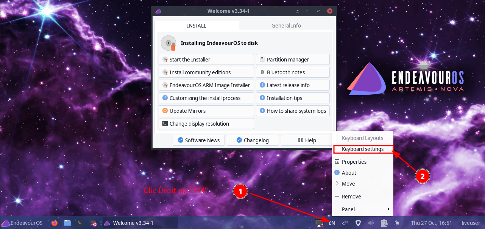{:width="600"}  
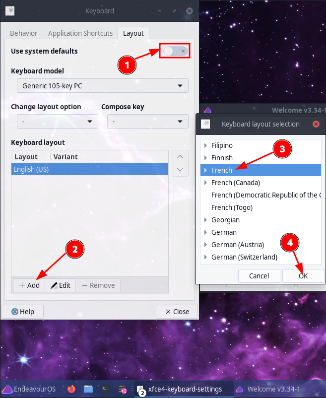{:width="400"}  
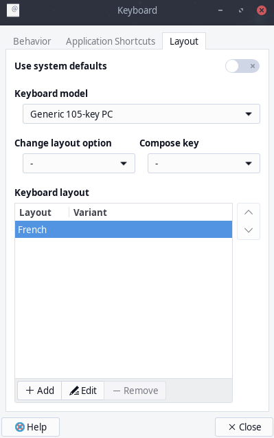{:width="200"}  
Supprimer **English(US)** pour ne garder que **French** et **Close**

Ouvrir un **Terminal Emulator** dans le live endeavour  
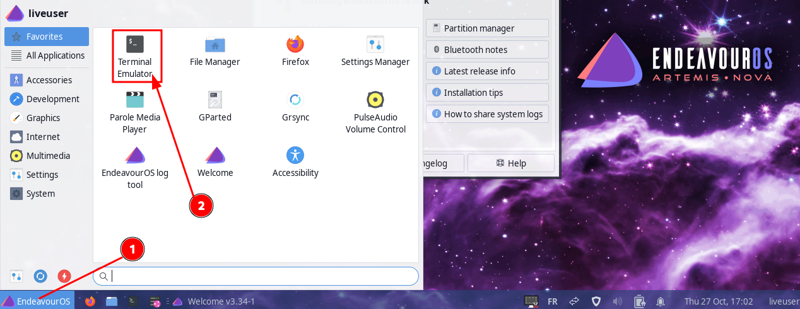{:width="600"}

### Partionner un disque

en mode su

```
sudo -s
```

Le disque : `lsblk`

```
NAME  MAJ:MIN RM  SIZE RO TYPE MOUNTPOINTS
loop0   7:0    0  1.7G  1 loop /run/archiso/airootfs
sr0    11:0    1  1.9G  0 rom  /run/archiso/bootmnt
vda   254:0    0   30G  0 disk 
```

On partitionne un disque en 3 avec `gdisk`

* Partition 1 : 512M EFI (code ef00) système de fichier FAT32
* Partition 2 : 22G LVM (code 8e00) système de fichier EXT4
* Partition restante pour Installation temporaire (8Go)

Zapper le disque,

(**Attention** Ceci effacera de manière irréversible toutes les données de votre disque, veuillez sauvegarder toutes les données importantes) :

```
sgdisk --zap-all /dev/vda
# OU
wipefs -a /dev/vda
```

Créer une table de partition GPT à l'aide de la commande `sgdisk` :

```
sgdisk --clear --new=1:0:+512MiB --typecode=1:ef00 --new=2:0:+22G --typecode=2:8e00 /dev/vda
```

Résultat 

    Creating new GPT entries in memory.
    The operation has completed successfully.

Format la partition EFI

```
mkfs.fat -F32 /dev/vda1 
```

### Installer EndeavourOS sur une partition temporaire

Lancer l'installation  
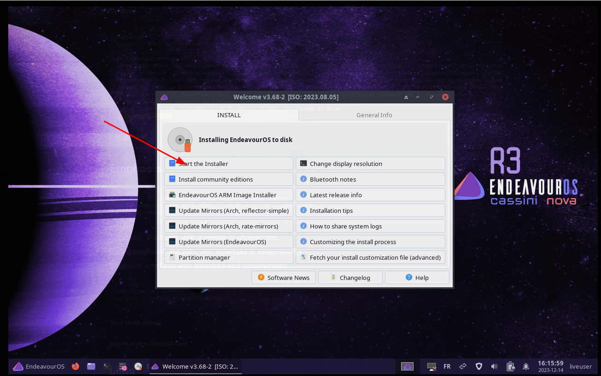{:width="600"}  
{:width="600"}  
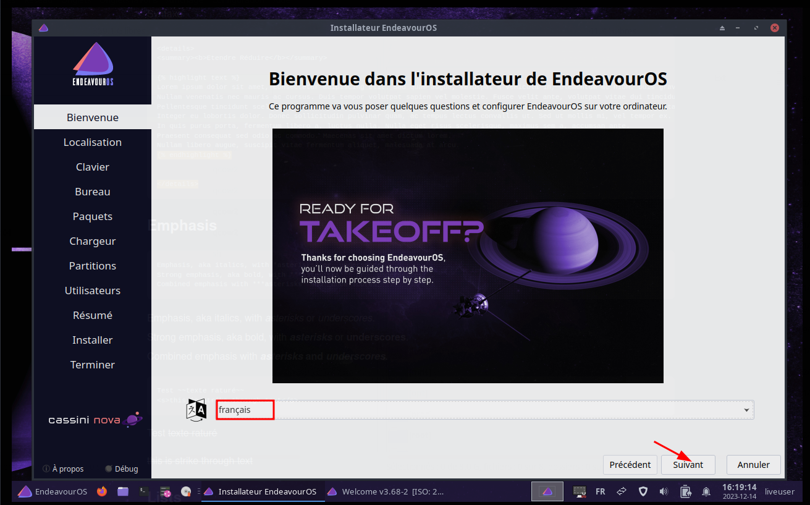{:width="600"}  
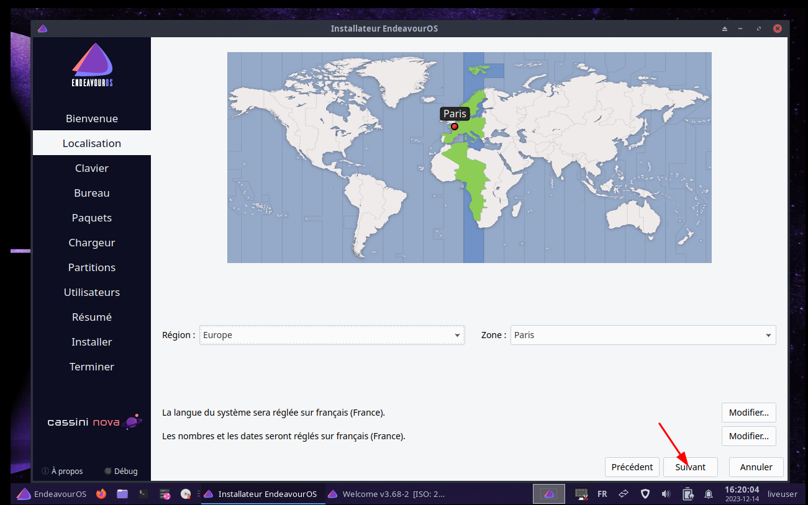{:width="600"}  
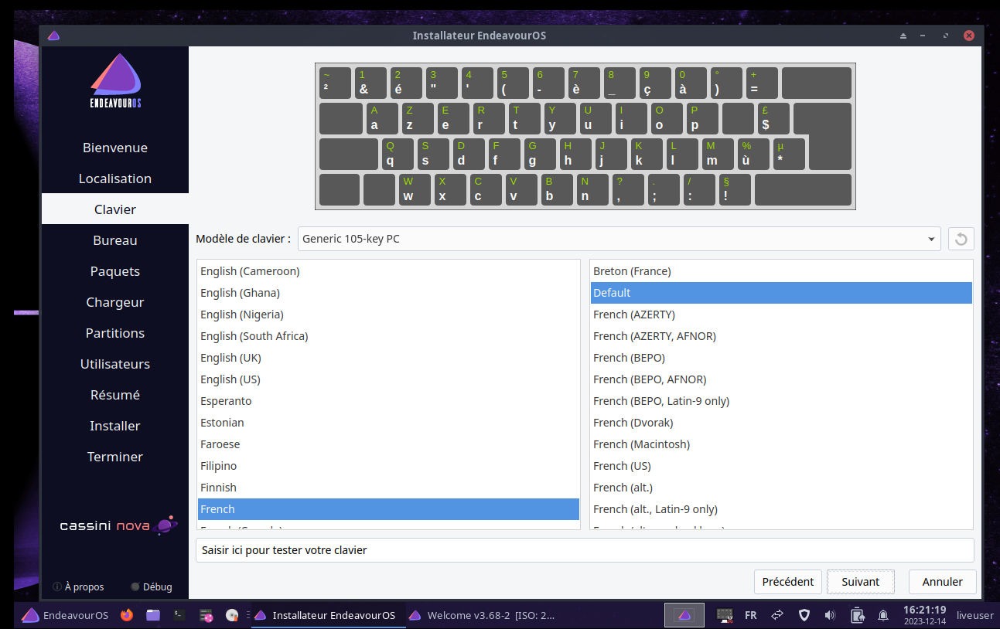{:width="600"}  
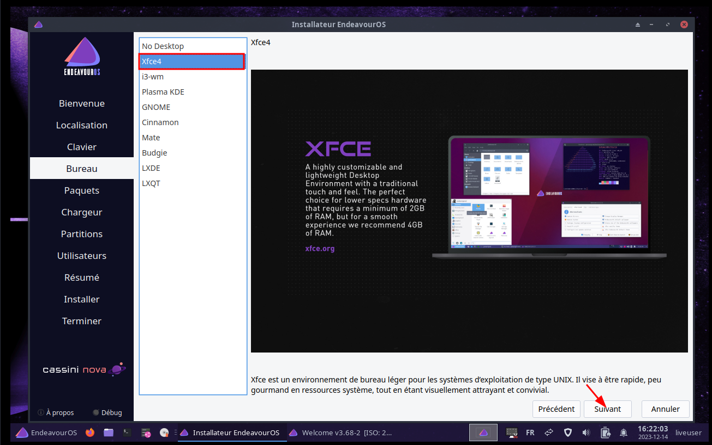{:width="600"}  
{:width="600"}  
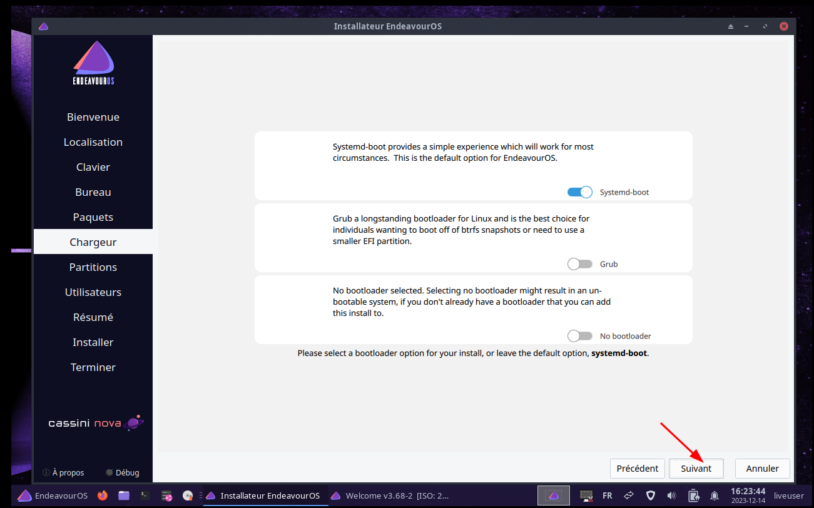{:width="600"}  
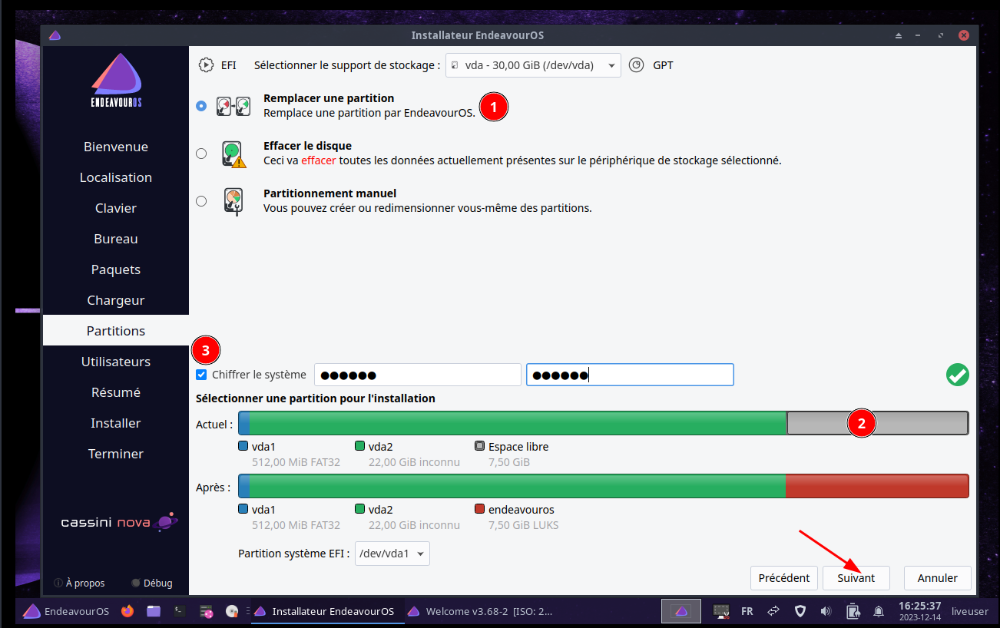{:width="600"}  

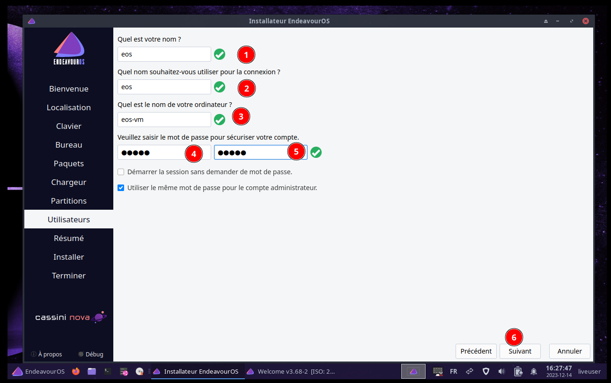{:width="600"}  
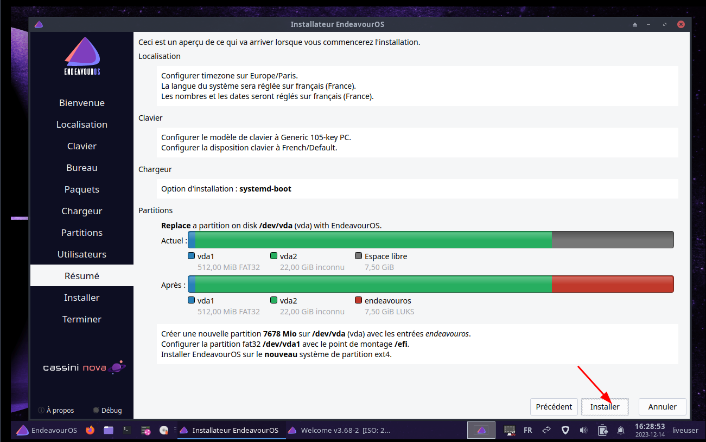{:width="600"}  
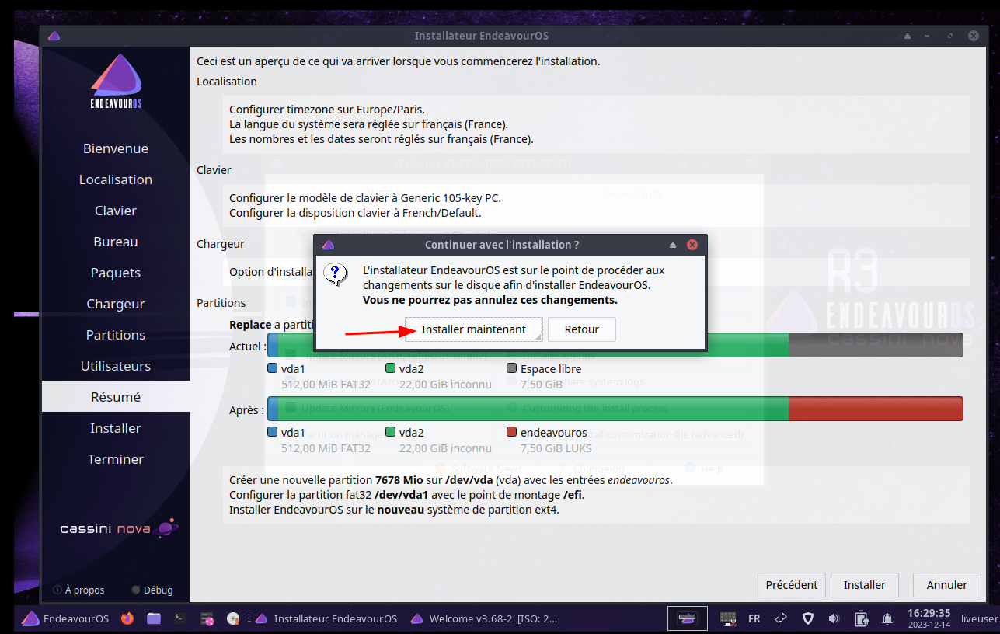{:width="600"}  
{:width="600"}  
{:width="600"}  

eos-vm  
eos/eos49  
Même MP admin  

Une fois l'installation terminée, **Redémarrer et tester ** si vous pouvez accéder au système crypté.
Vous devriez maintenant avoir un système crypté LUKS (sans les trucs amusants comme les volumes logiques, la partition /home séparée, etc.).  

### Redémarrer avec le CD Live 

Basculer en FR et ouvrir un terminal

Pour un accès sur la machine via SSH  
Lancer le service : `sudo systemctl start sshd`  
Ouvrir le port 22 firewall: `sudo firewall-cmd --zone=public --add-port=22/tcp --permanent`  
Créer un mot de passe à liveuser : `passwd liveuser`
Relever l'adresse ip de la machine : `ip a`

### Configurer le nouveau système LVMonLUKS

### Convertir Déchiffrer et monter le système temporaire

Dans l'environnement live-CD, ouvrir un Terminal ,basculer en mode su

Conversion chiffrement luks2 du système temporaire chiffré /dev/vda3 (luks1)

    cryptsetup convert /dev/vda3 --type luks2

```
WARNING!
========
This operation will convert /dev/vda3 to LUKS2 format.


Are you sure? (Type 'yes' in capital letters): YES
```

Confirmer par la saisie YES

Saisir (ou marquer et copier la ligne avec ctrl-c et coller dans le terminal avec shift-ctrl-v ) 

```shell
cryptsetup luksOpen /dev/vda3 crypttemp # saisir la phrase mot de passe de l'installation
mkdir -p /media/crypttemp
mount /dev/mapper/crypttemp /media/crypttemp 
```

Nos données d'installation temporaires sont désormais accessibles sous `/media/crypttemp` et peuvent être copiées sur le nouveau système que nous allons mettre en place dans les prochaines étapes.

### Configurer le nouveau système LVMonLUKS

Chiffrer la partition /dev/vda2

```shell
cryptsetup luksFormat --type luks2 /dev/vda2
```

Une demande de confirmation est exigée

```
WARNING!
========
This will overwrite data on /dev/vda2 irrevocably.

Are you sure? (Type 'yes' in capital letters): YES
Enter passphrase for /dev/vda2: 
Verify passphrase: 
```

Choisissez un mot de passe sécurisé ( <https://xkcd.com/936/> )  
Ouvrir la partition chiffrée

```shell
cryptsetup luksOpen /dev/vda2 crypt
#    Enter passphrase for /dev/vda2:
pvcreate /dev/mapper/crypt
#    Physical volume "/dev/mapper/crypt" successfully created.
vgcreate vg0 /dev/mapper/crypt
#    Volume group "vg0" successfully created
```

Disque virtuel de 30G, Partition libre 22G

```shell
lvcreate -L 17G vg0 -n lvroot               
#  Logical volume "lvroot" created.
lvcreate --extents 100%FREE vg0 -n lvhome  
#  Logical volume "lvhome" created.
```

Créez un système de fichiers ext4 sur les volumes logiques.

```shell
mkfs.ext4 -L root /dev/mapper/vg0-lvroot
mkfs.ext4 -L home /dev/mapper/vg0-lvhome
```

### Monter le nouveau système sur /mnt

Monter le nouveau système sur `/mnt` pour les systèmes UEFI

```shell
mount /dev/mapper/vg0-lvroot /mnt
mkdir -p /mnt/home
mount /dev/mapper/vg0-lvhome /mnt/home
mkdir -p /mnt/efi
mount /dev/vda1 /mnt/efi
```

    lsblk

devrait maintenant fournir une sortie similaire à la suivante (ignorez les tailles, celles-ci proviennent d'une installation de test) …

pour les systèmes UEFI :

```
NAME             MAJ:MIN RM  SIZE RO TYPE  MOUNTPOINTS
loop0              7:0    0  1.7G  1 loop  /run/archiso/airootfs
sr0               11:0    1  1.9G  0 rom   /run/archiso/bootmnt
vda              254:0    0   30G  0 disk  
├─vda1           254:1    0  512M  0 part  /mnt/efi
├─vda2           254:2    0   22G  0 part  
│ └─crypt        253:1    0   22G  0 crypt 
│   ├─vg0-lvroot 253:2    0   17G  0 lvm   /mnt
│   └─vg0-lvhome 253:3    0    5G  0 lvm   /mnt/home
└─vda3           254:3    0  7.5G  0 part  
  └─crypttemp    253:0    0  7.5G  0 crypt /media/crypttemp
```

### Copier le système temporaire 

pour vider les nouveaux points de montage

    rsync -avA /media/crypttemp/ /mnt

*Veuillez patienter quelques minutes*

### Démonter le système temporaire

```shell
umount /media/crypttemp
cryptsetup luksClose crypttemp
```

### Ajouter un fichier de clé existant LUKS

Nous allons maintenant ajouter une deuxième clé saisie à la création chiffrement sur /dev/vda2  
Nous ferons référence à cette clé à l'étape suivante.

    cryptsetup luksAddKey /dev/vda2 /mnt/crypto_keyfile.bin  

Il faut saisir le phrase mot de passe

### Configurer "crypttab"

Configuration `/etc/crypttab`

    cryptsetup luksUUID /dev/vda2

renvoie **5510b187-f57c-41f5-b975-0605e35788c2**  
Votre UUID sera différent, alors <u>**assurez-vous d'utiliser votre UUID à l'étape suivante !**</u>

    nano /mnt/etc/crypttab

contient une ligne non commentée commençant par `luks-`...  
Remplacez cette ligne par la suivante ; <u>**n'oubliez pas d' utiliser votre UUID**</u> 

    cryptlvm UUID=5510b187-f57c-41f5-b975-0605e35788c2 /crypto_keyfile.bin luks

Sauvegarder et quitter.

### Basculer en chroot

Passer en chroot

    arch-chroot /mnt

### Configurer "fstab"

Configurer /etc/fstab

    blkid -s UUID -o value /dev/mapper/vg0-lvroot

renvoie l'UUID du volume racine :  **1bcc7b90-94f1-4bee-94ec-cd530c16cf52**.

    blkid -s UUID -o value /dev/mapper/vg0-lvhome

renvoie l'UUID du volume d'accueil : **82717601-58fb-4316-a362-408cd3161c06**.

    nano /etc/fstab

contient une ligne commençant par `/dev/mapper/luks-`...  
**Supprimez** cette ligne et ajoutez ce qui suit (<u>**n'oubliez pas d' utiliser vos UUID**</u>) 

```
UUID=1bcc7b90-94f1-4bee-94ec-cd530c16cf52 / ext4 defaults,acl,noatime,discard 0 0
UUID=82717601-58fb-4316-a362-408cd3161c06 /home ext4 defaults,acl,noatime,discard 0 0
```

Sauvegarder et quitter.

### Ajout fichier échange (OPTION)

Utilisez dd pour créer un fichier d'échange de la taille de votre choix.  
Création d'un fichier d'échange de 1024 Mo (pour tous les systèmes de fichiers)

    dd if=/dev/zero of=/swapfile bs=1M count=1024 status=progress

Remplacez `count=1024` par la quantité de Mo que vous souhaitez installer pour l'utilisation du fichier d'échange :

    chmod 600 /swapfile

Pour donner au fichier d'échange des permissions de racine seulement.

    mkswap /swapfile

Pour faire du fichier un espace de pagination et enfin pour activer le fichier :

    swapon /swapfile

Modifier /etc/fstab pour activer le fichier d'échange 

    nano /etc/fstab

Ajoutez la ligne suivante…

```
/swapfile                                 none  swap defaults,pri=-2 0 0
```

Sauvegarder et quitter.

>Remarque : le fichier d'échange doit être spécifié par son emplacement sur le système de fichiers, et non par son UUID ou son LABEL.

pour vérifier :

    swapon --show

```
NAME      TYPE  SIZE USED PRIO
/swapfile file 1024M   0B   -2
```

### Modifier les options du noyau

Dans **systemd-boot**, vous éditez le fichier d'entrée approprié qui se trouve sur votre partition EFI dans le répertoire `loader/entries`  
Chaque entrée est une option de démarrage dans le menu et chacune a une ligne appelée options. Vous pouvez modifier ces entrées directement, mais ces changements peuvent être écrasés lors de l'installation ou de la mise à jour de paquets.

Pour effectuer les changements, au lieu de modifier les entrées, modifiez le fichier `/etc/kernel/cmdline` qui est un fichier d'une ligne contenant une liste d'options du noyau.  

    nano /etc/kernel/cmdline

UUID de /dev/vda2 : `blkid -s UUID -o value /dev/vda2`

```
nvme_load=YES nowatchdog rw rd.luks.uuid=5510b187-f57c-41f5-b975-0605e35788c2 root=/dev/mapper/vg0-lvroot
```

Exécutez ensuite `sudo reinstall-kernels` qui remplira les entrées et régénérera les initrds.

    reinstall-kernels

### Sortie du chroot

    exit

### Redémarrer

Retirer le cd live 

    reboot

>FINI! Vous devriez maintenant avoir un système LVMonLUKS fonctionnel avec un volume logique séparé pour /home.

### Tester le nouveau système LVMonLUKS chiffré

Dans le boot, saisir la phrase de passe pour déchiffrer le disque  
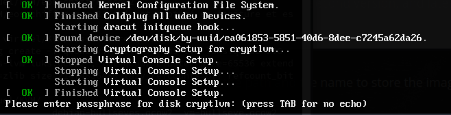 

Puis on arrive sur la pade de connexion  
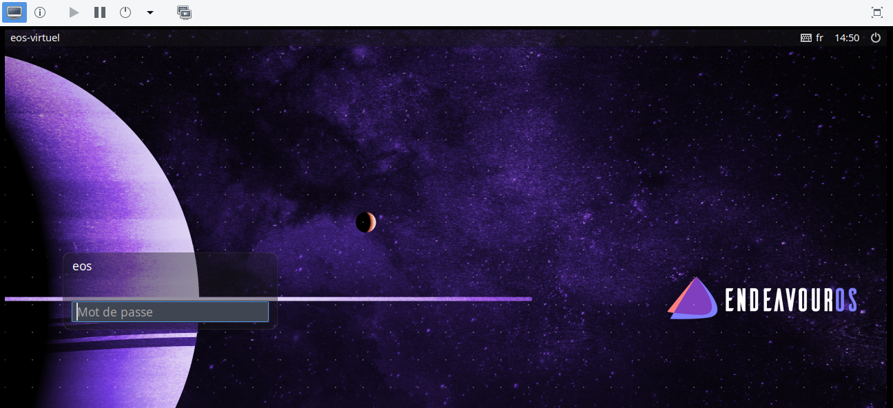 

## Ajouter la partition temporaire à la partition chiffrée (FACULTATIF)

Vous pouvez simplement reformater /dev/vda3 et l'utiliser comme stockage non chiffré, mais ici, nous allons récupérer l'espace et l'attribuer, par exemple, à notre volume personnel.

Redémarrez dans l'environnement Live-Cd.

Ouvrir un terminal en mode su

### Supprimer vda3 (installation temporaire EndeavourOS)

    fdisk -l

affiche des informations concernant nos disques et partitions.

Nous allons maintenant supprimer /dev/vda3. Entrez simplement les caractères ci-dessous dans l'ordre indiqué.

    fdisk /dev/vda

```
> p
> d
> 3 (delete partition 3)
> w (write changes to disk)
```

### Agrandir la partition et le groupe de volumes

Opération fdisk 

    fdisk /dev/vda

```
> d
> 2 (delete partition 2)
> n
> 2 (recreate partition 2)
>   (first sector is 'default'; press enter)
>   (last sector is 'default'; press enter)
> n (keep existing filesystem signature)
> w (write changes to disk)
```

Ouvrir la partition chiffrée  saisir la phrase de passe

```shell
cryptsetup luksOpen /dev/vda2 crypt # saisir la phrase de passe
cryptsetup resize crypt -v          # saisir la phrase de passe
# Si tout OK --> Command successful.
e2fsck -f /dev/mapper/vg0-lvroot
e2fsck -f /dev/mapper/vg0-lvhome

pvresize /dev/mapper/crypt
```

Le groupe de volumes vg0 contient maintenant l'espace que nous avons libéré en supprimant /dev/vda3. Il a été ajouté en tant qu'espace libre pouvant être utilisé pour des instantanés ou une affectation future au volume racine ou d'accueil (ce que nous ferons à l'étape suivante) ou à des volumes supplémentaires (nouveaux).  
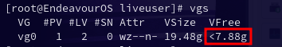 

### Augmenter le volume home

Quelques informations sur la façon de convertir/calculer les secteurs, MB, PE's :

*    `sectors / 2048 / 4 = PE`
*    `PE *4 = MiB *2048 = sectors`  
    Si vos calculs renvoient un PE non entier, vous devez l'arrondir à l'inférieur !

```shell
fdisk -l
vgdisplay
lvdisplay
```

fournira des informations concernant l'espace utilisé (alloué) et libre.

Exemples de différentes possibilités :

*    développer lvroot par 32326 PE  
    `lvextend -l +32326 /dev/mapper/vg0-lvroot`
*    étendre le volume à 150 Go  
    `lvextend -L 150G /dev/mapper/vg0-lvroot`
*    augmenter le volume de 10 Go  
    `lvextend -L +10G /dev/mapper/vg0-lvroot` 
*    remplir tout l'espace non alloué dans le groupe de volumes  
    `lvextend -l +100%FREE /dev/vg0-lvroot`

Mais nous allons maintenant ajouter tout l'espace précédemment libéré au volume d'accueil .

    lvextend -l +100%FREE /dev/mapper/vg0-lvhome

    Size of logical volume vg0/lvhome changed from 3.60 GiB (922 extents) to 11.48 GiB (2939 extents).

Le système de fichiers résidant dans notre volume logique doit également être ajusté.  
Nous augmenterons le système de fichiers à la taille maximale pour ajouter les 8 Go.

    resize2fs -p /dev/mapper/vg0-lvhome

Vérifions le système de fichiers des volumes logiques redimensionnés…

    e2fsck -f /dev/mapper/vg0-lvhome

FINI! Vous pouvez quitter l'environnement live-cd et redémarrer dans votre système LVMonLUKS.

### Clavier (GRUB)

`Il est impossible de définir un clavier autre que US avant la saisie du code de déchiffrement lors de la phase démarrage GRUB`{: .prompt-danger }

[Convertisseur QWERTY / AZERTY](https://-et-caetera.com/azertyfy/)  
Convertissez un texte que vous auriez écrit en AZERTY avec un clavier QWERTY et inversement

## Ajouter fichier échange avec hibernation de travail (FACULTATIF)

### Créer un fichier d'échange

Remarque : Si vous souhaitez utiliser l'hibernation, vous devez ajouter un swap car le contenu de la RAM sera écrit sur la partition/fichier de swap. Cela signifie également que la taille du swap doit être au moins égale à la taille de la RAM. Lisez [ici](https://itsfoss.com/swap-size/) sur le choix des tailles d'échange par exemple.

Choisissez la taille de votre fichier d'échange (par exemple "8" pour 8 Go).

    swapsizeGB=8

Les commandes suivantes produiront un fichier d'échange avec la taille choisie :

```shell
swapsize=$(( swapsizeGB * 1024 ))
sudo dd if=/dev/zero of=/swapfile count=$swapsize bs=1MiB status=progress

sudo chmod 600 /swapfile
sudo mkswap /swapfile
sudo swapon /swapfile
```

Vérifier ...

    swapon --show

### Modifier /etc/fstab pour activer le fichier d'échange après le redémarrage

    sudo nano /etc/fstab

Ajoutez la ligne suivante…

    /swapfile none swap defaults,pri=-2 0 0

Sauvegarder et quitter.

### Activer l'hibernation

    sudo blkid -s UUID -o value /dev/mapper/vg0-lvroot

renvoie l'UUID du volume racine. Par exemple **53d2a76e-13b8-4a29-affc-197b33a706c1** 

    sudo filefrag -v /swapfile | awk '{if($1=="0:"){print $4}}'

renvoie le décalage du fichier d'échange. Par exemple `997376..,` ce qui signifie 997376.

    sudo nano /etc/default/grub

Ajoutez l' entrée `resume=UUID=` et `resume_offset=` à la fin de `GRUB_CMDLINE_LINUX_DEFAULT=` (<u>**n'oubliez pas d'utiliser votre UUID et offset**</u>)

    GRUB_CMDLINE_LINUX_DEFAULT="[...] resume=UUID=53d2a76e-13b8-4a29-affc-197b33a706c1 resume_offset=997376"

Sauvegarder et quitter.

Si vous n'avez pas déjà suivi l'étape 11 et ajouté **resume** à `/etc/mkinitcpio.conf`, faites-le maintenant...

    sudo nano /etc/mkinitcpio.conf

Modifiez la `HOOKS=ligne`... en ajoutant **resume** (avant les systèmes de fichiers).

    HOOKS="base udev autodetect modconf block keyboard keymap encrypt lvm2 resume filesystems fsck"

Sauvegarder et quitter.

Faites savoir au système que certaines choses ont changé...

```shell
sudo mkinitcpio -p linux
sudo grub-mkconfig -o /boot/grub/grub.cfg
```

FINI! Vous devriez maintenant avoir un fichier d'échange et pouvoir hiberner.

## Liens

* [Installer un Ubuntu chiffré avec LUKS, LVM et un partitionnement personnalisé](https://zestedesavoir.com/tutoriels/1653/installer-un-ubuntu-chiffre-avec-luks-lvm-et-un-partitionnement-personnalise/)
* [How to encrypt LVM volumes with LUKS](https://www.fosslinux.com/68563/how-to-encrypt-lvm-volumes-with-luks.htm)
* [Full disk encryption: LVMonLUKS with a separate home partition and hibernation with a swapfile](https://discovery.endeavouros.com/encrypted-installation/lvmonluks/2021/03/)
* [Installation d'Archlinux en UEFI & chiffré](https://driikolu.fr/2020/03/install_arch_chiffre_uefi/)
* [Configurer le chiffrement LUKS sur Arch Linux – Indice Linux](https://ciksiti.com/fr/chapters/667-setup-luks-encryption-on-arch-linux--linux-hint)

## Annexe

### Clé FIDO pour déchiffrement au boot

[Déverrouillage au boot d’un disque entièrement chiffré LUKS2](/posts/Yubikey/#déverrouillage-au-boot-dun-disque-entièrement-chiffré-luks2)

Installer la librairie libfido : `sudo pacman -S libfido2`
Vérifier que la YubiKey est insérée dans un port USB 
Lister présence clé : `systemd-cryptenroll --fido2-device=list`

```
PATH         MANUFACTURER PRODUCT              
/dev/hidraw2 Yubico       YubiKey OTP+FIDO+CCID
```

Enroler la clé, la phrase de passe du disque est demandée. Le disque chiffré est `/dev/vda2`  

    sudo systemd-cryptenroll --fido2-device=auto /dev/vda2

```
🔐 Please enter current passphrase for disk /dev/vda2: ***********             
Requested to lock with PIN, but FIDO2 device /dev/hidraw2 does not support it, disabling.
Initializing FIDO2 credential on security token.
👆 (Hint: This might require confirmation of user presence on security token.)
Generating secret key on FIDO2 security token.
👆 In order to allow secret key generation, please confirm presence on security token.
New FIDO2 token enrolled as key slot 2.
```

Pour la prise en charge de cette clé FIDO , il faut modifier le fichier /etc/crypttab

```
#cryptlvm UUID=5510b187-f57c-41f5-b975-0605e35788c2 /crypto_keyfile.bin luks
cryptlvm UUID=5510b187-f57c-41f5-b975-0605e35788c2 /crypto_keyfile.bin luks,discard,fido2-device=auto
```

Reconstruire le noyau

    sudo reinstall-kernels

### Déverrouiller sa session Linux avec une Yubikey

* [Déverrouiller sa session Linux avec une Yubikey](/posts/Yubikey/#déverrouiller-sa-session-linux-avec-une-yubikey)

### Eos VM 

#### Partage répertoire hôte avec un invité

EndeavourOS est installé sur une machine virtuelle QEMU/KVM

* [QEMU/KVM + virtio-fs - Partager un répertoire hôte avec une machine virtuelle](/posts/QEMU_KVM+virtio-fs-Partager_un_repertoire_hote_avec_une_machine_virtuelle.md/#partage-répertoire-hôte-avec-un-invité)

#### Copier/Coller entre hôte et invité

Il faut installer **spice-vdagent** sur l'invité

### Plymouth

Installer plymouth 

    yay -S plymouth 

Modifier les options du noyau kernel `/etc/kernel/cmdline` , ajouter `splash`  

```
nvme_load=YES nowatchdog rw splash rd.luks.uuid=5510b187-f57c-41f5-b975-0605e35788c2 root=/dev/mapper/vg0-lvroot
```

Modifier le fichier `/etc/crypttab`  
Remplacer la ligne suivante  
`cryptlvm UUID=5510b187-f57c-41f5-b975-0605e35788c2 /crypto_keyfile.bin luks`  
par  
`cryptlvm UUID=5510b187-f57c-41f5-b975-0605e35788c2 - fido2-device=auto`  
ou  
`cryptlvm UUID=5510b187-f57c-41f5-b975-0605e35788c2 /crypto_keyfile.bin luks,discard,fido2-device=auto`

Reconstruire

    sudo reinstall-kernels

Redémarrer la machine virtuel  

Si vous n'avez pas votre clé FIDO, après 30s le mot de passe de déchiffrement est demandé  
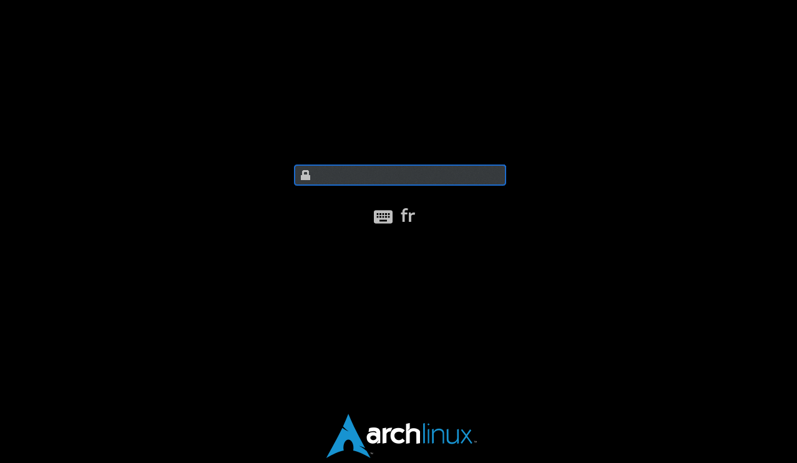

