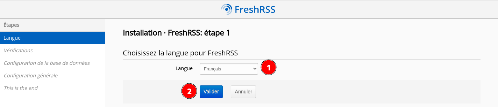
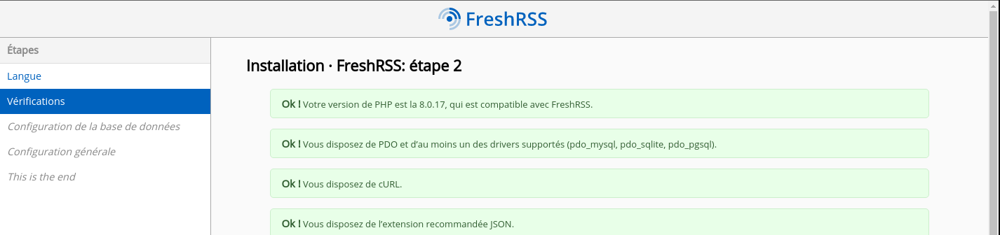
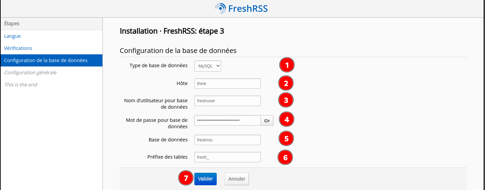
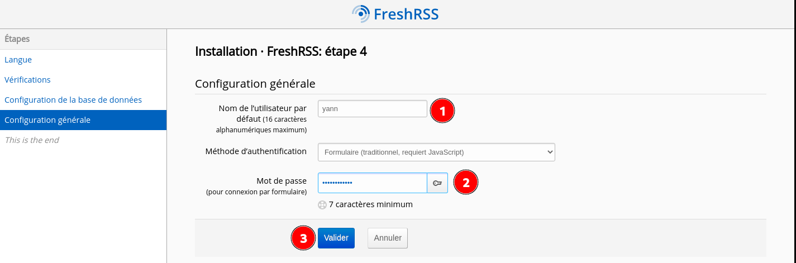
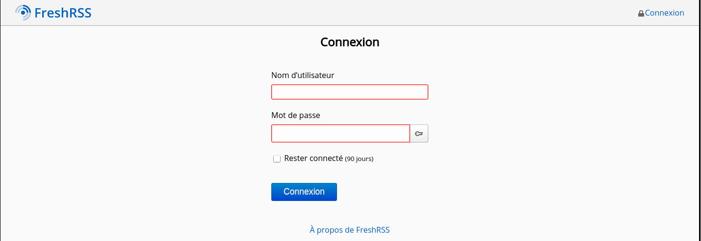

+++
title = 'FreshRSS agrégateur et lecteur de flux RSS'
date = 2023-12-17 00:00:00 +0100
categories = ['rss']
+++
*Il permet de regrouper l’actualité de plusieurs sites différents dans un endroit unique pour que vous puissiez la lire sans devoir aller de site en site.*

## FreshRSS

{:height="50"}  

### Prérequis

* Serveur web nginx
* Mysql/MariaDb serveur

### Installation

Passage en mode su

Commencez par installer git, si vous ne l'avez pas déjà installé.

    apt install git

Ensuite, passez dans le répertoire d'installation et téléchargez FreshRSS à l'aide de git

    cd /usr/share/
    git clone https://github.com/FreshRSS/FreshRSS.git

Accédez au nouveau répertoire FreshRSS et définissez les autorisations afin que votre serveur Web puisse accéder aux fichiers.

    cd FreshRSS
    chown -R :www-data .
    sudo chmod -R g+r .

Nous devrons également autoriser l'écriture dans le dossier de données, comme suit :

    chmod -R g+w ./data/

Autoriser les mises à jour à partir de l'interface Web, définissez des droits d'écriture

    chmod -R g+w .

Enfin, établissez un lien symbolique entre le dossier public et la racine de votre répertoire Web

    ln -s /usr/share/FreshRSS/p /var/www/default-www/freshrss

### Création base de données mysql 

Lancez une session MySQL. L'exécution de cette commande vous demandera le mot de passe MySQL que vous avez défini précédemment, puis vous placera dans une invite qui devrait ressembler à `MariaDB [(none)]>` 

    mysql -u root -p

À partir de l'invite MySQL `(MariaDB [(none)]>)`, exécutez les commandes suivantes, en remplaçant `<nom d'utilisateur>, <mot de passe> et <nom de la base de données>` par des valeurs réelles.

```
CREATE USER 'freshuser'@'localhost' IDENTIFIED BY 'ModiqueBiffureLaquageSchlich';
CREATE DATABASE `freshrss`;
GRANT ALL privileges ON `freshrss`.* TO 'freshuser'@localhost;
FLUSH PRIVILEGES;
QUIT;
```

### Configurer Nginx

Configuration `/etc/nginx/conf.d/rss.rnmkcy.eu.conf`

```nginx
server {
    listen 80;
    listen [::]:80;
    server_name rss.rnmkcy.eu;
    return 301 https://$host$request_uri;
}
server {
    listen 443 ssl http2;
    listen [::]:443 ssl http2;
    server_name rss.rnmkcy.eu;

    # Certificats Let's Encrypt 
    # TLS 1.3 only
    # HSTS (ngx_http_headers_module is required) (63072000 seconds)
    # OCSP stapling
    # replace with the IP address of your resolver
    include /etc/nginx/tls-hsts-ocsp.conf;

	# the folder p of your FreshRSS installation
	root /var/www/default-www/freshrss/;

	index index.php index.html index.htm;

	# nginx log files
	access_log /var/log/nginx/rss.access.log;
	error_log /var/log/nginx/rss.error.log;

	# php files handling
	# this regex is mandatory because of the API
	location ~ ^.+?\.php(/.*)?$ {
		fastcgi_pass unix:/var/run/php/php8.0-fpm.sock;
		fastcgi_split_path_info ^(.+\.php)(/.*)$;
		# By default, the variable PATH_INFO is not set under PHP-FPM
		# But FreshRSS API greader.php need it. If you have a “Bad Request” error, double check this var!
		# NOTE: the separate $path_info variable is required. For more details, see:
		# https://trac.nginx.org/nginx/ticket/321
		set $path_info $fastcgi_path_info;
		fastcgi_param PATH_INFO $path_info;
		include fastcgi_params;
		fastcgi_param SCRIPT_FILENAME $document_root$fastcgi_script_name;
	}

	location / {
		try_files $uri $uri/ index.php;
	}

}
```

### Paramétrer FreshRSS

Le lien <https://rss.rnmkcy.eu> et suivre les étapes  
   

   
   

   
En cas d'erreur, remplacer en 2, "think" par "localhost"

   
Créer un utilisateur  

   

Après installation , page de connexion  
   

### Mise à jour auto des flux

FreshRSS est mis à jour par le script `./app/actualize_script.php`. Sachant cela, nous pouvons le déclencher périodiquement pour garantir des flux à jour.

>Remarque : le script de mise à jour ne mettra pas à jour un flux particulier plus d'une fois toutes les vingt minutes, il n'est donc pas utile de le déclencher beaucoup plus fréquemment que cela.

Systemd comme déclencheur

Certains systèmes ne peuvent pas utiliser une tâche Cron, mais ils peuvent utiliser systemd. Il est facile de le configurer pour imiter les fonctionnalités de Cron.

Tout d'abord, vous devez ajouter un fichier `/etc/systemd/system/freshrss.timer` avec le contenu suivant 

```
[Unit]
Description=FreshRSS get new content

[Timer]
OnBootSec=30s
OnCalendar=*:0/20

[Install]
WantedBy=timers.target
```

Cette minuterie démarre 30 secondes après le démarrage et déclenche le service toutes les 20 minutes. N'hésitez pas à modifier la configuration pour mieux répondre à vos besoins.

Ensuite, vous devez ajouter un fichier `freshrss.service` dans le même répertoire. Ce sera la description du service déclenché par le timer mentionné ci-dessus.

```
[Unit]
Description=FreshRSS get new content
Wants=freshrss.timer

[Service]
User=www-data
Type=simple
ExecStart=/usr/bin/php /usr/share/FreshRSS/app/actualize_script.php
```

Enfin, vous devez activer le timer avec `systemctl enable freshrss.timer` et recharger la configuration de systemd avec `systemctl daemon-reload` 
