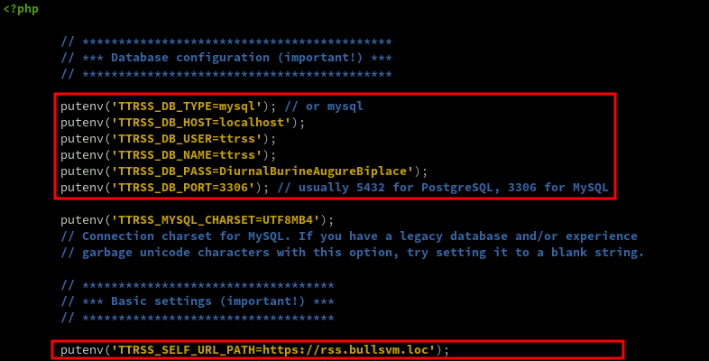
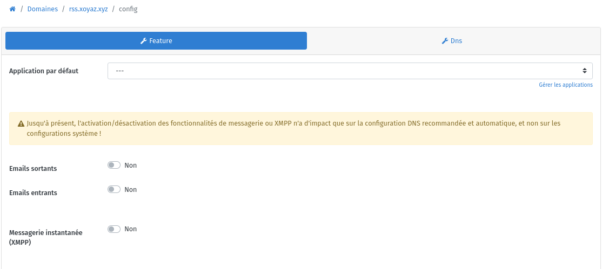
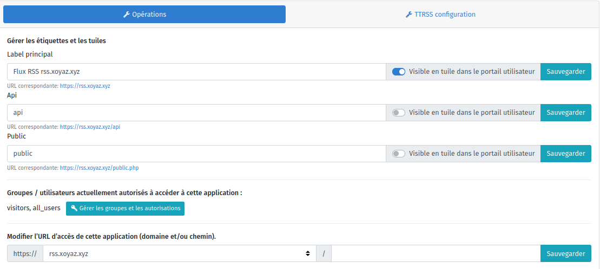
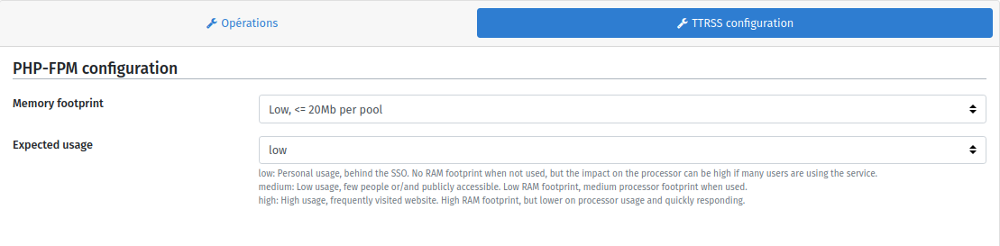
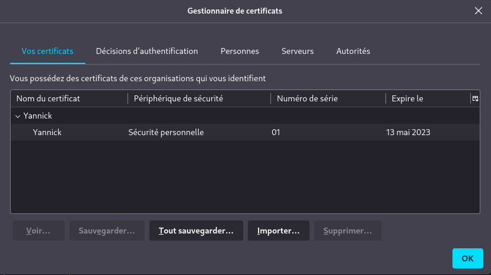
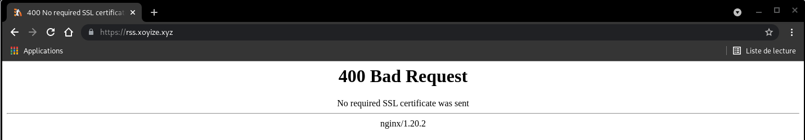

+++
title = 'Tiny Tiny RSS (ttrss)'
date = 2023-12-17 00:00:00 +0100
categories = ['rss']
+++
*Un agrégateur de flux RSS est un outil permettant de rassembler automatiquement, sur une même interface, les articles parus sur différents sites. Utilisé pour la veille et la curation, il facilite le classement de l'information récupérée sur les blogs, médias en ligne, mais aussi sur les réseaux sociaux.*


## Tiny Tiny RSS avec Nginx, PHP-FPM et MariaDB


* [Ubuntu 18.04 LTS – Installation de Tiny Tiny RSS avec Nginx, PHP-FPM et MariaDB](https://howto.wared.fr/tiny-tiny-rss-ubuntu-nginx-php-fpm-mysql/)
* [Framacloud - Installation de TinyTinyRSS](https://framacloud.org/fr/cultiver-son-jardin/ttrss/)

Tiny Tiny RSS avantages et fonctionnalités :

* Interface fluide et responsive
* Multi-utilisateurs
* Mode hors-connexion pour continuer à lire vos feeds
* Multilingue
* Gestion des tags et catégories
* Moteur de recherche
* Raccourcis clavier
* Support du format OPML
* Podcasts
* Personnalisations via des plugins et des thèmes
* Applications Android et iOS
* Gratuit

*Côté client, seul un navigateur est nécessaire, côté serveur, Tiny Tiny RSS a besoin d’un serveur web (Nginx), de PHP, d’une interface permettant la communication entre le serveur web et PHP (PHP-FPM) et d’une base de données (MariaDB). Amélioration des performances de tt-rss grâce à OPCache ,sécurisation des échanges grâce à un certificat SSL/TLS.*

### Prérequis

**nginx**, **PHP8.x** et **mariadb** sont installés

```
nginx version: nginx/1.24.0
PHP 8.2.13 (cli) (built: Nov 24 2023 13:10:42) (NTS)
mysql  Ver 15.1 Distrib 10.11.4-MariaDB, for debian-linux-gnu (x86_64) using  EditLine wrapper
```

### Installation Tiny Tiny RSS

* Upstream app code repository: <https://gitlab.tt-rss.org/tt-rss/tt-rss>

Passage en super utilisateur

    sudo -s

Git

```bash
cd /var/www
git clone https://gitea.xoyize.xyz/yako/ttrss
```

Pour des raisons évidentes de sécurité, il est donc recommandé de cloisonner ces utilisateurs et d’avoir un utilisateur dédié à la gestion du dossier ttrss. Cet utilisateur aura des droits aussi restreints que possible à ce répertoire.

Modifier le propriétaire du répertoire **/var/www/ttrss** et l’attribuer à un nouvel utilisateur dédié  *ttrss*  
Nginx est lancé sous l’utilisateur *www-data* et doit avoir accès en lecture au répertoire **/var/www/ttrss** pour lire les ressources statiques (HTML, CSS, JS, etc.).  
Attribuer le répertoire **/var/www/ttrss** au groupe **www-data**.

```shell
useradd ttrss                            # création utilisateur dédié ttrss
chown -R ttrss:www-data /var/www/ttrss   # changement de propriétaire par ttrss et groupe par www-data
```

Retirer toutes les permissions de ce répertoire aux autres utilisateurs.

    chmod -R o-rwx /var/www/ttrss

### PHP et ses modules

Tiny Tiny RSS nécessite certains modules PHP pour fonctionner :

* PHP PDO : connecteur pour MariaDB
* PHP XML : opérations sur la lecture des flux RSS
* PHP mbstring : support des caractères multi-octets
* PHP fileinfo : améliore les performances d’analyse de fichiers
* PHP CURL : nécessaire pour certains plugins
* PHP POSIX : nécessaire pour le processus de mise à jour des flux
* PHP GD : opérations sur les images présentes dans les flux
* PHP INTL : support de l’internationalisation.

Installer les paquets suivants : php-fileinfo php-posix

    apt install php8.2 php8.2-fpm php8.2-cli php8.2-mysql php8.2-xml php8.2-mbstring php8.2-curl php8.2-gd php8.2-intl

### Pool PHP-FPM

*Le module PHP-FPM permet la communication entre le serveur Nginx et PHP, basée sur le protocole FastCGI. Ce module, écoutant sur le port 9000 par défaut ou sur un socket UNIX, permet notamment l’exécution de scripts PHP dans un processus indépendant de Nginx avec des UID et GID différents. Il sera alors possible, dans le cas de la gestion de plusieurs applications sur un même serveur, de créer et configurer un groupe (appelé aussi pool) par application. Un pool définit notamment le UID/GID des processus PHP et le nombre de processus minimum, maximum ou encore le nombre de processus en attente à lancer.*

**Création du pool dédié à Tiny Tiny RSS**

    nano /etc/php/8.2/fpm/pool.d/ttrss.conf

```
[ttrss]
listen = /run/php/php8.2-fpm-ttrss.sock
 
listen.owner = ttrss
listen.group = www-data
 
user = ttrss
group = www-data
 
pm = ondemand
pm.max_children = 6
pm.process_idle_timeout = 60s
pm.max_requests = 500
```

Redémarrer le service php-fpm afin d’activer le nouveau pool ttrss :

    systemctl restart php8.2-fpm.service


**Description des paramètres**

* **[ttrss]** : nom du pool. Il est possible de créer plusieurs pools par fichier. Chaque pool doit commencer par cette directive.
* **listen** : interface d’écoute des requêtes. Les syntaxes acceptées sont ADRESSE_IP:PORT (exemple : listen = 128.2.0.1:9000) et /path/to/unix/socket (exemple : listen = /var/run/ttrss.sock). Le socket est représenté comme un simple fichier sur le système et permet d’interfacer des processus entre eux sans passer par la couche réseau du système, ce qui est inutile lorsque Nginx et PHP-FPM sont hébergés sur le même serveur. Je vous conseille donc d’utiliser un socket.
* **listen.owner** & **listen.group** : affecte l’utilisateur et le groupe au socket Unix si utilisé. Ces deux paramètres peuvent être associés au paramètre listen.mode qui définit les permissions du socket (660 par défaut). Il est important que Nginx ait les droits de lecture sur le socket Unix.
* **user** & **group** : utilisateur et groupe sous lesquels le pool de processus sera exécuté. Cet utilisateur et ce groupe doivent bien sûr exister sur votre système et surtout accéder aux fichiers PHP de votre tt-rss. Cela veut dire aussi que chaque fichier et répertoire créé dans tt-rss appartiendra à cet utilisateur et à ce groupe. Comme nous l’avons vu dans le chapitre dédié aux droits Unix, chaque fichier devra appartenir à l’utilisateur ttrss et au groupe www-data.
* **pm** : directive acceptant les 3 valeurs suivantes : static, dynamic et ondemand.
     * *static* : les processus, au nombre de pm.max_children, sont continuellement actifs (quelle que soit la charge et l’affluence de votre tt-rss) et sont susceptibles de consommer de la mémoire inutilement. Cette directive est recommandée si tt-rss est l’unique application de votre serveur.
     * *dynamic* : le nombre de processus fils pourra varier suivant la charge. Cependant, nous gardons le contrôle sur le nombre de processus fils à créer au démarrage du serveur, le nombre de processus maximum, en attente de requêtes, etc. Les directives suivantes deviennent obligatoires : pm.max_children, pm.start_servers, pm.min_spare_servers, pm.max_spare_servers. Cette directive est recommandée si vous avez plusieurs pools avec un fort trafic (plus de 10 000 requêtes/jour).
      * *ondemand* : aucun processus fils n’est lancé au démarrage du serveur, les processus s’activent à la demande et auront une durée de vie définie par la directive pm.process_idle_timeout. L’intérêt de cette directive est de libérer de la mémoire en cas de faible charge mais celle-ci peut légèrement augmenter le temps de réponse de votre tt-rss. Cette directive est recommandée si vous avez plusieurs pools avec potentiellement une faible affluence.

>*Sachant que l’utilisation de tt-rss est personnelle et souvent limitée à quelques utilisateurs, nous choisirons et détaillerons ici la directive ondemand.*

* **pm.process_idle_timeout** : durée en secondes avant qu’un processus fils inactif soit détruit.
* **pm.max_requests** : nombre de requêtes que chaque processus fils devra exécuter avant d’être détruit. Cette valeur ne doit pas être trop élevée afin de contourner d’éventuelles fuites mémoires, ni trop faible pour ne pas solliciter régulièrement le CPU à chaque création de processus fils. 500 reste une valeur recommandée.
* **pm.max_children** : nombre maximum de processus fils. La valeur du paramètre pm.max_children varie d’un système à l’autre.  

**Procédure pour déterminer la valeur du paramètre `pm.max_children`** 

Arrêtez le service php-fpm :

        systemctl stop php8.2-fpm.service

Affichez la mémoire disponible (colonne available) sur votre système :

        free -m

```
               total       utilisé      libre     partagé tamp/cache   disponible
Mem:           11850        1027        6231           2        4907       10822
Échange:         975           0         975
```

Sur cet exemple, le système dispose de 10822Mo de RAM disponible. La quantité de RAM que vous souhaitez allouer au maximum à tt-rss dépend de vous et des autres services actifs que vous disposez sur ce même système. Dans notre exemple, nous partirons du principe que nous souhaitons allouer au maximum 256Mo de RAM à ttrss.  
Affichez la mémoire utilisée par un processus fils php-fpm :

        systemctl start php8.2-fpm.service && ps --no-headers -o "rss,cmd" -C php-fpm8.2 | awk '{ sum+=$1 } END { printf ("%d%s\n", sum/NR/1024,"M") }'

Donne le résultat suivant

        25M

Déterminez le nombre de `pm.max_children` en appliquant la méthode de calcul suivante :  
`pm.max_children` = mémoire allouée (en Mo) / mémoire utilisée par un processus fils  
Dans notre exemple : 256 / 25 = 10.24 soit 10

### OPcache

*OPcache (qui signifie Optimizer Plus Cache) est introduit depuis la version 5.5.0 de PHP. Il sert à cacher l’opcode de PHP, c’est-à-dire les instructions de bas niveau générées par la machine virtuelle PHP lors de l’exécution d’un script. Autrement dit, le code pré-compilé est stocké en mémoire. Cela évite ainsi l’étape de compilation à chaque requête PHP.*

Vérifier et/ou activer option opcache

    nano /etc/php/8.2/fpm/php.ini

```
[opcache]
opcache.enable=1
opcache.enable_cli=1
opcache.interned_strings_buffer=8
opcache.max_accelerated_files=10000
opcache.memory_consumption=128
opcache.save_comments=1
opcache.revalidate_freq=1
```

Redémarrer le service php-fpm pour la prise en charge

    systemctl restart php8.2-fpm.service

### Création de la base de données sous MariaDB

Créer la base de données ttrss en mode su

    mariadb -e "CREATE DATABASE ttrss;"

Tout comme pour la gestion du répertoire ttrss et pour plus de sécurité, vous allez tout d’abord créer un utilisateur MySQL ttrss dédié à la base de données ttrss, renseigner un mot de passe et ensuite lui donner les droits sur cette base de données :

```
mariadb -e "CREATE USER 'ttrss'@'localhost';
SET password FOR 'ttrss'@'localhost' = password('DiurnalBurineAugureBiplace');
GRANT ALL PRIVILEGES ON ttrss.* TO 'ttrss'@'localhost' IDENTIFIED BY 'DiurnalBurineAugureBiplace';
FLUSH PRIVILEGES;"
```

Importer la structure

    mariadb -uttrss -pDiurnalBurineAugureBiplace ttrss < /var/www/ttrss/schema/ttrss_schema_mysql.sql

### Virtualhost rss.bullsvm.loc

On utilise une configuration existante pour le HTTP2 et les certificats  
>IMPORTANT : Les certificats SSL Let's Encrypt sont valables pour tous les sous-domaines de cinay.pw

Créer le virtualhost nginx (port 443 , HTTP2 et certificats SSL)

    nano /etc/nginx/conf.d/rss.bullsvm.loc.conf

```
server {
    listen 443 ssl http2;
    listen [::]:443 ssl http2;
    server_name rss.bullsvm.loc;

  ssl_certificate /etc/ssl/certs/bullsvm-cert.pem;
  ssl_certificate_key /etc/ssl/private/bullsvm-key.pem;

    root /var/www/ttrss/ ;
    index index.php;
        location ~ \.php$ {
           fastcgi_split_path_info ^(.+\.php)(/.+)$;
           fastcgi_pass unix:/run/php/php8.2-fpm-ttrss.sock;
           fastcgi_index index.php;
           include fastcgi_params;
	   fastcgi_param SCRIPT_FILENAME $request_filename;
        }


    access_log /var/log/nginx/rss.bullsvm.loc-access.log;
    error_log /var/log/nginx/rss.bullsvm.loc-error.log;
}
```


Vérification

    nginx -t

La nouvelle configuration sera prise en compte après rechargement du service Nginx :

    systemctl reload nginx.service

### Configuration php ttrss

Modifier le fichier de configuration ttrss : `/var/www/ttrss/config.php`



### Première connexion

<https://rss.bullsvm.loc>

Première connexion, login *admin* et mot de passe *password*.  
Changer ces valeurs par défaut du compte administrateur dans **Actions… → Configuration… → Utilisateurs**.  
Créer un utilisateur **yannick**  

>Pour mettre à jour vos flux, il vous suffit de double-cliquer sur les catégories, Tiny Tiny RSS ne se met pas à jour automatiquement.

### Mise à jour automatique des flux

Processus en arrière plan, créer un service qui mettra automatiquement à jour les flux.  
Créer le service **/etc/systemd/system/ttrss-backend.service** :

    nano /etc/systemd/system/ttrss-backend.service

```
[Unit]
Description=TTRSS: News feed reader and aggregator
After=network.target mysql.service

[Service]
Type=simple
User=ttrss
Group=ttrss
WorkingDirectory=/var/www/ttrss/
ExecStart=/usr/bin/php8.2 /var/www/ttrss/update_daemon2.php
Restart=always
RestartSec=10

[Install]
WantedBy=multi-user.target
```

Activer et lancer le service **ttrss-backend**

```
systemctl daemon-reload
systemctl enable ttrss-backend
systemctl start ttrss-backend
```

### Thème tiny RSS

Les thèmes sur le [site](https://github.com/levito/tt-rss-feedly-theme)  
Cloner les thèmes dans le dossier ttrss/themes.local

```shell
git clone https://github.com/levito/tt-rss-feedly-theme  
chown -R ttrss:www-data tt-rss-feedly-theme
mv tt-rss-feedly-theme/* /var/www/ttrss/themes.local/
rm -r tt-rss-feedly-theme
```

* `feedly*.css` et le répertoire feedly sont nécessaires pour obtenir toutes les variantes du thème
* `local-overrides.js` est optionnel, il fournit des polyfills pour Safari et prépare les vues utilitaires pour un style adapté aux mobiles.
* `local-overrides.css` est facultatif, mais dépend de local-overrides.js pour personnaliser les vues utilitaires.

Allez dans vos préférences TT-RSS et sélectionnez le thème **feedly**.  
Installez/activez les plugins recommandés

* `toggle_sidebar` pour réduire la barre latérale du support de flux en cliquant sur le côté gauche de l'écran
* `close_button` pour permettre de fermer le détail de l'article en vue fractionnée, important pour les mobiles
* `shorten_expanded` pour tronquer les articles longs en vue combinée

## Yunohost Tiny Tiny RSS (ttrss)

{:width="50px"}  


### Domaine rss.xoyaz.xyz

Ajout domaine et certificats rss.xoyaz.xyz en utilisant l'administrateur web yunohost

Paramétrage en mode administration web, emails sortants et entrants à Non   
  


### Installer Tiny Tiny RSS

En ligne de commande, le dépôt : <https://github.com/YunoHost-Apps/ttrss_ynh/tree/testing>

```shell
# Install
sudo yunohost app install https://github.com/YunoHost-Apps/ttrss_ynh/tree/testing --debug
# upgrade
sudo yunohost app upgrade ttrss -u https://github.com/YunoHost-Apps/ttrss_ynh/tree/testing --debug
```

Installation application Tiny Tiny RSS en utilisant l'administrateur web yunohost

Domaine: rss.xoyaz.xyz  
Chemin: /  
Visiteurs anonymes (public): Oui  

  
  


### Authentification par certificat client

{:width="80px"}  

#### A - Configurer une Autorité de Certification 

[Comment mettre en place et configurer une autorité de certification (AC) avec Easy-RSA](/posts/Mettre_en_place_et_configurer_une_autorite_de_certification_AC_avec_Easy-RSA/)  
<u>Sur un serveur Debian</u> :  

1. Il faut ajouter copier l'autorité de certification dans le fichier `/usr/local/share/ca-certificates/ca-easy-rsa.crt`  
2. Mettre à jour les certificats , `update-ca-certificates` qui génére le fichier `/etc/ssl/certs/ca-easy-rsa.pem`

#### B - Créer un certificat client

On utilise les fichiers ca.crt (ca-easy-rsa.crt) et ca.key (ca-easy-rsa.key) de l'autorité de certification  
Exemple, créer un certificat client "yannick"  

```shell
    # clé RSA avec pass phrase
    openssl genrsa -des3 -out yannick.key 4096 
    openssl req -new -key yannick.key -out yannick.csr
    # demande signature certificat (CSR)
    openssl req -new -key yannick.key -out yannick.csr 

Enter pass phrase for yannick.key:
You are about to be asked to enter information that will be incorporated
into your certificate request.
What you are about to enter is what is called a Distinguished Name or a DN.
There are quite a few fields but you can leave some blank
For some fields there will be a default value,
If you enter '.', the field will be left blank.
-----
Country Name (2 letter code) [AU]:FR
State or Province Name (full name) [Some-State]:
Locality Name (eg, city) []:
Organization Name (eg, company) [Internet Widgits Pty Ltd]:
Organizational Unit Name (eg, section) []:
Common Name (e.g. server FQDN or YOUR name) []:Yannick
Email Address []:

Please enter the following 'extra' attributes
to be sent with your certificate request
A challenge password []:
An optional company name []:

    # Le CSR doit maintenant être signé par le CA
    openssl x509 -req -days 365 -in yannick.csr -CA ca.crt -CAkey private/ca.key -set_serial 01 -out yannick.crt
    # Créer un fichier pfx pour l'importation dans les navigateurs firefox et chrome , un "Export Password" est exigé
    openssl pkcs12 -export -out yannick.pfx -inkey yannick.key -in yannick.crt -certfile ca.crt
```

Le fichier pfx sera utilisé pour l'importation dans firefox et chrome  
   
   


#### C - Configuration nginx certificat client

Modifier le fichier de configuration nginx `/etc/nginx/conf.d/rss.xoyaz.xyz.d/ttrss.conf` pour la prise en compte du certificat client
Ajouter ce qui suit au début du fichier

```
# Authentification par certificat client
ssl_client_certificate /etc/ssl/certs/ca-easy-rsa.pem;
# Authentification uniquement par certificat
# ssl_verify_client on;
# Authentification par certificat ou par mot de passe
ssl_verify_client optional;
```


Ajouter ce qui suit après la ligne `fastcgi_param SCRIPT_FILENAME $request_filename;`

```
    # Authentification par certificat client
    fastcgi_param  SSL_CLIENT_M_SERIAL  $ssl_client_serial;
    fastcgi_param  SSL_CLIENT_S_DN      $ssl_client_s_dn;
    fastcgi_param  SSL_CLIENT_V_START   $ssl_client_v_start;
    fastcgi_param  SSL_CLIENT_V_END     $ssl_client_v_end;
```

Le fichier `/etc/nginx/conf.d/rss.xoyaz.xyz.d/ttrss.conf` après les modifications

```
# Authentification par certificat client
ssl_client_certificate /etc/ssl/certs/ca-easy-rsa.pem;
# Authentification uniquement par certificat
# ssl_verify_client on;
# Authentification par certificat ou par mot de passe
ssl_verify_client optional;

#sub_path_only rewrite ^/$ / permanent;
location / {

  # Path to source
  alias /var/www/ttrss/ ;

  index index.php;

  # Common parameter to increase upload size limit in conjunction with dedicated php-fpm file
  #client_max_body_size 50M;

  try_files $uri $uri/ index.php;
  location ~ [^/]\.php(/|$) {
    fastcgi_split_path_info ^(.+?\.php)(/.*)$;
    fastcgi_pass unix:/var/run/php/php8.0-fpm-ttrss.sock;

    fastcgi_index index.php;
    include fastcgi_params;
    fastcgi_param REMOTE_USER $remote_user;
    fastcgi_param PATH_INFO $fastcgi_path_info;
    fastcgi_param SCRIPT_FILENAME $request_filename;
    # Authentification par certificat client
    fastcgi_param  SSL_CLIENT_M_SERIAL  $ssl_client_serial;
    fastcgi_param  SSL_CLIENT_S_DN      $ssl_client_s_dn;
    fastcgi_param  SSL_CLIENT_V_START   $ssl_client_v_start;
    fastcgi_param  SSL_CLIENT_V_END     $ssl_client_v_end;
}

  # Include SSOWAT user panel.
  include conf.d/yunohost_panel.conf.inc;
}
```

Relever le nouveau ckecksum du fichier

    md5sum /etc/nginx/conf.d/rss.xoyaz.xyz.d/ttrss.conf

bee3f701092e6c2dd066e37d4f0154c6  /etc/nginx/conf.d/rss.xoyaz.xyz.d/ttrss.conf

Modifier le ckecksum existant dans le fichier `/etc/yunohost/apps/ttrss/settings.yml`

    chmod 600 /etc/yunohost/apps/ttrss/settings.yml # accessible en écriture
    nano /etc/yunohost/apps/ttrss/settings.yml # édition

Mettre le nouveau checksum dans la ligne `checksum__etc_nginx_conf.d_rss.xoyaz.xyz.d_ttrss.conf:`  
Puis verrouiller l'accès en écriture

    chmod 400 /etc/yunohost/apps/ttrss/settings.yml

Recharger nginx

    sudo systemctl reload nginx
    
Mettre à jour le fichier de configuration de TT-RSS `/var/www/ttrss/config.php` pour ajouter `auth_remote` à la constante PLUGINS (vers la fin du fichier) par les instructions suivantes en mode su

```bash
chmod 600 /var/www/ttrss/config.php
sed -i "s/putenv('TTRSS_PLUGINS=auth_internal, note')\;/putenv('TTRSS_PLUGINS=auth_internal, auth_remote, note')\;/g" /var/www/ttrss/config.php
chmod 400 /var/www/ttrss/config.php
```

Il faut ajouter le certificat client aux navigateurs sinon  


Au premier passage, une authentification login mot de passe est demandée  

### Mise à jour ttrss

*La configuration de base est modifiée pour une utilisation des certificats clients en authentification et à  chaque mise à jour de l'application , des messages d'avertissement sont émis, le mode fonctionnement de base est rétabli*

Créer un script `ttrss_auth_cert.sh` à exécuter, en mode su, après chaque mise à jour de ttrss

```shell
#!/bin/sh

# le script modifie le fichier de configuration nginx ttrss.conf pour une authentification par certificat
# modifie le checksum dans le fichier paramétrage settings.yml
# active l'authentification dans la configuration ttrss config.php

# Vérifier si utilisateur "root"
if [ $(id -u) != "0" ]; then
    echo "Erreur : Vous devez être root pour exécuter ce script"
    exit 1
fi

# fichier de configuration nginx ttrss : /etc/nginx/conf.d/rss.xoyaz.xyz.d/ttrss.conf
# sauvegarde
cp /etc/nginx/conf.d/rss.xoyaz.xyz.d/ttrss.conf /etc/nginx/conf.d/rss.xoyaz.xyz.d/ttrss.conf.old

# On arrête le service
systemctl stop ttrss

# Modification fichier nginx ttrss.conf
# pour y ajouter l'authentification par certificat
# Insertion avant ligne "location / {"
gawk -i inplace '
/location \/ \{/ {
    print "# Authentification par certificat client"
    print "ssl_client_certificate /etc/ssl/certs/ac-yako.pem;"
    print "# Authentification uniquement par certificat"
    print "# ssl_verify_client on;"
    print "# Authentification par certificat ou par mot de passe"
    print "ssl_verify_client optional;"
}
{ print }
' /etc/nginx/conf.d/rss.xoyaz.xyz.d/ttrss.conf

# Insertion après ligne "fastcgi_param SCRIPT_FILENAME $request_filename;"
gawk -i inplace '
{ print }
/fastcgi_param \SCRIPT_FILENAME \$request_filename;/ {
    print "    # Authentification par certificat client"
    print "    fastcgi_param  SSL_CLIENT_M_SERIAL  $ssl_client_serial;"
    print "    fastcgi_param  SSL_CLIENT_S_DN      $ssl_client_s_dn;"
    print "    fastcgi_param  SSL_CLIENT_V_START   $ssl_client_v_start;"
    print "    fastcgi_param  SSL_CLIENT_V_END     $ssl_client_v_end;"
}
' /etc/nginx/conf.d/rss.xoyaz.xyz.d/ttrss.conf

# Modification checksum correspondant à ttrss.conf dans le fichier settings.yml 
cp /etc/yunohost/apps/ttrss/settings.yml /etc/yunohost/apps/ttrss/settings.yml.old
chmod 600 /etc/yunohost/apps/ttrss/settings.yml # accessible en écriture
sed -E -i "s/^(checksum__etc_php_8.2_fpm_pool.d_ttrss.conf: ).*/\1$(echo $(md5sum /etc/nginx/conf.d/rss.xoyaz.xyz.d/ttrss.conf) |awk '{print $1}')/" /etc/yunohost/apps/ttrss/settings.yml
chmod 400 /etc/yunohost/apps/ttrss/settings.yml

# Mettre à jour le fichier de configuration de TT-RSS `/var/www/ttrss/config.php` 
# pour ajouter `auth_remote` à la constante PLUGINS 
cp /var/www/ttrss/config.php /var/www/ttrss/config.php.old
chmod 600 /var/www/ttrss/config.php
sed -i "s/TTRSS_PLUGINS=auth_internal/TTRSS_PLUGINS=auth_internal, auth_remote/g" /var/www/ttrss/config.php
chmod 400 /var/www/ttrss/config.php

# recharger nginx
systemctl reload nginx
# On démarre le service
systemctl start ttrss
```

Le rendre exécutable

    chmod +x ttrss_auth_cert.sh


