+++
title = 'Contabo Debian 11 Bullseye - Yunohost xoyize.xyz'
date = 2023-12-18 00:00:00 +0100
categories = ['vps']
+++
*Installation Yunohost sur un serveur VPS Contabo*


[](https://contabo.com/en/)  

Fournisseur : **Contabo**  
Accès client : <https://my.contabo.com/>  
Nom du plan : **VPS S SSD**  
Location Nuremberg (EU)  
RAM garantie : **8192 Mb**  
Bande passante mensuelle illimitée  
**Espace disque SSD 200 Go**  
Système d'exploitation : **Debian 11**  
Technologie de virtualisation **KVM**  
Emplacement du serveur Allemagne   
Frais d'installation 0.00 EUR  
Coût annuel 86.28€/An TTC  
Méthodes de paiement  PayPal  

IP address **109.123.254.249**  
Accès client : <https://my.contabo.com/>   

Autorisation à deux facteurs : <https://my.contabo.com/>  &rarr; Customer details et **Activate 2-factor authentication**  
Activer le reverse DNS IPV4 et IPV6 pour le domaine xoyize.xyz : Control panel → Reverse DNS management  
Désactiver VNC: Your services &rarr; Manage &rarr; VPS Control &rarr; Manage &rarr; Disable VNC et valider par un clic sur Disable


Sous-réseau IPv6   
*Chaque serveur dédié et chaque VPS est livré avec un sous-réseau IPv6 /64 en plus de son adresse IPv4. Vous pouvez utiliser les adresses de ce sous-réseau librement sur le serveur/VPS associé. IPv6 est déjà préconfiguré sur nos serveurs mais doit être activé explicitement dans certains cas. Vous trouverez comment activer IPv6 et d'autres informations sur le sujet dans notre tutoriel.*

| type d'abonnement |adresse IPv4 | sous-réseau IPv6  |
| :------------- |:-------------| :-----|
| VPS S SSD (no setup) | 109.123.254.249 | 2a02:c206:2108:3749::1 / 64 |

## Debian bullseye

{:height="60"}  

PARAMETRES D'ACCES:  
L'adresse IPv4 du VPS est : 109.123.254.249  
L'adresse IPv6 du VPS est : 2a02:c206:2108:3749::1  

On se connecte en root sur le VPS

    ssh root@109.123.254.249

```
Linux vmi1083749.contaboserver.net 5.10.0-12-amd64 #1 SMP Debian 5.10.103-1 (2022-03-07) x86_64
  _____
 / ___/___  _  _ _____ _   ___  ___
| |   / _ \| \| |_   _/ \ | _ )/ _ \
| |__| (_) | .` | | |/ _ \| _ \ (_) |
 \____\___/|_|\_| |_/_/ \_|___/\___/

Welcome!

This server is hosted by Contabo. If you have any questions or need help,
please don't hesitate to contact us at support@contabo.com.

root@vmi1083749:~# 
```

### Mise à jour + Réseau IPV6

**Mise à jour**, exécuter `apt update && apt upgrade`  
**Quelques outils**, exécuter `apt install tree tmux`  
**Activation ipv6**, exécuter `enable_ipv6` puis redémarrer `reboot` et se reconnecter ssh  

Vérifier l'adressage : `ip a`

```
1: lo: <LOOPBACK,UP,LOWER_UP> mtu 65536 qdisc noqueue state UNKNOWN group default qlen 1000
    link/loopback 00:00:00:00:00:00 brd 00:00:00:00:00:00
    inet 127.0.0.1/8 scope host lo
       valid_lft forever preferred_lft forever
    inet6 ::1/128 scope host 
       valid_lft forever preferred_lft forever
2: eth0: <BROADCAST,MULTICAST,UP,LOWER_UP> mtu 1500 qdisc pfifo_fast state UP group default qlen 1000
    link/ether 00:50:56:48:b5:5b brd ff:ff:ff:ff:ff:ff
    altname enp0s18
    altname ens18
    inet 109.123.254.249/20 brd 109.123.255.255 scope global eth0
       valid_lft forever preferred_lft forever
    inet6 2a02:c206:2108:3749::1/64 scope global 
       valid_lft forever preferred_lft forever
    inet6 fe80::250:56ff:fe48:b55b/64 scope link 
       valid_lft forever preferred_lft forever
```

### Date et heure + Synchro

{:height="40"}  
Activer le fuseau Europe/Paris

    timedatectl set-timezone Europe/Paris

Horloge système synchronisée

    timedatectl

```
               Local time: Mon 2022-11-14 17:15:19 CET
           Universal time: Mon 2022-11-14 16:15:19 UTC
                 RTC time: Mon 2022-11-14 16:15:20
                Time zone: Europe/Paris (CET, +0100)
System clock synchronized: yes
              NTP service: active
          RTC in local TZ: no
```

### Reconfigurer locales

Activer uniquement **en_US.UTF-8** et **fr_FR.UTF-8**

    dpkg-reconfigure locales

```
Generating locales (this might take a while)...
  en_US.UTF-8... done
  fr_FR.UTF-8... done
Generation complete.
```

## Yunohost xoyize.xyz


### Installation et configuration

#### Installer yunohost

* [Installer YunoHost](https://yunohost.org/fr/install/hardware:vps_debian)


Installation d'un nouveau YunoHost sur un Debian 11/Bullseye

    curl https://install.yunohost.org | bash

Patienter ...

```

 ┌───────────────────────────┤ SSH Configuration ├────────────────────────────┐
 │                                                                            │
 │ To improve the security of your server, it is recommended to let YunoHost  │
 │ manage the SSH configuration.                                              │
 │ Your current SSH configuration differs from the recommended configuration. │
 │ If you let YunoHost reconfigure it, the way you connect to your server     │
 │ through SSH will change in the following way:                              │
 │ - you will not be able to connect as root through SSH. Instead you should  │
 │ use the admin user ;                                                       │
 │                                                                            │
 │ Do you agree to let YunoHost apply those changes to your configuration and │
 │ therefore affect the way you connect through SSH ?                         │
 │                                                                            │
 │                     <Yes>                        <No>                      │
 │                                                                            │
 └────────────────────────────────────────────────────────────────────────────┘
Choix Yes

===============================================================================
You should now proceed with Yunohost post-installation. This is where you will
be asked for :
  - the main domain of your server ;
  - the administration password.

You can perform this step :
  - from the command line, by running 'yunohost tools postinstall' as root
  - or from your web browser, by accessing : 
    - https://109.123.254.249/ (global IP, if you're on a VPS)

If this is your first time with YunoHost, it is strongly recommended to take
time to read the administator documentation and in particular the sections
'Finalizing your setup' and 'Getting to know YunoHost'. It is available at
the following URL : https://yunohost.org/admindoc
===============================================================================
```

#### Post-installation

Vous devez faire la post-installation pour configurer l'application Borg.
{: .prompt-info }

    yunohost tools postinstall

```
Main domain: xoyize.xyz
New administration password: ****************
Confirm new administration password: ****************
Info: Installing YunoHost...
[...]
Success! YunoHost is now configured
Warning: The post-install completed! To finalize your setup, please consider:
    - adding a first user through the 'Users' section of the webadmin (or 'yunohost user create <username>' in command-line);
    - diagnose potential issues through the 'Diagnosis' section of the webadmin (or 'yunohost diagnosis run' in command-line);
    - reading the 'Finalizing your setup' and 'Getting to know YunoHost' parts in the admin documentation: https://yunohost.org/admindoc.

```

>Le mot de passe root remplacé par celui de l'admin yunohost

Motd

    rm /etc/motd && nano /etc/motd

```bash
   ___            _          _                 
  / __| ___  _ _ | |_  __ _ | |__  ___         
 | (__ / _ \| ' \|  _|/ _` || '_ \/ _ \        
  \___|\___/|_||_|\__|\__,_||_.__/\___/        
 __   __                 _              _      
 \ \ / /_  _  _ _   ___ | |_   ___  ___| |_    
  \ V /| || || ' \ / _ \| ' \ / _ \(_-<|  _|   
   |_|  \_,_||_||_|\___/|_||_|\___//__/ \__|   
                  _                            
 __ __ ___  _  _ (_) ___ ___    __ __ _  _  ___
 \ \ // _ \| || || ||_ // -_) _ \ \ /| || ||_ /
 /_\_\\___/ \_, ||_|/__|\___|(_)/_\_\ \_, |/__|
            |__/                      |__/     
```

#### Créer utilisateur yako 

Création utilisateur yako

    yunohost user create yako

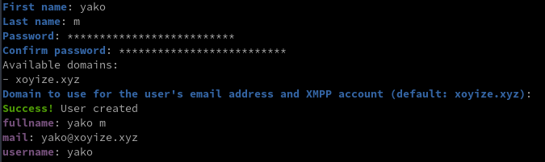

Ajouter le droit de connexion ssh à un utilisateur (FACULTATIF)

    yunohost user permission add ssh yako

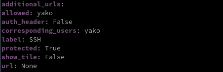

#### Domaines et DNS OVH

{:width="50"} 

Configuration DNS domaine par défaut **xoyize.xyz**

    yunohost domain dns-conf xoyize.xyz

```
; Basic ipv4/ipv6 records
@ 3600 IN A 109.123.254.249
@ 3600 IN AAAA 2a02:c206:2108:3749::1

; Mail
@ 3600 IN MX 10 xoyize.xyz.
@ 3600 IN TXT "v=spf1 a mx -all"
mail._domainkey 3600 IN TXT "v=DKIM1; h=sha256; k=rsa; p=MIGfMA0GCSqGSIb3DQEBAQUAA4GNADCBiQKBgQDXV7LKSP5+k//o9S8zaZAq1Y6w/V+lGXDQK8i4wA4NvN2xCcdrPxKbiUTwwGVm4FijBu/8bTIb7Qoz0eBGqh8ZJPaVQqqV/sf8eZui+KD3HBp+eM4shNDgzTOPdpIDfhAHzR2i/RFqj/wA3/iOqnzCaZejSF1ZsltbkM0/PdD6VwIDAQAB"
_dmarc 3600 IN TXT "v=DMARC1; p=none"


; XMPP
_xmpp-client._tcp 3600 IN SRV 0 5 5222 xoyize.xyz.
_xmpp-server._tcp 3600 IN SRV 0 5 5269 xoyize.xyz.
muc 3600 IN CNAME xoyize.xyz.
pubsub 3600 IN CNAME xoyize.xyz.
vjud 3600 IN CNAME xoyize.xyz.
xmpp-upload 3600 IN CNAME xoyize.xyz.

; Extra
* 3600 IN A 109.123.254.249
* 3600 IN AAAA 2a02:c206:2108:3749::1
@ 3600 IN CAA 128 issue "letsencrypt.org"
```

  
Se connecter à l'espace client du site OVH : **Web cloud &rarr; Domaines &rarr; xoyize.xyz &rarr; Zone DNS**  
Cliquer sur **"Modifier en mode textuel"**, garder les 4 premières lignes :  
{:width="600"}  
puis effacer tout ce qu'il y a en-dessous, et le remplacer par la configuration donnée par votre serveur ( `yunohost domain dns-conf`)

#### Activer Certificats SSL Let's Encrypt

  
On active les certificats SSL pour le domaine xoyize.xyz

    yunohost domain cert-install xoyize.xyz --no-checks

Résultat

```
[...]
Success! Configuration updated for 'nginx'
Success! Let's Encrypt certificate now installed for the domain 'xoyize.xyz'
```


#### OpenSSH, clé et script

{:height="70"}  
<u>sur l'ordinateur de bureau</u>
Générer une paire de clé curve25519-sha256 (ECDH avec Curve25519 et SHA2) nommé **xoyize-ed25519** pour une liaison SSH avec le serveur KVM.  

    ssh-keygen -t ed25519 -o -a 100 -f ~/.ssh/xoyize-ed25519

Envoyer les clés publiques sur le serveur KVM   

    ssh-copy-id -i ~/.ssh/xoyize-ed25519.pub admin@109.123.254.249

<u>sur le serveur Yunohost</u>
On se connecte  

    ssh admin@109.123.254.249

Sur votre serveur, la modification du fichier de configuration SSH pour désactiver l'authentification par mot de passe est gérée par un paramètre système 

    sudo yunohost settings set security.ssh.password_authentication -v no

Modifier le port SSH

*Pour empêcher les tentatives de connexion SSH par des robots qui analysent Internet à la recherche de tout serveur sur lequel SSH est activé, vous pouvez modifier le port SSH. Ceci est géré par un paramètre système, qui prend en charge la mise à jour de la configuration SSH et Fail2Ban.*

    sudo yunohost settings set security.ssh.port -v 55249

Accès depuis le poste distant avec la clé privée  

    ssh -p 55249 -i ~/.ssh/xoyize-ed25519 admin@109.123.254.249

#### Journal

La façon de s'assurer que vous pouvez visualiser tous les messages de journal est d'ajouter l'utilisateur à un groupe existant tel que adm ou systemd-journal.

    sudo usermod -a -G systemd-journal $USER

### Historique de la ligne de commande

Ajoutez la recherche d’historique de la ligne de commande au terminal  
Se connecter en utilisateur debian  
Tapez un début de commande précédent, puis utilisez shift + up (flèche haut) pour rechercher l’historique filtré avec le début de la commande.

```bash
# Global, tout utilisateur
echo '"\e[1;2A": history-search-backward' | sudo tee -a /etc/inputrc
echo '"\e[1;2B": history-search-forward' | sudo tee -a /etc/inputrc
```

### Outils, scripts motd et ssh_rc_bash

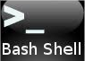{:height="50"}  
Installer utilitaires  

    sudo apt install rsync curl tmux jq figlet git tree


Motd

    sudo rm /etc/motd && sudo nano /etc/motd

```
   ___            _          _                 
  / __| ___  _ _ | |_  __ _ | |__  ___         
 | (__ / _ \| ' \|  _|/ _` || '_ \/ _ \        
  \___|\___/|_||_|\__|\__,_||_.__/\___/        
 __   __                 _              _      
 \ \ / /_  _  _ _   ___ | |_   ___  ___| |_    
  \ V /| || || ' \ / _ \| ' \ / _ \(_-<|  _|   
   |_|  \_,_||_||_|\___/|_||_|\___//__/ \__|   
                  _                            
 __ __ ___  _  _ (_) ___ ___    __ __ _  _  ___
 \ \ // _ \| || || ||_ // -_) _ \ \ /| || ||_ /
 /_\_\\___/ \_, ||_|/__|\___|(_)/_\_\ \_, |/__|
            |__/                      |__/     
```


Script **ssh_rc_bash**  
>**ATTENTION!!! Les scripts sur connexion peuvent poser des problèmes pour des appels externes autres que ssh**

```shell
wget https://static.xoyaz.xyz/files/ssh_rc_bash
chmod +x ssh_rc_bash # rendre le bash exécutable
./ssh_rc_bash        # exécution
```

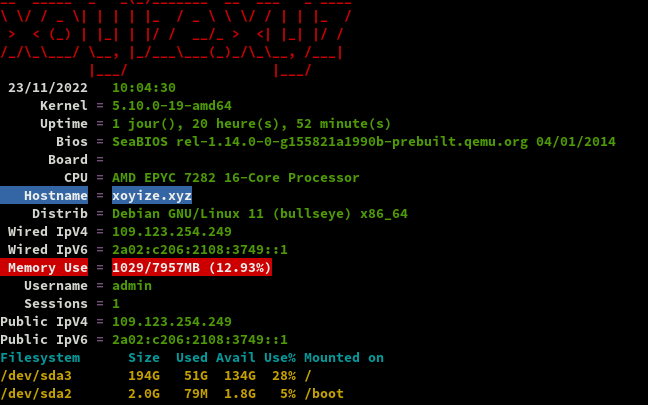

### Ajout Domaine et utilisateur

Administration web

* Créer les domaines **cinay.eu** et **yanfi.net**
* Modifier les DNS OVH pour les domaines concernés
* Certificats Let's Encrypt
* Créer les utilisateurs 

## Sauvegardes

### Borg

{:height="50"}  

#### Borg Backup vers boîte stockage

On installe application **Borg Backup** sur yunohost avec le dépôt `ssh://u326239@u326239.your-storagebox.de:23/./backup/borg/xoyize.xyz`  
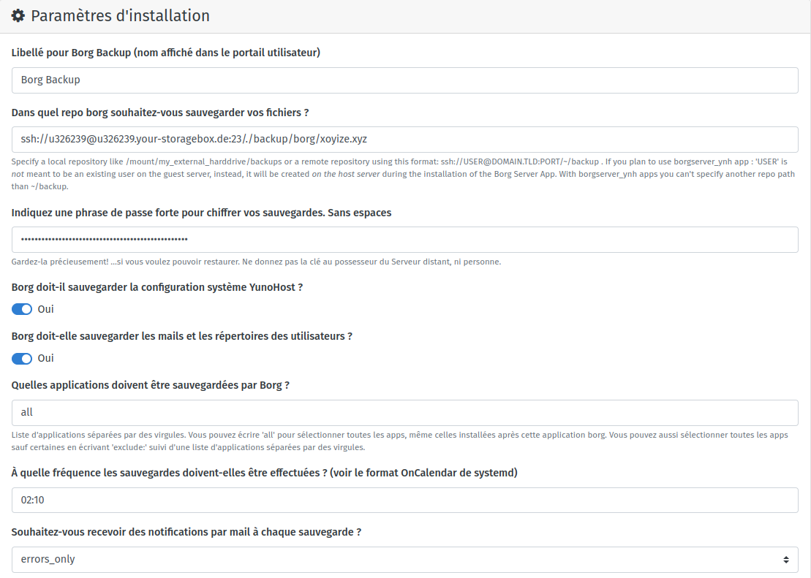  
Cliquer sur "Installer"   

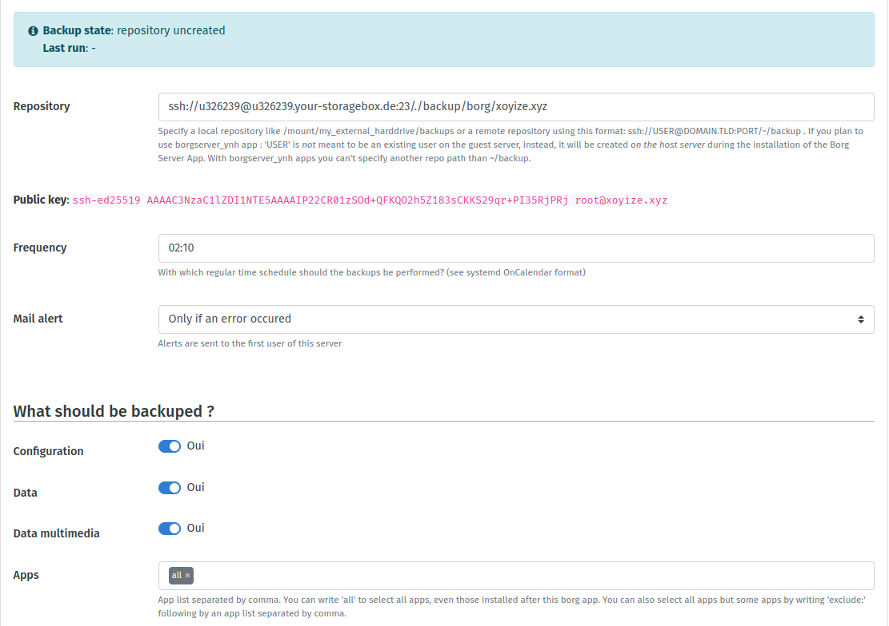  
Repository : `ssh://u326239@u326239.your-storagebox.de:23/./backup/borg/xoyize.xyz`  

Clé publique : `ssh-ed25519 AAAAC3NzaC1lZDI1NTE5AAAAIP22CR01zSOd+QFKQO2h5Z183sCKKS29qr+PI35RjPRj root@xoyize.xyz`

Depuis un poste ayant accès à la boîte de stockage, on récupère le fichier `authorized_keys` de la boîte de stockage **bx11-yann** dans un fichier nommé `storagebox_authorized_keys`

    echo -e "get .ssh/authorized_keys storagebox_authorized_keys" | sftp -P 23 -i ~/.ssh/bx11-yann-ed25519 u326239@u326239.your-storagebox.de

	cat >> storagebox_authorized_keys

Copier/coller le contenu du fichier du fichier de clef publique (fichier `cat /root/.ssh/id_borg_ed25519.pub`* de la machine à sauvegarder **Yunohost xoyize.xyz** ) dans ce terminal, et presser **[Ctrl]+[D]** pour valider.

On renvoie le fichier modifié `storagebox_authorized_keys` dans le fichier `authorized_keys` de la boîte de stockage **bx11-yann**

    echo -e "put storagebox_authorized_keys .ssh/authorized_keys" | sftp -P 23 -i ~/.ssh/bx11-yann-ed25519 u326239@u326239.your-storagebox.de

#### Tester la configuration borg

Tester la connexion 

    sftp -P 23 -i /root/.ssh/id_borg_ed25519 u326239@u326239.your-storagebox.de

```
The authenticity of host '[u326239.your-storagebox.de]:23 ([2a01:4f8:b23:2000::35]:23)' can't be established.
ECDSA key fingerprint is SHA256:oDHZqKXnoMtgvPBjjC57pcuFez28roaEuFcfwyg8O5c.
Are you sure you want to continue connecting (yes/no/[fingerprint])? yes
Warning: Permanently added '[u326239.your-storagebox.de]:23,[2a01:4f8:b23:2000::35]:23' (ECDSA) to the list of known hosts.
Connected to u326239.your-storagebox.de.
sftp> 
```

Saisir *quit* pour sortir

À cette étape, votre sauvegarde devrait se dérouler à l'heure prévue (tous les jours à 2h10). Notez que la première sauvegarde peut être très longue, car de nombreuses données doivent être copiées via ssh. Les sauvegardes suivantes sont incrémentielles : seules les données nouvellement générées depuis la dernière sauvegarde seront copiées.
{: .prompt-info }


Si vous voulez tester la configuration correcte de Borg Apps avant l'heure prévue, vous pouvez lancer une sauvegarde manuellement sur le serveur Yunohost xoyize.xyz :

On passe en tmux

```bash
sudo -s
tmux
systemctl start borg
# Ctrl b d pour sortir de la session tmux
```

Visualiser les logs en cours dans un autre terminal

    journalctl -f -u borg

A la fin de la sauvegarde borg  
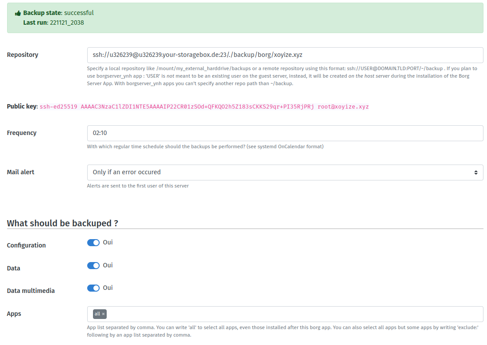  

#### Lister les sauvegardes

Commande à exécuter en mode su

```shell
sudo -s
app=borg; BORG_PASSPHRASE="$(yunohost app setting $app passphrase)" BORG_RSH="ssh -i /root/.ssh/id_${app}_ed25519 -oStrictHostKeyChecking=yes " borg list "$(yunohost app setting $app repository)"
```

Exemple pour le 21 novembre 2022

```
_auto_conf-2022-11-21_14:47          Mon, 2022-11-21 14:47:28 [f4119ce200057f72a4bb6be5116e74b49d992170bff26d1a8df6718b4cccb91d]
_auto_data-2022-11-21_14:47          Mon, 2022-11-21 14:47:39 [40489469e0d54ef9146f170dcc3274dc8a4cb8fa90ded6778044f26e34154878]
_auto_borg-2022-11-21_14:47          Mon, 2022-11-21 14:47:48 [b6a98061ec0f188aa1ccc745d5c5d84972c46ac418ff2e9c78d1664de22b4b90]
_auto_nextcloud-2022-11-21_14:47     Mon, 2022-11-21 14:47:57 [6811c230f04646a7b203a2fa9632f4c70fe552f087af106f2dc36da7a31669f9]
```

### datayan vers bx11

Sauvegarde par rsync du dossier `/srv/datayan/` vers boîte de stockage bx11

```shell
rsync -avz --progress --delete -e "ssh -p 23 -i /root/.ssh/id_borg_ed25519 \
-o StrictHostKeyChecking=no -o UserKnownHostsFile=/dev/null" \
--recursive /srv/datayan/{BiblioCalibre,CalibreTechnique,musique,static,www} \
u326239@u326239.your-storagebox.de:backup/datayan/
```

## Applications 

### Nextcloud

{:width="70"}

**cloud.xoyize.xyz**

Ajout domaine cloud.xoyize.xyz en utilisant l'administration web

    sudo yunohost domain add cloud.xoyize.xyz

Ajout certificats 

    sudo yunohost domain cert-install cloud.xoyize.xyz --no-checks

Mise à niveau nextcloud hub 3 version 25  

    sudo yunohost app install https://github.com/YunoHost-Apps/nextcloud_ynh/tree/testing

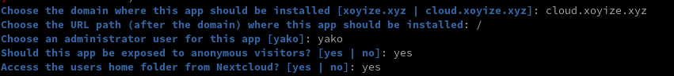

#### Paramétrage Nextcloud v25+

*Nextcloud de base v25+ est installé*

On se connecte en administrateur sur nextcloud   
Cliquer sur l'icône utilisateur en haut à droite de l'écran et sur **Administration settings**  
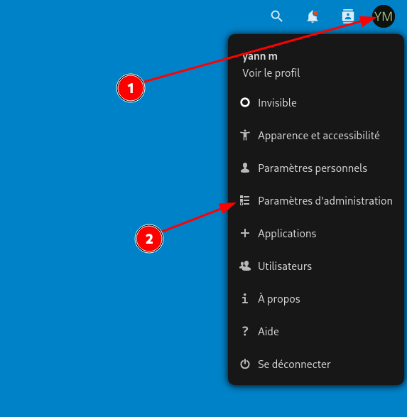{:width="300"}  
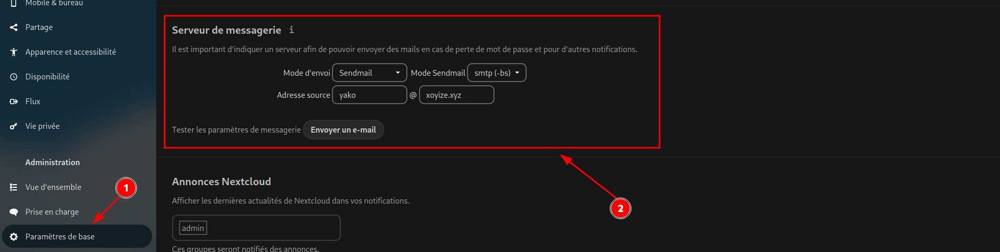

Une vérification est faite sur **Vue d'ensemble**  dans la rubrique **Administration**  
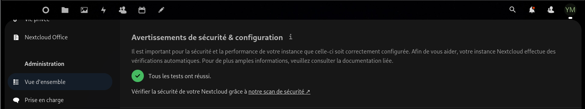  

clic sur **Apparence et accessibilité**  dans la rubrique **Personnel**  
Sélectionner **Thème sombre**   
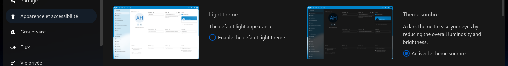  

Arrière-plan  
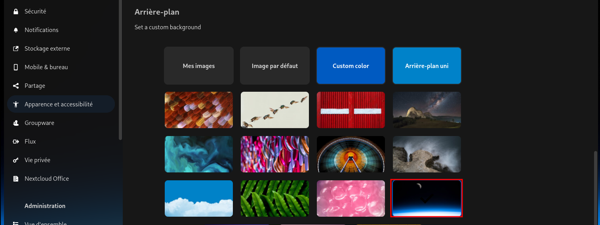  

Messagerie  
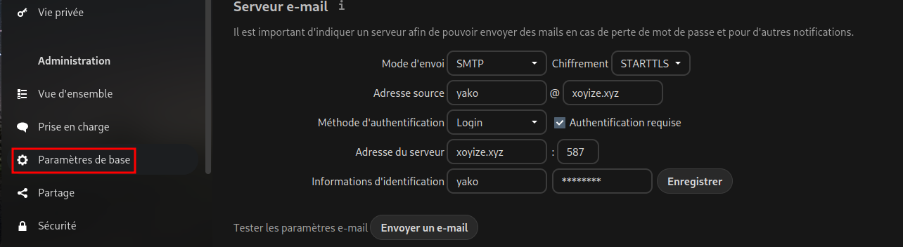  

En ligne de commande, ajouter `'default_phone_region' => 'FR'` dans le fichier /var/www/nextcloud/config/config.php avant le tag de fin de fichier `);`

#### Contacts et Calendrier

**Pack d'applications**  
**Télécharger et activer** les applications **Calendar** et **Contacts**

**Importer des contacts**  
Dans Contacts --> Paramètres de Contacts --> Carnets d'adresses : Importer des contacts Sélectionner un fichier local  

**Importer agenda yannick**  

#### OnlyOffice

* [OnlyOffice YunoHost, Nextcloud et Archlinux](/posts/OnlyOffice_pour_YunoHost/)

Ajout domaine **office.xoyize.xyz** et les certificats , Emails sortants/entrants à non  
Installer application OnlyOffice sur le domaine office.xoyize.xyz  
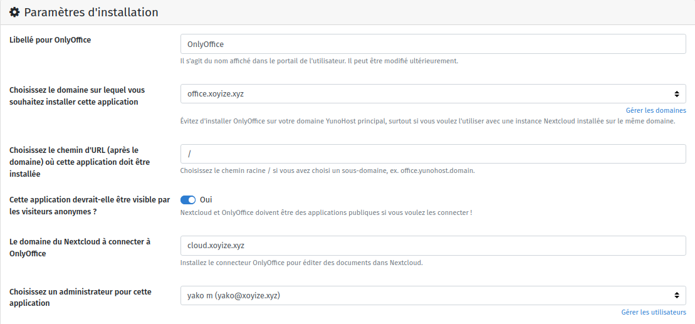  

### Transmission


Installer par l'interface web admin  
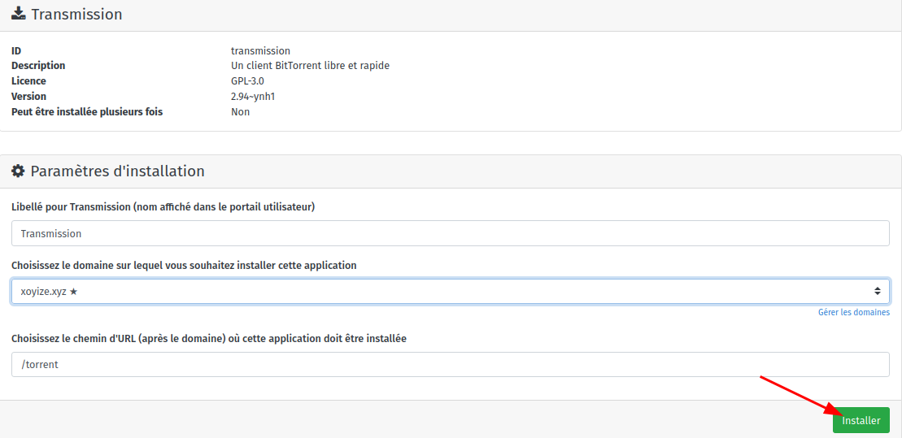  

### Audio Navidrome

#### Domaine zic.xoyize.xyz

Ajout domaine zic.xoyize.xyz par interface web admin  
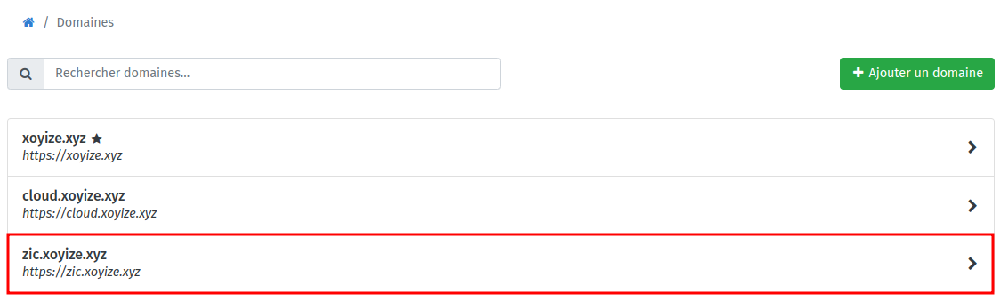  

Certificats zic.xoyize.xyz  

    yunohost domain cert install zic.xoyize.xyz --no-checks

```
Success! Configuration updated for 'nginx'
Success! Let's Encrypt certificate now installed for the domain 'zic.xoyize.xyz'
```

Installer application Navidrome  
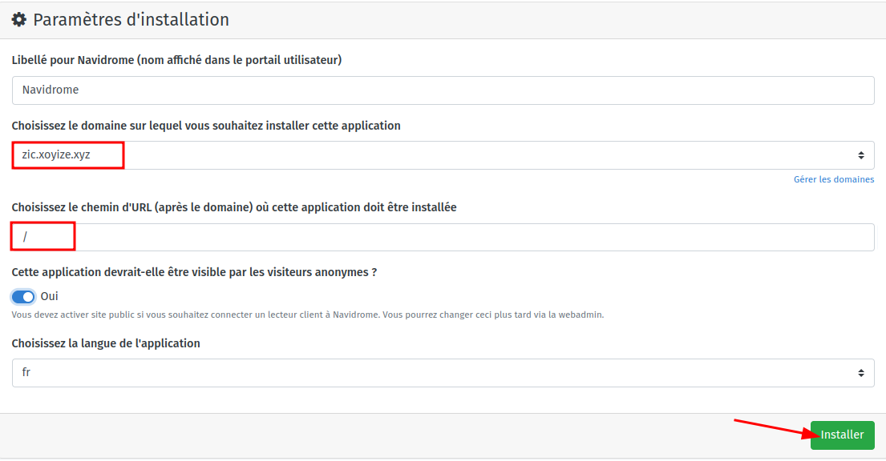  

Après installation, aller dans Applications Navidrome  
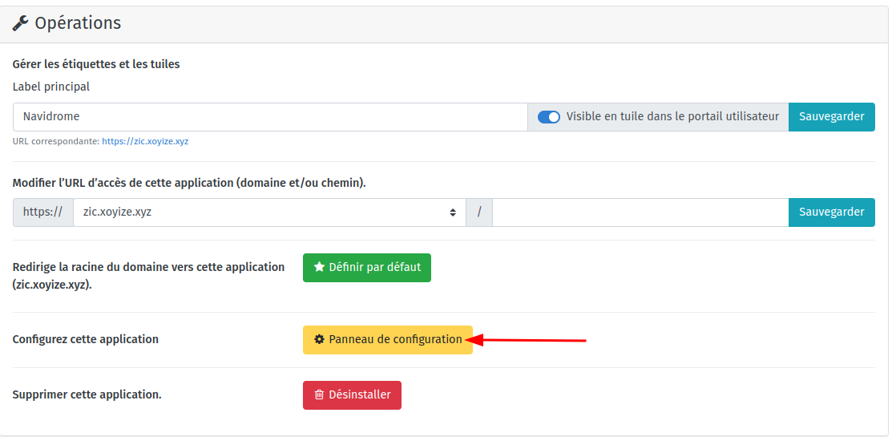  

Modifier le répertoire de la musique et ajouter le dossier des "playlists" dans le fichier `/var/lib/navidrome/navidrome.toml`  

```
# Folder to store application data (DB, cache…)
DataFolder = "/var/lib/navidrome"

# Folder where your music library is stored. Can be read-only
MusicFolder = "/home/yunohost.multimedia/share/Music/musicyan"

# Playlist
ND_PLAYLISTSPATH = "/home/yunohost.multimedia/share/Music/musicyan/Playlists"
```

Faire une sauvegarde après modification

    sudo cp /var/lib/navidrome/navidrome.toml /var/lib/navidrome/navidrome.toml.sav

Redémarrer navidrome

    sudo systemctl restart navidrome

Ouvrir le lien <https://zic.xoyize.xyz/> et saisir un identifiant + mot de passe pour le compte administrateur  
  

### Calibre web

{:width="80"} 

1. Ajout domaine et certificats **calibre.xoyize.xyz** par le web admin  
2. Modifier la configuration du domaine pour positionner la gestion des messages entrants et sortants à **Non**  
3. Gérer les certificats SSL, en ligne de commande

    yunohost domain cert-install calibre.xoyize.xyz --no-checks

```
Success! Configuration updated for 'nginx'
Success! Let's Encrypt certificate now installed for the domain 'calibre.xoyize.xyz'
```

Installer l'application **Calibre-web** par l'administration web

  
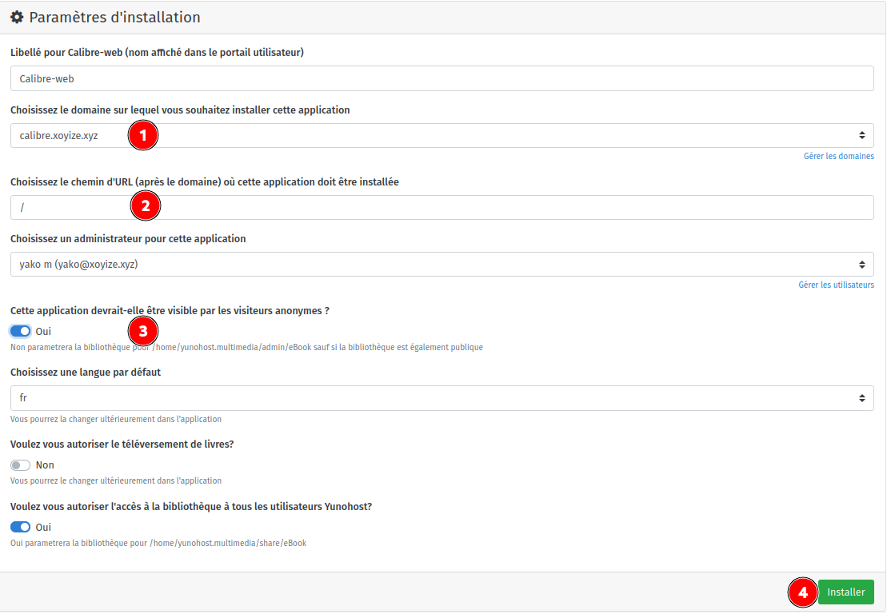  

Par défaut, le processus de sauvegarde de Yunohost sauvegarde la bibliothèque Calibreweb. Vous pouvez désactiver la sauvegarde de la bibliothèque avec

    yunohost app setting calibreweb do_not_backup_data -v 1

>Par défaut, la suppression de l'application ne supprimera jamais la bibliothèque.

Ouvrir le lien https://calibre.xoyize.xyz  
Se connecter avec l'utilisateur yako qui est l'administrateur de calibre-web  
Modifier le chemin de la base et des données Calibre : /home/yunohost.multimedia/share/eBook/BiblioCalibre  
Thème sombre  

Editer la configuration de l'interface utilisateur &rarr; Configuration du mode d'affichage  
    

**Modifications pour un accès en lecture écriture du dossier** 

Ajouter l'utilisateur admin au groupe calibreweb pour les droits lecture/écriture

    sudo gpasswd -a admin calibreweb

Droits **calibreweb.calibreweb** sur le dossier `/home/yunohost.multimedia/share/eBook`

### Shaarli

{:width="70"}

Créer le domaine shaarli.xoyize.xyz avec certificats Let's Encrypt, emails sortants et entrants à non

    yunohost domain cert-install shaarli.xoyize.xyz --no-checks

Installation depuis gitea pour une version PHP 8.1

```
sudo -s
git clone https://gitea.xoyaz.xyz/yann/Shaarli
yunohost app install Shaarli


DANGER! This app is not part of YunoHost's app catalog. Installing third-party apps may compromise the
 integrity and security of your system. You should probably NOT install it unless you know what you ar
e doing. NO SUPPORT will be provided if this app doesn't work or breaks your system... If you are will
ing to take that risk anyway, type 'Yes, I understand': Yes, I understand
Choose the domain where this app should be installed [xoyize.xyz | calibre.xoyize.xyz | cloud.xoyize.x
yz | shaarli.xoyize.xyz | static.xoyize.xyz | zic.xoyize.xyz]: shaarli.xoyize.xyz
Choose the URL path (after the domain) where this app should be installed: /
Who should have access to this app? (This can later be changed) [all_users | visitors | admins]: all_users
Choose an administrator user for this app [yako | marina]: yako
Choose an administration password for this app: *********
Choose a title for your Shaarli instance: Shaarli
---
Success! Installation completed
==========
The installation of Shaarli completed. You should now go to https://shaarli.xoyize.xyz/ and create your account. After the creation of the account, the registration will be locked.
==========
WARNING: You should check the app notifications above before continuing, there might be important stuf
f to know. [Press enter to continue]:
```

Pour la gestion LDAP, ajouter ce qui suit au fichier `/var/www/shaarli/data/config.json.php`

```json
    "ldap": {
        "host": "ldap://localhost",
        "dn": "uid=%s,ou=users,dc=yunohost,dc=org"
    }
```

Lien : https://shaarli.xoyize.xyz

Le fichier qui contient toutes les marques : /var/www/shaarli/data/datastore.php avec les droits `shaarli;www-data`

### Gitea 

[{:width="70"}](https://github.com/YunoHost-Apps/gitea_ynh)

Créer le domaine gitea.xoyize.xyz avec certificats Let's Encrypt, emails sortants et entrants à non

```bash
sudo yunohost domain add gitea.xoyize.xyz # ou utiliser administration web
sudo yunohost domain cert-install gitea.xoyize.xyz --no-checks
```

Installation à partir de github

```bash
sudo yunohost app install -l gitea https://github.com/YunoHost-Apps/gitea_ynh
sudo yunohost app install https://github.com/YunoHost-Apps/gitea_ynh/tree/testing # version test
```

Répondre aux différentes questions et patienter plusieurs minutes ...

```
DANGER! This app is not part of YunoHost's app catalog. Installing third-party apps may compromise the integ
rity and security of your system. You should probably NOT install it unless you know what you are doing. NO 
SUPPORT will be provided if this app doesn't work or breaks your system... If you are willing to take that r
isk anyway, type 'Yes, I understand': Yes, I understand
Choose the domain where this app should be installed [xoyize.xyz | calibre.xoyize.xyz | cloud.xoyize.xyz | g
itea.xoyize.xyz | shaarli.xoyize.xyz | static.xoyize.xyz | zic.xoyize.xyz]: gitea.xoyize.xyz
Choose the URL path (after the domain) where this app should be installed: /
Choose an administrator user for this app [yako | marina]: yako
Should this app be exposed to anonymous visitors? [yes | no]: yes
```

Paramétrage gitea https://gitea.xoyize.xyz  
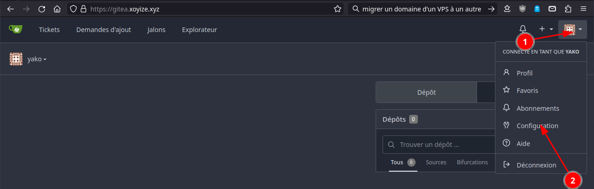  

Modifier le paramétrage  
**Compte**  
Ajouter une adresse email et la rendre principale
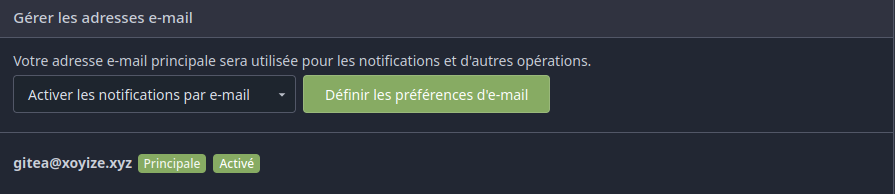  
**Profil public**, mise à jour avatar (`~/media/dplus/images/yannick/lettre-y-2.png`)  
{:height="150"}  

Au final, le profil est le suivant  
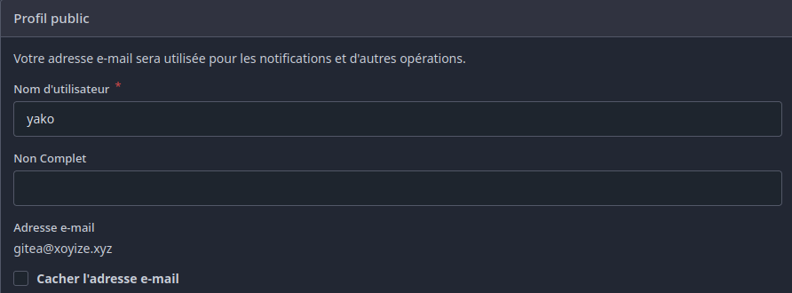  
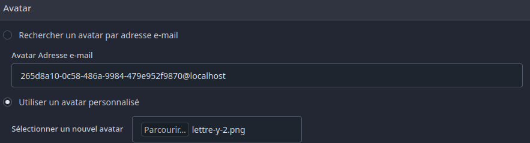  

### Site static

#### Création domaine static.xoyize.xyz

1. Ouvrir yunohost en mode administrateur
2. Créer le domaine static.xoyize.xyz
3. Emails Entrants/Sortants à Non
4. Certificat Let's Encrypt  
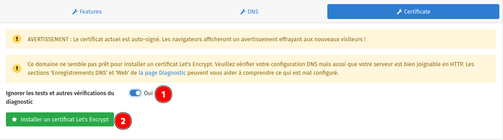  
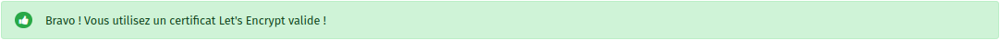  

#### My Webapp

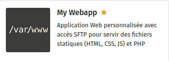  

Interface administrateur: Applications &rarr; Catalogue :My Webapp  
  
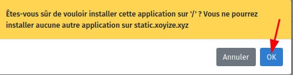{:width="400"}  

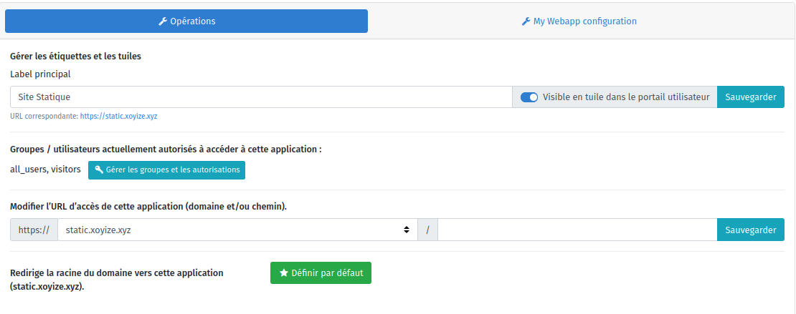  

  
PHP 8.2

Création des dossiers multimedia

    mkdir -p /home/yunohost.multimedia/share/Divers
    mkdir -p /home/yunohost.multimedia/share/Divers/{diceware,img,osm-new,site,static}

Le dossier **/home/yunohost.multimedia/share/Divers/static/** contient le site statique qui est issu d'une synchronisation d'un conteneur debian sur un ordinateur archlinux avec jekyll comme générateur

En admin su 

```bash
rm -rf /var/www/my_webapp/www/  # supprimer dossier www web par défaut 
ln -s /home/yunohost.multimedia/share/Divers/static /var/www/my_webapp/www  # lien my_webapp pour le site static
```

Visiter les liens:   
<https://static.xoyize.xyz>  
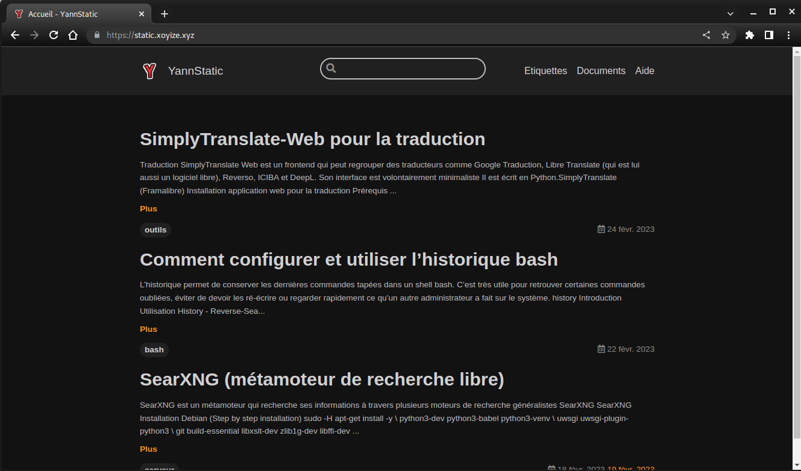  


#### h5ai site cartes diceware

*h5ai est un indexeur de fichiers moderne pour les serveurs web HTTP avec un focus sur vos fichiers. Les répertoires sont affichés de manière attrayante et leur navigation est améliorée par différentes vues, un fil d'Ariane et une arborescence.*

Le dossier _h5ai est inclus dans /site

    sudo nano /etc/nginx/conf.d/static.xoyize.xyz.d/my_webapp.d/site.conf 

```
location /site {
 alias /home/yunohost.multimedia/share/Divers/site/;	
 index index/ index.php /site/_h5ai/public/index.php;
   location ~ [^/]\.php(/|$) {
	    fastcgi_split_path_info ^(.+?\.php)(/.*)$;
	    fastcgi_pass unix:/var/run/php/php8.2-fpm-my_webapp.sock;
	    fastcgi_index index.php;
	    include fastcgi_params;
	    fastcgi_param REMOTE_USER $remote_user;
	    fastcgi_param PATH_INFO $fastcgi_path_info;
	    fastcgi_param SCRIPT_FILENAME $request_filename;
	}
}

    location /diceware {
       alias /home/yunohost.multimedia/share/Divers/diceware/;
    }

    location /cartes {
       alias /home/yunohost.multimedia/share/Divers/osm-new/;
    }
```

Recharger nginx : `sudo systemctl reload nginx`

<https://static.xoyize.xyz/site>  
<https://static.xoyize.xyz/cartes>  
<https://static.xoyize.xyz/diceware>  


### site div

#### Création domaine div.yanfi.net

1. Ouvrir yunohost en mode administrateur
2. Créer le domaine static.yanfi.net
3. Emails Entrants/Sortants à Non
4. Certificat Let's Encrypt  
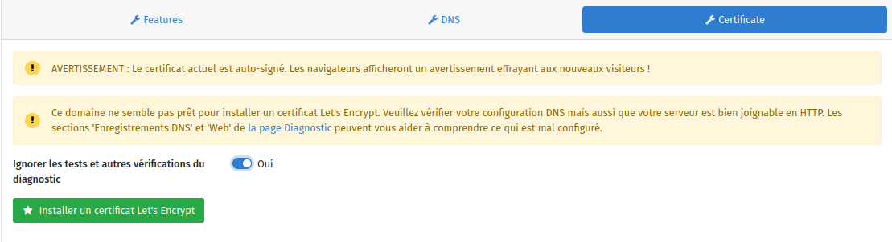  
  

Installer my_webapp  
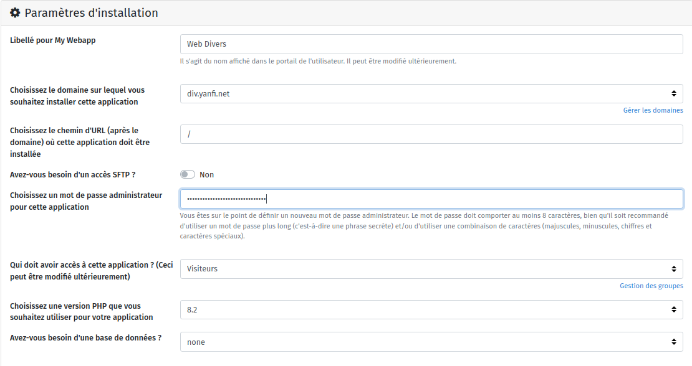  

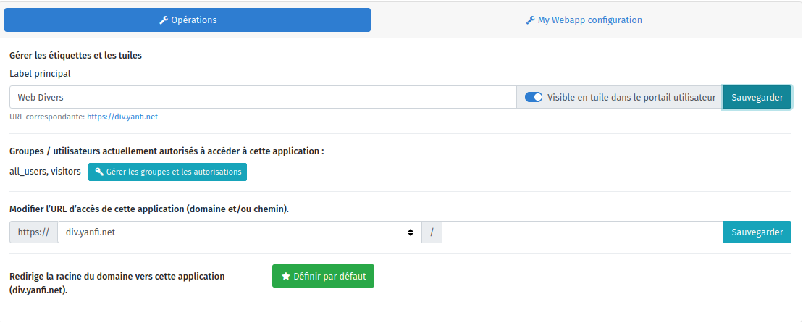  
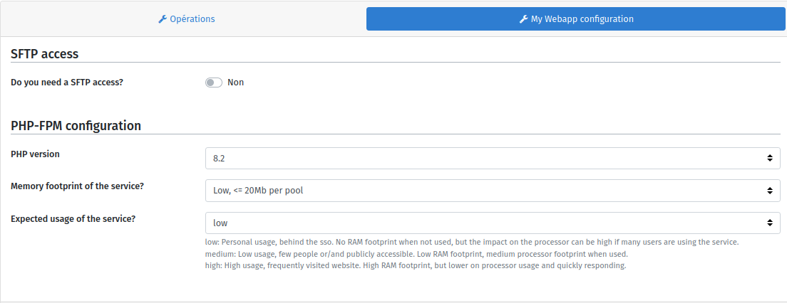  


### Jirafeau - Partage de fichiers

{:height="100"}  
<https://yunohost.org/fr/app_jirafeau>  
*Jirafeau offre la possibilité d'héberger et de partager vos fichiers, le tout en toute simplicité. Choisissez un fichier, Jirafeau vous fournira un lien avec beaucoup d'options. Il est possible de protéger vos liens avec mot de passe ainsi que de choisir la durée de rétention du fichier sur le serveur. Le fichier et le lien s'autodétruiront passé ce délai. Les téléchargements des fichiers transmis peuvent être limités à une certaine date, et chaque fichier peut s'autodétruire après le premier téléchargement. Jirafeau permet de configurer les temps maximum de rétention ainsi que la taille maximale par fichier. Le chiffrement est disponible en option.*

Installation via administration web  
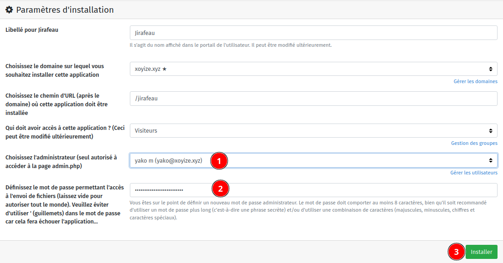

Pour envoyer un fichier sur Jirafeau le mot de passe est nécessaire  
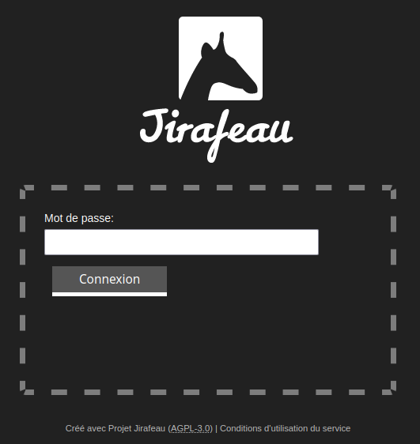{:height="250"}  

Cliquer sur le + puis sélectionner le fichier à envoyer  
{:height="250"}  

Avec les options par défaut  
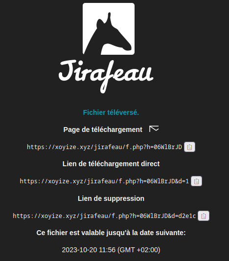{:height="250"}  
On voit que le fichier est disponible au téléchargement pour un mois

### SnappyMail

{:height="80"}  
*Client de messagerie Web simple, moderne, léger et rapide. La version radicalement améliorée et sécurisée de RainLoop Webmail Community edition.*

Création domaine webmail.yanfi.net en ligne de commande pour par admin web

    sudo yunohost domain add webmail.yanfi.net
    sudo yunohost domain cert-install webmail.yanfi.net --no-checks

Configurer le domaine pour supprimer la gestion des messages entrants et sortants

    yunohost domain config set webmail.yanfi.net -a "mail_in=0&mail_out=0"

```
========================================
>>>> Feature
========================================
Default app [_none | gitea | my_webapp | nextcloud | searx | snappymail | transmission | ttrss]: _none
Warning: So far, enabling/disabling mail or XMPP features only impact the recommended and automatic DNS configuration, not system configurations!
Instant messaging (XMPP) [yes | no]: no

========================================
>>>> Dns
========================================
Info: This domain is a subdomain of yanfi.net. DNS registrar configuration should be managed in webmail.yanfi.net's configuration panel.
Info: Saving the new configuration...
Success! Config updated as expected
```

Vérification

    yunohost domain config get webmail.yanfi.net

```
dns.registrar.registrar: 
  ask: This domain is a subdomain of yanfi.net. DNS registrar configuration should be managed in webmail.yanfi.net's configuration panel.
  value: parent_domain
feature.app.default_app: 
  ask: Default app
  value: _none
feature.mail.features_disclaimer: 
  ask: So far, enabling/disabling mail or XMPP features only impact the recommended and automatic DNS configuration, not system configurations!
feature.mail.mail_in: 
  ask: Incoming emails
  value: no
feature.mail.mail_out: 
  ask: Outgoing emails
  value: no
feature.xmpp.xmpp: 
  ask: Instant messaging (XMPP)
  value: no
```

Installer application snappymail en ligne de commande

    sudo yunohost app install https://github.com/YunoHost-Apps/snappymail_ynh

```
Choose the domain where this app should be installed [yanfi.net | gitea.yanfi.net | rss.yanfi.net | searx.yanfi.net | stat
ic.yanfi.net | webmail.yanfi.net]: webmail.yanfi.net
Choose the URL path (after the domain) where this app should be installed: /
Should this app be exposed to anonymous visitors? [yes | no]: yes
```

Installer application snappymail par admin web  
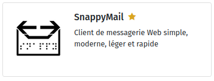  
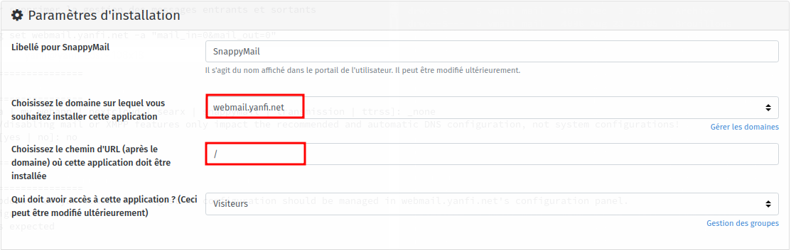  

Le wiki <https://github.com/the-djmaze/snappymail/wiki>

#### Administration

Ouvrez l'interface utilisateur admin <https://webmail.yanfi.net/?admin> pour configurer les paramètres de votre serveur de messagerie. Connectez-vous avec l'utilisateur "admin" et le mot de passe du fichier `/var/www/snappymail/data/_data_/_default_/admin_password.txt`. Si vous avez des problèmes pour appeler l'interface d'administration, essayez en mode privé de votre navigateur. De cette façon, les cookies et autres données en cache des installations précédentes sont ignorés.

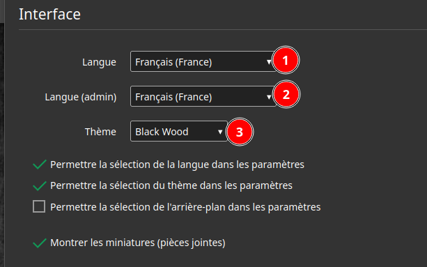{width="400"}  

Télécharger et activer extension TOTP  
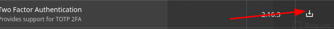{width="400"}  
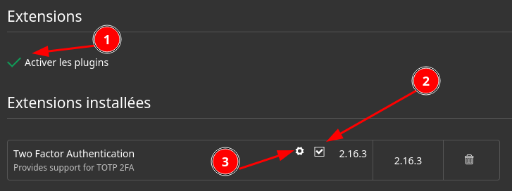{width="400"}  
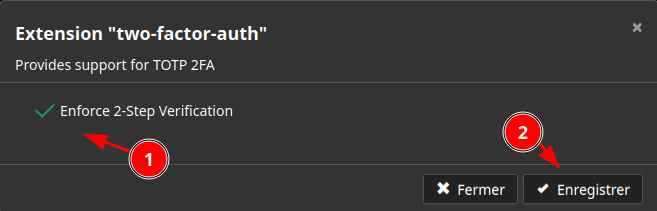{width="400"}  

ajouter la clé de votre générateur dans "Code TOTP" pour l'authentification à 2 facteurs  
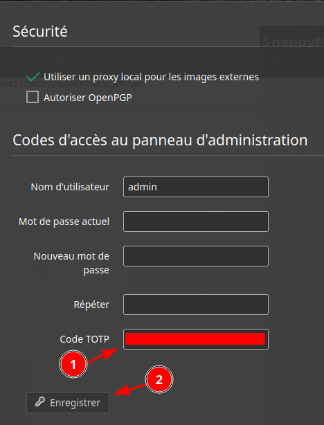{width="300"}  
Se reconnecter, il faudra saisir le code TOTP  
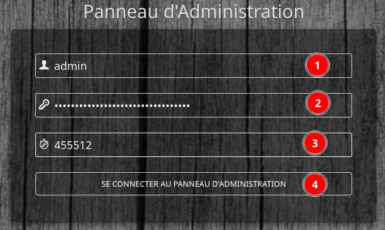{width="300"}  

Ajouter les nouveaux domaines de messagerie puis se déconnecter   

Ouvrir en mode utilisateur <https://webmail.yanfi.net>   
Saisir adresse messagerie et mot de passe  
A la première connexion de chaque utilisateur, il faut mettre en place le code totp

#### Ajout comptes de messagerie

Ajouter un compte de messagerie  
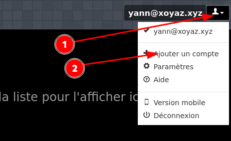{width="400"}  
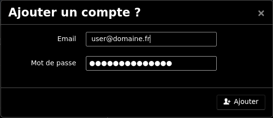{width="400"}  

Tous les comptes de messagerie sont accessibles par une adresse et mot de passe plus un second facteur d'authentification de type TOTP.
{: .prompt-info }

### Tiny Tiny RSS 

{:width="50px"}  

#### Domaine rss.yanfi.net

Ajout domaine et certificats rss.yanfi.net

    yunohost domain add rss.yanfi.net
    yunohost domain cert install rss.yanfi.net --no-checks

```
[...]
Success! Configuration updated for 'nginx'
Success! Let's Encrypt certificate now installed for the domain 'rss.yanfi.net'
```

Paramétrage en mode administration web, emails sortants et entrants à Non   
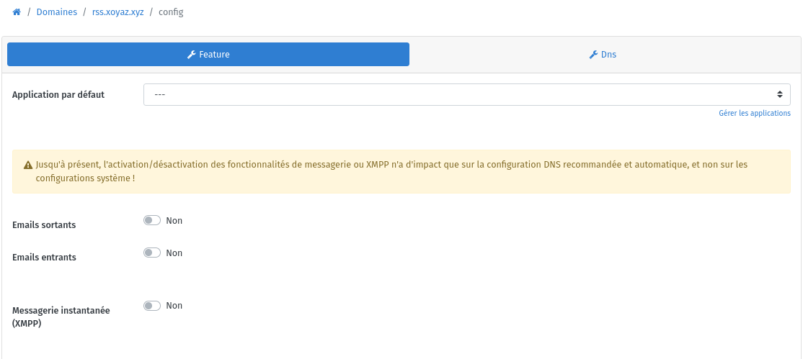  


#### Installer Tiny Tiny RSS

A-Installation en ligne de commande 

```bash
git clone https://gitea.xoyize.xyz/yako/ttrss.git
sudo yunohost app install ttrss
```

Répondre aux questions

```
Choose the domain where this app should be installed [cinay.eu | xoyize.xyz | calibre.xoyize.xyz | cloud.xoy
ize.xyz | gitea.xoyize.xyz | office.xoyize.xyz | shaarli.xoyize.xyz | static.xoyize.xyz | zic.xoyize.xyz | y
anfi.net | rss.yanfi.net | webmail.yanfi.net]: rss.yanfi.net
Choose the URL path (after the domain) where this app should be installed: /
Who should have access to this app? (This can later be changed) [all_users | visitors | admins]: visitors
[...]
Success! Installation completed
==========
Default credentials are:

Username: `admin`
password: `password`
==========
WARNING: You should check the app notifications above before continuing, there might be important stuff to k
now. [Press enter to continue]:

```

B-Installation via admin web  
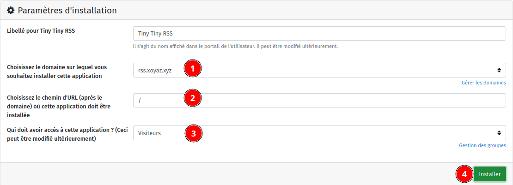  
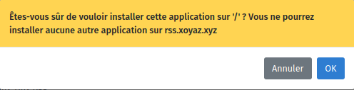  
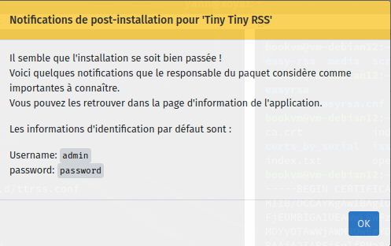  

Ouvrir le lien <https://rss.yanfi.net> avec admin/password   
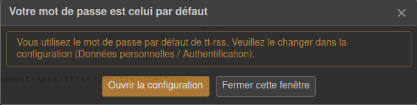{:width="300"}  
Ouvrir et ajouter un utilisateur administrateur yako et son mot de passe  
Déconnecter admin puis connecter yako  

Activer api  
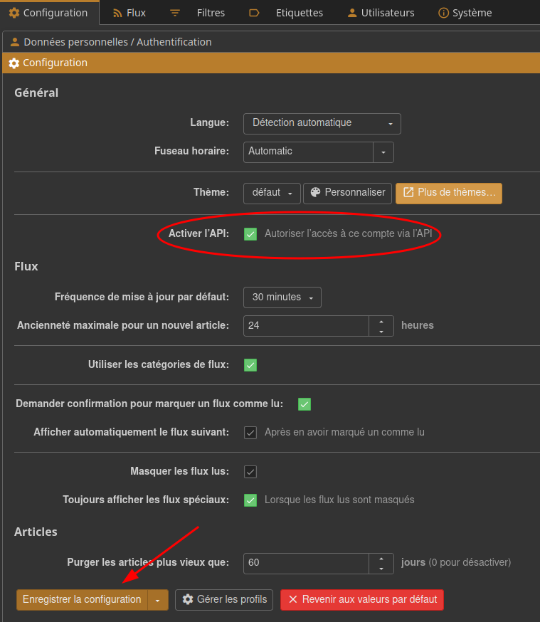{:width="400px"}  

Importer les paramètres et flux depuis un fichier opml  

Modifier la ligne suivante du fichier `/var/www/ttrss/config.php` (ajout de `auth_remote`)

    	putenv('TTRSS_PLUGINS=auth_internal, auth_remote, note, data_migration');

#### Authentification par certificat client

{:width="80px"}  

[Comment mettre en place et configurer une autorité de certification (AC) avec Easy-RSA](/posts/Mettre_en_place_et_configurer_une_autorite_de_certification_AC_avec_Easy-RSA/)  

Autorité de certification yako /usr/local/share/ca-certificates/ac-yako.crt  , mise à jour par `update-ca-certificates`

Les certificats sous `/etc/ssl/certs/`

```
lrwxrwxrwx 1 root root     44 Jul 12 12:03  ac-yako.pem -> /usr/local/share/ca-certificates/ac-yako.crt
lrwxrwxrwx 1 root root     11 Jul 12 12:03  b93a0109.0 -> ac-yako.pem
```

Le certificat client  suffixe **pfx** sera importé dans firefox et chrome  

Exemple avec yannick.pfx (Le mot de passe pour l'importation est exigé)  
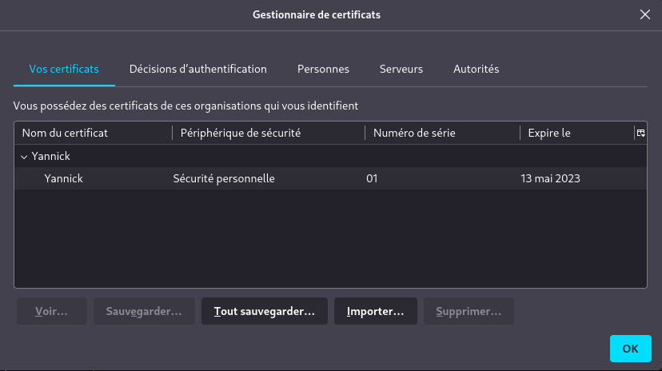   
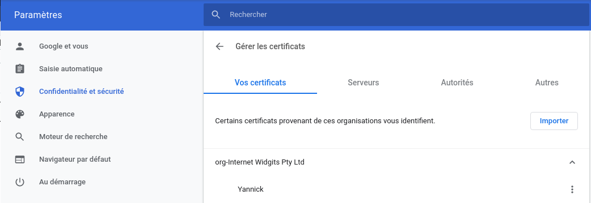   

[Tiny Tiny RSS (ttrss) authentification par certificat client](/posts/Tiny-Tiny-RSS_ttrss/#authentification-par-certificat-client)

### FreshRSS (NON ACTIF)

*Agrégateur de flux RSS avec une interface adaptée au mobile.*

Installer l'application par l'administration web  
Pour éviter l'erreur en ouverture, il faut sélectionner **admins** dans les groupes autorisés  
Domaine `rss.yanfi.net` et chemin `/`  

Pour une utilisation de l'application mobile EasyRSS, il faut configurer l'api

*    Dans votre profil utilisateur : Paramètres > profil
*    Configurer un mot de passe API
*    Vérifiez que l'API fonctionne : https://rss.yanfi.net/rss/api/greader.php
*    Configurez votre client avec : 
       * nom d'utilisateur : ynh user
       * mot de passe : le mot de passe que vous venez de configurer
       * URL https://rss.yanfi.net/rss/api/greader.php

### Moteur recherche SearxNG  (INACTIF)

Ajout domaine seaxr.xoyize.xyz +  Certificats + Emails entrants sortants à Non  
Installer application SearxNG , chemin `/` , accès aux visiteurs   

Modifier le paramétrage de l'application en mode cli, pour afficher sur un nouvel onglet le clic sur un des liens du résultat de la recherche

```bash
sudo -s
sudo -H sed -i -e "s/\# results_on_new_tab: false/results_on_new_tab\: true/g" /var/www/searxng/searxng-src/searx/settings.yml
```

Relancer le service

    sudo systemctl restart uwsgi-app@searxng.service

## Maintenance

### PHP cli alternative

Pour changer la version PHP cli par défaut

    sudo update-alternatives --config php

```
There are 2 choices for the alternative php (providing /usr/bin/php).

  Selection    Path             Priority   Status
------------------------------------------------------------
  0            /usr/bin/php8.0   80        auto mode
  1            /usr/bin/php7.4   74        manual mode
* 2            /usr/bin/php8.0   80        manual mode

Press <enter> to keep the current choice[*], or type selection number: 
```

### Antivirus ClamAV - INACTIF

{:width="150"}  
*L'antivirus clamav a été installé suite à une suspicion d'infection du vps avec risque de blocage par l'autorité de gestion xoyize-ed25519*

Installation et procédures, voir le lien suivant : [ClamAV antivirus linux](/posts/Linux-Antivirus-ClamAV/)

Les bases antivirales sont mises à jour tous les 6 heures  

    sudo -s

Création du tâche à exécuter en root

    crontab -e

On va scanner à 1h du matin tous les jours le dossier `/srv/datayan/static` avec une réserve à 15% sur l'utilisation du CPU  

```bash
# ClamAV antivirus scan avec utilisation CPU de 15% max 
00 01 * * * nice -n 15 clamscan && clamscan -ir -l /var/log/clamav/scan.log /srv/datayan/static
```

### Test de sécurité

[Analyse SSL](https://www.ssllabs.com/ssltest/index/) contre le site Web pour trouver le score et la vulnérabilité essentielle.  
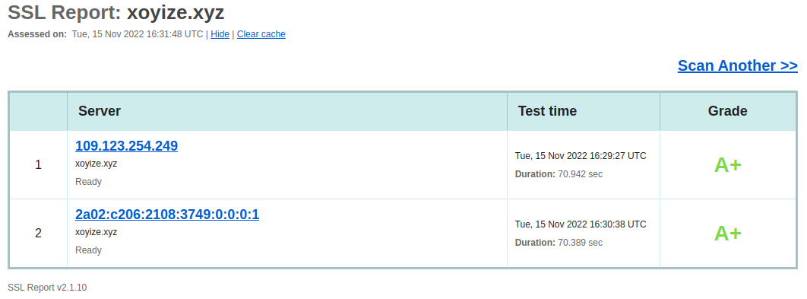

### Erreur Certificat invalide (port 587)

Lors de l'envoi d'un message en utilisant le smtp xoyize.xyz, j'ai une erreur  


Le certificat SSL est valide  
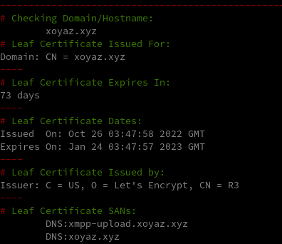

Par contre il n'est pas valide sur le port 587

    openssl s_client -starttls smtp -showcerts -connect xoyize.xyz:587 -servername xoyize.xyz

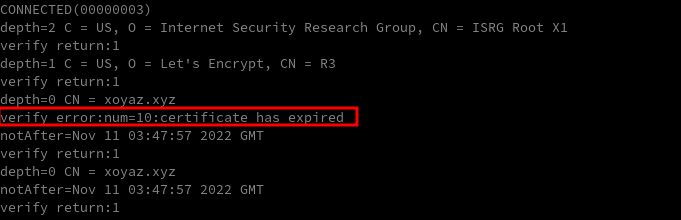

Pour la solution, il faut exécuter le commande suivante sur le serveur

    sudo postmap -F hash:/etc/postfix/sni

Vérification

    openssl s_client -starttls smtp -showcerts -connect xoyize.xyz:587 -servername xoyize.xyz

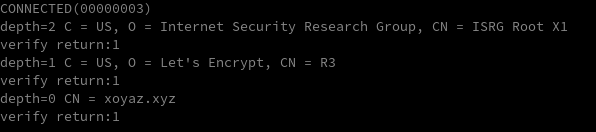

Il faut exécuter la commande `postmap -F hash:/etc/postfix/sni` après chaque renouvellement de certificat... 

`ATTENTION Une simple commande peut corriger le problème : yunohost tools regen-conf dovecot --force`{: .prompt-warning }

### Yunohost thème "yako"

A partir d'un thème existant : `cp -r /usr/share/ssowat/portal/assets/themes/{unsplash,yako}`   
Les images : `/usr/share/ssowat/portal/assets/img/`  

* Image de fond : `code_coding_binary_code_abstract_patterns_112140_1920x1080.jpg`   
{:height="150"}
* Image logo : lettre-y-40x40.png   
{:height="50"}
* Image overlay : yako.png  
{:height="50"}

Changer le "branding" du portail utilisateur "YunoHost" par  "yako" (yann.png)  
Copier yako.png dans le dossier `/usr/share/ssowat/portal/assets/themes/yako/`

Modifier le fichier css : `/usr/share/ssowat/portal/assets/themes/yako/custom_portal.css`  

```css
/*Image de fond*/
.ynh-user-portal {
  background-image: url('../../img/code_coding_binary_code_abstract_patterns_112140_1920x1080.jpg') !important;
  background-repeat: no-repeat;
  background-size: cover;
  width: 100%;
  height: 100%;
}

/*Personnaliser le logo */
#ynh-logo {
  z-index: 10;
  background-image: url("yako.png");
}

```

Puis ajouter en fin du fichier 

<details>
<summary><b>Etendre Réduire</b></summary>

  
.user-container:before {
  content: url("../../img/lettre-y-40x40.png");
  background: #0000;
}

/*
===============================================================================
 extra CSS rules to customize the YunoHost user portal and
 can be used to customize app tiles, buttons, etc...
===============================================================================
*/

.bluebg {
    background: #3498DB!important;
}
.bluebg:hover:after,
.bluebg:focus:after,
.bluebg:hover:before,
.bluebg:focus:before {
    background: #16527A!important;
}

.purplebg {
    background: #9B59B6!important;
}
.purplebg:hover:after,
.purplebg:focus:after,
.purplebg:hover:before,
.purplebg:focus:before {
    background: #532C64!important;
}

.redbg {
    background: #E74C3C!important;
}
.redbg:hover:after,
.redbg:focus:after,
.redbg:hover:before,
.redbg:focus:before {
    background: #921E12!important;
}

.orangebg {
    background: #F39C12!important;
}
.orangebg:hover:after,
.orangebg:focus:after,
.orangebg:hover:before,
.orangebg:focus:before {
    background: #7F5006!important;
}

.greenbg {
    background: #2ECC71!important;
}
.greenbg:hover:after,
.greenbg:focus:after,
.greenbg:hover:before,
.greenbg:focus:before {
    background: #176437!important;
}

.darkbluebg {
    background: #34495E!important;
}
.darkbluebg:hover:after,
.darkbluebg:focus:after,
.darkbluebg:hover:before,
.darkbluebg:focus:before {
    background: #07090C!important;
}

.lightbluebg {
    background: #6A93D4!important;
}
.lightbluebg:hover:after,
.lightbluebg:focus:after,
.lightbluebg:hover:before,
.lightbluebg:focus:before {
    background: #2B5394!important;
}

.yellowbg {
    background: #F1C40F!important;
}
.yellowbg:hover:after,
.yellowbg:focus:after,
.yellowbg:hover:before,
.yellowbg:focus:before {
    background: #796307!important;
}


.lightpinkbg {
    background: #F76F87!important;
}
.lightpinkbg:hover:after,
.lightpinkbg:focus:after,
.lightpinkbg:hover:before,
.lightpinkbg:focus:before {
    background: #DA0C31!important;
}

/* Following colors are not used yet */
.pinkbg {
    background: #D66D92!important;
}
.pinkbg:hover:after,
.pinkbg:focus:after,
.pinkbg:hover:before,
.pinkbg:focus:before {
    background: #992B52!important;
}

.turquoisebg {
    background: #1ABC9C!important;
}
.turquoisebg:hover:after,
.turquoisebg:focus:after,
.turquoisebg:hover:before,
.turquoisebg:focus:before {
    background: #0B4C3F!important;
}
.lightyellow {
    background: #FFC973!important;
}
.lightyellow:hover:after,
.lightyellow:focus:after,
.lightyellow:hover:before,
.lightyellow:focus:before {
    background: #F39500!important;
}
.lightgreen {
    background: #B5F36D!important;
}
.lightgreen:hover:after,
.lightgreen:focus:after,
.lightgreen:hover:before,
.lightgreen:focus:before {
    background: #77CF11!important;
}
.purpledarkbg {
    background: #8E44AD!important;
}
.purpledarkbg:hover:after,
.purpledarkbg:focus:after,
.purpledarkbg:hover:before,
.purpledarkbg:focus:before {
    background: #432051!important;
}



</details>

Personnaliser le logo en modifiant également le fichier `/usr/share/ssowat/portal/assets/themes/yako/custom_overlay.css`

```css
#ynh-overlay-switch {
  background-image: url("yako.png");
  /* Fond et bordure transparents*/
  border-color: #0000;
  background-color: #0000; 
}
```

Activer le thème dans le fichier `/etc/ssowat/conf.json.persistent` 

```json
{
    "theme" : "yako",
}
```

Créer le fichier `/usr/share/ssowat/portal/assets/themes/yako/custom_portal.js`

```js
/*
===============================================================================
 This JS file may be used to customize the YunoHost user portal *and* also
 will be loaded in all app pages if the app nginx's conf does include the
 appropriate snippet.

 You can monkeypatch init_portal (loading of the user portal) and
 init_portal_button_and_overlay (loading of the button and overlay...) to do
 custom stuff
===============================================================================
*/

var app_tile_colors = ['redbg','purpledarkbg','darkbluebg','orangebg','greenbg', 'yellowbg','lightpinkbg','pinkbg','turquoisebg','lightbluebg', 'bluebg'];

function set_app_tile_style(el)
{
    // Select a color value from the App label
    randomColorNumber = parseInt(el.textContent, 36) % app_tile_colors.length;
    // Add color class.
    el.classList.add(app_tile_colors[randomColorNumber]);
}

// Monkeypatch init_portal to customize the app tile style
init_portal_original = init_portal;
init_portal = function()
{
    init_portal_original();
    Array.each(document.getElementsByClassName("app-tile"), set_app_tile_style);
}

/*
 * Monkey patching example to do custom stuff when loading inside an app
 *
init_portal_button_and_overlay_original = init_portal_button_and_overlay;
init_portal_button_and_overlay = function()
{
    init_portal_button_and_overlay_original();
    // Custom stuff to do when loading inside an app
}
*/
```


!!! Rafraîchir le cache du navigateur pour que le thème se propage complètement ( Ctrl+Maj+R sur Firefox)  

### Borg - Restauration

Je veux restaurer une application nommée "Shaarli"  
Ouvrir un terminal

On passe en mode su : `sudo -s`

Récuper ID de l'application "Shaarli"

```bash
yunohost app list |grep "shaarli"  # id: shaarli
```

#### Lister les sauvegardes borg 


*    Clé SSH : `/root/.ssh/id_borg_ed25519`
*    Dépôt distant borg : `yunohost app setting borg repository`
*    PassPhrase du dépôt borg : `yunohost app setting borg passphrase`

```bash
export BORG_RSH="ssh -i /root/.ssh/id_borg_ed25519"
export BORG_PASSPHRASE=$(yunohost app setting borg passphrase)
export REPOSITORY=$(yunohost app setting borg repository)
borg list --short  $REPOSITORY
```

Identifier les sauvegardes "shaarli" du serveur xoyize.xyz à restaurer

    borg list --short  $REPOSITORY  |grep "shaarli"

```
_auto_shaarli-2023-09-17_02:12
_auto_shaarli-2023-09-24_02:14
_auto_shaarli-2023-09-30_02:13
_auto_shaarli-2023-10-01_02:13
_auto_shaarli-2023-10-08_02:13
_auto_shaarli-2023-10-15_02:15
_auto_shaarli-2023-10-19_02:12
_auto_shaarli-2023-10-20_02:12
_auto_shaarli-2023-10-21_02:12
_auto_shaarli-2023-10-22_02:12
_auto_shaarli-2023-10-23_02:12
_auto_shaarli-2023-10-24_02:14
_auto_shaarli-2023-10-25_02:13
_auto_shaarli-2023-10-26_02:12
_auto_shaarli-2023-10-27_02:12
```

Restaurer "_auto_shaarli-2023-10-27_02:12"

    borg export-tar $REPOSITORY::_auto_shaarli-2023-10-27_02:12 /home/yunohost.backup/archives/_auto_shaarli-2023-10-27_02:12.tar

#### Restaurer depuis les archives locales

Gérer les sauvegardes :  
**yunohost backup** `create, restore, list, info, download, delete ... [-h]`  

* **create** : Créer une archive locale de sauvegarde. Si ni --apps ni --system ne sont donnés, ceci  
sauvegardera toutes les applications et toutes les parties du système. Si seulement --apps est donné, cela  
uniquement des applications de sauvegarde et aucune partie du système. De même, si seul --system est donné, cela  
ne sauvegardera que les parties du système et aucune application.  
* **restore** : Restauration à partir d'une archive de sauvegarde locale. Si ni --apps ni --system ne sont donnés,  
cela restaurera toutes les applications et toutes les parties du système dans l'archive. Si seulement --apps  
si cela est indiqué, cela restaurera uniquement les applications et aucune partie du système. De même, si seulement  
--system est donné, cela ne restaurera que les parties du système et aucune application.  
* **list** : Liste les archives de sauvegarde locales disponibles
* **info** : Afficher des informations sur une archive de sauvegarde locale
* **delete** : Supprimer une archive de sauvegarde


Liste des archives

    yunohost backup list

```
archives: 
  - _auto_shaarli-2023-10-27_02:12
```

Désinstaller l'application "shaarli" existante

    yunohost app remove shaarli

Restaurer l'application "shaarli"

    yunohost backup restore _auto_shaarli-2023-10-27_02:12.tar --apps

le résultat de la commande

```
Info: Preparing archive for restoration...
Info: Restoring shaarli...
Info: Provisionning sources...
Info: Provisionning system_user...
Info: Provisionning install_dir...
Info: Provisionning permissions...
Info: Provisionning apt...
Info: [++..................] > Restoring the app main directory...
Info: [##+++...............] > Restoring the Fail2Ban configuration...
Info: [#####+++............] > Restoring the PHP-FPM configuration...
Info: [########+++.........] > Restoring the NGINX web server configuration...
Info: [###########+++......] > Restoring the logrotate configuration...
Info: [##############+++...] > Reloading NGINX web server and PHP-FPM...
Info: [#################+++] > Restoration completed for shaarli
Success! Restoration completed
apps: 
  shaarli: Success
system: 
```