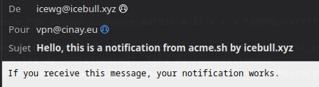
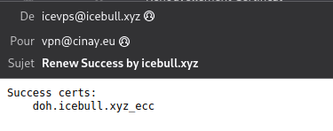

+++
title = 'Serveur , installer et renouveler les certificats SSL Let's encrypt via Acme'
date = 2023-12-25 00:00:00 +0100
categories = ['serveur', 'yunohost', 'ssl']
+++
*acme.sh est un [dépôt GitHub](https://github.com/acmesh-official) qui contient un script shell Unix pur implémentant le protocole client ACME, un protocole d'enregistrement et de vérification des noms de domaine.*


## Génération des certificats

### Liens

* [Génération des certificats Let's Encrypt par challenge DNS avec le client acme.sh](https://blog.tetsumaki.net/articles/2017/06/generation-des-certificats-lets-encrypt-par-challenge-dns-avec-le-client-acmesh.html)
* [Generate SSL Certificates With LetsEncrypt on Debian Linux](https://linuxconfig.org/generate-ssl-certificates-with-letsencrypt-debian-linux) 
* [Getting started with acme.sh Let's Encrypt SSL client](https://www.howtoforge.com/getting-started-with-acmesh-lets-encrypt-client/)

### Client acme

Prérequis

    sudo apt install socat -y 

Installation client **acme.sh** (<https://github.com/Neilpang/acme.sh>)

```
cd ~
git clone https://github.com/acmesh-official/acme.sh.git
cd acme.sh
./acme.sh --install 
```

Résultat des commandes précédentes

```
[mardi 13 août 2019, 21:38:57 (UTC+0200)] Installing to /home/usera//.acme.sh
[mardi 13 août 2019, 21:38:57 (UTC+0200)] Installed to /home/usera//.acme.sh/acme.sh
[mardi 13 août 2019, 21:38:57 (UTC+0200)] Installing alias to '/home/usera//.bashrc'
[mardi 13 août 2019, 21:38:57 (UTC+0200)] OK, Close and reopen your terminal to start using acme.sh
[mardi 13 août 2019, 21:38:57 (UTC+0200)] Installing cron job
18 0 * * * "/home/usera//.acme.sh"/acme.sh --cron --home "/home/usera//.acme.sh" > /dev/null
[mardi 13 août 2019, 21:38:57 (UTC+0200)] Good, bash is found, so change the shebang to use bash as preferred.
[mardi 13 août 2019, 21:38:57 (UTC+0200)] OK
```

Fermer le terminal, puis le réouvrir et vérifier

    $ acme.sh -h

### Création de clé et des certificats avec API OVH

* [OVH : Création de clé API application](https://eu.api.ovh.com/createApp/)  
* [How to use OVH domain api](https://github.com/Neilpang/acme.sh/wiki/How-to-use-OVH-domain-api)  

Passer l'étape 1 si vous avez déjà un jeu de clé

#### 1 -Create application key and secret

https://eu.api.ovh.com/createApp/

Application Name : DNS-Api  
Application Description : certificats  
Application Key : REC23OMyBq2FZrLN  
Application Secret : 32eqGDOrrF6b1Smj4kFgQdv1zX2DW7US  


#### 2 - Set api key and api secret

```
# application key
export OVH_AK="REC23OMyBq2FZrLN"

# application secret
export OVH_AS="32eqGDOrrF6b1Smj4kFgQdv1zX2DW7US"
```

Génération des certificats  

`acme.sh --dns dns_ovh --server letsencrypt --issue --keylength 4096 -d mondomaine.tld -d *.mondomaine.tld`   # Clé RSA 4096bits , chiffrement RSA est un algorithme de cryptographie asymétrique  
`acme.sh --dns dns_ovh --server letsencrypt --issue --keylength ec-384 -d 'mondomaine.tld' -d '*.mondomaine.tld'` # Clé ecc-384 , cryptographie sur les courbes elliptiques (en anglais, elliptic curve cryptography ou ECC)

Notre exemple  
`acme.sh --dns dns_ovh --server letsencrypt --issue --keylength ec-384 -d 'ouestline.xyz' -d '*.ouestline.xyz'`  

Si vous utilisez pour la première fois OVH api, vous devez authentifier l'api. (Cela ne se produit qu'au premier lancement du bash `acme.sh`)  
Vous verrez quelque chose comme ci-dessous:

```
[mardi 13 août 2019, 21:43:18 (UTC+0200)] Using OVH endpoint: ovh-eu
[mardi 13 août 2019, 21:43:18 (UTC+0200)] OVH consumer key is empty, Let's get one:
[mardi 13 août 2019, 21:43:18 (UTC+0200)] Please open this link to do authentication: https://eu.api.ovh.com/auth/?credentialToken=v6T3D18cgLt6V3HAvqP9o7qVp9oMJMI2txPl2QcbuILO1JQifebP7U0uaDMu3Ibn
[mardi 13 août 2019, 21:43:18 (UTC+0200)] Here is a guide for you: https://github.com/Neilpang/acme.sh/wiki/How-to-use-OVH-domain-api
[mardi 13 août 2019, 21:43:18 (UTC+0200)] Please retry after the authentication is done.
```

#### 3 - Authentification de la clé api

(Cela ne se produit qu'au premier lancement du bash `acme.sh`)

Ouvrir le lien : <https://eu.api.ovh.com/auth/?credentialToken=v6T3D18cgLt6V3HAvqP9o7qVp9oMJMI2txPl2QcbuILO1JQifebP7U0uaDMu3Ibn>

Authentifier vous et sélectionner "Unlimited" pour la validité (saisir le code otp si validé) 
Cliquer sur "Authorize Access"  

```
OVH authentication Success !

If you see this page, it means your authentication is ok.

Go back to your shell, and try again.
```

#### 4 - Relancer le bash 

`acme.sh --dns dns_ovh --server letsencrypt --issue --keylength 4096 -d mondomaine.tld -d smtp.mondomaine.tld -d imap.mondomaine.tld`

Notre exemple  
`acme.sh --dns dns_ovh --server letsencrypt --issue --keylength ec-384 -d 'ouestline.xyz' -d '*.ouestline.xyz'`  

```
[mardi 13 août 2019, 21:45:13 (UTC+0200)] Verifying: ouestline.xyz
[mardi 13 août 2019, 21:45:16 (UTC+0200)] Success
[mardi 13 août 2019, 21:45:16 (UTC+0200)] Verifying: *.ouestline.xyz
[mardi 13 août 2019, 21:45:19 (UTC+0200)] Success
[mardi 13 août 2019, 21:45:19 (UTC+0200)] Removing DNS records.
[mardi 13 août 2019, 21:45:19 (UTC+0200)] Removing txt: pcHjdzrzqBIbuI98aJx6Tan4iejK_NbnCLrAGu-03-0 for domain: _acme-challenge.ouestline.xyz
[mardi 13 août 2019, 21:45:19 (UTC+0200)] Using OVH endpoint: ovh-eu
[mardi 13 août 2019, 21:45:19 (UTC+0200)] Checking authentication
[mardi 13 août 2019, 21:45:19 (UTC+0200)] Consumer key is ok.
[mardi 13 août 2019, 21:45:20 (UTC+0200)] Removed: Success
[mardi 13 août 2019, 21:45:20 (UTC+0200)] Removing txt: 9m38ahU-HMS1nDrdq8O5AkJUQRYEQchQQxNW4Sdv2M8 for domain: _acme-challenge.ouestline.xyz
[mardi 13 août 2019, 21:45:20 (UTC+0200)] Using OVH endpoint: ovh-eu
[mardi 13 août 2019, 21:45:20 (UTC+0200)] Checking authentication
[mardi 13 août 2019, 21:45:20 (UTC+0200)] Consumer key is ok.
[mardi 13 août 2019, 21:45:22 (UTC+0200)] Removed: Success
[mardi 13 août 2019, 21:45:22 (UTC+0200)] Verify finished, start to sign.
[mardi 13 août 2019, 21:45:22 (UTC+0200)] Lets finalize the order, Le_OrderFinalize: https://acme-v02.api.letsencrypt.org/acme/finalize/63384623/889352683
[mardi 13 août 2019, 21:45:24 (UTC+0200)] Download cert, Le_LinkCert: https://acme-v02.api.letsencrypt.org/acme/cert/0325da09619fcdb4d883a1970157e2101960
[mardi 13 août 2019, 21:45:24 (UTC+0200)] Cert success.

[...]

[mardi 13 août 2019, 21:45:24 (UTC+0200)] Your cert is in  /home/usera//.acme.sh/ouestline.xyz_ecc/ouestline.xyz.cer 
[mardi 13 août 2019, 21:45:24 (UTC+0200)] Your cert key is in  /home/usera//.acme.sh/ouestline.xyz_ecc/ouestline.xyz.key 
[mardi 13 août 2019, 21:45:24 (UTC+0200)] The intermediate CA cert is in  /home/usera//.acme.sh/ouestline.xyz_ecc/ca.cer 
[mardi 13 août 2019, 21:45:24 (UTC+0200)] And the full chain certs is there:  /home/usera//.acme.sh/ouestline.xyz_ecc/fullchain.cer 

```

### Installation des certificats

L'installation de certificats avec **acme.sh** créera une tâche cron qui renouvellera automatiquement les certificats et copiera les fichiers pertinents aux emplacements que vous fournissez dans la commande d'installation. De plus, vous pouvez également spécifier la commande pour recharger la configuration du serveur.

Supposons que nous stockons les fichiers dans le répertoire `/etc/ssl/private/` (qui doit être créé au préalable), la commande serait :

    sudo mkdir -p /etc/ssl/private/
    sudo chown $USER -R /etc/ssl/private/
    acme.sh --ecc --install-cert -d ouestline.xyz --key-file /etc/ssl/private/ouestline.xyz-key.pem --fullchain-file /etc/ssl/private/ouestline.xyz-fullchain.pem --reloadcmd 'sudo systemctl reload nginx.service'

### Renouvellement automatique  

$ `crontab -e`  # edite tous les jobs de l'utilisateur en cours

    18 0 * * * "$HOME/.acme.sh"/acme.sh --cron --home "$HOME/.acme.sh" --renew-hook "$HOME/.acme.sh/acme.sh --ecc --install-cert -d ouestline.xyz --key-file /etc/ssl/private/ouestline.xyz-key.pem --fullchain-file /etc/ssl/private/ouestline.xyz-fullchain.pem --reloadcmd 'sudo systemctl reload nginx.service'" > /dev/null

#### Notification par email  si un certificat est ignoré, renouvelé ou erroné

**Niveau de notification des courriels de Let's Encrypt**

Il existe au total quatre niveaux de notification, comme suit :

*    0 - Désactiver complètement la notification.
*    1 - Envoyer une notification uniquement en cas d'erreur.
*    2 - Envoyer une notification lorsqu'un certificat est renouvelé avec succès, ou lorsqu'il y a une erreur.
*    3 - Envoi d'une notification lorsqu'un certificat est ignoré, renouvelé ou qu'il y a une erreur. Vous recevrez une notification par courriel chaque nuit avec ce niveau.

La commande est la suivante :

```
acme.sh --set-notify --notify-level {niveau}
acme.sh --set-notify --notify-level 2
## ou ne recevoir un email qu'en cas d'erreur ###

acme.sh --set-notify --notify-level 1
```

**Définition du mode de notification par courrier électronique**

Là encore, il existe au total deux modes de notification, comme suit :

*    0 - Envoi d'un courrier électronique en mode groupé. En d'autres termes, envoyer toutes les notifications du domaine en un seul message ou courriel. C'est ce dont vous avez besoin si vous avez plus d'un certificat TLS/SSL Let's Encrypt.
*    1 - Mode Cert. Envoyer un message pour chaque certificat TLS/SSL Let's Encrypt. Il se peut que vous receviez un grand nombre d'e-mails en une seule nuit.

La commande est la suivante :

    acme.sh --set-notify --notify-mode 0

**Configurer la notification par email de Let's Encrypt lorsqu'un certificat est ignoré, renouvelé, ou qu'il y a une erreur avec un hook**

[Debian - Installer et configurer Postfix comme serveur SMTP d'envoi uniquement](https://static.lxcyan.local/2022/08/27/Debian_Postfix_serveur_SMTP_envoi_uniquement.html)

Il existe plusieurs façons d'obtenir une notification. Par exemple, vous pouvez utiliser votre serveur SMTP, Slack Webhooks/Slack App, ou pousser les notifications vers votre appareil iOS ou Android à l'aide de pushover. Cependant, dans ce tutoriel, j'utiliserai la méthode SMTP pour obtenir une notification par email.
Comment configurer la notification pour SMTP

J'ai configuré Postfix sur mon serveur web pour envoyer des notifications par courriel. Mais, bien sûr, vous pouvez utiliser n'importe quel autre serveur de messagerie pour envoyer des notifications directement en vous connectant à un serveur de messagerie SMTP. La syntaxe de la commande export est la suivante :

```
# Juste l'adresse électronique (pas de noms d'affichage)
export SMTP_FROM="from@your-domain-com"
# Juste l'adresse e-mail, utilisez des virgules entre plusieurs e-mails
export SMTP_TO="to@your-domain-com,admin@your-domain-com"
# IP ou nom de domaine du serveur smtp distant
export SMTP_HOST="smtp.your-domain-com"
# Une des options suivantes : "none", "ssl" (TLS implicite, TLS Wrapper), "tls" (TLS explicite, STARTTLS) :
export SMTP_SECURE="tls"
```

Le port par défaut dépend de la valeur de SMTP_SECURE. Par exemple, none est 25, ssl est 465 et tls est 587. Mais si votre serveur SMTP utilise un port différent, définissez-le comme suit (disons le port 251) :

```
export SMTP_PORT="251"
```

Votre serveur SMTP nécessite-t-il un login AUTH avec un utilisateur et un mot de passe ? Définissez-le comme suit :

```
# Si votre serveur SMTP nécessite AUTH (login) 
export SMTP_USERNAME='votre-nom-d'utilisateur-ici'
export SMTP_PASSWORD='votre-mot-de-passe-ici'
```

Enfin, il est préférable de définir le chemin d'accès à python3/python2 ou curl. Utilisez la commande type ou la commande command pour le localiser. Par exemple :

```
type python3
python3 est /usr/bin/python3
```

Définissez-le comme suit :

```
# chemin accès python3/python2 ou curl
export SMTP_BIN="/usr/bin/python3"
```

Le délai d'attente par défaut est de 30 secondes pour le serveur SMTP. Mais si votre serveur SMTP est très lent à répondre, vous pouvez avoir besoin de définir :

```
#  serveur SMTP est très lent
export SMTP_TIMEOUT="90"
```

Exemple pour un serveur postfix smtp local

```
export SMTP_FROM="icevps@icebull.xyz"
export SMTP_TO="vpn@cinay.eu"
export SMTP_HOST="127.0.0.1" 
export SMTP_SECURE="none"
export SMTP_BIN="/usr/bin/python3"
```

Exemple pour un serveur smtp distant

```
export SMTP_FROM="ian@xoyaz.xyz"
export SMTP_TO="vpn@cinay.eu"
export SMTP_HOST="xoyaz.xyz"
export SMTP_PORT="587"
export SMTP_SECURE="tls"
export SMTP_USERNAME="ian@xoyaz.xyz"
export SMTP_PASSWORD="xxxxxxxxxxxxxxx"
export SMTP_BIN="/usr/bin/python3"
```

`ATTENTION 'SMTP_FROM' doit être identique à 'SMTP_USERNAME'`{: .prompt-warning }

Enfin, exécutez la commande suivante pour activer la notification smtp pour votre Let's Encrypt lorsqu'un certificat est ignoré, renouvelé ou erroné. Par exemple :

    acme.sh --set-notify --notify-hook smtp

Vous obtiendrez des informations d'erreur ou de succès à l'écran comme suit :

```
[Mon 03 Apr 2023 11:35:55 AM GMT] Set notify hook to: smtp
[Mon 03 Apr 2023 11:35:55 AM GMT] Sending via: smtp
[Mon 03 Apr 2023 11:35:56 AM GMT] smtp Success
```

Et voici l'email de test :



Pour le dépannage supplémentaire, exécutez à nouveau la commande avec --debug ou --debug 2. (Au niveau de débogage 2 ou plus, la sortie affichera la transcription complète de la session SMTP, qui peut inclure le mot de passe SMTP.)  
Tous les paramètres `SMTP_*` seront enregistrés dans `~/.acme.sh/account.conf` et seront réutilisés au besoin.
{: .prompt-info }

Vérification

Maintenant que le hook SMTP est configuré, vous recevrez une notification par email en cas de succès ou d'échec ou si le certificat est ignoré en masse. Voici ce que cela donne lorsque je renouvelle mon certificat TLS avec un job cron :



#### CRON PROBLEME RENOUVELLEMENT

Dans l'exemple de cron suivant

```
18 0 * * * "$HOME/.acme.sh"/acme.sh --cron --home "$HOME/.acme.sh" --renew-hook "$HOME/.acme.sh/acme.sh --ecc --install-cert -d 'domaine.tld' --key-file /etc/ssl/private/domaine.tld-key.pem --fullchain-file /etc/ssl/private/domaine.tld-fullchain.pem --set-notify --notify-hook smtp --reloadcmd 'sudo systemctl reload nginx'" &>/dev/null
```

`Lors du renouvellement "--reloadcmd 'sudo systemctl reload nginx'" n'est pas exécuté`{: .prompt-danger }

Il faut créer un script qui exécute toutes les commandes , y compris celles du `--reloadcmd`, et le mettre dans une tâche cron

Le script `certificat_expire.sh` est lancé par une tâche cron tous les jours.Le renouvellement se fera  7 jours avant la date d'échéance du certificat 


```shell
#!/usr/bin/sh

# Domaine
_domain="rnmkcy.eu"
# Test expiration certificats
PEM="/etc/ssl/private/$_domain-fullchain.pem"
# 7 jours en secondes 
DAYS="604800" 
# OpenSSL
_openssl="/usr/bin/openssl"
# Date expiration dans 7 jours ?
$_openssl x509 -enddate -noout -in "$PEM"  -checkend "$DAYS" | grep -q 'Certificate will expire'

if [ $? -eq 0 -o ! -z "$1" ] 
then
  # certificat expire dans 7 jours , on renouvelle
  echo "Force renouvellement des certificats Lets Encrypt"
  "$HOME/.acme.sh"/acme.sh --force --cron --home "$HOME/.acme.sh" --renew-hook "$HOME/.acme.sh/acme.sh --ecc --install-cert -d $_domain --key-file /etc/ssl/private/$_domain-key.pem --fullchain-file /etc/ssl/private/$_domain-fullchain.pem"
  #	Les autres commandes à exécuter
  echo "Recharge service nginx"
  sudo systemctl reload nginx
 else
  echo "Certificat Valide"	
  $_openssl x509 -enddate -noout -in "$PEM"
fi
```

Modifier la tâche cron

```
18 0 * * * "$HOME/certificat_expire.sh" &>/dev/null
```


### acme.sh - Aide

```
Usage: acme.sh  command ...[parameters]....
Commands:
  --help, -h               Show this help message.
  --version, -v            Show version info.
  --install                Install acme.sh to your system.
  --uninstall              Uninstall acme.sh, and uninstall the cron job.
  --upgrade                Upgrade acme.sh to the latest code from https://github.com/Neilpang/acme.sh.
  --issue                  Issue a cert.
  --signcsr                Issue a cert from an existing csr.
  --deploy                 Deploy the cert to your server.
  --install-cert           Install the issued cert to apache/nginx or any other server.
  --renew, -r              Renew a cert.
  --renew-all              Renew all the certs.
  --revoke                 Revoke a cert.
  --remove                 Remove the cert from list of certs known to acme.sh.
  --list                   List all the certs.
  --showcsr                Show the content of a csr.
  --install-cronjob        Install the cron job to renew certs, you don't need to call this. The 'install' command can automatically install the cron job.
  --uninstall-cronjob      Uninstall the cron job. The 'uninstall' command can do this automatically.
  --cron                   Run cron job to renew all the certs.
  --toPkcs                 Export the certificate and key to a pfx file.
  --toPkcs8                Convert to pkcs8 format.
  --update-account         Update account info.
  --register-account       Register account key.
  --deactivate-account     Deactivate the account.
  --create-account-key     Create an account private key, professional use.
  --create-domain-key      Create an domain private key, professional use.
  --createCSR, -ccsr       Create CSR , professional use.
  --deactivate             Deactivate the domain authz, professional use.
  --set-notify             Set the cron notification hook, level or mode.


Parameters:
  --domain, -d   domain.tld         Specifies a domain, used to issue, renew or revoke etc.
  --challenge-alias domain.tld      The challenge domain alias for DNS alias mode: https://github.com/Neilpang/acme.sh/wiki/DNS-alias-mode
  --domain-alias domain.tld         The domain alias for DNS alias mode: https://github.com/Neilpang/acme.sh/wiki/DNS-alias-mode
  --force, -f                       Used to force to install or force to renew a cert immediately.
  --staging, --test                 Use staging server, just for test.
  --debug                           Output debug info.
  --output-insecure                 Output all the sensitive messages. By default all the credentials/sensitive messages are hidden from the output/debug/log for secure.
  --webroot, -w  /path/to/webroot   Specifies the web root folder for web root mode.
  --standalone                      Use standalone mode.
  --alpn                            Use standalone alpn mode.
  --stateless                       Use stateless mode, see: https://github.com/Neilpang/acme.sh/wiki/Stateless-Mode
  --apache                          Use apache mode.
  --dns [dns_cf|dns_dp|dns_cx|/path/to/api/file]   Use dns mode or dns api.
  --dnssleep  [120]                  The time in seconds to wait for all the txt records to take effect in dns api mode. Default 120 seconds.

  --keylength, -k [2048]            Specifies the domain key length: 2048, 3072, 4096, 8192 or ec-256, ec-384.
  --accountkeylength, -ak [2048]    Specifies the account key length.
  --log    [/path/to/logfile]       Specifies the log file. The default is: "/root/.acme.sh/acme.sh.log" if you don't give a file path here.
  --log-level 1|2                   Specifies the log level, default is 1.
  --syslog [0|3|6|7]                Syslog level, 0: disable syslog, 3: error, 6: info, 7: debug.

  These parameters are to install the cert to nginx/apache or any other server after issue/renew a cert:

  --cert-file                       After issue/renew, the cert will be copied to this path.
  --key-file                        After issue/renew, the key will be copied to this path.
  --ca-file                         After issue/renew, the intermediate cert will be copied to this path.
  --fullchain-file                  After issue/renew, the fullchain cert will be copied to this path.

  --reloadcmd "service nginx reload" After issue/renew, it's used to reload the server.

  --server SERVER                   ACME Directory Resource URI. (default: https://acme-v01.api.letsencrypt.org/directory)
  --accountconf                     Specifies a customized account config file.
  --home                            Specifies the home dir for acme.sh.
  --cert-home                       Specifies the home dir to save all the certs, only valid for '--install' command.
  --config-home                     Specifies the home dir to save all the configurations.
  --useragent                       Specifies the user agent string. it will be saved for future use too.
  --accountemail                    Specifies the account email, only valid for the '--install' and '--update-account' command.
  --accountkey                      Specifies the account key path, only valid for the '--install' command.
  --days                            Specifies the days to renew the cert when using '--issue' command. The default value is 60 days.
  --httpport                        Specifies the standalone listening port. Only valid if the server is behind a reverse proxy or load balancer.
  --tlsport                         Specifies the standalone tls listening port. Only valid if the server is behind a reverse proxy or load balancer.
  --local-address                   Specifies the standalone/tls server listening address, in case you have multiple ip addresses.
  --listraw                         Only used for '--list' command, list the certs in raw format.
  --stopRenewOnError, -se           Only valid for '--renew-all' command. Stop if one cert has error in renewal.
  --insecure                        Do not check the server certificate, in some devices, the api server's certificate may not be trusted.
  --ca-bundle                       Specifies the path to the CA certificate bundle to verify api server's certificate.
  --ca-path                         Specifies directory containing CA certificates in PEM format, used by wget or curl.
  --nocron                          Only valid for '--install' command, which means: do not install the default cron job. In this case, the certs will not be renewed automatically.
  --noprofile                       Only valid for '--install' command, which means: do not install aliases to user profile.
  --no-color                        Do not output color text.
  --force-color                     Force output of color text. Useful for non-interactive use with the aha tool for HTML E-Mails.
  --ecc                             Specifies to use the ECC cert. Valid for '--install-cert', '--renew', '--revoke', '--toPkcs' and '--createCSR'
  --csr                             Specifies the input csr.
  --pre-hook                        Command to be run before obtaining any certificates.
  --post-hook                       Command to be run after attempting to obtain/renew certificates. No matter the obtain/renew is success or failed.
  --renew-hook                      Command to be run once for each successfully renewed certificate.
  --deploy-hook                     The hook file to deploy cert
  --ocsp-must-staple, --ocsp        Generate ocsp must Staple extension.
  --always-force-new-domain-key     Generate new domain key when renewal. Otherwise, the domain key is not changed by default.
  --auto-upgrade   [0|1]            Valid for '--upgrade' command, indicating whether to upgrade automatically in future.
  --listen-v4                       Force standalone/tls server to listen at ipv4.
  --listen-v6                       Force standalone/tls server to listen at ipv6.
  --openssl-bin                     Specifies a custom openssl bin location.
  --use-wget                        Force to use wget, if you have both curl and wget installed.
  --yes-I-know-dns-manual-mode-enough-go-ahead-please  Force to use dns manual mode: https://github.com/Neilpang/acme.sh/wiki/dns-manual-mode
  --branch, -b                      Only valid for '--upgrade' command, specifies the branch name to upgrade to.

  --notify-level  0|1|2|3           Set the notification level:  Default value is 2.
                                     0: disabled, no notification will be sent. 
                                     1: send notifications only when there is an error.
                                     2: send notifications when a cert is successfully renewed, or there is an error.
                                     3: send notifications when a cert is skipped, renewed, or error.
  --notify-mode   0|1               Set notification mode. Default value is 0.
                                     0: Bulk mode. Send all the domain's notifications in one message(mail).
                                     1: Cert mode. Send a message for every single cert.
  --notify-hook   [hookname]        Set the notify hook
```


