+++
title = 'Outils de test réseau, DNS, messagerie (dkim,spf,spam et virus) ,vulnérabilités, performances site'
date = 2023-12-27 00:00:00 +0100
categories = ['outils']
+++
*Outils en ligne de test et analyse*


## Prérequis

Les paquets Debian qui doivent être installés

	sudo apt install mailutils dnsutils

## DNS

Les enregistrements DNS sont comme les instructions conservées dans les entrées de zone des serveurs DNS racine. La configuration DNS de chaque site Web est mappée via des enregistrements DNS.

Il existe de nombreux types d’enregistrements DNS sur Internet. Mais ce sont les types d’enregistrements DNS les plus courants visibles sur chaque site Web.

*    Un enregistrement – Pointe le nom du site Web vers l'adresse IPV4
*    AAAA – Pointe le nom d'hôte vers l'adresse IPV6
*    NS – spécifie les serveurs de noms faisant autorité
*    MX – responsable de diriger un e-mail vers un serveur de messagerie.
*    PTR – Utilisé pour les recherches inversées
*    CNAME – redirige un domaine vers un autre. Par exemple, même si vous tapez simplement geekflare.com dans le navigateur Web , vous serez redirigé vers www.geekflare.com, qui est l'enregistrement DNS derrière cette configuration.

### 5 outils en ligne pour vérifier les DNS

1. **Nslookup.io** - [Nslookup.io](https://www.nslookup.io/)   est un service Web pratique et excellent qui peut vous aider à afficher les enregistrements DNS d'un site Web donné. Entrez le nom du site Web souhaité et cliquez sur le bouton « Rechercher des enregistrements DNS » pour continuer.  
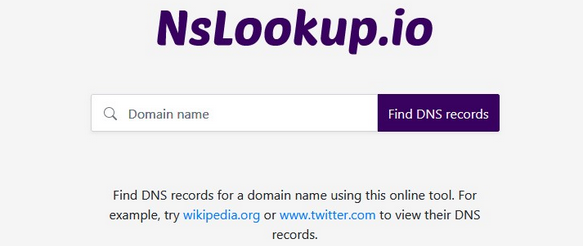.  
La meilleure chose à propos de cet outil est qu’il consiste en une méthode d’auto-suggestion. Et il dispose également d'une option permettant de choisir le serveur DNS souhaité pour récupérer les enregistrements DNS.
2. **Recherche DNS Geekflare** - [Geekflare DNS Lookup](https://geekflare.com/tools/dns-lookup) est un moyen simple de répertorier les enregistrements DNS de n'importe quel nom de domaine. En outre, on obtient des détails associés tels que les valeurs TTL, les adresses IP, les priorités, etc.  
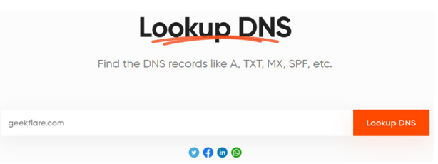.  
3. **Vérificateur DNS** - [DNSchecker](https://dnschecker.org/all-dns-records-of-domain.php) est un service Web qui vous permet de voir rapidement les enregistrements DNS de n'importe quel site Web. Saisissez simplement le nom de domaine, choisissez le serveur DNS pour interroger les enregistrements et cliquez sur « Rechercher DNS ».  
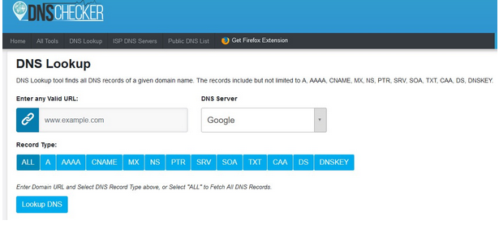.  
Il dispose également d'une option permettant de choisir les enregistrements que vous souhaitez récupérer. Ce service Web peut également interroger d'autres types d'enregistrements tels que SPF (Sender Policy Framework), les enregistrements DS et DNSKEY.
4. **Boîte à outils MX** - La recherche DNS [MXToolbox](https://mxtoolbox.com/dnslookup.aspx) est un outil puissant qui peut afficher tous les enregistrements DNS. Tapez son URL dans la zone de texte et cliquez sur « Recherche DNS ».
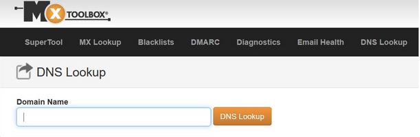.  
Cet outil comprend d'autres fonctionnalités telles que la vérification de la liste noire, la recherche DKIM, DMARC, ASN et LOC.
5. **Surveillance DNS** - L' outil de recherche [DNS Watch](https://www.dnswatch.info/) est un outil simple à utiliser. Entrez un nom d'hôte ou une adresse IP de site Web dans le champ de saisie et sélectionnez le type d'enregistrement à récupérer.  
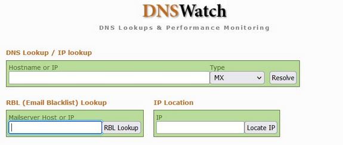.  


### Propagation DNS

Suivre ou vérifier la propagation DNS <https://www.whatsmydns.net/>  
Exemples avec le domaine **xoyize.xyz**  

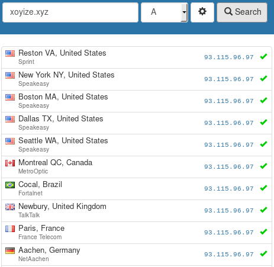

Carte des serveurs DNS


### Dig - DNS - Reverse DNS

*[Petit mémo sur la commande dig](https://memo-linux.com/dig-outil-pour-tout-savoir-sur-les-resolveur-dns/), qui permet de tout savoir sur les resolveurs DNS. Pour rappel, un résolveur DNS est un serveur, qui va résoudre un nom d’hôte (ou un FQDN : Full Qualified Domaine Name) en adresse IP.*

Un enregistrement DNS peut être sous différentes formes pour une utilisation bien précise.
Voici un petit récapitulatif des principaux types d’enregistrement DNS :

* A : Renvoie une adresse IPv4 pour un nom de host donné.
* AAA : Renvoie une adresse IPv6 pour un nom de host donné.
* NS : Délègue la gestion d’une zone à un serveur de nom faisant autorité.
* CNAME : Permet de réaliser un alias (un raccourci) d’un host vers un autre.
* SOA : Définit le Serveur Maitre du domaine.
* PTR : Réalise l’inverse de l’enregistrement A ou AAAA, donne un nom de host (FQDN) pour une adresse IP.
* MX : Définit le nom du serveur de courrier du domaine.
* TXT : Une chaîne de caractères libres.

*Dig est une commande Unix/Linux, qui permet d’interroger des serveurs DNS et de diagnostiquer les dysfonctionnements dans la résolution de nom.Généralement la commande dig est disponible dans les paquets <u>bind-tools</u> ou <u>dnsutils</u>.*

Exemples

    dig xoyaz.xyz

```
; <<>> DiG 9.11.5-P4-5.1+deb10u2-Debian <<>> xoyaz.xyz
;; global options: +cmd
;; Got answer:
;; ->>HEADER<<- opcode: QUERY, status: NOERROR, id: 31585
;; flags: qr rd ra; QUERY: 1, ANSWER: 1, AUTHORITY: 0, ADDITIONAL: 1

;; OPT PSEUDOSECTION:
; EDNS: version: 0, flags:; udp: 4096
;; QUESTION SECTION:
;xoyaz.xyz.			IN	A

;; ANSWER SECTION:
xoyaz.xyz.		3600	IN	A	5.2.79.127

;; Query time: 39 msec
;; SERVER: 127.0.0.1#53(127.0.0.1)
;; WHEN: Thu Oct 01 10:19:27 CEST 2020
;; MSG SIZE  rcvd: 54
```

* status: NOERROR : signifie qu’il est bien possible de résoudre le FQDN
* ANSWER SECTION: memo-linux.com. 59 IN A 151.80.10.15 : cette section indique l’enregistrement du FQDN sur l’adresse IPv4
* Query time: 16 msec : ceci indique le temps de réponse du serveur DNS
* SERVER: 193.138.218.74#53(193.138.218.74) : l’adresse IPv4 du serveur DNS

Avec l’option +short pour n’avoir que l’adresse Ipv4 d’enregistrement

    dig xoyaz.xyz +short

5.2.79.127

    dig xoyaz.xyz AAAA +short

2a04:52c0:101:82::73db

les serveurs DNS qui gère la zone du FDQN

    dig NS xoyaz.xyz +short

```
ns106.ovh.net.
dns106.ovh.net.
```

*Le Reverse DNS, aussi appelé PTR Record (ou pointer record) sert à associer une adresse IP à un enregistrement de nom de domaine.*  

Il faut modifier le **reverse** via l'interface de votre hébergeur.  
Différentes méthodes de vérification

    host 93.115.96.97
      97.96.115.93.in-addr.arpa domain name pointer xoyize.xyz.

Résolution inverse à partir de l’adresse Ip

    dig +noall +answer -x 93.115.96.97
      97.96.115.93.in-addr.arpa. 3471	IN	PTR	xoyize.xyz.

### DNS blacklisting

*Le DNS Black Listing (DNSBL) est une méthode permettant de consulter une liste noire d'émetteurs de courrier électronique en utilisant le protocole DNS. Le nom DNS Black Listing vient de l'expression anglaise black list qui signifie liste noire.   
Il existe de nombreux services de ce type1,2, chacun utilise des méthodes diverses pour l'inclusion et le retrait de la liste noire. Celle-ci inclut les adresses IP des machines connues pour être la source de spam, des plages d'adresses utilisées par les fournisseurs d'accès à Internet qui hébergent des spammeurs, ou encore des adresses IP qui ont tenté d'envoyer des messages à des systèmes honeypot.  
Les DNSBL font l'objet de controverse depuis la création du premier système en 1997. Les gestionnaires de serveur de messagerie qui y ont recours les considèrent comme des outils anti-spam efficaces, tandis que d'autres y voient une forme de censure et d'arbitraire, les critères d'inclusion et d'exclusion relevant du seul gestionnaire du DNSBL. Certains DNSRBL ont fait l'objet de poursuites judiciaires intentées par des spammeurs.[Wikipédia DNS Black Listing](https://fr.wikipedia.org/wiki/DNS_Black_Listing)*

[Spam Database lookup](http://www.dnsbl.info/dnsbl-list.php)  
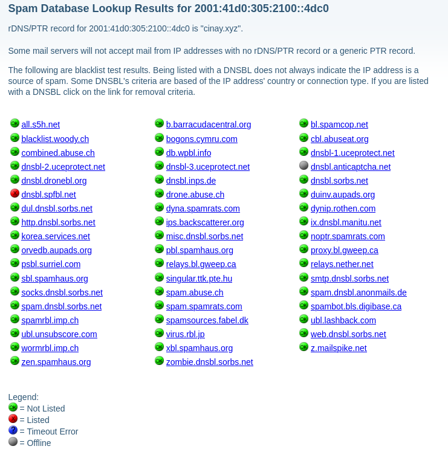

### IntoDNS

<https://intodns.com>

Aperçu...  
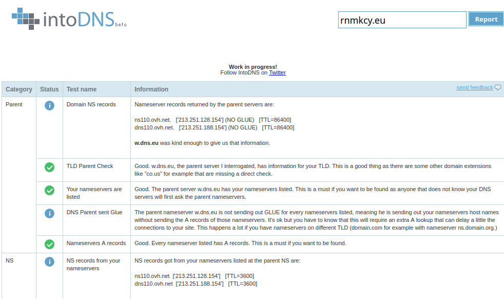

## Messagerie

### Ports de messagerie

Vérifier que les ports de messagerie  25 (SMTP), 587 (SMTPS) et 993 (IMAPS) sont bien en écoute sur 0.0.0.0 (installer paquet **net-tools**)  
Ne pas oublier de les ouvrir au niveau du parefeu (Firewall)

    netstat -ptna

```
Connexions Internet actives (serveurs et établies)
Proto Recv-Q Send-Q Adresse locale          Adresse distante        Etat        PID/Program name    
tcp        0      0 0.0.0.0:25              0.0.0.0:*               LISTEN      1022/master         
tcp        0      0 0.0.0.0:993             0.0.0.0:*               LISTEN      730/dovecot         
tcp        0      0 0.0.0.0:587             0.0.0.0:*               LISTEN      1022/master         
```

### Vérifier validité Dkim,spf et spamassassin

[DKIMValidator.com](http://dkimvalidator.com/)  
Il existe de nombreux outils en ligne que vous pouvez utiliser pour tester si la signature DKIM fonctionne ou non pour votre domaine comme [DKIMValidator.com](http://dkimvalidator.com/). Le site vous fournit une adresse e-mail aléatoire. Il vous suffit d'envoyer un courriel de test à partir de votre serveur de messagerie à l'adresse courriel fournie, d'attendre quelques secondes et de cliquer sur "Afficher les résultats". Un rapport vous sera présenté décrivant si la validation DKIM et SPF a réussi ou non pour votre domaine.Exemple en ligne de commande:  

	echo "test dkim spf spamassassin" |mail -s test aENGUMt9poOdA8@dkimvalidator.com

```
DKIM Information:
...
Validating Signature
result = pass

SPF Information:
...
Result code: pass

SpamAssassin Score: 0.109
Message is NOT marked as spam
```

>Le message `0.0 T_DKIM_INVALID         DKIM-Signature header exists but is not valid` signifie que <u>la signature n'a pas pu être vérifiée par SpamAssassin</u> , le score n'est pas affecté **0.0** ([voir le message pour plus d'information](https://mail-archives.apache.org/mod_mbox/spamassassin-users/201406.mbox/%3C1402101334.4760.78.camel@monkey%3E))

Autre outil  
[Comment tester la signature DKIM (en-fr)](http://www.appmaildev.com/)


### Test SPAM

Se rendre sur le site <http://www.mail-tester.com/> et envoyer un email à l'adresse indiquée en page d'accueil  
**Testez l'indésirabilité (spam) de vos emails**


  echo "Test mail-tester" |mail -s test web-oe0iz@mail-tester.com

puis vérifier le score.

Note 8.1/10 (SpamAssassin utilisé)  

```
-1.985		PYZOR_CHECK		Similar message reported on Pyzor (http://pyzor.org)
Assurez-vous de tester avec un contenu réel, les Newsletters tests seront toujours détectées par Pyzor
Ajustez votre message ou demandez à être whitelisté (http://public.pyzor.org/whitelist/)
```

>Tout est en rapport avec pyzor qu'il est impossible d'installer correctement

En utilisant **Rspamd**, on obtient la note parfaite


### Postfix ,modifier les entêtes de message

Cacher les informations sensibles  qui sont contenues dans les headers des mails que vous envoyez, comme votre adresse ip LAN/WAN, le User-Agent...etc.  
On va utiliser les regex. Créer le fichier **/etc/postfix/header_checks** et y ajouter :

```
/^Received:.*with ESMTPSA/  IGNORE
/^X-Originating-IP:/        IGNORE
/^X-Mailer:/                IGNORE
/^User-Agent:/              IGNORE
```

Ensuite modifier la configuration de postfix en rajoutant les deux lignes suivantes dans **/etc/postfix/main.cf** :

```
mime_header_checks = regexp:/etc/postfix/header_checks
header_checks = regexp:/etc/postfix/header_checks
```

Et pour finir, il faut reconstruire la hash table et redémarrer postfix :

```
postmap /etc/postfix/header_checks
systemctl reload postfix
```

### Tester la messagerie avec des auto-répondeurs

[Tester son courrier électronique avec des auto-répondeurs](https://www.bortzmeyer.org/repondeurs-courrier-test.html)


*    echo@nic.fr (Accessible en IPv6 et accepte TLS.)
*    echo@tu-chemnitz.de (Accepte TLS. Répond en allemand.)
*    ping@stamper.itconsult.co.uk (analyse SPF et indique le résultat ; en revanche, il ne renvoie qu'une partie du message original ; par ailleurs, cette organisation héberge l'excellent service Stamper.)
*    check-auth@verifier.port25.com
*    test@doesnotwork.eu (IPv6 seulement, à n'utiliser que si vous pouvez envoyer et recevoir du courrier en IPv6, il teste les deux et vous envoie donc deux confirmations.)
*    mailtest@unlocktheinbox.com (vous avez une réponse simple ; si vous voulez des tests SPF et DKIM détaillés, il faudra se créer un compte)
*    Le [réflecteur RFC 8255](https://github.com/igit/rfc8255-reflector) permet de tester les messages multilingues du RFC 8255. Lisez son mode d'emploi pour en savoir plus.
*    https://www.mail-tester.com/ qui n'est pas vraiment un répondeur : on regarde une page Web qui vous indique une adresse (à usage unique) à laquelle on écrit et qui vous affiche ensuite le résultat de l'analyse (y compris SPF et DKIM).
*    Un service analogue est [MECSA](https://mecsa.jrc.ec.europa.eu/fr/), qui vous envoie un message auquel vous répondez et qui vous présentera alors divers diagnostics, notamment de sécurité. (À interpréter avec prudence, comme d'habitude.)


### Validité d'une adresse de messagerie

Site **mail-tester.com**

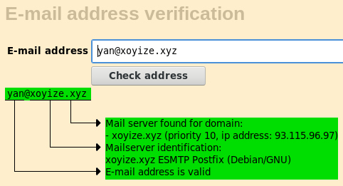

Site **mxtoolbox.com**

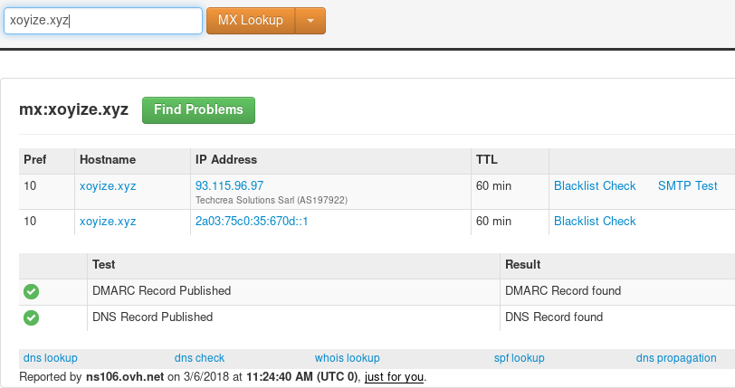

## nginx 

#### ipv4 ipv6 actifs ?

Utiliser la commande **netstat** pour vérifier la liaison IP

	netstat -tulpna | grep nginx

```
tcp        0      0 0.0.0.0:443             0.0.0.0:*               LISTEN      714/nginx: master p
tcp        0      0 0.0.0.0:80              0.0.0.0:*               LISTEN      714/nginx: master p
tcp6       0      0 :::443                  :::*                    LISTEN      714/nginx: master p
tcp6       0      0 :::80                   :::*                    LISTEN      714/nginx: master p
```

La ligne tcp6 indique que mon nginx est listé sur IPv6. Vous pouvez également utiliser la commande wget ou un navigateur Web pour vérifier

	$ wget http://[2607:f0d0:1002:59::2]/

>Veuillez noter que vous devez mettre à jour votre DNS et définir le type d'enregistrement AAAA d'IPv6.

## Tester fonctionnement antivirus et antispam

### Spamassassin ou Rspamd

Dans l’objet du mail, mettre le texte suivant.  
`XJS*C4JDBQADN1.NSBN3*2IDNEN*GTUBE-STANDARD-ANTI-UBE-TEST-EMAIL*C.34X`

### Clamav ou Rspamd

Créer un fichier texte avec le contenu du fichier EICAR suivant et l’envoyer en tant que pièce jointe.  
`X5O!P%@AP[4\PZX54(P^)7CC)7}$EICAR-STANDARD-ANTIVIRUS-TEST-FILE!$H+H*`

Envoi avec fichier joint

    $ echo "Message Body Here" | mailx -s "Subject Here" -a backup.zip user@example.com

https://easyengine.io/tutorials/mail/server/testing/antivirus/

Send a test mail with virus attached

We use EICAR test file.

Download EICAR file locally.

    wget https://secure.eicar.org/eicar.com.txt

For command-line sending, you will need mutt package (mail doesn’t support sending attachment)

    apt-get install mutt -y

Send a test test mail with EICAR file (virus) attached

    echo "Test virus fichier joint" | mailx -s "This is virus" -a eicar.com.txt admin@example.com

Log Monitor

When your server receives a spam mail, you can see in postfix’s mail.loga lines like:

    Oct 12 11:00:25 test amavis[1576510]: (1576510-03) Blocked INFECTED (Eicar-Test-Signature), [192.241.254.103] [192.241.254.103] <root@test.rtcamp.com> -> <admin@example.com>, quarantine: S/virus-SA93AIGegqCY, Message-ID: <20131012145923.GA29765@example.com>, mail_id: SA93AIGegqCY, Hits: -, size: 976, 57 ms

#### Vérification des logs (SpamAssassin ,Clamav)

Vérification des logs de Postfix dans **/var/log/mail.log**

Exemple d’un email clean

```
Dec  4 16:50:00 debian-mx1 postfix/smtpd[2617]: connect from epsi-VirtualBox[192.168.24.102]
Dec  4 16:50:00 debian-mx1 postfix/smtpd[2617]: 46D715F949: client=epsi-VirtualBox[192.168.24.102]
Dec  4 16:50:00 debian-mx1 postfix/cleanup[2621]: 46D715F949: message-id=<5661BAE3.9070004@debian-messagerie.fr>
Dec  4 16:50:00 debian-mx1 postfix/qmgr[2593]: 46D715F949: from=<valentin@debian-messagerie.fr>, size=2714, nrcpt=1 (queue active)
Dec  4 16:50:00 debian-mx1 postfix/smtpd[2617]: disconnect from epsi-VirtualBox[192.168.24.102]
Dec  4 16:50:15 debian-mx1 postfix/smtpd[2625]: connect from localhost[127.0.0.1]
Dec  4 16:50:15 debian-mx1 postfix/smtpd[2625]: 64F41606CC: client=localhost[127.0.0.1]
Dec  4 16:50:15 debian-mx1 postfix/cleanup[2621]: 64F41606CC: message-id=<5661BAE3.9070004@debian-messagerie.fr>
Dec  4 16:50:15 debian-mx1 postfix/qmgr[2593]: 64F41606CC: from=<valentin@debian-messagerie.fr>, size=3149, nrcpt=1 (queue active)
Dec  4 16:50:15 debian-mx1 amavis[1154]: (01154-06) Passed CLEAN {RelayedInternal}, LOCAL [192.168.24.102]:53116 <valentin@debian-messagerie.fr> -> <valentin@debian-messagerie.fr>, Queue-ID: 46D715F949, Message-ID: <5661BAE3.9070004@debian-messagerie.fr>, mail_id: 1q3m3ELchbKb, Hits: -0.999, size: 2712, queued_as: 64F41606CC, 15111 ms
Dec  4 16:50:15 debian-mx1 postfix/smtpd[2625]: disconnect from localhost[127.0.0.1]
Dec  4 16:50:15 debian-mx1 postfix/smtp[2622]: 46D715F949: to=<valentin@debian-messagerie.fr>, relay=127.0.0.1[127.0.0.1]:10024, delay=15, delays=0.02/0/0/15, dsn=2.0.0, status=sent (250 2.0.0 from MTA(smtp:[127.0.0.1]:10025): 250 2.0.0 Ok: queued as 64F41606CC)
Dec  4 16:50:15 debian-mx1 postfix/qmgr[2593]: 46D715F949: removed
Dec  4 16:50:15 debian-mx1 postfix/smtp[2626]: 64F41606CC: to=<valentin@debian-messagerie.fr>, relay=192.168.24.103[192.168.24.103]:25, delay=0.03, delays=0/0.01/0.01/0.01, dsn=2.0.0, status=sent (250 2.0.0 Ok: queued as 1B4DC16C0)
Dec  4 16:50:15 debian-mx1 postfix/qmgr[2593]: 64F41606CC: removed
```

Exemple d’un email avec un virus (ClamAV)

```
Dec  4 16:26:57 debian-mx1 postfix/smtpd[1671]: connect from epsi-VirtualBox[192.168.24.102]
Dec  4 16:26:57 debian-mx1 postfix/smtpd[1671]: 45BF95F949: client=epsi-VirtualBox[192.168.24.102]
Dec  4 16:26:57 debian-mx1 postfix/cleanup[1660]: 45BF95F949: message-id=<5661B57D.6000505@debian-messagerie.fr>
Dec  4 16:26:57 debian-mx1 postfix/qmgr[1473]: 45BF95F949: from=<valentin@debian-messagerie.fr>, size=1268, nrcpt=1 (queue active)
Dec  4 16:26:57 debian-mx1 postfix/smtpd[1671]: disconnect from epsi-VirtualBox[192.168.24.102]
Dec  4 16:26:57 debian-mx1 postfix/smtpd[1665]: connect from localhost[127.0.0.1]
Dec  4 16:26:57 debian-mx1 postfix/smtpd[1665]: warning: Illegal address syntax from localhost[127.0.0.1] in RCPT command: <postmaster@>
Dec  4 16:26:57 debian-mx1 amavis[1155]: (01155-06) Negative SMTP resp. to DATA: 554 5.5.1 Error: no valid recipients
Dec  4 16:26:57 debian-mx1 postfix/smtpd[1665]: disconnect from localhost[127.0.0.1]
Dec  4 16:26:57 debian-mx1 amavis[1155]: (01155-06) (!)8tx3vZ763cyF(rrBtyhd0s3fD) SEND from <postmaster@debian-mx1.fr> -> <postmaster@>, ENVID=AM.8tx3vZ763cyF.20151204T152657Z@debian-mx1.fr 501 5.1.3 from MTA(smtp:[127.0.0.1]:10025): 501 5.1.3 Bad recipient address syntax
Dec  4 16:26:57 debian-mx1 amavis[1155]: (01155-06) (!)FAILED to notify admin: 501 5.1.3 from MTA(smtp:[127.0.0.1]:10025): 501 5.1.3 Bad recipient address syntax
Dec  4 16:26:57 debian-mx1 postfix/smtpd[1665]: connect from localhost[127.0.0.1]
Dec  4 16:26:57 debian-mx1 postfix/smtpd[1665]: 5B27D60ABE: client=localhost[127.0.0.1]
Dec  4 16:26:57 debian-mx1 postfix/cleanup[1660]: 5B27D60ABE: message-id=<VSrrBtyhd0s3fD@debian-mx1.fr>
Dec  4 16:26:57 debian-mx1 postfix/qmgr[1473]: 5B27D60ABE: from=<>, size=4745, nrcpt=1 (queue active)
Dec  4 16:26:57 debian-mx1 postfix/smtpd[1665]: disconnect from localhost[127.0.0.1]
Dec  4 16:26:57 debian-mx1 amavis[1155]: (01155-06) Blocked BANNED (application/x-ms-dos-executable,.asc," X5O!P%@AP[4\\PZX54(P^)7CC)7}$EICAR-STANDARD-ANTIVIRUS-TEST-FILE!$H+H* ".exe) {BouncedInternal,Quarantined}, LOCAL [192.168.24.102]:53115 <valentin@debian-messagerie.fr> -> <valentin@debian-messagerie.fr>, quarantine: r/banned-rrBtyhd0s3fD, Queue-ID: 45BF95F949, Message-ID: <5661B57D.6000505@debian-messagerie.fr>, mail_id: rrBtyhd0s3fD, Hits: -, size: 1268, 91 ms
Dec  4 16:26:57 debian-mx1 postfix/smtp[1666]: 5B27D60ABE: to=<valentin@debian-messagerie.fr>, relay=192.168.24.103[192.168.24.103]:25, delay=0.01, delays=0/0/0/0, dsn=2.0.0, status=sent (250 2.0.0 Ok: queued as 0D37B16C0)
Dec  4 16:26:57 debian-mx1 postfix/qmgr[1473]: 5B27D60ABE: removed
Dec  4 16:26:57 debian-mx1 postfix/smtp[1661]: 45BF95F949: to=<valentin@debian-messagerie.fr>, relay=127.0.0.1[127.0.0.1]:10024, delay=0.13, delays=0.03/0/0/0.09, dsn=2.5.0, status=sent (250 2.5.0 Ok, id=01155-06, BOUNCE)
Dec  4 16:26:57 debian-mx1 postfix/qmgr[1473]: 45BF95F949: removed
```

Exemple d’un email avec un spam (SpamAssassin)

```
Dec  4 18:02:19 debian-mx1 postfix/smtpd[19882]: connect from epsi-VirtualBox[192.168.24.102]
Dec  4 18:02:19 debian-mx1 postfix/smtpd[19882]: E19A55F945: client=epsi-VirtualBox[192.168.24.102]
Dec  4 18:02:19 debian-mx1 postfix/cleanup[19886]: E19A55F945: message-id=<5661CBD7.5040104@debian-messagerie.fr>
Dec  4 18:02:19 debian-mx1 postfix/qmgr[2828]: E19A55F945: from=<valentin@debian-messagerie.fr>, size=2871, nrcpt=1 (queue active)
Dec  4 18:02:20 debian-mx1 postfix/smtpd[19882]: disconnect from epsi-VirtualBox[192.168.24.102]
Dec  4 18:02:20 debian-mx1 postfix/smtpd[19890]: connect from localhost[127.0.0.1]
Dec  4 18:02:20 debian-mx1 postfix/smtpd[19890]: 6BB1561873: client=localhost[127.0.0.1]
Dec  4 18:02:20 debian-mx1 postfix/cleanup[19886]: 6BB1561873: message-id=<SSm0g59DzT_hzp@debian-mx1.fr>
Dec  4 18:02:20 debian-mx1 postfix/qmgr[2828]: 6BB1561873: from=<>, size=3689, nrcpt=1 (queue active)
Dec  4 18:02:20 debian-mx1 postfix/smtpd[19890]: disconnect from localhost[127.0.0.1]
Dec  4 18:02:20 debian-mx1 amavis[1155]: (01155-07) Blocked SPAM {BouncedInternal,Quarantined}, LOCAL [192.168.24.102]:53123 <valentin@debian-messagerie.fr> -> <valentin@debian-messagerie.fr>, quarantine: m/spam-m0g59DzT_hzp.gz, Queue-ID: E19A55F945, Message-ID: <5661CBD7.5040104@debian-messagerie.fr>, mail_id: m0g59DzT_hzp, Hits: 1001.807, size: 2869, 494 ms
Dec  4 18:02:20 debian-mx1 postfix/smtp[19887]: E19A55F945: to=<valentin@debian-messagerie.fr>, relay=127.0.0.1[127.0.0.1]:10024, delay=0.54, delays=0.03/0.01/0.01/0.49, dsn=2.5.0, status=sent (250 2.5.0 Ok, id=01155-07, BOUNCE)
Dec  4 18:02:20 debian-mx1 postfix/qmgr[2828]: E19A55F945: removed
Dec  4 18:02:20 debian-mx1 postfix/smtp[19891]: 6BB1561873: to=<valentin@debian-messagerie.fr>, relay=192.168.24.103[192.168.24.103]:25, delay=0.04, delays=0.01/0.01/0.01/0.01, dsn=2.0.0, status=sent (250 2.0.0 Ok: queued as 241C216C0)
Dec  4 18:02:20 debian-mx1 postfix/qmgr[2828]: 6BB1561873: removed
```

### Vérification des logs (Rspamd)

Vérification des logs de Postfix dans **/var/log/mail.log**


Exemple d’un email avec un virus (Rspamd)

```
ar 15 17:45:27 cinay postfix/smtpd[7829]: connect from yanspm.com[78.230.171.39]
Mar 15 17:45:27 cinay postfix/smtpd[7829]: Anonymous TLS connection established from yanspm.com[78.230.171.39]: TLSv1.2 with cipher ECDHE-RSA-AES256-GCM-SHA384 (256/256 bits)
Mar 15 17:45:28 cinay postfix/smtpd[7829]: DD359240FF0: client=yanspm.com[78.230.171.39]
Mar 15 17:45:28 cinay postfix/cleanup[7834]: DD359240FF0: message-id=<20180315164527.6878A64976@yanspm.com>
Mar 15 17:45:30 cinay postfix/qmgr[7768]: DD359240FF0: from=<yann@yanspm.com>, size=524, nrcpt=1 (queue active)
Mar 15 17:45:30 cinay dovecot: lmtp(7837): Connect from local
Mar 15 17:45:30 cinay postfix/smtpd[7829]: disconnect from yanspm.com[78.230.171.39] ehlo=2 starttls=1 mail=1 rcpt=1 data=1 quit=1 commands=7
Mar 15 17:45:30 cinay dovecot: lmtp(yan@cinay.pw): vwQ8DCqjqlqdHgAAwl8aWQ: sieve: msgid=<20180315164527.6878A64976@yanspm.com>: stored mail into mailbox 'INBOX'
Mar 15 17:45:30 cinay postfix/lmtp[7836]: DD359240FF0: to=<yan@cinay.pw>, relay=cinay.pw[private/dovecot-lmtp], delay=2.4, delays=2.3/0.01/0.01/0.02, dsn=2.0.0, status=sent (250 2.0.0 <yan@cinay.pw> vwQ8DCqjqlqdHgAAwl8aWQ Saved)
Mar 15 17:45:30 cinay dovecot: lmtp(7837): Disconnect from local: Successful quit
Mar 15 17:45:30 cinay postfix/qmgr[7768]: DD359240FF0: removed
```

Exemple d'un email avec un spam (Rspamd)

```
Mar 15 17:35:07 cinay postfix/smtpd[7773]: connect from yanspm.com[78.230.171.39]
Mar 15 17:35:07 cinay postfix/smtpd[7773]: Anonymous TLS connection established from yanspm.com[78.230.171.39]: TLSv1.2 with cipher ECDHE-RSA-AES256-GCM-SHA384 (256/256 bits)
Mar 15 17:35:07 cinay postfix/smtpd[7773]: 7B69D240FF0: client=yanspm.com[78.230.171.39]
Mar 15 17:35:07 cinay postfix/cleanup[7779]: 7B69D240FF0: message-id=<2618c351-9151-8ee5-47fe-06902d36c6a0@yanspm.com>
Mar 15 17:35:07 cinay postfix/cleanup[7779]: 7B69D240FF0: milter-reject: END-OF-MESSAGE from yanspm.com[78.230.171.39]: 5.7.1 Gtube pattern; from=<yanspm@yanspm.com> to=<yan@cinay.pw> proto=ESMTP helo=<yanspm.com>
Mar 15 17:35:07 cinay postfix/smtpd[7773]: disconnect from yanspm.com[78.230.171.39] ehlo=2 starttls=1 mail=1 rcpt=1 data=0/1 quit=1 commands=6/7
```

>Dans les 2 cas ,le message est rejeté avec retour **Undelivered Mail Returned to Sender** car l'enregistrement dmarc contient **p=reject**   
Dans le cas où l'enregistrement dmarc contient **p=none** , le message n'est pas délivré au destinataire  

## Tests de vulnérabilité

### SSL Labs

*[SSL Labs](https://www.ssllabs.com/) est l'un des outils les plus utilisés pour scanner les serveurs web SSL. Le rapport vous fournit une analyse complète des vos URL https avec leurs dates d'expiration, leur classement global, Cipher, la version du certificat SSL/TLS, et bien plus encore.*

Vérification ssl <https://www.ssllabs.com>  

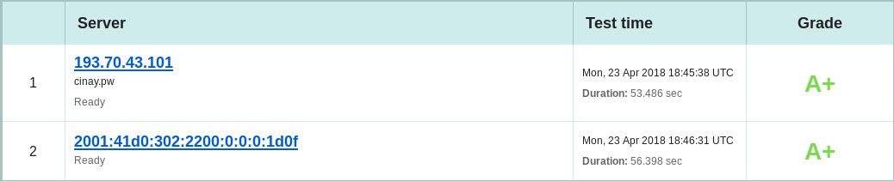

### Web Inspector

*[Web Inspector](https://app.webinspector.com/) scanne votre site et vous fournit un rapport complet à propos des menaces telles que le blacklistage, le phishing, les malware, les vers, les backdoors, les trojans, les iframes douteuses, les connections douteuses, etc...*

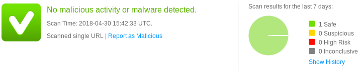

### Observatory (mozilla)

Vérification complète <https://observatory.mozilla.org/analyze.html?host=cinay.pw>  

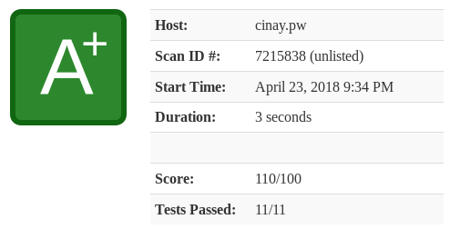

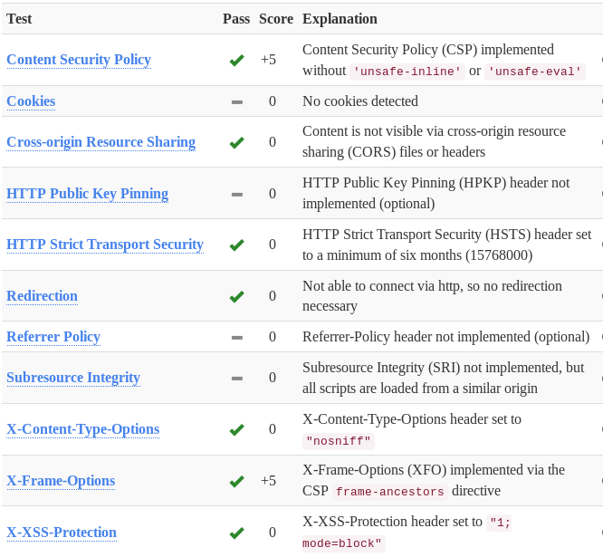

### Test des entêtes (headers)

<https://securityheaders.com/?q=xoyize.xyz>

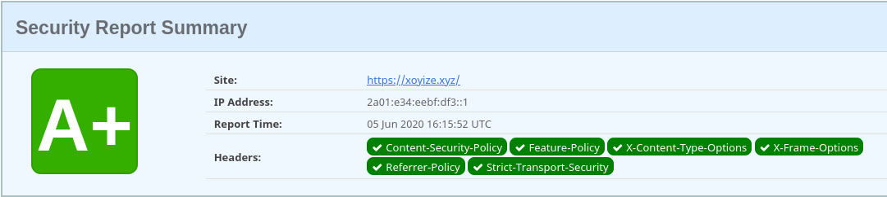

### HSTS

*C’est le champ qui définit la politique Strict-Transport-Security. La règle force les connexions HTTPS avec chiffrement, sans tenir compte des appels de scripts pour charger des ressources en HTTP dans ce domaine. Le HSTS n’est qu'une des composantes des paramètres de sécurité de votre serveur ou service d’hébergement Web.*

<https://hstspreload.org/?domain=cinay.pw>

    Eligibility: cinay.pw is eligible for the HSTS preload list.

### CryptCheck

[CryptCheck](https://tls.imirhil.fr/)

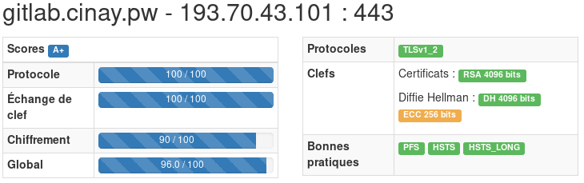

### Fuites de données sur le net (identifiant de messagerie)

*savoir si certaines de leurs données ont fuité sur le net (identifiant de messagerie).*

[Have i been pwned ](https://mylittleblog.fr/Haveibeenpwned.html)

## Tests VPN

* [VPN Tests and Checks](https://restoreprivacy.com/vpn-test/)

### Fuites DNS

*Vérifier que le VPN n'utilise pas de résolveur autre  (FAI,Google,etc...) que celui du VPN*

**Firefox linux XFCE**  
<https://www.dnsleaktest.com/>  
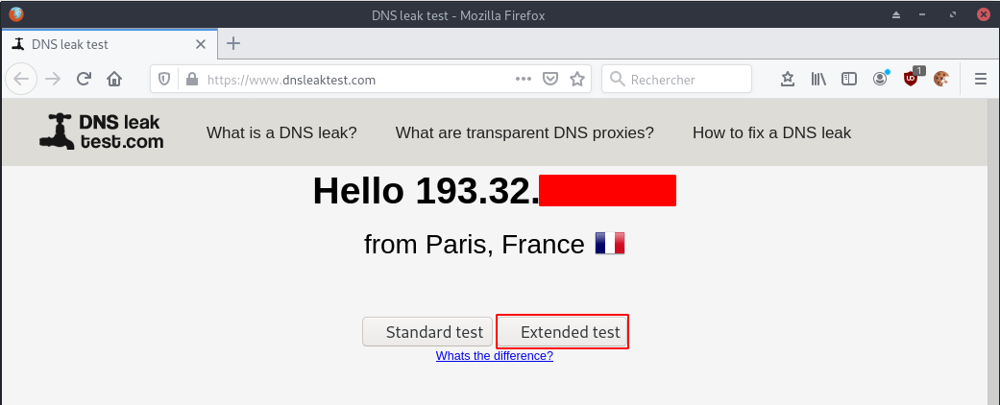{:width="600"}  
{:width="600"}  

<https://ipleak.net>  
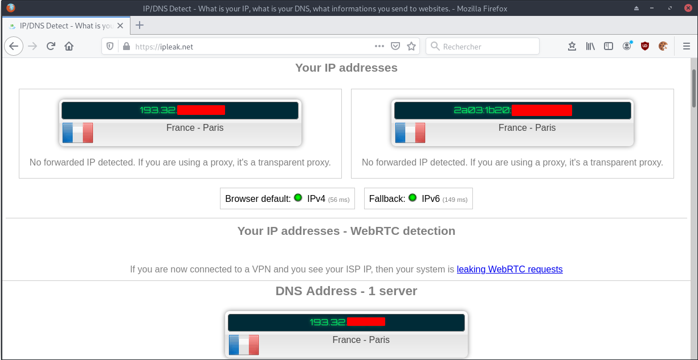{:width="600"}  

**Firefox preview Android**  
<https://dnsleak.com>  
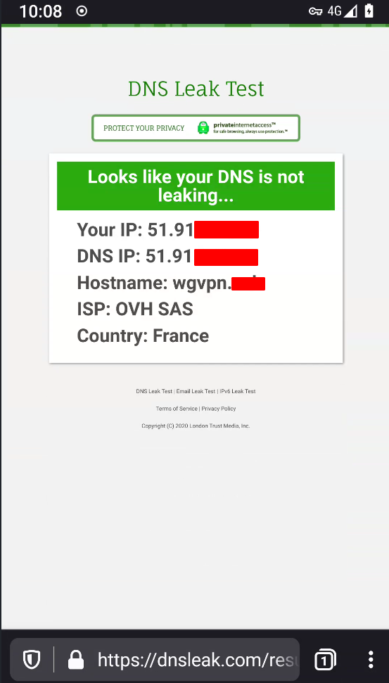{:width="150"}  

Que signifient les résultats de ces tests ?

*    Les serveurs identifiés ci-dessus reçoivent une demande de résolution d'un nom de domaine (par exemple www.eff.org) à une adresse IP chaque fois que vous entrez une adresse de site web dans votre navigateur.
*    Les propriétaires des serveurs ci-dessus ont la possibilité d'associer votre adresse IP personnelle aux noms de tous les sites auxquels vous vous connectez et de stocker ces données indéfiniment. Cela ne signifie pas qu'ils les enregistrent ou les stockent indéfiniment, mais ils peuvent le faire et vous devez faire confiance à leur politique, quelle qu'elle soit.
*    <font color="red">**Si vous êtes connecté à un service VPN et que l'un des serveurs énumérés ci-dessus n'est pas fourni par le service VPN, il y a alors une fuite DNS et vous choisissez de confier vos données privées aux propriétaires des serveurs susmentionnés.**</font>

## Performances

Outils pour améliorer les performances

* [Quelques sites/outils pour améliorer votre site](https://lord.re/posts/124-site-outils-amelioration-sites/)
    * [GTmetrix](https://gtmetrix.com/)
    * [Pagespeed](https://developers.google.com/speed/pagespeed/insights/)
    * [Tools Pingdom](https://tools.pingdom.com/)
* [Mettre en place les images au format WebP sur son site avec NGINX](https://www.abyssproject.net/2020/05/mettre-en-place-les-images-au-format-webp-sur-son-site-avec-nginx/)


