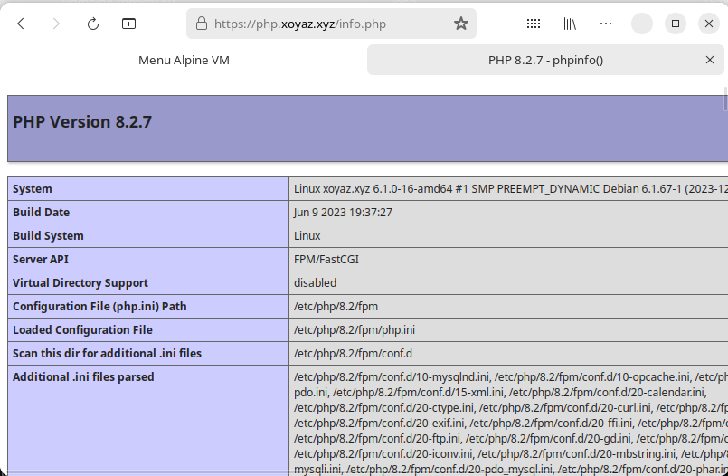
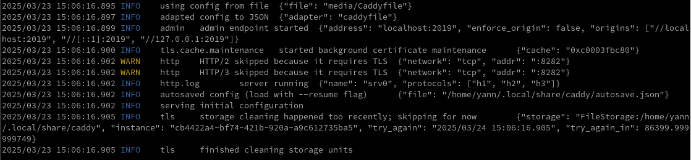

+++
title = 'Caddy serveur'
date = 2023-12-30 00:00:00 +0100
categories = serveur
+++
*Caddy est un serveur web écrit en Go, open source et disponible avec HTTPS automatiquement*


## Caddy

{:width="150"}


### Installation

[Guide d'utilisation d'un serveur Caddy sous Linux](https://ettayeb.fr/guide-dutilisation-dun-serveur-caddy-sous-linux/)  
<https://caddyserver.com/docs/running#using-the-service>


Prérequis

    sudo apt update
    sudo apt install libcap2-bin libnss3-tools wget tar

suivre ces instructions pour une installation "manuelle"

Exigences :

*    [binaire Caddy](https://caddyserver.com/download) que vous avez téléchargé ou [construit à partir des sources](https://caddyserver.com/docs/build).
*    systemctl --version 232 ou plus récent
*    privilèges sudo

Télécharger le binaire **linux amd64**

Déplacez le binaire caddy dans votre $PATH, par exemple :

    sudo mv caddy_linux_amd64 /usr/local/bin/caddy
    sudo chmod +x /usr/local/bin/caddy

Testez : `caddy version`  
`v2.7.6 h1:w0NymbG2m9PcvKWsrXO6EEkY9Ru4FJK8uQbYcev1p3A=`

### Configuration

Les serveurs Web tels que Caddy sont généralement exposés sur l'Internet, lancer tout logiciel qui est exposé en tant qu'utilisateur restreint.

 configurer un utilisateur restreint nommé **caddy** avec le répertoire personnel de `/etc/caddy` en exécutant la commande suivante

    sudo useradd --shell /bin/false --home-dir /etc/caddy --system caddy

Caddy stocke la configuration dans le répertoire `.config`, et les certificats dans le répertoire `.local`.  
Exécutez la commande suivante pour créer ces deux répertoires  

    sudo mkdir -p /etc/caddy/.config /etc/caddy/.local

répertoire lié à Caddy pour stocker les logs

    sudo mkdir -p /var/log/caddy

Modifier la propriété des répertoires au profit de l'utilisateur **caddy** 

    sudo chown -R caddy: /etc/caddy /var/log/caddy

Lorsque vous exécutez un logiciel en tant qu'utilisateur non root, Linux interdit à ces processus d'écouter des numéros de port inférieurs à 1024. Pour contourner cette restriction et exécuter Caddy en toute sécurité en tant qu'utilisateur non root, ajoutez la capacité `cap_net_bind_service` au binaire caddy :

    sudo setcap cap_net_bind_service+ep /usr/local/bin/caddy

### Caddy service

*configurer Caddy comme un service du système qui démarrera automatiquement*

Créer le fichier

    sudo nano /etc/systemd/system/caddy.service

```
[Unit]
Description=Caddy web server
After=network-online.target

[Service]
User=caddy
Group=caddy
Type=exec
WorkingDirectory=/var/caddy/html

ExecStart=/usr/local/bin/caddy run --config /etc/caddy/Caddyfile
ExecReload=/usr/local/bin/caddy reload --config /etc/caddy/Caddyfile
ExecStop=/usr/local/bin/caddy stop

LimitNOFILE=1048576
LimitNPROC=512

PrivateTmp=true
PrivateDevices=true
ProtectHome=true
ProtectSystem=strict
ReadWritePaths=/etc/caddy/.local /etc/caddy/.config /var/log

CapabilityBoundingSet=CAP_NET_BIND_SERVICE
AmbientCapabilities=CAP_NET_BIND_SERVICE
NoNewPrivileges=true

[Install]
WantedBy=multi-user.target
```

Noter , répertoire par défaut : `/var/caddy/html`  
Création : `sudo mkdir -p /var/caddy/html`

### Site proxy

Créer un proxy avec un accès protégé

    sudo nano /etc/caddy/Caddyfile

```
xoyaz.xyz {
    reverse_proxy 127.0.0.1:8100
}
```

Démarrer et activer le service

    sudo systemctl daemon-reload
    sudo systemctl enable caddy --now


Accès https://xoyaz.xyz

### Accès avec authentification

Entrez ceci dans le terminal pour générer un hachage du mot de passe (par défaut, l'algorithme de hachage bcrypt est utilisé).

    caddy hash-password

Saisir le mot de passe à hacher, qui va donner un résultat , exemple  
`JDJhJDE0JElab2ZPM25zdU40bE5SSURlTHd3OHVBeVJvYTlMN3dMOEFMdFVCRzNYS1l5ODl6TlVyQllH`

Vous trouverez ci-dessous un modèle qu'il vous suffit de remplacer par le nom d'utilisateur et le code d'accès, puis de le placer dans votre fichier Caddy `/etc/caddy/Caddyfile`

```
basicauth * {
	bob JDJhJDE0JElab2ZPM25zdU40bE5SSURlTHd3OHVBeVJvYTlMN3dMOEFMdFVCRzNYS1l5ODl6TlVyQllH
}
```

Si vous souhaitez sécuriser un certain chemin, la syntaxe suivante peut être utilisée 

```
basicauth /homework/* {
	bob JDJhJDE0JElab2ZPM25zdU40bE5SSURlTHd3OHVBeVJvYTlMN3dMOEFMdFVCRzNYS1l5ODl6TlVyQllH
}
```

Recharger le caddy

```
caddy reload
# OU
sudo systemctl reload caddy
```

### Activer PHP dans Caddy

En mode su

Tout d'abord, installez PHP et les autres extensions nécessaires

    apt-get install php8.2-fpm php8.2-mysql php8.2-curl php8.2-gd php8.2-mbstring php8.2-common php-xml php8.2-xmlrpc -y

Après avoir installé PHP, éditez le fichier de configuration PHP-FPM et changez l'utilisateur et le groupe par défaut avec caddy 

    nano /etc/php/8.2/fpm/pool.d/www.conf

Recherchez et remplacez le nom d'utilisateur et de groupe de www-data par caddy :

```
user = caddy
group = caddy
listen.owner = caddy
listen.group = caddy
```

Enregistrez et fermez le fichier puis redémarrez le service PHP-FPM pour appliquer les modifications

    systemctl restart php8.2-fpm

Créer un fichier de configuration d'hôte virtuel Caddy dans /etc/caddy/Caddyfile 

    nano /etc/caddy/Caddyfile

Ajouter les lignes suivantes :

```
php.xoyaz.xyz {
    root * /var/lib/caddy/
    encode gzip zstd
    php_fastcgi unix//run/php/php8.2-fpm.sock
}
```

Redémarrer le service Caddy pour appliquer les modifications :

    systemctl restart caddy

Ensuite, créer un fichier PHP de test pour Caddy 

    nano /var/lib/caddy/info.php

Ajoutez les lignes suivantes :

    <?php phpinfo(); ?>

Tester le lien https://php.xoyaz.xyz/info.php  


### Directive file_server

[Directive file_server](https://caddyserver.com/docs/caddyfile/directives/file_server)

La directive index est lié à `file_server`

```
ouestline.xyz {
	root * /mnt/sambashare/alpine
	file_server {
	 index index.html index.php
        }
}
```

### Journalisation des requêtes

Par défaut, Caddy ne journalise pas les demandes. Toutefois, vous pouvez configurer Caddy pour qu'il journalise les requêtes grâce à la directive "log". Par défaut, Caddy stocke ses journaux sous forme de lignes de JSON, bien que d'autres formats soient également disponibles.

Comme nous l'avons vu dans les sections précédentes, le fichier Caddy est composé de sections dans lesquelles vous ajoutez la configuration pour chaque site Web. Pour configurer la journalisation, modifiez le fichier Caddy de sorte que chaque bloc ressemble à ceci :

```yaml
<YOUR DOMAIN NAME HERE, OR SPECIFY "http://"> {
    encode gzip
    file_server
    log {
        output file /var/log/caddy/access.log
    }
}
```

Une fois que vous avez enregistré le fichier Caddy, rechargez la configuration avec :

```bash
sudo systemctl reload caddy  # avec systemd
sudo service caddy reload
```

Maintenant, visitez le site Web dans un navigateur, afin de générer quelques entrées de journal. Exécutez la commande suivante pour afficher les journaux :

    sudo cat /var/log/caddy/access.log

## Archlinux Caddy

*Caddy est un serveur web compatible HTTP/2 avec un HTTPS automatique.*

### Installation

Installez le paquet Caddy.

```shell
sudo pacman -S caddy
```

Par défaut le service est inactif: `systemctl status caddy`

```
○ caddy.service - Caddy web server
     Loaded: loaded (/usr/lib/systemd/system/caddy.service; disabled; preset: disabled)
     Active: inactive (dead)
       Docs: https://caddyserver.com/docs/
```

### Plugins

Si vous avez besoin de plus que la version de base de Caddy, vous pouvez utiliser [xcaddy-binAUR](https://aur.archlinux.org/packages/xcaddy-bin/) pour personnaliser la construction de votre serveur Caddy. Ceci est utile si vous avez besoin des plugins supplémentaires pour le défi DNS, etc. Sinon, si un paquet pré-construit, avec les plugins dont vous avez besoin, est déjà disponible, vous pouvez choisir d'installer ceux de [AUR](https://aur.archlinux.org/packages/?O=0&K=caddy), par exemple [caddy-cloudflareAUR](https://aur.archlinux.org/packages/caddy-cloudflare/).

Pour un serveur caddy personnalisé construire vous pouvez utiliser xcaddy pour construire caddy avec les modules de plugin nécessaires:

```shell
$ xcaddy build [<caddy_version>]
   [--output <file>]
   [--with <module[@version][=replacement]>...]
```

Pour en savoir plus, consultez le [dépôt xcaddy](https://github.com/caddyserver/xcaddy).

### Configuration

Caddy 2 prend en charge différents formats de configuration, voir [config adapters](https://caddyserver.com/docs/config-adapters) (caddyfile, nginx, json, yaml, toml, entre autres).

Le plus souvent, Caddy est configuré en utilisant un fichier texte simple appelé [Caddyfile](https://caddyserver.com/docs/caddyfile). Le Caddyfile commence par (un bloc optionnel d'options globales et) une adresse du site à desservir, et est suivi d'un certain nombre de directives.

Un simple Caddyfile hébergeant le site à localhost:2020:

```
{
  http_port 2020
}

localhost:2020
file_server
```

### Utilisation

```shell
$ caddy help
$ caddy help run
```

Caddy peut être exécuté par n'importe quel utilisateur à partir du répertoire de la page, et le **Caddyfile** devrait être dans le même répertoire:

```shell
caddy run
```

Vous pouvez également spécifier un **Caddyfile** personnalisé:

```shell
caddy run --config ../chemin/vers/caddyfile
```

### Dépannage

**Erreur de certificat**

Si vous rencontrez des problèmes liés aux certificats SSL (surtout sur des domaines non publics), c'est probablement parce que l'instance de caddy en cours d'exécution n'a pas la permission d'ajouter le certificat au magasin de fiducie du système. C'est le cas quand `caddy.service` est utilisé pour démarrer automatiquement Caddy.

Pour corriger cela, exécutez ce qui suit en "root". Vous n'avez à exécuter cela qu'une fois dans un temps très long (vie du certificat racine).

```shell
XDG_DATA_HOME=/var/lib caddy trust
```

### Type de contenu manquant

Si vous rencontrez des problèmes lors de l'utilisation de la sous-direction de navigation du serveur de fichiers comme par exemple les fichiers vidéo ne s'affichent pas correctement, cela pourrait être dû au manque d'en-tête `Content-Type` dans les réponses HTTP.

Caddy est écrit en Go et utilise la fonction [TypeByExtension](https://pkg.go.dev/mime#TypeByExtension) de la bibliothèque [MIME](https://wiki.archlinux.org/title/MIME) standard pour obtenir le type mime de l'extension de fichier. Comme documenté, la fonction `TypeByExtension` utilise `/etc/mime.types` (ou l'un des autres fichiers listés) pour obtenir le type MIME.

Vous devez installer le paquet [mailcap](https://archlinux.org/packages/?name=mailcap) pour rendre `/etc/mime.types` disponible à Caddy, permettant une génération correcte de l'en-tête `Content-Type`. 

### Test chirpy sur archlinux

Tester le serveur statique chirpy en local

Le fichier de configuration `$HOME/media/Caddyfile`{: .filepath}

```
:8282 {
	root * /home/yann/media/chirpy/_site
	file_server
}
```
{: file="$HOME/media/Caddyfile" }

Exécution serveur

```shell
caddy run --config media/Caddyfile
```

Serveur en exécution  


## Modèles Caddyfile courants

Cette page présente quelques configurations Caddyfile complètes et minimales pour les cas d'utilisation courants. Ceux-ci peuvent être des points de départ utiles pour vos propres documents Caddyfile.

Ce ne sont pas des solutions instantanées ; vous devrez personnaliser votre nom de domaine, vos ports/sockets, vos chemins de répertoire, etc. Ils sont destinés à illustrer certains des modèles de configuration les plus courants.

[Common Caddyfile Patterns](https://caddyserver.com/docs/caddyfile/patterns)
