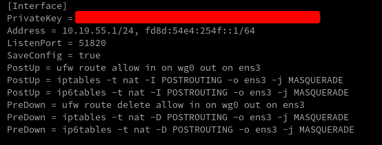
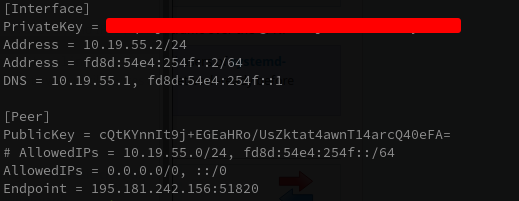
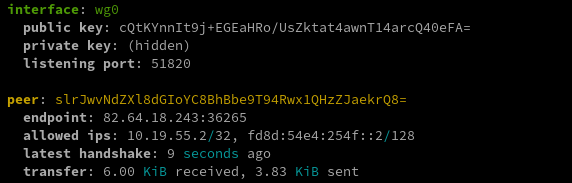
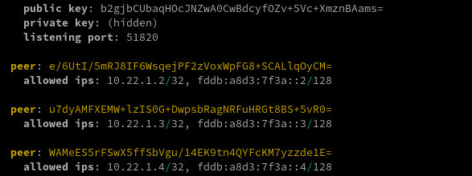
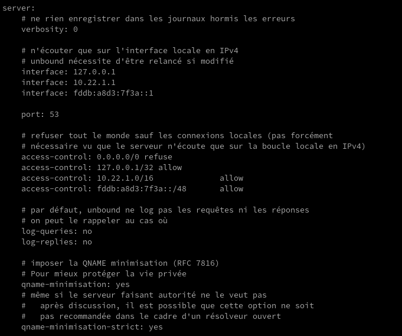
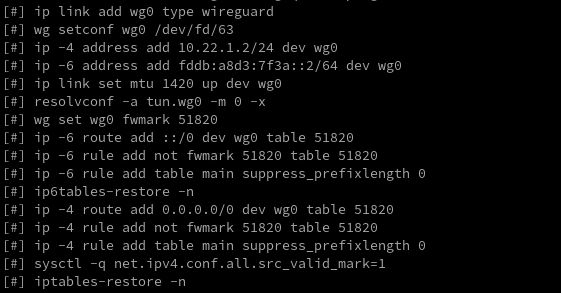
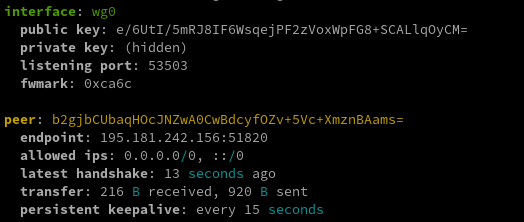
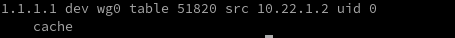
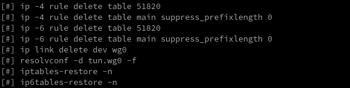

+++
title = 'TIME4VPS Debian 12 wireguard'
date = 2024-01-10 00:00:00 +0100
categories = wireguard
+++
*Serveur wiregard + DNS unbound + gestion des clients peer wireguard*

 *fournisseur d'hébergement Web en Lituanie *

Connexion sur l'hébergeur TIME4VPS (zone client) : <https://billing.time4vps.com/clientarea/>  
**Modifier hostname**   
Cliquer sur **Change Hostname** et saisir **xoyaz.xyz** pour valider le **reverse DNS**  

* **Product/Service** 	Linux VPS - Linux 8
* **Label** 	yann-time4vps 
* **Hostname** 	xoyaz.xyz
* OS: Debian 12 (64-bit)
* Processor: 3 x 2.6 GHz
* Memory: 8192 MB
* Storage: 80 GB
* Bandwidth: 100 Mbps (Monthly limit: 16 TB)


## Debian 12

{:height="30"}

PARAMETRES D'ACCES:  
L'adresse IPv4 du VPS est : 195.181.242.156  
L'adresse IPv6 du VPS est : 2a02:7b40:c3b5:f29c::/64  

Le nom du VPS est : yann-time4vps  
Connexion SSH en "root" sans mot de passe

    ssh root@195.181.242.156

Mise à jour

    apt update && apt upgrade

Modifier mot de passe  "root"

    passwd

Réseau

```
1: lo: <LOOPBACK,UP,LOWER_UP> mtu 65536 qdisc noqueue state UNKNOWN group default qlen 1000
    link/loopback 00:00:00:00:00:00 brd 00:00:00:00:00:00
    inet 127.0.0.1/8 scope host lo
       valid_lft forever preferred_lft forever
    inet6 ::1/128 scope host noprefixroute 
       valid_lft forever preferred_lft forever
2: ens3: <BROADCAST,MULTICAST,UP,LOWER_UP> mtu 1500 qdisc fq_codel state UP group default qlen 1000
    link/ether 00:00:c3:b5:f2:9c brd ff:ff:ff:ff:ff:ff
    altname enp0s3
    inet 195.181.242.156/32 brd 195.181.242.156 scope global ens3
       valid_lft forever preferred_lft forever
    inet 10.181.242.156/8 brd 10.255.255.255 scope global ens3:1
       valid_lft forever preferred_lft forever
    inet6 2a02:7b40:c3b5:f29c::1/128 scope global 
       valid_lft forever preferred_lft forever
    inet6 fe80::200:c3ff:feb5:f29c/64 scope link 
       valid_lft forever preferred_lft forever
```

Noyau et OS : `uname -a`

    Linux xoyaz.xyz 6.1.0-13-amd64 #1 SMP PREEMPT_DYNAMIC Debian 6.1.55-1 (2023-09-29) x86_64 GNU/Linux

Paramétrage fuseau **Europe/Paris** : `dpkg-reconfigure tzdata`  

```
Current default time zone: 'Europe/Paris'
Local time is now:      Thu Nov  9 19:36:07 CET 2023.
Universal Time is now:  Thu Nov  9 18:36:07 UTC 2023.
```

### Création utilisateur

Utilisateur **ian**  

    useradd -m -d /home/ian/ -s /bin/bash ian

Mot de passe **ian**  

    passwd ian 

Visudo pour les accès root via utilisateur **ian**  

    apt install sudo
    echo "ian     ALL=(ALL) NOPASSWD: ALL" >> /etc/sudoers

### OpenSSH, clé et script

{:width="80"}  
**connexion avec clé**  
<u>sur l'ordinateur de bureau</u>
Générer une paire de clé curve25519-sha256 (ECDH avec Curve25519 et SHA2) nommé **time4vps** pour une liaison SSH avec le serveur KVM.  

    ssh-keygen -t ed25519 -o -a 100 -f ~/.ssh/time4vps

Envoyer les clés publiques sur le serveur KVM

    ssh-copy-id -i ~/.ssh/time4vps.pub ian@195.181.242.156

On se connecte  

    ssh ian@195.181.242.156

Modifier la configuration serveur SSH  

    sudo nano /etc/ssh/sshd_config  

Modifier

```conf
Port 55156
PermitRootLogin no  
PasswordAuthentication no 
```

Relancer openSSH  

    sudo systemctl restart sshd

Accès depuis le poste distant avec la clé privée  

    ssh -p 55156 -i ~/.ssh/time4vps ian@195.181.242.156

### Outils, scripts motd et ssh_rc_bash

Installer utilitaires  

    sudo apt install rsync curl tmux jq figlet git dnsutils tree -y

Motd

    sudo rm /etc/motd && sudo nano /etc/motd

```
  _____  ___  __  __  ___  _ _ __   __ ___  ___ 
 |_   _||_ _||  \/  || __|| | |\ \ / /| _ \/ __|
   | |   | | | |\/| || _| |_  _|\ V / |  _/\__ \
   |_|  |___||_|  |_||___|  |_|  \_/  |_|  |___/
  ___        _     _               _  ___       
 |   \  ___ | |__ (_) __ _  _ _   / ||_  )      
 | |) |/ -_)| '_ \| |/ _` || ' \  | | / /       
 |___/ \___||_.__/|_|\__,_||_||_| |_|/___|      
```


Script **ssh_rc_bash**  
>**ATTENTION!!! Les scripts sur connexion peuvent poser des problèmes pour des appels externes autres que ssh**

    wget https://static.xoyize.xyz/files/ssh_rc_bash
    chmod +x ssh_rc_bash # rendre le bash exécutable
    ./ssh_rc_bash        # exécution


**Historique de la ligne de commande**  
Ajoutez la recherche d’historique de la ligne de commande au terminal.
Tapez un début de commande précédent, puis utilisez shift + up (flèche haut) pour rechercher l’historique filtré avec le début de la commande.

```
# Global, tout utilisateur
echo '"\e[1;2A": history-search-backward' | sudo tee -a /etc/inputrc
echo '"\e[1;2B": history-search-forward' | sudo tee -a /etc/inputrc
```

### Hostname

    hostnamectl 

```
 Static hostname: xoyaz.xyz
       Icon name: computer-vm
         Chassis: vm 🖴
      Machine ID: efeae6fcc90e4228a36d1b742685c11e
         Boot ID: 4f7c7d9fc9c5442b80e9dd8a6e4f8b41
  Virtualization: kvm
Operating System: Debian GNU/Linux 12 (bookworm)  
          Kernel: Linux 6.1.0-13-amd64
    Architecture: x86-64
 Hardware Vendor: Virtuozzo
  Hardware Model: KVM
Firmware Version: 1.11.0-2.vz7.5
```

### Domaine xoyaz.xyz

{:width="30"} Zone dns OVH

```
$TTL 3600
@	IN SOA dns106.ovh.net. tech.ovh.net. (2023110909 86400 3600 3600000 300)
        IN NS     ns106.ovh.net.
        IN NS     dns106.ovh.net.
        IN A     195.181.242.156
        IN AAAA     2a02:7b40:c3b5:f29c::1
        IN CAA     128 issue "letsencrypt.org"
*        IN A     195.181.242.156
*        IN AAAA     2a02:7b40:c3b5:f29c::1
```

### Certificats LetsEncrypt

{:width="100"}  
Installer acme: [Serveur , installer et renouveler les certificats SSL Let's encrypt via Acme](https://blog.cinay.xyz/2017/08/Acme-Certficats-Serveurs/)  

``` bash
cd ~
sudo apt install socat -y # prérequis
git clone https://github.com/acmesh-official/acme.sh.git
cd acme.sh
./acme.sh --install # se déconnecter pour prise en compte
# export des clé API OVH
```

Générer les certificats pour le domaine xoyaz.xyz

        acme.sh --dns dns_ovh --server letsencrypt --issue --keylength ec-384 -d 'xoyaz.xyz' -d '*.xoyaz.xyz'


```
[Thu Nov  9 08:18:04 PM CET 2023] Your cert is in: /home/ian//.acme.sh/xoyaz.xyz_ecc/xoyaz.xyz.cer
[Thu Nov  9 08:18:04 PM CET 2023] Your cert key is in: /home/ian//.acme.sh/xoyaz.xyz_ecc/xoyaz.xyz.key
[Thu Nov  9 08:18:04 PM CET 2023] The intermediate CA cert is in: /home/ian//.acme.sh/xoyaz.xyz_ecc/ca.cer
[Thu Nov  9 08:18:04 PM CET 2023] And the full chain certs is there: /home/ian//.acme.sh/xoyaz.xyz_ecc/fullchain.cer
```

Installer les certificats

nous stockons les fichiers dans le répertoire /etc/ssl/private/ (qui doit être créé au préalable), la commande serait :

```bash
sudo mkdir -p /etc/ssl/private/
sudo chown $USER -R /etc/ssl/private/
acme.sh --ecc --install-cert -d 'xoyaz.xyz' -d '*.xoyaz.xyz' --key-file /etc/ssl/private/xoyaz.xyz-key.pem --fullchain-file /etc/ssl/private/xoyaz.xyz-fullchain.pem
#  --reloadcmd 'sudo systemctl reload nginx.service'
```

Renouvellement automatique

    crontab -e

```
30 0 * * * "$HOME/.acme.sh"/acme.sh --cron --home "$HOME/.acme.sh" --renew-hook "$HOME/.acme.sh/acme.sh --ecc --install-cert -d 'xoyaz.xyz' --key-file /etc/ssl/private/xoyaz.xyz-key.pem --fullchain-file /etc/ssl/private/xoyaz.xyz-fullchain.pem" > /dev/null
```

### Parefeu

{:width="50"}  
*UFW, ou pare - feu simple , est une interface pour gérer les règles de pare-feu dans Arch Linux, Debian ou Ubuntu. UFW est utilisé via la ligne de commande (bien qu'il dispose d'interfaces graphiques disponibles), et vise à rendre la configuration du pare-feu facile (ou simple).*

Installation **Debian / Ubuntu**

    sudo apt install ufw

*Par défaut, les jeux de règles d'UFW sont vides, de sorte qu'il n'applique aucune règle de pare-feu, même lorsque le démon est en cours d'exécution.*   

Les règles 

    sudo ufw allow 55156/tcp  # port SSH , 55156
    sudo ufw allow https      # port 443
    sudo ufw allow DNS        # port 53
    sudo ufw allow 51820/udp  # wireguard

Activer le parefeu

    sudo ufw enable

```
Command may disrupt existing ssh connections. Proceed with operation (y|n)? y
Firewall is active and enabled on system startup
```

Status

     sudo ufw status verbose

```
Status: active
Logging: on (low)
Default: deny (incoming), allow (outgoing), disabled (routed)
New profiles: skip

To                         Action      From
--                         ------      ----
55156/tcp                  ALLOW IN    Anywhere                  
443                        ALLOW IN    Anywhere                  
53 (DNS)                   ALLOW IN    Anywhere                  
51820/udp                  ALLOW IN    Anywhere                  
55156/tcp (v6)             ALLOW IN    Anywhere (v6)             
443 (v6)                   ALLOW IN    Anywhere (v6)             
53 (DNS (v6))              ALLOW IN    Anywhere (v6)             
51820/udp (v6)             ALLOW IN    Anywhere (v6)             
```

### Résolveur (Unbound)

{:height="80"}  
Commençons par installer et configurer le résolveur DNS. Il existe plusieurs
logiciels pour faire de la résolution comme [BIND 9](https://www.isc.org/bind),
[Knot Resolver](https://www.knot-resolver.cz) ou encore
[Unbound](https://nlnetlabs.nl/projects/unbound/about/). Nous avons choisi
d'utiliser Unbound et cette partie documente comment installer et configuer ce
résolveur.

Prérequis, installer resolvconf

    apt install resolvconf

Le fichier cat /etc/resolv.conf 

```
# Dynamic resolv.conf(5) file for glibc resolver(3) generated by resolvconf(8)
#     DO NOT EDIT THIS FILE BY HAND -- YOUR CHANGES WILL BE OVERWRITTEN
# 127.0.0.53 is the systemd-resolved stub resolver.
# run "resolvectl status" to see details about the actual nameservers.

nameserver 127.0.0.1
```

En mode su

    sudo -s

Installation Unbound  

```bash
apt install unbound
```

Téléchargement de la liste des serveurs DNS racines

```bash
curl -o /var/lib/unbound/root.hints https://www.internic.net/domain/named.cache
chown unbound:unbound /var/lib/unbound/root.hints
```

Créer le fichier de configuration `/etc/unbound/unbound.conf.d/unbound-ian.conf` en tenant compte des adresses privées

```
server:
    # ne rien enregistrer dans les journaux hormis les erreurs
    verbosity: 0

    # n'écouter que sur l'interface locale en IPv4
    # unbound nécessite d'être relancé si modifié
    interface: 127.0.0.1

    port: 53

    # refuser tout le monde sauf les connexions locales (pas forcément
    # nécessaire vu que le serveur n'écoute que sur la boucle locale en IPv4)
    access-control: 0.0.0.0/0 refuse
    access-control: 127.0.0.1/32 allow

    # par défaut, unbound ne log pas les requêtes ni les réponses
    # on peut le rappeler au cas où
    log-queries: no
    log-replies: no

    # imposer la QNAME minimisation (RFC 7816)
    # Pour mieux protéger la vie privée
    qname-minimisation: yes
    # même si le serveur faisant autorité ne le veut pas
    #   après discussion, il est possible que cette option ne soit
    #   pas recommandée dans le cadre d'un résolveur ouvert
    qname-minimisation-strict: yes
```

Vérifier la validité du fichier de configuration avec la commande
suivante :

```bash
unbound-checkconf /etc/unbound/unbound.conf.d/unbound-ian.conf
```

*unbound-checkconf: no errors in /etc/unbound/unbound.conf.d/unbound-ian.conf*

Toutes les règles disponibles sont détaillées dans le manuel `man 5 unbound.conf` ou [dans le manuel en ligne](https://nlnetlabs.nl/documentation/unbound/unbound.conf/).

Modifier le fichier /etc/resolv.conf 

    nano /etc/resolv.conf

nameserver 127.0.0.1

Relancer le serveur unbound

    systemctl restart unbound

S'assurer que tout fonctionne bien à l'aide de la commande
`dig` disponible dans le paquet `bind9-dnsutils` ou `dnsutils`. Pour cela il
suffit de spécifier l'adresse de notre résolveur, ici `127.0.0.1` ou `::1` et
d'effectuer une requête DNS. Ici on demande à Unbound de récupérer
l'enregistrement `AAAA` associé au nom de domaine `afnic.fr`.

```bash
dig @127.0.0.1 AAAA afnic.fr
```

Résultat commande 

```
; <<>> DiG 9.18.19-1~deb12u1-Debian <<>> @127.0.0.1 AAAA afnic.fr
; (1 server found)
;; global options: +cmd
;; Got answer:
;; ->>HEADER<<- opcode: QUERY, status: NOERROR, id: 40492
;; flags: qr rd ra ad; QUERY: 1, ANSWER: 1, AUTHORITY: 0, ADDITIONAL: 1

;; OPT PSEUDOSECTION:
; EDNS: version: 0, flags:; udp: 1232
;; QUESTION SECTION:
;afnic.fr.			IN	AAAA

;; ANSWER SECTION:
afnic.fr.		1800	IN	AAAA	2001:67c:2218:302::51:231

;; Query time: 816 msec
;; SERVER: 127.0.0.1#53(127.0.0.1) (UDP)
;; WHEN: Mon Nov 13 14:11:42 CET 2023
;; MSG SIZE  rcvd: 65
```

Une réponse est bien renvoyée. Le résolveur fonctionne.Vérifier que tout est opérationnel en IPv4, et en utilisant UDP et TCP.

```
$ dig +notcp @127.0.0.1 AAAA afnic.fr  # connexion UDP en IPv4 au résolveur
$ dig +tcp @127.0.0.1 AAAA afnic.fr    # connexion TCP en IPv4 au résolveur
```

À ce stade, un résolveur Unbound est configuré en local et écoute sur le port
`53`. Il peut donc être utilisé pour résoudre toutes les requêtes en provenance
de la machine.
{: .prompt-info }

### Envoi de message (postfix)

* [Envoi de message - Installer et configurer Postfix comme serveur SMTP d'envoi uniquement](/posts/Debian_Postfix_serveur_SMTP_envoi_uniquement/)

## Wireguard

{:width="100"}  

* [How To Set Up WireGuard on Ubuntu 20.04](https://www.digitalocean.com/community/tutorials/how-to-set-up-wireguard-on-ubuntu-20-04)
* [Wireguard VPN With Unbound ADS Blocking DNS](https://blog.ruanbekker.com/blog/2021/03/10/wireguard-vpn-with-unbound-ads-blocking-dns/)

### Installation sur le serveur

Installer WireGuard sur le serveur

    sudo apt install wireguard

### Générer jeu de clés privée et publique

Générer une jeu de clés privée et publique pour le serveur

    wg genkey | sudo tee /etc/wireguard/private.key
    sudo chmod go= /etc/wireguard/private.key

La commande `sudo chmod go=…` supprime toutes les autorisations sur le fichier pour les utilisateurs et les groupes autres que l'utilisateur root pour garantir que lui seul peut accéder à la clé privée.  
Vous devriez recevoir une seule ligne de sortie codée base64, qui est la clé privée. Une copie de la sortie est également stockée dans le  fichier /etc/wireguard/private.key pour référence future par la partie de la commande tee. <u>Notez soigneusement la clé privée générée</u>, car vous devrez l'ajouter au fichier de configuration de WireGuard plus loin dans cette section.

Utilisez la commande suivante pour créer le fichier de clé publique  

    sudo cat /etc/wireguard/private.key | wg pubkey | sudo tee /etc/wireguard/public.key

### Adresses IP privées 

Les plages d'adresses privées utilisées

IPV4 : 10.22.1.0/24

Pour la plage IPV6, il faut la générer à partir de l'horodatage qui correspond au nombre de secondes (le %s dans la commande date) et de nanosecondes (le %N) depuis le 1970-01-01 00:00:00 UTC combinés

    date +%s%N

Résultat: 1699963776550192068

Ensuite, copiez la valeur machine-id de votre serveur à partir du fichier. /var/lib/dbus/machine-id

    cat /var/lib/dbus/machine-id

Résultat: 75971165a9bd46a6814eeb1061620d63

Combiner l'horodatage avec machine-id et hacher la valeur résultante à l'aide de l'algorithme SHA-1

    printf 169996377655019206875971165a9bd46a6814eeb1061620d63 | sha1sum

Résultat: c4548daf445749b5455a2568d786c4dba8d37f3a  -

L'algorithme de la RFC ne nécessite que les 40 bits les moins significatifs (de fin), ou 5 octets, de la sortie hachée. Utilisez la commande cut pour imprimer les 5 derniers octets codés en hexadécimal du hachage

    printf c4548daf445749b5455a2568d786c4dba8d37f3a | cut -c 31-

L'argument -c indique à la commande  cut de sélectionner uniquement un jeu de caractères spécifié. L' argument 31- indique à cut d'imprimer tous les caractères de la position 31 jusqu'à la fin de la ligne de saisie.

Résultat: dba8d37f3a soit db a8 d3 7f 3a

Vous pouvez maintenant créer votre préfixe réseau IPv6 unique en ajoutant les 5 octets que vous avez générés avec le préfixe `fd`, en séparant tous les 2 octets par deux points `:` pour plus de lisibilité. Étant donné que chaque sous-réseau de votre préfixe unique peut contenir un total de 18 446 744 073 709 551 616 adresses IPv6 possibles, vous pouvez limiter le sous-réseau à une taille standard de /64 pour plus de simplicité.
En utilisant les octets générés précédemment avec la taille /64 du sous-réseau, le préfixe résultant sera le suivant

```
Unique Local IPv6 Address Prefix
fddb:a8d3:7f3a::/64
```

Cette plage `fddb:a8d3:7f3a::/64` est ce que vous utiliserez pour attribuer des adresses IP individuelles à vos interfaces de tunnel WireGuard sur le serveur et les « peers ». Pour attribuer une IP au serveur, ajoutez un `1` après les derniers caractères `::`. L'adresse résultante sera  `fddb:a8d3:7f3a::1/64`

Les « Peers » peuvent utiliser n'importe quelle adresse de la plage IP, mais vous incrémentez généralement la valeur de un à chaque fois que vous ajoutez un « Peers », par exemple `fddb:a8d3:7f3a::2/64`

### Configuration du serveur WireGuard

Avant de créer la configuration de votre serveur WireGuard,

1. Vous disposez de la clé privée
2. WireGuard avec IPv4, adresse IP : `10.22.1.1/24`
3. WireGuard avec IPv6, adresse IP : `fddb:a8d3:7f3a::1/64`

Une fois que vous disposez de la clé privée et des adresses IP requises, créez un nouveau fichier de configuration à l'aide de votre éditeur préféré nano en exécutant la commande suivante 

    sudo nano /etc/wireguard/wg0.conf

```
[Interface]
PrivateKey = base64_encoded_private_key_goes_here
Address = 10.22.1.1/24, fddb:a8d3:7f3a::1/64
ListenPort = 51820
SaveConfig = true
```

base64_encoded_private_key_goes_here est égal au contenu du fichier `/etc/wireguard/private.key`  
La ligne `SaveConfig` garantit que lorsqu'une interface WireGuard est arrêtée, toutes les modifications seront enregistrées dans le fichier de configuration.  


### Ajustement configuration réseau serveur WireGuard

Si vous souhaitez acheminer le trafic Internet de votre homologue WireGuard via le serveur WireGuard, vous devrez alors configurer le transfert IP en suivant cette section du didacticiel.
Pour configurer le transfert, ouvrez le fichier `/etc/sysctl.conf` à l'aide de nano ou de votre éditeur préféré :

    sudo nano /etc/sysctl.conf

Si vous utilisez IPv4 avec WireGuard, ajoutez la ligne suivante en bas du fichier

    net.ipv4.ip_forward=1

Si vous utilisez IPv6 avec WireGuard, ajoutez cette ligne en bas du fichier

    net.ipv6.conf.all.forwarding=1 

Si vous utilisez à la fois IPv4 et IPv6, assurez-vous d'inclure les deux lignes. Enregistrez et fermez le fichier lorsque vous avez terminé.  
Pour lire le fichier et charger les nouvelles valeurs pour votre session de terminal en cours, exécutez :

    sudo sysctl -p

```
net.ipv6.conf.all.forwarding = 1
net.ipv4.ip_forward = 1
```

Votre serveur WireGuard sera désormais capable de transférer le trafic entrant du périphérique Ethernet VPN virtuel vers d'autres sur le serveur, et de là vers l'Internet public. L'utilisation de cette configuration vous permettra d'acheminer tout le trafic Web de votre WireGuard  Peer via l'adresse IP de votre serveur, et l'adresse IP publique de votre client sera effectivement masquée.

### Configuration pare-feu serveur WireGuard

*modifier la configuration du serveur WireGuard pour ajouter des règles de pare-feu qui garantiront que le trafic vers et depuis le serveur et les clients est correctement acheminé*

Cependant, avant que le trafic puisse être acheminé correctement via votre serveur, vous devrez configurer certaines règles de pare-feu. Ces règles garantiront que le trafic vers et depuis votre serveur WireGuard et vos « peers » circulent correctement.

Pour autoriser le trafic VPN WireGuard à travers le pare-feu du serveur, vous devrez activer le masquage, qui est un concept iptables qui fournit une traduction d'adresses réseau (NAT) dynamique à la volée pour acheminer correctement les connexions client.  
Recherchez d'abord l'interface réseau publique de votre serveur WireGuard à l'aide de la sous-commande  `ip route`

    ip route list default

L'interface publique est la chaîne trouvée dans la sortie de cette commande qui suit le mot « dev ». Par exemple, ce résultat montre l'interface nommée ens3, qui est mise en évidence ci-dessous

    default via 169.254.0.1 dev ens3

Pour ajouter des règles de pare-feu à votre serveur WireGuard, ouvrir à nouveau le fichier `/etc/wireguard/wg0.conf`

    sudo nano /etc/wireguard/wg0.conf

En bas du fichier après la ligne `SaveConfig = true`, collez les lignes suivantes

```
PostUp = ufw route allow in on wg0 out on ens3
PostUp = iptables -t nat -I POSTROUTING -o ens3 -j MASQUERADE
PostUp = ip6tables -t nat -I POSTROUTING -o ens3 -j MASQUERADE
PreDown = ufw route delete allow in on wg0 out on ens3
PreDown = iptables -t nat -D POSTROUTING -o ens3 -j MASQUERADE
PreDown = ip6tables -t nat -D POSTROUTING -o ens3 -j MASQUERADE
```

Les lignes `PostUp` s'exécuteront lorsque le serveur WireGuard démarrera le tunnel VPN virtuel. Dans l'exemple ici, il en ajoutera trois règles  `ufw` et `iptables`

1. `ufw route allow in on wg0 out on ens3` - Cette règle permettra de transférer le trafic IPv4 et IPv6 entrant sur l'interface VPN wg0 vers l'interface réseau  ens3 du serveur. Il fonctionne conjointement avec les valeurs sysctl `net.ipv4.ip_forward` et `net.ipv6.conf.all.forwarding` que vous avez configurées dans la section précédente.
2. `iptables -t nat -I POSTROUTING -o ens3 -j MASQUERADE` - Cette règle configure le masquage et réécrit le trafic IPv4 entrant sur l'interface VPN wg0 pour le faire apparaître comme s'il provenait directement de l'adresse IPv4 publique du serveur WireGuard.
3. `ip6tables -t nat -I POSTROUTING -o ens3 -j MASQUERADE` - Cette règle configure le masquage et réécrit le trafic IPv6 entrant sur l'interface VPN wg0 pour le faire apparaître comme s'il provenait directement de l'adresse IPv6 publique du serveur WireGuard. 

Les règles `PreDown` s'exécutent lorsque le serveur WireGuard arrête le tunnel VPN virtuel. Ces règles sont l'inverse des règles  `PostUp` et fonctionnent pour annuler les règles de transfert et de masquage de l'interface VPN lorsque le VPN est arrêté.  
Dans les deux cas, modifiez la configuration pour inclure ou exclure les règles IPv4 et IPv6 appropriées à votre VPN. Par exemple, si vous utilisez uniquement IPv4, vous pouvez exclure les lignes avec les commandes ip6tables.
À l'inverse, si vous utilisez uniquement IPv6, modifiez la configuration pour inclure uniquement les commandes ip6tables. Les lignes ufw doivent exister pour toute combinaison de réseaux IPv4 et IPv6.

La dernière partie de la configuration du pare-feu sur votre serveur WireGuard consiste à autoriser le trafic vers et depuis le port WireGuard UDP lui-même. Si vous n'avez pas modifié le port dans le fichier /etc/wireguard/wg0.conf du serveur, le port que vous ouvrirez est 51820. Si vous avez choisi un port différent lors de la modification de la configuration, assurez-vous de le remplacer dans la commande UFW suivante.

    sudo ufw allow 51820/udp

Après avoir ajouté ces règles, désactivez et réactivez UFW pour le redémarrer et charger les modifications de tous les fichiers que vous avez modifiés :

    sudo ufw disable
    sudo ufw enable

### Démarrage du serveur WireGuard

WireGuard peut être configuré pour fonctionner comme un service systemd en utilisant son script wg-quick intégré. Bien que vous puissiez utiliser manuellement la commande wg pour créer le tunnel à chaque fois que vous voulez utiliser le VPN, c'est un processus manuel qui devient répétitif et sujet aux erreurs. Au lieu de cela, vous pouvez utiliser systemctl pour gérer le tunnel avec l'aide du script `wg-quick`.  

Le fichier complet de configuration wireguard à ce stade



L'utilisation d'un service systemd signifie que vous pouvez configurer WireGuard pour qu'il démarre au démarrage afin que vous puissiez vous connecter à votre VPN à tout moment tant que le serveur est en cours d'exécution. Pour ce faire, activer et démarrer le service `wg-quick` pour le tunnel `wg0` que vous avez défini en l'ajoutant à systemctl

    sudo systemctl enable wg-quick@wg0.service --now

Notez que la commande spécifie le nom du périphérique **wg0** du tunnel en tant que partie du nom du service. Ce nom correspond au fichier de configuration **/etc/wireguard/.conf**. Cette approche du nommage signifie que vous pouvez créer autant de tunnels VPN distincts que vous le souhaitez à l'aide de votre serveur.
{: .prompt-info }

Par exemple, vous pourriez avoir un périphérique de tunnel et un nom de **prod** et son fichier de configuration serait **/etc/wireguard/prod.conf**. Chaque configuration de tunnel peut contenir différents paramètres IPv4, IPv6 et de pare-feu client. De cette manière, vous pouvez prendre en charge plusieurs connexions de pairs différentes, chacune avec ses propres adresses IP et règles de routage.

Vérifiez que le service WireGuard est actif avec la commande suivante. Vous devriez voir actif (running) dans la sortie

    sudo systemctl status wg-quick@wg0.service

```
● wg-quick@wg0.service - WireGuard via wg-quick(8) for wg0
     Loaded: loaded (/lib/systemd/system/wg-quick@.service; enabled; preset: enabled)
     Active: active (exited) since Tue 2023-11-14 13:40:00 CET; 9s ago
       Docs: man:wg-quick(8)
             man:wg(8)
             https://www.wireguard.com/
             https://www.wireguard.com/quickstart/
             https://git.zx2c4.com/wireguard-tools/about/src/man/wg-quick.8
             https://git.zx2c4.com/wireguard-tools/about/src/man/wg.8
    Process: 12551 ExecStart=/usr/bin/wg-quick up wg0 (code=exited, status=0/SUCCESS)
   Main PID: 12551 (code=exited, status=0/SUCCESS)
        CPU: 171ms

Nov 14 13:40:00 xoyaz.xyz wg-quick[12551]: [#] wg setconf wg0 /dev/fd/63
Nov 14 13:40:00 xoyaz.xyz wg-quick[12551]: [#] ip -4 address add 10.22.1.1/24 dev wg0
Nov 14 13:40:00 xoyaz.xyz wg-quick[12551]: [#] ip -6 address add fddb:a8d3:7f3a::1/64 dev wg0
Nov 14 13:40:00 xoyaz.xyz wg-quick[12551]: [#] ip link set mtu 1420 up dev wg0
Nov 14 13:40:00 xoyaz.xyz wg-quick[12551]: [#] ufw route allow in on wg0 out on ens3
Nov 14 13:40:00 xoyaz.xyz wg-quick[12584]: Rule added
Nov 14 13:40:00 xoyaz.xyz wg-quick[12584]: Rule added (v6)
Nov 14 13:40:00 xoyaz.xyz wg-quick[12551]: [#] iptables -t nat -I POSTROUTING -o ens3 -j MASQUERADE
Nov 14 13:40:00 xoyaz.xyz wg-quick[12551]: [#] ip6tables -t nat -I POSTROUTING -o ens3 -j MASQUERA>
Nov 14 13:40:00 xoyaz.xyz systemd[1]: Finished wg-quick@wg0.service - WireGuard via wg-quick(8) fo>
```

La sortie montre les commandes ip qui sont utilisées pour créer le périphérique virtuel wg0 et lui attribuer les adresses IPv4 et IPv6 que vous avez ajoutées au fichier de configuration. Vous pouvez utiliser ces règles pour dépanner le tunnel, ou avec la commande wg elle-même si vous souhaitez essayer de configurer manuellement l'interface VPN.  

Une fois le serveur configuré et en marche, l'étape suivante consiste à configurer votre machine cliente en tant que WireGuard Peer et à se connecter au serveur WireGuard.
{: .prompt-info }

## Clients Wireguard Peer 

On se positionne dans le dossier **/etc/wireguard/** du serveur en mode su  

    sudo -s
    cd /etc/wireguard

### Générer des clés pour chaque "peer"

```bash
umask 077; wg genkey | tee peer_A.key | wg pubkey > peer_A.pub
umask 077; wg genkey | tee peer_B.key | wg pubkey > peer_B.pub
umask 077; wg genkey | tee peer_C.key | wg pubkey > peer_C.pub
```

umask, les valeurs des autorisations en octal :

*    0: Lire, écrire et exécuter
*    1: Lire et écrire
*    2: Lire et exécuter
*    3: Lire uniquement
*    4: Écrire et exécuter
*    5: Écrire uniquement
*    6: Exécuter uniquement
*    7: Aucune autorisation

notre umask est défini sur 077

Bit | Cible | Permissions sur les fichiers
 :--- |:------|:-------
0 |Propriétaires |	Lire, écrire et exécuter
7 |	Groupe |Pas de permissions
7 | Autres |Pas de permissions

### Création du fichier de configuration du Peer WireGuard

Maintenant que vous avez une paire de clés et une clé preshared , vous pouvez créer un fichier de configuration pour chaque pair qui contient toutes les informations dont il a besoin pour établir une connexion au serveur WireGuard.

Vous aurez besoin de quelques informations pour le fichier de configuration :

- La clé privée encodée en base64 que vous avez générée sur le pair (contenu fichier /etc/wireguard/peer_A.key)
- Les plages d'adresses IPv4 et IPv6 que vous avez définies sur le serveur WireGuard (10.22.1.0/24 et fddb:a8d3:7f3a::/64)
- La clé publique encodée en base64 du serveur WireGuard (contenu fichier /etc/wireguard/public.key)
- La clé preshared pour le peer (contenu fichier /etc/wireguard/preshared_A.psk)
- L'adresse IP publique et le numéro de port du serveur WireGuard. Habituellement, il s'agit de l'adresse IPv4, mais si votre serveur a une adresse IPv6 et que votre machine cliente a une connexion IPv6 à Internet, vous pouvez l'utiliser à la place de l'adresse IPv4.

Avec toutes ces informations en main, ouvrez un nouveau fichier /etc/wireguard/peer_A.conf sur la machine WireGuard Peer en utilisant nano ou votre éditeur préféré :

    sudo nano /etc/wireguard/peer_A.conf

Ajouter les lignes suivantes au fichier, en remplaçant les différentes données dans les sections surlignées, selon les besoins

```
[Interface]
PrivateKey = base64_encoded_peer_private_key (contenu de /etc/wireguard/peer_A.key, clé privée PEER A)
Address = 10.22.1.2/24
Address = fddb:a8d3:7f3a::2/64

[Peer]
PublicKey = base64_encoded_peer_public_key (contenu de /etc/wireguard/public.key, clé publique du serveur)
# AllowedIPs = 10.22.1.0/24, fddb:a8d3:7f3a::/64
AllowedIPs = 0.0.0.0/0, ::/0
Endpoint = IPV4_serveur:51820
```

Si vous souhaitez envoyer tout le trafic de votre pair via le VPN et utiliser le serveur WireGuard comme passerelle pour tout le trafic, vous pouvez utiliser 0.0.0.0/0, qui représente l'ensemble de l'espace d'adressage IPv4, et ::/0 pour l'ensemble de l'espace d'adressage IPv6.


Si vous utilisez le serveur WireGuard comme passerelle VPN pour tout le trafic de votre pair, vous devrez ajouter une ligne à la section `[Interface]` qui spécifie les résolveurs DNS. Si vous n'ajoutez pas ce paramètre, vos requêtes DNS pourraient ne pas être sécurisées par le VPN, ou elles pourraient être révélées à votre fournisseur d'accès Internet ou à d'autres tiers.

Avant la ligne `[Peer]`, ajouter ce qui suit 

```
DNS = 10.22.1.1, fddb:a8d3:7f3a::1

[Peer]
```

Au final, vous disposez d'un fichier de configuration `peer_A.conf` qui sera renommé `wg0.conf` à déposer dans le dossier /etc/wireguard/ du client sur lequel vous aurez prélablement installé wireguard

Le fichier complet de configuration wireguard du client PEER A pour une utilisation avec accès internet



Répéter la même opérations pour les PEER B et C

### Ajout de la clé publique du Peer au serveur WireGuard

Avant de connecter le peer au serveur, il est important d'ajouter la clé publique du peer au serveur WireGuard. Cette étape garantit que vous serez en mesure de vous connecter et d'acheminer le trafic sur le VPN. Sans cette étape, le serveur WireGuard ne permettra pas à l'homologue d'envoyer ou de recevoir du trafic sur le tunnel.

Assurez-vous que vous avez une copie de la clé publique encodée en base64 pour le client Peer WireGuard 

    sudo cat /etc/wireguard/public.pub 

Sur le serveur WireGuard et exécutez la commande suivante

    sudo wg set wg0 peer PeURxj4Q75RaVhBKkRTpNsBPiPSGb5oQijgJsTa29hg= allowed-ips 10.22.1.2,fddb:a8d3:7f3a::2

Si le fichier client PEER est sur le serveur

```bash
sudo -s
wg set wg0 peer $(cat /etc/wireguard/peer_A.pub) allowed-ips '10.22.1.2,fddb:a8d3:7f3a::2'
```

Notez que la partie `allowed-ips` de la commande prend une liste d'adresses IPv4 et IPv6 séparées par des virgules. Vous pouvez spécifier des adresses IP individuelles si vous souhaitez restreindre l'adresse IP qu'un homologue peut s'attribuer, ou une plage comme dans l'exemple si vos homologues peuvent utiliser n'importe quelle adresse IP dans la plage VPN. Notez également que deux homologues ne peuvent pas avoir le même paramètre d'adresses IP autorisées.

Si vous souhaitez mettre à jour les adresses IP autorisées pour un client PEER existant, vous pouvez exécuter la même commande à nouveau, mais en changeant les adresses IP. Les adresses IP multiples sont supportées. Par exemple, pour modifier le Peer WireGuard que vous venez d'ajouter pour ajouter une IP comme 10.8.0.100 aux IP existantes 10.8.0.2 et fd0d:86fa:c3bc::2, vous devez exécuter ce qui suit :

    sudo wg set wg0 peer PeURxj4Q75RaVhBKkRTpNsBPiPSGb5oQijgJsTa29hg= allowed-ips 10.22.1.2,10.22.1.100,fd0d:86fa:c3bc::2

Une fois que vous avez exécuté la commande pour ajouter le pair, vérifiez l'état du tunnel sur le serveur à l'aide de la commande wg :

    sudo wg



Notez que la ligne peer montre la clé publique du WireGuard Peer, et les adresses IP, ou les plages d'adresses qu'il est autorisé à utiliser pour s'assigner une IP.

Répéter la même opérations pour les PEER B et C

```bash
sudo -s
wg set wg0 peer $(cat /etc/wireguard/peer_B.pub) allowed-ips '10.22.1.3,fddb:a8d3:7f3a::3'
wg set wg0 peer $(cat /etc/wireguard/peer_C.pub) allowed-ips '10.22.1.4,fddb:a8d3:7f3a::4'
```

Une fois que vous avez exécuté la commande pour ajouter les clients PEER, vérifiez l'état du tunnel sur le serveur à l'aide de la commande wg :

    sudo wg



Maintenant que vous avez défini les paramètres de connexion du Peer sur le serveur, l'étape suivante consiste à démarrer le tunnel sur le Peer.

### Actualiser le DNS unbound

Il faut tenit compte des adresses privées du vpn wireguard

Modifier le fichier de configuration `/etc/unbound/unbound.conf.d/unbound-ian.conf`  
Ajouter les lignes suivantes

```
    interface: 10.22.1.1
    interface: fddb:a8d3:7f3a::1
    access-control: 10.22.1.0/16              allow
    access-control: fddb:a8d3:7f3a::/48       allow

```

Relancer DNS unbound

    sudo systemctl restart unbound

le fichier `/etc/unbound/unbound.conf.d/unbound-ian.conf` au final



### Connexion du client Peer WireGuard au tunnel

`Si vos fichiers PEER sont le serveur, il convient de les dupliquer sur le client dans un fichier /etc/wireguard/wg0.conf`{: .prompt-info }

Maintenant que votre serveur et votre pair sont tous deux configurés pour supporter votre choix d'IPv4, IPv6, le transfert de paquets, et la résolution DNS, il est temps de connecter le pair au tunnel VPN.

Puisque vous ne souhaitez que le VPN soit activé pour certains cas d'utilisation, nous utiliserons la commande wg-quick pour établir la connexion manuellement. Si vous souhaitez automatiser le démarrage du tunnel comme vous l'avez fait sur le serveur, suivez les étapes de la section *Démarrage du serveur WireGuard* au lieu d'utiliser la commande wq-quick.

Dans le cas où vous acheminez tout le trafic à travers le VPN et que vous avez configuré la redirection DNS, vous devrez installer l'utilitaire resolvconf sur le client WireGuard Peer avant de démarrer le tunnel.

    sudo apt install resolvconf

Si le client utilise systemd-network pour la configuration réseau, il faut vérifier que le fichier /etc/resolv.conf existe et contient un nameserver pour la DNS

Pour démarrer le tunnel

    sudo wg-quick up wg0

Si vous définissez les adresses IP autorisées client PEER sur 0.0.0.0/0 et ::/0 (ou si vous utilisez d'autres plages que celles que vous avez choisies pour le VPN), votre résultat ressemblera à ce qui suit 



Vous pouvez vérifier l'état du tunnel sur le client peer à l'aide de la commande wg

    sudo wg



Vous pouvez également vérifier à nouveau l'état du serveur et vous obtiendrez un résultat similaire.

Vérifiez que votre client peer utilise le VPN en utilisant les commandes `ip route` et `ip -6 route`. Si vous utilisez le VPN comme passerelle pour tout votre trafic Internet, vérifiez quelle interface sera utilisée pour le trafic destiné aux résolveurs DNS `1.1.1.1` et `2606:4700:4700::1111` de CloudFlare.

Si vous n'utilisez WireGuard que pour accéder aux ressources du VPN, substituez une adresse IPv4 ou IPv6 valide comme la passerelle elle-même dans ces commandes. Par exemple 10.22.1.1 ou fd0d:86fa:c3bc::1.

    ip route get 1.1.1.1



Remarquez que le périphérique wg0 est utilisé et que l'adresse IPv4 10.22.1.2 que vous avez attribuée au client PEER est utilisée. De même, si vous utilisez IPv6, exécutez ce qui suit :

    ip -6 route get 2606:4700:4700::1111


Notez à nouveau l'interface wg0 et l'adresse IPv6 fddb:a8d3:7f3a::2 que vous avez attribuée au client PEER

Si votre client PEER dispose d'un navigateur, vous pouvez également visiter ipleak.net et ipv6-test.com pour confirmer que votre homologue achemine son trafic via le VPN.

Pour se déconnecter

    sudo wg-quick down wg0



L'utilisation d'un service systemd signifie que vous pouvez configurer WireGuard pour qu'il démarre au démarrage afin que vous puissiez vous connecter à votre VPN à tout moment tant que le serveur est en cours d'exécution. Pour ce faire, activer et démarrer le service `wg-quick` pour le tunnel `wg0` que vous avez défini en l'ajoutant à systemctl

    sudo systemctl enable wg-quick@wg0.service --now

### Test avec ipleak.net

Test IPV4

    curl https://ipv4.ipleak.net/json/

```json
{
    "as_number": 212531,
    "isp_name": "UAB Interneto vizija",
    "country_code": "LT",
    "country_name": "Lithuania",
    "region_code": null,
    "region_name": null,
    "continent_code": "EU",
    "continent_name": "Europe",
    "city_name": null,
    "postal_code": null,
    "postal_confidence": null,
    "latitude": 55.4167,
    "longitude": 24,
    "accuracy_radius": 200,
    "time_zone": "Europe\/Vilnius",
    "metro_code": null,
    "level": "min",
    "cache": 1699970444,
    "ip": "195.181.242.156",
    "reverse": "",
    "query_text": "195.181.242.156",
    "query_type": "myip",
    "query_date": 1699970444
}
```

Test IPV6

    curl https://ipv6.ipleak.net/json/

```json
{
    "as_number": 62282,
    "isp_name": "UAB Rakrejus",
    "country_code": "LT",
    "country_name": "Lithuania",
    "region_code": null,
    "region_name": null,
    "continent_code": "EU",
    "continent_name": "Europe",
    "city_name": null,
    "postal_code": null,
    "postal_confidence": null,
    "latitude": 55.4167,
    "longitude": 24,
    "accuracy_radius": 200,
    "time_zone": "Europe\/Vilnius",
    "metro_code": null,
    "level": "min",
    "cache": 1699970480,
    "ip": "2a02:7b40:c3b5:f29c::1",
    "reverse": "",
    "query_text": "2a02:7b40:c3b5:f29c::1",
    "query_type": "myip",
    "query_date": 1699970480
}
```

### Générer un code QR pour les clients

Prérequis, installer qrencode : `sudo apt install qrencode`

Les fichiers de configuration peer_A.conf, peer_B.conf et peer_C.conf des clients "peer" sont dans le dossier `/etc/wireguard/` du serveur  

Si le client est un appareil mobile tel qu'un téléphone, qrencode peut être utilisé pour générer le code QR de configuration du client et l'afficher dans le terminal 

    qrencode -t ansiutf8 -r /etc/wireguard/peer_B.conf

Sur un mobile android , utiliser l'application **WireGuard** pour le scan du QrCode   

## Wireguard web

*Mise en place d'une gestion des clients wireguard*

[WireGuard UI pour la gestion des configurations clients et serveur](https://gitea.xoyize.xyz/yako/wg-webui-fr)

Le fichier 

```
# /opt/appwg/.env
SERVER=127.0.0.1
PORT=8080
GIN_MODE=debug

WG_CONF_DIR=/etc/wireguard
WG_INTERFACE_NAME=wg0.conf

SMTP_HOST=127.0.0.1
SMTP_PORT=25
SMTP_USERNAME=""
SMTP_PASSWORD=""
SMTP_FROM="wg-web-ui <ian@xoyaz.xyz>"


#/etc/systemd/system/wgweb.service
[Unit]
Description=Wireguard web
After=network.target

[Service]

Type=simple

Restart=on-failure
RestartSec=10

WorkingDirectory=/opt/appwg
ExecStart=/opt/appwg/wg-ui

[Install]
WantedBy=multi-user.target
```

## Serveur messagerie 

[Serveur de messagerie IMAP SMTP](/posts/Serveur_messagerie_IMAP_SMTP/)
