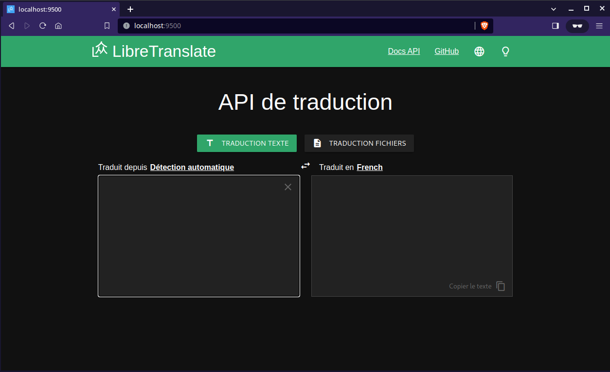
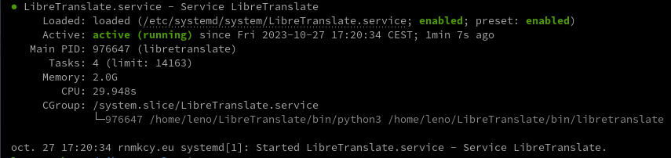
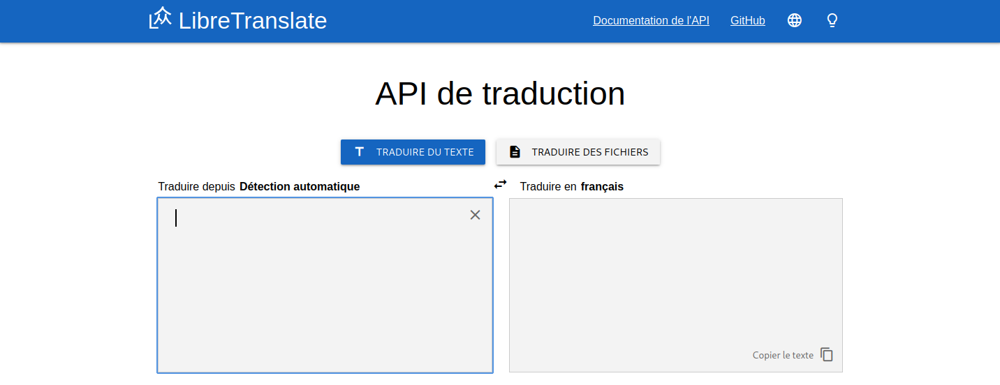

+++
title = 'LibreTranslate API de traduction'
date = 2024-01-12 00:00:00 +0100
categories = ['outils']
+++
*[LibreTranslate](https://libretranslate.com/) fournit une API de traduction open source. Auto-hébergeable, fonctionne offline, facile à mettre en place. LibreTranslate est écrit en python et utilise la librairie de traduction [argos](https://github.com/argosopentech/argos-translate/).*

{:.circle}

- [LibreTranslate via pip](#libretranslate-via-pip)
    - [Environnement virtuel libretranslate](#environnement-virtuel-libretranslate)
    - [Tester libretranslate](#tester-libretranslate)
- [LibreTranslate développement](#libretranslate-développement)
    - [Hatch - Debug et Test](#hatch---debug-et-test)
- [LibreTranslate reconstruit](#libretranslate-reconstruit)
    - [Cloner le dépôt](#cloner-le-dépôt)
    - [Python et dépendances](#python-et-dépendances)
    - [Créer un environnement Venv de Python 3](#créer-un-environnement-venv-de-python-3)
    - [Installer et tester libretranslate](#installer-et-tester-libretranslate)
- [LibreTranslate - Service et Proxy ngiginx](#libretranslate---service-et-proxy-ngiginx)
    - [Service systemd LibreTranslate](#service-systemd-libretranslate)
    - [Proxy nginx](#proxy-nginx)

**Liens**  

* [https://libretranslate.com](https://libretranslate.com/)
* [Framalibre traduction](https://framalibre.org/content/libretranslate)
* [Github LibreTranslate](https://github.com/LibreTranslate/LibreTranslate)

## LibreTranslate via pip

Vous pouvez exécuter votre propre serveur API avec seulement quelques lignes de configuration!

Assurez-vous que Python est installé (3.8 ou plus est recommandé)

Installation application web pour la traduction

Prérequis

    sudo apt install python3-pip python3-msgpack virtualenv

Mise à jour pip

    python3 -m pip install --upgrade pip

### Environnement virtuel libretranslate

Installer environnement virtuel

    pip3 install virtualenv

Créer un dossier 

    mkdir ~/LibreTranslate
    cd ~/LibreTranslate

Créer un environnement pour l'application

    virtualenv LibreTranslateDev

activer l'environnement virtuel  

    source LibreTranslateDev/bin/activate

On arrive sur un prompt `(LibreTranslateDev) bullsvm@vm-debian11:~/LibreTranslate$`

Mettre à jour pip dans l'environnement

    /home/bullsvm/LibreTranslate/LibreTranslateDev/bin/python -m pip install --upgrade pip

Installer libretranslate

    pip install libretranslate

### Tester libretranslate

    libretranslate [args]


Puis ouvrez un navigateur Web à http://localhost:5000

[How To Serve Flask Applications with Gunicorn and Nginx on Ubuntu 18.04](https://www.digitalocean.com/community/tutorials/how-to-serve-flask-applications-with-gunicorn-and-nginx-on-ubuntu-18-04)

## LibreTranslate développement

### Hatch - Debug et Test

dépôt <https://github.com/LibreTranslate/LibreTranslate.git>

Assurez-vous que Python est installé (3.8 ou plus est recommandé)

Prérequis

    yay -S python-pipx

Installez hatch pour gérer les dépendances des projets et exécuter les scripts dev

    pipx install hatch

```
  installed package hatch 1.7.0, installed using Python 3.11.5
  These apps are now globally available
    - hatch
⚠️  Note: '/home/yann/.local/bin' is not on your PATH environment variable. These apps
    will not be globally accessible until your PATH is updated. Run `pipx ensurepath` to
    automatically add it, or manually modify your PATH in your shell's config file (i.e.
    ~/.bashrc).
done! ✨ 🌟 ✨
[yann@yann-eos LibreTranslate]$ pipx ensurepath
Success! Added /home/yann/.local/bin to the PATH environment variable.

Consider adding shell completions for pipx. Run 'pipx completions' for instructions.

You will need to open a new terminal or re-login for the PATH changes to take effect.

Otherwise pipx is ready to go! ✨ 🌟 ✨
```

Sortir et réouvrir le terminal

Cloner le dépôt <https://github.com/LibreTranslate/LibreTranslate.git>

```bash
cd ~/media/dplus/python-dev/
git clone https://github.com/LibreTranslate/LibreTranslate.git
cd LibreTranslate
```

**Hatch** installera automatiquement les dépendances requises dans un environnement virtuel, et permettra le pré-engagement, qui fonctionnera avant chaque commit pour exécuter le formatage. Vous pouvez ignorer les vérifications avant engagement si nécessaire: 

    git commit --no-verify -m "Fix"

Exécuter le développement

    hatch run dev --debug

Veuillez patienter...

Puis ouvrez un navigateur web à <http://localhost:5000>

Vous pouvez également démarrer une nouvelle coquille dans un environnement virtuel avec libretranslate installé

```
hatch shell
libretranslate [args]
# Or
python main.py [args]
```

Vous pouvez toujours utiliser `pip install -e ".[test]"` directement si vous ne voulez pas utiliser hatch.

## LibreTranslate reconstruit 

### Cloner le dépôt

Cloner le dépôt LibreTranslate original <https://github.com/LibreTranslate/LibreTranslate.git>  
OU
Cloner le dépôt LibreTranslate modifié <https://gitea.xoyize.xyz/yako/LibreTranslate.git>

Se rendre dans le dossier utilisateur

```
    cd ~
    git clone https://github.com/LibreTranslate/LibreTranslate.git
#    rm -r LibreTranslate/{bin,chart}
#    rm LibreTranslate/pyvenv.cfg
```

### Python et dépendances

Installer python3

    sudo apt install python3

Installer les dépendances

    sudo apt install python3-venv cmake python3-dev

si vous prévoyez d'utiliser VirtualEnv (OPTIONNEL)

    sudo apt install virtualv python3-virtualenv

### Créer un environnement Venv de Python 3

Créer un environnement dans le dossier en utilisant Venv de Python 3

    python3 -m venv LibreTranslate

Activer l'environnement virtuel  

    source LibreTranslate/bin/activate

Votre invite de commande sera désormais préfixée avec le nom de votre environnement `(LibreTranslate) leno@rnmkcy:~$`

### Installer et tester libretranslate

Installer libretranslate

    cd ~/LibreTranslate
    pip install .

Veuillez patienter...
Tester

```
libretranslate         # sans arguments
libretranslate [args]  # avec arguments
```

Note le premier lancement construit les modèles de traduction, patienter quelques minutes...

```
Updating language models
Found 86 models
[...]
Downloading English → French (1.0) ...
[...]
Loaded support for 44 languages (86 models total)!
Running on http://127.0.0.1:5000
```

Puis ouvrir un navigateur Web localement <http://localhost:5000>  

Depuis un poste ayant un accès SSH au serveur

    ssh -L 9500:localhost:5000 leno@192.168.0.215 -p 55215 -i /home/yann/.ssh/lenovo-ed25519

Ouvrir un navigateur sur le client et saisir  localhost:9500  


## LibreTranslate - Service et Proxy ngiginx

### Service systemd LibreTranslate

Créer un service pour s'assurer que notre application fonctionne juste après le démarrage du système.

    sudo nano /etc/systemd/system/LibreTranslate.service

```
[Unit]
Description=libretranslate
 
[Service]
Type=exec
User=leno
WorkingDirectory=/home/leno/LibreTranslate
ExecStart=/home/leno/LibreTranslate/bin/libretranslate
Restart=on-failure
RestartSec=30s
 
# Optional hardening to improve security
ReadWritePaths=/home/leno/LibreTranslate
 
[Install]
WantedBy=multi-user.target
```

Le fichier d'unité, le fichier de configuration source ou les drop-ins de `LibreTranslate.service` ont changé sur le disque. Exécutez 'sudo systemctl daemon-reload' pour recharger les unités.

    sudo systemctl daemon-reload
    sudo systemctl start LibreTranslate

Activer le service

    sudo systemctl enable LibreTranslate

Status

    sudo systemctl status LibreTranslate



### Proxy nginx

Le fichier de configuration nginx `/etc/nginx/conf.d/traduction.conf`

```
server {
  listen  80;
  server_name traduction.lxcyan.local;
  
  location / { 
      proxy_pass              http://127.0.0.1:5000;
  } 

}
```

Pour un site https , fichier `/etc/nginx/conf.d/traduction.rnmkcy.eu.conf` 

```
server {
    listen 80;
    listen [::]:80;
    server_name  traduction.rnmkcy.eu;

    # redirect all plain HTTP requests to HTTPS
    return 301 https://traduction.rnmkcy.eu$request_uri;
}

server {
    # ipv4 listening port/protocol
    listen       443 ssl http2;
    # ipv6 listening port/protocol
    listen           [::]:443 ssl http2;
    server_name  traduction.rnmkcy.eu;

    include /etc/nginx/conf.d/security.conf.inc;

  location / { 
      proxy_pass              http://127.0.0.1:5000;
  } 

}
```

Vérifier nginx

    sudo nginx -t

Redémarrer nginx

    sudo systemctl reload nginx

Lien <https://traduction.rnmkcy.eu>  


