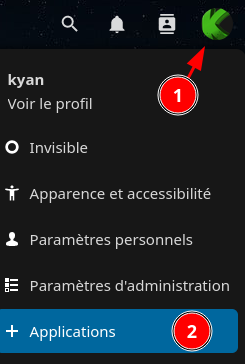
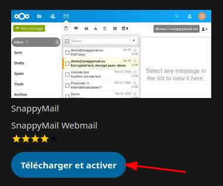
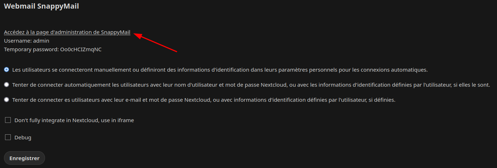

+++
title = 'snappymail'
date = 2024-01-12 00:00:00 +0100
categories = messagerie
+++
*Client de messagerie web simple, moderne, léger et rapide.  
Il s'agit d'un fork du très apprécié RainLoop, mais avec des changements massifs pour être compatible avec les navigateurs (mobiles) de 2020 et plus récents.*


## SnappyMail

{:height="80"}  
<https://github.com/the-djmaze/snappymail/tree/master>

### Considérations relatives à la sécurité

La meilleure pratique consiste à installer le webmail sur un serveur séparé, plutôt que sur le serveur de messagerie. Cela permet d'isoler et de segmenter les services et de renforcer considérablement la sécurité. Malgré l'approche plus renforcée de ce fork de RainLoop, PHP n'a pas un palmarès parfait ; par conséquent, diminuer la surface d'attaque par l'isolation/segmentation est considéré comme la meilleure pratique. De plus, cela permet d'augmenter l'évolutivité et la stabilité.

### Exigences

SnappyMail nécessite PHP 7.4 (ou une version plus récente) avec les extensions suivantes :

* mbstring
* Zlib
* json
* libxml
* dom

Extensions optionnelles :

* cURL
* exif (lorsque `image_exif_auto_rotate = On` et que GD est installé)
* gd, gmagick ou imagemagick (pour le redimensionnement et la rotation des images)
* gnupg (pour les emails cryptés/signés)
* iconv (utilisé uniquement pour `iconv_mime_encode` mais pas vraiment nécessaire non plus)
* intl (est utilisé pour les noms de domaine IDN, lorsqu'il n'est pas installé, une version PHP est utilisée)
* ldap (pour les contacts)
* openssl (pour un meilleur cryptage que XXTEA)
* PDO (MySQL/PostgreSQL/SQLite) (pour les contacts)
* redis (pilote de cache beta)
* Sodium (pour un cryptage encore meilleur que XXTEA et OpenSSL)
* Tidy (essaie de réparer la structure HTML des messages sortants)
* uuid (PECL)
* xxtea (PECL, pour être plus rapide que xxtea.php)
* zip (pour télécharger les pièces jointes au format zip)
Supported Browsers: Google Chrome 69+, Firefox 78+, Opera 100+, Safari 12+, Edge 79+

### XXTEA, OpenSSL et Sodium

Lorsque OpenSSL et/ou Sodium sont détectés, SnappyMail n'utilisera XXTEA que pour la migration depuis RainLoop.
Ensuite, il utilisera Sodium (dans le meilleur des cas) ou OpenSSL pour crypter les données sécurisées.
Il est conseillé de toujours utiliser OpenSSL, puis Sodium si disponible.


## Installation

### SSH

```sh
# Allez dans le répertoire où vous voulez installer le logiciel
cd /var/www/webmail/snappymail
# Télécharger et extraire
wget https://snappymail.eu/repository/latest.tar.gz
tar -xzf latest.tar.gz
# Définir les autorisations
find /var/www/webmail/snappymail -type d -exec chmod 755 {} \;
find /var/www/webmail/snappymail -type f -exec chmod 644 {} \;
chown -R www-data:www-data /var/www/webmail/snappymail
```

### FTP

1. Téléchargez la dernière version [depuis la page des versions](https://github.com/the-djmaze/SnappyMail/releases).
3. Téléchargez le contenu du répertoire à la racine du document du (sous-)domaine qui sert le webmail.

4. Vous pouvez ensuite définir les permissions et le propriétaire corrects via le shell, par exemple :

```
find /home/user/public_html/snappymail -type d -exec chmod 755 {} \;
find /home/user/public_html/snappymail -type f -exec chmod 644 {} \;
chown -R user:user /home/user/public_html/snappymail
```

## Accés page administration

Ouvrez l'interface d'administration `https://example.com/?admin` pour configurer les paramètres de votre serveur de messagerie. Connectez-vous avec l'utilisateur "admin" et le mot de passe du fichier ``/var/www/webmail/data/_data_/_default_/admin_password.txt``. Si vous avez des problèmes pour appeler l'interface d'administration, essayez de le faire en mode privé de votre navigateur. De cette façon, les cookies et autres données mises en cache lors d'installations précédentes sont ignorés.

### Mot de passe admin

Le fichier de mot de passe est créé après l'ouverture de l'interface d'administration !  
Assurez-vous de changer immédiatement le mot de passe par défaut !  après avoir changé le mot de passe par défaut, le fichier `admin_password.txt` est supprimé.


```
www.yourdomain.com/webmail?admin
```

### Sécuriser le dossier data

Vous pouvez déplacer le dossier `data` hors de l'accès public HTTP pour des raisons de sécurité.

1. Renommez /var/www/webmail/_include.php en /var/www/webmail/include.php.
2. Editez include.php et mettez-y le nouveau APP_DATA_FOLDER_PATH. Par exemple :

```php
/**
 * Custom 'data' folder path
 */
//define('APP_DATA_FOLDER_PATH', dirname(__DIR__) . '/snappymail-data/');
//define('APP_DATA_FOLDER_PATH', '/var/external-snappymail-data-folder/');
define('APP_DATA_FOLDER_PATH', '/var/lib/snappymail/');
```

### Vérification GPG

La clé GPG permettant de vérifier un paquet peut être trouvée à plusieurs endroits :

* https://keyserver.ubuntu.com Hockeypuck OpenPGP keyserver
https://keyserver.ubuntu.com/pks/lookup?op=get&search=0x1016e47079145542f8ba133548208ba13290f3eb
* https://snappymail.eu/repository/deb/48208BA13290F3EB.asc
* https://github.com/the-djmaze/snappymail/blob/master/build/SnappyMail.asc

## Mise à jour

Pour mettre à jour l'installation, il suffit de télécharger les fichiers du nouveau paquet en écrasant les fichiers existants. La structure des répertoires est organisée de manière à ce que chaque nouvelle version soit installée dans un répertoire différent. Seuls quelques fichiers seront écrasés (/index.php et /data/VERSION).

Toute la reconfiguration supplémentaire sera effectuée par le produit lors de la prochaine exécution.

Lorsque tout fonctionne, vous pouvez supprimer toute ancienne version qui réside dans /snappymail/v/.

## Migration/mise à niveau depuis RainLoop

SnappyMail est un remplacement semi-intégral de RainLoop.  En raison de changements dans le code de gestion des plugins/extensions, la plupart des plugins de RainLoop ne sont pas compatibles, vous devrez donc les remplacer par des équivalents provenant de ce dépôt SnappyMail, ou s'il s'agit de plugins personnalisés, modifier le code pour qu'il soit compatible avec SnappyMail.  Voir le répertoire des plugins dans ce dépôt pour des exemples afin de déterminer la meilleure façon de modifier vos plugins personnalisés pour qu'ils fonctionnent avec SnappyMail.

Si vous avez très peu de plugins activés, vous pouvez vous attendre à un temps d'arrêt minimal suite à cette migration. S'il y en a beaucoup, cela peut prendre plusieurs heures pour les remplacer tous par du code compatible.

Pour les fichiers de noms de domaine, le format .INI a été mis à jour en JSON, mais la comparaison des exemples devrait rendre cette opération assez simple puisque les mots-clés utilisés dans les fichiers .INI sont nommés de la même manière que les clés dans les fichiers .JSON correspondants.

1. Sauvegardez votre répertoire et votre base de données RainLoop (c'est essentiel en cas de problèmes lors de la migration).
2. Dans l'administration de RainLoop, notez chaque plugin activé et vérifiez qu'un [équivalent SnappyMail existe ici](https://github.com/the-djmaze/snappymail/tree/master/plugins). Si vous avez des plugins pour lesquels il n'y a pas d'équivalent, vous devrez écrire ce code ou engager un développeur pour le faire avant de continuer.
3. Extraire la dernière version de SnappyMail par dessus la structure de votre dossier RainLoop (le dossier de données n'est pas touché).
4. Naviguez jusqu'à `data/_data_/_default`

[Reference Issue](https://github.com/the-djmaze/snappymail/issues/271)

## Integrations

### Arch Linux

<https://aur.archlinux.org/packages/snappymail>

### Debian / Devuan

Le dépôt se trouve à l'adresse https://snappymail.eu/repository/deb/

Pour l'utiliser, procédez comme suit
1. `mkdir -p /usr/share/keyrings/`
2. `wget -O- https://snappymail.eu/repository/deb/48208BA13290F3EB.asc | gpg --dearmor > /usr/share/keyrings/snappymail.gpg`
3. Créez `cat /etc/apt/sources.list.d/snappymail.list` avec la ligne suivante.
```
deb [signed-by=/usr/share/keyrings/snappymail.gpg] https://snappymail.eu/repository/deb ./
```
4. `apt update`
5. `apt install snappymail`

Des informations sont également disponibles à l'adresse suivante : https://github.com/the-djmaze/snappymail/issues/185

### YunoHost

https://github.com/YunoHost-Apps/snappymail_ynh

## Configuration du serveur web

### Nginx

```
###
# Redirect non-secure (unencrypted) HTTP to the more secure (encrypted) HTTPS
server {
	listen 80 default_server;
	listen [::]:80 default_server;
	server_name _;
	return 301 https://$host$request_uri;
}

###
# Actual domain configuration
server {
	###
	# TLS for the win!
	listen 443 ssl http2;
	listen [::]:443 ssl http2;

	###
	# Domain name
	server_name webmail.example.com;

	###
	# SSL configuration
	ssl_certificate /etc/letsencrypt/live/webmail.example.com/fullchain.pem;
	ssl_certificate_key /etc/letsencrypt/live/webmail.example.com/privkey.pem;
	ssl_protocols TLSv1.2 TLSv1.3;
	ssl_ciphers "ECDHE-ECDSA-CHACHA20-POLY1305:ECDHE-RSA-CHACHA20-POLY1305:DHE-RSA-CHACHA20-POLY1305:AES-256-GCM-SHA384:EECDH+AESGCM:EDH+AESGCM";
	ssl_ecdh_curve secp521r1:secp384r1;
	ssl_session_timeout  10m;
	ssl_session_cache    shared:SSL:10m;
	ssl_session_tickets off;
	ssl_prefer_server_ciphers on;

	###
	# Security headers
	add_header Strict-Transport-Security "max-age=15768000; includeSubDomains; preload;" always;
	add_header X-Content-Type-Options "nosniff" always;
	add_header X-XSS-Protection "1; mode=block" always;
	add_header X-Robots-Tag "none" always;
	add_header X-Download-Options "noopen" always;
	add_header X-Permitted-Cross-Domain-Policies "none" always;
	add_header Referrer-Policy "no-referrer" always;
	add_header X-Frame-Options "SAMEORIGIN" always;
	fastcgi_hide_header X-Powered-By;

	###
	# GZIP / compression settings
	gzip on;
	gzip_vary on;
	gzip_comp_level 4;
	gzip_min_length 256;
	gzip_proxied expired no-cache no-store private no_last_modified no_etag auth;
	gzip_types application/atom+xml application/javascript application/json application/ld+json application/manifest+json application/rss+xml application/vnd.geo+json application/vnd.ms-fontobject application/x-font-ttf application/x-web-app-manifest+json application/xhtml+xml application/xml font/opentype image/bmp image/svg+xml image/x-icon text/cache-manifest text/css text/plain text/vcard text/vnd.rim.location.xloc text/vtt text/x-component text/x-cross-domain-policy;

	###
	# Define the document root
	root /var/www/webmail;
	index index.php;

	client_max_body_size 50M;

	###
	# Forbid access to dotfiles
	location ~ (^|/)\. {
		return 403;
	}

	###
	# The actual root location
	location / {
                try_files $uri $uri/ /index.php?$args;
	}

	###
	# Last but not least, the PHP-FPM settings
	location ~* \.php$ {
		fastcgi_pass    unix:/run/php-fpm.sock;
		include         fastcgi_params;
		fastcgi_param   SCRIPT_FILENAME    $document_root$fastcgi_script_name;
		fastcgi_param   SCRIPT_NAME        $fastcgi_script_name;
	}

}
```

## SnappyMail Nextcloud

**snappymail-nextcloud** est un plugin pour Nextcloud permettant d'utiliser l'excellent webmail SnappyMail (https://snappymail.eu/).

### Installer plugin

Démarrez dans Nextcloud en tant qu'utilisateur avec des droits d'administrateur et cliquez sur le bouton "+ Applications" dans le menu déroulant du coin supérieur droit :

{:width="150"}

Ensuite, activez le plugin SnappyMail que vous trouverez dans la section "Social & communication" :

{:width="400"}

Après validation par "admin" et une courte attente, SnappyMail est installé. Maintenant vous devez le configurer avant de l'utiliser : ouvrez le panneau d'administration de Nextcloud (menu déroulant en haut à droite -> **Paramètres administration**), dans la section **"Administration"** -> **"Paramètres supplémentaires"**  et Webmail SnappyMail  

Pour entrer dans la zone d'administration de SnappyMail, vous devez être administrateur Nextcloud (vous serez donc connecté automatiquement) ou bien utiliser les identifiants d'administration.
{: .prompt-info }



A partir de là, tous les paramètres de SnappyMail à l'échelle de l'instance peuvent être modifiés comme vous le souhaitez. Un point important est la section "Domaines" où vous devez configurer les paramètres IMAP/SMTP qui seront associés aux adresses email de vos utilisateurs. En gros, si un utilisateur de l'instance Nextcloud démarre SnappyMail et met "firstname@domain.tld" comme adresse email, alors SnappyMail devrait savoir comment se connecter à l'IMAP & SMTP de domain.tld. Vous pouvez renseigner ces informations dans la section "Domaines" des paramètres d'administration de SnappyMail. 


## Intégrations d'applications

### Contacts

SnappyMail se connecte automatiquement à l'application de contacts Nextcloud. Téléchargez et installez l'application [contacts app](https://apps.nextcloud.com/apps/contacts) pour SnappyMail afin d'avoir accès à tous les utilisateurs enregistrés sur le système Nextcloud, ainsi qu'aux contacts personnels des utilisateurs sauvegardés ici.

## Les paramètres de SnappyMail, où sont-ils ?

SnappyMail pour Nextcloud est hautement configurable. Mais les paramètres sont disponibles à plusieurs endroits et cela peut être trompeur pour les nouveaux utilisateurs.

### Paramètres d'administration de SnappyMail

Les paramètres d'administration de SnappyMail ne sont accessibles que par l'administrateur Nextcloud. Ouvrez le panneau d'administration Nextcloud ("Admin" dans le menu déroulant en haut à droite) et allez à "Paramètres supplémentaires". Cliquez ensuite sur le lien "Go to SnappyMail Webmail admin panel". Vous pouvez également utiliser le lien suivant : https://path.to.nextcloud/index.php/apps/snappymail/?admin.

Les paramètres d'administration de SnappyMail comprennent tous les paramètres qui s'appliquent à tous les utilisateurs de SnappyMail (règles de connexion par défaut, image de marque, gestion des plugins, règles de sécurité et domaines).

### Paramètres de l'utilisateur SnappyMail

Chaque utilisateur de SnappyMail peut également modifier les comportements spécifiques à l'utilisateur dans les paramètres utilisateur de SnappyMail. Les paramètres utilisateur de SnappyMail se trouvent dans SnappyMail en cliquant sur le bouton utilisateur (dans le coin supérieur droit de SnappyMail) et en choisissant "Paramètres" dans le menu déroulant.

Les paramètres utilisateur de SnappyMail comprennent la gestion des contacts, des comptes de messagerie, des dossiers, de l'apparence et d'OpenPGP.

### La spécificité des comptes utilisateurs de SnappyMail

Le plugin transmet les informations de connexion de l'utilisateur à l'application SnappyMail qui crée et gère les comptes utilisateurs. Les comptes dans SnappyMail sont basés uniquement sur les comptes email authentifiés, et ne prennent pas en compte l'utilisateur nextcloud qui les a créés en premier lieu. Si deux utilisateurs Nextcloud ou plus ont le même compte email dans des paramètres supplémentaires, ils partageront en fait le même "compte email" dans SnappyMail, y compris tous les comptes email supplémentaires qu'ils peuvent avoir ajoutés par la suite à leur compte principal. Ceci doit être gardé à l'esprit dans le cas où plusieurs utilisateurs ont le même compte e-mail mais peuvent être tentés d'ajouter des comptes supplémentaires à leur SnappyMail.

