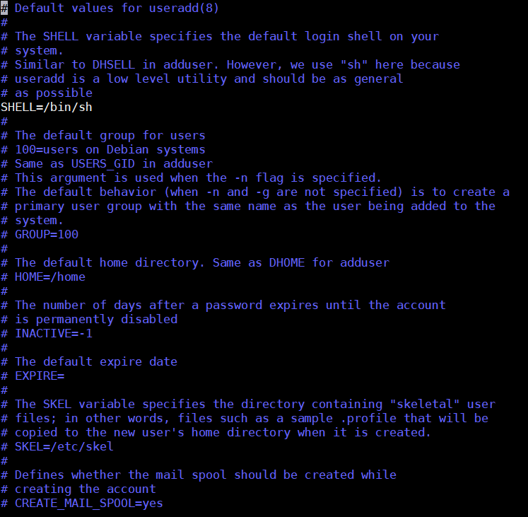
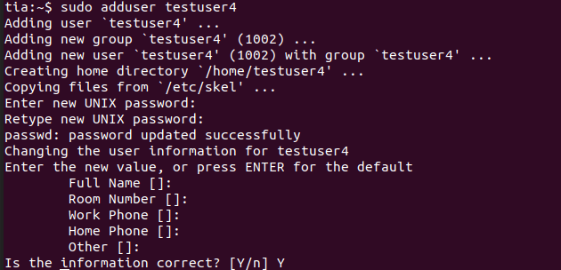
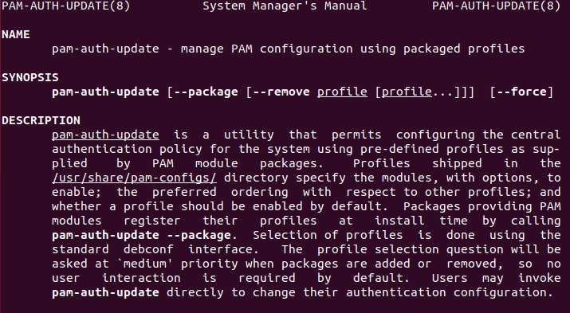
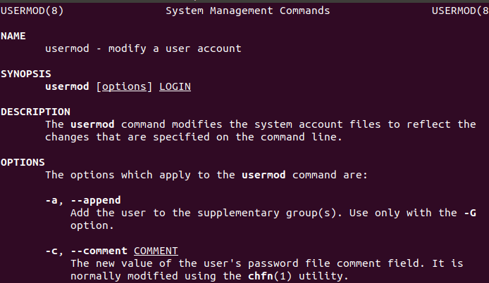
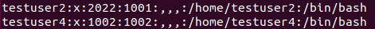
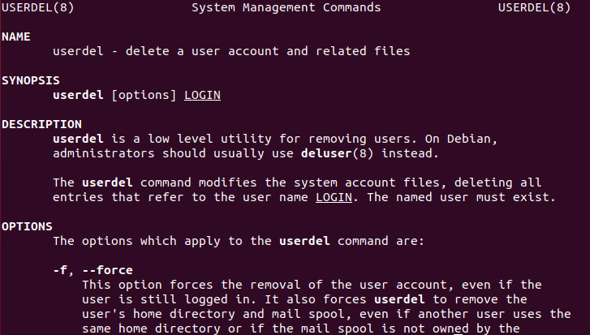

+++
title = 'Linux, gestion des utilisateurs ,permissions des fichiers et répertoires d’un serveur web'
date = 2024-02-20 00:00:00 +0100
categories = ['archlinux', 'cli']
+++
*gestion des utilisateurs et des permissions d'un serveur web*


# Gérer les utilisateurs à partir de la ligne de commande sous Linux

L'une des responsabilités principales de l'administration Linux est la gestion des utilisateurs. Grâce à l’utilisation de la ligne de commande, la création d’utilisateur peut être complétée à distance ou par programme. Une fois que vous avez créé un utilisateur, vous pouvez ensuite l'ajouter à des groupes ou leur attribuer des privilèges plus élevés. De plus, vous pouvez garder une trace d'audit sur ce qui a été fait sur votre serveur et sur tout problème potentiel.

Si vous avez développé un logiciel ou programmé pour le Web, vous connaissez peut-être la politique de ne jamais faire confiance aux utilisateurs. Le même principe s’applique dans d’autres domaines de l’utilisation des ordinateurs en ce qui concerne la participation des utilisateurs. Ne donnez accès qu'à ceux qui en ont besoin et quand ils en ont besoin. Une délégation généreuse de privilèges pourrait permettre un accès non spécifié et non autorisé aux informations et aux données de base de tiers.
Voir les utilisateurs existants

L'un des moyens les plus rapides de visualiser les utilisateurs consiste à utiliser les commandes cat (concaténer) ou more (pager) pour afficher la liste des utilisateurs du système. Le fichier que vous devez afficher est le fichier «/ etc / passwd». Ce fichier stocke tous les comptes d'utilisateur et les informations de connexion de l'utilisateur.

    sudo cat /etc/passwd 

### Utilisation de la commande useradd

`useradd` est un binaire de bas niveau disponible sur la plupart des distributions. Cette commande est généralement moins utilisée en raison de son caractère moins convivial et intuitif par rapport à la commande `adduser` . Cependant, il y a très peu de différences et l'une ou l'autre peut être utilisée.

Pour en savoir plus sur useradd, exécutez la commande man ou ajoutez --help pour obtenir un aperçu rapide.

    man useradd
    useradd --help 

```bash
Usage: useradd [options] LOGIN
       useradd -D
       useradd -D [options]

Options:
  -b, --base-dir BASE_DIR       base directory for the home directory of the
                                new account
      --btrfs-subvolume-home    use BTRFS subvolume for home directory
  -c, --comment COMMENT         GECOS field of the new account
  -d, --home-dir HOME_DIR       home directory of the new account
  -D, --defaults                print or change default useradd configuration
  -e, --expiredate EXPIRE_DATE  expiration date of the new account
  -f, --inactive INACTIVE       password inactivity period of the new account
  -g, --gid GROUP               name or ID of the primary group of the new
                                account
  -G, --groups GROUPS           list of supplementary groups of the new
                                account
  -h, --help                    display this help message and exit
  -k, --skel SKEL_DIR           use this alternative skeleton directory
  -K, --key KEY=VALUE           override /etc/login.defs defaults
  -l, --no-log-init             do not add the user to the lastlog and
                                faillog databases
  -m, --create-home             create the user's home directory
  -M, --no-create-home          do not create the user's home directory
  -N, --no-user-group           do not create a group with the same name as
                                the user
  -o, --non-unique              allow to create users with duplicate
                                (non-unique) UID
  -p, --password PASSWORD       encrypted password of the new account
  -r, --system                  create a system account
  -R, --root CHROOT_DIR         directory to chroot into
  -P, --prefix PREFIX_DIR       prefix directory where are located the /etc/* files
  -s, --shell SHELL             login shell of the new account
  -u, --uid UID                 user ID of the new account
  -U, --user-group              create a group with the same name as the user

```

Pour ajouter un utilisateur à l'aide de `useradd` , tapez useradd et le nom du login que vous souhaitez créer.

    sudo useradd --create-home testuser

Dans le cas ci-dessus, l'utilisateur “testuser” sera créé. Par défaut, cette commande ne créera que l'utilisateur et rien d'autre. Si vous avez besoin d'un répertoire de base pour cet utilisateur, ajoutez l'indicateur `--create-home` pour créer le répertoire de base de l'utilisateur.

### Utilisation de la commande adduser

La commande `adduser` est un script Perl qui créera l'utilisateur de la même façon que la commande useradd . La différence réside dans le fait qu’il s’agit d’une commande interactive qui vous invitera à définir le mot de passe, le chemin du répertoire personnel, etc. Notez que sur certaines distributions, telles que Red Hat et CentOS, adduser est un lien symbolique vers useradd, et Sur d'autres distributions comme Arch Linux, adduser est fourni sous forme de paquet qui n'est pas installé par défaut.

L'utilisation de cette commande créera un groupe pour l'utilisateur en utilisant son identifiant par défaut. Les autres valeurs par défaut se trouvent généralement dans le fichier useradd à l’adresse "/etc/default".

Dans ce fichier, vous pouvez modifier les paramètres par défaut pour les utilisateurs créés avec useradd, tels que le shell et le répertoire de base.

{:width="500"}

Exécutez la commande `adduser` suivante:

    sudo adduser testuser 

{:width="500"}

Cela vous indiquera les valeurs par défaut que vous souhaitez définir et vous demandera le mot de passe.

### Mots de passe et sécurité

L'ajout d'un mot de passe pour un utilisateur nécessitera l'exécution de la commande `passwd`.

    sudo passwd testuser 

Sans les privilèges de super-utilisateur, exécuter passwd ne changera que le mot de passe de l'utilisateur connecté. Cette commande testera la complexité du mot de passe. Sous Ubuntu, les exigences en matière de mot de passe sont définies dans le fichier de mot de passe commun situé dans «/ec/pam.d». Pour plus d'informations sur la mise à jour de la complexité, reportez-vous à la page de manuel relative à pam-auth-update.

{:width="500"}

### Mise à jour des informations utilisateur

Une fois qu'un utilisateur est sur le système, vous pouvez consulter le fichier «/etc/passwd» pour afficher les informations de l'utilisateur et le mot de passe crypté. Si vous devez apporter des modifications à un utilisateur, vous devrez utiliser la commande `usermod` .

{:width="500"}

Par exemple, pour modifier l'ID utilisateur du compte testuser4 créé ci-dessus, exécutez la commande suivante:

    sudo usermod -u 2022 testuser2 

Vous pouvez ensuite examiner les modifications dans le fichier «/etc/passwd».



>Veillez à ne pas modifier les informations critiques telles que le nom de connexion ou, comme dans ce cas, l'ID utilisateur. Consultez la page de manuel de usermod pour savoir ce que vous devrez faire si ces éléments sont modifiés.

### Ajout d'utilisateurs au groupe

Il arrive parfois que vous deviez ajouter des utilisateurs à un groupe afin qu'ils disposent des autorisations nécessaires pour exécuter certaines tâches.

Pour ajouter un utilisateur à un groupe:

    sudo usermod -a -G groupname username

>Notez que l'indicateur -a est nécessaire pour «ajouter» le groupe à l'utilisateur. Sinon, vous risquez de retirer l'utilisateur du groupe «sudo» s'il est supposé avoir l'autorisation de superutilisateur.

Vous pouvez également utiliser la commande `gpasswd` pour ajouter/supprimer un utilisateur au/du groupe.

    sudo gpasswd -a username groupname 

Pour supprimer un utilisateur d'un groupe:

    sudo gpasswd -d username groupname 

Vérifier les utilisateurs d'un groupe , exemple groupe users

    grep "users" /etc/group

### Suppression d'utilisateurs

Comme pour les autres commandes utilisateur, la suppression d'un utilisateur est précédée de «user» et de l'action. Dans ce cas, vous devrez utiliser la commande `userdel` 

{:width="500"}

Prenez note que `userdel` ne supprimera pas un utilisateur s'il existe des processus utilisant son compte.

    sudo userdel testuser4 

### Affichage des journaux utilisateurs

Selon votre distribution, vous pourrez consulter le journal d'authentification ou le journal sécurisé situé dans «/var/log» pour vérifier les identifiants de connexion des utilisateurs. Ce fichier journal vous donnera les identifiants sur votre système dès qu'ils se produisent. Il s’agit d’un élément essentiel de la surveillance des événements en cas de violation et du simple fait de s’assurer que tout fonctionne comme prévu.

    sudo tail /var/log/auth.log

La gestion des utilisateurs est un élément crucial de la gestion des serveurs Linux si plusieurs personnes utilisent votre système. L'utilisation de la ligne de commande vous permettra d'administrer rapidement les utilisateurs et de disposer d'un historique de création et de modification de compte. L'une des meilleures utilisations serait peut-être d'automatiser la création à l'aide d'un script shell si plusieurs comptes sont nécessaires à la fois.

Dans les deux cas, veillez à consulter régulièrement vos comptes et à supprimer les comptes devenus inutiles. Assurez-vous que l'accès n'est accordé qu'à ceux qui en ont actuellement besoin et surveille fréquemment vos journaux. 

## Permissions des fichiers et répertoires d’un serveur web

* [Permissions des fichiers et répertoires d’un serveur web (**Article original**)](https://tech.feub.net/2014/06/permissions-des-fichiers-et-repertoires-dun-serveur-web/)

Un serveur HTTP peut contenir plusieurs sites, les fichiers de ceux-ci peuvent être gérés par plusieurs utilisateurs, un utilisateur A ayant accès aux fichiers du site A, mais pas à ceux du site B, alors qu’un utilisateur C, aura accès aux fichiers des site A, B et C par exemple.

Ce qui suit ne s’adresse pas à un type de serveur particulier, mais suppose une machine GNU/Linux et un serveur Nginx ou Apache.

### Les permissions

Normalement sous Linux, lorsqu’un fichier est créé, il hérite du groupe de l’utilisateur qui l’a créé. Dans le cas de fichiers et répertoires relatifs à un serveur web, il est préférable que lorsqu’un fichier est créé il hérite du groupe du répertoire parent (en général `/var/www`), pour faire ceci il faut activer le bit [SGID](#droit-sgid) (Set Group ID) du répertoire parent.
Pour se rafraichir un peu les neurones au niveau du concept de permissions sous Linux, voir [ce billet](http://feub.net/2008/03/setuid-setgid-et-sticky-bit/).

D’un autre coté, pour travailler convenablement avec ses collaborateurs, il faut prendre soin de modifier le [umask](https://fr.wikipedia.org/wiki/Umask), le masque de création de fichier par l’utilisateur, qui est général placé à `022` par défaut, c’est-à-dire que lorsqu’un fichier est créé il aura comme permissions `755`, ce fichier n’étant pas éditable par le groupe. Changer le umask en `002` va placer les permissions d’un nouveau fichier en `775`.

### Principes de base

Dans un fonctionnement typique, nous voulons que les utilisateurs aient le droit de lire et écrire sur les fichiers. Ils doivent également avoir le droit d’exécution sur les répertoires, ce droit permettant à un utilisateur de traverser un répertoire, donc de lister ce qu’il contient.
De son coté le serveur web doit pouvoir lire et exécuter les fichiers. A noter qu’il n’a pas besoin d’avoir le droit d’exécution x car ceci ne s’applique en général qu’aux binaires, or un script PHP est un fichier texte interprété. Le serveur HTTP doit également pouvoir lire et « exécuter » les répertoires (entendre: il doit pouvoir les traverser). Enfin certains répertoires peuvent avoir le droit d’écriture pour donner le droit d’uploader des fichiers par exemple.

### Configuration

La configuration sera la suivante : un groupe par site sera créé, les utilisateurs seront ajoutés aux groupes désirés afin d’y avoir accès et tous les fichiers et répertoires appartiendront à l’utilisateur root. La notion d’utilisateur n’étant plus importante dans notre cas, on ne fait qu’accroitre la sécurité du serveur web en attribuant la propriété des fichiers à l’utilisateur root (on est certain qu’aucun utilisateur du système n’aura les privilèges de modifier ces fichiers).

Voici un exemple qui peut servir de base :

*    On ajoute un groupe pour le site A :

    groupadd www-site-a

*    On fait de même pour le site B :

    groupadd www-site-b

*    On ajoute le groupe www-site-a à l’utilisateur A :

    usermod -a -G www-site-a usera

*    On ajoute le groupe www-site-b à l’utilisateur B :

    usermod -a -G www-site-b userb

*    Suivant l’exemple du début, on ajoute ces deux groupes à l’utilisateur C :

    usermod -a -G www-site-a userc
    usermod -a -G www-site-b userc

A ce stade on peut simplement vérifier les groupes des utilisateurs :

    groups userc
    userc : userc www-site-a www-site-b

*    On change les permissions de tous les fichiers et répertoires recursivement pour chaque site :

    chown -R root:www-site-a /var/www/site-a
    chown -R root:www-site-b /var/www/site-b

*    Tous les répertoires doivent avoir les droits `2775` ([Sticky Bit](#sticky-bit)) :

    find /var/www -type d -exec chmod 2775 {} +

*    Tous les fichiers eux doivent être en 0664 :

    find /var/www -type f -exec chmod 0664 {} +

Pour finir, il faut changer le umask en 0002, cela diffère suivant le système. Sous Debian 7.4 ou Fedora 20, il est possible de changer la ligne UMASK du fichier /etc/login.defs.

### Note sur les dangers du chmod 777

Un fichier ayant les droits 777 est accessible par tous les utilisateurs, n’importe lequel peut modifier et supprimer ce fichier. Ceci reste local aux utilisateurs existants sur la machine, c’est une question de confiance aux collègues. Plus important, des fichiers en 777 sont également modifiables par le serveur web lui-même, donc toute faille dans un script peut être catastrophique, une régle de base est de n’accorder qu’une confiance minimum à tout script, car aucun programme n’est à l’abri d’une vulnérabilité.

## Permissions UNIX (wikipédia)

* [Permissions UNIX (wikipédia FR)](https://fr.wikipedia.org/wiki/Permissions_UNIX)

### Droit SGID

**Fichiers**  
Ce droit fonctionne comme le droit SUID, mais appliqué aux groupes. Il donne à un utilisateur les droits du groupe auquel appartient le propriétaire de l'exécutable et non plus les droits du propriétaire.

**Répertoires**  
Ce droit a une tout autre utilisation s'il est appliqué à un répertoire. Normalement, lorsqu'un fichier est créé par un utilisateur, il en est propriétaire, et un groupe par défaut lui est appliqué (généralement users si le fichier a été créé par un utilisateur, et root ou wheel s'il a été créé par root). Cependant, lorsqu'un fichier est créé dans un répertoire portant le droit SGID, alors ce fichier se verra attribuer par défaut le groupe du répertoire. De plus, si c'est un autre répertoire qui est créé dans le répertoire portant le droit SGID, ce sous-répertoire portera également ce droit.

**Notation**  
Comme le droit SUID, il vient remplacer le flag x, mais celui des droits du groupe, et la capitale indique le droit d'exécution x caché, elle est présente s'il n'est pas alloué.

     ------s---  ou  ------S---

Un fichier avec les droits

     -rwxr--r--

auquel on ajoute le droit SGID aura donc la notation

     -rwxr-Sr--

**Valeur**  
Le droit SGID possède la valeur octale 2000.  
Exemple : `- r w x r - S r - -` correspond à 2744.  

### Sticky Bit

Ce droit (traduction bit collant) est utilisé pour manier de façon plus subtile les droits d'écriture d'un répertoire. En effet, le droit d'écriture signifie que l'on peut créer et supprimer les fichiers de ce répertoire. Le sticky bit permet de faire la différence entre les deux droits.

**Définition**  
Lorsque ce droit est positionné sur un répertoire, il interdit la suppression d'un fichier qu'il contient à tout utilisateur autre que le propriétaire du fichier. Néanmoins, il est toujours possible pour un utilisateur possédant les droits d'écriture sur ce fichier de le modifier (par exemple de le transformer en un fichier vide). La création de nouveaux fichiers est toujours possible pour tous les utilisateurs possédant le droit d'écriture sur ce répertoire. Remarquons que c'est le même principe que les pages de Wikipédia, elles sont modifiables mais on ne peut pas les supprimer.

Pour les fichiers, l'utilisation est tout autre. Le bit collant (sticky bit) indique alors que ce fichier doit encore rester en mémoire vive après son exécution. Le but était, à l'époque, d'améliorer les performances en évitant de charger/décharger un fichier de la mémoire (par exemple, un exécutable ou une bibliothèque logicielle). Le terme sticky (collant) voulait dire que le fichier restait collé en mémoire. Cette fonctionnalité n'est toutefois gérée que sur un faible nombre de systèmes Unix comme HP-UX. Aucune version de Linux ne gère cette fonctionnalité du sticky bit.

**Notation**  
Son flag est le t ou T, qui vient remplacer le droit d'exécution x des autres utilisateurs que le propriétaire et ceux appartenant au groupe du fichier, de la même façon que les droits SUID et SGID. La capitale fonctionne aussi de la même façon, elle est présente si le droit d'exécution x caché n'est pas présent.

     ---------t ou ---------T

Un fichier avec les droits

     -rwxr-xr-x

auquel on ajoute le droit sticky bit aura donc la notation

     -rwxr-xr-t

**Valeur**  
Le droit sticky bit possède la valeur octale 1000.  
Exemple : `- r w x r - x r - t` correspond à 1755.  
Exemple d'utilisation  

Sur certains systèmes UNIX, le sticky bit est utilisé pour le répertoire /tmp, qui doit être accessible en écriture par tous les utilisateurs, sans que ceux-ci se suppriment leurs fichiers les uns les autres :

     drwxrwxrwt   86 root root  20480 tmp

## Modifier Utilisateur Répertoire et Groupe

en mode sudo, modifier le fichier de configuration `sshd_config` pour autoriser la connexion en root

    sudo -s
    echo "PermitRootLogin yes" >> /etc/ssh/sshd_config
    systemctl restart sshd 
    ssh root@vps-hostname

### Modifier utilisateur

Linux fournit un outil nommé `usermod` spécifiquement pour faire des modifications aux comptes d'utilisateurs. Dans ce cas, nous l'utilisons pour renommer un compte utilisateur, ce qui est fait en utilisant le drapeau `-l`.

    /usr/sbin/usermod -l debian ustarter

L'indicateur `-l` ne changera que le nom de l'utilisateur. Toutes les autres choses attachées à l'utilisateur ne seront pas affectées, comme le répertoire personnel et l'UID.
{: .prompt-warning }

#### Changer répertoire d'origine 

Pour modifier le répertoire d'origine de l'utilisateur, nous utilisons à nouveau la commande `usermod`. Cependant, cette fois, nous devons effectuer deux actions : changer le répertoire personnel en un nouveau chemin et déplacer le contenu de l'ancien chemin vers le nouveau.

Nous définissons le chemin du nouveau répertoire personnel en utilisant l'option `-d` ou `--home` avec le chemin du nouveau répertoire. Nous devons également utiliser l'option `-m` pour copier le contenu de l'ancien répertoire personnel dans le nouveau.

    /usr/sbin/usermod -d /home/ustarter -m debian 

### Renommer groupe d'un utilisateur

Chaque utilisateur sur un système Linux est créé avec un groupe du même nom. Lorsque nous changeons le nom d'un utilisateur, le nom de son groupe reste inchangé. C'est une bonne idée de changer également le nom du groupe primaire de l'utilisateur.

Pour changer le nom du groupe primaire d'un utilisateur, nous utilisons la commande `groupmod` avec l'option `-n`. Nous devons fournir l'ancien nom et un nouveau nom.

    /usr/sbin/groupmod -n debian ustarter

### En une ligne de commande

Pour changer l'utilisateur 'debian' en 'ustarter'.

    groupadd ustarter; usermod -d /home/ustarter -m -g ustarter -l ustarter debian

Cela change le nom, le groupe, le répertoire d'origine et la propriété et le groupe de ce répertoire pour les nouveaux, ainsi que tous les fichiers. Vous vous retrouvez avec un utilisateur qu'il est impossible de distinguer de celui qui a été créé à l'origine sous le nom de "ustarter".

## Renommer utilisateur, groupe et home

### Préambule

Pour pouvoir renommer un utilisateur, il faut que celui-ci ne soit pas connecté. De plus, il faut s'assurer qu'aucun processus ou aucune tache ne s'exécute en son nom. Bien entendu, toutes les opérations décrites dans ce tutorial devront être exécutées dans un terminal en mode administrateur (root).

### Modification du groupe

Nous allons tout d'abord modifier le nom du groupe correspondant à l'utilisateur. Par défaut, un utilisateur a un groupe qui porte son nom, nous souhaitons donc le renommer également. Pour cela, il faut exécuter la commande :
Source code	   

    groupmod -n <nouveau-nom> <ancien-nom>

Pour se convaincre que la modification a bien été effectuée, on peut vérifier que le dossier personnel de l'utilisateur (/home/<nom-de-l'utilisateur>) appartient bien au groupe renommé.

### Modification nom utilisateur

La commande de modification du nom de l'utilisateur est plus complexe. En effet, il ne suffit pas de changer le nom, comme pour le groupe, mais d'autres opérations sont nécessaires comme :

*    Créer un dossier d'utilisateur sous le nouveau nom
*    Transférer tous les fichiers de l'utilisateur dans le nouveau dossier
*    Modifier le nom complet de l'utilisateur (le cas échéant)

La commande à exécuter pour effectuer toutes ces opérations est la suivante :
Source code	   

    usermod -d /home/<nouveau-dossier> -m -l <nouveau-nom> -c <nouveau-nom-complet> <ancien-nom>

L'exécution peut prendre un certain temps, en fonction du nombre de fichiers concernés.

### Recherche fichier configuration

Il n'est pas rare que les fichiers de configuration de l'utilisateur comportent en dur le chemin vers le dossier de l'utilisateur ou tout autre paramètre faisant référence au nom de l'utilisateur. Il peut donc être intéressant de modifier directement les fichiers pour rétablir les chemins qui auraient été cassés par le changement de nom de dossier. Cependant, j'attire votre attention sur le fait qu'il est absolument nécessaire de faire des sauvegarde, car modifier manuellement les fichiers de configuration peut être hasardeux et peut engendrer des instabilités.


# The Complete Guide to “useradd” Command in Linux

We all are aware about the most popular command called ‘useradd‘ or ‘adduser‘ in Linux. There are times when a Linux System Administrator asked to create user accounts on Linux  with some specific properties, limitations or comments.

In Linux, a ‘useradd‘ command is a low-level utility that is used for adding/creating user accounts in Linux and other Unix-like operating systems. The ‘adduser‘ is much similar to useradd command, because it is just a symbolic link to it.
add users in linux

	useradd command examples

In some other Linux distributions, useradd command may comes with lightly difference version. I suggest you to read your documentation, before using our instructions to create new user accounts in Linux.

When we run ‘useradd‘ command in Linux terminal, it performs following major things:

*    It edits /etc/passwd, /etc/shadow, /etc/group and /etc/gshadow files for the newly created User account.
*    Creates and populate a home directory for the new user.
*    Sets permissions and ownerships to home directory.

Basic syntax of command is:

	useradd [options] username

In this article we will show you the most used 15 useradd commands with their practical examples in Linux. We have divided the section into two parts from Basic to Advance usage of command.

*    Part I: Basic usage with 10 examples
*    Part II: Advance usage with 5 examples

## Part I – 10 Basic Usage of useradd Commands

### 1. How to Add a New User in Linux

To add/create a new user, all you’ve to follow the command ‘useradd‘ or ‘adduser‘ with ‘username’. The ‘username’ is a user login name, that is used by user to login into the system.
Only one user can be added and that username must be unique (different from other username already exists on the system).
For example, to add a new user called ‘tecmint‘, use the following command.

	useradd tecmint

When we add a new user in Linux with ‘useradd‘ command it gets created in locked state and to unlock that user account, we need to set a password for that account with ‘passwd‘ command.

	passwd tecmint

```
Changing password for user tecmint.
New UNIX password:
Retype new UNIX password:
passwd: all authentication tokens updated successfully.
```

Once a new user created, it’s entry automatically added to the ‘/etc/passwd‘ file. The file is used to store users information and the entry should be.

	tecmint:x:504:504:tecmint:/home/tecmint:/bin/bash

The above entry contains a set of seven colon-separated fields, each field has it’s own meaning. Let’s see what are these fields:

*    Username: User login name used to login into system. It should be between 1 to 32 charcters long.
*    Password: User password (or x character) stored in /etc/shadow file in encrypted format.
*    User ID (UID): Every user must have a User ID (UID) User Identification Number. By default UID 0 is reserved for root user and UID’s ranging from 1-99 are reserved for other predefined accounts. Further UID’s ranging from 100-999 are reserved for system accounts and groups.
*    Group ID (GID): The primary Group ID (GID) Group Identification Number stored in /etc/group file.
*    User Info: This field is optional and allow you to define extra information about the user. For example, user full name. This field is filled by ‘finger’ command.
*    Home Directory: The absolute location of user’s home directory.
*    Shell: The absolute location of a user’s shell i.e. /bin/bash.

### 2. Create a User with Different Home Directory

By default ‘useradd‘ command creates a user’s home directory under /home directory with username. Thus, for example, we’ve seen above the default home directory for the user ‘tecmint‘ is ‘/home/tecmint‘.  
However, this action can be changed by using ‘-d‘ option along with the location of new home directory (i.e. /data/projects). For example, the following command will create a user ‘anusha‘ with a home directory ‘/data/projects‘.

	useradd -d /data/projects anusha

You can see the user home directory and other user related information like user id, group id, shell and comments.

	cat /etc/passwd | grep anusha

	anusha:x:505:505::/data/projects:/bin/bash

### 3. Create a User with Specific User ID

In Linux, every user has its own UID (Unique Identification Number). By default, whenever we create a new user accounts in Linux, it assigns userid 500, 501, 502 and so on…  
But, we can create user’s with custom userid with ‘-u‘ option. For example, the following command will create a user ‘navin‘ with custom userid ‘999‘.

	useradd -u 999 navin

Now, let’s verify that the user created with a defined userid (999) using following command.

	cat /etc/passwd | grep navin

	navin:x:999:999::/home/navin:/bin/bash

>NOTE: Make sure the value of a user ID must be unique from any other already created users on the system.

### 4. Create a User with Specific Group ID

Similarly, every user has its own GID (Group Identification Number). We can create users with specific group ID’s as well with -g option.  
Here in this example, we will add a user ‘tarunika‘ with a specific UID and GID simultaneously with the help of ‘-u‘ and ‘-g‘ options.

	useradd -u 1000 -g 500 tarunika

Now, see the assigned user id and group id in ‘/etc/passwd‘ file.

	cat /etc/passwd | grep tarunika

	tarunika:x:1000:500::/home/tarunika:/bin/bash

### 5. Add a User to Multiple Groups

The ‘-G‘ option is used to add a user to additional groups. Each group name is separated by a comma, with no intervening spaces.  
Here in this example, we are adding a user ‘tecmint‘ into multiple groups like admins, webadmin and developer.

	useradd -G admins,webadmin,developers tecmint

Next, verify that the multiple groups assigned to the user with id command.

	id tecmint

	uid=1001(tecmint) gid=1001(tecmint)
	groups=1001(tecmint),500(admins),501(webadmin),502(developers)
	context=root:system_r:unconfined_t:SystemLow-SystemHigh

### 6. Add a User without Home Directory

In some situations, where we don’t want to assign a home directories for a user’s, due to some security reasons. In such situation, when a user logs into a system that has just restarted, its home directory will be root. When such user uses su command, its login directory will be the previous user home directory.  
To create user’s without their home directories, ‘-M‘ is used. For example, the following command will create a user ‘shilpi‘ without a home directory.

	useradd -M shilpi

Now, let’s verify that the user is created without home directory, using ls command.

	ls -l /home/shilpi

	ls: cannot access /home/shilpi: No such file or directory

### 7. Create a User with Account Expiry Date

By default, when we add user’s with ‘useradd‘ command user account never get expires i.e their expiry date is set to 0 (means never expired).  
However, we can set the expiry date using ‘-e‘ option, that sets date in YYYY-MM-DD format. This is helpful for creating temporary accounts for a specific period of time.  
Here in this example, we create a user ‘aparna‘ with account expiry date i.e. 27th April 2014 in YYYY-MM-DD format.

	useradd -e 2014-03-27 aparna

Next, verify the age of account and password with ‘chage‘ command for user ‘aparna‘ after setting account expiry date.

	chage -l aparna

	Last password change						: Mar 28, 2014
	Password expires						: never
	Password inactive						: never
	Account expires							: Mar 27, 2014
	Minimum number of days between password change		        : 0
	Maximum number of days between password change		        : 99999
	Number of days of warning before password expires		: 7

### 8. Create a User with Password Expiry Date

The ‘-f‘ argument is used to define the number of days after a password expires. A value of 0 inactive the user account as soon as the password has expired. By default, the password expiry value set to -1 means never expire. 
Here in this example, we will set a account password expiry date i.e. 45 days on a user ‘tecmint’ using ‘-e‘ and ‘-f‘ options.

	useradd -e 2014-04-27 -f 45 tecmint

### 9. Add a User with Custom Comments

The ‘-c‘ option allows you to add custom comments, such as user’s full name, phone number, etc to /etc/passwd file. The comment can be added as a single line without any spaces.  
For example, the following command will add a user ‘mansi‘ and would insert that user’s full name, Manis Khurana, into the comment field.

	useradd -c "Manis Khurana" mansi

You can see your comments in ‘/etc/passwd‘ file in comments section.

	tail -1 /etc/passwd

	mansi:x:1006:1008:Manis Khurana:/home/mansi:/bin/sh

### 10. Change User Login Shell 

Sometimes, we add users which has nothing to do with login shell or sometimes we require to assign different shells to our users. We can assign different login shells to a each user with ‘-s‘ option.  
Here in this example, will add a user ‘tecmint‘ without login shell i.e. ‘/sbin/nologin‘ shell.

	useradd -s /sbin/nologin tecmint

You can check assigned shell to the user in ‘/etc/passwd‘ file.

	tail -1 /etc/passwd

	tecmint:x:1002:1002::/home/tecmint:/sbin/nologin

## Part II – 5 Advance Usage of useradd Commands

### 11. Add a User with Specific Home Directory, Default Shell and Custom Comment

The following command will create a user ‘ravi‘ with home directory ‘/var/www/tecmint‘, default shell /bin/bash and adds extra information about user.

	useradd -m -d /var/www/ravi -s /bin/bash -c "TecMint Owner" -U ravi

In the above command ‘-m -d‘ option creates a user with specified home directory and the ‘-s‘ option set the user’s default shell i.e. /bin/bash. The ‘-c‘ option adds the extra information about user and ‘-U‘ argument create/adds a group with the same name as the user.

### 12. Add a User with Home Directory, Custom Shell, Custom Comment and UID GID

The command is very similar to above, but here we defining shell as ‘/bin/zsh‘ and custom UID and GID to a user ‘tarunika‘. Where ‘-u‘ defines new user’s UID (i.e. 1000) and whereas ‘-g‘ defines GID (i.e. 1000).

	useradd -m -d /var/www/tarunika -s /bin/zsh -c "TecMint Technical Writer" -u 1000 -g 1000 tarunika

### 13. Add a User with Home Directory, No Shell, Custom Comment and User ID

The following command is very much similar to above two commands, the only difference is here, that we disabling login shell to a user called ‘avishek‘ with custom User ID (i.e. 1019).  
Here ‘-s‘ option adds the default shell /bin/bash, but in this case we set login to ‘/usr/sbin/nologin‘. That means user ‘avishek‘ will not able to login into the system.

	useradd -m -d /var/www/avishek -s /usr/sbin/nologin -c "TecMint Sr. Technical Writer" -u 1019 avishek

### 14. Add a User with Home Directory, Shell, Custom Skell Comment and User ID

The only change in this command is, we used ‘-k‘ option to set custom skeleton directory i.e. /etc/custom.skell, not the default one /etc/skel. We also used ‘-s‘ option to define different shell i.e. /bin/tcsh to user ‘navin‘.

	useradd -m -d /var/www/navin -k /etc/custom.skell -s /bin/tcsh -c "No Active Member of TecMint" -u 1027 navin

### 15. Add a User without Home Directory, No Shell, No Group and Custom Comment

This following command is very different than the other commands explained above. Here we used ‘-M‘ option to create user without user’s home directory and ‘-N‘ argument is used that tells the system to only create username (without group). The ‘-r‘ arguments is for creating a system user.

	useradd -M -N -r -s /bin/false -c "Disabled TecMint Member" clayton	

For more information and options about useradd, run ‘useradd‘ command on the terminal to see available options.

## Part III How to Create Groups in Linux (groupadd Command)

### groupadd Command Syntax  

The general syntax for the groupadd command is as follows:

    groupadd [OPTIONS] GROUPNAME

Only the root or a user with sudo privileges can create new groups.

When invoked, groupadd creates a new group using the options specified on the command line plus the default values specified in the /etc/login.defs file.

### Creating a Group in Linux

To create a new group type groupadd followed by the new group name.  
For example, to create a new group named mygroup you would run:

    groupadd mygroup

The command adds an entry for the new group to the /etc/group and /etc/gshadow files.  
Once the group is created, you can start adding users to the group .  
If the group with the same name already exist, the system will print an error message like the following:

    groupadd: group 'mygroup' already exists

To suppress the error message if the group exist and to make the command exit successfully, use the `-f (--force)` option:

    groupadd -f mygroup

### Creating a Group with Specific GID

In Linux and Unix-like operating systems, groups are identified by its name and a unique GID (a positive integer).  
By default, when a new group is created, the system assigns the next available GID from the range of group IDs specified in the login.defs file.

Use the `-g (--gid)` option to create a group with a specific GID.  
For example to create a group named mygroup with GID of 1010 you would type:

    groupadd -g 1010 mygroup

You can verify the group’s GID, by listing all groups and filtering the result with grep :

    getent group | grep mygroup

    mygroup:x:1010:

If a group with the given GID already exist, you will get the following error:

    groupadd: GID '1010' already exists

When used with the -o (--non-unique) option the groupadd command allows you to create a group with non-unique GID:

    groupadd -o -g 1010 mygroup

### Creating a System Group

There is no real technical difference between the system and regular (normal) groups. Usually, system groups are used for some special system operation purposes, like creating backups or doing system maintenance.

System groups GIDs are chosen from the range of system group UDs specified in the login.defs file, which is different than the range used for regular groups.

Use the `-r (--system)` option to create a system group. For example, to create a new system group named mysystemgroup you would run:

    groupadd -r mysystemgroup

### Overriding the Default Values

    /etc/login.defs

The `-K (--key)` option followed by KEY=VAL allows you to override the default values specified in the /etc/login.defs file.

Basically, all you can override are the maximum and minimum values of the normal and system group IDs for automatic GID selection when creating a new group.

Let’s say you want to create a new group with GID in the range between 1200 and 1500. To do that, specify the min/max values as shown below:

    groupadd -K GID_MIN=1200 -K GID_MAX=1500 mygroup

### Creating a System Group with Password

Adding a password to a group has no practical use and may cause a security problem since more than one user will need to know the password.

The `-p (--password)` option followed by password allows you to set a password for the new group:

    groupadd -p grouppassword mygroup


