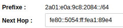
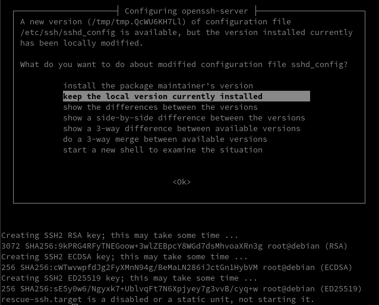
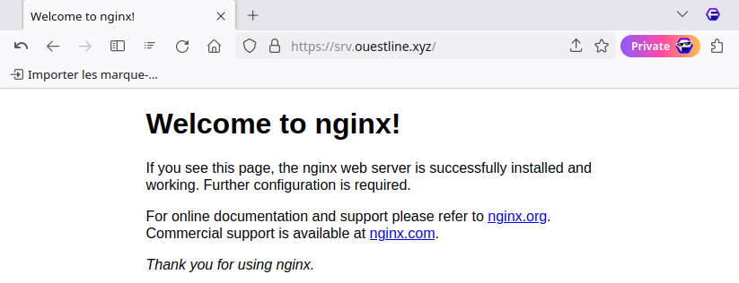

+++
title = 'Image cloud virtuelle Debian 12 dans un environnement KVM Lenovo'
date = 2024-02-20 00:00:00 +0100
categories = virtuel debian
+++
*installer une image virtuelle cloud debian 12 ou iso*  


## KVM debian virtuel vm-srv01 

{:height="50"}  
*Si vous exploitez un nuage privé ou une plateforme de virtualisation fonctionnant avec KVM, comme OpenStack et oVirt. La manière la plus idéale de faire tourner une machine virtuelle Debian 12 est d'utiliser une image de nuage. Dans ce blog, nous vous montrons comment télécharger l'image officielle du nuage Debian 12 et créer une instance de machine virtuelle à partir de celle-ci sur l'hyperviseur KVM.* 

### Image Cloud Debian 12

* **generic** : Doit fonctionner dans n'importe quel environnement
* **genericcloud** : devrait fonctionner dans n'importe quel environnement virtualisé. Il est plus petit que generic car il exclut les pilotes pour le matériel physique.
* **nocloud** : Principalement utile pour tester le processus de construction lui-même. N'a pas installé cloud-init, mais permet à l'utilisateur de se connecter en tant que root sans mot de passe.

Toutes les images de Debian 12 Cloud sont disponibles sur la [page officielle de téléchargement des images d'OS](https://cloud.debian.org/images/cloud/bookworm/latest/). Dans ce guide, nous allons télécharger l'image nocloud qcow2 :

```shell
wget https://cloud.debian.org/images/cloud/bookworm/latest/debian-12-nocloud-amd64.qcow2
```

### Créer machine virtuelle Debian 12

Ensuite, nous créons une machine virtuelle Debian 12 vm-srv01 à partir de notre image du nuage.

Définir la variable nom du vps 

```
export VM_NAME="vm-srv01"
mv debian-12-nocloud-amd64.qcow2 $VM_NAME.qcow2
```

### Redimensionner le disque virtuel

*Redimensionner le disque à la taille souhaitée.*

>Notez que le disque racine que nous avons créé a une petite capacité de disque comme défini dans l'image de nuage par défaut.

Redimensionnons à la taille souhaitée pour le disque racine.


```bash
# 40 GB de disque
export VM_ROOT_DISK_SIZE=40G

# Resize Debian 12 VM disk
qemu-img resize \
  $VM_NAME.qcow2 \
  $VM_ROOT_DISK_SIZE
```

*Image resized.*

Confirmez la taille actuelle avec la commande qemu-img info :

    qemu-img  info $VM_NAME.qcow2

```
image: vm-srv01.qcow2
file format: qcow2
virtual size: 40 GiB (42949672960 bytes)
disk size: 347 MiB
cluster_size: 65536
Format specific information:
    compat: 1.1
    compression type: zlib
    lazy refcounts: false
    refcount bits: 16
    corrupt: false
    extended l2: false
```

Init mot de passe root si image différente  de **nocloud**

    virt-customize -a $VM_NAME.qcow2 --root-password password:debian

Patienter quelques instants...

```
[   0.0] Examining the guest ...
[  30.1] Setting a random seed
[  30.1] Setting passwords
[  31.1] Finishing off
```

### Créer VM avec virt-install

On déplace l'image dans le dossier

    sudo mv vm-srv01.qcow2 /srv/kvm/libvirt/images/

Créez une nouvelle machine virtuelle Debian 12 à l'aide de la commande `virt-install`.  
Nous utilisons le réseau en pont , remplacer `network=default` par `bridge=br0`


```bash
sudo virt-install \
    --memory 4096 \
    --vcpus 2 \
    --name $VM_NAME \
    --disk /srv/kvm/libvirt/images/$VM_NAME.qcow2,device=disk,bus=virtio,format=qcow2 \
    --os-variant debiantesting \
    --network bridge=br0 \
    --virt-type kvm \
    --graphics none \
    --boot uefi \
    --import
```

La sortie du mode console: `Ctrl+Altgr ]`  
A la fin de l'installation, on arrive sur le login (en mode console) :  
Saisir "root" sans mot de passe  

```
[...]
Debian GNU/Linux 12 localhost ttyS0

localhost login: 
```

Mise à jour

```shell
apt update && apt upgrade
reboot # si des mises à jour ont été effectuées
```

### Réseau Ip V4 V6

*netplan est utilisé comme gestionnaire réseau avec l'image debian cloud*

Les périphériques du réseau

    ip link show

```
1: lo: <LOOPBACK,UP,LOWER_UP> mtu 65536 qdisc noqueue state UNKNOWN mode DEFAULT group default qlen 1000
    link/loopback 00:00:00:00:00:00 brd 00:00:00:00:00:00
2: enp1s0: <BROADCAST,MULTICAST,UP,LOWER_UP> mtu 1500 qdisc fq_codel state UP mode DEFAULT group default qlen 1000
    link/ether 52:54:00:a1:89:e4 brd ff:ff:ff:ff:ff:ff
```

*[Netplan](https://netplan.io/) est un utilitaire qui permet de configurer facilement le réseau sous Linux.*

* [Gestion du réseau Linux avec Netplan](https://linux.goffinet.org/administration/configuration-du-reseau/gestion-du-reseau-linux-avec-netplan/)
* [How to configure IPv6 with Netplan](https://www.snel.com/support/how-to-configure-ipv6-with-netplan-on-ubuntu-18-04/)

Les fichiers de configuration sont dans le dossier `/etc/netplan`

```
90-default.yaml
```

On retire les fichiers de configuration originaux 

```
mkdir /etc/backup.netplan
mv /etc/netplan/* /etc/backup.netplan/
```

On propose cette configuration statique de l’interface **enp1s0**

```
bash -c 'cat << EOF > /etc/netplan/01-enp1s0.yaml
network:
  version: 2
  renderer: networkd
  ethernets:
    enp1s0:
      addresses:
        - 192.168.0.226/24
        - 2a01:e0a:9c8:2084::1/48
      nameservers:
        addresses:
        - 1.1.1.1
        - 9.9.9.9
        - 2606:4700:4700::1111
        - 2606:4700:4700::1001
        search: []
      routes:
      - to: default
        via: 192.168.0.254
      - to: "::/0"
        via: fe80::8e97:eaff:fe39:66d6
EOF'
```

Droits

    chmod 600 /etc/netplan/01-enp1s0.yaml

Et on génère la configuration pour l’appliquer auprès du gestionnaire 

```
netplan generate
netplan apply
```

`Cannot call openvswitch: ovsdb-server.service is not running`  
Il s'agit juste d'un avertissement...

Pour vérification 

    ip a

```
1: lo: <LOOPBACK,UP,LOWER_UP> mtu 65536 qdisc noqueue state UNKNOWN group default qlen 1000
    link/loopback 00:00:00:00:00:00 brd 00:00:00:00:00:00
    inet 127.0.0.1/8 scope host lo
       valid_lft forever preferred_lft forever
    inet6 ::1/128 scope host noprefixroute 
       valid_lft forever preferred_lft forever
2: enp1s0: <BROADCAST,MULTICAST,UP,LOWER_UP> mtu 1500 qdisc fq_codel state UP group default qlen 1000
    link/ether 52:54:00:a1:89:e4 brd ff:ff:ff:ff:ff:ff
    inet 192.168.0.226/24 brd 192.168.0.255 scope global enp1s0
       valid_lft forever preferred_lft forever
    inet6 2a01:e0a:9c8:2080:5054:ff:fea1:89e4/64 scope global dynamic mngtmpaddr noprefixroute 
       valid_lft 86392sec preferred_lft 86392sec
    inet6 2a01:e0a:9c8:2084::1/48 scope global 
       valid_lft forever preferred_lft forever
    inet6 fe80::5054:ff:fea1:89e4/64 scope link 
       valid_lft forever preferred_lft forever
```

Si on veut un accès externe à l'adresse IPV6 2a01:e0a:9c8:2084::1 , il faut créer un nexthop sur la freebox
avec `fe80::5054:ff:fea1:89e4`  


### Modifier hostname

    hostnamectl set-hostname vm-srv01
    hostnamectl

```
 Static hostname: vm-srv01
       Icon name: computer-vm
         Chassis: vm 🖴
      Machine ID: 17ed1167baf447b1b8bcf0d133611aab
         Boot ID: d9c24def0c1e4af9a4a00d98bc45193d
  Virtualization: kvm
Operating System: Debian GNU/Linux 12 (bookworm)  
          Kernel: Linux 6.1.0-18-amd64
    Architecture: x86-64
 Hardware Vendor: QEMU
  Hardware Model: Standard PC _Q35 + ICH9, 2009_
Firmware Version: 0.0.0
```

Ajout ip au fichier hosts

    nano /etc/hosts

```
127.0.0.1       localhost vm-srv01
```

### Créer un utilisateur

Après s'être connecté en tant qu'utilisateur root, créer le premier utilisateur (mp uservm49) 

    useradd -m -d /home/uservm -s /bin/bash -c "vm-srv01 Owner" -U uservm

Mot de passe uservm: uservm49

    passwd uservm

Ajout à sudoers

    echo "uservm     ALL=(ALL) NOPASSWD: ALL" >> /etc/sudoers.d/uservm

### Reconfigurer les clés openssh

Par défaut openssh ne fonctionne pas

```
[FAILED] Failed to start ssh.servic…[0m - OpenBSD Secure Shell server.
```

Il faut regénérer les clés

    dpkg-reconfigure openssh-server

{:width=500}


**SSH**  
Il faut activer authentification mot de passe

    nano /etc/ssh/sshd_config

```
# To disable tunneled clear text passwords, change to no here!
PasswordAuthentication yes
#PermitEmptyPasswords no
```

Relancer

    systemctl restart sshd

### Sortie console

Mot de passe root : root49

Sortir du mode console par `poweroff` en mode su  

```
Création de domaine terminée.
Vous pouvez redémarrer votre domaine en exécutant :
  virsh --connect qemu:///system start vm-srv01
```

Démarrer la vm et positionner le démarrage auto

```shell
sudo virsh --connect qemu:///system start vm-srv01
sudo virsh autostart vm-srv01  # Domain 'vm-srv01' marked as autostarted
```

Se connecter ssh

    ssh uservm@192.168.0.226

### OpenSSH, clé et script

{:width="70"}  
**connexion avec clé**  
<u>sur l'ordinateur de bureau</u>  
Générer une paire de clé curve25519-sha256 (ECDH avec Curve25519 et SHA2) pour une liaison SSH avec le serveur.  

    ssh-keygen -t ed25519 -o -a 100 -f ~/.ssh/vm-srv01

Envoyer les clés publiques sur le serveur KVM   

    ssh-copy-id -i ~/.ssh/vm-srv01.pub uservm@192.168.0.226

<u>sur le serveur KVM</u>
On se connecte  

    ssh uservm@192.168.0.226

Modifier la configuration serveur SSH  

    sudo nano /etc/ssh/sshd_config

Modifier

```conf
Port = 55226
PasswordAuthentication no
```

Relancer le serveur

    sudo systemctl restart sshd

Test connexion

    ssh -p 55226 -i ~/.ssh/vm-srv01 uservm@192.168.0.226

### Utilitaires

Installer utilitaires  

    sudo apt update && sudo apt install rsync curl tmux jq figlet git

Effacer et créer motd

    sudo rm /etc/motd && sudo nano /etc/motd

```
                                              ____  ___             
 _   __ ____ ___          _____ _____ _   __ / __ \<  /             
| | / // __ `__ \ ______ / ___// ___/| | / // / / // /              
| |/ // / / / / //_____/(__  )/ /    | |/ // /_/ // /               
|___//_/ /_/ /_/       /____//_/     |___/ \____//_/                
   ___ ____  ___      ___ _____  ____     ____     ___   ___   _____
  <  // __ \|__ \    <  // ___/ ( __ )   / __ \   |__ \ |__ \ / ___/
  / // /_/ /__/ /    / // __ \ / __  |  / / / /   __/ / __/ // __ \ 
 / / \__, // __/ _  / // /_/ // /_/ /_ / /_/ /_  / __/ / __// /_/ / 
/_/ /____//____/(_)/_/ \____/ \____/(_)\____/(_)/____//____/\____/  
```

### Historique de la ligne de commande  

Ajoutez la recherche d’historique de la ligne de commande au terminal  
Se connecter en utilisateur  
Tapez un début de commande précédent, puis utilisez shift + up (flèche haut) pour rechercher l’historique filtré avec le début de la commande.

```shell
# Global, tout utilisateur
echo '"\e[1;2A": history-search-backward' | sudo tee -a /etc/inputrc
echo '"\e[1;2B": history-search-forward' | sudo tee -a /etc/inputrc
```

### Redimensionner la partition racine vda1

La partition virtuelle est 40Go mais en réalité la partition 1 ne fait que 1.9Go  

```
$ lsblk
NAME    MAJ:MIN RM  SIZE RO TYPE MOUNTPOINTS
vda     254:0    0   40G  0 disk 
├─vda1  254:1    0  1.9G  0 part /
├─vda14 254:14   0    3M  0 part 
└─vda15 254:15   0  124M  0 part /boot/efi
```

Redimensionner la partition 1 du disque à chaud  
Noter le secteur de départ de la partition concernée : 262144

On détruit la partition puis on en crée une nouvelle, en précisant point de départ à partir du secteur 262144

    sudo fdisk /dev/vda

```
Command (m for help): d
Partition number (1,14,15, default 15): 1

Partition 1 has been deleted.

Command (m for help): n
Partition number (1-13,16-128, default 1): 
First sector (262144-83886046, default 262144): 
Last sector, +/-sectors or +/-size{K,M,G,T,P} (262144-83886046, default 83884031): 

Created a new partition 1 of type 'Linux filesystem' and of size 39.9 GiB.
Partition #1 contains a ext4 signature.

Do you want to remove the signature? [Y]es/[N]o: N

Command (m for help): w

The partition table has been altered.
Syncing disks.
```

Redémarrer la machine

    sudo systemctl reboot

après le redémarrage et connexion via ssh, on va informer le système de fichier de ce changement de taille 

    sudo resize2fs /dev/vda1

Redémarrer une dernière fois la machine

    sudo systemctl reboot

vérifier

```
$ lsblk
NAME    MAJ:MIN RM  SIZE RO TYPE MOUNTPOINTS
vda     254:0    0   40G  0 disk 
├─vda1  254:1    0 39.9G  0 part /
├─vda14 254:14   0    3M  0 part 
└─vda15 254:15   0  124M  0 part /boot/efi
```

### Client NFS

Installez le paquetage du client NFS 

```shell
sudo apt install nfs-common # debian
```

Créez le(s) répertoire(s) de montage cible

    sudo mkdir -p /mnt/sharenfs

Pour monter le serveur NFS de manière permanente, nous pouvons éditer le fichier /etc/fstab.

    sudo nano /etc/fstab

Ajoutez la ligne suivante au fichier :

    192.168.0.215:/ /mnt/sharenfs nfs4 x-systemd.after=network-online.target,soft,timeo=100,rsize=8192,wsize=8192

Rechargez le gestionnaire systemd et montez tous les systèmes de fichiers dans le fichier /etc/fstab

    sudo systemctl daemon-reload
    sudo mount -a

Vérifiez les systèmes de fichiers montés à l’aide de la commande df

    df -h

Vous devriez voir que le serveur NFS est monté

    192.168.0.215:/                147G     48G   92G  35% /mnt/sharenfs

### DNS

DNS OVH domaine ouestline.xyz

```
$TTL 3600
@	IN SOA dns111.ovh.net. tech.ovh.net. (2024020800 86400 3600 3600000 300)
        IN NS     ns111.ovh.net.
        IN NS     dns111.ovh.net.
        IN AAAA     2a01:e0a:9c8:2083::1
dev     IN AAAA     2a01:e0a:9c8:2083::1
dice    IN AAAA     2a01:e0a:9c8:2083::1
osm     IN AAAA     2a01:e0a:9c8:2083::1
static  IN AAAA     2a01:e0a:9c8:2083::1
tst     IN AAAA     2a01:e0a:9c8:2083::1
srv     IN AAAA     2a01:e0a:9c8:2084::1
only    IN AAAA     2a01:e0a:9c8:2084::1
```

###  Certificat SSL

Les domaines srv.ouestline.xyz et only.ouestline.xyz sont concernés pour les certificats  

Installer cron

    sudo apt install cron

[Serveur , installer et renouveler les certificats SSL Let's encrypt via Acme](/posts/Acme-Certficats-Serveurs/)

Générer les certificats

```
acme.sh --dns dns_ovh --server letsencrypt --issue --keylength ec-384 -d 'srv.ouestline.xyz' -d 'only.ouestline.xyz'
```

Résultat

```
[Mon Feb 12 10:20:11 UTC 2024] Your cert is in: /home/uservm/.acme.sh/srv.ouestline.xyz_ecc/srv.ouestline.xyz.cer
[Mon Feb 12 10:20:11 UTC 2024] Your cert key is in: /home/uservm/.acme.sh/srv.ouestline.xyz_ecc/srv.ouestline.xyz.key
[Mon Feb 12 10:20:11 UTC 2024] The intermediate CA cert is in: /home/uservm/.acme.sh/srv.ouestline.xyz_ecc/ca.cer
[Mon Feb 12 10:20:11 UTC 2024] And the full chain certs is there: /home/uservm/.acme.sh/srv.ouestline.xyz_ecc/fullchain.cer
```

Installation des certificats

```shell
sudo mkdir -p /etc/ssl/private/
sudo chown $USER -R /etc/ssl/private/
acme.sh --ecc --install-cert -d srv.ouestline.xyz --key-file /etc/ssl/private/srv.ouestline.xyz-key.pem --fullchain-file /etc/ssl/private/srv.ouestline.xyz-fullchain.pem
```

### nginx-extras

Installer nginx-extras

    sudo apt install nginx-extras

On supprime le fichier de configuration par défaut

    sudo rm /etc/nginx/sites-enabled/default

Création fichier de configuration srv.ouestline.xyz

    sudo nano /etc/nginx/conf.d/srv.ouestline.xyz.conf

```
server {
    listen 80;
    listen [::]:80;
    server_name srv.ouestline.xyz;
    # enforce https
    return 301 https://$server_name:443$request_uri;
}

server {
    listen 443 ssl http2;
    listen [::]:443 ssl http2;
    server_name srv.ouestline.xyz;
    root /var/www/;
    
    ssl_certificate /etc/ssl/private/srv.ouestline.xyz-fullchain.pem;
    ssl_certificate_key /etc/ssl/private/srv.ouestline.xyz-key.pem;
    ssl_session_timeout 1d;
    ssl_session_cache shared:MozSSL:10m;  # about 40000 sessions
    ssl_session_tickets off;

    # modern configuration
    ssl_protocols TLSv1.3;
    ssl_prefer_server_ciphers off;

    # HSTS (ngx_http_headers_module is required) (63072000 seconds)
    add_header Strict-Transport-Security "max-age=63072000" always;

    # OCSP stapling
    ssl_stapling on;
    ssl_stapling_verify on;

    # verify chain of trust of OCSP response using Root CA and Intermediate certs
    ssl_trusted_certificate /etc/ssl/private/srv.ouestline.xyz-fullchain.pem;

    # replace with the IP address of your resolver
    resolver 1.1.1.1 9.9.9.9 valid=300s;
    resolver_timeout 5s;
    
  location / {
      index index/ index.nginx-debian/;
  }
}
```

Vérification et rechargement

    sudo nginx -t
    sudo systemctl reload nginx

La page <https://srv.ouestline.xyz>  


### Parefeu

Parefeu ufw

    sudo apt install ufw -y

Les régles

```
sudo ufw allow 55226/tcp  # port SSH
sudo ufw allow https      # port 443
```

Activation

    sudo ufw enable

### Redimensionner image disque qcow2

[How to resize a qcow2 disk image on Linux](https://linuxconfig.org/how-to-resize-a-qcow2-disk-image-on-linux)

Pour installer **OnlyOffice Docs**, il faut un disque de 50Go minimun, actuellement il ne fait que 40Go

En mode su

Informations sur le disque virtuel

    qemu-img info  /srv/kvm/libvirt/images/vm-srv02.qcow2 

```
image: /srv/kvm/libvirt/images/vm-srv02.qcow2
file format: qcow2
virtual size: 40 GiB (42949672960 bytes)
disk size: 1.58 GiB
cluster_size: 65536
Format specific information:
    compat: 1.1
    compression type: zlib
    lazy refcounts: true
    refcount bits: 16
    corrupt: false
    extended l2: false
```

Augmenter taille

```shell
cd /srv/kvm/libvirt/images/
cp vm-srv02.qcow2 vm-srv01.qcow2 

qemu-img resize vm-srv01.qcow2 +20G

```

Vérification

    qemu-img info vm-srv01.qcow2 

```
image: vm-srv01.qcow2
file format: qcow2
virtual size: 60 GiB (64424509440 bytes)
disk size: 1.58 GiB
cluster_size: 65536
Format specific information:
    compat: 1.1
    compression type: zlib
    lazy refcounts: true
    refcount bits: 16
    corrupt: false
    extended l2: false
```

## KVM debian virtuel via iso

### Debian 12 srv01

Création de plusieurs images virtuelles debian à partir d'un fichier iso

```
sudo virt-install \
    --name srv01 \
    --memory 2048 \
    --disk /srv/kvm/libvirt/images/srv01.qcow2,size=20 \
    --vcpus 1 \
    --os-variant debiantesting \
    --network bridge=br0 \
    --graphics none \
    --console pty,target_type=serial \
    --location /srv/kvm/libvirt/boot/debian-12.5.0-amd64-netinst.iso \
    --extra-args 'console=ttyS0,115200n8 serial' \
    --boot uefi
```

Installation de type LVM  

* root rootsrv01  
* usersrv01 usersrv0149
* ssh
* standard system utilities

### Cloner srv01 en srv02

Arrêter la vm

    sudo virsh shutdown srv01

Cloner

    sudo virt-clone --original srv01 --name srv02 --file /srv/kvm/libvirt/images/srv02.qcow2

Vérification

    sudo virsh list --all

```
 ID   Nom           État
------------------------------------------
 1    AlpineOuest   en cours d’exécution
 -    srv01         fermé
 -    srv02         fermé
```

