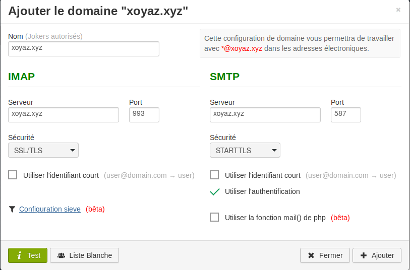
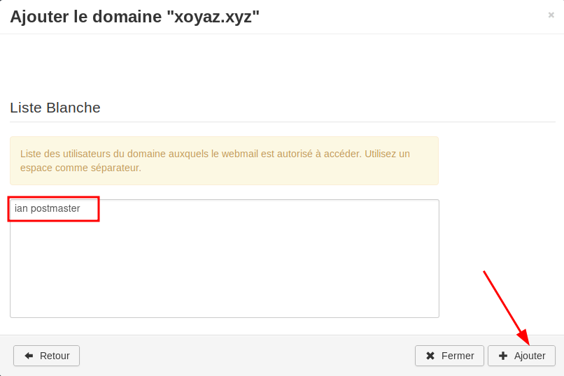
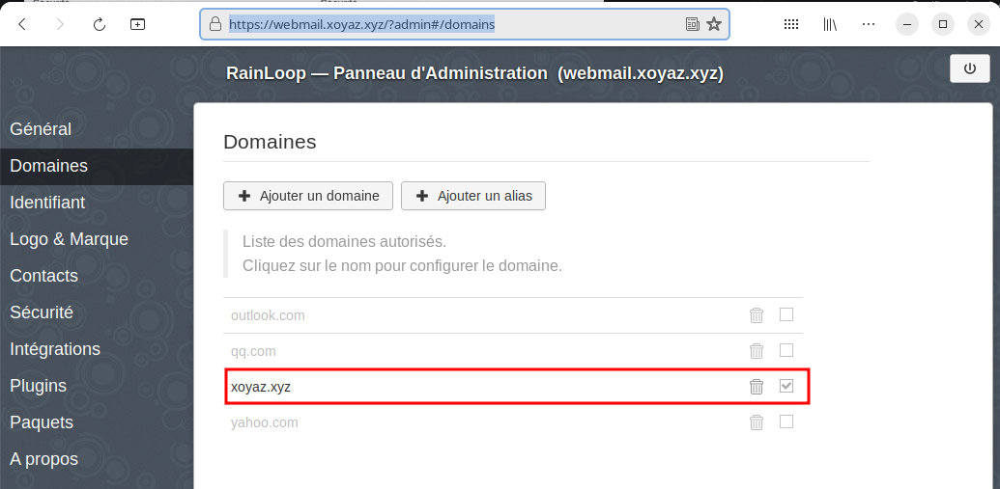
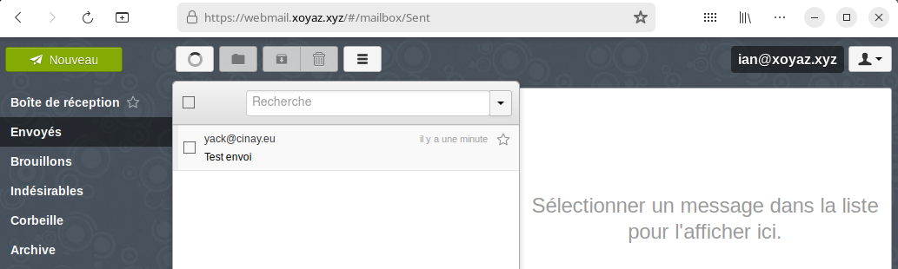
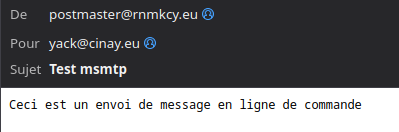
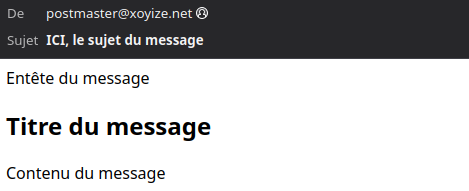

+++
title = 'Serveur de messagerie IMAP SMTP'
date = 2024-02-28 00:00:00 +0100
categories = ['messagerie']
+++
*Maddy Mail Server met en œuvre toutes les fonctionnalités requises pour faire fonctionner un serveur de courrier électronique. Il peut envoyer des messages via SMTP (fonctionne comme MTA), accepter des messages via SMTP (fonctionne comme MX) et stocker des messages tout en y donnant accès via IMAP. En outre, il met en œuvre des protocoles auxiliaires qui sont obligatoires pour assurer une sécurité raisonnable du courrier électronique (DKIM, SPF, DMARC, DANE, MTA-STS).  
Il remplace Postfix, Dovecot, OpenDKIM, OpenSPF, OpenDMARC et d'autres encore par un seul démon avec une configuration uniforme et un coût de maintenance minimal.*


## Maddy Mail Server

* [Comparaison des serveurs de messagerie](https://forwardemail.net/fr/blog/open-source/alpine-linux-email-server#email-server-comparison)
* [Maddy mail server](https://maddy.email/tutorials/setting-up/)
* [Comment installer un serveur de mails sur votre offre VPS ?](https://forum.inovaperf.fr/d/288-comment-installer-un-serveur-de-mails-sur-votre-offre-vps)

{:height="100"}

### Installation

*Mise en place un serveur de messagerie utilisant maddy pour un usage personnel.*


Prérequis :

* VPS TIME4VPS Debian 12 (Vérifier que le fournisseur ne bloque pas le trafic SMTP port TCP 25)
    * Protection DNS contre le transfert
    * DNSSEC activé
* Domaine : xoyaz.xyz
* Adresse IPv4 : 195.181.242.156
* Adresse IPv6 : 2a02:7b40:c3b5:f29c::1
* Reverse DNS IPV4 IPV6

Utilisation image préconstruite (Linux, amd64)

Disponible sur [GitHub](https://github.com/foxcpp/maddy/releases) ou [maddy.email/builds](https://maddy.email/builds/).

Archive au format zst, installer l'outil si besoin (installé par défaut sur debian 12): `sudo apt install zstd`

```bash
# Téléchargement
wget https://github.com/foxcpp/maddy/releases/download/v0.7.0/maddy-0.7.0-x86_64-linux-musl.tar.zst
# décompression
tar -I zstd -xvf maddy-0.7.0-x86_64-linux-musl.tar.zst
```

Contenu archive

```
./maddy-0.7.0-x86_64-linux-musl/
./maddy-0.7.0-x86_64-linux-musl/maddy.conf
./maddy-0.7.0-x86_64-linux-musl/maddy
./maddy-0.7.0-x86_64-linux-musl/systemd/
./maddy-0.7.0-x86_64-linux-musl/systemd/maddy.service
./maddy-0.7.0-x86_64-linux-musl/systemd/maddy@.service
```

Copier l'exécutable maddy que vous pouvez copier dans /usr/local/bin

    sudo cp maddy-0.7.0-x86_64-linux-musl/maddy /usr/local/bin/

### Configuration du système 

*distribution basée sur systemd*

On a utilisé une archive préconstruite, copiez manuellement `systemd/*.service` dans `/etc/systemd/system`

    sudo cp maddy-0.7.0-x86_64-linux-musl/systemd/*.service /etc/systemd/system/

Vous devez recharger la configuration du gestionnaire de service pour rendre le service disponible 

    sudo systemctl daemon-reload

En outre, vous devez créer l'utilisateur et le groupe maddy (maddy ne s'exécute jamais en tant que root)

    sudo useradd -mrU -s /sbin/nologin -d /var/lib/maddy -c "maddy mail server" maddy

Créer le répertoire et copier le fichier de configuration

    sudo mkdir -p /etc/maddy
    sudo cp maddy-0.7.0-x86_64-linux-musl/maddy.conf /etc/maddy/


### Nom hôte + domaine

Ouvrir `/etc/maddy/maddy.conf` 

* Si vous installez un très petit serveur de messagerie, vous pouvez utiliser xoyaz.xyz dans les deux champs. 
* Cependant, pour faciliter une future migration de service, il est recommandé d'utiliser une entrée DNS séparée à cet effet. Il s'agit généralement de mx1.xoyaz.xyz, mx2, etc. Vous pouvez bien sûr utiliser un autre sous-domaine, par exemple : smtp1.xoyaz.xyz. Un serveur de basculement de courrier électronique sera possible si vous transférez mx2.xoyaz.xyz vers un autre serveur (à condition que vous le configuriez pour gérer votre domaine).

Petit serveur de messagerie

```
$(hostname) = xoyaz.xyz
$(primary_domain) = xoyaz.xyz
```

Si vous souhaitez gérer plusieurs domaines, vous devez toujours en désigner un comme "primaire".  
Ajoutez tous les autres domaines à la ligne `local_domains`  

    $(local_domains) = $(primary_domain) example.com other.example.com

### Certificats TLS

Une chose qui ne peut pas être configurée automatiquement, ce sont les certificats TLS.  

    tls file /etc/maddy/certs/$(hostname)/fullchain.pem /etc/maddy/certs/$(hostname)/privkey.pem

Vous devez vous assurer que maddy peut les lire lorsqu'il tourne en tant qu'utilisateur non privilégié (maddy ne tourne jamais en tant que root, même au démarrage), une façon de le faire est d'utiliser les ACLs (installer acl : `sudo apt install acl`)

    sudo setfacl -R -m g:maddy:rwx /etc/ssl/private/
    sudo setfacl -R -m u:maddy:rx /etc/ssl/private/xoyaz.xyz-fullchain.pem /etc/ssl/private/xoyaz.xyz-key.pem

maddy recharge les certificats TLS à partir du disque une fois par minute, de manière à ce qu'il remarque le renouvellement. Il est possible de forcer le rechargement via `systemctl reload maddy` 

**Let's Encrypt et certbot**  
Si vous utilisez **certbot** pour gérer vos certificats, vous pouvez simplement faire un lien symbolique entre /etc/maddy/certs et /etc/letsencrypt/live. maddy choisira le bon certificat en fonction du domaine que vous avez spécifié lors de l'installation.  
Vous devez toujours rendre les clés lisibles pour maddy

    sudo setfacl -R -m u:maddy:rX /etc/letsencrypt/{live,archive}

**ACME.sh**  
Si vous utilisez **acme.sh** pour gérer vos certificats, vous pouvez simplement exécuter

```
mkdir -p /etc/maddy/certs/xoyaz.xyz
acme.sh --force --install-cert -d xoyaz.xyz \
  --key-file       /etc/maddy/certs/xoyaz.xyz/privkey.pem  \
  --fullchain-file /etc/maddy/certs/xoyaz.xyz/fullchain.pem
```

`Problème de lecture des certificats par le daemon maddy, malgré l'utilisation des ACL !!!`{: .prompt-warning }

`+ problème de renouvellement des certificats car aucun shell ne peut être exécuté !!!`{: .prompt-warning }


La solution, copier les certificats dans un répertoire accessible par maddy après renouvellement qui s'effectue 7 jours avant l'échéance  
Création bash `$HOME/expiration_certificat.sh` 


```shell
#!/bin/bash

# Domaine
_domain="xoyaz.xyz"
# Test expiration certificats
PEM="/etc/ssl/private/$_domain-fullchain.pem"
# 7 days in seconds 
DAYS="604800" 
# Email settings 
_sub="$PEM will expire within $DAYS (7 days)."
_from="ian@$_domain"
_to="vps@cinay.eu"
_openssl="/usr/bin/openssl"
$_openssl x509 -enddate -noout -in "$PEM"  -checkend "$DAYS" | grep -q 'Certificate will expire'

if [ $? -eq 0 -o ! -z "$1" ] 
then
  # certificat expire dans 7 jours , on renouvelle
  echo "Force renouvellement des certificats Lets Encrypt"
  "$HOME/.acme.sh"/acme.sh --force --cron --home "$HOME/.acme.sh" --renew-hook "$HOME/.acme.sh/acme.sh --ecc --install-cert -d '$_domain' --key-file /etc/ssl/private/$_domain-key.pem --fullchain-file /etc/ssl/private/$_domain-fullchain.pem"
  #	
  echo "Recharge service nginx"
  sudo systemctl reload nginx
  #
  echo "Mise à niveau des certificats maddy"
  sudo cp /etc/ssl/private/$_domain-fullchain.pem /etc/maddy/certs/$_domain/fullchain.pem
  sudo cp /etc/ssl/private/$_domain-key.pem /etc/maddy/certs/$_domain/privkey.pem
  sudo chown maddy:maddy -R /etc/maddy/certs
  echo "Recharge service maddy"
  sudo systemctl reload maddy
  #
  # Envoi message
  mail -s "Domaine $_domain" -r "$_from" "$_to" <<< "Le certificat TLS/SSL ($PEM) a été renouvellé sur $_domain [$(date)]"
 else
  echo "Certificat Valide"	
fi
```

Le rendre exécutable : `chmod +x$HOME/expiration_certificat.sh`

Créer le job  

    crontab -e

```
30 0 * * * "$HOME/expiration_certificat.sh" > /dev/null
```

### Première exécution

Arrêter et désactiver postfix

    sudo systemctl stop postfix && sudo systemctl disable postfix

lancer et activer maddy

    sudo systemctl enable maddy --now 

Le démon devrait fonctionner maintenant, sauf qu'il est inutile car nous n'avons pas configuré les enregistrements DNS.

### Enregistrements DNS

La façon dont il est configuré dépend de votre fournisseur DNS (ou de votre serveur, si vous utilisez le vôtre). Voici à quoi devrait ressembler votre zone DNS 

```
; Basic domain->IP records, you probably already have them.
xoyaz.xyz.   A     195.181.242.156
xoyaz.xyz.   AAAA  2a02:7b40:c3b5:f29c::1

; It says that "server xoyaz.xyz is handling messages for xoyaz.xyz".
xoyaz.xyz.   MX    10 xoyaz.xyz.

; Use SPF to say that the servers in "MX" above are allowed to send email
; for this domain, and nobody else.
xoyaz.xyz.     TXT   "v=spf1 mx ~all"
```

#### DKIM

*L’enregistrement DKIM est un enregistrement TXT modifié qui ajoute des signatures cryptographiques à vos messages électroniques. Vous ajoutez un enregistrement DKIM à votre système de nom de domaine (DNS), et il contient la cryptographie à clé publique utilisée par le serveur de messagerie récepteur pour authentifier un message.* 

Et la dernière, la clé DKIM, est un peu délicate. maddy a généré une clé pour vous lors du premier démarrage.  
Vous pouvez la trouver dans `/var/lib/maddy/dkim_keys/xoyaz.xyz_default.dns`  
Vous devez la mettre dans un enregistrement TXT pour le domaine default._domainkey.xoyaz.xyz

```
default._domainkey IN TXT "v=DKIM1;k=rsa;p=MIIBIjANBgkqZuislR85jSpyVpe1jjvnNI8nf8GRPM0RR9uEPQIDAQAB;"
```

#### DMARC

Une politique DMARC détermine ce qu'il advient d'un message électronique après sa vérification par rapport aux enregistrements SPF et DKIM. Un e-mail passe ou échoue à SPF et DKIM. La politique DMARC détermine si l'échec entraîne le marquage de l'e-mail comme spam, son blocage ou sa remise au destinataire prévu. (Les serveurs de messagerie peuvent toujours marquer les e-mails comme spam s'il n'y a pas d'enregistrement DMARC, mais DMARC fournit des instructions plus claires sur le moment de le faire).

La politique de domaine de xoyaz.xyz pourrait être :

*Si un e-mail échoue aux tests DKIM et SPF, marquez-le comme spam.*

Ces politiques ne sont pas enregistrées sous forme de phrases lisibles par l'homme, mais plutôt sous forme de commandes lisibles par la machine afin que les services de messagerie puissent les interpréter automatiquement. Cette politique DMARC ressemblerait en fait à ceci :

    v=DMARC1; p=quarantine; adkim=s; aspf=s;

Qu’est-ce que cela signifie ?

*    **v=DMARC1** indique que cet enregistrement TXT contient une politique DMARC et doit être interprété comme tel par les serveurs de messagerie.
*    **p=quarantine** indique que les serveurs de messagerie doivent « mettre en quarantaine » les e-mails qui ne répondent pas aux critères DKIM et SPF, les considérant comme des spams potentiels. Parmi les autres paramètres possibles, citons **p=none**, qui permet aux e-mails qui échouent de passer quand même, et **p=reject**, qui demande aux serveurs de messagerie de bloquer les e-mails qui échouent.
*    **adkim=s** signifie que les vérifications DKIM sont « strictes ». Il est également possible de définir « relaxé » en remplaçant s par r, comme **adkim=r** 
*    **aspf=s** est identique à adkim=s, mais pour SPF.

Notez que aspf et adkim sont des paramètres facultatifs. L'attribut p= indique ce que les serveurs de messagerie doivent faire avec les e-mails qui échouent à SPF et DKIM.
{: .prompt-info }

Si l'administrateur xoyaz.xyz voulait rendre cette politique encore plus stricte et signaler plus fortement aux serveurs de messagerie de considérer les messages non autorisés comme du spam, il ajusterait l'attribut `p=` comme suit :

    v=DMARC1; p=reject; adkim=s; aspf=s;

En substance, cela signifie : *Si un e-mail échoue aux tests DKIM et SPF, ne le remettez pas.*

**Qu'est-ce qu'un rapport DMARC ?**  
Les politiques DMARC peuvent contenir des instructions pour l'envoi de rapports sur les e-mails qui passent ou échouent au test DKIM ou SPF. En général, les administrateurs configurent les rapports pour qu'ils soient envoyés à un service tiers qui les réduit à une forme plus digeste, afin que les administrateurs ne soient pas submergés d'informations. Les rapports DMARC sont extrêmement importants, car ils fournissent aux administrateurs les informations dont ils ont besoin pour décider de l'ajustement de leurs politiques DMARC, par exemple si leurs e-mails légitimes échouent aux tests SPF et DKIM, ou si un spammeur tente d'envoyer des e-mails illégitimes.

L'administrateur de xoyaz.xyz ajouterait la partie **rua** de cette politique pour envoyer ses rapports DMARC à un service tiers (dont l'adresse électronique est « exemple@third-party-example.com ») :

    v=DMARC1; p=reject; adkim=s; aspf=s; rua=mailto:exemple@third-party-example.com;

**Qu'est-ce qu'un enregistrement DMARC ?**  
Un enregistrement DMARC stocke la politique DMARC d'un domaine. Les enregistrements DMARC sont stockés dans le système de noms de domaine (DNS) sous forme d'enregistrements DNS TXT . Un enregistrement DNS TXT peut contenir presque tout le texte qu'un administrateur de domaine souhaite associer à son domaine. L'une des façons d'utiliser les enregistrements DNS TXT est de stocker les politiques DMARC.

(Notez qu'un enregistrement DMARC est un enregistrement DNS TXT qui contient une politique DMARC, et non un type spécialisé d' enregistrement DNS.)

La politique DMARC de xoyaz.xyz pourrait ressembler à ceci :

Nom 	| Type |Contenu 	|TTL
-----|-------|-----|---
_dmarc.xoyaz.xyz |	TXT |	v=DMARC1; p=quarantine; adkim=r; aspf=r; rua=mailto:example@third-party-xoyaz.xyz; |	32600

Dans cet enregistrement TXT, la politique DMARC est contenue dans le champ « Contenu ».

**Politique choisie pour DMARC**

```
; Opt-in into DMARC with permissive policy and request reports about broken
; messages.
_dmarc.xoyaz.xyz.   TXT    "v=DMARC1; p=quarantine; rua=mailto:postmaster@xoyaz.xyz"
```

#### MTA-STS 

Par défaut, le protocole SMTP n'est pas protégé contre les attaques actives. La politique MTA-STS indique aux expéditeurs compatibles de toujours utiliser TLS correctement authentifié lorsqu'ils s'adressent à votre serveur, offrant ainsi un moyen simple à déployer pour protéger votre serveur contre les attaques MitM sur le port 25.

Fondamentalement, vous devez créer un fichier avec le contenu suivant et le rendre disponible sur https://mta-sts.xoyaz.xyz/.well-known/mta-sts.txt

    mkdir -p /var/lib/caddy/.well-known
    nano /var/lib/caddy/.well-known/mta-sts.txt

```
version : STSv1
mode : enforce
max_age : 604800
mx : xoyaz.xyz
```

Note :xoyaz.xyz dans le fichier est votre nom d'hôte MX, dans une configuration simple, il sera le même que votre nom d'hôte example.org. Dans une configuration plus complexe, vous aurez plusieurs serveurs MX - ajoutez-les tous une fois par ligne, comme ceci :

```
mx : mx1.example.org
mx : mx2.example.org
```

Modifier le fichier du serveur caddy en ajoutant ce qui suit au fichier `/etc/caddy/Caddyfile`

```
mta-sts.xoyaz.xyz {
	root * /var/lib/caddy
}
```

**Enregistrement dns MTA-STS**

```
; Mark domain as MTA-STS compatible (see the next section)
; and request reports about failures to be sent to postmaster@xoyaz.xyz
_mta-sts.xoyaz.xyz.   TXT    "v=STSv1; id=1"
_smtp._tls.xoyaz.xyz. TXT    "v=TLSRPTv1;rua=mailto:postmaster@xoyaz.xyz"
```

#### TLSA (DANE)

Il est également recommandé de définir un enregistrement TLSA (DANE). Utilisez <https://www.huque.com/bin/gen_tlsa> pour en générer un.  
Copier/coller le contenu du certificat /etc/maddy/certs/xoyaz.xyz/fullchain.pem, port sur 25, le protocole de transport sur "tcp" et le nom de domaine sur le nom d'hôte MX.  

    _25._tcp.xoyaz.xyz. IN TLSA 3 1 1  ca0f47da273563916af7b2b8e0dced79726ab6fe5a8a873b66d22f64e598401e

Outils de test : 

* [MTA-STS Lookup - Check domains for Inbound Transport Layer Security (TLS) Enforcement - MxToolbox](https://mxtoolbox.com/mta-sts.aspx)
* [Validateur MTA-STS gratuit](https://www.skysnag.com/fr/mta-sts-checker/)

#### DNS complet

```
$TTL 3600
@   IN SOA dns106.ovh.net. tech.ovh.net. (2023122600 86400 3600 3600000 300)
    IN NS     ns106.ovh.net.
    IN NS     dns106.ovh.net.
    IN MX     10 xoyaz.xyz.
    IN A     195.181.242.156
    IN AAAA     2a02:7b40:c3b5:f29c::1
    600 IN TXT     "v=spf1 mx ~all"
    IN CAA     128 issue "letsencrypt.org"
*   IN A     195.181.242.156
*   IN AAAA     2a02:7b40:c3b5:f29c::1
_25._tcp    IN TLSA     3 1 1 ca0f47da273563916af7b2b8e0dced79726ab6fe5a8a873b66d22f64e598401e
_dmarc      IN TXT     "v=DMARC1; p=quarantine; rua=mailto:postmaster@xoyaz.xyz"
_mta-sts    IN TXT     "v=STSv1; id=1"
_smtp._tls  IN TXT     "v=TLSRPTv1;rua=mailto:postmaster@xoyaz.xyz"
default._domainkey    IN TXT     ( "v=DKIM1;k=rsa;p=MIIBIjAuEPQIDAQAB;" )
```

### Comptes utilisateurs 

Un serveur de messagerie est inutile sans boîtes aux lettres, n'est-ce pas ? Contrairement à des logiciels comme postfix et dovecot, maddy utilise par défaut des "utilisateurs virtuels", ce qui signifie qu'il ne se préoccupe pas des utilisateurs du système et n'en a pas connaissance.

Les boîtes aux lettres IMAP ("comptes") et les identifiants d'authentification sont séparés.

Pour enregistrer les informations d'identification d'un utilisateur, utilisez la commande maddy creds create.  
Voici ce qu'il faut faire

    maddy creds create postmaster@xoyaz.xyz

Notez que le nom d'utilisateur est une adresse électronique. Ceci est nécessaire car le nom d'utilisateur est utilisé pour autoriser l'accès IMAP et SMTP (à moins que vous ne configuriez des mappings personnalisés, non décrits ici).

Après avoir enregistré les informations d'identification de l'utilisateur, vous devez également créer un compte de stockage local 

    maddy imap-acct create postmaster@xoyaz.xyz

Voilà, c'est fait. Vous avez maintenant votre première adresse électronique.  
Lorsque vous vous authentifiez avec votre client de messagerie, n'oubliez pas que le nom d'utilisateur est "postmaster@xoyaz.xyz", et pas seulement "postmaster".

L'exécution de `maddy creds --help` et `maddy imap-acct --help` peut s'avérer utile pour connaître les autres commandes.  

Créer l'utilisateur postmaster sans shell ni home

    sudo useradd postmaster

Notez que les comptes IMAP et les identifiants sont gérés séparément, mais que les noms d'utilisateur doivent correspondre par défaut pour que les choses fonctionnent.

### Parefeu

Si un parefeu est utilisé, il faut ouvrir les ports 25,587 et 993

### Webmail

[7 Best Open Source Web-based Email Clients](https://itsfoss.com/open-source-web-based-email-clients/)

En mode su

[Activer PHP dans Caddy](/posts/Caddy_serveur/#activer-php-dans-caddy)

Installer [rainloop](https://www.rainloop.net/docs/installation/)

Téléchargez le paquet, extrayez-en les fichiers et téléchargez-le dans un répertoire destiné à être utilisé par l'application, `/var/lib/caddy/rainloop`

```
# lien pour la dernière version --> https://www.rainloop.net/try-now/
wget https://www.rainloop.net/repository/webmail/rainloop-latest.zip
mkdir -p /var/lib/caddy/rainloop
unzip rainloop-latest.zip -d /var/lib/caddy/rainloop
rm -rf rainloop-latest.zip
```

**Alternative**  
Vous pouvez également déployer la dernière version de l'application sans avoir à gérer d'archive zip, en lançant simplement l'une des commandes suivantes dans votre terminal 

```
curl -sL https://repository.rainloop.net/installer.php | php
# OU
wget -qO- https://repository.rainloop.net/installer.php | php
```

Après avoir téléchargé le contenu du paquet, veillez à configurer les autorisations pour les fichiers et les répertoires.  
Modifiez les permissions pour que le serveur web ait accès au répertoire

```
cd /var/lib/caddy/rainloop
find . -type d -exec chmod 755 {} \;
find . -type f -exec chmod 644 {} \;
chown -R caddy:caddy .
```

C'est tout ce que vous avez à faire pour garantir l'exécution de l'application avec sa configuration par défaut.

Le produit créera tous les fichiers nécessaires lors de la première exécution et signalera une erreur si l'une des conditions n'est pas remplie.

Modifier le fichier de configuration caddy /etc/caddy/Caddyfile

```
webmail.xoyaz.xyz {
    root * /var/lib/caddy/rainloop
    encode gzip zstd
    php_fastcgi unix//run/php/php8.2-fpm.sock
    file_server
}
```

Redémarrer le service Caddy

    systemctl reload caddy

Configurer rainloop https://webmail.xoyaz.xyz/?admin  
Par défaut les identifiants sont : admin et 12345

Une fois connecté à l’interface d’administration, changer le mot de passe admin en cliquant sur le lien **change**  
Pour changer le language ,dans le menu de gauche cliquez sur **General**  
Vous devez ajouter un nouveau domaine. Dans le menu de gauche cliquez sur **Domaines** puis sur **+**  
Ajouter un domaine. Une nouvelle fenêtre s’ouvre et vous demande de configurer IMAP et SMTP pour ce domaine.  
{:width="400"}  
Cliquer sur **i test** qui doit passer au vert

Ajouter tous les utilisateurs du domaine autorisés à se connecter dans **Liste Blanche** (bouton en bas), les utilisateurs sont séparés par des espaces  
{:width="400"}  

{:width="400"}  
Supprimer gmail.com dans Domaines

Connectez-vous à votre boîte mail via le formulaire principal https://webmail.xoyaz.xyz , utilisateur **ian**  

**Test en réception**  
{:width="400"}  

**Test en émission**  
{:width="400"}  

### msmtp

*Configuration de tout ce qui est nécessaire pour envoyer des courriels depuis le terminal. Nous utiliserons __msmtp__, un client SMTP léger.  
Nous allons également voir comment stocker les identifiants pour le compte de messagerie dans le clavier système.  
comment configurer divers utilitaires en ligne de commande afin qu'ils utilisent automatiquement msmtp pour envoyer des emails  
nous ferons de msmtp l'expéditeur de courriel par défaut, pour éviter de configurer ces utilitaires un par un.
([Send emails from your terminal with msmtp](https://arnaudr.io/2020/08/24/send-emails-from-your-terminal-with-msmtp/))*  

Installation

    sudo apt install msmtp

Essayons d'envoyer un mail. À ce stade, nous n'avons pas encore créé de fichier de configuration pour msmtp, nous devons donc fournir tous les détails sur la ligne de commande.

Ecrire un message dans un fichier texte

```shell
cat << EOF > message.txt
From: postmaster@rnmkcy.eu
To: yack@cinay.eu
Subject: Test msmtp

Ceci est un envoi de message en ligne de commande
EOF
```

Envoyer le message

```shell
cat message.txt | msmtp \
    --auth=on --tls=on \
    --host rnmkcy.eu \
    --port 587 \
    --user postmaster@rnmkcy.eu \
    --read-envelope-from \
    --read-recipients
```

mot de passe pour postmaster@rnmkcy.eu à rnmkcy.eu :

{:width="400"}  

Dans le fichier message.txt, nous avons fourni de: (l'adresse électronique de la personne qui envoie le courriel) et à: (l'adresse électronique de destination). Nous avons ensuite demandé à msmtp de réutiliser ces valeurs pour définir l'enveloppe de l'email avec `--read-envelope-from` et `--read-cepients`.

Et les autres paramètres ?

* `--auth=on` parce que nous voulons authentifier avec le serveur.
* `--tls=on` parce que nous voulons nous assurer que la communication avec le serveur est cryptée.
* `--host` et `--port` indique où trouver le serveur.
* `--user` est évidemment votre nom d'utilisateur.

Écrire un fichier de configuration

msmtp prend en charge deux emplacements : ~/.msmtprc et ~/.config/msmtp/config, nous utiliserons ~/.msmtprc 

Créer la configuration

```shell
cat << 'EOF' > ~/.msmtprc
defaults
tls on

account rnmkcy
auth on
host rnmkcy.eu
port 587
user postmaster@rnmkcy.eu
from postmaster@rnmkcy.eu

account default : rnmkcy
EOF
```

Envoyer un message

    msmtp -t < message.txt
    mot de passe pour postmaster@rnmkcy.eu à rnmkcy.eu :

Ajouter le mot de passe dans un fichier `~/.msmtprc`

```
password xxxxxxxxxxxxxxxxxxxx
```

Modifier les droits du fichier

    chmod 600 ~/.msmtprc

Nous pouvons utiliser un éditeur de texte comme nano pour introduire un nouvel alias dans le fichier /etc/aliases:

    sudo nano /etc/aliases

```
# Send root to Jane
root: vps@cinay.eu
   
# Send everything else to admin
default: yako@xoyize.xyz
```

Lors de l'enregistrement, tout email adressé à l'alias postmaster devrait maintenant aller à la racine de l'utilisateur local.  
Cependant, cela ne se produit pas à moins que nous mettions à jour la base de données alias system=s:

    sudo newaliases

La commande newaliases lit le fichier /etc/aliases et génère une nouvelle base de données alias. Cette base de données est l'endroit où le MTA recherche des alias lors du traitement des courriels entrants.

Test

    echo -e "Subject: Regards\n\nSending regards from Terminal." | msmtp -a rnmkcy yanfi@yanfi.net

Envoi/

    nano sample/

``/
From: postmaster@rnmkcy.eu
To: yack@cinay.eu
Subject: This is the Subject
Mime-Version: 1.0
Content-Type: text/

/>
  <head>This is Email Head</head>
  <body>
    <h2>This is the Main Title</h2>
    <p>This is the body text</p> 
  </body>
</>
```

Envoi

    cat sample/ | msmtp yack@cinay.eu

{:width="400"}  

Ici, la commande `cat` affiche le contenu du fichier sample/, puis nous sommes en train de passer le résultat à la commande `msmtp`.

Nous utilisons `Content-Type` comme en-tête `MIME` afin que le fichier soit traité comme un fichier HTML. Nous devons noter que nous devons spécifier les informations d'en-tête d'email dans le fichier HTML pour le traiter avec msmtp.

### Conclusion

`Le serveur de messagerie IMAP/SMTP xoyaz.xyz est entièrement opérationnel`{: .prompt-tip }
